# Boost.Coroutine to C++20 Standard Coroutines Migration Plan

> **Status:** Implementation Complete
> **Author:** Pratik Mankawde
> **Created:** 2026-02-25
> **Project:** rippled (XRP Ledger node)
> **Branch:** `Switch-to-std-coroutines`
> **Dependencies:** C++20 compiler support (GCC 12+, Clang 16+, MSVC 19.28+)

---

## Table of Contents

1. [What Is This?](#1-what-is-this)
2. [Why Is This Needed?](#2-why-is-this-needed)
3. [Actors, Actions & High-Level Flow](#3-actors-actions--high-level-flow)
4. [Research & Analysis](#4-research--analysis)
5. [Current State Assessment](#5-current-state-assessment)
6. [Migration Strategy](#6-migration-strategy)
7. [Implementation Plan](#7-implementation-plan)
8. [Testing & Validation Strategy](#8-testing--validation-strategy)
9. [Risks & Mitigation](#9-risks--mitigation)
10. [Timeline & Milestones](#10-timeline--milestones)
11. [Standards & Guidelines](#11-standards--guidelines)
12. [Task List](#12-task-list)
13. [FAQ](#13-faq)
14. [Glossary](#14-glossary)

---

## 1. What Is This?

This document describes the plan for migrating rippled's coroutine implementation from **Boost.Coroutine2** (a third-party C++ library that provides stackful coroutines) to **C++20 standard coroutines** (a language-native stackless coroutine facility built into modern C++ compilers).

Coroutines in rippled are used to handle long-running RPC requests — such as pathfinding — without blocking server threads. When a request needs to wait for an external event, the coroutine **suspends** (freeing the thread for other work) and **resumes** later when the event completes.

---

## 2. Why Is This Needed?

- **Memory waste** — Each Boost coroutine allocates a **1.5 MB stack**, even though rippled's coroutines use only a few hundred bytes. With C++20, each coroutine frame is ~200–500 bytes — a **~3000x reduction**.
- **Deprecated dependency** — Boost.Coroutine (v1) is deprecated; Boost.Coroutine2 is not officially deprecated but receives minimal maintenance and no active feature development. Continuing to depend on it creates long-term maintenance risk.
- **Sanitizer incompatibility** — Boost's context-switching mechanism confuses ASAN and TSAN, producing false positives that make it harder to find real bugs. C++20 coroutines are transparent to sanitizers.
- **No compiler optimization** — Boost's stackful coroutines are opaque to the compiler. C++20 coroutines can be inlined and optimized at compile time, reducing context-switch overhead.
- **Standard compliance** — C++20 coroutines are part of the ISO C++ standard, supported by all major compilers. This eliminates a platform-specific dependency and improves portability.
- **Better tooling** — Debuggers, static analyzers, and IDE tooling increasingly understand C++20 coroutines natively, improving the development experience.

---

## 3. Actors, Actions & High-Level Flow

### 3a. Actors

| Who (Plain English)                      | Technical Term                                    |
| ---------------------------------------- | ------------------------------------------------- |
| External client sending a request        | RPC Client (HTTP, WebSocket, or gRPC)             |
| Server code that receives the request    | Entry Point (`ServerHandler`, `GRPCServer`)       |
| Thread pool that executes work           | JobQueue (worker threads)                         |
| Wrapper that manages coroutine lifecycle | `CoroTaskRunner` (new) / `JobQueue::Coro` (old)   |
| The suspended/resumable unit of work     | Coroutine (`CoroTask<void>` / `boost::coroutine`) |
| RPC handler that does the actual work    | Handler (e.g., `doRipplePathFind`)                |

### 3b. Actions

| What Happens (Plain English)                       | Technical Term                              |
| -------------------------------------------------- | ------------------------------------------- |
| Client sends a request to the server               | RPC request (HTTP/WS/gRPC)                  |
| Server creates a coroutine to handle the request   | `postCoroTask()` (new) / `postCoro()` (old) |
| Coroutine starts running on a worker thread        | `resume()` / `handle.resume()`              |
| Handler needs to wait for an external event        | `co_await` (new) / `yield()` (old)          |
| Coroutine suspends, freeing the worker thread      | Suspension                                  |
| External event completes, coroutine is rescheduled | `post()` / `yieldAndPost()`                 |
| Coroutine finishes and result is sent to client    | Completion                                  |

### 3c. High-Level Flow

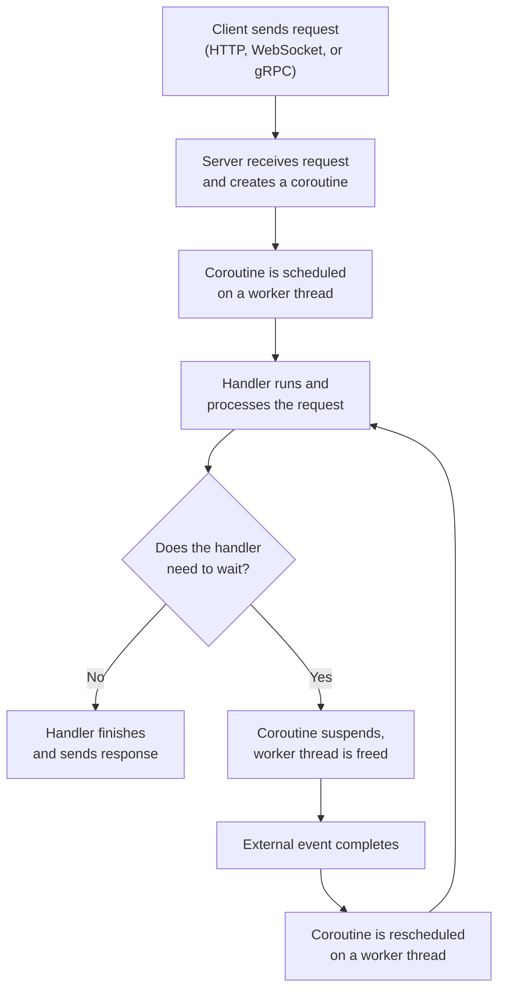
```mermaid
flowchart TD
    A["`Client sends request
(HTTP, WebSocket, or gRPC)`"] --> B["`Server receives request
and creates a coroutine`"]
    B --> C["`Coroutine is scheduled
on a worker thread`"]
    C --> D["`Handler runs and
processes the request`"]
    D --> E{"`Does the handler
need to wait?`"}
    E -->|No| G["`Handler finishes
and sends response`"]
    E -->|Yes| F["`Coroutine suspends,
worker thread is freed`"]
    F --> H["External event completes"]
    H --> I["`Coroutine is rescheduled
on a worker thread`"]
    I --> D
```

**Reading the diagram:**

- A client (e.g., a wallet app) sends an RPC request to the rippled server.
- The server wraps the request in a coroutine and schedules it on a worker thread from the JobQueue.
- The handler processes the request. Most handlers finish immediately and return a response.
- For long-running handlers (e.g., pathfinding), the coroutine **suspends** — the worker thread is released to handle other requests.
- When the external event completes (e.g., pathfinding results are ready), the coroutine is rescheduled on an available worker thread and resumes where it left off.
- This suspend/resume cycle can repeat multiple times before the handler finishes and the response is sent.

---

## 4. Research & Analysis

> **RSS** = Resident Set Size

### 4.1 Stackful (Boost.Coroutine) vs Stackless (C++20) Architecture

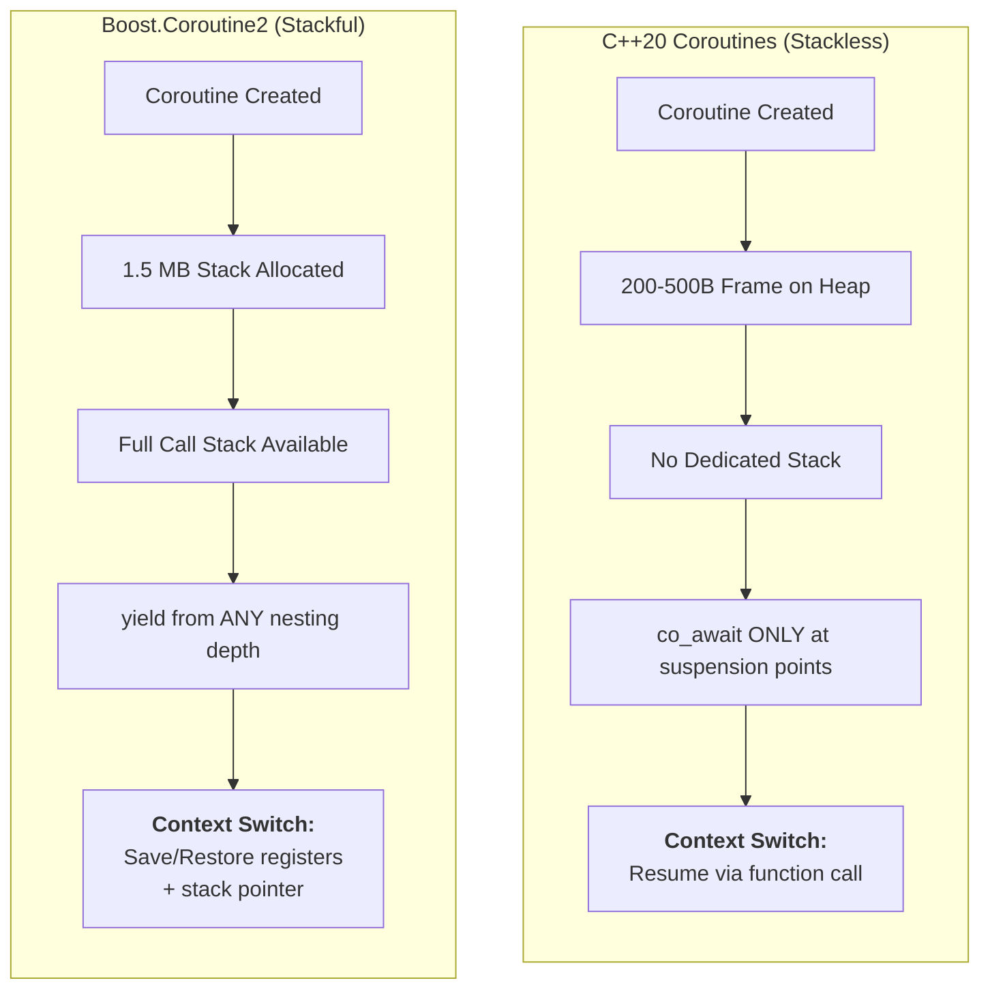
```mermaid
graph LR
    subgraph boost["Boost.Coroutine2 (Stackful)"]
        direction TB
        A[Coroutine Created] --> B[1.5 MB Stack Allocated]
        B --> C[Full Call Stack Available]
        C --> D[yield from ANY nesting depth]
        D --> E["`**Context Switch:**
Save/Restore registers
+ stack pointer`"]
    end

    subgraph cpp20["C++20 Coroutines (Stackless)"]
        direction TB
        F[Coroutine Created] --> G["200-500B Frame on Heap"]
        G --> H[No Dedicated Stack]
        H --> I[co_await ONLY at suspension points]
        I --> J["`**Context Switch:**
Resume via function call`"]
    end

    boost ~~~ cpp20
```

### 4.2 API & Programming Model Comparison

| Aspect                 | Boost.Coroutine2 (Current)                    | C++20 Coroutines (Target)                                                       |
| ---------------------- | --------------------------------------------- | ------------------------------------------------------------------------------- |
| **Type**               | Stackful, asymmetric                          | Stackless, asymmetric                                                           |
| **Stack Model**        | Dedicated 1.5 MB stack per coroutine          | Coroutine frame on heap (~200-500 bytes, approximate, implementation-dependent) |
| **Suspension**         | `(*yield_)()` — can yield from any call depth | `co_await expr` — only at explicit suspension points                            |
| **Resumption**         | `coro_()` — resumes from last yield           | `handle.resume()` — resumes from last co_await                                  |
| **Creation**           | `pull_type` constructor (runs to first yield) | Calling a coroutine function returns a handle                                   |
| **Completion Check**   | `static_cast<bool>(coro_)`                    | `handle.done()`                                                                 |
| **Value Passing**      | Typed via `pull_type<T>` / `push_type<T>`     | Via `promise_type::return_value()`                                              |
| **Exception Handling** | Natural stack-based propagation               | `promise_type::unhandled_exception()` — explicit                                |
| **Cancellation**       | Application-managed (poll a flag)             | Via `await_ready()` / cancellation tokens                                       |
| **Keywords**           | None (library-only)                           | `co_await`, `co_yield`, `co_return`                                             |
| **Standard**           | Boost library (not ISO C++)                   | ISO C++20 standard                                                              |

### 4.3 Coroutine Start Behavior: Eager vs Lazy

A key behavioral difference between Boost.Coroutine2 and C++20 coroutines is **what happens at creation time**.

| Aspect                               | Boost.Coroutine2 (`pull_type`)                                                       | C++20 (`initial_suspend = suspend_always`)       |
| ------------------------------------ | ------------------------------------------------------------------------------------ | ------------------------------------------------ |
| **On construction**                  | Eagerly runs coroutine body until first `yield()`                                    | No body code executes — only allocates the frame |
| **First execution**                  | Already happened (up to first yield)                                                 | Deferred until explicit `resume()` call          |
| **Initial yield required?**          | Yes — the API demands a yield to return control to the creator                       | No — coroutine is born suspended                 |
| **Stack context switch on creation** | Yes — switches to coroutine stack and back                                           | No — construction is just a heap allocation      |
| **Work wasted on creation**          | Any code before first `yield()` runs eagerly, even if the coroutine is never resumed | Zero — no work done until `resume()`             |

**Was the initial-yield pattern a rippled requirement or a Boost API limitation?**

It was a **Boost API design choice**, not a rippled requirement. Boost's `pull_type` was modeled after generators: construct the coroutine, and the first value is immediately available to pull. The coroutine runs eagerly to its first `yield()` to produce that value. rippled just needed "create a coroutine, run it later" — the eager-run-to-first-yield was Boost's mechanism for achieving that, not something rippled specifically required.

**What C++20 does better:**

1. **Lazy start by default** — With `suspend_always` as `initial_suspend`, construction and first execution are fully decoupled. No dummy initial yield, no wasted work, no confusing "the coroutine already ran halfway" semantics.
2. **No forced context switch on creation** — Boost's `pull_type` had to actually switch stack contexts on construction to run to the first yield. C++20 coroutine construction is just a heap allocation.
3. **Custom suspension points** — Each `co_await` is controlled by an awaiter object (`await_ready`, `await_suspend`, `await_resume`), allowing runtime decisions about whether to actually suspend, which thread to resume on, and what values to return from suspension.
4. **Symmetric transfer** — `await_suspend` can return a `coroutine_handle<>`, transferring directly to another coroutine without stack buildup. Boost coroutines couldn't do this — each resume/yield went through the scheduler.
5. **Composability** — `co_await` on another coroutine is natural. With Boost, nesting coroutines meant manually managing multiple coroutine objects.

In rippled's migration, this means `postCoroTask()` creates a `CoroTask<void>` that is born suspended (`initial_suspend = suspend_always`), then schedules its first `resume()` via `addJob()`. The coroutine body doesn't execute any code until a worker thread picks up the job — strictly cleaner than Boost's eager-run-to-first-yield pattern.

### 4.4 Performance Characteristics

| Metric                         | Boost.Coroutine2                                                                         | C++20 Coroutines                     |
| ------------------------------ | ---------------------------------------------------------------------------------------- | ------------------------------------ |
| **Memory per coroutine**       | ~1.5 MB (fixed stack)                                                                    | ~200-500 bytes (frame only)          |
| **1000 concurrent coroutines** | ~1.5 GB                                                                                  | ~0.5 MB                              |
| **Context switch cost**        | ~19 cycles / 9 ns with fcontext; ~1,130 cycles / 547 ns with ucontext (ASAN/TSAN builds) | ~20-50 CPU cycles (function call)    |
| **Allocation**                 | Stack allocated at creation                                                              | Heap allocation (compiler may elide) |
| **Cache behavior**             | Poor (large stack rarely fully used)                                                     | Good (small frame, hot data close)   |
| **Compiler optimization**      | Opaque to compiler                                                                       | Inlinable, optimizable               |

### 4.5 Feature Parity Analysis

#### Suspension Points

- **Boost**: Can yield from any nesting level — `fn_a()` calls `fn_b()` calls `yield()`. The entire call stack is preserved.
- **C++20**: Suspension only at `co_await` expressions in the immediate coroutine function. Nested functions that need to suspend must themselves be coroutines returning awaitables.
- **Impact**: rippled's usage is **shallow** — `yield()` is called directly from the RPC handler lambda, never from deeply nested code. This makes migration straightforward.

#### Exception Handling

- **Boost**: Exceptions propagate naturally up the call stack across yield points.
- **C++20**: Exceptions in coroutine body are caught by `promise_type::unhandled_exception()`. Must be explicitly stored and rethrown.
- **Impact**: Need to implement `unhandled_exception()` in promise type. Pattern is well-established.

#### Cancellation

- **Boost**: rippled uses `expectEarlyExit()` for graceful shutdown — not a general cancellation mechanism.
- **C++20**: Can check cancellation in `await_ready()` before suspension, or via `stop_token` patterns.
- **Impact**: C++20 provides strictly better cancellation support.

### 4.6 Compiler Support

| Compiler  | rippled Minimum | C++20 Coroutine Support                        | Status |
| --------- | --------------- | ---------------------------------------------- | ------ |
| **GCC**   | 12.0+           | Full (since GCC 11)                            | Ready  |
| **Clang** | 16.0+           | Full (since Clang 14; partial Windows support) | Ready  |
| **MSVC**  | 19.28+          | Full (since VS2019 16.8)                       | Ready  |

rippled already requires C++20 (`CMAKE_CXX_STANDARD 20` in `CMakeLists.txt`). All supported compilers have mature C++20 coroutine support. **No compiler upgrades required.**

### 4.7 Viability Analysis — Addressing Stackless Concerns

C++20 stackless coroutines have well-known limitations compared to stackful coroutines. This section analyzes each concern against rippled's **actual codebase** to determine viability.

#### **Concern 1: Cannot Suspend from Nested Call Stacks**

**Claim**: Stackless coroutines cannot yield from arbitrary stack depths. If `fn_a()` calls `fn_b()` calls `yield()`, only stackful coroutines can suspend the entire chain.

**Analysis**: An exhaustive codebase audit found:

- **1 production yield() call**: `RipplePathFind.cpp:131` — directly in the handler function body
- **All test yield() calls**: directly in `postCoro` lambda bodies (Coroutine_test.cpp, JobQueue_test.cpp)
- **The `push_type*` architecture** makes deep-nested yield() structurally impossible — the `yield_` pointer is only available inside the `postCoro` lambda via the `shared_ptr<Coro>`, and handlers call `context.coro->yield()` at the top level

**Verdict**: This concern does NOT apply. All suspension is shallow.

#### **Concern 2: Colored Function Problem (Viral co_await)**

**Claim**: Once a function needs to suspend, every caller up the chain must also be a coroutine. This "infects" the call chain.

**Analysis**: In rippled's case, the coloring is minimal:

- `postCoroTask()` launches a coroutine — this is the "root" colored function
- The `postCoro` lambda itself becomes the coroutine function (returns `CoroTask<void>`)
- `doRipplePathFind()` is the only handler that calls `co_await`
- No other handler in the chain needs to become a coroutine — they continue to be regular functions dispatched through `doCommand()`

The "coloring" stops at the entry point lambda and the one handler that suspends. No deep infection.

**Verdict**: Minimal impact. Only 4 lambdas (3 entry points + 1 handler) need `co_await`.

#### **Concern 3: No Standard Library Support for Common Patterns**

**Claim**: C++20 provides the language primitives but no standard task type, executor integration, or composition utilities.

**Analysis**: This is accurate — we need to write custom types:

- `CoroTask<T>` (task/return type) — well-established pattern, ~80 lines
- `JobQueueAwaiter` (executor integration) — ~20 lines
- `FinalAwaiter` (continuation chaining) — ~10 lines

However, these types are small, well-understood, and have extensive reference implementations (cppcoro, folly::coro, libunifex). The total boilerplate is approximately 150-200 lines of header code.

**Verdict**: Manageable. Custom types are small and well-documented in C++ community.

#### **Concern 4: Stack Overflow from Synchronous Resumption Chains**

**Claim**: If coroutine A `co_await`s coroutine B, and B completes synchronously, B's `final_suspend` resumes A on the same stack, potentially building up unbounded stack depth.

**Why this is a real problem without symmetric transfer**: When `await_suspend()` returns `void`, the coroutine unconditionally suspends and returns from `.resume()`. If the awaited coroutine completes synchronously and calls `.resume()` on the awaiter, each such call adds a stack frame. In a loop that repeatedly `co_await`s short-lived coroutines (e.g., a generator producing millions of values), the stack grows with each iteration until it overflows — typically after ~1M iterations.

**How symmetric transfer solves it**: When `await_suspend()` returns a `coroutine_handle<>` instead of `void`, the compiler destroys the current coroutine's stack frame _before_ jumping to the returned handle. This is effectively a tail-call: `resume()` becomes a `jmp` instead of a `call`, so each chained resumption consumes **zero additional stack space**.

The C++ standard (P0913R0) mandates this by requiring: _"Implementations shall not impose any limits on how many coroutines can be resumed in this fashion."_ This effectively requires compilers to implement tail-call-like behavior — any finite stack would impose a limit otherwise.

**Returning `std::noop_coroutine()`** from `await_suspend()` signals "suspend and return to caller" without resuming another coroutine, serving the role that `void` return used to play.

**Applicability to rippled**: rippled does not chain coroutines (coroutine A awaiting coroutine B). The `co_await` points in rippled await `JobQueueAwaiter` (reschedules on the thread pool) and `yieldAndPost()` (suspend + re-post), both of which always suspend asynchronously. However, symmetric transfer is still implemented in our `FinalAwaiter` ([Section 7.1](#71-new-type-design)) as a best practice — it costs nothing and prevents stack overflow if the usage pattern ever changes.

**Verdict**: Real concern for coroutine chains, but does not affect rippled's current usage. Solved by symmetric transfer in our design regardless.

#### **Concern 5: Dangling Reference Risk**

**Claim**: Coroutine frames are heap-allocated and outlive the calling scope, making references to locals dangerous.

**Analysis**: This is a real concern that requires engineering discipline:

- Coroutine parameters are copied into the frame (safe by default)
- References passed to coroutine functions can dangle if the referent's scope ends before the coroutine completes
- Our design mitigates this: `RPC::Context` is passed by reference but its lifetime is managed by `shared_ptr<Coro>` / the entry point lambda's scope, which outlives the coroutine

**Verdict**: Real risk, but manageable with RAII patterns and ASAN testing.

#### **Concern 6: yield_to.h / boost::asio::spawn**

**Claim**: `yield_to.h:111` uses `boost::asio::spawn`, suggesting broader coroutine usage.

**Analysis**: `boost::asio::spawn` with `boost::context::fixedsize_stack` is a **completely separate** stackful coroutine system from `JobQueue::Coro`:

- Different type: `boost::asio::yield_context` (not `push_type*`)
- Different mechanism: Boost.Asio stackful coroutines (not Boost.Coroutine2)
- **Not part of this migration scope** — unrelated to `JobQueue::Coro`

**Usage sites** (both test and production):

| File                                             | Context                                                 | Scope      |
| ------------------------------------------------ | ------------------------------------------------------- | ---------- |
| `include/xrpl/beast/test/yield_to.h`             | Test infrastructure for async I/O tests                 | Test       |
| `src/test/server/ServerStatus_test.cpp`          | Server status tests via `enable_yield_to`               | Test       |
| `src/test/beast/beast_io_latency_probe_test.cpp` | Latency probe tests via `enable_yield_to`               | Test       |
| `include/xrpl/server/detail/Spawn.h`             | `util::spawn()` wrapper with exception propagation      | Production |
| `include/xrpl/server/detail/BaseHTTPPeer.h`      | HTTP/WS connection handling (SSL handshake, read loops) | Production |

**Verdict**: Separate system. Out of scope for this migration.

**Consequence — `Boost::context` dependency is retained**: Because `boost::asio::spawn` depends on `Boost.Context` for its stackful fiber implementation, the `Boost::context` library **cannot be removed** as part of this migration. The CMake cleanup ([Phase 4](#phase-4-cleanup)) replaces `Boost::coroutine` with `Boost::context` — it does not eliminate the Boost fiber dependency entirely.

Additionally, when running under ASAN or TSAN, `Boost.Context` must be built with the `ucontext` backend (not the default `fcontext`) so that it emits `__sanitizer_start_switch_fiber` / `__sanitizer_finish_switch_fiber` annotations during fiber context switches. Without these annotations, the sanitizers cannot track memory ownership across fiber stack switches and will report false positives (stack-use-after-scope under ASAN, data races under TSAN) for the `boost::asio::spawn` call sites listed above. This requires:

- `BOOST_USE_UCONTEXT` — selects the ucontext backend (fcontext has no sanitizer annotations)
- `BOOST_USE_ASAN` / `BOOST_USE_TSAN` — enables the sanitizer fiber-switching hooks in Boost.Context
- These defines must match what Boost itself was compiled with (see `conan/profiles/sanitizers`)

**Potential issues from retaining `Boost::context`**:

1. **Continued 2MB stack allocation** — `boost::asio::spawn` in `BaseHTTPPeer.h` and `yield_to.h` still allocates 2MB stacks per fiber via `fixedsize_stack`. This does not benefit from the C++20 coroutine memory reduction.
2. **Sanitizer blind spots** — if Boost is not compiled with matching `BOOST_USE_UCONTEXT` / `BOOST_USE_ASAN` / `BOOST_USE_TSAN` defines, the fiber context switches in production server code (`BaseHTTPPeer`) will produce false positives or mask real bugs.
3. **Future migration needed** — `boost::asio::spawn` with stackful fibers should eventually be migrated to `boost::asio::co_spawn` with C++20 coroutines (or `boost::asio::awaitable`) to fully eliminate the `Boost::context` dependency. This is a separate initiative.

#### Overall Viability Conclusion

The migration IS viable because:

1. rippled's coroutine usage is **shallow** (no deep-nested yield)
2. The **colored function infection** is limited to 4 call sites
3. Custom types are **small and well-understood**
4. **Symmetric transfer** solves the stack overflow concern
5. **ASAN/TSAN** testing catches lifetime and race bugs
6. The alternative (ASAN annotations for Boost.Context) only addresses sanitizer false positives — it does not provide memory savings, standard compliance, or the dependency elimination that C++20 migration delivers

### 4.8 Merits & Demerits Summary

#### Merits of C++20 Migration

1. **~3000x memory reduction** per coroutine (1.5 MB → ~500 bytes)
2. **Faster context switching** (~2x improvement)
3. **Remove external dependency** on Boost.Coroutine (`Boost::context` is retained — see [Concern 6](#concern-6-yield_toh--boostasiospawn))
4. **Language-native** — better tooling, debugger support, static analysis
5. **Future-proof** — ISO standard, not a deprecated library
6. **Compiler-optimizable** — suspension points can be inlined/elided
7. **ASAN compatibility** — eliminates `JobQueue::Coro` Boost context-switching false positives (see `docs/build/sanitizers.md`). Note: `boost::asio::spawn` false positives remain and require `BOOST_USE_UCONTEXT` + `BOOST_USE_ASAN`/`BOOST_USE_TSAN` — see [Concern 6](#concern-6-yield_toh--boostasiospawn)

#### Demerits / Challenges

1. **Stackless limitation** — cannot yield from nested calls (verified: not an issue for rippled's shallow usage)
2. **Explicit lifetime management** — `coroutine_handle::destroy()` must be called (mitigated by RAII CoroTask)
3. **Verbose boilerplate** — promise_type, awaiter interfaces (~150-200 lines of infrastructure code)
4. **Debugging** — no visible coroutine stack in debugger (improving with tooling)
5. **Learning curve** — team needs familiarity with C++20 coroutine machinery
6. **Dangling reference risk** — coroutine frames outlive calling scope (mitigated by ASAN + careful design)
7. **No standard library task type** — must write custom CoroTask, awaiters (well-established patterns exist)

#### Alternative Considered: ASAN Annotations Only

Instead of full migration, one could keep Boost.Coroutine and add `__sanitizer_start_switch_fiber` / `__sanitizer_finish_switch_fiber` annotations to Coro.ipp to suppress ASAN false positives. This was evaluated and rejected because:

- It only fixes sanitizer false positives — does NOT reduce 1.5 MB/coroutine memory usage
- Does NOT remove the Boost.Coroutine dependency
- Does NOT provide standard compliance or future-proofing
- The full migration is feasible given shallow yield usage and delivers all the above benefits

---

## 5. Current State Assessment

### 5.1 Architecture Overview

<div align="center">

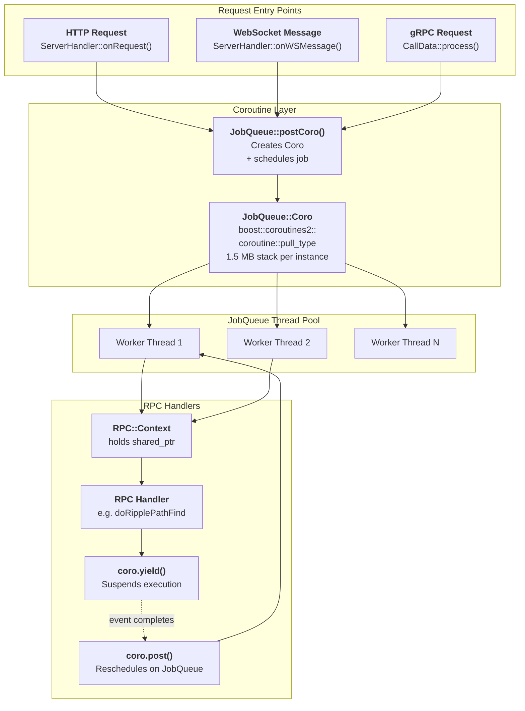
```mermaid
graph TD
    subgraph "Request Entry Points"
        HTTP["`**HTTP Request**
ServerHandler::onRequest()`"]
        WS["`**WebSocket Message**
ServerHandler::onWSMessage()`"]
        GRPC["`**gRPC Request**
CallData::process()`"]
    end

    subgraph "Coroutine Layer"
        POST["`**JobQueue::postCoro()**
Creates Coro
+ schedules job`"]
        CORO["`**JobQueue::Coro**
boost::coroutines2::
coroutine<void>::pull_type
1.5 MB stack per instance`"]
    end

    subgraph "JobQueue Thread Pool"
        W1["Worker Thread 1"]
        W2["Worker Thread 2"]
        WN["Worker Thread N"]
    end

    subgraph "RPC Handlers"
        CTX["`**RPC::Context**
holds shared_ptr<Coro>`"]
        RPC["`**RPC Handler**
e.g. doRipplePathFind`"]
        YIELD["`**coro.yield()**
Suspends execution`"]
        RESUME["`**coro.post()**
Reschedules on JobQueue`"]
    end

    HTTP --> POST
    WS --> POST
    GRPC --> POST
    POST --> CORO
    CORO --> W1
    CORO --> W2
    CORO --> WN
    W1 --> CTX
    W2 --> CTX
    CTX --> RPC
    RPC --> YIELD
    YIELD -.->|"event completes"| RESUME
    RESUME --> W1
```

</div>

**Reading the diagram:**

- Requests arrive via HTTP, WebSocket, or gRPC and are routed to `postCoro()`.
- `postCoro()` creates a `Coro` object (1.5 MB stack) and schedules it on the JobQueue.
- A worker thread picks up the job, creates an `RPC::Context`, and invokes the handler.
- If the handler calls `yield()`, the coroutine suspends and the worker thread is freed.
- When an external event completes, `post()` reschedules the coroutine on the JobQueue.
- A worker thread resumes the coroutine and the handler continues from where it left off.

### 5.2 `JobQueue::Coro` Implementation Audit

**File**: `include/xrpl/core/JobQueue.h` (lines 40-120) + `include/xrpl/core/Coro.ipp`

#### Class Members

```cpp
class Coro : public std::enable_shared_from_this<Coro> {
    detail::LocalValues lvs_;                                         // Per-coroutine thread-local storage
    JobQueue& jq_;                                                    // Parent JobQueue reference
    JobType type_;                                                    // Job type (jtCLIENT_RPC, etc.)
    std::string name_;                                                // Name for logging
    bool running_;                                                    // Is currently executing
    std::mutex mutex_;                                                // Prevents concurrent resume
    std::mutex mutex_run_;                                            // Guards running_ flag
    std::condition_variable cv_;                                      // For join() blocking
    boost::coroutines2::coroutine<void>::pull_type coro_;   // THE BOOST COROUTINE
    boost::coroutines2::coroutine<void>::push_type* yield_; // Yield function pointer
    bool finished_;                                                   // Debug assertion flag
};
```

#### Boost.Coroutine APIs Used

| API                                                      | Location        | Purpose                     |
| -------------------------------------------------------- | --------------- | --------------------------- |
| `coroutine<void>::pull_type`                             | `JobQueue.h:52` | The coroutine object itself |
| `coroutine<void>::push_type`                             | `JobQueue.h:53` | Yield function type         |
| `boost::context::protected_fixedsize_stack(1536 * 1024)` | `Coro.ipp:14`   | Stack size configuration    |
| `#include <boost/coroutine2/all.hpp>`                    | `JobQueue.h:11` | Header inclusion            |

#### Method Behaviors

| Method                  | Behavior                                                                                                                          |
| ----------------------- | --------------------------------------------------------------------------------------------------------------------------------- |
| **Constructor**         | Creates `pull_type` with 1.5 MB stack. Lambda captures user function. Auto-runs to first `yield()`.                               |
| **`yield()`**           | Increments `jq_.nSuspend_`, calls `(*yield_)()` to suspend. Returns control to caller.                                            |
| **`post()`**            | Sets `running_=true`, calls `jq_.addJob()` with a lambda that calls `resume()`. Returns false if JobQueue is stopping.            |
| **`resume()`**          | Swaps `LocalValues`, acquires `mutex_`, calls `coro_()` to resume. Restores `LocalValues`. Sets `running_=false`, notifies `cv_`. |
| **`runnable()`**        | Returns `static_cast<bool>(coro_)` — true if coroutine hasn't returned.                                                           |
| **`expectEarlyExit()`** | Decrements `nSuspend_`, sets `finished_=true`. Used during shutdown.                                                              |
| **`join()`**            | Blocks on `cv_` until `running_==false`.                                                                                          |

### 5.3 Coroutine Execution Lifecycle

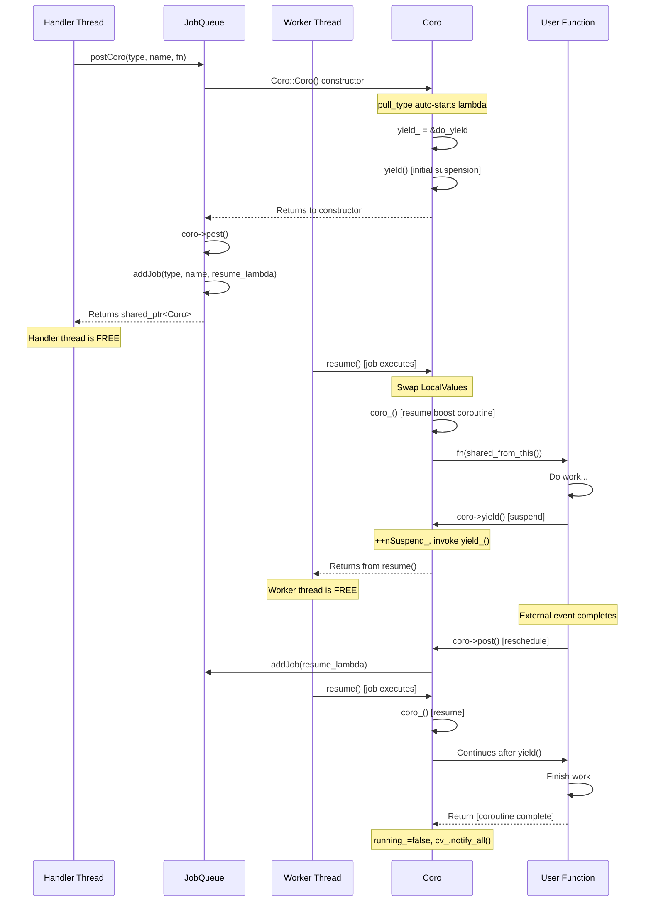
```mermaid
sequenceDiagram
    participant HT as Handler Thread
    participant JQ as JobQueue
    participant WT as Worker Thread
    participant C as Coro
    participant UF as User Function

    HT->>JQ: postCoro(type, name, fn)
    JQ->>C: Coro::Coro() constructor
    Note over C: pull_type auto-starts lambda
    C->>C: yield_ = &do_yield
    C->>C: yield() [initial suspension]
    C-->>JQ: Returns to constructor
    JQ->>JQ: coro->post()
    JQ->>JQ: addJob(type, name, resume_lambda)
    JQ-->>HT: Returns shared_ptr<Coro>
    Note over HT: Handler thread is FREE

    WT->>C: resume() [job executes]
    Note over C: Swap LocalValues
    C->>C: coro_() [resume boost coroutine]
    C->>UF: fn(shared_from_this())
    UF->>UF: Do work...

    UF->>C: coro->yield() [suspend]
    Note over C: ++nSuspend_, invoke yield_()
    C-->>WT: Returns from resume()
    Note over WT: Worker thread is FREE

    Note over UF: External event completes
    UF->>C: coro->post() [reschedule]
    C->>JQ: addJob(resume_lambda)

    WT->>C: resume() [job executes]
    C->>C: coro_() [resume]
    C->>UF: Continues after yield()
    UF->>UF: Finish work
    UF-->>C: Return [coroutine complete]
    Note over C: running_=false, cv_.notify_all()
```

**Reading the diagram:**

- The handler thread calls `postCoro()`, which constructs the Boost coroutine (auto-runs to the first `yield()`), then schedules it on the JobQueue.
- A worker thread calls `resume()`, which swaps `LocalValues` and resumes the Boost coroutine. The user function runs.
- When the user function calls `yield()`, control returns to the worker thread, which is now free.
- An external event triggers `post()`, which calls `addJob()` to reschedule the coroutine.
- A worker thread resumes the coroutine again, the user function finishes, and `cv_.notify_all()` signals completion.

### 5.4 All Coroutine Touchpoints

#### Core Infrastructure (Must Change)

| File                               | Role                                     | Lines of Interest         |
| ---------------------------------- | ---------------------------------------- | ------------------------- |
| `include/xrpl/core/JobQueue.h`     | Coro class definition, postCoro template | Lines 10, 40-120, 385-402 |
| `include/xrpl/core/Coro.ipp`       | Coro method implementations              | All (122 lines)           |
| `include/xrpl/basics/LocalValue.h` | Per-coroutine thread-local storage       | Lines 12-59 (LocalValues) |
| `cmake/deps/Boost.cmake`           | Boost.Coroutine dependency               | Lines 7, 24               |

#### Entry Points (postCoro Callers)

| File                                         | Entry Point                  | Job Type             |
| -------------------------------------------- | ---------------------------- | -------------------- |
| `src/xrpld/rpc/detail/ServerHandler.cpp:287` | `onRequest()` — HTTP RPC     | `jtCLIENT_RPC`       |
| `src/xrpld/rpc/detail/ServerHandler.cpp:325` | `onWSMessage()` — WebSocket  | `jtCLIENT_WEBSOCKET` |
| `src/xrpld/app/main/GRPCServer.cpp:102`      | `CallData::process()` — gRPC | `jtRPC`              |

#### Context Propagation

| File                                    | Role                                                   |
| --------------------------------------- | ------------------------------------------------------ |
| `src/xrpld/rpc/Context.h:27`            | `RPC::Context` holds `shared_ptr<JobQueue::Coro> coro` |
| `src/xrpld/rpc/ServerHandler.h:174-188` | `processSession/processRequest` pass coro through      |

#### Active Coroutine Consumer (yield/post)

| File                                                | Usage                                                 |
| --------------------------------------------------- | ----------------------------------------------------- |
| `src/xrpld/rpc/handlers/RipplePathFind.cpp:131`     | `context.coro->yield()` — suspends for path-finding   |
| `src/xrpld/rpc/handlers/RipplePathFind.cpp:116-123` | Continuation calls `coro->post()` or `coro->resume()` |

#### Test Files

| File                               | Tests                                                         |
| ---------------------------------- | ------------------------------------------------------------- |
| `src/test/core/Coroutine_test.cpp` | `correct_order`, `incorrect_order`, `thread_specific_storage` |
| `src/test/core/JobQueue_test.cpp`  | `testPostCoro` (post/resume cycles, shutdown behavior)        |
| `src/test/app/Path_test.cpp`       | Path-finding RPC via postCoro                                 |
| `src/test/jtx/impl/AMMTest.cpp`    | AMM RPC via postCoro                                          |

### 5.5 Suspension/Continuation Model

The current model documented in `src/xrpld/rpc/README.md` defines four functional types:

```
Callback     = std::function<void()>           — generic 0-arg function
Continuation = std::function<void(Callback)>   — calls Callback later
Suspend      = std::function<void(Continuation)> — runs Continuation, suspends
Coroutine    = std::function<void(Suspend)>    — given a Suspend, starts work
```

In practice, `JobQueue::Coro` simplifies this to:

- **Suspend** = `coro->yield()`
- **Continue** = `coro->post()` (async on JobQueue) or `coro->resume()` (sync on current thread)

### 5.6 CMake Dependency

In `cmake/deps/Boost.cmake`:

```cmake
find_package(Boost REQUIRED COMPONENTS ... coroutine ...)
target_link_libraries(xrpl_boost INTERFACE ... Boost::coroutine ...)
```

Additionally in `cmake/XrplInterface.cmake`:

```cpp
BOOST_COROUTINES2_NO_DEPRECATION_WARNING  // Suppresses Boost.Coroutine deprecation warnings
```

### 5.7 Existing C++20 Coroutine Usage

rippled **already uses C++20 coroutines** in test code:

- `src/tests/libxrpl/net/HTTPClient.cpp` uses `co_await` with `boost::asio::use_awaitable`
- Demonstrates team familiarity with C++20 coroutine syntax
- Proves compiler toolchain supports C++20 coroutines

---

## 6. Migration Strategy

### 6.1 Incremental vs Atomic Migration

**Decision: Incremental (multi-phase) migration.**

Rationale:

- Only **one RPC handler** (`RipplePathFind`) actively uses `yield()/post()` suspension
- The **three entry points** (HTTP, WS, gRPC) all funnel through `postCoro()`
- The `RPC::Context.coro` field is the sole propagation mechanism
- We can introduce a new C++20 coroutine system alongside the existing one and migrate callsites incrementally

### 6.2 Migration Phases

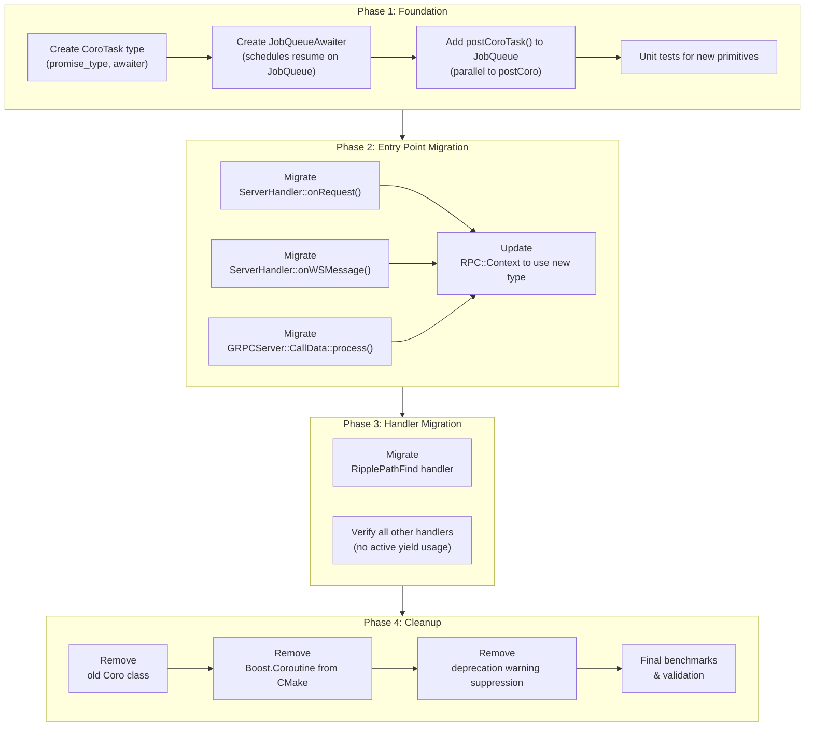
```mermaid
graph TD
    subgraph PH1 ["Phase 1: Foundation"]
        P1A["`Create CoroTask<T> type
(promise_type, awaiter)`"]
        P1B["`Create JobQueueAwaiter
(schedules resume on JobQueue)`"]
        P1C["`Add postCoroTask() to JobQueue
(parallel to postCoro)`"]
        P1D["Unit tests for new primitives"]
        P1A --> P1B --> P1C --> P1D
    end

    subgraph PH2 ["Phase 2: Entry Point Migration"]
        P2A["`Migrate
ServerHandler::onRequest()`"]
        P2B["`Migrate
ServerHandler::onWSMessage()`"]
        P2C["`Migrate
GRPCServer::CallData::process()`"]
        P2D["`Update
RPC::Context to use new type`"]
        P2A --> P2D
        P2B --> P2D
        P2C --> P2D
    end

    subgraph PH3 ["Phase 3: Handler Migration"]
        P3A["`Migrate
RipplePathFind handler`"]
        P3B["`Verify all other handlers
(no active yield usage)`"]
    end

    subgraph PH4 ["Phase 4: Cleanup"]
        P4A["`Remove
old Coro class`"]
        P4B["`Remove
Boost.Coroutine from CMake`"]
        P4C["`Remove
deprecation warning suppression`"]
        P4D["`Final benchmarks
& validation`"]
        P4A --> P4B --> P4C --> P4D
    end

    PH1 --> PH2
    PH2 --> PH3
    PH3 --> PH4
```

**Reading the diagram:**

- **[Phase 1](#phase-1-new-coroutine-primitives)** builds the new coroutine primitives (`CoroTask`, `JobQueueAwaiter`, `postCoroTask()`) alongside the existing Boost code. No production code changes.
- **[Phase 2](#phase-2-entry-point-migration)** migrates the three entry points (HTTP, WebSocket, gRPC) to use `postCoroTask()` and updates `RPC::Context`.
- **[Phase 3](#phase-3-handler-migration)** migrates the `RipplePathFind` handler and verifies no other handlers use `yield()`.
- **[Phase 4](#phase-4-cleanup)** removes the old `Coro` class, `Coro.ipp`, `Boost::coroutine` from CMake, and runs final benchmarks.
- Each phase depends on the previous one completing. The old code is not deleted until [Phase 4](#phase-4-cleanup), so rollback is safe through Phases 1–3.

### 6.3 Coexistence Strategy

During migration, both implementations will coexist:

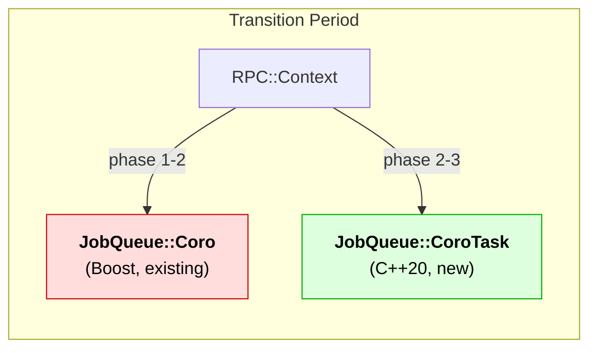
```mermaid
graph LR
    subgraph "Transition Period"
        OLD["`**JobQueue::Coro**
(Boost, existing)`"]
        NEW["`**JobQueue::CoroTask**
(C++20, new)`"]
        CTX["RPC::Context"]
    end

    CTX -->|"phase 1-2"| OLD
    CTX -->|"phase 2-3"| NEW

    style OLD fill:#fdd,stroke:#c00,color:#000
    style NEW fill:#dfd,stroke:#0a0,color:#000
```

- `RPC::Context` will temporarily hold both `shared_ptr<Coro>` (old) and the new coroutine handle
- Entry points will be migrated one at a time
- Each migration is independently testable
- Once all entry points and handlers are migrated, old code is removed

### 6.4 Breaking Changes & Compatibility

| Concern                          | Impact                                    | Mitigation                                                                   |
| -------------------------------- | ----------------------------------------- | ---------------------------------------------------------------------------- |
| `RPC::Context::coro` type change | All RPC handlers receive context          | Migrate context field last, after all consumers updated                      |
| `postCoro()` removal             | 3 callers                                 | Replace with `postCoroTask()`, remove old API in [Phase 4](#phase-4-cleanup) |
| `LocalValue` integration         | Thread-local storage must work            | New implementation must swap LocalValues identically                         |
| Shutdown behavior                | `expectEarlyExit()`, `nSuspend_` tracking | Replicate in new CoroTask                                                    |

---

## 7. Implementation Plan

> **ASAN** = AddressSanitizer | **TSAN** = ThreadSanitizer | **RAII** = Resource Acquisition Is Initialization

### 7.1 New Type Design

#### `CoroTask<T>` — Coroutine Return Type

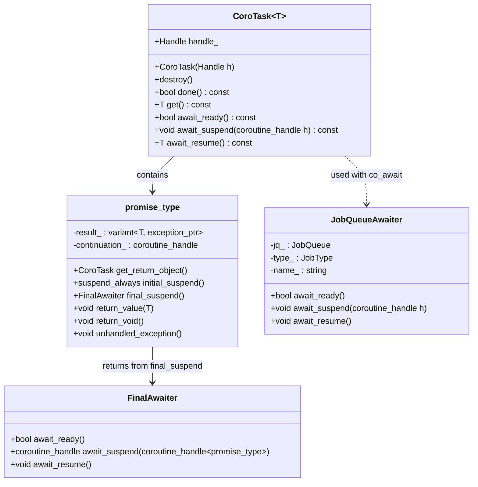
```mermaid
classDiagram
    class CoroTask~T~ {
        +Handle handle_
        +CoroTask(Handle h)
        +destroy()
        +bool done() const
        +T get() const
        +bool await_ready() const
        +void await_suspend(coroutine_handle h) const
        +T await_resume() const
    }

    class promise_type {
        -result_ : variant~T, exception_ptr~
        -continuation_ : coroutine_handle
        +CoroTask get_return_object()
        +suspend_always initial_suspend()
        +FinalAwaiter final_suspend()
        +void return_value(T)
        +void return_void()
        +void unhandled_exception()
    }

    class FinalAwaiter {
        +bool await_ready()
        +coroutine_handle await_suspend(coroutine_handle~promise_type~)
        +void await_resume()
    }

    class JobQueueAwaiter {
        -jq_ : JobQueue
        -type_ : JobType
        -name_ : string
        +bool await_ready()
        +void await_suspend(coroutine_handle h)
        +void await_resume()
    }

    CoroTask --> promise_type : contains
    promise_type --> FinalAwaiter : returns from final_suspend
    CoroTask ..> JobQueueAwaiter : used with co_await
```

#### `JobQueueAwaiter` — Schedules Resumption on JobQueue

```cpp
// Conceptual design — actual implementation may vary
struct JobQueueAwaiter {
    JobQueue& jq;
    JobType type;
    std::string name;

    bool await_ready() { return false; }  // Always suspend

    void await_suspend(std::coroutine_handle<> h) {
        // Schedule coroutine resumption as a job
        jq.addJob(type, name, [h]() { h.resume(); });
    }

    void await_resume() {}
};
```

### 7.2 New Architecture Overview

The following diagram mirrors [Section 5.1](#51-architecture-overview) but shows the target state after migration.

<div align="center">

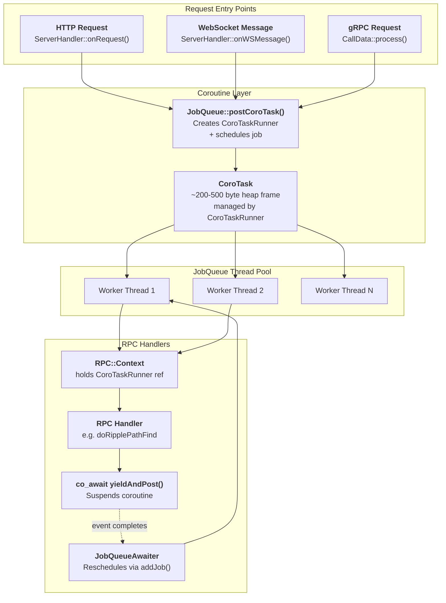
```mermaid
graph TD
    subgraph "Request Entry Points"
        HTTP["`**HTTP Request**
ServerHandler::onRequest()`"]
        WS["`**WebSocket Message**
ServerHandler::onWSMessage()`"]
        GRPC["`**gRPC Request**
CallData::process()`"]
    end

    subgraph "Coroutine Layer"
        POST["`**JobQueue::postCoroTask()**
Creates CoroTaskRunner
+ schedules job`"]
        TASK["`**CoroTask<void>**
~200-500 byte heap frame
managed by CoroTaskRunner`"]
    end

    subgraph "JobQueue Thread Pool"
        W1["Worker Thread 1"]
        W2["Worker Thread 2"]
        WN["Worker Thread N"]
    end

    subgraph "RPC Handlers"
        CTX["`**RPC::Context**
holds CoroTaskRunner ref`"]
        RPC["`**RPC Handler**
e.g. doRipplePathFind`"]
        AWAIT["`**co_await yieldAndPost()**
Suspends coroutine`"]
        SCHED["`**JobQueueAwaiter**
Reschedules via addJob()`"]
    end

    HTTP --> POST
    WS --> POST
    GRPC --> POST
    POST --> TASK
    TASK --> W1
    TASK --> W2
    TASK --> WN
    W1 --> CTX
    W2 --> CTX
    CTX --> RPC
    RPC --> AWAIT
    AWAIT -.->|"event completes"| SCHED
    SCHED --> W1
```

</div>

**Reading the diagram:**

- Requests arrive via HTTP, WebSocket, or gRPC and are routed to `postCoroTask()`.
- `postCoroTask()` creates a `CoroTaskRunner` wrapping a `CoroTask<void>` (~200-500 byte heap frame) and schedules it on the JobQueue.
- A worker thread picks up the job, creates an `RPC::Context`, and invokes the handler.
- If the handler needs to wait, it calls `co_await yieldAndPost()` — the coroutine suspends and the worker thread is freed.
- When the external event completes, `JobQueueAwaiter` reschedules the coroutine via `addJob()`.
- A worker thread resumes the coroutine (`handle.resume()`) and the handler continues from where it left off.

### 7.3 New Coroutine Execution Lifecycle

The following diagram mirrors [Section 5.3](#53-coroutine-execution-lifecycle) but shows the C++20 coroutine flow.

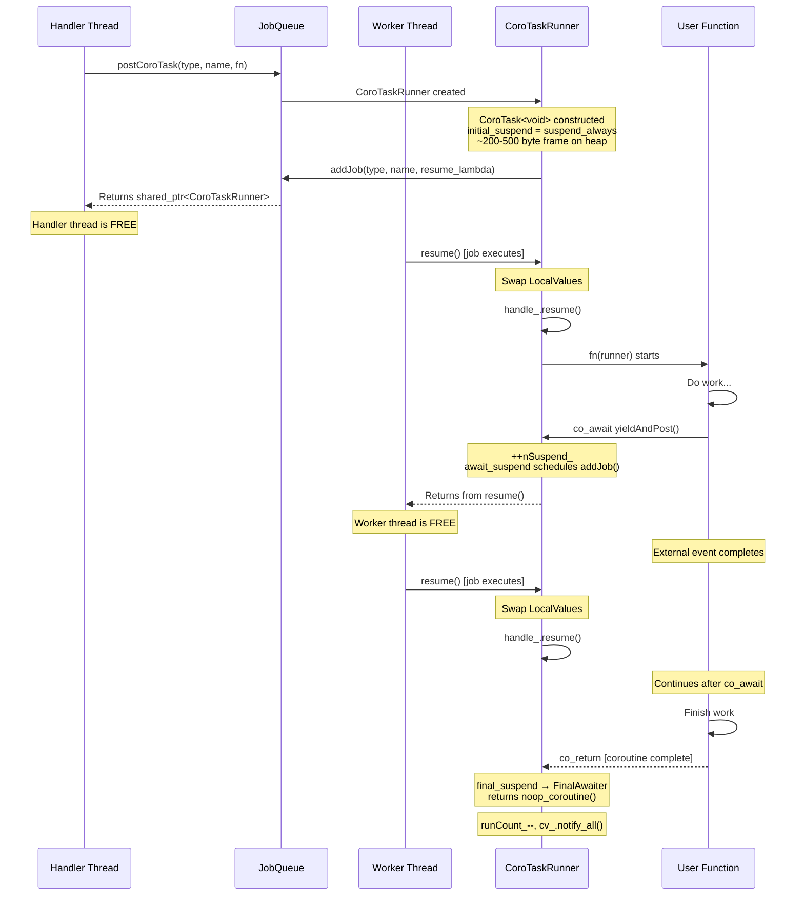
```mermaid
sequenceDiagram
    participant HT as Handler Thread
    participant JQ as JobQueue
    participant WT as Worker Thread
    participant R as CoroTaskRunner
    participant UF as User Function

    HT->>JQ: postCoroTask(type, name, fn)
    JQ->>R: CoroTaskRunner created
    Note over R: CoroTask<void> constructed<br/>initial_suspend = suspend_always<br/>~200-500 byte frame on heap
    R->>JQ: addJob(type, name, resume_lambda)
    JQ-->>HT: Returns shared_ptr<CoroTaskRunner>
    Note over HT: Handler thread is FREE

    WT->>R: resume() [job executes]
    Note over R: Swap LocalValues
    R->>R: handle_.resume()
    R->>UF: fn(runner) starts
    UF->>UF: Do work...

    UF->>R: co_await yieldAndPost()
    Note over R: ++nSuspend_<br/>await_suspend schedules addJob()
    R-->>WT: Returns from resume()
    Note over WT: Worker thread is FREE

    Note over UF: External event completes

    WT->>R: resume() [job executes]
    Note over R: Swap LocalValues
    R->>R: handle_.resume()
    Note over UF: Continues after co_await
    UF->>UF: Finish work
    UF-->>R: co_return [coroutine complete]
    Note over R: final_suspend → FinalAwaiter<br/>returns noop_coroutine()
    Note over R: runCount_--, cv_.notify_all()
```

**Reading the diagram:**

- The handler thread calls `postCoroTask()`, which creates a `CoroTaskRunner` wrapping a lazily-started `CoroTask<void>` (no auto-run — unlike Boost's `pull_type`), then schedules it on the JobQueue.
- A worker thread calls `resume()`, which swaps `LocalValues` and calls `handle_.resume()`. The user function starts.
- When the user function calls `co_await yieldAndPost()`, the awaiter's `await_suspend()` increments `nSuspend_` and schedules a new job via `addJob()`. The worker thread is freed.
- When a worker thread picks up the rescheduled job, `resume()` calls `handle_.resume()` again, continuing from the `co_await` point.
- When the user function executes `co_return`, `final_suspend()` returns the `FinalAwaiter`, which returns `std::noop_coroutine()` (no continuation to resume). The runner signals completion.

**Key differences from Boost lifecycle ([Section 5.3](#53-coroutine-execution-lifecycle)):**

| Aspect         | Boost (old)                                          | C++20 (new)                                           |
| -------------- | ---------------------------------------------------- | ----------------------------------------------------- |
| **Creation**   | `pull_type` auto-runs to first `yield()`             | `initial_suspend = suspend_always` — no auto-run      |
| **Frame**      | 1.5 MB stack allocated at construction               | ~200-500 byte heap frame                              |
| **Suspend**    | `(*yield_)()` — context switch via fcontext/ucontext | `co_await` — compiler-generated state machine         |
| **Resume**     | `coro_()` — context switch back                      | `handle_.resume()` — function call                    |
| **Completion** | `static_cast<bool>(coro_)` returns false             | `handle_.done()` returns true, `FinalAwaiter` runs    |
| **Cleanup**    | Destructor asserts `finished_`                       | RAII: `CoroTask` destructor calls `handle_.destroy()` |

### 7.4 Mapping: Old API → New API

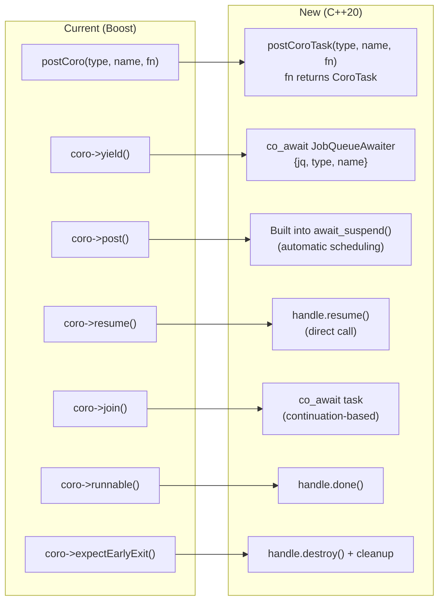
```mermaid
graph LR
    subgraph "Current (Boost)"
        direction TB
        A1["postCoro(type, name, fn)"]
        A2["coro->yield()"]
        A3["coro->post()"]
        A4["coro->resume()"]
        A5["coro->join()"]
        A6["coro->runnable()"]
        A7["coro->expectEarlyExit()"]
    end

    subgraph "New (C++20)"
        direction TB
        B1["`postCoroTask(type, name, fn)
fn returns CoroTask<void>`"]
        B2["`co_await JobQueueAwaiter
{jq, type, name}`"]
        B3["`Built into await_suspend()
(automatic scheduling)`"]
        B4["`handle.resume()
(direct call)`"]
        B5["`co_await task
(continuation-based)`"]
        B6["handle.done()"]
        B7["handle.destroy() + cleanup"]
    end

    A1 --> B1
    A2 --> B2
    A3 --> B3
    A4 --> B4
    A5 --> B5
    A6 --> B6
    A7 --> B7
```

### 7.5 File Changes Required

#### Phase 1: New Coroutine Primitives

| File                                  | Action     | Description                                                   |
| ------------------------------------- | ---------- | ------------------------------------------------------------- |
| `include/xrpl/core/CoroTask.h`        | **CREATE** | `CoroTask<T>` return type with `promise_type`, `FinalAwaiter` |
| `include/xrpl/core/JobQueueAwaiter.h` | **CREATE** | Awaiter that schedules resume on JobQueue                     |
| `include/xrpl/core/JobQueue.h`        | **MODIFY** | Add `postCoroTask()` template alongside existing `postCoro()` |
| `src/test/core/CoroTask_test.cpp`     | **CREATE** | Unit tests for `CoroTask<T>` and `JobQueueAwaiter`            |

#### Phase 2: Entry Point Migration

| File                                     | Action     | Description                                                            |
| ---------------------------------------- | ---------- | ---------------------------------------------------------------------- |
| `src/xrpld/rpc/detail/ServerHandler.cpp` | **MODIFY** | `onRequest()` and `onWSMessage()`: replace `postCoro` → `postCoroTask` |
| `src/xrpld/rpc/ServerHandler.h`          | **MODIFY** | Update `processSession`/`processRequest` signatures                    |
| `src/xrpld/app/main/GRPCServer.cpp`      | **MODIFY** | `CallData::process()`: replace `postCoro` → `postCoroTask`             |
| `src/xrpld/app/main/GRPCServer.h`        | **MODIFY** | Update `process()` method signature                                    |
| `src/xrpld/rpc/Context.h`                | **MODIFY** | Change `shared_ptr<JobQueue::Coro>` to new coroutine handle type       |

#### Phase 3: Handler Migration

| File                                        | Action     | Description                                                      |
| ------------------------------------------- | ---------- | ---------------------------------------------------------------- |
| `src/xrpld/rpc/handlers/RipplePathFind.cpp` | **MODIFY** | Replace `context.coro->yield()` / `coro->post()` with `co_await` |
| `src/test/app/Path_test.cpp`                | **MODIFY** | Update test to use new coroutine API                             |
| `src/test/jtx/impl/AMMTest.cpp`             | **MODIFY** | Update test to use new coroutine API                             |

#### Phase 4: Cleanup

| File                               | Action     | Description                                                        |
| ---------------------------------- | ---------- | ------------------------------------------------------------------ |
| `include/xrpl/core/Coro.ipp`       | **DELETE** | Remove old Boost.Coroutine implementation                          |
| `include/xrpl/core/JobQueue.h`     | **MODIFY** | Remove `Coro` class, `postCoro()`, `Coro_create_t`, Boost includes |
| `cmake/deps/Boost.cmake`           | **MODIFY** | Remove `coroutine` from `find_package` and `target_link_libraries` |
| `cmake/XrplInterface.cmake`        | **MODIFY** | Remove `BOOST_COROUTINES2_NO_DEPRECATION_WARNING`                  |
| `src/test/core/Coroutine_test.cpp` | **MODIFY** | Rewrite tests for new CoroTask                                     |
| `src/test/core/JobQueue_test.cpp`  | **MODIFY** | Update `testPostCoro` to use new API                               |
| `include/xrpl/basics/LocalValue.h` | **MODIFY** | Update LocalValues integration for C++20 coroutines                |

### 7.6 LocalValue Integration Design

> **TLS** = Thread-Local Storage | **LV** = LocalValues (per-coroutine storage map)

The `LocalValue` system provides per-coroutine isolation by swapping thread-local storage when a coroutine is resumed or suspended. This swap pattern is **shared by both the old Boost and the new C++20 implementation** — only the resume/yield mechanism differs.

#### Old Flow (Boost.Coroutine2)

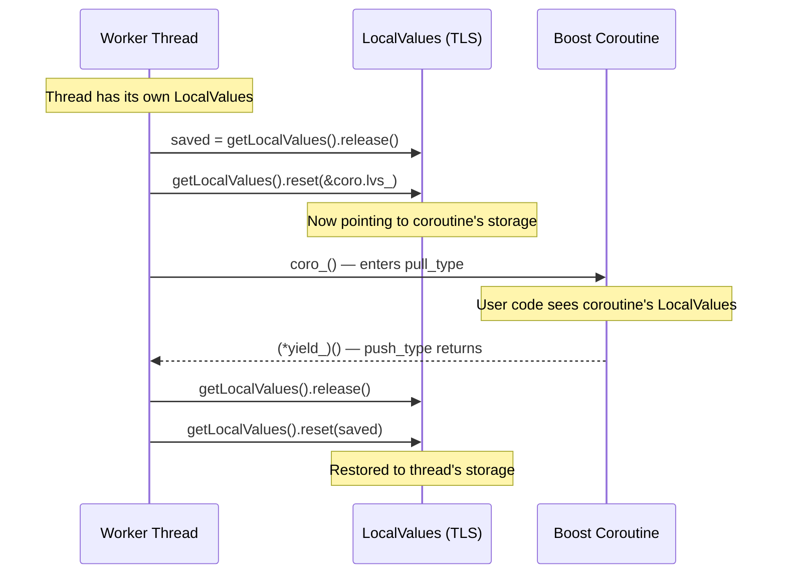
```mermaid
sequenceDiagram
    participant WT as Worker Thread
    participant LV as LocalValues (TLS)
    participant C as Boost Coroutine

    Note over WT: Thread has its own LocalValues

    WT->>LV: saved = getLocalValues().release()
    WT->>LV: getLocalValues().reset(&coro.lvs_)
    Note over LV: Now pointing to coroutine's storage

    WT->>C: coro_() — enters pull_type
    Note over C: User code sees coroutine's LocalValues

    C-->>WT: (*yield_)() — push_type returns

    WT->>LV: getLocalValues().release()
    WT->>LV: getLocalValues().reset(saved)
    Note over LV: Restored to thread's storage
```

#### New Flow (C++20 Coroutines)

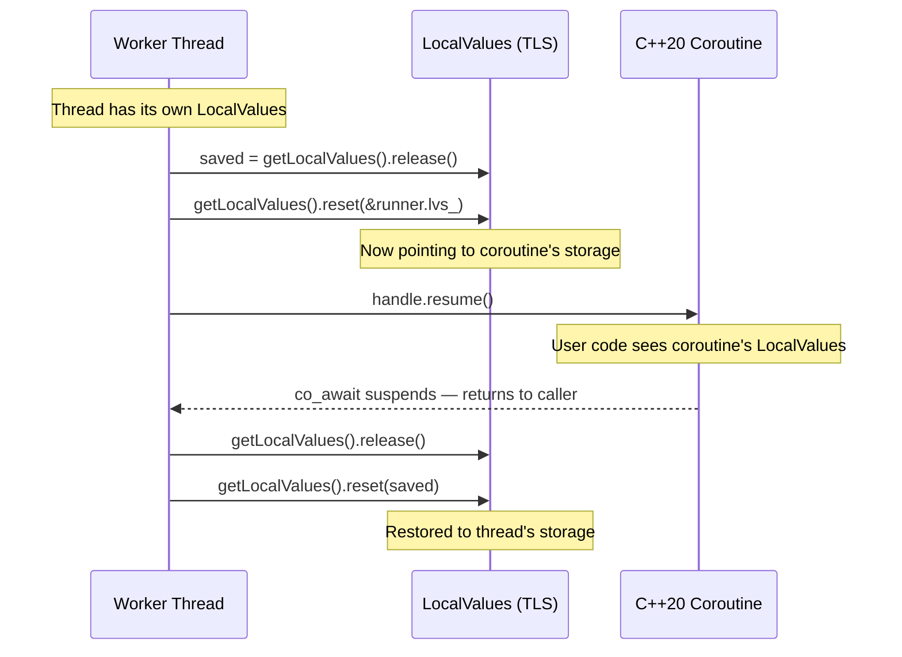
```mermaid
sequenceDiagram
    participant WT as Worker Thread
    participant LV as LocalValues (TLS)
    participant C as C++20 Coroutine

    Note over WT: Thread has its own LocalValues

    WT->>LV: saved = getLocalValues().release()
    WT->>LV: getLocalValues().reset(&runner.lvs_)
    Note over LV: Now pointing to coroutine's storage

    WT->>C: handle.resume()
    Note over C: User code sees coroutine's LocalValues

    C-->>WT: co_await suspends — returns to caller

    WT->>LV: getLocalValues().release()
    WT->>LV: getLocalValues().reset(saved)
    Note over LV: Restored to thread's storage
```

#### Reading the diagrams

- **Before resume**: The worker thread saves its own TLS pointer and installs the coroutine's `lvs_` map into thread-local storage. Any `LocalValue<T>` access inside the coroutine will read/write the coroutine's copy, not the thread's.
- **During execution**: The coroutine body runs with its own isolated `LocalValues`. Multiple coroutines on different threads each see their own data.
- **After suspend/return**: The thread's original TLS pointer is restored. This ensures the worker thread's own `LocalValues` are not contaminated by the coroutine's mutations.
- **Old vs new difference**: In Boost, the swap wraps a `coro_()` / `(*yield_)()` call pair. In C++20, the swap wraps `handle.resume()` and the `co_await` suspension point. The swap logic itself is identical.

### 7.7 RipplePathFind Migration Design

Current pattern:

```cpp
// Continuation callback
auto callback = [&context]() {
    std::shared_ptr<JobQueue::Coro> coroCopy{context.coro};
    if (!coroCopy->post()) {
        coroCopy->resume();  // Fallback: run on current thread
    }
};

// Start async work, then suspend
jvResult = makeLegacyPathRequest(request, callback, ...);
if (request) {
    context.coro->yield();       // ← SUSPEND HERE
    jvResult = request->doStatus(context.params);  // ← RESUME HERE
}
```

Target pattern:

```cpp
// Start async work, suspend via co_await
jvResult = makeLegacyPathRequest(request, /* awaiter-based callback */, ...);
if (request) {
    co_await PathFindAwaiter{context};  // ← SUSPEND + RESUME via awaiter
    jvResult = request->doStatus(context.params);
}
```

The `PathFindAwaiter` will encapsulate the scheduling logic currently in the lambda continuation.

---

## 8. Testing & Validation Strategy

### 8.1 Test Architecture

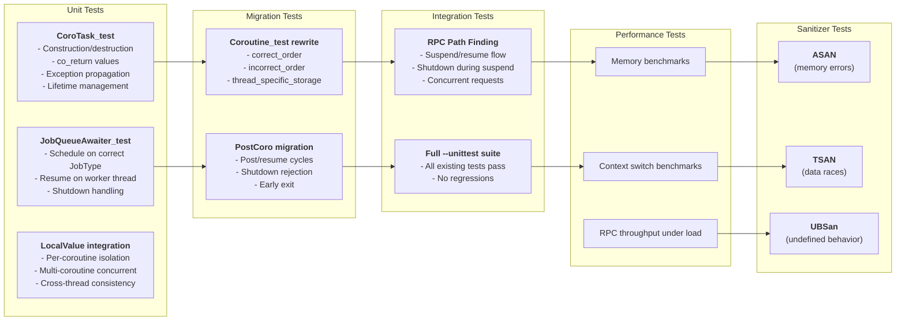
```mermaid
graph LR
    subgraph "Unit Tests"
        direction TB
        UT1["`**CoroTask_test**
- Construction/destruction
- co_return values
- Exception propagation
- Lifetime management`"]
        UT2["`**JobQueueAwaiter_test**
- Schedule on correct JobType
- Resume on worker thread
- Shutdown handling`"]
        UT3["`**LocalValue integration**
- Per-coroutine isolation
- Multi-coroutine concurrent
- Cross-thread consistency`"]
    end

    subgraph "Migration Tests"
        direction TB
        MT1["`**Coroutine_test rewrite**
- correct_order
- incorrect_order
- thread_specific_storage`"]
        MT2["`**PostCoro migration**
- Post/resume cycles
- Shutdown rejection
- Early exit`"]
    end

    subgraph "Integration Tests"
        direction TB
        IT1["`**RPC Path Finding**
- Suspend/resume flow
- Shutdown during suspend
- Concurrent requests`"]
        IT2["`**Full --unittest suite**
- All existing tests pass
- No regressions`"]
    end

    subgraph "Performance Tests"
        direction TB
        PT1["Memory benchmarks"]
        PT2["Context switch benchmarks"]
        PT3["RPC throughput under load"]
    end

    subgraph "Sanitizer Tests"
        direction TB
        ST1["`**ASAN**
(memory errors)`"]
        ST2["`**TSAN**
(data races)`"]
        ST3["`**UBSan**
(undefined behavior)`"]
    end

    UT1 --> MT1
    UT2 --> MT2
    MT1 --> IT1
    MT2 --> IT2
    IT1 --> PT1
    IT2 --> PT2
    PT1 --> ST1
    PT2 --> ST2
    PT3 --> ST3
```

### 8.2 Benchmarking Tests

> **RSS** = Resident Set Size (physical memory currently used by a process)

#### Memory Usage Benchmark

```
Test: Create N coroutines, measure RSS
- N = 100, 1000, 10000
- Measure: peak RSS, per-coroutine overhead
- Compare: Boost (N * 1.5 MB + overhead) vs C++20 (N * ~500B + overhead)
- Tool: /proc/self/status (VmRSS), or getrusage()
```

#### Context Switch Benchmark

```
Test: Yield/resume M times across N coroutines
- M = 100,000 iterations
- N = 1, 10, 100 concurrent coroutines
- Measure: total time, per-switch latency (ns)
- Compare: Boost yield/resume cycle vs C++20 co_await/resume cycle
- Tool: std::chrono::high_resolution_clock
```

#### RPC Throughput Benchmark

```
Test: Concurrent ripple_path_find requests
- Load: 10, 50, 100 concurrent requests
- Measure: requests/second, p50/p95/p99 latency
- Compare: before vs after migration
- Tool: Custom load generator or existing perf infrastructure
```

### 8.3 Unit Test Coverage

| Test                           | What It Validates                             |
| ------------------------------ | --------------------------------------------- |
| `CoroTask<void>` basic         | Coroutine runs to completion, handle cleanup  |
| `CoroTask<int>` with value     | `co_return` value correctly retrieved         |
| `CoroTask` exception           | `unhandled_exception()` captures and rethrows |
| `CoroTask` cancellation        | Destruction before completion cleans up       |
| `JobQueueAwaiter` basic        | `co_await` suspends, resumes on worker thread |
| `JobQueueAwaiter` shutdown     | Returns false / throws when JobQueue stopping |
| `PostCoroTask` lifecycle       | Create → suspend → resume → complete          |
| `PostCoroTask` multiple yields | Multiple co_await points in sequence          |
| `LocalValue` isolation         | 4 coroutines, each sees own LocalValue        |
| `LocalValue` cross-thread      | Resume on different thread, values preserved  |

### 8.4 Integration Testing

- **All existing `--unittest` tests must pass unchanged** (except coroutine-specific tests that are rewritten)
- **Path_test** must pass with identical behavior
- **AMMTest** RPC tests must pass
- **ServerHandler** HTTP/WS handling must work end-to-end

### 8.5 Sanitizer Testing

Per `docs/build/sanitizers.md`:

```bash
# ASAN (memory errors — especially important for coroutine frame lifetime)
export SANITIZERS=address,undefinedbehavior
# Build + test

# TSAN (data races — critical for concurrent coroutine resume)
export SANITIZERS=thread
# Build + test (separate build — cannot mix with ASAN)
```

**Key benefit**: Removing Boost.Coroutine eliminates the `__asan_handle_no_return` false positives caused by Boost context switching (documented in `docs/build/sanitizers.md` line 184).

### 8.6 Regression Testing Methodology

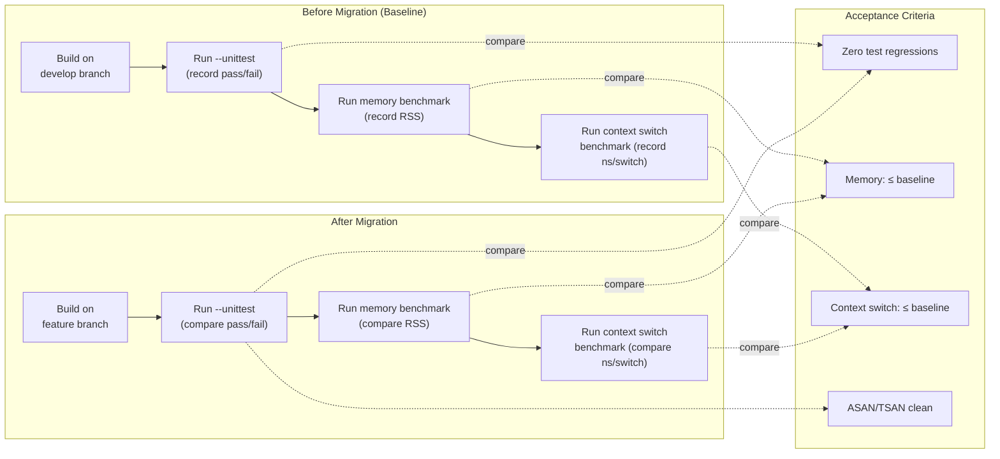
```mermaid
graph LR
    subgraph "Before Migration (Baseline)"
        direction TB
        B1["`Build on
develop branch`"]
        B2["`Run --unittest
(record pass/fail)`"]
        B3["`Run memory benchmark
(record RSS)`"]
        B4["`Run context switch
benchmark (record ns/switch)`"]
        B1 --> B2 --> B3 --> B4
    end

    subgraph "After Migration"
        direction TB
        A1["`Build on
feature branch`"]
        A2["`Run --unittest
(compare pass/fail)`"]
        A3["`Run memory benchmark
(compare RSS)`"]
        A4["`Run context switch
benchmark (compare ns/switch)`"]
        A1 --> A2 --> A3 --> A4
    end

    subgraph "Acceptance Criteria"
        direction TB
        C1["Zero test regressions"]
        C2["Memory: ≤ baseline"]
        C3["Context switch: ≤ baseline"]
        C4["ASAN/TSAN clean"]
    end

    B2 -.->|compare| C1
    A2 -.->|compare| C1
    B3 -.->|compare| C2
    A3 -.->|compare| C2
    B4 -.->|compare| C3
    A4 -.->|compare| C3
    A2 -.-> C4
```

---

## 9. Risks & Mitigation

### 9.1 Risk Matrix

<div align="center">


```mermaid
---
config:
    quadrantChart:
        chartWidth: 800
        chartHeight: 800
        pointRadius: 5
        pointTextPadding: 8
        pointLabelFontSize: 14
        titleFontSize: 18
---
quadrantChart
    title Risk Assessment — Probability vs Impact
    x-axis Low Probability --> High Probability
    y-axis Low Impact --> High Impact
    quadrant-1 Mitigate Actively
    quadrant-2 Monitor Closely
    quadrant-3 Accept
    quadrant-4 Mitigate if Easy
    Frame lifetime bugs: [0.55, 0.95]
    Dangling references: [0.62, 0.78]
    Data races on resume: [0.48, 0.86]
    Shutdown races: [0.58, 0.55]
    Exception loss: [0.42, 0.50]
    Perf regression: [0.22, 0.90]
    LocalValue corruption: [0.18, 0.72]
    Symmetric transfer unavail: [0.08, 0.92]
    Compiler bugs: [0.32, 0.60]
    Colored fn spread: [0.30, 0.38]
    Missed consumer: [0.14, 0.45]
    Future deep yield: [0.22, 0.30]
    Third-party Boost dep: [0.08, 0.20]
```

</div>

| Risk                                                  | Probability | Impact | Mitigation                                                                       |
| ----------------------------------------------------- | ----------- | ------ | -------------------------------------------------------------------------------- |
| **Performance regression** in context switching       | Low         | High   | Benchmark before/after; C++20 should be faster                                   |
| **Coroutine frame lifetime bugs** (use-after-destroy) | Medium      | High   | ASAN testing, RAII wrapper for handle, code review                               |
| **Data races on resume**                              | Medium      | High   | TSAN testing, careful await_suspend() implementation                             |
| **LocalValue corruption** across threads              | Low         | High   | Dedicated test with 4+ concurrent coroutines                                     |
| **Shutdown race conditions**                          | Medium      | Medium | Replicate existing mutex/cv pattern in new design                                |
| **Missed coroutine consumer** during migration        | Low         | Medium | Exhaustive grep audit ([Section 5.4](#54-all-coroutine-touchpoints) is complete) |
| **Compiler bugs** in coroutine codegen                | Low         | Medium | Test on all three compilers (GCC, Clang, MSVC)                                   |
| **Exception loss** across suspension points           | Medium      | Medium | Test exception propagation in every phase                                        |
| **Third-party code depending on Boost.Coroutine**     | Very Low    | Low    | Grep confirms only internal usage                                                |
| **Dangling references in coroutine frames**           | Medium      | High   | ASAN testing, avoid reference params in coroutine functions, use shared_ptr      |
| **Colored function infection spreading**              | Low         | Medium | Only 4 call sites need co_await; no nested handlers suspend                      |
| **Symmetric transfer not available**                  | Very Low    | High   | All target compilers (GCC 12+, Clang 16+) support symmetric transfer             |
| **Future handler adding deep yield**                  | Low         | Medium | Code review + CI: static analysis flag any yield from nested depth               |

### 9.2 Rollback Strategy

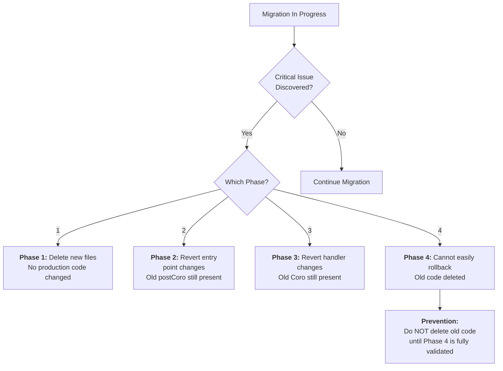
```mermaid
graph TD
    START["Migration In Progress"]
    CHECK{"`Critical Issue
Discovered?`"}
    PHASE{"Which Phase?"}

    P1["`**Phase 1:** Delete new files
No production code changed`"]
    P2["`**Phase 2:** Revert entry
point changes
Old postCoro still present`"]
    P3["`**Phase 3:** Revert handler changes
Old Coro still present`"]
    P4["`**Phase 4:** Cannot easily rollback
Old code deleted`"]

    PREVENT["`**Prevention:**
Do NOT delete old code
until Phase 4 is fully validated`"]

    START --> CHECK
    CHECK -->|Yes| PHASE
    CHECK -->|No| DONE["Continue Migration"]
    PHASE -->|1| P1
    PHASE -->|2| P2
    PHASE -->|3| P3
    PHASE -->|4| P4
    P4 --> PREVENT
```

**Key principle**: Old `Coro` class and `postCoro()` remain in the codebase through Phases 1-3. They are only removed in [Phase 4](#phase-4-cleanup), after all migration is validated. Each phase is independently revertible via `git revert`.

### 9.3 Specific Risk: Stackful → Stackless Limitation

**The Big Question**: Can all current `yield()` call sites work with stackless `co_await`?

**Analysis**:

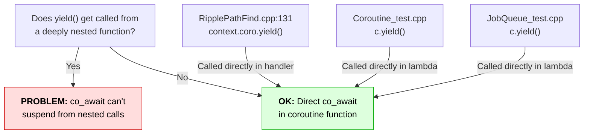
```mermaid
graph TD
    Q["`Does yield() get called from
a deeply nested function?`"]
    Q -->|Yes| PROBLEM["`**PROBLEM:** co_await can't
suspend from nested calls`"]
    Q -->|No| OK["`**OK:** Direct co_await
in coroutine function`"]

    CHECK1["`RipplePathFind.cpp:131
context.coro.yield()`"]
    CHECK1 -->|"Called directly in handler"| OK

    CHECK2["`Coroutine_test.cpp
c.yield()`"]
    CHECK2 -->|"Called directly in lambda"| OK

    CHECK3["`JobQueue_test.cpp
c.yield()`"]
    CHECK3 -->|"Called directly in lambda"| OK

    style OK fill:#dfd,stroke:#0a0,color:#000
    style PROBLEM fill:#fdd,stroke:#c00,color:#000
```

**Result**: All `yield()` calls are in the direct body of the postCoro lambda or RPC handler function. **No deep nesting exists.** Migration to stackless `co_await` is fully feasible without architectural redesign.

---

## 10. Timeline & Milestones

### 10.1 Milestone Overview

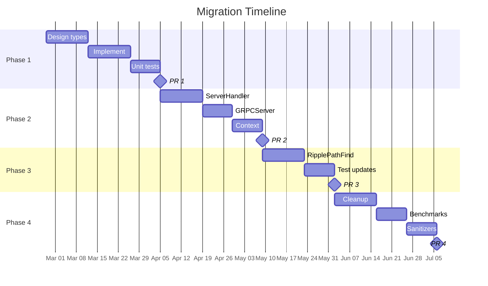
```mermaid
gantt
    title Migration Timeline
    dateFormat  YYYY-MM-DD
    axisFormat  %b %d
    tickInterval 1week

    section Phase 1
    Design types           :p1a, 2026-02-26, 14d
    Implement              :p1b, after p1a, 14d
    Unit tests             :p1c, after p1b, 10d
    PR 1                   :milestone, p1m, after p1c, 0d

    section Phase 2
    ServerHandler          :p2a, after p1m, 14d
    GRPCServer             :p2b, after p2a, 10d
    Context                :p2c, after p2b, 10d
    PR 2                   :milestone, p2m, after p2c, 0d

    section Phase 3
    RipplePathFind         :p3a, after p2m, 14d
    Test updates           :p3b, after p3a, 10d
    PR 3                   :milestone, p3m, after p3b, 0d

    section Phase 4
    Cleanup                :p4a, after p3m, 14d
    Benchmarks             :p4b, after p4a, 10d
    Sanitizers             :p4c, after p4b, 10d
    PR 4                   :milestone, p4m, after p4c, 0d
```

### 10.2 Milestone Details

#### Milestone 1: New Coroutine Primitives (PR #1)

**Deliverables**:

- `CoroTask<T>` with `promise_type`, `FinalAwaiter`
- `CoroTask<void>` specialization
- `JobQueueAwaiter` for scheduling on JobQueue
- `postCoroTask()` on `JobQueue`
- LocalValue integration in new coroutine type
- Unit test suite: `CoroTask_test.cpp`

**Acceptance Criteria**:

- All new unit tests pass
- Existing `--unittest` suite passes (no regressions from new code)
- ASAN + TSAN clean on new tests
- Code compiles on GCC 12+, Clang 16+

#### Milestone 2: Entry Point Migration (PR #2)

**Deliverables**:

- `ServerHandler::onRequest()` uses `postCoroTask()`
- `ServerHandler::onWSMessage()` uses `postCoroTask()`
- `GRPCServer::CallData::process()` uses `postCoroTask()`
- `RPC::Context` updated to carry new coroutine type
- `processSession`/`processRequest` signatures updated

**Acceptance Criteria**:

- HTTP, WebSocket, and gRPC RPC requests work end-to-end
- Full `--unittest` suite passes
- Manual smoke test: `ripple_path_find` via HTTP/WS

#### Milestone 3: Handler Migration (PR #3)

**Deliverables**:

- `RipplePathFind` uses `co_await` instead of `yield()/post()`
- Path_test and AMMTest updated
- Coroutine_test and JobQueue_test updated for new API

**Acceptance Criteria**:

- Path-finding suspension/continuation works correctly
- All `--unittest` tests pass
- Shutdown-during-pathfind scenario tested

#### Milestone 4: Cleanup & Validation (PR #4)

**Deliverables**:

- Old `Coro` class and `Coro.ipp` removed
- `postCoro()` removed from `JobQueue`
- `Boost::coroutine` removed from CMake
- `BOOST_COROUTINES2_NO_DEPRECATION_WARNING` removed
- Performance benchmark results documented
- Sanitizer test results documented

**Acceptance Criteria**:

- Build succeeds without Boost.Coroutine
- Full `--unittest` suite passes
- Memory per coroutine ≤ 10KB (down from 1.5 MB)
- Context switch time ≤ baseline
- ASAN, TSAN, UBSan all clean

---

## 11. Standards & Guidelines

### 11.1 Coroutine Design Standards

#### Rule 1: All coroutine return types must use RAII for handle lifetime

```cpp
// GOOD: Handle destroyed in destructor
~CoroTask() {
    if (handle_) handle_.destroy();
}

// BAD: Manual destroy calls scattered in code
void cleanup() { handle_.destroy(); } // Easy to forget
```

#### Rule 2: Never resume a coroutine from within `await_suspend()`

```cpp
// GOOD: Schedule resume on executor
void await_suspend(std::coroutine_handle<> h) {
    jq_.addJob(type_, name_, [h]() { h.resume(); });
}

// BAD: Direct resume in await_suspend (blocks caller)
void await_suspend(std::coroutine_handle<> h) {
    h.resume(); // Defeats the purpose of suspension
}
```

#### Rule 3: Use `suspend_always` for `initial_suspend()` (lazy start)

```cpp
// GOOD: Lazy start — coroutine doesn't run until explicitly resumed
std::suspend_always initial_suspend() { return {}; }

// BAD for our use case: Eager start — runs immediately on creation
std::suspend_never initial_suspend() { return {}; }
```

Rationale: Matches existing Boost behavior where `postCoro()` schedules execution, not the constructor.

#### Rule 4: Always handle `unhandled_exception()` explicitly

```cpp
void unhandled_exception() {
    exception_ = std::current_exception();
    // NEVER: just swallow the exception
    // NEVER: std::terminate() without logging
}
```

#### Rule 5: Use `suspend_always` for `final_suspend()` to enable continuation

```cpp
// GOOD: Suspend at end to allow cleanup and value retrieval
auto final_suspend() noexcept {
    struct FinalAwaiter {
        bool await_ready() noexcept { return false; }
        std::coroutine_handle<> await_suspend(
            std::coroutine_handle<promise_type> h) noexcept {
            if (h.promise().continuation_)
                return h.promise().continuation_;  // Resume waiter
            return std::noop_coroutine();
        }
        void await_resume() noexcept {}
    };
    return FinalAwaiter{};
}
```

#### Rule 6: Coroutine functions must be clearly marked

```cpp
// GOOD: Return type makes it obvious this is a coroutine
CoroTask<Json::Value> doRipplePathFind(RPC::JsonContext& context) {
    co_await ...;
    co_return result;
}

// BAD: Coroutine hidden behind auto or unclear return type
auto doSomething() { co_return; }
```

### 11.2 Coding Guidelines

#### Thread Safety

1. **Never resume a coroutine concurrently from two threads.** Use the same mutex pattern as existing `Coro::mutex_` to prevent races.
2. **`await_suspend()` is the synchronization point.** All state visible before `await_suspend()` must be visible after `await_resume()`.
3. **Use `std::atomic` or mutexes for shared state** between coroutine and continuation callback.

#### Memory Management

1. **`CoroTask<T>` owns its `coroutine_handle`**. It is move-only, non-copyable.
2. **Never store raw `coroutine_handle<>`** in long-lived data structures without clear ownership.
3. **Prefer `shared_ptr<CoroTask<T>>`** when multiple parties need to observe/wait on a coroutine, mirroring the existing `shared_ptr<Coro>` pattern.

#### Error Handling

1. **Exceptions thrown in coroutine body** are captured by `promise_type::unhandled_exception()` and rethrown in `await_resume()`.
2. **Never let exceptions escape `final_suspend()`** — it's `noexcept`.
3. **Shutdown path**: When `JobQueue` is stopping and `addJob()` returns false, the awaiter must resume the coroutine with an error (throw or return error state) rather than leaving it suspended forever.

#### Naming Conventions

| Entity                | Convention                | Example                                   |
| --------------------- | ------------------------- | ----------------------------------------- |
| Coroutine return type | `CoroTask<T>`             | `CoroTask<void>`, `CoroTask<Json::Value>` |
| Awaiter types         | `*Awaiter` suffix         | `JobQueueAwaiter`, `PathFindAwaiter`      |
| Coroutine functions   | Same as regular functions | `doRipplePathFind(...)`                   |
| Promise types         | Nested `promise_type`     | `CoroTask<T>::promise_type`               |
| JobQueue method       | `postCoroTask()`          | `jq.postCoroTask(jtCLIENT, "name", fn)`   |

#### Code Organization

1. **Coroutine primitives** go in `include/xrpl/core/` (header-only where possible)
2. **Application-specific awaiters** go alongside their consumers
3. **Tests** mirror source structure: `src/test/core/CoroTask_test.cpp`
4. **No conditional compilation** (`#ifdef`) for old vs new coroutine code — migration is clean phases

#### Documentation

1. **Each awaiter must document**: what it waits for, which thread resumes, and what `await_resume()` returns.
2. **Promise type must document**: exception handling behavior and suspension points.
3. **Migration commits must reference this plan** in commit messages.

### 11.3 Branch Strategy

Each milestone is developed on a **sub-branch** of the main feature branch. This keeps PRs focused and independently reviewable.

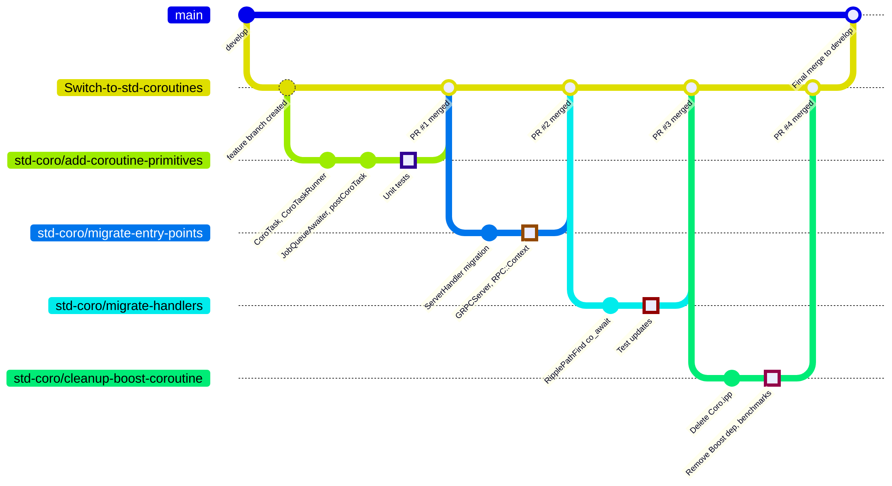
```mermaid
---
displayMode: compact
config:
  gitGraph:
    useMaxWidth: false
---
gitGraph
    commit id: "develop"
    branch Switch-to-std-coroutines
    commit id: "feature branch created"

    branch std-coro/add-coroutine-primitives
    commit id: "CoroTask, CoroTaskRunner"
    commit id: "JobQueueAwaiter, postCoroTask"
    commit id: "Unit tests" type: HIGHLIGHT

    checkout Switch-to-std-coroutines
    merge std-coro/add-coroutine-primitives id: "PR #1 merged"

    branch std-coro/migrate-entry-points
    commit id: "ServerHandler migration"
    commit id: "GRPCServer, RPC::Context" type: HIGHLIGHT

    checkout Switch-to-std-coroutines
    merge std-coro/migrate-entry-points id: "PR #2 merged"

    branch std-coro/migrate-handlers
    commit id: "RipplePathFind co_await"
    commit id: "Test updates" type: HIGHLIGHT

    checkout Switch-to-std-coroutines
    merge std-coro/migrate-handlers id: "PR #3 merged"

    branch std-coro/cleanup-boost-coroutine
    commit id: "Delete Coro.ipp"
    commit id: "Remove Boost dep, benchmarks" type: HIGHLIGHT

    checkout Switch-to-std-coroutines
    merge std-coro/cleanup-boost-coroutine id: "PR #4 merged"

    checkout main
    merge Switch-to-std-coroutines id: "Final merge to develop"
```

**Workflow**:

1. Create sub-branch from `Switch-to-std-coroutines` for each milestone
2. Develop and test on the sub-branch
3. Create PR from sub-branch → `Switch-to-std-coroutines`
4. After review + merge, start next milestone sub-branch from the updated feature branch
5. Final PR from `Switch-to-std-coroutines` → `develop`

**Rules**:

- Never push directly to the main feature branch — always via sub-branch PR
- Each sub-branch must pass `--unittest` and sanitizers before PR
- Sub-branch names follow the pattern: `std-coro/<descriptive-action>` (e.g., `add-coroutine-primitives`, `migrate-entry-points`)
- Milestone PRs must reference this plan document in the description

### 11.4 Code Review Checklist

For every PR in this migration:

- [ ] `coroutine_handle::destroy()` called exactly once per coroutine
- [ ] No concurrent `handle.resume()` calls possible
- [ ] `unhandled_exception()` stores the exception (doesn't discard it)
- [ ] `final_suspend()` is `noexcept`
- [ ] Awaiter `await_suspend()` doesn't block (schedules, not runs)
- [ ] `LocalValues` correctly swapped on suspend/resume boundaries
- [ ] Shutdown path tested (JobQueue stopping during coroutine execution)
- [ ] ASAN clean (no use-after-free on coroutine frame)
- [ ] TSAN clean (no data races on resume)
- [ ] All existing `--unittest` tests still pass

---

## 12. Task List

See [BoostToStdCoroutineTaskList.md](BoostToStdCoroutineTaskList.md) for the full task list with per-milestone checkboxes.

---

## Appendix A: File Inventory

Complete list of files that reference coroutines (for audit tracking):

| #   | File                                        | Must Change | Phase                      |
| --- | ------------------------------------------- | ----------- | -------------------------- |
| 1   | `include/xrpl/core/JobQueue.h`              | Yes         | 1 (add), 4 (remove old)    |
| 2   | `include/xrpl/core/Coro.ipp`                | Yes         | 4 (delete)                 |
| 3   | `include/xrpl/basics/LocalValue.h`          | Maybe       | 1 (if integration changes) |
| 4   | `cmake/deps/Boost.cmake`                    | Yes         | 4                          |
| 5   | `cmake/XrplInterface.cmake`                 | Yes         | 4                          |
| 6   | `src/xrpld/rpc/Context.h`                   | Yes         | 2                          |
| 7   | `src/xrpld/rpc/detail/ServerHandler.cpp`    | Yes         | 2                          |
| 8   | `src/xrpld/rpc/ServerHandler.h`             | Yes         | 2                          |
| 9   | `src/xrpld/app/main/GRPCServer.cpp`         | Yes         | 2                          |
| 10  | `src/xrpld/app/main/GRPCServer.h`           | Yes         | 2                          |
| 11  | `src/xrpld/rpc/handlers/RipplePathFind.cpp` | Yes         | 3                          |
| 12  | `src/test/core/Coroutine_test.cpp`          | Yes         | 3                          |
| 13  | `src/test/core/JobQueue_test.cpp`           | Yes         | 3                          |
| 14  | `src/test/app/Path_test.cpp`                | Yes         | 3                          |
| 15  | `src/test/jtx/impl/AMMTest.cpp`             | Yes         | 3                          |
| 16  | `src/xrpld/rpc/README.md`                   | Yes         | 4 (update docs)            |

---

## Appendix B: New Files to Create

| #   | File                                  | Phase | Purpose                                  |
| --- | ------------------------------------- | ----- | ---------------------------------------- |
| 1   | `include/xrpl/core/CoroTask.h`        | 1     | `CoroTask<T>` return type + promise_type |
| 2   | `include/xrpl/core/JobQueueAwaiter.h` | 1     | Awaiter for scheduling on JobQueue       |
| 3   | `src/test/core/CoroTask_test.cpp`     | 1     | Unit tests for new primitives            |

---

## 13. FAQ

**Why is `Boost::context` still a dependency after the migration?**
The migration only removes `Boost::coroutine`. rippled's production server code (`BaseHTTPPeer.h`) and test infrastructure (`yield_to.h`) still use `boost::asio::spawn`, which depends on `Boost.Context` for stackful fiber execution. Migrating those call sites to `boost::asio::co_spawn` / `boost::asio::awaitable` is a separate initiative. See [Concern 6](#concern-6-yield_toh--boostasiospawn) for details.

**Can C++20 stackless coroutines yield from deeply nested function calls?**
No — `co_await` can only appear in the immediate coroutine function body. However, an exhaustive audit confirmed that all `yield()` calls in rippled are at the top level of their lambda or handler function. No deep nesting exists. See [Section 4.7, Concern 1](#concern-1-cannot-suspend-from-nested-call-stacks).

**Why was `RipplePathFind` not migrated to use `co_await` as the plan originally proposed?**
During implementation, it was simpler and more robust to replace the coroutine-based yield/post pattern with a `std::condition_variable` synchronous wait. Since `RipplePathFind` is the only handler that suspends, and it already runs on a JobQueue worker thread, blocking that thread for up to 30 seconds is acceptable. This eliminates coroutine complexity from the handler entirely.

**What is `CoroTaskRunner` and why is it not in the original plan?**
`CoroTaskRunner` emerged during implementation as a lifecycle manager for `CoroTask<void>`. It wraps the coroutine handle, manages `LocalValues` swapping, tracks the run count for join/post synchronization, and provides the `yieldAndPost()` method. It is defined as a nested class in `JobQueue.h` with its implementation in `CoroTaskRunner.ipp`.

**What is `yieldAndPost()` and why was it added?**
`yieldAndPost()` is an inline awaiter method on `CoroTaskRunner` that atomically suspends the coroutine and reposts it on the JobQueue. It was added to work around a GCC-12 compiler bug where an external awaiter struct used at multiple `co_await` points corrupts the coroutine state machine's resume index. The inline version avoids this by defining the awaiter inside the member function.

**Does the migration affect the public RPC API?**
No. The migration is entirely internal — it changes how RPC handlers are scheduled and suspended, not what they accept or return. All RPC request/response formats are unchanged.

---

## 14. Glossary

| **Term**                 | **Definition**                                                                                                                                                                                       |
| ------------------------ | ---------------------------------------------------------------------------------------------------------------------------------------------------------------------------------------------------- |
| **ASAN**                 | AddressSanitizer — a compiler-based tool that detects memory errors such as use-after-free, buffer overflows, and stack-use-after-scope at runtime.                                                  |
| **Awaiter**              | A C++20 type that implements `await_ready()`, `await_suspend()`, and `await_resume()` to control coroutine suspension and resumption behavior.                                                       |
| **Boost.Context**        | A Boost library providing low-level context-switching primitives (fiber stacks) used by `boost::asio::spawn`. Retained after this migration for `boost::asio::spawn` support.                        |
| **Boost.Coroutine2**     | A Boost library providing stackful asymmetric coroutines. This is the library being replaced by this migration.                                                                                      |
| **Colored function**     | A function that must be a coroutine (i.e., use `co_await`/`co_return`) because it needs to suspend. The "colored function problem" refers to the viral nature of this requirement up the call chain. |
| **`CoroTask<T>`**        | The new C++20 coroutine return type introduced by this migration. Contains a `promise_type`, `FinalAwaiter`, and RAII handle management.                                                             |
| **`CoroTaskRunner`**     | A nested class in `JobQueue` that manages the lifecycle of a `CoroTask<void>`, including `LocalValues` swapping, run count tracking, and the `yieldAndPost()` method.                                |
| **`coroutine_handle<>`** | A C++20 standard library type that is a type-erased handle to a suspended coroutine frame, used to resume or destroy the coroutine.                                                                  |
| **fcontext**             | The default Boost.Context backend that uses hand-written assembly for context switching. Does not support sanitizer annotations.                                                                     |
| **`FinalAwaiter`**       | An awaiter returned by `promise_type::final_suspend()` that implements symmetric transfer — resuming a continuation handle instead of returning to the caller, preventing stack overflow.            |
| **`JobQueue`**           | rippled's thread pool that manages worker threads and schedules jobs. Coroutines are scheduled on it via `postCoroTask()`.                                                                           |
| **`JobQueueAwaiter`**    | An awaiter type that, when `co_await`ed, suspends the coroutine and schedules its resumption as a job on the `JobQueue`.                                                                             |
| **`LocalValues`**        | A per-coroutine thread-local storage mechanism in rippled. `LocalValues` are swapped on suspend/resume to give each coroutine its own isolated storage.                                              |
| **`postCoro()`**         | The old `JobQueue` method that creates a Boost.Coroutine and schedules it. Replaced by `postCoroTask()`.                                                                                             |
| **`postCoroTask()`**     | The new `JobQueue` method that creates a `CoroTaskRunner` wrapping a `CoroTask<void>` and schedules it.                                                                                              |
| **`promise_type`**       | A nested type inside a C++20 coroutine return type that controls coroutine creation, suspension, value return, and exception handling.                                                               |
| **Stackful coroutine**   | A coroutine that has its own dedicated call stack (1.5 MB in rippled), allowing suspension from any nesting depth. Boost.Coroutine2 provides stackful coroutines.                                    |
| **Stackless coroutine**  | A coroutine that stores only a small heap-allocated frame (~200–500 bytes) and can only suspend at explicit `co_await` points. C++20 coroutines are stackless.                                       |
| **Symmetric transfer**   | A technique where `await_suspend()` returns a `coroutine_handle<>` instead of `void`, enabling the compiler to tail-call into the next coroutine and prevent stack overflow.                         |
| **TSAN**                 | ThreadSanitizer — a compiler-based tool that detects data races and lock-order inversions at runtime.                                                                                                |
| **UBSan**                | Undefined Behavior Sanitizer — a compiler-based tool that detects undefined behavior such as signed integer overflow, null pointer dereference, and type punning violations.                         |
| **ucontext**             | An alternative Boost.Context backend that uses POSIX `ucontext_t` for context switching. Supports sanitizer fiber-switching annotations, unlike the default fcontext backend.                        |
| **`yieldAndPost()`**     | A method on `CoroTaskRunner` that atomically suspends the coroutine and reposts it on the JobQueue. Added to work around a GCC-12 compiler bug with external awaiters.                               |
