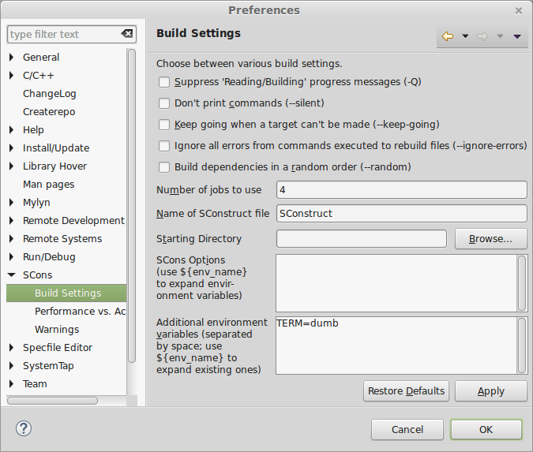

**Requirements**

1. Java Runtime Environment (JRE)
2. Eclipse with CDT (tested on Luna):
http://www.eclipse.org/downloads/packages/eclipse-ide-cc-developers/lunasr2
3. Eclipse SCons plugin: http://sconsolidator.com/  
**WARNING**: by default the SCons plugin uses 16 threads. Go to
*Window->Preferences->SCons->Build Settings* in Eclipse and make it
use only 4-8 jobs(threads) or whatever you feel confortable with. It will
positively freeze your system if you run with 16 threads/jobs.  

 

**Getting Started**

After setting up Eclipse just do a File->New->Other...
Select: C/C++ / New SCons project from existing source
Point the importer to the folder where the SConstruct resides (the root
folder of your git workspace normally)  

**Build**

Just hit Project->Build All in Eclipse to get started. And remember to not
let it run 16 threads! 

**Debug**

Start a new Eclipse debug configuration and set binary to run to build/rippled
(assuming you have built it).  

 
