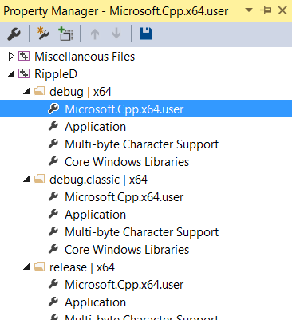
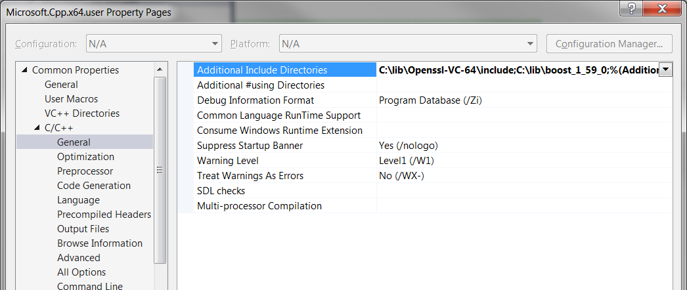
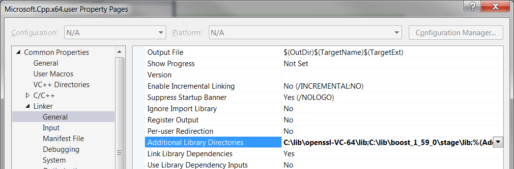
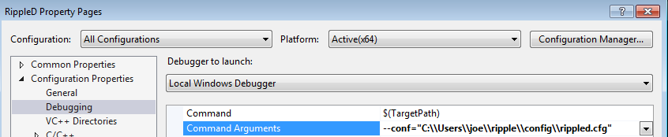
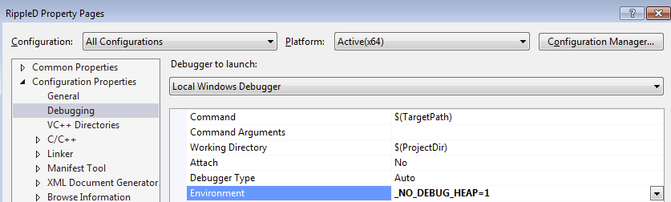

# Visual Studio 2015 Build Instructions

## Important

We do not recommend Windows for rippled production use at this time. Currently, the Ubuntu
platform has received the highest level of quality assurance, testing, and support.
Additionally, 32-bit Windows versions are not supported.

## Prerequisites

To clone the source code repository, create branches for inspection or modification,
build rippled under Visual Studio, and run the unit tests you will need these
software components:

* [Visual Studio 2015](README.md#install-visual-studio-2015)
* [Git for Windows](README.md#install-git-for-windows)
* [Google Protocol Buffers Compiler](README.md#install-google-protocol-buffers-compiler)
* (Optional) [Python and Scons](README.md#optional-install-python-and-scons)
* [OpenSSL Library](README.md#install-openssl)
* [Boost library](README.md#build-boost)

## Install Software

### Install Visual Studio 2015

If not already installed on your system, download your choice of installer from the
[Visual Studio 2015 Download](https://www.visualstudio.com/downloads/download-visual-studio-vs)
page, run the installer, and follow the directions. You may need to choose a "Custom"
installation and ensure that "Visual C++" is selected under "Programming Languages".

Any version of Visual Studio 2015 may be used to build rippled.
The **Visual Studio 2015 Community** edition is available free of charge (see
[the product page](https://www.visualstudio.com/products/visual-studio-community-vs)
for licensing details), while paid editions may be used for an free initial trial period.

### Install Git for Windows

Git is a distributed revision control system. The Windows version also provides the
bash shell and many Windows versions of Unix commands. While there are other
varieties of Git (such as TortoiseGit, which has a native Windows interface and
integrates with the Explorer shell), we recommend installing
[Git for Windows](https://git-scm.com/) since
it provides a Unix-like command line environment useful for running shell scripts.
Use of the bash shell under Windows is mandatory for running the unit tests.

* NOTE: To gain full featured access to the
  [git-subtree](https://blogs.atlassian.com/2013/05/alternatives-to-git-submodule-git-subtree/)
  functionality used in the rippled repository we suggest Git version 2.6.2 or later.

### Install Google Protocol Buffers Compiler

Building rippled requires **protoc.exe** version 2.5.1 or later. At your option you
may build it yourself from the sources in the
[Google Protocol Buffers](https://github.com/google/protobuf) repository,
or you may download a
[protoc.exe](https://ripple.github.io/Downloads/protoc/2.5.1/protoc.exe)
([alternate link](https://github.com/ripple/Downloads/raw/gh-pages/protoc/2.5.1/protoc.exe))
precompiled Windows executable from the
[Ripple Organization](https://github.com/ripple).

Either way, once you have the required version of **protoc.exe**, copy it into
a folder in your command line `%PATH%`.

* **NOTE:** If you use an older version of the compiler, the build will
  fail with errors related to a mismatch of the version of protocol
  buffer headers versus the compiler.

### (Optional) Install Python and Scons

[Python](https://www.python.org/downloads/) and
[Scons](http://scons.org/download.php) are not required to build
rippled with Visual Studio, but can be used to build from the
command line and in scripts, and are required to properly update
the `RippleD.vcxproj` file.

If you wish to build with scons, a version after 2.3.5 is required
for Visual Studio 2015 support.

## Configure Dependencies

### Install OpenSSL

[Download OpenSSL.](http://slproweb.com/products/Win32OpenSSL.html)
There will be four variants available:

1. 64-bit. Use this if you are running 64-bit windows. As of this writing, the link is called: "Win64 OpenSSL v1.0.2j".
2. 64-bit light - Don't use this. It is missing files needed to build rippled. As of this writing, the link is called: "Win64 OpenSSL v1.0.2j Light"

Run the installer, and choose an appropriate location for your OpenSSL
installation. In this guide we use **C:\lib\OpenSSL-Win64** as the
destination location.

You may be informed on running the installer that "Visual C++ 2008
Redistributables" must first be installed first. If so, download it
from the [same page](http://slproweb.com/products/Win32OpenSSL.html),
again making sure to get the correct 32-/64-bit variant.

* NOTE: Since rippled links statically to OpenSSL, it does not matter
  where the OpenSSL .DLL files are placed, or what version they are.
  rippled does not use or require any external .DLL files to run
  other than the standard operating system ones.

### Build Boost

After [downloading boost](http://www.boost.org/users/download/) and
unpacking it, open a **Developer Command Prompt** for
Visual Studio, change to the directory containing boost, then
bootstrap the build tools:

(As of this writing, the most recent version of boost is 1.62.0, which
will unpack into a directory named `boost_1_62_0`. For higher versions
of boost, adjust the directories provided in these examples as
appropriate.)

```powershell
cd C:\lib\boost_1_62_0
bootstrap
```

The rippled application is linked statically to the standard runtimes and external
dependencies on Windows, to ensure that the behavior of the executable is not
affected by changes in outside files. Therefore, it is necessary to build the
required boost static libraries using this command:

```powershell
bjam --toolset=msvc-14.0 address-model=64 architecture=x86 link=static threading=multi runtime-link=shared,static stage --stagedir=stage64
```

Building the boost libraries may take considerable time. When the build process
is completed, take note of both the reported compiler include paths and linker
library paths as they will be required later.

* NOTE: If older versions of Visual Studio are also installed, the build may fail.
  If this happens, make sure that only Visual Studio 2015 is installed. Due to
  defects in the uninstallation procedures of these Microsoft products, it may
  be necessary to start with a fresh install of the operating system with only
  the necessary development environment components installed to have a successful build.

### Clone the rippled repository

If you are familiar with cloning github repositories, just follow your normal process
and clone `git@github.com:ripple/rippled.git`. Otherwise follow this section for instructions.

1. If you don't have a github account, sign up for one at
  [github.com](https://github.com/).
2. Make sure you have Github ssh keys. For help see
  [generating-ssh-keys](https://help.github.com/articles/generating-ssh-keys).

Open the "Git Bash" shell that was installed with "Git for Windows" in the
step above. Navigate to the directory where you want to clone rippled (git
bash uses `/c` for windows's `C:` and forward slash where windows uses
backslash, so `C:\Users\joe\projs` would be `/c/Users/joe/projs` in git bash).
Now clone the repository and optionally switch to the *master* branch.
Type the following at the bash prompt:

```powershell
git clone git@github.com:ripple/rippled.git
cd rippled
git checkout master
```

* If you receive an error about not having the "correct access rights"
  make sure you have Github ssh keys, as described above.

### Configure Library Paths

Open the solution file located at **Builds/Visual Studio 2015/ripple.sln**
and select the "View->Property Manager" to bring up the Property Manager.
Expand the *debug | x64* section and
double click the *Microsoft.Cpp.x64.user* property sheet to bring up the
*Property Pages* dialog. These are global properties applied to all
64-bit build targets:



Go to *C/C++, General, Additional Include Directories* and add the
location of the boost installation:



Then, go to *Linker, General, Additional Library Directories* and add
the location of the compiled boost libraries reported at the completion
of building the boost libraries:



Follow the same procedure for adding the `Additional Include Directories`
and `Additional Library Directories` required for OpenSSL. In our example
these directories are **C:\lib\OpenSSL-Win64\include** and
**C:\lib\OpenSSL-Win64\lib** respectively.

# Setup Environment

## Create a working directory for rippled.cfg

The rippled server uses the [Rippled.cfg](https://wiki.ripple.com/Rippled.cfg)
file to read its configuration parameters. This section describes setting up
a directory to hold the config file. The next sections describe how to tell
the rippled server where that file is.

1. Create a directory to hold the configuration file. In this example, the
  ripple config directory was created in `C:\Users\joe\ripple\config`.
2. Copy the example config file located in `cfg\rippled-example.cfg` to the
  new directory and rename it "rippled.cfg".
3. Read the rippled.cfg file and edit as appropriate.

## Change the Visual Studio Projects Debugging Properties

1. If not already open, open the solution file located at **Builds/Visual Studio 2015/Ripple.sln**
2. Select the correct solution platform in the solution platform dropdown (either *x64*
  or *Win32* depending on machine type).
3. Select the "Project->Properties" menu item to bring up RippleD's Properties Pages
4. In "Configuration Properties" select "Debugging".
5. In the upper-left Configurations drop down, select "All Configurations".
6. In "Debugger to Launch" select "Local Windows Debugger".

### Tell rippled where to find the configuration file.

The `--conf` command-line switch to tell rippled where to find this file.
In the "Command Arguments" field in the properties dialog (that you opened
in the above section), add: `--conf="C:/Users/joe/ripple/config/rippled.cfg"`
(of course replacing that path with the path you set up above).



### Set the _NO_DEBUG_HEAP Environment Variable

Rippled can run very slowly in the debugger when using the Windows Debug Heap.
Set the `_NO_DEBUG_HEAP` environment variable to one to disable the debug heap.
In the "Environment" field (that you opened in the above section), add:
`_NO_DEBUG_HEAP=1`



# Build

After these steps are complete, rippled should be ready to build. Simply
set rippled as the startup project by right clicking on it in the
Visual Studio Solution Explorer, choose **Set as Startup Project**,
and then choose the **Build->Build Solution** menu item.

# Unit Tests (Recommended)

The rippled unit tests are written in C++ and are part
of the rippled executable.

From a Windows console, run the unit tests:

```
./build/msvc.debug/rippled.exe --unittest
```

Substitute the correct path to the executable to test different builds.


