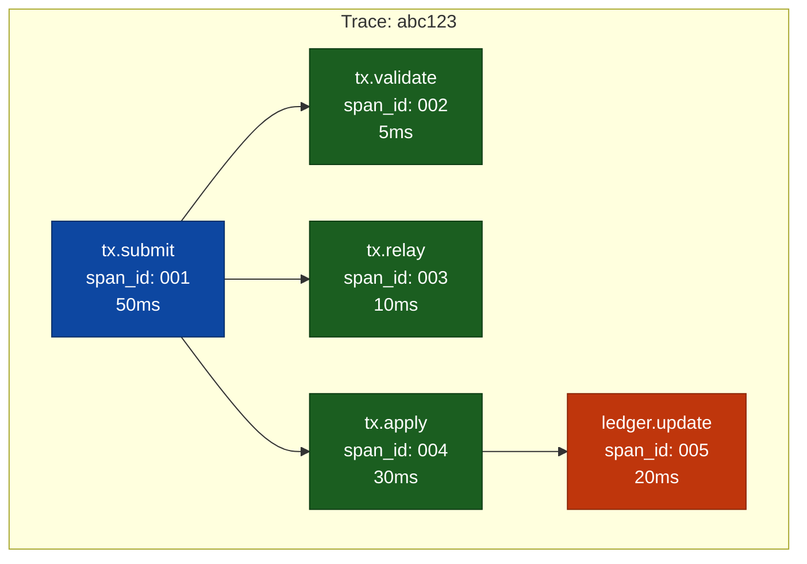
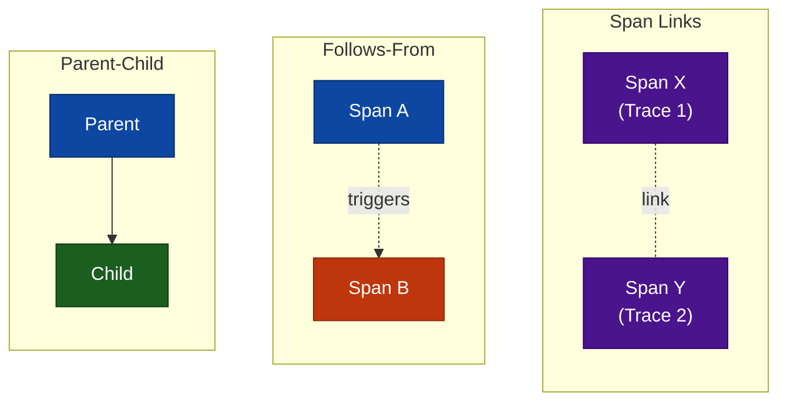
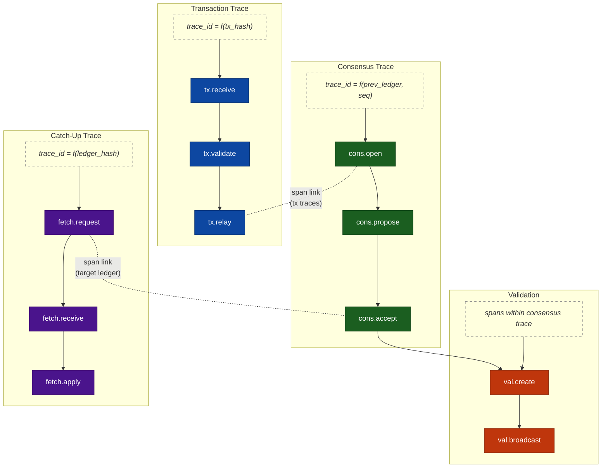
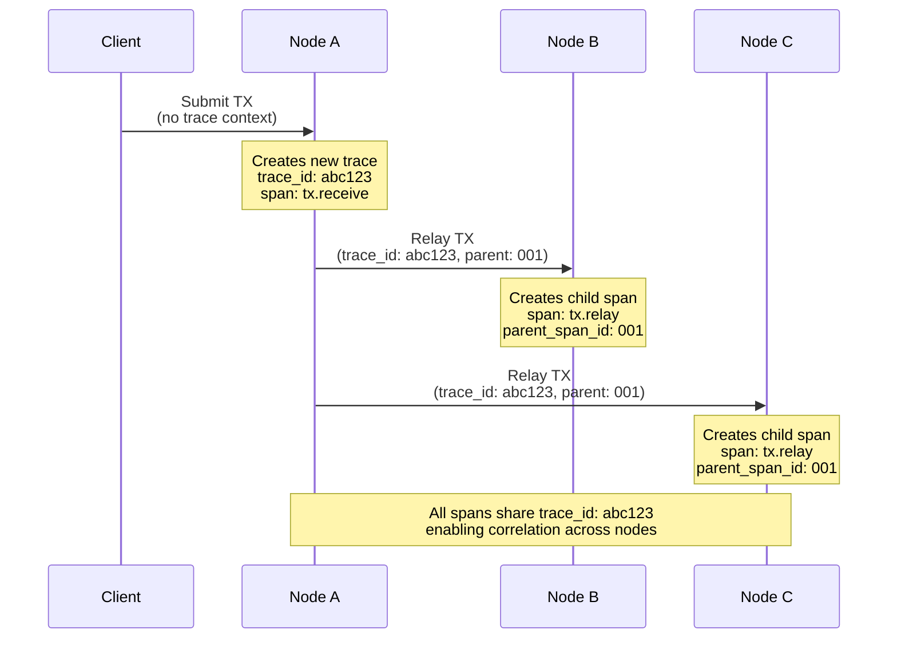

# Distributed Tracing Fundamentals

> **Parent Document**: [OpenTelemetryPlan.md](./OpenTelemetryPlan.md)
> **Next**: [Architecture Analysis](./01-architecture-analysis.md)

---

## What is Distributed Tracing?

Distributed tracing is a method for tracking data objects as they flow through distributed systems. In a network like XRP Ledger, a single transaction touches multiple independent nodes—each with no shared memory or logging. Distributed tracing connects these dots.

**Without tracing:** You see isolated logs on each node with no way to correlate them.

**With tracing:** You see the complete journey of a transaction or an event across all nodes it touched.

---

## Actors and Actions at a Glance

### Actors

| Who (Plain English)                            | Technical Term  |
| ---------------------------------------------- | --------------- |
| A single unit of work being tracked            | Span            |
| The complete journey of a request              | Trace           |
| Data that links spans across services          | Trace Context   |
| Code that creates spans and propagates context | Instrumentation |
| Service that receives and processes traces     | Collector       |
| Storage and visualization system               | Backend (Tempo) |
| Decision logic for which traces to keep        | Sampler         |

### Actions

| What Happens (Plain English)            | Technical Term          |
| --------------------------------------- | ----------------------- |
| Start tracking a new operation          | Create a Span           |
| Connect a child operation to its parent | Set `parent_span_id`    |
| Group all related operations together   | Share a `trace_id`      |
| Pass tracking data between services     | Context Propagation     |
| Decide whether to record a trace        | Sampling (Head or Tail) |
| Send completed traces to storage        | Export (OTLP)           |

---

## Core Concepts

### 1. Trace

A **trace** represents the entire journey of a request through the system. It has a unique `trace_id` that stays constant across all nodes.

```
Trace ID: abc123
├── Node A: received transaction
├── Node B: relayed transaction
├── Node C: included in consensus
└── Node D: applied to ledger
```

### 2. Span

A **span** represents a single unit of work within a trace. Each span has:

| Attribute        | Description                      | Example                    |
| ---------------- | -------------------------------- | -------------------------- |
| `trace_id`       | Identifies the trace             | `event123`                 |
| `span_id`        | Unique identifier                | `span456`                  |
| `parent_span_id` | Parent span (if any)             | `p_span123`                |
| `name`           | Operation name                   | `rpc.submit`               |
| `start_time`     | When work began (local time)     | `2024-01-15T10:30:00Z`     |
| `end_time`       | When work completed (local time) | `2024-01-15T10:30:00.050Z` |
| `attributes`     | Key-value metadata               | `tx.hash=ABC...`           |
| `status`         | OK, ERROR MSG                    | `OK`                       |

### 3. Trace Context

**Trace context** is the data that propagates between services to link spans together. It contains:

- `trace_id` - The trace this span belongs to
- `span_id` - The current span (becomes parent for child spans)
- `trace_flags` - Sampling decisions

---

## How Spans Form a Trace

Spans have parent-child relationships forming a tree structure:



**Reading the diagram:**

- **tx.submit (blue, root)**: The top-level span representing the entire transaction submission; all other spans are its descendants.
- **tx.validate, tx.relay, tx.apply (green)**: Direct children of tx.submit, representing the three main stages -- validation, relay to peers, and application to the ledger.
- **ledger.update (red)**: A grandchild span nested under tx.apply, representing the actual ledger state mutation triggered by applying the transaction.
- **Arrows (parent to child)**: Each arrow indicates a parent-child span relationship where the parent's completion depends on the child finishing.

The same trace visualized as a **timeline (Gantt chart)**:

```
Time →   0ms    10ms    20ms    30ms    40ms    50ms
         ├───────────────────────────────────────────┤
tx.submit│▓▓▓▓▓▓▓▓▓▓▓▓▓▓▓▓▓▓▓▓▓▓▓▓▓▓▓▓▓▓▓▓▓▓▓▓▓▓▓▓▓▓│
         ├─────┤
tx.valid │▓▓▓▓▓│
         │     ├──────────┤
tx.relay │     │▓▓▓▓▓▓▓▓▓▓│
         │               ├────────────────────────────┤
tx.apply │               │▓▓▓▓▓▓▓▓▓▓▓▓▓▓▓▓▓▓▓▓▓▓▓▓▓▓▓▓│
         │                         ├──────────────────┤
ledger   │                         │▓▓▓▓▓▓▓▓▓▓▓▓▓▓▓▓▓▓│
```

---

## Span Relationships

Spans don't always form simple parent-child trees. Distributed tracing defines several relationship types to capture different causal patterns:

### 1. Parent-Child (ChildOf)

The default relationship. The parent span **depends on** or **contains** the child span. The child runs within the scope of the parent.

```
tx.submit (parent)
├── tx.validate (child)     ← parent waits for this
├── tx.relay (child)        ← parent waits for this
└── tx.apply (child)        ← parent waits for this
```

**When to use:** Synchronous calls, nested operations, any case where the parent's completion depends on the child.

### 2. Follows-From

A causal relationship where the first span **triggers** the second, but does **not wait** for it. The originator fires and moves on.

```
Time →

tx.receive [=======]
                     ↓ triggers (follows-from)
              tx.relay   [===========]   ← runs independently
```

**When to use:** Asynchronous jobs, queued work, fire-and-forget patterns. For example, a node receives a transaction and queues it for relay — the relay span _follows from_ the receive span but the receiver doesn't wait for relaying to complete.

> **OpenTracing** defined `FollowsFrom` as a first-class reference type alongside `ChildOf`.
> **OpenTelemetry** represents this using **Span Links** with descriptive attributes instead (see below).

### 3. Span Links (Cross-Trace and Non-Hierarchical)

Links connect spans that are **causally related but not in a parent-child hierarchy**. Unlike parent-child, links can cross trace boundaries.

```
Trace A                          Trace B
──────                           ──────
batch.schedule                   batch.execute
├─ item.enqueue (span X)    ┌──► process.item
├─ item.enqueue (span Y) ───┤    (links to X, Y, Z)
├─ item.enqueue (span Z)    └──►
```

**Use cases:**

| Pattern              | Description                                                                 |
| -------------------- | --------------------------------------------------------------------------- |
| **Batch processing** | A batch span links back to all individual spans that contributed to it      |
| **Fan-in**           | An aggregation span links to the multiple producer spans it merges          |
| **Fan-out**          | Multiple downstream spans link back to the single span that triggered them  |
| **Async handoff**    | A deferred job links back to the request that queued it (follows-from)      |
| **Cross-trace**      | Correlating spans across independent traces (e.g., retries, related events) |

**Link structure:** Each link carries the target span's context plus optional attributes:

```
Link {
    trace_id:   <target trace>
    span_id:    <target span>
    attributes: { "link.description": "triggered by batch scheduler" }
}
```

### Relationship Summary



| Relationship     | Same Trace? | Dependency?                | OTel Mechanism    |
| ---------------- | ----------- | -------------------------- | ----------------- |
| **Parent-Child** | Yes         | Parent depends on child    | `parent_span_id`  |
| **Follows-From** | Usually     | Causal but no dependency   | Link + attributes |
| **Span Link**    | Either      | Correlation, no dependency | Link + attributes |

---

## Trace ID Generation

A `trace_id` is a 128-bit (16-byte) identifier that groups all spans belonging to one logical operation. How it's generated determines how easily you can find and correlate traces later.

### General Approaches

#### 1. Random (W3C Default)

Generate a random 128-bit ID when a trace starts. Standard approach for most services.

```
trace_id = random_128_bits()
```

| Pros                        | Cons                                          |
| --------------------------- | --------------------------------------------- |
| Simple, standard            | No natural correlation to domain events       |
| Guaranteed unique per trace | If propagation is lost, trace is broken       |
| Works with all OTel tooling | "Find trace for TX abc" requires index lookup |

#### 2. Deterministic (Derived from Domain Data)

Compute the trace_id from a hash of a natural identifier. Every node independently derives the **same** trace_id for the same event.

```
trace_id = SHA-256(domain_identifier)[0:16]   // truncate to 128 bits
```

| Pros                                                | Cons                                                       |
| --------------------------------------------------- | ---------------------------------------------------------- |
| Propagation-resilient — same ID computed everywhere | Same event processed twice (retry) shares trace_id         |
| Natural search — domain ID maps directly to trace   | Non-standard (tooling assumes random)                      |
| No coordination needed between nodes                | 256→128 bit truncation (collision risk negligible at ~2⁶⁴) |

#### 3. Hybrid (Deterministic Prefix + Random Suffix)

First 8 bytes derived from domain data, last 8 bytes random.

```
trace_id = SHA-256(domain_identifier)[0:8] || random_64_bits()
```

| Pros                                        | Cons                                     |
| ------------------------------------------- | ---------------------------------------- |
| Prefix search: "find all traces for TX abc" | Must propagate to maintain full trace_id |
| Unique per processing instance              | More complex generation logic            |
| Retries get distinct trace_ids              | Partial correlation only (prefix match)  |

### XRPL Workflow Analysis

XRPL has a unique advantage: its core workflows produce **globally unique 256-bit hashes** that are known on every node. This makes deterministic trace_id generation practical in ways most systems can't achieve.

#### Natural Identifiers by Workflow

| Workflow            | Natural Identifier                | Size       | Known at Start?               | Same on All Nodes?               |
| ------------------- | --------------------------------- | ---------- | ----------------------------- | -------------------------------- |
| **Transaction**     | Transaction hash (`tid_`)         | 256-bit    | Yes — computed before signing | Yes — hash of canonical tx data  |
| **Consensus round** | Previous ledger hash + ledger seq | 256+32 bit | Yes — known when round opens  | Yes — all validators agree       |
| **Validation**      | Ledger hash being validated       | 256-bit    | Yes — from consensus result   | Yes — same closed ledger         |
| **Ledger catch-up** | Target ledger hash                | 256-bit    | Yes — we know what to fetch   | Yes — identifies ledger globally |

#### Where These Identifiers Live in Code

```
Transaction:     STTx::getTransactionID()     → uint256 tid_
                 TMTransaction::rawTransaction → recompute hash from bytes

Consensus:       ConsensusProposal::prevLedger_ → uint256 (previous ledger hash)
                 ConsensusProposal::position_   → uint256 (TxSet hash)
                 LedgerHeader::seq              → uint32_t (ledger sequence)

Validation:      STValidation::getLedgerHash()  → uint256
                 STValidation::getNodeID()      → NodeID (160-bit)

Ledger fetch:    InboundLedger constructor      → uint256 hash, uint32_t seq
                 TMGetLedger::ledgerHash        → bytes (uint256)
```

### Recommended Strategy: Workflow-Scoped Deterministic

Each workflow type derives its trace_id from its natural domain identifier:

```
Transaction trace:   trace_id = SHA-256("tx"    || tx_hash)[0:16]
Consensus trace:     trace_id = SHA-256("cons"  || prev_ledger_hash || ledger_seq)[0:16]
Ledger catch-up:     trace_id = SHA-256("fetch" || target_ledger_hash)[0:16]
```

The string prefix (`"tx"`, `"cons"`, `"fetch"`) prevents collisions between workflows that might share underlying hashes.

**Why this works for XRPL:**

1. **Propagation-resilient** — Even if a P2P message drops trace context, every node independently computes the same trace_id from the same tx_hash or ledger_hash. Spans still correlate.

2. **Zero-cost search** — "Show me the trace for transaction ABC" becomes a direct lookup: compute `SHA-256("tx" || ABC)[0:16]` and query. No secondary index needed.

3. **Cross-workflow linking via Span Links** — A consensus trace links to individual transaction traces. A validation span links to the consensus trace. This connects the full picture without forcing everything into one giant trace.

### Cross-Workflow Correlation

Each workflow gets its own trace. Span Links tie them together:



**Reading the diagram:**

- **Transaction Trace (blue)**: An independent trace whose `trace_id` is deterministically derived from the transaction hash. Contains receive, validate, and relay spans.
- **Consensus Trace (green)**: An independent trace whose `trace_id` is derived from the previous ledger hash and sequence number. Covers the open, propose, and accept phases.
- **Validation (red)**: Validation spans live within the consensus trace (not a separate trace). They are created after the accept phase completes.
- **Catch-Up Trace (purple)**: An independent trace for ledger acquisition, derived from the target ledger hash. Used when a node is behind and fetching missing ledgers.
- **Dotted arrows (span links)**: Cross-trace correlations. Consensus links to transaction traces it included; catch-up links to the consensus trace that produced the target ledger.
- **Solid arrow (C3 to V1)**: A parent-child relationship -- validation spans are direct children of the consensus accept span within the same trace.

**How a query flows:**

```
"Why was TX abc slow?"
  1. Compute trace_id = SHA-256("tx" || abc)[0:16]
  2. Find transaction trace → see it was included in consensus round N
  3. Follow span link → consensus trace for round N
  4. See which phase was slow (propose? accept?)
  5. If a node was catching up, follow link → catch-up trace
```

### Trade-offs to Consider

| Concern                       | Mitigation                                                                                                                    |
| ----------------------------- | ----------------------------------------------------------------------------------------------------------------------------- |
| **Retries get same trace_id** | Add `attempt` attribute to root span; spans have unique span_ids and timestamps                                               |
| **256→128 bit truncation**    | Birthday-bound collision at ~2⁶⁴ operations — negligible for XRPL's throughput                                                |
| **Non-standard generation**   | OTel spec allows any 16-byte non-zero value; tooling works on the hex string                                                  |
| **Hash computation cost**     | SHA-256 is ~0.3μs per call; XRPL already computes these hashes for other purposes                                             |
| **Late-binding identifiers**  | Ledger hash isn't known until after consensus — validation spans use ledger_seq as fallback, then link to the consensus trace |

---

## Distributed Traces Across Nodes

In distributed systems like rippled, traces span **multiple independent nodes**. The trace context must be propagated in network messages:



**Reading the diagram:**

- **Client**: The external entity that submits a transaction. It does not carry trace context -- the trace originates at the first node.
- **Node A**: The entry point that creates a new trace (trace_id: abc123) and the root span `tx.receive`. It relays the transaction to peers with trace context attached.
- **Node B and Node C**: Peer nodes that receive the relayed transaction along with the propagated trace context. Each creates a child span under Node A's span, preserving the same `trace_id`.
- **Arrows with trace context**: The relay messages carry `trace_id` and `parent_span_id`, allowing each downstream node to link its spans back to the originating span on Node A.

---

## Context Propagation

For traces to work across nodes, **trace context must be propagated** in messages.

### What's in the Context (~26 bytes)

| Field         | Size     | Description                                             |
| ------------- | -------- | ------------------------------------------------------- |
| `trace_id`    | 16 bytes | Identifies the entire trace (constant across all nodes) |
| `span_id`     | 8 bytes  | The sender's current span (becomes parent on receiver)  |
| `trace_flags` | 1 byte   | Sampling decision (bit 0 = sampled; bits 1-7 reserved)  |
| `trace_state` | variable | Optional vendor-specific data (typically omitted)       |

### How span_id Changes at Each Hop

Only **one** `span_id` travels in the context - the sender's current span. Each node:

1. Extracts the received `span_id` and uses it as the `parent_span_id`
2. Creates a **new** `span_id` for its own span
3. Sends its own `span_id` as the parent when forwarding

```
Node A                      Node B                      Node C
──────                      ──────                      ──────

Span AAA                    Span BBB                    Span CCC
   │                           │                           │
   ▼                           ▼                           ▼
Context out:                Context out:                Context out:
├─ trace_id: abc123         ├─ trace_id: abc123         ├─ trace_id: abc123
├─ span_id: AAA ──────────► ├─ span_id: BBB ──────────► ├─ span_id: CCC ──────►
└─ flags: 01                └─ flags: 01                └─ flags: 01
                               │                           │
                          parent = AAA               parent = BBB
```

The `trace_id` stays constant, but `span_id` **changes at every hop** to maintain the parent-child chain.

### Propagation Formats

There are two patterns:

### HTTP/RPC Headers (W3C Trace Context)

```
traceparent: 00-4bf92f3577b34da6a3ce929d0e0e4736-00f067aa0ba902b7-01
             │  │                                │                │
             │  │                                │                └── Flags (sampled)
             │  │                                └── Parent span ID (16 hex)
             │  └── Trace ID (32 hex)
             └── Version
```

### Protocol Buffers (rippled P2P messages)

```protobuf
message TMTransaction {
    bytes rawTransaction = 1;
    // ... existing fields ...

    // Trace context extension
    bytes trace_parent = 100;  // W3C traceparent
    bytes trace_state = 101;   // W3C tracestate
}
```

---

## Sampling

Not every trace needs to be recorded. **Sampling** reduces overhead:

### Head Sampling (at trace start)

```
Request arrives → Random 10% chance → Record or skip entire trace
```

- ✅ Low overhead
- ❌ May miss interesting traces

### Tail Sampling (after trace completes)

```
Trace completes → Collector evaluates:
                  - Error? → KEEP
                  - Slow? → KEEP
                  - Normal? → Sample 10%
```

- ✅ Never loses important traces
- ❌ Higher memory usage at collector

---

## Key Benefits for rippled

| Challenge                          | How Tracing Helps                        |
| ---------------------------------- | ---------------------------------------- |
| "Where is my transaction?"         | Follow trace across all nodes it touched |
| "Why was consensus slow?"          | See timing breakdown of each phase       |
| "Which node is the bottleneck?"    | Compare span durations across nodes      |
| "What happened during the outage?" | Correlate errors across the network      |

---

## Glossary

| Term                 | Definition                                                          |
| -------------------- | ------------------------------------------------------------------- |
| **Trace**            | Complete journey of a request, identified by `trace_id`             |
| **Span**             | Single operation within a trace                                     |
| **Parent-Child**     | Span relationship where the parent depends on the child             |
| **Follows-From**     | Causal relationship where originator doesn't wait for the result    |
| **Span Link**        | Non-hierarchical connection between spans, possibly across traces   |
| **Deterministic ID** | Trace ID derived from domain data (e.g., tx_hash) instead of random |
| **Context**          | Data propagated between services (`trace_id`, `span_id`, flags)     |
| **Instrumentation**  | Code that creates spans and propagates context                      |
| **Collector**        | Service that receives, processes, and exports traces                |
| **Backend**          | Storage/visualization system (Tempo)                                |
| **Head Sampling**    | Sampling decision at trace start                                    |
| **Tail Sampling**    | Sampling decision after trace completes                             |

---

_Next: [Architecture Analysis](./01-architecture-analysis.md)_ | _Back to: [Overview](./OpenTelemetryPlan.md)_
