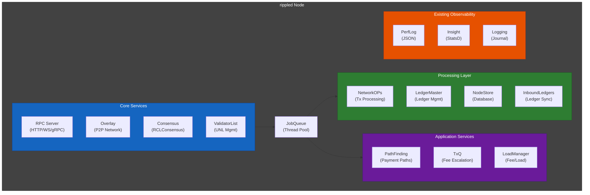
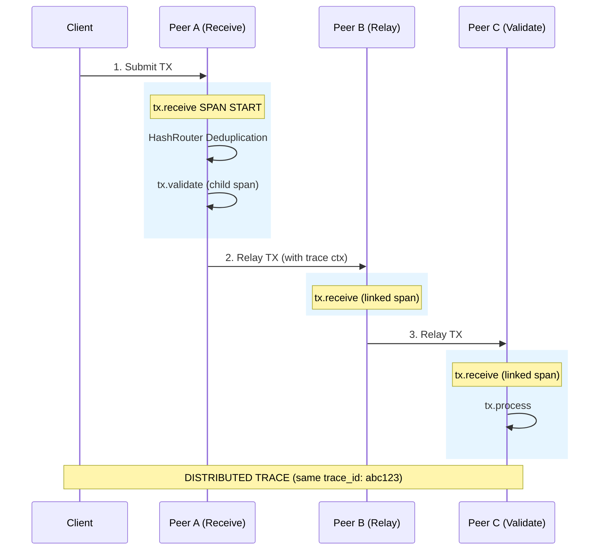
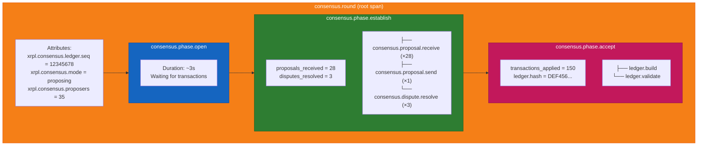
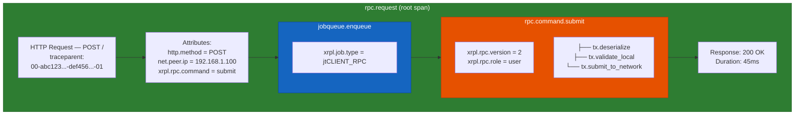
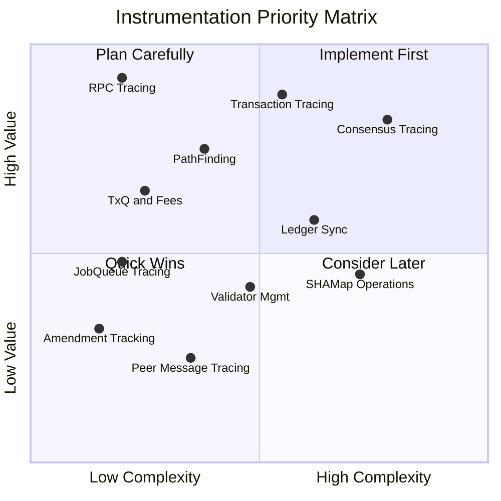
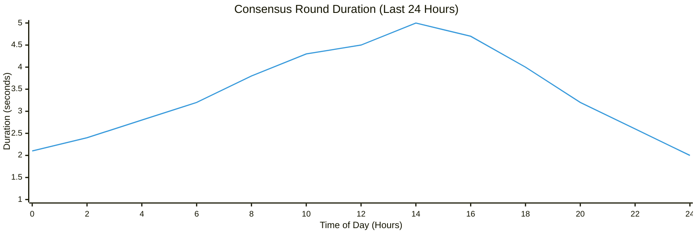

# Architecture Analysis

> **Parent Document**: [OpenTelemetryPlan.md](./OpenTelemetryPlan.md)
> **Related**: [Design Decisions](./02-design-decisions.md) | [Implementation Strategy](./03-implementation-strategy.md)

---

## 1.1 Current rippled Architecture Overview

> **WS** = WebSocket | **UNL** = Unique Node List | **TxQ** = Transaction Queue | **StatsD** = Statistics Daemon

The rippled node software consists of several interconnected components that need instrumentation for distributed tracing:



**Reading the diagram:**

- **Core Services (blue)**: The entry points into rippled -- RPC Server handles client requests, Overlay manages peer-to-peer networking, Consensus drives agreement, and ValidatorList manages trusted validators.
- **JobQueue (center)**: The asynchronous thread pool that decouples Core Services from the Processing and Application layers. All work flows through it.
- **Processing Layer (green)**: Core business logic -- NetworkOPs processes transactions, LedgerMaster manages ledger state, NodeStore handles persistence, and InboundLedgers synchronizes missing data.
- **Application Services (purple)**: Higher-level features -- PathFinding computes payment routes, TxQ manages fee-based queuing, and LoadManager tracks server load.
- **Existing Observability (orange)**: The current monitoring stack (PerfLog, Insight, Journal logging) that OpenTelemetry will complement, not replace.
- **Arrows (Services to JobQueue to layers)**: Work originates at Core Services, is enqueued onto the JobQueue, and dispatched to Processing or Application layers for execution.

---

## 1.1.1 Actors and Actions

### Actors

| Who (Plain English)                       | Technical Term             |
| ----------------------------------------- | -------------------------- |
| Network node running XRPL software        | rippled node               |
| External client submitting requests       | RPC Client                 |
| Network neighbor sharing data             | Peer (PeerImp)             |
| Request handler for client queries        | RPC Server (ServerHandler) |
| Command executor for specific RPC methods | RPCHandler                 |
| Agreement process between nodes           | Consensus (RCLConsensus)   |
| Transaction processing coordinator        | NetworkOPs                 |
| Background task scheduler                 | JobQueue                   |
| Ledger state manager                      | LedgerMaster               |
| Payment route calculator                  | PathFinding (Pathfinder)   |
| Transaction waiting room                  | TxQ (Transaction Queue)    |
| Fee adjustment system                     | LoadManager                |
| Trusted validator list manager            | ValidatorList              |
| Protocol upgrade tracker                  | AmendmentTable             |
| Ledger state hash tree                    | SHAMap                     |
| Persistent key-value storage              | NodeStore                  |

### Actions

| What Happens (Plain English)                   | Technical Term         |
| ---------------------------------------------- | ---------------------- |
| Client sends a request to a node               | `rpc.request`          |
| Node executes a specific RPC command           | `rpc.command.*`        |
| Node receives a transaction from a peer        | `tx.receive`           |
| Node checks if a transaction is valid          | `tx.validate`          |
| Node forwards a transaction to neighbors       | `tx.relay`             |
| Nodes agree on which transactions to include   | `consensus.round`      |
| Consensus progresses through phases            | `consensus.phase.*`    |
| Node builds a new confirmed ledger             | `ledger.build`         |
| Node fetches missing ledger data from peers    | `ledger.acquire`       |
| Node computes payment routes                   | `pathfind.compute`     |
| Node queues a transaction for later processing | `txq.enqueue`          |
| Node increases fees due to high load           | `fee.escalate`         |
| Node fetches the latest trusted validator list | `validator.list.fetch` |
| Node votes on a protocol amendment             | `amendment.vote`       |
| Node synchronizes state tree data              | `shamap.sync`          |

---

## 1.2 Key Components for Instrumentation

> **TxQ** = Transaction Queue | **UNL** = Unique Node List

| Component          | Location                                   | Purpose                  | Trace Value                      |
| ------------------ | ------------------------------------------ | ------------------------ | -------------------------------- |
| **Overlay**        | `src/xrpld/overlay/`                       | P2P communication        | Message propagation timing       |
| **PeerImp**        | `src/xrpld/overlay/detail/PeerImp.cpp`     | Individual peer handling | Per-peer latency                 |
| **RCLConsensus**   | `src/xrpld/app/consensus/RCLConsensus.cpp` | Consensus algorithm      | Round timing, phase analysis     |
| **NetworkOPs**     | `src/xrpld/app/misc/NetworkOPs.cpp`        | Transaction processing   | Tx lifecycle tracking            |
| **ServerHandler**  | `src/xrpld/rpc/detail/ServerHandler.cpp`   | RPC entry point          | Request latency                  |
| **RPCHandler**     | `src/xrpld/rpc/detail/RPCHandler.cpp`      | Command execution        | Per-command timing               |
| **JobQueue**       | `src/xrpl/core/JobQueue.h`                 | Async task execution     | Queue wait times                 |
| **PathFinding**    | `src/xrpld/app/paths/`                     | Payment path computation | Path latency, cache hits         |
| **TxQ**            | `src/xrpld/app/misc/TxQ.cpp`               | Transaction queue/fees   | Queue depth, eviction rates      |
| **LoadManager**    | `src/xrpld/app/main/LoadManager.cpp`       | Fee escalation/load      | Fee levels, load factors         |
| **InboundLedgers** | `src/xrpld/app/ledger/InboundLedgers.cpp`  | Ledger acquisition       | Sync time, peer reliability      |
| **ValidatorList**  | `src/xrpld/app/misc/ValidatorList.cpp`     | UNL management           | List freshness, fetch failures   |
| **AmendmentTable** | `src/xrpld/app/misc/AmendmentTable.cpp`    | Protocol amendments      | Voting status, activation events |
| **SHAMap**         | `src/xrpld/shamap/`                        | State hash tree          | Sync speed, missing nodes        |

---

## 1.3 Transaction Flow Diagram

Transaction flow spans multiple nodes in the network. Each node creates linked spans to form a distributed trace:



**Reading the diagram:**

- **Client**: The external entity that submits a transaction to Peer A. It has no trace context -- the trace starts at the first node.
- **Peer A (Receive)**: The entry node that creates the root span `tx.receive`, runs HashRouter deduplication to avoid processing duplicates, and creates a child `tx.validate` span.
- **Peer A to Peer B arrow**: The relay message carries trace context (trace_id + parent span_id), enabling Peer B to create a linked span under the same trace.
- **Peer B (Relay)**: Receives the transaction and trace context, creates a `tx.receive` span linked to Peer A's trace, then relays onward.
- **Peer C (Validate)**: Final hop in this example. Creates a linked `tx.receive` span and runs `tx.process` to fully process the transaction.
- **Blue rectangles**: Highlight the span boundaries on each node, showing where instrumentation creates and closes spans.

### Trace Structure

```
trace_id: abc123
├── span: tx.receive (Peer A)
│   ├── span: tx.validate
│   └── span: tx.relay
├── span: tx.receive (Peer B) [parent: Peer A]
│   └── span: tx.relay
└── span: tx.receive (Peer C) [parent: Peer B]
    └── span: tx.process
```

---

## 1.4 Consensus Round Flow

Consensus rounds are multi-phase operations that benefit significantly from tracing:



**Reading the diagram:**

- **consensus.round (orange, root span)**: The top-level span encompassing the entire consensus round, with attributes like ledger sequence, mode, and proposer count.
- **consensus.phase.open (blue)**: The first phase where the node waits (~3s) to collect incoming transactions before proposing.
- **consensus.phase.establish (green)**: The negotiation phase where validators exchange proposals, resolve disputes, and converge on a transaction set. Child spans track each proposal received/sent and each dispute resolved.
- **consensus.phase.accept (pink)**: The final phase where the agreed transaction set is applied, a new ledger is built, and the ledger is validated. Child spans cover `ledger.build` and `ledger.validate`.
- **Arrows (open to establish to accept)**: The sequential flow through the three consensus phases. Each phase must complete before the next begins.

---

## 1.5 RPC Request Flow

> **WS** = WebSocket

RPC requests support W3C Trace Context headers for distributed tracing across services:



**Reading the diagram:**

- **rpc.request (green, root span)**: The outermost span representing the full RPC request lifecycle, from HTTP receipt to response. Carries the W3C `traceparent` header for distributed tracing.
- **HTTP Request node**: Shows the incoming POST request with its `traceparent` header and extracted attributes (method, peer IP, command name).
- **jobqueue.enqueue (blue)**: The span covering the asynchronous handoff from the RPC thread to the JobQueue worker thread. The trace context is preserved across this async boundary.
- **rpc.command.submit (orange)**: The span for the actual command execution, with child spans for deserialization, local validation, and network submission.
- **Response node**: The final output with HTTP status and total duration, marking the end of the root span.
- **Arrows (top to bottom)**: The sequential processing pipeline -- receive request, extract attributes, enqueue job, execute command, return response.

---

## 1.6 Key Trace Points

> **TxQ** = Transaction Queue

The following table identifies priority instrumentation points across the codebase:

| Category        | Span Name              | File                   | Method                  | Priority |
| --------------- | ---------------------- | ---------------------- | ----------------------- | -------- |
| **Transaction** | `tx.receive`           | `PeerImp.cpp`          | `handleTransaction()`   | High     |
| **Transaction** | `tx.validate`          | `NetworkOPs.cpp`       | `processTransaction()`  | High     |
| **Transaction** | `tx.process`           | `NetworkOPs.cpp`       | `doTransactionSync()`   | High     |
| **Transaction** | `tx.relay`             | `OverlayImpl.cpp`      | `relay()`               | Medium   |
| **Consensus**   | `consensus.round`      | `RCLConsensus.cpp`     | `startRound()`          | High     |
| **Consensus**   | `consensus.phase.*`    | `Consensus.h`          | `timerEntry()`          | High     |
| **Consensus**   | `consensus.proposal.*` | `RCLConsensus.cpp`     | `peerProposal()`        | Medium   |
| **RPC**         | `rpc.request`          | `ServerHandler.cpp`    | `onRequest()`           | High     |
| **RPC**         | `rpc.command.*`        | `RPCHandler.cpp`       | `doCommand()`           | High     |
| **Peer**        | `peer.connect`         | `OverlayImpl.cpp`      | `onHandoff()`           | Low      |
| **Peer**        | `peer.message.*`       | `PeerImp.cpp`          | `onMessage()`           | Low      |
| **Ledger**      | `ledger.acquire`       | `InboundLedgers.cpp`   | `acquire()`             | Medium   |
| **Ledger**      | `ledger.build`         | `RCLConsensus.cpp`     | `buildLCL()`            | High     |
| **PathFinding** | `pathfind.request`     | `PathRequest.cpp`      | `doUpdate()`            | High     |
| **PathFinding** | `pathfind.compute`     | `Pathfinder.cpp`       | `findPaths()`           | High     |
| **TxQ**         | `txq.enqueue`          | `TxQ.cpp`              | `apply()`               | High     |
| **TxQ**         | `txq.apply`            | `TxQ.cpp`              | `processClosedLedger()` | High     |
| **Fee**         | `fee.escalate`         | `LoadManager.cpp`      | `raiseLocalFee()`       | Medium   |
| **Ledger**      | `ledger.replay`        | `LedgerReplayer.h`     | `replay()`              | Medium   |
| **Ledger**      | `ledger.delta`         | `LedgerDeltaAcquire.h` | `processData()`         | Medium   |
| **Validator**   | `validator.list.fetch` | `ValidatorList.cpp`    | `verify()`              | Medium   |
| **Validator**   | `validator.manifest`   | `Manifest.cpp`         | `applyManifest()`       | Low      |
| **Amendment**   | `amendment.vote`       | `AmendmentTable.cpp`   | `doVoting()`            | Low      |
| **SHAMap**      | `shamap.sync`          | `SHAMap.cpp`           | `fetchRoot()`           | Medium   |

---

## 1.7 Instrumentation Priority

> **TxQ** = Transaction Queue



---

## 1.8 Observable Outcomes

> **TxQ** = Transaction Queue | **UNL** = Unique Node List

After implementing OpenTelemetry, operators and developers will gain visibility into the following:

### 1.8.1 What You Will See: Traces

| Trace Type                 | Description                                                                                 | Example Query in Grafana/Tempo                         |
| -------------------------- | ------------------------------------------------------------------------------------------- | ------------------------------------------------------ |
| **Transaction Lifecycle**  | Full journey from RPC submission through validation, relay, consensus, and ledger inclusion | `{service.name="rippled" && xrpl.tx.hash="ABC123..."}` |
| **Cross-Node Propagation** | Transaction path across multiple rippled nodes with timing                                  | `{xrpl.tx.relay_count > 0}`                            |
| **Consensus Rounds**       | Complete round with all phases (open, establish, accept)                                    | `{span.name=~"consensus.round.*"}`                     |
| **RPC Request Processing** | Individual command execution with timing breakdown                                          | `{xrpl.rpc.command="account_info"}`                    |
| **Ledger Acquisition**     | Peer-to-peer ledger data requests and responses                                             | `{span.name="ledger.acquire"}`                         |
| **PathFinding Latency**    | Path computation time and cache effectiveness for payment RPCs                              | `{span.name="pathfind.compute"}`                       |
| **TxQ Behavior**           | Queue depth, eviction patterns, fee escalation during congestion                            | `{span.name=~"txq.*"}`                                 |
| **Ledger Sync**            | Full acquisition timeline including delta and transaction fetches                           | `{span.name=~"ledger.acquire.*"}`                      |
| **Validator Health**       | UNL fetch success, manifest updates, stale list detection                                   | `{span.name=~"validator.*"}`                           |

### 1.8.2 What You Will See: Metrics (Derived from Traces)

| Metric                        | Description                             | Dashboard Panel             |
| ----------------------------- | --------------------------------------- | --------------------------- |
| **RPC Latency (p50/p95/p99)** | Response time distribution per command  | Heatmap by command          |
| **Transaction Throughput**    | Transactions processed per second       | Time series graph           |
| **Consensus Round Duration**  | Time to complete consensus phases       | Histogram                   |
| **Cross-Node Latency**        | Time for transaction to reach N nodes   | Line chart with percentiles |
| **Error Rate**                | Failed transactions/RPC calls by type   | Stacked bar chart           |
| **PathFinding Latency**       | Path computation time per currency pair | Heatmap by currency         |
| **TxQ Depth**                 | Queued transactions over time           | Time series with thresholds |
| **Fee Escalation Level**      | Current fee multiplier                  | Gauge with alert thresholds |
| **Ledger Sync Duration**      | Time to acquire missing ledgers         | Histogram                   |

### 1.8.3 Concrete Dashboard Examples

**Transaction Trace View (Tempo):**

```
┌────────────────────────────────────────────────────────────────────────────────┐
│ Trace: abc123... (Transaction Submission)                    Duration: 847ms   │
├────────────────────────────────────────────────────────────────────────────────┤
│ ├── rpc.request [ServerHandler]                              ████░░░░░░  45ms  │
│ │   └── rpc.command.submit [RPCHandler]                      ████░░░░░░  42ms  │
│ │       └── tx.receive [NetworkOPs]                          ███░░░░░░░  35ms  │
│ │           ├── tx.validate [TxQ]                            █░░░░░░░░░   8ms  │
│ │           └── tx.relay [Overlay]                           ██░░░░░░░░  15ms  │
│ │               ├── tx.receive [Node-B]                      █████░░░░░  52ms  │
│ │               │   └── tx.relay [Node-B]                    ██░░░░░░░░  18ms  │
│ │               └── tx.receive [Node-C]                      ██████░░░░  65ms  │
│ └── consensus.round [RCLConsensus]                           ████████░░ 720ms  │
│     ├── consensus.phase.open                                 ██░░░░░░░░ 180ms  │
│     ├── consensus.phase.establish                            █████░░░░░ 480ms  │
│     └── consensus.phase.accept                               █░░░░░░░░░  60ms  │
└────────────────────────────────────────────────────────────────────────────────┘
```

**RPC Performance Dashboard Panel:**

```
┌─────────────────────────────────────────────────────────────┐
│ RPC Command Latency (Last 1 Hour)                           │
├─────────────────────────────────────────────────────────────┤
│ Command          │ p50    │ p95    │ p99    │ Errors │ Rate │
│──────────────────┼────────┼────────┼────────┼────────┼──────│
│ account_info     │  12ms  │  45ms  │  89ms  │  0.1%  │ 150/s│
│ submit           │  35ms  │ 120ms  │ 250ms  │  2.3%  │  45/s│
│ ledger           │   8ms  │  25ms  │  55ms  │  0.0%  │  80/s│
│ tx               │  15ms  │  50ms  │ 100ms  │  0.5%  │  60/s│
│ server_info      │   5ms  │  12ms  │  20ms  │  0.0%  │ 200/s│
└─────────────────────────────────────────────────────────────┘
```

**Consensus Health Dashboard Panel:**



### 1.8.4 Operator Actionable Insights

| Scenario                  | What You'll See                                                              | Action                                           |
| ------------------------- | ---------------------------------------------------------------------------- | ------------------------------------------------ |
| **Slow RPC**              | Span showing which phase is slow (parsing, execution, serialization)         | Optimize specific code path                      |
| **Transaction Stuck**     | Trace stops at validation; error attribute shows reason                      | Fix transaction parameters                       |
| **Consensus Delay**       | Phase.establish taking too long; proposer attribute shows missing validators | Investigate network connectivity                 |
| **Memory Spike**          | Large batch of spans correlating with memory increase                        | Tune batch_size or sampling                      |
| **Network Partition**     | Traces missing cross-node links for specific peer                            | Check peer connectivity                          |
| **Path Computation Slow** | pathfind.compute span shows high latency; cache miss rate in attributes      | Warm the RippleLineCache, check order book depth |
| **TxQ Full**              | txq.enqueue spans show evictions; fee.escalate spans increasing              | Monitor fee levels, alert operators              |
| **Ledger Sync Stalled**   | ledger.acquire spans timing out; peer reliability attributes show issues     | Check peer connectivity, add trusted peers       |
| **UNL Stale**             | validator.list.fetch spans failing; last_update attribute aging              | Verify validator site URLs, check DNS            |

### 1.8.5 Developer Debugging Workflow

1. **Find Transaction**: Query by `xrpl.tx.hash` to get full trace
2. **Identify Bottleneck**: Look at span durations to find slowest component
3. **Check Attributes**: Review `xrpl.tx.validity`, `xrpl.rpc.status` for errors
4. **Correlate Logs**: Use `trace_id` to find related PerfLog entries
5. **Compare Nodes**: Filter by `service.instance.id` to compare behavior across nodes

---

_Next: [Design Decisions](./02-design-decisions.md)_ | _Back to: [Overview](./OpenTelemetryPlan.md)_
