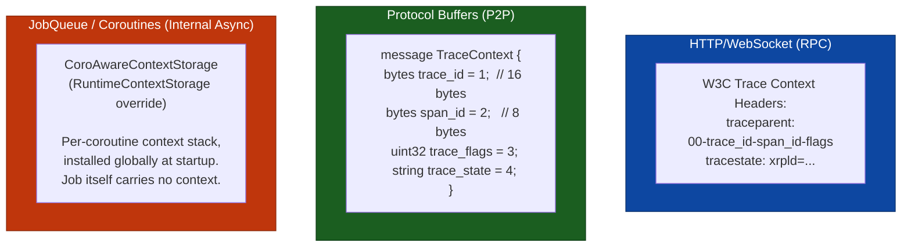
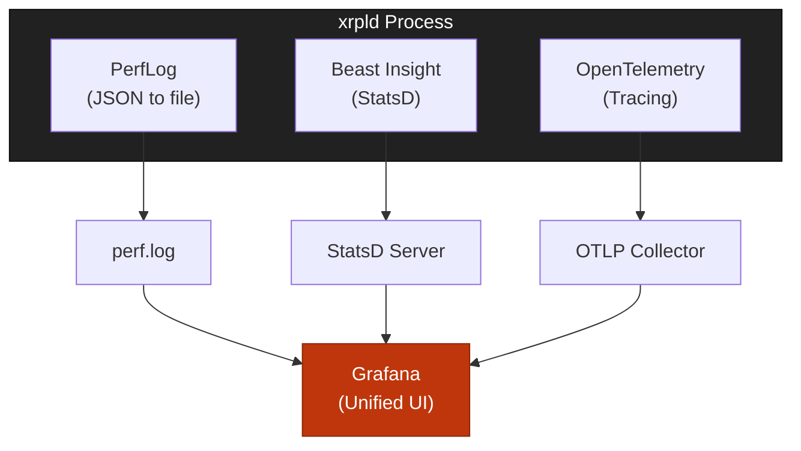

# Design Decisions

> **Parent Document**: [OpenTelemetryPlan.md](./OpenTelemetryPlan.md)
> **Related**: [Architecture Analysis](./01-architecture-analysis.md)

---

## 2.1 OpenTelemetry Components

> **OTLP** = OpenTelemetry Protocol

### 2.1.1 SDK Selection

**Primary Choice**: OpenTelemetry C++ SDK (`opentelemetry-cpp`)

| Component                               | Purpose                | Required                  |
| --------------------------------------- | ---------------------- | ------------------------- |
| `opentelemetry-cpp::api`                | Tracing API headers    | Yes                       |
| `opentelemetry-cpp::sdk`                | SDK implementation     | Yes                       |
| `opentelemetry-cpp::ext`                | Extensions (exporters) | Yes                       |
| `opentelemetry-cpp::otlp_http_exporter` | OTLP/HTTP export       | Yes (shipped in Phase 1b) |
| `opentelemetry-cpp::otlp_grpc_exporter` | OTLP/gRPC export       | Future (not yet wired up) |

### 2.1.2 Instrumentation Strategy

**Manual Instrumentation** (recommended):

| Approach   | Pros                                                            | Cons                                                    |
| ---------- | --------------------------------------------------------------- | ------------------------------------------------------- |
| **Manual** | Precise control, optimized placement, xrpld-specific attributes | More development effort                                 |
| **Auto**   | Less code, automatic coverage                                   | Less control, potential overhead, limited customization |

---

## 2.2 Exporter Configuration

> **OTLP** = OpenTelemetry Protocol


**Reading the diagram:**

- **xrpld Nodes (blue)**: The source of telemetry data. Each xrpld node exports spans via OTLP/HTTP on port 4318 (the only exporter shipped in Phase 1b).
- **OpenTelemetry Collector (red)**: The central aggregation point that receives spans from all nodes. Can run as a sidecar (per-node) or standalone (shared). Handles batching, filtering, and routing.
- **Observability Backends (green)**: The storage and visualization destinations. Tempo is the recommended backend for both development and production, and Elastic APM is an alternative. The Collector routes to one or more backends.
- **Arrows (nodes to collector to backends)**: The data pipeline -- spans flow from nodes to the Collector over HTTP, then the Collector fans out to the configured backends.

### 2.2.1 OTLP/HTTP (Shipped in Phase 1b)

OTLP/HTTP is the only exporter wired up in Phase 1b. It is configured via
`OtlpHttpExporterOptions` with the collector traces endpoint
(`http://localhost:4318/v1/traces` by default) and a JSON content type
(binary protobuf is also available).

### 2.2.2 OTLP/gRPC (Future Work — Planned Upgrade)

OTLP/gRPC is planned as a future upgrade from the HTTP exporter. The gRPC
transport offers lower per-span overhead and tighter back-pressure semantics
than HTTP/JSON, making it attractive for production deployments once the HTTP
path is validated in earlier phases.

Required to land this upgrade:

1. Add `opentelemetry-cpp::otlp_grpc_exporter` to the Conan recipe (the
   dependency already exists but is not linked in Phase 1b builds).
2. Extend `TelemetryConfig.cpp` to parse an `exporter` key (`otlp_http`
   default, `otlp_grpc` opt-in) and a gRPC endpoint override.
3. In `Telemetry::start()` branch on the parsed exporter type and construct
   either `OtlpHttpExporterFactory::Create(httpOpts)` or
   `OtlpGrpcExporterFactory::Create(grpcOpts)` accordingly.
4. Update the runbook and dashboards to document the alternate port and TLS
   settings.

When wired up, the gRPC path will use `OtlpGrpcExporterOptions` configured with
the collector endpoint (host on port 4317), TLS credentials enabled, and a CA
certificate path.

Until that work lands, `OtlpGrpcExporterOptions` is **not** used by any code
path in Phase 1b through Phase 5.

---

## 2.3 Span Naming Conventions

> **TxQ** = Transaction Queue | **UNL** = Unique Node List | **WS** = WebSocket

### 2.3.1 Naming Schema

```
<component>.<operation>[.<sub-operation>]
```

**Examples**:

- `tx.receive` - Transaction received from peer
- `consensus.phase.establish` - Consensus establish phase
- `rpc.command.server_info` - server_info RPC command

### 2.3.2 Complete Span Catalog

> **Status column.** This catalog is the design inventory; it is not a
> statement of what currently emits. `Live` means the span is present in the
> implemented inventory ([09-data-collection-reference.md §1.1](./09-data-collection-reference.md#11-complete-span-inventory-41-spans)),
> which is the authoritative list. `Renamed`/`Split` means the concept shipped
> under a different name than planned here. **Not built** means no span is
> emitted for it today.
>
> **"Not built" is not one thing.** All 14 such entries fall into three cases, and the
> fourth column says which — filing them all as oversights would be wrong:
>
> - **Superseded by metrics or logs (7)** — a deliberate trade-off: the signal is already
>   carried by a metric or by a log-derived panel, and a span would add per-event volume
>   without adding information. `tx.relay`, `fee.escalate`, `validator.list.fetch`,
>   `validator.manifest`, `shamap.sync`, `job.enqueue`, `job.execute`.
> - **Gap (6)** — nothing was decided; they were simply never instrumented. The four
>   `peer.*` entries, plus `ledger.replay` and `ledger.delta` — and those last two are the
>   sharpest, because they have **no metric substitute at all**.
> - **Deferred (1)** — scheduled work: `amendment.vote` (Phase 11).
>
> The four `peer.*` entries are the peer-span coverage gap: only
> `peer.proposal.receive` and `peer.validation.receive` exist, so protocol
> message send/receive and connection lifecycle are untraced. See
> [09 §6.4](./09-data-collection-reference.md#64-peer-span-coverage-gap-not-implemented).
>
> `tx.validate` did ship, but renamed and split three ways: the apply pipeline
> traces `tx.preflight` (stateless checks), `tx.preclaim` (ledger-state checks)
> and `tx.transactor` (application), each stamped with a `stage` attribute.
> Names come from `TxApplySpanNames.h:90,94,99`. The spans are created in two
> different files, not one: `tx.preflight` and `tx.preclaim` come from
> `applySteps.cpp` (`invokePreflight()` at `:211-212`, `invokePreclaim()` at
> `:258-261`, both via the shared `makeStageSpan()` helper at `:89-126`), while
> `tx.transactor` is created in `Transactor::operator()()`
> (`Transactor.cpp:1601-1605`). Query them with
> `name=~"tx\.(preflight|preclaim|transactor)"` — a **single** backslash; RE2
> reads `\\.` as a literal backslash followed by any character, which matches
> nothing here — never `name="tx.validate"`.

| Span name                      | Description                             | Status                                                           | Why not built / where the signal lives instead                                                                                                                                                                                                                                                             |
| ------------------------------ | --------------------------------------- | ---------------------------------------------------------------- | ---------------------------------------------------------------------------------------------------------------------------------------------------------------------------------------------------------------------------------------------------------------------------------------------------------- |
| `tx.receive`                   | Transaction received from network       | Live                                                             | —                                                                                                                                                                                                                                                                                                          |
| `tx.validate`                  | Transaction signature/format validation | Renamed + split → `tx.preflight`, `tx.preclaim`, `tx.transactor` | —                                                                                                                                                                                                                                                                                                          |
| `tx.process`                   | Full transaction processing             | Live                                                             | —                                                                                                                                                                                                                                                                                                          |
| `tx.relay`                     | Transaction relay to peers              | **Not built**                                                    | **Superseded by metrics.** Relay volume is carried by the overlay traffic counters (`total_bytes_in/out`, `total_messages_in/out`, per-`TrafficCount` category). Relay is also per-peer fan-out, so one span per relay multiplies by peer count for data the counters already aggregate.                   |
| `tx.apply`                     | Apply transaction to ledger             | Live                                                             | —                                                                                                                                                                                                                                                                                                          |
| `consensus.round`              | Complete consensus round                | Live                                                             | —                                                                                                                                                                                                                                                                                                          |
| `consensus.phase.open`         | Open phase - collecting transactions    | Live                                                             | —                                                                                                                                                                                                                                                                                                          |
| `consensus.phase.establish`    | Establish phase - reaching agreement    | Renamed `consensus.establish`                                    | —                                                                                                                                                                                                                                                                                                          |
| `consensus.phase.accept`       | Accept phase - applying consensus       | Renamed `consensus.accept`                                       | —                                                                                                                                                                                                                                                                                                          |
| `consensus.proposal.receive`   | Receive peer proposal                   | Live                                                             | —                                                                                                                                                                                                                                                                                                          |
| `consensus.proposal.send`      | Send our proposal                       | Live                                                             | —                                                                                                                                                                                                                                                                                                          |
| `consensus.validation.receive` | Receive peer validation                 | Live                                                             | —                                                                                                                                                                                                                                                                                                          |
| `consensus.validation.send`    | Send our validation                     | Live                                                             | —                                                                                                                                                                                                                                                                                                          |
| `rpc.request`                  | HTTP/WebSocket request handling         | Split into `rpc.http_request` / `rpc.ws_message`                 | —                                                                                                                                                                                                                                                                                                          |
| `rpc.command.*`                | Specific RPC command (dynamic)          | Live                                                             | —                                                                                                                                                                                                                                                                                                          |
| `peer.connect`                 | Peer connection establishment           | **Not built**                                                    | **Gap, scoped as its own change** — see [09 §6.4](./09-data-collection-reference.md#64-peer-span-coverage-gap-not-implemented). Adding these changes the 41-family span count and the 40 catalogued in `expected_spans.json`.                                                                              |
| `peer.disconnect`              | Peer disconnection                      | **Not built**                                                    | **Gap.** Partially observable: the aggregate count via the `Overlay.Peer_Disconnects` insight gauge and resource-charge drops via `server_info{metric="peer_disconnects_resources"}`, but not per-reason. Disconnect reasons are only recoverable from `debug.log` (the `log-derived-insights` dashboard). |
| `peer.message.send`            | Send protocol message                   | **Not built**                                                    | **Gap.** Of the 13 protocol message families only `mtGET_OBJECTS` has native instrumentation (`getobject_*`); byte/message volume is aggregated by `TrafficCount` category, not traced per message.                                                                                                        |
| `peer.message.receive`         | Receive protocol message                | **Not built**                                                    | **Gap.** Same as `peer.message.send`.                                                                                                                                                                                                                                                                      |
| `ledger.acquire`               | Ledger acquisition from network         | Live                                                             | —                                                                                                                                                                                                                                                                                                          |
| `ledger.build`                 | Build new ledger                        | Live                                                             | —                                                                                                                                                                                                                                                                                                          |
| `ledger.validate`              | Ledger validation                       | Live                                                             | —                                                                                                                                                                                                                                                                                                          |
| `ledger.close`                 | Close ledger                            | Renamed `consensus.ledger_close`                                 | —                                                                                                                                                                                                                                                                                                          |
| `ledger.replay`                | Ledger replay executed                  | **Not built**                                                    | **Gap, no substitute.** `LedgerReplayer.cpp` and `LedgerReplayTask.cpp` contain zero `SpanGuard` uses and no metric covers the replay path. A real hole, not a trade-off.                                                                                                                                  |
| `ledger.delta`                 | Delta-based ledger acquired             | **Not built**                                                    | **Gap, no substitute.** `LedgerDeltaAcquire.cpp` contains zero `SpanGuard` uses. The `acquire_*` stats cover whole-ledger acquisition, not the delta path.                                                                                                                                                 |
| `pathfind.request`             | Path request initiated                  | Live                                                             | —                                                                                                                                                                                                                                                                                                          |
| `pathfind.compute`             | Path computation executed               | Live                                                             | —                                                                                                                                                                                                                                                                                                          |
| `txq.enqueue`                  | Transaction queued                      | Live                                                             | —                                                                                                                                                                                                                                                                                                          |
| `txq.apply`                    | Queued transaction applied              | Renamed `txq.apply_direct` / `txq.accept_tx`                     | —                                                                                                                                                                                                                                                                                                          |
| `fee.escalate`                 | Fee escalation triggered                | **Not built**                                                    | **Superseded by metrics + existing spans.** Escalation state is `txq_metrics{metric=…}` and `load_factor_metrics{metric=…}`; the queueing path that triggers it is already traced by the six `txq.*` spans. An event span would restate a gauge.                                                           |
| `validator.list.fetch`         | UNL list fetched                        | **Not built**                                                    | **Superseded by metrics.** `validator_health{metric="unl_expiry_days"}`, `{metric="unl_blocked"}` and `{metric="validation_quorum"}` carry the outcome. A fetch span would fire on a slow timer and tell an operator nothing the gauges do not.                                                            |
| `validator.manifest`           | Manifest update processed               | **Not built**                                                    | **Superseded by logs.** Per-master-key manifest dispositions are on the `log-derived-insights` dashboard (`ManifestCache` partition, requires `log_level ManifestCache debug`).                                                                                                                            |
| `amendment.vote`               | Amendment voting executed               | **Not built**                                                    | **Deferred to Phase 11.** `validator_health{metric="amendment_blocked"}` covers the blocked state in the meantime.                                                                                                                                                                                         |
| `shamap.sync`                  | State tree synchronization              | **Not built**                                                    | **Superseded by metrics.** Covered by the nine `acquire_*` stats, `nodestore_state{metric=…}` and the five `getobject_*` families. Per-node-fetch spans would be prohibitive volume.                                                                                                                       |
| `job.enqueue`                  | Job added to queue                      | **Not built**                                                    | **Superseded by metrics.** `job_queued_total` and `job_queued_us{job_type}` plus the 105 per-job-type `jobq_*` gauges. A span per enqueue is one span per unit of daemon work, for latency the histogram already records exactly.                                                                          |
| `job.execute`                  | Job execution                           | **Not built**                                                    | **Superseded by metrics.** `job_started_total`, `job_finished_total`, `job_running_us{job_type}`. Same volume argument as `job.enqueue`.                                                                                                                                                                   |

### 2.3.3 Attribute Naming Conventions

Span **names** follow §2.3.1 (dotted `<component>.<operation>`). Span
**attribute keys** follow the rules below. The constants in the `*SpanNames.h`
headers are the single source of truth; the collector, Tempo, the Grafana
dashboards, and the runbook all consume these exact keys, so every layer must
agree with the code. A CI check enforces this end to end.

1. **Per-span unique attribute** → bare field name, allowed when the field is
   recorded by a single span/workflow so the span name already supplies the
   domain (e.g. `command`, `version`, `local` on `rpc.command`).
2. **Shared attribute (same concept on more than one span)** → ONE key, reused
   verbatim on every span that records it; the span name tells the occurrences
   apart, so no per-emitter prefix is added. Name it by the field's meaning: a
   property of a domain object keeps that object's bare field name (`ledger_hash`,
   `ledger_seq`, `tx_hash`, `peer_id`, `full_validation`); a field already
   qualified by a sub-kind keeps that qualifier on every emitter (`proposal_trusted`
   on both `consensus.proposal.receive` and `peer.proposal.receive`;
   `validation_trusted` likewise). Defined once in the base `SpanNames.h`
   `namespace attr` block and re-exported (`using`) by each domain header.
3. **Collision qualifier** → `<domain>_<field>`, only when a bare name would
   collide with a DIFFERENT concept in the shared spanmetrics label space or with
   the OTel-reserved `status` key (e.g. `rpc_status`, `grpc_status`,
   `consensus_phase`, `consensus_round`, `consensus_mode`). This disambiguates
   distinct concepts that share a word; it is NOT used to tag the same concept
   with its emitting workflow — that is rule 2 (one shared name).
4. **Resource attribute** → dotted `xrpl.<subsystem>.<field>`, reserved ONLY
   for process/network identity set once at startup (`xrpl.network.id`,
   `xrpl.network.type`). Span attributes are never dotted in the `xrpl.` form —
   it blurs the resource/span scope boundary and parses awkwardly in TraceQL.
5. **Span names** use `<subsystem>[.<component>]` (dotted, per §2.3.1). Only
   attribute _keys_ follow rules 1–4.

Standard OpenTelemetry semantic-convention keys keep their canonical dotted
form (e.g. `service.*` resource attributes, `http.*` span attributes); the
"no dotted form" rule applies to xrpl-custom keys only.

The same rules are recorded in `CONTRIBUTING.md` (the permanent home, since
`OpenTelemetryPlan/` is removed once the rollout completes). The attribute
examples in §2.4 below follow these rules.

---

## 2.4 Attribute Schema

> **TxQ** = Transaction Queue | **UNL** = Unique Node List | **OTLP** = OpenTelemetry Protocol

### 2.4.1 Resource Attributes (Set Once at Startup)

Resource attributes identify the process and are set once at startup. They use
the standard OpenTelemetry semantic conventions plus custom dotted `xrpl.*`
keys (the dotted form is reserved for resource scope per §2.3.3).

Five are set, by `Telemetry.cpp:380-387` (tracer resource) and the matching
block in `initMetrics()` (metrics resource); the custom key constants are
`SpanNames.h:117-118`.

| Key                   | Type / value                                                   | Description                    | Status                                                                                                                                                                                                                                                                                          |
| --------------------- | -------------------------------------------------------------- | ------------------------------ | ----------------------------------------------------------------------------------------------------------------------------------------------------------------------------------------------------------------------------------------------------------------------------------------------- |
| `service.name`        | `"xrpld"`                                                      | Standard `SERVICE_NAME`        | Set                                                                                                                                                                                                                                                                                             |
| `service.version`     | `build_info::getVersionString()`                               | Standard `SERVICE_VERSION`     | Set                                                                                                                                                                                                                                                                                             |
| `service.instance.id` | node public key (base58), or `[telemetry] service_instance_id` | Standard `SERVICE_INSTANCE_ID` | Set — but the node-key fallback reaches traces only; see [05 §5.1.1](./05-configuration-reference.md)                                                                                                                                                                                           |
| `xrpl.network.id`     | network id (e.g. 0 for mainnet)                                | Network identifier             | Set                                                                                                                                                                                                                                                                                             |
| `xrpl.network.type`   | `"mainnet"` \| `"testnet"` \| `"devnet"` \| `"unknown"`        | Network kind                   | Set                                                                                                                                                                                                                                                                                             |
| `xrpl.node.type`      | `"validator"` \| `"stock"` \| `"reporting"`                    | Node role                      | **Not implemented** — no constant, no set-site. Node role is therefore not queryable from a trace. (Dashboards do offer an `$xrpl_node_role` filter, but it matches a Prometheus label stamped by the external perf-iac deployment — `check_otel_naming.py:872` — not by anything in this repo) |
| `xrpl.node.cluster`   | cluster name                                                   | Cluster name, if clustered     | **Not implemented** — no constant, no set-site                                                                                                                                                                                                                                                  |

The collector adds two more resource attributes of its own (`deployment.environment`
and, when the node did not stamp it, `xrpl.network.type`) via the
`resource/tier` processor, and deletes the SDK-injected `telemetry.sdk.*` trio
via `resource/stripsdk`. See [05 §5.5.1](./05-configuration-reference.md).

### 2.4.2 Span Attributes by Category

> Span attribute keys use the underscore form from §2.3.3 (shared/qualified
> keys are `<domain>_<field>`; per-span unique keys are bare). The dotted form
> is reserved for the resource attributes in §2.4.1 above. This catalog lists
> the planned attribute set by category; the exact emitted key **and its type**
> for each implemented span is defined by the `*SpanNames.h` constants and their
> set-sites, which win where the two differ. The types in the tables below are
> the ones originally planned and are **not** all what shipped — `peer_id` is
> the notable case (planned as a base58 string, shipped as an int64). §2.4.3
> is the implemented view.

#### Transaction Attributes

| Key            | Type   | Description                           |
| -------------- | ------ | ------------------------------------- |
| `tx_hash`      | string | Transaction hash (hex)                |
| `tx_type`      | string | `"Payment"`, `"OfferCreate"`, etc.    |
| `tx_account`   | string | Source account (redacted in prod)     |
| `tx_sequence`  | int64  | Account sequence number               |
| `tx_fee`       | int64  | Fee in drops                          |
| `tx_result`    | string | `"tesSUCCESS"`, `"tecPATH_DRY"`, etc. |
| `ledger_index` | int64  | Ledger containing transaction         |
| `relay_count`  | int64  | Peers the transaction was relayed to  |
| `suppressed`   | bool   | `true` when HashRouter dropped a dup  |

#### Consensus Attributes

| Key                  | Type    | Description                         |
| -------------------- | ------- | ----------------------------------- |
| `consensus_round`    | int64   | Round number                        |
| `consensus_phase`    | string  | `"open"`, `"establish"`, `"accept"` |
| `consensus_mode`     | string  | `"proposing"`, `"observing"`, etc.  |
| `proposers`          | int64   | Number of proposers                 |
| `prev_ledger_prefix` | string  | Previous ledger hash prefix         |
| `ledger_seq`         | int64   | Ledger sequence                     |
| `tx_count`           | int64   | Transactions in consensus set       |
| `round_time_ms`      | float64 | Round duration                      |

Establish-phase gap fill and cross-node correlation attributes (Phase 4a):

| Key                   | Type   | Description                                               |
| --------------------- | ------ | --------------------------------------------------------- |
| `consensus_round_id`  | int64  | Consensus round number                                    |
| `consensus_ledger_id` | string | `previousLedger.id()` — shared across nodes               |
| `trace_strategy`      | string | `"deterministic"` or `"attribute"`                        |
| `converge_percent`    | int64  | Convergence % (0-100+)                                    |
| `establish_count`     | int64  | Number of establish iterations                            |
| `disputes_count`      | int64  | Active disputed transactions                              |
| `agree_count`         | int64  | Peers that agree (haveConsensus)                          |
| `disagree_count`      | int64  | Peers that disagree                                       |
| `threshold_percent`   | int64  | Close-time consensus threshold (`avCT_CONSENSUS_PCT`=75%) |
| `consensus_result`    | string | `"yes"`, `"no"`, `"moved_on"`, `"expired"`                |
| `mode_old`            | string | Previous consensus mode                                   |
| `mode_new`            | string | New consensus mode                                        |

#### RPC Attributes

| Key           | Type    | Description                                                                   |
| ------------- | ------- | ----------------------------------------------------------------------------- |
| `command`     | string  | Command name (per-span unique on `rpc.command`)                               |
| `version`     | int64   | API version                                                                   |
| `rpc_role`    | string  | `"admin"` or `"user"` (qualified — `role` is generic)                         |
| `params`      | string  | Sanitized parameters (optional)                                               |
| `rpc_status`  | string  | Response status: `success` \| `error` (qualified — `status` is OTel-reserved) |
| `duration_ms` | float64 | Request duration in milliseconds                                              |

#### Peer & Message Attributes

| Key                  | Type    | Description                                                               |
| -------------------- | ------- | ------------------------------------------------------------------------- |
| `peer_id`            | string  | Peer public key (base58) — **planned only; shipped as int64, see §2.4.3** |
| `peer_address`       | string  | IP:port                                                                   |
| `peer_latency_ms`    | float64 | Measured latency                                                          |
| `peer_cluster`       | string  | Cluster name if clustered                                                 |
| `message_type`       | string  | Protocol message type name                                                |
| `message_size_bytes` | int64   | Message size                                                              |
| `message_compressed` | bool    | Whether compressed                                                        |

#### Ledger & Job Attributes

| Key               | Type    | Description           |
| ----------------- | ------- | --------------------- |
| `ledger_hash`     | string  | Ledger hash           |
| `ledger_index`    | int64   | Ledger sequence/index |
| `close_time`      | int64   | Close time (epoch)    |
| `ledger_tx_count` | int64   | Transaction count     |
| `job_type`        | string  | Job type name         |
| `job_queue_ms`    | float64 | Time spent in queue   |
| `job_worker`      | int64   | Worker thread ID      |

#### PathFinding Attributes

| Key                        | Type   | Description               |
| -------------------------- | ------ | ------------------------- |
| `pathfind_source_currency` | string | Source currency code      |
| `pathfind_dest_currency`   | string | Destination currency code |
| `pathfind_path_count`      | int64  | Number of paths found     |
| `pathfind_cache_hit`       | bool   | RippleLineCache hit       |

#### TxQ Attributes

| Key                   | Type   | Description                 |
| --------------------- | ------ | --------------------------- |
| `txq_queue_depth`     | int64  | Current queue depth         |
| `txq_fee_level`       | int64  | Fee level of transaction    |
| `txq_eviction_reason` | string | Why transaction was evicted |

#### Fee Attributes

| Key                    | Type  | Description               |
| ---------------------- | ----- | ------------------------- |
| `fee_load_factor`      | int64 | Current load factor       |
| `fee_escalation_level` | int64 | Fee escalation multiplier |

#### Validator Attributes

| Key                      | Type  | Description               |
| ------------------------ | ----- | ------------------------- |
| `validator_list_size`    | int64 | UNL size                  |
| `validator_list_age_sec` | int64 | Seconds since last update |

#### Amendment Attributes

| Key                | Type   | Description                            |
| ------------------ | ------ | -------------------------------------- |
| `amendment_name`   | string | Amendment name                         |
| `amendment_status` | string | `"enabled"`, `"vetoed"`, `"supported"` |

#### SHAMap Attributes

| Key                    | Type    | Description                                   |
| ---------------------- | ------- | --------------------------------------------- |
| `shamap_type`          | string  | `"transaction"`, `"state"`, `"account_state"` |
| `shamap_missing_nodes` | int64   | Number of missing nodes during sync           |
| `shamap_duration_ms`   | float64 | Sync duration                                 |

### 2.4.3 Data Collection Summary

§2.4.2 above is the _planned_ catalogue; this table is the **implemented** one.
Its left column lists the keys of the `attr` namespaces of the `*SpanNames.h`
headers; every key shown has at least one live `attr::` set-site in
non-test code. The right column lists keys this document once claimed were
collected but which have no constant and no set-site at all.

**This table is a category-level roll-up, not the authority.** The
authoritative per-span breakdown — which span carries which attribute — is
[09-data-collection-reference.md §1.2](./09-data-collection-reference.md#12-complete-attribute-inventory-bareunderscore-keys),
and the exact key _spelling_ is owned by the `*SpanNames.h` constants. Where
this table disagrees with either, they win.

> **Known divergence (documented, not resolved here).** 09 §1.2's Consensus
> subsection lists 47 keys; `include/xrpl/consensus/ConsensusSpanNames.h`
> defines 54 in its `attr` namespace (48 own `makeStr` constants plus 6
> `using` re-exports of the shared keys in `SpanNames.h`), all 54 with
> set-sites. Five of the difference — `open_duration_ms`,
> `peer_positions_at_close`, `position_hash_prefix`, `prev_ledger_prefix`,
> `disputes_resolved_count` — are emitted but absent from 09 §1.2's consensus
> table; the other two, `proposal_trusted` and `validation_trusted`, are
> documented in 09 §1.2's Peer subsection instead (they are shared keys set on
> both the `peer.*` and the `consensus.*` receive spans — `PeerImp.cpp:1953`
> and `:2027` for the proposal pair, `:2591` and `:2635` for the validation
> pair). Fixing 09 is tracked separately; the Consensus row below lists all 54.

| Category        | Attributes emitted (from `*SpanNames.h`)                                                                                                                                                                                                                                                                                                                                                                                                                                                                                                                                                                                                                                                                                                                                                                                                                                                                                                                                                                                                                                                                                                                                                                                                  | Named here but NOT emitted                                                                                                                                                                                                                                                                                                                                                                                                                                                                                                                                                                                                | Purpose                      |
| --------------- | ----------------------------------------------------------------------------------------------------------------------------------------------------------------------------------------------------------------------------------------------------------------------------------------------------------------------------------------------------------------------------------------------------------------------------------------------------------------------------------------------------------------------------------------------------------------------------------------------------------------------------------------------------------------------------------------------------------------------------------------------------------------------------------------------------------------------------------------------------------------------------------------------------------------------------------------------------------------------------------------------------------------------------------------------------------------------------------------------------------------------------------------------------------------------------------------------------------------------------------------- | ------------------------------------------------------------------------------------------------------------------------------------------------------------------------------------------------------------------------------------------------------------------------------------------------------------------------------------------------------------------------------------------------------------------------------------------------------------------------------------------------------------------------------------------------------------------------------------------------------------------------- | ---------------------------- |
| **Transaction** | `tx_hash`, `tx_type`, `ter_result`, `fee`, `sequence`, `current_ledger_seq`, `current_ledger_hash`, `local`, `path`, `suppressed`, `tx_status`, `peer_version`, `peer_id`, `stage`, `applied`                                                                                                                                                                                                                                                                                                                                                                                                                                                                                                                                                                                                                                                                                                                                                                                                                                                                                                                                                                                                                                             | `tx_result` (renamed → `ter_result`), `tx_fee` (→ `fee`), `ledger_index` (→ `current_ledger_seq`), `relay_count`. **`ledger_seq` is not a `tx.*` key**: no `tx.*` span sets it — the receive and apply-stage spans stamp `current_ledger_seq` (`NetworkOPs.cpp:1422`, `PeerImp.cpp:1337`, `Transactor.cpp:1613`, `applySteps.cpp:115`) and, where a view exists, `current_ledger_hash` (`Transactor.cpp:1615`, `applySteps.cpp:121`)                                                                                                                                                                                      | Trace transaction lifecycle  |
| **Consensus**   | All 54 keys in `ConsensusSpanNames.h`'s `attr` namespace (48 own constants + 6 `using` re-exports), each with a set-site: `consensus_ledger_id`, `consensus_round`, `consensus_round_id`, `consensus_phase`, `consensus_mode`, `consensus_state`, `consensus_result`, `consensus_stalled`, `proposers`, `proposers_finished`, `previous_proposers`, `previous_ledger_seq`, `previous_round_time_ms`, `round_time_ms`, `open_duration_ms`, `quorum`, `proposing`, `is_bow_out`, `trace_strategy`, `converge_percent`, `establish_count`, `tx_count`, `tx_count_open`, `tx_id`, `disputes_count`, `disputes_resolved_count`, `dispute_our_vote`, `dispute_yays`, `dispute_nays`, `agree_count`, `disagree_count`, `threshold_percent`, `avalanche_threshold`, `close_time_threshold`, `have_close_time_consensus`, `close_time_resolution_ms`, `close_time_self`, `close_time_vote_bins`, `resolution_direction`, `parent_close_time`, `peer_positions_at_close`, `prev_ledger_prefix`, `position_hash_prefix`, `mode_old`, `mode_new`, `validation_sign_time`, `proposal_trusted`, `validation_trusted`; re-exported shared keys `ledger_seq`, `ledger_hash`, `full_validation`, `close_time`, `close_time_correct`, `close_resolution_ms` | —                                                                                                                                                                                                                                                                                                                                                                                                                                                                                                                                                                                                                         | Analyze consensus timing     |
| **RPC**         | `command`, `version`, `rpc_role`, `rpc_status`, `request_payload_size`, `is_batch`, `batch_size`, `load_type`                                                                                                                                                                                                                                                                                                                                                                                                                                                                                                                                                                                                                                                                                                                                                                                                                                                                                                                                                                                                                                                                                                                             | `duration_ms` (span duration is a TraceQL intrinsic — query `duration`), `params`                                                                                                                                                                                                                                                                                                                                                                                                                                                                                                                                         | Monitor RPC performance      |
| **Peer**        | `peer_id` (**int64**, the process-local `Peer::id_` slot number — not a key of any kind; also set on `tx.receive`), `proposal_trusted`, `validation_trusted`, `ledger_hash`, `full_validation`. (`peer_version` is **not** a peer-span key: the constant lives in `TxSpanNames.h:79` and its only set-site is `PeerImp.cpp:1342` on the `tx.receive` span — see the Transaction row)                                                                                                                                                                                                                                                                                                                                                                                                                                                                                                                                                                                                                                                                                                                                                                                                                                                      | `peer_address`, `peer_latency_ms`, `peer_cluster`, `message_type`, `message_size_bytes`, `message_compressed` — the peer-span coverage gap (§2.3.2)                                                                                                                                                                                                                                                                                                                                                                                                                                                                       | Network topology analysis    |
| **Ledger**      | `ledger_seq`, `tx_count`, `tx_failed`, `validations`, `acquire_reason`, `timeouts`, `peer_count`, `outcome`, `close_time`, `close_time_correct`, `close_resolution_ms`                                                                                                                                                                                                                                                                                                                                                                                                                                                                                                                                                                                                                                                                                                                                                                                                                                                                                                                                                                                                                                                                    | `ledger_index` (→ `ledger_seq`), `ledger_tx_count` (→ `tx_count`). `ledger_hash` is a live key, but **no `ledger.*` span sets it** — only `consensus.validation.send` (`RCLConsensus.cpp:977`; that span is the one returned by `createValidationSpan()`, which names `cs::validationSend` at `RCLConsensus.cpp:1365,1373`) and `peer.validation.receive` (`PeerImp.cpp:2573`) do. The `LedgerSpanNames.h:41` `using` alias has zero uses. `consensus.ledger_close` sets **no** hash: its four attributes are `ledger_seq`, `consensus_mode`, `tx_count_open` and `close_time_resolution_ms` (`RCLConsensus.cpp:354-361`) | Ledger progression tracking  |
| **gRPC**        | `method`, `grpc_role`, `grpc_status`                                                                                                                                                                                                                                                                                                                                                                                                                                                                                                                                                                                                                                                                                                                                                                                                                                                                                                                                                                                                                                                                                                                                                                                                      | —                                                                                                                                                                                                                                                                                                                                                                                                                                                                                                                                                                                                                         | gRPC surface monitoring      |
| **Job**         | — (no job spans exist)                                                                                                                                                                                                                                                                                                                                                                                                                                                                                                                                                                                                                                                                                                                                                                                                                                                                                                                                                                                                                                                                                                                                                                                                                    | `job_type`, `job_queue_ms`, `job_worker`. JobQueue is observed via **metrics**, not spans — but by **two disjoint families**, and only one of them has a `job_type` label. See the note below the table                                                                                                                                                                                                                                                                                                                                                                                                                   | JobQueue performance         |
| **PathFinding** | `pathfind_fast`, `pathfind_search_level`, `pathfind_num_paths`, `pathfind_ledger_index`, `pathfind_num_requests`, `pathfind_num_source_assets`, `pathfind_dest_currency`, `pathfind_source_account` (hashed), `pathfind_dest_account` (hashed)                                                                                                                                                                                                                                                                                                                                                                                                                                                                                                                                                                                                                                                                                                                                                                                                                                                                                                                                                                                            | `pathfind_source_currency`, `pathfind_path_count`, `pathfind_cache_hit`                                                                                                                                                                                                                                                                                                                                                                                                                                                                                                                                                   | Payment path analysis        |
| **TxQ**         | `txq_status`, `fee_level_paid`, `required_fee_level`, `queue_size`, `ledger_changed`, `expired_count`, `ter_code`, `retries_remaining`, `num_cleared`, `tx_type`, plus the re-exported shared keys `tx_hash`, `ledger_seq`, `current_ledger_seq`, `current_ledger_hash`                                                                                                                                                                                                                                                                                                                                                                                                                                                                                                                                                                                                                                                                                                                                                                                                                                                                                                                                                                   | `txq_queue_depth` (→ `queue_size`), `txq_fee_level` (→ `fee_level_paid`), `txq_eviction_reason`                                                                                                                                                                                                                                                                                                                                                                                                                                                                                                                           | Queue depth and fee tracking |
| **Fee**         | — (no `fee.escalate` span, §2.3.2)                                                                                                                                                                                                                                                                                                                                                                                                                                                                                                                                                                                                                                                                                                                                                                                                                                                                                                                                                                                                                                                                                                                                                                                                        | `fee_load_factor`, `fee_escalation_level`. Fee escalation is dashboarded from metrics (`fee-market`), not spans                                                                                                                                                                                                                                                                                                                                                                                                                                                                                                           | Fee escalation monitoring    |
| **Validator**   | — (no `validator.*` span, §2.3.2)                                                                                                                                                                                                                                                                                                                                                                                                                                                                                                                                                                                                                                                                                                                                                                                                                                                                                                                                                                                                                                                                                                                                                                                                         | `validator_list_size`, `validator_list_age_sec`. UNL health is dashboarded from metrics (`validator-health`)                                                                                                                                                                                                                                                                                                                                                                                                                                                                                                              | UNL health monitoring        |
| **Amendment**   | — (no `amendment.vote` span, §2.3.2)                                                                                                                                                                                                                                                                                                                                                                                                                                                                                                                                                                                                                                                                                                                                                                                                                                                                                                                                                                                                                                                                                                                                                                                                      | `amendment_name`, `amendment_status`                                                                                                                                                                                                                                                                                                                                                                                                                                                                                                                                                                                      | Protocol upgrade tracking    |
| **SHAMap**      | — (no `shamap.sync` span, §2.3.2)                                                                                                                                                                                                                                                                                                                                                                                                                                                                                                                                                                                                                                                                                                                                                                                                                                                                                                                                                                                                                                                                                                                                                                                                         | `shamap_type`, `shamap_missing_nodes`, `shamap_duration_ms`                                                                                                                                                                                                                                                                                                                                                                                                                                                                                                                                                               | State tree sync performance  |

The right-hand column is the honest gap list: every key in it appears in the
§2.4.2 design catalogue but has **zero set-sites** in the code. Where a rename
happened the live name is given in parentheses; where the concept shipped as a
metric rather than a span that is stated. Do not build a dashboard panel, an
alert rule, or a TraceQL query against anything in that column — the query will
return empty, and (per the PromQL/TraceQL asymmetry) a `=~".*"` matcher on an
absent attribute silently blanks a TraceQL panel while quietly passing in
PromQL.

> **JobQueue metrics: two families, one label.** The Job row above has no span
> attributes, and the metrics that replace them do **not** all carry a
> `job_type` label. Getting this wrong produces a panel that renders but is
> wrong, so treat the two families as separate query surfaces:
>
> | Family                                                                                                                   | Where the job type lives                                                | Source                                                                                      |
> | ------------------------------------------------------------------------------------------------------------------------ | ----------------------------------------------------------------------- | ------------------------------------------------------------------------------------------- |
> | Native `XRPL_METRIC_*`: `job_queued_total`, `job_started_total`, `job_finished_total`, `job_queued_us`, `job_running_us` | In a **`job_type` label**                                               | `MetricsRegistry.cpp:360-362` (counters), `:94-95` (histogram names), `:101` (label key)    |
> | `beast::insight` `jobq` group: `jobq_<jobtype>_waiting` / `_running` / `_deferred` / `_q`                                | In the **metric name itself** — there is **no** `job_type` label at all | `JobTypeData.h:29-32` (naming contract), `:35-38` (suffixes), `Application.cpp:392` (group) |
>
> **The trap:** `sum by (job_type)(jobq_…)` collapses every job type into a
> single series with an empty `job_type`, because an absent PromQL label is
> equivalent to `""` — the query returns a plausible-looking number rather than
> an error. Aggregate the `jobq_*` family with a name matcher
> (`{__name__=~"jobq_.*_waiting"}`) and reserve `by (job_type)` for the
> `job_*_total` / `job_*_us` family.

### 2.4.4 Privacy & Sensitive Data Policy

> **PII** = Personally Identifiable Information

OpenTelemetry instrumentation is designed to collect **operational metadata only**, never sensitive content.

#### Data NOT Collected

The following data is explicitly **excluded** from telemetry collection:

| Excluded Data           | Reason                                                                                                                                                                                                                                                |
| ----------------------- | ----------------------------------------------------------------------------------------------------------------------------------------------------------------------------------------------------------------------------------------------------- |
| **Private Keys**        | Never exposed; not relevant to tracing                                                                                                                                                                                                                |
| **Account Balances**    | Financial data; privacy sensitive                                                                                                                                                                                                                     |
| **Transaction Amounts** | Financial data; privacy sensitive                                                                                                                                                                                                                     |
| **Raw TX Payloads**     | May contain sensitive memo/data fields                                                                                                                                                                                                                |
| **Personal Data**       | No PII collected                                                                                                                                                                                                                                      |
| **IP Addresses**        | **Never in spans** — no span sets an address attribute (`peer_address` has zero set-sites); peer spans identify peers by `peer_id`, an int64 process-local slot number. **But the log pipeline is a different story** — see the note below this table |

> **Peer IPs DO leave the node — via the log pipeline, not via spans.** The
> "IP Addresses" row above is scoped to spans, and only to spans. This same
> document describes a log pipeline (§2.6.5) that carries peer addresses:
>
> 1. `PeerImp`'s constructor logs the peer's `remoteAddress_` — an `IP:port` —
>    at `info` severity (`PeerImp.h:837-842`), and other overlay call sites log
>    addresses too. These land in the ordinary `debug.log` stream.
> 2. The collector's `filelog` receiver tails exactly that file
>    (`otel-collector-config.yaml:38-47`, `include: [/var/log/xrpld/*/debug.log]`)
>    and the `logs` pipeline exports it to Loki (`:236-239`).
>
> So a deployment running the shipped stack **does** ship peer IPs off-box, as
> log bodies. There is no attribute to drop and no span-level switch to flip,
> because the IPs are inside free-text log messages rather than in structured
> fields — a `delete` action on an attribute key would not touch them.
>
> **The control points are therefore log-side, not trace-side:** Loki
> retention and access control on the log store; the `filelog` receiver's
> `include` list (dropping it disables log↔trace correlation entirely); or a
> collector-side transform on the log body. Do not describe the telemetry
> pipeline as IP-free without qualifying it to traces.

#### Privacy Protection Mechanisms

| Mechanism                     | Description                                                                                                                                                                                                                                                                                                                                                                                                                                                                                                                                                                                                                      |
| ----------------------------- | -------------------------------------------------------------------------------------------------------------------------------------------------------------------------------------------------------------------------------------------------------------------------------------------------------------------------------------------------------------------------------------------------------------------------------------------------------------------------------------------------------------------------------------------------------------------------------------------------------------------------------- |
| **Account Hashing**           | Account addresses are hashed both SDK-side (`pathfind_source_account`, `pathfind_dest_account` — always hashed before emission) and again at the collector level, so raw addresses never reach storage                                                                                                                                                                                                                                                                                                                                                                                                                           |
| **Unconditional Redaction**   | Account redaction is **not** configurable and cannot be turned off: `redactAccount()` (`Redaction.cpp:14-29`) hashes every **non-empty** address handed to it, with no flag and no bypass (an empty input returns empty — `Redaction.cpp:18-19` — so there is no raw value to leak either way). That is a stronger guarantee than a config switch: there is no insecure-by-default state to misconfigure                                                                                                                                                                                                                         |
| **Collector Tail Sampling**   | **Optional, and OFF in the base stack.** xrpld head sampling is fixed at 1.0 (`Telemetry.h:234` `static constexpr double samplingRatio = 1.0;`), so 100% of traces leave the node. `docker/telemetry/otel-collector-config.yaml` has **no** `tail_sampling` processor either, so the local stack stores 100%. The only shipped policy is in the Grafana Cloud overlay (`otel-collector-config.grafanacloud.yaml:60-67`, wired at `:261`): one `probabilistic` policy at **0.5%**, on the trace-storage branch only so spanmetrics still see every span. Treat sampling as a cost control you opt into — not as a privacy control |
| **Local Control**             | Node operators have full control over what gets exported                                                                                                                                                                                                                                                                                                                                                                                                                                                                                                                                                                         |
| **No Raw Payloads**           | Transaction content is never recorded, only metadata (hash, type, result)                                                                                                                                                                                                                                                                                                                                                                                                                                                                                                                                                        |
| **Collector-Level Filtering** | Additional redaction/hashing can be configured at OTel Collector                                                                                                                                                                                                                                                                                                                                                                                                                                                                                                                                                                 |

#### Account Address Hashing

Account addresses are **always** hashed before they reach the telemetry
backend — there is no opt-out flag and therefore no insecure-by-default
failure mode. Protection is applied in two independent layers:

1. **SDK-side** (this node): the path-finding RPC handlers call
   `redactAccount()` (`xrpl::telemetry`, `Redaction.h`) before setting the
   `pathfind_source_account` / `pathfind_dest_account` span attributes. For a
   non-empty address the helper emits the first 16 characters of
   `sha512Half(address)` as lowercase hex — deterministic (spans for one
   account still correlate) but non-reversible. An empty address returns empty
   rather than the hash of the empty string (`Redaction.cpp:18-19`).
2. **Collector-side** (defense-in-depth): an `attributes/hash` processor in
   the OpenTelemetry Collector re-hashes those same attributes, so any node
   that emitted a raw value is still redacted before storage.

#### Collector-Level Data Protection

The shipped base config does exactly one thing here, and it is the
defense-in-depth layer described above: an `attributes/hash` processor
(`otel-collector-config.yaml:105-110`) hashing `pathfind_source_account` and
`pathfind_dest_account`.

**No `peer_address` or `params` scrubbing rule is needed on the trace pipeline,
and none is shipped.** Earlier drafts prescribed `delete` actions for both.
Neither attribute is ever emitted: `peer_address` has zero set-sites in the code
(peer spans carry `peer_id`, an int64 process-local slot number — not an IP and
not a key), and no span sets a `params` attribute — RPC spans carry `command`,
`version`, `rpc_role`, `rpc_status`, `request_payload_size`, `is_batch`,
`batch_size` and `load_type`, never the request body. Adding delete rules for
absent keys would be harmless but misleading: it would imply the node emits IPs
and request parameters in spans when it does not.

This says nothing about the **log** pipeline, which is where peer IPs actually
do leave the node (see the note under "Data NOT Collected" above). An
`attributes` processor cannot help there — the addresses are inside free-text
log bodies, not in structured attributes.

If a future span _does_ introduce an IP-bearing or payload-bearing attribute,
the `attributes` processor is the right place to strip it — and the attribute
should be added to the §2.4 catalogue in the same change.

#### Configuration Options for Privacy

In `xrpld.cfg`, operators control data collection granularity through the
`[telemetry]` section. Besides `enabled`, per-component toggles
(`trace_transactions`, `trace_consensus`, `trace_rpc`, `trace_peer` — the last
often disabled due to high volume) select which spans are emitted. Account
address hashing is not configurable: addresses are hashed unconditionally by
the SDK helper described above, with collector-level hashing as a second
layer.

> **Key Principle**: Telemetry collects **operational metadata** (timing, counts, hashes) — never **sensitive content** (keys, balances, amounts, raw payloads).

> **See also**: [Securing the OTel Pipeline](./secure-OTel.md) covers transport-level protection for telemetry leaving the node — mTLS to the collector and validation of incoming peer trace context. Privacy controls in this section keep sensitive data out of spans; the security doc keeps the spans themselves out of untrusted hands.

---

## 2.5 Context Propagation Design

> **WS** = WebSocket

### 2.5.0 Deterministic Trace ID Strategy

Both transaction and consensus tracing use **deterministic trace IDs** derived from
a globally known hash, so all nodes handling the same workflow independently produce
spans under the same `trace_id`. This is combined with protobuf `span_id` propagation
for parent-child relay ordering when available.

#### Transactions — `trace_id = txHash[0:16]`

Every node that handles a transaction knows its `txID` (the `uint256` transaction
hash). The first 16 bytes of this hash are used as the OTel `trace_id`:

```
uint256 txHash:  A1B2C3D4 E5F6A7B8 C9D0E1F2 A3B4C5D6  E7F8A9B0 C1D2E3F4 A5B6C7D8 E9F0A1B2
                 |---------- trace_id (16 bytes) ---------|  (remaining 16 bytes unused)
```

Each node generates a **random 8-byte `span_id`** so its span is unique within the
shared trace. When protobuf `TraceContext` is present in the incoming `TMTransaction`,
the sender's `span_id` is extracted and used as the parent — preserving the relay
chain as a parent-child tree. When absent (older peers, first hop from client), the
span appears as a root in the same trace — correlation is preserved, only the tree
structure degrades.

```
Node A (submitter)        Node B (relay)          Node C (relay)
trace_id: A1B2...         trace_id: A1B2...       trace_id: A1B2...
span_id:  1234 (random)   span_id:  5678 (random) span_id:  9ABC (random)
parent:   (none)          parent:   1234 (proto)   parent:   5678 (proto)
                               ↑                        ↑
                       protobuf propagation      protobuf propagation
```

If protobuf propagation fails at Node B (old peer):

```
Node A                    Node B (old peer)       Node C
trace_id: A1B2...         trace_id: A1B2...       trace_id: A1B2...
span_id:  1234            span_id:  5678          span_id:  9ABC
parent:   (none)          parent:   (none)        parent:   5678 (proto)
                          ↑ no parent, but same trace_id — still grouped
```

#### Consensus — `trace_id = prevLedgerHash[0:16]`

All validators in the same consensus round share the same `previousLedger.id()`.
The first 16 bytes are used as trace_id. See [Phase 4a implementation status](./06-implementation-phases.md)
and `createDeterministicContext()` in `RCLConsensus.cpp` for the implementation.

Switchable via `consensus_trace_strategy` config:
`"deterministic"` (default) or `"attribute"` (random trace_id, correlation via attribute queries).

#### Why Not Random IDs with Propagation Only?

Random trace IDs require **unbroken context propagation** across every hop. In a
mixed-version network (common during upgrades), older peers silently drop the
`trace_context` protobuf field. The trace splits and downstream spans become
impossible to find. Deterministic IDs make correlation **propagation-resilient** — the trace
backend groups all spans for the same transaction/round regardless of whether
propagation succeeded.

#### Why Keep Protobuf Propagation?

Deterministic trace IDs alone provide correlation (all spans grouped) but not
**causality** (which node relayed to which). Protobuf `span_id` propagation adds
parent-child ordering that shows the exact relay path. The two mechanisms complement
each other:

| Mechanism                    | Provides                    | Fails when                             |
| ---------------------------- | --------------------------- | -------------------------------------- |
| Deterministic trace_id       | Cross-node correlation      | Never (hash is always known)           |
| Protobuf span_id propagation | Parent-child relay ordering | Older peer drops `trace_context` field |

#### Implementation Reference

The utility function `createDeterministicTxContext(uint256 const& txHash)` follows
the same pattern as `createDeterministicContext(uint256 const& ledgerId)` in
`RCLConsensus.cpp`. See [Phase 3 Task 3.9](./Phase3_taskList.md) for the full spec.

### 2.5.1 Propagation Boundaries



**Reading the diagram:**

- **HTTP/WebSocket - RPC (blue)**: For client-facing RPC requests, trace context is propagated using the W3C `traceparent` header. This is the standard approach and works with any OTel-compatible client.
- **Protocol Buffers - P2P (green)**: For peer-to-peer messages between xrpld nodes, trace context is embedded as a protobuf `TraceContext` message carrying trace_id, span_id, flags, and optional trace_state.
- **JobQueue / Coroutines - Internal Async (red)**: For asynchronous work within a single node, the ambient OTel context follows the coroutine rather than being carried on the work item. `include/xrpl/core/Job.h` has **no** telemetry include and no `traceContext_` member — an earlier draft of this diagram showed one, and that was never built. Instead `xrpl::telemetry::CoroAwareContextStorage` (`include/xrpl/telemetry/CoroAwareContextStorage.h:84`) overrides the SDK's `RuntimeContextStorage` with a per-coroutine context stack, and is installed as the global storage in `Telemetry::start()` (`Telemetry.cpp:416-419`) before the tracer provider and before the first span. That fixes the wrong-thread scope pop across coroutine yield/resume and keeps log↔trace correlation intact. The storage is never reset — tearing it down while spans may still exist is undefined behaviour in the SDK — so it lives for the process lifetime.

---

## 2.6 Integration with Existing Observability

> **OTLP** = OpenTelemetry Protocol | **WS** = WebSocket

### 2.6.1 Existing Frameworks Comparison

xrpld already has two observability mechanisms. OpenTelemetry complements (not replaces) them:

| Aspect                | PerfLog                       | Beast Insight (StatsD)       | OpenTelemetry             |
| --------------------- | ----------------------------- | ---------------------------- | ------------------------- |
| **Type**              | Logging                       | Metrics                      | Distributed Tracing       |
| **Data**              | JSON log entries              | Counters, gauges, histograms | Spans with context        |
| **Scope**             | Single node                   | Single node                  | **Cross-node**            |
| **Output**            | `perf.log` file               | StatsD server                | OTLP Collector            |
| **Question answered** | "What happened on this node?" | "How many? How fast?"        | "What was the journey?"   |
| **Correlation**       | By timestamp                  | By metric name               | By `trace_id`             |
| **Overhead**          | Low (file I/O)                | Low (UDP packets)            | Low-Medium (configurable) |

### 2.6.2 What Each Framework Does Best

#### PerfLog

- **Purpose**: Detailed local event logging for RPC and job execution
- **Strengths**:
  - Rich JSON output with timing data
  - Already integrated in RPC handlers
  - File-based, no external dependencies
- **Limitations**:
  - Single-node only (no cross-node correlation)
  - No parent-child relationships between events
  - Manual log parsing required

A PerfLog entry is a JSON object with fields such as `time`, `method`,
`duration_us`, and `result`.

#### Beast Insight (StatsD)

- **Purpose**: Real-time metrics for monitoring dashboards
- **Strengths**:
  - Aggregated metrics (counters, gauges, histograms)
  - Low overhead (UDP, fire-and-forget)
  - Good for alerting thresholds
- **Limitations**:
  - No request-level detail
  - No causal relationships
  - Single-node perspective

In xrpld, Beast Insight is used through `increment` (counters), `gauge`
(point-in-time values), and `timing` (durations) calls.

#### OpenTelemetry (NEW)

- **Purpose**: Distributed request tracing across nodes
- **Strengths**:
  - **Cross-node correlation** via `trace_id`
  - Parent-child span relationships
  - Rich attributes per span
  - Industry standard (CNCF)
- **Limitations**:
  - Requires collector infrastructure
  - Higher complexity than logging

A span is created via `startSpan` (e.g. `"tx.relay"`), annotated with
attributes such as `tx_hash` and `peer_id`, and is automatically linked to its
parent through the active context.

### 2.6.3 When to Use Each

| Scenario                                | PerfLog    | StatsD | OpenTelemetry |
| --------------------------------------- | ---------- | ------ | ------------- |
| "How many TXs per second?"              | ❌         | ✅     | ✅            |
| "What's the p99 RPC latency?"           | ❌         | ✅     | ✅            |
| "Why was this specific TX slow?"        | ⚠️ partial | ❌     | ✅            |
| "Which node delayed consensus?"         | ❌         | ❌     | ✅            |
| "What happened on node X at time T?"    | ✅         | ❌     | ✅            |
| "Show me the TX journey across 5 nodes" | ❌         | ❌     | ✅            |

### 2.6.4 Coexistence Strategy

> **Note**: Phase 7 **added** a native OTel Metrics export path alongside the
> StatsD bridge; it did not replace it. The diagram below shows the Phase 6
> state, which is still reachable today via `[insight] server=statsd`. See
> [Phase7_taskList.md](./Phase7_taskList.md) for the design.



**Reading the diagram:**

- **xrpld Process (dark gray)**: The single xrpld node running all three observability frameworks side by side. Each framework operates independently with no interference.
- **PerfLog to perf.log**: PerfLog writes JSON-formatted event logs to a local file. Grafana can ingest these via Loki or a file-based datasource.
- **Beast Insight to StatsD Server**: Insight sends aggregated metrics (counters, gauges) over UDP to a StatsD server. Grafana reads from StatsD-compatible backends like Graphite or Prometheus (via StatsD exporter).
- **OpenTelemetry to OTLP Collector**: OTel exports spans over OTLP/HTTP to a Collector, which then forwards to a trace backend (Tempo). (OTLP/gRPC is future work — §2.2.2.)
- **Grafana (red, unified UI)**: All three data streams converge in Grafana, enabling operators to correlate logs, metrics, and traces in a single dashboard.

**Phase 7 outcome (as shipped)**: Beast Insight gained an `OTelCollector`
`Collector` implementation that rides the global MeterProvider and exports via
OTLP/HTTP to the same collector as traces. It is selected with
`[insight] server=otel`.

The three back ends are **co-equal branches of one `if/else` chain** in
`makeCollectorManager()` (`CollectorManager.cpp:37-75`), not a migration path:

| `[insight] server=`    | Collector         | Status                                                                                                                                   |
| ---------------------- | ----------------- | ---------------------------------------------------------------------------------------------------------------------------------------- |
| `otel`                 | `OTelCollector`   | OTLP/HTTP to the OTel Collector — the recommended setting                                                                                |
| `statsd`               | `StatsDCollector` | Unchanged from before Phase 7. **Not deprecated**: no warning is logged, no removal is scheduled, and the code path is not marked legacy |
| absent / anything else | `NullCollector`   | **The default.** A node with no `[insight]` section emits no metrics at all                                                              |

Two corrections to earlier drafts, both of which matter operationally: StatsD
is not a "deprecated fallback", and `otel` is not the default — you must set it
explicitly. See [06-implementation-phases.md §6.8](./06-implementation-phases.md),
[Phase7_taskList.md](./Phase7_taskList.md), and
[05 §5.8.6](./05-configuration-reference.md) for which `[insight]` keys are live
under `server=otel` (most are inert).

### 2.6.5 Correlation with Logs

**Shipped in Phase 8 — and not the way this section originally planned it.**
The design here was a `setTraceId` hook on PerfLog, fed from the
`rpc.command.<method>` span in `RPCHandler.cpp`. That hook was never built:
`setTraceId` has zero occurrences in **source** — the only hits in the tree are
in these plan documents, describing the design that was dropped — and PerfLog's
JSON output carries no trace ID.

What shipped instead is broader and needs no per-call-site wiring: the **journal
sink** stamps the IDs onto _every_ log line written while a span is active.
`Logs::format()` (`src/libxrpl/basics/Log.cpp:304-338`, inside
`#ifdef XRPL_ENABLE_TELEMETRY`) reads the thread-local OTel context, and when
the active span context is valid it prefixes the message with
`trace_id=<32 hex> span_id=<16 hex>`. It inspects the context value directly
rather than calling `GetSpan()`, so the common no-span path costs no heap
allocation.

Because the IDs land in the ordinary `debug.log` stream, correlation is
end-to-end without touching PerfLog: the collector's `filelog` receiver parses
`trace_id`/`span_id` as optional capture groups and ships the lines to Loki, and
Grafana links both directions (Tempo `tracesToLogs` → Loki, Loki derived fields
→ Tempo). Details in [05 §5.8.5](./05-configuration-reference.md).

RPC spans still exist and still set status (OK on success, error with the
recorded exception on failure) — that part of the original design is intact.
Only the PerfLog-stamping mechanism was replaced.

---

_Previous: [Architecture Analysis](./01-architecture-analysis.md)_ | _Next: [Implementation Strategy](./03-implementation-strategy.md)_ | _Back to: [Overview](./OpenTelemetryPlan.md)_
