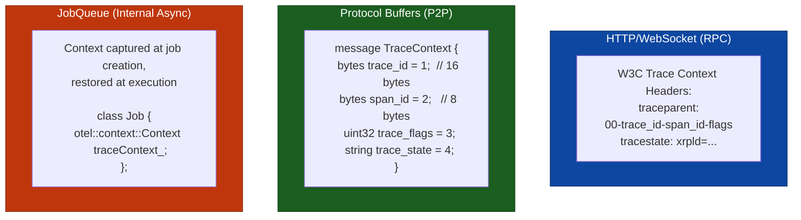
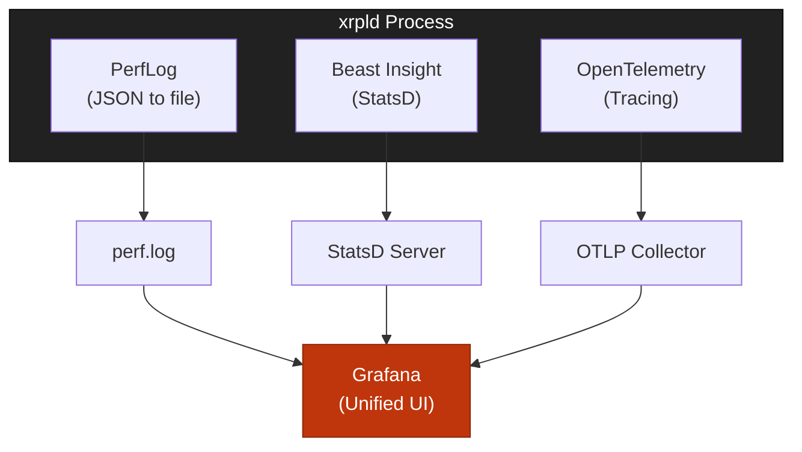

# Design Decisions

> **Parent Document**: [OpenTelemetryPlan.md](./OpenTelemetryPlan.md)
> **Related**: [Architecture Analysis](./01-architecture-analysis.md)

---

## 2.1 OpenTelemetry Components

> **OTLP** = OpenTelemetry Protocol

### 2.1.1 SDK Selection

**Primary Choice**: OpenTelemetry C++ SDK (`opentelemetry-cpp`)

| Component                               | Purpose                | Required                  |
| --------------------------------------- | ---------------------- | ------------------------- |
| `opentelemetry-cpp::api`                | Tracing API headers    | Yes                       |
| `opentelemetry-cpp::sdk`                | SDK implementation     | Yes                       |
| `opentelemetry-cpp::ext`                | Extensions (exporters) | Yes                       |
| `opentelemetry-cpp::otlp_http_exporter` | OTLP/HTTP export       | Yes (shipped in Phase 1b) |
| `opentelemetry-cpp::otlp_grpc_exporter` | OTLP/gRPC export       | Future (not yet wired up) |

### 2.1.2 Instrumentation Strategy

**Manual Instrumentation** (recommended):

| Approach   | Pros                                                            | Cons                                                    |
| ---------- | --------------------------------------------------------------- | ------------------------------------------------------- |
| **Manual** | Precise control, optimized placement, xrpld-specific attributes | More development effort                                 |
| **Auto**   | Less code, automatic coverage                                   | Less control, potential overhead, limited customization |

---

## 2.2 Exporter Configuration

> **OTLP** = OpenTelemetry Protocol


**Reading the diagram:**

- **xrpld Nodes (blue)**: The source of telemetry data. Each xrpld node exports spans via OTLP/HTTP on port 4318 (the only exporter shipped in Phase 1b).
- **OpenTelemetry Collector (red)**: The central aggregation point that receives spans from all nodes. Can run as a sidecar (per-node) or standalone (shared). Handles batching, filtering, and routing.
- **Observability Backends (green)**: The storage and visualization destinations. Tempo is the recommended backend for both development and production, and Elastic APM is an alternative. The Collector routes to one or more backends.
- **Arrows (nodes to collector to backends)**: The data pipeline -- spans flow from nodes to the Collector over HTTP, then the Collector fans out to the configured backends.

### 2.2.1 OTLP/HTTP (Shipped in Phase 1b)

OTLP/HTTP is the only exporter wired up in Phase 1b. It is configured via
`OtlpHttpExporterOptions` with the collector traces endpoint
(`http://localhost:4318/v1/traces` by default) and a JSON content type
(binary protobuf is also available).

### 2.2.2 OTLP/gRPC (Future Work — Planned Upgrade)

OTLP/gRPC is planned as a future upgrade from the HTTP exporter. The gRPC
transport offers lower per-span overhead and tighter back-pressure semantics
than HTTP/JSON, making it attractive for production deployments once the HTTP
path is validated in earlier phases.

Required to land this upgrade:

1. Add `opentelemetry-cpp::otlp_grpc_exporter` to the Conan recipe (the
   dependency already exists but is not linked in Phase 1b builds).
2. Extend `TelemetryConfig.cpp` to parse an `exporter` key (`otlp_http`
   default, `otlp_grpc` opt-in) and a gRPC endpoint override.
3. In `Telemetry::start()` branch on the parsed exporter type and construct
   either `OtlpHttpExporterFactory::Create(httpOpts)` or
   `OtlpGrpcExporterFactory::Create(grpcOpts)` accordingly.
4. Update the runbook and dashboards to document the alternate port and TLS
   settings.

When wired up, the gRPC path will use `OtlpGrpcExporterOptions` configured with
the collector endpoint (host on port 4317), TLS credentials enabled, and a CA
certificate path.

Until that work lands, `OtlpGrpcExporterOptions` is **not** used by any code
path in Phase 1b through Phase 5.

---

## 2.3 Span Naming Conventions

> **TxQ** = Transaction Queue | **UNL** = Unique Node List | **WS** = WebSocket

### 2.3.1 Naming Schema

```
<component>.<operation>[.<sub-operation>]
```

**Examples**:

- `tx.receive` - Transaction received from peer
- `consensus.phase.establish` - Consensus establish phase
- `rpc.command.server_info` - server_info RPC command

### 2.3.2 Complete Span Catalog

| Span name                      | Description                             |
| ------------------------------ | --------------------------------------- |
| `tx.receive`                   | Transaction received from network       |
| `tx.validate`                  | Transaction signature/format validation |
| `tx.process`                   | Full transaction processing             |
| `tx.relay`                     | Transaction relay to peers              |
| `tx.apply`                     | Apply transaction to ledger             |
| `consensus.round`              | Complete consensus round                |
| `consensus.phase.open`         | Open phase - collecting transactions    |
| `consensus.phase.establish`    | Establish phase - reaching agreement    |
| `consensus.phase.accept`       | Accept phase - applying consensus       |
| `consensus.proposal.receive`   | Receive peer proposal                   |
| `consensus.proposal.send`      | Send our proposal                       |
| `consensus.validation.receive` | Receive peer validation                 |
| `consensus.validation.send`    | Send our validation                     |
| `rpc.request`                  | HTTP/WebSocket request handling         |
| `rpc.command.*`                | Specific RPC command (dynamic)          |
| `peer.connect`                 | Peer connection establishment           |
| `peer.disconnect`              | Peer disconnection                      |
| `peer.message.send`            | Send protocol message                   |
| `peer.message.receive`         | Receive protocol message                |
| `ledger.acquire`               | Ledger acquisition from network         |
| `ledger.build`                 | Build new ledger                        |
| `ledger.validate`              | Ledger validation                       |
| `ledger.close`                 | Close ledger                            |
| `ledger.replay`                | Ledger replay executed                  |
| `ledger.delta`                 | Delta-based ledger acquired             |
| `pathfind.request`             | Path request initiated                  |
| `pathfind.compute`             | Path computation executed               |
| `txq.enqueue`                  | Transaction queued                      |
| `txq.apply`                    | Queued transaction applied              |
| `fee.escalate`                 | Fee escalation triggered                |
| `validator.list.fetch`         | UNL list fetched                        |
| `validator.manifest`           | Manifest update processed               |
| `amendment.vote`               | Amendment voting executed               |
| `shamap.sync`                  | State tree synchronization              |
| `job.enqueue`                  | Job added to queue                      |
| `job.execute`                  | Job execution                           |

### 2.3.3 Attribute Naming Conventions

Span **names** follow §2.3.1 (dotted `<component>.<operation>`). Span
**attribute keys** follow the rules below. The constants in the `*SpanNames.h`
headers are the single source of truth; the collector, Tempo, the Grafana
dashboards, and the runbook all consume these exact keys, so every layer must
agree with the code. A CI check enforces this end to end.

1. **Per-span unique attribute** → bare field name, allowed when the field is
   recorded by a single span/workflow so the span name already supplies the
   domain (e.g. `command`, `version`, `local` on `rpc.command`).
2. **Shared attribute (same concept on more than one span)** → ONE key, reused
   verbatim on every span that records it; the span name tells the occurrences
   apart, so no per-emitter prefix is added. Name it by the field's meaning: a
   property of a domain object keeps that object's bare field name (`ledger_hash`,
   `ledger_seq`, `tx_hash`, `peer_id`, `full_validation`); a field already
   qualified by a sub-kind keeps that qualifier on every emitter (`proposal_trusted`
   on both `consensus.proposal.receive` and `peer.proposal.receive`;
   `validation_trusted` likewise). Defined once in the base `SpanNames.h`
   `namespace attr` block and re-exported (`using`) by each domain header.
3. **Collision qualifier** → `<domain>_<field>`, only when a bare name would
   collide with a DIFFERENT concept in the shared spanmetrics label space or with
   the OTel-reserved `status` key (e.g. `rpc_status`, `grpc_status`,
   `consensus_phase`, `consensus_round`, `consensus_mode`). This disambiguates
   distinct concepts that share a word; it is NOT used to tag the same concept
   with its emitting workflow — that is rule 2 (one shared name).
4. **Resource attribute** → dotted `xrpl.<subsystem>.<field>`, reserved ONLY
   for process/network identity set once at startup (`xrpl.network.id`,
   `xrpl.network.type`). Span attributes are never dotted in the `xrpl.` form —
   it blurs the resource/span scope boundary and parses awkwardly in TraceQL.
5. **Span names** use `<subsystem>[.<component>]` (dotted, per §2.3.1). Only
   attribute _keys_ follow rules 1–4.

Standard OpenTelemetry semantic-convention keys keep their canonical dotted
form (e.g. `service.*` resource attributes, `http.*` span attributes); the
"no dotted form" rule applies to xrpl-custom keys only.

The same rules are recorded in `CONTRIBUTING.md` (the permanent home, since
`OpenTelemetryPlan/` is removed once the rollout completes). The attribute
examples in §2.4 below follow these rules.

---

## 2.4 Attribute Schema

> **TxQ** = Transaction Queue | **UNL** = Unique Node List | **OTLP** = OpenTelemetry Protocol

### 2.4.1 Resource Attributes (Set Once at Startup)

Resource attributes identify the process and are set once at startup. They use
the standard OpenTelemetry semantic conventions plus custom dotted `xrpl.*`
keys (the dotted form is reserved for resource scope per §2.3.3).

| Key                   | Type / value                                            | Description                    |
| --------------------- | ------------------------------------------------------- | ------------------------------ |
| `service.name`        | `"xrpld"`                                               | Standard `SERVICE_NAME`        |
| `service.version`     | `build_info::getVersionString()`                        | Standard `SERVICE_VERSION`     |
| `service.instance.id` | node public key (base58)                                | Standard `SERVICE_INSTANCE_ID` |
| `xrpl.network.id`     | network id (e.g. 0 for mainnet)                         | Network identifier             |
| `xrpl.network.type`   | `"mainnet"` \| `"testnet"` \| `"devnet"` \| `"unknown"` | Network kind                   |
| `xrpl.node.type`      | `"validator"` \| `"stock"` \| `"reporting"`             | Node role                      |
| `xrpl.node.cluster`   | cluster name                                            | Cluster name, if clustered     |

### 2.4.2 Span Attributes by Category

> Span attribute keys use the underscore form from §2.3.3 (shared/qualified
> keys are `<domain>_<field>`; per-span unique keys are bare). The dotted form
> is reserved for the resource attributes in §2.4.1 above. This catalog lists
> the planned attribute set by category; the exact emitted key for each
> implemented span is defined by the `*SpanNames.h` constants, which are the
> single source of truth where the two differ.

#### Transaction Attributes

| Key            | Type   | Description                           |
| -------------- | ------ | ------------------------------------- |
| `tx_hash`      | string | Transaction hash (hex)                |
| `tx_type`      | string | `"Payment"`, `"OfferCreate"`, etc.    |
| `tx_account`   | string | Source account (redacted in prod)     |
| `tx_sequence`  | int64  | Account sequence number               |
| `tx_fee`       | int64  | Fee in drops                          |
| `tx_result`    | string | `"tesSUCCESS"`, `"tecPATH_DRY"`, etc. |
| `ledger_index` | int64  | Ledger containing transaction         |
| `relay_count`  | int64  | Peers the transaction was relayed to  |
| `suppressed`   | bool   | `true` when HashRouter dropped a dup  |

#### Consensus Attributes

| Key                  | Type    | Description                         |
| -------------------- | ------- | ----------------------------------- |
| `consensus_round`    | int64   | Round number                        |
| `consensus_phase`    | string  | `"open"`, `"establish"`, `"accept"` |
| `consensus_mode`     | string  | `"proposing"`, `"observing"`, etc.  |
| `proposers`          | int64   | Number of proposers                 |
| `prev_ledger_prefix` | string  | Previous ledger hash prefix         |
| `ledger_seq`         | int64   | Ledger sequence                     |
| `tx_count`           | int64   | Transactions in consensus set       |
| `round_time_ms`      | float64 | Round duration                      |

#### RPC Attributes

| Key           | Type    | Description                                                                   |
| ------------- | ------- | ----------------------------------------------------------------------------- |
| `command`     | string  | Command name (per-span unique on `rpc.command`)                               |
| `version`     | int64   | API version                                                                   |
| `rpc_role`    | string  | `"admin"` or `"user"` (qualified — `role` is generic)                         |
| `params`      | string  | Sanitized parameters (optional)                                               |
| `rpc_status`  | string  | Response status: `success` \| `error` (qualified — `status` is OTel-reserved) |
| `duration_ms` | float64 | Request duration in milliseconds                                              |

#### Peer & Message Attributes

| Key                  | Type    | Description                |
| -------------------- | ------- | -------------------------- |
| `peer_id`            | string  | Peer public key (base58)   |
| `peer_address`       | string  | IP:port                    |
| `peer_latency_ms`    | float64 | Measured latency           |
| `peer_cluster`       | string  | Cluster name if clustered  |
| `message_type`       | string  | Protocol message type name |
| `message_size_bytes` | int64   | Message size               |
| `message_compressed` | bool    | Whether compressed         |

#### Ledger & Job Attributes

| Key               | Type    | Description           |
| ----------------- | ------- | --------------------- |
| `ledger_hash`     | string  | Ledger hash           |
| `ledger_index`    | int64   | Ledger sequence/index |
| `close_time`      | int64   | Close time (epoch)    |
| `ledger_tx_count` | int64   | Transaction count     |
| `job_type`        | string  | Job type name         |
| `job_queue_ms`    | float64 | Time spent in queue   |
| `job_worker`      | int64   | Worker thread ID      |

#### PathFinding Attributes

| Key                        | Type   | Description               |
| -------------------------- | ------ | ------------------------- |
| `pathfind_source_currency` | string | Source currency code      |
| `pathfind_dest_currency`   | string | Destination currency code |
| `pathfind_path_count`      | int64  | Number of paths found     |
| `pathfind_cache_hit`       | bool   | RippleLineCache hit       |

#### TxQ Attributes

| Key                   | Type   | Description                 |
| --------------------- | ------ | --------------------------- |
| `txq_queue_depth`     | int64  | Current queue depth         |
| `txq_fee_level`       | int64  | Fee level of transaction    |
| `txq_eviction_reason` | string | Why transaction was evicted |

#### Fee Attributes

| Key                    | Type  | Description               |
| ---------------------- | ----- | ------------------------- |
| `fee_load_factor`      | int64 | Current load factor       |
| `fee_escalation_level` | int64 | Fee escalation multiplier |

#### Validator Attributes

| Key                      | Type  | Description               |
| ------------------------ | ----- | ------------------------- |
| `validator_list_size`    | int64 | UNL size                  |
| `validator_list_age_sec` | int64 | Seconds since last update |

#### Amendment Attributes

| Key                | Type   | Description                            |
| ------------------ | ------ | -------------------------------------- |
| `amendment_name`   | string | Amendment name                         |
| `amendment_status` | string | `"enabled"`, `"vetoed"`, `"supported"` |

#### SHAMap Attributes

| Key                    | Type    | Description                                   |
| ---------------------- | ------- | --------------------------------------------- |
| `shamap_type`          | string  | `"transaction"`, `"state"`, `"account_state"` |
| `shamap_missing_nodes` | int64   | Number of missing nodes during sync           |
| `shamap_duration_ms`   | float64 | Sync duration                                 |

### 2.4.3 Data Collection Summary

The following table summarizes what data is collected by category:

| Category        | Attributes Collected                                                                              | Purpose                      |
| --------------- | ------------------------------------------------------------------------------------------------- | ---------------------------- |
| **Transaction** | `tx_hash`, `tx_type`, `tx_result`, `tx_fee`, `ledger_index`                                       | Trace transaction lifecycle  |
| **Consensus**   | `consensus_round`, `consensus_phase`, `consensus_mode`, `proposers`, `round_time_ms`              | Analyze consensus timing     |
| **RPC**         | `command`, `version`, `rpc_status`, `duration_ms`                                                 | Monitor RPC performance      |
| **Peer**        | `peer_id` (public key), `peer_latency_ms`, `message_type`, `message_size_bytes`                   | Network topology analysis    |
| **Ledger**      | `ledger_hash`, `ledger_index`, `close_time`, `ledger_tx_count`                                    | Ledger progression tracking  |
| **Job**         | `job_type`, `job_queue_ms`, `job_worker`                                                          | JobQueue performance         |
| **PathFinding** | `pathfind_source_currency`, `pathfind_dest_currency`, `pathfind_path_count`, `pathfind_cache_hit` | Payment path analysis        |
| **TxQ**         | `txq_queue_depth`, `txq_fee_level`, `txq_eviction_reason`                                         | Queue depth and fee tracking |
| **Fee**         | `fee_load_factor`, `fee_escalation_level`                                                         | Fee escalation monitoring    |
| **Validator**   | `validator_list_size`, `validator_list_age_sec`                                                   | UNL health monitoring        |
| **Amendment**   | `amendment_name`, `amendment_status`                                                              | Protocol upgrade tracking    |
| **SHAMap**      | `shamap_type`, `shamap_missing_nodes`, `shamap_duration_ms`                                       | State tree sync performance  |

### 2.4.4 Privacy & Sensitive Data Policy

> **PII** = Personally Identifiable Information

OpenTelemetry instrumentation is designed to collect **operational metadata only**, never sensitive content.

#### Data NOT Collected

The following data is explicitly **excluded** from telemetry collection:

| Excluded Data           | Reason                                    |
| ----------------------- | ----------------------------------------- |
| **Private Keys**        | Never exposed; not relevant to tracing    |
| **Account Balances**    | Financial data; privacy sensitive         |
| **Transaction Amounts** | Financial data; privacy sensitive         |
| **Raw TX Payloads**     | May contain sensitive memo/data fields    |
| **Personal Data**       | No PII collected                          |
| **IP Addresses**        | Configurable; excluded by default in prod |

#### Privacy Protection Mechanisms

| Mechanism                     | Description                                                                                                                             |
| ----------------------------- | --------------------------------------------------------------------------------------------------------------------------------------- |
| **Account Hashing**           | `tx_account` is hashed at collector level before storage                                                                                |
| **Configurable Redaction**    | Sensitive fields can be excluded via `[telemetry]` config section                                                                       |
| **Collector Tail Sampling**   | xrpld head sampling is fixed at 1.0 (every span emitted); the collector retains ~10% of non-error traces, reducing stored data exposure |
| **Local Control**             | Node operators have full control over what gets exported                                                                                |
| **No Raw Payloads**           | Transaction content is never recorded, only metadata (hash, type, result)                                                               |
| **Collector-Level Filtering** | Additional redaction/hashing can be configured at OTel Collector                                                                        |

#### Collector-Level Data Protection

The OpenTelemetry Collector can be configured (via an `attributes` processor)
to hash or redact sensitive attributes before export — for example, hashing
`tx_account`, deleting `peer_address` to drop IP addresses, and deleting
`params` to redact request parameters.

#### Configuration Options for Privacy

In `xrpld.cfg`, operators control data collection granularity through the
`[telemetry]` section. Besides `enabled`, per-component toggles
(`trace_transactions`, `trace_consensus`, `trace_rpc`, `trace_peer` — the last
often disabled due to high volume) select which spans are emitted, and
redaction flags (`redact_account` to hash account addresses, `redact_peer_address`
to remove peer IP addresses) control SDK-level redaction before export.

> **Note**: The `redact_account` configuration in `xrpld.cfg` controls SDK-level redaction before export, while collector-level filtering (see [Collector-Level Data Protection](#collector-level-data-protection) above) provides an additional defense-in-depth layer. Both can operate independently.

> **Key Principle**: Telemetry collects **operational metadata** (timing, counts, hashes) — never **sensitive content** (keys, balances, amounts, raw payloads).

---

## 2.5 Context Propagation Design

> **WS** = WebSocket

### 2.5.1 Propagation Boundaries



**Reading the diagram:**

- **HTTP/WebSocket - RPC (blue)**: For client-facing RPC requests, trace context is propagated using the W3C `traceparent` header. This is the standard approach and works with any OTel-compatible client.
- **Protocol Buffers - P2P (green)**: For peer-to-peer messages between xrpld nodes, trace context is embedded as a protobuf `TraceContext` message carrying trace_id, span_id, flags, and optional trace_state.
- **JobQueue - Internal Async (red)**: For asynchronous work within a single node, the OTel context is captured when a job is created and restored when the job executes on a worker thread. This bridges the async gap so spans remain linked.

---

## 2.6 Integration with Existing Observability

> **OTLP** = OpenTelemetry Protocol | **WS** = WebSocket

### 2.6.1 Existing Frameworks Comparison

xrpld already has two observability mechanisms. OpenTelemetry complements (not replaces) them:

| Aspect                | PerfLog                       | Beast Insight (StatsD)       | OpenTelemetry             |
| --------------------- | ----------------------------- | ---------------------------- | ------------------------- |
| **Type**              | Logging                       | Metrics                      | Distributed Tracing       |
| **Data**              | JSON log entries              | Counters, gauges, histograms | Spans with context        |
| **Scope**             | Single node                   | Single node                  | **Cross-node**            |
| **Output**            | `perf.log` file               | StatsD server                | OTLP Collector            |
| **Question answered** | "What happened on this node?" | "How many? How fast?"        | "What was the journey?"   |
| **Correlation**       | By timestamp                  | By metric name               | By `trace_id`             |
| **Overhead**          | Low (file I/O)                | Low (UDP packets)            | Low-Medium (configurable) |

### 2.6.2 What Each Framework Does Best

#### PerfLog

- **Purpose**: Detailed local event logging for RPC and job execution
- **Strengths**:
  - Rich JSON output with timing data
  - Already integrated in RPC handlers
  - File-based, no external dependencies
- **Limitations**:
  - Single-node only (no cross-node correlation)
  - No parent-child relationships between events
  - Manual log parsing required

A PerfLog entry is a JSON object with fields such as `time`, `method`,
`duration_us`, and `result`.

#### Beast Insight (StatsD)

- **Purpose**: Real-time metrics for monitoring dashboards
- **Strengths**:
  - Aggregated metrics (counters, gauges, histograms)
  - Low overhead (UDP, fire-and-forget)
  - Good for alerting thresholds
- **Limitations**:
  - No request-level detail
  - No causal relationships
  - Single-node perspective

In xrpld, Beast Insight is used through `increment` (counters), `gauge`
(point-in-time values), and `timing` (durations) calls.

#### OpenTelemetry (NEW)

- **Purpose**: Distributed request tracing across nodes
- **Strengths**:
  - **Cross-node correlation** via `trace_id`
  - Parent-child span relationships
  - Rich attributes per span
  - Industry standard (CNCF)
- **Limitations**:
  - Requires collector infrastructure
  - Higher complexity than logging

A span is created via `startSpan` (e.g. `"tx.relay"`), annotated with
attributes such as `tx_hash` and `peer_id`, and is automatically linked to its
parent through the active context.

### 2.6.3 When to Use Each

| Scenario                                | PerfLog    | StatsD | OpenTelemetry |
| --------------------------------------- | ---------- | ------ | ------------- |
| "How many TXs per second?"              | ❌         | ✅     | ✅            |
| "What's the p99 RPC latency?"           | ❌         | ✅     | ✅            |
| "Why was this specific TX slow?"        | ⚠️ partial | ❌     | ✅            |
| "Which node delayed consensus?"         | ❌         | ❌     | ✅            |
| "What happened on node X at time T?"    | ✅         | ❌     | ✅            |
| "Show me the TX journey across 5 nodes" | ❌         | ❌     | ✅            |

### 2.6.4 Coexistence Strategy



**Reading the diagram:**

- **xrpld Process (dark gray)**: The single xrpld node running all three observability frameworks side by side. Each framework operates independently with no interference.
- **PerfLog to perf.log**: PerfLog writes JSON-formatted event logs to a local file. Grafana can ingest these via Loki or a file-based datasource.
- **Beast Insight to StatsD Server**: Insight sends aggregated metrics (counters, gauges) over UDP to a StatsD server. Grafana reads from StatsD-compatible backends like Graphite or Prometheus (via StatsD exporter).
- **OpenTelemetry to OTLP Collector**: OTel exports spans over OTLP/HTTP to a Collector, which then forwards to a trace backend (Tempo). (OTLP/gRPC is future work — §2.2.2.)
- **Grafana (red, unified UI)**: All three data streams converge in Grafana, enabling operators to correlate logs, metrics, and traces in a single dashboard.

### 2.6.5 Correlation with PerfLog

Trace IDs can be correlated with existing PerfLog entries for comprehensive
debugging. The design is for `RPCHandler.cpp` to start an `rpc.command.<method>`
span alongside the existing PerfLog `rpcStart`/`rpcFinish`/`rpcError` calls,
extract the span's `trace_id` (when valid), and eventually stamp it onto the
PerfLog entry (a planned `setTraceId` hook) so logs and traces share a key. The
span status is set to OK on success or to error (recording the exception) on
failure.

---

_Previous: [Architecture Analysis](./01-architecture-analysis.md)_ | _Next: [Implementation Strategy](./03-implementation-strategy.md)_ | _Back to: [Overview](./OpenTelemetryPlan.md)_
