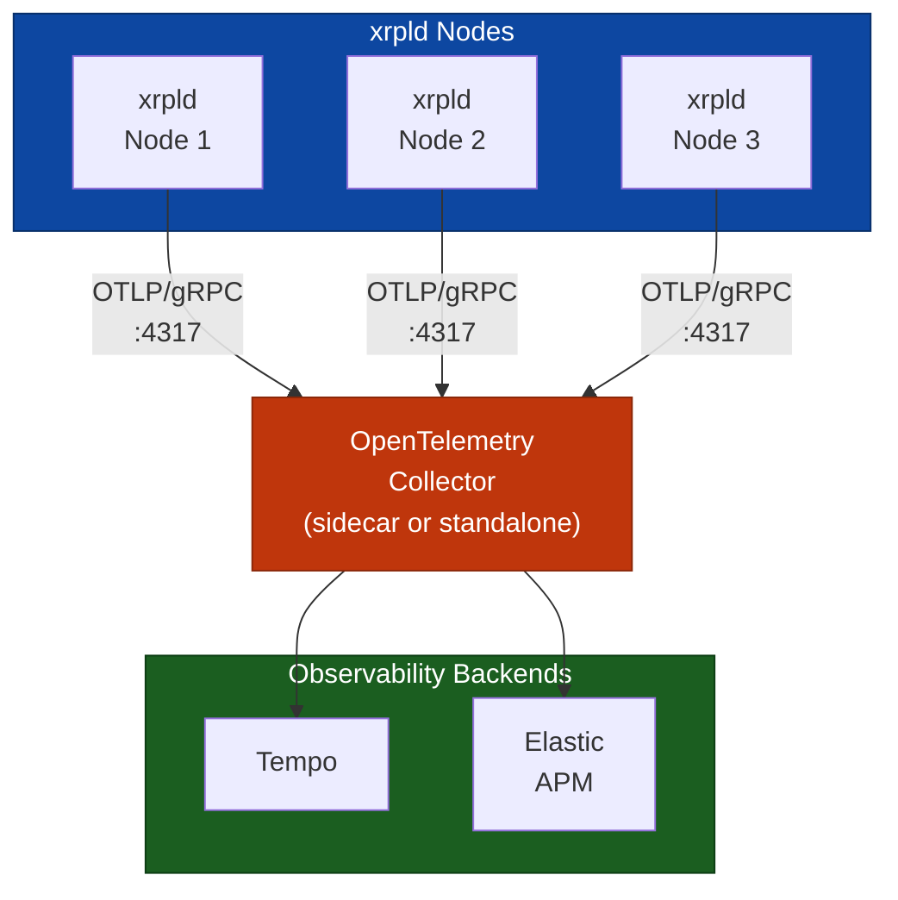
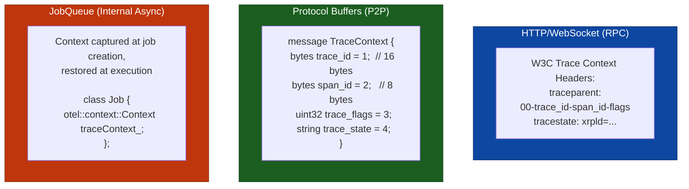
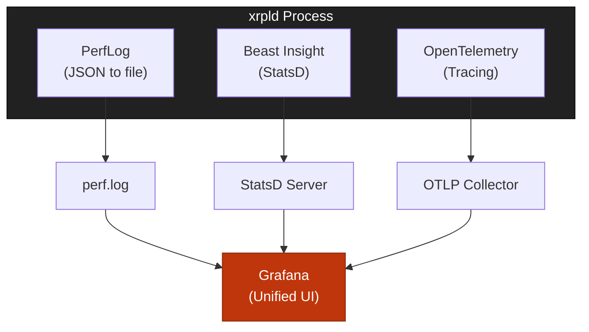

# Design Decisions

> **Parent Document**: [OpenTelemetryPlan.md](./OpenTelemetryPlan.md)
> **Related**: [Architecture Analysis](./01-architecture-analysis.md) | [Code Samples](./04-code-samples.md)

---

## 2.1 OpenTelemetry Components

> **OTLP** = OpenTelemetry Protocol

### 2.1.1 SDK Selection

**Primary Choice**: OpenTelemetry C++ SDK (`opentelemetry-cpp`)

| Component                               | Purpose                | Required    |
| --------------------------------------- | ---------------------- | ----------- |
| `opentelemetry-cpp::api`                | Tracing API headers    | Yes         |
| `opentelemetry-cpp::sdk`                | SDK implementation     | Yes         |
| `opentelemetry-cpp::ext`                | Extensions (exporters) | Yes         |
| `opentelemetry-cpp::otlp_grpc_exporter` | OTLP/gRPC export       | Recommended |
| `opentelemetry-cpp::otlp_http_exporter` | OTLP/HTTP export       | Alternative |

### 2.1.2 Instrumentation Strategy

**Manual Instrumentation** (recommended):

| Approach   | Pros                                                            | Cons                                                    |
| ---------- | --------------------------------------------------------------- | ------------------------------------------------------- |
| **Manual** | Precise control, optimized placement, xrpld-specific attributes | More development effort                                 |
| **Auto**   | Less code, automatic coverage                                   | Less control, potential overhead, limited customization |

---

## 2.2 Exporter Configuration

> **OTLP** = OpenTelemetry Protocol



**Reading the diagram:**

- **xrpld Nodes (blue)**: The source of telemetry data. Each xrpld node exports spans via OTLP/gRPC on port 4317.
- **OpenTelemetry Collector (red)**: The central aggregation point that receives spans from all nodes. Can run as a sidecar (per-node) or standalone (shared). Handles batching, filtering, and routing.
- **Observability Backends (green)**: The storage and visualization destinations. Tempo is the recommended backend for both development and production, and Elastic APM is an alternative. The Collector routes to one or more backends.
- **Arrows (nodes to collector to backends)**: The data pipeline -- spans flow from nodes to the Collector over gRPC, then the Collector fans out to the configured backends.

### 2.2.1 OTLP/gRPC (Recommended)

```cpp
// Configuration for OTLP over gRPC
namespace otlp = opentelemetry::exporter::otlp;

otlp::OtlpGrpcExporterOptions opts;
opts.endpoint = "localhost:4317";
opts.useTls = true;
opts.sslCaCertPath = "/path/to/ca.crt";
```

### 2.2.2 OTLP/HTTP (Alternative)

```cpp
// Configuration for OTLP over HTTP
namespace otlp = opentelemetry::exporter::otlp;

otlp::OtlpHttpExporterOptions opts;
opts.url = "http://localhost:4318/v1/traces";
opts.content_type = otlp::HttpRequestContentType::kJson;  // or kBinary
```

---

## 2.3 Span Naming Conventions

> **TxQ** = Transaction Queue | **UNL** = Unique Node List | **WS** = WebSocket

### 2.3.1 Naming Schema

```
<component>.<operation>[.<sub-operation>]
```

**Examples**:

- `tx.receive` - Transaction received from peer
- `consensus.phase.establish` - Consensus establish phase
- `rpc.command.server_info` - server_info RPC command

### 2.3.2 Complete Span Catalog

```yaml
# Transaction Spans
tx:
  receive: "Transaction received from network"
  validate: "Transaction signature/format validation"
  process: "Full transaction processing"
  relay: "Transaction relay to peers"
  apply: "Apply transaction to ledger"

# Consensus Spans
consensus:
  round: "Complete consensus round"
  phase:
    open: "Open phase - collecting transactions"
    establish: "Establish phase - reaching agreement"
    accept: "Accept phase - applying consensus"
  proposal:
    receive: "Receive peer proposal"
    send: "Send our proposal"
  validation:
    receive: "Receive peer validation"
    send: "Send our validation"

# RPC Spans
rpc:
  request: "HTTP/WebSocket request handling"
  command:
    "*": "Specific RPC command (dynamic)"

# Peer Spans
peer:
  connect: "Peer connection establishment"
  disconnect: "Peer disconnection"
  message:
    send: "Send protocol message"
    receive: "Receive protocol message"

# Ledger Spans
ledger:
  acquire: "Ledger acquisition from network"
  build: "Build new ledger"
  validate: "Ledger validation"
  close: "Close ledger"
  replay: "Ledger replay executed"
  delta: "Delta-based ledger acquired"

# PathFinding Spans
pathfind:
  request: "Path request initiated"
  compute: "Path computation executed"

# TxQ Spans
txq:
  enqueue: "Transaction queued"
  apply: "Queued transaction applied"

# Fee/Load Spans
fee:
  escalate: "Fee escalation triggered"

# Validator Spans
validator:
  list:
    fetch: "UNL list fetched"
  manifest: "Manifest update processed"

# Amendment Spans
amendment:
  vote: "Amendment voting executed"

# SHAMap Spans
shamap:
  sync: "State tree synchronization"

# Job Spans
job:
  enqueue: "Job added to queue"
  execute: "Job execution"
```

---

## 2.4 Attribute Schema

> **TxQ** = Transaction Queue | **UNL** = Unique Node List | **OTLP** = OpenTelemetry Protocol

### 2.4.1 Resource Attributes (Set Once at Startup)

```cpp
// Standard OpenTelemetry semantic conventions
resource::SemanticConventions::SERVICE_NAME        = "xrpld"
resource::SemanticConventions::SERVICE_VERSION     = BuildInfo::getVersionString()
resource::SemanticConventions::SERVICE_INSTANCE_ID = <node_public_key_base58>

// Custom xrpld attributes
"xrpl.network.id"      = <network_id>           // e.g., 0 for mainnet
"xrpl.network.type"    = "mainnet" | "testnet" | "devnet" | "standalone"
"xrpl.node.type"       = "validator" | "stock" | "reporting"
"xrpl.node.cluster"    = <cluster_name>         // If clustered
```

### 2.4.2 Span Attributes by Category

#### Transaction Attributes

```cpp
"xrpl.tx.hash"         = string   // Transaction hash (hex)
"xrpl.tx.type"         = string   // "Payment", "OfferCreate", etc.
"xrpl.tx.account"      = string   // Source account (redacted in prod)
"xrpl.tx.sequence"     = int64    // Account sequence number
"xrpl.tx.fee"          = int64    // Fee in drops
"xrpl.tx.result"       = string   // "tesSUCCESS", "tecPATH_DRY", etc.
"xrpl.tx.ledger_index" = int64    // Ledger containing transaction
```

#### Consensus Attributes

```cpp
"xrpl.consensus.round"          = int64    // Round number
"xrpl.consensus.phase"          = string   // "open", "establish", "accept"
"xrpl.consensus.mode"           = string   // "proposing", "observing", etc.
"xrpl.consensus.proposers"      = int64    // Number of proposers
"xrpl.consensus.ledger.prev"    = string   // Previous ledger hash
"xrpl.consensus.ledger.seq"     = int64    // Ledger sequence
"xrpl.consensus.tx_count"       = int64    // Transactions in consensus set
"xrpl.consensus.duration_ms"    = float64  // Round duration
```

#### RPC Attributes

```cpp
"xrpl.rpc.command"     = string   // Command name
"xrpl.rpc.version"     = int64    // API version
"xrpl.rpc.role"        = string   // "admin" or "user"
"xrpl.rpc.params"      = string   // Sanitized parameters (optional)
```

#### Peer & Message Attributes

```cpp
"xrpl.peer.id"            = string   // Peer public key (base58)
"xrpl.peer.address"       = string   // IP:port
"xrpl.peer.latency_ms"    = float64  // Measured latency
"xrpl.peer.cluster"       = string   // Cluster name if clustered
"xrpl.message.type"       = string   // Protocol message type name
"xrpl.message.size_bytes" = int64    // Message size
"xrpl.message.compressed" = bool     // Whether compressed
```

#### Ledger & Job Attributes

```cpp
"xrpl.ledger.hash"       = string   // Ledger hash
"xrpl.ledger.index"      = int64    // Ledger sequence/index
"xrpl.ledger.close_time" = int64    // Close time (epoch)
"xrpl.ledger.tx_count"   = int64    // Transaction count
"xrpl.job.type"          = string   // Job type name
"xrpl.job.queue_ms"      = float64  // Time spent in queue
"xrpl.job.worker"        = int64    // Worker thread ID
```

#### PathFinding Attributes

```cpp
"xrpl.pathfind.source_currency"  = string   // Source currency code
"xrpl.pathfind.dest_currency"    = string   // Destination currency code
"xrpl.pathfind.path_count"       = int64    // Number of paths found
"xrpl.pathfind.cache_hit"        = bool     // RippleLineCache hit
```

#### TxQ Attributes

```cpp
"xrpl.txq.queue_depth"      = int64    // Current queue depth
"xrpl.txq.fee_level"        = int64    // Fee level of transaction
"xrpl.txq.eviction_reason"  = string   // Why transaction was evicted
```

#### Fee Attributes

```cpp
"xrpl.fee.load_factor"      = int64    // Current load factor
"xrpl.fee.escalation_level" = int64    // Fee escalation multiplier
```

#### Validator Attributes

```cpp
"xrpl.validator.list_size"    = int64    // UNL size
"xrpl.validator.list_age_sec" = int64    // Seconds since last update
```

#### Amendment Attributes

```cpp
"xrpl.amendment.name"         = string   // Amendment name
"xrpl.amendment.status"       = string   // "enabled", "vetoed", "supported"
```

#### SHAMap Attributes

```cpp
"xrpl.shamap.type"            = string   // "transaction", "state", "account_state"
"xrpl.shamap.missing_nodes"   = int64    // Number of missing nodes during sync
"xrpl.shamap.duration_ms"     = float64  // Sync duration
```

### 2.4.3 Data Collection Summary

The following table summarizes what data is collected by category:

| Category        | Attributes Collected                                                   | Purpose                      |
| --------------- | ---------------------------------------------------------------------- | ---------------------------- |
| **Transaction** | `tx.hash`, `tx.type`, `tx.result`, `tx.fee`, `ledger_index`            | Trace transaction lifecycle  |
| **Consensus**   | `round`, `phase`, `mode`, `proposers` (public keys), `duration_ms`     | Analyze consensus timing     |
| **RPC**         | `command`, `version`, `status`, `duration_ms`                          | Monitor RPC performance      |
| **Peer**        | `peer.id` (public key), `latency_ms`, `message.type`, `message.size`   | Network topology analysis    |
| **Ledger**      | `ledger.hash`, `ledger.index`, `close_time`, `tx_count`                | Ledger progression tracking  |
| **Job**         | `job.type`, `queue_ms`, `worker`                                       | JobQueue performance         |
| **PathFinding** | `pathfind.source_currency`, `dest_currency`, `path_count`, `cache_hit` | Payment path analysis        |
| **TxQ**         | `txq.queue_depth`, `fee_level`, `eviction_reason`                      | Queue depth and fee tracking |
| **Fee**         | `fee.load_factor`, `escalation_level`                                  | Fee escalation monitoring    |
| **Validator**   | `validator.list_size`, `list_age_sec`                                  | UNL health monitoring        |
| **Amendment**   | `amendment.name`, `status`                                             | Protocol upgrade tracking    |
| **SHAMap**      | `shamap.type`, `missing_nodes`, `duration_ms`                          | State tree sync performance  |

### 2.4.4 Privacy & Sensitive Data Policy

> **PII** = Personally Identifiable Information

OpenTelemetry instrumentation is designed to collect **operational metadata only**, never sensitive content.

#### Data NOT Collected

The following data is explicitly **excluded** from telemetry collection:

| Excluded Data           | Reason                                    |
| ----------------------- | ----------------------------------------- |
| **Private Keys**        | Never exposed; not relevant to tracing    |
| **Account Balances**    | Financial data; privacy sensitive         |
| **Transaction Amounts** | Financial data; privacy sensitive         |
| **Raw TX Payloads**     | May contain sensitive memo/data fields    |
| **Personal Data**       | No PII collected                          |
| **IP Addresses**        | Configurable; excluded by default in prod |

#### Privacy Protection Mechanisms

| Mechanism                     | Description                                                               |
| ----------------------------- | ------------------------------------------------------------------------- |
| **Account Hashing**           | `xrpl.tx.account` is hashed at collector level before storage             |
| **Configurable Redaction**    | Sensitive fields can be excluded via `[telemetry]` config section         |
| **Sampling**                  | Only 10% of traces recorded by default, reducing data exposure            |
| **Local Control**             | Node operators have full control over what gets exported                  |
| **No Raw Payloads**           | Transaction content is never recorded, only metadata (hash, type, result) |
| **Collector-Level Filtering** | Additional redaction/hashing can be configured at OTel Collector          |

#### Collector-Level Data Protection

The OpenTelemetry Collector can be configured to hash or redact sensitive attributes before export:

```yaml
processors:
  attributes:
    actions:
      # Hash account addresses before storage
      - key: xrpl.tx.account
        action: hash
      # Remove IP addresses entirely
      - key: xrpl.peer.address
        action: delete
      # Redact specific fields
      - key: xrpl.rpc.params
        action: delete
```

#### Configuration Options for Privacy

In `xrpld.cfg`, operators can control data collection granularity:

```ini
[telemetry]
enabled=1

# Disable collection of specific components
trace_transactions=1
trace_consensus=1
trace_rpc=1
trace_peer=0          # Disable peer tracing (high volume, includes addresses)

# Redact specific attributes
redact_account=1      # Hash account addresses before export
redact_peer_address=1 # Remove peer IP addresses
```

> **Note**: The `redact_account` configuration in `xrpld.cfg` controls SDK-level redaction before export, while collector-level filtering (see [Collector-Level Data Protection](#collector-level-data-protection) above) provides an additional defense-in-depth layer. Both can operate independently.

> **Key Principle**: Telemetry collects **operational metadata** (timing, counts, hashes) — never **sensitive content** (keys, balances, amounts, raw payloads).

---

## 2.5 Context Propagation Design

> **WS** = WebSocket

### 2.5.0 Deterministic Trace ID Strategy

Both transaction and consensus tracing use **deterministic trace IDs** derived from
a globally known hash, so all nodes handling the same workflow independently produce
spans under the same `trace_id`. This is combined with protobuf `span_id` propagation
for parent-child relay ordering when available.

#### Transactions — `trace_id = txHash[0:16]`

Every node that handles a transaction knows its `txID` (the `uint256` transaction
hash). The first 16 bytes of this hash are used as the OTel `trace_id`:

```
uint256 txHash:  A1B2C3D4 E5F6A7B8 C9D0E1F2 A3B4C5D6  E7F8A9B0 C1D2E3F4 A5B6C7D8 E9F0A1B2
                 |---------- trace_id (16 bytes) ---------|  (remaining 16 bytes unused)
```

Each node generates a **random 8-byte `span_id`** so its span is unique within the
shared trace. When protobuf `TraceContext` is present in the incoming `TMTransaction`,
the sender's `span_id` is extracted and used as the parent — preserving the relay
chain as a parent-child tree. When absent (older peers, first hop from client), the
span appears as a root in the same trace — correlation is preserved, only the tree
structure degrades.

```
Node A (submitter)        Node B (relay)          Node C (relay)
trace_id: A1B2...         trace_id: A1B2...       trace_id: A1B2...
span_id:  1234 (random)   span_id:  5678 (random) span_id:  9ABC (random)
parent:   (none)          parent:   1234 (proto)   parent:   5678 (proto)
                               ↑                        ↑
                       protobuf propagation      protobuf propagation
```

If protobuf propagation fails at Node B (old peer):

```
Node A                    Node B (old peer)       Node C
trace_id: A1B2...         trace_id: A1B2...       trace_id: A1B2...
span_id:  1234            span_id:  5678          span_id:  9ABC
parent:   (none)          parent:   (none)        parent:   5678 (proto)
                          ↑ no parent, but same trace_id — still grouped
```

#### Consensus — `trace_id = prevLedgerHash[0:16]`

All validators in the same consensus round share the same `previousLedger.id()`.
The first 16 bytes are used as trace_id. See [Phase 4a implementation status](./06-implementation-phases.md)
and `createDeterministicContext()` in `RCLConsensus.cpp` for the implementation.

Switchable via `consensus_trace_strategy` config:
`"deterministic"` (default) or `"attribute"` (random trace_id, correlation via attribute queries).

#### Why Not Random IDs with Propagation Only?

Random trace IDs require **unbroken context propagation** across every hop. In a
mixed-version network (common during upgrades), older peers silently drop the
`trace_context` protobuf field. The trace splits and downstream spans become
impossible to find. Deterministic IDs make correlation **propagation-resilient** — the trace
backend groups all spans for the same transaction/round regardless of whether
propagation succeeded.

#### Why Keep Protobuf Propagation?

Deterministic trace IDs alone provide correlation (all spans grouped) but not
**causality** (which node relayed to which). Protobuf `span_id` propagation adds
parent-child ordering that shows the exact relay path. The two mechanisms complement
each other:

| Mechanism                    | Provides                    | Fails when                             |
| ---------------------------- | --------------------------- | -------------------------------------- |
| Deterministic trace_id       | Cross-node correlation      | Never (hash is always known)           |
| Protobuf span_id propagation | Parent-child relay ordering | Older peer drops `trace_context` field |

#### Implementation Reference

The utility function `createDeterministicTxContext(uint256 const& txHash)` follows
the same pattern as `createDeterministicContext(uint256 const& ledgerId)` in
`RCLConsensus.cpp`. See [Phase 3 Task 3.9](./Phase3_taskList.md) for the full spec.

### 2.5.1 Propagation Boundaries



**Reading the diagram:**

- **HTTP/WebSocket - RPC (blue)**: For client-facing RPC requests, trace context is propagated using the W3C `traceparent` header. This is the standard approach and works with any OTel-compatible client.
- **Protocol Buffers - P2P (green)**: For peer-to-peer messages between xrpld nodes, trace context is embedded as a protobuf `TraceContext` message carrying trace_id, span_id, flags, and optional trace_state.
- **JobQueue - Internal Async (red)**: For asynchronous work within a single node, the OTel context is captured when a job is created and restored when the job executes on a worker thread. This bridges the async gap so spans remain linked.

---

## 2.6 Integration with Existing Observability

> **OTLP** = OpenTelemetry Protocol | **WS** = WebSocket

### 2.6.1 Existing Frameworks Comparison

xrpld already has two observability mechanisms. OpenTelemetry complements (not replaces) them:

| Aspect                | PerfLog                       | Beast Insight (StatsD)       | OpenTelemetry             |
| --------------------- | ----------------------------- | ---------------------------- | ------------------------- |
| **Type**              | Logging                       | Metrics                      | Distributed Tracing       |
| **Data**              | JSON log entries              | Counters, gauges, histograms | Spans with context        |
| **Scope**             | Single node                   | Single node                  | **Cross-node**            |
| **Output**            | `perf.log` file               | StatsD server                | OTLP Collector            |
| **Question answered** | "What happened on this node?" | "How many? How fast?"        | "What was the journey?"   |
| **Correlation**       | By timestamp                  | By metric name               | By `trace_id`             |
| **Overhead**          | Low (file I/O)                | Low (UDP packets)            | Low-Medium (configurable) |

### 2.6.2 What Each Framework Does Best

#### PerfLog

- **Purpose**: Detailed local event logging for RPC and job execution
- **Strengths**:
  - Rich JSON output with timing data
  - Already integrated in RPC handlers
  - File-based, no external dependencies
- **Limitations**:
  - Single-node only (no cross-node correlation)
  - No parent-child relationships between events
  - Manual log parsing required

```json
// Example PerfLog entry
{
  "time": "2024-01-15T10:30:00.123Z",
  "method": "submit",
  "duration_us": 1523,
  "result": "tesSUCCESS"
}
```

#### Beast Insight (StatsD)

- **Purpose**: Real-time metrics for monitoring dashboards
- **Strengths**:
  - Aggregated metrics (counters, gauges, histograms)
  - Low overhead (UDP, fire-and-forget)
  - Good for alerting thresholds
- **Limitations**:
  - No request-level detail
  - No causal relationships
  - Single-node perspective

```cpp
// Example StatsD usage in xrpld
insight.increment("rpc.submit.count");
insight.gauge("ledger.age", age);
insight.timing("consensus.round", duration);
```

#### OpenTelemetry (NEW)

- **Purpose**: Distributed request tracing across nodes
- **Strengths**:
  - **Cross-node correlation** via `trace_id`
  - Parent-child span relationships
  - Rich attributes per span
  - Industry standard (CNCF)
- **Limitations**:
  - Requires collector infrastructure
  - Higher complexity than logging

```cpp
// Example OpenTelemetry span
auto span = telemetry.startSpan("tx.relay");
span->SetAttribute("tx.hash", hash);
span->SetAttribute("peer.id", peerId);
// Span automatically linked to parent via context
```

### 2.6.3 When to Use Each

| Scenario                                | PerfLog    | StatsD | OpenTelemetry |
| --------------------------------------- | ---------- | ------ | ------------- |
| "How many TXs per second?"              | ❌         | ✅     | ✅            |
| "What's the p99 RPC latency?"           | ❌         | ✅     | ✅            |
| "Why was this specific TX slow?"        | ⚠️ partial | ❌     | ✅            |
| "Which node delayed consensus?"         | ❌         | ❌     | ✅            |
| "What happened on node X at time T?"    | ✅         | ❌     | ✅            |
| "Show me the TX journey across 5 nodes" | ❌         | ❌     | ✅            |

### 2.6.4 Coexistence Strategy



**Reading the diagram:**

- **xrpld Process (dark gray)**: The single xrpld node running all three observability frameworks side by side. Each framework operates independently with no interference.
- **PerfLog to perf.log**: PerfLog writes JSON-formatted event logs to a local file. Grafana can ingest these via Loki or a file-based datasource.
- **Beast Insight to StatsD Server**: Insight sends aggregated metrics (counters, gauges) over UDP to a StatsD server. Grafana reads from StatsD-compatible backends like Graphite or Prometheus (via StatsD exporter).
- **OpenTelemetry to OTLP Collector**: OTel exports spans over OTLP/gRPC to a Collector, which then forwards to a trace backend (Tempo).
- **Grafana (red, unified UI)**: All three data streams converge in Grafana, enabling operators to correlate logs, metrics, and traces in a single dashboard.

### 2.6.5 Correlation with PerfLog

Trace IDs can be correlated with existing PerfLog entries for comprehensive debugging:

```cpp
// In RPCHandler.cpp - correlate trace with PerfLog
Status doCommand(RPC::JsonContext& context, Json::Value& result)
{
    // Start OpenTelemetry span
    auto span = context.app.getTelemetry().startSpan(
        "rpc.command." + context.method);

    // Get trace ID for correlation
    auto traceId = span->GetContext().trace_id().IsValid()
        ? toHex(span->GetContext().trace_id())
        : "";

    // Use existing PerfLog with trace correlation
    auto const curId = context.app.getPerfLog().currentId();
    context.app.getPerfLog().rpcStart(context.method, curId);

    // Future: Add trace ID to PerfLog entry
    // context.app.getPerfLog().setTraceId(curId, traceId);

    try {
        auto ret = handler(context, result);
        context.app.getPerfLog().rpcFinish(context.method, curId);
        span->SetStatus(opentelemetry::trace::StatusCode::kOk);
        return ret;
    } catch (std::exception const& e) {
        context.app.getPerfLog().rpcError(context.method, curId);
        span->RecordException(e);
        span->SetStatus(opentelemetry::trace::StatusCode::kError, e.what());
        throw;
    }
}
```

---

_Previous: [Architecture Analysis](./01-architecture-analysis.md)_ | _Next: [Implementation Strategy](./03-implementation-strategy.md)_ | _Back to: [Overview](./OpenTelemetryPlan.md)_
