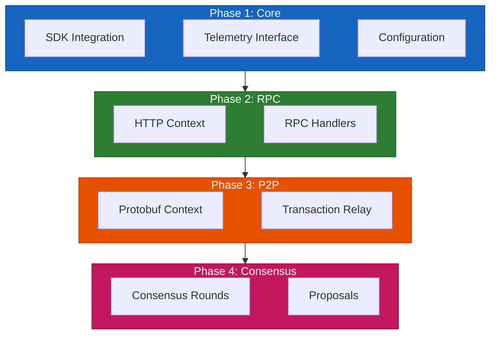
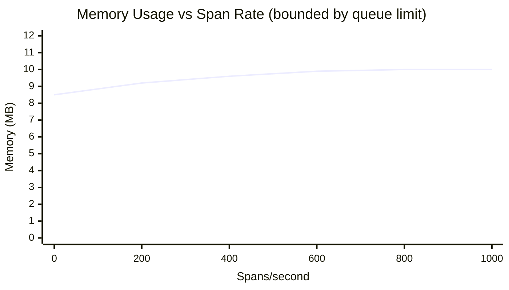
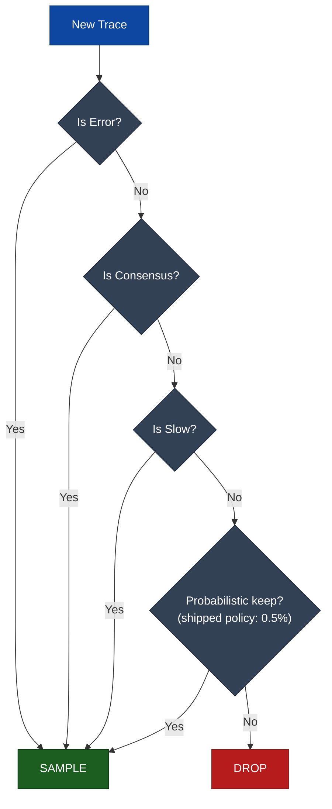
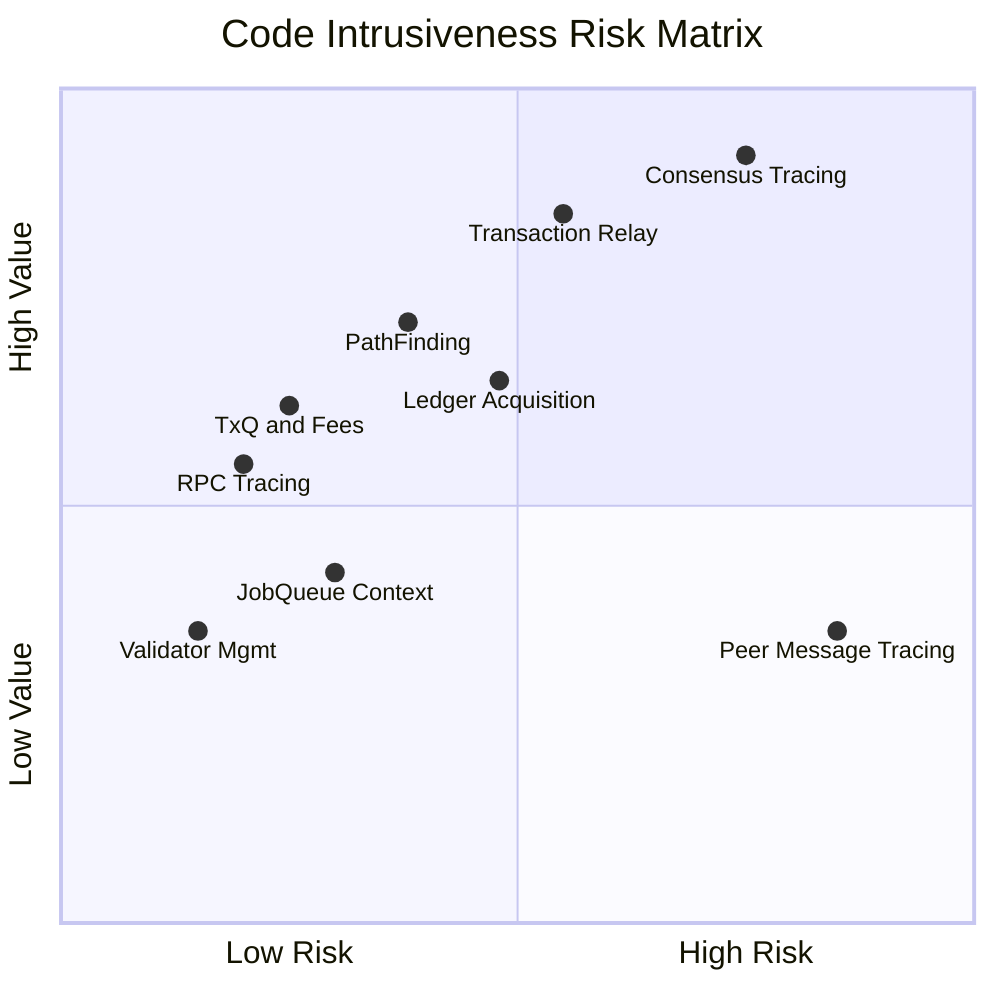

# Implementation Strategy

> **Parent Document**: [OpenTelemetryPlan.md](./OpenTelemetryPlan.md)
> **Related**: [Configuration Reference](./05-configuration-reference.md)

---

## 3.1 Directory Structure

The telemetry implementation follows xrpld's existing code organization
pattern. The tree below is the current on-disk contents of the three telemetry
directories, and it has three differences from the original design sketch worth
calling out: `TelemetryConfig.h`, `TraceContext.h`, `SpanAttributes.h` and
`TraceContext.cpp` were never created (config structs live inside
`Telemetry.h`, propagation lives in `TraceContextPropagator.h`, and attribute
constants live in the `*SpanNames.h` headers next to their owning class); the
metrics work of Phase 7/9 added a whole second module under
`src/xrpld/telemetry/`, which the sketch predated.

```
include/xrpl/telemetry/            # libxrpl layer: tracing SDK wrapper
├── Telemetry.h                    # Interface + Setup config struct + factories
├── SpanGuard.h                    # RAII span management, factory methods, discard()
├── SpanNames.h                    # StaticStr/join() + shared span & attr constants
├── DiscardFlag.h                  # Thread-local discard flag
├── CoroAwareContextStorage.h      # RuntimeContextStorage override for coroutines
├── DeterministicIdGenerator.h     # trace_id from txHash / prevLedgerHash
├── TraceContextPropagator.h       # protobuf TraceContext inject/extract (P2P)
├── TraceContextValidation.h       # Validation of peer-supplied trace context
├── Redaction.h                    # redactAccount() — unconditional address hashing
└── GetObjectMetricNames.h         # getobject_* metric name constants

src/libxrpl/telemetry/
├── Telemetry.cpp                  # TelemetryImpl + FilteringSpanProcessor + initMetrics()
├── TelemetryConfig.cpp            # [telemetry] section parsing (makeTelemetrySetup)
├── SpanGuard.cpp                  # Span/scope guard implementation
├── CoroAwareContextStorage.cpp
├── DeterministicIdGenerator.cpp
├── Redaction.cpp
└── NullTelemetry.cpp              # No-op impl — ALWAYS compiled (in-source #ifdef)

src/xrpld/telemetry/               # xrpld layer: native metrics + tx tracing helpers
├── MetricsRegistry.h / .cpp       # Owns the XRPL_METRIC_* instruments + MeterProvider
├── MetricMacros.h                 # XRPL_METRIC_COUNTER_ADD / _HISTOGRAM_RECORD / ...
├── ValidationTracker.h            # Validation-agreement tracking (impl in detail/)
├── detail/ValidationTracker.cpp
├── ConsensusReceiveTracing.h      # Peer proposal/validation receive spans
├── PropagationHelpers.h           # Context inject/extract call-site helpers
├── TxSpanNames.h                  # tx.* span + attribute constants
└── TxTracing.h                    # Transaction span helpers
```

Per-class span-name headers deliberately live next to their owning class rather
than in `telemetry/` — see `ConsensusSpanNames.h`, `TxApplySpanNames.h`,
`LedgerSpanNames.h`, `RpcSpanNames.h`, `PathFindSpanNames.h`,
`PeerSpanNames.h`, `TxQSpanNames.h`, `GrpcSpanNames.h`.

---

## 3.2 Implementation Approach

<div align="center">



</div>

### Key Principles

1. **Minimal Intrusion**: Instrumentation should not alter existing control flow
2. **Zero-Cost When Disabled**: Use compile-time flags and no-op implementations
3. **Backward Compatibility**: Protocol Buffer extensions use high field numbers
4. **Graceful Degradation**: Tracing failures must not affect node operation

---

## 3.3 Performance Overhead Summary

> **OTLP** = OpenTelemetry Protocol

| Metric        | Overhead   | Notes                                            |
| ------------- | ---------- | ------------------------------------------------ |
| CPU           | 1-3%       | Of per-transaction CPU cost (~200μs baseline)    |
| Memory        | ~10 MB     | SDK statics + batch buffer + worker thread stack |
| Network       | 10-50 KB/s | Compressed OTLP export to collector              |
| Latency (p99) | <2%        | With proper sampling configuration               |

---

## 3.4 Detailed CPU Overhead Analysis

### 3.4.1 Per-Operation Costs

> **Note on hardware assumptions**: The costs below are based on the official OTel C++ SDK CI benchmarks
> (969 runs on GitHub Actions 2-core shared runners). On production server hardware (3+ GHz Xeon),
> expect costs at the **lower end** of each range (~30-50% improvement over CI hardware).

| Operation             | Time (ns) | Frequency              | Impact     |
| --------------------- | --------- | ---------------------- | ---------- |
| Span creation         | 500-1000  | Every traced operation | Low        |
| Span end              | 100-200   | Every traced operation | Low        |
| SetAttribute (string) | 80-120    | 3-5 per span (typical) | Low        |
| SetAttribute (int)    | 40-60     | 2-3 per span (typical) | Negligible |
| AddEvent              | 100-200   | 0-2 per span           | Low        |
| Context injection     | 150-250   | Per outgoing message   | Low        |
| Context extraction    | 100-180   | Per incoming message   | Low        |
| GetCurrent context    | 10-20     | Thread-local access    | Negligible |

> **"3-5 attributes per span" is a typical case, not a bound.** The frequency
> column above describes the median span (`tx.receive`, `rpc.command.*`). A few
> spans are deliberately attribute-rich: `consensus.accept.apply` sets **13**
> attributes (`RCLConsensus.cpp:600-674`), and `consensus.round` /
> `consensus.establish` are of the same order. Use ~15 as the worst case when
> sizing per-span attribute cost and memory; the consensus spans that hit it fire
> once per ~3-second round, so their absolute cost stays in the noise
> (see §3.4.3).

**Source**: Span creation based on OTel C++ SDK `BM_SpanCreation` benchmark (AlwaysOnSampler +
SimpleSpanProcessor + InMemoryExporter), median ~1,000 ns on CI hardware. AddEvent includes
timestamp read + string copy + vector push + mutex acquisition. Context injection/extraction
confirmed by `BM_SpanCreationWithScope` benchmark delta (~160 ns).

### 3.4.2 Transaction Processing Overhead

<div align="center">


**Transaction Tracing Overhead (~4.0μs total)**

</div>

**Overhead percentage**: 4.0 μs / 200 μs (avg tx processing) = **~2.0%**

> **Breakdown**: Each span (tx.receive, tx.process, tx.apply) costs ~1,000 ns for creation plus
> ~200-400 ns for 3-5 attribute sets. Context injection is ~200 ns (confirmed by benchmarks).
> On production hardware, expect ~2.6 μs total (~1.3% overhead) due to faster span creation (~500-600 ns).
>
> This three-span model predates the apply-pipeline instrumentation. The shipped
> transaction path also emits `tx.preflight`, `tx.preclaim` and `tx.transactor`
> (the spans planned here as `tx.validate`), and never emits `tx.relay`. Scale
> the estimate by span count for a current figure: ~6 spans ≈ 7-8 μs on CI
> hardware, ~4-5 μs on server hardware. The measured end-to-end cost is in
> §3.5.3 (~3-4% throughput at head sampling 1.0), which supersedes this
> bottom-up estimate.

### 3.4.3 Consensus Round Overhead

| Operation              | Count | Cost (ns) | Total      |
| ---------------------- | ----- | --------- | ---------- |
| consensus.round span   | 1     | ~1200     | ~1.2 μs    |
| consensus.phase spans  | 3     | ~1100     | ~3.3 μs    |
| proposal.receive spans | ~20   | ~1100     | ~22 μs     |
| proposal.send spans    | ~3    | ~1100     | ~3.3 μs    |
| Context operations     | ~30   | ~200      | ~6 μs      |
| **TOTAL**              |       |           | **~36 μs** |

> **Why higher**: Each span costs ~1,000 ns creation + ~100-200 ns for 1-2 attributes, totaling ~1,100-1,200 ns.
> Context operations remain ~200 ns (confirmed by benchmarks). On production hardware, expect ~24 μs total.
>
> The "1-2 attributes" figure understates the shipped consensus spans, which are
> the attribute-rich ones: `consensus.accept.apply` alone sets 13
> (`RCLConsensus.cpp:600-674`). Adding ~1 μs per such span still leaves the
> round total under ~40 μs against a ~3 s round, so the conclusion below is
> unaffected. Note also that the `consensus.phase` row covers the shipped names
> `consensus.phase.open`, `consensus.establish` and `consensus.accept` — see
> [02 §2.3.2](./02-design-decisions.md).

**Overhead percentage**: 36 μs / 3s (typical round) = **~0.001%** (negligible)

### 3.4.4 RPC Request Overhead

| Operation                                  | Cost (ns)    |
| ------------------------------------------ | ------------ |
| `rpc.http_request` / `rpc.ws_message` span | ~1200        |
| `rpc.command.*` span                       | ~1100        |
| Context extract                            | ~250         |
| Context inject                             | ~200         |
| **TOTAL**                                  | **~2.75 μs** |

> **Why higher**: Each span costs ~1,000 ns creation + ~100-200 ns for attributes (command name,
> version, role). Context extract/inject costs are confirmed by OTel C++ benchmarks.

- Fast RPC (1ms): 2.75 μs / 1ms = **~0.275%**
- Slow RPC (100ms): 2.75 μs / 100ms = **~0.003%**

---

## 3.5 Memory Overhead Analysis

> **OTLP** = OpenTelemetry Protocol

### 3.5.1 Static Memory

| Component                            | Size        | Allocated  |
| ------------------------------------ | ----------- | ---------- |
| TracerProvider singleton             | ~64 KB      | At startup |
| BatchSpanProcessor (circular buffer) | ~16 KB      | At startup |
| BatchSpanProcessor (worker thread)   | ~8 MB       | At startup |
| OTLP/HTTP exporter (client init)     | ~64 KB      | At startup |
| Propagator registry                  | ~8 KB       | At startup |
| **Total static**                     | **~8.1 MB** |            |

> **Why higher than earlier estimate**: The BatchSpanProcessor's circular buffer itself is only ~16 KB
> (2049 x 8-byte `AtomicUniquePtr` entries), but it spawns a dedicated worker thread whose default
> stack size on Linux is ~8 MB. The OTLP/HTTP exporter allocates a small client and TLS
> initialization buffer. The worker thread stack dominates the static footprint.

### 3.5.2 Dynamic Memory

| Component            | Size per unit  | Max units  | Peak            |
| -------------------- | -------------- | ---------- | --------------- |
| Active span          | ~500-800 bytes | 1000       | ~500-800 KB     |
| Queued span (export) | ~500 bytes     | 2048       | ~1 MB           |
| Attribute storage    | ~80 bytes      | 5 per span | Included        |
| Context storage      | ~64 bytes      | Per thread | ~6.4 KB         |
| **Total dynamic**    |                |            | **~1.5-1.8 MB** |

> **Why active spans are larger**: An active `Span` object includes the wrapper (~88 bytes: shared_ptr,
> mutex, unique_ptr to Recordable) plus `SpanData` (~250 bytes: SpanContext, timestamps, name, status,
> empty containers) plus attribute storage (~200-500 bytes for 3-5 string attributes in a `std::map`).
> Source: `sdk/src/trace/span.h` and `sdk/include/opentelemetry/sdk/trace/span_data.h`.
> Queued spans release the wrapper, keeping only `SpanData` + attributes (~500 bytes).

### 3.5.3 Memory Growth Characteristics



**Notes**:

- Memory increases with span rate but **plateaus at queue capacity** (default 2048 spans)
- Batch export prevents unbounded growth
- At queue limit, oldest spans are dropped (not blocked)
- Maximum memory is bounded: ~8.3 MB static (dominated by worker thread stack) + 2048 queued spans x ~500 bytes (~1 MB) + active spans (~0.8 MB) ≈ **~10 MB ceiling**
- The worker thread stack (~8 MB) is virtual memory; actual RSS depends on stack usage (typically much less)

> **Measured outcome**: A perf-iac comparison (telemetry compiled-in + enabled vs compiled-out,
> 9 nodes — validators and client-handlers — under sustained payment load) recorded **no measurable
> RSS increase over the telemetry-off baseline** (~15 GiB mean / ~18–19 GiB peak on both sides),
> with no OOM, no swap, and no leak across the run. The ~10 MB ceiling above is therefore a
> provisioning safety margin (dominated by virtual thread-stack address space), not an expected
> resident-memory increase. Steady-state cost shows up as throughput (~3–4% at head sampling 1.0),
> not memory.

### 3.5.4 Performance Data Sources

The overhead estimates in Sections 3.3-3.5 are derived from the following sources:

| Source                                           | What it covers                                        | URL                                                                                                                                        |
| ------------------------------------------------ | ----------------------------------------------------- | ------------------------------------------------------------------------------------------------------------------------------------------ |
| OTel C++ SDK CI benchmarks (969 runs)            | Span creation, context activation, sampler overhead   | [Benchmark Dashboard](https://open-telemetry.github.io/opentelemetry-cpp/benchmarks/)                                                      |
| `api/test/trace/span_benchmark.cc`               | API-level span creation (~22 ns no-op)                | [Source](https://github.com/open-telemetry/opentelemetry-cpp/blob/main/api/test/trace/span_benchmark.cc)                                   |
| `sdk/test/trace/sampler_benchmark.cc`            | SDK span creation with samplers (~1,000 ns AlwaysOn)  | [Source](https://github.com/open-telemetry/opentelemetry-cpp/blob/main/sdk/test/trace/sampler_benchmark.cc)                                |
| `sdk/include/.../span_data.h`                    | SpanData memory layout (~250 bytes base)              | [Source](https://github.com/open-telemetry/opentelemetry-cpp/blob/main/sdk/include/opentelemetry/sdk/trace/span_data.h)                    |
| `sdk/src/trace/span.h`                           | Span wrapper memory layout (~88 bytes)                | [Source](https://github.com/open-telemetry/opentelemetry-cpp/blob/main/sdk/src/trace/span.h)                                               |
| `sdk/include/.../batch_span_processor_options.h` | Default queue size (2048), batch size (512)           | [Source](https://github.com/open-telemetry/opentelemetry-cpp/blob/main/sdk/include/opentelemetry/sdk/trace/batch_span_processor_options.h) |
| `sdk/include/.../circular_buffer.h`              | CircularBuffer implementation (AtomicUniquePtr array) | [Source](https://github.com/open-telemetry/opentelemetry-cpp/blob/main/sdk/include/opentelemetry/sdk/common/circular_buffer.h)             |
| OTLP proto definition                            | Serialized span size estimation                       | [Proto](https://github.com/open-telemetry/opentelemetry-proto/blob/main/opentelemetry/proto/trace/v1/trace.proto)                          |

---

## 3.6 Network Overhead Analysis

### 3.6.1 Export Bandwidth

> **Bytes per span**: Estimates use ~500 bytes/span (conservative upper bound). OTLP protobuf analysis
> shows a typical span with 3-5 string attributes serializes to ~200-300 bytes raw; with gzip
> compression (~60-70% of raw) and batching (amortized headers), ~350 bytes/span is more realistic.
> The table uses the conservative estimate for capacity planning.

**Node → collector bandwidth is always the 100% row.** Head sampling is a
`static constexpr` 1.0 (`Telemetry.h:234`) with no config key, so every node
exports every span and the export bandwidth is not tunable from `xrpld.cfg`.

| Sampling Rate         | Spans/sec | Bandwidth  | Where it applies                                                                                                                    |
| --------------------- | --------- | ---------- | ----------------------------------------------------------------------------------------------------------------------------------- |
| 100%                  | ~500      | ~250 KB/s  | **The only reachable node→collector figure.** Plan capacity against this row                                                        |
| 0.5%                  | ~2.5      | ~1.25 KB/s | Collector→backend only, and only with the Grafana Cloud overlay's `tail_sampling` (`otel-collector-config.grafanacloud.yaml:60-67`) |
| 10% / 1% / error-only | —         | —          | **Not implemented.** No shipped config produces these ratios; treat them as illustrative of what a tail-sampling policy could do    |

The rows below 100% therefore reduce _storage_ cost at the backend, never the
node's egress. Note also that the shipped 0.5% policy is applied to the
trace-storage branch only, so the spanmetrics-derived RED metrics still see
100% of spans and stay exact.

### 3.6.2 Trace Context Propagation

| Message Type           | Context Size | Messages/sec | Overhead    |
| ---------------------- | ------------ | ------------ | ----------- |
| TMTransaction          | 25 bytes     | ~100         | ~2.5 KB/s   |
| TMProposeSet           | 25 bytes     | ~10          | ~250 B/s    |
| TMValidation           | 25 bytes     | ~50          | ~1.25 KB/s  |
| **Total P2P overhead** |              |              | **~4 KB/s** |

---

## 3.7 Optimization Strategies

### 3.7.1 Sampling Strategies

#### Head Sampling (node) — fixed, not a decision point

There is no sampling decision on the node. `samplingRatio` is a
`static constexpr double = 1.0` (`Telemetry.h:234`) and `TelemetryConfig.cpp:139`
records why nothing is parsed: a per-node ratio would let two nodes make
opposite keep/drop decisions for the same distributed trace, yielding partial
traces. The ratio sampler is wrapped in a `ParentBasedSampler` so a span with a
remote parent honours the upstream flag. The only node-local way to drop a span
is the explicit, per-call-site `SpanGuard::discard()`, enforced downstream by
`FilteringSpanProcessor`.

#### Tail Sampling (collector) — aspirational shape

The flowchart below is a **design sketch of a multi-policy tail sampler. It is
not what ships.** The base collector config has no `tail_sampling` processor at
all; the Grafana Cloud overlay has exactly one `probabilistic` policy at 0.5%
with no error or latency carve-outs. Read it as a template for a policy you
might write, not as a description of this repo — and note that adding
error/latency policies would need `decision_wait` tuning, since a policy can
only see spans that arrived within that window.



### 3.7.2 Batch Tuning Recommendations

| Environment        | Batch Size | Batch Delay | Max Queue |
| ------------------ | ---------- | ----------- | --------- |
| Low-latency        | 128        | 1000ms      | 512       |
| High-throughput    | 1024       | 10000ms     | 8192      |
| Memory-constrained | 256        | 2000ms      | 512       |

### 3.7.3 Conditional Instrumentation

Instrumentation is gated on two levels. A compile-time feature flag reduces the trace macros to no-ops when telemetry is built out, so disabled builds carry zero cost. At runtime, per-component guards (e.g. `shouldTracePeer()`) skip span creation for components whose tracing is turned off, incurring no overhead beyond a single boolean check.

> The compile-time gate is the macro `XRPL_ENABLE_TELEMETRY`, but that macro is
> **not** the switch you flip. It is a compile definition added by
> `CMakeLists.txt` (`add_compile_definitions(XRPL_ENABLE_TELEMETRY)`) when the CMake option `telemetry` is ON.
> That option is declared ON today (`option(telemetry "Enable OpenTelemetry tracing" ON)`)
> only so that CI compiles the instrumented build while the telemetry branches are
> in review; **OFF is the intended default once merged**, flipped in a separate
> change. Select the value explicitly instead of relying on the default:
> `-Dtelemetry=ON|OFF` (CMake) or `-o telemetry=True|False` (Conan). See
> [05 §5.4.2](./05-configuration-reference.md).

---

## 3.8 Links to Detailed Documentation

- **[Configuration Reference](./05-configuration-reference.md)**: Configuration options and collector setup
- **[Implementation Phases](./06-implementation-phases.md)**: Detailed timeline and milestones

---

## 3.9 Code Intrusiveness Assessment

> **TxQ** = Transaction Queue

This section provides a detailed assessment of how intrusive the OpenTelemetry integration is to the existing xrpld codebase.

### 3.9.3 Risk Assessment by Component

<div align="center">

**Do First** ↖ ↗ **Plan Carefully**



**Optional** ↙ ↘ **Avoid**

</div>

#### Risk Level Definitions

| Risk Level | Definition                                                       | Mitigation                         |
| ---------- | ---------------------------------------------------------------- | ---------------------------------- |
| **Low**    | Additive changes only; no modification to existing logic         | Standard code review               |
| **Medium** | Minor modifications to existing functions; clear boundaries      | Comprehensive unit tests           |
| **High**   | Changes to core logic or data structures; potential side effects | Integration tests + staged rollout |

### 3.9.4 Architectural Impact Assessment

| Aspect               | Impact  | Justification                                                                                                                                                                                                                                                                                                                                                                                                                                        |
| -------------------- | ------- | ---------------------------------------------------------------------------------------------------------------------------------------------------------------------------------------------------------------------------------------------------------------------------------------------------------------------------------------------------------------------------------------------------------------------------------------------------- |
| **Data Flow**        | Minimal | Read-only instrumentation; no modification to consensus or transaction data flow                                                                                                                                                                                                                                                                                                                                                                     |
| **Threading Model**  | Minimal | Context propagation uses thread-local storage (standard OTel pattern)                                                                                                                                                                                                                                                                                                                                                                                |
| **Memory Model**     | Low     | Bounded queues prevent unbounded growth; RAII ensures cleanup                                                                                                                                                                                                                                                                                                                                                                                        |
| **Network Protocol** | Low     | Optional fields in protobuf (high field numbers); backward compatible                                                                                                                                                                                                                                                                                                                                                                                |
| **Configuration**    | None    | New config section; existing configs unaffected                                                                                                                                                                                                                                                                                                                                                                                                      |
| **Build System**     | Low     | A single CMake option (`telemetry`) selects the whole feature in or out, and builds work either way (`-Dtelemetry=ON` / `-Dtelemetry=OFF`). It is declared ON today only so CI compiles the instrumented paths; **OFF is the intended default once merged**, so the shipped build is opt-in                                                                                                                                                          |
| **Dependencies**     | Medium  | `opentelemetry-cpp/1.28.0` is a **conditional** requirement, never a hard one: `conanfile.py:152-153` adds it only `if self.options.telemetry`, and `:238-239` adds the matching `libxrpl` component requirement the same way. The option's declared default is `True` today (`conanfile.py:59`), so a default `conan install` does resolve it; with `-o telemetry=False` it never enters the graph and the null implementation supplies the factory |

### 3.9.5 Backward Compatibility

| Compatibility   | Status  | Notes                                                                                                                                                                                                                                                                                                                                                                                                                                                                                                                                                                                                                                            |
| --------------- | ------- | ------------------------------------------------------------------------------------------------------------------------------------------------------------------------------------------------------------------------------------------------------------------------------------------------------------------------------------------------------------------------------------------------------------------------------------------------------------------------------------------------------------------------------------------------------------------------------------------------------------------------------------------------ |
| **Config File** | ✅ Full | New `[telemetry]` section is optional                                                                                                                                                                                                                                                                                                                                                                                                                                                                                                                                                                                                            |
| **Protocol**    | ✅ Full | Optional protobuf fields with high field numbers                                                                                                                                                                                                                                                                                                                                                                                                                                                                                                                                                                                                 |
| **Build**       | ✅ Full | `-Dtelemetry=OFF` (or `-o telemetry=False`) produces a binary with all tracing compiled out, whatever the option's declared default happens to be. **Not** `-DXRPL_ENABLE_TELEMETRY=OFF`, which does not disable anything — it is not a CMake option, only a compile definition that `CMakeLists.txt:152` adds inside the `if(telemetry)` block. CMake does flag it (`Manually-specified variables were not used by the project`) at the end of configuration, so it is not literally silent — but the warning is easy to scroll past and the resulting binary still has telemetry compiled in. See [05 §5.4.2](./05-configuration-reference.md) |
| **Runtime**     | ✅ Full | `enabled=0` produces zero overhead                                                                                                                                                                                                                                                                                                                                                                                                                                                                                                                                                                                                               |
| **API**         | ✅ Full | No changes to public RPC or P2P APIs                                                                                                                                                                                                                                                                                                                                                                                                                                                                                                                                                                                                             |

### 3.9.6 Rollback Strategy

If issues are discovered after deployment:

1. **Immediate**: Set `enabled=0` in `[telemetry]` and restart (zero code change).
   Also set `[insight] server=` to something other than `otel` if metrics must
   stop too — `enabled=0` governs tracing, and the metrics pipeline is selected
   separately ([02 §2.6.4](./02-design-decisions.md)).
2. **Quick**: Rebuild with `-Dtelemetry=OFF` (CMake) or `-o telemetry=False`
   (Conan). Pass the flag explicitly — an omitted flag resolves to the option's
   declared default, which is ON today and OFF once the feature is merged; a
   build that already has telemetry off needs no rebuild at all.
   **Do not use `-DXRPL_ENABLE_TELEMETRY=OFF`** — it is not a CMake option, so
   it is ignored (CMake reports it under `Manually-specified variables were not
used by the project`) and the rebuilt binary still has telemetry compiled in.
   This step also drops the `opentelemetry-cpp` dependency, so expect a full
   rebuild rather than an incremental one.
3. **Complete**: Revert telemetry commits (clean separation makes this easy)

### 3.9.7 Code Change Examples

**Minimal RPC Instrumentation (Low Intrusiveness):** Instrumenting an RPC handler adds roughly 3-4 lines: one macro to start the span and one or two `setAttribute` calls (command name, status). The span ends automatically via RAII, so the existing control flow — process the request, send the result — is untouched.

**Consensus Instrumentation (Medium Intrusiveness):** Consensus is slightly more intrusive because child spans in later phase transitions need the round's context. Beyond the span-start and attribute macros, this requires **four** new member variables on the adaptor rather than the single `currentRoundContext_` this section originally sketched (`RCLConsensus.h:103,113,123,143`):

- `std::optional<telemetry::SpanGuard> roundSpan_` (`:103`) — the round span
  itself. It is **created and ended in one place**, `startRoundTracing()`: the
  previous round's guard is released at `RCLConsensus.cpp:1288-1289`
  (`if (roundSpan_) roundSpan_.reset();`) and the new one is emplaced a few
  lines later — at `:1306` or `:1310` on the `"attribute"` strategy, at `:1319`
  on the default `"deterministic"` one. `preStartRound()` does not create it; it
  calls `startRoundTracing()` at `:1229`. There is no `reset()` method — the
  span simply lives until the next round begins. A `SpanGuard` owns no
  thread-local scope, so emplacing and resetting on different job workers is
  safe.
- `telemetry::SpanContext roundSpanContext_` (`:113`) — a lightweight value-type
  snapshot, captured at the end of `startRoundTracing()` (`:1350`). Child spans
  link through this, not through an ambient parent, so code running on another
  worker (e.g. `createValidationSpan()` on `jtACCEPT`) never touches
  `roundSpan_` cross-thread.
- `telemetry::SpanContext prevRoundSpanContext_` (`:123`) — the prior round's
  context, saved at `:1282` **before** the new span overwrites
  `roundSpanContext_`, so the new round span can carry a follows-from link and
  consecutive rounds stay navigable.
- `telemetry::SpanContext acceptSpanContext_` (`:143`) — the current round's
  accept-span context, set at `:544` and cleared at `:1286` on each new round.
  `createValidationSpan()` prefers it as the parent and falls back to
  `roundSpanContext_` (`:1363-1373`), so a stale value must not survive into the
  next round.

The split is the point: the guard is owned by one thread, the contexts are
copied freely. The existing round logic itself remains unchanged.

---

_Previous: [Design Decisions](./02-design-decisions.md)_ | _Next: [Configuration Reference](./05-configuration-reference.md)_ | _Back to: [Overview](./OpenTelemetryPlan.md)_
