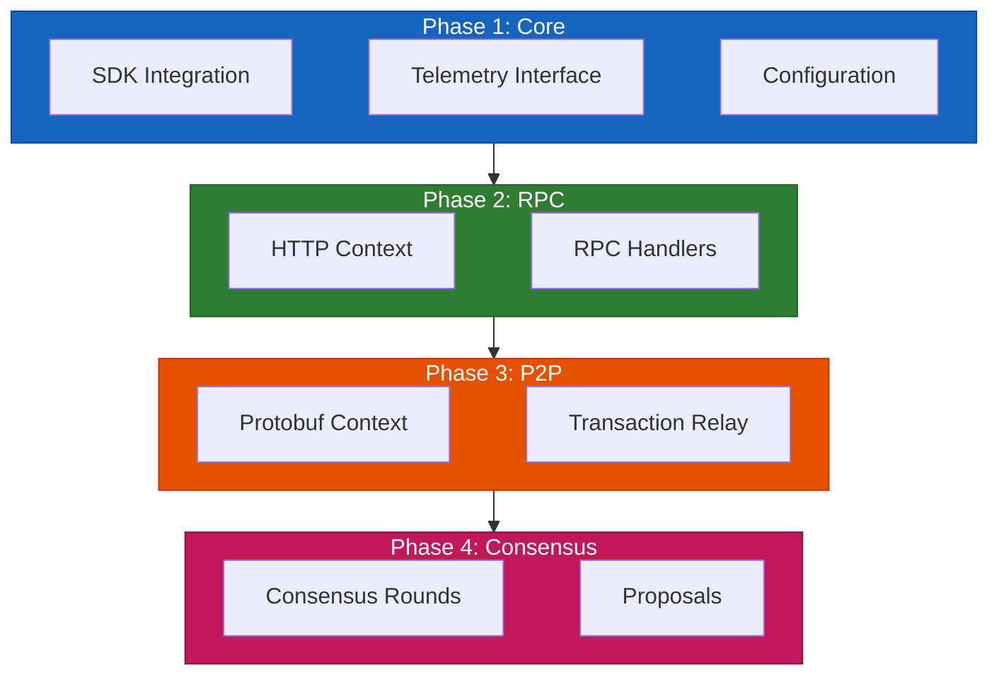
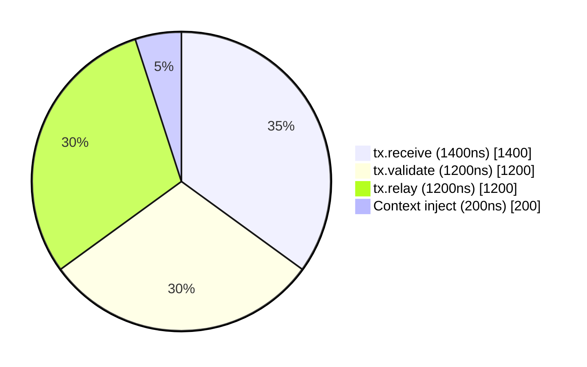
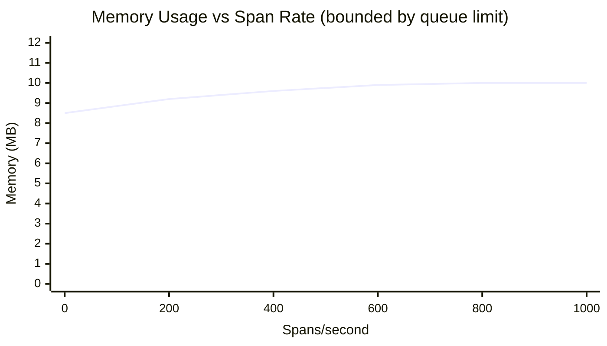
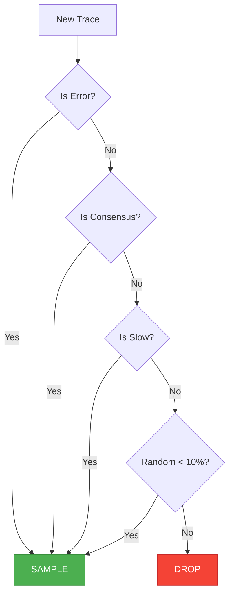
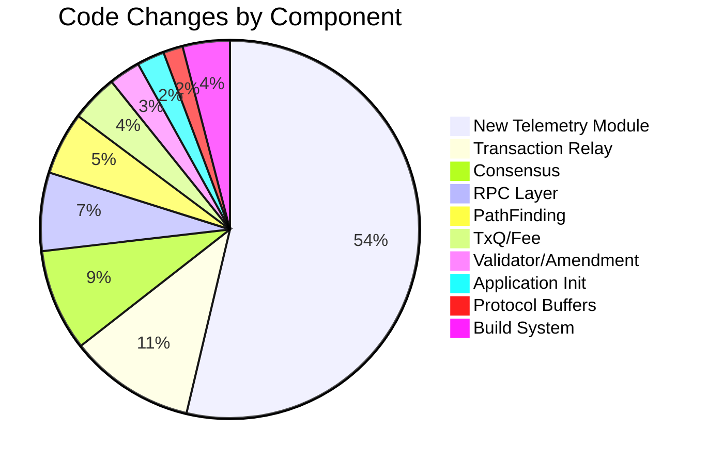
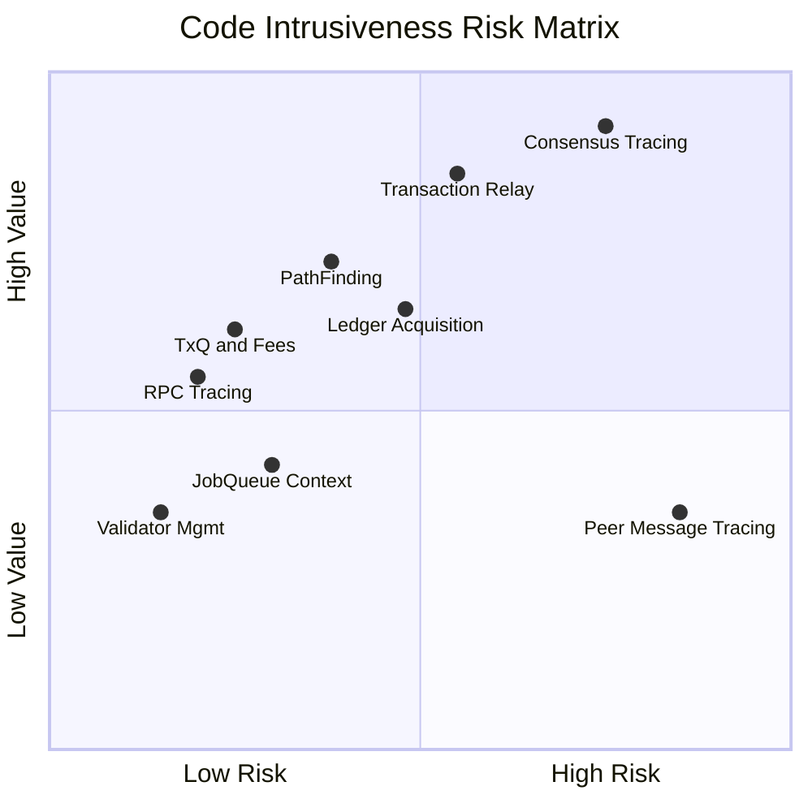

# Implementation Strategy

> **Parent Document**: [OpenTelemetryPlan.md](./OpenTelemetryPlan.md)
> **Related**: [Code Samples](./04-code-samples.md) | [Configuration Reference](./05-configuration-reference.md)

---

## 3.1 Directory Structure

The telemetry implementation follows rippled's existing code organization pattern:

```
include/xrpl/
├── telemetry/
│   ├── Telemetry.h              # Main telemetry interface
│   ├── TelemetryConfig.h        # Configuration structures
│   ├── TraceContext.h           # Context propagation utilities
│   ├── SpanGuard.h              # RAII span management
│   └── SpanAttributes.h         # Attribute helper functions

src/libxrpl/
├── telemetry/
│   ├── Telemetry.cpp            # Implementation
│   ├── TelemetryConfig.cpp      # Config parsing
│   ├── TraceContext.cpp         # Context serialization
│   └── NullTelemetry.cpp        # No-op implementation

src/xrpld/
├── telemetry/
│   ├── TracingInstrumentation.h # Instrumentation macros
│   └── TracingInstrumentation.cpp
```

---

## 3.2 Implementation Approach

<div align="center">



</div>

### Key Principles

1. **Minimal Intrusion**: Instrumentation should not alter existing control flow
2. **Zero-Cost When Disabled**: Use compile-time flags and no-op implementations
3. **Backward Compatibility**: Protocol Buffer extensions use high field numbers
4. **Graceful Degradation**: Tracing failures must not affect node operation

---

## 3.3 Performance Overhead Summary

> **OTLP** = OpenTelemetry Protocol

| Metric        | Overhead   | Notes                                            |
| ------------- | ---------- | ------------------------------------------------ |
| CPU           | 1-3%       | Of per-transaction CPU cost (~200μs baseline)    |
| Memory        | ~10 MB     | SDK statics + batch buffer + worker thread stack |
| Network       | 10-50 KB/s | Compressed OTLP export to collector              |
| Latency (p99) | <2%        | With proper sampling configuration               |

---

## 3.4 Detailed CPU Overhead Analysis

### 3.4.1 Per-Operation Costs

> **Note on hardware assumptions**: The costs below are based on the official OTel C++ SDK CI benchmarks
> (969 runs on GitHub Actions 2-core shared runners). On production server hardware (3+ GHz Xeon),
> expect costs at the **lower end** of each range (~30-50% improvement over CI hardware).

| Operation             | Time (ns) | Frequency              | Impact     |
| --------------------- | --------- | ---------------------- | ---------- |
| Span creation         | 500-1000  | Every traced operation | Low        |
| Span end              | 100-200   | Every traced operation | Low        |
| SetAttribute (string) | 80-120    | 3-5 per span           | Low        |
| SetAttribute (int)    | 40-60     | 2-3 per span           | Negligible |
| AddEvent              | 100-200   | 0-2 per span           | Low        |
| Context injection     | 150-250   | Per outgoing message   | Low        |
| Context extraction    | 100-180   | Per incoming message   | Low        |
| GetCurrent context    | 10-20     | Thread-local access    | Negligible |

**Source**: Span creation based on OTel C++ SDK `BM_SpanCreation` benchmark (AlwaysOnSampler +
SimpleSpanProcessor + InMemoryExporter), median ~1,000 ns on CI hardware. AddEvent includes
timestamp read + string copy + vector push + mutex acquisition. Context injection/extraction
confirmed by `BM_SpanCreationWithScope` benchmark delta (~160 ns).

### 3.4.2 Transaction Processing Overhead

<div align="center">



**Transaction Tracing Overhead (~4.0μs total)**

</div>

**Overhead percentage**: 4.0 μs / 200 μs (avg tx processing) = **~2.0%**

> **Breakdown**: Each span (tx.receive, tx.validate, tx.relay) costs ~1,000 ns for creation plus
> ~200-400 ns for 3-5 attribute sets. Context injection is ~200 ns (confirmed by benchmarks).
> On production hardware, expect ~2.6 μs total (~1.3% overhead) due to faster span creation (~500-600 ns).

### 3.4.3 Consensus Round Overhead

| Operation              | Count | Cost (ns) | Total      |
| ---------------------- | ----- | --------- | ---------- |
| consensus.round span   | 1     | ~1200     | ~1.2 μs    |
| consensus.phase spans  | 3     | ~1100     | ~3.3 μs    |
| proposal.receive spans | ~20   | ~1100     | ~22 μs     |
| proposal.send spans    | ~3    | ~1100     | ~3.3 μs    |
| Context operations     | ~30   | ~200      | ~6 μs      |
| **TOTAL**              |       |           | **~36 μs** |

> **Why higher**: Each span costs ~1,000 ns creation + ~100-200 ns for 1-2 attributes, totaling ~1,100-1,200 ns.
> Context operations remain ~200 ns (confirmed by benchmarks). On production hardware, expect ~24 μs total.

**Overhead percentage**: 36 μs / 3s (typical round) = **~0.001%** (negligible)

### 3.4.4 RPC Request Overhead

| Operation        | Cost (ns)    |
| ---------------- | ------------ |
| rpc.request span | ~1200        |
| rpc.command span | ~1100        |
| Context extract  | ~250         |
| Context inject   | ~200         |
| **TOTAL**        | **~2.75 μs** |

> **Why higher**: Each span costs ~1,000 ns creation + ~100-200 ns for attributes (command name,
> version, role). Context extract/inject costs are confirmed by OTel C++ benchmarks.

- Fast RPC (1ms): 2.75 μs / 1ms = **~0.275%**
- Slow RPC (100ms): 2.75 μs / 100ms = **~0.003%**

---

## 3.5 Memory Overhead Analysis

> **OTLP** = OpenTelemetry Protocol

### 3.5.1 Static Memory

| Component                            | Size        | Allocated  |
| ------------------------------------ | ----------- | ---------- |
| TracerProvider singleton             | ~64 KB      | At startup |
| BatchSpanProcessor (circular buffer) | ~16 KB      | At startup |
| BatchSpanProcessor (worker thread)   | ~8 MB       | At startup |
| OTLP exporter (gRPC channel init)    | ~256 KB     | At startup |
| Propagator registry                  | ~8 KB       | At startup |
| **Total static**                     | **~8.3 MB** |            |

> **Why higher than earlier estimate**: The BatchSpanProcessor's circular buffer itself is only ~16 KB
> (2049 x 8-byte `AtomicUniquePtr` entries), but it spawns a dedicated worker thread whose default
> stack size on Linux is ~8 MB. The OTLP gRPC exporter allocates memory for channel stubs and TLS
> initialization. The worker thread stack dominates the static footprint.

### 3.5.2 Dynamic Memory

| Component            | Size per unit  | Max units  | Peak            |
| -------------------- | -------------- | ---------- | --------------- |
| Active span          | ~500-800 bytes | 1000       | ~500-800 KB     |
| Queued span (export) | ~500 bytes     | 2048       | ~1 MB           |
| Attribute storage    | ~80 bytes      | 5 per span | Included        |
| Context storage      | ~64 bytes      | Per thread | ~6.4 KB         |
| **Total dynamic**    |                |            | **~1.5-1.8 MB** |

> **Why active spans are larger**: An active `Span` object includes the wrapper (~88 bytes: shared_ptr,
> mutex, unique_ptr to Recordable) plus `SpanData` (~250 bytes: SpanContext, timestamps, name, status,
> empty containers) plus attribute storage (~200-500 bytes for 3-5 string attributes in a `std::map`).
> Source: `sdk/src/trace/span.h` and `sdk/include/opentelemetry/sdk/trace/span_data.h`.
> Queued spans release the wrapper, keeping only `SpanData` + attributes (~500 bytes).

### 3.5.3 Memory Growth Characteristics



**Notes**:

- Memory increases with span rate but **plateaus at queue capacity** (default 2048 spans)
- Batch export prevents unbounded growth
- At queue limit, oldest spans are dropped (not blocked)
- Maximum memory is bounded: ~8.3 MB static (dominated by worker thread stack) + 2048 queued spans x ~500 bytes (~1 MB) + active spans (~0.8 MB) ≈ **~10 MB ceiling**
- The worker thread stack (~8 MB) is virtual memory; actual RSS depends on stack usage (typically much less)

### 3.5.4 Performance Data Sources

The overhead estimates in Sections 3.3-3.5 are derived from the following sources:

| Source                                           | What it covers                                        | URL                                                                                                                                        |
| ------------------------------------------------ | ----------------------------------------------------- | ------------------------------------------------------------------------------------------------------------------------------------------ |
| OTel C++ SDK CI benchmarks (969 runs)            | Span creation, context activation, sampler overhead   | [Benchmark Dashboard](https://open-telemetry.github.io/opentelemetry-cpp/benchmarks/)                                                      |
| `api/test/trace/span_benchmark.cc`               | API-level span creation (~22 ns no-op)                | [Source](https://github.com/open-telemetry/opentelemetry-cpp/blob/main/api/test/trace/span_benchmark.cc)                                   |
| `sdk/test/trace/sampler_benchmark.cc`            | SDK span creation with samplers (~1,000 ns AlwaysOn)  | [Source](https://github.com/open-telemetry/opentelemetry-cpp/blob/main/sdk/test/trace/sampler_benchmark.cc)                                |
| `sdk/include/.../span_data.h`                    | SpanData memory layout (~250 bytes base)              | [Source](https://github.com/open-telemetry/opentelemetry-cpp/blob/main/sdk/include/opentelemetry/sdk/trace/span_data.h)                    |
| `sdk/src/trace/span.h`                           | Span wrapper memory layout (~88 bytes)                | [Source](https://github.com/open-telemetry/opentelemetry-cpp/blob/main/sdk/src/trace/span.h)                                               |
| `sdk/include/.../batch_span_processor_options.h` | Default queue size (2048), batch size (512)           | [Source](https://github.com/open-telemetry/opentelemetry-cpp/blob/main/sdk/include/opentelemetry/sdk/trace/batch_span_processor_options.h) |
| `sdk/include/.../circular_buffer.h`              | CircularBuffer implementation (AtomicUniquePtr array) | [Source](https://github.com/open-telemetry/opentelemetry-cpp/blob/main/sdk/include/opentelemetry/sdk/common/circular_buffer.h)             |
| OTLP proto definition                            | Serialized span size estimation                       | [Proto](https://github.com/open-telemetry/opentelemetry-proto/blob/main/opentelemetry/proto/trace/v1/trace.proto)                          |

---

## 3.6 Network Overhead Analysis

### 3.6.1 Export Bandwidth

> **Bytes per span**: Estimates use ~500 bytes/span (conservative upper bound). OTLP protobuf analysis
> shows a typical span with 3-5 string attributes serializes to ~200-300 bytes raw; with gzip
> compression (~60-70% of raw) and batching (amortized headers), ~350 bytes/span is more realistic.
> The table uses the conservative estimate for capacity planning.

| Sampling Rate | Spans/sec | Bandwidth | Notes            |
| ------------- | --------- | --------- | ---------------- |
| 100%          | ~500      | ~250 KB/s | Development only |
| 10%           | ~50       | ~25 KB/s  | Staging          |
| 1%            | ~5        | ~2.5 KB/s | Production       |
| Error-only    | ~1        | ~0.5 KB/s | Minimal overhead |

### 3.6.2 Trace Context Propagation

| Message Type           | Context Size | Messages/sec | Overhead    |
| ---------------------- | ------------ | ------------ | ----------- |
| TMTransaction          | 25 bytes     | ~100         | ~2.5 KB/s   |
| TMProposeSet           | 25 bytes     | ~10          | ~250 B/s    |
| TMValidation           | 25 bytes     | ~50          | ~1.25 KB/s  |
| **Total P2P overhead** |              |              | **~4 KB/s** |

---

## 3.7 Optimization Strategies

### 3.7.1 Sampling Strategies

#### Tail Sampling



### 3.7.2 Batch Tuning Recommendations

| Environment        | Batch Size | Batch Delay | Max Queue |
| ------------------ | ---------- | ----------- | --------- |
| Low-latency        | 128        | 1000ms      | 512       |
| High-throughput    | 1024       | 10000ms     | 8192      |
| Memory-constrained | 256        | 2000ms      | 512       |

### 3.7.3 Conditional Instrumentation

```cpp
// Compile-time feature flag
#ifndef XRPL_ENABLE_TELEMETRY
// Zero-cost when disabled
#define XRPL_TRACE_SPAN(t, n) ((void)0)
#endif

// Runtime component filtering
if (telemetry.shouldTracePeer())
{
    XRPL_TRACE_SPAN(telemetry, "peer.message.receive");
    // ... instrumentation
}
// No overhead when component tracing disabled
```

---

## 3.8 Links to Detailed Documentation

- **[Code Samples](./04-code-samples.md)**: Complete implementation code for all components
- **[Configuration Reference](./05-configuration-reference.md)**: Configuration options and collector setup
- **[Implementation Phases](./06-implementation-phases.md)**: Detailed timeline and milestones

---

## 3.9 Code Intrusiveness Assessment

> **TxQ** = Transaction Queue

This section provides a detailed assessment of how intrusive the OpenTelemetry integration is to the existing rippled codebase.

### 3.9.1 Files Modified Summary

| Component             | Files Modified | Lines Added | Lines Changed | Architectural Impact |
| --------------------- | -------------- | ----------- | ------------- | -------------------- |
| **Core Telemetry**    | 5 new files    | ~800        | 0             | None (new module)    |
| **Application Init**  | 2 files        | ~30         | ~5            | Minimal              |
| **RPC Layer**         | 3 files        | ~80         | ~20           | Minimal              |
| **Transaction Relay** | 4 files        | ~120        | ~40           | Low                  |
| **Consensus**         | 3 files        | ~100        | ~30           | Low-Medium           |
| **Protocol Buffers**  | 1 file         | ~25         | 0             | Low                  |
| **CMake/Build**       | 3 files        | ~50         | ~10           | Minimal              |
| **PathFinding**       | 2              | ~80         | ~5            | Minimal              |
| **TxQ/Fee**           | 2              | ~60         | ~5            | Minimal              |
| **Validator/Amend**   | 3              | ~40         | ~5            | Minimal              |
| **Total**             | **~28 files**  | **~1,490**  | **~120**      | **Low**              |

### 3.9.2 Detailed File Impact



#### New Files (No Impact on Existing Code)

| File                                           | Lines | Purpose              |
| ---------------------------------------------- | ----- | -------------------- |
| `include/xrpl/telemetry/Telemetry.h`           | ~160  | Main interface       |
| `include/xrpl/telemetry/SpanGuard.h`           | ~120  | RAII wrapper         |
| `include/xrpl/telemetry/TraceContext.h`        | ~80   | Context propagation  |
| `src/xrpld/telemetry/TracingInstrumentation.h` | ~60   | Macros               |
| `src/libxrpl/telemetry/Telemetry.cpp`          | ~200  | Implementation       |
| `src/libxrpl/telemetry/TelemetryConfig.cpp`    | ~60   | Config parsing       |
| `src/libxrpl/telemetry/NullTelemetry.cpp`      | ~40   | No-op implementation |

#### Modified Files (Existing Rippled Code)

| File                                              | Lines Added | Lines Changed | Risk Level |
| ------------------------------------------------- | ----------- | ------------- | ---------- |
| `src/xrpld/app/main/Application.cpp`              | ~15         | ~3            | Low        |
| `include/xrpl/core/ServiceRegistry.h`             | ~5          | ~2            | Low        |
| `src/xrpld/rpc/detail/ServerHandler.cpp`          | ~40         | ~10           | Low        |
| `src/xrpld/rpc/handlers/*.cpp`                    | ~30         | ~8            | Low        |
| `src/xrpld/overlay/detail/PeerImp.cpp`            | ~60         | ~15           | Medium     |
| `src/xrpld/overlay/detail/OverlayImpl.cpp`        | ~30         | ~10           | Medium     |
| `src/xrpld/app/consensus/RCLConsensus.cpp`        | ~50         | ~15           | Medium     |
| `src/xrpld/app/consensus/RCLConsensusAdaptor.cpp` | ~40         | ~12           | Medium     |
| `src/xrpld/core/JobQueue.cpp`                     | ~20         | ~5            | Low        |
| `src/xrpld/app/paths/PathRequest.cpp`             | ~40         | ~3            | Low        |
| `src/xrpld/app/paths/Pathfinder.cpp`              | ~40         | ~2            | Low        |
| `src/xrpld/app/misc/TxQ.cpp`                      | ~40         | ~3            | Low        |
| `src/xrpld/app/main/LoadManager.cpp`              | ~20         | ~2            | Low        |
| `src/xrpld/app/misc/ValidatorList.cpp`            | ~20         | ~2            | Low        |
| `src/xrpld/app/misc/AmendmentTable.cpp`           | ~10         | ~2            | Low        |
| `src/xrpld/app/misc/Manifest.cpp`                 | ~10         | ~1            | Low        |
| `src/xrpld/shamap/SHAMap.cpp`                     | ~20         | ~3            | Low        |
| `src/xrpld/overlay/detail/ripple.proto`           | ~25         | 0             | Low        |
| `CMakeLists.txt`                                  | ~40         | ~8            | Low        |
| `cmake/FindOpenTelemetry.cmake`                   | ~50         | 0             | None (new) |

### 3.9.3 Risk Assessment by Component

<div align="center">

**Do First** ↖ ↗ **Plan Carefully**



**Optional** ↙ ↘ **Avoid**

</div>

#### Risk Level Definitions

| Risk Level | Definition                                                       | Mitigation                         |
| ---------- | ---------------------------------------------------------------- | ---------------------------------- |
| **Low**    | Additive changes only; no modification to existing logic         | Standard code review               |
| **Medium** | Minor modifications to existing functions; clear boundaries      | Comprehensive unit tests           |
| **High**   | Changes to core logic or data structures; potential side effects | Integration tests + staged rollout |

### 3.9.4 Architectural Impact Assessment

| Aspect               | Impact  | Justification                                                                    |
| -------------------- | ------- | -------------------------------------------------------------------------------- |
| **Data Flow**        | Minimal | Read-only instrumentation; no modification to consensus or transaction data flow |
| **Threading Model**  | Minimal | Context propagation uses thread-local storage (standard OTel pattern)            |
| **Memory Model**     | Low     | Bounded queues prevent unbounded growth; RAII ensures cleanup                    |
| **Network Protocol** | Low     | Optional fields in protobuf (high field numbers); backward compatible            |
| **Configuration**    | None    | New config section; existing configs unaffected                                  |
| **Build System**     | Low     | Optional CMake flag; builds work without OpenTelemetry                           |
| **Dependencies**     | Low     | OpenTelemetry SDK is optional; null implementation when disabled                 |

### 3.9.5 Backward Compatibility

| Compatibility   | Status  | Notes                                                 |
| --------------- | ------- | ----------------------------------------------------- |
| **Config File** | ✅ Full | New `[telemetry]` section is optional                 |
| **Protocol**    | ✅ Full | Optional protobuf fields with high field numbers      |
| **Build**       | ✅ Full | `XRPL_ENABLE_TELEMETRY=OFF` produces identical binary |
| **Runtime**     | ✅ Full | `enabled=0` produces zero overhead                    |
| **API**         | ✅ Full | No changes to public RPC or P2P APIs                  |

### 3.9.6 Rollback Strategy

If issues are discovered after deployment:

1. **Immediate**: Set `enabled=0` in config and restart (zero code change)
2. **Quick**: Rebuild with `XRPL_ENABLE_TELEMETRY=OFF`
3. **Complete**: Revert telemetry commits (clean separation makes this easy)

### 3.9.7 Code Change Examples

**Minimal RPC Instrumentation (Low Intrusiveness):**

```cpp
// Before
void ServerHandler::onRequest(...) {
    auto result = processRequest(req);
    send(result);
}

// After (only ~10 lines added)
void ServerHandler::onRequest(...) {
    XRPL_TRACE_RPC(app_.getTelemetry(), "rpc.request");  // +1 line
    XRPL_TRACE_SET_ATTR("xrpl.rpc.command", command);     // +1 line

    auto result = processRequest(req);

    XRPL_TRACE_SET_ATTR("xrpl.rpc.status", status);       // +1 line
    send(result);
}
```

**Consensus Instrumentation (Medium Intrusiveness):**

```cpp
// Before
void RCLConsensusAdaptor::startRound(...) {
    // ... existing logic
}

// After (context storage required)
void RCLConsensusAdaptor::startRound(...) {
    XRPL_TRACE_CONSENSUS(app_.getTelemetry(), "consensus.round");
    XRPL_TRACE_SET_ATTR("xrpl.consensus.ledger.seq", seq);

    // Store context for child spans in phase transitions
    currentRoundContext_ = _xrpl_guard_->context();  // New member variable

    // ... existing logic unchanged
}
```

---

_Previous: [Design Decisions](./02-design-decisions.md)_ | _Next: [Code Samples](./04-code-samples.md)_ | _Back to: [Overview](./OpenTelemetryPlan.md)_
