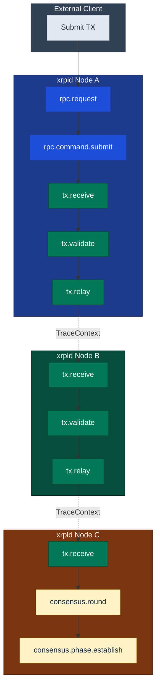

# Code Samples

> **Parent Document**: [OpenTelemetryPlan.md](./OpenTelemetryPlan.md)
> **Related**: [Implementation Strategy](./03-implementation-strategy.md) | [Configuration Reference](./05-configuration-reference.md)

---

## 4.1 Core Interfaces

> **OTLP** = OpenTelemetry Protocol

### 4.1.1 Main Telemetry Interface

```cpp
// include/xrpl/telemetry/Telemetry.h
#pragma once

#include <xrpl/telemetry/TelemetryConfig.h>
#include <opentelemetry/trace/tracer.h>
#include <opentelemetry/trace/span.h>
#include <opentelemetry/context/context.h>

#include <memory>
#include <string>
#include <string_view>

namespace xrpl {
namespace telemetry {

/**
 * Main telemetry interface for OpenTelemetry integration.
 *
 * This class provides the primary API for distributed tracing in xrpld.
 * It manages the OpenTelemetry SDK lifecycle and provides convenience
 * methods for creating spans and propagating context.
 */
class Telemetry
{
public:
    /**
     * Configuration for the telemetry system.
     */
    struct Setup
    {
        bool enabled = false;
        std::string serviceName = "xrpld";
        std::string serviceVersion;
        std::string serviceInstanceId;  // Node public key

        // Exporter configuration
        std::string exporterType = "otlp_grpc";  // "otlp_grpc", "otlp_http", "none"
        std::string exporterEndpoint = "localhost:4317";
        bool useTls = false;
        std::string tlsCertPath;

        // Sampling configuration
        double samplingRatio = 1.0;  // 1.0 = 100% sampling

        // Batch processor settings
        std::uint32_t batchSize = 512;
        std::chrono::milliseconds batchDelay{5000};
        std::uint32_t maxQueueSize = 2048;

        // Network attributes
        std::uint32_t networkId = 0;
        std::string networkType = "mainnet";

        // Component filtering
        bool traceTransactions = true;
        bool traceConsensus = true;
        bool traceRpc = true;
        bool tracePeer = false;  // High volume, disabled by default
        bool traceLedger = true;
        bool tracePathfind = true;
        bool traceTxQ = true;
        bool traceValidator = false;  // Low volume, disabled by default
        bool traceAmendment = false;  // Very low volume, disabled by default
    };

    virtual ~Telemetry() = default;

    // ═══════════════════════════════════════════════════════════════════════
    // LIFECYCLE
    // ═══════════════════════════════════════════════════════════════════════

    /** Start the telemetry system (call after configuration) */
    virtual void start() = 0;

    /** Stop the telemetry system (flushes pending spans) */
    virtual void stop() = 0;

    /** Check if telemetry is enabled */
    virtual bool isEnabled() const = 0;

    // ═══════════════════════════════════════════════════════════════════════
    // TRACER ACCESS
    // ═══════════════════════════════════════════════════════════════════════

    /** Get the tracer for creating spans */
    virtual opentelemetry::nostd::shared_ptr<opentelemetry::trace::Tracer>
    getTracer(std::string_view name = "xrpld") = 0;

    // ═══════════════════════════════════════════════════════════════════════
    // SPAN CREATION (Convenience Methods)
    // ═══════════════════════════════════════════════════════════════════════

    /** Start a new span with default options */
    virtual opentelemetry::nostd::shared_ptr<opentelemetry::trace::Span>
    startSpan(
        std::string_view name,
        opentelemetry::trace::SpanKind kind =
            opentelemetry::trace::SpanKind::kInternal) = 0;

    /** Start a span as child of given context */
    virtual opentelemetry::nostd::shared_ptr<opentelemetry::trace::Span>
    startSpan(
        std::string_view name,
        opentelemetry::context::Context const& parentContext,
        opentelemetry::trace::SpanKind kind =
            opentelemetry::trace::SpanKind::kInternal) = 0;

    // ═══════════════════════════════════════════════════════════════════════
    // CONTEXT PROPAGATION
    // ═══════════════════════════════════════════════════════════════════════

    /** Serialize context for network transmission */
    virtual std::string serializeContext(
        opentelemetry::context::Context const& ctx) = 0;

    /** Deserialize context from network data */
    virtual opentelemetry::context::Context deserializeContext(
        std::string const& serialized) = 0;

    // ═══════════════════════════════════════════════════════════════════════
    // COMPONENT FILTERING
    // ═══════════════════════════════════════════════════════════════════════

    /** Check if transaction tracing is enabled */
    virtual bool shouldTraceTransactions() const = 0;

    /** Check if consensus tracing is enabled */
    virtual bool shouldTraceConsensus() const = 0;

    /** Check if RPC tracing is enabled */
    virtual bool shouldTraceRpc() const = 0;

    /** Check if peer message tracing is enabled */
    virtual bool shouldTracePeer() const = 0;

    /** Check if ledger tracing is enabled */
    virtual bool shouldTraceLedger() const = 0;

    /** Check if path finding tracing is enabled */
    virtual bool shouldTracePathfind() const = 0;

    /** Check if transaction queue tracing is enabled */
    virtual bool shouldTraceTxQ() const = 0;

    /** Check if validator list/manifest tracing is enabled */
    virtual bool shouldTraceValidator() const = 0;

    /** Check if amendment voting tracing is enabled */
    virtual bool shouldTraceAmendment() const = 0;
};

// Factory functions
std::unique_ptr<Telemetry>
make_Telemetry(
    Telemetry::Setup const& setup,
    beast::Journal journal);

Telemetry::Setup
setup_Telemetry(
    Section const& section,
    std::string const& nodePublicKey,
    std::string const& version);

} // namespace telemetry
} // namespace xrpl
```

---

## 4.2 RAII Span Guard with Factory Methods

SpanGuard is a self-contained RAII wrapper that creates, activates, and
ends trace spans. It uses the pimpl idiom to hide all OpenTelemetry
types -- the public header has **zero `opentelemetry/` includes**.
Callers never interact with OTel SDK types directly.

SpanGuard provides static factory methods (`rpcSpan()`, `txSpan()`,
`consensusSpan()`, etc.) that access the global `Telemetry` singleton
internally. Each factory checks both the runtime enable flag and the
relevant component filter before creating a span.

When `XRPL_ENABLE_TELEMETRY` is **not** defined, the entire SpanGuard
class compiles to a no-op stub with empty inline method bodies, giving
zero compile-time and runtime cost.

```cpp
// include/xrpl/telemetry/SpanGuard.h
//
// Public API -- no opentelemetry/ includes.
// OTel types are hidden behind the pimpl (Impl struct, defined in the
// #ifdef XRPL_ENABLE_TELEMETRY section at the bottom of the header).
#pragma once

#include <memory>
#include <string_view>

namespace xrpl {
namespace telemetry {

#ifdef XRPL_ENABLE_TELEMETRY

class SpanGuard
{
    struct Impl;                         // pimpl -- defined in .cpp or
    std::unique_ptr<Impl> impl_;         // in the guarded section below

public:
    // ═══════════════════════════════════════════════════════════════════
    // FACTORY METHODS  (access global Telemetry internally)
    // ═══════════════════════════════════════════════════════════════════

    /** Create a span for RPC request handling.
     *  Returns a no-op guard if telemetry is disabled or
     *  shouldTraceRpc() is false.
     */
    static SpanGuard rpcSpan(std::string_view name);

    /** Create a span for transaction processing. */
    static SpanGuard txSpan(std::string_view name);

    /** Create a span for consensus rounds. */
    static SpanGuard consensusSpan(std::string_view name);

    /** Create a span for peer-to-peer messages. */
    static SpanGuard peerSpan(std::string_view name);

    /** Create a span for ledger operations. */
    static SpanGuard ledgerSpan(std::string_view name);

    /** Create an uncategorized span (always created when enabled). */
    static SpanGuard span(std::string_view name);

    // ═══════════════════════════════════════════════════════════════════
    // INSTANCE METHODS
    // ═══════════════════════════════════════════════════════════════════

    SpanGuard();                         // constructs a no-op guard
    ~SpanGuard();
    SpanGuard(SpanGuard&& other) noexcept;
    SpanGuard& operator=(SpanGuard&&) = delete;
    SpanGuard(SpanGuard const&) = delete;
    SpanGuard& operator=(SpanGuard const&) = delete;

    /** Mark the span status as OK. */
    void setOk();

    /** Set an explicit status code. */
    void setStatus(int code, std::string_view description = "");

    /** Set a key-value attribute on the span. */
    template<typename T>
    void setAttribute(std::string_view key, T&& value);

    /** Add an event to the span timeline. */
    void addEvent(std::string_view name);

    /** Record an exception and set error status. */
    void recordException(std::exception const& e);

    /** Get the current trace context (for cross-thread propagation). */
    // Returns an opaque context handle.
    auto context() const;

    /** Discard this span -- dropped before export. */
    void discard();
};

#else  // XRPL_ENABLE_TELEMETRY not defined -- zero-cost stub

class SpanGuard
{
public:
    // Factory methods -- all return no-op guards
    static SpanGuard rpcSpan(std::string_view) { return {}; }
    static SpanGuard txSpan(std::string_view) { return {}; }
    static SpanGuard consensusSpan(std::string_view) { return {}; }
    static SpanGuard peerSpan(std::string_view) { return {}; }
    static SpanGuard ledgerSpan(std::string_view) { return {}; }
    static SpanGuard span(std::string_view) { return {}; }

    // Instance methods -- all no-ops
    void setOk() {}
    void setStatus(int, std::string_view = "") {}

    template<typename T>
    void setAttribute(std::string_view, T&&) {}

    void addEvent(std::string_view) {}
    void recordException(std::exception const&) {}
    void discard() {}
};

#endif  // XRPL_ENABLE_TELEMETRY

} // namespace telemetry
} // namespace xrpl
```

---

## 4.3 SpanGuard API Reference

The previous macro-based approach (`TracingInstrumentation.h` with
`XRPL_TRACE_*` macros) has been replaced by SpanGuard's static factory
methods. This eliminates preprocessor macros from instrumentation call
sites and provides a cleaner, type-safe API.

### 4.3.1 Factory Methods

Each factory method accesses the global `Telemetry::getInstance()`
singleton internally and checks the corresponding component filter.
If telemetry is disabled (compile-time or runtime) or the component
filter is off, the factory returns a no-op guard whose methods are
all empty inlines.

| Factory Method                   | Component Filter            | Typical Span Names                   |
| -------------------------------- | --------------------------- | ------------------------------------ |
| `SpanGuard::rpcSpan(name)`       | `shouldTraceRpc()`          | `rpc.request`, `rpc.command.submit`  |
| `SpanGuard::txSpan(name)`        | `shouldTraceTransactions()` | `tx.receive`, `tx.validate`          |
| `SpanGuard::consensusSpan(name)` | `shouldTraceConsensus()`    | `consensus.round`, `consensus.phase` |
| `SpanGuard::peerSpan(name)`      | `shouldTracePeer()`         | `peer.message.receive`               |
| `SpanGuard::ledgerSpan(name)`    | `shouldTraceLedger()`       | `ledger.close`, `ledger.accept`      |
| `SpanGuard::span(name)`          | (always, if enabled)        | `job.execute`, custom spans          |

### 4.3.2 Usage Pattern

```cpp
#include <xrpl/telemetry/SpanGuard.h>

void ServerHandler::onRequest(...)
{
    // Factory creates a span if RPC tracing is enabled, no-op otherwise.
    // No Telemetry& reference needed -- accessed via global singleton.
    auto span = telemetry::SpanGuard::rpcSpan("rpc.request");
    span.setAttribute("xrpl.rpc.command", command);

    auto result = processRequest(req);

    span.setAttribute("xrpl.rpc.status", result.status());
    span.setOk();
    // span ended automatically when it goes out of scope
}
```

### 4.3.3 Compile-Time Disabled Behavior

When `XRPL_ENABLE_TELEMETRY` is **not** defined, SpanGuard compiles to
a zero-cost no-op stub. All factory methods return a default-constructed
guard, and all instance methods have empty bodies:

```cpp
// When XRPL_ENABLE_TELEMETRY is not defined:
class SpanGuard
{
public:
    static SpanGuard rpcSpan(std::string_view) { return {}; }
    static SpanGuard txSpan(std::string_view) { return {}; }
    static SpanGuard consensusSpan(std::string_view) { return {}; }
    static SpanGuard peerSpan(std::string_view) { return {}; }
    static SpanGuard ledgerSpan(std::string_view) { return {}; }
    static SpanGuard span(std::string_view) { return {}; }

    void setOk() {}
    void setStatus(int, std::string_view = "") {}
    template<typename T>
    void setAttribute(std::string_view, T&&) {}
    void addEvent(std::string_view) {}
    void recordException(std::exception const&) {}
    void discard() {}
};
```

The compiler optimizes away all calls to these empty methods, producing
the same binary as if no instrumentation code were present.

### 4.3.4 Discard Support

SpanGuard supports discarding a span before it is exported. This is
useful for filtering out uninteresting spans (e.g. successful
preflight checks) after the span has been started:

```cpp
auto span = telemetry::SpanGuard::txSpan("tx.process");
auto result = preflight(tx);
if (result != tesSUCCESS)
{
    // Span is dropped before entering the batch export queue.
    span.discard();
    return result;
}
```

---

## 4.4 Protocol Buffer Extensions

### 4.4.1 TraceContext Message Definition

Add to `src/xrpld/overlay/detail/ripple.proto`:

```protobuf
// Note: xrpld uses proto2 syntax. The 'optional' keyword below is valid
// in proto2 (it is the default field rule) and is included for clarity.

// Trace context for distributed tracing across nodes
// Uses W3C Trace Context format internally
message TraceContext {
    // 16-byte trace identifier (required for valid context)
    bytes trace_id = 1;

    // 8-byte span identifier of parent span
    bytes span_id = 2;

    // Trace flags (bit 0 = sampled)
    uint32 trace_flags = 3;

    // W3C tracestate header value for vendor-specific data
    string trace_state = 4;
}

// Extend existing messages with optional trace context
// High field numbers (1000+) to avoid conflicts

message TMTransaction {
    // ... existing fields ...

    // Optional trace context for distributed tracing
    optional TraceContext trace_context = 1001;
}

message TMProposeSet {
    // ... existing fields ...
    optional TraceContext trace_context = 1001;
}

message TMValidation {
    // ... existing fields ...
    optional TraceContext trace_context = 1001;
}

message TMGetLedger {
    // ... existing fields ...
    optional TraceContext trace_context = 1001;
}

message TMLedgerData {
    // ... existing fields ...
    optional TraceContext trace_context = 1001;
}
```

### 4.4.2 Context Serialization/Deserialization

```cpp
// include/xrpl/telemetry/TraceContext.h
#pragma once

#include <opentelemetry/context/context.h>
#include <opentelemetry/trace/context.h>
#include <opentelemetry/trace/default_span.h>
#include <opentelemetry/trace/span_context.h>
#include <protocol/messages.h>  // Generated protobuf

#include <optional>
#include <string>

namespace xrpl {
namespace telemetry {

/**
 * Utilities for trace context serialization and propagation.
 */
class TraceContextPropagator
{
public:
    /**
     * Extract trace context from Protocol Buffer message.
     * Returns empty context if no trace info present.
     */
    static opentelemetry::context::Context
    extract(protocol::TraceContext const& proto);

    /**
     * Inject current trace context into Protocol Buffer message.
     */
    static void
    inject(
        opentelemetry::context::Context const& ctx,
        protocol::TraceContext& proto);

    /**
     * Extract trace context from HTTP headers (for RPC).
     * Supports W3C Trace Context (traceparent, tracestate).
     */
    static opentelemetry::context::Context
    extractFromHeaders(
        std::function<std::optional<std::string>(std::string_view)> headerGetter);

    /**
     * Inject trace context into HTTP headers (for RPC responses).
     */
    static void
    injectToHeaders(
        opentelemetry::context::Context const& ctx,
        std::function<void(std::string_view, std::string_view)> headerSetter);
};

// ═══════════════════════════════════════════════════════════════════════════
// IMPLEMENTATION
// ═══════════════════════════════════════════════════════════════════════════

inline opentelemetry::context::Context
TraceContextPropagator::extract(protocol::TraceContext const& proto)
{
    using namespace opentelemetry::trace;

    if (proto.trace_id().size() != 16 || proto.span_id().size() != 8)
    {
        // Log malformed trace context for debugging. Silent failures in
        // context extraction make distributed tracing issues hard to diagnose.
        JLOG(j_.warn()) << "Malformed trace context: trace_id size="
                        << proto.trace_id().size()
                        << " span_id size=" << proto.span_id().size();
        return opentelemetry::context::Context{};
    }

    // Construct TraceId and SpanId from bytes
    TraceId traceId(reinterpret_cast<uint8_t const*>(proto.trace_id().data()));
    SpanId spanId(reinterpret_cast<uint8_t const*>(proto.span_id().data()));
    TraceFlags flags(static_cast<uint8_t>(proto.trace_flags()));

    // Create SpanContext from extracted data
    SpanContext spanContext(traceId, spanId, flags, /* remote = */ true);

    // DefaultSpan wraps SpanContext for use as a non-recording parent.
    // This is the standard OTel C++ pattern for remote context propagation.
    // DefaultSpan carries the remote SpanContext without recording any data.
    auto parentCtx = opentelemetry::trace::SetSpan(
        opentelemetry::context::Context{},
        opentelemetry::nostd::shared_ptr<Span>(
            new DefaultSpan(spanContext)));

    return parentCtx;
}

inline void
TraceContextPropagator::inject(
    opentelemetry::context::Context const& ctx,
    protocol::TraceContext& proto)
{
    using namespace opentelemetry::trace;

    // Get current span from context
    auto span = GetSpan(ctx);
    if (!span)
        return;

    auto const& spanCtx = span->GetContext();
    if (!spanCtx.IsValid())
        return;

    // Serialize trace_id (16 bytes)
    auto const& traceId = spanCtx.trace_id();
    proto.set_trace_id(traceId.Id().data(), TraceId::kSize);

    // Serialize span_id (8 bytes)
    auto const& spanId = spanCtx.span_id();
    proto.set_span_id(spanId.Id().data(), SpanId::kSize);

    // Serialize flags
    proto.set_trace_flags(spanCtx.trace_flags().flags());

    // Note: tracestate not implemented yet
}

} // namespace telemetry
} // namespace xrpl
```

---

## 4.5 Module-Specific Instrumentation

### 4.5.1 Transaction Relay Instrumentation

```cpp
// src/xrpld/overlay/detail/PeerImp.cpp (modified)

#include <xrpl/telemetry/SpanGuard.h>

void
PeerImp::handleTransaction(
    std::shared_ptr<protocol::TMTransaction> const& m)
{
    // Extract trace context from incoming message
    opentelemetry::context::Context parentCtx;
    if (m->has_trace_context())
    {
        parentCtx = telemetry::TraceContextPropagator::extract(
            m->trace_context());
    }

    // Start span as child of remote span (cross-node link)
    auto span = app_.getTelemetry().startSpan(
        "tx.receive",
        parentCtx,
        opentelemetry::trace::SpanKind::kServer);
    telemetry::SpanGuard guard(span);

    try
    {
        // Parse and validate transaction
        SerialIter sit(makeSlice(m->rawtransaction()));
        auto stx = std::make_shared<STTx const>(sit);

        // Add transaction attributes
        guard.setAttribute("xrpl.tx.hash", to_string(stx->getTransactionID()));
        guard.setAttribute("xrpl.tx.type", stx->getTxnType());
        guard.setAttribute("xrpl.peer.id", remote_address_.to_string());

        // Check if we've seen this transaction (HashRouter)
        auto const [flags, suppressed] =
            app_.getHashRouter().addSuppressionPeer(
                stx->getTransactionID(),
                id_);

        if (suppressed)
        {
            guard.setAttribute("xrpl.tx.suppressed", true);
            guard.addEvent("tx.duplicate");
            return;  // Already processing this transaction
        }

        // Create child span for validation
        {
            auto validateSpan = app_.getTelemetry().startSpan("tx.validate");
            telemetry::SpanGuard validateGuard(validateSpan);

            auto [validity, reason] = checkTransaction(stx);
            validateGuard.setAttribute("xrpl.tx.validity",
                validity == Validity::Valid ? "valid" : "invalid");

            if (validity != Validity::Valid)
            {
                validateGuard.setStatus(
                    opentelemetry::trace::StatusCode::kError,
                    reason);
                return;
            }
        }

        // Relay to other peers (capture context for propagation)
        auto ctx = guard.context();

        // Create child span for relay
        auto relaySpan = app_.getTelemetry().startSpan(
            "tx.relay",
            ctx,
            opentelemetry::trace::SpanKind::kClient);
        {
            telemetry::SpanGuard relayGuard(relaySpan);

            // Inject context into outgoing message
            protocol::TraceContext protoCtx;
            telemetry::TraceContextPropagator::inject(
                relayGuard.context(), protoCtx);

            // Relay to other peers
            app_.getOverlay().relay(
                stx->getTransactionID(),
                *m,
                protoCtx,  // Pass trace context
                exclusions);

            relayGuard.setAttribute("xrpl.tx.relay_count",
                static_cast<int64_t>(relayCount));
        }

        guard.setOk();
    }
    catch (std::exception const& e)
    {
        guard.recordException(e);
        JLOG(journal_.warn()) << "Transaction handling failed: " << e.what();
    }
}
```

### 4.5.2 Consensus Instrumentation

```cpp
// src/xrpld/app/consensus/RCLConsensus.cpp (modified)

#include <xrpl/telemetry/SpanGuard.h>

void
RCLConsensusAdaptor::startRound(
    NetClock::time_point const& now,
    RCLCxLedger::ID const& prevLedgerHash,
    RCLCxLedger const& prevLedger,
    hash_set<NodeID> const& peers,
    bool proposing)
{
    auto span = telemetry::SpanGuard::consensusSpan("consensus.round");

    span.setAttribute("xrpl.consensus.ledger.prev", to_string(prevLedgerHash));
    span.setAttribute("xrpl.consensus.ledger.seq",
        static_cast<int64_t>(prevLedger.seq() + 1));
    span.setAttribute("xrpl.consensus.proposers",
        static_cast<int64_t>(peers.size()));
    span.setAttribute("xrpl.consensus.mode",
        proposing ? "proposing" : "observing");

    // Store trace context for use in phase transitions
    currentRoundContext_ = span.context();

    // ... existing implementation ...
}

ConsensusPhase
RCLConsensusAdaptor::phaseTransition(ConsensusPhase newPhase)
{
    // Create span for phase transition
    auto span = app_.getTelemetry().startSpan(
        "consensus.phase." + to_string(newPhase),
        currentRoundContext_);
    telemetry::SpanGuard guard(span);

    guard.setAttribute("xrpl.consensus.phase", to_string(newPhase));
    guard.addEvent("phase.enter");

    auto const startTime = std::chrono::steady_clock::now();

    try
    {
        auto result = doPhaseTransition(newPhase);

        auto const duration = std::chrono::steady_clock::now() - startTime;
        guard.setAttribute("xrpl.consensus.phase_duration_ms",
            std::chrono::duration<double, std::milli>(duration).count());

        guard.setOk();
        return result;
    }
    catch (std::exception const& e)
    {
        guard.recordException(e);
        throw;
    }
}

void
RCLConsensusAdaptor::peerProposal(
    NetClock::time_point const& now,
    RCLCxPeerPos const& proposal)
{
    // Extract trace context from proposal message
    opentelemetry::context::Context parentCtx;
    if (proposal.hasTraceContext())
    {
        parentCtx = telemetry::TraceContextPropagator::extract(
            proposal.traceContext());
    }

    auto span = app_.getTelemetry().startSpan(
        "consensus.proposal.receive",
        parentCtx,
        opentelemetry::trace::SpanKind::kServer);
    telemetry::SpanGuard guard(span);

    guard.setAttribute("xrpl.consensus.proposer",
        toBase58(TokenType::NodePublic, proposal.nodeId()));
    guard.setAttribute("xrpl.consensus.round",
        static_cast<int64_t>(proposal.proposal().proposeSeq()));

    // ... existing implementation ...

    guard.setOk();
}
```

### 4.5.3 RPC Handler Instrumentation

```cpp
// src/xrpld/rpc/detail/ServerHandler.cpp (modified)

#include <xrpl/telemetry/SpanGuard.h>

void
ServerHandler::onRequest(
    http_request_type&& req,
    std::function<void(http_response_type&&)>&& send)
{
    // SpanGuard::rpcSpan() accesses the global Telemetry instance
    // and checks shouldTraceRpc() internally. Returns a no-op guard
    // if tracing is disabled.
    auto span = telemetry::SpanGuard::rpcSpan("rpc.request");

    // Add HTTP attributes
    span.setAttribute("http.method", std::string(req.method_string()));
    span.setAttribute("http.target", std::string(req.target()));
    span.setAttribute("http.user_agent",
        std::string(req[boost::beast::http::field::user_agent]));

    auto const startTime = std::chrono::steady_clock::now();

    try
    {
        // Parse and process request
        auto const& body = req.body();
        Json::Value jv;
        Json::Reader reader;

        if (!reader.parse(body, jv))
        {
            span.setStatus(
                /* kError */ 2,
                "Invalid JSON");
            sendError(send, "Invalid JSON");
            return;
        }

        // Extract command name
        std::string command = jv.isMember("command")
            ? jv["command"].asString()
            : jv.isMember("method")
                ? jv["method"].asString()
                : "unknown";

        span.setAttribute("xrpl.rpc.command", command);

        // Create child span for command execution
        {
            auto cmdSpan = telemetry::SpanGuard::rpcSpan(
                "rpc.command." + command);

            // Execute RPC command
            auto result = processRequest(jv);

            // Record result attributes
            if (result.isMember("status"))
            {
                cmdSpan.setAttribute("xrpl.rpc.status",
                    result["status"].asString());
            }

            if (result["status"].asString() == "error")
            {
                cmdSpan.setStatus(
                    /* kError */ 2,
                    result.isMember("error_message")
                        ? result["error_message"].asString()
                        : "RPC error");
            }
            else
            {
                cmdSpan.setOk();
            }
        }

        auto const duration = std::chrono::steady_clock::now() - startTime;
        span.setAttribute("http.duration_ms",
            std::chrono::duration<double, std::milli>(duration).count());

        // Inject trace context into response headers
        http_response_type resp;
        telemetry::TraceContextPropagator::injectToHeaders(
            span.context(),
            [&resp](std::string_view name, std::string_view value) {
                resp.set(std::string(name), std::string(value));
            });

        span.setOk();
        send(std::move(resp));
    }
    catch (std::exception const& e)
    {
        span.recordException(e);
        JLOG(journal_.error()) << "RPC request failed: " << e.what();
        sendError(send, e.what());
    }
}
```

### 4.5.4 JobQueue Context Propagation

> **Architecture note**: `JobQueue` and its inner `Workers` class do not
> hold an `Application&` or `ServiceRegistry&`. They receive a
> `perf::PerfLog*` at construction. Because SpanGuard's factory methods
> access the global `Telemetry` instance directly, no `Telemetry&`
> reference needs to be threaded into `JobQueue`.
>
> The approach below captures trace context at job-creation time and
> restores it when the job executes, so that any spans created _inside_
> the job body automatically become children of the original caller's
> trace.

```cpp
// src/libxrpl/core/detail/JobQueue.cpp (modified -- processTask)

#include <xrpl/telemetry/SpanGuard.h>

void
JobQueue::processTask(int instance)
{
    // ... existing job dequeue logic ...

    // SpanGuard::span() uses the global Telemetry instance --
    // no Telemetry& member needed on JobQueue.
    auto span = telemetry::SpanGuard::span("job.execute");
    span.setAttribute("xrpl.job.type", to_string(job.type()));
    span.setAttribute("xrpl.job.worker",
        static_cast<int64_t>(instance));

    try
    {
        job.execute();
        span.setOk();
    }
    catch (std::exception const& e)
    {
        span.recordException(e);
        JLOG(journal_.error()) << "Job execution failed: " << e.what();
    }
}
```

---

## 4.6 Span Flow Visualization

<div align="center">



</div>

**Reading the diagram:**

- **Client / Submit TX**: An external client submits a transaction, creating the root span that initiates the trace.
- **Node A (RPC layer)**: The receiving node processes the submission through `rpc.request` and `rpc.command.submit`, then hands off to the transaction pipeline (`tx.receive` → `tx.validate` → `tx.relay`).
- **Dashed arrows (TraceContext)**: Cross-node boundaries where trace context is propagated via the protobuf protocol extension, linking spans across independent processes.
- **Node B (relay hop)**: A peer node that receives, validates, and relays the transaction further, demonstrating multi-hop propagation.
- **Node C (consensus)**: The final node where the transaction enters consensus (`consensus.round` → `consensus.phase.establish`), showing how a single client action produces an end-to-end distributed trace.

---

_Previous: [Implementation Strategy](./03-implementation-strategy.md)_ | _Next: [Configuration Reference](./05-configuration-reference.md)_ | _Back to: [Overview](./OpenTelemetryPlan.md)_
