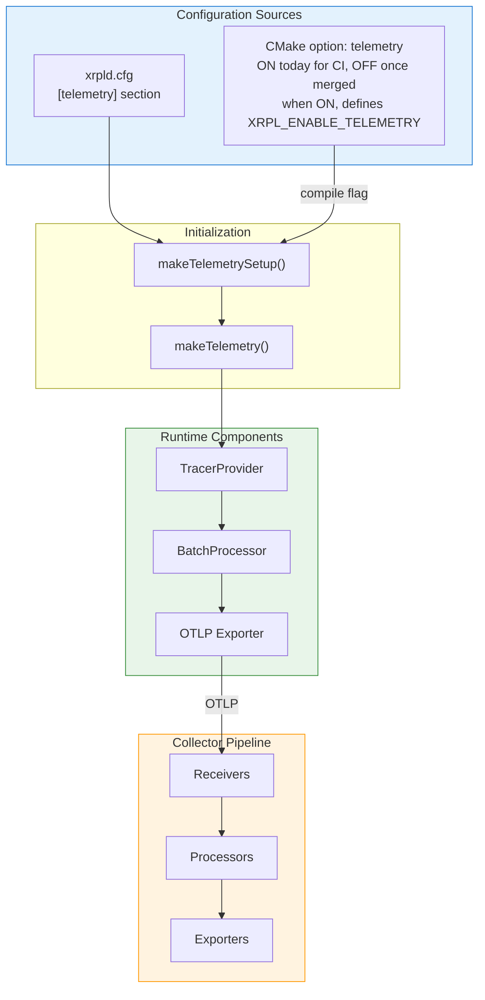

# Configuration Reference

> **Parent Document**: [OpenTelemetryPlan.md](./OpenTelemetryPlan.md)
> **Related**: [Implementation Phases](./06-implementation-phases.md)

---

## 5.1 xrpld Configuration

> **OTLP** = OpenTelemetry Protocol | **TxQ** = Transaction Queue

### 5.1.1 Configuration File Section

The authoritative `[telemetry]` example lives in `cfg/xrpld-example.cfg`. Telemetry is disabled by default (`enabled=0`); enabling it turns on distributed tracing for transaction flow, consensus, and RPC calls, with traces exported to an OpenTelemetry Collector over OTLP. Head sampling is intentionally fixed at 1.0 (sample everything) and is not configurable — per-node head-sampling would produce broken/partial distributed traces, so volume reduction is delegated to the collector's tail sampling (see Section 7.4.2). Transaction trace IDs are always deterministic (`trace_id = txHash[0:16]`); there is no strategy switch for the transaction path. The full option reference follows.

> **`service_instance_id` is effectively required for `beast::insight`
> metrics — and only for those.** Three producers resolve the instance id
> independently, and exactly one of them lacks a node-key fallback:
>
> | Producer                                    | Resource built by                            | Unset `service_instance_id` yields             |
> | ------------------------------------------- | -------------------------------------------- | ---------------------------------------------- |
> | Traces (and therefore all `span_*` metrics) | `Telemetry::start()`                         | Base58 node public key                         |
> | Native `XRPL_METRIC_*` (`MetricsRegistry`)  | `MetricsRegistry::initExporterAndProvider()` | Base58 node public key                         |
> | `beast::insight` (`[insight] server=otel`)  | `TelemetryImpl` **constructor**              | **`service.instance.id` absent** — no fallback |
>
> - **Traces**: the tracer resource is built in `Telemetry::start()`
>   (`Telemetry.cpp:380-387`), which runs after `ApplicationImp::setup()` has
>   called `setServiceInstanceId()` (`Application.cpp:1323`) with the Base58
>   node public key. An unset key therefore still yields the node key. The
>   `spanmetrics` connector derives `span_calls_total` /
>   `span_duration_milliseconds_*` from those spans, so span metrics inherit
>   the correct id too.
> - **Native `XRPL_METRIC_*` metrics** build their **own** MeterProvider
>   resource in `MetricsRegistry::initExporterAndProvider()`
>   (`MetricsRegistry.cpp:280`, `:296-304`, provider created at `:339`), and
>   `ApplicationImp::startTelemetry()` supplies the id with an explicit node-key
>   fallback (`Application.cpp:1674-1679`: read the config key, and
>   `if (instanceId.empty() && nodeIdentity_)` substitute
>   `toBase58(TokenType::NodePublic, …)`). By then `setup()` has resolved
>   `nodeIdentity_` (`Application.cpp:1315`), so these metrics carry the node
>   key even with the config key unset.
> - **`beast::insight` metrics** are the exception. They use the **global**
>   MeterProvider, whose resource is built in the `TelemetryImpl`
>   **constructor** (`Telemetry.cpp:321-338`, `initMetrics()` at `:447`),
>   because insight instruments are created eagerly in subsystem constructors
>   and would otherwise bind to the noop provider forever. At that point
>   `serviceInstanceId` is still `""` (`Application.cpp:348` passes an empty
>   node key), and the code comment at `Telemetry.cpp:333-336` states plainly
>   that the later setter "cannot change this immutable resource". Worse,
>   `initMetrics()` sets the attribute **unconditionally**
>   (`Telemetry.cpp:488`), so the resource carries `service.instance.id=""`
>   rather than omitting it — whereas `MetricsRegistry` guards the same write
>   with `if (!instanceId.empty())` (`MetricsRegistry.cpp:302-303`).
>
> Result: with `service_instance_id` unset, `beast::insight` metrics — and only
> those — export with an empty `service.instance.id`. Every shipped Grafana
> dashboard filters on `service_instance_id=~"$node"`, so **insight-backed
> panels** lose their per-node dimension; span-metric and `XRPL_METRIC_*`
> panels are unaffected. Set the key explicitly on any node whose insight
> metrics are dashboarded.
>
> **Known issue.** The asymmetry is a defect, not a design: `MetricsRegistry`
> already demonstrates the node-key fallback that the global provider needs.
> A fix would have to resolve the node identity before `TelemetryImpl` is
> constructed, or make the insight metrics use a late-built provider.

### 5.1.2 Configuration Options Summary

| Option                     | Type   | Default                            | Description                                                                                                                                                                                                                           |
| -------------------------- | ------ | ---------------------------------- | ------------------------------------------------------------------------------------------------------------------------------------------------------------------------------------------------------------------------------------- |
| `enabled`                  | 0 or 1 | `0`                                | Enable/disable telemetry                                                                                                                                                                                                              |
| `endpoint`                 | string | `http://localhost:4318/v1/traces`  | OTLP/HTTP collector endpoint for **traces**                                                                                                                                                                                           |
| `metrics_endpoint`         | string | `http://localhost:4318/v1/metrics` | OTLP/HTTP collector endpoint for the native metrics pipeline (`MetricsRegistry`). Read in `Application.cpp:1670`                                                                                                                      |
| `use_tls`                  | 0 or 1 | `0`                                | Enable TLS for exporter connection                                                                                                                                                                                                    |
| `tls_ca_cert`              | string | `""`                               | Path to CA certificate file                                                                                                                                                                                                           |
| `tls_client_cert`          | string | `""`                               | Client cert (PEM) for mTLS; empty = one-way; if `enabled=1`, needs key + `use_tls=1` or startup fails                                                                                                                                 |
| `tls_client_key`           | string | `""`                               | Private key (PEM) for `tls_client_cert`; if set with `enabled=1`, needs the cert + `use_tls=1` or fails                                                                                                                               |
| `batch_size`               | uint   | `512`                              | Spans per export batch                                                                                                                                                                                                                |
| `batch_delay_ms`           | uint   | `5000`                             | Max delay before sending batch (ms)                                                                                                                                                                                                   |
| `max_queue_size`           | uint   | `2048`                             | Maximum queued spans                                                                                                                                                                                                                  |
| `trace_transactions`       | bool   | `true`                             | Enable transaction tracing                                                                                                                                                                                                            |
| `trace_consensus`          | bool   | `true`                             | Enable consensus tracing                                                                                                                                                                                                              |
| `trace_rpc`                | bool   | `true`                             | Enable RPC tracing                                                                                                                                                                                                                    |
| `trace_peer`               | bool   | `true`                             | Enable peer message tracing (high volume)                                                                                                                                                                                             |
| `trace_ledger`             | bool   | `true`                             | Enable ledger tracing                                                                                                                                                                                                                 |
| `consensus_trace_strategy` | string | `"deterministic"`                  | Consensus trace ID strategy: `"deterministic"` (trace_id = prevLedgerHash[0:16]) or `"attribute"` (random). Parsed at `TelemetryConfig.cpp:155-156`, consumed at `RCLConsensus.cpp:1291,1296`. **Not validated** — see the note below |
| `service_name`             | string | `"xrpld"`                          | Service name (`service.name`) for traces and metrics                                                                                                                                                                                  |
| `service_instance_id`      | string | node public key (base58)           | Instance identifier (`service.instance.id`). Traces, span metrics and native `XRPL_METRIC_*` metrics all fall back to the node key; **`beast::insight` metrics do not** — see the note in §5.1.1                                      |

**`consensus_trace_strategy` is not validated.** `TelemetryConfig.cpp:155-156`
copies the raw string into `Setup::consensusTraceStrategy` without checking it
against an allowed set, and the only comparison in the code is
`strategy == "attribute"` (`RCLConsensus.cpp:1296`). Any unrecognised value —
including a typo — silently takes the deterministic branch with no log warning.
The two accepted values are documented at `include/xrpl/telemetry/Telemetry.h:287-292`.

**Not a config key — deterministic transaction trace IDs are unconditional.**
Earlier drafts of this document listed a `tx_trace_strategy` option
(`"deterministic"` \| `"attribute"`). No such key exists: `TelemetryConfig.cpp`
parses no transaction-strategy key, and the transaction trace ID is always
derived from the transaction hash. Only the **consensus** path has a
switchable strategy.

**Planned (not yet implemented)**: the following options appear in the design
documents but are not parsed by `TelemetryConfig.cpp`. They will be added as
the corresponding subsystems are instrumented:

| Option            | Planned Phase | Purpose                                  |
| ----------------- | ------------- | ---------------------------------------- |
| `exporter`        | Future        | Select between OTLP/HTTP and OTLP/gRPC   |
| `trace_pathfind`  | Phase 2       | Path computation tracing toggle          |
| `trace_txq`       | Phase 3       | Transaction queue tracing toggle         |
| `trace_validator` | Future        | Validator list / manifest update tracing |
| `trace_amendment` | Future        | Amendment voting tracing                 |

> **`exporter` is not read, so do not set it.** Both shipped sample configs
> (`docker/telemetry/xrpld-telemetry.cfg`,
> `docker/telemetry/xrpld-telemetry-mainnet.cfg`) used to carry
> `exporter=otlp_http`; the line had no effect and has since been replaced with
> a comment saying so. OTLP/HTTP is the only transport that exists (§2.2.1), and
> `endpoint` / `metrics_endpoint` are the only transport knobs, until the §2.2.2
> gRPC work lands.

---

## 5.2 Configuration Parser

> **TxQ** = Transaction Queue

The parser `makeTelemetrySetup()` in `src/libxrpl/telemetry/TelemetryConfig.cpp` reads the `[telemetry]` `Section` and populates a `Telemetry::Setup` struct, applying the defaults listed in Section 5.1.2 via `section.valueOr(...)`. It takes `serviceInstanceId` from the `nodePublicKey` argument when the key is absent, applies one unconditional `endpoint` default (`dflt::endpoint`, `TelemetryConfig.cpp:61`, used at `:108`) — the parser has no notion of exporter type — and leaves the sampling ratio at its fixed 1.0 default (a `static constexpr` member, so there is nothing to parse; `TelemetryConfig.cpp:139`, `Telemetry.h:234`). It also rejects two contradictory mTLS configurations outright (`tls_client_cert` without `tls_client_key`, and either without `use_tls=1`) rather than failing open at handshake time.

`metrics_endpoint` is deliberately **not** handled here: it is read separately in `ApplicationImp::startTelemetry()` (`Application.cpp:1670`) and passed to `MetricsRegistry::start()`. Note the consequence — the two metric exporters resolve their URL differently:

| Metric source                              | Exporter built by                            | URL comes from                                                       |
| ------------------------------------------ | -------------------------------------------- | -------------------------------------------------------------------- |
| `beast::insight` (`[insight] server=otel`) | `Telemetry::initMetrics()` (global provider) | `endpoint` with a trailing `/v1/traces` rewritten to `/v1/metrics`   |
| Native `XRPL_METRIC_*` (`MetricsRegistry`) | `MetricsRegistry::initExporterAndProvider()` | `metrics_endpoint`, defaulting to `http://localhost:4318/v1/metrics` |

Setting a non-default `endpoint` therefore moves the insight metrics with it, but leaves the native metrics on localhost unless `metrics_endpoint` is set too.

---

## 5.3 Application Integration

### 5.3.1 ApplicationImp Changes

> **Deferred identity**: The node public key (`nodeIdentity_`) is not
> available during `ApplicationImp`'s member initializer list — it is
> resolved later in `setup()`. The `Telemetry` object is therefore
> constructed with an empty `serviceInstanceId` and patched via
> `setServiceInstanceId()` once `setup()` has called `getNodeIdentity()`.
> **This patch reaches traces only.** The **global** MeterProvider resource —
> the one `beast::insight` metrics use — is already frozen by then (§5.1.1), so
> those metrics keep whatever `service_instance_id` the config supplied (`""`
> if it supplied none). Native `XRPL_METRIC_*` metrics do not go through this
> patch at all: `startTelemetry()` re-reads the config key and applies its own
> node-key fallback when building `MetricsRegistry`'s separate resource
> (`Application.cpp:1674-1679`).

`ApplicationImp` (in `src/xrpld/app/main/Application.cpp`) owns a `std::unique_ptr<telemetry::Telemetry> telemetry_`. It is built in the member initializer list via `makeTelemetry(makeTelemetrySetup(...))` with an empty `serviceInstanceId`, then patched in `setup()` by calling `setServiceInstanceId()` with the Base58 node public key (unless the user supplied a custom `service_instance_id`). `start()` and `run()` forward to `telemetry_->start()` / `telemetry_->stop()`, and `getTelemetry()` returns the owned instance.

### 5.3.2 ServiceRegistry Interface Addition

`include/xrpl/core/ServiceRegistry.h` gains a pure-virtual `telemetry::Telemetry& getTelemetry()` (with a forward declaration of `telemetry::Telemetry`), giving every component a uniform accessor for the tracing subsystem.

> **Note:** `Application` extends `ServiceRegistry`, so `getTelemetry()` is
> available on both. Components that hold a `ServiceRegistry&` (e.g.
> `NetworkOPsImp`) call `registry_.get().getTelemetry()`. Components that
> still hold an `Application&` (e.g. `ServerHandler`, `PeerImp`,
> `RCLConsensusAdaptor`) call `app_.getTelemetry()` directly.

---

## 5.4 CMake Integration

> **OTLP** = OpenTelemetry Protocol

### 5.4.1 Locating the OpenTelemetry SDK

> **Superseded design.** Earlier drafts described a hand-written
> `cmake/FindOpenTelemetry.cmake` module that aliased `OpenTelemetry::api`,
> `OpenTelemetry::sdk` and `OpenTelemetry::otlp_grpc_exporter` with a
> `pkg-config` fallback. That module was never written — it exists in no
> commit — and the aliasing approach it described does not work with the
> package the build actually consumes.

The SDK is located by the Conan-generated CMake config package, nothing else:

- `CMakeLists.txt` — `find_package(opentelemetry-cpp CONFIG REQUIRED)`,
  guarded by the `telemetry` option (§5.4.2). The dependency itself is
  declared in `conanfile.py:153` (`opentelemetry-cpp/1.28.0`), also guarded —
  `requirements()` adds it only `if self.options.telemetry` (`:152`), so with
  the option off the package never enters the dependency graph.
- Linking goes through the **umbrella** target
  `opentelemetry-cpp::opentelemetry-cpp`, never the per-component targets.
  `cmake/XrplCore.cmake:221-225` and `:83-91` record why: the Conan package
  under-declares its inter-component dependencies, so naming `::api` / `::sdk`
  individually produces the wrong static-link order and fails at executable
  link time. The umbrella target supplies both the trace and metrics
  components with the correct ordering.

### 5.4.2 CMakeLists.txt Changes

The build flag is `telemetry`:

```
option(telemetry "Enable OpenTelemetry tracing" ON)   # top-level CMakeLists.txt
```

The declared value is ON **temporarily**, so that CI compiles the telemetry code
paths while the feature branches are in review. **OFF is the intended default
once merged**, and the flip is a separate change. Set the value explicitly
rather than relying on the default:

| To …                      | Use (CMake)       | Use (Conan)          |
| ------------------------- | ----------------- | -------------------- |
| Build telemetry in        | `-Dtelemetry=ON`  | `-o telemetry=True`  |
| Build it out (all no-ops) | `-Dtelemetry=OFF` | `-o telemetry=False` |

When the option is ON, the guarded block below it runs
`find_package(opentelemetry-cpp CONFIG REQUIRED)` and adds the
**compile definition** `XRPL_ENABLE_TELEMETRY`.

> **`XRPL_ENABLE_TELEMETRY` is not a CMake option.** It is only ever _added_
> as a compile definition by `add_compile_definitions(XRPL_ENABLE_TELEMETRY)` in that same block. Passing
> `-DXRPL_ENABLE_TELEMETRY=OFF` on the CMake command line disables **nothing** —
> it defines an unused cache variable and telemetry stays compiled in. CMake does
> report it, at the end of configuration under `Manually-specified variables were
not used by the project`, so it is not literally silent — but that line is easy
> to scroll past. Any procedure that relies on it (including the rollback path in
> [§3.9.6](./03-implementation-strategy.md)) must use `-Dtelemetry=OFF`.

The target is `xrpl.libxrpl.telemetry`, created by `add_module(xrpl telemetry)`
at `cmake/XrplCore.cmake:231` from `include/xrpl/telemetry/` +
`src/libxrpl/telemetry/`. There is no `xrpl_telemetry` target.

Selection between the real and the no-op implementation is an **in-source
`#ifdef`, not a source swap**: `NullTelemetry.cpp` is compiled into the target
unconditionally (see its header comment, `NullTelemetry.cpp:1-12`). It provides
the `makeTelemetry()` factory when `XRPL_ENABLE_TELEMETRY` is undefined; when
the macro is defined, `Telemetry.cpp` provides the factory instead and
`NullTelemetry`'s virtuals only serve as noop tracer/span fallbacks. Call sites
compile unchanged either way.

---

## 5.5 OpenTelemetry Collector Configuration

> **OTLP** = OpenTelemetry Protocol | **APM** = Application Performance Monitoring

> **Production hardening**: The configurations in this section are starting points. For production deployments where xrpld ships telemetry across a network to a centrally-hosted collector, see [Securing the OTel Pipeline](./secure-OTel.md) for the required mTLS receiver config, NetworkPolicy, and peer trace-context validation.

The authoritative collector config lives in the repo at `docker/telemetry/otel-collector-config.yaml` (with Tempo backend config in `docker/telemetry/tempo.yaml`). The sections below summarize the development and production shapes of that pipeline.

### 5.5.1 Development / Base Configuration

`docker/telemetry/otel-collector-config.yaml` is the base config used by the
local stack and by CI. It carries **three** pipelines, not one:

| Pipeline  | Receivers             | Processors                                                       | Exporters                            |
| --------- | --------------------- | ---------------------------------------------------------------- | ------------------------------------ |
| `traces`  | `otlp`                | `resource/tier`, `resource/stripsdk`, `attributes/hash`, `batch` | `debug`, `otlp/tempo`, `spanmetrics` |
| `metrics` | `otlp`, `spanmetrics` | `resource/tier`, `resource/stripsdk`, `batch`                    | `prometheus`                         |
| `logs`    | `filelog`             | `resource/logs`, `resource/tier`, `resource/stripsdk`, `batch`   | `otlphttp/loki`                      |

Component detail:

- **Receivers.** `otlp` on gRPC `0.0.0.0:4317` and HTTP `0.0.0.0:4318` (both
  traces and native metrics arrive on 4318). `filelog` tails
  `/var/log/xrpld/*/debug.log` and runs a `regex_parser` that lifts
  `timestamp`, `partition`, `severity` and the optional `trace_id`/`span_id`
  emitted by the journal sink (§5.8.5).
- **Processors.** `batch` (1s timeout, `send_batch_size: 100`);
  `resource/tier` (`action: upsert` on `deployment.environment`, `action: insert` on
  `xrpl.network.type` only when absent); `resource/stripsdk` (drops the
  `telemetry.sdk.*` attributes); `resource/logs` (`action: upsert` on
  `service.name` and `job` — only the former becomes a Loki stream label, see
  the known issue in §5.8.5); `attributes/hash` (hashes
  `pathfind_source_account` and `pathfind_dest_account`).
- **Connector.** `spanmetrics` with `namespace: "span"`
  (`otel-collector-config.yaml:114`) — this is why the derived RED metrics are
  `span_calls_total` / `span_duration_milliseconds_*`. The connector's own
  default namespace is **empty**, so without this setting the names would be
  the bare `calls_total` / `duration_milliseconds_*`. The
  `traces_spanmetrics_*` family is **not** the connector's default and is not
  produced here at all — it comes from a different producer, Tempo's
  `metrics_generator` `span-metrics` processor (`tempo.yaml:75`), whose
  `remote_write` is commented out in this repo (see §5.8.6). Histogram
  `unit: ms`
  with sub-millisecond buckets from `0.01ms`, plus explicit `2s`–`30s`
  boundaries for consensus and `ledger.acquire`. ~25 low-cardinality
  dimensions are promoted to labels (`command`, `rpc_status`, `tx_type`,
  `ter_result`, `stage`, `consensus_mode`, `outcome`, …).
- **Exporters.** `debug` (console, `verbosity: detailed`), `otlp/tempo`
  (`tempo:4317`, `tls.insecure: true`), `otlphttp/loki`
  (`http://loki:3100/otlp` — Loki 3.x native OTLP; the old `loki` exporter was
  removed in collector-contrib v0.147.0), and `prometheus` on
  `0.0.0.0:8889` with `resource_to_telemetry_conversion.enabled: true` so the
  tier and instance resource attributes become Prometheus labels.
- **Extensions.** `health_check` on `0.0.0.0:13133` only. There is **no**
  `zpages` extension.

Deliberately absent from the base config — do not document them as present:
no `memory_limiter`, no `tail_sampling`, no Elastic APM exporter, and no
`tx_account` attribute rule (the hashed keys are the two `pathfind_*_account`
ones).

### 5.5.2 Production Configuration

There is no separate "production" collector config in this repo. The one
overlay that exists is `docker/telemetry/otel-collector-config.grafanacloud.yaml`.
It is **not** the base config plus one processor — it restructures the service
graph. The full delta:

| Added by the overlay     | Where  | Purpose                                                                   |
| ------------------------ | ------ | ------------------------------------------------------------------------- |
| `basicauth/grafanacloud` | `:29`  | Extension; instance id / API token from the container environment         |
| `tail_sampling`          | `:60`  | One `probabilistic` policy at **0.5%**, `decision_wait: 10s`              |
| `transform/cloudlabels`  | `:119` | Copies three resource attrs onto datapoint labels for Cloud (OTLP) ingest |
| `otlphttp/grafanacloud`  | `:236` | Single OTLP/HTTP exporter fanning all three signals to Grafana Cloud      |
| `metrics_flush_interval` | `:136` | `spanmetrics` flushes every 15s instead of the 60s default                |

| Removed by the overlay | Consequence                                                                  |
| ---------------------- | ---------------------------------------------------------------------------- |
| `attributes/hash`      | **Pathfinding account attributes are not hashed on this config** — see below |
| `debug`                | No console span dump; collector logs alone when diagnosing ingest            |

Pipelines go from **three** (`traces`, `metrics`, `logs`) to **five**
(`:253-280`): `traces/metrics`, `traces/store`, `metrics/local`,
`metrics/cloud`, `logs`. `tail_sampling` is applied in **`traces/store`**
(`:259-261`) — the branch feeding Tempo and Grafana Cloud — not in a pipeline
named `traces`, which does not exist in the overlay. The `traces/metrics`
branch feeds `spanmetrics` unsampled, so the derived RED metrics stay exact
while stored traces are ~1/200 of ingested ones.

> **Known issue — the cloud path does not hash pathfinding accounts.** The base
> config runs `attributes/hash` on its `traces` pipeline
> (`otel-collector-config.yaml:105-110`), hashing `pathfind_source_account` and
> `pathfind_dest_account` as defense in depth behind the node-side hashing. The
> overlay declares no such processor and lists none on any of its five
> pipelines, so on the Grafana Cloud config those two attributes reach **both**
> Grafana Cloud and the local Tempo with whatever value the node sent. Any node
> that emits raw addresses loses its second line of defense. Adding
> `attributes/hash` to `traces/store` and `traces/metrics` would close the gap.

Hardening a collector for a real deployment (TLS/mTLS on the receiver,
NetworkPolicy, peer trace-context validation) is covered in
[Securing the OTel Pipeline](./secure-OTel.md) — not by any config file in
`docker/telemetry/`.

---

## 5.6 Docker Compose Development Environment

> **OTLP** = OpenTelemetry Protocol

The authoritative development stack lives in the repo at `docker/telemetry/docker-compose.yml`. It brings up **six** services on a shared `xrpld-telemetry` bridge network. All images are pinned to exact tags.

| Service          | Image                                          | Published ports        | Role                                                             |
| ---------------- | ---------------------------------------------- | ---------------------- | ---------------------------------------------------------------- |
| `otel-collector` | `otel/opentelemetry-collector-contrib:0.158.0` | `4317`, `4318`, `8889` | OTLP ingest, spanmetrics, filelog tail, Prometheus scrape target |
| `tempo`          | `grafana/tempo:2.9.4`                          | `3200`                 | Trace storage and TraceQL                                        |
| `loki`           | `grafana/loki:3.7.6`                           | `3100`                 | Log storage for log↔trace correlation                            |
| `prometheus`     | `prom/prometheus:v3.13.2`                      | `9090`                 | Scrapes the collector's `:8889`                                  |
| `grafana`        | `grafana/grafana:13.1.2`                       | `3000`                 | Dashboards + provisioned datasources/alerts, anonymous admin     |
| `renderer`       | `grafana/grafana-image-renderer:v5.12.0`       | `8081`                 | Panel→PNG rendering for image export and alert screenshots       |

Two corrections to earlier drafts:

- **`prometheus` is not optional.** `grafana` lists it in `depends_on` (along
  with `tempo`, `loki` and `renderer`), and 7 of the 15 dashboards query
  `span_calls_total` from it. Removing it blanks most panels.
- **Port `13133` is not published.** The collector's `health_check` extension
  listens on `13133` inside the container, but the base compose file publishes
  only `4317`, `4318` and `8889`. Health checks from the host must either add a
  port mapping or run `docker compose exec`.

The collector also bind-mounts the xrpld log root read-only
(`${XRPLD_LOG_DIR:-./data/logs}` → `/var/log/xrpld`) for the `filelog`
receiver, and the `grafana` service reads Slack/email alert secrets from an
optional gitignored `.env.alerting`.

---

## 5.7 Configuration Architecture

> **OTLP** = OpenTelemetry Protocol



**Reading the diagram:**

- **Configuration Sources**: `xrpld.cfg` provides runtime settings (endpoint, per-component trace toggles) while the CMake `telemetry` option controls whether telemetry is compiled in at all. That option is declared ON today only so CI compiles the instrumented paths; OFF is the intended default once merged, so treat the build gate as something to pass explicitly, and the runtime gate is opt-in either way (`enabled=0` by default). Head sampling is fixed at 1.0 and is not a config option; volume reduction happens via tail sampling in the collector.
- **Initialization**: `makeTelemetrySetup()` parses config values, then `makeTelemetry()` constructs the provider, processor, and exporter objects.
- **Runtime Components**: The `TracerProvider` creates spans, the `BatchProcessor` buffers them, and the `OTLP Exporter` serializes and sends them over the wire.
- **OTLP arrow to Collector**: Trace data leaves the xrpld process via OTLP/HTTP and enters the external Collector pipeline. (OTLP/gRPC is future work — see design decisions §2.2.2.)
- **Collector Pipeline**: `Receivers` ingest OTLP data, `Processors` apply sampling/filtering/enrichment, and `Exporters` forward traces to storage backends (Tempo, etc.).

---

## 5.8 Grafana Integration

> **APM** = Application Performance Monitoring

Step-by-step instructions for integrating xrpld traces with Grafana.

### 5.8.1 Data Source Configuration

Three datasources are provisioned from `docker/telemetry/grafana/provisioning/datasources/`. There is **no** Elastic APM datasource — `elastic-apm.yaml` was described in an earlier draft but never existed. Elastic remains a _possible_ backend (§7.2); nothing in this repo provisions it.

| File              | Type         | URL                      | uid          | Notes                                                                                                                |
| ----------------- | ------------ | ------------------------ | ------------ | -------------------------------------------------------------------------------------------------------------------- |
| `tempo.yaml`      | `tempo`      | `http://tempo:3200`      | `tempo`      | `nodeGraph`, `serviceMap`/`tracesToMetrics` → `prometheus`, `tracesToLogs` → `loki`, plus ~30 Explore search filters |
| `prometheus.yaml` | `prometheus` | `http://prometheus:9090` | `prometheus` | Backs every span-metric and native-metric panel                                                                      |
| `loki.yaml`       | `loki`       | `http://loki:3100`       | `loki`       | Backs `log-derived-insights`; derived fields jump back to Tempo                                                      |

The Tempo `tracesToLogs` block is configured as `filterByTraceID: true`,
`filterBySpanID: false`, **`tags: []`**. The empty tag list is deliberate: the
correlation is by trace ID alone, so no span attribute needs to exist on both
sides. Earlier drafts claimed `trace_id` + `tx_hash` tags — that is not what
ships, and adding a tag Tempo cannot resolve blanks the link.

The search-filter list is the practical index of queryable span attributes:
resource scope (`service.name`, `service.instance.id`, `service.version`,
`xrpl.network.id`, `xrpl.network.type`), intrinsics (`name`, `status`,
`duration`), and span scope (`command`, `rpc_status`, `rpc_role`, `tx_hash`,
`tx_type`, `tx_status`, `local`, `path`, `suppressed`, `peer_version`,
`consensus_*`, `ledger_seq`, `ledger_hash`, `close_time_correct`,
`close_resolution_ms`, `proposers`, `mode_old`, `mode_new`, `txq_status`,
`ter_code`).

### 5.8.2 Dashboard Provisioning

`grafana/provisioning/dashboards/dashboards.yaml` declares a single `file`
provider named `xrpld-telemetry`, `orgId: 1`, targeting Grafana folder `xrpld`
from path `/var/lib/grafana/dashboards` (no `/rippled` suffix), with
`disableDeletion: false`, `editable: true`, `foldersFromFilesStructure: false`.
It sets **no** poll interval — Grafana's `updateIntervalSeconds` default
applies; the "every 30s" figure in earlier drafts was invented.

`docker-compose.yml` mounts `./grafana/dashboards` read-only at that path, so
the 15 JSON files in `docker/telemetry/grafana/dashboards/` are what gets
provisioned.

### 5.8.3 Shipped Dashboards

The dashboards are Prometheus-first, not TraceQL-first, and their uids are
bare (no `xrpld-` prefix). The full inventory and per-panel query reference is
[09-data-collection-reference.md](./09-data-collection-reference.md); the uids
are:

`consensus-health`, `fee-market`, `job-queue`, `ledger-data-sync`,
`ledger-operations`, `log-derived-insights`, `network-traffic`, `node-health`,
`overlay-traffic-detail`, `peer-network`, `peer-quality`, `rpc-pathfinding`,
`rpc-performance`, `transaction-overview`, `validator-health`.

> **Panel-count convention used in these docs**: counts are of **data panels
> only** — `type: "row"` collapsible headers are excluded, because a row is a
> layout element with no query. A board's raw `panels` array is therefore longer
> than its stated count (e.g. `rpc-performance` has 19 array entries: 2 rows +
> 17 data panels).

Two examples described in earlier drafts do not exist and should not be looked
for: `xrpld-rpc-performance` (the real board is `rpc-performance`, **17** data
panels in 2 rows, mostly Prometheus span metrics) and `xrpld-tx-tracing` (the
transaction board is `transaction-overview`, **18** data panels in 3 rows; its
error panel filters `span_calls_total{span_name="tx.process",
ter_result!~"tesSUCCESS|"}`, since no `tx.validate` span was ever built — see
[02 §2.3.2](./02-design-decisions.md)).

> **Why `!~"tesSUCCESS|"` and not `!="tesSUCCESS"`.** An absent Prometheus label
> compares equal to the empty string, and `tx.process` can end **without** a
> `ter_result` attribute: `processTransaction()` returns early when
> `preProcessTransaction()` rejects the transaction
> (`NetworkOPs.cpp:1437-1438`) and `doTransactionAsync()` returns early when the
> transaction is already applying (`:1461-1462`); the only setter runs later, at
> `:1674`. Those series carry `ter_result=""`, which `!="tesSUCCESS"` counts as
> an error. The regex form excludes the empty value explicitly (the trailing
> `|` alternative), which is the form `docs/telemetry-runbook.md:1198` and two
> of the three `transaction-overview.json` failure panels already use.

Every dashboard exposes a `$node` template variable bound to
`service_instance_id`; see the §5.1.1 note on why `service_instance_id` must be
set for metric panels to split per node.

### 5.8.4 TraceQL Query Examples

Common queries for xrpld traces. Every span name and attribute below is one
that the code actually emits — check against the `*SpanNames.h` constants
before adding more.

```
# Find all traces for a specific transaction hash
{resource.service.name="xrpld" && span.tx_hash="ABC123..."}

# Find slow RPC commands (>100ms)
{resource.service.name="xrpld" && name=~"rpc.command.*"} | duration > 100ms

# Find consensus rounds taking >5 seconds
{resource.service.name="xrpld" && name="consensus.round"} | duration > 5s

# Find failed transaction processing
{resource.service.name="xrpld" && name="tx.process" && span.ter_result!="tesSUCCESS"}

# Find failed apply-pipeline stages (preflight / preclaim / transactor)
{resource.service.name="xrpld" && name=~"tx\\.(preflight|preclaim|transactor)" && status=error}

# Find transactions that arrived from a peer rather than a local client.
# The `local` attribute lives on tx.process, NOT on tx.receive (see the note
# below).
{resource.service.name="xrpld" && name="tx.process" && span.local=false}

# Compare latency across nodes
{resource.service.name="xrpld" && name="rpc.command.account_info"} | avg(duration) by (resource.service.instance.id)
```

> Queries in earlier drafts used `tx.validate`, `tx.relay` and
> `span.relay_count`. None of the three exists: signature/format validation
> ships as `tx.preflight`/`tx.preclaim`, and no relay span or relay-count
> attribute was ever built. See [02 §2.3.2](./02-design-decisions.md).

> **TraceQL silently returns nothing for an absent attribute.** Unlike PromQL,
> where a missing label compares equal to `""`, a TraceQL attribute predicate
> matches only spans that actually carry the attribute — including negated
> forms such as `!=` and `=~".*"`. So filtering on the wrong span name yields
> zero rows with no error. `local` has exactly one set-site,
> `NetworkOPs.cpp:1417`, and it is on **`tx.process`**: an earlier draft paired
> it with `name="tx.receive"`, which can never match. Check the attribute's
> owning span in
> [09 §1.2](./09-data-collection-reference.md) before combining a `name=` and a
> `span.` predicate.

### 5.8.5 Correlation with Logs

Log↔trace correlation is **implemented** (Phase 8) and needs no Promtail,
Fluentd or PerfLog change. Two pieces:

1. **The node stamps the IDs.** The journal sink `Logs::format()`
   (`src/libxrpl/basics/Log.cpp:304-338`, guarded by `XRPL_ENABLE_TELEMETRY`)
   reads the thread-local OTel context and, when a valid span is active,
   prefixes the message with `trace_id=<32 hex> span_id=<16 hex>`. It reads
   the context value directly rather than calling `GetSpan()` to avoid a heap
   allocation on the (common) no-span path. This is the ordinary `debug.log`
   stream — PerfLog is not involved, and the `setTraceId` hook described in
   earlier drafts was never built.
2. **The collector ingests them.** The `filelog` receiver tails
   `/var/log/xrpld/*/debug.log` and its `regex_parser` lifts `trace_id` and
   `span_id` as optional capture groups (§5.5.1). `resource/logs` applies an
   `upsert` of `service.name=xrpld`, which Loki promotes to the stream label
   `service_name`, so the canonical selector is **`{service_name="xrpld"}`**.
   Logs land in Loki via `otlphttp/loki`.

> **Known issue — the collector's `job` upsert is ineffective for stream
> selection.** `resource/logs` also applies an `upsert` of a `job=xrpld` attribute
> (`otel-collector-config.yaml:62-70`) with the stated intent that operators
> could paste `{job="xrpld"}`. That does not work. On OTLP ingest Loki promotes
> only an **allow-listed** set of resource attributes to indexed stream labels
> (`service.name`, `service.namespace`, `service.instance.id`,
> `deployment.environment`, the `k8s.*`/`cloud.*` keys); `job` is not on that
> list, and this repo ships no Loki config override — `docker-compose.yml:75`
> starts Loki with the image's built-in `/etc/loki/local-config.yaml`. `job`
> therefore lands in **structured metadata**, which cannot appear in a stream
> selector, so `{job="xrpld"}` returns an empty result rather than an error.
> Corroboration in-repo: `docs/telemetry-runbook.md:2533` states the same
> ("`service_name="xrpld"` (not `job="xrpld"`)"), and **all 38 Loki queries** in
> the shipped dashboards (35 panel targets + 3 Loki-backed template variables)
> select on `service_name` — **zero** use `job`. Either drop the `job`
> upsert or add `job` to Loki's `distributor.otlp_config.resource_attributes`
> allow-list via a mounted Loki config; until then, use `service_name`.

Grafana then links the two directions: the Tempo datasource's `tracesToLogs`
(`filterByTraceID: true`, `tags: []`) jumps trace → logs, and `loki.yaml`'s
derived fields jump log → trace.

### 5.8.6 Correlation with Insight/OTel System Metrics

To correlate traces with Beast Insight system metrics:

**Step 1: Export Insight metrics to Prometheus**

Beast Insight metrics are exported natively via OTLP to the OTel Collector,
which exposes them on its Prometheus endpoint (`:8889`) alongside spanmetrics.
Set `server=otel` in the `[insight]` section of `xrpld.cfg`; no separate StatsD
exporter or Prometheus scrape job is needed.

`makeCollectorManager()` (`src/xrpld/app/main/CollectorManager.cpp`) reads these
`[insight]` keys:

| Key                   | Read at      | Effect when `server=otel`                                                                                                          |
| --------------------- | ------------ | ---------------------------------------------------------------------------------------------------------------------------------- |
| `server`              | `:35`        | **Live.** `statsd` \| `otel` \| anything else. Selects the collector implementation.                                               |
| `address`             | `:39`        | StatsD only — the UDP endpoint.                                                                                                    |
| `prefix`              | `:41`, `:53` | **Inert.** Stored on the OTel collector but `formatName()` prepends nothing (`OTelCollector.cpp:855-866`); only StatsD applies it. |
| `endpoint`            | `:50`        | **Inert.** Logged for diagnostics (`OTelCollector.cpp:730`), then unused.                                                          |
| `service_instance_id` | `:58`        | **Inert.** `(void)`-discarded (`OTelCollector.cpp:722`).                                                                           |
| `service_name`        | `:64`        | **Inert.** `(void)`-discarded (`OTelCollector.cpp:723`).                                                                           |

> **Where the identity and endpoint actually come from.** `OTelCollector`
> deliberately does **not** own a pipeline: it fetches the Meter from the
> **global** MeterProvider that `Telemetry::initMetrics()` published
> (`OTelCollector.cpp:726-745`). So the resource attributes — including
> `service.instance.id`, which every dashboard filters on — and the exporter
> URL both come from the **`[telemetry]`** section, not `[insight]`. The four
> inert keys above are back-compat leftovers from the StatsD-era signature;
> setting them has no effect. Set `[telemetry] service_instance_id` instead
> (§5.1.1).

> **`server=otel` is not the default.** `CollectorManager.cpp:72-75` falls through
> to `NullCollector` for any unrecognised or absent `server` value, so a node
> with no `[insight]` section emits no metrics at all.

**Step 2: Correlate metrics to traces**

Today this is a **time-range** correlation, not a click-through one: note the
window from the metric panel, then search Tempo over the same window filtered
by `service.instance.id`.

> **Exemplars are NOT implemented.** Earlier drafts of this section instructed
> operators to rely on automatic exemplars, set
> `exemplarTraceIdDestinations` on the Prometheus datasource, and enable
> `exemplar: true` on panels. None of that is wired up: the string `exemplar`
> appears **nowhere** in `src/libxrpl/telemetry/`, `src/xrpld/telemetry/`, or
> `docker/telemetry/`. Concretely, three things are missing —
>
> 1. the SDK's exemplar filter is left at its default and no reservoir is
>    configured in `Telemetry::initMetrics()` or `MetricsRegistry`;
> 2. the collector's `prometheus` exporter has no exemplar settings;
> 3. `grafana/provisioning/datasources/prometheus.yaml` has no
>    `exemplarTraceIdDestinations` block.
>
> Note also that the query used as an example, `rpc_duration_seconds_bucket`,
> does not exist — RPC latency histograms are `span_duration_milliseconds_bucket`
> (spanmetrics, `unit: ms`) and `rpc_method_us` (native). Wiring exemplars end
> to end is genuine open work; until it lands, do not document a click-through
> that operators cannot perform.

**Step 3: Jump the other way instead**

Trace → metrics is available now: the Tempo datasource sets
`tracesToMetrics.datasourceUid: prometheus` with a ±1h time shift, so the
span-metric queries it builds resolve against the `span_*` families the
collector's `spanmetrics` connector produces. Trace → logs and log → trace are
both live (§5.8.5).

> **Known gap — Service Map is configured but inactive.** The Tempo datasource
> declares `serviceMap.datasourceUid: prometheus`, and `tempo.yaml:70-76`
> enables the `service-graphs` metrics-generator processor, but the generator
> has nowhere to write: its `remote_write` block is **commented out**
> (`tempo.yaml:53-56`), and `prometheus.yml:6-9` defines a single scrape job
> against `otel-collector:8889` — it never scrapes or accepts writes from
> Tempo. `traces_service_graph_request_total` and its siblings are therefore
> never stored, so the Service Map / Node Graph tab renders empty. The same gap
> means Tempo's `span-metrics` processor never lands
> `traces_spanmetrics_*` either (§5.5.1) — every span metric the dashboards use
> comes from the collector's connector instead. Closing it needs both halves:
> uncomment `remote_write` in `tempo.yaml` **and** enable
> `--web.enable-remote-write-receiver` on the Prometheus service (or add a
> scrape job for Tempo).

---

_Previous: [Implementation Strategy](./03-implementation-strategy.md)_ | _Next: [Implementation Phases](./06-implementation-phases.md)_ | _Back to: [Overview](./OpenTelemetryPlan.md)_
