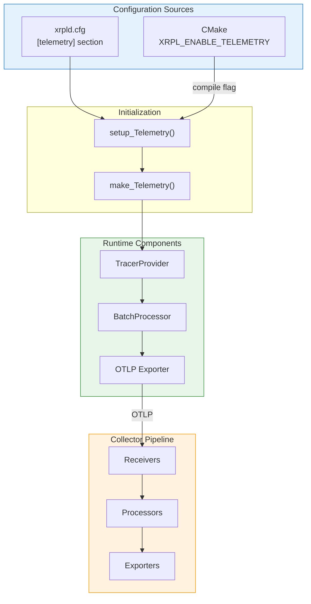

# Configuration Reference

> **Parent Document**: [OpenTelemetryPlan.md](./OpenTelemetryPlan.md)
> **Related**: [Implementation Phases](./06-implementation-phases.md)

---

## 5.1 xrpld Configuration

> **OTLP** = OpenTelemetry Protocol | **TxQ** = Transaction Queue

### 5.1.1 Configuration File Section

The authoritative `[telemetry]` example lives in `cfg/xrpld-example.cfg`. Telemetry is disabled by default (`enabled=0`); enabling it turns on distributed tracing for transaction flow, consensus, and RPC calls, with traces exported to an OpenTelemetry Collector over OTLP. Head sampling is intentionally fixed at 1.0 (sample everything) and is not configurable — per-node head-sampling would produce broken/partial distributed traces, so volume reduction is delegated to the collector's tail sampling (see Section 7.4.2). The full option reference follows.

### 5.1.2 Configuration Options Summary

| Option                | Type   | Default                           | Description                                          |
| --------------------- | ------ | --------------------------------- | ---------------------------------------------------- |
| `enabled`             | bool   | `false`                           | Enable/disable telemetry                             |
| `endpoint`            | string | `http://localhost:4318/v1/traces` | OTLP/HTTP collector endpoint                         |
| `use_tls`             | bool   | `false`                           | Enable TLS for exporter connection                   |
| `tls_ca_cert`         | string | `""`                              | Path to CA certificate file                          |
| `batch_size`          | uint   | `512`                             | Spans per export batch                               |
| `batch_delay_ms`      | uint   | `5000`                            | Max delay before sending batch (ms)                  |
| `max_queue_size`      | uint   | `2048`                            | Maximum queued spans                                 |
| `trace_transactions`  | 0 or 1 | `1`                               | Enable transaction tracing                           |
| `trace_consensus`     | 0 or 1 | `1`                               | Enable consensus tracing                             |
| `trace_rpc`           | 0 or 1 | `1`                               | Enable RPC tracing                                   |
| `trace_peer`          | 0 or 1 | `1`                               | Enable peer message tracing (high volume)            |
| `trace_ledger`        | 0 or 1 | `1`                               | Enable ledger tracing                                |
| `service_name`        | string | `"xrpld"`                         | Service name (`service.name`) for traces and metrics |
| `service_instance_id` | string | `<node_pubkey>`                   | Instance identifier                                  |

**Planned (not yet implemented)**: the following options appear in the design
documents but are not parsed by `TelemetryConfig.cpp` in Phase 1b and later
phases. They will be added as the corresponding subsystems are instrumented:

| Option                     | Planned Phase | Purpose                                                                 |
| -------------------------- | ------------- | ----------------------------------------------------------------------- |
| `exporter`                 | Future        | Select between OTLP/HTTP and OTLP/gRPC                                  |
| `trace_pathfind`           | Phase 2       | Path computation tracing toggle                                         |
| `trace_txq`                | Phase 3       | Transaction queue tracing toggle                                        |
| `trace_validator`          | Future        | Validator list / manifest update tracing                                |
| `trace_amendment`          | Future        | Amendment voting tracing                                                |
| `consensus_trace_strategy` | Phase 4       | Trace ID strategy for consensus rounds (`deterministic` \| `attribute`) |

---

## 5.2 Configuration Parser

> **TxQ** = Transaction Queue

The parser `setup_Telemetry()` in `src/libxrpl/telemetry/TelemetryConfig.cpp` reads the `[telemetry]` `Section` and populates a `Telemetry::Setup` struct, applying the defaults listed in Section 5.1.2 via `section.value_or(...)`. It derives `serviceInstanceId` from the node public key when not overridden, selects the exporter endpoint default by exporter type, and leaves the sampling ratio at its fixed 1.0 default (not read from config — see Section 7.4.2).

---

## 5.3 Application Integration

### 5.3.1 ApplicationImp Changes

> **Deferred identity**: The node public key (`nodeIdentity_`) is not
> available during `ApplicationImp`'s member initializer list — it is
> resolved later in `setup()`. The `Telemetry` object is therefore
> constructed with an empty `serviceInstanceId` and patched via
> `setServiceInstanceId()` once `setup()` has called `getNodeIdentity()`.

`ApplicationImp` (in `src/xrpld/app/main/Application.cpp`) owns a `std::unique_ptr<telemetry::Telemetry> telemetry_`. It is built in the member initializer list via `make_Telemetry(setup_Telemetry(...))` with an empty `serviceInstanceId`, then patched in `setup()` by calling `setServiceInstanceId()` with the Base58 node public key (unless the user supplied a custom `service_instance_id`). `start()` and `run()` forward to `telemetry_->start()` / `telemetry_->stop()`, and `getTelemetry()` returns the owned instance.

### 5.3.2 ServiceRegistry Interface Addition

`include/xrpl/core/ServiceRegistry.h` gains a pure-virtual `telemetry::Telemetry& getTelemetry()` (with a forward declaration of `telemetry::Telemetry`), giving every component a uniform accessor for the tracing subsystem.

> **Note:** `Application` extends `ServiceRegistry`, so `getTelemetry()` is
> available on both. Components that hold a `ServiceRegistry&` (e.g.
> `NetworkOPsImp`) call `registry_.get().getTelemetry()`. Components that
> still hold an `Application&` (e.g. `ServerHandler`, `PeerImp`,
> `RCLConsensusAdaptor`) call `app_.getTelemetry()` directly.

---

## 5.4 CMake Integration

> **OTLP** = OpenTelemetry Protocol

### 5.4.1 Find OpenTelemetry Module

A `cmake/FindOpenTelemetry.cmake` module locates the OpenTelemetry C++ SDK. It first tries `find_package(opentelemetry-cpp CONFIG)`, aliasing the imported targets `OpenTelemetry::api`, `OpenTelemetry::sdk`, and `OpenTelemetry::otlp_grpc_exporter`, and falls back to `pkg-config` when no CMake config package is present.

### 5.4.2 CMakeLists.txt Changes

The top-level `CMakeLists.txt` adds an `XRPL_ENABLE_TELEMETRY` option (default `OFF`). When enabled, it runs `find_package(OpenTelemetry REQUIRED)`, defines the `XRPL_ENABLE_TELEMETRY` compile flag, and builds the `xrpl_telemetry` library from the real telemetry sources linked against the OpenTelemetry targets; when disabled, it builds the same target from a no-op `NullTelemetry.cpp` so call sites compile unchanged.

---

## 5.5 OpenTelemetry Collector Configuration

> **OTLP** = OpenTelemetry Protocol | **APM** = Application Performance Monitoring

The authoritative collector config lives in the repo at `docker/telemetry/otel-collector-config.yaml` (with Tempo backend config in `docker/telemetry/tempo.yaml`). The sections below summarize the development and production shapes of that pipeline.

### 5.5.1 Development Configuration

The development collector enables an OTLP receiver on both gRPC (`0.0.0.0:4317`) and HTTP (`0.0.0.0:4318`), a single `batch` processor (1s timeout, batch size 100), and two exporters: a `logging` exporter for console debugging and `otlp/tempo` (insecure) for trace visualization. The single `traces` pipeline wires receiver → batch → both exporters.

### 5.5.2 Production Configuration

The production collector adds TLS on the OTLP gRPC receiver and a richer processor chain: a `memory_limiter` (OOM guard), `batch` (5s timeout, size 512), `tail_sampling`, and an `attributes` processor that hashes sensitive fields (e.g. `tx_account`) and stamps `deployment.environment`. Tail sampling keeps all `ERROR` traces, slow consensus rounds (>5s) and slow RPC requests (>1s), and probabilistically samples the remainder at 10%. Exporters target Grafana Tempo (TLS) and Elastic APM; `health_check` and `zpages` extensions are enabled for operability.

---

## 5.6 Docker Compose Development Environment

> **OTLP** = OpenTelemetry Protocol

The authoritative development stack lives in the repo at `docker/telemetry/docker-compose.yml`. It brings up four services on a shared `xrpld-telemetry` network: an `otel-collector` (otel/opentelemetry-collector-contrib) exposing OTLP gRPC `4317`, OTLP HTTP `4318`, and health check `13133`; `tempo` for trace storage/visualization; `grafana` with provisioned datasources and dashboards (anonymous admin enabled); and an optional `prometheus` for metric correlation.

---

## 5.7 Configuration Architecture

> **OTLP** = OpenTelemetry Protocol



**Reading the diagram:**

- **Configuration Sources**: `xrpld.cfg` provides runtime settings (endpoint, per-component trace toggles) while the CMake flag controls whether telemetry is compiled in at all. Head sampling is fixed at 1.0 and is not a config option; volume reduction happens via tail sampling in the collector.
- **Initialization**: `setup_Telemetry()` parses config values, then `make_Telemetry()` constructs the provider, processor, and exporter objects.
- **Runtime Components**: The `TracerProvider` creates spans, the `BatchProcessor` buffers them, and the `OTLP Exporter` serializes and sends them over the wire.
- **OTLP arrow to Collector**: Trace data leaves the xrpld process via OTLP/HTTP and enters the external Collector pipeline. (OTLP/gRPC is future work — see design decisions §2.2.2.)
- **Collector Pipeline**: `Receivers` ingest OTLP data, `Processors` apply sampling/filtering/enrichment, and `Exporters` forward traces to storage backends (Tempo, etc.).

---

## 5.8 Grafana Integration

> **APM** = Application Performance Monitoring

Step-by-step instructions for integrating xrpld traces with Grafana.

### 5.8.1 Data Source Configuration

#### Tempo (Recommended)

A Tempo datasource (`grafana/provisioning/datasources/tempo.yaml`, provisioned from `docker/telemetry/grafana/`) points at `http://tempo:3200` and enables `tracesToLogs` (linking to Loki on `service.name`/`tx_hash` and mapping `trace_id` → `traceID`), `serviceMap` against Prometheus, the node graph, and Loki search.

#### Elastic APM

Alternatively, an Elasticsearch datasource (`grafana/provisioning/datasources/elastic-apm.yaml`) of type `elasticsearch` points at `http://elasticsearch:9200` against the `apm-*` index, using `@timestamp` as the time field and mapping the log message/level fields.

### 5.8.2 Dashboard Provisioning

A dashboard provider (`grafana/provisioning/dashboards/dashboards.yaml`) loads the `xrpld` dashboard folder from disk (`/var/lib/grafana/dashboards/rippled`), polling for changes every 30s with deletion disabled.

### 5.8.3 Example Dashboard: RPC Performance

An example `xrpld RPC Performance` dashboard (uid `xrpld-rpc-performance`) sourced from Tempo via TraceQL provides four panels: RPC latency by command (heatmap), RPC error rate by command (timeseries), the top 10 slowest RPC commands by average duration (table), and a recent-traces table.

### 5.8.4 Example Dashboard: Transaction Tracing

An example `xrpld Transaction Tracing` dashboard (uid `xrpld-tx-tracing`) over Tempo provides three panels: transaction throughput (`tx.receive` rate, stat), cross-node relay count (average `span.relay_count` on `tx.relay`, timeseries), and a table of transaction validation errors (`tx.validate` with `status.code=error`).

### 5.8.5 TraceQL Query Examples

Common queries for xrpld traces:

```
# Find all traces for a specific transaction hash
{resource.service.name="xrpld" && span.tx_hash="ABC123..."}

# Find slow RPC commands (>100ms)
{resource.service.name="xrpld" && name=~"rpc.command.*"} | duration > 100ms

# Find consensus rounds taking >5 seconds
{resource.service.name="xrpld" && name="consensus.round"} | duration > 5s

# Find failed transactions with error details
{resource.service.name="xrpld" && name="tx.validate" && status.code=error}

# Find transactions relayed to many peers
{resource.service.name="xrpld" && name="tx.relay"} | span.relay_count > 10

# Compare latency across nodes
{resource.service.name="xrpld" && name="rpc.command.account_info"} | avg(duration) by (resource.service.instance.id)
```

### 5.8.6 Correlation with PerfLog

To correlate OpenTelemetry traces with existing PerfLog data:

**Step 1: Configure Loki to ingest PerfLog**

Configure a Promtail scrape job (`promtail-config.yaml`) that tails `/var/log/rippled/perf*.log`, parses each JSON line, and promotes `trace_id`, `ledger_seq`, and `tx_hash` to Loki labels.

**Step 2: Add trace_id to PerfLog entries**

Modify PerfLog so its JSON output includes a `trace_id` field whenever a valid span is active: fetch the current span from the OpenTelemetry runtime context, and if its context is valid, render the trace ID as a 32-character lowercase hex string into the log entry.

**Step 3: Configure Grafana trace-to-logs link**

In the Tempo datasource, set the `tracesToLogs` derived field to link to Loki on the `trace_id` and `tx_hash` tags, with `filterByTraceID: true`.

### 5.8.7 Correlation with Insight/StatsD Metrics

To correlate traces with existing Beast Insight metrics:

**Step 1: Export Insight metrics to Prometheus**

Add a Prometheus scrape job (`prometheus.yaml`) named `xrpld-statsd` targeting the StatsD exporter at `statsd-exporter:9102`.

**Step 2: Add exemplars to metrics**

The OpenTelemetry SDK automatically adds exemplars (trace IDs) to metrics when using the Prometheus exporter, linking metric spikes to specific traces.

**Step 3: Configure Grafana metric-to-trace link**

In the Prometheus datasource, set `exemplarTraceIdDestinations` to map the `trace_id` exemplar to the Tempo datasource.

**Step 4: Dashboard panel with exemplars**

Add a timeseries panel over Prometheus (e.g. `histogram_quantile(0.99, rate(xrpld_rpc_duration_seconds_bucket[5m]))`) with `exemplar: true` enabled.

This allows clicking on metric data points to jump directly to the related trace.

---

_Previous: [Implementation Strategy](./03-implementation-strategy.md)_ | _Next: [Implementation Phases](./06-implementation-phases.md)_ | _Back to: [Overview](./OpenTelemetryPlan.md)_
