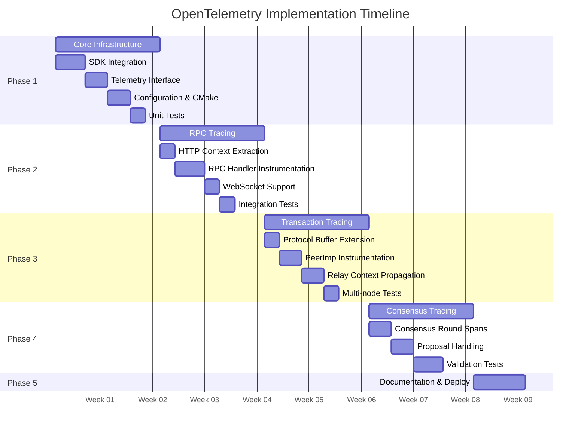
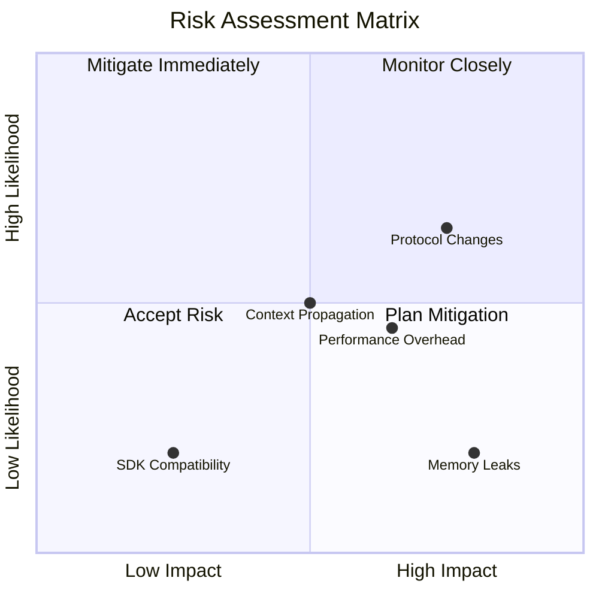
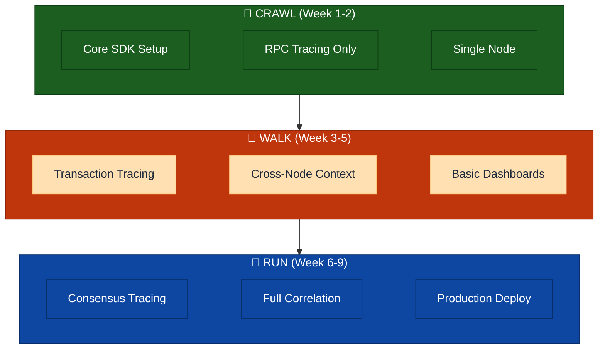
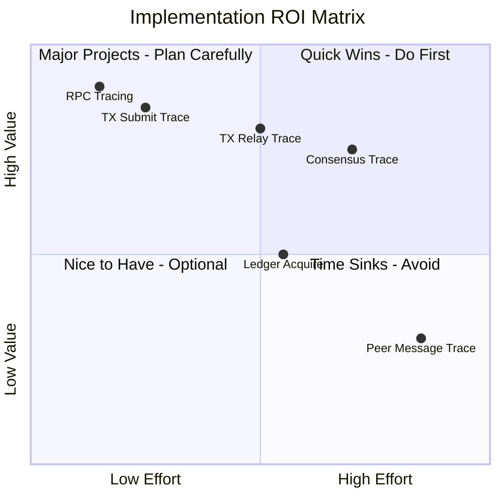

# Implementation Phases

> **Parent Document**: [OpenTelemetryPlan.md](./OpenTelemetryPlan.md)
> **Related**: [Configuration Reference](./05-configuration-reference.md) | [Observability Backends](./07-observability-backends.md)

---

## 6.1 Phase Overview

---

## 6.2 Phase 1: Core Infrastructure (Weeks 1-2)

**Objective**: Establish foundational telemetry infrastructure

### Tasks

| Task | Description                                           |
| ---- | ----------------------------------------------------- |
| 1.1  | Add OpenTelemetry C++ SDK to Conan/CMake              |
| 1.2  | Implement `Telemetry` interface and factory           |
| 1.3  | Implement `SpanGuard` RAII wrapper                    |
| 1.4  | Implement configuration parser                        |
| 1.5  | Integrate into `ApplicationImp`                       |
| 1.6  | Add conditional compilation (`XRPL_ENABLE_TELEMETRY`) |
| 1.7  | Create `NullTelemetry` no-op implementation           |
| 1.8  | Unit tests for core infrastructure                    |

### Exit Criteria

- [ ] OpenTelemetry SDK compiles and links
- [ ] Telemetry can be enabled/disabled via config
- [ ] Basic span creation works
- [ ] No performance regression when disabled
- [ ] Unit tests passing

---

## 6.3 Phase 2: RPC Tracing (Weeks 3-4)

**Objective**: Complete tracing for all RPC operations

### Tasks

| Task | Description                                        |
| ---- | -------------------------------------------------- |
| 2.1  | Implement W3C Trace Context HTTP header extraction |
| 2.2  | Instrument `ServerHandler::onRequest()`            |
| 2.3  | Instrument `RPCHandler::doCommand()`               |
| 2.4  | Add RPC-specific attributes                        |
| 2.5  | Instrument WebSocket handler                       |
| 2.6  | Integration tests for RPC tracing                  |
| 2.7  | Performance benchmarks                             |
| 2.8  | Documentation                                      |

### Exit Criteria

- [ ] All RPC commands traced
- [ ] Trace context propagates from HTTP headers
- [ ] WebSocket and HTTP both instrumented
- [ ] <1ms overhead per RPC call
- [ ] Integration tests passing

---

## 6.4 Phase 3: Transaction Tracing (Weeks 5-6)

**Objective**: Trace transaction lifecycle across network

### Tasks

| Task | Description                                   |
| ---- | --------------------------------------------- |
| 3.1  | Define `TraceContext` Protocol Buffer message |
| 3.2  | Implement protobuf context serialization      |
| 3.3  | Instrument `PeerImp::handleTransaction()`     |
| 3.4  | Instrument `NetworkOPs::submitTransaction()`  |
| 3.5  | Instrument HashRouter integration             |
| 3.6  | Implement relay context propagation           |
| 3.7  | Integration tests (multi-node)                |
| 3.8  | Performance benchmarks                        |

### Exit Criteria

- [ ] Transaction traces span across nodes
- [ ] Trace context in Protocol Buffer messages
- [ ] HashRouter deduplication visible in traces
- [ ] Multi-node integration tests passing
- [ ] <5% overhead on transaction throughput

---

## 6.5 Phase 4: Consensus Tracing (Weeks 7-8)

**Objective**: Full observability into consensus rounds

### Tasks

| Task | Description                                    |
| ---- | ---------------------------------------------- |
| 4.1  | Instrument `RCLConsensusAdaptor::startRound()` |
| 4.2  | Instrument phase transitions                   |
| 4.3  | Instrument proposal handling                   |
| 4.4  | Instrument validation handling                 |
| 4.5  | Add consensus-specific attributes              |
| 4.6  | Correlate with transaction traces              |
| 4.7  | Multi-validator integration tests              |
| 4.8  | Performance validation                         |

### Exit Criteria

- [x] Complete consensus round traces
- [x] Phase transitions visible
- [x] Proposals and validations traced
- [x] No impact on consensus timing
- [ ] Multi-validator test network validated

### Implementation Status — Phase 4a Complete

Phase 4a (establish-phase gap fill & cross-node correlation) adds:

- **Deterministic trace ID** derived from `previousLedger.id()` so all validators
  in the same round share the same `trace_id` (switchable via
  `consensus_trace_strategy` config: `"deterministic"` or `"attribute"`).
- **Round lifecycle spans**: `consensus.round` with round-to-round span links.
- **Establish phase**: `consensus.establish`, `consensus.update_positions` (with
  `dispute.resolve` events), `consensus.check` (with threshold tracking).
- **Mode changes**: `consensus.mode_change` spans.
- **Validation**: `consensus.validation.send` with span link to round span
  (thread-safe cross-thread access via `roundSpanContext_` snapshot).
- **Separation of concerns**: telemetry extracted to private helpers
  (`startRoundTracing`, `createValidationSpan`, `startEstablishTracing`,
  `updateEstablishTracing`, `endEstablishTracing`).

See [Phase4_taskList.md](./Phase4_taskList.md) for the full spec and implementation notes.

---

## 6.6 Phase 5: Documentation & Deployment (Week 9)

**Objective**: Production readiness

### Tasks

| Task | Description                   |
| ---- | ----------------------------- |
| 5.1  | Operator runbook              |
| 5.2  | Grafana dashboards            |
| 5.3  | Alert definitions             |
| 5.4  | Collector deployment examples |
| 5.5  | Developer documentation       |
| 5.6  | Training materials            |
| 5.7  | Final integration testing     |

---

## 6.7 Risk Assessment

### Risk Details

| Risk                                 | Likelihood | Impact | Mitigation                              |
| ------------------------------------ | ---------- | ------ | --------------------------------------- |
| Protocol changes break compatibility | Medium     | High   | Use high field numbers, optional fields |
| Performance overhead unacceptable    | Medium     | Medium | Sampling, conditional compilation       |
| Context propagation complexity       | Medium     | Medium | Phased rollout, extensive testing       |
| SDK compatibility issues             | Low        | Medium | Pin SDK version, fallback to no-op      |
| Memory leaks in long-running nodes   | Low        | High   | Memory profiling, bounded queues        |

---

## 6.8 Success Metrics

| Metric                   | Target                         | Measurement           |
| ------------------------ | ------------------------------ | --------------------- |
| Trace coverage           | >95% of transactions           | Sampling verification |
| CPU overhead             | <3%                            | Benchmark tests       |
| Memory overhead          | <5 MB                          | Memory profiling      |
| Latency impact (p99)     | <2%                            | Performance tests     |
| Trace completeness       | >99% spans with required attrs | Validation script     |
| Cross-node trace linkage | >90% of multi-hop transactions | Integration tests     |

---

## 6.9 Quick Wins and Crawl-Walk-Run Strategy

This section outlines a prioritized approach to maximize ROI with minimal initial investment.

### 6.9.1 Crawl-Walk-Run Overview

### 6.9.2 Quick Wins (Immediate Value)

| Quick Win                      | Value  | When to Deploy |
| ------------------------------ | ------ | -------------- |
| **RPC Command Tracing**        | High   | Week 2         |
| **RPC Latency Histograms**     | High   | Week 2         |
| **Error Rate Dashboard**       | Medium | Week 2         |
| **Transaction Submit Tracing** | High   | Week 3         |
| **Consensus Round Duration**   | Medium | Week 6         |

### 6.9.3 CRAWL Phase (Weeks 1-2)

**Goal**: Get basic tracing working with minimal code changes.

**What You Get**:

- RPC request/response traces for all commands
- Latency breakdown per RPC command
- Error visibility with stack traces
- Basic Grafana dashboard

**Code Changes**: ~15 lines in `ServerHandler.cpp`, ~40 lines in new telemetry module

**Why Start Here**:

- RPC is the lowest-risk, highest-visibility component
- Immediate value for debugging client issues
- No cross-node complexity
- Single file modification to existing code

### 6.9.4 WALK Phase (Weeks 3-5)

**Goal**: Add transaction lifecycle tracing across nodes.

**What You Get**:

- End-to-end transaction traces from submit to relay
- Cross-node correlation (see transaction path)
- HashRouter deduplication visibility
- Relay latency metrics

**Code Changes**: ~120 lines across 4 files, plus protobuf extension

**Why Do This Second**:

- Builds on RPC tracing (transactions submitted via RPC)
- Moderate complexity (requires context propagation)
- High value for debugging transaction issues

### 6.9.5 RUN Phase (Weeks 6-9)

**Goal**: Full observability including consensus.

**What You Get**:

- Complete consensus round visibility
- Phase transition timing
- Validator proposal tracking
- Full end-to-end traces (client → RPC → TX → consensus → ledger)

**Code Changes**: ~100 lines across 3 consensus files

**Why Do This Last**:

- Highest complexity (consensus is critical path)
- Requires thorough testing
- Lower relative value (consensus issues are rarer)

### 6.9.6 ROI Prioritization Matrix

---

## 6.11 Definition of Done

Clear, measurable criteria for each phase.

### 6.11.1 Phase 1: Core Infrastructure

| Criterion       | Measurement                                                | Target                       |
| --------------- | ---------------------------------------------------------- | ---------------------------- |
| SDK Integration | `cmake --build` succeeds with `-DXRPL_ENABLE_TELEMETRY=ON` | ✅ Compiles                  |
| Runtime Toggle  | `enabled=0` produces zero overhead                         | <0.1% CPU difference         |
| Span Creation   | Unit test creates and exports span                         | Span appears in Jaeger       |
| Configuration   | All config options parsed correctly                        | Config validation tests pass |
| Documentation   | Developer guide exists                                     | PR approved                  |

**Definition of Done**: All criteria met, PR merged, no regressions in CI.

### 6.11.2 Phase 2: RPC Tracing

| Criterion          | Measurement                        | Target                     |
| ------------------ | ---------------------------------- | -------------------------- |
| Coverage           | All RPC commands instrumented      | 100% of commands           |
| Context Extraction | traceparent header propagates      | Integration test passes    |
| Attributes         | Command, status, duration recorded | Validation script confirms |
| Performance        | RPC latency overhead               | <1ms p99                   |
| Dashboard          | Grafana dashboard deployed         | Screenshot in docs         |

**Definition of Done**: RPC traces visible in Jaeger/Tempo for all commands, dashboard shows latency distribution.

### 6.11.3 Phase 3: Transaction Tracing

| Criterion        | Measurement                     | Target                             |
| ---------------- | ------------------------------- | ---------------------------------- |
| Local Trace      | Submit → validate → TxQ traced  | Single-node test passes            |
| Cross-Node       | Context propagates via protobuf | Multi-node test passes             |
| Relay Visibility | relay_count attribute correct   | Spot check 100 txs                 |
| HashRouter       | Deduplication visible in trace  | Duplicate txs show suppressed=true |
| Performance      | TX throughput overhead          | <5% degradation                    |

**Definition of Done**: Transaction traces span 3+ nodes in test network, performance within bounds.

### 6.11.4 Phase 4: Consensus Tracing

| Criterion            | Measurement                   | Target                    |
| -------------------- | ----------------------------- | ------------------------- |
| Round Tracing        | startRound creates root span  | Unit test passes          |
| Phase Visibility     | All phases have child spans   | Integration test confirms |
| Proposer Attribution | Proposer ID in attributes     | Spot check 50 rounds      |
| Timing Accuracy      | Phase durations match PerfLog | <5% variance              |
| No Consensus Impact  | Round timing unchanged        | Performance test passes   |

**Definition of Done**: Consensus rounds fully traceable, no impact on consensus timing.

### 6.11.5 Phase 5: Production Deployment

| Criterion    | Measurement                  | Target                     |
| ------------ | ---------------------------- | -------------------------- |
| Collector HA | Multiple collectors deployed | No single point of failure |
| Sampling     | Tail sampling configured     | 10% base + errors + slow   |
| Retention    | Data retained per policy     | 7 days hot, 30 days warm   |
| Alerting     | Alerts configured            | Error spike, high latency  |
| Runbook      | Operator documentation       | Approved by ops team       |
| Training     | Team trained                 | Session completed          |

**Definition of Done**: Telemetry running in production, operators trained, alerts active.

### 6.11.6 Success Metrics Summary

| Phase   | Primary Metric         | Secondary Metric            | Deadline      |
| ------- | ---------------------- | --------------------------- | ------------- |
| Phase 1 | SDK compiles and runs  | Zero overhead when disabled | End of Week 2 |
| Phase 2 | 100% RPC coverage      | <1ms latency overhead       | End of Week 4 |
| Phase 3 | Cross-node traces work | <5% throughput impact       | End of Week 6 |
| Phase 4 | Consensus fully traced | No consensus timing impact  | End of Week 8 |
| Phase 5 | Production deployment  | Operators trained           | End of Week 9 |

---

## 6.12 Recommended Implementation Order

Based on ROI analysis, implement in this exact order:

```mermaid
flowchart TB
    subgraph week1["Week 1"]
        t1[1. OpenTelemetry SDK<br/>Conan/CMake integration]
        t2[2. Telemetry interface<br/>SpanGuard, config]
    end

    subgraph week2["Week 2"]
        t3[3. RPC ServerHandler<br/>instrumentation]
        t4[4. Basic Jaeger setup<br/>for testing]
    end

    subgraph week3["Week 3"]
        t5[5. Transaction submit<br/>tracing]
        t6[6. Grafana dashboard<br/>v1]
    end

    subgraph week4["Week 4"]
        t7[7. Protobuf context<br/>extension]
        t8[8. PeerImp tx.relay<br/>instrumentation]
    end

    subgraph week5["Week 5"]
        t9[9. Multi-node<br/>integration tests]
        t10[10. Performance<br/>benchmarks]
    end

    subgraph week6_8["Weeks 6-8"]
        t11[11. Consensus<br/>instrumentation]
        t12[12. Full integration<br/>testing]
    end

    subgraph week9["Week 9"]
        t13[13. Production<br/>deployment]
        t14[14. Documentation<br/>& training]
    end

    t1 --> t2 --> t3 --> t4
    t4 --> t5 --> t6
    t6 --> t7 --> t8
    t8 --> t9 --> t10
    t10 --> t11 --> t12
    t12 --> t13 --> t14

    style week1 fill:#1b5e20,stroke:#0d3d14,color:#fff
    style week2 fill:#1b5e20,stroke:#0d3d14,color:#fff
    style week3 fill:#bf360c,stroke:#8c2809,color:#fff
    style week4 fill:#bf360c,stroke:#8c2809,color:#fff
    style week5 fill:#bf360c,stroke:#8c2809,color:#fff
    style week6_8 fill:#0d47a1,stroke:#082f6a,color:#fff
    style week9 fill:#4a148c,stroke:#2e0d57,color:#fff
    style t1 fill:#1b5e20,stroke:#0d3d14,color:#fff
    style t2 fill:#1b5e20,stroke:#0d3d14,color:#fff
    style t3 fill:#1b5e20,stroke:#0d3d14,color:#fff
    style t4 fill:#1b5e20,stroke:#0d3d14,color:#fff
    style t5 fill:#ffe0b2,stroke:#ffcc80,color:#1e293b
    style t6 fill:#ffe0b2,stroke:#ffcc80,color:#1e293b
    style t7 fill:#ffe0b2,stroke:#ffcc80,color:#1e293b
    style t8 fill:#ffe0b2,stroke:#ffcc80,color:#1e293b
    style t9 fill:#ffe0b2,stroke:#ffcc80,color:#1e293b
    style t10 fill:#ffe0b2,stroke:#ffcc80,color:#1e293b
    style t11 fill:#0d47a1,stroke:#082f6a,color:#fff
    style t12 fill:#0d47a1,stroke:#082f6a,color:#fff
    style t13 fill:#4a148c,stroke:#2e0d57,color:#fff
    style t14 fill:#4a148c,stroke:#2e0d57,color:#fff
```

---

_Previous: [Configuration Reference](./05-configuration-reference.md)_ | _Next: [Observability Backends](./07-observability-backends.md)_ | _Back to: [Overview](./OpenTelemetryPlan.md)_
