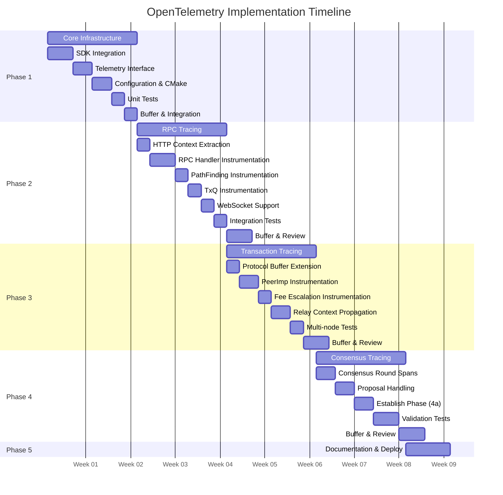
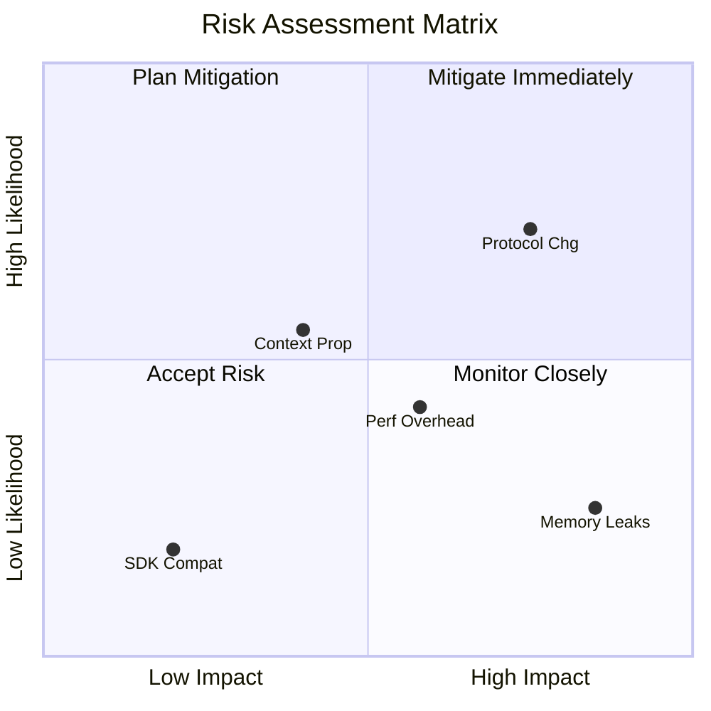
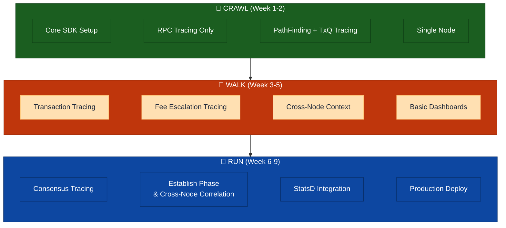
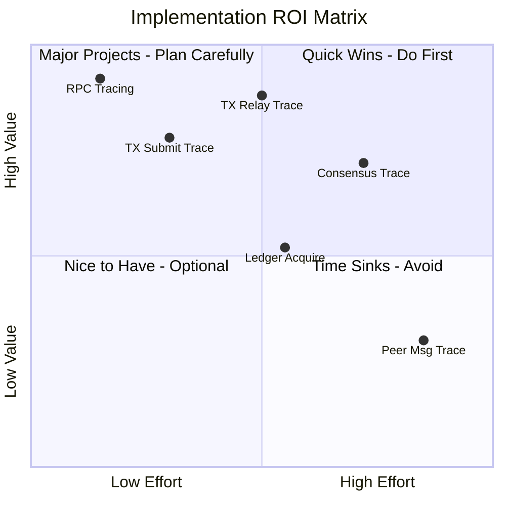

# Implementation Phases

> **Parent Document**: [OpenTelemetryPlan.md](./OpenTelemetryPlan.md)
> **Related**: [Configuration Reference](./05-configuration-reference.md) | [Observability Backends](./07-observability-backends.md)

---

## 6.1 Phase Overview

> **TxQ** = Transaction Queue

---

## 6.2 Phase 1: Core Infrastructure (Weeks 1-2)

**Objective**: Establish foundational telemetry infrastructure

### Tasks

| Task | Description                                           |
| ---- | ----------------------------------------------------- |
| 1.1  | Add OpenTelemetry C++ SDK to Conan/CMake              |
| 1.2  | Implement `Telemetry` interface and factory           |
| 1.3  | Implement `SpanGuard` RAII wrapper                    |
| 1.4  | Implement configuration parser                        |
| 1.5  | Integrate into `ApplicationImp`                       |
| 1.6  | Add conditional compilation (`XRPL_ENABLE_TELEMETRY`) |
| 1.7  | Create `NullTelemetry` no-op implementation           |
| 1.8  | Unit tests for core infrastructure                    |

### Exit Criteria

- [ ] OpenTelemetry SDK compiles and links
- [ ] Telemetry can be enabled/disabled via config
- [ ] Basic span creation works
- [ ] No performance regression when disabled
- [ ] Unit tests passing

---

## 6.3 Phase 2: RPC Tracing (Weeks 3-4)

> **TxQ** = Transaction Queue

**Objective**: Complete tracing for all RPC operations

### Tasks

| Task | Description                                                                |
| ---- | -------------------------------------------------------------------------- |
| 2.1  | Implement W3C Trace Context HTTP header extraction                         |
| 2.2  | Instrument `ServerHandler::onRequest()`                                    |
| 2.3  | Instrument `RPCHandler::doCommand()`                                       |
| 2.4  | Add RPC-specific attributes                                                |
| 2.5  | Instrument WebSocket handler                                               |
| 2.6  | PathFinding instrumentation (`pathfind.request`, `pathfind.compute` spans) |
| 2.7  | TxQ instrumentation (`txq.enqueue`, `txq.apply` spans)                     |
| 2.8  | Integration tests for RPC tracing                                          |
| 2.9  | Performance benchmarks                                                     |
| 2.10 | Documentation                                                              |

### Exit Criteria

- [ ] All RPC commands traced
- [ ] Trace context propagates from HTTP headers
- [ ] WebSocket and HTTP both instrumented
- [ ] <1ms overhead per RPC call
- [ ] Integration tests passing

---

## 6.4 Phase 3: Transaction Tracing (Weeks 5-6)

**Objective**: Trace transaction lifecycle across network with deterministic cross-node correlation

### Tasks

| Task | Description                                                    |
| ---- | -------------------------------------------------------------- |
| 3.1  | Define `TraceContext` Protocol Buffer message                  |
| 3.2  | Implement protobuf context serialization                       |
| 3.3  | Instrument `PeerImp::handleTransaction()`                      |
| 3.4  | Instrument `NetworkOPs::submitTransaction()`                   |
| 3.5  | Instrument HashRouter integration                              |
| 3.6  | Fee escalation instrumentation (`fee.escalate` span)           |
| 3.7  | Implement relay context propagation                            |
| 3.8  | Integration tests (multi-node)                                 |
| 3.9  | Deterministic transaction trace ID (`trace_id = txHash[0:16]`) |
| 3.10 | Performance benchmarks                                         |

### Deterministic Trace ID (Task 3.9)

Transaction spans use **deterministic trace IDs** derived from the transaction hash:
`trace_id = txHash[0:16]`. All nodes handling the same transaction independently
produce spans under the same trace_id. Protobuf `span_id` propagation (Task 3.7)
additionally provides parent-child relay ordering when available. See
[02-design-decisions.md §2.5.0](./02-design-decisions.md) for the design rationale
and [Phase3_taskList.md Task 3.9](./Phase3_taskList.md) for the full implementation spec.

### Exit Criteria

- [ ] Transaction traces span across nodes
- [ ] Trace context in Protocol Buffer messages
- [ ] HashRouter deduplication visible in traces
- [ ] Multi-node integration tests passing
- [ ] <5% overhead on transaction throughput
- [ ] Deterministic trace_id: all nodes produce same trace_id for same transaction
- [ ] Protobuf span_id propagation preserves parent-child ordering when available

---

## 6.5 Phase 4: Consensus Tracing (Weeks 7-8)

**Objective**: Full observability into consensus rounds

### Tasks

| Task | Description                                    | Status             |
| ---- | ---------------------------------------------- | ------------------ |
| 4.1  | Instrument `RCLConsensusAdaptor::startRound()` | ✅ Done (via 4a.2) |
| 4.2  | Instrument phase transitions                   | ✅ Done            |
| 4.3  | Instrument proposal handling                   | ✅ Done            |
| 4.4  | Instrument validation handling                 | ✅ Done            |
| 4.5  | Add consensus-specific attributes              | ✅ Done            |
| 4.6  | Correlate with transaction traces              | ✅ Done            |
| 4.7  | Build verification and testing                 | ✅ Done            |
| 4.8  | Validation span enrichment (ext. dashboard)    | ❌ Not done        |

**Note**: The original plan doc listed tasks 4.7-4.11 as "Validator list tracing",
"Amendment voting tracing", "SHAMap sync tracing", "Multi-validator integration tests",
and "Performance validation". These were descoped and replaced by the tasklist's 4.7
(build verification) and 4.8 (validation span enrichment). Validator, amendment, and
SHAMap tracing are not implemented.

### Spans Produced

| Span Name                   | Location               | Attributes                                                                                                                                                                                                            |
| --------------------------- | ---------------------- | --------------------------------------------------------------------------------------------------------------------------------------------------------------------------------------------------------------------- |
| `consensus.phase.open`      | `Consensus.h:707`      | _(none)_                                                                                                                                                                                                              |
| `consensus.proposal.send`   | `RCLConsensus.cpp:232` | `xrpl.consensus.round`                                                                                                                                                                                                |
| `consensus.ledger_close`    | `RCLConsensus.cpp:341` | `xrpl.consensus.ledger.seq`, `xrpl.consensus.mode`                                                                                                                                                                    |
| `consensus.accept`          | `RCLConsensus.cpp:492` | `xrpl.consensus.proposers`, `xrpl.consensus.round_time_ms`, `xrpl.consensus.quorum`                                                                                                                                   |
| `consensus.accept.apply`    | `RCLConsensus.cpp:541` | `xrpl.consensus.close_time`, `close_time_correct`, `close_resolution_ms`, `state`, `proposing`, `round_time_ms`, `ledger.seq`, `parent_close_time`, `close_time_self`, `close_time_vote_bins`, `resolution_direction` |
| `consensus.validation.send` | `RCLConsensus.cpp:900` | `xrpl.consensus.ledger.seq`, `xrpl.consensus.proposing`                                                                                                                                                               |

### Exit Criteria

- [x] Complete consensus round traces
- [x] Phase transitions visible (open, establish, close, accept)
- [x] Proposals and validations traced — send and receive; relay deferred to Phase 4b
- [x] Close time agreement tracked (per `avCT_CONSENSUS_PCT`)
- [x] No impact on consensus timing
- [ ] Multi-validator test network validated
- [x] Transaction-consensus correlation (Task 4.6) — `tx.included` events in doAccept
- [ ] Validation span enrichment (Task 4.8) — not implemented

### Implementation Status — Phase 4a Complete

Phase 4a (establish-phase gap fill & cross-node correlation) adds:

- **Deterministic trace ID** derived from `previousLedger.id()` so all validators
  in the same round share the same `trace_id` (switchable via
  `consensus_trace_strategy` config: `"deterministic"` or `"attribute"`).
  See [Configuration Reference](./05-configuration-reference.md) for full
  configuration options. The `consensus_trace_strategy` option will be
  documented in the configuration reference as part of Phase 4a implementation.
- **Round lifecycle spans**: `consensus.round` with round-to-round span links.
- **Establish phase**: `consensus.establish`, `consensus.update_positions` (with
  `dispute.resolve` events), `consensus.check` (with threshold tracking).
- **Mode changes**: `consensus.mode_change` spans.
- **Validation**: `consensus.validation.send` with span link to round span
  (thread-safe cross-thread access via `roundSpanContext_` snapshot).
- **Separation of concerns**: telemetry extracted to private helpers
  (`startRoundTracing`, `createValidationSpan`, `startEstablishTracing`,
  `updateEstablishTracing`, `endEstablishTracing`).

See [Phase4_taskList.md](./Phase4_taskList.md) for the full spec and implementation notes.

---

## 6.5a Phase 4a: Establish-Phase Gap Fill & Cross-Node Correlation

**Objective**: Fill tracing gaps in the establish phase and establish cross-node
correlation using deterministic trace IDs derived from `previousLedger.id()`.

**Approach**: Direct instrumentation in `Consensus.h` and `RCLConsensus.cpp`.
All spans use `SpanGuard` factory methods (`span()`, `hashSpan()`, `linkedSpan()`)
with `TraceCategory::Consensus` gating. No macros used — all tracing via direct
`SpanGuard` API calls.

### Tasks

| Task | Description                                      | Effort | Risk   | Status                   |
| ---- | ------------------------------------------------ | ------ | ------ | ------------------------ |
| 4a.0 | Prerequisites: extend SpanGuard & Telemetry APIs | 1d     | Medium | ✅ Done (no macros)      |
| 4a.1 | Adaptor `getTelemetry()` method                  | 0.5d   | Low    | ⏭️ Skipped (not needed)  |
| 4a.2 | Switchable round span with deterministic traceID | 2d     | High   | ✅ Done                  |
| 4a.3 | Span members in `Consensus.h`                    | 0.5d   | Medium | ✅ Done (with deviation) |
| 4a.4 | Instrument `phaseEstablish()`                    | 1d     | Medium | ✅ Done                  |
| 4a.5 | Instrument `updateOurPositions()`                | 1d     | Medium | ✅ Done                  |
| 4a.6 | Instrument `haveConsensus()` (thresholds)        | 1d     | Medium | ✅ Done                  |
| 4a.7 | Instrument mode changes                          | 0.5d   | Low    | ✅ Done                  |
| 4a.8 | Reparent existing spans under round              | 0.5d   | Low    | ✅ Done                  |
| 4a.9 | Build verification and testing                   | 1d     | Low    | ✅ Done                  |

**Total Effort**: 9 days

### Spans Produced

| Span Name                    | Location           | Key Attributes (actually set)                                                                                                 |
| ---------------------------- | ------------------ | ----------------------------------------------------------------------------------------------------------------------------- |
| `consensus.round`            | `RCLConsensus.cpp` | `round_id`, `ledger_id`, `ledger.seq`, `mode`, `trace_strategy`                                                               |
| `consensus.establish`        | `Consensus.h`      | `converge_percent`, `establish_count`, `proposers`                                                                            |
| `consensus.update_positions` | `Consensus.h`      | `converge_percent`, `proposers`, `have_close_time_consensus`, `close_time_threshold`, `disputes_count`, `avalanche_threshold` |
| `consensus.check`            | `Consensus.h`      | `agree/disagree_count`, `converge_percent`, `have_close_time_consensus`, `threshold_percent`, `result`                        |
| `consensus.mode_change`      | `RCLConsensus.cpp` | `mode.old`, `mode.new`                                                                                                        |

### Exit Criteria

- [x] Establish phase internals traced (establish, update_positions, check spans)
- [x] Establish phase fully traced — `disputes_count`, `avalanche_threshold`, dispute `yays`/`nays` all implemented
- [x] Cross-node correlation works via deterministic trace_id
- [x] Strategy switchable via config (`deterministic` / `attribute`)
- [x] Consecutive rounds linked via follows-from spans
- [x] Build passes with telemetry ON and OFF
- [x] No impact on consensus timing

See [Phase4_taskList.md](./Phase4_taskList.md) for full task details.

---

## 6.5b Phase 4b: Cross-Node Propagation (Future)

**Objective**: Wire `TraceContextPropagator` for P2P messages (proposals,
validations) to enable true distributed tracing between nodes.

**Status**: Design documented, NOT implemented. Protobuf fields (field 1001)
and `TraceContextPropagator` free functions exist. Wiring deferred until Phase 4a is
validated in a multi-node environment.

**Prerequisites**: Phase 4a complete and validated.

See [Phase4_taskList.md § Phase 4b](./Phase4_taskList.md) for full design.

---

## 6.6 Phase 5: Documentation & Deployment (Week 9)

**Objective**: Production readiness

### Tasks

| Task | Description                   | Status              |
| ---- | ----------------------------- | ------------------- |
| 5.1  | Operator runbook              | Complete            |
| 5.2  | Grafana dashboards            | Complete            |
| 5.3  | Alert definitions             | Deferred — post-MVP |
| 5.4  | Collector deployment examples | Complete            |
| 5.5  | Developer documentation       | Complete            |
| 5.6  | Training materials            | Deferred — post-MVP |
| 5.7  | Final integration testing     | Complete            |

---

## 6.7 Phase 6: StatsD Metrics Integration (Week 10)

**Objective**: Bridge xrpld's existing `beast::insight` StatsD metrics into the OpenTelemetry collection pipeline, exposing 300+ pre-existing metrics alongside span-derived RED metrics in Prometheus/Grafana.

### Background

xrpld has a mature metrics framework (`beast::insight`) that emits StatsD-format metrics over UDP. These metrics cover node health, peer networking, RPC performance, job queue, and overlay traffic — data that **does not** overlap with the span-based instrumentation from Phases 1-5. By adding a StatsD receiver to the OTel Collector, both metric sources converge in Prometheus.

### Metric Inventory

| Category        | Group              | Type          | Count      | Key Metrics                                            |
| --------------- | ------------------ | ------------- | ---------- | ------------------------------------------------------ |
| Node State      | `State_Accounting` | Gauge         | 10         | `*_duration`, `*_transitions` per operating mode       |
| Ledger          | `LedgerMaster`     | Gauge         | 2          | `Validated_Ledger_Age`, `Published_Ledger_Age`         |
| Ledger Fetch    | —                  | Counter       | 1          | `ledger_fetches`                                       |
| Ledger History  | `ledger.history`   | Counter       | 1          | `mismatch`                                             |
| RPC             | `rpc`              | Counter+Event | 3          | `requests`, `time` (histogram), `size` (histogram)     |
| Job Queue       | —                  | Gauge+Event   | 1 + 2×N    | `job_count`, per-job `{name}` and `{name}_q`           |
| Peer Finder     | `Peer_Finder`      | Gauge         | 2          | `Active_Inbound_Peers`, `Active_Outbound_Peers`        |
| Overlay         | `Overlay`          | Gauge         | 1          | `Peer_Disconnects`                                     |
| Overlay Traffic | per-category       | Gauge         | 4×57 = 228 | `Bytes_In/Out`, `Messages_In/Out` per traffic category |
| Pathfinding     | —                  | Event         | 2          | `pathfind_fast`, `pathfind_full` (histograms)          |
| I/O             | —                  | Event         | 1          | `ios_latency` (histogram)                              |
| Resource Mgr    | —                  | Meter         | 2          | `warn`, `drop` (rate counters)                         |
| Caches          | per-cache          | Gauge         | 2×N        | `{cache}.size`, `{cache}.hit_rate`                     |

**Total**: ~255+ unique metrics (plus dynamic job-type and cache metrics)

### Tasks

| Task | Description                                                                                                     |
| ---- | --------------------------------------------------------------------------------------------------------------- |
| 6.1  | **DEFERRED** Fix Meter wire format (`\|m` → `\|c`) in StatsDCollector.cpp — breaking change, tracked separately |
| 6.2  | Add `statsd` receiver to OTel Collector config                                                                  |
| 6.3  | Expose UDP port 8125 in docker-compose.yml                                                                      |
| 6.4  | Add `[insight]` config to integration test node configs                                                         |
| 6.5  | Create "Node Health" Grafana dashboard (8 panels)                                                               |
| 6.6  | Create "Network Traffic" Grafana dashboard (8 panels)                                                           |
| 6.7  | Create "RPC & Pathfinding (StatsD)" Grafana dashboard (8 panels)                                                |
| 6.8  | Update integration test to verify StatsD metrics in Prometheus                                                  |
| 6.9  | Update TESTING.md and telemetry-runbook.md                                                                      |

### Wire Format Fix (Task 6.1) — DEFERRED

The `StatsDMeterImpl` in `StatsDCollector.cpp:706` sends metrics with `|m` suffix, which is non-standard StatsD. The OTel StatsD receiver silently drops these. Fix: change `|m` to `|c` (counter), which is semantically correct since meters are increment-only counters. Only 2 metrics are affected (`warn`, `drop` in Resource Manager).

**Status**: Deferred as a separate change — this is a breaking change for any StatsD backend that previously consumed the custom `|m` type. The Resource Warnings and Resource Drops dashboard panels will show no data until this fix is applied.

### New Grafana Dashboards

**Node Health** (`statsd-node-health.json`, uid: `xrpld-statsd-node-health`):

- Validated/Published Ledger Age, Operating Mode Duration/Transitions, I/O Latency, Job Queue Depth, Ledger Fetch Rate, Ledger History Mismatches

**Network Traffic** (`statsd-network-traffic.json`, uid: `xrpld-statsd-network`):

- Active Inbound/Outbound Peers, Peer Disconnects, Total Bytes/Messages In/Out, Transaction/Proposal/Validation Traffic, Top Traffic Categories

**RPC & Pathfinding (StatsD)** (`statsd-rpc-pathfinding.json`, uid: `xrpld-statsd-rpc`):

- RPC Request Rate, Response Time p95/p50, Response Size p95/p50, Pathfinding Fast/Full Duration, Resource Warnings/Drops, Response Time Heatmap

### Exit Criteria

- [ ] StatsD metrics visible in Prometheus (`curl localhost:9090/api/v1/query?query=xrpld_LedgerMaster_Validated_Ledger_Age`)
- [ ] All 3 new Grafana dashboards load without errors
- [ ] Integration test verifies at least core StatsD metrics (ledger age, peer counts, RPC requests)
- [ ] ~~Meter metrics (`warn`, `drop`) flow correctly after `|m` → `|c` fix~~ — DEFERRED (breaking change, tracked separately)

---

## 6.9 Risk Assessment

### Risk Details

| Risk                                 | Likelihood | Impact | Mitigation                              |
| ------------------------------------ | ---------- | ------ | --------------------------------------- |
| Protocol changes break compatibility | Medium     | High   | Use high field numbers, optional fields |
| Performance overhead unacceptable    | Medium     | Medium | Sampling, conditional compilation       |
| Context propagation complexity       | Medium     | Medium | Phased rollout, extensive testing       |
| SDK compatibility issues             | Low        | Medium | Pin SDK version, fallback to no-op      |
| Memory leaks in long-running nodes   | Low        | High   | Memory profiling, bounded queues        |

---

## 6.10 Success Metrics

| Metric                   | Target                                                         | Measurement           |
| ------------------------ | -------------------------------------------------------------- | --------------------- |
| Trace coverage           | >95% of transaction code paths (independent of sampling ratio) | Sampling verification |
| CPU overhead             | <3%                                                            | Benchmark tests       |
| Memory overhead          | <10 MB                                                         | Memory profiling      |
| Latency impact (p99)     | <2%                                                            | Performance tests     |
| Trace completeness       | >99% spans with required attrs                                 | Validation script     |
| Cross-node trace linkage | >90% of multi-hop transactions                                 | Integration tests     |

---

## 6.9 Quick Wins and Crawl-Walk-Run Strategy

> **TxQ** = Transaction Queue

This section outlines a prioritized approach to maximize ROI with minimal initial investment.

### 6.9.1 Crawl-Walk-Run Overview

**Reading the diagram:**

- **CRAWL (Weeks 1-2)**: Minimal investment -- set up the SDK, instrument RPC and PathFinding/TxQ handlers, and verify on a single node. Delivers immediate latency visibility.
- **WALK (Weeks 3-5)**: Expand to transaction lifecycle tracing, fee escalation, cross-node context propagation, and basic Grafana dashboards. This is where distributed tracing starts working.
- **RUN (Weeks 6-9)**: Full consensus instrumentation, establish-phase gap fill, cross-node correlation, StatsD integration, and production deployment with sampling and alerting.
- **Arrows (crawl → walk → run)**: Each phase builds on the prior one; you cannot skip ahead because later phases depend on infrastructure established earlier.

### 6.9.2 Quick Wins (Immediate Value)

| Quick Win                      | Value  | When to Deploy |
| ------------------------------ | ------ | -------------- |
| **RPC Command Tracing**        | High   | Week 2         |
| **RPC Latency Histograms**     | High   | Week 2         |
| **Error Rate Dashboard**       | Medium | Week 2         |
| **Transaction Submit Tracing** | High   | Week 3         |
| **Consensus Round Duration**   | Medium | Week 6         |

### 6.9.3 CRAWL Phase (Weeks 1-2)

**Goal**: Get basic tracing working with minimal code changes.

**What You Get**:

- RPC request/response traces for all commands
- Latency breakdown per RPC command
- PathFinding and TxQ tracing (directly impacts RPC latency)
- Error visibility with stack traces
- Basic Grafana dashboard

**Code Changes**: ~15 lines in `ServerHandler.cpp`, ~40 lines in new telemetry module

**Why Start Here**:

- RPC is the lowest-risk, highest-visibility component
- PathFinding and TxQ are RPC-adjacent and directly affect latency
- Immediate value for debugging client issues
- No cross-node complexity
- Single file modification to existing code

### 6.9.4 WALK Phase (Weeks 3-5)

**Goal**: Add transaction lifecycle tracing across nodes.

**What You Get**:

- End-to-end transaction traces from submit to relay
- Fee escalation tracing within the transaction pipeline
- Cross-node correlation (see transaction path)
- HashRouter deduplication visibility
- Relay latency metrics

**Code Changes**: ~120 lines across 4 files, plus protobuf extension

**Why Do This Second**:

- Builds on RPC tracing (transactions submitted via RPC)
- Fee escalation is integral to the transaction processing pipeline
- Moderate complexity (requires context propagation)
- High value for debugging transaction issues

### 6.9.5 RUN Phase (Weeks 6-9)

**Goal**: Full observability including consensus.

**What You Get**:

- Complete consensus round visibility
- Phase transition timing
- Validator proposal tracking
- ~~Validator list and manifest tracing~~ — descoped
- ~~Amendment voting tracing~~ — descoped
- ~~SHAMap sync tracing~~ — descoped
- Full end-to-end traces (client → RPC → TX → consensus → ledger) — partial (tx-consensus correlation not yet done)

**Code Changes**: ~100 lines across 3 consensus files

**Why Do This Last**:

- Highest complexity (consensus is critical path)
- Validator, amendment, and SHAMap components were descoped (lower priority)
- Requires thorough testing
- Lower relative value (consensus issues are rarer)

### 6.9.6 ROI Prioritization Matrix

---

## 6.13 Definition of Done

> **TxQ** = Transaction Queue | **HA** = High Availability

Clear, measurable criteria for each phase.

### 6.13.1 Phase 1: Core Infrastructure

| Criterion       | Measurement                                                | Target                       |
| --------------- | ---------------------------------------------------------- | ---------------------------- |
| SDK Integration | `cmake --build` succeeds with `-DXRPL_ENABLE_TELEMETRY=ON` | ✅ Compiles                  |
| Runtime Toggle  | `enabled=0` produces zero overhead                         | <0.1% CPU difference         |
| Span Creation   | Unit test creates and exports span                         | Span appears in Tempo        |
| Configuration   | All config options parsed correctly                        | Config validation tests pass |
| Documentation   | Developer guide exists                                     | PR approved                  |

**Definition of Done**: All criteria met, PR merged, no regressions in CI.

### 6.13.2 Phase 2: RPC Tracing

| Criterion          | Measurement                        | Target                     |
| ------------------ | ---------------------------------- | -------------------------- |
| Coverage           | All RPC commands instrumented      | 100% of commands           |
| Context Extraction | traceparent header propagates      | Integration test passes    |
| Attributes         | Command, status, duration recorded | Validation script confirms |
| Performance        | RPC latency overhead               | <1ms p99                   |
| Dashboard          | Grafana dashboard deployed         | Screenshot in docs         |

**Definition of Done**: RPC traces visible in Tempo for all commands, dashboard shows latency distribution.

### 6.13.3 Phase 3: Transaction Tracing

| Criterion             | Measurement                                       | Target                                                   |
| --------------------- | ------------------------------------------------- | -------------------------------------------------------- |
| Local Trace           | Submit → validate → TxQ traced                    | Single-node test passes                                  |
| Cross-Node            | Context propagates via protobuf                   | Multi-node test passes                                   |
| Deterministic TraceID | Same trace_id on all nodes for same tx            | Multi-node test: query by txHash[0:16] returns all spans |
| Relay Ordering        | Protobuf span_id propagation creates parent-child | Tempo trace tree shows relay chain                       |
| Graceful Degradation  | Old peer drops trace_context                      | Spans still grouped by deterministic trace_id            |
| Relay Visibility      | relay_count attribute correct                     | Spot check 100 txs                                       |
| HashRouter            | Deduplication visible in trace                    | Duplicate txs show suppressed=true                       |
| Performance           | TX throughput overhead                            | <5% degradation                                          |

**Definition of Done**: Transaction traces span 3+ nodes in test network with deterministic trace_id correlation, parent-child ordering via protobuf propagation, and performance within bounds.

### 6.13.4 Phase 4: Consensus Tracing

| Criterion            | Measurement                   | Target                    |
| -------------------- | ----------------------------- | ------------------------- |
| Round Tracing        | startRound creates root span  | Unit test passes          |
| Phase Visibility     | All phases have child spans   | Integration test confirms |
| Proposer Attribution | Proposer ID in attributes     | Spot check 50 rounds      |
| Timing Accuracy      | Phase durations match PerfLog | <5% variance              |
| No Consensus Impact  | Round timing unchanged        | Performance test passes   |

**Definition of Done**: Consensus rounds fully traceable, no impact on consensus timing.

### 6.13.5 Phase 5: Production Deployment

| Criterion    | Measurement                  | Target                     |
| ------------ | ---------------------------- | -------------------------- |
| Collector HA | Multiple collectors deployed | No single point of failure |
| Sampling     | Tail sampling configured     | 10% base + errors + slow   |
| Retention    | Data retained per policy     | 7 days hot, 30 days warm   |
| Alerting     | Alerts configured            | Error spike, high latency  |
| Runbook      | Operator documentation       | Approved by ops team       |
| Training     | Team trained                 | Session completed          |

**Definition of Done**: Telemetry running in production, operators trained, alerts active.

### 6.13.6 Success Metrics Summary

| Phase   | Primary Metric         | Secondary Metric            | Deadline      |
| ------- | ---------------------- | --------------------------- | ------------- |
| Phase 1 | SDK compiles and runs  | Zero overhead when disabled | End of Week 2 |
| Phase 2 | 100% RPC coverage      | <1ms latency overhead       | End of Week 4 |
| Phase 3 | Cross-node traces work | <5% throughput impact       | End of Week 6 |
| Phase 4 | Consensus fully traced | No consensus timing impact  | End of Week 8 |
| Phase 5 | Production deployment  | Operators trained           | End of Week 9 |

---

## 6.14 Recommended Implementation Order

Based on ROI analysis, implement in this exact order:

**Reading the diagram:**

- **Week 1 (tasks 1-2)**: Foundation work -- integrate the OpenTelemetry SDK via Conan/CMake and build the `Telemetry` interface with `SpanGuard` and config parsing.
- **Week 2 (tasks 3-4)**: First observable output -- instrument `ServerHandler` for RPC tracing and stand up Tempo so developers can see traces immediately.
- **Weeks 3-5 (tasks 5-10)**: Transaction lifecycle -- add submit tracing, build the first Grafana dashboard, extend protobuf for cross-node context, instrument `PeerImp` relay, then validate with multi-node integration tests and performance benchmarks.
- **Weeks 6-8 (tasks 11-12)**: Consensus deep-dive -- instrument consensus rounds and phases, then run full integration testing across all instrumented paths.
- **Week 9 (tasks 13-14)**: Go-live -- deploy to production with sampling/alerting configured, and deliver documentation and operator training.
- **Arrow chain (t1 → ... → t14)**: Strict sequential dependency; each task's output is a prerequisite for the next.

---

_Previous: [Configuration Reference](./05-configuration-reference.md)_ | _Next: [Observability Backends](./07-observability-backends.md)_ | _Back to: [Overview](./OpenTelemetryPlan.md)_
