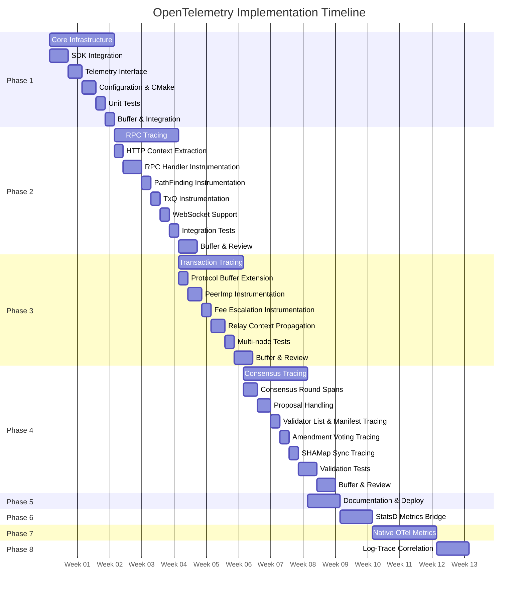
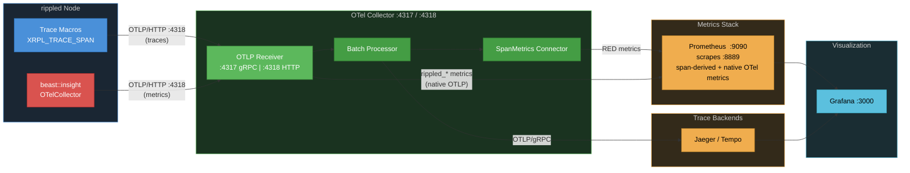
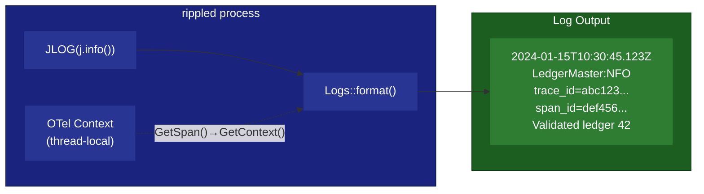
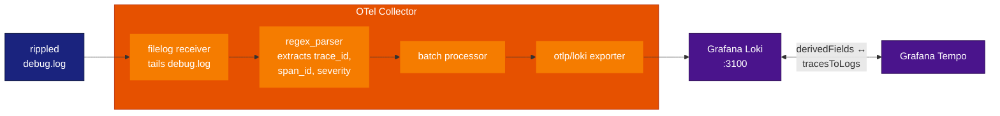
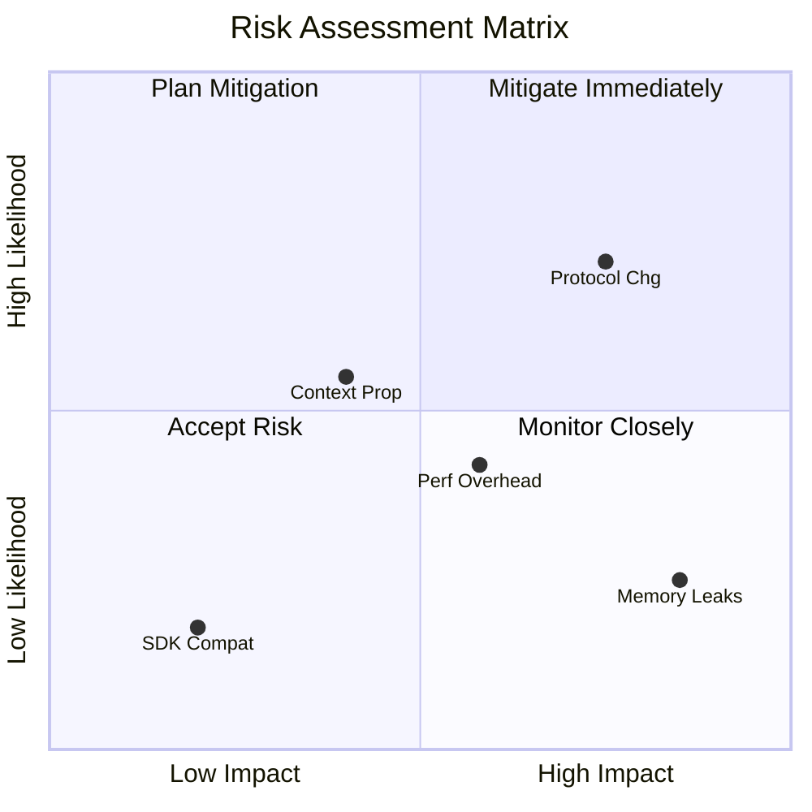
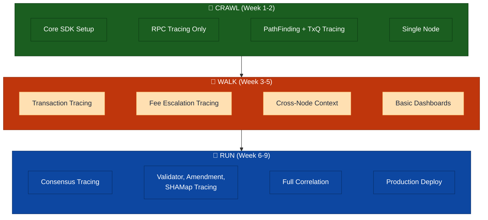
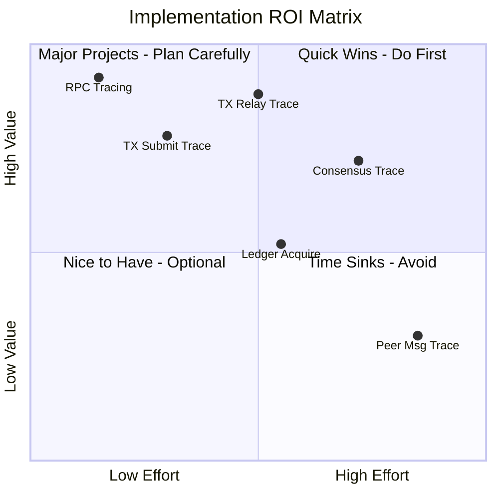

# Implementation Phases

> **Parent Document**: [OpenTelemetryPlan.md](./OpenTelemetryPlan.md)
> **Related**: [Configuration Reference](./05-configuration-reference.md) | [Observability Backends](./07-observability-backends.md)

---

## 6.1 Phase Overview

> **TxQ** = Transaction Queue



---

## 6.2 Phase 1: Core Infrastructure (Weeks 1-2)

**Objective**: Establish foundational telemetry infrastructure

### Tasks

| Task | Description                                           |
| ---- | ----------------------------------------------------- |
| 1.1  | Add OpenTelemetry C++ SDK to Conan/CMake              |
| 1.2  | Implement `Telemetry` interface and factory           |
| 1.3  | Implement `SpanGuard` RAII wrapper                    |
| 1.4  | Implement configuration parser                        |
| 1.5  | Integrate into `ApplicationImp`                       |
| 1.6  | Add conditional compilation (`XRPL_ENABLE_TELEMETRY`) |
| 1.7  | Create `NullTelemetry` no-op implementation           |
| 1.8  | Unit tests for core infrastructure                    |

### Exit Criteria

- [ ] OpenTelemetry SDK compiles and links
- [ ] Telemetry can be enabled/disabled via config
- [ ] Basic span creation works
- [ ] No performance regression when disabled
- [ ] Unit tests passing

---

## 6.3 Phase 2: RPC Tracing (Weeks 3-4)

> **TxQ** = Transaction Queue

**Objective**: Complete tracing for all RPC operations

### Tasks

| Task | Description                                                                |
| ---- | -------------------------------------------------------------------------- |
| 2.1  | Implement W3C Trace Context HTTP header extraction                         |
| 2.2  | Instrument `ServerHandler::onRequest()`                                    |
| 2.3  | Instrument `RPCHandler::doCommand()`                                       |
| 2.4  | Add RPC-specific attributes                                                |
| 2.5  | Instrument WebSocket handler                                               |
| 2.6  | PathFinding instrumentation (`pathfind.request`, `pathfind.compute` spans) |
| 2.7  | TxQ instrumentation (`txq.enqueue`, `txq.apply` spans)                     |
| 2.8  | Integration tests for RPC tracing                                          |
| 2.9  | Performance benchmarks                                                     |
| 2.10 | Documentation                                                              |

### Exit Criteria

- [ ] All RPC commands traced
- [ ] Trace context propagates from HTTP headers
- [ ] WebSocket and HTTP both instrumented
- [ ] <1ms overhead per RPC call
- [ ] Integration tests passing

---

## 6.4 Phase 3: Transaction Tracing (Weeks 5-6)

**Objective**: Trace transaction lifecycle across network

### Tasks

| Task | Description                                          |
| ---- | ---------------------------------------------------- |
| 3.1  | Define `TraceContext` Protocol Buffer message        |
| 3.2  | Implement protobuf context serialization             |
| 3.3  | Instrument `PeerImp::handleTransaction()`            |
| 3.4  | Instrument `NetworkOPs::submitTransaction()`         |
| 3.5  | Instrument HashRouter integration                    |
| 3.6  | Fee escalation instrumentation (`fee.escalate` span) |
| 3.7  | Implement relay context propagation                  |
| 3.8  | Integration tests (multi-node)                       |
| 3.9  | Performance benchmarks                               |

### Exit Criteria

- [ ] Transaction traces span across nodes
- [ ] Trace context in Protocol Buffer messages
- [ ] HashRouter deduplication visible in traces
- [ ] Multi-node integration tests passing
- [ ] <5% overhead on transaction throughput

---

## 6.5 Phase 4: Consensus Tracing (Weeks 7-8)

**Objective**: Full observability into consensus rounds

### Tasks

| Task | Description                                    |
| ---- | ---------------------------------------------- |
| 4.1  | Instrument `RCLConsensusAdaptor::startRound()` |
| 4.2  | Instrument phase transitions                   |
| 4.3  | Instrument proposal handling                   |
| 4.4  | Instrument validation handling                 |
| 4.5  | Add consensus-specific attributes              |
| 4.6  | Correlate with transaction traces              |
| 4.7  | Validator list and manifest tracing            |
| 4.8  | Amendment voting tracing                       |
| 4.9  | SHAMap sync tracing                            |
| 4.10 | Multi-validator integration tests              |
| 4.11 | Performance validation                         |

### Spans Produced

| Span Name                   | Location               | Attributes                                                                                                                                                                                                            |
| --------------------------- | ---------------------- | --------------------------------------------------------------------------------------------------------------------------------------------------------------------------------------------------------------------- |
| `consensus.proposal.send`   | `RCLConsensus.cpp:177` | `xrpl.consensus.round`                                                                                                                                                                                                |
| `consensus.ledger_close`    | `RCLConsensus.cpp:282` | `xrpl.consensus.ledger.seq`, `xrpl.consensus.mode`                                                                                                                                                                    |
| `consensus.accept`          | `RCLConsensus.cpp:395` | `xrpl.consensus.proposers`, `xrpl.consensus.round_time_ms`                                                                                                                                                            |
| `consensus.accept.apply`    | `RCLConsensus.cpp:521` | `xrpl.consensus.close_time`, `close_time_correct`, `close_resolution_ms`, `state`, `proposing`, `round_time_ms`, `ledger.seq`, `parent_close_time`, `close_time_self`, `close_time_vote_bins`, `resolution_direction` |
| `consensus.validation.send` | `RCLConsensus.cpp:753` | `xrpl.consensus.proposing`                                                                                                                                                                                            |

### Exit Criteria

- [x] Complete consensus round traces
- [x] Phase transitions visible
- [x] Proposals and validations traced
- [x] Close time agreement tracked (per `avCT_CONSENSUS_PCT`)
- [x] No impact on consensus timing
- [ ] Multi-validator test network validated

### Implementation Status — Phase 4a Complete

Phase 4a (establish-phase gap fill & cross-node correlation) adds:

- **Deterministic trace ID** derived from `previousLedger.id()` so all validators
  in the same round share the same `trace_id` (switchable via
  `consensus_trace_strategy` config: `"deterministic"` or `"attribute"`).
  See [Configuration Reference](./05-configuration-reference.md) for full
  configuration options. The `consensus_trace_strategy` option will be
  documented in the configuration reference as part of Phase 4a implementation.
- **Round lifecycle spans**: `consensus.round` with round-to-round span links.
- **Establish phase**: `consensus.establish`, `consensus.update_positions` (with
  `dispute.resolve` events), `consensus.check` (with threshold tracking).
- **Mode changes**: `consensus.mode_change` spans.
- **Validation**: `consensus.validation.send` with span link to round span
  (thread-safe cross-thread access via `roundSpanContext_` snapshot).
- **Separation of concerns**: telemetry extracted to private helpers
  (`startRoundTracing`, `createValidationSpan`, `startEstablishTracing`,
  `updateEstablishTracing`, `endEstablishTracing`).

See [Phase4_taskList.md](./Phase4_taskList.md) for the full spec and implementation notes.

---

## 6.5a Phase 4a: Establish-Phase Gap Fill & Cross-Node Correlation

**Objective**: Fill tracing gaps in the establish phase and establish cross-node
correlation using deterministic trace IDs derived from `previousLedger.id()`.

**Approach**: Direct instrumentation in `Consensus.h`. Long-lived spans use
direct SpanGuard members; short-lived scoped spans use `XRPL_TRACE_*` macros.

### Tasks

| Task | Description                                      | Effort | Risk   |
| ---- | ------------------------------------------------ | ------ | ------ |
| 4a.0 | Prerequisites: extend SpanGuard & Telemetry APIs | 1d     | Medium |
| 4a.1 | Adaptor `getTelemetry()` method                  | 0.5d   | Low    |
| 4a.2 | Switchable round span with deterministic traceID | 2d     | High   |
| 4a.3 | Span members in `Consensus.h`                    | 0.5d   | Medium |
| 4a.4 | Instrument `phaseEstablish()`                    | 1d     | Medium |
| 4a.5 | Instrument `updateOurPositions()`                | 1d     | Medium |
| 4a.6 | Instrument `haveConsensus()` (thresholds)        | 1d     | Medium |
| 4a.7 | Instrument mode changes                          | 0.5d   | Low    |
| 4a.8 | Reparent existing spans under round              | 0.5d   | Low    |
| 4a.9 | Build verification and testing                   | 1d     | Low    |

**Total Effort**: 9 days

### Spans Produced

| Span Name                    | Location           | Key Attributes                                                   |
| ---------------------------- | ------------------ | ---------------------------------------------------------------- |
| `consensus.round`            | `RCLConsensus.cpp` | `round_id`, `ledger_id`, `ledger.seq`, `mode`; link → prev round |
| `consensus.establish`        | `Consensus.h`      | `converge_percent`, `establish_count`, `proposers`               |
| `consensus.update_positions` | `Consensus.h`      | `disputes_count`, `converge_percent`, `proposers_agreed/total`   |
| `consensus.check`            | `Consensus.h`      | `agree/disagree_count`, `threshold_percent`, `result`            |
| `consensus.mode_change`      | `RCLConsensus.cpp` | `mode.old`, `mode.new`                                           |

### Exit Criteria

- [ ] Establish phase internals fully traced (disputes, convergence, thresholds)
- [ ] Cross-node correlation works via deterministic trace_id
- [ ] Strategy switchable via config (`deterministic` / `attribute`)
- [ ] Consecutive rounds linked via follows-from spans
- [ ] Build passes with telemetry ON and OFF
- [ ] No impact on consensus timing

See [Phase4_taskList.md](./Phase4_taskList.md) for full task details.

---

## 6.5b Phase 4b: Cross-Node Propagation (Future)

**Objective**: Wire `TraceContextPropagator` for P2P messages (proposals,
validations) to enable true distributed tracing between nodes.

**Status**: Design documented, NOT implemented. Protobuf fields (field 1001)
and `TraceContextPropagator` class exist. Wiring deferred until Phase 4a is
validated in a multi-node environment.

**Prerequisites**: Phase 4a complete and validated.

See [Phase4_taskList.md § Phase 4b](./Phase4_taskList.md) for full design.

---

## 6.6 Phase 5: Documentation & Deployment (Week 9)

**Objective**: Production readiness

### Tasks

| Task | Description                   |
| ---- | ----------------------------- |
| 5.1  | Operator runbook              |
| 5.2  | Grafana dashboards            |
| 5.3  | Alert definitions             |
| 5.4  | Collector deployment examples |
| 5.5  | Developer documentation       |
| 5.6  | Training materials            |
| 5.7  | Final integration testing     |

---

## 6.7 Phase 6: StatsD Metrics Integration (Week 10)

**Objective**: Bridge rippled's existing `beast::insight` StatsD metrics into the OpenTelemetry collection pipeline, exposing 300+ pre-existing metrics alongside span-derived RED metrics in Prometheus/Grafana.

### Background

rippled has a mature metrics framework (`beast::insight`) that emits StatsD-format metrics over UDP. These metrics cover node health, peer networking, RPC performance, job queue, and overlay traffic — data that **does not** overlap with the span-based instrumentation from Phases 1-5. By adding a StatsD receiver to the OTel Collector, both metric sources converge in Prometheus.

### Metric Inventory

| Category        | Group              | Type          | Count      | Key Metrics                                            |
| --------------- | ------------------ | ------------- | ---------- | ------------------------------------------------------ |
| Node State      | `State_Accounting` | Gauge         | 10         | `*_duration`, `*_transitions` per operating mode       |
| Ledger          | `LedgerMaster`     | Gauge         | 2          | `Validated_Ledger_Age`, `Published_Ledger_Age`         |
| Ledger Fetch    | —                  | Counter       | 1          | `ledger_fetches`                                       |
| Ledger History  | `ledger.history`   | Counter       | 1          | `mismatch`                                             |
| RPC             | `rpc`              | Counter+Event | 3          | `requests`, `time` (histogram), `size` (histogram)     |
| Job Queue       | —                  | Gauge+Event   | 1 + 2×N    | `job_count`, per-job `{name}` and `{name}_q`           |
| Peer Finder     | `Peer_Finder`      | Gauge         | 2          | `Active_Inbound_Peers`, `Active_Outbound_Peers`        |
| Overlay         | `Overlay`          | Gauge         | 1          | `Peer_Disconnects`                                     |
| Overlay Traffic | per-category       | Gauge         | 4×57 = 228 | `Bytes_In/Out`, `Messages_In/Out` per traffic category |
| Pathfinding     | —                  | Event         | 2          | `pathfind_fast`, `pathfind_full` (histograms)          |
| I/O             | —                  | Event         | 1          | `ios_latency` (histogram)                              |
| Resource Mgr    | —                  | Meter         | 2          | `warn`, `drop` (rate counters)                         |
| Caches          | per-cache          | Gauge         | 2×N        | `{cache}.size`, `{cache}.hit_rate`                     |

**Total**: ~255+ unique metrics (plus dynamic job-type and cache metrics)

### Tasks

| Task | Description                                                                                                     |
| ---- | --------------------------------------------------------------------------------------------------------------- |
| 6.1  | **DEFERRED** Fix Meter wire format (`\|m` → `\|c`) in StatsDCollector.cpp — breaking change, tracked separately |
| 6.2  | Add `statsd` receiver to OTel Collector config                                                                  |
| 6.3  | Expose UDP port 8125 in docker-compose.yml                                                                      |
| 6.4  | Add `[insight]` config to integration test node configs                                                         |
| 6.5  | Create "Node Health" Grafana dashboard (8 panels)                                                               |
| 6.6  | Create "Network Traffic" Grafana dashboard (8 panels)                                                           |
| 6.7  | Create "RPC & Pathfinding (StatsD)" Grafana dashboard (8 panels)                                                |
| 6.8  | Update integration test to verify StatsD metrics in Prometheus                                                  |
| 6.9  | Update TESTING.md and telemetry-runbook.md                                                                      |

### Wire Format Fix (Task 6.1) — DEFERRED

The `StatsDMeterImpl` in `StatsDCollector.cpp:706` sends metrics with `|m` suffix, which is non-standard StatsD. The OTel StatsD receiver silently drops these. Fix: change `|m` to `|c` (counter), which is semantically correct since meters are increment-only counters. Only 2 metrics are affected (`warn`, `drop` in Resource Manager).

**Status**: Deferred as a separate change — this is a breaking change for any StatsD backend that previously consumed the custom `|m` type. The Resource Warnings and Resource Drops dashboard panels will show no data until this fix is applied.

### New Grafana Dashboards

**Node Health** (`statsd-node-health.json`, uid: `rippled-statsd-node-health`):

- Validated/Published Ledger Age, Operating Mode Duration/Transitions, I/O Latency, Job Queue Depth, Ledger Fetch Rate, Ledger History Mismatches

**Network Traffic** (`statsd-network-traffic.json`, uid: `rippled-statsd-network`):

- Active Inbound/Outbound Peers, Peer Disconnects, Total Bytes/Messages In/Out, Transaction/Proposal/Validation Traffic, Top Traffic Categories

**RPC & Pathfinding (StatsD)** (`statsd-rpc-pathfinding.json`, uid: `rippled-statsd-rpc`):

- RPC Request Rate, Response Time p95/p50, Response Size p95/p50, Pathfinding Fast/Full Duration, Resource Warnings/Drops, Response Time Heatmap

### Exit Criteria

- [ ] StatsD metrics visible in Prometheus (`curl localhost:9090/api/v1/query?query=rippled_LedgerMaster_Validated_Ledger_Age`)
- [ ] All 3 new Grafana dashboards load without errors
- [ ] Integration test verifies at least core StatsD metrics (ledger age, peer counts, RPC requests)
- [ ] ~~Meter metrics (`warn`, `drop`) flow correctly after `|m` → `|c` fix~~ — DEFERRED (breaking change, tracked separately; resolved by Phase 7's OTel Counter mapping)

---

## 6.8 Phase 7: Native OTel Metrics Migration (Weeks 11-12)

**Objective**: Replace `StatsDCollector` with a native OpenTelemetry Metrics SDK implementation behind the existing `beast::insight::Collector` interface, eliminating the StatsD UDP dependency and unifying traces and metrics into a single OTLP pipeline.

### Motivation: Why Migrate from StatsD to Native OTel Metrics

The Phase 6 StatsD bridge was a pragmatic first step, but it retains inherent limitations that native OTel export resolves.

#### What We Gain

1. **Unified telemetry pipeline** — Traces and metrics export via the same OTLP/HTTP endpoint to the same OTel Collector. One protocol, one endpoint, one config. Eliminates the split-brain architecture of "OTLP for traces, StatsD UDP for metrics."

2. **Eliminates StatsD UDP limitations** — StatsD is fire-and-forget over UDP with no delivery guarantees, no backpressure, 1472-byte MTU packet fragmentation, and text-based encoding overhead. OTLP uses HTTP/gRPC with retries, binary protobuf encoding, and connection-level flow control.

3. **Fixes the `|m` wire format issue** — The `StatsDMeterImpl` uses non-standard `|m` StatsD type that the OTel StatsD receiver silently drops. Native OTel counters eliminate this problem entirely (Phase 6 Task 6.1 — DEFERRED becomes resolved).

4. **Richer metric semantics** — OTel Metrics SDK supports explicit histogram bucket boundaries, exemplars (linking metrics to traces), resource attributes, and metric views. StatsD has no concept of these.

5. **Removes infrastructure dependency** — No more StatsD receiver needed in the OTel Collector. One less receiver to configure, monitor, and debug. Simplifies the collector YAML.

6. **Metric-to-trace correlation** — OTel metrics and traces share the same resource attributes (service.name, service.instance.id). Grafana can link from a metric spike directly to the traces that caused it — impossible with StatsD-sourced metrics.

7. **Production-grade export** — OTel's `PeriodicMetricReader` provides configurable export intervals, batch sizes, timeout handling, and graceful shutdown — all built into the SDK rather than hand-rolled in `StatsDCollectorImp`.

#### What We Lose

1. **StatsD ecosystem compatibility** — Operators using external StatsD-compatible backends (Datadog Agent, Graphite, Telegraph) will need to switch to OTLP-compatible backends or keep `server=statsd` as a fallback.

2. **Simplicity of UDP** — StatsD's UDP fire-and-forget model is dead simple and has zero connection management. OTLP/HTTP requires a TCP connection, TLS negotiation (in production), and retry logic. The OTel SDK handles this, but it's more moving parts.

3. **Slightly higher memory** — OTel SDK maintains internal aggregation state for metrics before export. StatsD just formats and sends strings. Expected overhead: ~1-2 MB additional for metric state.

4. **Dependency on OTel C++ Metrics SDK stability** — The Metrics SDK is GA since 1.0 and on version 1.18.0, but it's less battle-tested than the tracing SDK in the C++ ecosystem.

#### Decision

The gains (unified pipeline, delivery guarantees, metric-trace correlation, simpler collector config) significantly outweigh the losses. `StatsDCollector` is retained as a fallback via `server=statsd` for operators who need StatsD ecosystem compatibility during the transition period.

### Architecture

#### Class Hierarchy (after Phase 7)

```
beast::insight::Collector (abstract interface — unchanged)
    |
    +-- StatsDCollector        (existing — retained as fallback, deprecated)
    |     +-- StatsDCounterImpl    -> StatsD |c over UDP
    |     +-- StatsDGaugeImpl      -> StatsD |g over UDP
    |     +-- StatsDMeterImpl      -> StatsD |m over UDP (non-standard)
    |     +-- StatsDEventImpl      -> StatsD |ms over UDP
    |     +-- StatsDHookImpl       -> 1s periodic callback
    |
    +-- NullCollector          (existing — unchanged, used when disabled)
    |     +-- NullCounterImpl      -> no-op
    |     +-- NullGaugeImpl        -> no-op
    |     +-- NullMeterImpl        -> no-op
    |     +-- NullEventImpl        -> no-op
    |     +-- NullHookImpl         -> no-op
    |
    +-- OTelCollector          (NEW — Phase 7)
          +-- OTelCounterImpl      -> otel::Counter<int64_t>
          +-- OTelGaugeImpl        -> otel::ObservableGauge<uint64_t>
          +-- OTelMeterImpl        -> otel::Counter<uint64_t>
          +-- OTelEventImpl        -> otel::Histogram<double>
          +-- OTelHookImpl         -> 1s periodic callback (same pattern)
```

#### Data Flow (after Phase 7)



**Key change**: StatsD receiver removed from collector. Both traces and metrics enter via OTLP receiver on the same port.

#### Configuration

```ini
# [insight] section — new "otel" server option
[insight]
server=otel              # NEW: uses OTel OTLP metrics exporter
prefix=rippled           # metric name prefix (preserved)

# Endpoint and auth inherited from [telemetry] section:
[telemetry]
enabled=1
endpoint=http://localhost:4318/v1/traces
```

The `OTelCollector` reads the OTLP endpoint from `[telemetry]` config (replacing `/v1/traces` with `/v1/metrics` for the metrics exporter). No additional config keys needed.

**Backward compatibility**: `server=statsd` continues to work exactly as before.

See [Phase7_taskList.md](./Phase7_taskList.md) for detailed per-task breakdown.

### Instrument Type Mapping

| beast::insight         | OTel Metrics SDK                 | Rationale                                                        |
| ---------------------- | -------------------------------- | ---------------------------------------------------------------- |
| Counter (int64, `\|c`) | `Counter<int64_t>`               | Direct 1:1 mapping                                               |
| Gauge (uint64, `\|g`)  | `ObservableGauge<uint64_t>`      | Async callback matches existing Hook polling pattern             |
| Meter (uint64, `\|m`)  | `Counter<uint64_t>`              | Fixes non-standard wire format; meters are semantically counters |
| Event (ms, `\|ms`)     | `Histogram<double>`              | Duration distributions with explicit bucket boundaries           |
| Hook (1s callback)     | `PeriodicMetricReader` alignment | Same 1s collection interval                                      |

### Tasks

| Task | Description                                                               |
| ---- | ------------------------------------------------------------------------- |
| 7.1  | Add OTel Metrics SDK to build deps (conan/cmake)                          |
| 7.2  | Implement `OTelCollector` class (~400-500 lines)                          |
| 7.3  | Update `CollectorManager` — add `server=otel`                             |
| 7.4  | Update OTel Collector YAML (add metrics pipeline, remove StatsD receiver) |
| 7.5  | Preserve metric names in Prometheus (naming strategy)                     |
| 7.6  | Update Grafana dashboards (if names change)                               |
| 7.7  | Update integration tests                                                  |
| 7.8  | Update documentation (runbook, reference docs)                            |

### Exit Criteria

- [ ] All 255+ metrics visible in Prometheus via OTLP pipeline (no StatsD receiver)
- [ ] `server=otel` is the default in development docker-compose
- [ ] `server=statsd` still works as a fallback
- [ ] Existing Grafana dashboards display data correctly
- [ ] Integration test passes with OTLP-only metrics pipeline
- [ ] No performance regression vs StatsD baseline (< 1% CPU overhead)
- [ ] Deferred Task 6.1 (`|m` wire format) no longer relevant

---

## 6.8.1 Phase 8: Log-Trace Correlation and Centralized Log Ingestion (Week 13)

### Motivation

rippled's `beast::Journal` logs and OpenTelemetry traces are currently two disjoint observability signals. When investigating an issue, operators must manually correlate timestamps between log files and Jaeger/Tempo traces. Phase 8 bridges this gap by injecting trace context (`trace_id`, `span_id`) into every log line emitted within an active span, and ingesting those logs into Grafana Loki via the OTel Collector's filelog receiver.

#### Gains

1. **One-click trace-to-log navigation** — Click a trace in Tempo/Jaeger and immediately see the corresponding log lines in Loki, filtered by `trace_id`.
2. **Reverse lookup (log-to-trace)** — Loki derived fields make `trace_id` values clickable links back to Tempo.
3. **Unified observability** — All three pillars (traces, metrics, logs) flow through the same OTel Collector pipeline and are visible in a single Grafana instance.
4. **Zero new dependencies in rippled** — Uses existing OTel SDK headers (`GetSpan`, `GetContext`) already linked in Phase 1.
5. **Negligible overhead** — `GetSpan()` + `GetContext()` are thread-local reads (<10ns/call). At ~1000 JLOG calls/min, this adds <10us/min.

#### Losses / Risks

1. **Log format change** — Existing log parsers that rely on a fixed format will need updating to handle the optional `trace_id=... span_id=...` fields.
2. **Loki resource usage** — Log ingestion adds storage and memory overhead to the observability stack (mitigated by retention policies).
3. **Filelog receiver complexity** — The regex parser must be kept in sync with the log format; a format change in `Logs::format()` could break parsing.

#### Decision

The correlation value far outweighs the risks. The log format change is backward-compatible (fields are appended only when a span is active), and the filelog receiver regex is straightforward to maintain.

### Architecture

Phase 8 has two independent sub-phases that can be developed in parallel:

- **Phase 8a (code change)**: Modify `Logs::format()` in `src/libxrpl/basics/Log.cpp` to append `trace_id=<hex32> span_id=<hex16>` when the current thread has an active OTel span. Guarded by `#ifdef XRPL_ENABLE_TELEMETRY`.
- **Phase 8b (infra only)**: Add Loki to the Docker Compose stack, configure the OTel Collector's `filelog` receiver to tail rippled's log file, parse out structured fields (timestamp, partition, severity, trace_id, span_id, message), and export to Loki via OTLP. Configure Grafana Tempo↔Loki bidirectional linking.

#### Trace ID Injection Flow



#### Loki Ingestion Pipeline



### Tasks

| Task | Description                                    |
| ---- | ---------------------------------------------- |
| 8.1  | Inject trace_id into Logs::format()            |
| 8.2  | Add Loki to Docker Compose stack               |
| 8.3  | Add filelog receiver to OTel Collector         |
| 8.4  | Configure Grafana trace-to-log correlation     |
| 8.5  | Update integration tests                       |
| 8.6  | Update documentation (runbook, reference docs) |

**Parallel work**: Task 8.2 (Loki infra) can run in parallel with Task 8.1 (code change). Tasks 8.3–8.6 are sequential.

### Exit Criteria

- [ ] Log lines within active spans contain `trace_id=<hex> span_id=<hex>`
- [ ] Log lines outside spans have no trace context (no empty fields)
- [ ] Loki ingests rippled logs via OTel Collector filelog receiver
- [ ] Grafana Tempo → Loki one-click correlation works
- [ ] Grafana Loki → Tempo reverse lookup works via derived field
- [ ] Integration test verifies trace_id presence in logs
- [ ] No performance regression from trace_id injection (< 0.1% overhead)

---

## 6.9 Risk Assessment



### Risk Details

| Risk                                 | Likelihood | Impact | Mitigation                              |
| ------------------------------------ | ---------- | ------ | --------------------------------------- |
| Protocol changes break compatibility | Medium     | High   | Use high field numbers, optional fields |
| Performance overhead unacceptable    | Medium     | Medium | Sampling, conditional compilation       |
| Context propagation complexity       | Medium     | Medium | Phased rollout, extensive testing       |
| SDK compatibility issues             | Low        | Medium | Pin SDK version, fallback to no-op      |
| Memory leaks in long-running nodes   | Low        | High   | Memory profiling, bounded queues        |

---

## 6.10 Success Metrics

| Metric                   | Target                                                         | Measurement           |
| ------------------------ | -------------------------------------------------------------- | --------------------- |
| Trace coverage           | >95% of transaction code paths (independent of sampling ratio) | Sampling verification |
| CPU overhead             | <3%                                                            | Benchmark tests       |
| Memory overhead          | <10 MB                                                         | Memory profiling      |
| Latency impact (p99)     | <2%                                                            | Performance tests     |
| Trace completeness       | >99% spans with required attrs                                 | Validation script     |
| Cross-node trace linkage | >90% of multi-hop transactions                                 | Integration tests     |

---

## 6.9 Quick Wins and Crawl-Walk-Run Strategy

> **TxQ** = Transaction Queue

This section outlines a prioritized approach to maximize ROI with minimal initial investment.

### 6.9.1 Crawl-Walk-Run Overview

<div align="center">



</div>

**Reading the diagram:**

- **CRAWL (Weeks 1-2)**: Minimal investment -- set up the SDK, instrument RPC and PathFinding/TxQ handlers, and verify on a single node. Delivers immediate latency visibility.
- **WALK (Weeks 3-5)**: Expand to transaction lifecycle tracing, fee escalation, cross-node context propagation, and basic Grafana dashboards. This is where distributed tracing starts working.
- **RUN (Weeks 6-9)**: Full consensus instrumentation, validator/amendment/SHAMap tracing, end-to-end correlation, and production deployment with sampling and alerting.
- **Arrows (crawl → walk → run)**: Each phase builds on the prior one; you cannot skip ahead because later phases depend on infrastructure established earlier.

### 6.9.2 Quick Wins (Immediate Value)

| Quick Win                      | Value  | When to Deploy |
| ------------------------------ | ------ | -------------- |
| **RPC Command Tracing**        | High   | Week 2         |
| **RPC Latency Histograms**     | High   | Week 2         |
| **Error Rate Dashboard**       | Medium | Week 2         |
| **Transaction Submit Tracing** | High   | Week 3         |
| **Consensus Round Duration**   | Medium | Week 6         |

### 6.9.3 CRAWL Phase (Weeks 1-2)

**Goal**: Get basic tracing working with minimal code changes.

**What You Get**:

- RPC request/response traces for all commands
- Latency breakdown per RPC command
- PathFinding and TxQ tracing (directly impacts RPC latency)
- Error visibility with stack traces
- Basic Grafana dashboard

**Code Changes**: ~15 lines in `ServerHandler.cpp`, ~40 lines in new telemetry module

**Why Start Here**:

- RPC is the lowest-risk, highest-visibility component
- PathFinding and TxQ are RPC-adjacent and directly affect latency
- Immediate value for debugging client issues
- No cross-node complexity
- Single file modification to existing code

### 6.9.4 WALK Phase (Weeks 3-5)

**Goal**: Add transaction lifecycle tracing across nodes.

**What You Get**:

- End-to-end transaction traces from submit to relay
- Fee escalation tracing within the transaction pipeline
- Cross-node correlation (see transaction path)
- HashRouter deduplication visibility
- Relay latency metrics

**Code Changes**: ~120 lines across 4 files, plus protobuf extension

**Why Do This Second**:

- Builds on RPC tracing (transactions submitted via RPC)
- Fee escalation is integral to the transaction processing pipeline
- Moderate complexity (requires context propagation)
- High value for debugging transaction issues

### 6.9.5 RUN Phase (Weeks 6-9)

**Goal**: Full observability including consensus.

**What You Get**:

- Complete consensus round visibility
- Phase transition timing
- Validator proposal tracking
- Validator list and manifest tracing
- Amendment voting tracing
- SHAMap sync tracing
- Full end-to-end traces (client → RPC → TX → consensus → ledger)

**Code Changes**: ~100 lines across 3 consensus files, plus validator/amendment/SHAMap modules

**Why Do This Last**:

- Highest complexity (consensus is critical path)
- Validator, amendment, and SHAMap components are lower priority
- Requires thorough testing
- Lower relative value (consensus issues are rarer)

### 6.9.6 ROI Prioritization Matrix



---


## 6.13 Definition of Done

> **TxQ** = Transaction Queue | **HA** = High Availability

Clear, measurable criteria for each phase.

### 6.13.1 Phase 1: Core Infrastructure


| Criterion       | Measurement                                                | Target                       |
| --------------- | ---------------------------------------------------------- | ---------------------------- |
| SDK Integration | `cmake --build` succeeds with `-DXRPL_ENABLE_TELEMETRY=ON` | ✅ Compiles                  |
| Runtime Toggle  | `enabled=0` produces zero overhead                         | <0.1% CPU difference         |
| Span Creation   | Unit test creates and exports span                         | Span appears in Tempo        |
| Configuration   | All config options parsed correctly                        | Config validation tests pass |
| Documentation   | Developer guide exists                                     | PR approved                  |

**Definition of Done**: All criteria met, PR merged, no regressions in CI.


### 6.13.2 Phase 2: RPC Tracing


| Criterion          | Measurement                        | Target                     |
| ------------------ | ---------------------------------- | -------------------------- |
| Coverage           | All RPC commands instrumented      | 100% of commands           |
| Context Extraction | traceparent header propagates      | Integration test passes    |
| Attributes         | Command, status, duration recorded | Validation script confirms |
| Performance        | RPC latency overhead               | <1ms p99                   |
| Dashboard          | Grafana dashboard deployed         | Screenshot in docs         |

**Definition of Done**: RPC traces visible in Tempo for all commands, dashboard shows latency distribution.


### 6.13.3 Phase 3: Transaction Tracing


| Criterion        | Measurement                     | Target                             |
| ---------------- | ------------------------------- | ---------------------------------- |
| Local Trace      | Submit → validate → TxQ traced  | Single-node test passes            |
| Cross-Node       | Context propagates via protobuf | Multi-node test passes             |
| Relay Visibility | relay_count attribute correct   | Spot check 100 txs                 |
| HashRouter       | Deduplication visible in trace  | Duplicate txs show suppressed=true |
| Performance      | TX throughput overhead          | <5% degradation                    |

**Definition of Done**: Transaction traces span 3+ nodes in test network, performance within bounds.


### 6.13.4 Phase 4: Consensus Tracing


| Criterion            | Measurement                   | Target                    |
| -------------------- | ----------------------------- | ------------------------- |
| Round Tracing        | startRound creates root span  | Unit test passes          |
| Phase Visibility     | All phases have child spans   | Integration test confirms |
| Proposer Attribution | Proposer ID in attributes     | Spot check 50 rounds      |
| Timing Accuracy      | Phase durations match PerfLog | <5% variance              |
| No Consensus Impact  | Round timing unchanged        | Performance test passes   |

**Definition of Done**: Consensus rounds fully traceable, no impact on consensus timing.


### 6.13.5 Phase 5: Production Deployment


| Criterion    | Measurement                  | Target                     |
| ------------ | ---------------------------- | -------------------------- |
| Collector HA | Multiple collectors deployed | No single point of failure |
| Sampling     | Tail sampling configured     | 10% base + errors + slow   |
| Retention    | Data retained per policy     | 7 days hot, 30 days warm   |
| Alerting     | Alerts configured            | Error spike, high latency  |
| Runbook      | Operator documentation       | Approved by ops team       |
| Training     | Team trained                 | Session completed          |

**Definition of Done**: Telemetry running in production, operators trained, alerts active.


### 6.13.6 Success Metrics Summary

| Phase   | Primary Metric               | Secondary Metric            | Deadline       |
| ------- | ---------------------------- | --------------------------- | -------------- |
| Phase 1 | SDK compiles and runs        | Zero overhead when disabled | End of Week 2  |
| Phase 2 | 100% RPC coverage            | <1ms latency overhead       | End of Week 4  |
| Phase 3 | Cross-node traces work       | <5% throughput impact       | End of Week 6  |
| Phase 4 | Consensus fully traced       | No consensus timing impact  | End of Week 8  |
| Phase 5 | Production deployment        | Operators trained           | End of Week 9  |
| Phase 6 | StatsD metrics in Prometheus | 3 dashboards operational    | End of Week 10 |
| Phase 7 | All metrics via OTLP         | No StatsD dependency        | End of Week 12 |
| Phase 8 | trace_id in logs + Loki      | Tempo↔Loki correlation      | End of Week 13 |

---

## 6.14 Recommended Implementation Order

Based on ROI analysis, implement in this exact order:


**Reading the diagram:**

- **Week 1 (tasks 1-2)**: Foundation work -- integrate the OpenTelemetry SDK via Conan/CMake and build the `Telemetry` interface with `SpanGuard` and config parsing.
- **Week 2 (tasks 3-4)**: First observable output -- instrument `ServerHandler` for RPC tracing and stand up Tempo so developers can see traces immediately.
- **Weeks 3-5 (tasks 5-10)**: Transaction lifecycle -- add submit tracing, build the first Grafana dashboard, extend protobuf for cross-node context, instrument `PeerImp` relay, then validate with multi-node integration tests and performance benchmarks.
- **Weeks 6-8 (tasks 11-12)**: Consensus deep-dive -- instrument consensus rounds and phases, then run full integration testing across all instrumented paths.
- **Week 9 (tasks 13-14)**: Go-live -- deploy to production with sampling/alerting configured, and deliver documentation and operator training.
- **Arrow chain (t1 → ... → t14)**: Strict sequential dependency; each task's output is a prerequisite for the next.

---

_Previous: [Configuration Reference](./05-configuration-reference.md)_ | _Next: [Observability Backends](./07-observability-backends.md)_ | _Back to: [Overview](./OpenTelemetryPlan.md)_
