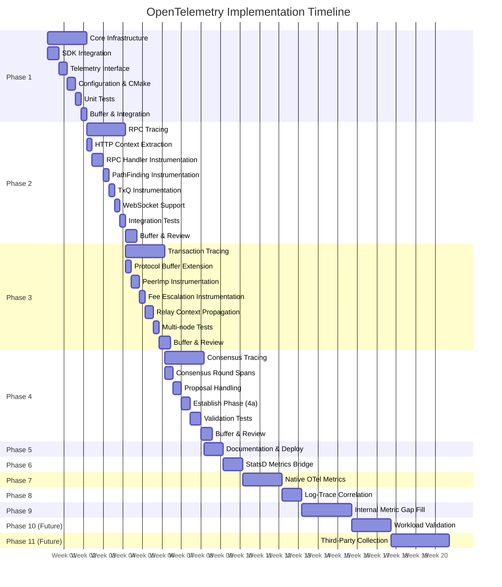
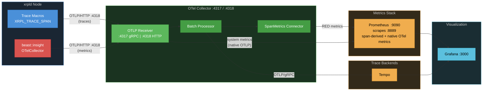
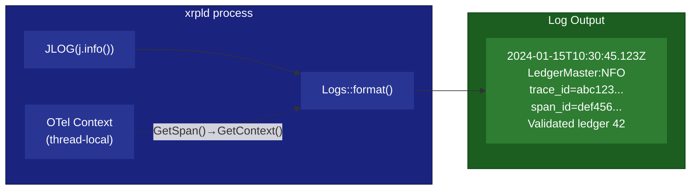
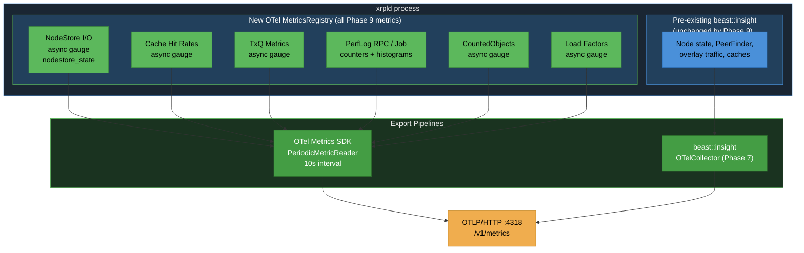
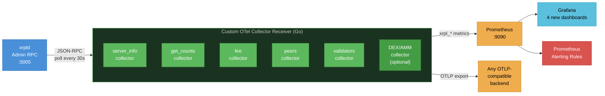
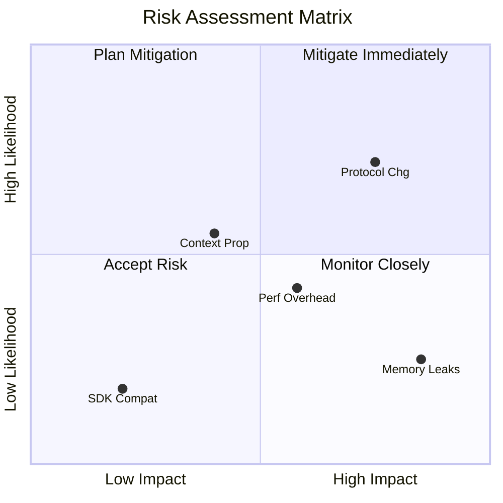
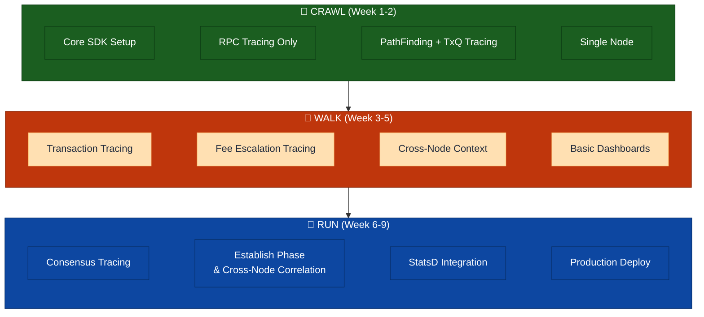
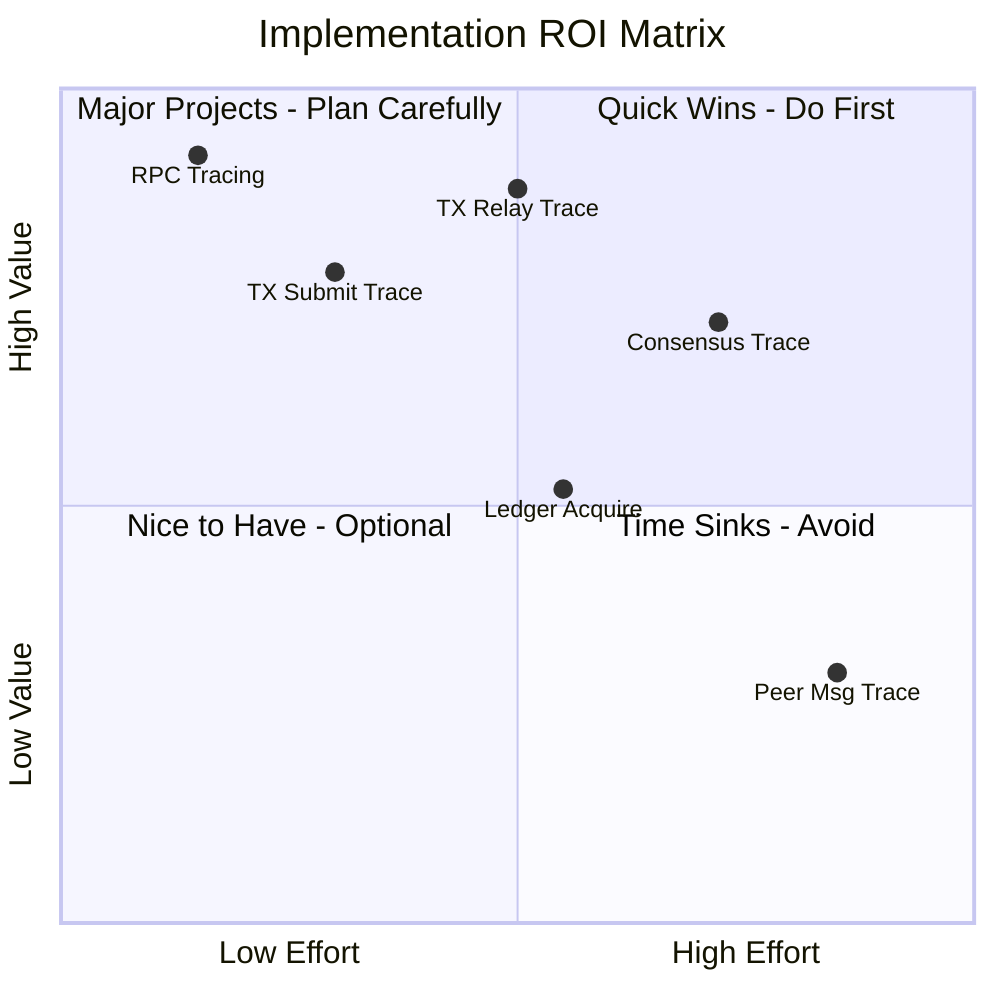

# Implementation Phases

> **Parent Document**: [OpenTelemetryPlan.md](./OpenTelemetryPlan.md)
> **Related**: [Configuration Reference](./05-configuration-reference.md) | [Observability Backends](./07-observability-backends.md)

---

## 6.1 Phase Overview

> **TxQ** = Transaction Queue



---

## 6.2 Phase 1: Core Infrastructure (Weeks 1-2)

**Objective**: Establish foundational telemetry infrastructure

### Tasks

| Task | Description                                           |
| ---- | ----------------------------------------------------- |
| 1.1  | Add OpenTelemetry C++ SDK to Conan/CMake              |
| 1.2  | Implement `Telemetry` interface and factory           |
| 1.3  | Implement `SpanGuard` RAII wrapper                    |
| 1.4  | Implement configuration parser                        |
| 1.5  | Integrate into `ApplicationImp`                       |
| 1.6  | Add conditional compilation (`XRPL_ENABLE_TELEMETRY`) |
| 1.7  | Create `NullTelemetry` no-op implementation           |
| 1.8  | Unit tests for core infrastructure                    |

### Exit Criteria

- [x] OpenTelemetry SDK compiles and links — `conanfile.py:153` requires
      `opentelemetry-cpp/1.28.0` when the `telemetry` option is on (`:152`);
      `cmake/XrplCore.cmake:91,245` links the umbrella target
      `opentelemetry-cpp::opentelemetry-cpp`
- [x] Telemetry can be enabled/disabled via config — `TelemetryConfig.cpp:103`
      parses `[telemetry] enabled` (default 0)
- [x] Basic span creation works — `libxrpl/telemetry/SpanGuard.cpp`, covered by
      `src/tests/libxrpl/telemetry/SpanGuardScope.cpp` and `SpanGuardFactory.cpp`
- [ ] No performance regression when disabled — `NullTelemetry.cpp` provides the
      no-op path, but the <0.1% claim needs the Phase 10 benchmark suite
      (`--with-benchmark`), which is not run in CI
- [x] Unit tests passing — 10 GTest files under `src/tests/libxrpl/telemetry/`

---

## 6.3 Phase 2: RPC Tracing (Weeks 3-4)

> **TxQ** = Transaction Queue

**Objective**: Complete tracing for all RPC operations

### Tasks

| Task | Description                                                                |
| ---- | -------------------------------------------------------------------------- |
| 2.1  | Implement W3C Trace Context HTTP header extraction                         |
| 2.2  | Instrument `ServerHandler::onRequest()`                                    |
| 2.3  | Instrument `RPCHandler::doCommand()`                                       |
| 2.4  | Add RPC-specific attributes                                                |
| 2.5  | Instrument WebSocket handler                                               |
| 2.6  | PathFinding instrumentation (`pathfind.request`, `pathfind.compute` spans) |
| 2.7  | TxQ instrumentation (`txq.enqueue`, `txq.apply` spans)                     |
| 2.8  | Integration tests for RPC tracing                                          |
| 2.9  | Performance benchmarks                                                     |
| 2.10 | Documentation                                                              |

### Exit Criteria

- [x] All RPC commands traced — `rpc.command.{name}` built from
      `rpc_span::prefix::command` (`RpcSpanNames.h:127`), emitted from
      `RPCHandler.cpp`
- [ ] Trace context propagates from HTTP headers — **not implemented**.
      `TraceContextPropagator.h` only offers `extractFromProtobuf()` /
      `injectToProtobuf()`; there is no `traceparent` header reader anywhere in
      the tree (`grep -ri traceparent src/ include/` → 0 hits). Cross-node
      correlation is carried by the protobuf `TraceContext` field and by
      deterministic trace IDs instead.
- [x] WebSocket and HTTP both instrumented — `rpc.http_request` and
      `rpc.ws_message` (`RpcSpanNames.h:133-136`)
- [ ] <1ms overhead per RPC call — needs the Phase 10 benchmark suite
- [ ] Integration tests passing — the end-to-end RPC span assertions live in the
      Phase 10 harness (`validate_telemetry.py`), not on this branch

---

## 6.4 Phase 3: Transaction Tracing (Weeks 5-6)

**Objective**: Trace transaction lifecycle across network with deterministic cross-node correlation

### Tasks

| Task | Description                                                    |
| ---- | -------------------------------------------------------------- |
| 3.1  | Define `TraceContext` Protocol Buffer message                  |
| 3.2  | Implement protobuf context serialization                       |
| 3.3  | Instrument `PeerImp::handleTransaction()`                      |
| 3.4  | Instrument `NetworkOPs::submitTransaction()`                   |
| 3.5  | Instrument HashRouter integration                              |
| 3.6  | Fee escalation instrumentation (`fee.escalate` span)           |
| 3.7  | Implement relay context propagation                            |
| 3.8  | Integration tests (multi-node)                                 |
| 3.9  | Deterministic transaction trace ID (`trace_id = txHash[0:16]`) |
| 3.10 | Performance benchmarks                                         |

### Deterministic Trace ID (Task 3.9)

Transaction spans use **deterministic trace IDs** derived from the transaction hash:
`trace_id = txHash[0:16]`. All nodes handling the same transaction independently
produce spans under the same trace_id. Protobuf `span_id` propagation (Task 3.7)
additionally provides parent-child relay ordering when available. See
[02-design-decisions.md §2.5.0](./02-design-decisions.md) for the design rationale
and [Phase3_taskList.md Task 3.9](./Phase3_taskList.md) for the full implementation spec.

### Exit Criteria

- [ ] Transaction traces span across nodes — needs a live multi-node run (Phase 10 harness)
- [x] Trace context in Protocol Buffer messages — `message TraceContext`
      (`include/xrpl/proto/xrpl.proto:101`), carried as optional field `1001` on
      three message types (`:130`, `:181`, `:229`)
- [x] HashRouter deduplication visible in traces — `suppressed` attribute
      (`TxSpanNames.h:71`)
- [ ] Multi-node integration tests passing — Phase 10 harness
- [ ] <5% overhead on transaction throughput — needs the Phase 10 benchmark suite
- [x] Deterministic trace_id: all nodes produce same trace_id for same transaction
      — `libxrpl/telemetry/DeterministicIdGenerator.cpp`
- [x] Protobuf span_id propagation preserves parent-child ordering when available
      — `TraceContextPropagator.h` `injectToProtobuf()` / `extractFromProtobuf()`
      (`trace_state`, field 4, is reserved and deliberately unwired)

---

## 6.5 Phase 4: Consensus Tracing (Weeks 7-8)

**Objective**: Full observability into consensus rounds

### Tasks

| Task | Description                                    | Status             |
| ---- | ---------------------------------------------- | ------------------ |
| 4.1  | Instrument `RCLConsensusAdaptor::startRound()` | ✅ Done (via 4a.2) |
| 4.2  | Instrument phase transitions                   | ✅ Done            |
| 4.3  | Instrument proposal handling                   | ✅ Done            |
| 4.4  | Instrument validation handling                 | ✅ Done            |
| 4.5  | Add consensus-specific attributes              | ✅ Done            |
| 4.6  | Correlate with transaction traces              | ✅ Done            |
| 4.7  | Build verification and testing                 | ✅ Done            |
| 4.8  | Validation span enrichment (ext. dashboard)    | ✅ Done (partial)  |

**Note**: The original plan doc listed tasks 4.7-4.11 as "Validator list tracing",
"Amendment voting tracing", "SHAMap sync tracing", "Multi-validator integration tests",
and "Performance validation". These were descoped and replaced by the tasklist's 4.7
(build verification) and 4.8 (validation span enrichment). Validator, amendment, and
SHAMap tracing are not implemented.

### Spans Produced

| Span Name                   | Location           | Attributes                                                                                                                                                                                                       |
| --------------------------- | ------------------ | ---------------------------------------------------------------------------------------------------------------------------------------------------------------------------------------------------------------- |
| `consensus.phase.open`      | `Consensus.h`      | _(none)_                                                                                                                                                                                                         |
| `consensus.proposal.send`   | `RCLConsensus.cpp` | `consensus_round`                                                                                                                                                                                                |
| `consensus.ledger_close`    | `RCLConsensus.cpp` | `ledger_seq`, `consensus_mode`                                                                                                                                                                                   |
| `consensus.accept`          | `RCLConsensus.cpp` | `proposers`, `round_time_ms`, `quorum`                                                                                                                                                                           |
| `consensus.accept.apply`    | `RCLConsensus.cpp` | `close_time`, `close_time_correct`, `close_resolution_ms`, `consensus_state`, `proposing`, `round_time_ms`, `ledger_seq`, `parent_close_time`, `close_time_self`, `close_time_vote_bins`, `resolution_direction` |
| `consensus.validation.send` | `RCLConsensus.cpp` | `ledger_seq`, `proposing`                                                                                                                                                                                        |

### Exit Criteria

- [x] Complete consensus round traces
- [x] Phase transitions visible (open, establish, close, accept)
- [x] Proposals and validations traced — send and receive; relay deferred to Phase 4b
- [x] Close time agreement tracked (per `avCT_CONSENSUS_PCT`)
- [ ] No impact on consensus timing — **not measured**. No consensus-timing
      benchmark has been run on any branch in the chain; the benchmark suite
      lives on the Phase 10 branch and does not isolate consensus round time
- [ ] Multi-validator test network validated — needs a live multi-node run; the
      5-node harness lives on the Phase 10 branch, not here
- [x] Transaction-consensus correlation (Task 4.6) — `tx.included` events in doAccept
- [x] Validation span enrichment (Task 4.8) — send span sets `ledger_seq`,
      `ledger_hash`, `proposing`, `full_validation` (`RCLConsensus.cpp:975-981`);
      receive span sets `ledger_hash`, `full_validation` (`PeerImp.cpp:2573-2574`);
      `consensus.accept` sets `quorum` from `app_.getValidators().quorum()`
      (`RCLConsensus.cpp:516`). Still open: `proposers_validated` — never
      implemented, no attribute of that name exists in the tree.

### Implementation Status — Phase 4a Complete

Phase 4a (establish-phase gap fill & cross-node correlation) adds:

- **Deterministic trace ID** derived from `previousLedger.id()` so all validators
  in the same round share the same `trace_id` (switchable via
  `consensus_trace_strategy` config: `"deterministic"` or `"attribute"`).
  See [Configuration Reference](./05-configuration-reference.md) for full
  configuration options.
- **Round lifecycle spans**: `consensus.round` with round-to-round span links.
- **Establish phase**: `consensus.establish`, `consensus.update_positions` (with
  `dispute.resolve` events), `consensus.check` (with threshold tracking).
- **Mode changes**: `consensus.mode_change` spans.
- **Validation**: `consensus.validation.send` with span link to round span
  (thread-safe cross-thread access via `roundSpanContext_` snapshot).
- **Separation of concerns**: telemetry extracted to private helpers
  (`startRoundTracing`, `createValidationSpan`, `startEstablishTracing`,
  `updateEstablishTracing`, `endEstablishTracing`).

See [Phase4_taskList.md](./Phase4_taskList.md) for the full spec and implementation notes.

---

## 6.5a Phase 4a: Establish-Phase Gap Fill & Cross-Node Correlation

**Objective**: Fill tracing gaps in the establish phase and establish cross-node
correlation using deterministic trace IDs derived from `previousLedger.id()`.

**Approach**: Direct instrumentation in `Consensus.h` and `RCLConsensus.cpp`.
All spans use `SpanGuard` factory methods (`span()`, `hashSpan()`, `linkedSpan()`)
with `TraceCategory::Consensus` gating. No macros used — all tracing via direct
`SpanGuard` API calls.

### Tasks

| Task | Description                                      | Effort | Risk   | Status                   |
| ---- | ------------------------------------------------ | ------ | ------ | ------------------------ |
| 4a.0 | Prerequisites: extend SpanGuard & Telemetry APIs | 1d     | Medium | ✅ Done (no macros)      |
| 4a.1 | Adaptor `getTelemetry()` method                  | 0.5d   | Low    | ⏭️ Skipped (not needed)  |
| 4a.2 | Switchable round span with deterministic traceID | 2d     | High   | ✅ Done                  |
| 4a.3 | Span members in `Consensus.h`                    | 0.5d   | Medium | ✅ Done (with deviation) |
| 4a.4 | Instrument `phaseEstablish()`                    | 1d     | Medium | ✅ Done                  |
| 4a.5 | Instrument `updateOurPositions()`                | 1d     | Medium | ✅ Done                  |
| 4a.6 | Instrument `haveConsensus()` (thresholds)        | 1d     | Medium | ✅ Done                  |
| 4a.7 | Instrument mode changes                          | 0.5d   | Low    | ✅ Done                  |
| 4a.8 | Reparent existing spans under round              | 0.5d   | Low    | ✅ Done                  |
| 4a.9 | Build verification and testing                   | 1d     | Low    | ✅ Done                  |

**Total Effort**: 9 days

### Spans Produced

| Span Name                    | Location           | Key Attributes (actually set)                                                                                                 |
| ---------------------------- | ------------------ | ----------------------------------------------------------------------------------------------------------------------------- |
| `consensus.round`            | `RCLConsensus.cpp` | `consensus_round_id`, `consensus_ledger_id`, `ledger_seq`, `consensus_mode`, `trace_strategy`                                 |
| `consensus.establish`        | `Consensus.h`      | `converge_percent`, `establish_count`, `proposers`                                                                            |
| `consensus.update_positions` | `Consensus.h`      | `converge_percent`, `proposers`, `have_close_time_consensus`, `close_time_threshold`, `disputes_count`, `avalanche_threshold` |
| `consensus.check`            | `Consensus.h`      | `agree_count`, `disagree_count`, `converge_percent`, `have_close_time_consensus`, `threshold_percent`, `consensus_result`     |
| `consensus.mode_change`      | `RCLConsensus.cpp` | `mode_old`, `mode_new`                                                                                                        |

### Exit Criteria

- [x] Establish phase internals traced (establish, update_positions, check spans)
- [x] Establish phase fully traced — `disputes_count`, `avalanche_threshold`, dispute `yays`/`nays` all implemented
- [x] Cross-node correlation works via deterministic trace_id
- [x] Strategy switchable via config (`deterministic` / `attribute`)
- [x] Consecutive rounds linked via follows-from spans
- [x] Build passes with telemetry ON and OFF
- [ ] No impact on consensus timing — **not measured** (see §6.5 Exit Criteria)

See [Phase4_taskList.md](./Phase4_taskList.md) for full task details.

---

## 6.5b Phase 4b: Cross-Node Propagation (Future)

**Objective**: Wire `TraceContextPropagator` for P2P messages (proposals,
validations) to enable true distributed tracing between nodes.

**Status**: Partially implemented. Send-side injection (proposals and
validations) and receive-side extraction (`consensus.{proposal,validation}.
receive` spans parented on the sender's context) are wired in Phase 4a.
Remaining Phase 4b work: relay spans in `share(RCLCxPeerPos)` and multi-node
validation of the propagation path.

**Prerequisites**: Phase 4a complete and validated.

See [Phase4_taskList.md § Phase 4b](./Phase4_taskList.md) for full design.

---

## 6.6 Phase 5: Documentation & Deployment (Week 9)

**Objective**: Production readiness

### Tasks

| Task | Description                   | Status              |
| ---- | ----------------------------- | ------------------- |
| 5.1  | Operator runbook              | Complete            |
| 5.2  | Grafana dashboards            | Complete            |
| 5.3  | Alert definitions             | Deferred — post-MVP |
| 5.4  | Collector deployment examples | Complete            |
| 5.5  | Developer documentation       | Complete            |
| 5.6  | Training materials            | Deferred — post-MVP |
| 5.7  | Final integration testing     | Complete            |

---

## 6.7 Phase 6: StatsD Metrics Integration (Week 10)

**Objective**: Bridge xrpld's existing `beast::insight` StatsD metrics into the OpenTelemetry collection pipeline, exposing 300+ pre-existing metrics alongside span-derived RED metrics in Prometheus/Grafana.

### Background

xrpld has a mature metrics framework (`beast::insight`) that emits StatsD-format metrics over UDP. These metrics cover node health, peer networking, RPC performance, job queue, and overlay traffic — data that **does not** overlap with the span-based instrumentation from Phases 1-5. By adding a StatsD receiver to the OTel Collector, both metric sources converge in Prometheus.

### Metric Inventory

| Category        | Group              | Type          | Count      | Key Metrics                                                                                                 |
| --------------- | ------------------ | ------------- | ---------- | ----------------------------------------------------------------------------------------------------------- |
| Node State      | `State_Accounting` | Gauge         | 10         | `*_duration`, `*_transitions` per operating mode                                                            |
| Ledger          | `LedgerMaster`     | Gauge         | 2          | `Validated_Ledger_Age`, `Published_Ledger_Age`                                                              |
| Ledger Fetch    | —                  | Counter       | 1          | `ledger_fetches`                                                                                            |
| Ledger History  | `ledger.history`   | Counter       | 1          | `mismatch`                                                                                                  |
| RPC             | `rpc`              | Counter+Event | 3          | `requests`, `time` (histogram), `size` (histogram)                                                          |
| Job Queue       | `jobq`             | Gauge+Event   | 1 + 2×N    | `job_count`, per-job `{name}` and `{name}_q` (emitted with the `jobq_` group prefix, e.g. `jobq_job_count`) |
| Peer Finder     | `Peer_Finder`      | Gauge         | 2          | `Active_Inbound_Peers`, `Active_Outbound_Peers`                                                             |
| Overlay         | `Overlay`          | Gauge         | 1          | `Peer_Disconnects`                                                                                          |
| Overlay Traffic | per-category       | Gauge         | 4×57 = 228 | `Bytes_In/Out`, `Messages_In/Out` per traffic category                                                      |
| Pathfinding     | —                  | Event         | 2          | `pathfind_fast`, `pathfind_full` (histograms)                                                               |
| I/O             | —                  | Event         | 1          | `ios_latency` (histogram)                                                                                   |
| Resource Mgr    | —                  | Meter         | 2          | `warn`, `drop` (rate counters)                                                                              |
| Caches          | per-cache          | Gauge         | 2×N        | `{cache}.size`, `{cache}.hit_rate`                                                                          |

**Total**: ~255+ unique metrics (plus dynamic job-type and cache metrics)

### Tasks

| Task | Description                                                                                                     |
| ---- | --------------------------------------------------------------------------------------------------------------- |
| 6.1  | **DEFERRED** Fix Meter wire format (`\|m` → `\|c`) in StatsDCollector.cpp — breaking change, tracked separately |
| 6.2  | Add `statsd` receiver to OTel Collector config                                                                  |
| 6.3  | Expose UDP port 8125 in docker-compose.yml                                                                      |
| 6.4  | Add `[insight]` config to integration test node configs                                                         |
| 6.5  | Create "Node Health" Grafana dashboard (16 panels)                                                              |
| 6.6  | Create "Network Traffic" Grafana dashboard (10 panels)                                                          |
| 6.7  | Create "RPC & Pathfinding (StatsD)" Grafana dashboard (8 panels)                                                |
| 6.8  | Update integration test to verify StatsD metrics in Prometheus                                                  |
| 6.9  | Update TESTING.md and telemetry-runbook.md                                                                      |

### Wire Format Fix (Task 6.1) — DEFERRED

The `StatsDMeterImpl` in `StatsDCollector.cpp` sends metrics with `|m` suffix, which is non-standard StatsD. The OTel StatsD receiver silently drops these. Fix: change `|m` to `|c` (counter), which is semantically correct since meters are increment-only counters. Only 2 metrics are affected (`warn`, `drop` in Resource Manager).

**Status**: Deferred as a separate change — this is a breaking change for any StatsD backend that previously consumed the custom `|m` type. The Resource Warnings and Resource Drops dashboard panels will show no data until this fix is applied.

### New Grafana Dashboards

**Node Health** (`node-health.json`, uid: `node-health`):

- Validated/Published Ledger Age, Operating Mode Duration/Transitions, I/O Latency, Job Queue Depth, Ledger Fetch Rate, Ledger History Mismatches, Key Jobs Execution/Dequeue Time, FullBelowCache Size/Hit Rate, Ledger Publish Gap, State Duration Rate, All Jobs Detail

**Network Traffic** (`network-traffic.json`, uid: `network-traffic`):

- Active Inbound/Outbound Peers, Peer Disconnects, Total Bytes/Messages In/Out, Transaction/Proposal/Validation Traffic, Top Traffic Categories, Duplicate Traffic, All Traffic Categories Detail

**RPC & Pathfinding** (`rpc-pathfinding.json`, uid: `rpc-pathfinding`):

- RPC Request Rate, Response Time p95/p50, Response Size p95/p50, Pathfinding Fast/Full Duration, Resource Warnings/Drops, Response Time Heatmap

### Exit Criteria

- [x] StatsD metrics visible in Prometheus (`curl localhost:9090/api/v1/query?query=ledgermaster_validated_ledger_age`)
      — superseded by Phase 7: the same metric names now arrive over OTLP
      (`server=otel`) and the StatsD receiver has been removed from the collector
- [x] All 3 new Grafana dashboards load without errors — shipped as
      `node-health.json`, `network-traffic.json`, `rpc-pathfinding.json`,
      uids `node-health` / `network-traffic` / `rpc-pathfinding`. These three
      were renamed in **two** steps: `statsd-*.json` → `system-*.json`
      (`2f7064ace6`), then `system-*.json` → bare (`2c590a47c5`). An
      `xrpld-statsd-*` form **never existed** in any commit, and `25868f2740`
      did not touch these three — it de-prefixed a different set
      (`xrpld-fee-market`, `xrpld-job-queue`, `xrpld-peer-quality`,
      `xrpld-validator-health` → bare). §6.7 above now carries the shipped names.
- [ ] Integration test verifies at least core StatsD metrics (ledger age, peer counts, RPC requests)
      — the metric assertions live in the Phase 10 harness
      (`expected_metrics.json`), not on this branch
- [ ] ~~Meter metrics (`warn`, `drop`) flow correctly after `|m` → `|c` fix~~ — DEFERRED (breaking change, tracked separately; resolved by Phase 7's OTel Counter mapping)

---

## 6.8 Phase 7: Native OTel Metrics Migration (Weeks 11-12)

**Objective**: Replace `StatsDCollector` with a native OpenTelemetry Metrics SDK implementation behind the existing `beast::insight::Collector` interface, eliminating the StatsD UDP dependency and unifying traces and metrics into a single OTLP pipeline.

### Motivation: Why Migrate from StatsD to Native OTel Metrics

The Phase 6 StatsD bridge was a pragmatic first step, but it retains inherent limitations that native OTel export resolves.

#### What We Gain

1. **Unified telemetry pipeline** — Traces and metrics export via the same OTLP/HTTP endpoint to the same OTel Collector. One protocol, one endpoint, one config. Eliminates the split-brain architecture of "OTLP for traces, StatsD UDP for metrics."

2. **Eliminates StatsD UDP limitations** — StatsD is fire-and-forget over UDP with no delivery guarantees, no backpressure, 1472-byte MTU packet fragmentation, and text-based encoding overhead. OTLP uses HTTP/gRPC with retries, binary protobuf encoding, and connection-level flow control.

3. **Fixes the `|m` wire format issue** — The `StatsDMeterImpl` uses non-standard `|m` StatsD type that the OTel StatsD receiver silently drops. Native OTel counters eliminate this problem entirely (Phase 6 Task 6.1 — DEFERRED becomes resolved).

4. **Richer metric semantics** — OTel Metrics SDK supports explicit histogram bucket boundaries, exemplars (linking metrics to traces), resource attributes, and metric views. StatsD has no concept of these.

5. **Removes infrastructure dependency** — No more StatsD receiver needed in the OTel Collector. One less receiver to configure, monitor, and debug. Simplifies the collector YAML.

6. **Metric-to-trace correlation** — OTel metrics and traces share the same resource attributes (service.name, service.instance.id). Grafana can link from a metric spike directly to the traces that caused it — impossible with StatsD-sourced metrics.

7. **Production-grade export** — OTel's `PeriodicMetricReader` provides configurable export intervals, batch sizes, timeout handling, and graceful shutdown — all built into the SDK rather than hand-rolled in `StatsDCollectorImp`.

#### What We Lose

1. **StatsD ecosystem compatibility** — Operators using external StatsD-compatible backends (Datadog Agent, Graphite, Telegraph) will need to switch to OTLP-compatible backends or keep `server=statsd` as a fallback.

2. **Simplicity of UDP** — StatsD's UDP fire-and-forget model is dead simple and has zero connection management. OTLP/HTTP requires a TCP connection, TLS negotiation (in production), and retry logic. The OTel SDK handles this, but it's more moving parts.

3. **Slightly higher memory** — OTel SDK maintains internal aggregation state for metrics before export. StatsD just formats and sends strings. Expected overhead: ~1-2 MB additional for metric state.

4. **Dependency on OTel C++ Metrics SDK stability** — The Metrics SDK is GA since 1.0 and on version 1.18.0, but it's less battle-tested than the tracing SDK in the C++ ecosystem.

#### Decision

The gains (unified pipeline, delivery guarantees, metric-trace correlation, simpler collector config) significantly outweigh the losses. `StatsDCollector` is retained as a fallback via `server=statsd` for operators who need StatsD ecosystem compatibility during the transition period.

### Architecture

#### Class Hierarchy (after Phase 7)

```
beast::insight::Collector (abstract interface — unchanged)
    |
    +-- StatsDCollector        (existing — retained as fallback, deprecated)
    |     +-- StatsDCounterImpl    -> StatsD |c over UDP
    |     +-- StatsDGaugeImpl      -> StatsD |g over UDP
    |     +-- StatsDMeterImpl      -> StatsD |m over UDP (non-standard)
    |     +-- StatsDEventImpl      -> StatsD |ms over UDP
    |     +-- StatsDHookImpl       -> 1s periodic callback
    |
    +-- NullCollector          (existing — unchanged, used when disabled)
    |     +-- NullCounterImpl      -> no-op
    |     +-- NullGaugeImpl        -> no-op
    |     +-- NullMeterImpl        -> no-op
    |     +-- NullEventImpl        -> no-op
    |     +-- NullHookImpl         -> no-op
    |
    +-- OTelCollector          (NEW — Phase 7)
          +-- OTelCounterImpl      -> otel::Counter<int64_t>
          +-- OTelGaugeImpl        -> otel::ObservableGauge<uint64_t>
          +-- OTelMeterImpl        -> otel::Counter<uint64_t>
          +-- OTelEventImpl        -> otel::Histogram<double>
          +-- OTelHookImpl         -> 1s periodic callback (same pattern)
```

#### Data Flow (after Phase 7)



**Key change**: StatsD receiver removed from collector. Both traces and metrics enter via OTLP receiver on the same port.

#### Configuration

```ini
# [insight] section — new "otel" server option
[insight]
server=otel              # NEW: uses OTel OTLP metrics exporter
# No prefix: it applies on the StatsD path only, not this one.

# Endpoints and auth come from the [telemetry] section:
[telemetry]
enabled=1
traces_endpoint=http://localhost:4318/v1/traces
metrics_endpoint=http://localhost:4318/v1/metrics
```

Each signal has its own key and each URL is used verbatim, so an operator can send traces and metrics to different collectors, or to one whose OTLP paths are not the defaults.

**Backward compatibility**: `server=statsd` continues to work exactly as before.

See [Phase7_taskList.md](./Phase7_taskList.md) for detailed per-task breakdown.

### Instrument Type Mapping

| beast::insight         | OTel Metrics SDK                 | Rationale                                                        |
| ---------------------- | -------------------------------- | ---------------------------------------------------------------- |
| Counter (int64, `\|c`) | `Counter<int64_t>`               | Direct 1:1 mapping                                               |
| Gauge (uint64, `\|g`)  | `ObservableGauge<uint64_t>`      | Async callback matches existing Hook polling pattern             |
| Meter (uint64, `\|m`)  | `Counter<uint64_t>`              | Fixes non-standard wire format; meters are semantically counters |
| Event (ms, `\|ms`)     | `Histogram<double>`              | Duration distributions with explicit bucket boundaries           |
| Hook (1s callback)     | `PeriodicMetricReader` alignment | Same 1s collection interval                                      |

### Tasks

| Task | Description                                                               |
| ---- | ------------------------------------------------------------------------- |
| 7.1  | Add OTel Metrics SDK to build deps (conan/cmake)                          |
| 7.2  | Implement `OTelCollector` class (~400-500 lines)                          |
| 7.3  | Update `CollectorManager` — add `server=otel`                             |
| 7.4  | Update OTel Collector YAML (add metrics pipeline, remove StatsD receiver) |
| 7.5  | Preserve metric names in Prometheus (naming strategy)                     |
| 7.6  | Update Grafana dashboards (if names change)                               |
| 7.7  | Update integration tests                                                  |
| 7.8  | Update documentation (runbook, reference docs)                            |

### Exit Criteria

- [ ] All 255+ metrics visible in Prometheus via OTLP pipeline (no StatsD receiver)
      — the receiver is gone and `OTelCollector` is wired, but the 255+ figure
      needs a live scrape to confirm
- [x] `server=otel` is the default in development docker-compose —
      `docker/telemetry/xrpld-telemetry.cfg:112`,
      `xrpld-telemetry-mainnet.cfg:121`, `integration-test.sh:380`
- [x] `server=statsd` still works as a fallback — `CollectorManager.cpp:37`
      still branches on `server == "statsd"` alongside `"otel"` (`:46`)
- [ ] Existing Grafana dashboards display data correctly — needs a live stack
- [ ] Integration test passes with OTLP-only metrics pipeline — Phase 10 harness
- [ ] No performance regression vs StatsD baseline (< 1% CPU overhead) — needs
      the Phase 10 benchmark suite
- [x] Deferred Task 6.1 (`|m` wire format) no longer relevant — `OTelMeterImpl`
      (`OTelCollector.cpp:308`) maps meters onto an OTel counter, so the
      non-standard `|m` wire type is never emitted on the `server=otel` path

---

## 6.8.1 Phase 8: Log-Trace Correlation and Centralized Log Ingestion (Week 13)

### Motivation

xrpld's `beast::Journal` logs and OpenTelemetry traces are currently two disjoint observability signals. When investigating an issue, operators must manually correlate timestamps between log files and Tempo traces. Phase 8 bridges this gap by injecting trace context (`trace_id`, `span_id`) into every log line emitted within an active, sampled span, and ingesting those logs into Grafana Loki via the OTel Collector's filelog receiver.

#### Gains

1. **One-click trace-to-log navigation** — Click a trace in Tempo and immediately see the corresponding log lines in Loki, filtered by `trace_id`.
2. **Reverse lookup (log-to-trace)** — Loki derived fields make `trace_id` values clickable links back to Tempo.
3. **Unified observability** — All three pillars (traces, metrics, logs) flow through the same OTel Collector pipeline and are visible in a single Grafana instance.
4. **Zero new dependencies in xrpld** — Uses existing OTel SDK headers (`GetSpan`, `GetContext`) already linked in Phase 1.
5. **Negligible overhead** — The implementation checks the thread-local context value directly, avoiding heap allocation on the no-span path (~15-20ns). On the active-span path, total cost is ~50ns per log call. At typical logging rates, overhead is negligible.

#### Losses / Risks

1. **Log format change** — Existing log parsers that rely on a fixed format will need updating to handle the optional `trace_id=... span_id=...` fields.
2. **Loki resource usage** — Log ingestion adds storage and memory overhead to the observability stack (mitigated by retention policies).
3. **Filelog receiver complexity** — The regex parser must be kept in sync with the log format; a format change in `Logs::format()` could break parsing.

#### Decision

The correlation value far outweighs the risks. The log format change is backward-compatible (fields are appended only when a sampled span is active), and the filelog receiver regex is straightforward to maintain.

### Architecture

Phase 8 has two independent sub-phases that can be developed in parallel:

- **Phase 8a (code change)**: Modify `Logs::format()` in `src/libxrpl/basics/Log.cpp` to append `trace_id=<hex32> span_id=<hex16>` when the current thread has an active OTel span. Guarded by `#ifdef XRPL_ENABLE_TELEMETRY`.
- **Phase 8b (infra only)**: Add Loki to the Docker Compose stack, configure the OTel Collector's `filelog` receiver to tail xrpld's log file, parse out structured fields (timestamp, partition, severity, trace_id, span_id, message), and export to Loki via OTLP. Configure Grafana Tempo↔Loki bidirectional linking.

#### Trace ID Injection Flow



#### Loki Ingestion Pipeline


### Tasks

| Task | Description                                    |
| ---- | ---------------------------------------------- |
| 8.1  | Inject trace_id into Logs::format()            |
| 8.2  | Add Loki to Docker Compose stack               |
| 8.3  | Add filelog receiver to OTel Collector         |
| 8.4  | Configure Grafana trace-to-log correlation     |
| 8.5  | Update integration tests                       |
| 8.6  | Update documentation (runbook, reference docs) |

**Parallel work**: Task 8.2 (Loki infra) can run in parallel with Task 8.1 (code change). Tasks 8.3–8.6 are sequential.

### Exit Criteria

- [x] Log lines within active spans contain `trace_id=<hex> span_id=<hex>` —
      `Log.cpp:304-338`, guarded by `#ifdef XRPL_ENABLE_TELEMETRY`
- [x] Log lines outside spans have no trace context (no empty fields) — the
      block reads the thread-local span key and appends nothing when it is
      absent or the context is invalid (`Log.cpp:310-318`)
- [x] Loki ingests xrpld logs via OTel Collector filelog receiver —
      `otel-collector-config.yaml:38` (`filelog`); `loki` service in
      `docker-compose.yml:71`
- [x] Grafana Tempo → Loki one-click correlation works —
      `provisioning/datasources/tempo.yaml:32` (`tracesToLogs`)
- [x] Grafana Loki → Tempo reverse lookup works via derived field —
      `provisioning/datasources/loki.yaml:16` (`derivedFields`)
- [ ] Integration test verifies trace_id presence in logs — implemented in the
      Phase 10 harness, but CI runs it with `--skip-loki`, so it is not gated
- [ ] No performance regression from trace_id injection (< 0.1% overhead) —
      needs the Phase 10 benchmark suite

---

## 6.8.2 Phase 9: Internal Metric Instrumentation Gap Fill (Weeks 14-15)

> **Status**: Complete. Merged on `pratik/otel-phase9-metric-gap-fill`. Shipped
> artefacts: `src/xrpld/telemetry/MetricsRegistry.{h,cpp}` (~41 KB + ~71 KB),
> `src/xrpld/telemetry/MetricMacros.h`, `include/xrpl/nodestore/WriteStats.h`,
> `src/xrpld/app/ledger/AcquireStats.h`,
> `include/xrpl/telemetry/GetObjectMetricNames.h`, 10 GTest files under
> `src/tests/libxrpl/telemetry/`, 4 new Grafana dashboards, provisioned Grafana
> alerting (13 rules), and the Phase 9 sections of
> `09-data-collection-reference.md` and `docs/telemetry-runbook.md`.
> Tasks 9.14-9.17 remain open by design — see
> [Phase9_taskList.md](./Phase9_taskList.md).

### Motivation

Phases 1-8 establish trace spans, StatsD metrics bridge, native OTel metrics, and log-trace correlation. However, ~68 metrics that exist inside xrpld's `get_counts`, `server_info`, TxQ, PerfLog, and `CountedObject` systems have **no time-series export path**. These are the metrics that exchanges, payment processors, analytics providers, validators, and researchers need most — NodeStore I/O performance, cache hit rates, per-RPC-method counters, transaction queue depth, fee escalation levels, and live object instance counts.

### Architecture

Hybrid approach — two instrumentation strategies based on proximity to existing code:



- **OTel MetricsRegistry** (green): the single home for every Phase 9 metric —
  `ObservableGauge` async callbacks for NodeStore I/O, cache, TxQ, CountedObjects
  and load factors, plus synchronous counters/histograms for PerfLog RPC and job
  data. Polled at 10s intervals by `PeriodicMetricReader`
  (`MetricsRegistry::initExporterAndProvider`, `export_interval_millis = 10000`).
- **NodeStore I/O is _not_ a beast::insight extension.** The original plan
  routed it through `Database.cpp` insight registrations; the shipped code
  registers a `nodestore_state` observable gauge instead
  (`MetricsRegistry.cpp:957-965`) that reads `Database`'s public accessors
  (`getFetchTotalCount()`, `getStoreDurationUs()`, …). `Database.cpp` has no
  `beast::insight` members at all.
- **beast::insight** (blue) still carries the pre-Phase-9 metric surface via
  Phase 7's `OTelCollector`; Phase 9 added nothing to it.

### Third-Party Consumer Context

| Consumer Category      | Key Metrics They Need From Phase 9                              |
| ---------------------- | --------------------------------------------------------------- |
| Exchanges              | Fee escalation levels, TxQ depth, settlement latency            |
| Payment Processors     | Load factors, io_latency, transaction throughput                |
| Analytics Providers    | NodeStore I/O, cache hit rates, counted objects                 |
| Validators / Operators | Per-job execution times, PerfLog RPC counters, consensus timing |
| Academic Researchers   | Consensus performance time-series, fee market dynamics          |
| Institutional Custody  | Server health scores, reserve calculations, node availability   |

### Tasks

| Task | Description                                             | Status                        |
| ---- | ------------------------------------------------------- | ----------------------------- |
| 9.1  | NodeStore I/O metrics (`nodestore_state` gauge)         | ✅ Done                       |
| 9.2  | Cache hit rate metrics + `MetricsRegistry`              | ✅ Done                       |
| 9.3  | TxQ metrics                                             | ✅ Done                       |
| 9.4  | PerfLog per-RPC metrics                                 | ✅ Done                       |
| 9.5  | PerfLog per-job metrics (`job_type` + `handler` labels) | ✅ Done                       |
| 9.6  | Counted object instance metrics                         | ✅ Done                       |
| 9.7  | Fee escalation & load factor metrics                    | ✅ Done                       |
| 9.7a | push_metrics.py parity gauges                           | ✅ Done                       |
| 9.8  | New Grafana dashboards (4 new, 2 updated)               | ✅ Done                       |
| 9.9  | Update documentation                                    | ✅ Done                       |
| 9.9a | Provisioned Grafana alerting (13 rules / 5 groups)      | ✅ Done                       |
| 9.10 | Integration tests / `MetricsRegistry` unit tests        | ✅ Done (unit tests)          |
| 9.11 | Validator Health dashboard                              | ✅ Done                       |
| 9.12 | Peer Quality dashboard                                  | ✅ Done                       |
| 9.13 | Ledger Economy row on `node-health`                     | ✅ Done                       |
| 9.14 | Overlay traffic accounting defects (documentation only) | 📄 Documented, not fixed      |
| 9.15 | Peer keepalive / discovery instrumentation              | ❌ Not implemented            |
| 9.16 | PeerFinder slot and cache metrics                       | ❌ Not implemented            |
| 9.17 | Peer span coverage (`peer.connect` / `peer.message.*`)  | ❌ Not implemented (deferred) |

See [Phase9_taskList.md](./Phase9_taskList.md) for detailed per-task breakdown,
including the four open items (9.14-9.17) and why each is blocked.

### Provisioned Grafana Alerting (Task 9.9a)

Phase 9 also ships the first provisioned Grafana alerting for the OTel stack —
**13 rules in 5 groups**, 2 contact points, and a two-level notification policy
tree, auto-loaded from the existing `provisioning/` mount (no docker-compose
change):

| File                                                                | Contents                                                                                                                            |
| ------------------------------------------------------------------- | ----------------------------------------------------------------------------------------------------------------------------------- |
| `docker/telemetry/grafana/provisioning/alerting/rules.yaml`         | 13 rules across `xrpld-consensus` (3), `xrpld-validator` (2), `xrpld-jobqueue` (3), `xrpld-node-state` (2), `xrpld-overlay` (3)     |
| `docker/telemetry/grafana/provisioning/alerting/contactpoints.yaml` | `xrpld-default` (Slack) and `xrpld-critical` (Slack + email)                                                                        |
| `docker/telemetry/grafana/provisioning/alerting/policies.yaml`      | Root route → `xrpld-default`; child route `severity = critical` → `xrpld-critical`. Grouped by `alertname` + `service_instance_id`. |

Shipped rules: `LedgerHistoryMismatch`, `LedgerCloseStalled`,
`ValidatedLedgerStale`, `ValidationsMissed`, `ValidationsNotChecked`,
`JobQueueTxOverflow`, `JobQueueLatencyHigh`, `NodeStoreIOLatencyHigh`,
`NodeStateFlapping`, `NodeNotFull`, `ManifestJobQueueConvoy`,
`ManifestFloodInbound`, `PeerResourceDisconnects`. Three carry
`severity: critical`, ten `severity: warning`.

Operator documentation for each alert lives in the **Alerting** section of
`docs/telemetry-runbook.md`. The remaining, genuinely-unshipped rules from the
external-dashboard set are scoped in the appendix under **Task 11.9: Remaining
Alert Rules from External Dashboard**.

### Exit Criteria

- [ ] All ~68 new metrics visible in Prometheus via OTLP pipeline — every
      instrument is registered (`MetricsRegistry.cpp`), but end-to-end
      visibility is asserted by the Phase 10 harness, not on this branch
- [x] `MetricsRegistry` class registers/deregisters cleanly with OTel SDK —
      covered by `src/tests/libxrpl/telemetry/MetricsRegistry.cpp`
      (`async_gauges_start_after_start_is_safe`,
      `async_gauges_before_start_does_not_break_start`,
      `async_gauges_respect_the_compile_time_guard`, `destructor_calls_stop`,
      `disabled_construction`, `disabled_start_stop`, `disabled_recording_methods`)
- [x] 4 new Grafana dashboards operational (Fee Market, Job Queue, Validator
      Health, Peer Quality) + 2 updated (Node Health, RPC Performance) — all
      present under `docker/telemetry/grafana/dashboards/`
- [ ] No performance regression (< 0.5% CPU overhead from new callbacks) — needs
      the Phase 10 benchmark suite; not measured
- [x] Documentation updated with full new metric inventory —
      `09-data-collection-reference.md` §5b "Internal Metric Gap Fill (Phase 9)"
      and "Phase 9: OTel SDK-Exported Metrics (MetricsRegistry)";
      `docs/telemetry-runbook.md` § Alerting
- [x] Provisioned Grafana alerting shipped (13 rules / 5 groups, 2 contact
      points, nested notification policy)

---

## 6.8.3 Phase 10: Synthetic Workload Generation & Telemetry Validation (Weeks 16-17)

> **Status**: Implemented on this branch — `docker/telemetry/workload/` (24
> files) and `.github/workflows/telemetry-validation.yml` are present here.
> Upstream branches do not carry them, so the exit criteria below only hold from
> `pratik/otel-phase10-workload-validation` onward.

### Motivation

Before the telemetry stack (Phases 1-9) can be considered production-ready, we need automated proof that all spans, attributes, metrics, Grafana dashboards, and log-trace correlation work correctly under realistic load. This phase establishes a reusable CI-integrated validation suite and performance benchmark baseline.

> **Inventory note**: the "16 spans / 22 attributes / 10 dashboards" figures this
> section used to quote are stale. Do not re-quote fixed counts here — the
> harness hard-codes none of them. `validate_telemetry.py` iterates
> `expected_spans.json` and `expected_metrics.json`, so those two files are the
> only authority, and `grafana_dashboards.uids` in `expected_metrics.json` is the
> authority for dashboards. As of this branch all **15** dashboards on disk
> (`ls docker/telemetry/grafana/dashboards/*.json`) are listed in `uids`,
> `log-derived-insights` included. See
> [Phase10_taskList.md](./Phase10_taskList.md) for the live figures.

### Architecture

The validation uses a **5-node** validator cluster running as native `xrpld` processes (started by `run-full-validation.sh`, `NUM_NODES=5`) alongside a Docker Compose telemetry stack. Only the observability backend runs in containers: `docker-compose.workload.yaml` defines the collector, Tempo, Prometheus, Loki and Grafana, and no `xrpld` service. Five nodes give a real consensus quorum and peer-to-peer span traffic.

```mermaid
flowchart LR
    subgraph harness["5-Node Validator Cluster (native xrpld processes)"]
        direction TB
        V1["Validator 1"] ~~~ V2["Validator 2"] ~~~ V3["Validator 3"]
        V4["Validator 4"] ~~~ V5["Validator 5"]
    end

    subgraph telemetry["Docker Compose Telemetry Stack"]
        direction TB
        COL["OTel Collector<br/>(OTLP + filelog)"]
        TEMPO["Tempo<br/>(trace search)"]
        PROM["Prometheus<br/>(metrics)"]
        LOKI["Loki<br/>(logs)"]
        GRAF["Grafana<br/>(dashboards)"]
    end

    subgraph generators["Workload Generators"]
        RPC["RPC Load Generator<br/>(configurable RPS,<br/>command distribution)"]
        TX["Transaction Submitter<br/>(Payment, Offer, NFT,<br/>Escrow, AMM mix)"]
    end

    subgraph validation["Validation Suite"]
        SV["Span Validator<br/>(Tempo API)"]
        MV["Metric Validator<br/>(Prometheus API,<br/>expected_metrics.json)"]
        LV["Log-Trace Validator<br/>(Loki API)"]
        DV["Dashboard Validator<br/>(Grafana API)"]
        BM["Benchmark Suite<br/>(CPU, memory, latency<br/>ON vs OFF comparison)"]
    end

    generators --> harness
    harness --> telemetry
    telemetry --> validation

    style harness fill:#1a2633,color:#ccc,stroke:#4a90d9
    style telemetry fill:#1a2633,color:#ccc,stroke:#4a90d9
    style generators fill:#1a3320,color:#ccc,stroke:#5cb85c
    style validation fill:#332a1a,color:#ccc,stroke:#f0ad4e
    style V1 fill:#4a90d9,color:#fff,stroke:#2a6db5
    style V2 fill:#4a90d9,color:#fff,stroke:#2a6db5
    style V3 fill:#4a90d9,color:#fff,stroke:#2a6db5
    style V4 fill:#4a90d9,color:#fff,stroke:#2a6db5
    style V5 fill:#4a90d9,color:#fff,stroke:#2a6db5
    style COL fill:#4a90d9,color:#fff,stroke:#2a6db5
    style TEMPO fill:#4a90d9,color:#fff,stroke:#2a6db5
    style PROM fill:#4a90d9,color:#fff,stroke:#2a6db5
    style LOKI fill:#4a90d9,color:#fff,stroke:#2a6db5
    style GRAF fill:#4a90d9,color:#fff,stroke:#2a6db5
    style RPC fill:#5cb85c,color:#fff,stroke:#3d8b3d
    style TX fill:#5cb85c,color:#fff,stroke:#3d8b3d
    style SV fill:#f0ad4e,color:#000,stroke:#c78c2e
    style MV fill:#f0ad4e,color:#000,stroke:#c78c2e
    style LV fill:#f0ad4e,color:#000,stroke:#c78c2e
    style DV fill:#f0ad4e,color:#000,stroke:#c78c2e
    style BM fill:#f0ad4e,color:#000,stroke:#c78c2e
```



### Key Implementation Details

- **Transaction submitter and RPC load generator** both use xrpld's native WebSocket command format (`{"command": ...}`) — not JSON-RPC format. Response data lives inside `"result"` with `"status"` at the top level.
- **Node config** requires `[signing_support] true` for server-side signing, and `[ips]` (not `[ips_fixed]`) to ensure peer connections count in `peer_finder_active_*` metrics.
- **Metric validation** uses the Prometheus `/api/v1/series` endpoint (not instant queries) to avoid false negatives from stale StatsD gauges. Every metric in `expected_metrics.json` must have > 0 series.
- **Gauge visibility**: the harness sets `[insight] server=otel` (`run-full-validation.sh`), so `beast::insight` gauges become OTel observable gauges whose callback is invoked on every collection cycle. A gauge that sits at 0 and never changes (e.g. `jobq_job_count`) therefore still reports, and `/api/v1/series` sees it.
- **I/O latency fix**: `io_latency_sampler` emits unconditionally on first sample, then applies the 10 ms threshold. This ensures `ios_latency` is registered in Prometheus even in low-load CI environments.
- **tx.receive span**: attribute keys are bare, not dotted — `suppressed` and `tx_status` (`TxSpanNames.h:71,75`). `suppressed` is set on both outcomes (`false` on the accepted path, `true` when the HashRouter suppresses), but `tx_status` is set **only** on the reject/known-bad/dropped paths, so it is absent on a successful receive. Assert on the attribute, not on span status.

### Tasks

| Task | Description                            |
| ---- | -------------------------------------- |
| 10.1 | Multi-node test harness (5 validators) |
| 10.2 | RPC load generator                     |
| 10.3 | Transaction submitter (6+ tx types)    |
| 10.4 | Telemetry validation suite             |
| 10.5 | Performance benchmark suite            |
| 10.6 | CI integration                         |
| 10.7 | Documentation                          |

See [Phase10_taskList.md](./Phase10_taskList.md) for detailed per-task breakdown.

### Validation Check Inventory

`validate_telemetry.py` derives its check count at run time from
`expected_spans.json` (span types and their required attributes) and
`expected_metrics.json` (metric names and dashboard uids). Per the inventory note
above, no counts are quoted here — those two manifests are the only authority and
any edit to them changes the total. The historical "71 checks" figure predates the
later metric families. The categories are:

- **Service registration** — `xrpld` exists in Tempo
- **Span existence** — every required entry in `expected_spans.json`. Note that
  `rpc.process` is emitted only on the HTTP path (`ServerHandler.cpp`), so under
  the harness's WebSocket load it does not appear; it is marked optional.
- **Span attributes** — each span's `required_attributes`
- **Span hierarchies** — the parent/child edges in
  `parent_child_relationships`, minus the ones marked `skip`
- **Span duration bounds** — all spans > 0 and < 60 s
- **Metric existence** — every entry in `expected_metrics.json`, queried through
  the Prometheus `/api/v1/series` endpoint
- **Dashboard loads** — every uid in `expected_metrics.json` under
  `grafana_dashboards.uids` (currently all 15 provisioned dashboards). Note this
  only asks Grafana for the dashboard and its panel count; it does not run the
  panel queries.
- **Log-trace correlation** — `trace_id` present in Loki plus a Tempo reverse
  lookup (gated in CI; `run-full-validation.sh` prints a node/mount/collector/Loki
  diagnostic alongside them so a failure names the leg that broke)

See [Phase10_taskList.md](./Phase10_taskList.md) for the per-task breakdown.

### Known Gaps in CI

1. `rpc.process` -> `rpc.command.*` hierarchy — not assertable under the
   harness's WebSocket-only load, because `rpc.process` is created only on the
   HTTP path. This is a load-shape limitation, not a context-propagation bug.
2. Log-trace correlation — the two `validate_telemetry.py` checks are now gated
   in CI, but `integration-test.sh`'s own `check_log_correlation()` is still run
   by no workflow.
3. Legacy `beast::insight` coverage — `expected_metrics.json` asserts a
   representative subset, not all ~270 families.
4. Sustained load / backpressure — the `stress` profile exists in
   `workload-profiles.json` but is not wired into CI.
5. **Automated cross-CI baseline persistence** — the regression gate reads a
   committed baseline; baseline updates flow through a manual PR refresh, not
   an artifact promoted from `develop` (FU-2).

### CI Deliverable (Task 10.6)

The Phase 10 CI entry point is `.github/workflows/telemetry-validation.yml`
(367 lines, on the Phase 10 branch). It runs three jobs — `linux-image-tag`,
`build-xrpld`, `validate-telemetry` — and is triggered by `workflow_dispatch`
plus `push` on `pratik/otel-phase*`, `feature/otel-*` and
`feature/telemetry-*`. **There is no cron schedule**, so nothing runs this
workflow on a timer.

> **Fixed — the `push` trigger's `paths` filter now covers the C++ telemetry
> sources.** The branch filter is only half the trigger; `push` also carries a
> `paths` filter, and it previously read:
>
> ```yaml
> paths:
>   - ".github/workflows/telemetry-validation.yml"
>   - "docker/telemetry/**"
>   - "include/xrpl/basics/Telemetry*.h" # 0 tracked paths
>   - "src/xrpld/app/misc/Telemetry*" # 0 tracked paths
> ```
>
> The last two globs matched **nothing** — neither
> `include/xrpl/basics/Telemetry*.h` nor `src/xrpld/app/misc/Telemetry*` exists.
> The telemetry code lives in `src/xrpld/telemetry/**` (9 files, including
> `MetricsRegistry.cpp`), `src/libxrpl/telemetry/**` (7 files) and
> `include/xrpl/telemetry/**` (10 files), none of which were listed.
> Consequence at the time: a pure C++ telemetry change — new instrument,
> renamed metric, changed span attribute — never triggered this workflow on
> push; only edits under `docker/telemetry/**` or to the workflow file itself
> did.
>
> The two dead globs have been replaced with the three real module directories,
> so the filter now reads:
>
> ```yaml
> paths:
>   - ".github/workflows/telemetry-validation.yml"
>   - "docker/telemetry/**"
>   - "include/xrpl/telemetry/**"
>   - "src/libxrpl/telemetry/**"
>   - "src/libxrpl/beast/insight/**"
>   - "src/xrpld/telemetry/**"
> ```
>
> `src/libxrpl/beast/insight/**` is included because it holds `OTelCollector.cpp`,
> the `beast::insight` OTLP export path the harness depends on. Residual gap: the
> instrumented call sites scattered through `src/xrpld/app/` are not listed, so a
> change that only adds or moves a span at a call site does not trigger the
> workflow on push. Those are reachable by manual dispatch.

> **Caveat — four inert inputs (documented, not wired).** The workflow declares
> five `workflow_dispatch` inputs, but only `run_benchmark` changes behaviour.
> `rpc_rate`, `rpc_duration`, `tx_tps` and `tx_duration` are forwarded as
> `--rpc-rate` / `--rpc-duration` / `--tx-tps` / `--tx-duration` to
> `run-full-validation.sh`, which parses them into shell variables and then
> never reads them again: load shape comes entirely from
> `--profile` / `workload-profiles.json` (the orchestrator is invoked with
> `--profile` only). Changing those four inputs has no effect on the generated
> workload.
>
> Resolution taken: each of the four now carries
> `description: "UNUSED — has no effect. Load shape comes from the workload
profile."`, and a comment above the `inputs:` block plus one at the
> ARGS-building step record why they are kept. They were **labelled, not
> wired**, because wiring them would be a behaviour change: the orchestrator is
> profile-driven, so honouring them means either synthesising a temporary
> profile or reintroducing the pre-profile single-phase load path. That belongs
> in its own change, not in a docs-accuracy pass. The alternative — deleting the
> inputs — would break saved dispatch input sets for no gain.

### Exit Criteria

- [x] 5-node validator cluster starts and reaches consensus — note that
      `docker-compose.workload.yaml` contains only the observability backend
      (collector, Tempo, Prometheus, Loki, Grafana); the 5 validators are native
      `xrpld` processes started by `run-full-validation.sh` (`NUM_NODES=5`)
- [x] Validation suite confirms the full span / attribute / metric inventory
      (counts computed dynamically from `expected_spans.json` and
      `expected_metrics.json`)
- [x] All 15 provisioned Grafana dashboards are asserted to load — every uid on
      disk is now listed in `grafana_dashboards.uids`. Caveat: the check is
      load-and-panel-count only, so it does not prove every panel returns data
- [ ] Benchmark shows < 3% CPU overhead, < 5MB memory overhead — needs a
      measured run
- [x] CI workflow runs validation on telemetry branch changes
      (`.github/workflows/telemetry-validation.yml`)
- [x] OTel-driven regression gate: captures per-span and per-job timings from
      Prometheus and compares against a committed baseline. Per-RPC timings are
      **not** gated — `regression-metrics.json` defines only `spans` and
      `job_queue` groups (FU-4).

---

## 6.8.4 Phase 11: Third-Party Data Collection Pipelines (Weeks 18-20) — Future Enhancement

> **Status**: Planned, not yet implemented.

### Motivation

xrpld has no native Prometheus/OTLP metrics export for data accessible only via JSON-RPC (`server_info`, `get_counts`, `fee`, `peers`, `validators`, `feature`). Every external consumer — exchanges, payment processors, analytics providers, validators, compliance firms, DeFi protocols, researchers, custodians, and CBDC platforms — must build custom JSON-RPC polling and conversion pipelines. This phase centralizes that work into a reusable custom OTel Collector receiver.

### Architecture



### Third-Party Consumer Gap Analysis

| Consumer Category      | Data Unlocked by Phase 11                                    |
| ---------------------- | ------------------------------------------------------------ |
| Exchanges              | Real-time fee estimates, TxQ capacity, server health scores  |
| Payment Processors     | Settlement latency percentiles, corridor health              |
| Analytics Providers    | Validator metrics, network topology, amendment voting status |
| DeFi / AMM             | AMM pool TVL, DEX order book depth, trade volumes            |
| Validators / Operators | Per-peer latency, version distribution, UNL health, alerting |
| Compliance             | Transaction volume trends, network growth metrics            |
| Academic Researchers   | Consensus performance time-series, decentralization metrics  |
| CBDC / Tokenization    | Token supply tracking, trust line adoption, freeze status    |
| Institutional Custody  | Multi-sig status, escrow tracking, reserve calculations      |
| Wallet Providers       | Server health for node selection, fee prediction data        |

### Tasks

| Task  | Description                           |
| ----- | ------------------------------------- |
| 11.1  | OTel Collector receiver scaffold (Go) |
| 11.2  | server_info / server_state collector  |
| 11.3  | get_counts collector                  |
| 11.4  | Peer topology collector               |
| 11.5  | Validator & amendment collector       |
| 11.6  | Fee & TxQ collector                   |
| 11.7  | DEX & AMM collector (optional)        |
| 11.8  | Prometheus alerting rules             |
| 11.9  | New Grafana dashboards (4)            |
| 11.10 | Integration with Phase 10 validation  |
| 11.11 | Documentation                         |

See [Phase11_taskList.md](./Phase11_taskList.md) for detailed per-task breakdown.

### Exit Criteria

- [ ] Custom OTel Collector receiver exports all `xrpl_*` metrics to Prometheus
- [ ] 4 new Grafana dashboards operational (Validator Health, Network Topology, Fee Market, DEX/AMM)
- [ ] Prometheus alerting rules fire correctly for simulated failures
- [ ] Receiver handles xrpld restart/unavailability gracefully
- [ ] Go receiver has unit tests with >80% coverage

---

## 6.9 Risk Assessment



### Risk Details

| Risk                                 | Likelihood | Impact | Mitigation                              |
| ------------------------------------ | ---------- | ------ | --------------------------------------- |
| Protocol changes break compatibility | Medium     | High   | Use high field numbers, optional fields |
| Performance overhead unacceptable    | Medium     | Medium | Sampling, conditional compilation       |
| Context propagation complexity       | Medium     | Medium | Phased rollout, extensive testing       |
| SDK compatibility issues             | Low        | Medium | Pin SDK version, fallback to no-op      |
| Memory leaks in long-running nodes   | Low        | High   | Memory profiling, bounded queues        |

---

## 6.10 Success Metrics

| Metric                   | Target                                                         | Measurement           |
| ------------------------ | -------------------------------------------------------------- | --------------------- |
| Trace coverage           | >95% of transaction code paths (independent of sampling ratio) | Sampling verification |
| CPU overhead             | <3%                                                            | Benchmark tests       |
| Memory overhead          | <10 MB                                                         | Memory profiling      |
| Latency impact (p99)     | <2%                                                            | Performance tests     |
| Trace completeness       | >99% spans with required attrs                                 | Validation script     |
| Cross-node trace linkage | >90% of multi-hop transactions                                 | Integration tests     |

---

## 6.11 Quick Wins and Crawl-Walk-Run Strategy

> **TxQ** = Transaction Queue

This section outlines a prioritized approach to maximize ROI with minimal initial investment.

### 6.11.1 Crawl-Walk-Run Overview

<div align="center">



</div>

**Reading the diagram:**

- **CRAWL (Weeks 1-2)**: Minimal investment -- set up the SDK, instrument RPC and PathFinding/TxQ handlers, and verify on a single node. Delivers immediate latency visibility.
- **WALK (Weeks 3-5)**: Expand to transaction lifecycle tracing, fee escalation, cross-node context propagation, and basic Grafana dashboards. This is where distributed tracing starts working.
- **RUN (Weeks 6-9)**: Full consensus instrumentation, establish-phase gap fill, cross-node correlation, StatsD integration, and production deployment with sampling and alerting.
- **Arrows (crawl → walk → run)**: Each phase builds on the prior one; you cannot skip ahead because later phases depend on infrastructure established earlier.

### 6.11.2 Quick Wins (Immediate Value)

| Quick Win                      | Value  | When to Deploy |
| ------------------------------ | ------ | -------------- |
| **RPC Command Tracing**        | High   | Week 2         |
| **RPC Latency Histograms**     | High   | Week 2         |
| **Error Rate Dashboard**       | Medium | Week 2         |
| **Transaction Submit Tracing** | High   | Week 3         |
| **Consensus Round Duration**   | Medium | Week 6         |

### 6.11.3 CRAWL Phase (Weeks 1-2)

**Goal**: Get basic tracing working with minimal code changes.

**What You Get**:

- RPC request/response traces for all commands
- Latency breakdown per RPC command
- PathFinding and TxQ tracing (directly impacts RPC latency)
- Error visibility with stack traces
- Basic Grafana dashboard

**Code Changes**: ~15 lines in `ServerHandler.cpp`, ~40 lines in new telemetry module

**Why Start Here**:

- RPC is the lowest-risk, highest-visibility component
- PathFinding and TxQ are RPC-adjacent and directly affect latency
- Immediate value for debugging client issues
- No cross-node complexity
- Single file modification to existing code

### 6.11.4 WALK Phase (Weeks 3-5)

**Goal**: Add transaction lifecycle tracing across nodes.

**What You Get**:

- End-to-end transaction traces from submit to relay
- Fee escalation tracing within the transaction pipeline
- Cross-node correlation (see transaction path)
- HashRouter deduplication visibility
- Relay latency metrics

**Code Changes**: ~120 lines across 4 files, plus protobuf extension

**Why Do This Second**:

- Builds on RPC tracing (transactions submitted via RPC)
- Fee escalation is integral to the transaction processing pipeline
- Moderate complexity (requires context propagation)
- High value for debugging transaction issues

### 6.11.5 RUN Phase (Weeks 6-9)

**Goal**: Full observability including consensus.

**What You Get**:

- Complete consensus round visibility
- Phase transition timing
- Validator proposal tracking
- ~~Validator list and manifest tracing~~ — descoped
- ~~Amendment voting tracing~~ — descoped
- ~~SHAMap sync tracing~~ — descoped
- Full end-to-end traces (client → RPC → TX → consensus → ledger) — tx-consensus
  correlation shipped as `tx.included` events in `doAccept` (Task 4.6)

**Code Changes**: ~100 lines across 3 consensus files

**Why Do This Last**:

- Highest complexity (consensus is critical path)
- Validator, amendment, and SHAMap components were descoped (lower priority)
- Requires thorough testing
- Lower relative value (consensus issues are rarer)

### 6.11.6 ROI Prioritization Matrix



---

## 6.12 Definition of Done

> **TxQ** = Transaction Queue | **HA** = High Availability

Clear, measurable criteria for each phase.

### 6.12.1 Phase 1: Core Infrastructure

| Criterion       | Measurement                                    | Target                       |
| --------------- | ---------------------------------------------- | ---------------------------- |
| SDK Integration | `cmake --build` succeeds with `-Dtelemetry=ON` | ✅ Compiles                  |
| Runtime Toggle  | `enabled=0` produces zero overhead             | <0.1% CPU difference         |
| Span Creation   | Unit test creates and exports span             | Span appears in Tempo        |
| Configuration   | All config options parsed correctly            | Config validation tests pass |
| Documentation   | Developer guide exists                         | PR approved                  |

**Definition of Done**: All criteria met, PR merged, no regressions in CI.

### 6.12.2 Phase 2: RPC Tracing

| Criterion          | Measurement                        | Target                     |
| ------------------ | ---------------------------------- | -------------------------- |
| Coverage           | All RPC commands instrumented      | 100% of commands           |
| Context Extraction | traceparent header propagates      | Integration test passes    |
| Attributes         | Command, status, duration recorded | Validation script confirms |
| Performance        | RPC latency overhead               | <1ms p99                   |
| Dashboard          | Grafana dashboard deployed         | Screenshot in docs         |

**Definition of Done**: RPC traces visible in Tempo for all commands, dashboard shows latency distribution.

### 6.12.3 Phase 3: Transaction Tracing

| Criterion             | Measurement                                       | Target                                                   |
| --------------------- | ------------------------------------------------- | -------------------------------------------------------- |
| Local Trace           | Submit → validate → TxQ traced                    | Single-node test passes                                  |
| Cross-Node            | Context propagates via protobuf                   | Multi-node test passes                                   |
| Deterministic TraceID | Same trace_id on all nodes for same tx            | Multi-node test: query by txHash[0:16] returns all spans |
| Relay Ordering        | Protobuf span_id propagation creates parent-child | Tempo trace tree shows relay chain                       |
| Graceful Degradation  | Old peer drops trace_context                      | Spans still grouped by deterministic trace_id            |
| Relay Visibility      | relay_count attribute correct                     | Spot check 100 txs                                       |
| HashRouter            | Deduplication visible in trace                    | Duplicate txs show suppressed=true                       |
| Performance           | TX throughput overhead                            | <5% degradation                                          |

**Definition of Done**: Transaction traces span 3+ nodes in test network with deterministic trace_id correlation, parent-child ordering via protobuf propagation, and performance within bounds.

### 6.12.4 Phase 4: Consensus Tracing

| Criterion            | Measurement                   | Target                    |
| -------------------- | ----------------------------- | ------------------------- |
| Round Tracing        | startRound creates root span  | Unit test passes          |
| Phase Visibility     | All phases have child spans   | Integration test confirms |
| Proposer Attribution | Proposer ID in attributes     | Spot check 50 rounds      |
| Timing Accuracy      | Phase durations match PerfLog | <5% variance              |
| No Consensus Impact  | Round timing unchanged        | Performance test passes   |

**Definition of Done**: Consensus rounds fully traceable, no impact on consensus timing.

### 6.12.5 Phase 5: Production Deployment

| Criterion    | Measurement                  | Target                     |
| ------------ | ---------------------------- | -------------------------- |
| Collector HA | Multiple collectors deployed | No single point of failure |
| Sampling     | Tail sampling configured     | 10% base + errors + slow   |
| Retention    | Data retained per policy     | 7 days hot, 30 days warm   |
| Alerting     | Alerts configured            | Error spike, high latency  |
| Runbook      | Operator documentation       | Approved by ops team       |
| Training     | Team trained                 | Session completed          |

**Definition of Done**: Telemetry running in production, operators trained, alerts active.

### 6.12.6 Success Metrics Summary

| Phase    | Primary Metric                                                     | Secondary Metric                              | Deadline       | Status             |
| -------- | ------------------------------------------------------------------ | --------------------------------------------- | -------------- | ------------------ |
| Phase 1  | SDK compiles and runs                                              | Zero overhead when disabled                   | End of Week 2  | Active             |
| Phase 2  | 100% RPC coverage                                                  | <1ms latency overhead                         | End of Week 4  | Active             |
| Phase 3  | Cross-node traces work                                             | <5% throughput impact                         | End of Week 6  | Active             |
| Phase 4  | Consensus fully traced                                             | No consensus timing impact                    | End of Week 8  | Active             |
| Phase 5  | Production deployment                                              | Operators trained                             | End of Week 9  | Active             |
| Phase 6  | StatsD metrics in Prometheus                                       | 3 dashboards operational                      | End of Week 10 | Active             |
| Phase 7  | All metrics via OTLP                                               | No StatsD dependency                          | End of Week 12 | Active             |
| Phase 8  | trace_id in logs + Loki                                            | Tempo↔Loki correlation                        | End of Week 13 | Active             |
| Phase 9  | 68+ new internal metrics in Prom                                   | 4 new dashboards + 13 provisioned alert rules | End of Week 15 | Complete           |
| Phase 10 | Full telemetry stack validated; OTel-sourced regression gate in CI | < 3% CPU overhead proven                      | End of Week 17 | On Phase 10 branch |
| Phase 11 | Third-party metrics via receiver                                   | 4 new dashboards + 14 remaining alert rules   | End of Week 20 | Not started        |

---

## 6.13 Recommended Implementation Order

Based on ROI analysis, implement in this exact order:


**Reading the diagram:**

- **Week 1 (tasks 1-2)**: Foundation work -- integrate the OpenTelemetry SDK via Conan/CMake and build the `Telemetry` interface with `SpanGuard` and config parsing.
- **Week 2 (tasks 3-4)**: First observable output -- instrument `ServerHandler` for RPC tracing and stand up Tempo so developers can see traces immediately.
- **Weeks 3-5 (tasks 5-10)**: Transaction lifecycle -- add submit tracing, build the first Grafana dashboard, extend protobuf for cross-node context, instrument `PeerImp` relay, then validate with multi-node integration tests and performance benchmarks.
- **Weeks 6-8 (tasks 11-12)**: Consensus deep-dive -- instrument consensus rounds and phases, then run full integration testing across all instrumented paths.
- **Week 9 (tasks 13-14)**: Go-live -- deploy to production with sampling/alerting configured, and deliver documentation and operator training.
- **Arrow chain (t1 → ... → t14)**: Strict sequential dependency; each task's output is a prerequisite for the next.

---

---

## Appendix: External Dashboard Parity

> Cross-phase plan for reaching parity with the community [xrpl-validator-dashboard](https://github.com/realgrapedrop/xrpl-validator-dashboard). Previously a standalone design spec; merged here so the phase plan is self-contained.

> **Date**: 2026-03-30
> **Status**: Draft
> **Source**: [realgrapedrop/xrpl-validator-dashboard](https://github.com/realgrapedrop/xrpl-validator-dashboard)

### Summary

Integrate 29 missing metrics, 18 alert rules, and enriched span attributes from the community `xrpl-validator-dashboard` into xrpld's native OpenTelemetry instrumentation. Changes are distributed across phases 2, 3, 4, 6, 7, 9, 10, and 11 of the OTel PR chain.

### Gap Analysis

#### Coverage Breakdown (86 external metrics)

| Status            | Count | Notes                                                          |
| ----------------- | ----- | -------------------------------------------------------------- |
| Already covered   | 30    | peer_count, load_factor, io_latency, uptime, overlay traffic   |
| Partially covered | 3     | state_value encoding, NuDB granularity, validation_quorum      |
| Missing           | 29    | Validation agreement, ledger economy, peer quality, UNL health |
| N/A (external)    | 24    | Monitor health, realtime duplicates, system metrics            |

#### Missing Metrics by Category

| Category             | Metrics                                                                                                                                                                                                                            | Count |
| -------------------- | ---------------------------------------------------------------------------------------------------------------------------------------------------------------------------------------------------------------------------------- | ----- |
| Validation Agreement | `validations_sent_total`, `validations_checked_total`, `validation_agreements_total`, `validation_missed_total`, `validation_agreement_pct_1h/24h`, `validation_agreements_1h/24h`, `validation_missed_1h/24h`, `validation_event` | 11    |
| Ledger Economy       | `ledgers_closed_total`, `ledger_age_seconds`, `base_fee_xrp`, `reserve_base_xrp`, `reserve_inc_xrp`, `transaction_rate`                                                                                                            | 6     |
| State Tracking       | `time_in_current_state_seconds`, `state_changes_total`, `validator_state_info`                                                                                                                                                     | 3     |
| Peer Quality         | `peers_insane`, `peer_latency_p90_ms`                                                                                                                                                                                              | 2     |
| Validator Health     | `amendment_blocked`, `unl_expiry_days`                                                                                                                                                                                             | 2     |
| Upgrade Awareness    | `peers_higher_version_pct`, `upgrade_recommended`                                                                                                                                                                                  | 2     |
| Storage / Other      | `ledger_nudb_bytes`, `jq_trans_overflow_total`, `initial_sync_duration_seconds`                                                                                                                                                    | 3     |

#### Alert Rules (18 in the external dashboard; 4 addressed by Phase 9 — 2 fully, 2 partially)

| Group       | Count | Rules                                                                                                                   |
| ----------- | ----- | ----------------------------------------------------------------------------------------------------------------------- |
| Critical    | 8     | Agreement <90%, not proposing, unhealthy state, amendment blocked, UNL expiring, IO latency, load factor, peer count <5 |
| Network     | 3     | Peer drop >10%/30%, P90 latency + disconnect correlation                                                                |
| Performance | 7     | CPU >80%, memory >90%, disk >85%, job queue overflow, upgrade recommended, tx rate drop, stale ledger                   |

> Phase 9 ships **13 provisioned rules in 5 groups** against xrpld's own metric
> surface; 4 of them address external rules — **fully** for unhealthy state and
> job queue overflow, only **partially** for IO latency and stale ledger (looser
> thresholds and longer windows; see the coverage table under Task 11.9). The 14
> genuinely-remaining rules are scoped under Task 11.9 below.

---

### Branch-to-Change Mapping

#### Phase 2 — `pratik/otel-phase2-rpc-tracing`

> **Ref**: Adds to existing Phase 2 task list. Consumed by Phase 7 (MetricsRegistry) and Phase 10 (validation checks).

**Task 2.8: RPC Span Attribute Enrichment**

Add node-level health context to every `rpc.command.*` span so operators can correlate RPC behavior with node state.

> **Status: NOT IMPLEMENTED as span attributes.** Neither key was ever added to
> a span. The dotted `xrpl.*` **span-attribute** namespace was dropped in favour
> of bare/underscore keys (`9e27120a15`), and these two were never re-added under
> any name. Falsifiable check: `grep -rn 'seg::xrpl' src/ include/` → exactly **2**
> hits, both in `include/xrpl/telemetry/SpanNames.h:117-118`
> (`attr::networkId` / `attr::networkType`, i.e. `xrpl.network.id` and
> `xrpl.network.type`), and both are **resource** attributes set on the OTel
> resource at startup, not span attributes. (Do not use
> `grep 'makeStr("xrpl\.'` as evidence — the keys were always composed with
> `join(seg::…)`, never that literal, so it has returned 0 hits since day one and
> proves nothing.)
> The **values** are exported instead as `MetricsRegistry` metric label values:
> `server_info{metric="server_state"}` (`MetricsRegistry.cpp:1014`) and
> `validator_health{metric="amendment_blocked"}` (`MetricsRegistry.cpp:1216`).
> Correlating an RPC with node state therefore requires a metric join, not a
> span filter. Kept here as an open item.

Proposed (never built) span attributes on `rpc.command.*`:

| Attribute (proposed) | Type   | Source                               | Value Example         | Status                                         |
| -------------------- | ------ | ------------------------------------ | --------------------- | ---------------------------------------------- |
| `amendment_blocked`  | bool   | `app_.getOPs().isAmendmentBlocked()` | `true`                | ❌ Never implemented — metric label value only |
| `server_state`       | string | `app_.getOPs().strOperatingMode()`   | `"full"`, `"syncing"` | ❌ Never implemented — metric label value only |

**File**: `src/xrpld/rpc/detail/RPCHandler.cpp` (in the `rpc.command.*` span creation block, after existing setAttribute calls)

**Rationale**: RPC is the operator's primary interaction point. When a node is amendment-blocked or degraded, every RPC response is suspect. Tagging spans with this state would enable TraceQL queries like `{name=~"rpc.command.*" && span.amendment_blocked = true}` to find all RPCs served during a blocked period.

**Exit Criteria**:

- [ ] `rpc.command.server_info` spans carry `amendment_blocked` and `server_state` attributes — **open**, never implemented
- [ ] No measurable latency impact (attribute values are cached atomics, not computed per-call)

---

#### Phase 3 — `pratik/otel-phase3-tx-tracing`

> **Ref**: Adds to existing Phase 3 task list. Consumed by Phase 10 (validation checks).

**Task 3.7: Transaction Span Peer Version Attribute**

Add the relaying peer's xrpld version to transaction receive spans to enable version-mismatch correlation.

New span attribute on `tx.receive`:

| Attribute      | Type   | Source               | Value Example   | Defined at         |
| -------------- | ------ | -------------------- | --------------- | ------------------ |
| `peer_version` | string | `peer->getVersion()` | `"xrpld-2.4.0"` | `TxSpanNames.h:79` |

> The dotted `xrpl.peer.version` form in the original spec was never emitted; the
> live key is the bare `peer_version` (`9e27120a15` dropped the `xrpl.*`
> namespace repo-wide).

**File**: `src/xrpld/overlay/detail/PeerImp.cpp` (in the `tx.receive` span block, after the existing `peer_id` setAttribute)

**Rationale**: Transaction relay is where version mismatches cause subtle serialization or validation bugs. Tracing "this tx came from a v2.3.0 peer" helps diagnose compatibility issues during network upgrades.

**Exit Criteria**:

- [x] `tx.receive` spans carry `peer_version` attribute with a non-empty version
      string — `PeerImp.cpp:1341-1342` sets `tx_span::attr::peerVersion` on the
      `txReceiveSpan` created at `:1330`
- [x] Attribute is omitted (not empty-string) when `getVersion()` returns empty —
      the call site is guarded:
      `if (auto const version = getVersion(); !version.empty())`
      (`PeerImp.cpp:1341`), so no attribute is set at all on the empty path

---

#### Phase 4 — `pratik/otel-phase4-consensus-tracing`

> **Ref**: Adds to existing Phase 4 task list. Provides the span-level foundation that Phase 7 (ValidationTracker) builds upon. Consumed by Phase 10 (validation checks).

**Task 4.8: Consensus Validation Span Enrichment**

Add ledger hash and validation type to validation spans on both send and receive paths. This enables trace-level agreement analysis — filter by ledger hash to see which validators agreed.

> **Status: SHIPPED**, with one exception noted below. All keys are bare /
> underscore — the dotted `xrpl.*` forms in the original spec were never emitted
> as **span** attributes. Check: `grep -rn 'seg::xrpl' src/ include/` → 2 hits,
> both `SpanNames.h:117-118` resource attributes (`xrpl.network.{id,type}`).

Span attributes on `consensus.validation.send` (`RCLConsensus.cpp:975-981`):

| Attribute         | Type   | Source                                  | Value Example               | Defined at        |
| ----------------- | ------ | --------------------------------------- | --------------------------- | ----------------- |
| `ledger_hash`     | string | Ledger hash from `validate()` call args | `"A1B2C3..."` (64-char hex) | `SpanNames.h:147` |
| `full_validation` | bool   | Whether this is a full validation       | `true`                      | `SpanNames.h:148` |
| `ledger_seq`      | int64  | `ledger.seq()`                          | `93110248`                  | shared consensus  |
| `proposing`       | bool   | `proposing` argument                    | `true`                      | shared consensus  |

Span attributes on `peer.validation.receive` (`PeerImp.cpp:2573-2574`):

| Attribute         | Type   | Source                                | Value Example               | Defined at           |
| ----------------- | ------ | ------------------------------------- | --------------------------- | -------------------- |
| `ledger_hash`     | string | From deserialized STValidation object | `"A1B2C3..."` (64-char hex) | `PeerSpanNames.h:35` |
| `full_validation` | bool   | `val->isFull()`                       | `true`                      | `PeerSpanNames.h:34` |

Span attributes on `consensus.accept`:

| Attribute             | Type  | Source                                   | Value Example | Status                                                              |
| --------------------- | ----- | ---------------------------------------- | ------------- | ------------------------------------------------------------------- |
| `quorum`              | int64 | `app_.getValidators().quorum()`          | `28`          | ✅ `RCLConsensus.cpp:516`, `ConsensusSpanNames.h:219`               |
| `proposers_validated` | int64 | `result.proposers` from consensus result | `35`          | ❌ **Never implemented** — no attribute of this name exists in code |

> `proposers` is already set on `consensus.accept` (`RCLConsensus.cpp:513`), so a
> separate `proposers_validated` key would be a duplicate under a different
> name; that is why it was never added. It stays open only as a naming decision.

**Files**:

- `src/xrpld/app/consensus/RCLConsensus.cpp` (validation.send and accept spans)
- `src/xrpld/overlay/detail/PeerImp.cpp` (peer.validation.receive span)

**Rationale**: The external dashboard's most valuable feature is validation agreement tracking. By recording the ledger hash on both outgoing and incoming validation spans, we create the raw data for agreement analysis at the trace level. Phase 7's ValidationTracker builds the metric-level aggregation on top of this.

**Exit Criteria**:

- [x] `consensus.validation.send` spans carry `ledger_hash` and `full_validation` — `RCLConsensus.cpp:975-981`
- [x] `peer.validation.receive` spans carry `ledger_hash` and `full_validation` — `PeerImp.cpp:2573-2574`
- [x] `consensus.accept` spans carry `quorum` — `RCLConsensus.cpp:516`
- [ ] `consensus.accept` spans carry `proposers_validated` — **open**, never implemented (see note above)
- [ ] Ledger hash attributes match between send and receive for the same ledger — needs a live multi-node run

---

#### Phase 6 — `pratik/otel-phase6-statsd`

> **Ref**: Adds to existing Phase 6 scope. No separate task list file exists for Phase 6 per project convention.

**Addition: Bridge `peerDisconnectsCharges_` metric**

The overlay already tracks resource-limit disconnects via `OverlayImpl::Stats::peerDisconnectsCharges_` (a `beast::insight::Gauge`). This metric is registered but not included in the StatsD bridge mapping.

**What to do**:

- Ensure `overlay_peer_disconnects_charges` appears in the StatsD-to-Prometheus metric name mapping
- Verify the metric appears in Prometheus after StatsD bridge is active

**File**: `src/xrpld/overlay/detail/OverlayImpl.cpp`

**Prometheus name**: `overlay_peer_disconnects_charges`

---

#### Phase 7 — `pratik/otel-phase7-native-metrics`

> **Ref**: Adds to existing Phase 7 task list. This is the largest addition. Depends on Phase 4 span attributes for validation tracking context. Consumed by Phase 9 (dashboards), Phase 10 (validation), Phase 11 (alerts).

**Task 7.8: ValidationTracker — Validation Agreement Computation**

The most valuable missing component. A stateful class that tracks whether our validator's validations agree with network consensus, maintaining rolling 1h and 24h windows.

**Architecture**:

```

  consensus.validation.send ─────> ValidationTracker ──────> MetricsRegistry
  (records our validation          (reconciles after         (exports agreement
   for ledger X)                    8s grace period)          gauges every 10s)

  ledger.validate ───────────────> ValidationTracker
  (records which ledger            (marks ledger X as
   network validated)               agreed or missed)
```

**Design**:

```cpp
/// Tracks validation agreement between this node and network consensus.
///
///  ValidationTracker
///  ├── recordOurValidation(ledgerHash, ledgerSeq)  // called when we send
///  ├── recordNetworkValidation(ledgerHash, seq)     // called on ledger validate
///  ├── reconcile()                                  // called periodically (timer)
///  ├── agreementPct1h() -> double                   // 0.0-100.0
///  ├── agreementPct24h() -> double
///  ├── agreements1h() -> uint64_t
///  ├── missed1h() -> uint64_t
///  ├── agreements24h() -> uint64_t
///  ├── missed24h() -> uint64_t
///  ├── totalAgreements() -> uint64_t
///  ├── totalMissed() -> uint64_t
///  ├── totalValidationsSent() -> uint64_t
///  └── totalValidationsChecked() -> uint64_t        // all network validations seen
class ValidationTracker
{
    // Ring buffer of pending ledger events (max 1000)
    struct LedgerEvent {
        uint256 ledgerHash;
        LedgerIndex seq;
        TimePoint closeTime;
        bool weValidated = false;     // did we send a validation for this ledger?
        bool networkValidated = false; // did network validate this ledger?
        bool reconciled = false;       // has 8s grace period elapsed?
        bool agreed = false;           // after reconciliation: did we agree?
    };

    // Sliding window deques for pre-computed window stats
    struct WindowEvent {
        TimePoint time;
        bool agreed;
    };
    std::deque<WindowEvent> window1h_;  // events in last 1 hour
    std::deque<WindowEvent> window24h_; // events in last 24 hours

    // Reconciliation: 8s grace period after ledger close.
    // If our validation hasn't arrived by then, mark as missed.
    // 5-minute late repair: if a late validation arrives, correct the miss.
    static constexpr auto kGracePeriod = std::chrono::seconds(8);
    static constexpr auto kLateRepairWindow = std::chrono::minutes(5);
};
```

**Recording sites** (modifications to consensus code from Phase 7 branch):

| Hook Point                   | File                | What to Record                                                          |
| ---------------------------- | ------------------- | ----------------------------------------------------------------------- |
| `validate()` in `doAccept()` | RCLConsensus.cpp    | `tracker.recordOurValidation(ledgerHash, seq)`                          |
| `onValidation()` callback    | RCLValidations path | `tracker.recordNetworkValidation(...)` — increment `validationsChecked` |
| LedgerMaster fully-validated | LedgerMaster.cpp    | `tracker.recordNetworkValidation(validatedHash, seq)`                   |

**Key new files**:

- `src/xrpld/telemetry/ValidationTracker.h`
- `src/xrpld/telemetry/detail/ValidationTracker.cpp`

**Key modified files**:

- `src/xrpld/telemetry/MetricsRegistry.h` (add ValidationTracker member)
- `src/xrpld/telemetry/MetricsRegistry.cpp` (add gauge callback reading from tracker)
- `src/xrpld/app/consensus/RCLConsensus.cpp` (add recording hooks)
- `src/xrpld/app/ledger/detail/LedgerMaster.cpp` (add recording hook)

**Exit Criteria**:

- [ ] `ValidationTracker` correctly tracks agreement with 8s grace period
- [ ] 5-minute late repair corrects false-positive misses
- [ ] Thread-safe (atomics + mutex for window deques)
- [ ] Rolling windows correctly evict stale entries
- [ ] Unit tests for: normal agreement, missed validation, late repair, window eviction

---

**Task 7.9: Validator Health Observable Gauges**

New MetricsRegistry observable gauge for amendment, UNL, and quorum health.

| Gauge Name         | Label `metric=`     | Type   | Source                                            |
| ------------------ | ------------------- | ------ | ------------------------------------------------- |
| `validator_health` | `amendment_blocked` | int64  | `app_.getOPs().isAmendmentBlocked()` → 0/1        |
|                    | `unl_blocked`       | int64  | `app_.getOPs().isUNLBlocked()` → 0/1              |
|                    | `unl_expiry_days`   | double | `app_.validators().expires()` → days until expiry |
|                    | `validation_quorum` | int64  | `app_.validators().quorum()`                      |

**File**: `src/xrpld/telemetry/MetricsRegistry.cpp` (new gauge callback in `registerAsyncGauges()`)

**Exit Criteria**:

- [ ] All 4 label values emitted every 10s
- [ ] `unl_expiry_days` is negative when expired, positive when active
- [ ] Values visible in Prometheus

---

**Task 7.10: Peer Quality Observable Gauges**

New MetricsRegistry observable gauge for peer health aggregates.

| Gauge Name     | Label `metric=`            | Type   | Source                                     |
| -------------- | -------------------------- | ------ | ------------------------------------------ |
| `peer_quality` | `peer_latency_p90_ms`      | double | Iterate peers, compute P90 from `latency_` |
|                | `peers_insane_count`       | int64  | Count peers with `tracking_ == diverged`   |
|                | `peers_higher_version_pct` | double | Compare `getVersion()` to own version      |
|                | `upgrade_recommended`      | int64  | 1 if `peers_higher_version_pct > 60%`      |

**Implementation note**: The callback iterates `app_.overlay().foreach(...)` to collect per-peer latency and version data. This runs every 10s on the metrics reader thread — acceptable overhead for ~50-200 peers.

**File**: `src/xrpld/telemetry/MetricsRegistry.cpp`

**Exit Criteria**:

- [ ] P90 latency computed correctly (sort peer latencies, pick 90th percentile)
- [ ] Insane count matches `peers` RPC output
- [ ] Version comparison handles format variations (e.g., "xrpld-2.4.0-rc1")
- [ ] Values visible in Prometheus

---

**Task 7.11: Ledger Economy Observable Gauges**

New MetricsRegistry observable gauge for fee and ledger metrics.

| Gauge Name       | Label `metric=`      | Type   | Source                                    |
| ---------------- | -------------------- | ------ | ----------------------------------------- |
| `ledger_economy` | `base_fee_xrp`       | double | `app_.getFeeTrack().getBaseFee()` → drops |
|                  | `reserve_base_xrp`   | double | From validated ledger fee settings        |
|                  | `reserve_inc_xrp`    | double | From validated ledger fee settings        |
|                  | `ledger_age_seconds` | double | `now - lastValidatedCloseTime`            |
|                  | `transaction_rate`   | double | Derived: tx count delta / time delta      |

**File**: `src/xrpld/telemetry/MetricsRegistry.cpp`

**Exit Criteria**:

- [ ] Fee values match `server_info` RPC output
- [ ] `ledger_age_seconds` increases monotonically between ledger closes, resets on close
- [ ] `transaction_rate` is smoothed (rolling average, not instantaneous)

---

**Task 7.12: State Tracking Observable Gauges**

New MetricsRegistry observable gauge for node state duration.

| Gauge Name       | Label `metric=`                 | Type   | Source                                           |
| ---------------- | ------------------------------- | ------ | ------------------------------------------------ |
| `state_tracking` | `state_value`                   | double | 0-6 numeric encoding matching external dashboard |
|                  | `time_in_current_state_seconds` | double | `now - lastModeChangeTime`                       |

**State value encoding**:

xrpld's `OperatingMode` enum maps 0-4 (DISCONNECTED through FULL). The external dashboard extends this to 0-6 by combining operating mode with consensus participation:

| Value | State        | Source                                                      |
| ----- | ------------ | ----------------------------------------------------------- |
| 0     | disconnected | `OperatingMode::DISCONNECTED`                               |
| 1     | connected    | `OperatingMode::CONNECTED`                                  |
| 2     | syncing      | `OperatingMode::SYNCING`                                    |
| 3     | tracking     | `OperatingMode::TRACKING`                                   |
| 4     | full         | `OperatingMode::FULL` and not validating                    |
| 5     | validating   | `OperatingMode::FULL` and `mConsensus.validating()` is true |
| 6     | proposing    | `OperatingMode::FULL` and consensus mode is `proposing`     |

**Note**: Values 5-6 require checking both `OperatingMode` and `ConsensusMode`. The callback should derive these from `app_.getOPs().getOperatingMode()` combined with `mConsensus.mode()`. If operating mode is FULL and consensus is proposing → 6; if FULL and validating → 5; otherwise use the raw OperatingMode enum value.

**File**: `src/xrpld/telemetry/MetricsRegistry.cpp`

**Exit Criteria**:

- [ ] `state_value` matches external dashboard encoding
- [ ] `time_in_current_state_seconds` resets on mode change

---

**Task 7.13: Storage Detail Observable Gauge**

| Gauge Name       | Label `metric=`       | Type  | Source                                               |
| ---------------- | --------------------- | ----- | ---------------------------------------------------- |
| `storage_detail` | `stored_object_bytes` | int64 | `Database::getStoreSize()` — cumulative object bytes |

This is not a filesystem measurement. `getStoreSize()` sums the object payloads this
process has written, so it excludes NuDB's keys, bucket padding and log, and it
resets with the process while the files on disk do not. It is the same accessor
`node_written_bytes` uses, so the two series are equal by construction and any
write-amplification ratio built from the pair is a constant 1.0. There is no
file-size accessor on `Backend` or `Database`, so no metric reports the store's
on-disk size today.

The label value was `nudb_bytes` through Phase 8 and was renamed in Phase 9: the
value is read from `Database`, not from the NuDB backend, so a backend prefix
misdescribed it and the old name implied an on-disk size it never reported.

**File**: `src/xrpld/telemetry/MetricsRegistry.cpp`

**Exit Criteria**:

- [ ] Cumulative stored object bytes reported
- [ ] Gracefully returns 0 if NuDB not configured

---

**Task 7.14: New Synchronous Counters**

New counters incremented at event sites. Declared in MetricsRegistry, recording sites added in consensus/overlay/network code.

| Counter Name                  | Increment Site                   | Source File           |
| ----------------------------- | -------------------------------- | --------------------- |
| `ledgers_closed_total`        | `onAccept()` in consensus        | RCLConsensus.cpp      |
| `validations_sent_total`      | `validate()` in consensus        | RCLConsensus.cpp      |
| `validations_checked_total`   | Network validation received      | LedgerMaster.cpp      |
| `validation_agreements_total` | ValidationTracker reconciliation | ValidationTracker.cpp |
| `validation_missed_total`     | ValidationTracker reconciliation | ValidationTracker.cpp |
| `state_changes_total`         | `setMode()` in NetworkOPs        | NetworkOPs.cpp        |
| `jq_trans_overflow_total`     | Job queue overflow path          | JobQueue.cpp          |

**Key modified files**:

- `src/xrpld/telemetry/MetricsRegistry.h/.cpp` (counter declarations)
- `src/xrpld/app/consensus/RCLConsensus.cpp` (recording: ledgers_closed, validations_sent)
- `src/xrpld/app/ledger/detail/LedgerMaster.cpp` (recording: validations_checked)
- `src/xrpld/app/misc/NetworkOPs.cpp` (recording: state_changes)

**Exit Criteria**:

- [ ] All 7 counters monotonically increase during normal operation
- [ ] Counter values match expected rates (e.g., ledgers_closed ≈ 1 per 3-5s)
- [ ] Values visible in Prometheus

---

**Task 7.15: Validation Agreement Observable Gauge**

Reads from the `ValidationTracker` (Task 7.8) to export rolling window stats.

| Gauge Name             | Label `metric=`     | Type   | Source                      |
| ---------------------- | ------------------- | ------ | --------------------------- |
| `validation_agreement` | `agreement_pct_1h`  | double | `tracker.agreementPct1h()`  |
|                        | `agreements_1h`     | int64  | `tracker.agreements1h()`    |
|                        | `missed_1h`         | int64  | `tracker.missed1h()`        |
|                        | `agreement_pct_24h` | double | `tracker.agreementPct24h()` |
|                        | `agreements_24h`    | int64  | `tracker.agreements24h()`   |
|                        | `missed_24h`        | int64  | `tracker.missed24h()`       |

**File**: `src/xrpld/telemetry/MetricsRegistry.cpp`

**Exit Criteria**:

- [ ] Agreement percentages in range [0.0, 100.0]
- [ ] Window stats match manual count from validation counters
- [ ] Percentages stabilize after 1h/24h of operation

---

#### Phase 9 — `pratik/otel-phase9-metric-gap-fill`

> **Ref**: Adds to existing Phase 9 task list. Depends on Phase 7 gauges/counters. Consumed by Phase 10 (dashboard load checks).

**Task 9.11: Validator Health Dashboard** — ✅ shipped

New Grafana dashboard: `validator-health.json` (uid `validator-health`). The
shipped dashboard has **17 panels** across 3 rows — Validation Agreement,
Validation Rates, Server State & Consensus — i.e. 4 more than the 13 planned
below.

| Panel                      | Type       | PromQL                                                   |
| -------------------------- | ---------- | -------------------------------------------------------- |
| Agreement % (1h)           | stat       | `validation_agreement{metric="agreement_pct_1h"}`        |
| Agreement % (24h)          | stat       | `validation_agreement{metric="agreement_pct_24h"}`       |
| Agreements vs Missed (1h)  | bargauge   | `agreements_1h` and `missed_1h` side by side             |
| Agreements vs Missed (24h) | bargauge   | `agreements_24h` and `missed_24h` side by side           |
| Validation Rate            | stat       | `rate(validations_sent_total[5m]) * 60`                  |
| Validations Checked Rate   | stat       | `rate(validations_checked_total[5m]) * 60`               |
| Amendment Blocked          | stat       | `validator_health{metric="amendment_blocked"}`           |
| UNL Expiry (days)          | stat       | `validator_health{metric="unl_expiry_days"}`             |
| Validation Quorum          | stat       | `validator_health{metric="validation_quorum"}`           |
| State Value Timeline       | timeseries | `state_tracking{metric="state_value"}`                   |
| Time in Current State      | stat       | `state_tracking{metric="time_in_current_state_seconds"}` |
| State Changes Rate         | stat       | `rate(state_changes_total[1h])`                          |
| Ledgers Closed Rate        | stat       | `rate(ledgers_closed_total[5m]) * 60`                    |

**Dashboard conventions**: `$node` template variable for `service_instance_id` filtering, dark theme, matching existing panel sizes and color schemes.

---

**Task 9.12: Peer Quality Dashboard** — ✅ shipped (6 panels, uid `peer-quality`)

New Grafana dashboard: `peer-quality.json`

| Panel                  | Type       | PromQL                                                   |
| ---------------------- | ---------- | -------------------------------------------------------- |
| P90 Peer Latency       | timeseries | `peer_quality{metric="peer_latency_p90_ms"}`             |
| Insane/Diverged Peers  | stat       | `peer_quality{metric="peers_insane_count"}`              |
| Higher Version Peers % | stat       | `peer_quality{metric="peers_higher_version_pct"}`        |
| Upgrade Recommended    | stat       | `peer_quality{metric="upgrade_recommended"}`             |
| Resource Disconnects   | timeseries | `overlay_peer_disconnects_charges`                       |
| Inbound vs Outbound    | bargauge   | `peer_finder_active_inbound_peers`, `..._outbound_peers` |

---

**Task 9.13: Ledger Economy Dashboard Panels** — ✅ shipped

The "Ledger Economy" row is present on `node-health.json` with all 5
`ledger_economy` panels:

| Panel                | Type       | PromQL                                        |
| -------------------- | ---------- | --------------------------------------------- |
| Base Fee (drops)     | stat       | `ledger_economy{metric="base_fee_xrp"}`       |
| Reserve Base (drops) | stat       | `ledger_economy{metric="reserve_base_xrp"}`   |
| Reserve Inc (drops)  | stat       | `ledger_economy{metric="reserve_inc_xrp"}`    |
| Ledger Age           | stat       | `ledger_economy{metric="ledger_age_seconds"}` |
| Transaction Rate     | timeseries | `ledger_economy{metric="transaction_rate"}`   |

---

#### Phase 10 — `pratik/otel-phase10-workload-validation`

> **Ref**: Adds to existing Phase 10 task list. Validates all additions from Phases 2-9.

**Task 10.6: External Dashboard Parity Validation Checks**

Add checks to `validate_telemetry.py` for all new span attributes and metrics.

**New span attribute checks** — bare/underscore keys; the dotted `xrpl.*` forms
were never emitted:

| Span Name                   | New Attribute         | Emitted?                                       |
| --------------------------- | --------------------- | ---------------------------------------------- |
| `rpc.command.server_info`   | `amendment_blocked`   | ❌ never implemented — metric label value only |
| `rpc.command.server_info`   | `server_state`        | ❌ never implemented — metric label value only |
| `tx.receive`                | `peer_version`        | ✅ `TxSpanNames.h:79`                          |
| `consensus.validation.send` | `ledger_hash`         | ✅ `RCLConsensus.cpp:975-981`                  |
| `consensus.validation.send` | `full_validation`     | ✅ `RCLConsensus.cpp:975-981`                  |
| `peer.validation.receive`   | `ledger_hash`         | ✅ `PeerImp.cpp:2573`                          |
| `peer.validation.receive`   | `full_validation`     | ✅ `PeerImp.cpp:2574`                          |
| `consensus.accept`          | `quorum`              | ✅ `RCLConsensus.cpp:516`                      |
| `consensus.accept`          | `proposers_validated` | ❌ never implemented                           |

Only the ✅ rows are checkable; the ❌ rows must not be added to
`expected_spans.json` as required attributes.

**New metric existence checks (~13)**:

| Metric Name                                        |
| -------------------------------------------------- |
| `validation_agreement{metric="agreement_pct_1h"}`  |
| `validation_agreement{metric="agreement_pct_24h"}` |
| `validator_health{metric="amendment_blocked"}`     |
| `validator_health{metric="unl_expiry_days"}`       |
| `peer_quality{metric="peer_latency_p90_ms"}`       |
| `peer_quality{metric="peers_insane_count"}`        |
| `ledger_economy{metric="base_fee_xrp"}`            |
| `ledger_economy{metric="transaction_rate"}`        |
| `state_tracking{metric="state_value"}`             |
| `ledgers_closed_total`                             |
| `validations_sent_total`                           |
| `state_changes_total`                              |
| `storage_detail{metric="stored_object_bytes"}`     |

**New dashboard load checks (~3)**:

| Dashboard               |
| ----------------------- |
| `validator-health`      |
| `peer-quality`          |
| `node-health` (updated) |

**New metric value sanity checks (~4)**:

| Check                         | Condition         |
| ----------------------------- | ----------------- |
| `validation_agreement_pct_1h` | in [0, 100]       |
| `unl_expiry_days`             | > 0 (not expired) |
| `peer_latency_p90_ms`         | > 0 (peers exist) |
| `state_value`                 | in [0, 6]         |

**Total new checks: ~28** — the harness computes its check total dynamically, so
no fixed "N of N" figure is asserted here.

---

#### Phase 11 — (future branch)

> **Ref**: Adds to existing Phase 11 task list. Depends on Phase 7 metrics and Phase 9 dashboards.

**Task 11.9: Remaining Alert Rules from External Dashboard**

> **Ownership correction.** Provisioned Grafana alerting is **not** a Phase 11
> deliverable and does **not** live at
> `docker/telemetry/grafana/alerting/{alert-rules,contact-points,notification-policies}.yaml`
> — that directory has never existed. It shipped on **Phase 9** (`7cabf91a0d`)
> at `docker/telemetry/grafana/provisioning/alerting/{rules,contactpoints,policies}.yaml`
> with **13 rules in 5 groups**, 2 contact points and a nested notification
> policy. See §6.8.2 → "Provisioned Grafana Alerting (Task 9.9a)".

Of the 18 external-dashboard rules originally listed here, **4 are addressed** by
the Phase 9 set (under different names and against xrpld's own metric surface) —
but only 2 of those 4 are a like-for-like match. The other 2 are **partially
covered**: the Phase 9 rule watches the same failure mode at a materially looser
threshold and a longer `for` window, so the external rule's sensitivity is _not_
reproduced.

| External rule      | Addressed by (Phase 9 rule)                                      | Group              | Coverage                                                                                                                                                                            |
| ------------------ | ---------------------------------------------------------------- | ------------------ | ----------------------------------------------------------------------------------------------------------------------------------------------------------------------------------- |
| Unhealthy State    | `NodeNotFull`                                                    | `xrpld-node-state` | Full                                                                                                                                                                                |
| High IO Latency    | `NodeStoreIOLatencyHigh` (`ios_latency_milliseconds_bucket` p95) | `xrpld-jobqueue`   | **Partial** — Phase 9 fires at p95 **> 1000 ms for 10m**; the external rule fires at **> 50 for 1m**. A 20× looser threshold and a 10× longer window                                |
| Job Queue Overflow | `JobQueueTxOverflow` (`jq_trans_overflow_total`)                 | `xrpld-jobqueue`   | Full                                                                                                                                                                                |
| Stale Ledger       | `ValidatedLedgerStale` (`ledgermaster_validated_ledger_age`)     | `xrpld-consensus`  | **Partial** — different metric and threshold: Phase 9 uses `ledgermaster_validated_ledger_age > 60` for 5m; the external rule uses `ledger_economy{ledger_age_seconds} > 30` for 1m |

> The two partial rows are **not** closed by Phase 9. Either re-baseline the
> Phase 9 thresholds against the measured evidence, or add the tighter external
> variants alongside them under Task 11.12 — do not treat them as done.

Phase 9 additionally ships 9 rules with no external counterpart:
`LedgerHistoryMismatch`, `LedgerCloseStalled`, `ValidationsMissed`,
`ValidationsNotChecked`, `JobQueueLatencyHigh`, `NodeStateFlapping`,
`ManifestJobQueueConvoy`, `ManifestFloodInbound`, `PeerResourceDisconnects`.

**Remaining open work for Phase 11 — 14 rules that genuinely do not exist yet:**

**Critical** (6 remaining):

| Rule                | Condition                                               | Blocked on |
| ------------------- | ------------------------------------------------------- | ---------- |
| Agreement Below 90% | `validation_agreement{metric="agreement_pct_24h"} < 90` | —          |
| Not Proposing       | `state_tracking{metric="state_value"} < 6`              | —          |
| Amendment Blocked   | `validator_health{metric="amendment_blocked"} == 1`     | —          |
| UNL Expiring        | `validator_health{metric="unl_expiry_days"} < 14`       | —          |
| High Load Factor    | `load_factor_metrics{metric="load_factor"} > 1000`      | —          |
| Peer Count Critical | `server_info{metric="peers"} < 5`                       | —          |

> **"Not Proposing" is unblocked.** The `state_tracking` gauge **is**
> implemented: `MetricsRegistry::registerStateTrackingGauge()`
> (`MetricsRegistry.cpp:1461-1510`) creates
> `CreateDoubleObservableGauge("state_tracking", …)` at `:1466` and observes
> `state_value` (`:1497`) and `time_in_current_state_seconds` (`:1502`). It is
> already consumed by `validator-health.json:765,971` and
> `ledger-data-sync.json:869`, and documented in
> [09-data-collection-reference.md](./09-data-collection-reference.md) §
> "State Tracking". Only **3** of the 14 remaining rules are blocked on anything —
> CPU High, Memory Critical and Disk Warning, all needing `node_exporter`.

**Network** (3 remaining):

| Rule                      | Condition                                                                                                                         |
| ------------------------- | --------------------------------------------------------------------------------------------------------------------------------- |
| Peer Drop >10%            | `delta(server_info{metric="peers"}[30s]) / ... * 100 < -10`                                                                       |
| Peer Drop >30%            | Same formula, threshold -30                                                                                                       |
| P90 Latency + Disconnects | `peer_latency_p90_ms > 500 AND rate(disconnects) > 0` — partially covered by `PeerResourceDisconnects`, which has no latency term |

**Performance** (5 remaining):

| Rule                | Condition                                              | Blocked on                               |
| ------------------- | ------------------------------------------------------ | ---------------------------------------- |
| CPU High            | Per-core CPU > 80%                                     | needs `node_exporter` — not in the stack |
| Memory Critical     | Memory usage > 90%                                     | needs `node_exporter`                    |
| Disk Warning        | Disk usage > 85%                                       | needs `node_exporter`                    |
| Upgrade Recommended | `peer_quality{metric="peers_higher_version_pct"} > 60` | —                                        |
| TX Rate Drop        | Transaction rate dropped > 50% in 5m window            | —                                        |

**Notification channels**: the shipped `contactpoints.yaml` provides Slack and
email. Templates for Discord and PagerDuty remain open.

**Files** (extend the Phase 9 location; do **not** create a second `alerting/` tree):

- `docker/telemetry/grafana/provisioning/alerting/rules.yaml` (add groups)
- `docker/telemetry/grafana/provisioning/alerting/contactpoints.yaml` (add receivers)
- `docker/telemetry/grafana/provisioning/alerting/policies.yaml` (add routes)

---

**Task 11.10: Dual-Datasource Architecture Documentation**

Document the external dashboard's "fast path" pattern as a future optimization for real-time panels:

- **Pattern**: A lightweight Prometheus scrape endpoint (separate from OTLP pipeline) that polls critical metrics every 2-5s, bypassing the 10s OTLP metric reader interval and Prometheus scrape interval.
- **Use case**: Real-time state panels (server state, ledger age, peer count) where 10-15s latency is too slow.
- **Decision**: Document as a future option, not implement now. Current 10s interval is acceptable for v1.

**File**: `OpenTelemetryPlan/Phase11_taskList.md` (documentation task, no code)

---

### Documentation Updates

#### `docs/telemetry-runbook.md` (on Phase 9 branch) — partially done

- [x] **Alerting** section — shipped; documents all 13 provisioned rules,
      thresholds, likely causes, and how to point a contact point at a real
      receiver.
      Six dashboard reference sections remain unwritten (`fee-market`, `job-queue`,
      `ledger-data-sync`, `overlay-traffic-detail`, `peer-quality`,
      `validator-health`), plus one operator explainer:

- [ ] **`validator-health` guide** — explains agreement tracking, amendment blocked, UNL expiry, with example PromQL queries
- [ ] **`peer-quality` guide** — explains P90 latency, insane peers, version awareness
- [ ] **`fee-market` guide** — explains TxQ depth vs capacity, fee escalation levels, load factor breakdown
- [ ] **`job-queue` guide** — explains per-job-type rates, queue wait vs execution time, concurrency limits
- [ ] **`ledger-data-sync` guide** — explains sync state, ledger acquisition, I/O latency
- [ ] **`overlay-traffic-detail` guide** — explains per-category traffic accounting (note the §6 defects that flatline some panels)
- [ ] **Validation Agreement Explained** — operator-facing explanation of the reconciliation algorithm (8s grace, 5m late repair), what "missed" means, and when to worry

> Ledger economy is a **row on `node-health`**, not a dashboard of its own, so it
> falls under that already-documented section rather than the six above.

> Still open. The runbook itself records the gap at its dashboard reference
> section, and it names **six** dashboards, not four: "Nine dashboards have a
> reference section below. `fee-market`, `job-queue`, `ledger-data-sync`,
> `overlay-traffic-detail`, `peer-quality`, and `validator-health` are
> provisioned but not yet documented here — their panel descriptions carry the
> same six-heading reference format, so open the panel info icon in Grafana until
> a section is written." (15 dashboards on disk − 6 undocumented = 9 documented.)
> So the remaining runbook work is **six** dashboard guides, plus the Validation
> Agreement explainer listed above.

#### `OpenTelemetryPlan/09-data-collection-reference.md` (on Phase 9 branch) — done

- [x] "Phase 7+: External Dashboard Parity Metrics" section with gauge names,
      label values, types and sources.
- [x] §5b "Internal Metric Gap Fill (Phase 9)" and "Phase 9: OTel SDK-Exported
      Metrics (MetricsRegistry)".
- [x] "New Grafana Dashboards (Phase 9)" and "Updated Grafana Dashboards
      (Phase 9)" reference tables.

---

### Cross-Phase Dependency Chain

```
Phase 2 (span attrs: amendment_blocked, server_state)
Phase 3 (span attrs: peer.version)
Phase 4 (span attrs: validation.ledger_hash, validation.full, quorum)
Phase 6 (StatsD bridge: peerDisconnectsCharges)
    │
    ├── all above rebase into ──>
    │
Phase 7 (ValidationTracker + 7 gauges + 7 counters + agreement gauge)
    │
Phase 9 (4 new dashboards + ledger economy panels + 13 provisioned
         alert rules + data-collection-ref; runbook Alerting only)
    │
Phase 10 (new validation checks in validate_telemetry.py
          + .github/workflows/telemetry-validation.yml)
    │
Phase 11 (14 remaining alert rules + dual-datasource docs)
```

### Rebase Strategy

After committing changes to each branch (starting from Phase 2):

1. Commit on `pratik/otel-phase2-rpc-tracing`
2. Rebase `phase3` onto `phase2`, resolve conflicts (task list files only — low risk)
3. Commit on `phase3`, rebase `phase4` onto `phase3`
4. Continue through chain: 4 → 5 → 5b → 6 → 7 → 8 → 9 → 10
5. Force-push-with-lease all affected branches

Since these are documentation-only changes (task list .md files), merge conflicts should be minimal — each file is unique to its branch.

_Previous: [Configuration Reference](./05-configuration-reference.md)_ | _Next: [Observability Backends](./07-observability-backends.md)_ | _Back to: [Overview](./OpenTelemetryPlan.md)_
