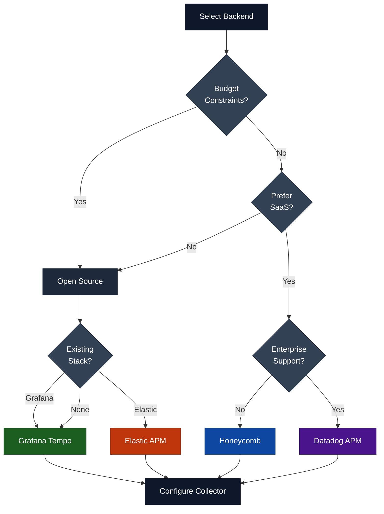
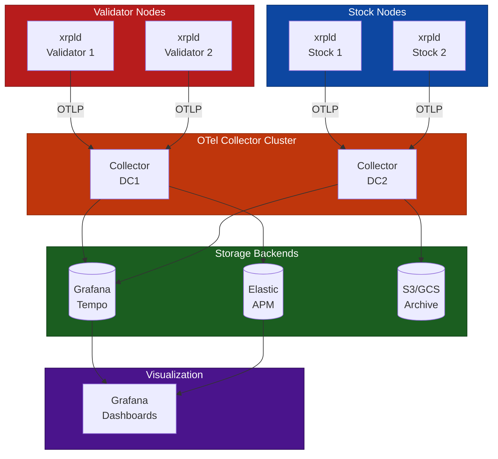
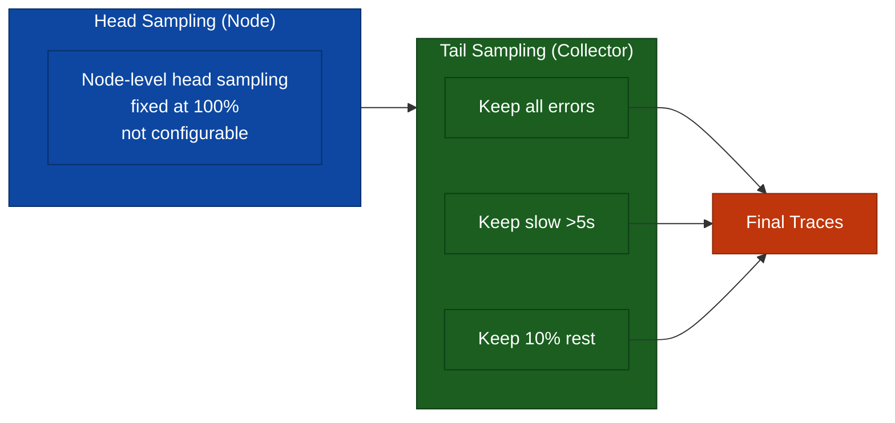
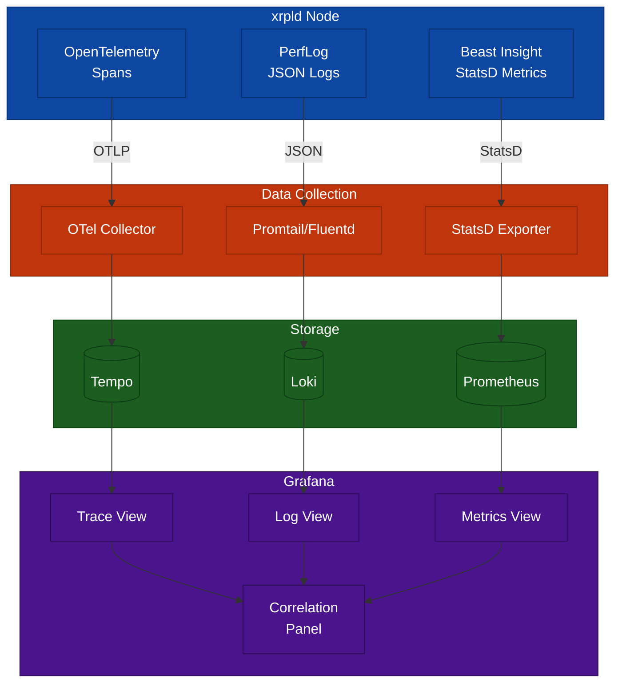

# Observability Backend Recommendations

> **Parent Document**: [OpenTelemetryPlan.md](./OpenTelemetryPlan.md)
> **Related**: [Implementation Phases](./06-implementation-phases.md) | [Appendix](./08-appendix.md)

---

## 7.1 Development/Testing Backends

> **OTLP** = OpenTelemetry Protocol

| Backend    | Pros                                | Cons                   | Use Case            |
| ---------- | ----------------------------------- | ---------------------- | ------------------- |
| **Tempo**  | Cost-effective, Grafana integration | Requires Grafana stack | Local dev, CI, Prod |
| **Zipkin** | Simple, lightweight                 | Basic features         | Quick prototyping   |

### Quick Start with Tempo

```bash
# Start Tempo with OTLP support
docker run -d --name tempo \
    -p 3200:3200 \
    -p 4317:4317 \
    -p 4318:4318 \
    grafana/tempo:2.6.1
```

---

## 7.2 Production Backends

> **APM** = Application Performance Monitoring

| Backend           | Pros                                      | Cons                   | Use Case                    |
| ----------------- | ----------------------------------------- | ---------------------- | --------------------------- |
| **Grafana Tempo** | Cost-effective, Grafana integration       | Requires Grafana stack | Most production deployments |
| **Elastic APM**   | Full observability stack, log correlation | Resource intensive     | Existing Elastic users      |
| **Honeycomb**     | Excellent query, high cardinality         | SaaS cost              | Deep debugging needs        |
| **Datadog APM**   | Full platform, easy setup                 | SaaS cost              | Enterprise with budget      |

### Backend Selection Flowchart



**Reading the diagram:**

- **Budget Constraints? (Yes)**: Leads to open-source options. If you already run Grafana or Elastic, pick the matching backend; otherwise default to Grafana Tempo.
- **Budget Constraints? (No) → Prefer SaaS?**: If you want a managed service, choose between Datadog (enterprise support) and Honeycomb (developer-focused). If not, fall back to open-source.
- **Terminal nodes (Tempo / Elastic / Honeycomb / Datadog)**: Each represents a concrete backend choice, all of which feed into the same final step.
- **Configure Collector**: Regardless of backend, you always finish by configuring the OTel Collector to export to your chosen destination.

---

## 7.3 Recommended Production Architecture

> **OTLP** = OpenTelemetry Protocol | **APM** = Application Performance Monitoring | **HA** = High Availability



**Reading the diagram:**

- **Validator / Stock Nodes**: All xrpld nodes emit trace data via OTLP. Validators and stock nodes are grouped separately because they may reside in different network zones.
- **Collector Cluster (DC1, DC2)**: Regional collectors receive OTLP from nodes in their datacenter, apply processing (sampling, enrichment), and fan out to multiple backends. Enrichment includes deployment-tier tagging: each collector stamps `deployment.environment` and (as a fallback) `xrpl.network.type` so one Grafana stack can filter data from many collectors by tier.
- **Storage Backends**: Tempo and Elastic provide queryable trace storage; S3/GCS Archive provides long-term cold storage for compliance or post-incident analysis.
- **Grafana Dashboards**: The single visualization layer that queries both Tempo and Elastic, giving operators a unified view of all traces.
- **Data flow direction**: Nodes → Collectors → Storage → Grafana. Each arrow represents a network hop; minimizing collector-to-backend hops reduces latency.

> **Note**: Production deployments should use multiple collector instances behind a load balancer for high availability. The diagram shows a simplified single-collector topology for clarity.

---

## 7.4 Architecture Considerations

### 7.4.1 Collector Placement

| Strategy      | Description          | Pros                     | Cons                    |
| ------------- | -------------------- | ------------------------ | ----------------------- |
| **Sidecar**   | Collector per node   | Isolation, simple config | Resource overhead       |
| **DaemonSet** | Collector per host   | Shared resources         | Complexity              |
| **Gateway**   | Central collector(s) | Centralized processing   | Single point of failure |

**Recommendation**: Use **Gateway** pattern with regional collectors for xrpld networks:

- One collector cluster per datacenter/region
- Tail-based sampling at collector level
- Multiple export destinations for redundancy

### 7.4.2 Sampling Strategy



**Reading the diagram:**

- **Head Sampling (Node)**: xrpld pins head sampling at 100% (sample everything) and does not expose a configurable ratio. This is intentional: a per-node ratio would let different nodes make divergent keep/drop decisions for the same distributed trace, producing broken/partial traces. xrpld uses a `ParentBased` sampler so spans inheriting a remote parent honor the upstream decision. Volume reduction is delegated to the collector's tail sampling.
- **Tail Sampling (Collector)**: The second filter -- the collector inspects completed traces and applies rules: keep all errors, keep anything slower than 5 seconds, and keep 10% of the remainder.
- **Arrow head → tail**: All head-sampled traces flow to the collector, where tail sampling further reduces volume while preserving the most valuable data.
- **Final Traces**: The output after both sampling stages; this is what gets stored and queried. The two-stage approach balances cost with debuggability.

### 7.4.3 Data Retention

| Environment | Hot Storage | Warm Storage | Cold Archive |
| ----------- | ----------- | ------------ | ------------ |
| Development | 24 hours    | N/A          | N/A          |
| Staging     | 7 days      | N/A          | N/A          |
| Production  | 7 days      | 30 days      | many years   |

---

## 7.5 Integration Checklist

- [ ] Choose primary backend (Tempo recommended for cost/features)
- [ ] Deploy collector cluster with high availability
- [ ] Configure tail-based sampling for error/latency traces
- [ ] Set up Grafana dashboards for trace visualization
- [ ] Configure alerts for trace anomalies
- [ ] Establish data retention policies
- [ ] Test trace correlation with logs and metrics

---

## 7.6 Grafana Dashboard Examples

Pre-built dashboards for xrpld observability.

### 7.6.1 Consensus Health Dashboard

A Tempo-backed dashboard (uid `xrpld-consensus-health`) with four panels, all driven by TraceQL:

- **Consensus Round Duration** (timeseries, ms): average `consensus.round` span duration per node instance, with yellow/red thresholds at 4s/5s.
- **Phase Duration Breakdown** (barchart): average duration of `consensus.phase.*` spans grouped by span name.
- **Proposers per Round** (stat): average of the `span.proposers` attribute on `consensus.round` spans.
- **Recent Slow Rounds (>5s)** (table): `consensus.round` spans filtered to `duration > 5s`.

Each panel's TraceQL query is described inline in its bullet above.

### 7.6.2 Node Overview Dashboard

A Tempo-backed dashboard (uid `xrpld-node-overview`) with four panels:

- **Active Nodes** (stat): count of distinct `resource.service.instance.id` values seen for the `xrpld` service.
- **Total Transactions (1h)** (stat): count of `tx.receive` spans.
- **Error Rate** (gauge, percent): ratio of `status.code=error` spans to all spans, with yellow/red thresholds at 1%/5%.
- **Service Map** (nodeGraph): Tempo-generated service dependency graph.

### 7.6.3 Alert Rules

Grafana provisions three TraceQL-based alert rules (group `xrpld-tracing-alerts`, evaluated every 1m) against the Tempo datasource:

- **Consensus Round Slow** (warning, `for: 5m`): fires when average `consensus.round` duration exceeds 5s.

  ```
  {resource.service.name="xrpld" && name="consensus.round"} | avg(duration) > 5s
  ```

- **RPC Error Rate Spike** (critical, `for: 2m`): fires when the error rate across `rpc.command.*` spans exceeds 5%. Error _rate_ is a ratio, so it must divide the error-span rate by the total-span rate — a single TraceQL `rate()` returns spans/second, not a percentage, and would fire on traffic volume alone. This uses span metrics emitted by the collector's `spanmetrics` connector (Prometheus datasource), not a TraceQL query:

  ```
  sum(rate(traces_spanmetrics_calls_total{service_name="xrpld", span_name=~"rpc.command.*", status_code="STATUS_CODE_ERROR"}[5m]))
  /
  sum(rate(traces_spanmetrics_calls_total{service_name="xrpld", span_name=~"rpc.command.*"}[5m]))
  > 0.05
  ```

- **Transaction Throughput Drop** (warning, `for: 10m`): fires when the `tx.receive` span rate falls below 10/s.

  ```
  {resource.service.name="xrpld" && name="tx.receive"} | rate() < 10
  ```

> **Note**: The Consensus Round Slow and Transaction Throughput Drop rules use TraceQL aggregates (`avg(duration)`, `rate()`), which require Tempo 2.3+ with TraceQL metrics enabled. Verify aggregate query support in your Tempo version before provisioning. The RPC Error Rate Spike rule instead queries Prometheus span metrics (collector `spanmetrics` connector), so it needs that connector enabled in the collector pipeline.

---

## 7.7 PerfLog and Insight Correlation

> **OTLP** = OpenTelemetry Protocol

How to correlate OpenTelemetry traces with existing xrpld observability.

### 7.7.1 Correlation Architecture



**Reading the diagram:**

- **xrpld Node (three sources)**: A single node emits three independent data streams -- OpenTelemetry spans, PerfLog JSON logs, and Beast Insight StatsD metrics.
- **Data Collection layer**: Each stream has its own collector -- OTel Collector for spans, Promtail/Fluentd for logs, and a StatsD exporter for metrics. They operate independently.
- **Storage layer (Tempo, Loki, Prometheus)**: Each data type lands in a purpose-built store optimized for its query patterns (trace search, log grep, metric aggregation).
- **Grafana Correlation Panel**: The key integration point -- Grafana queries all three stores and links them via shared fields (`trace_id`, `tx_hash`, `ledger_seq`), enabling a single-pane debugging experience.

### 7.7.2 Correlation Fields

| Source      | Field               | Link To       | Purpose                    |
| ----------- | ------------------- | ------------- | -------------------------- |
| **Trace**   | `trace_id`          | Logs          | Find log entries for trace |
| **Trace**   | `tx_hash`           | Logs, Metrics | Find TX-related data       |
| **Trace**   | `ledger_seq`        | Logs          | Find ledger-related logs   |
| **PerfLog** | `trace_id` (new)    | Traces        | Jump to trace from log     |
| **PerfLog** | `ledger_seq`        | Traces        | Find consensus trace       |
| **Insight** | `exemplar.trace_id` | Traces        | Jump from metric spike     |

### 7.7.3 Example: Debugging a Slow Transaction

**Step 1: Find the trace**

```
# In Grafana Explore with Tempo
{resource.service.name="xrpld" && span.tx_hash="ABC123..."}
```

**Step 2: Get the trace_id from the trace view**

```
Trace ID: 4bf92f3577b34da6a3ce929d0e0e4736
```

**Step 3: Find related PerfLog entries**

```
# In Grafana Explore with Loki
{job="xrpld"} |= "4bf92f3577b34da6a3ce929d0e0e4736"
```

**Step 4: Check Insight metrics for the time window**

```
# In Grafana with Prometheus
rate(xrpld_tx_applied_total[1m])
  @ timestamp_from_trace
```

### 7.7.4 Unified Dashboard Example

A single dashboard (uid `xrpld-unified`) that ties traces, metrics, and logs together across the Tempo, Prometheus, and Loki datasources:

- **Transaction Latency (Traces)** (timeseries, Tempo): `histogram_over_time(duration)` of `tx.receive` spans.
- **Transaction Rate (Metrics)** (timeseries, Prometheus): `rate(xrpld_tx_received_total[5m])` per instance, with a data link that opens the matching `tx.receive` traces in Tempo.
- **Recent Logs** (logs, Loki): `{job="xrpld"} | json`.
- **Trace Search** (table, Tempo): all `xrpld` traces, with per-row data links on `traceID` that jump to the trace in Tempo and to the correlated logs in Loki (`{job="xrpld"} |= "<traceID>"`).

The cross-datasource data links are what make this a single-pane debugging view; the correlation fields they rely on are listed in section 7.7.2.

---

_Previous: [Implementation Phases](./06-implementation-phases.md)_ | _Next: [Appendix](./08-appendix.md)_ | _Back to: [Overview](./OpenTelemetryPlan.md)_
