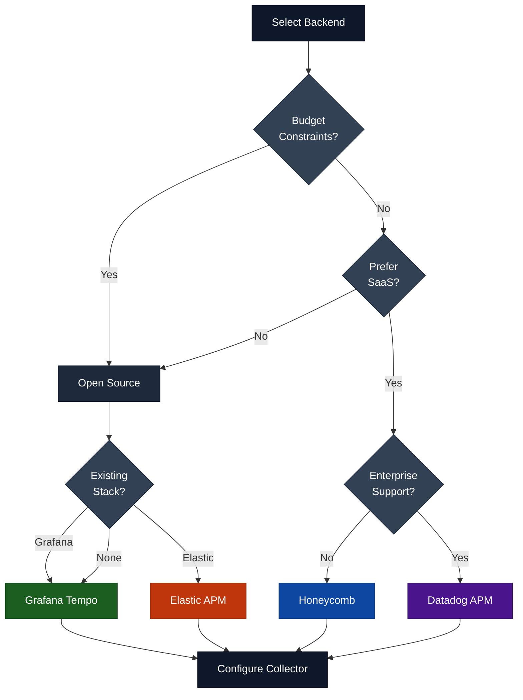
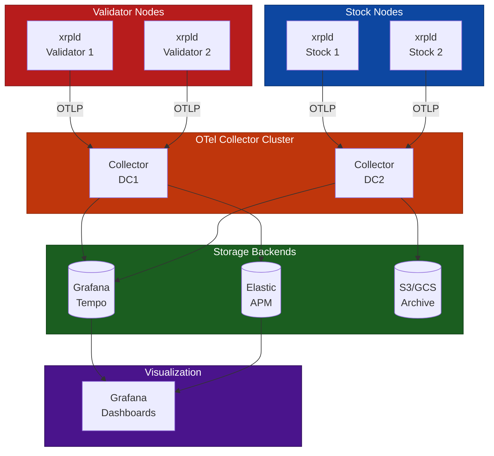
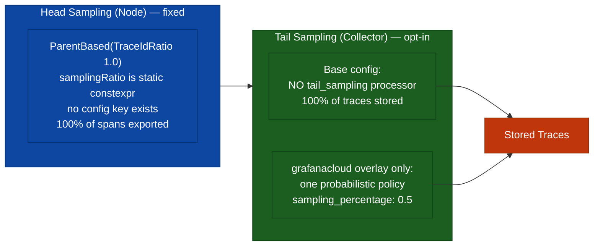
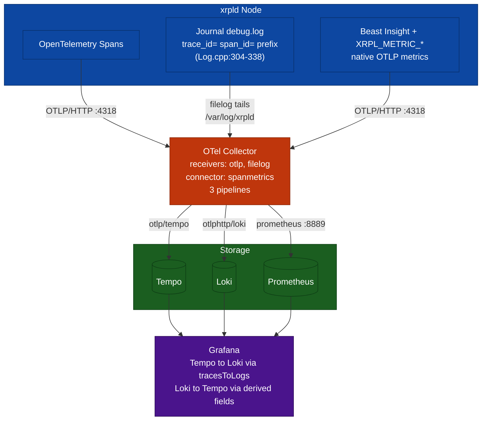

# Observability Backend Recommendations

> **Parent Document**: [OpenTelemetryPlan.md](./OpenTelemetryPlan.md)
> **Related**: [Implementation Phases](./06-implementation-phases.md) | [Appendix](./08-appendix.md)

---

## 7.1 Development/Testing Backends

> **OTLP** = OpenTelemetry Protocol

| Backend    | Pros                                | Cons                   | Use Case            |
| ---------- | ----------------------------------- | ---------------------- | ------------------- |
| **Tempo**  | Cost-effective, Grafana integration | Requires Grafana stack | Local dev, CI, Prod |
| **Zipkin** | Simple, lightweight                 | Basic features         | Quick prototyping   |

### Quick Start with Tempo

```bash
# Start Tempo with OTLP support.
# Version pinned to match docker/telemetry/docker-compose.yml:55 — keep the
# two in step, since Tempo config keys change between minor releases.
#
# Only 4317 (OTLP/gRPC) is published: docker/telemetry/tempo.yaml:28-33
# declares a single distributor receiver, `otlp.protocols.grpc` on
# 0.0.0.0:4317. There is no `http` protocol block, so nothing listens on 4318
# and publishing it would give you a port that silently refuses connections.
# 3200 is Tempo's HTTP API/query port (tempo.yaml:17-18), not an ingest port.
docker run -d --name tempo \
    -p 3200:3200 \
    -p 4317:4317 \
    grafana/tempo:2.9.4
```

> Note that xrpld itself exports OTLP/**HTTP** only (§2.2.1), so it cannot send
> to this container directly — the collector is what bridges HTTP ingest to
> Tempo's gRPC receiver (`otlp/tempo` → `tempo:4317`). A bare Tempo container is
> useful for replaying traces from another OTLP/gRPC producer, not as an xrpld
> endpoint.

> In practice, prefer the full stack —
> `docker compose -f docker/telemetry/docker-compose.yml up -d` — over a bare
> Tempo container. Most shipped dashboards query Prometheus span metrics, which
> need the collector and Prometheus services too. See
> [05 §5.6](./05-configuration-reference.md).

---

## 7.2 Production Backends

> **APM** = Application Performance Monitoring

| Backend           | Pros                                      | Cons                   | Use Case                    |
| ----------------- | ----------------------------------------- | ---------------------- | --------------------------- |
| **Grafana Tempo** | Cost-effective, Grafana integration       | Requires Grafana stack | Most production deployments |
| **Elastic APM**   | Full observability stack, log correlation | Resource intensive     | Existing Elastic users      |
| **Honeycomb**     | Excellent query, high cardinality         | SaaS cost              | Deep debugging needs        |
| **Datadog APM**   | Full platform, easy setup                 | SaaS cost              | Enterprise with budget      |

### Backend Selection Flowchart



**Reading the diagram:**

- **Budget Constraints? (Yes)**: Leads to open-source options. If you already run Grafana or Elastic, pick the matching backend; otherwise default to Grafana Tempo.
- **Budget Constraints? (No) → Prefer SaaS?**: If you want a managed service, choose between Datadog (enterprise support) and Honeycomb (developer-focused). If not, fall back to open-source.
- **Terminal nodes (Tempo / Elastic / Honeycomb / Datadog)**: Each represents a concrete backend choice, all of which feed into the same final step.
- **Configure Collector**: Regardless of backend, you always finish by configuring the OTel Collector to export to your chosen destination.

---

## 7.3 Recommended Production Architecture

> **OTLP** = OpenTelemetry Protocol | **APM** = Application Performance Monitoring | **HA** = High Availability



**Reading the diagram:**

- **Validator / Stock Nodes**: All xrpld nodes emit trace data via OTLP. Validators and stock nodes are grouped separately because they may reside in different network zones.
- **Collector Cluster (DC1, DC2)**: Regional collectors receive OTLP from nodes in their datacenter, apply processing (sampling, enrichment), and fan out to multiple backends. Enrichment includes deployment-tier tagging: each collector stamps `deployment.environment` and (as a fallback) `xrpl.network.type` so one Grafana stack can filter data from many collectors by tier.
- **Storage Backends**: Tempo and Elastic provide queryable trace storage; S3/GCS Archive provides long-term cold storage for compliance or post-incident analysis.
- **Grafana Dashboards**: The single visualization layer that queries both Tempo and Elastic, giving operators a unified view of all traces.
- **Data flow direction**: Nodes → Collectors → Storage → Grafana. Each arrow represents a network hop; minimizing collector-to-backend hops reduces latency.

> **Note**: Production deployments should use multiple collector instances behind a load balancer for high availability. The diagram shows a simplified single-collector topology for clarity.

---

## 7.4 Architecture Considerations

### 7.4.1 Collector Placement

| Strategy      | Description          | Pros                     | Cons                    |
| ------------- | -------------------- | ------------------------ | ----------------------- |
| **Sidecar**   | Collector per node   | Isolation, simple config | Resource overhead       |
| **DaemonSet** | Collector per host   | Shared resources         | Complexity              |
| **Gateway**   | Central collector(s) | Centralized processing   | Single point of failure |

**Recommendation**: Use **Gateway** pattern with regional collectors for xrpld networks:

- One collector cluster per datacenter/region
- Tail-based sampling at collector level
- Multiple export destinations for redundancy

### 7.4.2 Sampling Strategy

An earlier version of this section described a three-policy tail sampler (keep
all errors / keep anything >5s / keep 10% of the rest). **No such sampler
exists in this repo.** What ships is below.



**Reading the diagram:**

- **Head Sampling (Node)** — fixed at 100% and genuinely not configurable:
  `Telemetry.h:234` declares `static constexpr double samplingRatio = 1.0;` and
  `TelemetryConfig.cpp:139` records that there is nothing to parse. This is
  intentional: a per-node ratio would let different nodes make divergent
  keep/drop decisions for the same distributed trace, producing broken/partial
  traces. The ratio sampler is wrapped in a `ParentBased` sampler so spans
  inheriting a remote parent honour the upstream decision.
- **Tail Sampling (Collector)** — the base config
  (`docker/telemetry/otel-collector-config.yaml`) has **no** `tail_sampling`
  processor, so the local and CI stacks keep 100% of traces. The only shipped
  policy lives in `otel-collector-config.grafanacloud.yaml:60-67`, wired into
  the **`traces/store`** pipeline (`:259-261`) — the overlay has no pipeline
  named `traces`; it splits the trace stream into `traces/metrics` (unsampled,
  feeds `spanmetrics`) and `traces/store` (sampled, feeds Tempo and Grafana
  Cloud). See [05 §5.5.2](./05-configuration-reference.md) for the full overlay
  delta. The policy is a single `probabilistic` at **0.5%**,
  `decision_wait: 10s`, `num_traces: 50000`. There are no error or latency
  carve-outs.
- **Why 0.5% does not damage the dashboards**: the policy is applied on the
  trace-storage branch only. The `spanmetrics` connector runs on a separate
  branch that still sees every span, so `span_calls_total` and
  `span_duration_milliseconds_*` remain exact. Sampling costs you individual
  example traces in Tempo, not metric accuracy.
- **If you want the error/latency policies**: they are a reasonable thing to
  add, but they must be written — and `decision_wait` sized so a trace's spans
  have all arrived before the policy evaluates it.

#### Companion guard: `memory_limiter` (recommended, not configured)

Tail sampling bounds what the collector **stores**; it does not bound what the
collector **buffers**. `tail_sampling` is the opposite of cheap here — it holds
up to `num_traces` (50 000) traces in memory for `decision_wait` before
deciding — and the `spanmetrics` connector keeps a live series cache on top of
that. A production gateway collector should therefore also run a
[`memory_limiter`](https://github.com/open-telemetry/opentelemetry-collector/blob/main/processor/memorylimiterprocessor/README.md)
processor as an OOM guard: it applies backpressure (refusing new data with a
retryable error, which the node's `sending_queue` will retry) instead of letting
the process be killed and losing every buffered trace.

> **Not currently configured anywhere in this repo.** Neither
> `otel-collector-config.yaml` nor
> `otel-collector-config.grafanacloud.yaml` declares a `memory_limiter`, and
> neither compose file sets a container memory limit — so today a traffic spike
> is bounded only by host RAM. This is a recommendation for real deployments,
> recorded here because [05 §5.5.1](./05-configuration-reference.md) lists
> `memory_limiter` among the processors deliberately **absent** from the shipped
> config and that must not be read as "not needed". Placement rules if you add
> it: it must be the **first** processor in every pipeline (ahead of `batch`),
> and `limit_mib` must sit below the container/cgroup limit with headroom for
> the sampling and spanmetrics caches.

### 7.4.3 Data Retention

| Environment                 | Hot Storage | Warm Storage | Cold Archive | Source                                                       |
| --------------------------- | ----------- | ------------ | ------------ | ------------------------------------------------------------ |
| Development (local stack)   | **1 hour**  | N/A          | N/A          | `tempo.yaml:40` — `compactor.compaction.block_retention: 1h` |
| Staging (recommendation)    | 7 days      | N/A          | N/A          | Not configured in this repo                                  |
| Production (recommendation) | 7 days      | 30 days      | many years   | Not configured in this repo                                  |

> **The local stack keeps traces for 1 hour, not 24.** `block_retention: 1h`
> is deliberate — it bounds disk for a long-running dev node — but it means a
> trace you found this morning is gone by lunchtime. Raise
> `block_retention` in `docker/telemetry/tempo.yaml` before starting any
> investigation that needs to span a working day. The staging and production
> rows are recommendations only; nothing in this repo provisions them.

---

## 7.5 Integration Checklist

- [ ] Choose primary backend (Tempo recommended for cost/features)
- [ ] Deploy collector cluster with high availability
- [ ] Configure tail-based sampling for error/latency traces
- [ ] Set up Grafana dashboards for trace visualization
- [ ] Configure alerts for trace anomalies
- [ ] Establish data retention policies
- [ ] Test trace correlation with logs and metrics

---

## 7.6 Grafana Dashboards and Alerts

> **Superseded.** This section was written in Phase 1a, before any dashboard
> shipped, and described three hypothetical boards (`xrpld-consensus-health`,
> `xrpld-node-overview`, `xrpld-unified`) and three TraceQL alert rules in a
> group called `xrpld-tracing-alerts`. **None of those uids or rule names exist
> anywhere in the repo.** What actually ships is 15 dashboards and 13 alert
> rules, and both are Prometheus-first rather than TraceQL-first. The
> authoritative references are:
>
> | For                                              | See                                                                                                       |
> | ------------------------------------------------ | --------------------------------------------------------------------------------------------------------- |
> | Dashboard and panel inventory, per-panel queries | [09-data-collection-reference.md](./09-data-collection-reference.md)                                      |
> | Alert catalogue, thresholds and response steps   | `docs/telemetry-runbook.md`                                                                               |
> | Files on disk                                    | `docker/telemetry/grafana/dashboards/*.json`, `docker/telemetry/grafana/provisioning/alerting/rules.yaml` |
>
> The rest of this section records only the facts a reader needs so as not to
> chase the removed names.

### 7.6.1 Shipped Dashboards

15 JSON dashboards are provisioned into Grafana folder `xrpld`. The uids are
bare — there is no `xrpld-` prefix:

`consensus-health`, `fee-market`, `job-queue`, `ledger-data-sync`,
`ledger-operations`, `log-derived-insights`, `network-traffic`, `node-health`,
`overlay-traffic-detail`, `peer-network`, `peer-quality`, `rpc-pathfinding`,
`rpc-performance`, `transaction-overview`, `validator-health`.

> **Panel-count convention** (shared with [05 §5.8.3](./05-configuration-reference.md)):
> counts are of **data panels only**. `type: "row"` collapsible headers are
> excluded because a row carries no query, so a board's raw `panels` array is
> longer than its stated count.

`consensus-health.json` is a useful calibration for how far this section drifted:
where the removed text described "four TraceQL panels", the real board carries **22
data panels** in 4 rows (26 `panels` array entries) — 19 Prometheus targets
against `${DS_PROMETHEUS}` and 9 TraceQL targets against `${DS_TEMPO}`. Tempo is
used for trace _drill-down_; the time series come from span metrics.

### 7.6.2 Shipped Alert Rules

`docker/telemetry/grafana/provisioning/alerting/rules.yaml` provisions **13
rules in 5 groups**, all in folder `xrpld`, all `interval: 1m`, and all
**PromQL** — there are zero TraceQL alert rules.

| Group              | Rules                                                                       |
| ------------------ | --------------------------------------------------------------------------- |
| `xrpld-consensus`  | `LedgerHistoryMismatch`, `LedgerCloseStalled`, `ValidatedLedgerStale`       |
| `xrpld-validator`  | `ValidationsMissed`, `ValidationsNotChecked`                                |
| `xrpld-jobqueue`   | `JobQueueTxOverflow`, `JobQueueLatencyHigh`, `NodeStoreIOLatencyHigh`       |
| `xrpld-node-state` | `NodeStateFlapping`, `NodeNotFull`                                          |
| `xrpld-overlay`    | `ManifestJobQueueConvoy`, `ManifestFloodInbound`, `PeerResourceDisconnects` |

> Two placements are worth noting because they are not what the rule name
> suggests. `ValidatedLedgerStale` is grouped under `xrpld-consensus`, not
> `xrpld-validator` — it fires on any node whose validated-ledger sequence stops
> advancing, which is a chain-progress symptom rather than a validator-identity
> one. `NodeStoreIOLatencyHigh` is grouped under `xrpld-jobqueue`, not
> `xrpld-node-state` — slow NodeStore I/O manifests first as job-queue backlog,
> so grouping it there keeps the cause and its effect in one notification.

Thresholds, measured baselines and response procedures are in the runbook's
alert catalogue, not here.

### 7.6.3 Writing New Rules: the metric name

If you add a span-metric alert, the metric is **`span_calls_total`**. This stack
sets the `spanmetrics` connector's `namespace: "span"`
(`otel-collector-config.yaml:114`); the connector's own default namespace is
**empty**, so without that setting the names would be the bare `calls_total` /
`duration_milliseconds_*`. 7 of the 15 dashboards already query the `span_`
names. Durations are likewise `span_duration_milliseconds_bucket`.

> **`traces_spanmetrics_*` is a different producer, not the connector's
> default.** That family is emitted by **Tempo's** `metrics_generator`
> `span-metrics` processor (`tempo.yaml:70-76`), which is a separate
> implementation from the collector connector. It does not exist in this stack
> either: the generator's `remote_write` is commented out (`tempo.yaml:53-56`)
> and `prometheus.yml:6-9` scrapes only `otel-collector:8889`, so nothing stores
> what Tempo generates. Do not write a rule against `traces_spanmetrics_*` and
> do not describe `namespace: "span"` as overriding it.

An RPC error-rate rule, written against the real metric name, looks like this.
Note that error _rate_ is a ratio, so it must divide the error-span rate by the
total-span rate — a bare rate returns calls/second and would fire on traffic
volume alone:

```
sum(rate(span_calls_total{service_name="xrpld", span_name=~"rpc.command.*", status_code="STATUS_CODE_ERROR"}[5m]))
/
sum(rate(span_calls_total{service_name="xrpld", span_name=~"rpc.command.*"}[5m]))
> 0.05
```

> **Prefer PromQL over TraceQL for alerting.** TraceQL aggregates
> (`avg(duration)`, `rate()`) need Tempo 2.3+ with TraceQL metrics enabled, are
> slower, and are distorted by any tail sampling in the path (§7.4.2). Span
> metrics are computed pre-sampling and cost nothing extra to query. That is
> why all 13 shipped rules are PromQL.

---

## 7.7 PerfLog and Insight Correlation

> **OTLP** = OpenTelemetry Protocol

How to correlate OpenTelemetry traces with existing xrpld observability.

### 7.7.1 Correlation Architecture

There is **one** collection agent, not three. Earlier drafts of this diagram
routed logs through "Promtail/Fluentd" and metrics through a "StatsD Exporter";
neither exists in this stack. Logs are read by the OTel Collector's own
`filelog` receiver, and `beast::insight` metrics arrive at the same collector
over OTLP (`[insight] server=otel`). The single-agent shape is the point: one
process, one config file, one place to add redaction or tier tagging.



**Reading the diagram:**

- **xrpld Node (three signals, one transport)**: spans and metrics both leave over OTLP/HTTP on port 4318. Logs do not leave the node at all — the node just writes `debug.log`, and the journal sink prefixes `trace_id=`/`span_id=` whenever a span is active (`Log.cpp:304-338`).
- **OTel Collector (single agent)**: an `otlp` receiver takes spans and metrics; a `filelog` receiver tails `/var/log/xrpld/*/debug.log` and regex-parses the trace/span IDs out of each line. A `spanmetrics` connector derives RED metrics from the trace stream and feeds them into the metrics pipeline. Three pipelines, three exporters — see [05 §5.5.1](./05-configuration-reference.md).
- **PerfLog is not in this picture.** It still writes `perf.log`, but nothing collects it and it carries no trace ID; the `setTraceId` hook once planned for it was never built ([02 §2.6.5](./02-design-decisions.md)).
- **StatsD is not in this picture either.** It remains a supported `[insight] server=` choice, but selecting it takes metrics _out_ of this pipeline and requires a StatsD receiver you would have to add yourself — the compose file's StatsD port mapping is commented out.
- **Grafana**: correlation is bidirectional and configured in the datasources, not in a bespoke panel — Tempo's `tracesToLogs` (`filterByTraceID: true`) jumps trace → logs, and `loki.yaml`'s derived fields jump log → trace.

### 7.7.2 Correlation Fields

| Source          | Field                 | Link To | Status                                                                                                                                                                                                                                                            |
| --------------- | --------------------- | ------- | ----------------------------------------------------------------------------------------------------------------------------------------------------------------------------------------------------------------------------------------------------------------- |
| **Trace**       | `trace_id`            | Logs    | **Live.** Tempo `tracesToLogs`, `filterByTraceID: true`                                                                                                                                                                                                           |
| **Trace**       | `tx_hash`             | —       | Live as a span attribute for search; **not** used as a cross-signal join key (`tags: []`)                                                                                                                                                                         |
| **Trace**       | `ledger_seq`          | —       | Live as a span attribute; not a join key                                                                                                                                                                                                                          |
| **Journal log** | `trace_id`, `span_id` | Traces  | **Live.** Emitted by `Log.cpp:304-338` into `debug.log`, parsed by the collector's `filelog` receiver, jumped via `loki.yaml` derived fields                                                                                                                      |
| **PerfLog**     | `trace_id`            | Traces  | **Not implemented.** PerfLog output has no trace ID; the planned `setTraceId` hook was never built. Use the journal log instead                                                                                                                                   |
| **Insight**     | `exemplar.trace_id`   | Traces  | **Not implemented.** No exemplar configuration exists anywhere in the code or collector config — no `exemplar_filter` on the SDK side, no `exemplarTraceIdDestinations` on the Prometheus datasource. Metric spike → trace jumps must be done by time range today |

### 7.7.3 Example: Debugging a Slow Transaction

**Step 1: Find the trace**

```
# In Grafana Explore with Tempo
{resource.service.name="xrpld" && span.tx_hash="ABC123..."}
```

**Step 2: Get the trace_id from the trace view**

```
Trace ID: 4bf92f3577b34da6a3ce929d0e0e4736
```

**Step 3: Find related log lines**

```
# In Grafana Explore with Loki. `service_name` is the promoted stream label;
# do NOT use {job="xrpld"} — see the note below.
{service_name="xrpld"} |= "4bf92f3577b34da6a3ce929d0e0e4736"
```

These are journal (`debug.log`) lines, not PerfLog lines — see §7.7.2.

> **Known issue — `{job="xrpld"}` does not select anything.** The collector's
> `resource/logs` processor does upsert a `job=xrpld` resource attribute
> (`otel-collector-config.yaml:62-70`), explicitly so that operators could paste
> `{job="xrpld"}`. Loki does not cooperate: on OTLP ingest it promotes only an
> **allow-listed** set of resource attributes to indexed stream labels
> (`service.name`, `service.namespace`, `service.instance.id`,
> `deployment.environment`, `k8s.*`, `cloud.*`), and `job` is not on it. This
> repo mounts no Loki config override (`docker-compose.yml:75` uses the image's
> built-in `local-config.yaml`), so `job` lands in **structured metadata** —
> queryable only with a `|` filter after a selector, never as the selector
> itself. A `{job="xrpld"}` query returns empty with no error, which is why this
> is easy to miss. `docs/telemetry-runbook.md:2533` says the same, and all 38
> Loki queries in the shipped dashboards (35 panel targets + 3 template
> variables) select on `service_name` — zero use `job`. Fix options:
> drop the ineffective `job` upsert, or mount a Loki config adding `job` to
> `distributor.otlp_config.resource_attributes`.

**Step 4: Check metrics for the time window**

```
# In Grafana with Prometheus. Span-derived RED metrics for the transaction
# pipeline (namespace "span" — see 7.6.3):
sum(rate(span_calls_total{span_name="tx.process"}[1m])) by (service_instance_id)

# Error share of the same pipeline. Note !~"tesSUCCESS|" — NOT
# !="tesSUCCESS" — so spans that carry no ter_result are excluded:
sum(rate(span_calls_total{span_name="tx.process", ter_result!~"tesSUCCESS|"}[5m]))
/
sum(rate(span_calls_total{span_name="tx.process"}[5m]))
```

> **Why the regex form.** An absent Prometheus label is indistinguishable from
> the empty string, and `tx.process` can end **without** a `ter_result`: the span
> is opened at `NetworkOPs.cpp:1416`, but `processTransaction()` returns early
> when `preProcessTransaction()` rejects the transaction (`:1437-1438`), and
> `doTransactionAsync()` returns early when the transaction is already applying
> (`:1461-1462`) — both before the only setter, at `:1674`. Those series arrive
> with `ter_result=""`, which `!="tesSUCCESS"` happily counts as a failure and
> inflates the ratio. `!~"tesSUCCESS|"` excludes the empty value via the trailing
> `|` alternative. This is the form `docs/telemetry-runbook.md:1198` and the
> `transaction-overview.json` stage-failure panels already use; apply it to any
> new `ter_result` predicate.

> Earlier drafts used `rate(xrpld_tx_applied_total[1m])` and
> `rate(xrpld_tx_received_total[5m])`. **Neither metric exists** — there is no
> `xrpld_`-prefixed metric family at all, because `OTelCollector::formatName()`
> deliberately prepends no prefix (`OTelCollector.cpp:855-866`); the OTel
> resource `service.name` identifies the service instead. Use the `span_*`
> families above (verified in `transaction-overview.json` and
> `rpc-performance.json`) or the native `XRPL_METRIC_*` instrument names listed
> in [09-data-collection-reference.md](./09-data-collection-reference.md).

### 7.7.4 Unified Dashboard

> **Superseded.** No `xrpld-unified` dashboard exists. The single-pane view it
> described is instead delivered by two things that did ship: the
> **`log-derived-insights`** dashboard (31 data panels in 10 rows, all
> Loki-backed — 41 `panels` array entries; see the counting convention in
> §7.6.1) plus the
> bidirectional datasource links (Tempo `tracesToLogs` → Loki, `loki.yaml`
> derived fields → Tempo), which let you cross signals from _any_ board rather
> than only from one dedicated dashboard.
>
> The correlation fields those links rely on — and which of them are actually
> implemented — are in §7.7.2. For the full board inventory see
> [09-data-collection-reference.md](./09-data-collection-reference.md).

---

_Previous: [Implementation Phases](./06-implementation-phases.md)_ | _Next: [Appendix](./08-appendix.md)_ | _Back to: [Overview](./OpenTelemetryPlan.md)_
