# Appendix

> **Parent Document**: [OpenTelemetryPlan.md](./OpenTelemetryPlan.md)
> **Related**: [Observability Backends](./07-observability-backends.md)

---

## 8.1 Glossary

> **OTLP** = OpenTelemetry Protocol | **TxQ** = Transaction Queue

| Term                  | Definition                                                 |
| --------------------- | ---------------------------------------------------------- |
| **Span**              | A unit of work with start/end time, name, and attributes   |
| **Trace**             | A collection of spans representing a complete request flow |
| **Trace ID**          | 128-bit unique identifier for a trace                      |
| **Span ID**           | 64-bit unique identifier for a span within a trace         |
| **Context**           | Carrier for trace/span IDs across boundaries               |
| **Propagator**        | Component that injects/extracts context                    |
| **Sampler**           | Decides which traces to record                             |
| **Exporter**          | Sends spans to backend                                     |
| **Collector**         | Receives, processes, and forwards telemetry                |
| **OTLP**              | OpenTelemetry Protocol (wire format)                       |
| **W3C Trace Context** | Standard HTTP headers for trace propagation                |
| **Baggage**           | Key-value pairs propagated across service boundaries       |
| **Resource**          | Entity producing telemetry (service, host, etc.)           |
| **Instrumentation**   | Code that creates telemetry data                           |

### rippled-Specific Terms

| Term              | Definition                                                    |
| ----------------- | ------------------------------------------------------------- |
| **Overlay**       | P2P network layer managing peer connections                   |
| **Consensus**     | XRP Ledger consensus algorithm (RCL)                          |
| **Proposal**      | Validator's suggested transaction set for a ledger            |
| **Validation**    | Validator's signature on a closed ledger                      |
| **HashRouter**    | Component for transaction deduplication                       |
| **JobQueue**      | Thread pool for asynchronous task execution                   |
| **PerfLog**       | Existing performance logging system in rippled                |
| **Beast Insight** | Existing metrics framework in rippled                         |
| **PathFinding**   | Payment path computation engine for cross-currency payments   |
| **TxQ**           | Transaction queue managing fee-based prioritization           |
| **LoadManager**   | Dynamic fee escalation based on network load                  |
| **SHAMap**        | SHA-256 hash-based map (Merkle trie variant) for ledger state |

---

## 8.2 Span Hierarchy Visualization

> **TxQ** = Transaction Queue

```mermaid
flowchart TB
    subgraph trace["Trace: Transaction Lifecycle"]
        rpc["rpc.request<br/>(entry point)"]
        validate["tx.validate"]
        relay["tx.relay<br/>(parent span)"]

        subgraph peers["Peer Spans"]
            p1["peer.send<br/>Peer A"]
            p2["peer.send<br/>Peer B"]
            p3["peer.send<br/>Peer C"]
        end

        subgraph pathfinding["PathFinding Spans"]
            pathfind["pathfind.request"]
            pathcomp["pathfind.compute"]
        end

        consensus["consensus.round"]
        apply["tx.apply"]

        subgraph txqueue["TxQ Spans"]
            txq["txq.enqueue"]
            txqApply["txq.apply"]
        end

        feeCalc["fee.escalate"]
    end

    subgraph validators["Validator Spans"]
        valFetch["validator.list.fetch"]
        valManifest["validator.manifest"]
    end

    rpc --> validate
    rpc --> pathfind
    pathfind --> pathcomp
    validate --> relay
    relay --> p1
    relay --> p2
    relay --> p3
    p1 -.->|"context propagation"| consensus
    consensus --> apply
    apply --> txq
    txq --> txqApply
    txq --> feeCalc

    style trace fill:#0f172a,stroke:#020617,color:#fff
    style peers fill:#1e3a8a,stroke:#172554,color:#fff
    style pathfinding fill:#134e4a,stroke:#0f766e,color:#fff
    style txqueue fill:#064e3b,stroke:#047857,color:#fff
    style validators fill:#4c1d95,stroke:#6d28d9,color:#fff
    style rpc fill:#1d4ed8,stroke:#1e40af,color:#fff
    style validate fill:#047857,stroke:#064e3b,color:#fff
    style relay fill:#047857,stroke:#064e3b,color:#fff
    style p1 fill:#0e7490,stroke:#155e75,color:#fff
    style p2 fill:#0e7490,stroke:#155e75,color:#fff
    style p3 fill:#0e7490,stroke:#155e75,color:#fff
    style consensus fill:#fef3c7,stroke:#fde68a,color:#1e293b
    style apply fill:#047857,stroke:#064e3b,color:#fff
    style pathfind fill:#0e7490,stroke:#155e75,color:#fff
    style pathcomp fill:#0e7490,stroke:#155e75,color:#fff
    style txq fill:#047857,stroke:#064e3b,color:#fff
    style txqApply fill:#047857,stroke:#064e3b,color:#fff
    style feeCalc fill:#047857,stroke:#064e3b,color:#fff
    style valFetch fill:#6d28d9,stroke:#4c1d95,color:#fff
    style valManifest fill:#6d28d9,stroke:#4c1d95,color:#fff
```

**Reading the diagram:**

- **rpc.request (blue, top)**: The entry point — every traced transaction starts as an RPC call; this root span is the parent of all downstream work.
- **tx.validate and pathfind.request (green/teal, first fork)**: The RPC request fans out into transaction validation and, for cross-currency payments, a PathFinding branch (`pathfind.request` -> `pathfind.compute`).
- **tx.relay -> Peer Spans (teal, middle)**: After validation, the transaction is relayed to peers A, B, and C in parallel; each `peer.send` is a sibling child span showing fan-out across the network.
- **context propagation (dashed arrow)**: The dotted line from `peer.send Peer A` to `consensus.round` represents the trace context crossing a node boundary — the receiving validator picks up the same `trace_id` and continues the trace.
- **consensus.round -> tx.apply -> TxQ Spans (green, lower)**: Once consensus accepts the transaction, it is applied to the ledger; the TxQ spans (`txq.enqueue`, `txq.apply`, `fee.escalate`) capture queue depth and fee escalation behavior.
- **Validator Spans (purple, detached)**: `validator.list.fetch` and `validator.manifest` are independent workflows for UNL management — they run on their own traces and are linked to consensus via Span Links, not parent-child relationships.

---

## 8.3 References

> **OTLP** = OpenTelemetry Protocol

### OpenTelemetry Resources

1. [OpenTelemetry C++ SDK](https://github.com/open-telemetry/opentelemetry-cpp)
2. [OpenTelemetry Specification](https://opentelemetry.io/docs/specs/otel/)
3. [OpenTelemetry Collector](https://opentelemetry.io/docs/collector/)
4. [OTLP Protocol Specification](https://opentelemetry.io/docs/specs/otlp/)

### Standards

5. [W3C Trace Context](https://www.w3.org/TR/trace-context/)
6. [W3C Baggage](https://www.w3.org/TR/baggage/)
7. [Protocol Buffers](https://protobuf.dev/)

### rippled Resources

8. [rippled Source Code](https://github.com/XRPLF/rippled)
9. [XRP Ledger Documentation](https://xrpl.org/docs/)
10. [rippled Overlay README](https://github.com/XRPLF/rippled/blob/develop/src/xrpld/overlay/README.md)
11. [rippled RPC README](https://github.com/XRPLF/rippled/blob/develop/src/xrpld/rpc/README.md)
12. [rippled Consensus README](https://github.com/XRPLF/rippled/blob/develop/src/xrpld/app/consensus/README.md)

---

## 8.4 Version History

| Version | Date       | Author | Changes                                                        |
| ------- | ---------- | ------ | -------------------------------------------------------------- |
| 1.0     | 2026-02-12 | -      | Initial implementation plan                                    |
| 1.1     | 2026-02-13 | -      | Refactored into modular documents                              |
| 1.2     | 2026-03-24 | -      | Review fixes: accuracy corrections, cross-document consistency |

---

## 8.5 Document Index

### Plan Documents

| Document                                                         | Description                                  |
| ---------------------------------------------------------------- | -------------------------------------------- |
| [OpenTelemetryPlan.md](./OpenTelemetryPlan.md)                   | Master overview and executive summary        |
| [00-tracing-fundamentals.md](./00-tracing-fundamentals.md)       | Distributed tracing concepts and OTel primer |
| [01-architecture-analysis.md](./01-architecture-analysis.md)     | rippled architecture and trace points        |
| [02-design-decisions.md](./02-design-decisions.md)               | SDK selection, exporters, span conventions   |
| [03-implementation-strategy.md](./03-implementation-strategy.md) | Directory structure, performance analysis    |
| [04-code-samples.md](./04-code-samples.md)                       | C++ code examples for all components         |
| [05-configuration-reference.md](./05-configuration-reference.md) | rippled config, CMake, Collector configs     |
| [06-implementation-phases.md](./06-implementation-phases.md)     | Timeline, tasks, risks, success metrics      |
| [07-observability-backends.md](./07-observability-backends.md)   | Backend selection and architecture           |
| [08-appendix.md](./08-appendix.md)                               | Glossary, references, version history        |
| [presentation.md](./presentation.md)                             | Slide deck for OTel plan overview            |

### Task Lists

| Document                                   | Description                                         |
| ------------------------------------------ | --------------------------------------------------- |
| [POC_taskList.md](./POC_taskList.md)       | Proof-of-concept telemetry integration              |
| [Phase2_taskList.md](./Phase2_taskList.md) | RPC layer trace instrumentation                     |
| [Phase3_taskList.md](./Phase3_taskList.md) | Peer overlay & consensus tracing                    |
| [Phase4_taskList.md](./Phase4_taskList.md) | Transaction lifecycle tracing                       |
| [Phase5_taskList.md](./Phase5_taskList.md) | Ledger processing & advanced tracing                |
| [presentation.md](./presentation.md)       | Presentation slides for OpenTelemetry plan overview |

---

_Previous: [Observability Backends](./07-observability-backends.md)_ | _Back to: [Overview](./OpenTelemetryPlan.md)_
