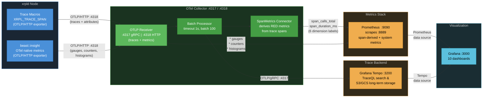

# Observability Data Collection Reference

> **Audience**: Developers and operators. This is the single source of truth for all telemetry data collected by xrpld's observability stack.
>
> **Related docs**: [docs/telemetry-runbook.md](../docs/telemetry-runbook.md) (operator runbook with alerting and troubleshooting) | [03-implementation-strategy.md](./03-implementation-strategy.md) (code structure and performance optimization) | [04-code-samples.md](./04-code-samples.md) (C++ instrumentation examples)

## Data Flow Overview



There are two independent telemetry pipelines entering a single **OTel Collector** via the same OTLP receiver:

1. **OpenTelemetry Traces** — Distributed spans with attributes, exported via OTLP/HTTP (:4318) to the collector's **OTLP Receiver**. The **Batch Processor** groups spans (1s timeout, batch size 100) before forwarding to trace backends. The **SpanMetrics Connector** derives RED metrics (rate, errors, duration) from every span and feeds them into the metrics pipeline.
2. **beast::insight OTel Metrics** — System-level gauges, counters, and histograms exported natively via OTLP/HTTP (:4318) to the same **OTLP Receiver**. These are batched and exported to Prometheus alongside span-derived metrics. The StatsD UDP transport has been replaced by native OTLP; `server=statsd` remains available as a fallback.

A third, narrower metrics path exists for instruments created at their call site through the
`XRPL_METRIC_*` macros. These use the OTel Metrics SDK directly and reach the collector's OTLP
receiver rather than the StatsD receiver, so their names carry no `xrpld_` prefix. See
[§2a](#2a-call-site-otel-metrics-metricsregistry). Code in `libxrpl` cannot use these macros and
always goes through `beast::insight` instead.

**Trace backend** — The collector exports traces via OTLP/gRPC to:

- **Grafana Tempo** — Preferred trace backend. Supports TraceQL queries at `:3200`, S3/GCS object storage for cost-effective long-term trace retention, and integrates natively with Grafana.

> **Further reading**: [00-tracing-fundamentals.md](./00-tracing-fundamentals.md) for core OpenTelemetry concepts (traces, spans, context propagation, sampling). [07-observability-backends.md](./07-observability-backends.md) for production backend selection, collector placement, and sampling strategies.

---

## 1. OpenTelemetry Spans

### 1.1 Complete Span Inventory (~36 spans)

> **See also**: [02-design-decisions.md §2.3](./02-design-decisions.md#23-span-naming-conventions) for naming conventions and the full span catalog with rationale. [04-code-samples.md §4.6](./04-code-samples.md#46-span-flow-visualization) for span flow diagrams.

> **Span names vs. attribute keys**: span names use dotted `subsystem.operation`
> form (e.g. `rpc.http_request`). Span _attribute_ keys use the bare/underscore
> form from the 2026-05-13 naming redesign (e.g. `tx_hash`, not `xrpl.tx.hash`).
> The dotted `xrpl.*` form is reserved for OTel **resource** attributes set once
> at startup. See §1.2 for the full attribute inventory.

#### RPC Spans

Controlled by `trace_rpc=1` in `[telemetry]` config.

| Span Name            | Parent             | Source File       | Description                                                              |
| -------------------- | ------------------ | ----------------- | ------------------------------------------------------------------------ |
| `rpc.http_request`   | —                  | ServerHandler.cpp | Top-level HTTP JSON-RPC request entry point                              |
| `rpc.ws_message`     | —                  | ServerHandler.cpp | WebSocket message handling (one per inbound frame)                       |
| `rpc.ws_upgrade`     | —                  | ServerHandler.cpp | WebSocket upgrade handshake (records handshake failures)                 |
| `rpc.process`        | `rpc.http_request` | ServerHandler.cpp | RPC processing pipeline (single or batch request)                        |
| `rpc.command.<name>` | `rpc.process`      | RPCHandler.cpp    | Per-command span (e.g., `rpc.command.server_info`, `rpc.command.ledger`) |

**Where to find**: Tempo → TraceQL: `{resource.service.name="xrpld" && name=~"rpc.http_request|rpc.command.*"}`

**Grafana dashboard**: _RPC Performance_ (`rpc-performance`)

#### gRPC Spans

Controlled by `trace_rpc=1` in `[telemetry]` config.

| Span Name           | Parent | Source File    | Description                                                                                                               |
| ------------------- | ------ | -------------- | ------------------------------------------------------------------------------------------------------------------------- |
| `grpc.<MethodName>` | —      | GRPCServer.cpp | One flat span per gRPC method (e.g., `grpc.GetLedger`, `grpc.GetLedgerData`, `grpc.GetLedgerDiff`, `grpc.GetLedgerEntry`) |

The method name is embedded in the span name (formed at the call site as
`grpc.<MethodName>`), so dashboards break out per-method latency and error
rates without TraceQL attribute filters.

**Where to find**: Tempo → TraceQL: `{resource.service.name="xrpld" && name=~"grpc.*"}`

**Grafana dashboard**: _RPC Performance_ (`rpc-performance`)

#### Transaction Spans

Controlled by `trace_transactions=1` in `[telemetry]` config.

| Span Name       | Parent         | Source File     | Description                                                       |
| --------------- | -------------- | --------------- | ----------------------------------------------------------------- |
| `tx.process`    | —              | NetworkOPs.cpp  | Transaction submission entry point (local or peer-relayed)        |
| `tx.receive`    | —              | PeerImp.cpp     | Raw transaction received from peer overlay (before deduplication) |
| `tx.apply`      | `ledger.build` | BuildLedger.cpp | Transaction set applied to new ledger during consensus            |
| `tx.preflight`  | —              | applySteps.cpp  | Stateless checks stage (`stage=preflight`)                        |
| `tx.preclaim`   | —              | applySteps.cpp  | Ledger-aware checks stage before fee claim (`stage=preclaim`)     |
| `tx.transactor` | —              | Transactor.cpp  | Apply stage — the transactor runs (`stage=apply`)                 |

The three apply-pipeline spans share a deterministic `trace_id` derived from
`txID[0:16]`, so preflight, preclaim, and transactor for one transaction group
under a single trace even though they run sequentially and often on different
threads. A transaction that hard-fails preflight or preclaim never reaches the
later spans — the `stage` attribute identifies where it stopped.

> **Deterministic roots are true roots.** Spans with a deterministic `trace_id`
> (the `tx.*` apply pipeline, `tx.process`, `tx.receive`, and `consensus.round`)
> are emitted as genuine trace roots with an empty `parent_span_id`. The chosen
> `trace_id` is injected through a custom `DeterministicIdGenerator` on the SDK's
> no-parent branch, so there is no synthetic placeholder parent — Tempo shows a
> clean root, not a "root span not yet received" warning. Cross-node correlation
> still works because every node derives the same `trace_id` from the shared hash.

> **Log-trace correlation is retained across coroutines.** OTel context storage
> is coroutine-aware (backed by `LocalValue`), so the active span travels with a
> coroutine across `yield()` and resumes on whatever thread the scheduler picks.
> RPC, consensus, and transaction spans therefore keep per-line log-trace
> correlation, and their scopes are safe across coroutine yields. Job-handoff
> spans — transaction apply and receive, and consensus accept — are activated
> inside their worker bodies rather than at enqueue, so each worker's log lines
> carry the span's trace context.

**Where to find**: Tempo → TraceQL: `{resource.service.name="xrpld" && name=~"tx.process|tx.receive"}`
or, for the apply pipeline: `{resource.service.name="xrpld" && name=~"tx.preflight|tx.preclaim|tx.transactor"}`

**Grafana dashboard**: _Transaction Overview_ (`transaction-overview`)

#### Transaction Queue (TxQ) Spans

Controlled by `trace_transactions=1` in `[telemetry]` config.

| Span Name          | Parent                                                      | Source File | Description                                                                                                                                             |
| ------------------ | ----------------------------------------------------------- | ----------- | ------------------------------------------------------------------------------------------------------------------------------------------------------- |
| `txq.enqueue`      | `tx.process` (submission path; root on open-ledger rebuild) | TxQ.cpp     | Queue admission decision (apply/queue/reject). Parents to `tx.process` via explicit context on submit; correlates via `current_ledger_seq` on all paths |
| `txq.apply_direct` | `txq.enqueue`                                               | TxQ.cpp     | Direct apply attempt that bypasses the queue                                                                                                            |
| `txq.batch_clear`  | `txq.enqueue`                                               | TxQ.cpp     | Batch clear of an account's queued txs                                                                                                                  |
| `txq.accept`       | —                                                           | TxQ.cpp     | Ledger-close accept loop (drains the queue)                                                                                                             |
| `txq.accept_tx`    | `txq.accept`                                                | TxQ.cpp     | Per-queued-transaction apply inside the accept loop                                                                                                     |
| `txq.cleanup`      | —                                                           | TxQ.cpp     | Post-close cleanup of expired queue entries                                                                                                             |

**Where to find**: Tempo → TraceQL: `{resource.service.name="xrpld" && name=~"txq.*"}`

**Grafana dashboard**: _Transaction Overview_ (`transaction-overview`)

#### Consensus Spans

Controlled by `trace_consensus=1` in `[telemetry]` config.

| Span Name                      | Parent             | Source File      | Description                                                         |
| ------------------------------ | ------------------ | ---------------- | ------------------------------------------------------------------- |
| `consensus.round`              | — (root)           | RCLConsensus.cpp | Root span for one consensus round (deterministic trace per round)   |
| `consensus.phase.open`         | `consensus.round`  | Consensus.h      | Open phase — collecting transactions before close                   |
| `consensus.proposal.send`      | `consensus.round`  | RCLConsensus.cpp | Node broadcasts its transaction set proposal                        |
| `consensus.ledger_close`       | `consensus.round`  | RCLConsensus.cpp | Ledger close event triggered by consensus                           |
| `consensus.establish`          | `consensus.round`  | Consensus.h      | Establish phase — converging on the transaction set                 |
| `consensus.update_positions`   | `consensus.round`  | Consensus.h      | Position update with per-dispute vote details                       |
| `consensus.check`              | `consensus.round`  | Consensus.h      | Consensus threshold check (agree/disagree tally)                    |
| `consensus.accept`             | `consensus.round`  | RCLConsensus.cpp | Consensus accepts a ledger (round complete)                         |
| `consensus.accept.apply`       | `consensus.accept` | RCLConsensus.cpp | Ledger application with close-time details (jtACCEPT thread)        |
| `consensus.validation.send`    | `consensus.round`  | RCLConsensus.cpp | Validation message sent after ledger accepted (follows-from link)   |
| `consensus.mode_change`        | `consensus.round`  | RCLConsensus.cpp | Operating-mode transition during the round                          |
| `consensus.proposal.receive`   | (context)          | PeerImp.cpp      | Proposal received from a peer (context-propagated into the round)   |
| `consensus.validation.receive` | (context)          | PeerImp.cpp      | Validation received from a peer (context-propagated into the round) |

The `.receive` spans are created per-message in the overlay and joined to the
round trace via context propagation rather than direct parenting. The
`consensus.validation.send` span uses a follows-from link off the round.

**Where to find**: Tempo → TraceQL: `{resource.service.name="xrpld" && name=~"consensus.*"}`

**Grafana dashboard**: _Consensus Health_ (`consensus-health`)

#### Ledger Spans

Controlled by `trace_ledger=1` in `[telemetry]` config.

| Span Name         | Parent | Source File      | Description                                    |
| ----------------- | ------ | ---------------- | ---------------------------------------------- |
| `ledger.build`    | —      | BuildLedger.cpp  | Build new ledger from accepted transaction set |
| `ledger.validate` | —      | LedgerMaster.cpp | Ledger promoted to validated status            |
| `ledger.store`    | —      | LedgerMaster.cpp | Ledger stored to database/history              |

**Where to find**: Tempo → TraceQL: `{resource.service.name="xrpld" && name=~"ledger.*"}`

**Grafana dashboard**: _Ledger Operations_ (`ledger-operations`)

#### Peer Spans

Controlled by `trace_peer` in `[telemetry]` config. **Enabled by default** (high volume).

| Span Name                 | Parent | Source File | Description                           |
| ------------------------- | ------ | ----------- | ------------------------------------- |
| `peer.proposal.receive`   | —      | PeerImp.cpp | Consensus proposal received from peer |
| `peer.validation.receive` | —      | PeerImp.cpp | Validation message received from peer |

A `—` parent means the span is a fresh trace root (`kConsumer`): it is started
via `ScopedSpanGuard::freshRoot()` at the inbound-message entry point and never
inherits an ambient span left active on the peer thread, so it does not nest
under an unrelated transaction's trace.

**Where to find**: Tempo → TraceQL: `{resource.service.name="xrpld" && name=~"peer.*"}`

**Grafana dashboard**: _Peer Network_ (`peer-network`)

#### PathFind Spans

Controlled by `trace_rpc=1` in `[telemetry]` config.

| Span Name             | Parent               | Source File     | Description                                                |
| --------------------- | -------------------- | --------------- | ---------------------------------------------------------- |
| `pathfind.request`    | `rpc.command.<name>` | PathFind.cpp    | `path_find` RPC entry (`doPathFind`)                       |
| `pathfind.compute`    | `pathfind.request`   | PathRequest.cpp | Path computation for one request (`PathRequest::doUpdate`) |
| `pathfind.discover`   | `pathfind.compute`   | Pathfinder.cpp  | Graph exploration (one per RPC call)                       |
| `pathfind.update_all` | —                    | PathRequest.cpp | Async recomputation of all active requests at ledger close |

> **Note**: `pathfind.request` nests under the active `rpc.command.<name>` span.
> Because OTel context storage is coroutine-aware (backed by `LocalValue`), the
> `rpc.command.*` scope stays correct even though its generic dispatch
> (`callMethod`) also wraps handlers such as `doRipplePathFind` whose span is held
> across a coroutine `yield()` — the ambient context travels with the coroutine
> when it resumes, so there is no wrong-thread scope pop. The
> `pathfind.request → compute → discover` sub-tree therefore parents to
> `rpc.command.<name>`, giving an exact request-to-pathfind nesting.

**Where to find**: Tempo → TraceQL: `{resource.service.name="xrpld" && name=~"pathfind.*"}`

---

### 1.2 Complete Attribute Inventory (bare/underscore keys)

> **See also**: [02-design-decisions.md §2.4.2](./02-design-decisions.md#242-span-attributes-by-category) for attribute design rationale and privacy considerations.

Every span can carry key-value attributes that provide context for filtering and
aggregation. Per the 2026-05-13 naming redesign, span-attribute keys use the
**bare** field name (the span name already carries the domain), or the
`<domain>_<field>` underscore form where a bare name would collide (e.g.
`rpc_status`, `grpc_status`, `tx_status`, `txq_status`).

> **Dotted keys are resource attributes, never span attributes:**
>
> - `xrpl.network.id` and `xrpl.network.type` are **resource** attributes set
>   once at startup on the OTel resource — not span attributes. They appear on
>   every span's resource scope, queried as `{resource.xrpl.network.id=...}`.
> - The ledger hash uses the bare `ledger_hash` key on every span that records
>   it (both `consensus.validation.send` and `peer.validation.receive`) — there
>   is no dotted span attribute.

The tables below list one row per attribute per subsystem, so a key shared by two subsystems (for example `ledger_seq`) appears once in each. That is 89 rows over 78 distinct keys. The §6 per-header counts use the same row-based rule, so they sum to 89.

#### RPC Attributes

| Attribute              | Type    | Set On                            | Description                                      |
| ---------------------- | ------- | --------------------------------- | ------------------------------------------------ |
| `command`              | string  | `rpc.command.*`, `rpc.ws_message` | RPC command name (e.g., `server_info`, `ledger`) |
| `version`              | int64   | `rpc.command.*`                   | API version number                               |
| `rpc_role`             | string  | `rpc.command.*`                   | Caller role: `"admin"` or `"user"`               |
| `rpc_status`           | string  | `rpc.command.*`                   | Result: `"success"` or `"error"`                 |
| `request_payload_size` | int64   | `rpc.http_request`                | Bytes of inbound request payload                 |
| `is_batch`             | boolean | `rpc.process`                     | `true` if the request is a JSON-RPC batch        |
| `batch_size`           | int64   | `rpc.process`                     | Number of sub-requests in a batch                |
| `load_type`            | string  | `rpc.command.*`                   | Resource cost category after execution           |

**Tempo query**: `{span.command="server_info"}` to find all `server_info` calls.

**Prometheus label**: `command` (used as a SpanMetrics dimension).

#### gRPC Attributes

| Attribute     | Type   | Set On              | Description                          |
| ------------- | ------ | ------------------- | ------------------------------------ |
| `method`      | string | `grpc.<MethodName>` | gRPC method name (e.g., `GetLedger`) |
| `grpc_role`   | string | `grpc.<MethodName>` | Caller role: `"admin"` or `"user"`   |
| `grpc_status` | string | `grpc.<MethodName>` | Result: `"success"` or `"error"`     |

**Tempo query**: `{span.method="GetLedger"}` or `{name="grpc.GetLedger"}`.

**Prometheus labels**: `method`, `grpc_role`, `grpc_status` (SpanMetrics dimensions).

#### Transaction Attributes

| Attribute             | Type    | Set On                                                       | Description                                                                                                                           |
| --------------------- | ------- | ------------------------------------------------------------ | ------------------------------------------------------------------------------------------------------------------------------------- |
| `tx_hash`             | string  | `tx.process`, `tx.receive`                                   | Transaction hash (hex-encoded)                                                                                                        |
| `local`               | boolean | `tx.process`                                                 | `true` if locally submitted, `false` if peer-relayed                                                                                  |
| `path`                | string  | `tx.process`                                                 | Submission path: `"sync"` or `"async"`                                                                                                |
| `tx_type`             | string  | `tx.process`, `tx.preflight`, `tx.preclaim`, `tx.transactor` | Transaction type name (e.g., `Payment`)                                                                                               |
| `fee`                 | int64   | `tx.process`                                                 | Transaction fee in drops                                                                                                              |
| `sequence`            | int64   | `tx.process`                                                 | Transaction sequence number                                                                                                           |
| `suppressed`          | boolean | `tx.receive`                                                 | `true` if transaction was suppressed (duplicate)                                                                                      |
| `tx_status`           | string  | `tx.receive`                                                 | Transaction status (e.g., `"known_bad"`)                                                                                              |
| `peer_id`             | int64   | `tx.receive`                                                 | Peer identifier (also set on peer spans)                                                                                              |
| `peer_version`        | string  | `tx.receive`                                                 | Peer protocol version string                                                                                                          |
| `stage`               | string  | `tx.preflight`, `tx.preclaim`, `tx.transactor`               | Apply-pipeline stage: `preflight`, `preclaim`, or `apply`                                                                             |
| `ter_result`          | string  | `tx.preflight`, `tx.preclaim`, `tx.transactor`               | Engine result token for that stage (e.g., `tesSUCCESS`, `terPRE_SEQ`)                                                                 |
| `applied`             | boolean | `tx.transactor`                                              | `true` if the transaction was applied to the ledger                                                                                   |
| `current_ledger_seq`  | int64   | `tx.process`, `tx.receive`, `tx.preclaim`, `tx.transactor`   | Seq of the ledger being worked on (open/in-flight, not established) — joins the txID-keyed spans to the ledger trace                  |
| `current_ledger_hash` | string  | `tx.preclaim`, `tx.transactor`                               | Parent hash of that ledger (= `consensus.round` trace-id seed on the build path). View-bearing stages only; `tx.preflight` omits both |

**Tempo query**: `{span.tx_hash="<hash>"}` to trace a specific transaction across nodes.
Join a transaction's work to its ledger with `{span.current_ledger_seq=<N>}`.

**Prometheus labels**: `local`, `suppressed`, `tx_type`, `ter_result`, `stage` (SpanMetrics dimensions).

#### Transaction Queue (TxQ) Attributes

| Attribute             | Type    | Set On                         | Description                                                                      |
| --------------------- | ------- | ------------------------------ | -------------------------------------------------------------------------------- |
| `tx_hash`             | string  | `txq.enqueue`, `txq.accept_tx` | Transaction hash                                                                 |
| `tx_type`             | string  | `txq.enqueue`                  | Transaction type name                                                            |
| `current_ledger_seq`  | int64   | `txq.enqueue`                  | Seq of the ledger being worked on — correlates the enqueue to the ledger trace   |
| `current_ledger_hash` | string  | `txq.enqueue`                  | Parent hash of that ledger (= `consensus.round` trace-id seed on the build path) |
| `txq_status`          | string  | `txq.enqueue`, `txq.accept_tx` | Queue outcome (e.g. `queued`, `applied_direct`, `rejected`)                      |
| `fee_level_paid`      | int64   | `txq.enqueue`                  | Fee level paid by the queued tx                                                  |
| `required_fee_level`  | int64   | `txq.enqueue`                  | Minimum fee level for inclusion                                                  |
| `num_cleared`         | int64   | `txq.batch_clear`              | Entries cleared in a batch                                                       |
| `queue_size`          | int64   | `txq.accept`                   | Current TxQ depth                                                                |
| `ledger_changed`      | boolean | `txq.accept`                   | Whether the ledger changed since last attempt                                    |
| `ter_code`            | int64   | `txq.accept_tx`                | Transaction engine result code                                                   |
| `retries_remaining`   | int64   | `txq.accept_tx`                | Retries left before discard                                                      |
| `ledger_seq`          | int64   | `txq.cleanup`                  | Ledger sequence number                                                           |
| `expired_count`       | int64   | `txq.cleanup`                  | Number of expired entries cleared                                                |

**Prometheus label**: `txq_status` (SpanMetrics dimension).

#### Consensus Attributes

| Attribute                    | Type    | Set On                                                                                             | Description                                                |
| ---------------------------- | ------- | -------------------------------------------------------------------------------------------------- | ---------------------------------------------------------- |
| `consensus_ledger_id`        | string  | `consensus.round`                                                                                  | Previous-ledger id anchoring the round                     |
| `ledger_seq`                 | int64   | `consensus.round`, `consensus.ledger_close`, `consensus.accept.apply`, `consensus.validation.send` | Ledger sequence number                                     |
| `consensus_mode`             | string  | `consensus.round`, `consensus.ledger_close`                                                        | Node mode: `"Proposing"`, `"Observing"`, `"Wrong"`, etc.   |
| `consensus_round_id`         | int64   | `consensus.round`                                                                                  | Round identifier                                           |
| `consensus_phase`            | string  | `consensus.round`                                                                                  | Current phase name (updated on each transition)            |
| `trace_strategy`             | string  | `consensus.round`                                                                                  | Trace-id strategy (`deterministic` / `random`)             |
| `previous_ledger_seq`        | int64   | `consensus.round`                                                                                  | Sequence of the previous ledger                            |
| `previous_proposers`         | int64   | `consensus.round`                                                                                  | Proposer count in the previous round                       |
| `previous_round_time_ms`     | int64   | `consensus.round`                                                                                  | Duration of the previous round                             |
| `consensus_round`            | int64   | `consensus.proposal.send`                                                                          | Proposal sequence number for the broadcast proposal        |
| `is_bow_out`                 | boolean | `consensus.proposal.send`                                                                          | Whether the proposal is a bow-out (resigning the round)    |
| `tx_count_open`              | int64   | `consensus.ledger_close`                                                                           | Transactions in the open ledger at close                   |
| `close_time_resolution_ms`   | int64   | `consensus.ledger_close`                                                                           | Close-time rounding granularity                            |
| `start_reason`               | string  | `consensus.phase.open`                                                                             | Entry path: `"initial"` or `"recovered"`                   |
| `previous_close_agree`       | boolean | `consensus.phase.open`                                                                             | Whether the prior ledger's close time was agreed           |
| `peer_positions_at_open`     | int64   | `consensus.phase.open`                                                                             | Positions held after buffered proposals are replayed       |
| `early_close_triggered`      | boolean | `consensus.phase.open`                                                                             | Round skipped the timer because peers had already closed   |
| `tx_sets_acquired`           | int64   | `consensus.phase.open`                                                                             | Peer transaction sets held at close, excluding our own     |
| `close_reason`               | string  | `consensus.phase.open`                                                                             | `"anomaly"`, `"others_closed"`, `"idle"`, or `"normal"`    |
| `proposers_validated`        | int64   | `consensus.phase.open`                                                                             | Trusted validators of the previous ledger, at close        |
| `converge_percent`           | int64   | `consensus.establish`, `consensus.update_positions`                                                | Convergence percentage                                     |
| `establish_count`            | int64   | `consensus.establish`                                                                              | Establish-phase iteration count                            |
| `close_time_avalanche_state` | string  | `consensus.establish`                                                                              | Terminal regime: `"init"`, `"mid"`, `"late"`, or `"stuck"` |
| `proposers`                  | int64   | `consensus.establish`, `consensus.update_positions`, `consensus.accept`                            | Number of proposers                                        |
| `disputes_count`             | int64   | `consensus.establish`, `consensus.update_positions`                                                | Number of disputed transactions                            |
| `tx_id`                      | string  | `consensus.update_positions`                                                                       | Disputed transaction id (per-dispute event)                |
| `dispute_our_vote`           | boolean | `consensus.update_positions`                                                                       | Our vote on the disputed tx                                |
| `dispute_yays`               | int64   | `consensus.update_positions`                                                                       | Yes votes on the disputed tx                               |
| `dispute_nays`               | int64   | `consensus.update_positions`                                                                       | No votes on the disputed tx                                |
| `agree_count`                | int64   | `consensus.check`                                                                                  | Agreeing proposer count                                    |
| `disagree_count`             | int64   | `consensus.check`                                                                                  | Disagreeing proposer count                                 |
| `threshold_percent`          | int64   | `consensus.check`                                                                                  | Agreement threshold percentage                             |
| `consensus_result`           | string  | `consensus.check`                                                                                  | Check outcome                                              |
| `quorum`                     | int64   | `consensus.check`, `consensus.accept`                                                              | Quorum required                                            |
| `round_time_ms`              | int64   | `consensus.accept`, `consensus.accept.apply`                                                       | Total consensus round duration in milliseconds             |
| `consensus_state`            | string  | `consensus.accept.apply`                                                                           | Consensus outcome: `"finished"` or `"moved_on"`            |
| `close_time`                 | int64   | `consensus.accept.apply`                                                                           | Agreed-upon ledger close time (epoch seconds)              |
| `close_time_correct`         | boolean | `consensus.accept.apply`                                                                           | Whether validators agreed on close time                    |
| `close_resolution_ms`        | int64   | `consensus.accept.apply`                                                                           | Close-time rounding granularity in milliseconds            |
| `proposing`                  | boolean | `consensus.accept.apply`, `consensus.validation.send`                                              | Whether this node was a proposer                           |
| `parent_close_time`          | int64   | `consensus.accept.apply`                                                                           | Parent ledger close time                                   |
| `close_time_self`            | int64   | `consensus.accept.apply`                                                                           | This node's close-time vote                                |
| `close_time_vote_bins`       | string  | `consensus.accept.apply`                                                                           | Distribution of close-time votes                           |
| `resolution_direction`       | string  | `consensus.accept.apply`                                                                           | Whether close resolution increased/decreased/unchanged     |
| `tx_count`                   | int64   | `consensus.accept.apply`                                                                           | Transactions in the accepted set                           |
| `ledger_hash`                | string  | `consensus.validation.send`                                                                        | Full hash of the validated ledger (shared with peer)       |
| `full_validation`            | boolean | `consensus.validation.send`                                                                        | Whether this is a full validation                          |
| `validation_sign_time`       | int64   | `consensus.validation.send`                                                                        | Validation signing time                                    |
| `mode_old`                   | string  | `consensus.mode_change`                                                                            | Operating mode before the transition                       |
| `mode_new`                   | string  | `consensus.mode_change`                                                                            | Operating mode after the transition                        |

**Tempo query**: `{span.consensus_mode="Proposing"}` to find rounds where the node was proposing.

**Prometheus labels**: `consensus_mode`, `consensus_state`, `consensus_phase`, `consensus_result`, `consensus_stalled`, `mode_new`, `close_time_correct` (SpanMetrics dimensions).

#### Ledger Attributes

| Attribute             | Type    | Set On                                            | Description                                      |
| --------------------- | ------- | ------------------------------------------------- | ------------------------------------------------ |
| `ledger_seq`          | int64   | `ledger.build`, `ledger.validate`, `ledger.store` | Ledger sequence number                           |
| `close_time`          | int64   | `ledger.build`                                    | Ledger close time (epoch seconds)                |
| `close_time_correct`  | boolean | `ledger.build`                                    | Whether close time was agreed upon by validators |
| `close_resolution_ms` | int64   | `ledger.build`                                    | Close time rounding granularity in milliseconds  |
| `tx_count`            | int64   | `tx.apply`                                        | Transactions applied to the ledger               |
| `tx_failed`           | int64   | `tx.apply`                                        | Failed transactions in the apply set             |
| `validations`         | int64   | `ledger.validate`                                 | Number of validations received for this ledger   |

The apply-step span `tx.apply` (child of `ledger.build`) carries `tx_count`/`tx_failed`;
the parent `ledger.build` carries `ledger_seq` and the close-time attributes.

**Tempo query**: `{span.ledger_seq=12345}` to find all spans for a specific ledger.

#### Peer Attributes

| Attribute            | Type    | Set On                                                           | Description                                          |
| -------------------- | ------- | ---------------------------------------------------------------- | ---------------------------------------------------- |
| `peer_id`            | int64   | `tx.receive`, `peer.proposal.receive`, `peer.validation.receive` | Peer identifier                                      |
| `proposal_trusted`   | boolean | `peer.proposal.receive`                                          | Whether the proposal came from a trusted validator   |
| `validation_trusted` | boolean | `peer.validation.receive`                                        | Whether the validation came from a trusted validator |
| `full_validation`    | boolean | `peer.validation.receive`                                        | Whether the validation is a full validation          |
| `ledger_hash`        | string  | `peer.validation.receive`                                        | Validated ledger hash (shared with consensus spans)  |

**Prometheus labels**: `proposal_trusted`, `validation_trusted` (SpanMetrics dimensions).

#### PathFind Attributes

| Attribute                 | Type    | Set On                | Description                              |
| ------------------------- | ------- | --------------------- | ---------------------------------------- |
| `pathfind_source_account` | string  | `pathfind.request`    | Originating account for the path search  |
| `pathfind_dest_account`   | string  | `pathfind.request`    | Destination account                      |
| `pathfind_fast`           | boolean | `pathfind.compute`    | Whether fast pathfinding mode is enabled |
| `pathfind_search_level`   | int64   | `pathfind.discover`   | Depth of graph exploration               |
| `pathfind_num_paths`      | int64   | `pathfind.discover`   | Total paths produced                     |
| `pathfind_ledger_index`   | int64   | `pathfind.update_all` | Target ledger index                      |
| `pathfind_num_requests`   | int64   | `pathfind.update_all` | Active requests recomputed               |

---

### 1.3 SpanMetrics — Derived Prometheus Metrics

> **See also**: [01-architecture-analysis.md](./01-architecture-analysis.md) §1.8.2 for how span-derived metrics map to operational insights.

The OTel Collector's SpanMetrics connector automatically generates RED (Rate, Errors, Duration) metrics from every span. No custom metrics code in xrpld is needed.

| Prometheus Metric                   | Type      | Description                                                                    |
| ----------------------------------- | --------- | ------------------------------------------------------------------------------ |
| `span_calls_total`                  | Counter   | Total span invocations                                                         |
| `span_duration_milliseconds_bucket` | Histogram | Latency distribution (buckets: 1, 5, 10, 25, 50, 100, 250, 500, 1000, 5000 ms) |
| `span_duration_milliseconds_count`  | Histogram | Observation count                                                              |
| `span_duration_milliseconds_sum`    | Histogram | Cumulative latency                                                             |

**Standard labels on every metric**: `span_name`, `status_code`, `service_name`, `span_kind`

**Additional dimension labels** (configured in `otel-collector-config.yaml`).
The Prometheus label is the **bare span-attribute key verbatim** — the
SpanMetrics connector does not rewrite or prefix it:

| Prometheus Label / Span Attribute | Type    | Applies To                                     |
| --------------------------------- | ------- | ---------------------------------------------- |
| `command`                         | string  | `rpc.command.*`                                |
| `rpc_status`                      | string  | `rpc.command.*`                                |
| `consensus_mode`                  | string  | `consensus.round`, `consensus.ledger_close`    |
| `close_time_correct`              | boolean | `consensus.accept.apply`                       |
| `local`                           | boolean | `tx.process`                                   |
| `suppressed`                      | boolean | `tx.receive`                                   |
| `proposal_trusted`                | boolean | `peer.proposal.receive`                        |
| `validation_trusted`              | boolean | `peer.validation.receive`                      |
| `tx_type`                         | string  | `tx.*`, `txq.enqueue`                          |
| `ter_result`                      | string  | `tx.preflight`, `tx.preclaim`, `tx.transactor` |
| `stage`                           | string  | `tx.preflight`, `tx.preclaim`, `tx.transactor` |
| `txq_status`                      | string  | `txq.enqueue`, `txq.accept_tx`                 |
| `consensus_state`                 | string  | `consensus.accept.apply`                       |
| `load_type`                       | string  | `rpc.command.*`                                |
| `is_batch`                        | boolean | `rpc.process`                                  |
| `mode_new`                        | string  | `consensus.mode_change`                        |
| `consensus_stalled`               | boolean | `consensus.check`                              |
| `consensus_phase`                 | string  | `consensus.round`                              |
| `consensus_result`                | string  | `consensus.check`                              |
| `method`                          | string  | `grpc.<MethodName>`                            |
| `grpc_role`                       | string  | `grpc.<MethodName>`                            |
| `grpc_status`                     | string  | `grpc.<MethodName>`                            |

The `stage` dimension (3 values: `preflight`, `preclaim`, `apply`) turns the
apply-pipeline spans into per-stage RED metrics with no native instruments — the
_Transaction Overview_ dashboard charts rate, p95 latency, and failure rate by stage.

> **Sampling caveat**: xrpld head sampling is fixed at 1.0 (every trace is
> recorded), so span-derived metrics are not undercounted at the node. If the
> collector is configured with tail sampling, span-derived metrics reflect only
> the retained traces, whereas native StatsD/meter metrics do not sample.
> Account for any collector-side tail sampling when reading absolute stage rates.

**Where to query**: Prometheus → `span_calls_total{span_name="rpc.command.server_info"}`

---

## 2. System Metrics (beast::insight — OTel native)

> **See also**: [02-design-decisions.md](./02-design-decisions.md) for the beast::insight coexistence design. [06-implementation-phases.md](./06-implementation-phases.md) for the Phase 6/7 metric inventory.
>
> **Migration complete**: Phase 7 replaced the StatsD UDP transport with native OTel Metrics SDK export via OTLP/HTTP. The `beast::insight::Collector` interface and all metric names are preserved — only the wire protocol changed. `[insight] server=statsd` remains as a fallback.

These are system-level metrics emitted by xrpld's `beast::insight` framework via OTel OTLP/HTTP. They cover operational data that doesn't map to individual trace spans.

### Configuration

```ini
# Recommended: native OTel metrics via OTLP/HTTP
[insight]
server=otel
endpoint=http://localhost:4318/v1/metrics
```

`server=otel` is the only key here that changes what gets exported. No `prefix` is
shown because it would do nothing on this path: `OTelCollector` routes every
instrument name through its `static formatName()`, which only lowercases the raw
name and maps `.` and space to `_`, and the only place the class reads `prefix_`
is its startup log line. Exported names are therefore the lowercased raw names
(`jobq_job_count`, `rpc_requests_total`) and the service is identified by the OTel
resource `service.name`, not by a name prefix. `endpoint` is read from this section
but likewise reaches only that log line — the real exporter URL is derived inside
`Telemetry::initMetrics()` from `[telemetry] endpoint`, by swapping the trailing
`/v1/traces` for `/v1/metrics`.

Fallback (StatsD). `StatsDCollector` is still selected by this value, but the
stack in `docker/telemetry/` no longer receives it: using this path also requires
re-adding the `statsd` receiver to `otel-collector-config.yaml` and uncommenting
port 8125 in `docker-compose.yml`, otherwise the metrics go to a port nothing
listens on. `prefix` does appear below, because `StatsDCollector` really does
prepend it to every metric name it serializes — so switching transports renames
every series.

```ini
[insight]
server=statsd
address=127.0.0.1:8125
prefix=xrpld
```

### 2.1 Gauges

| Prometheus Metric                           | Source File           | Description                                   | Typical Range                   |
| ------------------------------------------- | --------------------- | --------------------------------------------- | ------------------------------- |
| `ledgermaster_validated_ledger_age`         | LedgerMaster.h        | Seconds since last validated ledger           | 0–10 (healthy), >30 (stale)     |
| `ledgermaster_published_ledger_age`         | LedgerMaster.h        | Seconds since last published ledger           | 0–10 (healthy)                  |
| `state_accounting_disconnected_duration`    | NetworkOPs.cpp        | Cumulative microseconds in Disconnected state | Monotonic                       |
| `state_accounting_connected_duration`       | NetworkOPs.cpp        | Cumulative microseconds in Connected state    | Monotonic                       |
| `state_accounting_syncing_duration`         | NetworkOPs.cpp        | Cumulative microseconds in Syncing state      | Monotonic                       |
| `state_accounting_tracking_duration`        | NetworkOPs.cpp        | Cumulative microseconds in Tracking state     | Monotonic                       |
| `state_accounting_full_duration`            | NetworkOPs.cpp        | Cumulative microseconds in Full state         | Monotonic (should dominate)     |
| `state_accounting_disconnected_transitions` | NetworkOPs.cpp        | Count of transitions to Disconnected          | Low                             |
| `state_accounting_connected_transitions`    | NetworkOPs.cpp        | Count of transitions to Connected             | Low                             |
| `state_accounting_syncing_transitions`      | NetworkOPs.cpp        | Count of transitions to Syncing               | Low                             |
| `state_accounting_tracking_transitions`     | NetworkOPs.cpp        | Count of transitions to Tracking              | Low                             |
| `state_accounting_full_transitions`         | NetworkOPs.cpp        | Count of transitions to Full                  | Low (should be 1 after startup) |
| `peer_finder_active_inbound_peers`          | PeerfinderManager.cpp | Active inbound peer connections               | 0–85                            |
| `peer_finder_active_outbound_peers`         | PeerfinderManager.cpp | Active outbound peer connections              | 10–21                           |
| `overlay_peer_disconnects`                  | OverlayImpl.cpp       | Cumulative peer disconnection count           | Low growth                      |
| `overlay_peer_disconnects_charges`          | OverlayImpl.cpp       | Disconnects due to resource limit charges     | Low growth (subset of above)    |
| `job_count`                                 | JobQueue.cpp          | Current job queue depth                       | 0–100 (healthy)                 |

**Grafana dashboard**: _Node Health_ (`node-health`)

### 2.2 Counters

| Prometheus Metric         | Source File        | Description                                   |
| ------------------------- | ------------------ | --------------------------------------------- |
| `rpc_requests`            | ServerHandler.cpp  | Total RPC requests received                   |
| `ledger_fetches`          | InboundLedgers.cpp | Inbound ledger fetch attempts                 |
| `ledger_history_mismatch` | LedgerHistory.cpp  | Ledger hash mismatches detected               |
| `warn`                    | Logic.h            | Resource manager warnings issued              |
| `drop`                    | Logic.h            | Resource manager drops (connections rejected) |

**Note**: With `server=otel`, `warn` and `drop` are properly exported as OTel Counter instruments. The previous StatsD `|m` type limitation no longer applies.

**Grafana dashboard**: _RPC & Pathfinding_ (`rpc-pathfinding`)

### 2.3 Histograms (Event timers)

| Prometheus Metric | Source File       | Unit | Description                    |
| ----------------- | ----------------- | ---- | ------------------------------ |
| `rpc_time`        | ServerHandler.cpp | ms   | RPC response time distribution |
| `rpc_size`        | ServerHandler.cpp | ms\* | RPC response size (see note)   |
| `ios_latency`     | Application.cpp   | ms   | I/O service loop latency       |
| `pathfind_fast`   | PathRequests.h    | ms   | Fast pathfinding duration      |
| `pathfind_full`   | PathRequests.h    | ms   | Full pathfinding duration      |

Quantiles collected: 0th, 50th, 90th, 95th, 99th, 100th percentile.

\* **`rpc_size` instrument mismatch (known issue):** response size in bytes is
recorded through the millisecond-scaled event histogram (`makeEvent`), so it is
exported as `rpc_size_milliseconds_bucket` with time-scaled boundaries that top
out at 5000. Byte values above ~5 KB saturate in the last bucket, so the
percentiles are not true byte sizes. The _RPC & Pathfinding_ panel is flagged
accordingly. A dedicated byte-unit histogram is needed to fix this; tracked
separately.

**Grafana dashboards**: _Node Health_ (`ios_latency`), _RPC & Pathfinding_ (`rpc_time`, `rpc_size`, `pathfind_*`)

### 2.4 Overlay Traffic Metrics

For each of the 45+ overlay traffic categories (defined in `TrafficCount.h`), four gauges are emitted:

- `{category}_bytes_in`
- `{category}_bytes_out`
- `{category}_messages_in`
- `{category}_messages_out`

**Key categories**:

| Category                                                          | Description                |
| ----------------------------------------------------------------- | -------------------------- |
| `total`                                                           | All traffic aggregated     |
| `overhead` / `overhead_overlay`                                   | Protocol overhead          |
| `transactions` / `transactions_duplicate`                         | Transaction relay          |
| `proposals` / `proposals_untrusted` / `proposals_duplicate`       | Consensus proposals        |
| `validations` / `validations_untrusted` / `validations_duplicate` | Consensus validations      |
| `ledger_data_get` / `ledger_data_share`                           | Ledger data exchange       |
| `ledger_data_Transaction_Node_get/share`                          | Transaction node data      |
| `ledger_data_Account_State_Node_get/share`                        | Account state node data    |
| `ledger_data_Transaction_Set_candidate_get/share`                 | Transaction set candidates |
| `getObject` / `haveTxSet` / `ledgerData`                          | Object requests            |
| `ping` / `status`                                                 | Keepalive and status       |
| `set_get`                                                         | Set requests               |

**Grafana dashboards**: _Network Traffic_ (`network-traffic`), _Overlay Traffic Detail_ (`overlay-traffic-detail`), _Ledger Data & Sync_ (`ledger-data-sync`)

### 2.5 Per-Job-Type Saturation Gauges

`JobTypeData` has always tracked three per-type counters — `waiting`, `running`, and `deferred`
(`include/xrpl/core/JobTypeData.h`) — but only the process-wide queue depth was exported. These
three gauge families export them per job type, so queue pressure can be attributed to a type
instead of only being visible as a single total.

For each of the 35 non-special job types, three gauges are created in the `JobTypeData`
constructor and assigned in `JobQueue::collect()`.

| Metric                    | Source File   | Description                                     |
| ------------------------- | ------------- | ----------------------------------------------- |
| `jobq_{jobtype}_waiting`  | JobTypeData.h | Jobs enqueued for this type but not yet started |
| `jobq_{jobtype}_running`  | JobTypeData.h | Jobs of this type currently executing           |
| `jobq_{jobtype}_deferred` | JobTypeData.h | Jobs held back by this type's concurrency limit |

**Why `deferred` matters most.** `JobQueue::addJob()` never rejects — when a type is at its
concurrency limit it increments `deferred` and returns `true` (`JobQueue.cpp`,
`addRefCountedJob`). Backpressure on a capped type therefore shows up only as latency, after the
delay has already happened. A non-zero `deferred` reading precedes that, which makes it the
leading indicator for a saturating type. It is structurally always zero for special types, which
is why they are excluded — the same `!info.special()` guard that already gates the event timers.

**Name derivation.** These names are not literals anywhere in the source; the `jobq` segment is
added at runtime. `Application.cpp` constructs the JobQueue with
`collectorManager_->group("jobq")`, and `GroupImp::makeName()` (`Groups.cpp`) joins the group name
and the metric name with a `.`. `OTelCollector` then lowercases the result and maps `.` to `_`, so
`JtLedgerReq` (whose type name is `ledgerRequest`) exports as `jobq_ledgerrequest_deferred`. The
same derivation applies to the event timers in §2.3 and to the queue-depth gauge in §2.1, which is
why the latter appears as `jobq_job_count` rather than `job_count`.

> **Sampling granularity**: these are gauges read by the collector hook once per second, not
> counters incremented at the event. A `deferred` spike shorter than the sampling interval can be
> missed. Saturation long enough to delay ledger sync persists across a sample, which is the case
> these gauges are for.

> **Pipeline**: `JobQueue.cpp` is in `libxrpl` and reaches the exporter through
> `beast::insight::Collector`, like every other metric in this section. It cannot use the
> `xrpld`-only call-site metric macros used by
> [§2a](#2a-call-site-otel-metrics-metricsregistry).

---

## 2a. Call-Site OTel Metrics (MetricsRegistry)

> **See also**: [§2](#2-statsd-metrics-beastinsight) for the `beast::insight` metrics that use the
> StatsD transport instead.

Every metric in [§2](#2-statsd-metrics-beastinsight) goes through `beast::insight`. The metrics
below are created directly at their call site through the `XRPL_METRIC_*` macros
(`src/xrpld/telemetry/MetricMacros.h`) and exported by the OTel Metrics SDK rather than over
StatsD. The macros create each instrument once and expand to an empty statement when telemetry is
compiled out, so a call site needs no conditional compilation.

These names carry no `xrpld_` prefix: the prefix belongs to the StatsD sender, and this path
identifies the node through OTel resource attributes instead.

> **Note**: this family is emitted by `MetricsRegistry`, which arrives with the native-metrics
> work in a later phase than this document's own StatsD pipeline. It is catalogued here because
> this document is the single source of truth for the whole telemetry surface.

### 2a.1 Job Lifecycle Metrics

Recorded from the three `PerfLog` job hooks that `JobQueue` already calls.

| Metric               | Type      | Unit | Labels                | Description                  |
| -------------------- | --------- | ---- | --------------------- | ---------------------------- |
| `job_queued_total`   | Counter   | —    | `job_type`, `handler` | Jobs enqueued                |
| `job_started_total`  | Counter   | —    | `job_type`, `handler` | Jobs started                 |
| `job_finished_total` | Counter   | —    | `job_type`, `handler` | Jobs completed               |
| `job_queued_us`      | Histogram | µs   | `job_type`, `handler` | Queue wait time distribution |
| `job_running_us`     | Histogram | µs   | `job_type`, `handler` | Execution time distribution  |

`job_queued_us` and `job_running_us` register explicit microsecond buckets spanning 100 µs to
60 s. Without that view the SDK default buckets stop at 10 ms and every quantile reads as 10 ms.

#### The `handler` Label

`job_type` names the queue a job ran on, not who produced it. Several producers share one type —
`RcvGetLedger` and `RcvGetObjByHash` both run as `JtLedgerReq`, and `JtLedgerData` has five
(`ProcessLData` and `GotStaleData` in `InboundLedgers.cpp`, `AcqDone` and the `InboundLedger`
`TimeoutCounter` job name in `InboundLedger.cpp`, and `GotFetchPack` in `LedgerMaster.cpp`) — so a
queue-wait spike cannot be pinned to one of them by `job_type` alone. The `handler` label carries
the name passed to `addJob`, which does distinguish them.

The value is not the raw name. It passes through `MetricsRegistry::sanitiseHandler`, which keeps
the name only when it is non-empty and every character is an ASCII letter, and otherwise returns
the literal `other`. The letter test is an explicit ASCII range check rather than a
locale-dependent one, so it cannot admit non-ASCII bytes.

**Why reduce the name.** Two `addJob` names embed a ledger sequence number:
`LedgerPersistence.cpp` builds `"Pub" + std::to_string(ledger->seq())`, and
`OrderBookDBImpl.cpp` builds `"OB" + std::to_string(ledger->seq() % 1000000000)`. Used raw,
either would mint a new time series for every ledger. Both always contain digits, so both fold to
`other`.

Every other production job name is a compile-time literal, which makes the label domain a
function of the source rather than of traffic — it cannot grow at runtime. Names that are literals
but still fail the rule also fold to `other`: `GetConsL1` and `GetConsL2` contain digits, and the
coroutine names `RPC-Client`, `WS-Client`, and `gRPC-Client` contain a hyphen. A job name added
later that fails the rule degrades to `other` rather than becoming unbounded, which is a stronger
guarantee than a hand-maintained allowlist.

### 2a.2 GetObject Request Metrics

Emitted from the `TMGetObjectByHash` handler in `src/xrpld/overlay/detail/PeerImp.cpp`. Together
with `job_queued_us` and `job_running_us` filtered to `handler="RcvGetObjByHash"`, they split the
handler's end-to-end time into queue wait, NodeStore lookup, and everything else — so slowness is
attributable to a stage rather than merely observed.

| Metric                      | Type      | Unit | Labels   | Description                                    |
| --------------------------- | --------- | ---- | -------- | ---------------------------------------------- |
| `getobject_lookup_us`       | Histogram | µs   | —        | Time in the NodeStore fetch loop               |
| `getobject_request_objects` | Histogram | —    | —        | Objects requested per message                  |
| `getobject_lookups_total`   | Counter   | —    | `result` | NodeStore lookup outcomes                      |
| `getobject_rejected_total`  | Counter   | —    | `reason` | Requests refused before any NodeStore access   |
| `getobject_charge`          | Histogram | —    | —        | Dynamic resource charge applied to the request |

| Label    | Values                             | Meaning                                                 |
| -------- | ---------------------------------- | ------------------------------------------------------- |
| `result` | `hit`, `miss`                      | Whether the requested object was found in the NodeStore |
| `reason` | `oversize`, `malformed_ledgerhash` | Which admission check refused the request               |

**Aggregation.** `getobject_lookup_us` times the fetch loop once per request, and
`getobject_lookups_total` is added once per request carrying the batch hit and miss totals. The
loop is bounded by `tuning::kHardMaxReplyNodes` (12288), so timing or counting each iteration
would cost more than the lookups it measures. `getobject_request_objects` records the requested
count, which is what the charge bands price on. `getobject_charge` records only the dynamic
component returned by `computeGetObjectByHashFee()`; the admission-time base charge is a constant.

> **Bucket view required**: `getobject_lookup_us` needs an explicit microsecond-bucket view like
> the two job histograms above. Without one the SDK default buckets stop at 10 ms, and a
> lookup loop running toward its 12288 cap exceeds that routinely — so the metric would saturate
> exactly when it is needed. The view is registered alongside the other three in
> `MetricsRegistry.cpp`. Note that `MetricsRegistry` does not exist on this branch — it is
> introduced on phase-9, which is where the registration lives.

> **Expected to read zero**: `getobject_rejected_total` counts non-conforming requests, which a
> healthy peer does not send. A zero series does not prove the metric works — verify it with a
> deliberately oversized request.

---

## 3. Grafana Dashboard Reference

> **See also**: [05-configuration-reference.md](./05-configuration-reference.md) §5.8 for Grafana data source provisioning (Tempo, Prometheus) and TraceQL query examples.

### 3.1 Span-Derived Dashboards (5)

| Dashboard            | UID                    | Data Source              | Key Panels                                                                         |
| -------------------- | ---------------------- | ------------------------ | ---------------------------------------------------------------------------------- |
| RPC Performance      | `rpc-performance`      | Prometheus (SpanMetrics) | Request rate by command, p95 latency by command, error rate, heatmap, top commands |
| Transaction Overview | `transaction-overview` | Prometheus (SpanMetrics) | Processing rate, latency p95/p50, local vs relay split, apply duration, heatmap    |
| Consensus Health     | `consensus-health`     | Prometheus (SpanMetrics) | Round duration p95/p50, proposals rate, close duration, mode timeline, heatmap     |
| Ledger Operations    | `ledger-operations`    | Prometheus (SpanMetrics) | Build rate, build duration, validation rate, store rate, build vs close comparison |
| Peer Network         | `peer-network`         | Prometheus (SpanMetrics) | Proposal receive rate, validation receive rate, trusted vs untrusted breakdown     |

### 3.2 System Metrics Dashboards (5)

| Dashboard              | UID                      | Data Source       | Key Panels                                                                        |
| ---------------------- | ------------------------ | ----------------- | --------------------------------------------------------------------------------- |
| Node Health            | `node-health`            | Prometheus (OTLP) | Ledger age, operating mode, I/O latency, job queue, fetch rate                    |
| Network Traffic        | `network-traffic`        | Prometheus (OTLP) | Active peers, disconnects, bytes in/out, messages in/out, traffic by category     |
| RPC & Pathfinding      | `rpc-pathfinding`        | Prometheus (OTLP) | RPC rate, response time/size, pathfinding duration, resource warnings/drops       |
| Overlay Traffic Detail | `overlay-traffic-detail` | Prometheus (OTLP) | Squelch, overhead, validator lists, set get/share, have/requested tx, proof paths |
| Ledger Data & Sync     | `ledger-data-sync`       | Prometheus (OTLP) | Ledger data exchange, legacy ledger share/get, getobject by type, traffic heatmap |

### 3.3 Deployment-Tier Template Variables

Every dashboard carries four filtering template variables (each variable name
matches its Prometheus label), letting one Grafana stack be sliced by tier:

| Variable                  | Source label             | Description                                                  |
| ------------------------- | ------------------------ | ------------------------------------------------------------ |
| `$node`                   | `exported_instance`      | Filter by xrpld node instance                                |
| `$service_name`           | `service_name`           | Filter by service (`service.name`, e.g. `xrpld`)             |
| `$deployment_environment` | `deployment_environment` | Filter by deployment tier (`local` / `test` / `ci` / `prod`) |
| `$xrpl_network_type`      | `xrpl_network_type`      | Filter by network (`mainnet` / `testnet` / `devnet`)         |

See [telemetry-runbook.md](../docs/telemetry-runbook.md) "Deployment Tiers"
for how the tier attributes are set and reach metrics.

### 3.4 Accessing the Dashboards

1. Open Grafana at **http://localhost:3000**
2. Navigate to **Dashboards → xrpld** folder
3. All 10 dashboards are auto-provisioned from `docker/telemetry/grafana/dashboards/`

---

## 4. Tempo Trace Search Guide

> **See also**: [08-appendix.md](./08-appendix.md) §8.2 for span hierarchy visualizations. [05-configuration-reference.md](./05-configuration-reference.md) §5.8.5 for TraceQL query examples.

### Finding Traces by Type

| What to Find             | Tempo TraceQL Query                                                            |
| ------------------------ | ------------------------------------------------------------------------------ |
| All RPC calls            | `{resource.service.name="xrpld" && name="rpc.http_request"}`                   |
| Specific RPC command     | `{resource.service.name="xrpld" && name="rpc.command.server_info"}`            |
| Slow RPC calls           | `{resource.service.name="xrpld" && name=~"rpc.command.*"} \| duration > 100ms` |
| Failed RPC calls         | `{span.rpc_status="error"}`                                                    |
| gRPC method calls        | `{resource.service.name="xrpld" && name="grpc.GetLedger"}`                     |
| Specific transaction     | `{span.tx_hash="<hex_hash>"}`                                                  |
| Local transactions only  | `{span.local=true}`                                                            |
| Consensus rounds         | `{resource.service.name="xrpld" && name="consensus.round"}`                    |
| Rounds by mode           | `{span.consensus_mode="Proposing"}`                                            |
| Specific ledger          | `{span.ledger_seq=12345}`                                                      |
| Peer proposals (trusted) | `{span.proposal_trusted=true}`                                                 |

### Trace Structure

A typical RPC trace shows the span hierarchy:

```
rpc.http_request (ServerHandler)
  └── rpc.process (ServerHandler)
       └── rpc.command.server_info (RPCHandler)
```

A consensus round groups its lifecycle spans under a single root
(`consensus.round`); the build/ledger spans run as their own trees:

```
consensus.round                    (root — one per round)
  ├── consensus.phase.open         (open phase)
  ├── consensus.proposal.send      (broadcast proposal)
  ├── consensus.ledger_close       (close event)
  ├── consensus.establish          (establish phase)
  ├── consensus.update_positions   (position updates)
  ├── consensus.check              (threshold check)
  ├── consensus.accept             (accept result)
  │     └── consensus.accept.apply (apply, jtACCEPT thread)
  └── consensus.validation.send    (send validation, follows-from link)

ledger.build                       (build new ledger)
  └── tx.apply                     (apply transaction set)
ledger.validate                    (promote to validated)
ledger.store                       (persist to DB)
```

---

## 5. Prometheus Query Examples

> **See also**: [05-configuration-reference.md](./05-configuration-reference.md) §5.8.7 for correlating Prometheus system metrics with trace-derived metrics.

### Span-Derived Metrics

```promql
# RPC request rate by command (last 5 minutes)
sum by (command) (rate(span_calls_total{span_name=~"rpc.command.*"}[5m]))

# RPC p95 latency by command
histogram_quantile(0.95, sum by (le, command) (rate(span_duration_milliseconds_bucket{span_name=~"rpc.command.*"}[5m])))

# Consensus round duration p95
histogram_quantile(0.95, sum by (le) (rate(span_duration_milliseconds_bucket{span_name="consensus.round"}[5m])))

# Transaction processing rate (local vs relay)
sum by (local) (rate(span_calls_total{span_name="tx.process"}[5m]))

# Trusted vs untrusted proposal rate
sum by (proposal_trusted) (rate(span_calls_total{span_name="peer.proposal.receive"}[5m]))
```

### StatsD Metrics

```promql
# Validated ledger age (should be < 10s)
ledgermaster_validated_ledger_age

# Active peer count
peer_finder_active_inbound_peers + peer_finder_active_outbound_peers

# RPC response time p95
histogram_quantile(0.95, rpc_time_bucket)

# Total network bytes in (rate)
rate(total_bytes_in[5m])

# Operating mode (should be "Full" after startup)
state_accounting_full_duration
```

---

## 6. Known Issues

| Issue                                                              | Impact                                           | Status                                                               |
| ------------------------------------------------------------------ | ------------------------------------------------ | -------------------------------------------------------------------- |
| `warn` and `drop` metrics use non-standard StatsD `\|m` meter type | Metrics silently dropped by OTel StatsD receiver | Phase 6 Task 6.1 — needs `\|m` → `\|c` change in StatsDCollector.cpp |
| `job_count` may not emit in standalone mode                        | Missing from Prometheus in some test configs     | Requires active job queue activity                                   |
| `rpc_requests` depends on `[insight]` config                       | Zero series if `[insight]` is absent or unset    | Requires `[insight] server=otel` in xrpld.cfg                        |
| Peer tracing enabled by default                                    | `peer.*` spans emit unless `trace_peer=0`        | High volume — set `trace_peer=0` to opt out on busy mainnet nodes    |

---

## 7. Privacy and Data Collection

The telemetry system is designed with privacy in mind:

- **No private keys** are ever included in spans or metrics
- **No account balances** or financial data is traced
- **Transaction hashes** are included (public on-ledger data) but not transaction contents
- **Peer IDs** are internal identifiers, not IP addresses
- **All telemetry is opt-in** — disabled by default at build time (`-Dtelemetry=OFF`)
- **Sampling** — head sampling is fixed at 1.0 (sample everything); reduce data volume with collector-side tail sampling
- **Data stays local** — the default stack sends data to `localhost` only

---

## 8. Configuration Quick Reference

> **Full reference**: [05-configuration-reference.md](./05-configuration-reference.md) §5.1 for all `[telemetry]` options with defaults, the config parser implementation, and collector YAML configurations (dev and production).

### Minimal Setup (development)

```ini
[telemetry]
enabled=1

[insight]
server=otel
endpoint=http://localhost:4318/v1/metrics
```

### Production Setup

```ini
[telemetry]
enabled=1
endpoint=http://otel-collector:4318/v1/traces
trace_peer=0
batch_size=1024
max_queue_size=4096

[insight]
server=otel
endpoint=http://otel-collector:4318/v1/metrics
```

Neither block sets `[insight] prefix`: on the `server=otel` path it is inert and
would only mislead — see [§2 Configuration](#configuration). It applies solely to
`server=statsd`.

### Trace Category Toggle

| Config Key           | Default | Controls                     |
| -------------------- | ------- | ---------------------------- |
| `trace_rpc`          | `1`     | `rpc.*` spans                |
| `trace_transactions` | `1`     | `tx.*` spans                 |
| `trace_consensus`    | `1`     | `consensus.*` spans          |
| `trace_ledger`       | `1`     | `ledger.*` spans             |
| `trace_peer`         | `1`     | `peer.*` spans (high volume) |
