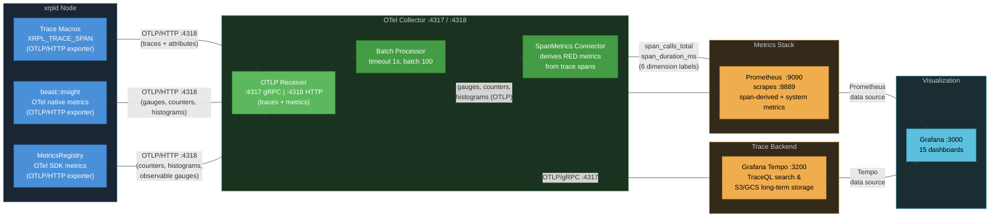

# Observability Data Collection Reference

> **Audience**: Developers and operators. This is the single source of truth for all telemetry data collected by xrpld's observability stack.
>
> **Related docs**: [docs/telemetry-runbook.md](../docs/telemetry-runbook.md) (operator runbook with alerting and troubleshooting) | [03-implementation-strategy.md](./03-implementation-strategy.md) (code structure and performance optimization) | [docs/telemetry-runbook.md § Protocol Span Flow](../docs/telemetry-runbook.md#protocol-span-flow) (authoritative span-flow reference; replaces the deleted `04-code-samples.md`)

## Data Flow Overview



There are three independent telemetry pipelines entering a single **OTel Collector** via the same OTLP receiver — nodes **A**, **B**, and **C** in the diagram above:

1. **OpenTelemetry Traces** (**A**) — Distributed spans with attributes, exported via OTLP/HTTP (:4318) to the collector's **OTLP Receiver**. The **Batch Processor** groups spans (1s timeout, batch size 100) before forwarding to trace backends. The **SpanMetrics Connector** derives RED metrics (rate, errors, duration) from every span and feeds them into the metrics pipeline.
2. **beast::insight OTel Metrics** (**B**) — System-level gauges, counters, and histograms exported natively via OTLP/HTTP (:4318) to the same **OTLP Receiver**. These are batched and exported to Prometheus alongside span-derived metrics. The StatsD UDP transport has been replaced by native OTLP; `server=statsd` remains available as a fallback.
3. **MetricsRegistry OTel SDK Metrics** (**C**) — Counters, histograms, and observable gauges registered directly with the OTel Metrics SDK, exported via OTLP/HTTP (:4318). This pipeline owns its own `MeterProvider` and reader, separate from **B**'s, so its export cadence is independent — see [§2.5](#25-per-job-type-queue-gauges) for why that matters when comparing the two.

A third, narrower metrics path exists for instruments created at their call site through the
`XRPL_METRIC_*` macros. These use the OTel Metrics SDK directly and reach the collector's OTLP
receiver rather than the StatsD receiver, so their names carry no `xrpld_` prefix. The seven
call-site instruments are documented with the families they belong to:
`rpc_in_flight_requests` in
[§Per-RPC Method Metrics](#per-rpc-method-metrics-synchronous-countershistogram), the five
`getobject_*` in [§GetObject Request Path](#getobject-request-path-synchronous-countershistograms),
and `ledgers_closed_total` in [§Synchronous Counters (Phase 7+)](#synchronous-counters-phase-7).
Code in `libxrpl` cannot use these macros and always goes through `beast::insight` instead.

**Trace backend** — The collector exports traces via OTLP/gRPC to:

- **Grafana Tempo** — Preferred trace backend. Supports TraceQL queries at `:3200`, S3/GCS object storage for cost-effective long-term trace retention, and integrates natively with Grafana.

> **Further reading**: [00-tracing-fundamentals.md](./00-tracing-fundamentals.md) for core OpenTelemetry concepts (traces, spans, context propagation, sampling). [07-observability-backends.md](./07-observability-backends.md) for production backend selection, collector placement, and sampling strategies.

---

## 1. OpenTelemetry Spans

### 1.1 Complete Span Inventory (41 spans)

> **41 emitted span-name families.** The count is derived from the `*SpanNames.h`
> headers and their call sites, one family per distinct span name
> (`rpc.command.<name>` and `grpc.<MethodName>` each count once, since the
> command / method name is a parameter of a single family). The tables below list
> all 41: RPC 5, gRPC 1, transaction 6, TxQ 6, consensus 13, ledger 4, peer 2,
> pathfind 4. The Phase-10 validation harness
> (`docker/telemetry/workload/expected_spans.json`) catalogues **40** of them —
> `rpc.ws_upgrade` has no entry.

> **See also**: [02-design-decisions.md §2.3](./02-design-decisions.md#23-span-naming-conventions) for naming conventions and the full span catalog with rationale. [docs/telemetry-runbook.md § Protocol Span Flow](../docs/telemetry-runbook.md#protocol-span-flow) for the span flow diagrams (the former `04-code-samples.md` §4.6 was deleted).

> **Span names vs. attribute keys**: span names use dotted `subsystem.operation`
> form (e.g. `rpc.http_request`). Span _attribute_ keys use the bare/underscore
> form from the 2026-05-13 naming redesign (e.g. `tx_hash`, not `xrpl.tx.hash`). <!-- otel-naming:allow-dotted: xrpl.tx.hash -->
> The dotted `xrpl.*` form is reserved for OTel **resource** attributes set once
> at startup. See §1.2 for the full attribute inventory.

#### RPC Spans

Controlled by `trace_rpc=1` in `[telemetry]` config.

| Span Name            | Parent             | Source File       | Description                                                              |
| -------------------- | ------------------ | ----------------- | ------------------------------------------------------------------------ |
| `rpc.http_request`   | —                  | ServerHandler.cpp | Top-level HTTP JSON-RPC request entry point                              |
| `rpc.ws_message`     | —                  | ServerHandler.cpp | WebSocket message handling (one per inbound frame)                       |
| `rpc.ws_upgrade`     | —                  | ServerHandler.cpp | WebSocket upgrade handshake (records handshake failures)                 |
| `rpc.process`        | `rpc.http_request` | ServerHandler.cpp | RPC processing pipeline (single or batch request)                        |
| `rpc.command.<name>` | `rpc.process`      | RPCHandler.cpp    | Per-command span (e.g., `rpc.command.server_info`, `rpc.command.ledger`) |

**Where to find**: Tempo → TraceQL: `{resource.service.name="xrpld" && name=~"rpc.http_request|rpc.command.*"}`

**Grafana dashboard**: _RPC Performance_ (`rpc-performance`)

#### gRPC Spans

Controlled by `trace_rpc=1` in `[telemetry]` config.

| Span Name           | Parent | Source File    | Description                                                                                                               |
| ------------------- | ------ | -------------- | ------------------------------------------------------------------------------------------------------------------------- |
| `grpc.<MethodName>` | —      | GRPCServer.cpp | One flat span per gRPC method (e.g., `grpc.GetLedger`, `grpc.GetLedgerData`, `grpc.GetLedgerDiff`, `grpc.GetLedgerEntry`) |

The method name is embedded in the span name (formed at the call site as
`grpc.<MethodName>`), so dashboards break out per-method latency and error
rates without TraceQL attribute filters.

**Where to find**: Tempo → TraceQL: `{resource.service.name="xrpld" && name=~"grpc.*"}`

**Grafana dashboard**: _RPC Performance_ (`rpc-performance`)

#### Transaction Spans

Controlled by `trace_transactions=1` in `[telemetry]` config.

| Span Name       | Parent         | Source File     | Description                                                       |
| --------------- | -------------- | --------------- | ----------------------------------------------------------------- |
| `tx.process`    | —              | NetworkOPs.cpp  | Transaction submission entry point (local or peer-relayed)        |
| `tx.receive`    | —              | PeerImp.cpp     | Raw transaction received from peer overlay (before deduplication) |
| `tx.apply`      | `ledger.build` | BuildLedger.cpp | Transaction set applied to new ledger during consensus            |
| `tx.preflight`  | —              | applySteps.cpp  | Stateless checks stage (`stage=preflight`)                        |
| `tx.preclaim`   | —              | applySteps.cpp  | Ledger-aware checks stage before fee claim (`stage=preclaim`)     |
| `tx.transactor` | —              | Transactor.cpp  | Apply stage — the transactor runs (`stage=apply`)                 |

The three apply-pipeline spans share a deterministic `trace_id` derived from
`txID[0:16]`, so preflight, preclaim, and transactor for one transaction group
under a single trace even though they run sequentially and often on different
threads. A transaction that hard-fails preflight or preclaim never reaches the
later spans — the `stage` attribute identifies where it stopped.

> **Deterministic roots are true roots.** Spans with a deterministic `trace_id`
> (the `tx.*` apply pipeline, `tx.process`, `tx.receive`, and `consensus.round`)
> are emitted as genuine trace roots with an empty `parent_span_id`. The chosen
> `trace_id` is injected through a custom `DeterministicIdGenerator` on the SDK's
> no-parent branch, so there is no synthetic placeholder parent — Tempo shows a
> clean root, not a "root span not yet received" warning. Cross-node correlation
> still works because every node derives the same `trace_id` from the shared hash.

> **Log-trace correlation is retained across coroutines.** OTel context storage
> is coroutine-aware (backed by `LocalValue`), so the active span travels with a
> coroutine across `yield()` and resumes on whatever thread the scheduler picks.
> RPC, consensus, and transaction spans therefore keep per-line log-trace
> correlation, and their scopes are safe across coroutine yields. Job-handoff
> spans — transaction apply and receive, consensus accept, and ledger acquire —
> are activated inside their worker bodies rather than at enqueue, so each
> worker's log lines carry the span's trace context.

**Where to find**: Tempo → TraceQL: `{resource.service.name="xrpld" && name=~"tx.process|tx.receive"}`
or, for the apply pipeline: `{resource.service.name="xrpld" && name=~"tx.preflight|tx.preclaim|tx.transactor"}`

**Grafana dashboard**: _Transaction Overview_ (`transaction-overview`)

#### Transaction Queue (TxQ) Spans

Controlled by `trace_transactions=1` in `[telemetry]` config.

| Span Name          | Parent                                                      | Source File | Description                                                                                                                                             |
| ------------------ | ----------------------------------------------------------- | ----------- | ------------------------------------------------------------------------------------------------------------------------------------------------------- |
| `txq.enqueue`      | `tx.process` (submission path; root on open-ledger rebuild) | TxQ.cpp     | Queue admission decision (apply/queue/reject). Parents to `tx.process` via explicit context on submit; correlates via `current_ledger_seq` on all paths |
| `txq.apply_direct` | `txq.enqueue`                                               | TxQ.cpp     | Direct apply attempt that bypasses the queue                                                                                                            |
| `txq.batch_clear`  | `txq.enqueue`                                               | TxQ.cpp     | Batch clear of an account's queued txs                                                                                                                  |
| `txq.accept`       | —                                                           | TxQ.cpp     | Ledger-close accept loop (drains the queue)                                                                                                             |
| `txq.accept_tx`    | `txq.accept`                                                | TxQ.cpp     | Per-queued-transaction apply inside the accept loop                                                                                                     |
| `txq.cleanup`      | —                                                           | TxQ.cpp     | Post-close cleanup of expired queue entries                                                                                                             |

**Where to find**: Tempo → TraceQL: `{resource.service.name="xrpld" && name=~"txq.*"}`

**Grafana dashboard**: _Transaction Overview_ (`transaction-overview`)

#### Consensus Spans

Controlled by `trace_consensus=1` in `[telemetry]` config.

| Span Name                      | Parent                | Source File      | Description                                                         |
| ------------------------------ | --------------------- | ---------------- | ------------------------------------------------------------------- |
| `consensus.round`              | — (root)              | RCLConsensus.cpp | Root span for one consensus round (deterministic trace per round)   |
| `consensus.phase.open`         | `consensus.round`     | Consensus.h      | Open phase — collecting transactions before close                   |
| `consensus.proposal.send`      | `consensus.round`     | RCLConsensus.cpp | Node broadcasts its transaction set proposal                        |
| `consensus.ledger_close`       | `consensus.round`     | RCLConsensus.cpp | Ledger close event triggered by consensus                           |
| `consensus.establish`          | `consensus.round`     | Consensus.h      | Establish phase — converging on the transaction set                 |
| `consensus.update_positions`   | `consensus.establish` | Consensus.h      | Position update with per-dispute vote details                       |
| `consensus.check`              | `consensus.establish` | Consensus.h      | Consensus threshold check (agree/disagree tally)                    |
| `consensus.accept`             | `consensus.round`     | RCLConsensus.cpp | Consensus accepts a ledger (round complete)                         |
| `consensus.accept.apply`       | `consensus.accept`    | RCLConsensus.cpp | Ledger application with close-time details (jtACCEPT thread)        |
| `consensus.validation.send`    | `consensus.round`     | RCLConsensus.cpp | Validation message sent after ledger accepted (follows-from link)   |
| `consensus.mode_change`        | `consensus.round`     | RCLConsensus.cpp | Operating-mode transition during the round                          |
| `consensus.proposal.receive`   | (context)             | PeerImp.cpp      | Proposal received from a peer (context-propagated into the round)   |
| `consensus.validation.receive` | (context)             | PeerImp.cpp      | Validation received from a peer (context-propagated into the round) |

The `.receive` spans are created per-message in the overlay and joined to the
round trace via context propagation rather than direct parenting. The
`consensus.validation.send` span uses a follows-from link off the round.

> **`update_positions` and `check` sit one level below `establish`, not below
> the round.** Both are created with
> `SpanGuard::childSpan(..., establishSpanContext_)`
> (`include/xrpl/consensus/Consensus.h:1628` and `:1837`), and
> `consensus.establish` is itself parented to `roundSpanContext_`
> (`Consensus.h:2099-2101`). An earlier revision of this table showed them as
> direct children of `consensus.round`; queries or trace-shape assertions built
> on that tree are wrong by one level.

**Where to find**: Tempo → TraceQL: `{resource.service.name="xrpld" && name=~"consensus.*"}`

**Grafana dashboard**: _Consensus Health_ (`consensus-health`)

#### Ledger Spans

Controlled by `trace_ledger=1` in `[telemetry]` config.

| Span Name         | Parent | Source File       | Description                                    |
| ----------------- | ------ | ----------------- | ---------------------------------------------- |
| `ledger.build`    | —      | BuildLedger.cpp   | Build new ledger from accepted transaction set |
| `ledger.validate` | —      | LedgerMaster.cpp  | Ledger promoted to validated status            |
| `ledger.store`    | —      | LedgerMaster.cpp  | Ledger stored to database/history              |
| `ledger.acquire`  | —      | InboundLedger.cpp | Fetch a missing ledger from peers              |

**Where to find**: Tempo → TraceQL: `{resource.service.name="xrpld" && name=~"ledger.*"}`

**Grafana dashboard**: _Ledger Operations_ (`ledger-operations`)

#### Peer Spans

Controlled by `trace_peer` in `[telemetry]` config. **Enabled by default** (high volume).

| Span Name                 | Parent | Source File | Description                           |
| ------------------------- | ------ | ----------- | ------------------------------------- |
| `peer.proposal.receive`   | —      | PeerImp.cpp | Consensus proposal received from peer |
| `peer.validation.receive` | —      | PeerImp.cpp | Validation message received from peer |

A `—` parent means the span is a fresh trace root (`kConsumer`): it is started
via `ScopedSpanGuard::freshRoot()` at the inbound-message entry point and never
inherits an ambient span left active on the peer thread, so it does not nest
under an unrelated transaction's trace.

**Where to find**: Tempo → TraceQL: `{resource.service.name="xrpld" && name=~"peer.*"}`

**Grafana dashboard**: _Peer Network_ (`peer-network`)

#### PathFind Spans

Controlled by `trace_rpc=1` in `[telemetry]` config.

| Span Name             | Parent               | Source File                            | Description                                                |
| --------------------- | -------------------- | -------------------------------------- | ---------------------------------------------------------- |
| `pathfind.request`    | `rpc.command.<name>` | PathFind.cpp:27, RipplePathFind.cpp:36 | `path_find` / `ripple_path_find` RPC entry                 |
| `pathfind.compute`    | `pathfind.request`   | PathRequest.cpp:750                    | Path computation for one request (`PathRequest::doUpdate`) |
| `pathfind.discover`   | `pathfind.compute`   | PathRequest.cpp:599-600                | Graph exploration (one per RPC call)                       |
| `pathfind.update_all` | —                    | PathRequestManager.cpp:88-92           | Async recomputation of all active requests at ledger close |

> **Note**: `pathfind.request` nests under the active `rpc.command.<name>` span.
> Because OTel context storage is coroutine-aware (backed by `LocalValue`), the
> `rpc.command.*` scope stays correct even though its generic dispatch
> (`callMethod`) also wraps handlers such as `doRipplePathFind` whose span is held
> across a coroutine `yield()` — the ambient context travels with the coroutine
> when it resumes, so there is no wrong-thread scope pop. The
> `pathfind.request → compute → discover` sub-tree therefore parents to
> `rpc.command.<name>`, giving an exact request-to-pathfind nesting.

**Where to find**: Tempo → TraceQL: `{resource.service.name="xrpld" && name=~"pathfind.*"}`

---

### 1.2 Complete Attribute Inventory (bare/underscore keys)

> **See also**: [02-design-decisions.md §2.4.2](./02-design-decisions.md#242-span-attributes-by-category) for attribute design rationale and privacy considerations.

Every span can carry key-value attributes that provide context for filtering and
aggregation. Per the 2026-05-13 naming redesign, span-attribute keys use the
**bare** field name (the span name already carries the domain), or the
`<domain>_<field>` underscore form where a bare name would collide (e.g.
`rpc_status`, `grpc_status`, `tx_status`, `txq_status`).

> **Dotted keys are resource attributes, never span attributes:**
>
> - `xrpl.network.id` and `xrpl.network.type` are **resource** attributes set
>   once at startup on the OTel resource — not span attributes. They appear on
>   every span's resource scope, queried as `{resource.xrpl.network.id=...}`.
> - The ledger hash uses the bare `ledger_hash` key on every span that records
>   it (both `consensus.validation.send` and `peer.validation.receive`) — there
>   is no dotted span attribute.

The tables below list one row per attribute per subsystem, so a key shared by two subsystems (for example `ledger_seq`) appears once in each. That is 89 rows over 78 distinct keys. The §6 per-header counts use the same row-based rule, so they sum to 89.

#### RPC Attributes

| Attribute              | Type    | Set On                            | Description                                      |
| ---------------------- | ------- | --------------------------------- | ------------------------------------------------ |
| `command`              | string  | `rpc.command.*`, `rpc.ws_message` | RPC command name (e.g., `server_info`, `ledger`) |
| `version`              | int64   | `rpc.command.*`                   | API version number                               |
| `rpc_role`             | string  | `rpc.command.*`                   | Caller role: `"admin"` or `"user"`               |
| `rpc_status`           | string  | `rpc.command.*`                   | Result: `"success"` or `"error"`                 |
| `request_payload_size` | int64   | `rpc.http_request`                | Bytes of inbound request payload                 |
| `is_batch`             | boolean | `rpc.process`                     | `true` if the request is a JSON-RPC batch        |
| `batch_size`           | int64   | `rpc.process`                     | Number of sub-requests in a batch                |
| `load_type`            | string  | `rpc.command.*`                   | Resource cost category after execution           |

**Tempo query**: `{span.command="server_info"}` to find all `server_info` calls.

**Prometheus label**: `command` (used as a SpanMetrics dimension).

#### gRPC Attributes

| Attribute     | Type   | Set On              | Description                          |
| ------------- | ------ | ------------------- | ------------------------------------ |
| `method`      | string | `grpc.<MethodName>` | gRPC method name (e.g., `GetLedger`) |
| `grpc_role`   | string | `grpc.<MethodName>` | Caller role: `"admin"` or `"user"`   |
| `grpc_status` | string | `grpc.<MethodName>` | Result: `"success"` or `"error"`     |

**Tempo query**: `{span.method="GetLedger"}` or `{name="grpc.GetLedger"}`.

**Prometheus labels**: `method`, `grpc_role`, `grpc_status` (SpanMetrics dimensions).

#### Transaction Attributes

| Attribute             | Type    | Set On                                                       | Description                                                                                                                           |
| --------------------- | ------- | ------------------------------------------------------------ | ------------------------------------------------------------------------------------------------------------------------------------- |
| `tx_hash`             | string  | `tx.process`, `tx.receive`                                   | Transaction hash (hex-encoded)                                                                                                        |
| `local`               | boolean | `tx.process`                                                 | `true` if locally submitted, `false` if peer-relayed                                                                                  |
| `path`                | string  | `tx.process`                                                 | Submission path: `"sync"` or `"async"`                                                                                                |
| `tx_type`             | string  | `tx.process`, `tx.preflight`, `tx.preclaim`, `tx.transactor` | Transaction type name (e.g., `Payment`)                                                                                               |
| `fee`                 | int64   | `tx.process`                                                 | Transaction fee in drops                                                                                                              |
| `sequence`            | int64   | `tx.process`                                                 | Transaction sequence number                                                                                                           |
| `suppressed`          | boolean | `tx.receive`                                                 | `true` if transaction was suppressed (duplicate)                                                                                      |
| `tx_status`           | string  | `tx.receive`                                                 | Transaction status (e.g., `"known_bad"`)                                                                                              |
| `peer_id`             | int64   | `tx.receive`                                                 | Peer identifier (also set on peer spans)                                                                                              |
| `peer_version`        | string  | `tx.receive`                                                 | Peer protocol version string                                                                                                          |
| `stage`               | string  | `tx.preflight`, `tx.preclaim`, `tx.transactor`               | Apply-pipeline stage: `preflight`, `preclaim`, or `apply`                                                                             |
| `ter_result`          | string  | `tx.preflight`, `tx.preclaim`, `tx.transactor`               | Engine result token for that stage (e.g., `tesSUCCESS`, `terPRE_SEQ`)                                                                 |
| `applied`             | boolean | `tx.transactor`                                              | `true` if the transaction was applied to the ledger                                                                                   |
| `current_ledger_seq`  | int64   | `tx.process`, `tx.receive`, `tx.preclaim`, `tx.transactor`   | Seq of the ledger being worked on (open/in-flight, not established) — joins the txID-keyed spans to the ledger trace                  |
| `current_ledger_hash` | string  | `tx.preclaim`, `tx.transactor`                               | Parent hash of that ledger (= `consensus.round` trace-id seed on the build path). View-bearing stages only; `tx.preflight` omits both |

**Tempo query**: `{span.tx_hash="<hash>"}` to trace a specific transaction across nodes.
Join a transaction's work to its ledger with `{span.current_ledger_seq=<N>}`.

**Prometheus labels**: `local`, `suppressed`, `tx_type`, `ter_result`, `stage` (SpanMetrics dimensions).

#### Transaction Queue (TxQ) Attributes

| Attribute             | Type    | Set On                         | Description                                                                      |
| --------------------- | ------- | ------------------------------ | -------------------------------------------------------------------------------- |
| `tx_hash`             | string  | `txq.enqueue`, `txq.accept_tx` | Transaction hash                                                                 |
| `tx_type`             | string  | `txq.enqueue`                  | Transaction type name                                                            |
| `current_ledger_seq`  | int64   | `txq.enqueue`                  | Seq of the ledger being worked on — correlates the enqueue to the ledger trace   |
| `current_ledger_hash` | string  | `txq.enqueue`                  | Parent hash of that ledger (= `consensus.round` trace-id seed on the build path) |
| `txq_status`          | string  | `txq.enqueue`, `txq.accept_tx` | Queue outcome (e.g. `queued`, `applied_direct`, `rejected`)                      |
| `fee_level_paid`      | int64   | `txq.enqueue`                  | Fee level paid by the queued tx                                                  |
| `required_fee_level`  | int64   | `txq.enqueue`                  | Minimum fee level for inclusion                                                  |
| `num_cleared`         | int64   | `txq.batch_clear`              | Entries cleared in a batch                                                       |
| `queue_size`          | int64   | `txq.accept`                   | Current TxQ depth                                                                |
| `ledger_changed`      | boolean | `txq.accept`                   | Whether the ledger changed since last attempt                                    |
| `ter_code`            | int64   | `txq.accept_tx`                | Transaction engine result code                                                   |
| `retries_remaining`   | int64   | `txq.accept_tx`                | Retries left before discard                                                      |
| `ledger_seq`          | int64   | `txq.cleanup`                  | Ledger sequence number                                                           |
| `expired_count`       | int64   | `txq.cleanup`                  | Number of expired entries cleared                                                |

**Prometheus label**: `txq_status` (SpanMetrics dimension).

#### Consensus Attributes

| Attribute                   | Type    | Set On                                                                                             | Description                                              |
| --------------------------- | ------- | -------------------------------------------------------------------------------------------------- | -------------------------------------------------------- |
| `consensus_ledger_id`       | string  | `consensus.round`                                                                                  | Previous-ledger id anchoring the round                   |
| `ledger_seq`                | int64   | `consensus.round`, `consensus.ledger_close`, `consensus.accept.apply`, `consensus.validation.send` | Ledger sequence number                                   |
| `consensus_mode`            | string  | `consensus.round`, `consensus.ledger_close`                                                        | Node mode: `"Proposing"`, `"Observing"`, `"Wrong"`, etc. |
| `consensus_round_id`        | int64   | `consensus.round`                                                                                  | Round identifier                                         |
| `consensus_phase`           | string  | `consensus.round`                                                                                  | Current phase name (updated on each transition)          |
| `trace_strategy`            | string  | `consensus.round`                                                                                  | Trace-id strategy (`deterministic` / `attribute`)        |
| `previous_ledger_seq`       | int64   | `consensus.round`                                                                                  | Sequence of the previous ledger                          |
| `previous_proposers`        | int64   | `consensus.round`                                                                                  | Proposer count in the previous round                     |
| `previous_round_time_ms`    | int64   | `consensus.round`                                                                                  | Duration of the previous round                           |
| `consensus_round`           | int64   | `consensus.proposal.send`                                                                          | Proposal sequence number for the broadcast proposal      |
| `is_bow_out`                | boolean | `consensus.proposal.send`                                                                          | Whether the proposal is a bow-out (resigning the round)  |
| `tx_count_open`             | int64   | `consensus.ledger_close`                                                                           | Transactions in the open ledger at close                 |
| `close_time_resolution_ms`  | int64   | `consensus.ledger_close`                                                                           | Close-time rounding granularity                          |
| `converge_percent`          | int64   | `consensus.establish`, `consensus.update_positions`, `consensus.check`                             | Convergence percentage                                   |
| `establish_count`           | int64   | `consensus.establish`, `consensus.check`                                                           | Establish-phase iteration count                          |
| `proposers`                 | int64   | `consensus.establish`, `consensus.update_positions`, `consensus.accept`                            | Number of proposers                                      |
| `disputes_count`            | int64   | `consensus.establish`, `consensus.update_positions`                                                | Number of disputed transactions                          |
| `tx_id`                     | string  | `consensus.update_positions`                                                                       | Disputed transaction id (per-dispute event)              |
| `dispute_our_vote`          | boolean | `consensus.update_positions`                                                                       | Our vote on the disputed tx                              |
| `dispute_yays`              | int64   | `consensus.update_positions`                                                                       | Yes votes on the disputed tx                             |
| `dispute_nays`              | int64   | `consensus.update_positions`                                                                       | No votes on the disputed tx                              |
| `avalanche_threshold`       | int64   | `consensus.update_positions`                                                                       | Escalated weight needed to change our vote               |
| `close_time_threshold`      | int64   | `consensus.update_positions`                                                                       | Close-time agreement threshold percentage                |
| `agree_count`               | int64   | `consensus.check`                                                                                  | Agreeing proposer count                                  |
| `disagree_count`            | int64   | `consensus.check`                                                                                  | Disagreeing proposer count                               |
| `threshold_percent`         | int64   | `consensus.check`                                                                                  | Agreement threshold percentage                           |
| `have_close_time_consensus` | boolean | `consensus.update_positions`, `consensus.check`                                                    | Whether the close time reached consensus                 |
| `proposers_finished`        | int64   | `consensus.check`                                                                                  | Proposers that have already validated the next ledger    |
| `consensus_stalled`         | boolean | `consensus.check`                                                                                  | Whether `checkConsensus` reported a stall                |
| `consensus_result`          | string  | `consensus.check`                                                                                  | Check outcome                                            |
| `quorum`                    | int64   | `consensus.accept`                                                                                 | Quorum required                                          |
| `round_time_ms`             | int64   | `consensus.accept`, `consensus.accept.apply`                                                       | Total consensus round duration in milliseconds           |
| `consensus_state`           | string  | `consensus.accept.apply`                                                                           | Consensus outcome: `"finished"` or `"moved_on"`          |
| `close_time`                | int64   | `consensus.accept.apply`                                                                           | Agreed-upon ledger close time (epoch seconds)            |
| `close_time_correct`        | boolean | `consensus.accept.apply`                                                                           | Whether validators agreed on close time                  |
| `close_resolution_ms`       | int64   | `consensus.accept.apply`                                                                           | Close-time rounding granularity in milliseconds          |
| `proposing`                 | boolean | `consensus.accept.apply`, `consensus.validation.send`                                              | Whether this node was a proposer                         |
| `parent_close_time`         | int64   | `consensus.accept.apply`                                                                           | Parent ledger close time                                 |
| `close_time_self`           | int64   | `consensus.accept.apply`                                                                           | This node's close-time vote                              |
| `close_time_vote_bins`      | string  | `consensus.accept.apply`                                                                           | Distribution of close-time votes                         |
| `resolution_direction`      | string  | `consensus.accept.apply`                                                                           | Whether close resolution increased/decreased/unchanged   |
| `tx_count`                  | int64   | `consensus.accept.apply`                                                                           | Transactions in the accepted set                         |
| `ledger_hash`               | string  | `consensus.validation.send`                                                                        | Full hash of the validated ledger (shared with peer)     |
| `full_validation`           | boolean | `consensus.validation.send`                                                                        | Whether this is a full validation                        |
| `validation_sign_time`      | int64   | `consensus.validation.send`                                                                        | Validation signing time                                  |
| `mode_old`                  | string  | `consensus.mode_change`                                                                            | Operating mode before the transition                     |
| `mode_new`                  | string  | `consensus.mode_change`                                                                            | Operating mode after the transition                      |

> **`quorum` is on `consensus.accept` only.** Its single set site is
> `RCLConsensus::Adaptor::makeAcceptSpan()`
> (`src/xrpld/app/consensus/RCLConsensus.cpp:516`). `consensus.check`
> (`include/xrpl/consensus/Consensus.h:1899-1926`) never sets it, so
> `{name="consensus.check" && span.quorum>0}` matches nothing.

> **`consensus.check` carries nine attributes, all set before the early
> returns.** `Consensus<Adaptor>::haveConsensus()` sets them at
> `include/xrpl/consensus/Consensus.h:1899-1911` and `consensus_result` at
> `:1926`, deliberately ahead of the `No` / `Expired` branches, so the span is
> fully populated even on rounds that never reach consensus. In set order:
> `agree_count`, `disagree_count`, `converge_percent`,
> `have_close_time_consensus`, `threshold_percent`, `proposers_finished`,
> `consensus_stalled`, `establish_count`, `consensus_result`.
>
> Three of these are shared with sibling spans and were previously scoped too
> narrowly in the table above: `converge_percent` and `establish_count` are set on
> `consensus.check` as well as `consensus.establish` /
> `consensus.update_positions`, and `have_close_time_consensus` is set on both
> `consensus.update_positions` (`Consensus.h:1779`) and `consensus.check`
> (`:1903`). `close_time_threshold` (`:1781`) and `avalanche_threshold` (`:1730`)
> stay `consensus.update_positions`-only.

**Tempo query**: `{span.consensus_mode="Proposing"}` to find rounds where the node was proposing.

**Prometheus labels**: `consensus_mode`, `consensus_state`, `consensus_phase`, `consensus_result`, `consensus_stalled`, `mode_new`, `close_time_correct` (SpanMetrics dimensions).

#### Ledger Attributes

| Attribute             | Type    | Set On                                            | Description                                      |
| --------------------- | ------- | ------------------------------------------------- | ------------------------------------------------ |
| `ledger_seq`          | int64   | `ledger.build`, `ledger.validate`, `ledger.store` | Ledger sequence number                           |
| `close_time`          | int64   | `ledger.build`                                    | Ledger close time (epoch seconds)                |
| `close_time_correct`  | boolean | `ledger.build`                                    | Whether close time was agreed upon by validators |
| `close_resolution_ms` | int64   | `ledger.build`                                    | Close time rounding granularity in milliseconds  |
| `tx_count`            | int64   | `tx.apply`                                        | Transactions applied to the ledger               |
| `tx_failed`           | int64   | `tx.apply`                                        | Failed transactions in the apply set             |
| `validations`         | int64   | `ledger.validate`                                 | Number of validations received for this ledger   |
| `acquire_reason`      | string  | `ledger.acquire`                                  | Fetch trigger (`history`/`consensus`/`generic`)  |
| `timeouts`            | int64   | `ledger.acquire`                                  | Number of fetch timeouts                         |
| `peer_count`          | int64   | `ledger.acquire`                                  | Peers queried during the fetch                   |
| `outcome`             | string  | `ledger.acquire`                                  | Fetch outcome (`complete`/`failed`/`aborted`)    |

The apply-step span `tx.apply` (child of `ledger.build`) carries `tx_count`/`tx_failed`;
the parent `ledger.build` carries `ledger_seq` and the close-time attributes.
`ledger.acquire` (InboundLedger) also sets `ledger_seq`.

`outcome` takes one of **three** values, not two. `complete` and `failed` are both set in
`done()` (`InboundLedger.cpp:530-532`), where `failed` covers both giving up after the
retry limit and hitting unusable ledger data, so a `failed` span can carry `timeouts=0`. `aborted` is set in `~InboundLedger()` when the object is destroyed while
`!isDone()` (`InboundLedger.cpp:242-246`) — the acquisition was **abandoned** before it
finished, rather than having run to its retry limit. The abort path records `timeouts` but
deliberately **not** `peer_count`, because reading the peer count goes through `Overlay`, which
a destructor must not depend on still existing. A query that only groups by
`complete`/`failed` therefore silently loses every abandoned fetch.

**Tempo query**: `{span.ledger_seq=12345}` to find all spans for a specific ledger.

#### Peer Attributes

| Attribute            | Type    | Set On                                                           | Description                                          |
| -------------------- | ------- | ---------------------------------------------------------------- | ---------------------------------------------------- |
| `peer_id`            | int64   | `tx.receive`, `peer.proposal.receive`, `peer.validation.receive` | Peer identifier                                      |
| `proposal_trusted`   | boolean | `peer.proposal.receive`                                          | Whether the proposal came from a trusted validator   |
| `validation_trusted` | boolean | `peer.validation.receive`                                        | Whether the validation came from a trusted validator |
| `full_validation`    | boolean | `peer.validation.receive`                                        | Whether the validation is a full validation          |
| `ledger_hash`        | string  | `peer.validation.receive`                                        | Validated ledger hash (shared with consensus spans)  |

**Prometheus labels**: `proposal_trusted`, `validation_trusted` (SpanMetrics dimensions).

#### PathFind Attributes

| Attribute                 | Type    | Set On                | Description                              |
| ------------------------- | ------- | --------------------- | ---------------------------------------- |
| `pathfind_source_account` | string  | `pathfind.request`    | Originating account for the path search  |
| `pathfind_dest_account`   | string  | `pathfind.request`    | Destination account                      |
| `pathfind_fast`           | boolean | `pathfind.compute`    | Whether fast pathfinding mode is enabled |
| `pathfind_search_level`   | int64   | `pathfind.discover`   | Depth of graph exploration               |
| `pathfind_num_paths`      | int64   | `pathfind.discover`   | Total paths produced                     |
| `pathfind_ledger_index`   | int64   | `pathfind.update_all` | Target ledger index                      |
| `pathfind_num_requests`   | int64   | `pathfind.update_all` | Active requests recomputed               |

---

### 1.3 SpanMetrics — Derived Prometheus Metrics

> **See also**: [01-architecture-analysis.md](./01-architecture-analysis.md) §1.8.2 for how span-derived metrics map to operational insights.

The OTel Collector's SpanMetrics connector automatically generates RED (Rate, Errors, Duration) metrics from every span. No custom metrics code in xrpld is needed.

| Prometheus Metric                   | Type      | Description                                                                                                                                                                                                                                                                                                   |
| ----------------------------------- | --------- | ------------------------------------------------------------------------------------------------------------------------------------------------------------------------------------------------------------------------------------------------------------------------------------------------------------- |
| `span_calls_total`                  | Counter   | Total span invocations                                                                                                                                                                                                                                                                                        |
| `span_duration_milliseconds_bucket` | Histogram | Latency distribution. Buckets come from the collector's spanmetrics config: 0.01, 0.05, 0.1, 0.25, 0.5, 1, 5, 10, 25, 50, 100, 250, 500 ms then 1, 2, 3, 4, 5, 10, 30 s. The sub-millisecond edges exist because most xrpld spans are far below 1 ms; without them every p95/p99 pinned to a constant 0.95 ms |
| `span_duration_milliseconds_count`  | Histogram | Observation count                                                                                                                                                                                                                                                                                             |
| `span_duration_milliseconds_sum`    | Histogram | Cumulative latency                                                                                                                                                                                                                                                                                            |

**Standard labels on every metric**: `span_name`, `status_code`, `service_name`, `span_kind`

**Additional dimension labels** (configured in `otel-collector-config.yaml`).
The Prometheus label is the **bare span-attribute key verbatim** — the
SpanMetrics connector does not rewrite or prefix it:

| Prometheus Label / Span Attribute | Type    | Applies To                                     |
| --------------------------------- | ------- | ---------------------------------------------- |
| `command`                         | string  | `rpc.command.*`                                |
| `rpc_status`                      | string  | `rpc.command.*`                                |
| `consensus_mode`                  | string  | `consensus.round`, `consensus.ledger_close`    |
| `close_time_correct`              | boolean | `consensus.accept.apply`                       |
| `local`                           | boolean | `tx.process`                                   |
| `suppressed`                      | boolean | `tx.receive`                                   |
| `proposal_trusted`                | boolean | `peer.proposal.receive`                        |
| `validation_trusted`              | boolean | `peer.validation.receive`                      |
| `tx_type`                         | string  | `tx.*`, `txq.enqueue`                          |
| `ter_result`                      | string  | `tx.preflight`, `tx.preclaim`, `tx.transactor` |
| `stage`                           | string  | `tx.preflight`, `tx.preclaim`, `tx.transactor` |
| `txq_status`                      | string  | `txq.enqueue`, `txq.accept_tx`                 |
| `consensus_state`                 | string  | `consensus.accept.apply`                       |
| `load_type`                       | string  | `rpc.command.*`                                |
| `is_batch`                        | boolean | `rpc.process`                                  |
| `mode_new`                        | string  | `consensus.mode_change`                        |
| `consensus_stalled`               | boolean | `consensus.check`                              |
| `consensus_phase`                 | string  | `consensus.round`                              |
| `consensus_result`                | string  | `consensus.check`                              |
| `method`                          | string  | `grpc.<MethodName>`                            |
| `grpc_role`                       | string  | `grpc.<MethodName>`                            |
| `grpc_status`                     | string  | `grpc.<MethodName>`                            |

The `stage` dimension (3 values: `preflight`, `preclaim`, `apply`) turns the
apply-pipeline spans into per-stage RED metrics with no native instruments — the
_Transaction Overview_ dashboard charts rate, p95 latency, and failure rate by stage.

> **Sampling caveat**: xrpld head sampling is fixed at 1.0 (every trace is
> recorded), so span-derived metrics are not undercounted at the node. If the
> collector is configured with tail sampling, span-derived metrics reflect only
> the retained traces, whereas native StatsD/meter metrics do not sample.
> Account for any collector-side tail sampling when reading absolute stage rates.

**Where to query**: Prometheus → `span_calls_total{span_name="rpc.command.server_info"}`

---

## 2. System Metrics (beast::insight — OTel native)

> **See also**: [02-design-decisions.md](./02-design-decisions.md) for the beast::insight coexistence design. [06-implementation-phases.md](./06-implementation-phases.md) for the Phase 6/7 metric inventory.
>
> **Migration complete**: Phase 7 replaced the StatsD UDP transport with native OTel Metrics SDK export via OTLP/HTTP. The `beast::insight::Collector` interface and all metric names are preserved — only the wire protocol changed. `[insight] server=statsd` remains as a fallback.

These are system-level metrics emitted by xrpld's `beast::insight` framework via OTel OTLP/HTTP. They cover operational data that doesn't map to individual trace spans.

### Configuration

```ini
# Recommended: native OTel metrics via OTLP/HTTP
[insight]
server=otel
endpoint=http://localhost:4318/v1/metrics
prefix=xrpld
```

Fallback (StatsD). `StatsDCollector` is still selected by this value, but the
stack in `docker/telemetry/` no longer receives it: using this path also requires
re-adding the `statsd` receiver to `otel-collector-config.yaml` and uncommenting
port 8125 in `docker-compose.yml`, otherwise the metrics go to a port nothing
listens on. Note also that `StatsDCollector` applies `prefix` to the metric name
while `OTelCollector` does not, so switching transports renames every series.

```ini
[insight]
server=statsd
address=127.0.0.1:8125
prefix=xrpld
```

### 2.1 Gauges

| Prometheus Metric                           | Source File           | Description                                       | Typical Range                   |
| ------------------------------------------- | --------------------- | ------------------------------------------------- | ------------------------------- |
| `ledgermaster_validated_ledger_age`         | LedgerMaster.h        | Seconds since last validated ledger               | 0–10 (healthy), >30 (stale)     |
| `ledgermaster_published_ledger_age`         | LedgerMaster.h        | Seconds since last published ledger               | 0–10 (healthy)                  |
| `state_accounting_disconnected_duration`    | NetworkOPs.cpp        | Cumulative **microseconds** in Disconnected state | Monotonic                       |
| `state_accounting_connected_duration`       | NetworkOPs.cpp        | Cumulative **microseconds** in Connected state    | Monotonic                       |
| `state_accounting_syncing_duration`         | NetworkOPs.cpp        | Cumulative **microseconds** in Syncing state      | Monotonic                       |
| `state_accounting_tracking_duration`        | NetworkOPs.cpp        | Cumulative **microseconds** in Tracking state     | Monotonic                       |
| `state_accounting_full_duration`            | NetworkOPs.cpp        | Cumulative **microseconds** in Full state         | Monotonic (should dominate)     |
| `state_accounting_disconnected_transitions` | NetworkOPs.cpp        | Count of transitions to Disconnected              | Low                             |
| `state_accounting_connected_transitions`    | NetworkOPs.cpp        | Count of transitions to Connected                 | Low                             |
| `state_accounting_syncing_transitions`      | NetworkOPs.cpp        | Count of transitions to Syncing                   | Low                             |
| `state_accounting_tracking_transitions`     | NetworkOPs.cpp        | Count of transitions to Tracking                  | Low                             |
| `state_accounting_full_transitions`         | NetworkOPs.cpp        | Count of transitions to Full                      | Low (should be 1 after startup) |
| `peer_finder_active_inbound_peers`          | PeerfinderManager.cpp | Active inbound peer connections                   | 0–85                            |
| `peer_finder_active_outbound_peers`         | PeerfinderManager.cpp | Active outbound peer connections                  | 10–21                           |
| `overlay_peer_disconnects`                  | OverlayImpl.cpp       | Cumulative peer disconnection count               | Low growth                      |
| `jobq_job_count`                            | JobQueue.cpp          | Current job queue depth (group `jobq`)            | 0–100 (healthy)                 |

> **`state_accounting_*_duration` is microseconds, not seconds.**
> `NetworkOPsImp::collectMetrics()` does
> `duration_cast<std::chrono::microseconds>(...)` and publishes `.count()`
> (`src/xrpld/app/misc/NetworkOPs.cpp:4884-4897`). Divide by `1e6` for seconds.
> The `node-health` "State Duration Rate (All States)" panel already does
> (`/ 1000000` on each `rate(...)`), and
> `docker/telemetry/grafana/dashboards/validate_dashboards.py:44-45` lints the
> family as "cumulative µs". Reading the raw value as seconds overstates time
> in state by a factor of one million.

> **`overlay_peer_disconnects_charges` was never implemented: NOT IMPLEMENTED.**
> No instrument of that name exists anywhere in `src/`, `include/` or `docker/`.
> The resource-charge disconnect count is exported from the OTel
> `MetricsRegistry` instead, as
> `server_info{metric="peer_disconnects_resources"}` — see
> [§Server Info](#server-info-via-otel-metricsregistry). Use that selector;
> the previously documented `overlay_peer_disconnects_charges` matches nothing.
> `06-implementation-phases.md` still names the old metric in its Phase 6/7
> task text and panel table.

**Grafana dashboard**: _Node Health_ (`node-health`)

### 2.2 Counters

| Prometheus Metric         | Source File        | Description                                   |
| ------------------------- | ------------------ | --------------------------------------------- |
| `rpc_requests`            | ServerHandler.cpp  | Total RPC requests received                   |
| `ledger_fetches`          | InboundLedgers.cpp | Inbound ledger fetch attempts                 |
| `ledger_history_mismatch` | LedgerHistory.cpp  | Ledger hash mismatches detected               |
| `warn`                    | Logic.h            | Resource manager warnings issued              |
| `drop`                    | Logic.h            | Resource manager drops (connections rejected) |

**Note**: With `server=otel`, `warn` and `drop` are properly exported as OTel Counter instruments. The previous StatsD `|m` type limitation no longer applies.

**Grafana dashboard**: _RPC & Pathfinding_ (`rpc-pathfinding`)

### 2.3 Histograms (Event timers)

| Prometheus Metric | Source File       | Unit | Description                    |
| ----------------- | ----------------- | ---- | ------------------------------ |
| `rpc_time`        | ServerHandler.cpp | ms   | RPC response time distribution |
| `rpc_size`        | ServerHandler.cpp | By\* | RPC response size (see note)   |
| `ios_latency`     | Application.cpp   | ms   | I/O service loop latency       |
| `pathfind_fast`   | PathRequests.h    | ms   | Fast pathfinding duration      |
| `pathfind_full`   | PathRequests.h    | ms   | Full pathfinding duration      |

Quantiles collected: 0th, 50th, 90th, 95th, 99th, 100th percentile.

\* **`rpc_size` records bytes, not a duration.** `beast::insight::Event`
declares a `Unit`, so this instrument is created with unit `By` and exports as
**`rpc_size_bytes_bucket`** on `kByteBuckets` (512 B to 1 MiB, placed from the
measured distribution). Queries and panels must use that name.

**Grafana dashboards**: _Node Health_ (`ios_latency`), _RPC & Pathfinding_ (`rpc_time`, `rpc_size`, `pathfind_*`)

### 2.4 Overlay Traffic Metrics

For each of the 45+ overlay traffic categories (defined in `TrafficCount.h`), four gauges are emitted:

- `{category}_bytes_in`
- `{category}_bytes_out`
- `{category}_messages_in`
- `{category}_messages_out`

**Key categories**:

| Category                                                          | Description                |
| ----------------------------------------------------------------- | -------------------------- |
| `total`                                                           | All traffic aggregated     |
| `overhead` / `overhead_overlay`                                   | Protocol overhead          |
| `transactions` / `transactions_duplicate`                         | Transaction relay          |
| `proposals` / `proposals_untrusted` / `proposals_duplicate`       | Consensus proposals        |
| `validations` / `validations_untrusted` / `validations_duplicate` | Consensus validations      |
| `ledger_data_get` / `ledger_data_share`                           | Ledger data exchange       |
| `ledger_data_Transaction_Node_get/share`                          | Transaction node data      |
| `ledger_data_Account_State_Node_get/share`                        | Account state node data    |
| `ledger_data_Transaction_Set_candidate_get/share`                 | Transaction set candidates |
| `getObject` / `haveTxSet` / `ledgerData`                          | Object requests            |
| `ping` / `status`                                                 | Keepalive and status       |
| `set_get`                                                         | Set requests               |

**Grafana dashboards**: _Network Traffic_ (`network-traffic`), _Overlay Traffic Detail_ (`overlay-traffic-detail`), _Ledger Data & Sync_ (`ledger-data-sync`)

### 2.5 Per-Job-Type Queue Gauges

Three gauge families give per-job-type queue pressure. Before them the only
exported queue signal was the process-wide `jobq_job_count`
([§2.1](#21-gauges)), which cannot attribute pressure to a job type.

| Prometheus Metric         | Description                                         |
| ------------------------- | --------------------------------------------------- |
| `jobq_<jobtype>_waiting`  | Backlog for this type: enqueued but not yet started |
| `jobq_<jobtype>_running`  | Currently executing for this type                   |
| `jobq_<jobtype>_deferred` | Held back by this type's concurrency limit          |

The gauge members live on `JobTypeData` (`include/xrpl/core/JobTypeData.h`) and
are published by `JobQueue::collect()`
(`src/libxrpl/core/detail/JobQueue.cpp`), which reads the same
`waiting`/`running`/`deferred` counters under the mutex that guards them. Values
are clamped at zero before publication, because the gauge value type is unsigned
and an unclamped negative would wrap to ~1.8e19 and swamp every panel reading
the family.

**Name derivation.** The collector is the `"jobq"` group
(`src/xrpld/app/main/Application.cpp`), so `GroupImp::makeName()`
(`src/libxrpl/beast/insight/Groups.cpp`) joins with a `.`, then
`OTelCollectorImp::formatName()`
(`src/libxrpl/beast/insight/OTelCollector.cpp`) lowercases and maps `.` to
`_`. The exported
name for `JtLedgerReq`, whose `JobTypeInfo` name is `ledgerRequest`, is
therefore `jobq_ledgerrequest_deferred` — bare and lowercase, with no `xrpld`
prefix. The same chain produces `jobq_job_count` from the gauge registered as
`job_count`.

**Coverage.** Emitted for the **35** job types that are not special. `JobTypes`
defines 46 entries plus the `invalid` sentinel
(`include/xrpl/core/JobTypes.h`); `JobTypeInfo::special()` is `limit_ == 0`, and
11 of the 46 have `limit == 0`, so `JobTypeData`'s constructor creates gauges for
the remaining 35. A special type's gauge stays default-constructed, and a
default `beast::insight::Gauge` holds a null impl whose mutators are no-ops, so
assigning to it publishes nothing.

**Why `deferred` is the metric to alert on.** `JobQueue::addJob()` never
rejects — it defers. A capped type under pressure therefore surfaces as latency
only after the fact, whereas a non-zero `deferred` reading precedes it. The
types where this bites are the ones with a low concurrency limit
(`JobTypes.h`): `JtPack` = 1 and `JtUpdatePf` = 1, `JtLedgerReq` = 3 and
`JtLedgerData` = 3, `JtTxnData` = 5.

> **Sampling caveat.** These are sampled, not integrated. The values are read
> when the SDK's periodic reader invokes the observable callbacks, which run the
> collector hooks; the export interval is 1000 ms
> (`export_interval_millis` in `src/libxrpl/telemetry/Telemetry.cpp:476`) and
> hook invocation is debounced to at most once per 500 ms. A spike shorter than
> the interval can be missed entirely, so read these as pressure indicators
> rather than as exact peak depths.

**Pipeline note.** Unlike the Phase 9 `job_*` counters and histograms, this
family flows through `beast::insight` → `OTelCollector`, **not** the
`XRPL_METRIC_*` macros. `JobQueue.cpp` is in `libxrpl` and those macros are
`xrpld`-only. The two are distinct pipelines — arrows **B** and **C** in the
[Data Flow Overview](#data-flow-overview) — each with its own `MeterProvider`,
reader, and OTLP/HTTP exporter, even though both request a meter named
`xrpld` / `1.0.0`. `OTelCollector` takes its meter from the **global** provider,
which `Telemetry` publishes and reads every 1000 ms; `MetricsRegistry` builds a
private provider it does not publish, read every 10000 ms
(`src/xrpld/telemetry/MetricsRegistry.cpp`). So `jobq_<jobtype>_*` and
`job_*_total` reach Prometheus on different cadences and should not be assumed
sampled at the same instant.

---

## 3. Grafana Dashboard Reference

> **See also**: [05-configuration-reference.md](./05-configuration-reference.md) §5.8 for Grafana data source provisioning (Tempo, Prometheus) and TraceQL query examples.

### 3.1 Span-Derived Dashboards (5)

| Dashboard            | UID                    | Data Source              | Key Panels                                                                         |
| -------------------- | ---------------------- | ------------------------ | ---------------------------------------------------------------------------------- |
| RPC Performance      | `rpc-performance`      | Prometheus (SpanMetrics) | Request rate by command, p95 latency by command, error rate, heatmap, top commands |
| Transaction Overview | `transaction-overview` | Prometheus (SpanMetrics) | Processing rate, latency p95/p50, local vs relay split, apply duration, heatmap    |
| Consensus Health     | `consensus-health`     | Prometheus (SpanMetrics) | Round duration p95/p50, proposals rate, close duration, mode timeline, heatmap     |
| Ledger Operations    | `ledger-operations`    | Prometheus (SpanMetrics) | Build rate, build duration, validation rate, store rate, build vs close comparison |
| Peer Network         | `peer-network`         | Prometheus (SpanMetrics) | Proposal receive rate, validation receive rate, trusted vs untrusted breakdown     |

### 3.2 System Metrics Dashboards (5)

| Dashboard              | UID                      | Data Source       | Key Panels                                                                        |
| ---------------------- | ------------------------ | ----------------- | --------------------------------------------------------------------------------- |
| Node Health            | `node-health`            | Prometheus (OTLP) | Ledger age, operating mode, I/O latency, job queue, fetch rate                    |
| Network Traffic        | `network-traffic`        | Prometheus (OTLP) | Active peers, disconnects, bytes in/out, messages in/out, traffic by category     |
| RPC & Pathfinding      | `rpc-pathfinding`        | Prometheus (OTLP) | RPC rate, response time/size, pathfinding duration, resource warnings/drops       |
| Overlay Traffic Detail | `overlay-traffic-detail` | Prometheus (OTLP) | Squelch, overhead, validator lists, set get/share, have/requested tx, proof paths |
| Ledger Data & Sync     | `ledger-data-sync`       | Prometheus (OTLP) | Ledger data exchange, legacy ledger share/get, getobject by type, traffic heatmap |

### 3.3 Deployment-Tier Template Variables

Every dashboard carries seven filtering template variables (each variable name
matches its Prometheus label), letting one Grafana stack be sliced by tier and
by perf-comparison run:

| Variable                  | Source label             | Description                                                      |
| ------------------------- | ------------------------ | ---------------------------------------------------------------- |
| `$node`                   | `service_instance_id`    | Filter by xrpld node instance                                    |
| `$service_name`           | `service_name`           | Filter by service (`service.name`, e.g. `xrpld`)                 |
| `$deployment_environment` | `deployment_environment` | Filter by deployment tier (`local` / `test` / `ci` / `prod`)     |
| `$xrpl_network_type`      | `xrpl_network_type`      | Filter by network (`mainnet` / `testnet` / `devnet` / `perf`)    |
| `$xrpl_work_item`         | `xrpl_work_item`         | Filter by perf-iac work item / ticket (e.g. `RIPD-7455`)         |
| `$xrpl_branch`            | `xrpl_branch`            | Filter by comparison side (`baseline:<ref>:<commit>` / `test:…`) |
| `$xrpl_node_role`         | `xrpl_node_role`         | Filter by node role (`validator` / `peer`)                       |

The last three are populated only during perf-iac comparison runs (stamped as
resource attributes by perf-iac's own alloy pipeline, not the repo collector).
Outside those runs the labels are absent; the filters default to **All**, which
matches series lacking the label so every dashboard still renders.

See [telemetry-runbook.md](../docs/telemetry-runbook.md) "Deployment Tiers"
for how the tier attributes are set and reach metrics.

### 3.4 Accessing the Dashboards

1. Open Grafana at **http://localhost:3000**
2. Navigate to **Dashboards → xrpld** folder
3. All 15 dashboards are auto-provisioned from `docker/telemetry/grafana/dashboards/`
   (the workload harness checks that all 15 provision and load; 14 of them also have
   metric-data assertions — `log-derived-insights` is Loki-backed, so only its
   provisioning is checked)

---

## 4. Tempo Trace Search Guide

> **See also**: [08-appendix.md](./08-appendix.md) §8.2 for span hierarchy visualizations. [05-configuration-reference.md](./05-configuration-reference.md) §5.8.4 for TraceQL query examples.

### Finding Traces by Type

| What to Find             | Tempo TraceQL Query                                                            |
| ------------------------ | ------------------------------------------------------------------------------ |
| All RPC calls            | `{resource.service.name="xrpld" && name="rpc.http_request"}`                   |
| Specific RPC command     | `{resource.service.name="xrpld" && name="rpc.command.server_info"}`            |
| Slow RPC calls           | `{resource.service.name="xrpld" && name=~"rpc.command.*"} \| duration > 100ms` |
| Failed RPC calls         | `{span.rpc_status="error"}`                                                    |
| gRPC method calls        | `{resource.service.name="xrpld" && name="grpc.GetLedger"}`                     |
| Specific transaction     | `{span.tx_hash="<hex_hash>"}`                                                  |
| Local transactions only  | `{span.local=true}`                                                            |
| Consensus rounds         | `{resource.service.name="xrpld" && name="consensus.round"}`                    |
| Rounds by mode           | `{span.consensus_mode="Proposing"}`                                            |
| Specific ledger          | `{span.ledger_seq=12345}`                                                      |
| Peer proposals (trusted) | `{span.proposal_trusted=true}`                                                 |

### Trace Structure

A typical RPC trace shows the span hierarchy:

```
rpc.http_request (ServerHandler)
  └── rpc.process (ServerHandler)
       └── rpc.command.server_info (RPCHandler)
```

A consensus round groups its lifecycle spans under a single root
(`consensus.round`); the build/ledger spans run as their own trees:

```
consensus.round                        (root — one per round)
  ├── consensus.phase.open             (open phase)
  ├── consensus.proposal.send          (broadcast proposal)
  ├── consensus.ledger_close           (close event)
  ├── consensus.establish              (establish phase)
  │     ├── consensus.update_positions (position updates)
  │     └── consensus.check            (threshold check)
  ├── consensus.accept                 (accept result)
  │     └── consensus.accept.apply     (apply, jtACCEPT thread)
  └── consensus.validation.send        (send validation, follows-from link)

ledger.build                       (build new ledger)
  └── tx.apply                     (apply transaction set)
ledger.validate                    (promote to validated)
ledger.store                       (persist to DB)
```

---

## 5. Prometheus Query Examples

> **See also**: [05-configuration-reference.md](./05-configuration-reference.md) §5.8.6 for correlating Prometheus system metrics with trace-derived metrics.

### Span-Derived Metrics

```promql
# RPC request rate by command (last 5 minutes)
sum by (command) (rate(span_calls_total{span_name=~"rpc.command.*"}[5m]))

# RPC p95 latency by command
histogram_quantile(0.95, sum by (le, command) (rate(span_duration_milliseconds_bucket{span_name=~"rpc.command.*"}[5m])))

# Consensus round duration p95
histogram_quantile(0.95, sum by (le) (rate(span_duration_milliseconds_bucket{span_name="consensus.round"}[5m])))

# Transaction processing rate (local vs relay)
sum by (local) (rate(span_calls_total{span_name="tx.process"}[5m]))

# Trusted vs untrusted proposal rate
sum by (proposal_trusted) (rate(span_calls_total{span_name="peer.proposal.receive"}[5m]))
```

### StatsD Metrics

```promql
# Validated ledger age (should be < 10s)
ledgermaster_validated_ledger_age

# Active peer count
peer_finder_active_inbound_peers + peer_finder_active_outbound_peers

# RPC response time p95
histogram_quantile(0.95, rpc_time_bucket)

# Total network bytes in (rate)
rate(total_bytes_in[5m])

# Operating mode (should be "Full" after startup)
state_accounting_full_duration
```

---

## 5a. Log-Trace Correlation (Phase 8)

> **Plan details**: [06-implementation-phases.md §6.8.1](./06-implementation-phases.md) — motivation, architecture, Mermaid diagrams
> **Task breakdown**: [Phase8_taskList.md](./Phase8_taskList.md) — per-task implementation details

Phase 8 injects OTel trace context into xrpld's `Logs::format()` output, enabling log-trace correlation. When a log line is emitted within an active, sampled OTel span, the trace and span identifiers are automatically appended after the severity field:

### Log Format

```
<timestamp> <partition>:<severity> trace_id=<32hex> span_id=<16hex> <message>
```

Example:

```
2024-Jan-15 10:30:45.123456 UTC LedgerMaster:NFO trace_id=abc123def456789012345678abcdef01 span_id=0123456789abcdef Validated ledger 42
```

- **`trace_id=<hex32>`** — 32-character lowercase hex trace identifier. Links to the distributed trace in Tempo.
- **`span_id=<hex16>`** — 16-character lowercase hex span identifier. Identifies the specific span within the trace.
- **Only present** when the log is emitted within an active OTel span whose context is sampled. Log lines outside of traced code paths, and lines inside a span the sampler dropped, have no trace context fields. A dropped span still carries its parent's identifiers, so emitting them would point at a trace that was never exported.

### Implementation

The trace context injection is implemented in `Logs::format()` (`src/libxrpl/basics/Log.cpp`), guarded by `#ifdef XRPL_ENABLE_TELEMETRY`. It checks the thread-local runtime context value directly (via `RuntimeContext::GetCurrent().GetValue(kSpanKey)`) to avoid the heap allocation that `GetSpan()` performs on the no-span path. On threads without an active span, the cost is a thread-local read + variant type check (~15-20ns). On the active-span path, total cost is ~50ns per log call.

### Log Ingestion Pipeline

```
xrpld debug.log -> OTel Collector filelog receiver -> regex_parser -> Loki exporter -> Grafana Loki
```

The OTel Collector's `filelog` receiver tails `debug.log` files and uses a `regex_parser` operator to extract structured fields:

| Field       | Type     | Description                                              |
| ----------- | -------- | -------------------------------------------------------- |
| `timestamp` | datetime | Log timestamp                                            |
| `partition` | string   | Log partition (e.g., `LedgerMaster`, `PeerImp`)          |
| `severity`  | string   | Severity code (`TRC`, `DBG`, `NFO`, `WRN`, `ERR`, `FTL`) |
| `trace_id`  | string   | 32-hex trace identifier (optional)                       |
| `span_id`   | string   | 16-hex span identifier (optional)                        |
| `message`   | string   | Log message body                                         |

### Grafana Correlation

Bidirectional linking between logs and traces is configured via Grafana datasource provisioning:

- **Tempo -> Loki** (`tracesToLogs`): Clicking "Logs for this trace" on a Tempo trace view filters Loki logs by `trace_id`, showing all log lines from that trace.
- **Loki -> Tempo** (`derivedFields`): A regex-based derived field on the Loki datasource extracts `trace_id` from log lines and renders it as a clickable link to the corresponding trace in Tempo.

### Loki Backend

Grafana Loki (v3.7.6) serves as the log storage backend. It receives log entries from the OTel Collector's `otlphttp/loki` exporter via the native OTLP endpoint at `http://loki:3100/otlp`.

### LogQL Query Examples

The stream selector is `{service_name="xrpld"}`, **not** `{job="xrpld"}`. Loki's
OTLP ingestion promotes only a small set of resource attributes to stream labels
(`service_name`, `service_instance_id`, `deployment_environment`); everything else
— including the `job` attribute the collector sets — lands in structured
metadata and must be filtered with `|` after the selector. A `{job="xrpld"}`
selector returns zero rows and no error. All shipped queries and the
`log-derived-insights` dashboard use the `service_name` form.

```logql
# Find all logs for a specific trace
{service_name="xrpld"} |= "trace_id=abc123def456789012345678abcdef01"

# Error logs with trace context
{service_name="xrpld"} |= "ERR" |= "trace_id="

# Logs from a specific partition with trace context
{service_name="xrpld"} | partition = `LedgerMaster` | trace_id != ""

# Count traced log lines over time
count_over_time({service_name="xrpld"} |= "trace_id=" [5m])
```

---

## 5b. Internal Metric Gap Fill (Phase 9)

> **Status**: Implemented.
> **Plan details**: [06-implementation-phases.md §6.8.2](./06-implementation-phases.md) — motivation, architecture, third-party context
> **Task breakdown**: [Phase9_taskList.md](./Phase9_taskList.md) — per-task implementation details

Phase 9 fills the metrics that exist inside xrpld but previously lacked time-series export. It
uses a hybrid approach: `beast::insight` extensions for NodeStore I/O plus OTel `ObservableGauge`
async callbacks for new categories.

> **Authoritative metric names live in [§ Phase 9: OTel SDK-Exported Metrics](#phase-9-otel-sdk-exported-metrics-metricsregistry) below.**
> Most internal metrics are emitted as **labeled** gauges — one instrument carrying many logical
> values via a `metric` label (e.g. `cache_metrics{metric="SLE_hit_rate"}`,
> `txq_metrics{metric="txq_count"}`, `load_factor_metrics{metric="load_factor"}`,
> `nodestore_state{metric="node_reads_total"}`) — not the flat per-name form. Query the
> labeled names; the flat names (`cache_SLE_hit_rate`, `txq_count`, …) are **not** emitted.
>
> **Label values are case-sensitive and three cache values are not lowercase.**
> The `metric` label carries the string literal passed to `Observe()`, verbatim:
> `SLE_hit_rate`, `AL_hit_rate` and `AL_size` are upper-case
> (`src/xrpld/telemetry/MetricsRegistry.cpp:666`, `:682`, `:708`), while
> `ledger_hit_rate` genuinely is lowercase (`:675`). A selector written as
> `cache_metrics{metric="sle_hit_rate"}` matches nothing.

#### Server Info (via OTel MetricsRegistry)

| Prometheus Metric                                   | Type  | Labels   | Description                                                                                                                                                                                                                     |
| --------------------------------------------------- | ----- | -------- | ------------------------------------------------------------------------------------------------------------------------------------------------------------------------------------------------------------------------------- |
| `server_info{metric="server_state"}`                | Gauge | `metric` | Operating mode (0=DISCONNECTED .. 4=FULL)                                                                                                                                                                                       |
| `server_info{metric="uptime"}`                      | Gauge | `metric` | Seconds since server start                                                                                                                                                                                                      |
| `server_info{metric="peers"}`                       | Gauge | `metric` | Total connected peers                                                                                                                                                                                                           |
| `server_info{metric="validated_ledger_seq"}`        | Gauge | `metric` | Validated ledger sequence number                                                                                                                                                                                                |
| `server_info{metric="ledger_current_index"}`        | Gauge | `metric` | Current open ledger sequence                                                                                                                                                                                                    |
| `server_info{metric="peer_disconnects_resources"}`  | Gauge | `metric` | Cumulative resource-related peer disconnects                                                                                                                                                                                    |
| `server_info{metric="last_close_proposers"}`        | Gauge | `metric` | Proposers in last closed round                                                                                                                                                                                                  |
| `server_info{metric="last_close_converge_time_ms"}` | Gauge | `metric` | Last close convergence time (milliseconds)                                                                                                                                                                                      |
| `server_info{metric="last_close_time"}`             | Gauge | `metric` | Network close time of last closed ledger (NetClock secs since XRPL epoch). Query `time() - (value + 946684800)` for last-close age (staleness). Use `1/rate(ledgers_closed_total)` — not a gauge delta — for the close interval |

#### Build Info (via OTel MetricsRegistry)

| Prometheus Metric             | Type  | Labels    | Description                       |
| ----------------------------- | ----- | --------- | --------------------------------- |
| `build_info{version="<ver>"}` | Gauge | `version` | Info-style metric, always value 1 |

#### Complete Ledger Ranges (via OTel MetricsRegistry)

| Prometheus Metric                             | Type  | Labels          | Description                 |
| --------------------------------------------- | ----- | --------------- | --------------------------- |
| `complete_ledgers{bound="start",index="<N>"}` | Gauge | `bound`,`index` | Start of contiguous range N |
| `complete_ledgers{bound="end",index="<N>"}`   | Gauge | `bound`,`index` | End of contiguous range N   |

#### Database Metrics (via OTel MetricsRegistry)

| Prometheus Metric                           | Type  | Labels   | Description                       |
| ------------------------------------------- | ----- | -------- | --------------------------------- |
| `db_metrics{metric="db_kb_total"}`          | Gauge | `metric` | Total database size (KB)          |
| `db_metrics{metric="db_kb_ledger"}`         | Gauge | `metric` | Ledger database size (KB)         |
| `db_metrics{metric="db_kb_transaction"}`    | Gauge | `metric` | Transaction database size (KB)    |
| `db_metrics{metric="historical_perminute"}` | Gauge | `metric` | Historical ledger fetches per min |

#### Extended Cache Metrics (additions to existing cache_metrics)

| Prometheus Metric                 | Type  | Labels   | Description               |
| --------------------------------- | ----- | -------- | ------------------------- |
| `cache_metrics{metric="AL_size"}` | Gauge | `metric` | AcceptedLedger cache size |

#### Extended NodeStore Metrics (additions to existing nodestore_state)

| Prometheus Metric                                   | Type  | Labels   | Description                          |
| --------------------------------------------------- | ----- | -------- | ------------------------------------ |
| `nodestore_state{metric="node_reads_duration_us"}`  | Gauge | `metric` | Cumulative read time (microseconds)  |
| `nodestore_state{metric="node_writes_duration_us"}` | Gauge | `metric` | Cumulative write time (microseconds) |
| `nodestore_state{metric="read_request_bundle"}`     | Gauge | `metric` | Read request bundle count            |
| `nodestore_state{metric="read_threads_running"}`    | Gauge | `metric` | Active read threads                  |
| `nodestore_state{metric="read_threads_total"}`      | Gauge | `metric` | Total read threads configured        |

> **The cumulative duration pair truncates to whole microseconds.** Both values
> are accumulated in nanoseconds internally and divided on read —
> `getFetchDurationUs()` returns `fetchDurationNs_ / 1000` and
> `getStoreDurationUs()` returns `storeDurationNs_ / 1000`
> (`include/xrpl/nodestore/Database.h:232-254`). The exported unit is
> microseconds and every doc, metric and dashboard agrees on that — this is
> **not** a unit mismatch. The consequence is only at the low end: a handful of
> sub-microsecond reads on a warm store can leave the gauge reading `0` until
> their nanosecond total passes 1000. Read a flat `0` on a low-traffic node as
> "not yet a microsecond of I/O", not as "no I/O".
>
> `node_writes_duration_us` is covered by
> `validate_dashboards.py`'s `NODESTORE_CUMULATIVE` tuple, so the raw-counter
> lint would catch a misuse, but it has **no dashboard panel** yet — an open
> follow-up, unlike its `node_reads_duration_us` sibling.

#### Job Queue and GetObject Additions

Three further additions are catalogued with the families they extend rather than
repeated here:

- A `handler` label on the five `job_*` instruments, so producers sharing one
  job type stay individually attributable — see
  [Per-Job-Type Metrics](#per-job-type-metrics-synchronous-countershistogram).
- Five `getobject_*` instruments covering the `TMGetObjectByHash` request path —
  see [GetObject Request Path](#getobject-request-path-synchronous-countershistograms).
- Three per-job-type queue gauge families (`jobq_<jobtype>_waiting` /
  `_running` / `_deferred`). These travel the `beast::insight` pipeline, not the
  OTel SDK one, so they are documented in
  [§2.5](#25-per-job-type-queue-gauges).
- The sync-diagnosis signals — 15 further `nodestore_state` label values (two
  latency means, four `nudb_*`, nine `acquire_*`) — which separate a
  write-serialized stall from a cold-read stall. See
  [Sync Diagnosis Signals](#sync-diagnosis-signals-observable-gauge--nodestore_state).

### New Grafana Dashboards for the Phase 9 Gap-Fill Metrics

These two boards were created specifically to surface the gap-fill metrics above.
For the full Phase-9 dashboard delivery record, including the boards added to the
Phase-7 parity set, see
[New Grafana Dashboards (Phase 9)](#new-grafana-dashboards-phase-9).

| Dashboard          | UID          | Data Source | Key Panels                                                        |
| ------------------ | ------------ | ----------- | ----------------------------------------------------------------- |
| Fee Market & TxQ   | `fee-market` | Prometheus  | TxQ depth/capacity, fee levels, load factor breakdown, escalation |
| Job Queue Analysis | `job-queue`  | Prometheus  | Per-job rates, queue wait times, execution times, overflow rate   |

---

## 5c. Synthetic Workload Generation & Telemetry Validation (Phase 10)

> **Plan details**: [06-implementation-phases.md §6.8.3](./06-implementation-phases.md) — motivation, architecture
> **Task breakdown**: [Phase10_taskList.md](./Phase10_taskList.md) — per-task implementation details
> **Tools**: [docker/telemetry/workload/](../docker/telemetry/workload/) — RPC load generator, transaction submitter, validation suite, benchmarks

Phase 10 builds a 5-node validator docker-compose harness with RPC load generators, transaction submitters, and automated validation scripts that verify all spans, metrics, dashboards, and log-trace correlation work end-to-end. Includes a benchmark suite comparing telemetry-ON vs telemetry-OFF overhead.

### Running the Validation Suite

```bash
# Full end-to-end validation (start cluster, generate load, validate):
docker/telemetry/workload/run-full-validation.sh --xrpld .build/xrpld

# Validation only (assumes stack and cluster are already running):
python3 docker/telemetry/workload/validate_telemetry.py --report /tmp/report.json

# Performance benchmark (baseline vs telemetry):
docker/telemetry/workload/benchmark.sh --xrpld .build/xrpld --duration 300
```

### Validated Telemetry Inventory

> **Counting note — families vs series.** A _metric family_ is one distinct Prometheus `__name__`
> (histogram `_bucket`/`_count`/`_sum` collapsed to one). A _series_ is a family × its label
> combinations. The legacy overlay-traffic block is the bulk of the count: ~56 message categories ×
> 4 (`_bytes_in/_out`, `_messages_in/_out`) ≈ 224 families on its own. The labeled gauges
> (`cache_metrics{metric}`, …) are few families but many series. Validate against the figures
> below as **families currently emitting** (idle nodes under-report — workload-gated metrics such as
> per-RPC/error counters appear only once exercised, which is Phase 10's purpose).

| Category                       | Expected Count      | Validation Method                | Config File             |
| ------------------------------ | ------------------- | -------------------------------- | ----------------------- |
| Trace spans                    | 40 of 41 emitted    | Tempo API query                  | `expected_spans.json`   |
| Span attributes                | 67 required         | Per-span attribute assertion     | `expected_spans.json`   |
| Legacy beast::insight families | ~270 (≈224 traffic) | Prometheus `__name__` query      | `expected_metrics.json` |
| Native MetricsRegistry         | 35 instruments      | Prometheus query                 | `expected_metrics.json` |
| Call-site `XRPL_METRIC_*`      | 7 instruments       | Prometheus query                 | `expected_metrics.json` |
| Per-job-type gauges            | 105 (35 types × 3)  | Prometheus `__name__` query      | `expected_metrics.json` |
| SpanMetrics RED                | 4 per span          | Prometheus query                 | `expected_metrics.json` |
| Grafana dashboards             | all 15 on disk      | Dashboard API load + panel count | `expected_metrics.json` |
| Log-trace links                | Present             | Loki query + Tempo reverse check | —                       |

> **These are the harness's numbers, not the code's, and two of them differ.**
> `docker/telemetry/workload/expected_spans.json` carries 40 span entries against
> the **41** families the code emits ([§1.1](#11-complete-span-inventory-41-spans)) —
> `rpc.ws_upgrade` has no entry — and 67 distinct required attributes (the
> manifest's own `total_unique_attributes: 58` field is stale).
> `expected_metrics.json` lists all **15** dashboard uids in
> `docker/telemetry/grafana/dashboards/`, so dashboard coverage does not differ;
> `log-derived-insights` is listed for the provisioning check only, and its panel
> data is asserted nowhere. The 35 native instruments match
> the tables in
> [§Phase 9: OTel SDK-Exported Metrics](#phase-9-otel-sdk-exported-metrics-metricsregistry)
> and the Phase 7+ section exactly, counting each labeled gauge family
> (`nodestore_state`, `cache_metrics`, …) once.
>
> Note that `ledgers_closed_total` appears in **both** instrument rows: it is
> created as a `MetricsRegistry` member (`MetricsRegistry.cpp:386-387`, whose
> `incrementLedgersClosed()` has no callers) and separately incremented at its
> call site via `XRPL_METRIC_COUNTER_INC` (`RCLConsensus.cpp:749`). The distinct
> name count across the two rows is therefore 41, not 42.

The two added rows are the families that do not originate as `MetricsRegistry`
members. **Call-site** instruments are declared by the `XRPL_METRIC_*` macros
(7 distinct names: `rpc_in_flight_requests`, `ledgers_closed_total`, and the
five `getobject_*`). Two of those seven are workload-gated in a way that makes a
zero reading uninformative: `getobject_rejected_total` needs a non-conforming
request, and the `getobject_*` family as a whole needs an inbound
`TMGetObjectByHash`. **Per-job-type gauges** are the `beast::insight` families
from [§2.5](#25-per-job-type-queue-gauges); all 105 should be present on any
running node, but `_deferred` reads zero unless a capped type is actually
saturated.

### Performance Overhead Targets

| Metric            | Target       | Measurement Method                  |
| ----------------- | ------------ | ----------------------------------- |
| CPU overhead      | < 3%         | ps avg CPU% baseline vs telemetry   |
| Memory overhead   | < 5MB        | ps peak RSS baseline vs telemetry   |
| RPC p99 latency   | < 2ms impact | server_info round-trip timing       |
| Throughput impact | < 5%         | Ledger close rate comparison        |
| Consensus impact  | < 1%         | Consensus round time p95 comparison |

---

## 5d. Future: Third-Party Data Collection Pipelines (Phase 11)

> **Status**: Planned, not yet implemented.
> **Plan details**: [06-implementation-phases.md §6.8.4](./06-implementation-phases.md) — motivation, architecture, consumer gap analysis
> **Task breakdown**: [Phase11_taskList.md](./Phase11_taskList.md) — per-task implementation details

Phase 11 builds a custom OTel Collector receiver (Go) that polls xrpld's admin RPCs and exports `xrpl_*` metrics for external consumers. No xrpld code changes.

### Exported Metrics (via Custom OTel Collector Receiver)

#### Node Health (from server_info)

| Prometheus Metric                       | Type  | Description                                     |
| --------------------------------------- | ----- | ----------------------------------------------- |
| `xrpl_server_state`                     | Gauge | Operating mode (0=disconnected ... 5=proposing) |
| `xrpl_server_state_duration_seconds`    | Gauge | Seconds in current state                        |
| `xrpl_uptime_seconds`                   | Gauge | Consecutive seconds running                     |
| `xrpl_io_latency_ms`                    | Gauge | I/O subsystem latency                           |
| `xrpl_amendment_blocked`                | Gauge | 1 if amendment-blocked, 0 otherwise             |
| `xrpl_peers_count`                      | Gauge | Connected peers                                 |
| `xrpl_validated_ledger_seq`             | Gauge | Latest validated ledger sequence                |
| `xrpl_validated_ledger_age_seconds`     | Gauge | Seconds since last validated close              |
| `xrpl_last_close_proposers`             | Gauge | Proposers in last consensus round               |
| `xrpl_last_close_converge_time_seconds` | Gauge | Last consensus round duration                   |
| `xrpl_load_factor`                      | Gauge | Transaction cost multiplier                     |
| `xrpl_state_duration_seconds`           | Gauge | Per-state duration (`state` label)              |
| `xrpl_state_transitions_total`          | Gauge | Per-state transition count (`state` label)      |

#### Peer Topology (from peers)

| Prometheus Metric           | Type  | Description                         |
| --------------------------- | ----- | ----------------------------------- |
| `xrpl_peers_inbound_count`  | Gauge | Inbound peer connections            |
| `xrpl_peers_outbound_count` | Gauge | Outbound peer connections           |
| `xrpl_peer_latency_p50_ms`  | Gauge | Median peer latency                 |
| `xrpl_peer_latency_p95_ms`  | Gauge | p95 peer latency                    |
| `xrpl_peer_version_count`   | Gauge | Peers per version (`version` label) |
| `xrpl_peer_diverged_count`  | Gauge | Peers with diverged tracking status |

#### Validator & Amendment (from validators, feature)

| Prometheus Metric                     | Type  | Description                             |
| ------------------------------------- | ----- | --------------------------------------- |
| `xrpl_trusted_validators_count`       | Gauge | UNL validator count                     |
| `xrpl_amendment_enabled_count`        | Gauge | Enabled amendments                      |
| `xrpl_amendment_majority_count`       | Gauge | Amendments with majority                |
| `xrpl_amendment_unsupported_majority` | Gauge | 1 if unsupported amendment has majority |
| `xrpl_validator_list_active`          | Gauge | 1 if validator list is active           |

#### Fee Market (from fee)

| Prometheus Metric                | Type  | Description                           |
| -------------------------------- | ----- | ------------------------------------- |
| `xrpl_fee_open_ledger_fee_drops` | Gauge | Minimum fee for open ledger inclusion |
| `xrpl_fee_median_fee_drops`      | Gauge | Median fee level                      |
| `xrpl_fee_queue_size`            | Gauge | Current transaction queue depth       |
| `xrpl_fee_current_ledger_size`   | Gauge | Transactions in current open ledger   |

#### DEX & AMM (optional, from book_offers, amm_info)

| Prometheus Metric          | Type  | Labels                | Description            |
| -------------------------- | ----- | --------------------- | ---------------------- |
| `xrpl_amm_tvl_drops`       | Gauge | `pool="<id>"`         | Total value locked     |
| `xrpl_amm_trading_fee`     | Gauge | `pool="<id>"`         | Pool trading fee (bps) |
| `xrpl_orderbook_bid_depth` | Gauge | `pair="<base/quote>"` | Total bid volume       |
| `xrpl_orderbook_ask_depth` | Gauge | `pair="<base/quote>"` | Total ask volume       |
| `xrpl_orderbook_spread`    | Gauge | `pair="<base/quote>"` | Best bid-ask spread    |

### Phase 9: OTel SDK-Exported Metrics (MetricsRegistry)

Phase 9 introduces the `MetricsRegistry` class (`src/xrpld/telemetry/MetricsRegistry.h/.cpp`)
which registers metrics directly with the OpenTelemetry Metrics SDK. These are exported
via OTLP/HTTP to the OTel Collector and scraped by Prometheus.

#### NodeStore I/O (Observable Gauge — `nodestore_state`)

| Prometheus Metric                              | Type  | Labels   | Description                                                   |
| ---------------------------------------------- | ----- | -------- | ------------------------------------------------------------- |
| `nodestore_state{metric="node_reads_total"}`   | Gauge | `metric` | Cumulative NodeStore read operations                          |
| `nodestore_state{metric="node_reads_hit"}`     | Gauge | `metric` | Fetches that found an object (not a cache hit)                |
| `nodestore_state{metric="node_writes"}`        | Gauge | `metric` | Cumulative write operations                                   |
| `nodestore_state{metric="node_written_bytes"}` | Gauge | `metric` | Cumulative bytes written                                      |
| `nodestore_state{metric="node_read_bytes"}`    | Gauge | `metric` | Cumulative bytes read                                         |
| `nodestore_state{metric="write_load"}`         | Gauge | `metric` | Backend write-queue reading; on NuDB this is the writer depth |
| `nodestore_state{metric="read_queue"}`         | Gauge | `metric` | Items in read prefetch queue                                  |

> **`node_reads_hit` is a found count, not a cache-hit rate.** `fetchHitCount_`
> is incremented whenever the fetch returned an object
> (`src/libxrpl/nodestore/Database.cpp:246-255`), regardless of where it came
> from. The ratio against `node_reads_total` is therefore the fraction of fetches
> that **found** something, and can read ~100% while every fetch went to disk.
> Pair it with `read_mean_us` before drawing any conclusion — see
> [Slow to reach `full`](../docs/telemetry-runbook.md#slow-to-reach-full).

> **On NuDB, `write_load` and `nudb_writers_in_flight` are the same number.**
> Both read the same atomic. `NuDBBackend::getWriteLoad()` returns
> `concurrentWriters.load()`
> (`src/libxrpl/nodestore/backend/NuDBFactory.cpp:375-381`), and
> `WriteStats::concurrentWriters` is that same counter. So the two series track
> each other exactly, sampled microseconds apart in one callback. Do not read
> their agreement as two signals confirming each other — it is one signal twice.
> On the RocksDB backend `write_load` is a different and independent quantity:
> `BatchWriter::getWriteLoad()` returns the larger of the recorded write load and
> the pending batch size (`src/libxrpl/nodestore/BatchWriter.cpp:47-53`), so it is
> a batch-queue length, not a thread count. The memory and null backends return a
> constant. Read `write_load` as "whatever queue reading this backend offers" and
> use `nudb_writers_in_flight` when the backend is NuDB.

#### Sync Diagnosis Signals (Observable Gauge — `nodestore_state`)

Further label values on the same instrument, added to separate the two
bottlenecks that both present as the `ledgerData` job lane pinned at its
concurrency cap. Observed in `MetricsRegistry::observeNodeStoreTotals()`,
`observeWritePathDetail()`, and `observeAcquireStats()`
(`src/xrpld/telemetry/MetricsRegistry.cpp:871-942`).

| Prometheus Metric                                    | Type  | Labels   | Description                                             |
| ---------------------------------------------------- | ----- | -------- | ------------------------------------------------------- |
| `nodestore_state{metric="read_mean_us"}`             | Gauge | `metric` | Mean time per backend read (microseconds)               |
| `nodestore_state{metric="write_mean_us"}`            | Gauge | `metric` | Mean time per backend write (microseconds)              |
| `nodestore_state{metric="nudb_writers_in_flight"}`   | Gauge | `metric` | Threads inside a NuDB insert at sample time             |
| `nodestore_state{metric="nudb_writer_depth_x100"}`   | Gauge | `metric` | Mean queue depth at the NuDB insert mutex, scaled ×100  |
| `nodestore_state{metric="nudb_insert_mean_us"}`      | Gauge | `metric` | Mean NuDB insert time incl. queueing (microseconds)     |
| `nodestore_state{metric="nudb_insert_max_us"}`       | Gauge | `metric` | Slowest single NuDB insert observed (microseconds)      |
| `nodestore_state{metric="acquire_deferrals"}`        | Gauge | `metric` | Timer jobs skipped because the lane was full, all lanes |
| `nodestore_state{metric="acquire_timeouts"}`         | Gauge | `metric` | Timer bodies that ran and advanced retry, all lanes     |
| `nodestore_state{metric="acquire_ledger_deferrals"}` | Gauge | `metric` | Deferrals from the `InboundLedger` lane alone           |
| `nodestore_state{metric="acquire_ledger_timeouts"}`  | Gauge | `metric` | Timeouts from the `InboundLedger` lane alone            |
| `nodestore_state{metric="acquire_give_ups"}`         | Gauge | `metric` | Acquisitions that exhausted their retry budget          |
| `nodestore_state{metric="acquire_aborts"}`           | Gauge | `metric` | Acquisitions destroyed before finishing                 |
| `nodestore_state{metric="acquire_aborts_partial"}`   | Gauge | `metric` | Subset of aborts that discarded partly built maps       |
| `nodestore_state{metric="acquire_completions"}`      | Gauge | `metric` | Acquisitions that finished successfully                 |
| `nodestore_state{metric="acquire_sweep_evictions"}`  | Gauge | `metric` | Acquisitions evicted by the 1-minute sweep              |

**Three properties to know before querying these.**

- `nudb_writer_depth_x100` is fixed-point — divide by 100. The depth sits just
  above 1.0 even under load, because NuDB takes one global mutex per insert
  (`nudb/impl/basic_store.ipp:288`, a Conan dependency this repo does not patch).
  An integral gauge would truncate 1.60 to 1 and lose the signal entirely. The
  value is `WriteStats::depthSum / WriteStats::depthSamples`, both folded in when
  an insert **enters** the critical section, so inserts still in flight count
  toward the mean. It is not `depthSum / insertCount`: `insertCount` only rises at
  insert exit, and dividing by it excluded exactly the deep, slow inserts and
  biased the mean downward when queueing was worst.
- The four `nudb_*` values are published **only when the writable backend is
  NuDB**. `observeWritePathDetail()` returns early when `getWriteStats()` is
  empty, so a memory or RocksDB backend omits them rather than reporting four
  zeros. Absent is not zero.
- `read_mean_us` and `write_mean_us` are omitted when nothing has been read or
  written, so a dashboard shows a gap instead of a plausible wrong number. The
  nine `acquire_*` counters are published unconditionally, because for a counter
  zero is a meaningful reading.

**The pairs, not the individual counts, are diagnostic.** Deferrals rising while
timeouts stay flat means the give-up path is disarmed: a deferral re-arms the
timer without running its body, so the retry counter never advances and the
6-timeout give-up is unreachable. Sweep evictions rising while completions stay at
zero means partial work is discarded and redone. Neither pattern is visible from
one counter. Documented on the class at `src/xrpld/app/ledger/AcquireStats.h`.

**Compare the ledger-scoped pair, not the all-lane pair.** Deferrals and timeouts
are both recorded in `TimeoutCounter`, a base shared by five subclasses
(`InboundLedger`, `TransactionAcquire`, `LedgerReplayTask`, `LedgerDeltaAcquire`,
`SkipListAcquire`) with different job limits, so `acquire_deferrals` and
`acquire_timeouts` pool every lane — a saturated replay lane reproduces the
fingerprint while ledger acquisition is healthy. `acquire_ledger_deferrals` and
`acquire_ledger_timeouts` narrow both events to the `InboundLedger` lane via
`TimeoutCounter::isLedgerAcquisition()` and are the pair to compare. Both pairs
multiplex on the existing `metric` label, so no new instrument and no new
dashboard template variable is involved.

`acquire_completions` counts an acquisition at **both** of its exits — `done()`
and the `init()` path that is satisfied entirely from the local store — behind an
idempotent latch, so it is exactly one per completion however the completion was
reached. Before that latch existed, local-store hits were uncounted and the gauge
could read zero on a node that was completing steadily; treat a zero on archived
data as uninformative unless the build is known to include the fix.

#### Cache Hit Rates & Sizes (Observable Gauge — `cache_metrics`)

| Prometheus Metric                             | Type  | Labels   | Description                   |
| --------------------------------------------- | ----- | -------- | ----------------------------- |
| `cache_metrics{metric="SLE_hit_rate"}`        | Gauge | `metric` | SLE cache hit rate (0.0-1.0)  |
| `cache_metrics{metric="ledger_hit_rate"}`     | Gauge | `metric` | Ledger cache hit rate         |
| `cache_metrics{metric="AL_hit_rate"}`         | Gauge | `metric` | AcceptedLedger cache hit rate |
| `cache_metrics{metric="treenode_cache_size"}` | Gauge | `metric` | SHAMap TreeNode cache entries |
| `cache_metrics{metric="treenode_track_size"}` | Gauge | `metric` | Tracked tree nodes            |
| `cache_metrics{metric="fullbelow_size"}`      | Gauge | `metric` | FullBelow cache entries       |

#### Transaction Queue (Observable Gauge — `txq_metrics`)

| Prometheus Metric                                    | Type  | Labels   | Description                      |
| ---------------------------------------------------- | ----- | -------- | -------------------------------- |
| `txq_metrics{metric="txq_count"}`                    | Gauge | `metric` | Transactions currently in queue  |
| `txq_metrics{metric="txq_max_size"}`                 | Gauge | `metric` | Maximum queue capacity           |
| `txq_metrics{metric="txq_in_ledger"}`                | Gauge | `metric` | Transactions in open ledger      |
| `txq_metrics{metric="txq_per_ledger"}`               | Gauge | `metric` | Expected transactions per ledger |
| `txq_metrics{metric="txq_reference_fee_level"}`      | Gauge | `metric` | Reference fee level              |
| `txq_metrics{metric="txq_min_processing_fee_level"}` | Gauge | `metric` | Minimum fee to get processed     |
| `txq_metrics{metric="txq_med_fee_level"}`            | Gauge | `metric` | Median fee level in queue        |
| `txq_metrics{metric="txq_open_ledger_fee_level"}`    | Gauge | `metric` | Open ledger fee escalation level |

#### TxQ Admission and Ledger Mismatch (Synchronous Counters)

Three monotonic counters created alongside the Phase 7+ parity counters
(`src/xrpld/telemetry/MetricsRegistry.cpp:394-399`). The gauges above answer
"how deep is the queue"; these answer "what did the queue refuse, and did the
ledger we built match the one the network validated".

| Prometheus Metric               | Type    | Labels            | Description                                        | Increment Site        |
| ------------------------------- | ------- | ----------------- | -------------------------------------------------- | --------------------- |
| `txq_dropped_total`             | Counter | `reason="<name>"` | Transactions refused admission to the queue        | TxQ.cpp:1302,1347     |
| `txq_expired_total`             | Counter | (none)            | Transactions abandoned out of the queue on expiry  | TxQ.cpp:1428          |
| `ledger_history_mismatch_total` | Counter | `reason="<name>"` | Built-vs-validated ledger hash mismatches, by kind | LedgerHistory.cpp:332 |

Label domains, as emitted:

| Label                                   | Values                                                                                                  |
| --------------------------------------- | ------------------------------------------------------------------------------------------------------- |
| `txq_dropped_total{reason}`             | `queue_full`                                                                                            |
| `ledger_history_mismatch_total{reason}` | `prior_ledger`, `close_time`, `consensus_txset`, `different_txset`, `same_txset_diff_result`, `unknown` |

**Grafana dashboards**: _Fee Market & TxQ_ (`fee-market`) — "Queue Admission
Rejections (Dropped)", "Queue Abandonment Rate (Expired)"; _Consensus Health_
(`consensus-health`) — "Ledger History Mismatch Rate by Reason"; _Node Health_
(`node-health`) — "Ledger History Mismatches".

> **Known issue — `ledger_history_mismatch_total` has two producers, so a bare
> `sum()` double-counts.** `LedgerHistory::handleMismatch()` increments **both**
> a `beast::insight` counter registered as `ledger.history` / `mismatch`
> (`src/xrpld/app/ledger/LedgerHistory.cpp:323`, created at `:41`) **and** the
> OTel counter above (`:331-332`). The insight counter carries **no** `reason`
> label, and the Prometheus exporter appends `_total` to both, so the two land in
> one metric family: per-node series carrying a `reason` label, plus per-node
> series with `reason` absent that already total all of them. The dual-producer
> mechanism is verifiable from the code above; the exact series count in any given
> stack depends on how many nodes report and how many distinct reasons they have
> hit, so do not treat a fixed number as an invariant.
>
> Consequence: `sum(rate(ledger_history_mismatch_total[5m]))` counts every
> mismatch twice. Always group or filter by `reason`:
> `sum by (reason) (rate(ledger_history_mismatch_total{reason!=""}[5m]))` for the
> per-reason breakdown, or `reason=""` for the untyped total alone. This is a
> **code** defect, not a documentation one — the fix is to retire one producer;
> until then the shipped panels avoid the trap (`consensus-health` groups
> `by (reason)`, `node-health` plots the series unaggregated), and any new panel
> or alert must do the same.

#### Reduce-Relay Efficiency (Observable Gauge — `reduce_relay_metrics`)

Transaction reduce-relay effectiveness, read from `Overlay::txMetrics()` each
collection cycle (`src/xrpld/telemetry/MetricsRegistry.cpp:1370-1402`). A high
`suppressed_peers` : `selected_peers` ratio proves the feature is saving
bandwidth; a high `not_enabled_peers` means stale peers are forcing full relay.

| Prometheus Metric                                  | Type  | Labels   | Description                                             |
| -------------------------------------------------- | ----- | -------- | ------------------------------------------------------- |
| `reduce_relay_metrics{metric="selected_peers"}`    | Gauge | `metric` | Peers selected to receive a relayed transaction         |
| `reduce_relay_metrics{metric="suppressed_peers"}`  | Gauge | `metric` | Peer sends suppressed by reduce-relay                   |
| `reduce_relay_metrics{metric="not_enabled_peers"}` | Gauge | `metric` | Peers without reduce-relay support, so relayed in full  |
| `reduce_relay_metrics{metric="missing_tx_freq"}`   | Gauge | `metric` | Frequency of transactions this node had to request back |

Each source field is a decimal **string** in the `txMetrics()` JSON, parsed with
`std::stoll`; a field that is absent or unparseable is skipped rather than
reported as zero, so absent is not zero here either.

**Grafana dashboard**: _Peer Network_ (`peer-network`) — "Reduce-Relay Peer
Selection", "Reduce-Relay Missing-Tx Frequency".

#### Per-RPC Method Metrics (Synchronous Counters/Histogram)

| Prometheus Metric           | Type          | Labels            | Description                                            |
| --------------------------- | ------------- | ----------------- | ------------------------------------------------------ |
| `rpc_method_started_total`  | Counter       | `method="<name>"` | RPC calls started                                      |
| `rpc_method_finished_total` | Counter       | `method="<name>"` | RPC calls completed successfully                       |
| `rpc_method_errored_total`  | Counter       | `method="<name>"` | RPC calls that errored                                 |
| `rpc_method_us`             | Histogram     | `method="<name>"` | Execution time distribution (us)                       |
| `rpc_in_flight_requests`    | UpDownCounter | (none)            | RPC calls currently executing (+1 rpcStart, -1 rpcEnd) |

`rpc_in_flight_requests` is emitted at its call site via the `XRPL_METRIC_UPDOWN_ADD`
macro (see `src/xrpld/telemetry/MetricMacros.h` and `PerfLogImp.cpp`), not through a
`MetricsRegistry` member. As an UpDownCounter it carries no `_total` suffix (that is
reserved for monotonic counters).

#### Per-Job-Type Metrics (Synchronous Counters/Histogram)

| Prometheus Metric    | Type      | Labels                                  | Description                       |
| -------------------- | --------- | --------------------------------------- | --------------------------------- |
| `job_queued_total`   | Counter   | `job_type="<name>"`, `handler="<name>"` | Jobs enqueued                     |
| `job_started_total`  | Counter   | `job_type="<name>"`, `handler="<name>"` | Jobs started                      |
| `job_finished_total` | Counter   | `job_type="<name>"`, `handler="<name>"` | Jobs completed                    |
| `job_queued_us`      | Histogram | `job_type="<name>"`, `handler="<name>"` | Queue wait time distribution (us) |
| `job_running_us`     | Histogram | `job_type="<name>"`, `handler="<name>"` | Execution time distribution (us)  |

All five are recorded from `PerfLogImp` (`jobQueue()`, `jobStart()`,
`jobFinish()`) through `MetricsRegistry::recordJobQueued/Started/Finished`.
A counter and its paired histogram always carry the identical label set, so
the two can be joined in a query.

**The `handler` label.** `job_type` alone cannot attribute load to a producer,
because several producers share one job type: `RcvGetLedger` and
`RcvGetObjByHash` both run as `JtLedgerReq`, and before this label they were
indistinguishable. `handler` is the `addJob` name, so each producer gets its
own series.

The name is not used raw. `MetricsRegistry::sanitiseHandler()` keeps it only
when it is non-empty **and** every character is an ASCII letter; anything else
becomes the constant `MetricsRegistry::kHandlerOther`, `"other"`. The rule
exists because two job names embed a ledger sequence — `"Pub" + seq` in
`LedgerPersistence.cpp` and `"OB" + seq` in `OrderBookDBImpl.cpp` — which raw
would mint a fresh series per ledger. Both always contain digits, so both
always fold to `other` by construction. The label domain is therefore a
function of the string literals in the source and cannot grow at runtime;
a name added later that fails the rule degrades to `other` rather than
becoming unbounded.

Current cardinality: **44 values** — 43 names pass through unchanged, plus
`other`. Five production names fail the letters-only rule and fold into
`other`:

| Job Name      | Job Type            | Why it folds |
| ------------- | ------------------- | ------------ |
| `GetConsL1`   | `JtAdvance`         | digits       |
| `GetConsL2`   | `JtAdvance`         | digits       |
| `gRPC-Client` | `JtRpc`             | hyphen       |
| `RPC-Client`  | `JtClientRpc`       | hyphen       |
| `WS-Client`   | `JtClientWebsocket` | hyphen       |

> **`handler="other"` is a mixed bucket, not one producer.** It aggregates the
> five names above plus both dynamic names, so a rate or quantile on it is a
> sum across unrelated work. `GetConsL1` and `GetConsL2` are the sharpest case:
> they are two distinct `JtAdvance` producers that land in the same bucket and
> are mutually inseparable. Filter by `job_type` alongside `handler` to narrow
> it, and read `handler="other"` series as an aggregate only.

#### GetObject Request Path (Synchronous Counters/Histograms)

Instruments for the `TMGetObjectByHash` peer request path. Names, label keys,
and label values are the `constexpr` constants in
`include/xrpl/telemetry/GetObjectMetricNames.h`. All five are declared at their
call sites in `src/xrpld/overlay/detail/PeerImp.cpp` via the `XRPL_METRIC_*`
macros, not as `MetricsRegistry` members: the two rejection counters in
`onMessage(TMGetObjectByHash)`, the other three in the
`recordGetObjectMetrics()` helper.

| Prometheus Metric           | Type      | Labels                                          | Description                                                  |
| --------------------------- | --------- | ----------------------------------------------- | ------------------------------------------------------------ |
| `getobject_lookup_us`       | Histogram | (none)                                          | Wall time in the NodeStore fetch loop (us), once per request |
| `getobject_request_objects` | Histogram | (none)                                          | Objects requested per message                                |
| `getobject_lookups_total`   | Counter   | `result="hit"` \| `"miss"`                      | NodeStore lookups, added once per request with batch totals  |
| `getobject_rejected_total`  | Counter   | `reason="oversize"` \| `"malformed_ledgerhash"` | Requests refused before any NodeStore access                 |
| `getobject_charge`          | Histogram | (none)                                          | Dynamic component of the differential resource charge        |

**Per request, not per object.** `getobject_lookup_us` times the whole fetch
loop once, and `getobject_lookups_total` adds the batch hit and miss totals in
two calls. Incrementing per object on a loop bounded by
`tuning::kHardMaxReplyNodes` (12288) would cost measurably and add no
information the batch totals do not already carry.

**All three histograms need an explicit bucket view.** The SDK's default
histogram boundaries top out at 10000. Every one of these three exceeds that, so
without a view their top quantiles would all read as a flat 10000. Six views are
registered in `src/xrpld/telemetry/MetricsRegistry.cpp`, and three of the six are
for this family:

| Instrument                  | View helper                     | Boundaries                                             |
| --------------------------- | ------------------------------- | ------------------------------------------------------ |
| `getobject_lookup_us`       | `addMicrosecondHistogramView()` | The shared µs ladder, 100 µs to 60 s (16 buckets)      |
| `getobject_request_objects` | `addHistogramView()`, own set   | `1, 2, 4, 8, 16, 64, 256, 1024, 4096, 12288`           |
| `getobject_charge`          | `addHistogramView()`, own set   | `0, 100, 500, 1000, 5000, 10000, 25000, 50000, 100000` |

The other three views are `addMicrosecondHistogramView()` on `job_queued_us`,
`job_running_us`, and `rpc_method_us` — four µs-ladder views plus these two
custom sets.

**Why the latter two do not use the µs ladder.** They are not durations. The µs
ladder's buckets are chosen for time (sub-millisecond jobs through multi-second
stalls), so applying it to a count or a charge would place almost every
observation in one or two buckets and make the distribution unreadable.
`addHistogramView()` exists to take caller-supplied boundaries for exactly this
case.

- **Counts** run 1 to `tuning::kHardMaxReplyNodes` (12288). The low end is
  fine-grained because the honest sync path asks for at most 8 objects, so the
  interesting distinction is between a normal request and a large one. The upper
  bounds follow the charge size bands — `kBandSmallMax` (64) and
  `kBandMediumMax` (1024) — up to the hard cap, so a bucket boundary coincides
  with each price change.
- **Charges** run 0 to roughly 99k for a full-size all-miss request. Two of the
  boundaries are the resource thresholds that decide a peer's fate:
  `resource::kWarningThreshold` (5000) and `resource::kDropThreshold` (25000),
  both in `include/xrpl/resource/detail/Tuning.h`. Placing bucket edges exactly
  there lets a panel read off how close real charges run to a warning or a drop,
  rather than interpolating across an edge.

`getobject_lookup_us` is named by a shared constant rather than a literal because
it is referenced from both the record site and the view registration; a drifted
spelling would silently drop the override.

> **A zero `getobject_rejected_total` does not prove the counter works.** Both
> gates it counts (`reason="oversize"`, `reason="malformed_ledgerhash"`) fire
> only on non-conforming requests, so on a healthy network the expected reading
> is zero. Validate it with a deliberately malformed request, not by looking for
> a series.

#### Counted Object Instances (Observable Gauge — `object_count`)

**The `type` label value is the demangled, fully-qualified C++ type name.** It is
not a lowercase word and not a friendly alias. The value is
`beast::typeName<Object>()` (`include/xrpl/basics/CountedObject.h:115`), which
demangles `typeid(T).name()` with `abi::__cxa_demangle`
(`include/xrpl/beast/type_name.h:16-45`) and applies no stripping; the observer
copies it through verbatim (`src/xrpld/telemetry/MetricsRegistry.cpp:781-787`).
Values therefore keep their `xrpl::` namespace, nested `::`, and template
arguments.

| Prometheus Metric                              | Type  | Labels          | Description                    |
| ---------------------------------------------- | ----- | --------------- | ------------------------------ |
| `object_count{type="xrpl::Transaction"}`       | Gauge | `type="<name>"` | Live Transaction objects       |
| `object_count{type="xrpl::Ledger"}`            | Gauge | `type="<name>"` | Live Ledger objects            |
| `object_count{type="xrpl::NodeObject"}`        | Gauge | `type="<name>"` | Live NodeObject instances      |
| `object_count{type="xrpl::STTx"}`              | Gauge | `type="<name>"` | Serialized transaction objects |
| `object_count{type="xrpl::STLedgerEntry"}`     | Gauge | `type="<name>"` | Serialized ledger entries      |
| `object_count{type="xrpl::InboundLedger"}`     | Gauge | `type="<name>"` | Ledgers being fetched          |
| `object_count{type="xrpl::Pathfinder"}`        | Gauge | `type="<name>"` | Active pathfinding operations  |
| `object_count{type="xrpl::PathRequest"}`       | Gauge | `type="<name>"` | Active path requests           |
| `object_count{type="xrpl::HashRouter::Entry"}` | Gauge | `type="<name>"` | Hash router entries            |

The list above is the subset most often queried, not the whole label domain. The
series set is whatever `CountedObject<T>` subclasses have been instantiated, so
it also includes `xrpl::SHAMapItem`, `xrpl::SHAMapInnerNode`,
`xrpl::AcceptedLedger`, `xrpl::Job`, template instantiations such as
`xrpl::STBitString<256>` and `xrpl::STInteger<unsigned int>`, and a few types
outside the `xrpl` namespace such as `CachedView::hit`. Enumerate it rather than
guess:

```promql
# Every type currently reporting on one node
count by (type) (object_count{service_instance_id=~"$node"})
```

Grafana's `$type` template variable on _Node Health_ is populated the same way
(`label_values(object_count, type)`), which is why that dashboard needs no
hardcoded list.

#### Load Factor Breakdown (Observable Gauge — `load_factor_metrics`)

| Prometheus Metric                                          | Type  | Labels   | Description                             |
| ---------------------------------------------------------- | ----- | -------- | --------------------------------------- |
| `load_factor_metrics{metric="load_factor"}`                | Gauge | `metric` | Combined transaction cost multiplier    |
| `load_factor_metrics{metric="load_factor_server"}`         | Gauge | `metric` | Server + cluster + network contribution |
| `load_factor_metrics{metric="load_factor_local"}`          | Gauge | `metric` | Local server load only                  |
| `load_factor_metrics{metric="load_factor_net"}`            | Gauge | `metric` | Network-wide load estimate              |
| `load_factor_metrics{metric="load_factor_cluster"}`        | Gauge | `metric` | Cluster peer load                       |
| `load_factor_metrics{metric="load_factor_fee_escalation"}` | Gauge | `metric` | Open ledger fee escalation              |
| `load_factor_metrics{metric="load_factor_fee_queue"}`      | Gauge | `metric` | Queue entry fee level                   |

#### Prometheus Query Examples (Phase 9)

```promql
# NodeStore found rate: the fraction of fetches that returned an object.
# This is NOT a cache-hit rate -- it can read ~100% while every fetch hits disk.
  nodestore_state{metric="node_reads_hit", service_instance_id=~"$node"}
/ nodestore_state{metric="node_reads_total", service_instance_id=~"$node"}

# RPC error rate for server_info
rate(rpc_method_errored_total{method="server_info"}[5m])

# Job queue wait time p95
histogram_quantile(0.95, sum by (le) (rate(job_queued_us_bucket[5m])))

# Job run time p95 split by producer, for one job type
histogram_quantile(0.95, sum by (le, handler) (rate(job_running_us_bucket{job_type="ledgerRequest"}[5m])))

# TxQ utilization percentage
txq_metrics{metric="txq_count"} / txq_metrics{metric="txq_max_size"}

# High load factor alert candidate
load_factor_metrics{metric="load_factor"} > 5

# Job types currently hitting their concurrency limit (backpressure).
# Scoped to one node: unscoped, this aggregates every node on the stack.
max by (__name__) ({__name__=~"jobq_.*_deferred", service_instance_id=~"$node"}) > 0

# GetObject NodeStore hit ratio
sum(rate(getobject_lookups_total{result="hit"}[5m]))
  / sum(rate(getobject_lookups_total[5m]))

# GetObject fetch-loop p95 (microseconds)
histogram_quantile(0.95, sum by (le) (rate(getobject_lookup_us_bucket[5m])))

# GetObject requests refused, by reason
sum by (reason) (rate(getobject_rejected_total[5m]))

# Write-path queueing: depth is fixed-point, divide by 100
nodestore_state{metric="nudb_writer_depth_x100", service_instance_id=~"$node"} / 100

# Read cost in microseconds per read. Read it with the found rate above.
nodestore_state{metric="read_mean_us", service_instance_id=~"$node"}

# Are ledger acquisitions finishing at all? (per minute)
increase(nodestore_state{metric="acquire_completions", service_instance_id=~"$node"}[1m])

# Livelock fingerprint, first half: ledger-acquisition deferrals climbing
increase(nodestore_state{metric="acquire_ledger_deferrals", service_instance_id=~"$node"}[5m])

# Livelock fingerprint, second half: ledger-acquisition timeouts staying flat
increase(nodestore_state{metric="acquire_ledger_timeouts", service_instance_id=~"$node"}[5m])

# All-lane totals. Answers "is any TimeoutCounter lane deferring", not "is ledger
# acquisition deferring" -- do not read the fingerprint off this pair.
increase(nodestore_state{metric="acquire_deferrals", service_instance_id=~"$node"}[5m])
increase(nodestore_state{metric="acquire_timeouts", service_instance_id=~"$node"}[5m])
```

> **Diagnostic procedure.** These signals exist to answer one question — why a
> node is slow to reach `full` — and the decision rule that uses them lives in
> [docs/telemetry-runbook.md § Slow to reach `full`](../docs/telemetry-runbook.md#slow-to-reach-full),
> with the measured reference values from both bottleneck modes. The short form:
> the `ledgerData` lane sitting at its concurrency cap is true in **both** modes,
> so it is never a diagnosis on its own.

### Phase 7+: External Dashboard Parity Metrics

> **Source**: [External Dashboard Parity Spec](./06-implementation-phases.md#appendix-external-dashboard-parity) — metrics inspired by the community [xrpl-validator-dashboard](https://github.com/realgrapedrop/xrpl-validator-dashboard).
>
> **Task breakdown**: Phase 7 Tasks 7.9-7.16 (implementation), Phase 9 Tasks 9.11-9.13 (dashboards)

These metrics fill gaps identified by comparing xrpld's internal observability with the community external dashboard's 86-metric coverage. All are exported via the OTel Metrics SDK (same `PeriodicMetricReader` as Phase 9 metrics).

#### Validation Agreement (Observable Gauge — `validation_agreement`)

| Prometheus Metric                                  | Type   | Labels   | Description                             |
| -------------------------------------------------- | ------ | -------- | --------------------------------------- |
| `validation_agreement{metric="agreement_pct_1h"}`  | Double | `metric` | Rolling 1h agreement percentage (0-100) |
| `validation_agreement{metric="agreement_pct_24h"}` | Double | `metric` | Rolling 24h agreement percentage        |
| `validation_agreement{metric="agreement_pct_7d"}`  | Double | `metric` | Rolling 7-day agreement percentage      |
| `validation_agreement{metric="agreements_1h"}`     | Double | `metric` | Agreed validations in 1h window         |
| `validation_agreement{metric="missed_1h"}`         | Double | `metric` | Missed validations in 1h window         |
| `validation_agreement{metric="agreements_24h"}`    | Double | `metric` | Agreed validations in 24h window        |
| `validation_agreement{metric="missed_24h"}`        | Double | `metric` | Missed validations in 24h window        |
| `validation_agreement{metric="agreements_7d"}`     | Double | `metric` | Agreed validations in the 7-day window  |
| `validation_agreement{metric="missed_7d"}`         | Double | `metric` | Missed validations in the 7-day window  |

Data source: `ValidationTracker` class with 8s grace period and 5m late repair window.

> **Every value on this instrument is a double.** The family is one
> `CreateDoubleObservableGauge` (`src/xrpld/telemetry/MetricsRegistry.cpp:1593`),
> so the integral counts are cast to `double` before `Observe()` — there is no
> Int64 sub-series to filter on. The same holds for `validator_health`,
> `peer_quality` and `state_tracking` below; an earlier revision of these four
> tables split the Type column between Int64 and Double, which the code does not
> do.
>
> The 7-day window is `ValidationTracker::kWindow7d` = 168 hours
> (`src/xrpld/telemetry/ValidationTracker.h:311`) and is observed alongside the 1h
> and 24h windows at `MetricsRegistry.cpp:1623-1626`. Panels exist on _Validator
> Health_ (`validator-health`): "Agreement % (7d)" and "Agreements vs Missed
> (7d)".

#### Validator Health (Observable Gauge — `validator_health`)

| Prometheus Metric                              | Type   | Labels   | Description                    |
| ---------------------------------------------- | ------ | -------- | ------------------------------ |
| `validator_health{metric="amendment_blocked"}` | Double | `metric` | 1 if amendment-blocked, else 0 |
| `validator_health{metric="unl_blocked"}`       | Double | `metric` | 1 if UNL-blocked, else 0       |
| `validator_health{metric="unl_expiry_days"}`   | Double | `metric` | Days until UNL list expires    |
| `validator_health{metric="validation_quorum"}` | Double | `metric` | Validation quorum threshold    |

Single `CreateDoubleObservableGauge` at `MetricsRegistry.cpp:1217`.

#### Peer Quality (Observable Gauge — `peer_quality`)

| Prometheus Metric                                 | Type   | Labels   | Description                          |
| ------------------------------------------------- | ------ | -------- | ------------------------------------ |
| `peer_quality{metric="peer_latency_p90_ms"}`      | Double | `metric` | P90 peer latency in milliseconds     |
| `peer_quality{metric="peers_insane_count"}`       | Double | `metric` | Peers with diverged tracking status  |
| `peer_quality{metric="peers_higher_version_pct"}` | Double | `metric` | % of peers on newer xrpld version    |
| `peer_quality{metric="upgrade_recommended"}`      | Double | `metric` | 1 if >60% of peers are newer version |

Single `CreateDoubleObservableGauge` at `MetricsRegistry.cpp:1266`.

#### Ledger Economy (Observable Gauge — `ledger_economy`)

| Prometheus Metric                             | Type   | Labels   | Description                        |
| --------------------------------------------- | ------ | -------- | ---------------------------------- |
| `ledger_economy{metric="base_fee_xrp"}`       | Double | `metric` | Base transaction fee in drops      |
| `ledger_economy{metric="reserve_base_xrp"}`   | Double | `metric` | Account reserve in drops           |
| `ledger_economy{metric="reserve_inc_xrp"}`    | Double | `metric` | Owner reserve increment in drops   |
| `ledger_economy{metric="ledger_age_seconds"}` | Double | `metric` | Seconds since last validated close |
| `ledger_economy{metric="transaction_rate"}`   | Double | `metric` | Smoothed transaction rate (tx/s)   |

#### State Tracking (Observable Gauge — `state_tracking`)

| Prometheus Metric                                        | Type   | Labels   | Description                            |
| -------------------------------------------------------- | ------ | -------- | -------------------------------------- |
| `state_tracking{metric="state_value"}`                   | Double | `metric` | Numeric state 0-6 (see encoding below) |
| `state_tracking{metric="time_in_current_state_seconds"}` | Double | `metric` | Duration in current state              |

Single `CreateDoubleObservableGauge` at `MetricsRegistry.cpp:1483`.

State value encoding: 0=disconnected, 1=connected, 2=syncing, 3=tracking, 4=full, 5=validating (FULL + validating), 6=proposing (FULL + proposing). Values 0-4 are `OperatingMode` cast to double (`include/xrpl/server/NetworkOPs.h:60-66`); 5 and 6 are the FULL-only refinements at `MetricsRegistry.cpp:1500-1515`. **The range is 0-6, not 0-7** — there is no seventh state.

#### Storage Detail (Observable Gauge — `storage_detail`)

| Prometheus Metric                              | Type  | Labels   | Description                                                |
| ---------------------------------------------- | ----- | -------- | ---------------------------------------------------------- |
| `storage_detail{metric="stored_object_bytes"}` | Int64 | `metric` | Cumulative object-payload bytes written (not on-disk size) |

> **`stored_object_bytes` is not a file size.** It observes `getStoreSize()`
> (`src/xrpld/telemetry/MetricsRegistry.cpp:1574`), which sums the object payloads
> this process has written. It therefore excludes NuDB's keys, bucket padding and
> log, and it resets when the process restarts while the files on disk do not.
> `node_written_bytes` on the `nodestore_state` gauge calls the same accessor
> (`MetricsRegistry.cpp:877`), so the two series are equal by construction and any
> write-amplification ratio built from the pair is a constant 1.0. To size the store
> on disk, stat the backend's files; no metric reports it today.
>
> This label value was called `nudb_bytes` before Phase 9. The value comes from
> `node_store::Database`, not from the NuDB backend, so it reads the same on
> RocksDB and carries no backend prefix. Queries and dashboards pinned to the old
> name return no data.

#### Synchronous Counters (Phase 7+)

| Prometheus Metric           | Type    | Description                  | Increment Site   |
| --------------------------- | ------- | ---------------------------- | ---------------- |
| `ledgers_closed_total`      | Counter | Ledgers closed by consensus  | RCLConsensus.cpp |
| `validations_sent_total`    | Counter | Validations sent             | RCLConsensus.cpp |
| `validations_checked_total` | Counter | Network validations observed | LedgerMaster.cpp |
| `state_changes_total`       | Counter | Operating mode transitions   | NetworkOPs.cpp   |

> **Known issue — `ledgers_closed_total` has a dead second producer.** The
> instrument is created twice. `MetricsRegistry::registerCounters()` eagerly
> creates it as the member `ledgersClosedCounter_`
> (`src/xrpld/telemetry/MetricsRegistry.cpp:386-387`), and its only mutator,
> `MetricsRegistry::incrementLedgersClosed()`
> (declared `MetricsRegistry.h:591`, defined `MetricsRegistry.cpp:1703`), has
> **zero callers** — the header says so itself at `MetricsRegistry.h:584-588`.
> The value operators actually see comes from the single live increment,
> the `XRPL_METRIC_COUNTER_INC` call site in
> `RCLConsensus::Adaptor::doAccept()` (`src/xrpld/app/consensus/RCLConsensus.cpp:749`).
>
> No metric is wrong and nothing double-counts: the dead member never adds to the
> series. The cost is a redundant eagerly-created instrument plus a misleading API
> that looks like the increment path. **Code follow-up**: delete
> `incrementLedgersClosed()` and `ledgersClosedCounter_` once the macro path is
> considered proven, per the header note. Tracked here rather than fixed in a doc
> pass — the doc is not reworded to imply the member is used.

Lifetime tallies exported as monotonic **ObservableCounters** (not synchronous
counters), observed from an existing cumulative source each collection cycle:

| Prometheus Metric             | Type              | Description                                | Source                                               |
| ----------------------------- | ----------------- | ------------------------------------------ | ---------------------------------------------------- |
| `validation_agreements_total` | ObservableCounter | Lifetime validations that initially agreed | ValidationTracker.cpp                                |
| `validation_missed_total`     | ObservableCounter | Lifetime validations that initially missed | ValidationTracker.cpp                                |
| `jq_trans_overflow_total`     | ObservableCounter | Job queue transaction overflows            | Overlay::getJqTransOverflow (PeerImp.cpp increments) |

> **Counting semantics (initial-classification only):** each reconciled ledger increments exactly
> one of these two counters, at first classification. A later late-repair (miss → agreement) does
> **not** move either counter — keeping both strictly monotonic (a Prometheus `_total` must never
> decrease) and additive (`agreements_total + missed_total` = ledgers reconciled). The
> repair-aware, windowed view remains on `validation_agreement{metric="…"}`.

#### Span Attribute Enrichments (Phases 2-4): REMOVED

This section used to list nine dotted `xrpl.node.*` / `xrpl.peer.*` /
`xrpl.validation.*` / `xrpl.consensus.*` **span** attributes. **None of them
exists.** A grep for `xrpl.node.`, `xrpl.peer.`, `xrpl.validation.` and <!-- otel-naming:allow-dotted: xrpl.node., xrpl.peer., xrpl.validation. -->
`xrpl.consensus.` across non-test `src/` and `include/` returns nothing, and the <!-- otel-naming:allow-dotted: xrpl.consensus. -->
table also contradicted this document's own rule in
[§1.2](#12-complete-attribute-inventory-bareunderscore-keys): dotted keys are
OTel **resource** attributes, never span attributes.

The dotted form was dropped by the 2026-05-13 naming redesign, in three commits:

| Commit       | Scope                                                                                                         |
| ------------ | ------------------------------------------------------------------------------------------------------------- |
| `e339ba1f6b` | tx / txq — dropped the `xrpl.<domain>.` prefix (phase-3)                                                      |
| `46d1012ad4` | consensus — dropped the `xrpl.consensus.` prefix (phase-4) <!-- otel-naming:allow-dotted: xrpl.consensus. --> |
| `9e27120a15` | ledger / peer — simplified the keys, updated dashboards (phase-6)                                             |

What the code emits today, and where it is documented:

| Old dotted key (never emitted)                                    | Live equivalent                                                                                                                                                                              |
| ----------------------------------------------------------------- | -------------------------------------------------------------------------------------------------------------------------------------------------------------------------------------------- |
| `xrpl.peer.version`                                               | `peer_version` — see [§Transaction Attributes](#transaction-attributes) <!-- otel-naming:allow-dotted: xrpl.peer.version -->                                                                 |
| `xrpl.validation.ledger_hash`, `xrpl.peer.validation.ledger_hash` | one bare `ledger_hash` on both `consensus.validation.send` and `peer.validation.receive` <!-- otel-naming:allow-dotted: xrpl.validation.ledger_hash, xrpl.peer.validation.ledger_hash -->    |
| `xrpl.validation.full`, `xrpl.peer.validation.full`               | one bare `full_validation` on both of those spans <!-- otel-naming:allow-dotted: xrpl.validation.full, xrpl.peer.validation.full -->                                                         |
| `xrpl.consensus.validation_quorum`                                | `quorum`, on `consensus.accept` only <!-- otel-naming:allow-dotted: xrpl.consensus.validation_quorum -->                                                                                     |
| `xrpl.node.amendment_blocked`                                     | **not a span attribute at all** — only the metric `validator_health{metric="amendment_blocked"}` (`MetricsRegistry.cpp:1233`) <!-- otel-naming:allow-dotted: xrpl.node.amendment_blocked --> |
| `xrpl.node.server_state`                                          | **not a span attribute at all** — only the metric `server_info{metric="server_state"}` (`MetricsRegistry.cpp:1031`) <!-- otel-naming:allow-dotted: xrpl.node.server_state -->                |
| `xrpl.consensus.proposers_validated`                              | **never implemented** in any form <!-- otel-naming:allow-dotted: xrpl.consensus.proposers_validated -->                                                                                      |

The identical nine-row list was deleted from
`docker/telemetry/workload/expected_spans.json` by commit `cb9fce6890` for the
same reason. Anything still asserting these keys — a dashboard filter, a TraceQL
query, an alert — matches nothing and should be pointed at the live keys above.

### New Grafana Dashboards (Phase 9)

| Dashboard                            | UID                | Data Source | Key Panels                                                                                                               |
| ------------------------------------ | ------------------ | ----------- | ------------------------------------------------------------------------------------------------------------------------ |
| Fee Market & TxQ                     | `fee-market`       | Prometheus  | TxQ depth/capacity, fee levels, load factor breakdown                                                                    |
| Job Queue Analysis                   | `job-queue`        | Prometheus  | Per-job rates, queue wait times, execution times                                                                         |
| RPC Performance (per-method section) | `rpc-performance`  | Prometheus  | Per-method call rates, error rates, latency distributions (added as a section to the existing RPC Performance dashboard) |
| Validator Health                     | `validator-health` | Prometheus  | Agreement %, validation rate, amendment/UNL, state                                                                       |
| Peer Quality                         | `peer-quality`     | Prometheus  | P90 latency, insane peers, version awareness, disconnects                                                                |

### Updated Grafana Dashboards (Phase 9)

| Dashboard   | UID           | New Panels Added                                                                                                                 |
| ----------- | ------------- | -------------------------------------------------------------------------------------------------------------------------------- |
| Node Health | `node-health` | NodeStore I/O row, cache hit rates, object instance counts; Ledger Economy row: base fee, reserves, ledger age, transaction rate |

### New Grafana Dashboards (Phase 11)

| Dashboard          | UID                         | Data Source | Key Panels                                                             |
| ------------------ | --------------------------- | ----------- | ---------------------------------------------------------------------- |
| Validator Health   | `validator-health`          | Prometheus  | Server state timeline, proposer count, converge time, amendment voting |
| Network Topology   | `xrpld-network-topology`    | Prometheus  | Peer count, version distribution, latency distribution, diverged peers |
| Fee Market (Ext)   | `xrpld-fee-market-external` | Prometheus  | Fee levels, queue depth, load factor breakdown, escalation timeline    |
| DEX & AMM Overview | `xrpld-dex-amm`             | Prometheus  | AMM TVL, order book depth, spread trends, trading fee revenue          |

### Prometheus Alerting Rules (Phase 11)

| Alert Name                         | Severity | Condition                                                   | For |
| ---------------------------------- | -------- | ----------------------------------------------------------- | --- |
| `XRPLServerNotFull`                | Critical | `xrpl_server_state < 4` for 15m                             | 15m |
| `XRPLAmendmentBlocked`             | Critical | `xrpl_amendment_blocked == 1`                               | 1m  |
| `XRPLNoPeers`                      | Critical | `xrpl_peers_count == 0`                                     | 5m  |
| `XRPLLedgerStale`                  | Critical | `xrpl_validated_ledger_age_seconds > 120`                   | 2m  |
| `XRPLHighIOLatency`                | Critical | `xrpl_io_latency_ms > 100`                                  | 5m  |
| `XRPLUnsupportedAmendmentMajority` | Critical | `xrpl_amendment_unsupported_majority == 1`                  | 1m  |
| `XRPLLowPeerCount`                 | Warning  | `xrpl_peers_count < 10`                                     | 15m |
| `XRPLHighLoadFactor`               | Warning  | `xrpl_load_factor > 10`                                     | 10m |
| `XRPLSlowConsensus`                | Warning  | `xrpl_last_close_converge_time_seconds > 6`                 | 5m  |
| `XRPLValidatorListExpiring`        | Warning  | `(xrpl_validator_list_expiration_seconds - time()) < 86400` | 1h  |
| `XRPLStateFlapping`                | Warning  | `rate(xrpl_state_transitions_total{state="full"}[1h]) > 2`  | 30m |

---

## 6. Known Issues

| Issue                                                                 | Impact                                                                                              | Status                                                                                                                                                             |
| --------------------------------------------------------------------- | --------------------------------------------------------------------------------------------------- | ------------------------------------------------------------------------------------------------------------------------------------------------------------------ |
| `warn` and `drop` metrics use non-standard StatsD `\|m` meter type    | Metrics silently dropped by OTel StatsD receiver                                                    | Phase 6 Task 6.1 — needs `\|m` → `\|c` change in StatsDCollector.cpp                                                                                               |
| `jobq_job_count` may not emit in standalone mode                      | Missing from Prometheus in some test configs                                                        | Requires active job queue activity                                                                                                                                 |
| `rpc_requests` depends on `[insight]` config                          | Zero series if `[insight]` is absent or unset                                                       | Requires `[insight] server=otel` in xrpld.cfg                                                                                                                      |
| Peer tracing enabled by default                                       | `peer.*` spans emit unless `trace_peer=0`                                                           | High volume — set `trace_peer=0` to opt out on busy mainnet nodes                                                                                                  |
| `handler="other"` mixes several producers                             | Cannot separate `GetConsL1` from `GetConsL2`                                                        | By design — the cardinality bound; see [§Per-Job-Type Metrics](#per-job-type-metrics-synchronous-countershistogram)                                                |
| `overhead_cluster_*` is always zero                                   | 8 dashboard panel references are flatlines by construction; cluster traffic is counted as `unknown` | **NOT IMPLEMENTED** — see [§6.0](#60-mtcluster-is-counted-as-unknown-not-implemented)                                                                              |
| `squelch_ignored_bytes_in/out` always read zero                       | Only the `_messages_*` pair carries signal for this category                                        | **NOT IMPLEMENTED** — see [§6.1](#61-squelch_ignored-byte-counts-not-implemented)                                                                                  |
| `total_bytes_in` and `total_bytes_out` use different size bases       | In/out byte totals are not directly comparable when compression is on                               | **NOT IMPLEMENTED** — see [§6.2](#62-inboundoutbound-byte-basis-asymmetry-not-implemented)                                                                         |
| `overhead` conflates `mtPING` with `mtSTATUS_CHANGE`                  | Keepalive traffic cannot be isolated from status-change traffic                                     | **NOT IMPLEMENTED** — needs a new category; see [§6.3](#63-peer-keepalive-and-discovery-traffic-gaps-not-implemented)                                              |
| No metrics for ping RTT distribution, ping timeouts, or `mtENDPOINTS` | Peer keepalive and discovery health are not observable                                              | **NOT IMPLEMENTED** — see [§6.3](#63-peer-keepalive-and-discovery-traffic-gaps-not-implemented)                                                                    |
| 11 of 13 peer message families have no spans                          | `02` §2.3.2 catalogs `peer.message.*`, `peer.connect`, `peer.disconnect` that were never built      | **NOT IMPLEMENTED** — see [§6.4](#64-peer-span-coverage-gap-not-implemented)                                                                                       |
| PeerFinder exports 2 of ~17 available slot/cache readings             | Slot pressure, connection churn and discovery-cache health are not observable                       | **NOT IMPLEMENTED** — see [§6.5](#65-peerfinder-slot-and-cache-metrics-not-implemented)                                                                            |
| `ledger_history_mismatch_total` has two producers in one family       | A bare `sum()` double-counts every mismatch; one series carries no `reason` label                   | **CODE BUG** — retire one producer; group by `reason` meanwhile. See [§TxQ Admission and Ledger Mismatch](#txq-admission-and-ledger-mismatch-synchronous-counters) |
| `overlay_peer_disconnects_charges` never existed                      | The documented selector matches nothing; use `server_info{metric="peer_disconnects_resources"}`     | **NOT IMPLEMENTED** — see [§2.1](#21-gauges)                                                                                                                       |
| Nine dotted `xrpl.<domain>.*` span attributes never shipped           | TraceQL filters and harness assertions on the dotted keys match nothing                             | **NOT IMPLEMENTED** — renamed to bare keys; see [§Span Attribute Enrichments](#span-attribute-enrichments-phases-2-4-removed)                                      |
| `node_writes_duration_us` has no dashboard panel                      | Cumulative write latency is exported and linted, but never charted                                  | Open follow-up — see [§Extended NodeStore Metrics](#extended-nodestore-metrics-additions-to-existing-nodestore_state)                                              |

### 6.0 `mtCLUSTER` is counted as `unknown`: NOT IMPLEMENTED

`mtCLUSTER` is absent from `kTypeLookup`
(`src/xrpld/overlay/detail/TrafficCount.cpp:11-27`), and `categorize()`'s
fallback chain only inspects `TMLedgerData`, `TMGetLedger` and
`TMGetObjectByHash` before returning `Category::Unknown` (`:135`). No call site
ever passes `Category::Cluster`. Cluster traffic is therefore counted as
`unknown`, and `overhead_cluster_bytes_in/out` and
`overhead_cluster_messages_in/out` are always zero — including the 8 panel
references across `network-traffic` and `overlay-traffic-detail` (both the local
and grafanacloud copies).

This also degrades `unknown_*` as an anomaly signal: on a clustered node it mixes
genuinely unrecognized wire types with routine `mtCLUSTER` traffic.

**Status**: Planned, not yet implemented. The fix is a one-line addition to
`kTypeLookup`, but `TrafficCount.cpp` is shared overlay code rather than a
telemetry-owned file, so it is scoped as a separate overlay change. Note that
landing it moves volume out of `unknown_bytes_in`, so any threshold measured
against that series needs re-baselining. Until then, treat `overhead_cluster_*`
as "no data" rather than "no cluster traffic", and read the
[Cluster](../docs/telemetry-glossary.md#cluster) glossary entry's guidance on
sustained cluster overhead as not yet observable.

### 6.1 `squelch_ignored` byte counts: NOT IMPLEMENTED

`OverlayImpl::updateSlotAndSquelch` reports the `SquelchIgnored` category with a
hardcoded size of `0` (`src/xrpld/overlay/detail/OverlayImpl.cpp:1460` and
`:1489`), so `squelch_ignored_bytes_in` and `squelch_ignored_bytes_out` are
always zero. Only `squelch_ignored_messages_in/out` carry signal. This is
inconsistent with `SquelchSuppressed`, which passes the real wire size
(`src/xrpld/overlay/detail/PeerImp.cpp:302`) — so the two squelch categories are
not comparable on bytes.

The message size is available at all four call sites (each holds the protobuf
message and could call `Message::messageSize()`), but plumbing it through would
require widening the two `OverlayImpl::updateSlotAndSquelch` overloads.

**Status**: Deferred as a separate change — a public signature change on
`OverlayImpl` is out of scope for the telemetry chain, since `OverlayImpl.h` is
shared overlay code rather than a telemetry-owned file. Until it lands, read
`squelch_ignored` on the `_messages_*` series only and do not build a
bytes-per-message ratio from this category.

### 6.2 Inbound/outbound byte-basis asymmetry: NOT IMPLEMENTED

Inbound traffic is counted with the raw wire size as received
(`src/xrpld/overlay/detail/PeerImp.cpp:1079`), while outbound traffic is counted
from the possibly-compressed send buffer
(`getBuffer(compressionEnabled_).size()`, `PeerImp.cpp:313`). When compression is
enabled the two directions measure different things, so `total_bytes_in` versus
`total_bytes_out` is not a like-for-like comparison, and neither is any
`{category}_bytes_in` / `_bytes_out` pair.

A related documentation defect sits in the same class: the `TrafficCount` header
comment states that "messages whose category is not in `TrafficCount::categorize`
are not included in the total" (`src/xrpld/overlay/detail/TrafficCount.h:28-31`),
but `Category::Total` is incremented unconditionally at
`src/xrpld/overlay/detail/PeerImp.cpp:1079`, _before_ the per-category split. The
total does include uncategorized traffic; the comment is stale.

**Status**: Planned, not yet implemented — neither the metric change nor the
header-comment correction has landed, because `TrafficCount.h` is shared overlay
code rather than a telemetry-owned file. Normalizing one direction would in any
case silently redefine an existing series, so the likely resolution is to document
the asymmetry at the class and leave both readings intact. Until then, compare
`_bytes_in` against `_bytes_out` only when compression is known to be off.

### 6.3 Peer keepalive and discovery traffic gaps: NOT IMPLEMENTED

Three related gaps on the peer keepalive and discovery paths. All are byte/message
counters only — none has a dedicated instrument, and none is traced.

| Gap                                                                                           | Current state                                                                                                                       | What is missing                                                                                                        |
| --------------------------------------------------------------------------------------------- | ----------------------------------------------------------------------------------------------------------------------------------- | ---------------------------------------------------------------------------------------------------------------------- |
| `mtPING` / `mtSTATUS_CHANGE` share `Category::Base` (`TrafficCount.cpp:12-13`) → `overhead_*` | Both message types land in one bucket                                                                                               | A distinct category for one of them, plus name-map, `counts_` and dashboard entries                                    |
| Ping RTT                                                                                      | An 8-sample EWMA per peer (`PeerImp.cpp:1150-1163`), exported only as the single `peer_quality{metric="peer_latency_p90_ms"}` gauge | A histogram; the lone p90 hides a bimodal peer set                                                                     |
| Ping failures                                                                                 | `fail("Ping Timeout")` (`PeerImp.cpp:762`) logs only; a wrong-cookie PONG (`PeerImp.cpp:1146`) is silently ignored                  | A counter for each                                                                                                     |
| `mtENDPOINTS`                                                                                 | `overhead_overlay_*` bytes only                                                                                                     | Counters for endpoints received / handed out / malformed (`PeerImp.cpp:1265-1270` charges a fee but records no metric) |

**Status**: Planned, not yet implemented. Adding these means a new metric family
plus matching rows in this document, in
[docs/telemetry-runbook.md](../docs/telemetry-runbook.md) § Metric Reference, and
in `docker/telemetry/workload/expected_metrics.json` (Phase 10 branch — see the
Cross-Phase Dependency Chain in
[06-implementation-phases.md](./06-implementation-phases.md)), and dashboard
panels following the conventions in `06` § Branch-to-Change Mapping.

### 6.4 Peer span coverage gap: NOT IMPLEMENTED

[02-design-decisions.md §2.3.2](./02-design-decisions.md#232-complete-span-catalog)
catalogs `peer.connect`, `peer.disconnect`, `peer.message.send` and
`peer.message.receive`. None was ever built: the implemented peer surface is the
two spans in [§Peer Spans](#peer-spans) above (`peer.proposal.receive`,
`peer.validation.receive`). Of the 13 protocol message families, only
`mtGET_OBJECTS` has native instrumentation, and only transactions and consensus
messages are traced.

**Status**: NOT IMPLEMENTED. The span catalog in `02` §2.3.2 is a design
inventory, not a statement of what emits; §2.3.2 now marks which entries are
live. Instrumenting the remaining families would change the **41 span families**
counted in [§1.1](#11-complete-span-inventory-41-spans) and the **40** catalogued
in `docker/telemetry/workload/expected_spans.json`, so it is scoped as its own
change rather than folded into a metric task.

### 6.5 PeerFinder slot and cache metrics: NOT IMPLEMENTED

`peer_finder::Manager` registers exactly two instruments —
`peer_finder_active_inbound_peers` and `peer_finder_active_outbound_peers`
(`src/libxrpl/peerfinder/PeerfinderManager.cpp:229-230`), listed in
[§2.1](#21-gauges). The `Counts` class exposes roughly fifteen further readings
that are never exported (`include/xrpl/peerfinder/detail/Counts.h`), and neither
discovery cache has any instrument at all.

| Reading                                             | Source                 | Why it matters                                                                                                         |
| --------------------------------------------------- | ---------------------- | ---------------------------------------------------------------------------------------------------------------------- |
| `attemptsNeeded()`, `attempts()`                    | `Counts.h:68,79`       | Outbound connection churn; distinguishes "not trying" from "trying and failing"                                        |
| `outMax()`, `outActive()`, `outboundSlotsFree()`    | `Counts.h:88,98,205`   | Outbound slot saturation                                                                                               |
| `inMax()`, `inboundActive()`, `inboundSlotsFree()`  | `Counts.h:165,174,193` | Inbound slot saturation — the two exported gauges give the actives but not the caps, so utilization cannot be computed |
| `acceptCount()`, `connectCount()`, `closingCount()` | `Counts.h:138,147,156` | Handshake pipeline depth; `closingCount()` rising is teardown backpressure                                             |
| `fixed()`, `fixedActive()`                          | `Counts.h:107,116`     | Whether configured fixed peers are actually connected                                                                  |
| `isConnectedToNetwork()`                            | `Counts.h:218`         | Binary reachability                                                                                                    |
| `Livecache::size()`                                 | `Livecache.h:365`      | Size of the live endpoint pool used to answer `mtENDPOINTS`                                                            |
| `Bootcache::size()`                                 | `Bootcache.h:121`      | Bootstrap-address pool; an empty bootcache is why a fresh node cannot find peers                                       |

The two exported actives are also the only inputs to the "Inbound vs Outbound"
panel specified for the Peer Quality dashboard
([06 § Branch-to-Change Mapping, Task 9.12](./06-implementation-phases.md)), so
that panel cannot show slot utilization as a percentage.

**Status**: Planned, not yet implemented. These would extend the existing
`beast::insight` registration in `PeerfinderManager.cpp` (arrow **B** in the
[Data Flow Overview](#data-flow-overview)) rather than use the `XRPL_METRIC_*`
macros, because `libxrpl` code cannot use those macros — see the pipeline note in
[§2.5](#25-per-job-type-queue-gauges). `Livecache`/`Bootcache` currently receive
no collector reference, so exporting their sizes needs one plumbed in or the
values read via the existing `Manager` hook.

---

## 7. Privacy and Data Collection

The telemetry system is designed with privacy in mind:

- **No private keys** are ever included in spans or metrics
- **No account balances** or financial data is traced
- **Transaction hashes** are included (public on-ledger data) but not transaction contents
- **Peer IDs** are internal identifiers, not IP addresses
- **All telemetry is opt-in** — disabled by default at build time (`-Dtelemetry=OFF`)
- **Sampling** — head sampling is fixed at 1.0 (sample everything); reduce data volume with collector-side tail sampling
- **Data stays local** — the default stack sends data to `localhost` only

---

## 8. Configuration Quick Reference

> **Full reference**: [05-configuration-reference.md](./05-configuration-reference.md) §5.1 for all `[telemetry]` options with defaults, the config parser implementation, and collector YAML configurations (dev and production).

### Minimal Setup (development)

```ini
[telemetry]
enabled=1

[insight]
server=otel
endpoint=http://localhost:4318/v1/metrics
prefix=xrpld
```

### Production Setup

```ini
[telemetry]
enabled=1
endpoint=http://otel-collector:4318/v1/traces
trace_peer=0
batch_size=1024
max_queue_size=4096

[insight]
server=otel
endpoint=http://otel-collector:4318/v1/metrics
prefix=xrpld
```

### Trace Category Toggle

| Config Key           | Default | Controls                     |
| -------------------- | ------- | ---------------------------- |
| `trace_rpc`          | `1`     | `rpc.*` spans                |
| `trace_transactions` | `1`     | `tx.*` spans                 |
| `trace_consensus`    | `1`     | `consensus.*` spans          |
| `trace_ledger`       | `1`     | `ledger.*` spans             |
| `trace_peer`         | `1`     | `peer.*` spans (high volume) |
