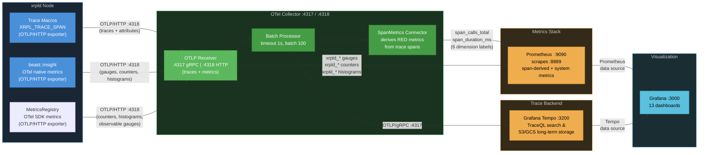

# Observability Data Collection Reference

> **Audience**: Developers and operators. This is the single source of truth for all telemetry data collected by xrpld's observability stack.
>
> **Related docs**: [docs/telemetry-runbook.md](../docs/telemetry-runbook.md) (operator runbook with alerting and troubleshooting) | [03-implementation-strategy.md](./03-implementation-strategy.md) (code structure and performance optimization) | [04-code-samples.md](./04-code-samples.md) (C++ instrumentation examples)

## Data Flow Overview



There are two independent telemetry pipelines entering a single **OTel Collector** via the same OTLP receiver:

1. **OpenTelemetry Traces** — Distributed spans with attributes, exported via OTLP/HTTP (:4318) to the collector's **OTLP Receiver**. The **Batch Processor** groups spans (1s timeout, batch size 100) before forwarding to trace backends. The **SpanMetrics Connector** derives RED metrics (rate, errors, duration) from every span and feeds them into the metrics pipeline.
2. **beast::insight OTel Metrics** — System-level gauges, counters, and histograms exported natively via OTLP/HTTP (:4318) to the same **OTLP Receiver**. These are batched and exported to Prometheus alongside span-derived metrics. The StatsD UDP transport has been replaced by native OTLP; `server=statsd` remains available as a fallback.

**Trace backend** — The collector exports traces via OTLP/gRPC to:

- **Grafana Tempo** — Preferred trace backend. Supports TraceQL queries at `:3200`, S3/GCS object storage for cost-effective long-term trace retention, and integrates natively with Grafana.

> **Further reading**: [00-tracing-fundamentals.md](./00-tracing-fundamentals.md) for core OpenTelemetry concepts (traces, spans, context propagation, sampling). [07-observability-backends.md](./07-observability-backends.md) for production backend selection, collector placement, and sampling strategies.

---

## 1. OpenTelemetry Spans

### 1.1 Complete Span Inventory (16 spans)

> **See also**: [02-design-decisions.md §2.3](./02-design-decisions.md#23-span-naming-conventions) for naming conventions and the full span catalog with rationale. [04-code-samples.md §4.6](./04-code-samples.md#46-span-flow-visualization) for span flow diagrams.

#### RPC Spans

Controlled by `trace_rpc=1` in `[telemetry]` config.

| Span Name            | Parent        | Source File       | Description                                                              |
| -------------------- | ------------- | ----------------- | ------------------------------------------------------------------------ |
| `rpc.request`        | —             | ServerHandler.cpp | Top-level HTTP RPC request entry point                                   |
| `rpc.process`        | `rpc.request` | ServerHandler.cpp | RPC processing pipeline                                                  |
| `rpc.ws_message`     | —             | ServerHandler.cpp | WebSocket message handling                                               |
| `rpc.command.<name>` | `rpc.process` | RPCHandler.cpp    | Per-command span (e.g., `rpc.command.server_info`, `rpc.command.ledger`) |

**Where to find**: Tempo → TraceQL: `{resource.service.name="xrpld" && name=~"rpc.request|rpc.command.*"}`

**Grafana dashboard**: _RPC Performance_ (`xrpld-rpc-perf`)

#### Transaction Spans

Controlled by `trace_transactions=1` in `[telemetry]` config.

| Span Name    | Parent         | Source File     | Description                                                       |
| ------------ | -------------- | --------------- | ----------------------------------------------------------------- |
| `tx.process` | —              | NetworkOPs.cpp  | Transaction submission entry point (local or peer-relayed)        |
| `tx.receive` | —              | PeerImp.cpp     | Raw transaction received from peer overlay (before deduplication) |
| `tx.apply`   | `ledger.build` | BuildLedger.cpp | Transaction set applied to new ledger during consensus            |

**Where to find**: Tempo → TraceQL: `{resource.service.name="xrpld" && name=~"tx.process|tx.receive"}`

**Grafana dashboard**: _Transaction Overview_ (`xrpld-transactions`)

#### Consensus Spans

Controlled by `trace_consensus=1` in `[telemetry]` config.

| Span Name                   | Parent | Source File      | Description                                   |
| --------------------------- | ------ | ---------------- | --------------------------------------------- |
| `consensus.proposal.send`   | —      | RCLConsensus.cpp | Node broadcasts its transaction set proposal  |
| `consensus.ledger_close`    | —      | RCLConsensus.cpp | Ledger close event triggered by consensus     |
| `consensus.accept`          | —      | RCLConsensus.cpp | Consensus accepts a ledger (round complete)   |
| `consensus.validation.send` | —      | RCLConsensus.cpp | Validation message sent after ledger accepted |
| `consensus.accept.apply`    | —      | RCLConsensus.cpp | Ledger application with close time details    |

**Where to find**: Tempo → TraceQL: `{resource.service.name="xrpld" && name=~"consensus.*"}`

**Grafana dashboard**: _Consensus Health_ (`xrpld-consensus`)

#### Ledger Spans

Controlled by `trace_ledger=1` in `[telemetry]` config.

| Span Name         | Parent | Source File      | Description                                    |
| ----------------- | ------ | ---------------- | ---------------------------------------------- |
| `ledger.build`    | —      | BuildLedger.cpp  | Build new ledger from accepted transaction set |
| `ledger.validate` | —      | LedgerMaster.cpp | Ledger promoted to validated status            |
| `ledger.store`    | —      | LedgerMaster.cpp | Ledger stored to database/history              |

**Where to find**: Tempo → TraceQL: `{resource.service.name="xrpld" && name=~"ledger.*"}`

**Grafana dashboard**: _Ledger Operations_ (`xrpld-ledger-ops`)

#### Peer Spans

Controlled by `trace_peer=1` in `[telemetry]` config. **Disabled by default** (high volume).

| Span Name                 | Parent | Source File | Description                           |
| ------------------------- | ------ | ----------- | ------------------------------------- |
| `peer.proposal.receive`   | —      | PeerImp.cpp | Consensus proposal received from peer |
| `peer.validation.receive` | —      | PeerImp.cpp | Validation message received from peer |

**Where to find**: Tempo → TraceQL: `{resource.service.name="xrpld" && name=~"peer.*"}`

**Grafana dashboard**: _Peer Network_ (`xrpld-peer-net`)

---

### 1.2 Complete Attribute Inventory (22 attributes)

> **See also**: [02-design-decisions.md §2.4.2](./02-design-decisions.md#242-span-attributes-by-category) for attribute design rationale and privacy considerations.

Every span can carry key-value attributes that provide context for filtering and aggregation.

#### RPC Attributes

| Attribute                | Type   | Set On          | Description                                      |
| ------------------------ | ------ | --------------- | ------------------------------------------------ |
| `xrpl.rpc.command`       | string | `rpc.command.*` | RPC command name (e.g., `server_info`, `ledger`) |
| `xrpl.rpc.version`       | int64  | `rpc.command.*` | API version number                               |
| `xrpl.rpc.role`          | string | `rpc.command.*` | Caller role: `"admin"` or `"user"`               |
| `xrpl.rpc.status`        | string | `rpc.command.*` | Result: `"success"` or `"error"`                 |
| `xrpl.rpc.duration_ms`   | int64  | `rpc.command.*` | Command execution time in milliseconds           |
| `xrpl.rpc.error_message` | string | `rpc.command.*` | Error details (only set on failure)              |

**Tempo query**: `{span.xrpl.rpc.command="server_info"}` to find all `server_info` calls.

**Prometheus label**: `xrpl_rpc_command` (dots converted to underscores by SpanMetrics).

#### Transaction Attributes

| Attribute            | Type    | Set On                     | Description                                          |
| -------------------- | ------- | -------------------------- | ---------------------------------------------------- |
| `xrpl.tx.hash`       | string  | `tx.process`, `tx.receive` | Transaction hash (hex-encoded)                       |
| `xrpl.tx.local`      | boolean | `tx.process`               | `true` if locally submitted, `false` if peer-relayed |
| `xrpl.tx.path`       | string  | `tx.process`               | Submission path: `"sync"` or `"async"`               |
| `xrpl.tx.suppressed` | boolean | `tx.receive`               | `true` if transaction was suppressed (duplicate)     |
| `xrpl.tx.status`     | string  | `tx.receive`               | Transaction status (e.g., `"known_bad"`)             |

**Tempo query**: `{span.xrpl.tx.hash="<hash>"}` to trace a specific transaction across nodes.

**Prometheus label**: `xrpl_tx_local` (used as SpanMetrics dimension).

#### Consensus Attributes

| Attribute                            | Type    | Set On                                                                                              | Description                                                   |
| ------------------------------------ | ------- | --------------------------------------------------------------------------------------------------- | ------------------------------------------------------------- |
| `xrpl.consensus.round`               | int64   | `consensus.proposal.send`                                                                           | Consensus round number                                        |
| `xrpl.consensus.mode`                | string  | `consensus.proposal.send`, `consensus.ledger_close`                                                 | Node mode: `"syncing"`, `"tracking"`, `"full"`, `"proposing"` |
| `xrpl.consensus.proposers`           | int64   | `consensus.proposal.send`, `consensus.accept`                                                       | Number of proposers in the round                              |
| `xrpl.consensus.proposing`           | boolean | `consensus.validation.send`                                                                         | Whether this node was a proposer                              |
| `xrpl.consensus.ledger.seq`          | int64   | `consensus.ledger_close`, `consensus.accept`, `consensus.validation.send`, `consensus.accept.apply` | Ledger sequence number                                        |
| `xrpl.consensus.close_time`          | int64   | `consensus.accept.apply`                                                                            | Agreed-upon ledger close time (epoch seconds)                 |
| `xrpl.consensus.close_time_correct`  | boolean | `consensus.accept.apply`                                                                            | Whether validators reached agreement on close time            |
| `xrpl.consensus.close_resolution_ms` | int64   | `consensus.accept.apply`                                                                            | Close time rounding granularity in milliseconds               |
| `xrpl.consensus.state`               | string  | `consensus.accept.apply`                                                                            | Consensus outcome: `"finished"` or `"moved_on"`               |
| `xrpl.consensus.round_time_ms`       | int64   | `consensus.accept.apply`                                                                            | Total consensus round duration in milliseconds                |

**Tempo query**: `{span.xrpl.consensus.mode="proposing"}` to find rounds where node was proposing.

**Prometheus label**: `xrpl_consensus_mode` (used as SpanMetrics dimension).

#### Ledger Attributes

| Attribute                 | Type  | Set On                                                        | Description                                    |
| ------------------------- | ----- | ------------------------------------------------------------- | ---------------------------------------------- |
| `xrpl.ledger.seq`         | int64 | `ledger.build`, `ledger.validate`, `ledger.store`, `tx.apply` | Ledger sequence number                         |
| `xrpl.ledger.validations` | int64 | `ledger.validate`                                             | Number of validations received for this ledger |
| `xrpl.ledger.tx_count`    | int64 | `ledger.build`, `tx.apply`                                    | Transactions in the ledger                     |
| `xrpl.ledger.tx_failed`   | int64 | `ledger.build`, `tx.apply`                                    | Failed transactions in the ledger              |

**Tempo query**: `{span.xrpl.ledger.seq=12345}` to find all spans for a specific ledger.

#### Peer Attributes

| Attribute                      | Type    | Set On                                                           | Description                                          |
| ------------------------------ | ------- | ---------------------------------------------------------------- | ---------------------------------------------------- |
| `xrpl.peer.id`                 | int64   | `tx.receive`, `peer.proposal.receive`, `peer.validation.receive` | Peer identifier                                      |
| `xrpl.peer.proposal.trusted`   | boolean | `peer.proposal.receive`                                          | Whether the proposal came from a trusted validator   |
| `xrpl.peer.validation.trusted` | boolean | `peer.validation.receive`                                        | Whether the validation came from a trusted validator |

**Prometheus labels**: `xrpl_peer_proposal_trusted`, `xrpl_peer_validation_trusted` (SpanMetrics dimensions).

---

### 1.3 SpanMetrics — Derived Prometheus Metrics

> **See also**: [01-architecture-analysis.md](./01-architecture-analysis.md) §1.8.2 for how span-derived metrics map to operational insights.

The OTel Collector's SpanMetrics connector automatically generates RED (Rate, Errors, Duration) metrics from every span. No custom metrics code in xrpld is needed.

| Prometheus Metric                                  | Type      | Description                                                                    |
| -------------------------------------------------- | --------- | ------------------------------------------------------------------------------ |
| `traces_span_metrics_calls_total`                  | Counter   | Total span invocations                                                         |
| `traces_span_metrics_duration_milliseconds_bucket` | Histogram | Latency distribution (buckets: 1, 5, 10, 25, 50, 100, 250, 500, 1000, 5000 ms) |
| `traces_span_metrics_duration_milliseconds_count`  | Histogram | Observation count                                                              |
| `traces_span_metrics_duration_milliseconds_sum`    | Histogram | Cumulative latency                                                             |

**Standard labels on every metric**: `span_name`, `status_code`, `service_name`, `span_kind`

**Additional dimension labels** (configured in `otel-collector-config.yaml`):

| Span Attribute                 | Prometheus Label               | Applies To                |
| ------------------------------ | ------------------------------ | ------------------------- |
| `xrpl.rpc.command`             | `xrpl_rpc_command`             | `rpc.command.*`           |
| `xrpl.rpc.status`              | `xrpl_rpc_status`              | `rpc.command.*`           |
| `xrpl.consensus.mode`          | `xrpl_consensus_mode`          | `consensus.ledger_close`  |
| `xrpl.tx.local`                | `xrpl_tx_local`                | `tx.process`              |
| `xrpl.peer.proposal.trusted`   | `xrpl_peer_proposal_trusted`   | `peer.proposal.receive`   |
| `xrpl.peer.validation.trusted` | `xrpl_peer_validation_trusted` | `peer.validation.receive` |

**Where to query**: Prometheus → `traces_span_metrics_calls_total{span_name="rpc.command.server_info"}`

---

## 2. System Metrics (beast::insight — OTel native)

> **See also**: [02-design-decisions.md](./02-design-decisions.md) for the beast::insight coexistence design. [06-implementation-phases.md](./06-implementation-phases.md) for the Phase 6/7 metric inventory.
>
> **Migration complete**: Phase 7 replaced the StatsD UDP transport with native OTel Metrics SDK export via OTLP/HTTP. The `beast::insight::Collector` interface and all metric names are preserved — only the wire protocol changed. `[insight] server=statsd` remains as a fallback.

These are system-level metrics emitted by xrpld's `beast::insight` framework via OTel OTLP/HTTP. They cover operational data that doesn't map to individual trace spans.

### Configuration

```ini
# Recommended: native OTel metrics via OTLP/HTTP
[insight]
server=otel
endpoint=http://localhost:4318/v1/metrics
prefix=xrpld
```

Fallback (StatsD):

```ini
[insight]
server=statsd
address=127.0.0.1:8125
prefix=xrpld
```

### 2.1 Gauges

| Prometheus Metric                                 | Source File           | Description                               | Typical Range                   |
| ------------------------------------------------- | --------------------- | ----------------------------------------- | ------------------------------- |
| `xrpld_LedgerMaster_Validated_Ledger_Age`         | LedgerMaster.h        | Seconds since last validated ledger       | 0–10 (healthy), >30 (stale)     |
| `xrpld_LedgerMaster_Published_Ledger_Age`         | LedgerMaster.h        | Seconds since last published ledger       | 0–10 (healthy)                  |
| `xrpld_State_Accounting_Disconnected_duration`    | NetworkOPs.cpp        | Cumulative seconds in Disconnected state  | Monotonic                       |
| `xrpld_State_Accounting_Connected_duration`       | NetworkOPs.cpp        | Cumulative seconds in Connected state     | Monotonic                       |
| `xrpld_State_Accounting_Syncing_duration`         | NetworkOPs.cpp        | Cumulative seconds in Syncing state       | Monotonic                       |
| `xrpld_State_Accounting_Tracking_duration`        | NetworkOPs.cpp        | Cumulative seconds in Tracking state      | Monotonic                       |
| `xrpld_State_Accounting_Full_duration`            | NetworkOPs.cpp        | Cumulative seconds in Full state          | Monotonic (should dominate)     |
| `xrpld_State_Accounting_Disconnected_transitions` | NetworkOPs.cpp        | Count of transitions to Disconnected      | Low                             |
| `xrpld_State_Accounting_Connected_transitions`    | NetworkOPs.cpp        | Count of transitions to Connected         | Low                             |
| `xrpld_State_Accounting_Syncing_transitions`      | NetworkOPs.cpp        | Count of transitions to Syncing           | Low                             |
| `xrpld_State_Accounting_Tracking_transitions`     | NetworkOPs.cpp        | Count of transitions to Tracking          | Low                             |
| `xrpld_State_Accounting_Full_transitions`         | NetworkOPs.cpp        | Count of transitions to Full              | Low (should be 1 after startup) |
| `xrpld_Peer_Finder_Active_Inbound_Peers`          | PeerfinderManager.cpp | Active inbound peer connections           | 0–85                            |
| `xrpld_Peer_Finder_Active_Outbound_Peers`         | PeerfinderManager.cpp | Active outbound peer connections          | 10–21                           |
| `xrpld_Overlay_Peer_Disconnects`                  | OverlayImpl.cpp       | Cumulative peer disconnection count       | Low growth                      |
| `xrpld_Overlay_Peer_Disconnects_Charges`          | OverlayImpl.cpp       | Disconnects due to resource limit charges | Low growth (subset of above)    |
| `xrpld_job_count`                                 | JobQueue.cpp          | Current job queue depth                   | 0–100 (healthy)                 |

**Grafana dashboard**: _Node Health (System Metrics)_ (`xrpld-system-node-health`)

### 2.2 Counters

| Prometheus Metric               | Source File        | Description                                   |
| ------------------------------- | ------------------ | --------------------------------------------- |
| `xrpld_rpc_requests`            | ServerHandler.cpp  | Total RPC requests received                   |
| `xrpld_ledger_fetches`          | InboundLedgers.cpp | Inbound ledger fetch attempts                 |
| `xrpld_ledger_history_mismatch` | LedgerHistory.cpp  | Ledger hash mismatches detected               |
| `xrpld_warn`                    | Logic.h            | Resource manager warnings issued              |
| `xrpld_drop`                    | Logic.h            | Resource manager drops (connections rejected) |

**Note**: With `server=otel`, `xrpld_warn` and `xrpld_drop` are properly exported as OTel Counter instruments. The previous StatsD `|m` type limitation no longer applies.

**Grafana dashboard**: _RPC & Pathfinding (System Metrics)_ (`xrpld-system-rpc`)

### 2.3 Histograms (Event timers)

| Prometheus Metric     | Source File       | Unit  | Description                    |
| --------------------- | ----------------- | ----- | ------------------------------ |
| `xrpld_rpc_time`      | ServerHandler.cpp | ms    | RPC response time distribution |
| `xrpld_rpc_size`      | ServerHandler.cpp | bytes | RPC response size distribution |
| `xrpld_ios_latency`   | Application.cpp   | ms    | I/O service loop latency       |
| `xrpld_pathfind_fast` | PathRequests.h    | ms    | Fast pathfinding duration      |
| `xrpld_pathfind_full` | PathRequests.h    | ms    | Full pathfinding duration      |

Quantiles collected: 0th, 50th, 90th, 95th, 99th, 100th percentile.

**Grafana dashboards**: _Node Health_ (`ios_latency`), _RPC & Pathfinding_ (`rpc_time`, `rpc_size`, `pathfind_*`)

### 2.4 Overlay Traffic Metrics

For each of the 45+ overlay traffic categories (defined in `TrafficCount.h`), four gauges are emitted:

- `xrpld_{category}_Bytes_In`
- `xrpld_{category}_Bytes_Out`
- `xrpld_{category}_Messages_In`
- `xrpld_{category}_Messages_Out`

**Key categories**:

| Category                                                          | Description                |
| ----------------------------------------------------------------- | -------------------------- |
| `total`                                                           | All traffic aggregated     |
| `overhead` / `overhead_overlay`                                   | Protocol overhead          |
| `transactions` / `transactions_duplicate`                         | Transaction relay          |
| `proposals` / `proposals_untrusted` / `proposals_duplicate`       | Consensus proposals        |
| `validations` / `validations_untrusted` / `validations_duplicate` | Consensus validations      |
| `ledger_data_get` / `ledger_data_share`                           | Ledger data exchange       |
| `ledger_data_Transaction_Node_get/share`                          | Transaction node data      |
| `ledger_data_Account_State_Node_get/share`                        | Account state node data    |
| `ledger_data_Transaction_Set_candidate_get/share`                 | Transaction set candidates |
| `getObject` / `haveTxSet` / `ledgerData`                          | Object requests            |
| `ping` / `status`                                                 | Keepalive and status       |
| `set_get`                                                         | Set requests               |

**Grafana dashboards**: _Network Traffic_ (`xrpld-system-network`), _Overlay Traffic Detail_ (`xrpld-system-overlay-detail`), _Ledger Data & Sync_ (`xrpld-system-ledger-sync`)

---

## 3. Grafana Dashboard Reference

> **See also**: [05-configuration-reference.md](./05-configuration-reference.md) §5.8 for Grafana data source provisioning (Tempo, Prometheus) and TraceQL query examples.

### 3.1 Span-Derived Dashboards (5)

| Dashboard            | UID                  | Data Source              | Key Panels                                                                         |
| -------------------- | -------------------- | ------------------------ | ---------------------------------------------------------------------------------- |
| RPC Performance      | `xrpld-rpc-perf`     | Prometheus (SpanMetrics) | Request rate by command, p95 latency by command, error rate, heatmap, top commands |
| Transaction Overview | `xrpld-transactions` | Prometheus (SpanMetrics) | Processing rate, latency p95/p50, local vs relay split, apply duration, heatmap    |
| Consensus Health     | `xrpld-consensus`    | Prometheus (SpanMetrics) | Round duration p95/p50, proposals rate, close duration, mode timeline, heatmap     |
| Ledger Operations    | `xrpld-ledger-ops`   | Prometheus (SpanMetrics) | Build rate, build duration, validation rate, store rate, build vs close comparison |
| Peer Network         | `xrpld-peer-net`     | Prometheus (SpanMetrics) | Proposal receive rate, validation receive rate, trusted vs untrusted breakdown     |

### 3.2 System Metrics Dashboards (5)

| Dashboard              | UID                           | Data Source       | Key Panels                                                                        |
| ---------------------- | ----------------------------- | ----------------- | --------------------------------------------------------------------------------- |
| Node Health            | `xrpld-system-node-health`    | Prometheus (OTLP) | Ledger age, operating mode, I/O latency, job queue, fetch rate                    |
| Network Traffic        | `xrpld-system-network`        | Prometheus (OTLP) | Active peers, disconnects, bytes in/out, messages in/out, traffic by category     |
| RPC & Pathfinding      | `xrpld-system-rpc`            | Prometheus (OTLP) | RPC rate, response time/size, pathfinding duration, resource warnings/drops       |
| Overlay Traffic Detail | `xrpld-system-overlay-detail` | Prometheus (OTLP) | Squelch, overhead, validator lists, set get/share, have/requested tx, proof paths |
| Ledger Data & Sync     | `xrpld-system-ledger-sync`    | Prometheus (OTLP) | Ledger data exchange, legacy ledger share/get, getobject by type, traffic heatmap |

### 3.3 Accessing the Dashboards

1. Open Grafana at **http://localhost:3000**
2. Navigate to **Dashboards → xrpld** folder
3. All 10 dashboards are auto-provisioned from `docker/telemetry/grafana/dashboards/`

---

## 4. Tempo Trace Search Guide

> **See also**: [08-appendix.md](./08-appendix.md) §8.2 for span hierarchy visualizations. [05-configuration-reference.md](./05-configuration-reference.md) §5.8.5 for TraceQL query examples.

### Finding Traces by Type

| What to Find             | Tempo TraceQL Query                                                            |
| ------------------------ | ------------------------------------------------------------------------------ |
| All RPC calls            | `{resource.service.name="xrpld" && name="rpc.request"}`                        |
| Specific RPC command     | `{resource.service.name="xrpld" && name="rpc.command.server_info"}`            |
| Slow RPC calls           | `{resource.service.name="xrpld" && name=~"rpc.command.*"} \| duration > 100ms` |
| Failed RPC calls         | `{span.xrpl.rpc.status="error"}`                                               |
| Specific transaction     | `{span.xrpl.tx.hash="<hex_hash>"}`                                             |
| Local transactions only  | `{span.xrpl.tx.local=true}`                                                    |
| Consensus rounds         | `{resource.service.name="xrpld" && name="consensus.accept"}`                   |
| Rounds by mode           | `{span.xrpl.consensus.mode="proposing"}`                                       |
| Specific ledger          | `{span.xrpl.ledger.seq=12345}`                                                 |
| Peer proposals (trusted) | `{span.xrpl.peer.proposal.trusted=true}`                                       |

### Trace Structure

A typical RPC trace shows the span hierarchy:

```
rpc.request (ServerHandler)
  └── rpc.process (ServerHandler)
       └── rpc.command.server_info (RPCHandler)
```

A consensus round produces independent spans (not parent-child):

```
consensus.ledger_close        (close event)
consensus.proposal.send       (broadcast proposal)
ledger.build                  (build new ledger)
  └── tx.apply                (apply transaction set)
consensus.accept              (accept result)
consensus.validation.send     (send validation)
ledger.validate               (promote to validated)
ledger.store                  (persist to DB)
```

---

## 5. Prometheus Query Examples

> **See also**: [05-configuration-reference.md](./05-configuration-reference.md) §5.8.7 for correlating Prometheus system metrics with trace-derived metrics.

### Span-Derived Metrics

```promql
# RPC request rate by command (last 5 minutes)
sum by (xrpl_rpc_command) (rate(traces_span_metrics_calls_total{span_name=~"rpc.command.*"}[5m]))

# RPC p95 latency by command
histogram_quantile(0.95, sum by (le, xrpl_rpc_command) (rate(traces_span_metrics_duration_milliseconds_bucket{span_name=~"rpc.command.*"}[5m])))

# Consensus round duration p95
histogram_quantile(0.95, sum by (le) (rate(traces_span_metrics_duration_milliseconds_bucket{span_name="consensus.accept"}[5m])))

# Transaction processing rate (local vs relay)
sum by (xrpl_tx_local) (rate(traces_span_metrics_calls_total{span_name="tx.process"}[5m]))

# Trusted vs untrusted proposal rate
sum by (xrpl_peer_proposal_trusted) (rate(traces_span_metrics_calls_total{span_name="peer.proposal.receive"}[5m]))
```

### StatsD Metrics

```promql
# Validated ledger age (should be < 10s)
xrpld_LedgerMaster_Validated_Ledger_Age

# Active peer count
xrpld_Peer_Finder_Active_Inbound_Peers + xrpld_Peer_Finder_Active_Outbound_Peers

# RPC response time p95
histogram_quantile(0.95, xrpld_rpc_time_bucket)

# Total network bytes in (rate)
rate(xrpld_total_Bytes_In[5m])

# Operating mode (should be "Full" after startup)
xrpld_State_Accounting_Full_duration
```

---

## 5a. Log-Trace Correlation (Phase 8)

> **Plan details**: [06-implementation-phases.md §6.8.1](./06-implementation-phases.md) — motivation, architecture, Mermaid diagrams
> **Task breakdown**: [Phase8_taskList.md](./Phase8_taskList.md) — per-task implementation details

Phase 8 injects OTel trace context into xrpld's `Logs::format()` output, enabling log-trace correlation. When a log line is emitted within an active OTel span, the trace and span identifiers are automatically appended after the severity field:

### Log Format

```
<timestamp> <partition>:<severity> trace_id=<32hex> span_id=<16hex> <message>
```

Example:

```
2024-01-15T10:30:45.123Z LedgerMaster:NFO trace_id=abc123def456789012345678abcdef01 span_id=0123456789abcdef Validated ledger 42
```

- **`trace_id=<hex32>`** — 32-character lowercase hex trace identifier. Links to the distributed trace in Tempo/Jaeger.
- **`span_id=<hex16>`** — 16-character lowercase hex span identifier. Identifies the specific span within the trace.
- **Only present** when the log is emitted within an active OTel span. Log lines outside of traced code paths have no trace context fields.

### Implementation

The trace context injection is implemented in `Logs::format()` (`src/libxrpl/basics/Log.cpp`), guarded by `#ifdef XRPL_ENABLE_TELEMETRY`. It reads the current span from OTel's thread-local runtime context via `opentelemetry::trace::GetSpan()` and `opentelemetry::context::RuntimeContext::GetCurrent()`. Both calls are lock-free thread-local reads measured at <10ns per call.

### Log Ingestion Pipeline

```
xrpld debug.log -> OTel Collector filelog receiver -> regex_parser -> Loki exporter -> Grafana Loki
```

The OTel Collector's `filelog` receiver tails `debug.log` files and uses a `regex_parser` operator to extract structured fields:

| Field       | Type     | Description                                              |
| ----------- | -------- | -------------------------------------------------------- |
| `timestamp` | datetime | Log timestamp                                            |
| `partition` | string   | Log partition (e.g., `LedgerMaster`, `PeerImp`)          |
| `severity`  | string   | Severity code (`TRC`, `DBG`, `NFO`, `WRN`, `ERR`, `FTL`) |
| `trace_id`  | string   | 32-hex trace identifier (optional)                       |
| `span_id`   | string   | 16-hex span identifier (optional)                        |
| `message`   | string   | Log message body                                         |

### Grafana Correlation

Bidirectional linking between logs and traces is configured via Grafana datasource provisioning:

- **Tempo -> Loki** (`tracesToLogs`): Clicking "Logs for this trace" on a Tempo trace view filters Loki logs by `trace_id`, showing all log lines from that trace.
- **Loki -> Tempo** (`derivedFields`): A regex-based derived field on the Loki datasource extracts `trace_id` from log lines and renders it as a clickable link to the corresponding trace in Tempo.

### Loki Backend

Grafana Loki (v2.9.0) serves as the log storage backend. It receives log entries from the OTel Collector's `loki` exporter via the push API at `http://loki:3100/loki/api/v1/push`.

### LogQL Query Examples

```logql
# Find all logs for a specific trace
{job="xrpld"} |= "trace_id=abc123def456789012345678abcdef01"

# Error logs with trace context
{job="xrpld"} |= "ERR" |= "trace_id="

# Logs from a specific partition with trace context
{job="xrpld"} |= "LedgerMaster" | regexp `trace_id=(?P<trace_id>[a-f0-9]+)` | trace_id != ""

# Count traced log lines over time
count_over_time({job="xrpld"} |= "trace_id=" [5m])
```

---

## 5b. Future: Internal Metric Gap Fill (Phase 9)

> **Status**: Planned, not yet implemented.
> **Plan details**: [06-implementation-phases.md §6.8.2](./06-implementation-phases.md) — motivation, architecture, third-party context
> **Task breakdown**: [Phase9_taskList.md](./Phase9_taskList.md) — per-task implementation details

Phase 9 fills ~50+ metrics that exist inside xrpld but currently lack time-series export. Uses a hybrid approach: `beast::insight` extensions for NodeStore I/O, OTel `ObservableGauge` async callbacks for new categories.

### New Metric Categories

#### NodeStore I/O (via beast::insight)

| Prometheus Metric                  | Type  | Description                         |
| ---------------------------------- | ----- | ----------------------------------- |
| `xrpld_nodestore_reads_total`      | Gauge | Cumulative read operations          |
| `xrpld_nodestore_reads_hit`        | Gauge | Cache-served reads                  |
| `xrpld_nodestore_writes`           | Gauge | Cumulative write operations         |
| `xrpld_nodestore_written_bytes`    | Gauge | Cumulative bytes written            |
| `xrpld_nodestore_read_bytes`       | Gauge | Cumulative bytes read               |
| `xrpld_nodestore_read_duration_us` | Gauge | Cumulative read time (microseconds) |
| `xrpld_nodestore_write_load`       | Gauge | Current write load score            |
| `xrpld_nodestore_read_queue`       | Gauge | Items in read queue                 |

#### Cache Hit Rates (via OTel MetricsRegistry)

| Prometheus Metric             | Type  | Description                          |
| ----------------------------- | ----- | ------------------------------------ |
| `xrpld_cache_SLE_hit_rate`    | Gauge | SLE cache hit rate (0.0-1.0)         |
| `xrpld_cache_ledger_hit_rate` | Gauge | Ledger object cache hit rate         |
| `xrpld_cache_AL_hit_rate`     | Gauge | AcceptedLedger cache hit rate        |
| `xrpld_cache_treenode_size`   | Gauge | SHAMap TreeNode cache size (entries) |
| `xrpld_cache_fullbelow_size`  | Gauge | FullBelow cache size                 |

#### Transaction Queue (via OTel MetricsRegistry)

| Prometheus Metric                    | Type  | Description                      |
| ------------------------------------ | ----- | -------------------------------- |
| `xrpld_txq_count`                    | Gauge | Current transactions in queue    |
| `xrpld_txq_max_size`                 | Gauge | Maximum queue capacity           |
| `xrpld_txq_in_ledger`                | Gauge | Transactions in open ledger      |
| `xrpld_txq_per_ledger`               | Gauge | Expected transactions per ledger |
| `xrpld_txq_open_ledger_fee_level`    | Gauge | Open ledger fee escalation level |
| `xrpld_txq_med_fee_level`            | Gauge | Median fee level in queue        |
| `xrpld_txq_reference_fee_level`      | Gauge | Reference fee level              |
| `xrpld_txq_min_processing_fee_level` | Gauge | Minimum fee to get processed     |

#### PerfLog Per-RPC Method (via OTel Metrics SDK)

| Prometheus Metric                     | Type      | Labels            | Description                 |
| ------------------------------------- | --------- | ----------------- | --------------------------- |
| `xrpld_rpc_method_started_total`      | Counter   | `method="<name>"` | RPC calls started           |
| `xrpld_rpc_method_finished_total`     | Counter   | `method="<name>"` | RPC calls completed         |
| `xrpld_rpc_method_errored_total`      | Counter   | `method="<name>"` | RPC calls errored           |
| `xrpld_rpc_method_duration_us_bucket` | Histogram | `method="<name>"` | Execution time distribution |

#### PerfLog Per-Job Type (via OTel Metrics SDK)

| Prometheus Metric                      | Type      | Labels              | Description     |
| -------------------------------------- | --------- | ------------------- | --------------- |
| `xrpld_job_queued_total`               | Counter   | `job_type="<name>"` | Jobs queued     |
| `xrpld_job_started_total`              | Counter   | `job_type="<name>"` | Jobs started    |
| `xrpld_job_finished_total`             | Counter   | `job_type="<name>"` | Jobs completed  |
| `xrpld_job_queued_duration_us_bucket`  | Histogram | `job_type="<name>"` | Queue wait time |
| `xrpld_job_running_duration_us_bucket` | Histogram | `job_type="<name>"` | Execution time  |

#### Counted Object Instances (via OTel MetricsRegistry)

| Prometheus Metric    | Type  | Labels          | Description                     |
| -------------------- | ----- | --------------- | ------------------------------- |
| `xrpld_object_count` | Gauge | `type="<name>"` | Live instances of internal type |

Tracked types: `Transaction`, `Ledger`, `NodeObject`, `STTx`, `STLedgerEntry`, `InboundLedger`, `Pathfinder`, `PathRequest`, `HashRouterEntry`

#### Fee Escalation & Load Factors (via OTel MetricsRegistry)

| Prometheus Metric                  | Type  | Description                          |
| ---------------------------------- | ----- | ------------------------------------ |
| `xrpld_load_factor`                | Gauge | Combined transaction cost multiplier |
| `xrpld_load_factor_server`         | Gauge | Server + cluster + network load      |
| `xrpld_load_factor_local`          | Gauge | Local server load only               |
| `xrpld_load_factor_net`            | Gauge | Network-wide load estimate           |
| `xrpld_load_factor_cluster`        | Gauge | Cluster peer load                    |
| `xrpld_load_factor_fee_escalation` | Gauge | Open ledger fee escalation           |
| `xrpld_load_factor_fee_queue`      | Gauge | Queue entry fee level                |

#### Server Info (via OTel MetricsRegistry)

| Prometheus Metric                                         | Type  | Labels   | Description                                  |
| --------------------------------------------------------- | ----- | -------- | -------------------------------------------- |
| `xrpld_server_info{metric="server_state"}`                | Gauge | `metric` | Operating mode (0=DISCONNECTED .. 4=FULL)    |
| `xrpld_server_info{metric="uptime"}`                      | Gauge | `metric` | Seconds since server start                   |
| `xrpld_server_info{metric="peers"}`                       | Gauge | `metric` | Total connected peers                        |
| `xrpld_server_info{metric="validated_ledger_seq"}`        | Gauge | `metric` | Validated ledger sequence number             |
| `xrpld_server_info{metric="ledger_current_index"}`        | Gauge | `metric` | Current open ledger sequence                 |
| `xrpld_server_info{metric="peer_disconnects_resources"}`  | Gauge | `metric` | Cumulative resource-related peer disconnects |
| `xrpld_server_info{metric="last_close_proposers"}`        | Gauge | `metric` | Proposers in last closed round               |
| `xrpld_server_info{metric="last_close_converge_time_ms"}` | Gauge | `metric` | Last close convergence time (milliseconds)   |

#### Build Info (via OTel MetricsRegistry)

| Prometheus Metric                   | Type  | Labels    | Description                       |
| ----------------------------------- | ----- | --------- | --------------------------------- |
| `xrpld_build_info{version="<ver>"}` | Gauge | `version` | Info-style metric, always value 1 |

#### Complete Ledger Ranges (via OTel MetricsRegistry)

| Prometheus Metric                                   | Type  | Labels          | Description                 |
| --------------------------------------------------- | ----- | --------------- | --------------------------- |
| `xrpld_complete_ledgers{bound="start",index="<N>"}` | Gauge | `bound`,`index` | Start of contiguous range N |
| `xrpld_complete_ledgers{bound="end",index="<N>"}`   | Gauge | `bound`,`index` | End of contiguous range N   |

#### Database Metrics (via OTel MetricsRegistry)

| Prometheus Metric                                 | Type  | Labels   | Description                       |
| ------------------------------------------------- | ----- | -------- | --------------------------------- |
| `xrpld_db_metrics{metric="db_kb_total"}`          | Gauge | `metric` | Total database size (KB)          |
| `xrpld_db_metrics{metric="db_kb_ledger"}`         | Gauge | `metric` | Ledger database size (KB)         |
| `xrpld_db_metrics{metric="db_kb_transaction"}`    | Gauge | `metric` | Transaction database size (KB)    |
| `xrpld_db_metrics{metric="historical_perminute"}` | Gauge | `metric` | Historical ledger fetches per min |

#### Extended Cache Metrics (additions to existing xrpld_cache_metrics)

| Prometheus Metric                       | Type  | Labels   | Description               |
| --------------------------------------- | ----- | -------- | ------------------------- |
| `xrpld_cache_metrics{metric="AL_size"}` | Gauge | `metric` | AcceptedLedger cache size |

#### Extended NodeStore Metrics (additions to existing xrpld_nodestore_state)

| Prometheus Metric                                        | Type  | Labels   | Description                         |
| -------------------------------------------------------- | ----- | -------- | ----------------------------------- |
| `xrpld_nodestore_state{metric="node_reads_duration_us"}` | Gauge | `metric` | Cumulative read time (microseconds) |
| `xrpld_nodestore_state{metric="read_request_bundle"}`    | Gauge | `metric` | Read request bundle count           |
| `xrpld_nodestore_state{metric="read_threads_running"}`   | Gauge | `metric` | Active read threads                 |
| `xrpld_nodestore_state{metric="read_threads_total"}`     | Gauge | `metric` | Total read threads configured       |

### New Grafana Dashboards (Phase 9)

| Dashboard          | UID                | Data Source | Key Panels                                                        |
| ------------------ | ------------------ | ----------- | ----------------------------------------------------------------- |
| Fee Market & TxQ   | `xrpld-fee-market` | Prometheus  | TxQ depth/capacity, fee levels, load factor breakdown, escalation |
| Job Queue Analysis | `xrpld-job-queue`  | Prometheus  | Per-job rates, queue wait times, execution times, queue depth     |

---

## 5c. Future: Synthetic Workload Generation & Telemetry Validation (Phase 10)

> **Status**: Planned, not yet implemented.
> **Plan details**: [06-implementation-phases.md §6.8.3](./06-implementation-phases.md) — motivation, architecture
> **Task breakdown**: [Phase10_taskList.md](./Phase10_taskList.md) — per-task implementation details

Phase 10 builds a 5-node validator docker-compose harness with RPC load generators, transaction submitters, and automated validation scripts that verify all spans, metrics, dashboards, and log-trace correlation work end-to-end. Includes a benchmark suite comparing telemetry-ON vs telemetry-OFF overhead.

### Validated Telemetry Inventory

| Category           | Expected Count | Validation Method                |
| ------------------ | -------------- | -------------------------------- |
| Trace spans        | 16             | Jaeger/Tempo API query           |
| Span attributes    | 22             | Per-span attribute assertion     |
| StatsD metrics     | 255+           | Prometheus query                 |
| Phase 9 metrics    | 68+            | Prometheus query                 |
| SpanMetrics RED    | 4 per span     | Prometheus query                 |
| Grafana dashboards | 10             | Dashboard API "no data" check    |
| Log-trace links    | Present        | Loki query + Tempo reverse check |

---

## 5d. Future: Third-Party Data Collection Pipelines (Phase 11)

> **Status**: Planned, not yet implemented.
> **Plan details**: [06-implementation-phases.md §6.8.4](./06-implementation-phases.md) — motivation, architecture, consumer gap analysis
> **Task breakdown**: [Phase11_taskList.md](./Phase11_taskList.md) — per-task implementation details

Phase 11 builds a custom OTel Collector receiver (Go) that polls xrpld's admin RPCs and exports `xrpl_*` metrics for external consumers. No xrpld code changes.

### Exported Metrics (via Custom OTel Collector Receiver)

#### Node Health (from server_info)

| Prometheus Metric                       | Type  | Description                                     |
| --------------------------------------- | ----- | ----------------------------------------------- |
| `xrpl_server_state`                     | Gauge | Operating mode (0=disconnected ... 5=proposing) |
| `xrpl_server_state_duration_seconds`    | Gauge | Seconds in current state                        |
| `xrpl_uptime_seconds`                   | Gauge | Consecutive seconds running                     |
| `xrpl_io_latency_ms`                    | Gauge | I/O subsystem latency                           |
| `xrpl_amendment_blocked`                | Gauge | 1 if amendment-blocked, 0 otherwise             |
| `xrpl_peers_count`                      | Gauge | Connected peers                                 |
| `xrpl_validated_ledger_seq`             | Gauge | Latest validated ledger sequence                |
| `xrpl_validated_ledger_age_seconds`     | Gauge | Seconds since last validated close              |
| `xrpl_last_close_proposers`             | Gauge | Proposers in last consensus round               |
| `xrpl_last_close_converge_time_seconds` | Gauge | Last consensus round duration                   |
| `xrpl_load_factor`                      | Gauge | Transaction cost multiplier                     |
| `xrpl_state_duration_seconds`           | Gauge | Per-state duration (`state` label)              |
| `xrpl_state_transitions_total`          | Gauge | Per-state transition count (`state` label)      |

#### Peer Topology (from peers)

| Prometheus Metric           | Type  | Description                         |
| --------------------------- | ----- | ----------------------------------- |
| `xrpl_peers_inbound_count`  | Gauge | Inbound peer connections            |
| `xrpl_peers_outbound_count` | Gauge | Outbound peer connections           |
| `xrpl_peer_latency_p50_ms`  | Gauge | Median peer latency                 |
| `xrpl_peer_latency_p95_ms`  | Gauge | p95 peer latency                    |
| `xrpl_peer_version_count`   | Gauge | Peers per version (`version` label) |
| `xrpl_peer_diverged_count`  | Gauge | Peers with diverged tracking status |

#### Validator & Amendment (from validators, feature)

| Prometheus Metric                     | Type  | Description                             |
| ------------------------------------- | ----- | --------------------------------------- |
| `xrpl_trusted_validators_count`       | Gauge | UNL validator count                     |
| `xrpl_amendment_enabled_count`        | Gauge | Enabled amendments                      |
| `xrpl_amendment_majority_count`       | Gauge | Amendments with majority                |
| `xrpl_amendment_unsupported_majority` | Gauge | 1 if unsupported amendment has majority |
| `xrpl_validator_list_active`          | Gauge | 1 if validator list is active           |

#### Fee Market (from fee)

| Prometheus Metric                | Type  | Description                           |
| -------------------------------- | ----- | ------------------------------------- |
| `xrpl_fee_open_ledger_fee_drops` | Gauge | Minimum fee for open ledger inclusion |
| `xrpl_fee_median_fee_drops`      | Gauge | Median fee level                      |
| `xrpl_fee_queue_size`            | Gauge | Current transaction queue depth       |
| `xrpl_fee_current_ledger_size`   | Gauge | Transactions in current open ledger   |

#### DEX & AMM (optional, from book_offers, amm_info)

| Prometheus Metric          | Type  | Labels                | Description            |
| -------------------------- | ----- | --------------------- | ---------------------- |
| `xrpl_amm_tvl_drops`       | Gauge | `pool="<id>"`         | Total value locked     |
| `xrpl_amm_trading_fee`     | Gauge | `pool="<id>"`         | Pool trading fee (bps) |
| `xrpl_orderbook_bid_depth` | Gauge | `pair="<base/quote>"` | Total bid volume       |
| `xrpl_orderbook_ask_depth` | Gauge | `pair="<base/quote>"` | Total ask volume       |
| `xrpl_orderbook_spread`    | Gauge | `pair="<base/quote>"` | Best bid-ask spread    |

### Phase 9: OTel SDK-Exported Metrics (MetricsRegistry)

Phase 9 introduces the `MetricsRegistry` class (`src/xrpld/telemetry/MetricsRegistry.h/.cpp`)
which registers metrics directly with the OpenTelemetry Metrics SDK. These are exported
via OTLP/HTTP to the OTel Collector and scraped by Prometheus.

#### NodeStore I/O (Observable Gauge — `nodestore_state`)

| Prometheus Metric                                    | Type  | Labels   | Description                          |
| ---------------------------------------------------- | ----- | -------- | ------------------------------------ |
| `xrpld_nodestore_state{metric="node_reads_total"}`   | Gauge | `metric` | Cumulative NodeStore read operations |
| `xrpld_nodestore_state{metric="node_reads_hit"}`     | Gauge | `metric` | Reads served from cache              |
| `xrpld_nodestore_state{metric="node_writes"}`        | Gauge | `metric` | Cumulative write operations          |
| `xrpld_nodestore_state{metric="node_written_bytes"}` | Gauge | `metric` | Cumulative bytes written             |
| `xrpld_nodestore_state{metric="node_read_bytes"}`    | Gauge | `metric` | Cumulative bytes read                |
| `xrpld_nodestore_state{metric="write_load"}`         | Gauge | `metric` | Current write load score             |
| `xrpld_nodestore_state{metric="read_queue"}`         | Gauge | `metric` | Items in read prefetch queue         |

#### Cache Hit Rates & Sizes (Observable Gauge — `cache_metrics`)

| Prometheus Metric                                   | Type  | Labels   | Description                   |
| --------------------------------------------------- | ----- | -------- | ----------------------------- |
| `xrpld_cache_metrics{metric="SLE_hit_rate"}`        | Gauge | `metric` | SLE cache hit rate (0.0-1.0)  |
| `xrpld_cache_metrics{metric="ledger_hit_rate"}`     | Gauge | `metric` | Ledger cache hit rate         |
| `xrpld_cache_metrics{metric="AL_hit_rate"}`         | Gauge | `metric` | AcceptedLedger cache hit rate |
| `xrpld_cache_metrics{metric="treenode_cache_size"}` | Gauge | `metric` | SHAMap TreeNode cache entries |
| `xrpld_cache_metrics{metric="treenode_track_size"}` | Gauge | `metric` | Tracked tree nodes            |
| `xrpld_cache_metrics{metric="fullbelow_size"}`      | Gauge | `metric` | FullBelow cache entries       |

#### Transaction Queue (Observable Gauge — `txq_metrics`)

| Prometheus Metric                                          | Type  | Labels   | Description                      |
| ---------------------------------------------------------- | ----- | -------- | -------------------------------- |
| `xrpld_txq_metrics{metric="txq_count"}`                    | Gauge | `metric` | Transactions currently in queue  |
| `xrpld_txq_metrics{metric="txq_max_size"}`                 | Gauge | `metric` | Maximum queue capacity           |
| `xrpld_txq_metrics{metric="txq_in_ledger"}`                | Gauge | `metric` | Transactions in open ledger      |
| `xrpld_txq_metrics{metric="txq_per_ledger"}`               | Gauge | `metric` | Expected transactions per ledger |
| `xrpld_txq_metrics{metric="txq_reference_fee_level"}`      | Gauge | `metric` | Reference fee level              |
| `xrpld_txq_metrics{metric="txq_min_processing_fee_level"}` | Gauge | `metric` | Minimum fee to get processed     |
| `xrpld_txq_metrics{metric="txq_med_fee_level"}`            | Gauge | `metric` | Median fee level in queue        |
| `xrpld_txq_metrics{metric="txq_open_ledger_fee_level"}`    | Gauge | `metric` | Open ledger fee escalation level |

#### Per-RPC Method Metrics (Synchronous Counters/Histogram)

| Prometheus Metric                 | Type      | Labels            | Description                      |
| --------------------------------- | --------- | ----------------- | -------------------------------- |
| `xrpld_rpc_method_started_total`  | Counter   | `method="<name>"` | RPC calls started                |
| `xrpld_rpc_method_finished_total` | Counter   | `method="<name>"` | RPC calls completed successfully |
| `xrpld_rpc_method_errored_total`  | Counter   | `method="<name>"` | RPC calls that errored           |
| `xrpld_rpc_method_duration_us`    | Histogram | `method="<name>"` | Execution time distribution (us) |

#### Per-Job-Type Metrics (Synchronous Counters/Histogram)

| Prometheus Metric               | Type      | Labels              | Description                       |
| ------------------------------- | --------- | ------------------- | --------------------------------- |
| `xrpld_job_queued_total`        | Counter   | `job_type="<name>"` | Jobs enqueued                     |
| `xrpld_job_started_total`       | Counter   | `job_type="<name>"` | Jobs started                      |
| `xrpld_job_finished_total`      | Counter   | `job_type="<name>"` | Jobs completed                    |
| `xrpld_job_queued_duration_us`  | Histogram | `job_type="<name>"` | Queue wait time distribution (us) |
| `xrpld_job_running_duration_us` | Histogram | `job_type="<name>"` | Execution time distribution (us)  |

#### Counted Object Instances (Observable Gauge — `object_count`)

| Prometheus Metric                            | Type  | Labels          | Description                    |
| -------------------------------------------- | ----- | --------------- | ------------------------------ |
| `xrpld_object_count{type="Transaction"}`     | Gauge | `type="<name>"` | Live Transaction objects       |
| `xrpld_object_count{type="Ledger"}`          | Gauge | `type="<name>"` | Live Ledger objects            |
| `xrpld_object_count{type="NodeObject"}`      | Gauge | `type="<name>"` | Live NodeObject instances      |
| `xrpld_object_count{type="STTx"}`            | Gauge | `type="<name>"` | Serialized transaction objects |
| `xrpld_object_count{type="STLedgerEntry"}`   | Gauge | `type="<name>"` | Serialized ledger entries      |
| `xrpld_object_count{type="InboundLedger"}`   | Gauge | `type="<name>"` | Ledgers being fetched          |
| `xrpld_object_count{type="Pathfinder"}`      | Gauge | `type="<name>"` | Active pathfinding operations  |
| `xrpld_object_count{type="PathRequest"}`     | Gauge | `type="<name>"` | Active path requests           |
| `xrpld_object_count{type="HashRouterEntry"}` | Gauge | `type="<name>"` | Hash router entries            |

#### Load Factor Breakdown (Observable Gauge — `load_factor_metrics`)

| Prometheus Metric                                                | Type  | Labels   | Description                             |
| ---------------------------------------------------------------- | ----- | -------- | --------------------------------------- |
| `xrpld_load_factor_metrics{metric="load_factor"}`                | Gauge | `metric` | Combined transaction cost multiplier    |
| `xrpld_load_factor_metrics{metric="load_factor_server"}`         | Gauge | `metric` | Server + cluster + network contribution |
| `xrpld_load_factor_metrics{metric="load_factor_local"}`          | Gauge | `metric` | Local server load only                  |
| `xrpld_load_factor_metrics{metric="load_factor_net"}`            | Gauge | `metric` | Network-wide load estimate              |
| `xrpld_load_factor_metrics{metric="load_factor_cluster"}`        | Gauge | `metric` | Cluster peer load                       |
| `xrpld_load_factor_metrics{metric="load_factor_fee_escalation"}` | Gauge | `metric` | Open ledger fee escalation              |
| `xrpld_load_factor_metrics{metric="load_factor_fee_queue"}`      | Gauge | `metric` | Queue entry fee level                   |

#### Prometheus Query Examples (Phase 9)

```promql
# NodeStore cache hit ratio
xrpld_nodestore_state{metric="node_reads_hit"} / xrpld_nodestore_state{metric="node_reads_total"}

# RPC error rate for server_info
rate(xrpld_rpc_method_errored_total{method="server_info"}[5m])

# Job queue wait time p95
histogram_quantile(0.95, sum by (le) (rate(xrpld_job_queued_duration_us_bucket[5m])))

# TxQ utilization percentage
xrpld_txq_metrics{metric="txq_count"} / xrpld_txq_metrics{metric="txq_max_size"}

# High load factor alert candidate
xrpld_load_factor_metrics{metric="load_factor"} > 5
```

### Phase 7+: External Dashboard Parity Metrics

> **Source**: [External Dashboard Parity Spec](../docs/superpowers/specs/2026-03-30-external-dashboard-parity-design.md) — metrics inspired by the community [xrpl-validator-dashboard](https://github.com/realgrapedrop/xrpl-validator-dashboard).
>
> **Task breakdown**: Phase 7 Tasks 7.9-7.16 (implementation), Phase 9 Tasks 9.11-9.13 (dashboards)

These metrics fill gaps identified by comparing xrpld's internal observability with the community external dashboard's 86-metric coverage. All are exported via the OTel Metrics SDK (same `PeriodicMetricReader` as Phase 9 metrics).

#### Validation Agreement (Observable Gauge — `validation_agreement`)

| Prometheus Metric                                        | Type   | Labels   | Description                             |
| -------------------------------------------------------- | ------ | -------- | --------------------------------------- |
| `xrpld_validation_agreement{metric="agreement_pct_1h"}`  | Double | `metric` | Rolling 1h agreement percentage (0-100) |
| `xrpld_validation_agreement{metric="agreement_pct_24h"}` | Double | `metric` | Rolling 24h agreement percentage        |
| `xrpld_validation_agreement{metric="agreements_1h"}`     | Int64  | `metric` | Agreed validations in 1h window         |
| `xrpld_validation_agreement{metric="missed_1h"}`         | Int64  | `metric` | Missed validations in 1h window         |
| `xrpld_validation_agreement{metric="agreements_24h"}`    | Int64  | `metric` | Agreed validations in 24h window        |
| `xrpld_validation_agreement{metric="missed_24h"}`        | Int64  | `metric` | Missed validations in 24h window        |

Data source: `ValidationTracker` class with 8s grace period and 5m late repair window.

#### Validator Health (Observable Gauge — `validator_health`)

| Prometheus Metric                                    | Type   | Labels   | Description                    |
| ---------------------------------------------------- | ------ | -------- | ------------------------------ |
| `xrpld_validator_health{metric="amendment_blocked"}` | Int64  | `metric` | 1 if amendment-blocked, else 0 |
| `xrpld_validator_health{metric="unl_blocked"}`       | Int64  | `metric` | 1 if UNL-blocked, else 0       |
| `xrpld_validator_health{metric="unl_expiry_days"}`   | Double | `metric` | Days until UNL list expires    |
| `xrpld_validator_health{metric="validation_quorum"}` | Int64  | `metric` | Validation quorum threshold    |

#### Peer Quality (Observable Gauge — `peer_quality`)

| Prometheus Metric                                       | Type   | Labels   | Description                          |
| ------------------------------------------------------- | ------ | -------- | ------------------------------------ |
| `xrpld_peer_quality{metric="peer_latency_p90_ms"}`      | Double | `metric` | P90 peer latency in milliseconds     |
| `xrpld_peer_quality{metric="peers_insane_count"}`       | Int64  | `metric` | Peers with diverged tracking status  |
| `xrpld_peer_quality{metric="peers_higher_version_pct"}` | Double | `metric` | % of peers on newer xrpld version    |
| `xrpld_peer_quality{metric="upgrade_recommended"}`      | Int64  | `metric` | 1 if >60% of peers are newer version |

#### Ledger Economy (Observable Gauge — `ledger_economy`)

| Prometheus Metric                                   | Type   | Labels   | Description                        |
| --------------------------------------------------- | ------ | -------- | ---------------------------------- |
| `xrpld_ledger_economy{metric="base_fee_xrp"}`       | Double | `metric` | Base transaction fee in drops      |
| `xrpld_ledger_economy{metric="reserve_base_xrp"}`   | Double | `metric` | Account reserve in drops           |
| `xrpld_ledger_economy{metric="reserve_inc_xrp"}`    | Double | `metric` | Owner reserve increment in drops   |
| `xrpld_ledger_economy{metric="ledger_age_seconds"}` | Double | `metric` | Seconds since last validated close |
| `xrpld_ledger_economy{metric="transaction_rate"}`   | Double | `metric` | Smoothed transaction rate (tx/s)   |

#### State Tracking (Observable Gauge — `state_tracking`)

| Prometheus Metric                                              | Type   | Labels   | Description                            |
| -------------------------------------------------------------- | ------ | -------- | -------------------------------------- |
| `xrpld_state_tracking{metric="state_value"}`                   | Int64  | `metric` | Numeric state 0-6 (see encoding below) |
| `xrpld_state_tracking{metric="time_in_current_state_seconds"}` | Double | `metric` | Duration in current state              |

State value encoding: 0=disconnected, 1=connected, 2=syncing, 3=tracking, 4=full, 5=validating (FULL + validating), 6=proposing (FULL + proposing).

#### Storage Detail (Observable Gauge — `storage_detail`)

| Prometheus Metric                           | Type  | Labels   | Description            |
| ------------------------------------------- | ----- | -------- | ---------------------- |
| `xrpld_storage_detail{metric="nudb_bytes"}` | Int64 | `metric` | NuDB backend file size |

#### Synchronous Counters (Phase 7+)

| Prometheus Metric                   | Type    | Description                      | Increment Site        |
| ----------------------------------- | ------- | -------------------------------- | --------------------- |
| `xrpld_ledgers_closed_total`        | Counter | Ledgers closed by consensus      | RCLConsensus.cpp      |
| `xrpld_validations_sent_total`      | Counter | Validations sent                 | RCLConsensus.cpp      |
| `xrpld_validations_checked_total`   | Counter | Network validations observed     | LedgerMaster.cpp      |
| `xrpld_validation_agreements_total` | Counter | Cumulative validation agreements | ValidationTracker.cpp |
| `xrpld_validation_missed_total`     | Counter | Cumulative validation misses     | ValidationTracker.cpp |
| `xrpld_state_changes_total`         | Counter | Operating mode transitions       | NetworkOPs.cpp        |
| `xrpld_jq_trans_overflow_total`     | Counter | Job queue transaction overflows  | JobQueue.cpp          |

#### Span Attribute Enrichments (Phases 2-4)

| Span Name                   | New Attribute                        | Type   | Source                   |
| --------------------------- | ------------------------------------ | ------ | ------------------------ |
| `rpc.command.*`             | `xrpl.node.amendment_blocked`        | bool   | Phase 2 — RPCHandler.cpp |
| `rpc.command.*`             | `xrpl.node.server_state`             | string | Phase 2 — RPCHandler.cpp |
| `tx.receive`                | `xrpl.peer.version`                  | string | Phase 3 — PeerImp.cpp    |
| `consensus.validation.send` | `xrpl.validation.ledger_hash`        | string | Phase 4 — RCLConsensus   |
| `consensus.validation.send` | `xrpl.validation.full`               | bool   | Phase 4 — RCLConsensus   |
| `peer.validation.receive`   | `xrpl.peer.validation.ledger_hash`   | string | Phase 4 — PeerImp.cpp    |
| `peer.validation.receive`   | `xrpl.peer.validation.full`          | bool   | Phase 4 — PeerImp.cpp    |
| `consensus.accept`          | `xrpl.consensus.validation_quorum`   | int64  | Phase 4 — RCLConsensus   |
| `consensus.accept`          | `xrpl.consensus.proposers_validated` | int64  | Phase 4 — RCLConsensus   |

### New Grafana Dashboards (Phase 9)

| Dashboard              | UID                      | Data Source | Key Panels                                                |
| ---------------------- | ------------------------ | ----------- | --------------------------------------------------------- |
| Fee Market & TxQ       | `xrpld-fee-market`       | Prometheus  | TxQ depth/capacity, fee levels, load factor breakdown     |
| Job Queue Analysis     | `xrpld-job-queue`        | Prometheus  | Per-job rates, queue wait times, execution times          |
| RPC Performance (OTel) | `xrpld-rpc-perf`         | Prometheus  | Per-method call rates, error rates, latency distributions |
| Validator Health       | `xrpld-validator-health` | Prometheus  | Agreement %, validation rate, amendment/UNL, state        |
| Peer Quality           | `xrpld-peer-quality`     | Prometheus  | P90 latency, insane peers, version awareness, disconnects |

### Updated Grafana Dashboards (Phase 9)

| Dashboard            | UID                        | New Panels Added                                                     |
| -------------------- | -------------------------- | -------------------------------------------------------------------- |
| Node Health (StatsD) | `xrpld-statsd-node-health` | NodeStore I/O, cache hit rates, object instance counts               |
| System Node Health   | `xrpld-system-node-health` | Ledger economy row: base fee, reserves, ledger age, transaction rate |

### New Grafana Dashboards (Phase 11)

| Dashboard          | UID                         | Data Source | Key Panels                                                             |
| ------------------ | --------------------------- | ----------- | ---------------------------------------------------------------------- |
| Validator Health   | `xrpld-validator-health`    | Prometheus  | Server state timeline, proposer count, converge time, amendment voting |
| Network Topology   | `xrpld-network-topology`    | Prometheus  | Peer count, version distribution, latency distribution, diverged peers |
| Fee Market (Ext)   | `xrpld-fee-market-external` | Prometheus  | Fee levels, queue depth, load factor breakdown, escalation timeline    |
| DEX & AMM Overview | `xrpld-dex-amm`             | Prometheus  | AMM TVL, order book depth, spread trends, trading fee revenue          |

### Prometheus Alerting Rules (Phase 11)

| Alert Name                         | Severity | Condition                                                   | For |
| ---------------------------------- | -------- | ----------------------------------------------------------- | --- |
| `XRPLServerNotFull`                | Critical | `xrpl_server_state < 4` for 15m                             | 15m |
| `XRPLAmendmentBlocked`             | Critical | `xrpl_amendment_blocked == 1`                               | 1m  |
| `XRPLNoPeers`                      | Critical | `xrpl_peers_count == 0`                                     | 5m  |
| `XRPLLedgerStale`                  | Critical | `xrpl_validated_ledger_age_seconds > 120`                   | 2m  |
| `XRPLHighIOLatency`                | Critical | `xrpl_io_latency_ms > 100`                                  | 5m  |
| `XRPLUnsupportedAmendmentMajority` | Critical | `xrpl_amendment_unsupported_majority == 1`                  | 1m  |
| `XRPLLowPeerCount`                 | Warning  | `xrpl_peers_count < 10`                                     | 15m |
| `XRPLHighLoadFactor`               | Warning  | `xrpl_load_factor > 10`                                     | 10m |
| `XRPLSlowConsensus`                | Warning  | `xrpl_last_close_converge_time_seconds > 6`                 | 5m  |
| `XRPLValidatorListExpiring`        | Warning  | `(xrpl_validator_list_expiration_seconds - time()) < 86400` | 1h  |
| `XRPLStateFlapping`                | Warning  | `rate(xrpl_state_transitions_total{state="full"}[1h]) > 2`  | 30m |

---

## 6. Known Issues

| Issue                                                              | Impact                                           | Status                                                               |
| ------------------------------------------------------------------ | ------------------------------------------------ | -------------------------------------------------------------------- |
| `warn` and `drop` metrics use non-standard StatsD `\|m` meter type | Metrics silently dropped by OTel StatsD receiver | Phase 6 Task 6.1 — needs `\|m` → `\|c` change in StatsDCollector.cpp |
| `xrpld_job_count` may not emit in standalone mode                  | Missing from Prometheus in some test configs     | Requires active job queue activity                                   |
| `xrpld_rpc_requests` depends on `[insight]` config                 | Zero series if StatsD not configured             | Requires `[insight] server=statsd` in xrpld.cfg                      |
| Peer tracing disabled by default                                   | No `peer.*` spans unless `trace_peer=1`          | Intentional — high volume on mainnet                                 |

---

## 7. Privacy and Data Collection

The telemetry system is designed with privacy in mind:

- **No private keys** are ever included in spans or metrics
- **No account balances** or financial data is traced
- **Transaction hashes** are included (public on-ledger data) but not transaction contents
- **Peer IDs** are internal identifiers, not IP addresses
- **All telemetry is opt-in** — disabled by default at build time (`-Dtelemetry=OFF`)
- **Sampling** reduces data volume — `sampling_ratio=0.01` recommended for production
- **Data stays local** — the default stack sends data to `localhost` only

---

## 8. Configuration Quick Reference

> **Full reference**: [05-configuration-reference.md](./05-configuration-reference.md) §5.1 for all `[telemetry]` options with defaults, the config parser implementation, and collector YAML configurations (dev and production).

### Minimal Setup (development)

```ini
[telemetry]
enabled=1

[insight]
server=statsd
address=127.0.0.1:8125
prefix=xrpld
```

### Production Setup

```ini
[telemetry]
enabled=1
endpoint=http://otel-collector:4318/v1/traces
sampling_ratio=0.01
trace_peer=0
batch_size=1024
max_queue_size=4096

[insight]
server=statsd
address=otel-collector:8125
prefix=xrpld
```

### Trace Category Toggle

| Config Key           | Default | Controls                     |
| -------------------- | ------- | ---------------------------- |
| `trace_rpc`          | `1`     | `rpc.*` spans                |
| `trace_transactions` | `1`     | `tx.*` spans                 |
| `trace_consensus`    | `1`     | `consensus.*` spans          |
| `trace_ledger`       | `1`     | `ledger.*` spans             |
| `trace_peer`         | `0`     | `peer.*` spans (high volume) |
