# Observability Data Collection Reference

> **Audience**: Developers and operators. This is the single source of truth for all telemetry data collected by rippled's observability stack.
>
> **Related docs**: [docs/telemetry-runbook.md](../docs/telemetry-runbook.md) (operator runbook with alerting and troubleshooting) | [03-implementation-strategy.md](./03-implementation-strategy.md) (code structure and performance optimization) | [04-code-samples.md](./04-code-samples.md) (C++ instrumentation examples)

## Data Flow Overview

```mermaid
graph LR
    subgraph rippledNode["rippled Node"]
        A["Trace Macros<br/>XRPL_TRACE_SPAN<br/>(OTLP/HTTP exporter)"]
        B["beast::insight<br/>StatsD metrics<br/>(UDP sender)"]
    end

    subgraph collector["OTel Collector  :4317 / :4318 / :8125"]
        direction TB
        R1["OTLP Receiver<br/>:4317 gRPC  |  :4318 HTTP"]
        R2["StatsD Receiver<br/>:8125 UDP"]
        BP["Batch Processor<br/>timeout 1s, batch 100"]
        SM["SpanMetrics Connector<br/>derives RED metrics<br/>from trace spans"]

        R1 --> BP
        BP --> SM
    end

    subgraph backends["Trace Backend"]
        D["Grafana Tempo  :3200<br/>TraceQL search &<br/>S3/GCS long-term storage"]
    end

    subgraph metrics["Metrics Stack"]
        E["Prometheus  :9090<br/>scrapes :8889<br/>span-derived + StatsD metrics"]
    end

    subgraph viz["Visualization"]
        F["Grafana  :3000<br/>10 dashboards"]
    end

    A -->|"OTLP/HTTP :4318<br/>(traces + attributes)"| R1
    B -->|"UDP :8125<br/>(gauges, counters, timers)"| R2

    BP -->|"OTLP/gRPC :4317"| D

    SM -->|"span_calls_total<br/>span_duration_ms<br/>(6 dimension labels)"| E
    R2 -->|"rippled_* gauges<br/>rippled_* counters<br/>rippled_* summaries"| E

    E -->|"Prometheus<br/>data source"| F
    D -->|"Tempo<br/>data source"| F

    style A fill:#4a90d9,color:#fff,stroke:#2a6db5
    style B fill:#d9534f,color:#fff,stroke:#b52d2d
    style R1 fill:#5cb85c,color:#fff,stroke:#3d8b3d
    style R2 fill:#5cb85c,color:#fff,stroke:#3d8b3d
    style BP fill:#449d44,color:#fff,stroke:#2d6e2d
    style SM fill:#449d44,color:#fff,stroke:#2d6e2d
    style D fill:#f0ad4e,color:#000,stroke:#c78c2e
    style E fill:#f0ad4e,color:#000,stroke:#c78c2e
    style F fill:#5bc0de,color:#000,stroke:#3aa8c1
    style rippledNode fill:#1a2633,color:#ccc,stroke:#4a90d9
    style collector fill:#1a3320,color:#ccc,stroke:#5cb85c
    style backends fill:#332a1a,color:#ccc,stroke:#f0ad4e
    style metrics fill:#332a1a,color:#ccc,stroke:#f0ad4e
    style viz fill:#1a2d33,color:#ccc,stroke:#5bc0de
```



There are two independent telemetry pipelines entering a single **OTel Collector**:

1. **OpenTelemetry Traces** — Distributed spans with attributes, exported via OTLP/HTTP (:4318) to the collector's **OTLP Receiver**. The **Batch Processor** groups spans (1s timeout, batch size 100) before forwarding to trace backends. The **SpanMetrics Connector** derives RED metrics (rate, errors, duration) from every span and feeds them into the metrics pipeline.
2. **beast::insight StatsD** — System-level gauges, counters, and timers emitted as StatsD UDP packets to port :8125, ingested by the collector's **StatsD Receiver**, and exported alongside span-derived metrics to Prometheus.

**Trace backend** — The collector exports traces via OTLP/gRPC to:

- **Grafana Tempo** — Preferred trace backend. Supports TraceQL queries at `:3200`, S3/GCS object storage for cost-effective long-term trace retention, and integrates natively with Grafana.

> **Further reading**: [00-tracing-fundamentals.md](./00-tracing-fundamentals.md) for core OpenTelemetry concepts (traces, spans, context propagation, sampling). [07-observability-backends.md](./07-observability-backends.md) for production backend selection, collector placement, and sampling strategies.

---

## 1. OpenTelemetry Spans

### 1.1 Complete Span Inventory (35 spans)

> **See also**: [02-design-decisions.md §2.3](./02-design-decisions.md#23-span-naming-conventions) for naming conventions and the full span catalog with rationale. [04-code-samples.md §4.6](./04-code-samples.md#46-span-flow-visualization) for span flow diagrams.

#### RPC Spans

Controlled by `trace_rpc=1` in `[telemetry]` config.

| Span Name            | Parent             | Source File       | Description                                                              |
| -------------------- | ------------------ | ----------------- | ------------------------------------------------------------------------ |
| `rpc.http_request`   | —                  | ServerHandler.cpp | Top-level HTTP RPC request entry point                                   |
| `rpc.process`        | `rpc.http_request` | ServerHandler.cpp | RPC processing pipeline                                                  |
| `rpc.ws_message`     | —                  | ServerHandler.cpp | WebSocket message handling                                               |
| `rpc.ws_upgrade`     | —                  | ServerHandler.cpp | WebSocket upgrade handshake (error path)                                 |
| `rpc.command.<name>` | `rpc.process`      | RPCHandler.cpp    | Per-command span (e.g., `rpc.command.server_info`, `rpc.command.ledger`) |

**Where to find**: Tempo → TraceQL: `{resource.service.name="rippled" && name=~"rpc.http_request|rpc.command.*"}`

**Grafana dashboard**: _RPC Performance_ (`rippled-rpc-perf`)

#### Transaction Spans

Controlled by `trace_transactions=1` in `[telemetry]` config.

| Span Name    | Parent         | Source File     | Description                                                       |
| ------------ | -------------- | --------------- | ----------------------------------------------------------------- |
| `tx.process` | —              | NetworkOPs.cpp  | Transaction submission entry point (local or peer-relayed)        |
| `tx.receive` | —              | PeerImp.cpp     | Raw transaction received from peer overlay (before deduplication) |
| `tx.apply`   | `ledger.build` | BuildLedger.cpp | Transaction set applied to new ledger during consensus            |

**Where to find**: Tempo → TraceQL: `{resource.service.name="rippled" && name=~"tx.process|tx.receive"}`

**Grafana dashboard**: _Transaction Overview_ (`rippled-transactions`)

#### PathFind Spans

Controlled by `trace_rpc=1` in `[telemetry]` config (pathfinding spans fire within RPC request handling).

| Span Name             | Parent             | Source File      | Description                                              |
| --------------------- | ------------------ | ---------------- | -------------------------------------------------------- |
| `pathfind.request`    | `rpc.command.*`    | PathRequests.cpp | RPC entry for path_find / ripple_path_find               |
| `pathfind.compute`    | `pathfind.request` | PathRequest.cpp  | Single path computation (doUpdate)                       |
| `pathfind.update_all` | —                  | PathRequests.cpp | Async recomputation of all active path requests on close |
| `pathfind.discover`   | `pathfind.compute` | Pathfinder.cpp   | Graph exploration phase (Pathfinder::find)               |
| `pathfind.rank`       | `pathfind.compute` | Pathfinder.cpp   | Path ranking and selection phase                         |

**Where to find**: Tempo → TraceQL: `{resource.service.name="rippled" && name=~"pathfind.*"}`

**Grafana dashboard**: _RPC & Pathfinding (StatsD)_ (`rippled-statsd-rpc`) for StatsD timers; span-derived metrics via _RPC Performance_ (`rippled-rpc-perf`)

#### TxQ Spans

Controlled by `trace_transactions=1` in `[telemetry]` config.

| Span Name          | Parent        | Source File | Description                                          |
| ------------------ | ------------- | ----------- | ---------------------------------------------------- |
| `txq.enqueue`      | `tx.process`  | TxQ.cpp     | Queue admission decision (apply/queue/reject)        |
| `txq.apply_direct` | `txq.enqueue` | TxQ.cpp     | Direct application attempt (bypassing queue)         |
| `txq.batch_clear`  | `txq.enqueue` | TxQ.cpp     | Batch clear of account's queued transactions         |
| `txq.accept`       | —             | TxQ.cpp     | Ledger-close accept loop (drain queued transactions) |
| `txq.accept.tx`    | `txq.accept`  | TxQ.cpp     | Per-transaction apply within accept loop             |
| `txq.cleanup`      | —             | TxQ.cpp     | Post-close cleanup (expire old transactions)         |

**Where to find**: Tempo → TraceQL: `{resource.service.name="rippled" && name=~"txq.*"}`

**Grafana dashboard**: _Transaction Overview_ (`rippled-transactions`)

#### gRPC Spans

Controlled by `trace_rpc=1` in `[telemetry]` config.

| Span Name      | Parent | Source File    | Description                                                                   |
| -------------- | ------ | -------------- | ----------------------------------------------------------------------------- |
| `grpc.request` | —      | GRPCServer.cpp | Single gRPC request (GetLedger, GetLedgerData, GetLedgerDiff, GetLedgerEntry) |

**Where to find**: Tempo → TraceQL: `{resource.service.name="rippled" && name="grpc.request"}`

#### Consensus Spans

Controlled by `trace_consensus=1` in `[telemetry]` config.

| Span Name                    | Parent            | Source File      | Description                                           |
| ---------------------------- | ----------------- | ---------------- | ----------------------------------------------------- |
| `consensus.round`            | —                 | RCLConsensus.cpp | Top-level round span (deterministic trace ID)         |
| `consensus.proposal.send`    | `consensus.round` | RCLConsensus.cpp | Node broadcasts its transaction set proposal          |
| `consensus.ledger_close`     | `consensus.round` | RCLConsensus.cpp | Ledger close event triggered by consensus             |
| `consensus.establish`        | `consensus.round` | Consensus.h      | Establish phase — convergence loop                    |
| `consensus.update_positions` | `consensus.round` | Consensus.h      | Update positions during establish phase               |
| `consensus.check`            | `consensus.round` | Consensus.h      | Check for consensus agreement                         |
| `consensus.accept`           | `consensus.round` | RCLConsensus.cpp | Consensus accepts a ledger (round complete)           |
| `consensus.accept.apply`     | `consensus.round` | RCLConsensus.cpp | Ledger application with close time details            |
| `consensus.validation.send`  | `consensus.round` | RCLConsensus.cpp | Validation message sent after ledger accepted         |
| `consensus.mode_change`      | `consensus.round` | RCLConsensus.cpp | Consensus mode transition (e.g., tracking->proposing) |

> **Note**: `toDisplayString(ConsensusMode)` (in `ConsensusTypes.h`) provides Title Case display names for mode attribute values: `"Proposing"`, `"Observing"`, `"Wrong Ledger"`, `"Switched Ledger"`. This is separate from `to_string()` which returns stable log-format strings.

**Where to find**: Tempo → TraceQL: `{resource.service.name="rippled" && name=~"consensus.*"}`

**Grafana dashboard**: _Consensus Health_ (`rippled-consensus`)

#### Ledger Spans

Controlled by `trace_ledger=1` in `[telemetry]` config.

| Span Name         | Parent | Source File      | Description                                    |
| ----------------- | ------ | ---------------- | ---------------------------------------------- |
| `ledger.build`    | —      | BuildLedger.cpp  | Build new ledger from accepted transaction set |
| `ledger.validate` | —      | LedgerMaster.cpp | Ledger promoted to validated status            |
| `ledger.store`    | —      | LedgerMaster.cpp | Ledger stored to database/history              |

**Where to find**: Tempo → TraceQL: `{resource.service.name="rippled" && name=~"ledger.*"}`

**Grafana dashboard**: _Ledger Operations_ (`rippled-ledger-ops`)

#### Peer Spans

Controlled by `trace_peer=1` in `[telemetry]` config. **Disabled by default** (high volume).

| Span Name                 | Parent | Source File | Description                           |
| ------------------------- | ------ | ----------- | ------------------------------------- |
| `peer.proposal.receive`   | —      | PeerImp.cpp | Consensus proposal received from peer |
| `peer.validation.receive` | —      | PeerImp.cpp | Validation message received from peer |

**Where to find**: Tempo → TraceQL: `{resource.service.name="rippled" && name=~"peer.*"}`

**Grafana dashboard**: _Peer Network_ (`rippled-peer-net`)

---

### 1.2 Complete Attribute Inventory (81 attributes)

> **See also**: [02-design-decisions.md §2.4.2](./02-design-decisions.md#242-span-attributes-by-category) for attribute design rationale and privacy considerations.

Every span can carry key-value attributes that provide context for filtering and aggregation.

#### RPC Attributes

| Attribute               | Type   | Set On          | Description                                      |
| ----------------------- | ------ | --------------- | ------------------------------------------------ |
| `xrpl.rpc.command`      | string | `rpc.command.*` | RPC command name (e.g., `server_info`, `ledger`) |
| `xrpl.rpc.version`      | int64  | `rpc.command.*` | API version number                               |
| `xrpl.rpc.role`         | string | `rpc.command.*` | Caller role: `"admin"` or `"user"`               |
| `xrpl.rpc.status`       | string | `rpc.command.*` | Result: `"success"` or `"error"`                 |
| `xrpl.rpc.payload_size` | int64  | `rpc.command.*` | Request payload size in bytes                    |

**Tempo query**: `{span.xrpl.rpc.command="server_info"}` to find all `server_info` calls.

**Prometheus label**: `xrpl_rpc_command` (dots converted to underscores by SpanMetrics).

#### Transaction Attributes

| Attribute            | Type    | Set On                     | Description                                          |
| -------------------- | ------- | -------------------------- | ---------------------------------------------------- |
| `xrpl.tx.hash`       | string  | `tx.process`, `tx.receive` | Transaction hash (hex-encoded)                       |
| `xrpl.tx.local`      | boolean | `tx.process`               | `true` if locally submitted, `false` if peer-relayed |
| `xrpl.tx.path`       | string  | `tx.process`               | Submission path: `"sync"` or `"async"`               |
| `xrpl.tx.suppressed` | boolean | `tx.receive`               | `true` if transaction was suppressed (duplicate)     |
| `xrpl.tx.status`     | string  | `tx.receive`               | Transaction status (e.g., `"known_bad"`)             |
| `xrpl.peer.id`       | int64   | `tx.receive`               | Peer identifier (also set on peer spans)             |
| `xrpl.peer.version`  | string  | `tx.receive`               | Peer protocol version string                         |

**Tempo query**: `{span.xrpl.tx.hash="<hash>"}` to trace a specific transaction across nodes.

**Prometheus label**: `xrpl_tx_local` (used as SpanMetrics dimension).

#### PathFind Attributes

| Attribute                          | Type    | Set On                | Description                                     |
| ---------------------------------- | ------- | --------------------- | ----------------------------------------------- |
| `xrpl.pathfind.source_account`     | string  | `pathfind.request`    | Source account address                          |
| `xrpl.pathfind.dest_account`       | string  | `pathfind.request`    | Destination account address                     |
| `xrpl.pathfind.fast`               | boolean | `pathfind.compute`    | Whether this is a fast (non-full) pathfind      |
| `xrpl.pathfind.search_level`       | int64   | `pathfind.compute`    | Search depth level                              |
| `xrpl.pathfind.num_complete_paths` | int64   | `pathfind.compute`    | Number of complete paths found                  |
| `xrpl.pathfind.num_paths`          | int64   | `pathfind.compute`    | Total number of paths explored                  |
| `xrpl.pathfind.num_requests`       | int64   | `pathfind.update_all` | Number of active path requests being recomputed |
| `xrpl.pathfind.ledger_index`       | int64   | `pathfind.update_all` | Ledger index used for recomputation             |

**Tempo query**: `{span.xrpl.pathfind.source_account="rHb9..."}` to find pathfind requests from a specific account.

#### TxQ Attributes

| Attribute                     | Type    | Set On                         | Description                                                |
| ----------------------------- | ------- | ------------------------------ | ---------------------------------------------------------- |
| `xrpl.txq.tx_hash`            | string  | `txq.enqueue`, `txq.accept.tx` | Transaction hash in the queue                              |
| `xrpl.txq.status`             | string  | `txq.enqueue`                  | Queue result: `"queued"`, `"applied_direct"`, `"rejected"` |
| `xrpl.txq.fee_level_paid`     | int64   | `txq.enqueue`                  | Fee level paid by the transaction                          |
| `xrpl.txq.required_fee_level` | int64   | `txq.enqueue`                  | Minimum fee level required for queue admission             |
| `xrpl.txq.queue_size`         | int64   | `txq.accept`                   | Queue depth at start of accept                             |
| `xrpl.txq.ledger_changed`     | boolean | `txq.accept`                   | Whether the open ledger changed since last accept          |
| `xrpl.txq.ledger_seq`         | int64   | `txq.cleanup`                  | Ledger sequence for cleanup                                |
| `xrpl.txq.expired_count`      | int64   | `txq.cleanup`                  | Number of expired transactions removed                     |
| `xrpl.txq.ter_code`           | string  | `txq.accept.tx`                | Transaction engine result code                             |
| `xrpl.txq.retries_remaining`  | int64   | `txq.accept.tx`                | Remaining retry attempts for this transaction              |
| `xrpl.txq.num_cleared`        | int64   | `txq.batch_clear`              | Number of transactions cleared in batch                    |

**Tempo query**: `{span.xrpl.txq.status="rejected"}` to find rejected queue attempts.

#### gRPC Attributes

| Attribute          | Type   | Set On         | Description                                                  |
| ------------------ | ------ | -------------- | ------------------------------------------------------------ |
| `xrpl.grpc.method` | string | `grpc.request` | gRPC method name (e.g., `GetLedger`, `GetLedgerData`)        |
| `xrpl.grpc.role`   | string | `grpc.request` | Caller role: `"admin"` or `"user"`                           |
| `xrpl.grpc.status` | string | `grpc.request` | Result: `"success"`, `"error"`, `"resource_exhausted"`, etc. |

**Tempo query**: `{span.xrpl.grpc.method="GetLedger"}` to find gRPC ledger requests.

#### Consensus Attributes

| Attribute                                  | Type    | Set On                                                                                                                 | Description                                                           |
| ------------------------------------------ | ------- | ---------------------------------------------------------------------------------------------------------------------- | --------------------------------------------------------------------- |
| `xrpl.consensus.ledger_id`                 | string  | `consensus.round`                                                                                                      | Previous ledger hash (used for deterministic trace ID)                |
| `xrpl.consensus.ledger.seq`                | int64   | `consensus.round`, `consensus.ledger_close`, `consensus.accept`, `consensus.validation.send`, `consensus.accept.apply` | Ledger sequence number                                                |
| `xrpl.consensus.mode`                      | string  | `consensus.round`, `consensus.proposal.send`, `consensus.ledger_close`                                                 | Node mode via `toDisplayString()`: `"Proposing"`, `"Observing"`, etc. |
| `xrpl.consensus.round`                     | int64   | `consensus.proposal.send`                                                                                              | Consensus round number                                                |
| `xrpl.consensus.proposers`                 | int64   | `consensus.proposal.send`, `consensus.accept`                                                                          | Number of proposers in the round                                      |
| `xrpl.consensus.round_time_ms`             | int64   | `consensus.accept`, `consensus.accept.apply`                                                                           | Total consensus round duration in milliseconds                        |
| `xrpl.consensus.proposing`                 | boolean | `consensus.validation.send`                                                                                            | Whether this node was a proposer                                      |
| `xrpl.consensus.state`                     | string  | `consensus.accept.apply`                                                                                               | Consensus outcome: `"finished"` or `"moved_on"`                       |
| `xrpl.consensus.close_time`                | int64   | `consensus.accept.apply`                                                                                               | Agreed-upon ledger close time (epoch seconds)                         |
| `xrpl.consensus.close_time_correct`        | boolean | `consensus.accept.apply`                                                                                               | Whether validators reached agreement on close time                    |
| `xrpl.consensus.close_resolution_ms`       | int64   | `consensus.accept.apply`                                                                                               | Close time rounding granularity in milliseconds                       |
| `xrpl.consensus.parent_close_time`         | int64   | `consensus.accept.apply`                                                                                               | Parent ledger's close time (epoch seconds)                            |
| `xrpl.consensus.close_time_self`           | int64   | `consensus.accept.apply`                                                                                               | This node's proposed close time                                       |
| `xrpl.consensus.close_time_vote_bins`      | string  | `consensus.accept.apply`                                                                                               | Histogram of close time votes from validators                         |
| `xrpl.consensus.resolution_direction`      | string  | `consensus.accept.apply`                                                                                               | Resolution change: `"increased"`, `"decreased"`, or `"unchanged"`     |
| `xrpl.consensus.converge_percent`          | int64   | `consensus.establish`                                                                                                  | Convergence percentage threshold                                      |
| `xrpl.consensus.establish_count`           | int64   | `consensus.establish`                                                                                                  | Number of establish iterations completed                              |
| `xrpl.consensus.proposers_agreed`          | int64   | `consensus.establish`                                                                                                  | Number of proposers that agreed on this round                         |
| `xrpl.consensus.avalanche_threshold`       | int64   | `consensus.update_positions`                                                                                           | Avalanche threshold for dispute resolution                            |
| `xrpl.consensus.close_time_threshold`      | int64   | `consensus.update_positions`                                                                                           | Close time agreement threshold                                        |
| `xrpl.consensus.have_close_time_consensus` | boolean | `consensus.update_positions`                                                                                           | Whether close time consensus has been reached                         |
| `xrpl.consensus.agree_count`               | int64   | `consensus.check`                                                                                                      | Number of proposers that agree with our position                      |
| `xrpl.consensus.disagree_count`            | int64   | `consensus.check`                                                                                                      | Number of proposers that disagree with our position                   |
| `xrpl.consensus.threshold_percent`         | int64   | `consensus.check`                                                                                                      | Required agreement threshold percentage                               |
| `xrpl.consensus.result`                    | string  | `consensus.check`                                                                                                      | Check result: `"yes"`, `"no"`, or `"expired"`                         |
| `xrpl.consensus.quorum`                    | int64   | `consensus.check`                                                                                                      | Required quorum for validation                                        |
| `xrpl.consensus.validation_count`          | int64   | `consensus.check`                                                                                                      | Number of validations received                                        |
| `xrpl.consensus.trace_strategy`            | string  | `consensus.round`                                                                                                      | Trace sampling strategy used for this round                           |
| `xrpl.consensus.round_id`                  | string  | `consensus.round`                                                                                                      | Deterministic round identifier                                        |
| `xrpl.consensus.mode.old`                  | string  | `consensus.mode_change`                                                                                                | Previous consensus mode                                               |
| `xrpl.consensus.mode.new`                  | string  | `consensus.mode_change`                                                                                                | New consensus mode                                                    |
| `xrpl.tx.id`                               | string  | `consensus.update_positions`                                                                                           | Disputed transaction ID                                               |
| `xrpl.dispute.our_vote`                    | boolean | `consensus.update_positions`                                                                                           | Our vote on the disputed transaction                                  |
| `xrpl.dispute.yays`                        | int64   | `consensus.update_positions`                                                                                           | Number of proposers voting to include                                 |
| `xrpl.dispute.nays`                        | int64   | `consensus.update_positions`                                                                                           | Number of proposers voting to exclude                                 |

**Tempo query**: `{span.xrpl.consensus.mode="Proposing"}` to find rounds where node was proposing.

**Prometheus label**: `xrpl_consensus_mode` (used as SpanMetrics dimension).

#### Ledger Attributes

| Attribute                         | Type    | Set On                                                        | Description                                      |
| --------------------------------- | ------- | ------------------------------------------------------------- | ------------------------------------------------ |
| `xrpl.ledger.seq`                 | int64   | `ledger.build`, `ledger.validate`, `ledger.store`, `tx.apply` | Ledger sequence number                           |
| `xrpl.ledger.close_time`          | int64   | `ledger.build`                                                | Ledger close time (epoch seconds)                |
| `xrpl.ledger.close_time_correct`  | boolean | `ledger.build`                                                | Whether close time was agreed upon by validators |
| `xrpl.ledger.close_resolution_ms` | int64   | `ledger.build`                                                | Close time rounding granularity in milliseconds  |
| `xrpl.ledger.tx_count`            | int64   | `ledger.build`, `tx.apply`                                    | Transactions in the ledger                       |
| `xrpl.ledger.tx_failed`           | int64   | `ledger.build`, `tx.apply`                                    | Failed transactions in the ledger                |
| `xrpl.ledger.validations`         | int64   | `ledger.validate`                                             | Number of validations received for this ledger   |

**Tempo query**: `{span.xrpl.ledger.seq=12345}` to find all spans for a specific ledger.

#### Peer Attributes

| Attribute                          | Type    | Set On                                                           | Description                                          |
| ---------------------------------- | ------- | ---------------------------------------------------------------- | ---------------------------------------------------- |
| `xrpl.peer.id`                     | int64   | `tx.receive`, `peer.proposal.receive`, `peer.validation.receive` | Peer identifier                                      |
| `xrpl.peer.proposal.trusted`       | boolean | `peer.proposal.receive`                                          | Whether the proposal came from a trusted validator   |
| `xrpl.peer.validation.ledger_hash` | string  | `peer.validation.receive`                                        | Ledger hash the validation refers to                 |
| `xrpl.peer.validation.full`        | boolean | `peer.validation.receive`                                        | Whether this is a full (not partial) validation      |
| `xrpl.peer.validation.trusted`     | boolean | `peer.validation.receive`                                        | Whether the validation came from a trusted validator |

**Prometheus labels**: `xrpl_peer_proposal_trusted`, `xrpl_peer_validation_trusted` (SpanMetrics dimensions).

---

### 1.3 SpanMetrics — Derived Prometheus Metrics

> **See also**: [01-architecture-analysis.md](./01-architecture-analysis.md) §1.8.2 for how span-derived metrics map to operational insights.

The OTel Collector's SpanMetrics connector automatically generates RED (Rate, Errors, Duration) metrics from every span. No custom metrics code in rippled is needed.

| Prometheus Metric                                  | Type      | Description                                                                    |
| -------------------------------------------------- | --------- | ------------------------------------------------------------------------------ |
| `traces_span_metrics_calls_total`                  | Counter   | Total span invocations                                                         |
| `traces_span_metrics_duration_milliseconds_bucket` | Histogram | Latency distribution (buckets: 1, 5, 10, 25, 50, 100, 250, 500, 1000, 5000 ms) |
| `traces_span_metrics_duration_milliseconds_count`  | Histogram | Observation count                                                              |
| `traces_span_metrics_duration_milliseconds_sum`    | Histogram | Cumulative latency                                                             |

**Standard labels on every metric**: `span_name`, `status_code`, `service_name`, `span_kind`

**Additional dimension labels** (configured in `otel-collector-config.yaml`):

| Span Attribute                 | Prometheus Label               | Applies To                |
| ------------------------------ | ------------------------------ | ------------------------- |
| `xrpl.rpc.command`             | `xrpl_rpc_command`             | `rpc.command.*`           |
| `xrpl.rpc.status`              | `xrpl_rpc_status`              | `rpc.command.*`           |
| `xrpl.consensus.mode`          | `xrpl_consensus_mode`          | `consensus.ledger_close`  |
| `xrpl.tx.local`                | `xrpl_tx_local`                | `tx.process`              |
| `xrpl.peer.proposal.trusted`   | `xrpl_peer_proposal_trusted`   | `peer.proposal.receive`   |
| `xrpl.peer.validation.trusted` | `xrpl_peer_validation_trusted` | `peer.validation.receive` |

**Where to query**: Prometheus → `traces_span_metrics_calls_total{span_name="rpc.command.server_info"}`

---

## 2. StatsD Metrics (beast::insight)

> **See also**: [02-design-decisions.md](./02-design-decisions.md) for the beast::insight coexistence design. [06-implementation-phases.md](./06-implementation-phases.md) for the Phase 6 metric inventory.

These are system-level metrics emitted by rippled's `beast::insight` framework via StatsD UDP. They cover operational data that doesn't map to individual trace spans.

### Configuration

```ini
[insight]
server=statsd
address=127.0.0.1:8125
prefix=rippled
```

### 2.1 Gauges

| Prometheus Metric                                   | Source File           | Description                               | Typical Range                   |
| --------------------------------------------------- | --------------------- | ----------------------------------------- | ------------------------------- |
| `rippled_LedgerMaster_Validated_Ledger_Age`         | LedgerMaster.h        | Seconds since last validated ledger       | 0–10 (healthy), >30 (stale)     |
| `rippled_LedgerMaster_Published_Ledger_Age`         | LedgerMaster.h        | Seconds since last published ledger       | 0–10 (healthy)                  |
| `rippled_State_Accounting_Disconnected_duration`    | NetworkOPs.cpp        | Cumulative seconds in Disconnected state  | Monotonic                       |
| `rippled_State_Accounting_Connected_duration`       | NetworkOPs.cpp        | Cumulative seconds in Connected state     | Monotonic                       |
| `rippled_State_Accounting_Syncing_duration`         | NetworkOPs.cpp        | Cumulative seconds in Syncing state       | Monotonic                       |
| `rippled_State_Accounting_Tracking_duration`        | NetworkOPs.cpp        | Cumulative seconds in Tracking state      | Monotonic                       |
| `rippled_State_Accounting_Full_duration`            | NetworkOPs.cpp        | Cumulative seconds in Full state          | Monotonic (should dominate)     |
| `rippled_State_Accounting_Disconnected_transitions` | NetworkOPs.cpp        | Count of transitions to Disconnected      | Low                             |
| `rippled_State_Accounting_Connected_transitions`    | NetworkOPs.cpp        | Count of transitions to Connected         | Low                             |
| `rippled_State_Accounting_Syncing_transitions`      | NetworkOPs.cpp        | Count of transitions to Syncing           | Low                             |
| `rippled_State_Accounting_Tracking_transitions`     | NetworkOPs.cpp        | Count of transitions to Tracking          | Low                             |
| `rippled_State_Accounting_Full_transitions`         | NetworkOPs.cpp        | Count of transitions to Full              | Low (should be 1 after startup) |
| `rippled_Peer_Finder_Active_Inbound_Peers`          | PeerfinderManager.cpp | Active inbound peer connections           | 0–85                            |
| `rippled_Peer_Finder_Active_Outbound_Peers`         | PeerfinderManager.cpp | Active outbound peer connections          | 10–21                           |
| `rippled_Overlay_Peer_Disconnects`                  | OverlayImpl.cpp       | Cumulative peer disconnection count       | Low growth                      |
| `rippled_Overlay_Peer_Disconnects_Charges`          | OverlayImpl.cpp       | Disconnects due to resource limit charges | Low growth (subset of above)    |
| `rippled_job_count`                                 | JobQueue.cpp          | Current job queue depth                   | 0–100 (healthy)                 |

**Grafana dashboard**: _Node Health (StatsD)_ (`rippled-statsd-node-health`)

### 2.2 Counters

| Prometheus Metric                 | Source File        | Description                                   |
| --------------------------------- | ------------------ | --------------------------------------------- |
| `rippled_rpc_requests`            | ServerHandler.cpp  | Total RPC requests received                   |
| `rippled_ledger_fetches`          | InboundLedgers.cpp | Inbound ledger fetch attempts                 |
| `rippled_ledger_history_mismatch` | LedgerHistory.cpp  | Ledger hash mismatches detected               |
| `rippled_warn`                    | Logic.h            | Resource manager warnings issued              |
| `rippled_drop`                    | Logic.h            | Resource manager drops (connections rejected) |

**Note**: `rippled_warn` and `rippled_drop` use non-standard StatsD meter type (`|m`). The OTel StatsD receiver only recognizes `|c`, `|g`, `|ms`, `|h`, `|s` — these metrics may be silently dropped. See Known Issues below.

**Grafana dashboard**: _RPC & Pathfinding (StatsD)_ (`rippled-statsd-rpc`)

### 2.3 Histograms (from StatsD timers)

| Prometheus Metric       | Source File       | Unit  | Description                    |
| ----------------------- | ----------------- | ----- | ------------------------------ |
| `rippled_rpc_time`      | ServerHandler.cpp | ms    | RPC response time distribution |
| `rippled_rpc_size`      | ServerHandler.cpp | bytes | RPC response size distribution |
| `rippled_ios_latency`   | Application.cpp   | ms    | I/O service loop latency       |
| `rippled_pathfind_fast` | PathRequests.h    | ms    | Fast pathfinding duration      |
| `rippled_pathfind_full` | PathRequests.h    | ms    | Full pathfinding duration      |

Quantiles collected: 0th, 50th, 90th, 95th, 99th, 100th percentile.

**Grafana dashboards**: _Node Health_ (`ios_latency`), _RPC & Pathfinding_ (`rpc_time`, `rpc_size`, `pathfind_*`)

### 2.4 Overlay Traffic Metrics

For each of the 45+ overlay traffic categories (defined in `TrafficCount.h`), four gauges are emitted:

- `rippled_{category}_Bytes_In`
- `rippled_{category}_Bytes_Out`
- `rippled_{category}_Messages_In`
- `rippled_{category}_Messages_Out`

**Key categories**:

| Category                                                          | Description                |
| ----------------------------------------------------------------- | -------------------------- |
| `total`                                                           | All traffic aggregated     |
| `overhead` / `overhead_overlay`                                   | Protocol overhead          |
| `transactions` / `transactions_duplicate`                         | Transaction relay          |
| `proposals` / `proposals_untrusted` / `proposals_duplicate`       | Consensus proposals        |
| `validations` / `validations_untrusted` / `validations_duplicate` | Consensus validations      |
| `ledger_data_get` / `ledger_data_share`                           | Ledger data exchange       |
| `ledger_data_Transaction_Node_get/share`                          | Transaction node data      |
| `ledger_data_Account_State_Node_get/share`                        | Account state node data    |
| `ledger_data_Transaction_Set_candidate_get/share`                 | Transaction set candidates |
| `getObject` / `haveTxSet` / `ledgerData`                          | Object requests            |
| `ping` / `status`                                                 | Keepalive and status       |
| `set_get`                                                         | Set requests               |

**Grafana dashboards**: _Network Traffic_ (`rippled-statsd-network`), _Overlay Traffic Detail_ (`rippled-statsd-overlay-detail`), _Ledger Data & Sync_ (`rippled-statsd-ledger-sync`)

---

## 3. Grafana Dashboard Reference

> **See also**: [05-configuration-reference.md](./05-configuration-reference.md) §5.8 for Grafana data source provisioning (Tempo, Prometheus) and TraceQL query examples.

### 3.1 Span-Derived Dashboards (5)

| Dashboard            | UID                    | Data Source              | Key Panels                                                                                                                                                                                               |
| -------------------- | ---------------------- | ------------------------ | -------------------------------------------------------------------------------------------------------------------------------------------------------------------------------------------------------- |
| RPC Performance      | `rippled-rpc-perf`     | Prometheus (SpanMetrics) | Request rate by command, p95 latency by command, error rate, heatmap, top commands                                                                                                                       |
| Transaction Overview | `rippled-transactions` | Prometheus (SpanMetrics) | Processing rate, latency p95/p50, local vs relay split, apply duration, heatmap                                                                                                                          |
| Consensus Health     | `rippled-consensus`    | Prometheus (SpanMetrics) | Round duration p95/p50, proposals rate, close duration, mode timeline, heatmap, close time correctness, resolution direction, close time drift, resolution change timeline, close time vote distribution |
| Ledger Operations    | `rippled-ledger-ops`   | Prometheus (SpanMetrics) | Build rate, build duration, validation rate, store rate, build vs close comparison                                                                                                                       |
| Peer Network         | `rippled-peer-net`     | Prometheus (SpanMetrics) | Proposal receive rate, validation receive rate, trusted vs untrusted breakdown                                                                                                                           |

### 3.2 StatsD Dashboards (5)

| Dashboard              | UID                             | Data Source         | Key Panels                                                                        |
| ---------------------- | ------------------------------- | ------------------- | --------------------------------------------------------------------------------- |
| Node Health            | `rippled-statsd-node-health`    | Prometheus (StatsD) | Ledger age, operating mode, I/O latency, job queue, fetch rate                    |
| Network Traffic        | `rippled-statsd-network`        | Prometheus (StatsD) | Active peers, disconnects, bytes in/out, messages in/out, traffic by category     |
| RPC & Pathfinding      | `rippled-statsd-rpc`            | Prometheus (StatsD) | RPC rate, response time/size, pathfinding duration, resource warnings/drops       |
| Overlay Traffic Detail | `rippled-statsd-overlay-detail` | Prometheus (StatsD) | Squelch, overhead, validator lists, set get/share, have/requested tx, proof paths |
| Ledger Data & Sync     | `rippled-statsd-ledger-sync`    | Prometheus (StatsD) | Ledger data exchange, legacy ledger share/get, getobject by type, traffic heatmap |

### 3.3 Consensus Close-Time Panels

The Consensus Health dashboard includes 5 close-time panels added in Phase 4:

| Panel                        | Metric / Attribute                                              | Description                                                              |
| ---------------------------- | --------------------------------------------------------------- | ------------------------------------------------------------------------ |
| Close Time Correctness       | `xrpl.consensus.close_time_correct`                             | Percentage of rounds with agreed-upon close time                         |
| Resolution Direction         | `xrpl.consensus.resolution_direction`                           | Rate of resolution increases, decreases, and unchanged per time interval |
| Close Time Drift             | `xrpl.consensus.close_time` vs `xrpl.consensus.close_time_self` | Difference between agreed close time and node's own proposed close time  |
| Resolution Change Timeline   | `xrpl.consensus.close_resolution_ms`                            | Close time resolution granularity over time                              |
| Close Time Vote Distribution | `xrpl.consensus.close_time_vote_bins`                           | Histogram of validator close time votes per round                        |

**Template variables** (Consensus Health dashboard):

| Variable                | Source Attribute                      | Description                                                              |
| ----------------------- | ------------------------------------- | ------------------------------------------------------------------------ |
| `$node`                 | `exported_instance`                   | Filter by rippled node instance                                          |
| `$close_time_correct`   | `xrpl_consensus_close_time_correct`   | Filter by close time correctness (`true` / `false`)                      |
| `$resolution_direction` | `xrpl_consensus_resolution_direction` | Filter by resolution direction (`increased` / `decreased` / `unchanged`) |

### 3.4 Accessing the Dashboards

1. Open Grafana at **http://localhost:3000**
2. Navigate to **Dashboards → rippled** folder
3. All 10 dashboards are auto-provisioned from `docker/telemetry/grafana/dashboards/`

---

## 4. Tempo Trace Search Guide

> **See also**: [08-appendix.md](./08-appendix.md) §8.2 for span hierarchy visualizations. [05-configuration-reference.md](./05-configuration-reference.md) §5.8.5 for TraceQL query examples.

### Finding Traces by Type

| What to Find             | Tempo TraceQL Query                                                              |
| ------------------------ | -------------------------------------------------------------------------------- |
| All RPC calls            | `{resource.service.name="rippled" && name="rpc.http_request"}`                   |
| Specific RPC command     | `{resource.service.name="rippled" && name="rpc.command.server_info"}`            |
| Slow RPC calls           | `{resource.service.name="rippled" && name=~"rpc.command.*"} \| duration > 100ms` |
| Failed RPC calls         | `{span.xrpl.rpc.status="error"}`                                                 |
| Specific transaction     | `{span.xrpl.tx.hash="<hex_hash>"}`                                               |
| Local transactions only  | `{span.xrpl.tx.local=true}`                                                      |
| Consensus rounds         | `{resource.service.name="rippled" && name="consensus.accept"}`                   |
| Rounds by mode           | `{span.xrpl.consensus.mode="proposing"}`                                         |
| Specific ledger          | `{span.xrpl.ledger.seq=12345}`                                                   |
| Peer proposals (trusted) | `{span.xrpl.peer.proposal.trusted=true}`                                         |

### Trace Structure

A typical RPC trace shows the span hierarchy:

```
rpc.http_request (ServerHandler)
  └── rpc.process (ServerHandler)
       └── rpc.command.server_info (RPCHandler)
```

A consensus round groups child spans under a deterministic trace ID:

```
consensus.round               (top-level, deterministic trace ID from ledger hash)
  ├── consensus.ledger_close        (close event)
  ├── consensus.proposal.send       (broadcast proposal)
  ├── consensus.establish           (convergence loop)
  │     ├── consensus.update_positions  (update disputes)
  │     └── consensus.check             (check agreement)
  ├── consensus.accept              (accept result)
  ├── consensus.accept.apply        (apply with close time details)
  ├── consensus.validation.send     (send validation)
  └── consensus.mode_change         (mode transition, if any)
ledger.build                  (build new ledger)
  └── tx.apply                (apply transaction set)
ledger.validate               (promote to validated)
ledger.store                  (persist to DB)
```

---

## 5. Prometheus Query Examples

> **See also**: [05-configuration-reference.md](./05-configuration-reference.md) §5.8.7 for correlating Prometheus StatsD metrics with trace-derived metrics.

### Span-Derived Metrics

```promql
# RPC request rate by command (last 5 minutes)
sum by (xrpl_rpc_command) (rate(traces_span_metrics_calls_total{span_name=~"rpc.command.*"}[5m]))

# RPC p95 latency by command
histogram_quantile(0.95, sum by (le, xrpl_rpc_command) (rate(traces_span_metrics_duration_milliseconds_bucket{span_name=~"rpc.command.*"}[5m])))

# Consensus round duration p95
histogram_quantile(0.95, sum by (le) (rate(traces_span_metrics_duration_milliseconds_bucket{span_name="consensus.accept"}[5m])))

# Transaction processing rate (local vs relay)
sum by (xrpl_tx_local) (rate(traces_span_metrics_calls_total{span_name="tx.process"}[5m]))

# Trusted vs untrusted proposal rate
sum by (xrpl_peer_proposal_trusted) (rate(traces_span_metrics_calls_total{span_name="peer.proposal.receive"}[5m]))
```

### StatsD Metrics

```promql
# Validated ledger age (should be < 10s)
rippled_LedgerMaster_Validated_Ledger_Age

# Active peer count
rippled_Peer_Finder_Active_Inbound_Peers + rippled_Peer_Finder_Active_Outbound_Peers

# RPC response time p95
histogram_quantile(0.95, rippled_rpc_time_bucket)

# Total network bytes in (rate)
rate(rippled_total_Bytes_In[5m])

# Operating mode (should be "Full" after startup)
rippled_State_Accounting_Full_duration
```

---

## 6. SpanNames Header File Inventory

All span names and attributes are defined as compile-time constants in colocated `SpanNames.h` headers. Each header lives next to its subsystem's implementation.

| Header File                                     | Subsystem     | Span Count | Attribute Count | Notes                                       |
| ----------------------------------------------- | ------------- | ---------- | --------------- | ------------------------------------------- |
| `src/xrpld/rpc/detail/RpcSpanNames.h`           | RPC (HTTP/WS) | 5          | 5               | Includes `rpc.ws_upgrade` error path        |
| `src/xrpld/rpc/detail/PathFindSpanNames.h`      | PathFind      | 5          | 8               | Covers one-shot and subscription paths      |
| `src/xrpld/app/main/GrpcSpanNames.h`            | gRPC          | 1          | 3               | Flat single-span structure per request      |
| `src/xrpld/app/misc/TxSpanNames.h`              | Transaction   | 2          | 7               | Includes peer context attributes            |
| `src/xrpld/app/misc/detail/TxQSpanNames.h`      | TxQ           | 6          | 11              | Queue lifecycle: enqueue through cleanup    |
| `src/xrpld/app/consensus/ConsensusSpanNames.h`  | Consensus     | 10         | 35              | Deterministic trace IDs, close-time details |
| `src/xrpld/app/ledger/detail/LedgerSpanNames.h` | Ledger        | 4          | 7               | Build, store, validate, tx.apply            |
| `src/xrpld/overlay/detail/PeerSpanNames.h`      | Peer Overlay  | 2          | 5               | Proposal and validation receive             |

> **Design convention**: SpanNames headers are colocated with their subsystem classes rather than centralized in `telemetry/`. See [memory/feedback_span-names-colocation.md](../.claude/memory/feedback_span-names-colocation.md) for rationale.

---

## 7. Known Issues

| Issue                                                              | Impact                                           | Status                                                               |
| ------------------------------------------------------------------ | ------------------------------------------------ | -------------------------------------------------------------------- |
| `warn` and `drop` metrics use non-standard StatsD `\|m` meter type | Metrics silently dropped by OTel StatsD receiver | Phase 6 Task 6.1 — needs `\|m` → `\|c` change in StatsDCollector.cpp |
| `rippled_job_count` may not emit in standalone mode                | Missing from Prometheus in some test configs     | Requires active job queue activity                                   |
| `rippled_rpc_requests` depends on `[insight]` config               | Zero series if StatsD not configured             | Requires `[insight] server=statsd` in xrpld.cfg                      |
| Peer tracing disabled by default                                   | No `peer.*` spans unless `trace_peer=1`          | Intentional — high volume on mainnet                                 |

---

## 8. Privacy and Data Collection

The telemetry system is designed with privacy in mind:

- **No private keys** are ever included in spans or metrics
- **No account balances** or financial data is traced
- **Transaction hashes** are included (public on-ledger data) but not transaction contents
- **Peer IDs** are internal identifiers, not IP addresses
- **All telemetry is opt-in** — disabled by default at build time (`-Dtelemetry=OFF`)
- **Sampling** reduces data volume — `sampling_ratio=0.01` recommended for production
- **Data stays local** — the default stack sends data to `localhost` only

---

## 9. Configuration Quick Reference

> **Full reference**: [05-configuration-reference.md](./05-configuration-reference.md) §5.1 for all `[telemetry]` options with defaults, the config parser implementation, and collector YAML configurations (dev and production).

### Minimal Setup (development)

```ini
[telemetry]
enabled=1

[insight]
server=statsd
address=127.0.0.1:8125
prefix=rippled
```

### Production Setup

```ini
[telemetry]
enabled=1
endpoint=http://otel-collector:4318/v1/traces
sampling_ratio=0.01
trace_peer=0
batch_size=1024
max_queue_size=4096

[insight]
server=statsd
address=otel-collector:8125
prefix=rippled
```

### Trace Category Toggle

| Config Key           | Default | Controls                     |
| -------------------- | ------- | ---------------------------- |
| `trace_rpc`          | `1`     | `rpc.*` spans                |
| `trace_transactions` | `1`     | `tx.*` spans                 |
| `trace_consensus`    | `1`     | `consensus.*` spans          |
| `trace_ledger`       | `1`     | `ledger.*` spans             |
| `trace_peer`         | `0`     | `peer.*` spans (high volume) |
