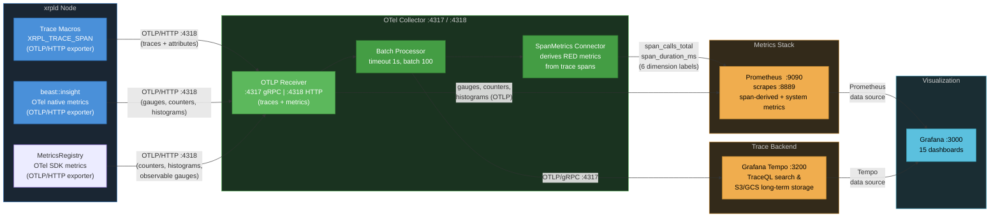

# Observability Data Collection Reference

> **Audience**: Developers and operators. This is the single source of truth for all telemetry data collected by xrpld's observability stack.
>
> **Related docs**: [docs/telemetry-runbook.md](../docs/telemetry-runbook.md) (operator runbook with alerting and troubleshooting) | [03-implementation-strategy.md](./03-implementation-strategy.md) (code structure and performance optimization) | [04-code-samples.md](./04-code-samples.md) (C++ instrumentation examples)

## Data Flow Overview



There are two independent telemetry pipelines entering a single **OTel Collector** via the same OTLP receiver:

1. **OpenTelemetry Traces** — Distributed spans with attributes, exported via OTLP/HTTP (:4318) to the collector's **OTLP Receiver**. The **Batch Processor** groups spans (1s timeout, batch size 100) before forwarding to trace backends. The **SpanMetrics Connector** derives RED metrics (rate, errors, duration) from every span and feeds them into the metrics pipeline.
2. **beast::insight OTel Metrics** — System-level gauges, counters, and histograms exported natively via OTLP/HTTP (:4318) to the same **OTLP Receiver**. These are batched and exported to Prometheus alongside span-derived metrics. The StatsD UDP transport has been replaced by native OTLP; `server=statsd` remains available as a fallback.

**Trace backend** — The collector exports traces via OTLP/gRPC to:

- **Grafana Tempo** — Preferred trace backend. Supports TraceQL queries at `:3200`, S3/GCS object storage for cost-effective long-term trace retention, and integrates natively with Grafana.

> **Further reading**: [00-tracing-fundamentals.md](./00-tracing-fundamentals.md) for core OpenTelemetry concepts (traces, spans, context propagation, sampling). [07-observability-backends.md](./07-observability-backends.md) for production backend selection, collector placement, and sampling strategies.

---

## 1. OpenTelemetry Spans

### 1.1 Complete Span Inventory (~37 spans)

> **See also**: [02-design-decisions.md §2.3](./02-design-decisions.md#23-span-naming-conventions) for naming conventions and the full span catalog with rationale. [04-code-samples.md §4.6](./04-code-samples.md#46-span-flow-visualization) for span flow diagrams.

> **Span names vs. attribute keys**: span names use dotted `subsystem.operation`
> form (e.g. `rpc.http_request`). Span _attribute_ keys use the bare/underscore
> form from the 2026-05-13 naming redesign (e.g. `tx_hash`, not `xrpl.tx.hash`).
> The dotted `xrpl.*` form is reserved for OTel **resource** attributes set once
> at startup. See §1.2 for the full attribute inventory.

#### RPC Spans

Controlled by `trace_rpc=1` in `[telemetry]` config.

| Span Name            | Parent             | Source File       | Description                                                              |
| -------------------- | ------------------ | ----------------- | ------------------------------------------------------------------------ |
| `rpc.http_request`   | —                  | ServerHandler.cpp | Top-level HTTP JSON-RPC request entry point                              |
| `rpc.ws_message`     | —                  | ServerHandler.cpp | WebSocket message handling (one per inbound frame)                       |
| `rpc.ws_upgrade`     | —                  | ServerHandler.cpp | WebSocket upgrade handshake (records handshake failures)                 |
| `rpc.process`        | `rpc.http_request` | ServerHandler.cpp | RPC processing pipeline (single or batch request)                        |
| `rpc.command.<name>` | `rpc.process`      | RPCHandler.cpp    | Per-command span (e.g., `rpc.command.server_info`, `rpc.command.ledger`) |

**Where to find**: Tempo → TraceQL: `{resource.service.name="xrpld" && name=~"rpc.http_request|rpc.command.*"}`

**Grafana dashboard**: _RPC Performance_ (`rpc-performance`)

#### gRPC Spans

Controlled by `trace_rpc=1` in `[telemetry]` config.

| Span Name           | Parent | Source File    | Description                                                                                                               |
| ------------------- | ------ | -------------- | ------------------------------------------------------------------------------------------------------------------------- |
| `grpc.<MethodName>` | —      | GRPCServer.cpp | One flat span per gRPC method (e.g., `grpc.GetLedger`, `grpc.GetLedgerData`, `grpc.GetLedgerDiff`, `grpc.GetLedgerEntry`) |

The method name is embedded in the span name (formed at the call site as
`grpc.<MethodName>`), so dashboards break out per-method latency and error
rates without TraceQL attribute filters.

**Where to find**: Tempo → TraceQL: `{resource.service.name="xrpld" && name=~"grpc.*"}`

**Grafana dashboard**: _RPC Performance_ (`rpc-performance`)

#### Transaction Spans

Controlled by `trace_transactions=1` in `[telemetry]` config.

| Span Name       | Parent         | Source File     | Description                                                       |
| --------------- | -------------- | --------------- | ----------------------------------------------------------------- |
| `tx.process`    | —              | NetworkOPs.cpp  | Transaction submission entry point (local or peer-relayed)        |
| `tx.receive`    | —              | PeerImp.cpp     | Raw transaction received from peer overlay (before deduplication) |
| `tx.apply`      | `ledger.build` | BuildLedger.cpp | Transaction set applied to new ledger during consensus            |
| `tx.preflight`  | —              | applySteps.cpp  | Stateless checks stage (`stage=preflight`)                        |
| `tx.preclaim`   | —              | applySteps.cpp  | Ledger-aware checks stage before fee claim (`stage=preclaim`)     |
| `tx.transactor` | —              | Transactor.cpp  | Apply stage — the transactor runs (`stage=apply`)                 |

The three apply-pipeline spans share a deterministic `trace_id` derived from
`txID[0:16]`, so preflight, preclaim, and transactor for one transaction group
under a single trace even though they run sequentially and often on different
threads. A transaction that hard-fails preflight or preclaim never reaches the
later spans — the `stage` attribute identifies where it stopped.

> **Deterministic roots are true roots.** Spans with a deterministic `trace_id`
> (the `tx.*` apply pipeline, `tx.process`, `tx.receive`, and `consensus.round`)
> are emitted as genuine trace roots with an empty `parent_span_id`. The chosen
> `trace_id` is injected through a custom `DeterministicIdGenerator` on the SDK's
> no-parent branch, so there is no synthetic placeholder parent — Tempo shows a
> clean root, not a "root span not yet received" warning. Cross-node correlation
> still works because every node derives the same `trace_id` from the shared hash.

> **Log-trace correlation is retained across coroutines.** OTel context storage
> is coroutine-aware (backed by `LocalValue`), so the active span travels with a
> coroutine across `yield()` and resumes on whatever thread the scheduler picks.
> RPC, consensus, and transaction spans therefore keep per-line log-trace
> correlation, and their scopes are safe across coroutine yields. Job-handoff
> spans — transaction apply and receive, consensus accept, and ledger acquire —
> are activated inside their worker bodies rather than at enqueue, so each
> worker's log lines carry the span's trace context.

**Where to find**: Tempo → TraceQL: `{resource.service.name="xrpld" && name=~"tx.process|tx.receive"}`
or, for the apply pipeline: `{resource.service.name="xrpld" && name=~"tx.preflight|tx.preclaim|tx.transactor"}`

**Grafana dashboard**: _Transaction Overview_ (`transaction-overview`)

#### Transaction Queue (TxQ) Spans

Controlled by `trace_transactions=1` in `[telemetry]` config.

| Span Name          | Parent                                                      | Source File | Description                                                                                                                                             |
| ------------------ | ----------------------------------------------------------- | ----------- | ------------------------------------------------------------------------------------------------------------------------------------------------------- |
| `txq.enqueue`      | `tx.process` (submission path; root on open-ledger rebuild) | TxQ.cpp     | Queue admission decision (apply/queue/reject). Parents to `tx.process` via explicit context on submit; correlates via `current_ledger_seq` on all paths |
| `txq.apply_direct` | `txq.enqueue`                                               | TxQ.cpp     | Direct apply attempt that bypasses the queue                                                                                                            |
| `txq.batch_clear`  | `txq.enqueue`                                               | TxQ.cpp     | Batch clear of an account's queued txs                                                                                                                  |
| `txq.accept`       | —                                                           | TxQ.cpp     | Ledger-close accept loop (drains the queue)                                                                                                             |
| `txq.accept_tx`    | `txq.accept`                                                | TxQ.cpp     | Per-queued-transaction apply inside the accept loop                                                                                                     |
| `txq.cleanup`      | —                                                           | TxQ.cpp     | Post-close cleanup of expired queue entries                                                                                                             |

**Where to find**: Tempo → TraceQL: `{resource.service.name="xrpld" && name=~"txq.*"}`

**Grafana dashboard**: _Transaction Overview_ (`transaction-overview`)

#### Consensus Spans

Controlled by `trace_consensus=1` in `[telemetry]` config.

| Span Name                      | Parent             | Source File      | Description                                                         |
| ------------------------------ | ------------------ | ---------------- | ------------------------------------------------------------------- |
| `consensus.round`              | — (root)           | RCLConsensus.cpp | Root span for one consensus round (deterministic trace per round)   |
| `consensus.phase.open`         | `consensus.round`  | Consensus.h      | Open phase — collecting transactions before close                   |
| `consensus.proposal.send`      | `consensus.round`  | RCLConsensus.cpp | Node broadcasts its transaction set proposal                        |
| `consensus.ledger_close`       | `consensus.round`  | RCLConsensus.cpp | Ledger close event triggered by consensus                           |
| `consensus.establish`          | `consensus.round`  | Consensus.h      | Establish phase — converging on the transaction set                 |
| `consensus.update_positions`   | `consensus.round`  | Consensus.h      | Position update with per-dispute vote details                       |
| `consensus.check`              | `consensus.round`  | Consensus.h      | Consensus threshold check (agree/disagree tally)                    |
| `consensus.accept`             | `consensus.round`  | RCLConsensus.cpp | Consensus accepts a ledger (round complete)                         |
| `consensus.accept.apply`       | `consensus.accept` | RCLConsensus.cpp | Ledger application with close-time details (jtACCEPT thread)        |
| `consensus.validation.send`    | `consensus.round`  | RCLConsensus.cpp | Validation message sent after ledger accepted (follows-from link)   |
| `consensus.mode_change`        | `consensus.round`  | RCLConsensus.cpp | Operating-mode transition during the round                          |
| `consensus.proposal.receive`   | (context)          | PeerImp.cpp      | Proposal received from a peer (context-propagated into the round)   |
| `consensus.validation.receive` | (context)          | PeerImp.cpp      | Validation received from a peer (context-propagated into the round) |

The `.receive` spans are created per-message in the overlay and joined to the
round trace via context propagation rather than direct parenting. The
`consensus.validation.send` span uses a follows-from link off the round.

**Where to find**: Tempo → TraceQL: `{resource.service.name="xrpld" && name=~"consensus.*"}`

**Grafana dashboard**: _Consensus Health_ (`consensus-health`)

#### Ledger Spans

Controlled by `trace_ledger=1` in `[telemetry]` config.

| Span Name         | Parent | Source File       | Description                                    |
| ----------------- | ------ | ----------------- | ---------------------------------------------- |
| `ledger.build`    | —      | BuildLedger.cpp   | Build new ledger from accepted transaction set |
| `ledger.validate` | —      | LedgerMaster.cpp  | Ledger promoted to validated status            |
| `ledger.store`    | —      | LedgerMaster.cpp  | Ledger stored to database/history              |
| `ledger.acquire`  | —      | InboundLedger.cpp | Fetch a missing ledger from peers              |

**Where to find**: Tempo → TraceQL: `{resource.service.name="xrpld" && name=~"ledger.*"}`

**Grafana dashboard**: _Ledger Operations_ (`ledger-operations`)

#### Peer Spans

Controlled by `trace_peer` in `[telemetry]` config. **Enabled by default** (high volume).

| Span Name                 | Parent | Source File | Description                           |
| ------------------------- | ------ | ----------- | ------------------------------------- |
| `peer.proposal.receive`   | —      | PeerImp.cpp | Consensus proposal received from peer |
| `peer.validation.receive` | —      | PeerImp.cpp | Validation message received from peer |

A `—` parent means the span is a fresh trace root (`kConsumer`): it is started
via `ScopedSpanGuard::freshRoot()` at the inbound-message entry point and never
inherits an ambient span left active on the peer thread, so it does not nest
under an unrelated transaction's trace.

**Where to find**: Tempo → TraceQL: `{resource.service.name="xrpld" && name=~"peer.*"}`

**Grafana dashboard**: _Peer Network_ (`peer-network`)

#### PathFind Spans

Controlled by `trace_rpc=1` in `[telemetry]` config.

| Span Name             | Parent               | Source File     | Description                                                |
| --------------------- | -------------------- | --------------- | ---------------------------------------------------------- |
| `pathfind.request`    | `rpc.command.<name>` | PathFind.cpp    | `path_find` RPC entry (`doPathFind`)                       |
| `pathfind.compute`    | `pathfind.request`   | PathRequest.cpp | Path computation for one request (`PathRequest::doUpdate`) |
| `pathfind.discover`   | `pathfind.compute`   | Pathfinder.cpp  | Graph exploration (one per RPC call)                       |
| `pathfind.update_all` | —                    | PathRequest.cpp | Async recomputation of all active requests at ledger close |

> **Note**: `pathfind.request` nests under the active `rpc.command.<name>` span.
> Because OTel context storage is coroutine-aware (backed by `LocalValue`), the
> `rpc.command.*` scope stays correct even though its generic dispatch
> (`callMethod`) also wraps handlers such as `doRipplePathFind` whose span is held
> across a coroutine `yield()` — the ambient context travels with the coroutine
> when it resumes, so there is no wrong-thread scope pop. The
> `pathfind.request → compute → discover` sub-tree therefore parents to
> `rpc.command.<name>`, giving an exact request-to-pathfind nesting.

**Where to find**: Tempo → TraceQL: `{resource.service.name="xrpld" && name=~"pathfind.*"}`

---

### 1.2 Complete Attribute Inventory (bare/underscore keys)

> **See also**: [02-design-decisions.md §2.4.2](./02-design-decisions.md#242-span-attributes-by-category) for attribute design rationale and privacy considerations.

Every span can carry key-value attributes that provide context for filtering and
aggregation. Per the 2026-05-13 naming redesign, span-attribute keys use the
**bare** field name (the span name already carries the domain), or the
`<domain>_<field>` underscore form where a bare name would collide (e.g.
`rpc_status`, `grpc_status`, `tx_status`, `txq_status`).

> **Dotted keys are resource attributes, never span attributes:**
>
> - `xrpl.network.id` and `xrpl.network.type` are **resource** attributes set
>   once at startup on the OTel resource — not span attributes. They appear on
>   every span's resource scope, queried as `{resource.xrpl.network.id=...}`.
> - The ledger hash uses the bare `ledger_hash` key on every span that records
>   it (both `consensus.validation.send` and `peer.validation.receive`) — there
>   is no dotted span attribute.

#### RPC Attributes

| Attribute              | Type    | Set On                            | Description                                      |
| ---------------------- | ------- | --------------------------------- | ------------------------------------------------ |
| `command`              | string  | `rpc.command.*`, `rpc.ws_message` | RPC command name (e.g., `server_info`, `ledger`) |
| `version`              | int64   | `rpc.command.*`                   | API version number                               |
| `rpc_role`             | string  | `rpc.command.*`                   | Caller role: `"admin"` or `"user"`               |
| `rpc_status`           | string  | `rpc.command.*`                   | Result: `"success"` or `"error"`                 |
| `request_payload_size` | int64   | `rpc.http_request`                | Bytes of inbound request payload                 |
| `is_batch`             | boolean | `rpc.process`                     | `true` if the request is a JSON-RPC batch        |
| `batch_size`           | int64   | `rpc.process`                     | Number of sub-requests in a batch                |
| `load_type`            | string  | `rpc.command.*`                   | Resource cost category after execution           |

**Tempo query**: `{span.command="server_info"}` to find all `server_info` calls.

**Prometheus label**: `command` (used as a SpanMetrics dimension).

#### gRPC Attributes

| Attribute     | Type   | Set On              | Description                          |
| ------------- | ------ | ------------------- | ------------------------------------ |
| `method`      | string | `grpc.<MethodName>` | gRPC method name (e.g., `GetLedger`) |
| `grpc_role`   | string | `grpc.<MethodName>` | Caller role: `"admin"` or `"user"`   |
| `grpc_status` | string | `grpc.<MethodName>` | Result: `"success"` or `"error"`     |

**Tempo query**: `{span.method="GetLedger"}` or `{name="grpc.GetLedger"}`.

**Prometheus labels**: `method`, `grpc_role`, `grpc_status` (SpanMetrics dimensions).

#### Transaction Attributes

| Attribute             | Type    | Set On                                                       | Description                                                                                                                           |
| --------------------- | ------- | ------------------------------------------------------------ | ------------------------------------------------------------------------------------------------------------------------------------- |
| `tx_hash`             | string  | `tx.process`, `tx.receive`                                   | Transaction hash (hex-encoded)                                                                                                        |
| `local`               | boolean | `tx.process`                                                 | `true` if locally submitted, `false` if peer-relayed                                                                                  |
| `path`                | string  | `tx.process`                                                 | Submission path: `"sync"` or `"async"`                                                                                                |
| `tx_type`             | string  | `tx.process`, `tx.preflight`, `tx.preclaim`, `tx.transactor` | Transaction type name (e.g., `Payment`)                                                                                               |
| `fee`                 | int64   | `tx.process`                                                 | Transaction fee in drops                                                                                                              |
| `sequence`            | int64   | `tx.process`                                                 | Transaction sequence number                                                                                                           |
| `suppressed`          | boolean | `tx.receive`                                                 | `true` if transaction was suppressed (duplicate)                                                                                      |
| `tx_status`           | string  | `tx.receive`                                                 | Transaction status (e.g., `"known_bad"`)                                                                                              |
| `peer_id`             | int64   | `tx.receive`                                                 | Peer identifier (also set on peer spans)                                                                                              |
| `peer_version`        | string  | `tx.receive`                                                 | Peer protocol version string                                                                                                          |
| `stage`               | string  | `tx.preflight`, `tx.preclaim`, `tx.transactor`               | Apply-pipeline stage: `preflight`, `preclaim`, or `apply`                                                                             |
| `ter_result`          | string  | `tx.preflight`, `tx.preclaim`, `tx.transactor`               | Engine result token for that stage (e.g., `tesSUCCESS`, `terPRE_SEQ`)                                                                 |
| `applied`             | boolean | `tx.transactor`                                              | `true` if the transaction was applied to the ledger                                                                                   |
| `current_ledger_seq`  | int64   | `tx.process`, `tx.receive`, `tx.preclaim`, `tx.transactor`   | Seq of the ledger being worked on (open/in-flight, not established) — joins the txID-keyed spans to the ledger trace                  |
| `current_ledger_hash` | string  | `tx.preclaim`, `tx.transactor`                               | Parent hash of that ledger (= `consensus.round` trace-id seed on the build path). View-bearing stages only; `tx.preflight` omits both |

**Tempo query**: `{span.tx_hash="<hash>"}` to trace a specific transaction across nodes.
Join a transaction's work to its ledger with `{span.current_ledger_seq=<N>}`.

**Prometheus labels**: `local`, `suppressed`, `tx_type`, `ter_result`, `stage` (SpanMetrics dimensions).

#### Transaction Queue (TxQ) Attributes

| Attribute             | Type    | Set On                         | Description                                                                      |
| --------------------- | ------- | ------------------------------ | -------------------------------------------------------------------------------- |
| `tx_hash`             | string  | `txq.enqueue`, `txq.accept_tx` | Transaction hash                                                                 |
| `tx_type`             | string  | `txq.enqueue`                  | Transaction type name                                                            |
| `current_ledger_seq`  | int64   | `txq.enqueue`                  | Seq of the ledger being worked on — correlates the enqueue to the ledger trace   |
| `current_ledger_hash` | string  | `txq.enqueue`                  | Parent hash of that ledger (= `consensus.round` trace-id seed on the build path) |
| `txq_status`          | string  | `txq.enqueue`, `txq.accept_tx` | Queue outcome (e.g. `queued`, `applied_direct`, `rejected`)                      |
| `fee_level_paid`      | int64   | `txq.enqueue`                  | Fee level paid by the queued tx                                                  |
| `required_fee_level`  | int64   | `txq.enqueue`                  | Minimum fee level for inclusion                                                  |
| `num_cleared`         | int64   | `txq.batch_clear`              | Entries cleared in a batch                                                       |
| `queue_size`          | int64   | `txq.accept`                   | Current TxQ depth                                                                |
| `ledger_changed`      | boolean | `txq.accept`                   | Whether the ledger changed since last attempt                                    |
| `ter_code`            | int64   | `txq.accept_tx`                | Transaction engine result code                                                   |
| `retries_remaining`   | int64   | `txq.accept_tx`                | Retries left before discard                                                      |
| `ledger_seq`          | int64   | `txq.cleanup`                  | Ledger sequence number                                                           |
| `expired_count`       | int64   | `txq.cleanup`                  | Number of expired entries cleared                                                |

**Prometheus label**: `txq_status` (SpanMetrics dimension).

#### Consensus Attributes

| Attribute                  | Type    | Set On                                                                                             | Description                                              |
| -------------------------- | ------- | -------------------------------------------------------------------------------------------------- | -------------------------------------------------------- |
| `consensus_ledger_id`      | string  | `consensus.round`                                                                                  | Previous-ledger id anchoring the round                   |
| `ledger_seq`               | int64   | `consensus.round`, `consensus.ledger_close`, `consensus.accept.apply`, `consensus.validation.send` | Ledger sequence number                                   |
| `consensus_mode`           | string  | `consensus.round`, `consensus.ledger_close`                                                        | Node mode: `"Proposing"`, `"Observing"`, `"Wrong"`, etc. |
| `consensus_round_id`       | int64   | `consensus.round`                                                                                  | Round identifier                                         |
| `consensus_phase`          | string  | `consensus.round`                                                                                  | Current phase name (updated on each transition)          |
| `trace_strategy`           | string  | `consensus.round`                                                                                  | Trace-id strategy (`deterministic` / `random`)           |
| `previous_ledger_seq`      | int64   | `consensus.round`                                                                                  | Sequence of the previous ledger                          |
| `previous_proposers`       | int64   | `consensus.round`                                                                                  | Proposer count in the previous round                     |
| `previous_round_time_ms`   | int64   | `consensus.round`                                                                                  | Duration of the previous round                           |
| `consensus_round`          | int64   | `consensus.proposal.send`                                                                          | Proposal sequence number for the broadcast proposal      |
| `is_bow_out`               | boolean | `consensus.proposal.send`                                                                          | Whether the proposal is a bow-out (resigning the round)  |
| `tx_count_open`            | int64   | `consensus.ledger_close`                                                                           | Transactions in the open ledger at close                 |
| `close_time_resolution_ms` | int64   | `consensus.ledger_close`                                                                           | Close-time rounding granularity                          |
| `converge_percent`         | int64   | `consensus.establish`, `consensus.update_positions`                                                | Convergence percentage                                   |
| `establish_count`          | int64   | `consensus.establish`                                                                              | Establish-phase iteration count                          |
| `proposers`                | int64   | `consensus.establish`, `consensus.update_positions`, `consensus.accept`                            | Number of proposers                                      |
| `disputes_count`           | int64   | `consensus.establish`, `consensus.update_positions`                                                | Number of disputed transactions                          |
| `tx_id`                    | string  | `consensus.update_positions`                                                                       | Disputed transaction id (per-dispute event)              |
| `dispute_our_vote`         | boolean | `consensus.update_positions`                                                                       | Our vote on the disputed tx                              |
| `dispute_yays`             | int64   | `consensus.update_positions`                                                                       | Yes votes on the disputed tx                             |
| `dispute_nays`             | int64   | `consensus.update_positions`                                                                       | No votes on the disputed tx                              |
| `agree_count`              | int64   | `consensus.check`                                                                                  | Agreeing proposer count                                  |
| `disagree_count`           | int64   | `consensus.check`                                                                                  | Disagreeing proposer count                               |
| `threshold_percent`        | int64   | `consensus.check`                                                                                  | Agreement threshold percentage                           |
| `consensus_result`         | string  | `consensus.check`                                                                                  | Check outcome                                            |
| `quorum`                   | int64   | `consensus.check`, `consensus.accept`                                                              | Quorum required                                          |
| `round_time_ms`            | int64   | `consensus.accept`, `consensus.accept.apply`                                                       | Total consensus round duration in milliseconds           |
| `consensus_state`          | string  | `consensus.accept.apply`                                                                           | Consensus outcome: `"finished"` or `"moved_on"`          |
| `close_time`               | int64   | `consensus.accept.apply`                                                                           | Agreed-upon ledger close time (epoch seconds)            |
| `close_time_correct`       | boolean | `consensus.accept.apply`                                                                           | Whether validators agreed on close time                  |
| `close_resolution_ms`      | int64   | `consensus.accept.apply`                                                                           | Close-time rounding granularity in milliseconds          |
| `proposing`                | boolean | `consensus.accept.apply`, `consensus.validation.send`                                              | Whether this node was a proposer                         |
| `parent_close_time`        | int64   | `consensus.accept.apply`                                                                           | Parent ledger close time                                 |
| `close_time_self`          | int64   | `consensus.accept.apply`                                                                           | This node's close-time vote                              |
| `close_time_vote_bins`     | string  | `consensus.accept.apply`                                                                           | Distribution of close-time votes                         |
| `resolution_direction`     | string  | `consensus.accept.apply`                                                                           | Whether close resolution increased/decreased/unchanged   |
| `tx_count`                 | int64   | `consensus.accept.apply`                                                                           | Transactions in the accepted set                         |
| `ledger_hash`              | string  | `consensus.validation.send`                                                                        | Full hash of the validated ledger (shared with peer)     |
| `full_validation`          | boolean | `consensus.validation.send`                                                                        | Whether this is a full validation                        |
| `validation_sign_time`     | int64   | `consensus.validation.send`                                                                        | Validation signing time                                  |
| `mode_old`                 | string  | `consensus.mode_change`                                                                            | Operating mode before the transition                     |
| `mode_new`                 | string  | `consensus.mode_change`                                                                            | Operating mode after the transition                      |

**Tempo query**: `{span.consensus_mode="Proposing"}` to find rounds where the node was proposing.

**Prometheus labels**: `consensus_mode`, `consensus_state`, `consensus_phase`, `consensus_result`, `consensus_stalled`, `mode_new`, `close_time_correct` (SpanMetrics dimensions).

#### Ledger Attributes

| Attribute             | Type    | Set On                                            | Description                                      |
| --------------------- | ------- | ------------------------------------------------- | ------------------------------------------------ |
| `ledger_seq`          | int64   | `ledger.build`, `ledger.validate`, `ledger.store` | Ledger sequence number                           |
| `close_time`          | int64   | `ledger.build`                                    | Ledger close time (epoch seconds)                |
| `close_time_correct`  | boolean | `ledger.build`                                    | Whether close time was agreed upon by validators |
| `close_resolution_ms` | int64   | `ledger.build`                                    | Close time rounding granularity in milliseconds  |
| `tx_count`            | int64   | `tx.apply`                                        | Transactions applied to the ledger               |
| `tx_failed`           | int64   | `tx.apply`                                        | Failed transactions in the apply set             |
| `validations`         | int64   | `ledger.validate`                                 | Number of validations received for this ledger   |
| `acquire_reason`      | string  | `ledger.acquire`                                  | Why the ledger fetch was triggered               |
| `timeouts`            | int64   | `ledger.acquire`                                  | Number of fetch timeouts                         |
| `peer_count`          | int64   | `ledger.acquire`                                  | Peers queried during the fetch                   |
| `outcome`             | string  | `ledger.acquire`                                  | Fetch outcome                                    |

The apply-step span `tx.apply` (child of `ledger.build`) carries `tx_count`/`tx_failed`;
the parent `ledger.build` carries `ledger_seq` and the close-time attributes.
`ledger.acquire` (InboundLedger) also sets `ledger_seq`.

**Tempo query**: `{span.ledger_seq=12345}` to find all spans for a specific ledger.

#### Peer Attributes

| Attribute            | Type    | Set On                                                           | Description                                          |
| -------------------- | ------- | ---------------------------------------------------------------- | ---------------------------------------------------- |
| `peer_id`            | int64   | `tx.receive`, `peer.proposal.receive`, `peer.validation.receive` | Peer identifier                                      |
| `proposal_trusted`   | boolean | `peer.proposal.receive`                                          | Whether the proposal came from a trusted validator   |
| `validation_trusted` | boolean | `peer.validation.receive`                                        | Whether the validation came from a trusted validator |
| `full_validation`    | boolean | `peer.validation.receive`                                        | Whether the validation is a full validation          |
| `ledger_hash`        | string  | `peer.validation.receive`                                        | Validated ledger hash (shared with consensus spans)  |

**Prometheus labels**: `proposal_trusted`, `validation_trusted` (SpanMetrics dimensions).

#### PathFind Attributes

| Attribute                 | Type    | Set On                | Description                              |
| ------------------------- | ------- | --------------------- | ---------------------------------------- |
| `pathfind_source_account` | string  | `pathfind.request`    | Originating account for the path search  |
| `pathfind_dest_account`   | string  | `pathfind.request`    | Destination account                      |
| `pathfind_fast`           | boolean | `pathfind.compute`    | Whether fast pathfinding mode is enabled |
| `pathfind_search_level`   | int64   | `pathfind.discover`   | Depth of graph exploration               |
| `pathfind_num_paths`      | int64   | `pathfind.discover`   | Total paths produced                     |
| `pathfind_ledger_index`   | int64   | `pathfind.update_all` | Target ledger index                      |
| `pathfind_num_requests`   | int64   | `pathfind.update_all` | Active requests recomputed               |

---

### 1.3 SpanMetrics — Derived Prometheus Metrics

> **See also**: [01-architecture-analysis.md](./01-architecture-analysis.md) §1.8.2 for how span-derived metrics map to operational insights.

The OTel Collector's SpanMetrics connector automatically generates RED (Rate, Errors, Duration) metrics from every span. No custom metrics code in xrpld is needed.

| Prometheus Metric                   | Type      | Description                                                                    |
| ----------------------------------- | --------- | ------------------------------------------------------------------------------ |
| `span_calls_total`                  | Counter   | Total span invocations                                                         |
| `span_duration_milliseconds_bucket` | Histogram | Latency distribution (buckets: 1, 5, 10, 25, 50, 100, 250, 500, 1000, 5000 ms) |
| `span_duration_milliseconds_count`  | Histogram | Observation count                                                              |
| `span_duration_milliseconds_sum`    | Histogram | Cumulative latency                                                             |

**Standard labels on every metric**: `span_name`, `status_code`, `service_name`, `span_kind`

**Additional dimension labels** (configured in `otel-collector-config.yaml`).
The Prometheus label is the **bare span-attribute key verbatim** — the
SpanMetrics connector does not rewrite or prefix it:

| Prometheus Label / Span Attribute | Type    | Applies To                                     |
| --------------------------------- | ------- | ---------------------------------------------- |
| `command`                         | string  | `rpc.command.*`                                |
| `rpc_status`                      | string  | `rpc.command.*`                                |
| `consensus_mode`                  | string  | `consensus.round`, `consensus.ledger_close`    |
| `close_time_correct`              | boolean | `consensus.accept.apply`                       |
| `local`                           | boolean | `tx.process`                                   |
| `suppressed`                      | boolean | `tx.receive`                                   |
| `proposal_trusted`                | boolean | `peer.proposal.receive`                        |
| `validation_trusted`              | boolean | `peer.validation.receive`                      |
| `tx_type`                         | string  | `tx.*`, `txq.enqueue`                          |
| `ter_result`                      | string  | `tx.preflight`, `tx.preclaim`, `tx.transactor` |
| `stage`                           | string  | `tx.preflight`, `tx.preclaim`, `tx.transactor` |
| `txq_status`                      | string  | `txq.enqueue`, `txq.accept_tx`                 |
| `consensus_state`                 | string  | `consensus.accept.apply`                       |
| `load_type`                       | string  | `rpc.command.*`                                |
| `is_batch`                        | boolean | `rpc.process`                                  |
| `mode_new`                        | string  | `consensus.mode_change`                        |
| `consensus_stalled`               | boolean | `consensus.check`                              |
| `consensus_phase`                 | string  | `consensus.round`                              |
| `consensus_result`                | string  | `consensus.check`                              |
| `method`                          | string  | `grpc.<MethodName>`                            |
| `grpc_role`                       | string  | `grpc.<MethodName>`                            |
| `grpc_status`                     | string  | `grpc.<MethodName>`                            |

The `stage` dimension (3 values: `preflight`, `preclaim`, `apply`) turns the
apply-pipeline spans into per-stage RED metrics with no native instruments — the
_Transaction Overview_ dashboard charts rate, p95 latency, and failure rate by stage.

> **Sampling caveat**: xrpld head sampling is fixed at 1.0 (every trace is
> recorded), so span-derived metrics are not undercounted at the node. If the
> collector is configured with tail sampling, span-derived metrics reflect only
> the retained traces, whereas native StatsD/meter metrics do not sample.
> Account for any collector-side tail sampling when reading absolute stage rates.

**Where to query**: Prometheus → `span_calls_total{span_name="rpc.command.server_info"}`

---

## 2. System Metrics (beast::insight — OTel native)

> **See also**: [02-design-decisions.md](./02-design-decisions.md) for the beast::insight coexistence design. [06-implementation-phases.md](./06-implementation-phases.md) for the Phase 6/7 metric inventory.
>
> **Migration complete**: Phase 7 replaced the StatsD UDP transport with native OTel Metrics SDK export via OTLP/HTTP. The `beast::insight::Collector` interface and all metric names are preserved — only the wire protocol changed. `[insight] server=statsd` remains as a fallback.

These are system-level metrics emitted by xrpld's `beast::insight` framework via OTel OTLP/HTTP. They cover operational data that doesn't map to individual trace spans.

### Configuration

```ini
# Recommended: native OTel metrics via OTLP/HTTP
[insight]
server=otel
endpoint=http://localhost:4318/v1/metrics
prefix=xrpld
```

Fallback (StatsD):

```ini
[insight]
server=statsd
address=127.0.0.1:8125
prefix=xrpld
```

### 2.1 Gauges

| Prometheus Metric                           | Source File           | Description                               | Typical Range                   |
| ------------------------------------------- | --------------------- | ----------------------------------------- | ------------------------------- |
| `ledgermaster_validated_ledger_age`         | LedgerMaster.h        | Seconds since last validated ledger       | 0–10 (healthy), >30 (stale)     |
| `ledgermaster_published_ledger_age`         | LedgerMaster.h        | Seconds since last published ledger       | 0–10 (healthy)                  |
| `state_accounting_disconnected_duration`    | NetworkOPs.cpp        | Cumulative seconds in Disconnected state  | Monotonic                       |
| `state_accounting_connected_duration`       | NetworkOPs.cpp        | Cumulative seconds in Connected state     | Monotonic                       |
| `state_accounting_syncing_duration`         | NetworkOPs.cpp        | Cumulative seconds in Syncing state       | Monotonic                       |
| `state_accounting_tracking_duration`        | NetworkOPs.cpp        | Cumulative seconds in Tracking state      | Monotonic                       |
| `state_accounting_full_duration`            | NetworkOPs.cpp        | Cumulative seconds in Full state          | Monotonic (should dominate)     |
| `state_accounting_disconnected_transitions` | NetworkOPs.cpp        | Count of transitions to Disconnected      | Low                             |
| `state_accounting_connected_transitions`    | NetworkOPs.cpp        | Count of transitions to Connected         | Low                             |
| `state_accounting_syncing_transitions`      | NetworkOPs.cpp        | Count of transitions to Syncing           | Low                             |
| `state_accounting_tracking_transitions`     | NetworkOPs.cpp        | Count of transitions to Tracking          | Low                             |
| `state_accounting_full_transitions`         | NetworkOPs.cpp        | Count of transitions to Full              | Low (should be 1 after startup) |
| `peer_finder_active_inbound_peers`          | PeerfinderManager.cpp | Active inbound peer connections           | 0–85                            |
| `peer_finder_active_outbound_peers`         | PeerfinderManager.cpp | Active outbound peer connections          | 10–21                           |
| `overlay_peer_disconnects`                  | OverlayImpl.cpp       | Cumulative peer disconnection count       | Low growth                      |
| `overlay_peer_disconnects_charges`          | OverlayImpl.cpp       | Disconnects due to resource limit charges | Low growth (subset of above)    |
| `jobq_job_count`                            | JobQueue.cpp          | Current job queue depth (group `jobq`)    | 0–100 (healthy)                 |

**Grafana dashboard**: _Node Health_ (`node-health`)

### 2.2 Counters

| Prometheus Metric         | Source File        | Description                                   |
| ------------------------- | ------------------ | --------------------------------------------- |
| `rpc_requests`            | ServerHandler.cpp  | Total RPC requests received                   |
| `ledger_fetches`          | InboundLedgers.cpp | Inbound ledger fetch attempts                 |
| `ledger_history_mismatch` | LedgerHistory.cpp  | Ledger hash mismatches detected               |
| `warn`                    | Logic.h            | Resource manager warnings issued              |
| `drop`                    | Logic.h            | Resource manager drops (connections rejected) |

**Note**: With `server=otel`, `warn` and `drop` are properly exported as OTel Counter instruments. The previous StatsD `|m` type limitation no longer applies.

**Grafana dashboard**: _RPC & Pathfinding_ (`rpc-pathfinding`)

### 2.3 Histograms (Event timers)

| Prometheus Metric | Source File       | Unit | Description                    |
| ----------------- | ----------------- | ---- | ------------------------------ |
| `rpc_time`        | ServerHandler.cpp | ms   | RPC response time distribution |
| `rpc_size`        | ServerHandler.cpp | ms\* | RPC response size (see note)   |
| `ios_latency`     | Application.cpp   | ms   | I/O service loop latency       |
| `pathfind_fast`   | PathRequests.h    | ms   | Fast pathfinding duration      |
| `pathfind_full`   | PathRequests.h    | ms   | Full pathfinding duration      |

Quantiles collected: 0th, 50th, 90th, 95th, 99th, 100th percentile.

\* **`rpc_size` instrument mismatch (known issue):** response size in bytes is
recorded through the millisecond-scaled event histogram (`makeEvent`), so it is
exported as `rpc_size_milliseconds_bucket` with time-scaled boundaries that top
out at 5000. Byte values above ~5 KB saturate in the last bucket, so the
percentiles are not true byte sizes. The _RPC & Pathfinding_ panel is flagged
accordingly. A dedicated byte-unit histogram is needed to fix this; tracked
separately.

**Grafana dashboards**: _Node Health_ (`ios_latency`), _RPC & Pathfinding_ (`rpc_time`, `rpc_size`, `pathfind_*`)

### 2.4 Overlay Traffic Metrics

For each of the 45+ overlay traffic categories (defined in `TrafficCount.h`), four gauges are emitted:

- `{category}_bytes_in`
- `{category}_bytes_out`
- `{category}_messages_in`
- `{category}_messages_out`

**Key categories**:

| Category                                                          | Description                |
| ----------------------------------------------------------------- | -------------------------- |
| `total`                                                           | All traffic aggregated     |
| `overhead` / `overhead_overlay`                                   | Protocol overhead          |
| `transactions` / `transactions_duplicate`                         | Transaction relay          |
| `proposals` / `proposals_untrusted` / `proposals_duplicate`       | Consensus proposals        |
| `validations` / `validations_untrusted` / `validations_duplicate` | Consensus validations      |
| `ledger_data_get` / `ledger_data_share`                           | Ledger data exchange       |
| `ledger_data_Transaction_Node_get/share`                          | Transaction node data      |
| `ledger_data_Account_State_Node_get/share`                        | Account state node data    |
| `ledger_data_Transaction_Set_candidate_get/share`                 | Transaction set candidates |
| `getObject` / `haveTxSet` / `ledgerData`                          | Object requests            |
| `ping` / `status`                                                 | Keepalive and status       |
| `set_get`                                                         | Set requests               |

**Grafana dashboards**: _Network Traffic_ (`network-traffic`), _Overlay Traffic Detail_ (`overlay-traffic-detail`), _Ledger Data & Sync_ (`ledger-data-sync`)

---

## 3. Grafana Dashboard Reference

> **See also**: [05-configuration-reference.md](./05-configuration-reference.md) §5.8 for Grafana data source provisioning (Tempo, Prometheus) and TraceQL query examples.

Fifteen dashboards are provisioned in total. §3.1 and §3.2 below cover the
original ten; the remaining five were added by later phases and are catalogued
where they were introduced, so this section is not the full inventory:

| Dashboard          | UID                  | Catalogued in                                        |
| ------------------ | -------------------- | ---------------------------------------------------- |
| Fee Market & TxQ   | `fee-market`         | §5b "New Grafana Dashboards (Phase 9)"               |
| Job Queue Analysis | `job-queue`          | §5b "New Grafana Dashboards (Phase 9)"               |
| Validator Health   | `validator-health`   | §5d "New Grafana Dashboards (Phase 9)"               |
| Peer Quality       | `peer-quality`       | §5d "New Grafana Dashboards (Phase 9)"               |
| Ledger Sync Health | `ledger-sync-health` | "Fresh-node sync diagnostics" (end of this document) |

The authoritative count is whatever
`docker/telemetry/grafana/dashboards/*.json` holds;
`validate_dashboards.py` prints it and the workload harness asserts every
board renders.

### 3.1 Span-Derived Dashboards (5)

| Dashboard            | UID                    | Data Source              | Key Panels                                                                         |
| -------------------- | ---------------------- | ------------------------ | ---------------------------------------------------------------------------------- |
| RPC Performance      | `rpc-performance`      | Prometheus (SpanMetrics) | Request rate by command, p95 latency by command, error rate, heatmap, top commands |
| Transaction Overview | `transaction-overview` | Prometheus (SpanMetrics) | Processing rate, latency p95/p50, local vs relay split, apply duration, heatmap    |
| Consensus Health     | `consensus-health`     | Prometheus (SpanMetrics) | Round duration p95/p50, proposals rate, close duration, mode timeline, heatmap     |
| Ledger Operations    | `ledger-operations`    | Prometheus (SpanMetrics) | Build rate, build duration, validation rate, store rate, build vs close comparison |
| Peer Network         | `peer-network`         | Prometheus (SpanMetrics) | Proposal receive rate, validation receive rate, trusted vs untrusted breakdown     |

### 3.2 System Metrics Dashboards (5)

| Dashboard              | UID                      | Data Source       | Key Panels                                                                        |
| ---------------------- | ------------------------ | ----------------- | --------------------------------------------------------------------------------- |
| Node Health            | `node-health`            | Prometheus (OTLP) | Ledger age, operating mode, I/O latency, job queue, fetch rate                    |
| Network Traffic        | `network-traffic`        | Prometheus (OTLP) | Active peers, disconnects, bytes in/out, messages in/out, traffic by category     |
| RPC & Pathfinding      | `rpc-pathfinding`        | Prometheus (OTLP) | RPC rate, response time/size, pathfinding duration, resource warnings/drops       |
| Overlay Traffic Detail | `overlay-traffic-detail` | Prometheus (OTLP) | Squelch, overhead, validator lists, set get/share, have/requested tx, proof paths |
| Ledger Data & Sync     | `ledger-data-sync`       | Prometheus (OTLP) | Ledger data exchange, legacy ledger share/get, getobject by type, traffic heatmap |

### 3.3 Deployment-Tier Template Variables

Every dashboard carries seven filtering template variables (each variable name
matches its Prometheus label), letting one Grafana stack be sliced by tier and
by perf-comparison run:

| Variable                  | Source label             | Description                                                      |
| ------------------------- | ------------------------ | ---------------------------------------------------------------- |
| `$node`                   | `service_instance_id`    | Filter by xrpld node instance                                    |
| `$service_name`           | `service_name`           | Filter by service (`service.name`, e.g. `xrpld`)                 |
| `$deployment_environment` | `deployment_environment` | Filter by deployment tier (`local` / `test` / `ci` / `prod`)     |
| `$xrpl_network_type`      | `xrpl_network_type`      | Filter by network (`mainnet` / `testnet` / `devnet` / `perf`)    |
| `$xrpl_work_item`         | `xrpl_work_item`         | Filter by perf-iac work item / ticket (e.g. `RIPD-7455`)         |
| `$xrpl_branch`            | `xrpl_branch`            | Filter by comparison side (`baseline:<ref>:<commit>` / `test:…`) |
| `$xrpl_node_role`         | `xrpl_node_role`         | Filter by node role (`validator` / `peer`)                       |

The last three are populated only during perf-iac comparison runs (stamped as
resource attributes by perf-iac's own alloy pipeline, not the repo collector).
Outside those runs the labels are absent; the filters default to **All**, which
matches series lacking the label so every dashboard still renders.

See [telemetry-runbook.md](../docs/telemetry-runbook.md) "Deployment Tiers"
for how the tier attributes are set and reach metrics.

### 3.4 Accessing the Dashboards

1. Open Grafana at **http://localhost:3000**
2. Navigate to **Dashboards → xrpld** folder
3. All 15 dashboards are auto-provisioned from `docker/telemetry/grafana/dashboards/`

---

## 4. Tempo Trace Search Guide

> **See also**: [08-appendix.md](./08-appendix.md) §8.2 for span hierarchy visualizations. [05-configuration-reference.md](./05-configuration-reference.md) §5.8.5 for TraceQL query examples.

### Finding Traces by Type

| What to Find             | Tempo TraceQL Query                                                            |
| ------------------------ | ------------------------------------------------------------------------------ |
| All RPC calls            | `{resource.service.name="xrpld" && name="rpc.http_request"}`                   |
| Specific RPC command     | `{resource.service.name="xrpld" && name="rpc.command.server_info"}`            |
| Slow RPC calls           | `{resource.service.name="xrpld" && name=~"rpc.command.*"} \| duration > 100ms` |
| Failed RPC calls         | `{span.rpc_status="error"}`                                                    |
| gRPC method calls        | `{resource.service.name="xrpld" && name="grpc.GetLedger"}`                     |
| Specific transaction     | `{span.tx_hash="<hex_hash>"}`                                                  |
| Local transactions only  | `{span.local=true}`                                                            |
| Consensus rounds         | `{resource.service.name="xrpld" && name="consensus.round"}`                    |
| Rounds by mode           | `{span.consensus_mode="Proposing"}`                                            |
| Specific ledger          | `{span.ledger_seq=12345}`                                                      |
| Peer proposals (trusted) | `{span.proposal_trusted=true}`                                                 |

### Trace Structure

A typical RPC trace shows the span hierarchy:

```
rpc.http_request (ServerHandler)
  └── rpc.process (ServerHandler)
       └── rpc.command.server_info (RPCHandler)
```

A consensus round groups its lifecycle spans under a single root
(`consensus.round`); the build/ledger spans run as their own trees:

```
consensus.round                    (root — one per round)
  ├── consensus.phase.open         (open phase)
  ├── consensus.proposal.send      (broadcast proposal)
  ├── consensus.ledger_close       (close event)
  ├── consensus.establish          (establish phase)
  ├── consensus.update_positions   (position updates)
  ├── consensus.check              (threshold check)
  ├── consensus.accept             (accept result)
  │     └── consensus.accept.apply (apply, jtACCEPT thread)
  └── consensus.validation.send    (send validation, follows-from link)

ledger.build                       (build new ledger)
  └── tx.apply                     (apply transaction set)
ledger.validate                    (promote to validated)
ledger.store                       (persist to DB)
```

---

## 5. Prometheus Query Examples

> **See also**: [05-configuration-reference.md](./05-configuration-reference.md) §5.8.7 for correlating Prometheus system metrics with trace-derived metrics.

### Span-Derived Metrics

```promql
# RPC request rate by command (last 5 minutes)
sum by (command) (rate(span_calls_total{span_name=~"rpc.command.*"}[5m]))

# RPC p95 latency by command
histogram_quantile(0.95, sum by (le, command) (rate(span_duration_milliseconds_bucket{span_name=~"rpc.command.*"}[5m])))

# Consensus round duration p95
histogram_quantile(0.95, sum by (le) (rate(span_duration_milliseconds_bucket{span_name="consensus.round"}[5m])))

# Transaction processing rate (local vs relay)
sum by (local) (rate(span_calls_total{span_name="tx.process"}[5m]))

# Trusted vs untrusted proposal rate
sum by (proposal_trusted) (rate(span_calls_total{span_name="peer.proposal.receive"}[5m]))
```

### StatsD Metrics

```promql
# Validated ledger age (should be < 10s)
ledgermaster_validated_ledger_age

# Active peer count
peer_finder_active_inbound_peers + peer_finder_active_outbound_peers

# RPC response time p95
histogram_quantile(0.95, rpc_time_bucket)

# Total network bytes in (rate)
rate(total_bytes_in[5m])

# Operating mode (should be "Full" after startup)
state_accounting_full_duration
```

---

## 5a. Log-Trace Correlation (Phase 8)

> **Plan details**: [06-implementation-phases.md §6.8.1](./06-implementation-phases.md) — motivation, architecture, Mermaid diagrams
> **Task breakdown**: [Phase8_taskList.md](./Phase8_taskList.md) — per-task implementation details

Phase 8 injects OTel trace context into xrpld's `Logs::format()` output, enabling log-trace correlation. When a log line is emitted within an active OTel span, the trace and span identifiers are automatically appended after the severity field:

### Log Format

```
<timestamp> <partition>:<severity> trace_id=<32hex> span_id=<16hex> <message>
```

Example:

```
2024-Jan-15 10:30:45.123456 UTC LedgerMaster:NFO trace_id=abc123def456789012345678abcdef01 span_id=0123456789abcdef Validated ledger 42
```

- **`trace_id=<hex32>`** — 32-character lowercase hex trace identifier. Links to the distributed trace in Tempo.
- **`span_id=<hex16>`** — 16-character lowercase hex span identifier. Identifies the specific span within the trace.
- **Only present** when the log is emitted within an active OTel span. Log lines outside of traced code paths have no trace context fields.

### Implementation

The trace context injection is implemented in `Logs::format()` (`src/libxrpl/basics/Log.cpp`), guarded by `#ifdef XRPL_ENABLE_TELEMETRY`. It checks the thread-local runtime context value directly (via `RuntimeContext::GetCurrent().GetValue(kSpanKey)`) to avoid the heap allocation that `GetSpan()` performs on the no-span path. On threads without an active span, the cost is a thread-local read + variant type check (~15-20ns). On the active-span path, total cost is ~50ns per log call.

### Log Ingestion Pipeline

```
xrpld debug.log -> OTel Collector filelog receiver -> regex_parser -> Loki exporter -> Grafana Loki
```

The OTel Collector's `filelog` receiver tails `debug.log` files and uses a `regex_parser` operator to extract structured fields:

| Field       | Type     | Description                                              |
| ----------- | -------- | -------------------------------------------------------- |
| `timestamp` | datetime | Log timestamp                                            |
| `partition` | string   | Log partition (e.g., `LedgerMaster`, `PeerImp`)          |
| `severity`  | string   | Severity code (`TRC`, `DBG`, `NFO`, `WRN`, `ERR`, `FTL`) |
| `trace_id`  | string   | 32-hex trace identifier (optional)                       |
| `span_id`   | string   | 16-hex span identifier (optional)                        |
| `message`   | string   | Log message body                                         |

### Grafana Correlation

Bidirectional linking between logs and traces is configured via Grafana datasource provisioning:

- **Tempo -> Loki** (`tracesToLogs`): Clicking "Logs for this trace" on a Tempo trace view filters Loki logs by `trace_id`, showing all log lines from that trace.
- **Loki -> Tempo** (`derivedFields`): A regex-based derived field on the Loki datasource extracts `trace_id` from log lines and renders it as a clickable link to the corresponding trace in Tempo.

### Loki Backend

Grafana Loki (v3.4.2) serves as the log storage backend. It receives log entries from the OTel Collector's `otlphttp/loki` exporter via the native OTLP endpoint at `http://loki:3100/otlp`.

### LogQL Query Examples

```logql
# Find all logs for a specific trace
{job="xrpld"} |= "trace_id=abc123def456789012345678abcdef01"

# Error logs with trace context
{job="xrpld"} |= "ERR" |= "trace_id="

# Logs from a specific partition with trace context
{job="xrpld"} |= "LedgerMaster" | regexp `trace_id=(?P<trace_id>[a-f0-9]+)` | trace_id != ""

# Count traced log lines over time
count_over_time({job="xrpld"} |= "trace_id=" [5m])
```

---

## 5b. Internal Metric Gap Fill (Phase 9)

> **Status**: Implemented.
> **Plan details**: [06-implementation-phases.md §6.8.2](./06-implementation-phases.md) — motivation, architecture, third-party context
> **Task breakdown**: [Phase9_taskList.md](./Phase9_taskList.md) — per-task implementation details

Phase 9 fills the metrics that exist inside xrpld but previously lacked time-series export. It
uses a hybrid approach: `beast::insight` extensions for NodeStore I/O plus OTel `ObservableGauge`
async callbacks for new categories.

> **Authoritative metric names live in [§ Phase 9: OTel SDK-Exported Metrics](#phase-9-otel-sdk-exported-metrics-metricsregistry) below.**
> Most internal metrics are emitted as **labeled** gauges — one instrument carrying many logical
> values via a `metric` label (e.g. `cache_metrics{metric="sle_hit_rate"}`,
> `txq_metrics{metric="txq_count"}`, `load_factor_metrics{metric="load_factor"}`,
> `nodestore_state{metric="node_reads_total"}`) — not the flat per-name form. Query the
> labeled names; the flat names (`cache_sle_hit_rate`, `txq_count`, …) are **not** emitted.

#### Server Info (via OTel MetricsRegistry)

| Prometheus Metric                                   | Type  | Labels   | Description                                                                                                                                                                                                                     |
| --------------------------------------------------- | ----- | -------- | ------------------------------------------------------------------------------------------------------------------------------------------------------------------------------------------------------------------------------- |
| `server_info{metric="server_state"}`                | Gauge | `metric` | Operating mode (0=DISCONNECTED .. 4=FULL)                                                                                                                                                                                       |
| `server_info{metric="uptime"}`                      | Gauge | `metric` | Seconds since server start                                                                                                                                                                                                      |
| `server_info{metric="peers"}`                       | Gauge | `metric` | Total connected peers                                                                                                                                                                                                           |
| `server_info{metric="validated_ledger_seq"}`        | Gauge | `metric` | Validated ledger sequence number                                                                                                                                                                                                |
| `server_info{metric="ledger_current_index"}`        | Gauge | `metric` | Current open ledger sequence                                                                                                                                                                                                    |
| `server_info{metric="peer_disconnects_resources"}`  | Gauge | `metric` | Cumulative resource-related peer disconnects                                                                                                                                                                                    |
| `server_info{metric="last_close_proposers"}`        | Gauge | `metric` | Proposers in last closed round                                                                                                                                                                                                  |
| `server_info{metric="last_close_converge_time_ms"}` | Gauge | `metric` | Last close convergence time (milliseconds)                                                                                                                                                                                      |
| `server_info{metric="last_close_time"}`             | Gauge | `metric` | Network close time of last closed ledger (NetClock secs since XRPL epoch). Query `time() - (value + 946684800)` for last-close age (staleness). Use `1/rate(ledgers_closed_total)` — not a gauge delta — for the close interval |

#### Build Info (via OTel MetricsRegistry)

| Prometheus Metric             | Type  | Labels    | Description                       |
| ----------------------------- | ----- | --------- | --------------------------------- |
| `build_info{version="<ver>"}` | Gauge | `version` | Info-style metric, always value 1 |

#### Complete Ledger Ranges (via OTel MetricsRegistry)

| Prometheus Metric                             | Type  | Labels          | Description                 |
| --------------------------------------------- | ----- | --------------- | --------------------------- |
| `complete_ledgers{bound="start",index="<N>"}` | Gauge | `bound`,`index` | Start of contiguous range N |
| `complete_ledgers{bound="end",index="<N>"}`   | Gauge | `bound`,`index` | End of contiguous range N   |

#### Database Metrics (via OTel MetricsRegistry)

| Prometheus Metric                           | Type  | Labels   | Description                       |
| ------------------------------------------- | ----- | -------- | --------------------------------- |
| `db_metrics{metric="db_kb_total"}`          | Gauge | `metric` | Total database size (KB)          |
| `db_metrics{metric="db_kb_ledger"}`         | Gauge | `metric` | Ledger database size (KB)         |
| `db_metrics{metric="db_kb_transaction"}`    | Gauge | `metric` | Transaction database size (KB)    |
| `db_metrics{metric="historical_perminute"}` | Gauge | `metric` | Historical ledger fetches per min |

#### Extended Cache Metrics (additions to existing cache_metrics)

| Prometheus Metric                 | Type  | Labels   | Description               |
| --------------------------------- | ----- | -------- | ------------------------- |
| `cache_metrics{metric="al_size"}` | Gauge | `metric` | AcceptedLedger cache size |

#### Extended NodeStore Metrics (additions to existing nodestore_state)

| Prometheus Metric                                  | Type  | Labels   | Description                         |
| -------------------------------------------------- | ----- | -------- | ----------------------------------- |
| `nodestore_state{metric="node_reads_duration_us"}` | Gauge | `metric` | Cumulative read time (microseconds) |
| `nodestore_state{metric="read_request_bundle"}`    | Gauge | `metric` | Read request bundle count           |
| `nodestore_state{metric="read_threads_running"}`   | Gauge | `metric` | Active read threads                 |
| `nodestore_state{metric="read_threads_total"}`     | Gauge | `metric` | Total read threads configured       |

### New Grafana Dashboards (Phase 9)

| Dashboard          | UID          | Data Source | Key Panels                                                        |
| ------------------ | ------------ | ----------- | ----------------------------------------------------------------- |
| Fee Market & TxQ   | `fee-market` | Prometheus  | TxQ depth/capacity, fee levels, load factor breakdown, escalation |
| Job Queue Analysis | `job-queue`  | Prometheus  | Per-job rates, queue wait times, execution times, queue depth     |

---

## 5c. Future: Synthetic Workload Generation & Telemetry Validation (Phase 10)

> **Plan details**: [06-implementation-phases.md §6.8.3](./06-implementation-phases.md) — motivation, architecture
> **Task breakdown**: [Phase10_taskList.md](./Phase10_taskList.md) — per-task implementation details
> **Tools**: [docker/telemetry/workload/](../docker/telemetry/workload/) — RPC load generator, transaction submitter, validation suite, benchmarks

Phase 10 builds a 5-node validator docker-compose harness with RPC load generators, transaction submitters, and automated validation scripts that verify all spans, metrics, dashboards, and log-trace correlation work end-to-end. Includes a benchmark suite comparing telemetry-ON vs telemetry-OFF overhead.

### Running the Validation Suite

```bash
# Full end-to-end validation (start cluster, generate load, validate):
docker/telemetry/workload/run-full-validation.sh --xrpld .build/xrpld

# Validation only (assumes stack and cluster are already running):
python3 docker/telemetry/workload/validate_telemetry.py --report /tmp/report.json

# Performance benchmark (baseline vs telemetry):
docker/telemetry/workload/benchmark.sh --xrpld .build/xrpld --duration 300
```

### Validated Telemetry Inventory

> **Counting note — families vs series.** A _metric family_ is one distinct Prometheus `__name__`
> (histogram `_bucket`/`_count`/`_sum` collapsed to one). A _series_ is a family × its label
> combinations. The legacy overlay-traffic block is the bulk of the count: ~56 message categories ×
> 4 (`_bytes_in/_out`, `_messages_in/_out`) ≈ 224 families on its own. The labeled gauges
> (`cache_metrics{metric}`, …) are few families but many series. Validate against the figures
> below as **families currently emitting** (idle nodes under-report — workload-gated metrics such as
> per-RPC/error counters appear only once exercised, which is Phase 10's purpose).

| Category                       | Expected Count            | Validation Method                | Config File             |
| ------------------------------ | ------------------------- | -------------------------------- | ----------------------- |
| Trace spans                    | ~37 (required + optional) | Tempo API query                  | `expected_spans.json`   |
| Span attributes                | per-span assertion        | Per-span attribute assertion     | `expected_spans.json`   |
| Legacy beast::insight families | ~270 (≈224 traffic)       | Prometheus `__name__` query      | `expected_metrics.json` |
| Native MetricsRegistry         | 35 instruments            | Prometheus query                 | `expected_metrics.json` |
| SpanMetrics RED                | 4 per span                | Prometheus query                 | `expected_metrics.json` |
| Grafana dashboards             | 15                        | Dashboard API "no data" check    | `expected_metrics.json` |
| Log-trace links                | Present                   | Loki query + Tempo reverse check | —                       |

### Performance Overhead Targets

| Metric            | Target       | Measurement Method                  |
| ----------------- | ------------ | ----------------------------------- |
| CPU overhead      | < 3%         | ps avg CPU% baseline vs telemetry   |
| Memory overhead   | < 5MB        | ps peak RSS baseline vs telemetry   |
| RPC p99 latency   | < 2ms impact | server_info round-trip timing       |
| Throughput impact | < 5%         | Ledger close rate comparison        |
| Consensus impact  | < 1%         | Consensus round time p95 comparison |

---

## 5d. Future: Third-Party Data Collection Pipelines (Phase 11)

> **Status**: Planned, not yet implemented.
> **Plan details**: [06-implementation-phases.md §6.8.4](./06-implementation-phases.md) — motivation, architecture, consumer gap analysis
> **Task breakdown**: [Phase11_taskList.md](./Phase11_taskList.md) — per-task implementation details

Phase 11 builds a custom OTel Collector receiver (Go) that polls xrpld's admin RPCs and exports `xrpl_*` metrics for external consumers. No xrpld code changes.

### Exported Metrics (via Custom OTel Collector Receiver)

#### Node Health (from server_info)

| Prometheus Metric                       | Type  | Description                                     |
| --------------------------------------- | ----- | ----------------------------------------------- |
| `xrpl_server_state`                     | Gauge | Operating mode (0=disconnected ... 5=proposing) |
| `xrpl_server_state_duration_seconds`    | Gauge | Seconds in current state                        |
| `xrpl_uptime_seconds`                   | Gauge | Consecutive seconds running                     |
| `xrpl_io_latency_ms`                    | Gauge | I/O subsystem latency                           |
| `xrpl_amendment_blocked`                | Gauge | 1 if amendment-blocked, 0 otherwise             |
| `xrpl_peers_count`                      | Gauge | Connected peers                                 |
| `xrpl_validated_ledger_seq`             | Gauge | Latest validated ledger sequence                |
| `xrpl_validated_ledger_age_seconds`     | Gauge | Seconds since last validated close              |
| `xrpl_last_close_proposers`             | Gauge | Proposers in last consensus round               |
| `xrpl_last_close_converge_time_seconds` | Gauge | Last consensus round duration                   |
| `xrpl_load_factor`                      | Gauge | Transaction cost multiplier                     |
| `xrpl_state_duration_seconds`           | Gauge | Per-state duration (`state` label)              |
| `xrpl_state_transitions_total`          | Gauge | Per-state transition count (`state` label)      |

#### Peer Topology (from peers)

| Prometheus Metric           | Type  | Description                         |
| --------------------------- | ----- | ----------------------------------- |
| `xrpl_peers_inbound_count`  | Gauge | Inbound peer connections            |
| `xrpl_peers_outbound_count` | Gauge | Outbound peer connections           |
| `xrpl_peer_latency_p50_ms`  | Gauge | Median peer latency                 |
| `xrpl_peer_latency_p95_ms`  | Gauge | p95 peer latency                    |
| `xrpl_peer_version_count`   | Gauge | Peers per version (`version` label) |
| `xrpl_peer_diverged_count`  | Gauge | Peers with diverged tracking status |

#### Validator & Amendment (from validators, feature)

| Prometheus Metric                     | Type  | Description                             |
| ------------------------------------- | ----- | --------------------------------------- |
| `xrpl_trusted_validators_count`       | Gauge | UNL validator count                     |
| `xrpl_amendment_enabled_count`        | Gauge | Enabled amendments                      |
| `xrpl_amendment_majority_count`       | Gauge | Amendments with majority                |
| `xrpl_amendment_unsupported_majority` | Gauge | 1 if unsupported amendment has majority |
| `xrpl_validator_list_active`          | Gauge | 1 if validator list is active           |

#### Fee Market (from fee)

| Prometheus Metric                | Type  | Description                           |
| -------------------------------- | ----- | ------------------------------------- |
| `xrpl_fee_open_ledger_fee_drops` | Gauge | Minimum fee for open ledger inclusion |
| `xrpl_fee_median_fee_drops`      | Gauge | Median fee level                      |
| `xrpl_fee_queue_size`            | Gauge | Current transaction queue depth       |
| `xrpl_fee_current_ledger_size`   | Gauge | Transactions in current open ledger   |

#### DEX & AMM (optional, from book_offers, amm_info)

| Prometheus Metric          | Type  | Labels                | Description            |
| -------------------------- | ----- | --------------------- | ---------------------- |
| `xrpl_amm_tvl_drops`       | Gauge | `pool="<id>"`         | Total value locked     |
| `xrpl_amm_trading_fee`     | Gauge | `pool="<id>"`         | Pool trading fee (bps) |
| `xrpl_orderbook_bid_depth` | Gauge | `pair="<base/quote>"` | Total bid volume       |
| `xrpl_orderbook_ask_depth` | Gauge | `pair="<base/quote>"` | Total ask volume       |
| `xrpl_orderbook_spread`    | Gauge | `pair="<base/quote>"` | Best bid-ask spread    |

### Phase 9: OTel SDK-Exported Metrics (MetricsRegistry)

Phase 9 introduces the `MetricsRegistry` class (`src/xrpld/telemetry/MetricsRegistry.h/.cpp`)
which registers metrics directly with the OpenTelemetry Metrics SDK. These are exported
via OTLP/HTTP to the OTel Collector and scraped by Prometheus.

#### NodeStore I/O (Observable Gauge — `nodestore_state`)

| Prometheus Metric                              | Type  | Labels   | Description                          |
| ---------------------------------------------- | ----- | -------- | ------------------------------------ |
| `nodestore_state{metric="node_reads_total"}`   | Gauge | `metric` | Cumulative NodeStore read operations |
| `nodestore_state{metric="node_reads_hit"}`     | Gauge | `metric` | Reads served from cache              |
| `nodestore_state{metric="node_writes"}`        | Gauge | `metric` | Cumulative write operations          |
| `nodestore_state{metric="node_written_bytes"}` | Gauge | `metric` | Cumulative bytes written             |
| `nodestore_state{metric="node_read_bytes"}`    | Gauge | `metric` | Cumulative bytes read                |
| `nodestore_state{metric="write_load"}`         | Gauge | `metric` | Current write load score             |
| `nodestore_state{metric="read_queue"}`         | Gauge | `metric` | Items in read prefetch queue         |

#### Cache Hit Rates & Sizes (Observable Gauge — `cache_metrics`)

| Prometheus Metric                             | Type  | Labels   | Description                   |
| --------------------------------------------- | ----- | -------- | ----------------------------- |
| `cache_metrics{metric="sle_hit_rate"}`        | Gauge | `metric` | SLE cache hit rate (0.0-1.0)  |
| `cache_metrics{metric="ledger_hit_rate"}`     | Gauge | `metric` | Ledger cache hit rate         |
| `cache_metrics{metric="al_hit_rate"}`         | Gauge | `metric` | AcceptedLedger cache hit rate |
| `cache_metrics{metric="treenode_cache_size"}` | Gauge | `metric` | SHAMap TreeNode cache entries |
| `cache_metrics{metric="treenode_track_size"}` | Gauge | `metric` | Tracked tree nodes            |
| `cache_metrics{metric="fullbelow_size"}`      | Gauge | `metric` | FullBelow cache entries       |

#### Transaction Queue (Observable Gauge — `txq_metrics`)

| Prometheus Metric                                    | Type  | Labels   | Description                      |
| ---------------------------------------------------- | ----- | -------- | -------------------------------- |
| `txq_metrics{metric="txq_count"}`                    | Gauge | `metric` | Transactions currently in queue  |
| `txq_metrics{metric="txq_max_size"}`                 | Gauge | `metric` | Maximum queue capacity           |
| `txq_metrics{metric="txq_in_ledger"}`                | Gauge | `metric` | Transactions in open ledger      |
| `txq_metrics{metric="txq_per_ledger"}`               | Gauge | `metric` | Expected transactions per ledger |
| `txq_metrics{metric="txq_reference_fee_level"}`      | Gauge | `metric` | Reference fee level              |
| `txq_metrics{metric="txq_min_processing_fee_level"}` | Gauge | `metric` | Minimum fee to get processed     |
| `txq_metrics{metric="txq_med_fee_level"}`            | Gauge | `metric` | Median fee level in queue        |
| `txq_metrics{metric="txq_open_ledger_fee_level"}`    | Gauge | `metric` | Open ledger fee escalation level |

#### Per-RPC Method Metrics (Synchronous Counters/Histogram)

| Prometheus Metric           | Type          | Labels            | Description                                            |
| --------------------------- | ------------- | ----------------- | ------------------------------------------------------ |
| `rpc_method_started_total`  | Counter       | `method="<name>"` | RPC calls started                                      |
| `rpc_method_finished_total` | Counter       | `method="<name>"` | RPC calls completed successfully                       |
| `rpc_method_errored_total`  | Counter       | `method="<name>"` | RPC calls that errored                                 |
| `rpc_method_us`             | Histogram     | `method="<name>"` | Execution time distribution (us)                       |
| `rpc_in_flight_requests`    | UpDownCounter | (none)            | RPC calls currently executing (+1 rpcStart, -1 rpcEnd) |

`rpc_in_flight_requests` is emitted at its call site via the `XRPL_METRIC_UPDOWN_ADD`
macro (see `src/xrpld/telemetry/MetricMacros.h` and `PerfLogImp.cpp`), not through a
`MetricsRegistry` member. As an UpDownCounter it carries no `_total` suffix (that is
reserved for monotonic counters).

#### Per-Job-Type Metrics (Synchronous Counters/Histogram)

| Prometheus Metric    | Type      | Labels              | Description                       |
| -------------------- | --------- | ------------------- | --------------------------------- |
| `job_queued_total`   | Counter   | `job_type="<name>"` | Jobs enqueued                     |
| `job_started_total`  | Counter   | `job_type="<name>"` | Jobs started                      |
| `job_finished_total` | Counter   | `job_type="<name>"` | Jobs completed                    |
| `job_queued_us`      | Histogram | `job_type="<name>"` | Queue wait time distribution (us) |
| `job_running_us`     | Histogram | `job_type="<name>"` | Execution time distribution (us)  |

#### Counted Object Instances (Observable Gauge — `object_count`)

| Prometheus Metric                      | Type  | Labels          | Description                    |
| -------------------------------------- | ----- | --------------- | ------------------------------ |
| `object_count{type="transaction"}`     | Gauge | `type="<name>"` | Live Transaction objects       |
| `object_count{type="ledger"}`          | Gauge | `type="<name>"` | Live Ledger objects            |
| `object_count{type="nodeobject"}`      | Gauge | `type="<name>"` | Live NodeObject instances      |
| `object_count{type="sttx"}`            | Gauge | `type="<name>"` | Serialized transaction objects |
| `object_count{type="stledgerentry"}`   | Gauge | `type="<name>"` | Serialized ledger entries      |
| `object_count{type="inboundledger"}`   | Gauge | `type="<name>"` | Ledgers being fetched          |
| `object_count{type="pathfinder"}`      | Gauge | `type="<name>"` | Active pathfinding operations  |
| `object_count{type="pathrequest"}`     | Gauge | `type="<name>"` | Active path requests           |
| `object_count{type="hashrouterentry"}` | Gauge | `type="<name>"` | Hash router entries            |

#### Load Factor Breakdown (Observable Gauge — `load_factor_metrics`)

| Prometheus Metric                                          | Type  | Labels   | Description                             |
| ---------------------------------------------------------- | ----- | -------- | --------------------------------------- |
| `load_factor_metrics{metric="load_factor"}`                | Gauge | `metric` | Combined transaction cost multiplier    |
| `load_factor_metrics{metric="load_factor_server"}`         | Gauge | `metric` | Server + cluster + network contribution |
| `load_factor_metrics{metric="load_factor_local"}`          | Gauge | `metric` | Local server load only                  |
| `load_factor_metrics{metric="load_factor_net"}`            | Gauge | `metric` | Network-wide load estimate              |
| `load_factor_metrics{metric="load_factor_cluster"}`        | Gauge | `metric` | Cluster peer load                       |
| `load_factor_metrics{metric="load_factor_fee_escalation"}` | Gauge | `metric` | Open ledger fee escalation              |
| `load_factor_metrics{metric="load_factor_fee_queue"}`      | Gauge | `metric` | Queue entry fee level                   |

#### Prometheus Query Examples (Phase 9)

```promql
# NodeStore cache hit ratio
nodestore_state{metric="node_reads_hit"} / nodestore_state{metric="node_reads_total"}

# RPC error rate for server_info
rate(rpc_method_errored_total{method="server_info"}[5m])

# Job queue wait time p95
histogram_quantile(0.95, sum by (le) (rate(job_queued_us_bucket[5m])))

# TxQ utilization percentage
txq_metrics{metric="txq_count"} / txq_metrics{metric="txq_max_size"}

# High load factor alert candidate
load_factor_metrics{metric="load_factor"} > 5
```

### Phase 7+: External Dashboard Parity Metrics

> **Source**: [External Dashboard Parity Spec](./06-implementation-phases.md#appendix-external-dashboard-parity) — metrics inspired by the community [xrpl-validator-dashboard](https://github.com/realgrapedrop/xrpl-validator-dashboard).
>
> **Task breakdown**: Phase 7 Tasks 7.9-7.16 (implementation), Phase 9 Tasks 9.11-9.13 (dashboards)

These metrics fill gaps identified by comparing xrpld's internal observability with the community external dashboard's 86-metric coverage. All are exported via the OTel Metrics SDK (same `PeriodicMetricReader` as Phase 9 metrics).

#### Validation Agreement (Observable Gauge — `validation_agreement`)

| Prometheus Metric                                  | Type   | Labels   | Description                             |
| -------------------------------------------------- | ------ | -------- | --------------------------------------- |
| `validation_agreement{metric="agreement_pct_1h"}`  | Double | `metric` | Rolling 1h agreement percentage (0-100) |
| `validation_agreement{metric="agreement_pct_24h"}` | Double | `metric` | Rolling 24h agreement percentage        |
| `validation_agreement{metric="agreements_1h"}`     | Int64  | `metric` | Agreed validations in 1h window         |
| `validation_agreement{metric="missed_1h"}`         | Int64  | `metric` | Missed validations in 1h window         |
| `validation_agreement{metric="agreements_24h"}`    | Int64  | `metric` | Agreed validations in 24h window        |
| `validation_agreement{metric="missed_24h"}`        | Int64  | `metric` | Missed validations in 24h window        |

Data source: `ValidationTracker` class with 8s grace period and 5m late repair window.

#### Validator Health (Observable Gauge — `validator_health`)

| Prometheus Metric                              | Type   | Labels   | Description                    |
| ---------------------------------------------- | ------ | -------- | ------------------------------ |
| `validator_health{metric="amendment_blocked"}` | Int64  | `metric` | 1 if amendment-blocked, else 0 |
| `validator_health{metric="unl_blocked"}`       | Int64  | `metric` | 1 if UNL-blocked, else 0       |
| `validator_health{metric="unl_expiry_days"}`   | Double | `metric` | Days until UNL list expires    |
| `validator_health{metric="validation_quorum"}` | Int64  | `metric` | Validation quorum threshold    |

#### Peer Quality (Observable Gauge — `peer_quality`)

| Prometheus Metric                                 | Type   | Labels   | Description                          |
| ------------------------------------------------- | ------ | -------- | ------------------------------------ |
| `peer_quality{metric="peer_latency_p90_ms"}`      | Double | `metric` | P90 peer latency in milliseconds     |
| `peer_quality{metric="peers_insane_count"}`       | Int64  | `metric` | Peers with diverged tracking status  |
| `peer_quality{metric="peers_higher_version_pct"}` | Double | `metric` | % of peers on newer xrpld version    |
| `peer_quality{metric="upgrade_recommended"}`      | Int64  | `metric` | 1 if >60% of peers are newer version |

#### Ledger Economy (Observable Gauge — `ledger_economy`)

| Prometheus Metric                             | Type   | Labels   | Description                        |
| --------------------------------------------- | ------ | -------- | ---------------------------------- |
| `ledger_economy{metric="base_fee_xrp"}`       | Double | `metric` | Base transaction fee in drops      |
| `ledger_economy{metric="reserve_base_xrp"}`   | Double | `metric` | Account reserve in drops           |
| `ledger_economy{metric="reserve_inc_xrp"}`    | Double | `metric` | Owner reserve increment in drops   |
| `ledger_economy{metric="ledger_age_seconds"}` | Double | `metric` | Seconds since last validated close |
| `ledger_economy{metric="transaction_rate"}`   | Double | `metric` | Smoothed transaction rate (tx/s)   |

#### State Tracking (Observable Gauge — `state_tracking`)

| Prometheus Metric                                        | Type   | Labels   | Description                            |
| -------------------------------------------------------- | ------ | -------- | -------------------------------------- |
| `state_tracking{metric="state_value"}`                   | Int64  | `metric` | Numeric state 0-6 (see encoding below) |
| `state_tracking{metric="time_in_current_state_seconds"}` | Double | `metric` | Duration in current state              |

State value encoding: 0=disconnected, 1=connected, 2=syncing, 3=tracking, 4=full, 5=validating (FULL + validating), 6=proposing (FULL + proposing).

#### Storage Detail (Observable Gauge — `storage_detail`)

| Prometheus Metric                     | Type  | Labels   | Description            |
| ------------------------------------- | ----- | -------- | ---------------------- |
| `storage_detail{metric="nudb_bytes"}` | Int64 | `metric` | NuDB backend file size |

#### Synchronous Counters (Phase 7+)

| Prometheus Metric           | Type    | Description                  | Increment Site   |
| --------------------------- | ------- | ---------------------------- | ---------------- |
| `ledgers_closed_total`      | Counter | Ledgers closed by consensus  | RCLConsensus.cpp |
| `validations_sent_total`    | Counter | Validations sent             | RCLConsensus.cpp |
| `validations_checked_total` | Counter | Network validations observed | LedgerMaster.cpp |
| `state_changes_total`       | Counter | Operating mode transitions   | NetworkOPs.cpp   |

Lifetime tallies exported as monotonic **ObservableCounters** (not synchronous
counters), observed from an existing cumulative source each collection cycle:

| Prometheus Metric             | Type              | Description                                | Source                                               |
| ----------------------------- | ----------------- | ------------------------------------------ | ---------------------------------------------------- |
| `validation_agreements_total` | ObservableCounter | Lifetime validations that initially agreed | ValidationTracker.cpp                                |
| `validation_missed_total`     | ObservableCounter | Lifetime validations that initially missed | ValidationTracker.cpp                                |
| `jq_trans_overflow_total`     | ObservableCounter | Job queue transaction overflows            | Overlay::getJqTransOverflow (PeerImp.cpp increments) |

> **Counting semantics (initial-classification only):** each reconciled ledger increments exactly
> one of these two counters, at first classification. A later late-repair (miss → agreement) does
> **not** move either counter — keeping both strictly monotonic (a Prometheus `_total` must never
> decrease) and additive (`agreements_total + missed_total` = ledgers reconciled). The
> repair-aware, windowed view remains on `validation_agreement{metric="…"}`.

#### Span Attribute Enrichments (Phases 2-4)

| Span Name                   | New Attribute                        | Type   | Source                   |
| --------------------------- | ------------------------------------ | ------ | ------------------------ |
| `rpc.command.*`             | `xrpl.node.amendment_blocked`        | bool   | Phase 2 — RPCHandler.cpp |
| `rpc.command.*`             | `xrpl.node.server_state`             | string | Phase 2 — RPCHandler.cpp |
| `tx.receive`                | `xrpl.peer.version`                  | string | Phase 3 — PeerImp.cpp    |
| `consensus.validation.send` | `xrpl.validation.ledger_hash`        | string | Phase 4 — RCLConsensus   |
| `consensus.validation.send` | `xrpl.validation.full`               | bool   | Phase 4 — RCLConsensus   |
| `peer.validation.receive`   | `xrpl.peer.validation.ledger_hash`   | string | Phase 4 — PeerImp.cpp    |
| `peer.validation.receive`   | `xrpl.peer.validation.full`          | bool   | Phase 4 — PeerImp.cpp    |
| `consensus.accept`          | `xrpl.consensus.validation_quorum`   | int64  | Phase 4 — RCLConsensus   |
| `consensus.accept`          | `xrpl.consensus.proposers_validated` | int64  | Phase 4 — RCLConsensus   |

### New Grafana Dashboards (Phase 9)

| Dashboard                            | UID                | Data Source | Key Panels                                                                                                               |
| ------------------------------------ | ------------------ | ----------- | ------------------------------------------------------------------------------------------------------------------------ |
| Fee Market & TxQ                     | `fee-market`       | Prometheus  | TxQ depth/capacity, fee levels, load factor breakdown                                                                    |
| Job Queue Analysis                   | `job-queue`        | Prometheus  | Per-job rates, queue wait times, execution times                                                                         |
| RPC Performance (per-method section) | `rpc-performance`  | Prometheus  | Per-method call rates, error rates, latency distributions (added as a section to the existing RPC Performance dashboard) |
| Validator Health                     | `validator-health` | Prometheus  | Agreement %, validation rate, amendment/UNL, state                                                                       |
| Peer Quality                         | `peer-quality`     | Prometheus  | P90 latency, insane peers, version awareness, disconnects                                                                |

### Updated Grafana Dashboards (Phase 9)

| Dashboard            | UID                        | New Panels Added                                                     |
| -------------------- | -------------------------- | -------------------------------------------------------------------- |
| Node Health (StatsD) | `xrpld-statsd-node-health` | NodeStore I/O, cache hit rates, object instance counts               |
| System Node Health   | `node-health`              | Ledger economy row: base fee, reserves, ledger age, transaction rate |

### New Grafana Dashboards (Phase 11)

| Dashboard          | UID                         | Data Source | Key Panels                                                             |
| ------------------ | --------------------------- | ----------- | ---------------------------------------------------------------------- |
| Validator Health   | `validator-health`          | Prometheus  | Server state timeline, proposer count, converge time, amendment voting |
| Network Topology   | `xrpld-network-topology`    | Prometheus  | Peer count, version distribution, latency distribution, diverged peers |
| Fee Market (Ext)   | `xrpld-fee-market-external` | Prometheus  | Fee levels, queue depth, load factor breakdown, escalation timeline    |
| DEX & AMM Overview | `xrpld-dex-amm`             | Prometheus  | AMM TVL, order book depth, spread trends, trading fee revenue          |

### Prometheus Alerting Rules (Phase 11)

| Alert Name                         | Severity | Condition                                                   | For |
| ---------------------------------- | -------- | ----------------------------------------------------------- | --- |
| `XRPLServerNotFull`                | Critical | `xrpl_server_state < 4` for 15m                             | 15m |
| `XRPLAmendmentBlocked`             | Critical | `xrpl_amendment_blocked == 1`                               | 1m  |
| `XRPLNoPeers`                      | Critical | `xrpl_peers_count == 0`                                     | 5m  |
| `XRPLLedgerStale`                  | Critical | `xrpl_validated_ledger_age_seconds > 120`                   | 2m  |
| `XRPLHighIOLatency`                | Critical | `xrpl_io_latency_ms > 100`                                  | 5m  |
| `XRPLUnsupportedAmendmentMajority` | Critical | `xrpl_amendment_unsupported_majority == 1`                  | 1m  |
| `XRPLLowPeerCount`                 | Warning  | `xrpl_peers_count < 10`                                     | 15m |
| `XRPLHighLoadFactor`               | Warning  | `xrpl_load_factor > 10`                                     | 10m |
| `XRPLSlowConsensus`                | Warning  | `xrpl_last_close_converge_time_seconds > 6`                 | 5m  |
| `XRPLValidatorListExpiring`        | Warning  | `(xrpl_validator_list_expiration_seconds - time()) < 86400` | 1h  |
| `XRPLStateFlapping`                | Warning  | `rate(xrpl_state_transitions_total{state="full"}[1h]) > 2`  | 30m |

---

## 6. Known Issues

| Issue                                                              | Impact                                           | Status                                                               |
| ------------------------------------------------------------------ | ------------------------------------------------ | -------------------------------------------------------------------- |
| `warn` and `drop` metrics use non-standard StatsD `\|m` meter type | Metrics silently dropped by OTel StatsD receiver | Phase 6 Task 6.1 — needs `\|m` → `\|c` change in StatsDCollector.cpp |
| `jobq_job_count` may not emit in standalone mode                   | Missing from Prometheus in some test configs     | Requires active job queue activity                                   |
| `rpc_requests` depends on `[insight]` config                       | Zero series if StatsD not configured             | Requires `[insight] server=statsd` in xrpld.cfg                      |
| Peer tracing enabled by default                                    | `peer.*` spans emit unless `trace_peer=0`        | High volume — set `trace_peer=0` to opt out on busy mainnet nodes    |

---

## 7. Privacy and Data Collection

The telemetry system is designed with privacy in mind:

- **No private keys** are ever included in spans or metrics
- **No account balances** or financial data is traced
- **Transaction hashes** are included (public on-ledger data) but not transaction contents
- **Peer IDs** are internal identifiers, not IP addresses
- **All telemetry is opt-in** — disabled by default at build time (`-Dtelemetry=OFF`)
- **Sampling** — head sampling is fixed at 1.0 (sample everything); reduce data volume with collector-side tail sampling
- **Data stays local** — the default stack sends data to `localhost` only

---

## 8. Configuration Quick Reference

> **Full reference**: [05-configuration-reference.md](./05-configuration-reference.md) §5.1 for all `[telemetry]` options with defaults, the config parser implementation, and collector YAML configurations (dev and production).

### Minimal Setup (development)

```ini
[telemetry]
enabled=1

[insight]
server=statsd
address=127.0.0.1:8125
prefix=xrpld
```

### Production Setup

```ini
[telemetry]
enabled=1
endpoint=http://otel-collector:4318/v1/traces
trace_peer=0
batch_size=1024
max_queue_size=4096

[insight]
server=statsd
address=otel-collector:8125
prefix=xrpld
```

### Trace Category Toggle

| Config Key           | Default | Controls                     |
| -------------------- | ------- | ---------------------------- |
| `trace_rpc`          | `1`     | `rpc.*` spans                |
| `trace_transactions` | `1`     | `tx.*` spans                 |
| `trace_consensus`    | `1`     | `consensus.*` spans          |
| `trace_ledger`       | `1`     | `ledger.*` spans             |
| `trace_peer`         | `1`     | `peer.*` spans (high volume) |

---

## Fresh-node sync diagnostics

Signals that explain why a freshly-started node is slow to reach, or never
reaches, a validated ledger (`server_state=full`). Two groups: pre-quorum
bootstrap (DNS, dial, handshake, UNL/quorum, clock skew) and the post-peering
ledger/tx-set acquire pipeline.

Rendered by the **Ledger Sync Health** dashboard (uid `ledger-sync-health`),
whose nine rows follow the order a fresh node progresses — so reading the board
top-to-bottom walks the same path a sync does:

1. `Bootstrap (Domain 0)` — can it reach peers and form a quorum at all?
2. `Peer supply` — does any peer hold what this node needs?
3. `Sync state` — is the node advancing through the mode machine?
4. `Ledger acquire & SHAMap fetch` — is ledger data arriving and being applied?
5. `Job queue` — does arrived work ever get a worker thread?
6. `Quorum & publish` — does a held ledger ever validate, and reach clients?
7. `Terminal blockers & serving` — will the node stop validating for good?
8. `Back-fill & persistence` (collapsed) — is an existing database the bottleneck?
9. `Spans & traces` (collapsed) — _which_ fetch, peer or object, not how many?

Rows 8 and 9 are collapsed by default because they answer conditional questions:
row 8 only applies to a node with existing history, and row 9 is span-derived, so
it inherits trace sampling and the `trace_ledger` / `trace_peer` flags.

Operator flow: [telemetry-runbook.md](../docs/telemetry-runbook.md)
"Diagnosing slow/stuck fresh sync". Terms:
[telemetry-glossary.md](../docs/telemetry-glossary.md)
"Fresh-node sync diagnostics".

The table below is the single index for these signals; one row is added per
signal as it lands. `Type` is the instrument kind (counter / gauge / histogram /
span / span attr), `Emit site` the owning source file, and `Panel` the dashboard
panel that renders it. Panel names are verbatim `ledger-sync-health` panel
titles unless another board is named explicitly, and `n/a` means the signal has
no panel (it is read in Tempo instead).

<!-- cspell:ignore txset -->
<!-- "txset" is a label value emitted verbatim by serve_refused_total; it is
     the code literal, not prose, so it cannot be respelled here. -->

| Signal                                                                                                                                                                                                                                                                                                | Type               | Emit site                                                                                                | Panel                                                                                                                                                                                  | Meaning                                                                                                                                                                                                                                                                                                                                                                                                                                                                                                                                                                                                                                                                                                                                                                                                                                                                                                                                                                                                                                                                                                                                                                                                                                                                                                                                                                                                                                                                                                                                                                                                                                                                                                                                                                                                                                                                                                                                                                    |
| ----------------------------------------------------------------------------------------------------------------------------------------------------------------------------------------------------------------------------------------------------------------------------------------------------- | ------------------ | -------------------------------------------------------------------------------------------------------- | -------------------------------------------------------------------------------------------------------------------------------------------------------------------------------------- | -------------------------------------------------------------------------------------------------------------------------------------------------------------------------------------------------------------------------------------------------------------------------------------------------------------------------------------------------------------------------------------------------------------------------------------------------------------------------------------------------------------------------------------------------------------------------------------------------------------------------------------------------------------------------------------------------------------------------------------------------------------------------------------------------------------------------------------------------------------------------------------------------------------------------------------------------------------------------------------------------------------------------------------------------------------------------------------------------------------------------------------------------------------------------------------------------------------------------------------------------------------------------------------------------------------------------------------------------------------------------------------------------------------------------------------------------------------------------------------------------------------------------------------------------------------------------------------------------------------------------------------------------------------------------------------------------------------------------------------------------------------------------------------------------------------------------------------------------------------------------------------------------------------------------------------------------------------------------- |
| `dns_resolve_total` (`outcome` = `resolved` \| `empty`)                                                                                                                                                                                                                                               | counter            | `OverlayImpl.cpp` — `OverlayImpl::reportDnsResolve`                                                      | DNS Resolve Outcome Rate                                                                                                                                                               | Peer hostname resolutions. `empty` means a configured bootstrap or `[ips_fixed]` name returned no address, so that peer is never dialled.                                                                                                                                                                                                                                                                                                                                                                                                                                                                                                                                                                                                                                                                                                                                                                                                                                                                                                                                                                                                                                                                                                                                                                                                                                                                                                                                                                                                                                                                                                                                                                                                                                                                                                                                                                                                                                  |
| `dns_resolve_latency_ms`                                                                                                                                                                                                                                                                              | histogram          | `OverlayImpl.cpp` — `OverlayImpl::reportDnsResolve`                                                      | DNS Resolve Latency (p95)                                                                                                                                                              | Time to resolve a configured peer hostname. Seconds-scale values mean the resolver is timing out ahead of every dial.                                                                                                                                                                                                                                                                                                                                                                                                                                                                                                                                                                                                                                                                                                                                                                                                                                                                                                                                                                                                                                                                                                                                                                                                                                                                                                                                                                                                                                                                                                                                                                                                                                                                                                                                                                                                                                                      |
| `overlay_connect_total` (`outcome` = `connected` \| `tcp_fail` \| `tls_fail` \| `upgrade_fail` \| `timeout`)                                                                                                                                                                                          | counter            | `ConnectAttempt.cpp` — `ConnectAttempt::reportOutcome`                                                   | Outbound Dial Outcome Rate                                                                                                                                                             | Outbound peer connection attempts by terminal outcome. The outcome names the stage that broke: TCP, TLS, HTTP upgrade, or no terminal state in time.                                                                                                                                                                                                                                                                                                                                                                                                                                                                                                                                                                                                                                                                                                                                                                                                                                                                                                                                                                                                                                                                                                                                                                                                                                                                                                                                                                                                                                                                                                                                                                                                                                                                                                                                                                                                                       |
| `overlay_dial_latency_ms`                                                                                                                                                                                                                                                                             | histogram          | `ConnectAttempt.cpp` — `ConnectAttempt::reportOutcome`                                                   | Outbound Dial Latency (p95)                                                                                                                                                            | Time from starting an outbound dial to its terminal outcome, successes and failures together. A p95 near the dial timeout means peers accept TCP but never finish the handshake.                                                                                                                                                                                                                                                                                                                                                                                                                                                                                                                                                                                                                                                                                                                                                                                                                                                                                                                                                                                                                                                                                                                                                                                                                                                                                                                                                                                                                                                                                                                                                                                                                                                                                                                                                                                           |
| `handshake_negotiation_fail_total` (`reason`, 14 values incl. `wrong_network`, `invalid_network_id`, `clock_skew`, `self_connection`, `session_verify_failed`)                                                                                                                                        | counter            | `Handshake.cpp` — `throwNegotiationFailure` (from `verifyHandshake`)                                     | Handshake Negotiation Failures by Reason                                                                                                                                               | Peer handshakes rejected after TLS while checking network id, clock, keys and addresses. `reason` names the failing check.                                                                                                                                                                                                                                                                                                                                                                                                                                                                                                                                                                                                                                                                                                                                                                                                                                                                                                                                                                                                                                                                                                                                                                                                                                                                                                                                                                                                                                                                                                                                                                                                                                                                                                                                                                                                                                                 |
| `unl_fetch_total` (`site` = configured UNL URI; `outcome` = the 9 `ListDisposition` strings `accepted` \| `expired` \| `same_sequence` \| `pending` \| `known_sequence` \| `unsupported_version` \| `untrusted` \| `stale` \| `invalid`, plus `fetch_error` \| `bad_status` \| `parse_error`)         | counter            | `ValidatorSite.cpp` — `ValidatorSite::reportFetchOutcome`                                                | UNL Fetch Rate by Site & Outcome                                                                                                                                                       | Validator-list fetches per site. `accepted` is the only success; `same_sequence` and `known_sequence` are normal no-op refreshes; the three literals are transport or content faults.                                                                                                                                                                                                                                                                                                                                                                                                                                                                                                                                                                                                                                                                                                                                                                                                                                                                                                                                                                                                                                                                                                                                                                                                                                                                                                                                                                                                                                                                                                                                                                                                                                                                                                                                                                                      |
| `unl_quorum` (`metric` = `trusted_keys` \| `quorum`)                                                                                                                                                                                                                                                  | observable gauge   | `MetricsRegistry.cpp` — `registerUnlQuorumGauge`                                                         | UNL Trusted Keys vs Quorum; UNL Quorum Headroom                                                                                                                                        | Trusted UNL key count against the validations a ledger needs. `trusted_keys` at or below `quorum` means the node can never declare a ledger validated.                                                                                                                                                                                                                                                                                                                                                                                                                                                                                                                                                                                                                                                                                                                                                                                                                                                                                                                                                                                                                                                                                                                                                                                                                                                                                                                                                                                                                                                                                                                                                                                                                                                                                                                                                                                                                     |
| `clock_close_offset_seconds` (`metric` = `offset`)                                                                                                                                                                                                                                                    | observable gauge   | `MetricsRegistry.cpp` — `registerClockSkewGauge`                                                         | Clock Close Offset                                                                                                                                                                     | Network close time offset from the local clock. Negative means the local clock runs ahead. `server_info` only surfaces `close_time_offset` at 60 s or more, so this gauge sees skew far earlier.                                                                                                                                                                                                                                                                                                                                                                                                                                                                                                                                                                                                                                                                                                                                                                                                                                                                                                                                                                                                                                                                                                                                                                                                                                                                                                                                                                                                                                                                                                                                                                                                                                                                                                                                                                           |
| `state_changes_total` (`from`, `to` = `disconnected` \| `connected` \| `syncing` \| `tracking` \| `full`)                                                                                                                                                                                             | counter            | `NetworkOPs.cpp` — `NetworkOPsImp::setMode`                                                              | Mode Transitions by Edge                                                                                                                                                               | Operating-mode transitions keyed on the (`from`, `to`) edge. The edge is what separates a clean `disconnected`→`connected`→`syncing`→`tracking`→`full` climb from `full`→`connected` flapping; an unlabelled total cannot tell them apart.                                                                                                                                                                                                                                                                                                                                                                                                                                                                                                                                                                                                                                                                                                                                                                                                                                                                                                                                                                                                                                                                                                                                                                                                                                                                                                                                                                                                                                                                                                                                                                                                                                                                                                                                 |
| `sync_state` (`metric` = `initial_full_duration_us`)                                                                                                                                                                                                                                                  | observable gauge   | `MetricsRegistry.cpp` — `registerSyncStateGauge`                                                         | Time to First FULL                                                                                                                                                                     | Microseconds from process start to the first `full` transition, sourced from `NetworkOPs::getInitialSyncDurationUs()`. Stays 0 until `full` is reached, so a flat 0 is itself the "never synced" signal; once set it never changes.                                                                                                                                                                                                                                                                                                                                                                                                                                                                                                                                                                                                                                                                                                                                                                                                                                                                                                                                                                                                                                                                                                                                                                                                                                                                                                                                                                                                                                                                                                                                                                                                                                                                                                                                        |
| `sync_state` (`metric` = `network_ledger_gate`)                                                                                                                                                                                                                                                       | observable gauge   | `MetricsRegistry.cpp` — `registerSyncStateGauge`                                                         | Network Ledger Gate                                                                                                                                                                    | 1 while the node is still waiting to see a full network ledger (`NetworkOPs::isNeedNetworkLedger()`), else 0. A persistent 1 blocks transaction submission and `full`, whatever the rest of the pipeline shows.                                                                                                                                                                                                                                                                                                                                                                                                                                                                                                                                                                                                                                                                                                                                                                                                                                                                                                                                                                                                                                                                                                                                                                                                                                                                                                                                                                                                                                                                                                                                                                                                                                                                                                                                                            |
| `sync_state` (`metric` = `server_stall_seconds`)                                                                                                                                                                                                                                                      | observable gauge   | `MetricsRegistry.cpp` — `registerSyncStateGauge`                                                         | Server Stall                                                                                                                                                                           | Current main-loop stall duration from `LoadManager::getCurrentStallSeconds()`, 0 when healthy. Same duration the load monitor logs as "Server stalled for N seconds", which previously existed only in that log line.                                                                                                                                                                                                                                                                                                                                                                                                                                                                                                                                                                                                                                                                                                                                                                                                                                                                                                                                                                                                                                                                                                                                                                                                                                                                                                                                                                                                                                                                                                                                                                                                                                                                                                                                                      |
| `sync_state` (`metric` = `ledgers_behind`)                                                                                                                                                                                                                                                            | observable gauge   | `MetricsRegistry.cpp` — `registerSyncStateGauge`                                                         | Ledgers Behind Network                                                                                                                                                                 | Peer-reported network tip minus our validated sequence, floored at 0 (`NetworkOPs::getLedgersBehindNetwork()`). Reads each peer's already cached ledger range, so no new network round trip.                                                                                                                                                                                                                                                                                                                                                                                                                                                                                                                                                                                                                                                                                                                                                                                                                                                                                                                                                                                                                                                                                                                                                                                                                                                                                                                                                                                                                                                                                                                                                                                                                                                                                                                                                                               |
| `server_stall_events_total`                                                                                                                                                                                                                                                                           | observable counter | `MetricsRegistry.cpp` — `registerStallEventsCounter`                                                     | Server Stall Event Rate                                                                                                                                                                | Distinct stall episodes since process start, counted once per episode rather than per stalled second. A rising rate is repeated fresh stalls; a flat rate with a large `server_stall_seconds` is one long stall.                                                                                                                                                                                                                                                                                                                                                                                                                                                                                                                                                                                                                                                                                                                                                                                                                                                                                                                                                                                                                                                                                                                                                                                                                                                                                                                                                                                                                                                                                                                                                                                                                                                                                                                                                           |
| `sync_acquire` (`metric` = `missing_state_nodes_max` \| `missing_tx_nodes_max`)                                                                                                                                                                                                                       | observable gauge   | `MetricsRegistry.cpp` — `registerSyncAcquireGauge`                                                       | Missing SHAMap Nodes per Acquire (state/tx)                                                                                                                                            | Largest outstanding SHAMap node count across in-flight acquires, split by tree, from the count `getMissingNodes()` already produces during its sweep (`InboundLedger.cpp` — `InboundLedger::trigger`). **The headline stuck-sync signal:** flat and non-zero across ticks means the acquire will never finish; shrinking means slow but alive. Aggregated as a max rather than labelled per ledger, because a `ledger_seq` label would mint one series per ledger acquired — per-ledger identity stays on the `ledger.acquire` span.                                                                                                                                                                                                                                                                                                                                                                                                                                                                                                                                                                                                                                                                                                                                                                                                                                                                                                                                                                                                                                                                                                                                                                                                                                                                                                                                                                                                                                       |
| `sync_acquire` (`metric` = `received_data_depth`)                                                                                                                                                                                                                                                     | observable gauge   | `MetricsRegistry.cpp` — `registerSyncAcquireGauge`                                                       | Received-Data Stash Depth & In-Flight Acquires                                                                                                                                         | Peer packets stashed across all in-flight acquires waiting to be applied, summed because it measures one shared processing backlog. A growing depth means arriving node data outpaces processing, so the limit is the job queue or disk rather than peer supply.                                                                                                                                                                                                                                                                                                                                                                                                                                                                                                                                                                                                                                                                                                                                                                                                                                                                                                                                                                                                                                                                                                                                                                                                                                                                                                                                                                                                                                                                                                                                                                                                                                                                                                           |
| `sync_acquire` (`metric` = `in_flight`)                                                                                                                                                                                                                                                               | observable gauge   | `MetricsRegistry.cpp` — `registerSyncAcquireGauge`                                                       | Received-Data Stash Depth & In-Flight Acquires                                                                                                                                         | Number of ledger acquires currently running. Exported so the three values above can be read in context: all zero with `in_flight` zero is an idle node, not a healthy one.                                                                                                                                                                                                                                                                                                                                                                                                                                                                                                                                                                                                                                                                                                                                                                                                                                                                                                                                                                                                                                                                                                                                                                                                                                                                                                                                                                                                                                                                                                                                                                                                                                                                                                                                                                                                 |
| `shamap_cache_hit_rate` (`metric` = `treenode`)                                                                                                                                                                                                                                                       | observable gauge   | `MetricsRegistry.cpp` — `registerCacheHitRateDetailGauge`                                                | SHAMap TreeNode Cache Hit Rate                                                                                                                                                         | Share of SHAMap tree-node lookups served from memory, from the previously-uncalled `TaggedCache::getHitRate()`, normalized from 0-100 to 0.0-1.0. Distinct from `nodestore_state`-derived NuDB Cache Hit Ratio on the Ledger Data Sync dashboard: this is the in-memory layer **above** the node store, so a miss here is what causes a read there. The full-below cache is not reported — it is a `KeyCache` whose only lookup path increments `stats_.hits`/`stats_.misses` while `getHitRate()` reads the separate `hits_`/`misses_` members, so its rate is hard-wired to 0 until that accounting is fixed.                                                                                                                                                                                                                                                                                                                                                                                                                                                                                                                                                                                                                                                                                                                                                                                                                                                                                                                                                                                                                                                                                                                                                                                                                                                                                                                                                            |
| `sync_acquire_no_progress_total`                                                                                                                                                                                                                                                                      | counter            | `InboundLedger.cpp` — `InboundLedger::onTimer`                                                           | Acquire Stall Rate (no progress)                                                                                                                                                       | Acquire timeouts where not one new node arrived since the previous timeout, from the `progress_` flag that was previously log-only. Fires on the 3 s acquire timer, never per node. A sustained rate together with a flat missing-node count is the definitive "stuck, not slow" signature.                                                                                                                                                                                                                                                                                                                                                                                                                                                                                                                                                                                                                                                                                                                                                                                                                                                                                                                                                                                                                                                                                                                                                                                                                                                                                                                                                                                                                                                                                                                                                                                                                                                                                |
| `sync_addnode_total` (`outcome` = `good` \| `duplicate` \| `invalid`)                                                                                                                                                                                                                                 | counter            | `InboundLedger.cpp` — `InboundLedger::recordBatchOutcome`                                                | Add-Node Outcomes                                                                                                                                                                      | SHAMap nodes received during acquire, split by result. Emitted once per received packet from the aggregated batch tally the trace log already printed — never inside the per-node `receiveNode()` loop. Separates real progress (`good`) from wasted bandwidth (`duplicate`) and a misbehaving peer (`invalid`), all three of which look like healthy throughput in traffic metrics.                                                                                                                                                                                                                                                                                                                                                                                                                                                                                                                                                                                                                                                                                                                                                                                                                                                                                                                                                                                                                                                                                                                                                                                                                                                                                                                                                                                                                                                                                                                                                                                       |
| `sync_acquire_source_total` (`source` = `local` \| `network`)                                                                                                                                                                                                                                         | counter            | `InboundLedger.cpp` — `InboundLedger::init`                                                              | Acquire Source (local vs network)                                                                                                                                                      | Whether an acquire was satisfied entirely from the local node store or needed peers, emitted once per new acquire after the first local lookup. Sustained `network` on a node that should already hold the range means sync is disk-bound rather than peer-bound.                                                                                                                                                                                                                                                                                                                                                                                                                                                                                                                                                                                                                                                                                                                                                                                                                                                                                                                                                                                                                                                                                                                                                                                                                                                                                                                                                                                                                                                                                                                                                                                                                                                                                                          |
| `jobq_backlog` (`metric` = `waiting` \| `running` \| `deferred`; `job_type` = the `JobTypes::name()` string)                                                                                                                                                                                          | observable gauge   | `MetricsRegistry.cpp` — `registerJobQueueBacklogGauge`                                                   | Deferred Jobs by Type (starvation); Job Queue Occupancy by Type (waiting/running)                                                                                                      | Instantaneous per-job-type queue occupancy, from `JobQueue::getJobTypeCounts()` (one mutex acquire per ~10 s tick). **`deferred` is the signal this adds:** jobs the queue accepted but withheld because the type is already at its concurrency limit, which is counted in neither `waiting` nor `running` and had no exposure anywhere before. The sync-critical types are capped at 3 (`JtLedgerReq`, `JtLedgerData` in `JobTypes.h`), so they starve first. Distinct from the existing `job_queued_total` / `job_started_total` / `job_finished_total` counters and `job_queued_us` / `job_running_us` histograms, which are event-driven from PerfLogImp and describe jobs that already moved, and from the StatsD `jobq_job_count`, which is queue-wide with no per-type split. Cardinality is bounded by the JobType enum (~46 values); every type is observed every tick, so an idle type reports 0 rather than dropping its series.                                                                                                                                                                                                                                                                                                                                                                                                                                                                                                                                                                                                                                                                                                                                                                                                                                                                                                                                                                                                                                |
| `jobq_saturation` (`metric` = `running_tasks` \| `worker_threads` \| `total_waiting`)                                                                                                                                                                                                                 | observable gauge   | `MetricsRegistry.cpp` — `registerJobQueueSaturationGauge`                                                | Worker Pool Saturation; Worker Pool Capacity & Total Backlog                                                                                                                           | Global worker-pool saturation from `JobQueue::getWorkerSaturation()`: tasks in flight, threads the pool is configured to run, and jobs queued across all types, all from one reading so the ratio and the backlog describe the same instant. `worker_threads` is exported rather than hardcoded in the dashboard because it is derived at startup from `[workers]`, node size and hardware concurrency. Exists separately from `jobq_backlog` because a pool-wide slowdown otherwise appears as an independent fault in every subsystem queued behind it; a `running_tasks / worker_threads` ratio at 1.0 **with** a non-zero `total_waiting` attributes it to pool exhaustion once.                                                                                                                                                                                                                                                                                                                                                                                                                                                                                                                                                                                                                                                                                                                                                                                                                                                                                                                                                                                                                                                                                                                                                                                                                                                                                       |
| `peer_ledger_supply` (`metric` = `peers_reporting` \| `peers_serving_validated` \| `peers_serving_next` \| `supply_min_seq` \| `supply_max_seq`)                                                                                                                                                      | observable gauge   | `MetricsRegistry.cpp` — `registerPeerLedgerSupplyGauge` (aggregating `OverlayImpl::getPeerLedgerSupply`) | Peers Able to Serve Needed Sequence; Peer Ledger Supply Window                                                                                                                         | How much of the sequence range this node needs its connected peer set can actually serve, from one pass over the active peers reading the range each already advertised in `mtSTATUS_CHANGE`. **`peers_serving_next` is the signal this exists for:** zero there with a non-zero `peers_reporting` means no connected peer holds validated + 1, so the peer set must change and waiting cannot finish the sync. `peers_reporting` is the denominator that makes the rest readable — peers advertising `[0, 0]` have not reported yet and are excluded from every field, so they cannot make a healthy peer set appear to serve from genesis; when nothing has reported, both window fields read 0 meaning **unknown**, not genesis. `supply_min_seq` / `supply_max_seq` separate "asking for history nobody kept" from "asking for a tip nobody reached". Distinct from `server_info{metric="peers"}`, a bare connection count with no notion of what those peers hold; from `sync_state{metric="ledgers_behind"}`, which uses the same per-peer maxima but collapses them to a single distance-to-tip number that cannot say how many peers can serve that distance or whether the range has a hole; and from `peer_quality{metric="peers_insane_count"}`, which counts peers on a different chain and is therefore a correctness signal, not an availability one.                                                                                                                                                                                                                                                                                                                                                                                                                                                                                                                                                                                                        |
| `peer_disconnect_total` (`reason` = `graceful` \| `shutdown` \| `stopping` \| `read_error` \| `write_error` \| `timer_error` \| `ping_timeout` \| `not_useful` \| `large_sendq` \| `charge_resources` \| `malformed_handshake` \| `shared_value` \| `unknown`; `direction` = `inbound` \| `outbound`) | counter            | `PeerImp.cpp` — `PeerImp::close`                                                                         | Peer Disconnects by Reason                                                                                                                                                             | Peer teardowns split by cause and by which side opened the connection. Emitted once per teardown at `close()`, the single funnel every disconnect path passes through, and `close()` already self-guards on the socket being open, so a repeated close cannot double-count and the total matches the existing unlabelled tally. `reason` is set by whichever site decided to disconnect, first writer wins, so a later generic reason never masks the real one; the value is always one of a fixed set of literals in `PeerImp.cpp`, never peer-supplied data, so cardinality is bounded by the code. The split is the whole point: it separates our-fault backpressure (`large_sendq`, `charge_resources`) from topology and network faults (`not_useful`, `ping_timeout`, `read_error`), and normal churn (`graceful`) from either. Distinct from the existing `server_info{metric="peer_disconnects_resources"}`, which counts only the resource-charge subset and carries no labels, and from the StatsD `overlay_peer_disconnects`, which is the unlabelled grand total in which every reason above collapses into one number.                                                                                                                                                                                                                                                                                                                                                                                                                                                                                                                                                                                                                                                                                                                                                                                                                                        |
| `peer_accept_total` (`outcome` = `accepted` \| `local_endpoint_fail` \| `resource_limit` \| `no_slot` \| `not_peer_request` \| `protocol_mismatch` \| `bad_cookie` \| `slot_refused` \| `handshake_error`)                                                                                            | counter            | `OverlayImpl.cpp` — `OverlayImpl::onHandoff` via `reportAcceptOutcome`                                   | Inbound Peer Accept Outcomes                                                                                                                                                           | Terminal outcome of every inbound connection this node is offered, one emit per handoff. `accepted` is reported only after `run()`, so anything that threw on the way lands on `handshake_error` instead; the two early returns that are not peer attempts at all (a handled HTTP request, and a request that never asked to upgrade) are deliberately not counted. The `outcome` names the stage that refused: no local endpoint, the resource manager, PeerFinder having no slot or seeing a duplicate, a non-peer upgrade request, protocol version disagreement, a bad security cookie, or activation being refused. This is the **inbound twin** of the existing `overlay_connect_total{outcome}`, which covers outbound dials only; without it a node refusing every inbound connection is indistinguishable from one nobody dials, and reading the two together gives the full in/out split.                                                                                                                                                                                                                                                                                                                                                                                                                                                                                                                                                                                                                                                                                                                                                                                                                                                                                                                                                                                                                                                                        |
| `peerfinder_slot_census` (`metric` = `out_active` \| `out_max` \| `in_active` \| `in_max` \| `connecting` \| `fixed_configured` \| `fixed_active` \| `bootcache` \| `livecache`)                                                                                                                      | observable gauge   | `MetricsRegistry.cpp` — `registerSlotCensusGauge` (from `Logic::getSlotCensus`)                          | PeerFinder Slot Census; PeerFinder Address Caches & Fixed Peers                                                                                                                        | Slot occupancy against capacity, outbound dials in flight, configured-versus-connected fixed peers, and the depth of both address caches. All nine come from a single acquire of the PeerFinder lock, so they are mutually consistent, share one label set and can be compared against each other. That is what makes the three most common bootstrap failures visible: `connecting` non-zero while `out_active` stays below `out_max` (dials starting and never completing), `bootcache` and `livecache` both at 0 (nothing to dial at all), and `fixed_active` below `fixed_configured` (a peer named in the configuration is unreachable). `fixed_configured` is the count of peers named in the config, so the pair an operator reads is "how many did I ask for" against "how many do I have" — the same comparison `autoconnect()` makes. All nine values already existed inside PeerFinder; only two of them were exported, as the legacy beast::insight gauges `peer_finder_active_inbound_peers` and `peer_finder_active_outbound_peers`. Those two carry no capacity, attempt or cache term, are read at unrelated instants, and so cannot be joined with each other let alone with a capacity term — leaving all three failures above indistinguishable from a node that is simply not dialling.                                                                                                                                                                                                                                                                                                                                                                                                                                                                                                                                                                                                                                                                |
| `serve_refused_total` (`request` = `ledger` \| `txset` \| `object` \| `fetchpack`; `reason` = `sendq_full` \| `load_shed` \| `not_found` \| `no_map` \| `bad_type` \| `empty_reply`)                                                                                                                  | counter            | `PeerImp.cpp` — `processLedgerRequest`, `onMessage(TMGetObjectByHash)`, `doFetchPack`                    | Ledger/Object Serve Refusals                                                                                                                                                           | Peer data requests this node declined to answer, split by what was asked for and why. This is the **supply side** of the sync exchange — what this node refuses to serve OTHERS — and nothing equivalent existed before, so a node shedding every ledger request looked identical to one being asked for nothing. `sendq_full` and `load_shed` are self-inflicted backpressure (the send queue at `Tuning::kDropSendQueue`, or the local fee track loaded, or too many pack jobs queued), while `not_found` is a genuine history gap and `no_map` / `bad_type` / `empty_reply` mean the request was answerable in principle but produced nothing to send. `fetchpack` is counted apart from `ledger` because a fetch pack is how a syncing peer catches up in bulk and its shed threshold is a different one. Emitted at most once per request — `empty_reply` is reported after the node loop, never inside it — and both labels are code literals, so cardinality is bounded at compile time.                                                                                                                                                                                                                                                                                                                                                                                                                                                                                                                                                                                                                                                                                                                                                                                                                                                                                                                                                                            |
| `amendment_block` (`metric` = `warned` \| `seconds_to_block`)                                                                                                                                                                                                                                         | observable gauge   | `MetricsRegistry.cpp` — `registerAmendmentBlockGauge`                                                    | Amendment Block Countdown; Amendment Warned                                                                                                                                            | `warned` is 1 once an unsupported amendment has reached majority (`NetworkOPs::isAmendmentWarned()`, previously only an admin-only `server_info` warning). **`seconds_to_block` is the leading indicator:** seconds until that amendment activates, from `AmendmentTable::firstUnsupportedExpected()` against the network close time. It reads `-1` when nothing is pending — a distinct healthy value rather than a missing series, matching the sentinel `validator_health{metric="unl_expiry_days"}` already uses — and is clamped at 0 rather than going negative, because past-due means the block is imminent, not overdue by some amount worth charting; the subtraction is done in `std::int64_t` so a past-due activation cannot wrap. Amendment-blocked is a terminal sync blocker: the node stops validating and never resumes without a software upgrade. The existing `validator_health{metric="amendment_blocked"}` reports that state after the fact, when nothing can be done about it; this gauge is the window before it, which is the only actionable part. The blocking amendment's identity is deliberately **not** a label — the network can vote on an arbitrary 256-bit amendment id, not drawn from this build's known features, so an id label would be unbounded cardinality and would mint a permanent new series per amendment. The id is available in logs from `AmendmentTableImpl::doValidatedLedger` ("Unsupported amendment \<hash\> reached majority at ..."), correlated to this series by node and time.                                                                                                                                                                                                                                                                                                                                                                                                                              |
| `ledger_jump_total`                                                                                                                                                                                                                                                                                   | counter            | `NetworkOPs.cpp` — `NetworkOPsImp::switchLastClosedLedger`                                               | Byzantine Ledger Jumps                                                                                                                                                                 | Forced jumps of the last closed ledger onto a divergent chain: the node was told the network's LCL is not the one it built on and discarded its own chain tip to follow. Nothing equivalent existed — this was log-only ("JUMP last closed ledger to ..."), so a node repeatedly thrashing between chains left no time series to correlate against the rest of the sync pipeline. Any non-zero rate is abnormal by construction; repeated jumps are wrong-chain thrash, which points at the peer set and the configured network id rather than anywhere in the acquire pipeline. Deliberately unlabelled: the ledger hash and sequence would both be unbounded as label values, and the log line beside the emit already carries them.                                                                                                                                                                                                                                                                                                                                                                                                                                                                                                                                                                                                                                                                                                                                                                                                                                                                                                                                                                                                                                                                                                                                                                                                                                     |
| `nodestore_latency` (`metric` = `write_mean_us` \| `read_mean_us` \| `write_count` \| `read_count`)                                                                                                                                                                                                   | observable gauge   | `MetricsRegistry.cpp` — `registerNodeStoreLatencyGauge`                                                  | NodeStore Write vs Read Latency (us/op); NodeStore Operation Rate (writes vs reads)                                                                                                    | Mean microseconds per node-store store and per fetch, with both operation counts so a panel can divide the two rates and read _interval_ latency instead of the since-boot average. **The write side is the new signal.** `storeDurationUs_` was declared in `Database.h` and never written, and no accessor existed, so no write-path latency was observable anywhere; the read total was already exposed as `nodestore_state{metric="node_reads_duration_us"}`. This is the fingerprint of the "a node with a large existing DB syncs slower than a fresh one" symptom, which is write-bound and therefore invisible in every read-side metric. Chosen as a gauge over a histogram deliberately: a histogram gives true percentiles but costs one `Record()` per node object on the store/fetch path, and a single ledger write walks thousands of SHAMap nodes — this gauge instead reads four existing atomics once per ~10 s tick and adds nothing to the hot path. Consequence: **p99 is not obtainable from this signal**, and a histogram added later would also need an explicit-bucket View (`addMicrosecondHistogramView`) because the SDK default buckets top out at 10,000. Distinct from the Ledger Data Sync dashboard's NuDB Read Latency panel, which divides two `nodestore_state` fields in PromQL: that panel has no write-duration input to divide, because the quantity did not exist. **Known gap:** `write_mean_us` is emitted only when the store-duration total is non-zero, and that total is fed by `Database::recordStoreDuration`, today called only from `Database::importInternal` (the `[import_db]` admin path). `Database::store()` is pure virtual and neither `DatabaseNodeImp::store` nor `DatabaseRotatingImp::store` times itself yet, so an ordinary node reports `write_count` with no `write_mean_us`. The mean is omitted rather than reported as 0 so the gap stays visible instead of reading as "writes are instantaneous". |
| `ledger_replay_fallback_total` (`stage` = `skiplist` \| `delta`)                                                                                                                                                                                                                                      | counter            | `SkipListAcquire.cpp` / `LedgerDeltaAcquire.cpp` — `trigger`                                             | Replay Fallback to Full Acquire (by stage)                                                                                                                                             | A ledger-replay sub-task abandoning its shortcut and acquiring the whole ledger through `InboundLedger` instead, because too few connected peers support the `LedgerReplay` protocol feature. Both branches were debug-log-only, so a silently defeated replay optimisation left no metric at all — back-fill simply ran on the slower path with nothing to show why. Emitted once, on the transition into fallback, not at the acquire call, which re-runs on every later trigger. The `stage` label separates the skip-list acquire (which fetches the list of historical ledger hashes) from the per-ledger delta acquire, because they fail independently.                                                                                                                                                                                                                                                                                                                                                                                                                                                                                                                                                                                                                                                                                                                                                                                                                                                                                                                                                                                                                                                                                                                                                                                                                                                                                                             |
| `ledger_replay_outcome_total` (`outcome` = `success` \| `timeout` \| `build_failed` \| `parameter_failed`)                                                                                                                                                                                            | counter            | `LedgerReplayTask.cpp` — `LedgerReplayTask::recordOutcome`                                               | Replay Outcomes (by terminal state)                                                                                                                                                    | Terminal state of every ledger-replay task, one emit per task. Every terminal path previously only set an internal `complete_`/`failed_` flag and wrote a log line, so a replay that never succeeded was indistinguishable from one that was never attempted. The outcome names the layer at fault: `timeout` means the deltas never arrived (a peer-supply problem), `build_failed` means a delta would not apply to its parent, and `parameter_failed` means a peer served a skip list inconsistent with what the task asked for — the latter two are data faults, not slowness. Read with `ledger_replay_fallback_total`: fallbacks rising while successes stay flat is replay-based catch-up degrading to full-ledger acquisition.                                                                                                                                                                                                                                                                                                                                                                                                                                                                                                                                                                                                                                                                                                                                                                                                                                                                                                                                                                                                                                                                                                                                                                                                                                     |
| `ledger_quorum_publish` (`metric` = `trusted_validation_tally` \| `quorum_target`)                                                                                                                                                                                                                    | observable gauge   | `MetricsRegistry.cpp` — `registerLedgerQuorumPublishGauge`                                               | Trusted Validations vs Quorum Target                                                                                                                                                   | Trusted validations counted at the most recent pre-accept gate, beside the number that gate required. Snapshotted in `LedgerMaster::checkAccept` before the shortfall check, so a node that keeps failing the gate still reports both numbers — which is the whole point: the tally alone cannot say whether validations are accumulating toward quorum (slow, will finish) or plateaued below it (stuck). Read the sustained floor of the tally, not a single sample: each series is a snapshot of the last evaluation, and the first evaluation of each round runs before peer validations arrive, so a healthy node sawtooths. `quorum_target` is what the gate actually demanded, as opposed to `unl_quorum{metric="quorum"}` which is what the trusted list configures. When the trusted list disables quorum entirely (`getNeededValidations` returns `SIZE_MAX`) the target is reported as int64 max rather than wrapping to -1, so it reads far above any tally instead of inverting the comparison — the same sentinel handling as the `unl_quorum` gauge.                                                                                                                                                                                                                                                                                                                                                                                                                                                                                                                                                                                                                                                                                                                                                                                                                                                                                                        |
| `ledger_quorum_publish` (`metric` = `publish_lag`)                                                                                                                                                                                                                                                    | observable gauge   | `MetricsRegistry.cpp` — `registerLedgerQuorumPublishGauge`                                               | Publish Lag (validated minus published)                                                                                                                                                | Ledgers fully validated but not yet published to clients and subscribers: the validated sequence minus the published sequence, floored at zero. `pubLedgerSeq_` was never exported, so this gap was not derivable from any other series. Publishing trails validation by design and a small lag drains each round; a lag that stays positive or grows means validation is healthy and the publish pipeline is not, which is a distinct fault from anything the quorum or acquire signals can show. The two sequences are read as independent relaxed loads, so a sample taken mid-update may be off by one ledger for one poll — immaterial for a lag trend, and the price of not taking the LedgerMaster mutex on the metrics poll thread.                                                                                                                                                                                                                                                                                                                                                                                                                                                                                                                                                                                                                                                                                                                                                                                                                                                                                                                                                                                                                                                                                                                                                                                                                                |
| `ledger_quorum_publish` (`metric` = `time_to_first_validated_us`)                                                                                                                                                                                                                                     | observable gauge   | `MetricsRegistry.cpp` — `registerLedgerQuorumPublishGauge`                                               | Time to First Validated Ledger                                                                                                                                                         | Microseconds from process start until the first ledger passed the pre-accept quorum gate. A one-shot measurement like `sync_state{metric="initial_full_duration_us"}`: written once under `mutex_` and never changed, so it has no trend. Exactly two readings are meaningful — a duration, meaning the node reached its first fully-validated ledger and this is how long that took, or 0, meaning it never has. Clamped to a minimum of 1 so a genuine sub-microsecond reading can never be confused with the never-reached zero. A value here alongside a zero on time-to-first-FULL, or the reverse, separates "reached the full server state" from "fully validated a ledger".                                                                                                                                                                                                                                                                                                                                                                                                                                                                                                                                                                                                                                                                                                                                                                                                                                                                                                                                                                                                                                                                                                                                                                                                                                                                                        |
| `ledger_quorum_shortfall_total` (`stage` = `pre_accept`)                                                                                                                                                                                                                                              | counter            | `LedgerMaster.cpp` — `LedgerMaster::checkAccept`                                                         | Pre-Accept Quorum Shortfall Rate                                                                                                                                                       | One increment per pre-accept gate evaluation rejected because the trusted validation tally was below quorum. Previously trace-log-only, which made a node that peers and receives validations yet never validates indistinguishable from an idle one. A non-zero rate is **not** by itself a fault: `doAccept` issues this node's own validation and calls `consensusBuilt` → `checkAccept` immediately, before peer validations for that ledger arrive, so the first evaluation of every round tallies short and is retried as validations come in — a healthy cluster emits this counter every round. The fault signature is the rate climbing well above the ledger-close rate while the tally stays flat below its target and `time_to_first_validated_us` stays at 0. Emitted while `mutex_` is held, which is safe against the metrics poll because every accessor the sync gauges read is a lock-free atomic load, so no OTel callback ever acquires `mutex_`.                                                                                                                                                                                                                                                                                                                                                                                                                                                                                                                                                                                                                                                                                                                                                                                                                                                                                                                                                                                                      |
| `consensus_round_duration_ms`                                                                                                                                                                                                                                                                         | histogram          | `RCLConsensus.cpp` — `RCLConsensus::Adaptor::makeAcceptSpan`                                             | Consensus Round Duration Distribution; Consensus Round Duration (p50/p95)                                                                                                              | Wall-clock duration of a completed consensus round, in milliseconds. Promotes the long-standing `round_time_ms` span attribute into a native instrument: the attribute answers "how long did THIS round take" inside a trace, next to the proposers and disputes that explain it, while the histogram gives the distribution over time, which is what an alert or SLO panel needs and what a raw trace query cannot cheaply produce fleet-wide. Being native it is also **never sampled**, so it stays complete when tracing is head-sampled down. Recorded at exactly one site — `makeAcceptSpan` is the single function both the synchronous (`onForceAccept`) and asynchronous (`onAccept`) accept paths call once per round — so it can neither double-count nor be skipped, and it adds no per-peer, per-proposal or per-transaction work. **Explicit buckets** are registered for it in `MetricsRegistry::initExporterAndProvider` (`addRoundDurationHistogramView`, boundaries 500 ms → 120 s): the SDK default tops out at 10,000 ms, which would collapse every slow round into one saturated bucket and read every quantile as 10 s, and the consensus parameters themselves allow a round up to `ledgerAbandonConsensus` = 120 s. Needs **no collector change** — a native metric rides the existing OTLP → Prometheus path.                                                                                                                                                                                                                                                                                                                                                                                                                                                                                                                                                                                                                                    |
| `consensus.validation.accept` (`validation_status`, `accept_gated`, `ledger_hash`, `ledger_seq`, `full_validation`)                                                                                                                                                                                   | span + span attr   | `RCLValidations.cpp` — `handleNewValidation`                                                             | Trusted Validation Accept Rate by Status                                                                                                                                               | One span per **trusted** validation as it reaches the ledger-acceptance gate, so its rate is bounded by the UNL size per ledger close (untrusted validations cannot move acceptance and get no span). Its trace id is derived from the **validated ledger's** hash, so it joins that ledger's trace rather than the round trace — see the per-ledger trace join below. `validation_status` is one of the six `ValStatus` values and only `current` continues to the gate, which is the difference between a node whose arriving validations are counting and one whose validations are all rejected; from the outside both look like a node that receives validations and never validates. `accept_gated` is true when another thread was already accepting the same ledger, which is why a trace can show a validation with no `ledger.validate` after it. Both are spanmetrics dimensions in **both** collector configs (6 and 2 values, bounded); `ledger_hash` / `ledger_seq` stay span-only and Tempo-indexed, since a per-ledger metric dimension would mint one series per ledger.                                                                                                                                                                                                                                                                                                                                                                                                                                                                                                                                                                                                                                                                                                                                                                                                                                                                                  |
| Per-ledger trace join (`ledger_hash` as trace-id seed)                                                                                                                                                                                                                                                | trace scheme       | `LedgerMaster.h/.cpp` — `LedgerMaster::makeLedgerTraceSpan`                                              | n/a — read in Tempo, `{span.ledger_hash="LEDGER_HASH"}`                                                                                                                                | Makes one slow ledger readable as **one connected trace** instead of a set of orphan spans on different threads. `ledger.validate` (`LedgerMaster::checkAccept`), `ledger.store` (`LedgerMaster::storeLedger`) and `consensus.validation.accept` (`handleNewValidation`) each derive their trace id from the **same 32-byte ledger hash** via `SpanGuard::hashSpan`, which seeds the trace id from `hash[0:16]`. Nothing is propagated between the threads: every one of those sites already holds the ledger hash, which is the whole reason the key was chosen — the same pattern the apply pipeline uses to join `tx.preflight` / `tx.preclaim` / `tx.transactor` on the transaction id (`libxrpl/tx/applySteps.cpp`). Each span is a **true root** (deterministic trace id, empty parent), so the ledger's spans are siblings in one trace rather than a parent/child chain, which is the honest shape: none causes another directly and their order varies with the sync path (`checkAccept` is entered from a peer thread via `handleNewValidation`, from the acquire-completion job, and from the consensus thread via `switchLCL`). The full hash is also recorded as the `ledger_hash` attribute — it is what an operator searches by, and it is how a reader confirms two spans are genuinely the same ledger rather than a trace-id coincidence, since the trace id is only the leading 16 bytes. Asserted end-to-end by the `trace_join_groups` block in `expected_spans.json` (`assert_trace_join_groups` in `validate_telemetry.py`), which fails CI if the members stop sharing a trace.                                                                                                                                                                                                                                                                                                                                                                    |
| `ledger.acquire` span (`outcome` = `complete` \| `failed` \| `abandoned`; `acquire_reason`, `timeouts`, `peer_count`, `ledger_hash`, `ledger_seq`)                                                                                                                                                    | span               | `InboundLedger.cpp` — `InboundLedger::init` / `InboundLedger::finalizeAcquireSpan`                       | Ledger Acquire Phase Duration (p95 by phase) (its three phase children); Ledger Acquire Duration (Inbound Fetch) and Ledger Acquire Rate by Outcome, both on the **node-health** board | Parent of the three phase spans: one whole fetch of one missing ledger, from the first request to the terminal state. Pre-existing since Phase 6, extended here with `ledger_hash` (set at `init()`, so a fetch that never finishes is still findable in a trace search, and it is the trace-id seed that joins this span to the `ledger.validate`, `ledger.store` and `consensus.validation.accept` spans for the same ledger) and with the fourth `outcome` value `abandoned`, recorded when the acquire is destroyed by a sweep or shutdown before reaching a result. Without `abandoned` a stuck-then-swept fetch left the span with no `outcome` at all, so it vanished from every outcome rate — the exact failure a stalled fresh sync produces. `ledger_seq` is re-stamped at the end because a by-hash acquire starts with `seq_ == 0` and learns the sequence only when the header arrives.                                                                                                                                                                                                                                                                                                                                                                                                                                                                                                                                                                                                                                                                                                                                                                                                                                                                                                                                                                                                                                                                      |
| `ledger.acquire.header` span (`outcome`, `timed_out`, `ledger_hash`, `ledger_seq`)                                                                                                                                                                                                                    | span               | `InboundLedger.cpp` — `InboundLedger::syncPhaseSpans` / `endPhaseSpan`                                   | Ledger Acquire Phase Duration (p95 by phase); Ledger Acquire Phase Outcomes (by phase & timeout)                                                                                       | Child of `ledger.acquire` covering the wait for the ledger header, which gates both tree phases — until it arrives the account-state and transaction root hashes are unknown, so nothing else can even be requested. The parent span is flat and its duration is dominated by the state tree, so a node stuck waiting to be TOLD what to fetch was indistinguishable from one stuck fetching it. No `missing_nodes`: a header is a single object, not a tree. Opened and closed by one idempotent state sync over the `have*_` flags rather than by open/close calls scattered through the fetch code, so the span boundary cannot drift out of step with the real phase boundary.                                                                                                                                                                                                                                                                                                                                                                                                                                                                                                                                                                                                                                                                                                                                                                                                                                                                                                                                                                                                                                                                                                                                                                                                                                                                                         |
| `ledger.acquire.astree` span (`outcome`, `timed_out`, `missing_nodes`, `ledger_hash`, `ledger_seq`)                                                                                                                                                                                                   | span               | `InboundLedger.cpp` — `InboundLedger::syncPhaseSpans` / `endPhaseSpan`                                   | Ledger Acquire Phase Duration (p95 by phase); Ledger Acquire Phase Outcomes (by phase & timeout)                                                                                       | Child of `ledger.acquire` covering the account-state SHAMap fetch — **nearly all of the work in a real fresh sync**, and the reason the phase split exists: the flat parent span could not separate it from the small transaction tree. `missing_nodes` is read from the count `getMissingNodes()` already produced during its sweep, never recomputed, so no second tree walk is added. `outcome=timeout` together with a non-zero `missing_nodes` is the "peers are not serving this tree" signature; `timed_out` is a separate dimension from `outcome` because a phase can time out and still be retried by its parent acquire.                                                                                                                                                                                                                                                                                                                                                                                                                                                                                                                                                                                                                                                                                                                                                                                                                                                                                                                                                                                                                                                                                                                                                                                                                                                                                                                                        |
| `ledger.acquire.txtree` span (`outcome`, `timed_out`, `missing_nodes`, `ledger_hash`, `ledger_seq`)                                                                                                                                                                                                   | span               | `InboundLedger.cpp` — `InboundLedger::syncPhaseSpans` / `endPhaseSpan`                                   | Ledger Acquire Phase Duration (p95 by phase); Ledger Acquire Phase Outcomes (by phase & timeout)                                                                                       | Child of `ledger.acquire` covering the transaction SHAMap fetch. Usually completes long before the account-state phase, and that asymmetry is the point of separating them: the parent span's duration is the state tree's, not this one's, so a transaction tree that is genuinely slow is invisible inside it. Closed the moment its own tree completes (from `receiveNode`, `trigger` or `takeHeader`), so its duration is the real fetch time rather than stretching to the next trigger.                                                                                                                                                                                                                                                                                                                                                                                                                                                                                                                                                                                                                                                                                                                                                                                                                                                                                                                                                                                                                                                                                                                                                                                                                                                                                                                                                                                                                                                                              |
| `txset.acquire` span (`outcome`, `txset_hash`, `duration_ms`, `timeouts`, `peer_count`)                                                                                                                                                                                                               | span               | `TransactionAcquire.cpp` — `TransactionAcquire::finalizeAcquireSpan`                                     | Tx-Set Acquire Outcomes; Tx-Set Acquire Duration (p95)                                                                                                                                 | One attempt to fetch the transaction set a consensus proposal referenced but this node did not hold. `TransactionAcquire` had **zero** telemetry of any kind before this, so a consensus round stalled waiting on a set was indistinguishable from an idle one. The sibling of `ledger.acquire`: same `TimeoutCounter` base, same trigger/onTimer/takeNodes shape, and the same `trace_ledger` flag so the two halves of a stuck sync cannot be enabled apart. `outcome` is `complete` \| `failed` \| `timeout` \| `abandoned`, stamped on both exits (`done()`, and the destructor when the round sweep in `InboundTransactions::newRound` drops a set that never arrived) by one idempotent finalizer. `timeout` is distinct from `failed` because the exhausted-budget path sets the terminal `failed_` flag too — that flag is how the timer loop stops — so the outcome rule checks the timeout first or every timeout would read as a data fault. `txset_hash` identifies WHICH set stalled and stays span-only: one metric series per consensus round would be unbounded.                                                                                                                                                                                                                                                                                                                                                                                                                                                                                                                                                                                                                                                                                                                                                                                                                                                                                           |
| `ledger.serve` span (`object_type`, `outcome`, `served_nodes`, `peer_id`, `ledger_seq`)                                                                                                                                                                                                               | span               | `PeerImp.cpp` — `PeerImp::processLedgerRequest` (the `JtLedgerReq` worker)                               | Ledger Serve Rate by Object Type                                                                                                                                                       | This node answering a peer's `TMGetLedger` request — the **supply side** of the sync exchange, and the trace-level companion to the existing `serve_refused_total` counter. The whole serve path had no span, so how long this node takes to answer, and whether it answered at all, was unobservable. A fresh trace root, because the request arrives from the wire on a shared worker whose ambient span is unrelated. `object_type` (`header` \| `tx` \| `as` \| `txset`) and `outcome` (`complete` \| `partial` \| `refused`) are both derived by shared rules in `LedgerSpanNames.h` rather than named per branch, which is what stops the eight exits of `processLedgerRequest` disagreeing about one request. `outcome` is derived from the reply itself — `served_nodes` is the reply's own node count and is 0 on all seven refusal paths — so nothing is accumulated and no work is added to the per-node assembly loop. `partial` means the reply hit `Tuning::kSoftMaxReplyNodes`, so the peer must make another round trip.                                                                                                                                                                                                                                                                                                                                                                                                                                                                                                                                                                                                                                                                                                                                                                                                                                                                                                                                   |
| `peer.dial` span (`outcome`, `remote_endpoint`, `duration_ms`)                                                                                                                                                                                                                                        | span               | `ConnectAttempt.cpp` — `ConnectAttempt::reportOutcome`                                                   | Outbound Dial Outcomes (span-derived, per attempt)                                                                                                                                     | One outbound connect attempt, as a per-attempt timeline rather than a rate. The trace-level companion to `overlay_connect_total` / `overlay_dial_latency_ms`: it carries the same five `outcome` values, set from the same `reportOutcome` funnel, so span and counter cannot disagree, and the funnel's existing first-call-wins guard makes the span exactly-once for free. What it adds is `remote_endpoint` — WHICH peer — which the counter deliberately cannot carry, because one series per peer address would be unbounded cardinality; it is a dedicated Tempo span column instead. A fresh trace root: a dial is the first thing a starting node does, so there is nothing to parent it to. An attempt torn down mid-dial by shutdown ends its span in the destructor with no `outcome`, which is the honest record of "never concluded" rather than a dropped span.                                                                                                                                                                                                                                                                                                                                                                                                                                                                                                                                                                                                                                                                                                                                                                                                                                                                                                                                                                                                                                                                                             |
