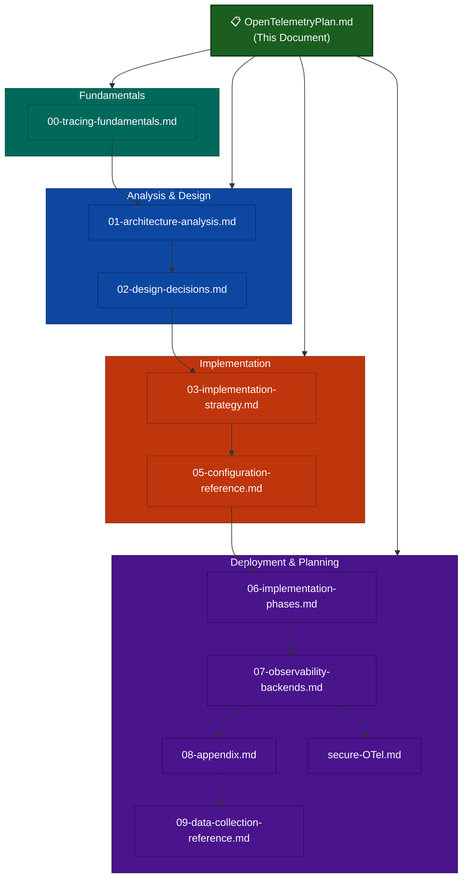

# [OpenTelemetry](00-tracing-fundamentals.md) Distributed Tracing Implementation Plan for xrpld

## Executive Summary

> **OTLP** = OpenTelemetry Protocol

This document provides a comprehensive implementation plan for integrating OpenTelemetry distributed tracing into the xrpld XRP Ledger node software. The plan addresses the unique challenges of a decentralized peer-to-peer system where trace context must propagate across network boundaries between independent nodes.

### Key Benefits

- **End-to-end transaction visibility**: Track transactions from submission through consensus to ledger inclusion
- **Consensus round analysis**: Understand timing and behavior of consensus phases across validators
- **RPC performance insights**: Identify slow handlers and optimize response times
- **Network topology understanding**: Visualize message propagation patterns between peers
- **Incident debugging**: Correlate events across distributed nodes during issues

### Estimated Performance Overhead

| Metric        | Overhead   | Notes                                            |
| ------------- | ---------- | ------------------------------------------------ |
| CPU           | 1-3%       | Span creation and attribute setting              |
| Memory        | <10 MB     | SDK statics + batch buffer + worker thread stack |
| Network       | 10-50 KB/s | Compressed OTLP export to collector              |
| Latency (p99) | <2%        | With proper sampling configuration               |

---

## Document Structure

This implementation plan is organized into modular documents for easier navigation:

---

## Table of Contents

| Section | Document                                                       | Description                                                            |
| ------- | -------------------------------------------------------------- | ---------------------------------------------------------------------- |
| **0**   | [Tracing Fundamentals](./00-tracing-fundamentals.md)           | Distributed tracing concepts, span relationships, context propagation  |
| **1**   | [Architecture Analysis](./01-architecture-analysis.md)         | xrpld component analysis, trace points, instrumentation priorities     |
| **2**   | [Design Decisions](./02-design-decisions.md)                   | SDK selection, exporters, span naming, attributes, context propagation |
| **3**   | [Implementation Strategy](./03-implementation-strategy.md)     | Directory structure, key principles, performance optimization          |
| **5**   | [Configuration Reference](./05-configuration-reference.md)     | xrpld config, CMake integration, Collector configurations              |
| **6**   | [Implementation Phases](./06-implementation-phases.md)         | 11-phase timeline, tasks, risks, success metrics                       |
| **7**   | [Observability Backends](./07-observability-backends.md)       | Backend selection guide and production architecture                    |
| **8**   | [Appendix](./08-appendix.md)                                   | Glossary, references, version history                                  |
| **9**   | [Data Collection Reference](./09-data-collection-reference.md) | Complete inventory of spans, attributes, metrics, and dashboards       |
| **Sec** | [Securing the OTel Pipeline](./secure-OTel.md)                 | Threat model and hardening (mTLS, peer trace-context validation)       |

> Note there is no document 4: `04-code-samples.md` was removed during the
> rollout, and the numbering was left as-is rather than renumbering every
> cross-reference in the chain.

---

## 0. Tracing Fundamentals

This document introduces distributed tracing concepts for readers unfamiliar with the domain. It covers what traces and spans are, how parent-child and follows-from relationships model causality, how context propagates across service boundaries, and how sampling controls data volume. It also maps these concepts to xrpld-specific scenarios like transaction relay and consensus.

➡️ **[Read Tracing Fundamentals](./00-tracing-fundamentals.md)**

---

## 1. Architecture Analysis

> **WS** = WebSocket | **TxQ** = Transaction Queue

The xrpld node consists of several key components that require instrumentation for comprehensive distributed tracing. The main areas include the RPC server (HTTP/WebSocket), Overlay P2P network, Consensus mechanism (RCLConsensus), JobQueue for async task execution, PathFinding, Transaction Queue (TxQ), fee escalation (LoadManager), ledger acquisition, validator management, and existing observability infrastructure (PerfLog, Insight/StatsD, Journal logging).

Key trace points span across transaction submission via RPC, peer-to-peer message propagation, consensus round execution, ledger building, path computation, transaction queue behavior, fee escalation, and validator health. The implementation prioritizes high-value, low-risk components first: RPC handlers provide immediate value with minimal risk, while consensus tracing requires careful implementation to avoid timing impacts.

➡️ **[Read full Architecture Analysis](./01-architecture-analysis.md)**

---

## 2. Design Decisions

> **OTLP** = OpenTelemetry Protocol | **CNCF** = Cloud Native Computing Foundation

The OpenTelemetry C++ SDK is selected for its CNCF backing, active development, and native performance characteristics. Traces are exported via OTLP/HTTP to an OpenTelemetry Collector, which provides flexible routing and sampling. OTLP/gRPC is planned future work (see design decisions §2.2.2).

Span naming follows a hierarchical `<component>.<operation>` convention (e.g., `rpc.command.server_info`, `tx.process`, `consensus.round`). Context propagation uses W3C Trace Context headers for HTTP and embedded Protocol Buffer fields for P2P messages. The implementation coexists with existing PerfLog and Insight observability systems through correlation IDs.

**Data Collection & Privacy**: Telemetry collects only operational metadata (timing, counts, hashes) — never sensitive content (private keys, balances, amounts, raw payloads). Account addresses are hashed **unconditionally** by the SDK helper and hashed again at the collector; there is no redaction config key and therefore no insecure-by-default state. Trace volume is _not_ reduced on the node (head sampling is fixed at 100%); reduction, where wanted, is a collector-side tail-sampling decision. Node operators control which subsystems are traced via the `[telemetry]` per-component toggles.

➡️ **[Read full Design Decisions](./02-design-decisions.md)**

---

## 3. Implementation Strategy

The telemetry code is organized under `include/xrpl/telemetry/` for headers, `src/libxrpl/telemetry/` for implementation, and `src/xrpld/telemetry/` for the native-metrics module added in Phases 7 and 9. Key principles include RAII-based span management via `SpanGuard` (with `discard()` for dropping unwanted spans), a `FilteringSpanProcessor` that intercepts `OnEnd()` to prevent discarded spans from entering the export pipeline, conditional compilation behind the `XRPL_ENABLE_TELEMETRY` compile definition (set by the CMake `telemetry` option, which defaults to **ON** — build it out with `-Dtelemetry=OFF`), and minimal runtime overhead through batch processing.

Performance optimization strategies include head sampling fixed at 100% (intentionally not configurable, so trace keep/drop decisions stay coherent across nodes), optional tail-based sampling at the collector to reduce stored volume (not enabled in the base stack — the only shipped policy is a 0.5% probabilistic one in the Grafana Cloud overlay), batch export to reduce network overhead, and conditional instrumentation that compiles to no-ops when disabled.

➡️ **[Read full Implementation Strategy](./03-implementation-strategy.md)**

---

## 5. Configuration Reference

> **OTLP** = OpenTelemetry Protocol | **APM** = Application Performance Monitoring

Configuration is handled through the `[telemetry]` section in `xrpld.cfg` with options for enabling/disabling, TLS/mTLS, batch tuning, and component-level filtering. Exporter selection is _not_ configurable — OTLP/HTTP is the only transport. Head sampling is fixed at 1.0 (not operator-configurable); volume reduction is done by tail sampling in the collector. CMake integration uses the `telemetry` option (default **ON**) for compile-time control.

Endpoints are spread across **three** keys in two sections, not one "traces and metrics" pair:

| Signal                                               | Key                            | Default                            | Source                      |
| ---------------------------------------------------- | ------------------------------ | ---------------------------------- | --------------------------- |
| Traces                                               | `[telemetry] endpoint`         | `http://localhost:4318/v1/traces`  | `TelemetryConfig.cpp:36,61` |
| Native metrics (`XRPL_METRIC_*` / `MetricsRegistry`) | `[telemetry] metrics_endpoint` | `http://localhost:4318/v1/metrics` | `Application.cpp:1670`      |
| `beast::insight` metrics (`server=otel`)             | `[insight] endpoint`           | `http://localhost:4318/v1/metrics` | `CollectorManager.cpp:50`   |

`[telemetry]` itself has exactly **one** `endpoint` key, and it is traces-only.

The repo ships one collector config (`docker/telemetry/otel-collector-config.yaml`, three pipelines: traces, metrics, logs) plus a Grafana Cloud overlay that adds 0.5% tail sampling. A six-service Docker Compose stack — collector, Tempo, Loki, Prometheus, Grafana, renderer — gives a complete local environment.

➡️ **[View full Configuration Reference](./05-configuration-reference.md)**

---

## 6. Implementation Phases

The plan was originally scoped at **13 weeks across 8 phases** — the table below
is that original scope. As delivered it grew to **11 phases through week 20**;
Phases 9-11 were added after the original plan was written. See
[06-implementation-phases.md §6.12.6](./06-implementation-phases.md) for the
authoritative per-phase status, and treat the eight rows below as the
originally-planned subset rather than the current timeline:

| Phase | Duration    | Focus                 | Key Deliverables                                          |
| ----- | ----------- | --------------------- | --------------------------------------------------------- |
| 1     | Weeks 1-2   | Core Infrastructure   | SDK integration, Telemetry interface, Configuration       |
| 2     | Weeks 3-4   | RPC Tracing           | HTTP context extraction, Handler instrumentation          |
| 3     | Weeks 5-6   | Transaction Tracing   | Protocol Buffer context, Relay propagation                |
| 4     | Weeks 7-8   | Consensus Tracing     | Round spans, Proposal/validation tracing                  |
| 5     | Week 9      | Documentation         | Runbook, Dashboards, Training                             |
| 6     | Week 10     | StatsD Metrics Bridge | OTel Collector StatsD receiver, 3 Grafana dashboards      |
| 7     | Weeks 11-12 | Native OTel Metrics   | OTelCollector impl, OTLP metrics export (StatsD retained) |
| 8     | Week 13     | Log-Trace Correlation | trace_id in logs, Loki ingestion, Tempo↔Loki linking      |

Delivered beyond the original scope: **Phase 9** (weeks 14-15, internal metric
instrumentation gap fill), **Phase 10** (weeks 16-17, synthetic workload
generation and telemetry validation) and **Phase 11** (weeks 18-20, third-party
data-collection pipelines).

**Total Effort**: 65.1 developer-days with 2 developers, for the eight
originally-planned phases only.

➡️ **[View full Implementation Phases](./06-implementation-phases.md)**

---

## 7. Observability Backends

> **APM** = Application Performance Monitoring | **GCS** = Google Cloud Storage

Grafana Tempo is recommended for all environments due to its cost-effectiveness and Grafana integration, and it is the only backend this repo provisions. Elastic APM remains a reasonable choice for organizations with existing Elastic infrastructure, but nothing here configures it.

The recommended production architecture uses a gateway collector pattern with regional collectors performing tail-based sampling, routing traces to multiple backends (Tempo for primary storage, Elastic for log correlation, S3/GCS for long-term archive). Note that several subsections of doc 7 predate the shipped dashboards and alert rules and are marked superseded in place, pointing at [09-data-collection-reference.md](./09-data-collection-reference.md) and `docs/telemetry-runbook.md`.

➡️ **[View Observability Backend Recommendations](./07-observability-backends.md)**

---

## 8. Appendix

The appendix contains a glossary of OpenTelemetry and xrpld-specific terms, references to external documentation and specifications, version history for this implementation plan, and a complete document index.

➡️ **[View Appendix](./08-appendix.md)**

---

## 9. Data Collection Reference

A single-source-of-truth reference documenting every piece of telemetry data collected by xrpld: the OpenTelemetry span inventory with per-span attributes, the `beast::insight` and native `XRPL_METRIC_*` instruments (gauges, counters, histograms, overlay traffic), the SpanMetrics-derived Prometheus metrics, and the **15** Grafana dashboards. Includes Tempo search guides and Prometheus query examples. Consult that document rather than this index for any count — it tracks the code, this summary does not.

➡️ **[View Data Collection Reference](./09-data-collection-reference.md)**

---

## Securing the OTel Pipeline

Threat model and hardening guidance for production deployments where xrpld nodes ship telemetry to a centrally-hosted collector across an untrusted network. Covers the two attack surfaces (collector ingress and peer trace-context spoofing) and the chosen defenses: mTLS as primary collector auth, NetworkPolicy as defense-in-depth, and source-side validation plus per-peer rate limiting for the `protocol::TraceContext` field on peer messages.

➡️ **[View Securing the OTel Pipeline](./secure-OTel.md)**

---

_This document provides a comprehensive implementation plan for integrating OpenTelemetry distributed tracing into the xrpld XRP Ledger node software. For detailed information on any section, follow the links to the corresponding sub-documents._
