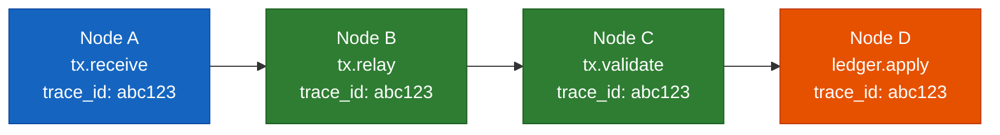
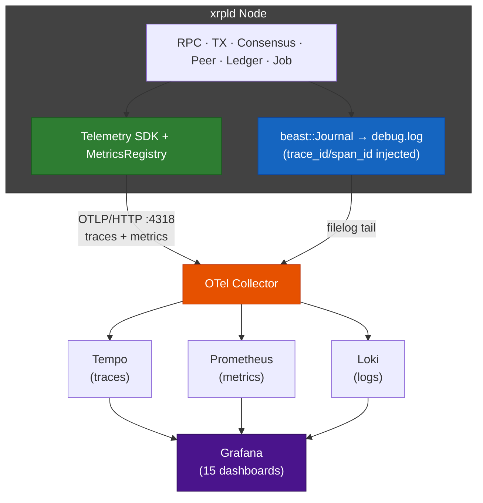
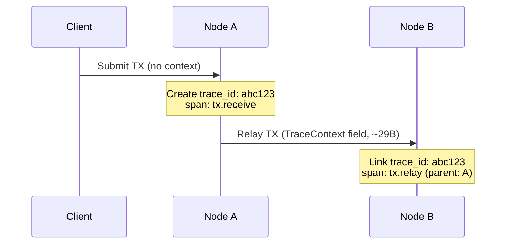
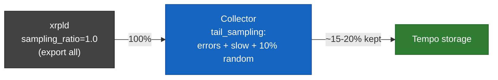
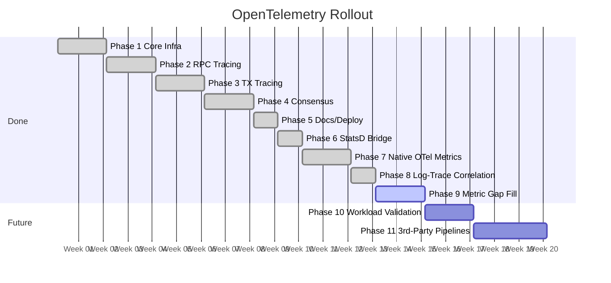
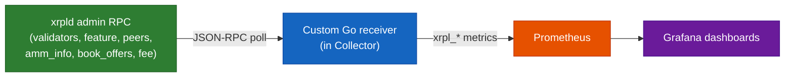

# OpenTelemetry Observability for xrpld

> Status: Phases 1-8 shipped. Traces, metrics, logs all live via OTel.

---

## Slide 1: Introduction

> **CNCF** = Cloud Native Computing Foundation | **OTel** = OpenTelemetry

### What is OpenTelemetry?

CNCF-backed, vendor-neutral framework for **traces, metrics, and logs** with a single SDK and wire protocol (OTLP).

### Why OTel for xrpld?

- **End-to-end TX visibility** — submission → consensus → ledger inclusion
- **Cross-node correlation** — shared `trace_id` stitches hops without a central coordinator
- **Consensus round analysis** — phase timing across validators
- **Incident debugging** — correlated traces, metrics, logs for one query

> One trace, four nodes, full lifecycle.

---

## Slide 2: Old Stack vs New OTel Stack

### Side-by-Side

| Aspect                    | Before (StatsD + Debug Logs)                                                      | After (OTel: Traces + Metrics + Logs)                        |
| ------------------------- | --------------------------------------------------------------------------------- | ------------------------------------------------------------ |
| **Metrics**               | Beast Insight → StatsD UDP → Graphite                                             | `MetricsRegistry` → OTLP/HTTP → Prometheus                   |
| **Metric inventory**      | **~250 metric series** at runtime (28 registrations × overlay traffic categories) | **23 native instruments** × dimensions + RED via spanmetrics |
| **Logs**                  | `beast::Journal` → `debug.log` (grep / tail)                                      | Journal → filelog tail → Loki (structured, queryable)        |
| **Traces**                | None                                                                              | Telemetry SDK → OTLP → Tempo (cross-node)                    |
| **Correlation**           | Timestamp + grep across files                                                     | Shared `trace_id` across all 3 signals                       |
| **Format**                | Counter/gauge names; free-form log lines                                          | OTLP protobuf; structured records                            |
| **Backend choice**        | Locked to StatsD daemon + log files                                               | Vendor-neutral via Collector exporters                       |
| **Cross-node view**       | ❌ Not possible                                                                   | ✅ Native via trace context propagation                      |
| **Histogram p50/p95/p99** | ❌ Counters/gauges only                                                           | ✅ Native histograms + spanmetrics                           |

### Legacy StatsD Metric Series (~250 total)

| Category                    | Series   | Notes                                                                               |
| --------------------------- | -------- | ----------------------------------------------------------------------------------- |
| **Overlay traffic gauges**  | ~224     | 56 `TrafficCount::category` enum × 4 gauges (`Bytes_{In,Out}`, `Messages_{In,Out}`) |
| **Peer Finder**             | 2        | `Active_{In,Out}bound_Peers`                                                        |
| **State Accounting**        | 10       | `{Disconnected,Connected,Syncing,Tracking,Full}_{duration,transitions}`             |
| **Ledger**                  | 4        | `Validated/Published_Ledger_Age`, `mismatch`, `ledger_fetches`                      |
| **RPC / Pathfinding**       | 5        | `requests`, `size`, `time`, `pathfind_{fast,full}`                                  |
| **JobQueue / IO / Disconn** | 3        | `job_count`, `ios_latency`, `Peer_Disconnects`                                      |
| **Total**                   | **~248** | 28 `make_*` call sites; series count balloons via overlay-category fan-out          |

### Use Case Matrix

| Scenario                           | StatsD | Debug Logs | OTel Traces | OTel Metrics | OTel Logs |
| ---------------------------------- | ------ | ---------- | ----------- | ------------ | --------- |
| "TXs per second?"                  | ✅     | ❌         | ❌          | ✅           | ❌        |
| "Why was this specific TX slow?"   | ❌     | ⚠️         | ✅          | ❌           | ⚠️        |
| "Which node delayed consensus?"    | ❌     | ❌         | ✅          | ❌           | ❌        |
| "TX journey across 5 nodes"        | ❌     | ❌         | ✅          | ❌           | ❌        |
| "Validator error at 14:02"         | ❌     | ✅         | ⚠️          | ❌           | ✅        |
| "Reproduce rare assertion / crash" | ❌     | ✅         | ❌          | ❌           | ✅        |
| "p99 RPC latency by method"        | ⚠️     | ❌         | ⚠️          | ✅           | ❌        |

> Old stack: 2 signals, no correlation, single node. New stack: 3 signals, `trace_id` everywhere, cross-node native.

---

## Slide 3: OTel vs Open-Source Alternatives

| Feature             | OpenTelemetry   | Jaeger        | Zipkin          | SkyWalking | Pinpoint   | Prometheus |
| ------------------- | --------------- | ------------- | --------------- | ---------- | ---------- | ---------- |
| **Tracing**         | ✅              | ✅            | ✅              | ✅         | ✅         | ❌         |
| **Metrics**         | ✅              | ❌            | ❌              | ✅         | ✅         | ✅         |
| **Logs**            | ✅              | ❌            | ❌              | ✅         | ❌         | ❌         |
| **C++ SDK**         | ✅ Official     | ⚠️ Deprecated | ⚠️ Unmaintained | ❌         | ❌         | ✅         |
| **Vendor neutral**  | ✅ Primary goal | ❌            | ❌              | ❌         | ❌         | ❌         |
| **Instrumentation** | Manual + Auto   | Manual        | Manual          | Auto-first | Auto-first | Manual     |
| **Backend**         | Any (exporters) | Self          | Self            | Self       | Self       | Self       |
| **CNCF Status**     | Incubating      | Graduated     | —               | Incubating | —          | Graduated  |

> Only actively maintained, full-signal C++ option. Backend-agnostic — Tempo/Prometheus/Loki/Elastic/commercial all work without code change.

---

## Slide 4: Architecture (Current)

> **OTLP** = OpenTelemetry Protocol over HTTP/gRPC

| Component              | Role                                                |
| ---------------------- | --------------------------------------------------- |
| Telemetry SDK          | Span creation, trace context, OTLP traces export    |
| MetricsRegistry        | RPC/job/peer/consensus counters, gauges, histograms |
| beast::Journal filelog | `debug.log` tailed by Collector, parsed → Loki      |
| OTel Collector         | Receive OTLP + filelog; route to Tempo/Prom/Loki    |
| Spanmetrics connector  | Derives RED metrics from spans (Prometheus)         |

---

## Slide 5: Signal Coverage

| Surface            | Traces (Spans)                                                  | Metrics (OTLP)                                 | Logs (Journal Partition)       |
| ------------------ | --------------------------------------------------------------- | ---------------------------------------------- | ------------------------------ |
| **RPC**            | `rpc.request` + handler spans                                   | request count, latency p50/p95/p99, error rate | `RPC*`                         |
| **Transactions**   | `tx.receive`, `tx.validate`, `tx.relay`, `tx.apply`             | TX/sec by result, fee escalation gauges        | `TxQ`, `LedgerMaster`          |
| **Consensus**      | `consensus.round`, `proposal.send/recv`, `validation.send/recv` | round duration, phase histograms, mode gauge   | `Consensus`, `LedgerConsensus` |
| **Peer / Overlay** | `peer.send`, `peer.receive` per message type                    | peer count, bytes/sec by msg type, suppression | `Overlay`, `PeerImp`           |
| **Ledger**         | `ledger.close`, `ledger.apply`                                  | close time, TX count, ledger index gauge       | `LedgerMaster`                 |
| **Job Queue**      | (sampled per type)                                              | queue depth, queue/run duration histograms     | `JobQueue`                     |

> ~30 distinct span kinds, ~80 metric series, structured logs from 50+ partitions.

---

## Slide 6: Context Propagation

| Carrier               | Mechanism                                  |
| --------------------- | ------------------------------------------ |
| HTTP / WebSocket RPC  | W3C `traceparent` header                   |
| P2P protobuf          | `TraceContext` extension field per message |
| Internal job dispatch | Thread-local context + `SpanGuard`         |

| Field         | Size      | Description                           |
| ------------- | --------- | ------------------------------------- |
| `trace_id`    | 16 bytes  | Trace correlation key                 |
| `span_id`     | 8 bytes   | Parent span on receiver               |
| `trace_flags` | 1 byte    | Sampling decision                     |
| `trace_state` | 0-4 bytes | Optional vendor data                  |
| **Total**     | **~29 B** | Per traced P2P message (~1-6% of msg) |

---

## Slide 7: Performance Overhead

| Metric            | Overhead   | Driver                                              |
| ----------------- | ---------- | --------------------------------------------------- |
| **CPU**           | 1-3%       | ~4 μs/TX span work (~2% at 25 TPS baseline)         |
| **Memory**        | ~10 MB     | SDK statics + worker stack + 2048-span export queue |
| **Network**       | 10-50 KB/s | OTLP export + 29 B P2P context per traced msg       |
| **Latency (p99)** | <2%        | TX path dominates; RPC and consensus negligible     |

### Kill Switches

1. `enabled=0` in `xrpld.cfg` → instant disable, no restart
2. Build with `XRPL_ENABLE_TELEMETRY=OFF` → zero overhead (no-op stubs)
3. Reduce `sampling_ratio` → linear export reduction

> Derivations and per-component cost tables: see [03-implementation-strategy.md §3.5.4](./03-implementation-strategy.md#354-performance-data-sources).

---

## Slide 8: Sampling — Head vs Tail

|                          | Head Sampling                     | Tail Sampling                          |
| ------------------------ | --------------------------------- | -------------------------------------- |
| **Where**                | Inside xrpld (SDK)                | OTel Collector (external)              |
| **Decision time**        | Trace start (random coin flip)    | Trace end (after all spans buffered)   |
| **Knows trace content?** | No                                | Yes — error, latency, span kind        |
| **xrpld overhead**       | Lowest (drop = no-op)             | Higher (export 100%)                   |
| **Captures all errors?** | No                                | **Yes** (status_code policy)           |
| **Captures slow ops?**   | No                                | **Yes** (latency policy)               |
| **Config**               | `xrpld.cfg`: `sampling_ratio=0.1` | `tail_sampling` processor in collector |
| **Best for**             | Steady-state high volume          | Anomaly + error retention              |

### Recommended Layered Strategy

> If Collector resource pressure: drop `sampling_ratio` to 0.5 — still enough trace volume for tail decisions.

---

## Slide 9: Data Collection & Privacy

### Collected (operational metadata)

| Category    | Attributes                                                           |
| ----------- | -------------------------------------------------------------------- |
| Transaction | `tx.hash`, `tx.type`, `tx.result`, `tx.fee`, `ledger_index`          |
| Consensus   | `round`, `phase`, `mode`, `proposers`, `duration_ms`                 |
| RPC         | `command`, `version`, `status`, `duration_ms`                        |
| Peer        | `peer.id` (public key), `latency_ms`, `message.type`, `message.size` |
| Ledger      | `ledger.hash`, `ledger.index`, `close_time`, `tx_count`              |
| Job         | `job.type`, `queue_ms`, `worker`                                     |

### NOT Collected (hard exclusions)

> ❌ Private keys · ❌ Account balances · ❌ Transaction amounts · ❌ Raw payloads · ❌ Personal data · ⚙️ IP addresses (configurable)

### Privacy Mechanisms

| Mechanism              | Description                                               |
| ---------------------- | --------------------------------------------------------- |
| Account hashing        | `xrpl.tx.account` hashed at Collector before storage      |
| Configurable redaction | Sensitive attributes excluded via Collector config        |
| Sampling               | 10% default reduces exposure                              |
| Local control          | Operator owns Collector → backend pipeline                |
| No raw payloads        | Span attributes are metadata only, never message contents |

> Principle: telemetry records **operational metadata** — never financial or personal content.

---

## Slide 10: Implementation Timeline

| Phase | Focus                                       | Status  |
| ----- | ------------------------------------------- | ------- |
| 1     | SDK integration, Telemetry, Config          | ✅ Done |
| 2     | RPC handler spans, HTTP context             | ✅ Done |
| 3     | TX spans, P2P protobuf context              | ✅ Done |
| 4     | Consensus rounds, proposal/validation       | ✅ Done |
| 5     | Runbook, dashboards, deployment             | ✅ Done |
| 6     | StatsD bridge (interim)                     | ✅ Done |
| 7     | Native OTel metrics (replace Beast Insight) | ✅ Done |
| 8     | Log-trace correlation (Loki)                | ✅ Done |
| 9     | Internal metric gap fill                    | ✅ Done |

---

## Slide 11: Current State — What Shipped

### By Signal

| Signal      | Backend    | Status | Notes                                                    |
| ----------- | ---------- | ------ | -------------------------------------------------------- |
| **Traces**  | Tempo      | ✅     | All 6 surfaces instrumented; cross-node propagation live |
| **Metrics** | Prometheus | ✅     | Native OTLP; Beast Insight retired                       |
| **Logs**    | Loki       | ✅     | filelog tailing `debug.log`; `trace_id` injected         |

### By Surface

| Surface        | Spans Live | Metrics Live | Notes                                               |
| -------------- | ---------- | ------------ | --------------------------------------------------- |
| RPC            | ✅         | ✅           | Handler + pathfinding + TxQ                         |
| Transactions   | ✅         | ✅           | Receive, validate, relay, apply                     |
| Consensus      | ✅         | ✅           | Round + proposal/validation send+receive (Phase 4a) |
| Peer / Overlay | ✅         | ✅           | Per-msg-type send/receive                           |
| Ledger         | ✅         | ✅           | Close + apply                                       |
| Job Queue      | ✅         | ✅           | Queue depth + duration histograms                   |

### Stack Live

| Component                  | Version |
| -------------------------- | ------- |
| OTel Collector (contrib)   | 0.121.0 |
| Grafana Tempo              | 2.7.2   |
| Grafana Loki               | 3.4.2   |
| Prometheus                 | latest  |
| Grafana                    | 11.5.2  |
| **Dashboards provisioned** | **15**  |

---

## Slide 12: Future Phases

### Phase 10 — Synthetic Workload Validation

| Aspect      | Detail                                                             |
| ----------- | ------------------------------------------------------------------ |
| Goal        | Drive instrumented surfaces under reproducible load                |
| Why         | Validate dashboards, catch regressions, measure overhead at scale  |
| Deliverable | Workload generator + assertion suite (RPC/TX/peer churn scenarios) |
| Effort      | ~2 weeks                                                           |

### Phase 11 — Admin-RPC Receiver (`xrpl_*` metrics)

| Aspect      | Detail                                                                                                                                        |
| ----------- | --------------------------------------------------------------------------------------------------------------------------------------------- |
| Goal        | Custom Go OTel Collector receiver polls xrpld admin RPC, emits `xrpl_*` Prometheus metrics                                                    |
| Why         | Admin-RPC-only data has no native export — every consumer reinvents JSON-RPC polling                                                          |
| Scope       | `validators` (UNL, listed keys), `feature` (amendments), `peers` (per-peer detail), `amm_info`, `book_offers`, `fee` (detail tiers)           |
| Excluded    | `server_info` / `get_counts` basics — Phase 9 (#6513) already ships `xrpld_server_info` + 14 gauges/histograms natively from in-process state |
| Deliverable | Go receiver plugin + custom Collector binary + 4 Grafana dashboards (UNL, amendments, AMM, DEX) + Prometheus alerts                           |
| Effort      | ~3 weeks                                                                                                                                      |

> Phase 11 fills the gap above Phase 9 — data only reachable via admin RPC, not via in-process metric callbacks.

---

_End of Presentation_
