# OpenTelemetry Distributed Tracing for xrpld

---

## Slide 1: Introduction

> **CNCF** = Cloud Native Computing Foundation

### What is OpenTelemetry?

OpenTelemetry is an open-source, CNCF-backed observability framework for distributed tracing, metrics, and logs.

### Why OpenTelemetry for xrpld?

- **End-to-End Transaction Visibility**: Track transactions from submission → consensus → ledger inclusion
- **Cross-Node Correlation**: Follow requests across multiple independent nodes using a unique `trace_id`
- **Consensus Round Analysis**: Understand timing and behavior across validators
- **Incident Debugging**: Correlate events across distributed nodes during issues

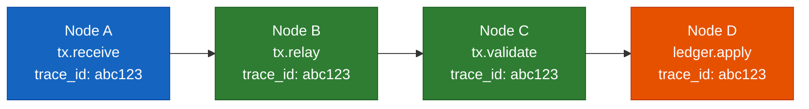

**Reading the diagram:**

- **Node A (blue, leftmost)**: The originating node that first receives the transaction and assigns a new `trace_id: abc123`; this ID becomes the correlation key for the entire distributed trace.
- **Node B and Node C (green, middle)**: Relay and validation nodes — each creates its own span but carries the same `trace_id`, so their work is linked to the original submission without any central coordinator.
- **Node D (orange, rightmost)**: The final node that applies the transaction to the ledger; the trace now spans the full lifecycle from submission to ledger inclusion.
- **Left-to-right flow**: The horizontal progression shows the real-world message path — a transaction hops from node to node, and the shared `trace_id` stitches all hops into a single queryable trace.

> **Trace ID: abc123** — All nodes share the same trace, enabling cross-node correlation.

---

## Slide 2: OpenTelemetry vs Open Source Alternatives

> **CNCF** = Cloud Native Computing Foundation

| Feature             | OpenTelemetry    | Jaeger           | Zipkin             | SkyWalking | Pinpoint   | Prometheus |
| ------------------- | ---------------- | ---------------- | ------------------ | ---------- | ---------- | ---------- |
| **Tracing**         | YES              | YES              | YES                | YES        | YES        | NO         |
| **Metrics**         | YES              | NO               | NO                 | YES        | YES        | YES        |
| **Logs**            | YES              | NO               | NO                 | YES        | NO         | NO         |
| **C++ SDK**         | YES Official     | YES (Deprecated) | YES (Unmaintained) | NO         | NO         | YES        |
| **Vendor Neutral**  | YES Primary goal | NO               | NO                 | NO         | NO         | NO         |
| **Instrumentation** | Manual + Auto    | Manual           | Manual             | Auto-first | Auto-first | Manual     |
| **Backend**         | Any (exporters)  | Self             | Self               | Self       | Self       | Self       |
| **CNCF Status**     | Incubating       | Graduated        | NO                 | Incubating | NO         | Graduated  |

> **Why OpenTelemetry?** It's the only actively maintained, full-featured C++ option with vendor neutrality — allowing export to Tempo, Prometheus, Grafana, or any commercial backend without changing instrumentation.

---

## Slide 3: Adoption Scope — Traces Only (Current Plan)

OpenTelemetry supports three signal types: **Traces**, **Metrics**, and **Logs**. xrpld already captures metrics (StatsD via Beast Insight) and logs (Journal/PerfLog). The question is: how much of OTel do we adopt?

> **Scenario A**: Add distributed tracing. Keep StatsD for metrics and Journal for logs.

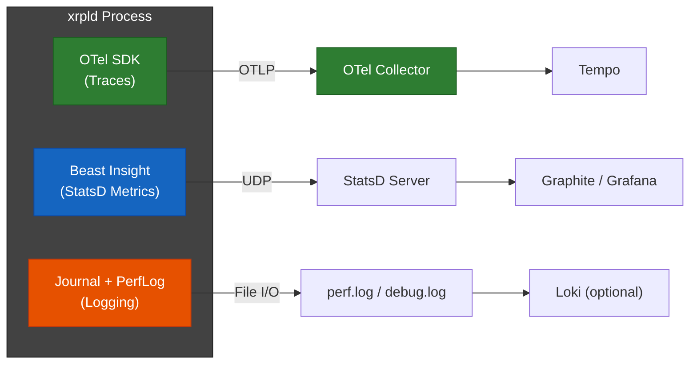

| Aspect                         | Details                                                                                                         |
| ------------------------------ | --------------------------------------------------------------------------------------------------------------- |
| **What changes for operators** | Deploy OTel Collector + trace backend. Existing StatsD and log pipelines stay as-is.                            |
| **Codebase impact**            | New `Telemetry` module (~1500 LOC). Beast Insight and Journal untouched.                                        |
| **New capabilities**           | Cross-node trace correlation, span-based debugging, request lifecycle visibility.                               |
| **What we still can't do**     | Correlate metrics with specific traces natively. StatsD metrics remain fire-and-forget with no trace exemplars. |
| **Maintenance burden**         | Three separate observability systems to maintain (OTel + StatsD + Journal).                                     |
| **Risk**                       | Lowest — additive change, no existing systems disturbed.                                                        |

---

## Slide 4: Future Adoption — Metrics & Logs via OTel

### Scenario B: + OTel Metrics (Replace StatsD)

> Migrate StatsD to OTel Metrics API, exposing Prometheus-compatible metrics. Remove Beast Insight.

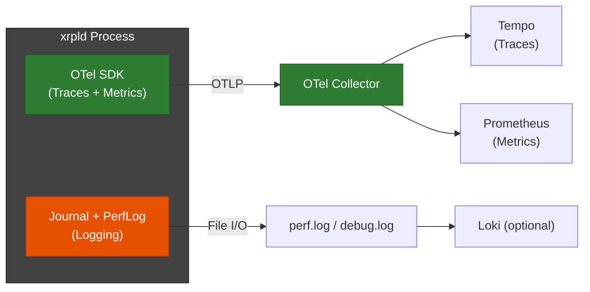

- **Better metrics?** Yes — Prometheus gives native histograms (p50/p95/p99), multi-dimensional labels, and exemplars linking metric spikes to traces.
- **Codebase**: Remove `Beast::Insight` + `StatsDCollector` (~2000 LOC). Single SDK for traces and metrics.
- **Operator effort**: Rewrite dashboards from StatsD/Graphite queries to PromQL. Run both in parallel during transition.
- **Risk**: Medium — operators must migrate monitoring infrastructure.

### Scenario C: + OTel Logs (Full Stack)

> Also replace Journal logging with OTel Logs API. Single SDK for everything.

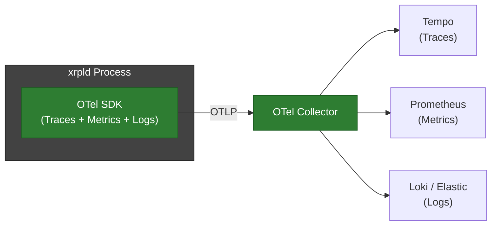

- **Structured logging**: OTel Logs API outputs structured records with `trace_id`, `span_id`, severity, and attributes by design.
- **Full correlation**: Every log line carries `trace_id`. Click trace → see logs. Click metric spike → see trace → see logs.
- **Codebase**: Remove Beast Insight (~2000 LOC) + simplify Journal/PerfLog (~3000 LOC). One dependency instead of three.
- **Risk**: Highest — `beast::Journal` is deeply embedded in every component. Large refactor. OTel C++ Logs API is newer (stable since v1.11, less battle-tested).

### Recommendation

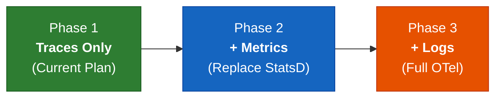

| Phase                | Signal    | Strategy                                                       | Risk   |
| -------------------- | --------- | -------------------------------------------------------------- | ------ |
| **Phase 1** (now)    | Traces    | Add OTel traces. Keep StatsD and Journal. Prove value.         | Low    |
| **Phase 2** (future) | + Metrics | Migrate StatsD → Prometheus via OTel. Remove Beast Insight.    | Medium |
| **Phase 3** (future) | + Logs    | Adopt OTel Logs API. Align with structured logging initiative. | High   |

> **Key Takeaway**: Start with traces (unique value, lowest risk), then incrementally adopt metrics and logs as the OTel infrastructure proves itself.

---

## Slide 5: Comparison with xrpld's Existing Solutions

### Current Observability Stack

| Aspect                | PerfLog (JSON)        | StatsD (Metrics)      | OpenTelemetry (NEW)         |
| --------------------- | --------------------- | --------------------- | --------------------------- |
| **Type**              | Logging               | Metrics               | Distributed Tracing         |
| **Scope**             | Single node           | Single node           | **Cross-node**              |
| **Data**              | JSON log entries      | Counters, gauges      | Spans with context          |
| **Correlation**       | By timestamp          | By metric name        | By `trace_id`               |
| **Overhead**          | Low (file I/O)        | Low (UDP)             | Low-Medium (configurable)   |
| **Question Answered** | "What happened here?" | "How many? How fast?" | **"What was the journey?"** |

### Use Case Matrix

| Scenario                         | PerfLog | StatsD | OpenTelemetry |
| -------------------------------- | ------- | ------ | ------------- |
| "How many TXs per second?"       | ❌      | ✅     | ❌            |
| "Why was this specific TX slow?" | ⚠️      | ❌     | ✅            |
| "Which node delayed consensus?"  | ❌      | ❌     | ✅            |
| "Show TX journey across 5 nodes" | ❌      | ❌     | ✅            |

> **Key Insight**: In the **traces-only** approach (Phase 1), OpenTelemetry **complements** existing systems. In future phases, OTel metrics and logs could **replace** StatsD and Journal respectively — see Slides 3-4 for the full adoption roadmap.

---

## Slide 6: Architecture

> **OTLP** = OpenTelemetry Protocol | **WS** = WebSocket

### High-Level Integration Architecture

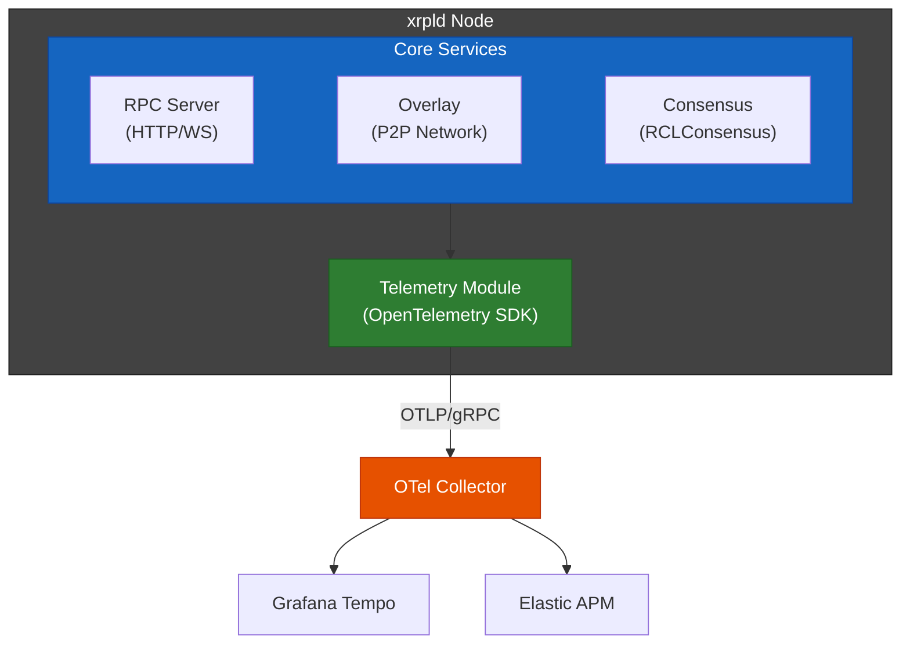

**Reading the diagram:**

- **Core Services (blue, top)**: RPC Server, Overlay, and Consensus are the three primary components that generate trace data — they represent the entry points for client requests, peer messages, and consensus rounds respectively.
- **Telemetry Module (green, middle)**: The OpenTelemetry SDK sits below the core services and receives span data from all three; it acts as a single collection point within the xrpld process.
- **OTel Collector (orange, center)**: An external process that receives spans over OTLP/gRPC from the Telemetry Module; it decouples xrpld from backend choices and handles batching, sampling, and routing.
- **Backends (bottom row)**: Tempo and Elastic APM are interchangeable — the Collector fans out to any combination, so operators can switch backends without modifying xrpld code.
- **Top-to-bottom flow**: Data flows from instrumented code down through the SDK, out over the network to the Collector, and finally into storage/visualization backends.

### Context Propagation

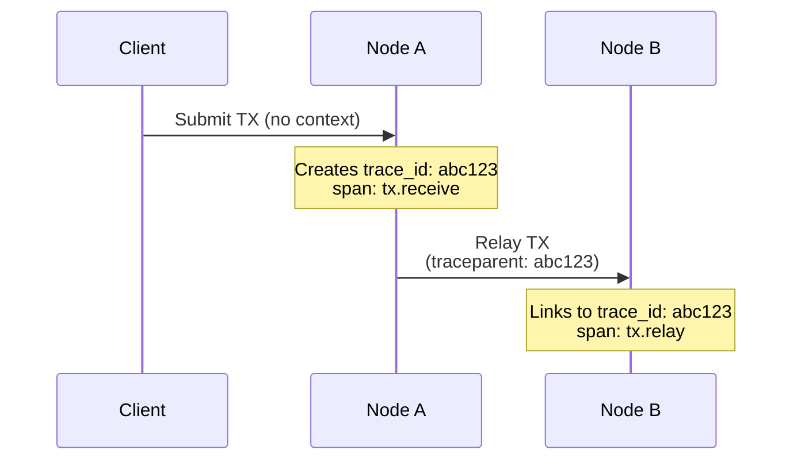

- **HTTP/RPC**: W3C Trace Context headers (`traceparent`)
- **P2P Messages**: Protocol Buffer extension fields

---

## Slide 7: Implementation Plan

### 5-Phase Rollout (9 Weeks)

> **Note**: Dates shown are relative to project start, not calendar dates.

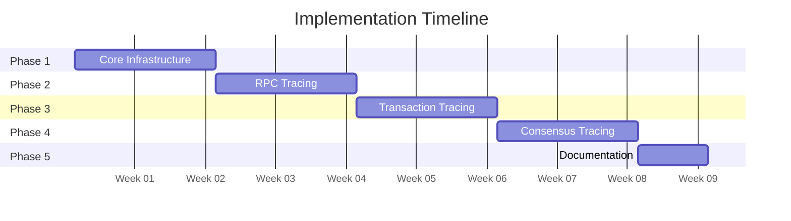

### Phase Details

| Phase | Focus               | Key Deliverables                             | Effort  |
| ----- | ------------------- | -------------------------------------------- | ------- |
| 1     | Core Infrastructure | SDK integration, Telemetry interface, Config | 10 days |
| 2     | RPC Tracing         | HTTP context extraction, Handler spans       | 10 days |
| 3     | Transaction Tracing | Protobuf context, P2P relay propagation      | 10 days |
| 4     | Consensus Tracing   | Round spans, Proposal/validation tracing     | 10 days |
| 5     | Documentation       | Runbook, Dashboards, Training                | 7 days  |

**Total Effort**: ~47 developer-days (2 developers)

> **Future Phases** (not in current scope): After traces are stable, OTel metrics can replace StatsD (~3 weeks), and OTel logs can replace Journal (~4 weeks, aligned with structured logging initiative). See Slides 3-4 for the full adoption roadmap.

---

## Slide 8: Performance Overhead

> **OTLP** = OpenTelemetry Protocol

### Estimated System Impact

| Metric            | Overhead   | Notes                                            |
| ----------------- | ---------- | ------------------------------------------------ |
| **CPU**           | 1-3%       | Span creation and attribute setting              |
| **Memory**        | ~10 MB     | SDK statics + batch buffer + worker thread stack |
| **Network**       | 10-50 KB/s | Compressed OTLP export to collector              |
| **Latency (p99)** | <2%        | With proper sampling configuration               |

#### How We Arrived at These Numbers

**Assumptions (XRPL mainnet baseline)**:

| Parameter                 | Value                  | Source                                                                                              |
| ------------------------- | ---------------------- | --------------------------------------------------------------------------------------------------- |
| Transaction throughput    | ~25 TPS (peaks to ~50) | Mainnet average                                                                                     |
| Default peers per node    | 21                     | `peerfinder/detail/Tuning.h` (`defaultMaxPeers`)                                                    |
| Consensus round frequency | ~1 round / 3-4 seconds | `ConsensusParms.h` (`ledgerMIN_CONSENSUS=1950ms`)                                                   |
| Proposers per round       | ~20-35                 | Mainnet UNL size                                                                                    |
| P2P message rate          | ~160 msgs/sec          | See message breakdown below                                                                         |
| Avg TX processing time    | ~200 μs                | Profiled baseline                                                                                   |
| Single span creation cost | 500-1000 ns            | OTel C++ SDK benchmarks (see [3.5.4](./03-implementation-strategy.md#354-performance-data-sources)) |

**P2P message breakdown** (per node, mainnet):

| Message Type  | Rate         | Derivation                                                            |
| ------------- | ------------ | --------------------------------------------------------------------- |
| TMTransaction | ~100/sec     | ~25 TPS × ~4 relay hops per TX, deduplicated by HashRouter            |
| TMValidation  | ~50/sec      | ~35 validators × ~1 validation/3s round ≈ ~12/sec, plus relay fan-out |
| TMProposeSet  | ~10/sec      | ~35 proposers / 3s round ≈ ~12/round, clustered in establish phase    |
| **Total**     | **~160/sec** | **Only traced message types counted**                                 |

**CPU (1-3%) — Calculation**:

Per-transaction tracing cost breakdown:

| Operation                                       | Cost        | Notes                                      |
| ----------------------------------------------- | ----------- | ------------------------------------------ |
| `tx.receive` span (create + end + 4 attributes) | ~1400 ns    | ~1000ns create + ~200ns end + 4×50ns attrs |
| `tx.validate` span                              | ~1200 ns    | ~1000ns create + ~200ns for 2 attributes   |
| `tx.relay` span                                 | ~1200 ns    | ~1000ns create + ~200ns for 2 attributes   |
| Context injection into P2P message              | ~200 ns     | Serialize trace_id + span_id into protobuf |
| **Total per TX**                                | **~4.0 μs** |                                            |

> **CPU overhead**: 4.0 μs / 200 μs baseline = **~2.0% per transaction**. Under high load with consensus + RPC spans overlapping, reaches ~3%. Consensus itself adds only ~36 μs per 3-second round (~0.001%), so the TX path dominates. On production server hardware (3+ GHz Xeon), span creation drops to ~500-600 ns, bringing per-TX cost to ~2.6 μs (~1.3%). See [Section 3.5.4](./03-implementation-strategy.md#354-performance-data-sources) for benchmark sources.

**Memory (~10 MB) — Calculation**:

| Component                                     | Size               | Notes                                 |
| --------------------------------------------- | ------------------ | ------------------------------------- |
| TracerProvider + Exporter (gRPC channel init) | ~320 KB            | Allocated once at startup             |
| BatchSpanProcessor (circular buffer)          | ~16 KB             | 2049 × 8-byte AtomicUniquePtr entries |
| BatchSpanProcessor (worker thread stack)      | ~8 MB              | Default Linux thread stack size       |
| Active spans (in-flight, max ~1000)           | ~500-800 KB        | ~500-800 bytes/span × 1000 concurrent |
| Export queue (batch buffer, max 2048 spans)   | ~1 MB              | ~500 bytes/span × 2048 queue depth    |
| Thread-local context storage (~100 threads)   | ~6.4 KB            | ~64 bytes/thread                      |
| **Total**                                     | **~10 MB ceiling** |                                       |

> Memory plateaus once the export queue fills — the `max_queue_size=2048` config bounds growth.
> The worker thread stack (~8 MB) dominates the static footprint but is virtual memory; actual RSS
> depends on stack usage (typically much less). Active spans are larger than originally estimated
> (~500-800 bytes) because the OTel SDK `Span` object includes a mutex (~40 bytes), `SpanData`
> recordable (~250 bytes base), and `std::map`-based attribute storage (~200-500 bytes for 3-5
> string attributes). See [Section 3.5.4](./03-implementation-strategy.md#354-performance-data-sources) for source references.

**Network (10-50 KB/s) — Calculation**:

Two sources of network overhead:

**(A) OTLP span export to Collector:**

| Sampling Rate              | Effective Spans/sec | Avg Span Size (compressed) | Bandwidth    |
| -------------------------- | ------------------- | -------------------------- | ------------ |
| 100% (dev only)            | ~500                | ~500 bytes                 | ~250 KB/s    |
| **10% (recommended prod)** | **~50**             | **~500 bytes**             | **~25 KB/s** |
| 1% (minimal)               | ~5                  | ~500 bytes                 | ~2.5 KB/s    |

> The ~500 spans/sec at 100% comes from: ~100 TX spans + ~160 P2P context spans + ~23 consensus spans/round + ~50 RPC spans = ~500/sec. OTLP protobuf with gzip compression yields ~500 bytes/span average.

**(B) P2P trace context overhead** (added to existing messages, always-on regardless of sampling):

| Message Type  | Rate     | Context Size | Bandwidth     |
| ------------- | -------- | ------------ | ------------- |
| TMTransaction | ~100/sec | 29 bytes     | ~2.9 KB/s     |
| TMValidation  | ~50/sec  | 29 bytes     | ~1.5 KB/s     |
| TMProposeSet  | ~10/sec  | 29 bytes     | ~0.3 KB/s     |
| **Total P2P** |          |              | **~4.7 KB/s** |

> **Combined**: 25 KB/s (OTLP export at 10%) + 5 KB/s (P2P context) ≈ **~30 KB/s typical**. The 10-50 KB/s range covers 10-20% sampling under normal to peak mainnet load.

**Latency (<2%) — Calculation**:

| Path                           | Tracing Cost | Baseline | Overhead |
| ------------------------------ | ------------ | -------- | -------- |
| Fast RPC (e.g., `server_info`) | 2.75 μs      | ~1 ms    | 0.275%   |
| Slow RPC (e.g., `path_find`)   | 2.75 μs      | ~100 ms  | 0.003%   |
| Transaction processing         | 4.0 μs       | ~200 μs  | 2.0%     |
| Consensus round                | 36 μs        | ~3 sec   | 0.001%   |

> At p99, even the worst case (TX processing at 2.0%) is within the 1-3% range. RPC and consensus overhead are negligible. On production hardware, TX overhead drops to ~1.3%.

### Per-Message Overhead (Context Propagation)

Each P2P message carries trace context with the following overhead:

| Field         | Size          | Description                               |
| ------------- | ------------- | ----------------------------------------- |
| `trace_id`    | 16 bytes      | Unique identifier for the entire trace    |
| `span_id`     | 8 bytes       | Current span (becomes parent on receiver) |
| `trace_flags` | 1 byte        | Sampling decision flags                   |
| `trace_state` | 0-4 bytes     | Optional vendor-specific data             |
| **Total**     | **~29 bytes** | **Added per traced P2P message**          |

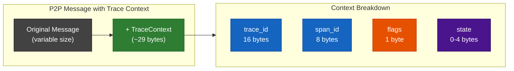

**Reading the diagram:**

- **Original Message (gray, left)**: The existing P2P message payload of variable size — this is unchanged; trace context is appended, never modifying the original data.
- **+ TraceContext (green, right of message)**: The additional 29-byte context block attached to each traced message; the arrow from the original message shows it is a pure addition.
- **Context Breakdown (right subgraph)**: The four fields — `trace_id` (16 bytes), `span_id` (8 bytes), `flags` (1 byte), and `state` (0-4 bytes) — show exactly what is added and their individual sizes.
- **Color coding**: Blue fields (`trace_id`, `span_id`) are the core identifiers required for trace correlation; orange (`flags`) controls sampling decisions; purple (`state`) is optional vendor data typically omitted.

> **Note**: 29 bytes represents ~1-6% overhead depending on message size (500B simple TX to 5KB proposal), which is acceptable for the observability benefits provided.

### Mitigation Strategies


> For a detailed explanation of head vs. tail sampling, see Slide 9.

### Kill Switches (Rollback Options)

1. **Config Disable**: Set `enabled=0` in config → instant disable, no restart needed for sampling
2. **Rebuild**: Compile with `XRPL_ENABLE_TELEMETRY=OFF` → zero overhead (no-op)
3. **Full Revert**: Clean separation allows easy commit reversion

---

## Slide 9: Sampling Strategies — Head vs. Tail

> Sampling controls **which traces are recorded and exported**. Without sampling, every operation generates a trace — at 500+ spans/sec, this overwhelms storage and network. Sampling lets you keep the signal, discard the noise.

### Head Sampling (Decision at Start)

The sampling decision is made **when a trace begins**, before any work is done. A random number is generated; if it falls within the configured ratio, the entire trace is recorded. Otherwise, the trace is silently dropped.

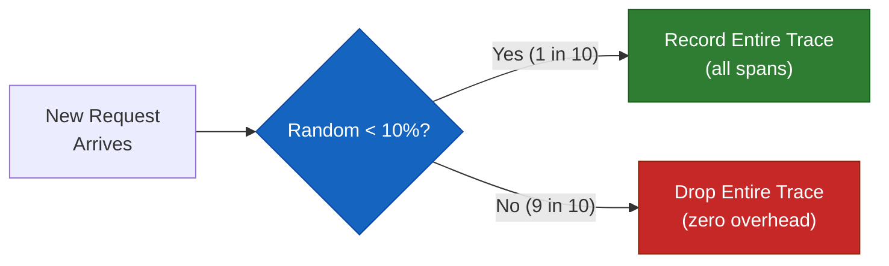

| Aspect                        | Details                                                                                                                                                                                                  |
| ----------------------------- | -------------------------------------------------------------------------------------------------------------------------------------------------------------------------------------------------------- |
| **Where it runs**             | Inside xrpld (SDK-level). Configured via `sampling_ratio` in `xrpld.cfg`.                                                                                                                                |
| **When the decision happens** | At trace creation time — before the first span is even populated.                                                                                                                                        |
| **How it works**              | `sampling_ratio=0.1` means each trace has a 10% probability of being recorded. Dropped traces incur near-zero overhead (no spans created, no attributes set, no export).                                 |
| **Propagation**               | Once a trace is sampled, the `trace_flags` field (1 byte in the context header) tells downstream nodes to also sample it. Unsampled traces propagate `trace_flags=0`, so downstream nodes skip them too. |
| **Pros**                      | Lowest overhead. Simple to configure. Predictable resource usage.                                                                                                                                        |
| **Cons**                      | **Blind** — it doesn't know if the trace will be interesting. A rare error or slow consensus round has only a 10% chance of being captured.                                                              |
| **Best for**                  | High-volume, steady-state traffic where most traces look similar (e.g., routine RPC requests).                                                                                                           |

**xrpld configuration**:

```ini
[telemetry]
# Record 10% of traces (recommended for production)
sampling_ratio=0.1
```

### Tail Sampling (Decision at End)

The sampling decision is made **after the trace completes**, based on its actual content — was it slow? Did it error? Was it a consensus round? This requires buffering complete traces before deciding.

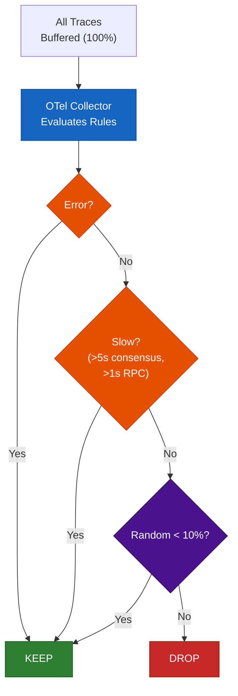

| Aspect                        | Details                                                                                                                                                                                                 |
| ----------------------------- | ------------------------------------------------------------------------------------------------------------------------------------------------------------------------------------------------------- |
| **Where it runs**             | In the **OTel Collector** (external process), not inside xrpld. xrpld exports 100% of traces; the Collector decides what to keep.                                                                       |
| **When the decision happens** | After the Collector has received all spans for a trace (waits `decision_wait=10s` for stragglers).                                                                                                      |
| **How it works**              | Policy rules evaluate the completed trace: keep all errors, keep slow operations above a threshold, keep all consensus rounds, then probabilistically sample the rest at 10%.                           |
| **Pros**                      | **Never misses important traces**. Errors, slow requests, and consensus anomalies are always captured regardless of probability.                                                                        |
| **Cons**                      | Higher resource usage — xrpld must export 100% of spans to the Collector, which buffers them in memory before deciding. The Collector needs more RAM (configured via `num_traces` and `decision_wait`). |
| **Best for**                  | Production troubleshooting where you can't afford to miss errors or anomalies.                                                                                                                          |

**Collector configuration** (tail sampling rules for xrpld):

```yaml
processors:
  tail_sampling:
    decision_wait: 10s # Wait for all spans in a trace
    num_traces: 100000 # Buffer up to 100K concurrent traces
    policies:
      - name: errors # Always keep error traces
        type: status_code
        status_code: { status_codes: [ERROR] }

      - name: slow-consensus # Keep consensus rounds >5s
        type: latency
        latency: { threshold_ms: 5000 }

      - name: slow-rpc # Keep slow RPC requests >1s
        type: latency
        latency: { threshold_ms: 1000 }

      - name: probabilistic # Sample 10% of everything else
        type: probabilistic
        probabilistic: { sampling_percentage: 10 }
```

### Head vs. Tail — Side-by-Side

|                               | Head Sampling                            | Tail Sampling                                    |
| ----------------------------- | ---------------------------------------- | ------------------------------------------------ |
| **Decision point**            | Trace start (inside xrpld)               | Trace end (in OTel Collector)                    |
| **Knows trace content?**      | No (random coin flip)                    | Yes (evaluates completed trace)                  |
| **Overhead on xrpld**         | Lowest (dropped traces = no-op)          | Higher (must export 100% to Collector)           |
| **Collector resource usage**  | Low (receives only sampled traces)       | Higher (buffers all traces before deciding)      |
| **Captures all errors?**      | No (only if trace was randomly selected) | **Yes** (error policy catches them)              |
| **Captures slow operations?** | No (random)                              | **Yes** (latency policy catches them)            |
| **Configuration**             | `xrpld.cfg`: `sampling_ratio=0.1`        | `otel-collector.yaml`: `tail_sampling` processor |
| **Best for**                  | High-throughput steady-state             | Troubleshooting & anomaly detection              |

### Recommended Strategy for xrpld

Use **both** in a layered approach:

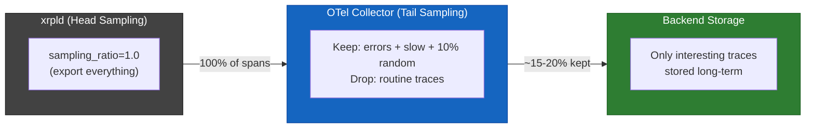

> **Why this works**: xrpld exports everything (no blind drops), the Collector applies intelligent filtering (keep errors/slow/anomalies, sample the rest), and only ~15-20% of traces reach storage. If Collector resource usage becomes a concern, add head sampling at `sampling_ratio=0.5` to halve the export volume while still giving the Collector enough data for good tail-sampling decisions.

---

## Slide 10: Data Collection & Privacy

### What Data is Collected

| Category        | Attributes Collected                                                                 | Purpose                     |
| --------------- | ------------------------------------------------------------------------------------ | --------------------------- |
| **Transaction** | `tx.hash`, `tx.type`, `tx.result`, `tx.fee`, `ledger_index`                          | Trace transaction lifecycle |
| **Consensus**   | `round`, `phase`, `mode`, `proposers` (count of proposing validators), `duration_ms` | Analyze consensus timing    |
| **RPC**         | `command`, `version`, `status`, `duration_ms`                                        | Monitor RPC performance     |
| **Peer**        | `peer.id`(public key), `latency_ms`, `message.type`, `message.size`                  | Network topology analysis   |
| **Ledger**      | `ledger.hash`, `ledger.index`, `close_time`, `tx_count`                              | Ledger progression tracking |
| **Job**         | `job.type`, `queue_ms`, `worker`                                                     | JobQueue performance        |

### What is NOT Collected (Privacy Guarantees)

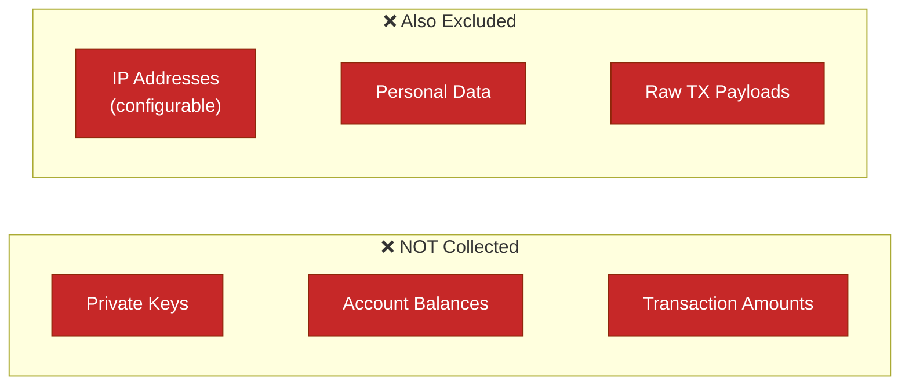

**Reading the diagram:**

- **NOT Collected (top row, red)**: Private Keys, Account Balances, and Transaction Amounts are explicitly excluded — these are financial/security-sensitive fields that telemetry never touches.
- **Also Excluded (bottom row, red)**: IP Addresses (configurable per deployment), Personal Data, and Raw TX Payloads are also excluded — these protect operator and user privacy.
- **All-red styling**: Every box is styled in red to visually reinforce that these are hard exclusions, not optional — the telemetry system has no code path to collect any of these fields.
- **Two-row layout**: The split between "NOT Collected" and "Also Excluded" distinguishes between financial data (top) and operational/personal data (bottom), making the privacy boundaries clear to auditors.

### Privacy Protection Mechanisms

| Mechanism                  | Description                                                   |
| -------------------------- | ------------------------------------------------------------- |
| **Account Hashing**        | `xrpl.tx.account` is hashed at collector level before storage |
| **Configurable Redaction** | Sensitive fields can be excluded via config                   |
| **Sampling**               | Only 10% of traces recorded by default (reduces exposure)     |
| **Local Control**          | Node operators control what gets exported                     |
| **No Raw Payloads**        | Transaction content is never recorded, only metadata          |

> **Key Principle**: Telemetry collects **operational metadata** (timing, counts, hashes) — never **sensitive content** (keys, balances, amounts).

---

## Slide 11: External Dashboard Parity (Phase 7+)

### Bridging Community Monitoring into Native OTel

The community [xrpl-validator-dashboard](https://github.com/realgrapedrop/xrpl-validator-dashboard) provides 86 metrics for validator operators. We integrated the 29 missing metrics natively into the OTel pipeline.

### New Metric Categories

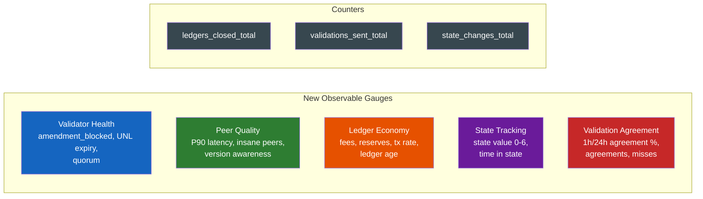

### ValidationTracker — Agreement Computation

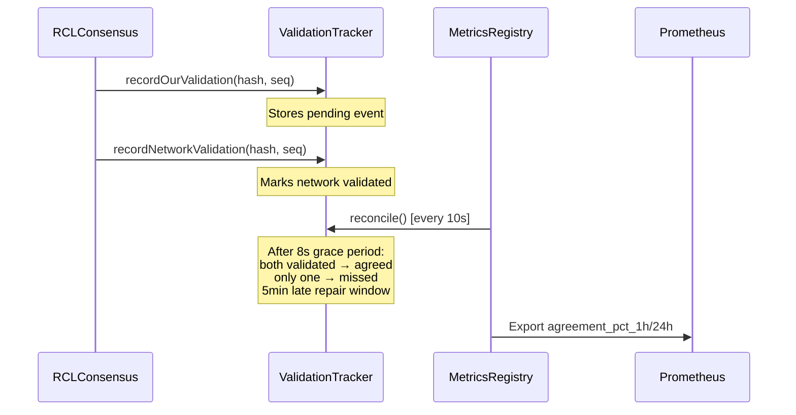

### New Grafana Dashboards

| Dashboard        | Key Panels                                          |
| ---------------- | --------------------------------------------------- |
| Validator Health | Agreement %, amendment blocked, quorum, state value |
| Peer Quality     | P90 latency, version awareness, upgrade recommended |
| Ledger Economy   | Base fee, reserves, ledger age, transaction rate    |

---

_End of Presentation_
