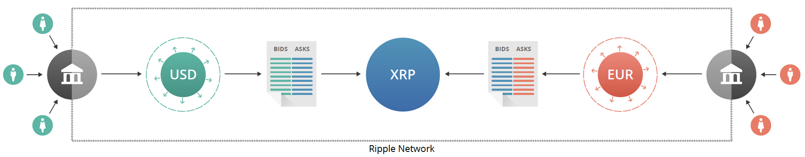
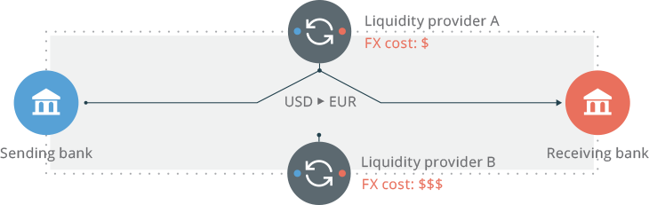
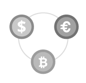

:: 

#The World’s Fastest and Most Secure Payment System

**What is Ripple?**

Ripple is the open-source, distributed payment protocol enabling instant payment
s with low fees, no chargebacks, and currency flexibility (for example dollars, 
yen, euros, bitcoins, or even loyalty points). Businesses of any size can easily
 build payment solutions such as banking or remittance apps, and accelerate the 
movement of money. Ripple enables the world to move value the way it moves infor
mation on the Internet.

**What is a Gateway?**

Ripple works with gateways: independent businesses which hold customer deposits 
in various currencies such as U.S. dollars (USD) or Euros (EUR), in exchange for
 providing cryptographically-signed issuances that users can send and trade with
 one another in seconds on the Ripple network. Within the protocol, exchanges be
tween multiple currencies can occur atomically without any central authority to 
monitor them. Later, customers can withdraw their Ripple balances from the gatew
ays that created those issuances. 

**How do Ripple payments work?**

A sender specifies which currency the recipient gets, and the payment automatica
lly converts the sender’s available currencies using distributed order books int
egrated into the Ripple protocol. Independent third parties acting as  market ma
kers provide liquidity in these order books.

Ripple uses a pathfinding algorithm that considers currency pairs when convertin
g from the source to destination currencies. This algorithm searches for a serie
s of currency swaps that gives the user the lowest cost. Since anyone can partic
ipate as a market maker, market forces drive fees to the lowest practical level.

**What can you do with Ripple?**

The protocol is entirely open-source and the network’s shared ledger is public i
nformation, so no central authority prevents anyone from participating. Anyone c
an become a market maker, create a wallet or a gateway, or monitor network behav
ior. Competition drives down spreads and fees, making the network useful to ever
yone.

###Key Protocol Features
<ol>
<li>XRP is Ripple’s native <a href='http://en.wikipedia.org/wiki/Cryptoc
urrency' target='_blank'>cryptocurrency</a> with a fixed supply that decreases s
lowly over time, with no mining. XRP acts as a bridge currency, and pays for tra
nsaction fees that protect the network against spam
 
 
</li>

<li>Pathfinding discovers cheap and efficient payment paths through mult
iple <a href='https://www.ripplecharts.com' target='_blank'>order books</a> allo
wing anyone to <a href='https://www.rippletrade.com' target='_blank'>trade</a> a
nything. When two accounts aren’t linked by relationships of trust, the Ripple p
athfinding engine considers intermediate links and order books to produce a set 
of possible paths the transaction can take. When the payment is processed, the l
iquidity along these paths is iteratively consumed in best-first order
 

</li>

<li><a href='https://www.youtube.com/watch?v=pj1QVb1vlC0' target='_blank
'>Consensus</a> confirms transactions in an atomic fashion, without mining, ensu
ring efficient use of resources</li>
</ol>

###Join The Ripple Community
<table border='0'>
	<tr>
		<td align='center'></td>
		<td align='center'></td>
		<td align='center'></td>
	</tr>
	<tr>
		<td align='center'><a href='https://ripple.com/files/ripple-FIs.
pdf' target='_blank'>Transact on the fastest payment infrastructure</a></td>
		<td align='center'><a href='https://ripple.com/build/' target='_
blank'>Build imaginative apps</a></td>
		<td align='center'>Contribute to the Ripple Protocol implementat
ion</td>
	</tr>
</table>

#rippled - Ripple P2P server

##

This is the repository for Ripple's `rippled`, reference P2P server.

###Build instructions:
* https://ripple.com/wiki/Rippled_build_instructions

###Setup instructions:
* https://ripple.com/wiki/Rippled_setup_instructions

### Repository Contents

#### ./bin
Scripts and data files for Ripple integrators.

#### ./build
Intermediate and final build outputs.

#### ./Builds
Platform or IDE-specific project files.

#### ./doc
Documentation and example configuration files.

#### ./src
Source code directory. Some of the directories contained here are
external repositories inlined via git-subtree, see the corresponding
README for more details.

#### ./test
Javascript / Mocha tests.

## License
Ripple is open source and permissively licensed under the ISC license. See the
LICENSE file for more details.

###For more information:
* Ripple Wiki - https://ripple.com/wiki/
* Ripple Primer - https://ripple.com/ripple_primer.pdf
* Ripple Primer (Market Making) - https://ripple.com/ripple-mm.pdf
* Ripple Gateway Primer - https://ripple.com/ripple-gateways.pdf  
* Consensus - https://wiki.ripple.com/Consensus

