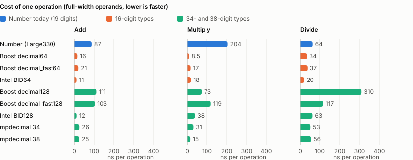
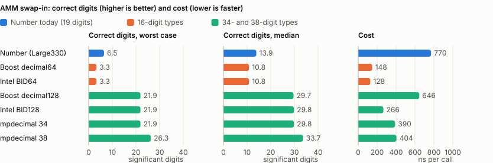
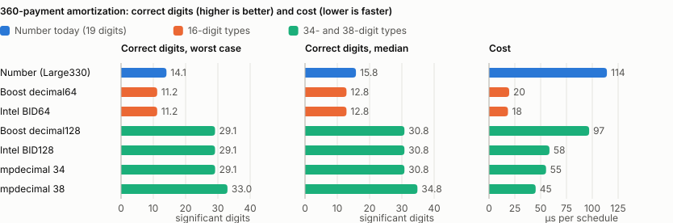

# Number vs. decimal floating-point libraries: benchmark plan

Status: complete (phases 1-5). Goal: before extending `xrpl::Number` to a 128-bit
mantissa, (1) measure how `Number` performs against established base-10
floating-point libraries, and (2) quantify where `Number` diverges from
IEEE 754-2008/2019 decimal arithmetic.

Target precisions for a future 128-bit `Number`: **both 34 digits** (matches
IEEE decimal128) **and 38 digits** (largest `10^k - 1` that fits in a
`uint128`, the direct analogue of today's 19-digit-in-`uint64` design).

## Summary

Measured on one x86-64 machine with GCC 15.2; see "Findings so far" for
method, caveats, and every number.

**Correctness.** Today's `Number` (`Large330`) is correctly rounded for
`+ - * /` and conversion to int64 in all four rounding modes: 9.2 million of
9.2 million samples, including the int64-cap cases older scales got wrong.
Its `root2` (up to ~5 ULP) and `power` (up to ~2800 ULP for n = 360) are not
correctly rounded. No IEEE library tested has an accurate integer `power`
either, and loan payments lose only ~4 digits to it at every precision.
Boost.Decimal 1.91 has several rounding defects (see "Validating the
oracle"); Intel's library had none in `+ - * /`, `sqrt`, or int64
conversion.

**Divergence from IEEE 754.** `Number` is always normalized (no cohorts),
has no infinities, NaNs, signed zero, subnormals, or status flags, throws on
overflow and division by zero, flushes underflow to zero, has a wider
exponent range, and only ~18.96 digits of uniform precision because the
external mantissa is capped at int64. See "How Number diverges from IEEE 754
decimal".

**Speed.** Today's `Number` is 6-25x slower than 64-bit IEEE types at `+`
and `*`, and slower than Intel's 34-digit BID128 at everything except
comparison: 87 vs 12 ns for `+`, 204 vs 38 ns for `*`, parity for `/`. Most
of the cost is normalization one digit at a time (52% of instructions in
`Guard::doDropDigit<unsigned __int128>`) plus a heap-allocated error string
on every `+` and `*`, not the 64-bit width.



**Precision pays off in ledger formulas.** Each formula loses about the same
number of digits at any precision, so a 34-digit type keeps ~15 more correct
digits than today's `Number`, and 38 digits ~4 more again. The AMM swap-in is
the clearest case: 6.5 correct digits in the worst case today, against 22
(34 digits) or 26 (38 digits). 16-digit types are ruled out: they get 60-65%
of vault share conversions wrong.





**Implications for a 128-bit `Number`.**

- Speed is not a reason to stay at 64 bits. Intel BID128 runs every ledger
  formula 2-3x faster than today's `Number` while keeping ~15 more digits.
  Removing several digits per normalization step (one divide by 10^k, with
  the remainder feeding the guard) and passing error locations as
  `char const*` instead of `std::string` are likely the largest gains, at
  any width.
- 34 vs 38 digits: mpdecimal runs both at the same speed, so the choice is
  ~4 extra digits against matching IEEE decimal128 exactly (and being able
  to use Intel's library as a drop-in reference for testing).
- `power` needs a better algorithm (wider intermediates or a correctly
  rounded method) regardless of width, if Lending needs it accurate to the
  last digit.
- A prototype can be measured with no changes here: add
  `include/xrpl/basics/Number128.h` (see "Measuring a Number128 prototype").

## Library shortlist

| Library                                                  | Types                                                                  | Role                                                                                                                                           | Import                                                                                                                     |
| -------------------------------------------------------- | ---------------------------------------------------------------------- | ---------------------------------------------------------------------------------------------------------------------------------------------- | -------------------------------------------------------------------------------------------------------------------------- |
| Boost.Decimal (Boost >= 1.91)                            | `decimal64_t`, `decimal128_t`, `decimal_fast64_t`, `decimal_fast128_t` | Primary competitor; header-only C++ with operator overloads. The `fast` types are always normalized (no cohorts), the same design as `Number`. | Already a dependency (`boost/1.91.0`).                                                                                     |
| Intel Decimal Floating-Point Math Library (libbid 2.0u4) | BID64, BID128                                                          | IEEE reference and expected performance ceiling; backs GCC's `_Decimal*` on x86. Per-call rounding mode and status flags.                      | Fetched from netlib and built at build time (`-Dbench_intel_dfp=ON`); a Conan recipe if it is adopted beyond benchmarking. |
| mpdecimal (libmpdec 4.0)                                 | arbitrary precision (configured to 19 / 34 / 38 digits)                | Correctly-rounded oracle for the divergence harness; previews 34- and 38-digit results.                                                        | ConanCenter `mpdecimal/4.0.0`.                                                                                             |
| IBM decNumber (optional)                                 | `decDouble`, `decQuad`                                                 | Second independent IEEE implementation, only if Boost and Intel disagree.                                                                      | Vendored.                                                                                                                  |

Excluded: GCC `_Decimal*` built-ins (Intel's library underneath, not portable
to Clang), Rust `rust_decimal` (96-bit, non-IEEE, FFI distorts timings),
fixed-point libraries.

Baselines: `double`; `Number` under each `MantissaScale` (`Small`,
`LargeLegacy`, `Large330`).

## How Number diverges from IEEE 754 decimal

Items marked _(to verify)_ are hypotheses from reading the code; the
divergence harness below will confirm or refute them.

| Aspect                        | IEEE 754 decimal                                          | `Number`                                                                                                                                                                                                                                                                                          |
| ----------------------------- | --------------------------------------------------------- | ------------------------------------------------------------------------------------------------------------------------------------------------------------------------------------------------------------------------------------------------------------------------------------------------- |
| Precision                     | 16 digits (decimal64), 34 (decimal128)                    | Internal mantissa `[10^18, 10^19-1]`, but the external `mantissa()` is capped at `int64` (`kMaxRep`); mantissas above it are stored with a forced trailing zero, so precision is non-uniform (~18.96 digits).                                                                                     |
| Cohorts / quantum             | Preserved (`1.0` and `1.00` are distinct representations) | Always normalized; one representation per value; `==` compares fields.                                                                                                                                                                                                                            |
| Exponent range                | ±384 (decimal64), ±6144 (decimal128)                      | ±32768 (`int` exponent).                                                                                                                                                                                                                                                                          |
| Underflow                     | Gradual (subnormals)                                      | Flush to zero (`doNormalize`).                                                                                                                                                                                                                                                                    |
| Overflow                      | ±∞ plus a status flag                                     | Throws `std::overflow_error`.                                                                                                                                                                                                                                                                     |
| Division by zero              | ±∞ / NaN                                                  | Throws.                                                                                                                                                                                                                                                                                           |
| NaN / ∞                       | Yes                                                       | None; comparisons are a plain total order.                                                                                                                                                                                                                                                        |
| Signed zero                   | Yes                                                       | `-0` collapses to `0`.                                                                                                                                                                                                                                                                            |
| Rounding modes                | 5 (incl. ties-away)                                       | 4; thread-local global mode, similar to `fenv`. (Boost.Decimal's mode is a plain process-wide global, not thread-local.)                                                                                                                                                                          |
| Status flags                  | Inexact, underflow, overflow, …                           | None.                                                                                                                                                                                                                                                                                             |
| Correct rounding of + − × ÷ √ | Required                                                  | `×` uses a 128-bit product with guard digits (likely correct). `÷` uses a fixed 10^17 scale plus a staged correction; the legacy `Small` path may not be correctly rounded _(to verify)_. `root`/`root2` (Newton iteration) and `power` (repeated squaring) are not guaranteed correctly rounded. |
| Amendment-gated variants      | n/a                                                       | `Small`, `LargeLegacy` (keeps a known cusp-rounding error), `Large320`, `Large330`; all must stay bit-identical.                                                                                                                                                                                  |
| Representable range           | Symmetric                                                 | −2^63 is not exactly representable.                                                                                                                                                                                                                                                               |
| Encoding                      | 8 / 16 bytes (BID or DPD)                                 | 24 bytes in memory (`bool`, `uint64`, `int`, with padding); 12 bytes serialized as `STNumber` (`int64` + `int32`).                                                                                                                                                                                |
| Other operations              | fma, quantize, sameQuantum, …                             | None.                                                                                                                                                                                                                                                                                             |

## Integration

Nothing in `libxrpl` changes; all code lives under
`src/benchmarks/libxrpl/number/` and builds only when `benchmark=ON`.

- `xrpl_add_benchmark(number)` in `src/benchmarks/libxrpl/CMakeLists.txt`.
- `number/NumberLike.h`: a concept capturing the subset of `Number`'s
  interface used by ledger code: construction from `(int64 mantissa, int
exponent)` and from `int64`; `+ - * /`; `< ==`; explicit conversion to
  `int64`; `to_string`; `abs`; `power(x, n)`; `root2`; rounding-mode control
  mapped onto `Number::RoundingMode`; and `decompose()`, which returns
  `(sign, coefficient, exponent)` for digit-exact comparison.
- `number/adapters/*.h`: one thin wrapper per library, holding a single
  backend value, all functions inline. `Number` satisfies the concept
  directly.
- Optional backends are gated behind options that are off by default, so the
  default benchmark build gains no dependencies. mpdecimal: Conan option
  `bench_mpdecimal` (which also sets the CMake option of the same name).
  Intel: CMake option `bench_intel_dfp`; the tarball is downloaded (SHA-256
  pinned) and built with its own makefile via `ExternalProject`, with
  `CALL_BY_REF=0 GLOBAL_RND=0 GLOBAL_FLAGS=0` and `-O3`.

## Benchmarks (each templated on the NumberLike type)

1. Single operations: add (equal exponents; exponents differing by 1, 5, and
   18), subtract with heavy cancellation, multiply, divide, compare,
   construct from `int64` / `(mantissa, exponent)`, convert to `int64`,
   `to_string`, `power`, `root2`.
2. Operand sets, generated up front into arrays (never compile-time
   constants; Boost.Decimal is `constexpr`, so constants would be folded
   away): random full-width coefficients; IOU-like values (16 digits); XRP
   drop amounts; MPT integers up to 2^63−1; wide exponent spread.
3. Throughput (independent operations) and latency (each result feeds the
   next) variants.
4. Realistic formula kernels, as templated copies: AMM swap in/out
   (`AMMHelpers`), Vault share/asset conversion, Lending interest and
   amortization (`power`, `root`). Report speed and the size of
   end-result differences.
5. Measurement discipline: Release, `-O3`, pinned core, fixed CPU frequency,
   `--benchmark_repetitions=10`, report medians and variation, compare runs
   with Google Benchmark's `compare.py`. Report the cost of `Number`'s
   thread-local loads (`mode`, `kRange`) separately.

## Divergence harness

A separate executable, `xrpl.bench.number_diff`, runs millions of random and
edge-case operations against mpdecimal configured to match `Number`'s
precision and exponent range. It tallies results that are exact, off by
1 ULP, or worse, per operation, mantissa scale, and rounding mode. It also
checks Boost.Decimal and Intel against mpdecimal to validate the oracle, and
becomes the regression oracle for a 128-bit `Number` at 34 and 38 digits.

## Findings so far

Divergence results are from `xrpl.bench.number_diff --samples 100000` (all
four rounding modes, every mantissa scale). "Correctly rounded" means identical to the exact result
rounded onto the type's own grid of representable values.

### Validating the oracle

The harness was checked against IEEE implementations, and every disagreement
was cross-checked against both mpdecimal at the native precision and Python's
`decimal` module. The oracle agreed with both in every case; the
disagreements are Boost.Decimal 1.91 defects:

- `llrint` returns wrong values for inputs that are already integers at full
  precision (e.g. `1.23e17` gives `12345678901235`), and divides by zero
  (SIGFPE) when the significand exponent is exactly 0. Fixed upstream; the
  adapter works around it.
- Directed rounding is ignored when an add/sub operand is far below the
  other's last digit: `6111703207134976 - 5.857e-10` toward zero returns
  `...976` instead of `...975` (`decimal64_t` and `decimal_fast64_t`, about
  10% of IOU-dataset subtractions in `TowardsZero`).
- `decimal128_t` division misrounds near ties (1 in 2000 full-width
  quotients).
- `sqrt` is not correctly rounded (errors up to ~4.5 ULP), although IEEE
  requires it.
- The `fast` types are not correctly rounded for `*` and `/` (up to ~1 ULP),
  as documented.

Intel's library is correctly rounded for `+ - * /`, `sqrt`, and conversion
to int64 in all four modes (9.2 million of 9.2 million samples for both
BID64 and BID128), including the cases Boost gets wrong. Its `pow` is not
correctly rounded (allowed by IEEE): up to ~1500 ULP for x^360 with x in
[1, 1.01). Example confirmed with Python's `decimal`: 1.002740590413819539^360
is `2.678516411804073475375264650425851`, Intel BID128 returns
`...650426258`. So no IEEE library here provides an accurate integer power;
Number's `power` errors are of the same order as Intel's.

### Number

- **`Large330` (current):** `+ - * /` and conversion to int64 are correctly
  rounded in all four modes on every dataset, including the exponent-gap,
  cancellation, tie, and int64-cap ("cusp") cases: 9.2 million of 9.2
  million samples.
- **Older scales:** the harness reproduces what each amendment fixed.
  `LargeLegacy` misrounds at the int64 cap in `Upward` (the documented
  `fixCleanup3_2_0` defect); `LargeLegacy` and `Large320` misround at the cap
  in the other modes and misround subtraction in `TowardsZero` (fixed in
  `Large330`); `Small` misrounds 3-5% of divisions.
- **`root2`** is not correctly rounded in any scale: errors up to ~2.7 ULP
  to nearest and ~5 ULP in directed modes.
- **`power`** accumulates error through repeated squaring without extra
  precision: ~5 ULP for n = 12 and ~800-2800 ULP for n = 360. Relevant to
  Lending amortization, and a design input for a 128-bit Number: wider
  intermediates would remove most of it.

### Performance (phase 1)

Median ns per operation, throughput (independent operations), from
`xrpl.bench.number --benchmark_repetitions=3`. GCC 15.2, Release,
single pinned core of a 16-core x86-64 machine. CPU frequency scaling was on
(`powersave`), so treat differences under ~10% as noise; the median
coefficient of variation across benchmarks was 1.1%.

N = Number, B = `BoostDecimal`, BF = `BoostDecimalFast`, Mpd = mpdecimal at
that precision.

| op        | data | N.Small | N.LargeLegacy | N.Large330 |  B64 | BF64 | B128 | BF128 | Mpd19 | Mpd34 | Mpd38 | double |
| --------- | ---- | ------: | ------------: | ---------: | ---: | ---: | ---: | ----: | ----: | ----: | ----: | -----: |
| add       | full |     105 |           105 |        109 | 17.6 | 21.9 |  118 |   118 |  42.1 |  26.1 |  25.7 |    0.6 |
| sub       | full |     128 |           125 |        110 | 17.7 | 21.3 |  113 |   130 |  40.1 |  26.4 |  26.3 |    0.6 |
| mul       | full |     192 |           210 |        248 |  9.2 | 18.0 | 77.4 |   139 |  30.3 |  31.9 |  15.7 |    0.6 |
| div       | full |    40.8 |          66.2 |       70.2 | 38.6 | 44.3 |  336 |   136 |  55.4 |  54.3 |  57.0 |    0.9 |
| lt        | full |     1.2 |           1.4 |        1.4 |  3.8 |  2.1 |  8.6 |   2.1 |   4.1 |   4.3 |   4.4 |    0.6 |
| construct | full |    24.3 |          19.1 |       18.4 |  4.7 |  4.8 |  1.0 |   6.5 |  12.7 |  12.7 |  12.7 |   11.0 |
| to_int64  | mpt  |    26.4 |          30.1 |       34.8 | 11.7 |  4.4 | 86.4 |  56.7 |   9.4 |   9.5 |   9.5 |    1.5 |
| root2     | full |    1575 |          1734 |       2077 |  120 |  159 |  856 |   906 |   929 |  1212 |  1492 |    1.3 |
| add_gap0  | full |    48.5 |          52.1 |       34.7 | 14.4 | 20.4 | 63.7 |  56.0 |  24.3 |  18.3 |  18.3 |    0.6 |
| add_gap18 | full |     207 |           204 |        204 | 18.6 | 21.8 |  188 |   162 |  43.6 |  44.8 |  29.1 |    0.6 |
| power360  | rate |    1973 |          2503 |       2229 |  221 |  278 | 1421 |  1567 |   788 |  1259 |  1246 |    2.9 |
| mul_chain | rate |     180 |           204 |        284 | 13.1 | 25.0 |  135 |   127 |  32.7 |  36.0 |  36.7 |    0.8 |
| div_chain | rate |    47.2 |          69.9 |        103 | 42.3 | 38.3 |  350 |   130 |  54.4 |  58.0 |  60.7 |    2.7 |

Observations:

- Number's `+` and `*` are 6-25x slower than Boost `decimal64_t`, and 4-15x
  slower than mpdecimal at 38 digits, even though mpdecimal is arbitrary
  precision and heap-capable. Comparison is Number's only clear win.
- Under callgrind, 52% of the instructions in Number's multiply-and-add loop
  are in `Guard::doDropDigit<unsigned __int128>`, which removes surplus digits
  one at a time with a 128-bit divide each. `add_gap0` vs `add_gap18` (35 vs
  204 ns) shows the same per-digit cost in addition. About another 10% is
  `malloc`/`free`: `doRoundUp`/`doRound` take the error-location message as a
  `std::string` by value, so every `*` builds one with `std::to_string`, and
  every `+` builds `"Number::addition overflow"`, which is too long for the
  small-string optimization.
- So Number's cost today is digit-at-a-time normalization, not mantissa
  width. A 128-bit Number does not need to be slower than today's if it
  removes several digits per step (divide by 10^k with a remainder for the
  guard). mpdecimal at 38 digits (add 26 ns, mul 16 ns, div 57 ns) is a
  realistic target.
- Boost `decimal128_t` is slower than mpdecimal at 34 digits for `+` and `/`
  (`/` 336 vs 54 ns), so Boost.Decimal is not a performance reference at 128
  bits. Intel BID128 is (next section).
- `mpdecimal` at 34 and 38 digits costs about the same; 38 is often faster
  because 19-digit x 19-digit products fit without rounding. Precision alone
  does not separate the 34- and 38-digit options on speed.

### Performance with Intel (phase 3)

A separate run (same build, same conditions) of the Intel types with three
anchor subjects repeated from the table above. The anchors moved by less than
5%, except Number's `add`, which was ~15% faster in this run; read the two
tables as consistent to within about that margin.

| op        | data | N.Large330 |  B64 | Mpd38 | Intel64 | Intel128 |
| --------- | ---- | ---------: | ---: | ----: | ------: | -------: |
| add       | full |       89.8 | 16.3 |  25.5 |    12.3 |     11.8 |
| sub       | full |       94.2 | 16.8 |  25.9 |    12.3 |     13.0 |
| mul       | full |        206 |  9.1 |  15.7 |    18.3 |     37.6 |
| div       | full |       65.5 | 36.0 |  57.7 |    19.7 |     64.1 |
| lt        | full |        1.4 |  3.6 |   4.4 |     4.2 |      6.6 |
| construct | full |       16.6 |  4.2 |  12.6 |    11.1 |      4.0 |
| to_int64  | mpt  |       27.8 |  9.4 |   9.6 |     4.1 |      4.8 |
| root2     | full |       1819 |  114 |  1491 |    14.8 |      108 |
| add_gap18 | full |        193 | 17.9 |  29.0 |     8.3 |     24.2 |
| power360  | rate |       2196 |  193 |  1275 |     259 |     1149 |
| mul_chain | rate |        197 | 13.1 |  38.9 |    19.2 |     49.7 |
| div_chain | rate |       70.0 | 41.8 |  60.8 |    28.2 |     69.2 |

Observations:

- Intel BID128 (34 digits, correctly rounded) adds in ~12 ns and multiplies
  in 25-38 ns: 7-8x faster than today's 64-bit Number for `+` and 5-8x for
  `*`, with division at parity. It is the realistic speed target for a
  128-bit Number.
- Intel's `sqrt` is two orders of magnitude faster than Number's `root2`
  (15 vs ~1800 ns at 16 digits; 108 ns at 34 digits) and correctly rounded.

### Ledger formulas (phase 4)

`number/Kernels.h` holds templated copies of production formulas, run
identically on every type, including the rounding-mode switches:
`swapAssetIn`/`swapAssetOut` (fixAMMv1_1 branch), `assetsToSharesDeposit`
and `sharesToAssetsDeposit`, and `loanPeriodicRate` plus
`loanPeriodicPayment` (fixCleanup3_2_0 branch). `loan_amortize` runs a full
monthly schedule (12 or 360 payments) and measures the leftover balance,
which is exactly 0 in exact arithmetic, relative to the principal. Inputs:
AMM pools of 10^6 to 10^12 with trades of 10^-6 to 10^-2 of the pool and
fees up to 1%; vaults of 10^9 to 10^17 integer assets with share supply up
to 10^18; loans of 10^3 to 10^9 at 0.1% to 30% a year.
ns per call

| kernel                 | N.Small | N.Large330 |   B64 | Intel64 | double |  B128 | Intel128 | Mpd34 | Mpd38 |
| ---------------------- | ------: | ---------: | ----: | ------: | -----: | ----: | -------: | ----: | ----: |
| amm_swap_in            |     685 |        770 |   148 |     128 |     23 |   646 |      266 |   390 |   404 |
| amm_swap_out           |     508 |        598 |   174 |     127 |     27 |   590 |      289 |   385 |   415 |
| vault_assets_to_shares |     237 |        291 |    66 |      45 |     10 |   432 |       95 |    91 |    90 |
| vault_shares_to_assets |     219 |        266 |    48 |      39 |    0.8 |   333 |       79 |    64 |    63 |
| loan_payment12         |    1870 |       2115 |   293 |     351 |    4.3 |  1679 |     1041 |  1158 |  1296 |
| loan_payment360        |    3599 |       3555 |   399 |     487 |    6.7 |  2616 |     1867 |  2454 |  2200 |
| loan_amortize12        |    5108 |       5803 |  1024 |    1055 |     16 |  5385 |     3308 |  3167 |  3091 |
| loan_amortize360       |   98902 |     114119 | 19552 |   18359 |    888 | 96989 |    58486 | 55230 | 45190 |

Correct significant digits against a 96-digit evaluation of the same
formula from the same inputs, worst case (median) over 256 cases; for
integer results, cases that differ from the exact truncated result:

| kernel                 |       N.Small |  N.Large330 |           B64 |       Intel64 |        double |        B128 |    Intel128 |       Mpd34 |       Mpd38 |
| ---------------------- | ------------: | ----------: | ------------: | ------------: | ------------: | ----------: | ----------: | ----------: | ----------: |
| amm_swap_in            |    3.3 (10.9) |  6.5 (13.9) |    3.3 (10.8) |    3.3 (10.8) |    4.0 (11.8) | 21.9 (29.7) | 21.9 (29.8) | 21.9 (29.8) | 26.3 (33.7) |
| amm_swap_out           |    8.5 (11.3) | 11.4 (14.1) |    8.5 (11.2) |    8.5 (11.2) |    8.9 (11.4) | 26.9 (29.9) | 26.8 (30.0) | 26.8 (30.0) | 30.5 (33.9) |
| vault_assets_to_shares | 165/256 wrong | 0/256 wrong | 165/256 wrong | 165/256 wrong | 153/256 wrong | 0/256 wrong | 0/256 wrong | 0/256 wrong | 0/256 wrong |
| vault_shares_to_assets |   15.2 (16.0) | 18.1 (19.0) |   15.2 (16.0) |   15.2 (16.0) |   15.8 (16.3) | 33.4 (34.3) | 33.4 (34.3) | 33.4 (34.3) | 37.4 (38.2) |
| loan_payment12         |   11.9 (13.7) | 14.8 (16.7) |   11.9 (13.7) |   11.9 (13.7) |   12.4 (14.4) | 29.4 (31.7) | 29.4 (31.7) | 29.7 (31.8) | 33.7 (35.8) |
| loan_payment360        |   11.9 (15.1) | 15.0 (18.1) |   11.8 (15.2) |   11.8 (15.2) |   12.6 (15.7) | 30.0 (33.1) | 30.0 (33.1) | 30.1 (33.1) | 34.1 (37.1) |
| loan_amortize12        |   11.9 (13.7) | 14.8 (16.7) |   11.9 (13.7) |   11.9 (13.7) |   12.4 (14.3) | 29.4 (31.7) | 29.4 (31.7) | 29.7 (31.7) | 33.7 (35.7) |
| loan_amortize360       |   11.2 (12.8) | 14.1 (15.8) |   11.2 (12.8) |   11.2 (12.8) |   11.5 (13.3) | 29.1 (30.8) | 29.1 (30.8) | 29.1 (30.8) | 33.0 (34.8) |

Observations:

- Wider precision pays off directly in the results. For every formula the
  34-digit types keep about 15 more correct digits than today's Number, and
  38 digits adds about 4 more. The relative loss is roughly constant: each
  formula loses the same number of digits at any precision, so the extra
  digits carry through to the result.
- `amm_swap_in` is where it matters most: `poolOut - ratio` cancels for
  small trades, leaving 6.5 correct digits in the worst case with today's
  Number and about 3 with 16-digit types, against 22 (34 digits) and 26
  (38 digits).
- 16-digit types get 60-65% of vault share conversions wrong, because share
  counts above 10^16 do not fit. Today's Number and all wider types get every
  case right. Any 64-bit IEEE type is ruled out for vaults.
- Intel BID128 runs every formula 2-3x faster than today's Number while
  keeping ~15 more digits. A 128-bit Number does not have to trade speed for
  precision.
- Loans lose about 4 digits at every precision, even though `power` is off
  by up to thousands of ULP: the payment formula is not very sensitive to
  that error.
- `Number.Small` and `Number.Large330` cost about the same.

## Phases

1. `Number` and Boost.Decimal adapters, plus the single-operation benchmarks
   (no new dependencies). (Done.)
2. The divergence harness and the mpdecimal dependency, at 19, 34, and 38
   digits. (Done.)
3. The Intel BID adapter, fetched and built at build time. (Done.)
4. The realistic formula kernels. (Done.)
5. Write-up with figures, and a slot for a `Number128` prototype. (Done.)

## Measuring a Number128 prototype

Add `include/xrpl/basics/Number128.h` defining `xrpl::Number128` with
Number's interface (the `DecomposableNumber` concept in
`src/benchmarks/libxrpl/number/NumberLike.h`) and
`static constexpr unsigned kDigits`. On the next build CMake notices the
header (a `CONFIGURE_DEPENDS` glob) and defines `XRPL_BENCH_NUMBER128`, and
the type appears in every single-operation and formula benchmark and in
`number_diff`, which checks it against a `kDigits`-digit grid. Nothing in
the benchmark sources needs to change. See
`src/benchmarks/libxrpl/number/Number128.h`.

## Running

```bash
# From the build directory. bench_mpdecimal is only needed for number_diff
# and the MpDecimal benchmark subjects; bench_intel_dfp downloads and builds
# Intel's library (needs network access and `make`).
conan install .. --output-folder . --build missing -s build_type=Release \
    -o '&:benchmark=True' -o '&:bench_mpdecimal=True'
cmake -G Ninja -DCMAKE_TOOLCHAIN_FILE=build/generators/conan_toolchain.cmake \
    -DCMAKE_BUILD_TYPE=Release -Dbench_intel_dfp=ON ..
cmake --build . --target xrpl.bench.number xrpl.bench.number_diff

./src/benchmarks/libxrpl/xrpl.bench.number --benchmark_repetitions=10 \
    --benchmark_report_aggregates_only=true
./src/benchmarks/libxrpl/xrpl.bench.number_diff --samples 100000 >divergence.md

# Regenerate the figures (standard-library Python only).
./src/benchmarks/libxrpl/xrpl.bench.number --benchmark_filter='^(add|mul|div)/full/' \
    --benchmark_repetitions=5 --benchmark_report_aggregates_only=true \
    --benchmark_out=core.json --benchmark_out_format=json
./src/benchmarks/libxrpl/xrpl.bench.number --benchmark_filter='^kernel/' \
    --benchmark_repetitions=3 --benchmark_report_aggregates_only=true \
    --benchmark_out=kernels.json --benchmark_out_format=json
../src/benchmarks/libxrpl/number/plot_results.py core.json kernels.json \
    ../docs/images/number
```
