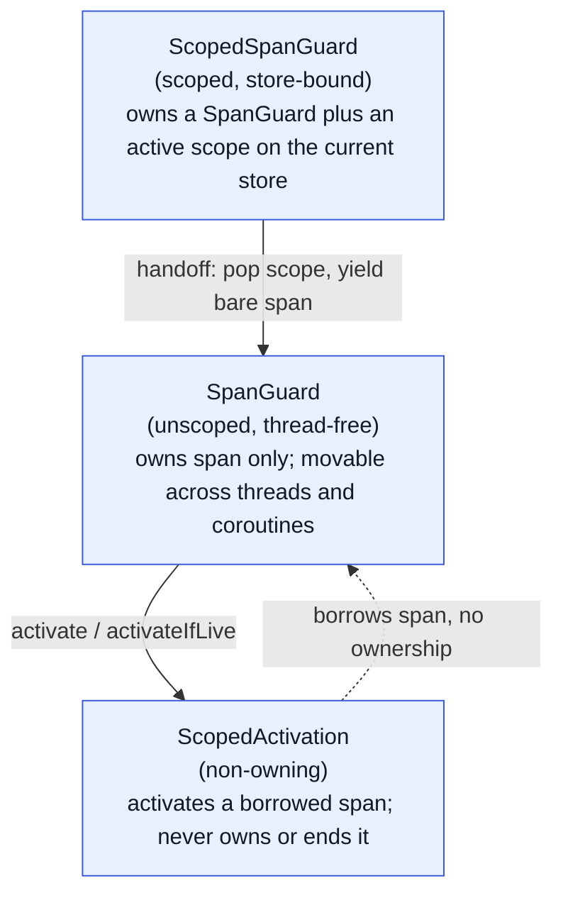

# OpenTelemetry Tracing for xrpld

This document explains how to build xrpld with OpenTelemetry distributed tracing support, configure the runtime telemetry options, and set up the observability backend to view traces.

- [OpenTelemetry Tracing for xrpld](#opentelemetry-tracing-for-xrpld)
  - [Overview](#overview)
  - [Building with Telemetry](#building-with-telemetry)
    - [Summary](#summary)
    - [Build steps](#build-steps)
      - [Install dependencies](#install-dependencies)
      - [Call CMake](#call-cmake)
      - [Build](#build)
  - [Building without telemetry](#building-without-telemetry)
  - [Troubleshooting](#troubleshooting)
    - [Conan lockfile error](#conan-lockfile-error)
    - [CMake target not found](#cmake-target-not-found)
  - [Conditional compilation](#conditional-compilation)
  - [Recording utilities](#recording-utilities)
  - [Span lifetime and cross-thread handling](#span-lifetime-and-cross-thread-handling)
    - [`SpanGuard` versus `ScopedSpanGuard`](#spanguard-versus-scopedspanguard)
    - [Coroutine-aware context storage](#coroutine-aware-context-storage)
    - [Handing a span to a job](#handing-a-span-to-a-job)
    - [Why are unrelated spans in my trace?](#why-are-unrelated-spans-in-my-trace)
    - [Injecting trace context into a protobuf message](#injecting-trace-context-into-a-protobuf-message)

## Overview

xrpld supports optional [OpenTelemetry](https://opentelemetry.io/) distributed tracing.
When enabled, it instruments RPC requests with trace spans that are exported via
OTLP/HTTP to an OpenTelemetry Collector, which forwards them to a tracing backend
such as Grafana Tempo.

Telemetry is gated twice — once at compile time and once at runtime:

- **Compile time**: The Conan option `telemetry` and CMake option `telemetry` decide
  whether the OTel SDK is linked in and `XRPL_ENABLE_TELEMETRY` is defined.
  When off, all `SpanGuard` calls compile to inline no-ops (defined in `SpanGuard.h`)
  with zero overhead — no OTel SDK dependency required.
  The option is currently `True`/`ON` on the telemetry branches so that CI builds and
  exercises the instrumented code; **`False`/`OFF` is the intended default once this
  feature is merged.** Pass the value you want explicitly rather than relying on the
  default.
- **Runtime**: Telemetry is **off by default** — the `[telemetry]` config section must
  set `enabled=1`. When disabled at runtime, a no-op implementation is used even in a
  build that has the SDK compiled in.

## Building with Telemetry

### Summary

Follow the same instructions as mentioned in [BUILD.md](../../BUILD.md) but with the following changes:

1. Pass `-o telemetry=True` to `conan install` to pull the `opentelemetry-cpp` dependency.
2. CMake will automatically pick up `telemetry=ON` from the Conan-generated toolchain.
3. Build as usual.

---

### Build steps

```bash
cd /path/to/xrpld
rm -rf .build
mkdir .build
cd .build
```

#### Install dependencies

The `telemetry` option adds `opentelemetry-cpp/1.28.0` as a dependency.
If the Conan lockfile does not yet include this package, bypass it with `--lockfile=""`.

```bash
conan install .. \
    --output-folder . \
    --build missing \
    --settings build_type=Debug \
    -o telemetry=True \
    -o tests=True \
    -o xrpld=True \
    --lockfile=""
```

> **Note**: The first build with telemetry may take longer as `opentelemetry-cpp`
> and its transitive dependencies are compiled from source.

#### Call CMake

The Conan-generated toolchain file sets `telemetry=ON` automatically.
No additional CMake flags are needed beyond the standard ones.

```bash
cmake .. -G Ninja \
    -DCMAKE_TOOLCHAIN_FILE:FILEPATH=build/generators/conan_toolchain.cmake \
    -DCMAKE_BUILD_TYPE=Debug \
    -Dtests=ON -Dxrpld=ON
```

You should see in the CMake output:

```
-- OpenTelemetry tracing enabled
```

#### Build

```bash
cmake --build . --parallel $(nproc)
```

## Building without telemetry

Pass `-o telemetry=False` to `conan install`, and `-Dtelemetry=OFF` to CMake if you
configure without the Conan-generated toolchain. Do not just omit the option — it then
resolves to whatever the current default is, and that default is `True` on the
telemetry branches.

The `opentelemetry-cpp` dependency will not be downloaded,
the `XRPL_ENABLE_TELEMETRY` preprocessor define will not be set,
and all tracing macros will compile to no-ops.
The resulting binary is identical to one built before telemetry support was added.

> **`-DXRPL_ENABLE_TELEMETRY=OFF` disables nothing.** `XRPL_ENABLE_TELEMETRY` is not a
> CMake option — it is only a compile definition added when `telemetry` is on. Passing it
> on the command line leaves telemetry compiled in; CMake merely lists it at the end of
> configuration under `Manually-specified variables were not used by the project`.
> Use `-Dtelemetry=OFF`.

## Troubleshooting

### Conan lockfile error

If you see `ERROR: Requirement 'opentelemetry-cpp/1.28.0' not in lockfile 'requires'`,
the lockfile was generated without the telemetry dependency.
Pass `--lockfile=""` to bypass the lockfile, or regenerate it with telemetry enabled.

### CMake target not found

If CMake reports that `opentelemetry-cpp` targets are not found,
ensure you ran `conan install` with `-o telemetry=True` and that the
Conan-generated toolchain file is being used.
The Conan package provides a single umbrella target
`opentelemetry-cpp::opentelemetry-cpp` (not individual component targets).

## Conditional compilation

All OpenTelemetry SDK types are hidden behind the pimpl idiom in `SpanGuard.cpp`. When `XRPL_ENABLE_TELEMETRY` is not defined, `SpanGuard.h` provides an all-inline no-op stub class with no OTel dependencies. At runtime, if `enabled=0` is set in config (or the section is omitted), a `NullTelemetry` implementation is used that returns no-op spans.

Those two layers remove the span, but they do **not** remove the work that computes what you pass to it. The compiled-out guards are ordinary inline functions with ordinary parameters, so every argument is evaluated before the empty body is entered:

```cpp
// to_string() allocates a 64-character string even in a build with telemetry
// compiled out. The call then does nothing with it.
span.setAttribute(attr::txHash, to_string(txID).c_str());
```

Guard the work, not just the call. Testing the guard is enough: its `operator bool()` is a literal `false` when telemetry is compiled out, so the whole block is eliminated, and when telemetry is compiled in it also skips the work if tracing is switched off in config or the span's category is disabled.

```cpp
if (span)
    span.setAttribute(attr::txHash, to_string(txID).c_str());
```

A span that exists but was sampled out still pays: there is no `isRecording()` to test.

The `XRPL_METRIC_*` macros are the opposite case. They expand to `do { } while (false)` and discard their arguments, so anything named only inside a macro argument list disappears on its own and needs no guard.

## Recording utilities

Some state exists only to be reported: a timestamp read to measure something, a counter nothing outside telemetry reads, a value kept so that a change in it can be logged. Writing that with preprocessor branches puts `#ifdef` through business logic and leaves the class with a different member set in each build — a difference that has previously made a test mock abstract.

`xrpl/telemetry/Recording.h` holds that state in types that carry a real member when telemetry is compiled in and are empty types with no-op methods when it is not. Declare the member unconditionally: its storage collapses to padding, and its work disappears.

| Utility      | Use it for                                                                                  | With telemetry compiled out                      |
| ------------ | ------------------------------------------------------------------------------------------- | ------------------------------------------------ |
| `kEnabled`   | `if constexpr (telemetry::kEnabled)` around a telemetry-only block that has no span to test | `false`, so the block is discarded               |
| `Stopwatch`  | an elapsed time measured only in order to report it                                         | holds nothing; `elapsedUs()` returns exactly `0` |
| `Counter<T>` | a count with no reader outside telemetry                                                    | holds nothing; `load()` returns `T{}`            |

```cpp
// Times a loop with no preprocessor branch anywhere. The clock is not read at
// all in a build with telemetry compiled out.
telemetry::Stopwatch const timer;
for (auto const& obj : objects)
    lookUp(obj);
recordLookupMetrics(timer.elapsedUs());
```

Two constraints decide whether these are usable at a given site:

- **A no-op method does not skip its arguments.** `counter.add(expensiveCount())` still calls `expensiveCount()`. Pass values that are cheap to produce, and put anything expensive inside `if constexpr (telemetry::kEnabled)`.
- **`if constexpr` still type-checks the branch it discards** in non-template code, so use it only where the block names no `opentelemetry::` type. `SpanGuard` exists to keep those types out of call sites, so that is the usual case; a block that does name them stays behind `#ifdef`.

`Counter` declares copy and move deleted, matching the `std::atomic` it holds when telemetry is compiled in, so a class that owns one has the same copy semantics in both builds.

## Span lifetime and cross-thread handling

Telemetry exposes two RAII guards with split responsibilities, plus a
non-owning activation helper. Picking the right one is what keeps a trace's
parent/child nesting and its per-line log correlation correct.

### `SpanGuard` versus `ScopedSpanGuard`

- **`SpanGuard`** owns a span and nothing else. It is _thread-free_: it never
  touches the active-context stack, so it carries no thread affinity and may be
  moved to and ended on any thread. It is movable and move-assignable. Create
  one with `SpanGuard::span(cat, prefix, name)`, or with
  `SpanGuard::freshRoot(...)` to start a fresh trace root that ignores whatever
  span is currently ambient. Reach for a plain `SpanGuard` whenever the span
  must leave the context store that created it — for example when it is handed
  into a job.

- **`ScopedSpanGuard`** owns a `SpanGuard` _plus_ an active OTel scope that
  pushes the span onto the current context store. While it lives, the span is
  the ambient parent for child spans created on that store, and log lines
  emitted under it carry its `trace_id`. It is non-copyable and non-movable —
  short-lived stack RAII. It offers the same factories (`freshRoot(...)`,
  `childSpan(...)`). When the span must outlive the scope, convert it with
  `operator SpanGuard() &&`: that pops the scope on the origin store and yields
  the bare, thread-free `SpanGuard`.

Rule of thumb: use `ScopedSpanGuard` for same-thread (or same-coroutine)
nesting and log correlation; use the plain `SpanGuard` whenever the span
crosses out of the store that created it.



### Coroutine-aware context storage

The active-context stack is not a plain `thread_local`. At telemetry start
xrpld installs `CoroAwareContextStorage`, which keeps the stack in an
`xrpl::LocalValue`. Because `JobQueue::Coro::resume()` swaps the coroutine's
`LocalValue` store in and out with the coroutine, the ambient context _follows
the coroutine_ across every yield and resume — even when it resumes on a
different worker thread. A `ScopedSpanGuard` held across a coroutine yield is
therefore safe: its scope rides the coroutine and pops on the same store it was
pushed onto, so it never pops the wrong stack. Off a coroutine the `LocalValue`
transparently gives each thread its own store, so behaviour matches OTel's
default thread-local storage. This is what lets the RPC entry, process, and
command spans be scoped — for correct nesting and per-line log-trace
correlation — even though the RPC path yields.

### Handing a span to a job

The hand-off pattern is: create a thread-free `SpanGuard` at the origin (or
convert a `ScopedSpanGuard` with `operator SpanGuard() &&`), move it into the
job closure, and inside the worker body activate it non-destructively with
`telemetry::activateIfLive(handle)`. That call takes no ownership and returns a
`ScopedActivation` (a no-op if the handle is empty or the span inactive) which
makes the span the ambient context so log lines in the worker body carry its
`trace_id`. The activation neither owns nor ends the span — the owning
`SpanGuard` still controls its lifetime and ends it when the closure is
destroyed. Keep the activation confined to a synchronous, non-yielding block.
There is no detach step: a `SpanGuard` is already thread-free.

### Why are unrelated spans in my trace?

Historically a scoped guard destroyed off its origin thread popped the wrong
context stack, leaving a stale ambient span in place that later work inherited.
The current design removes that failure mode in two ways:

- **Coroutine-aware storage** makes a scope held across a coroutine yield pop on
  the same store it was pushed onto, so a coroutine that resumes on another
  worker never pops the wrong stack.

- **A same-store assertion** in `ScopedSpanGuard` (and `ScopedActivation`)
  records the `LocalValue` store its scope was pushed onto and checks, in
  debug/test/fuzzing builds, that destruction, hand-off, and discard all happen
  while that same store is active — turning a genuine cross-store misuse into an
  immediate assertion failure rather than a silently corrupted trace.

If a trace still shows unrelated spans nested under one operation, the usual
cause is an inbound entry point that inherited an ambient parent it should not
have. Start such an operation with `freshRoot()` so it begins a clean trace
root and never adopts whatever span happened to be active. To move a span
across a store boundary, keep it in a thread-free `SpanGuard` (or convert via
`operator SpanGuard() &&`) rather than holding a `ScopedSpanGuard` across the
boundary.

### Injecting trace context into a protobuf message

Pass the **whole message** to the injection helpers, never `*msg.mutable_trace_context()`.

On a protobuf `optional` submessage, `mutable_` allocates the submessage and sets its has-bit, and that happens at the call site before the helper runs. A caller that dereferences it therefore puts an empty `TraceContext` on the wire whenever nothing is recorded, and every receiving peer takes its `has_trace_context()` branch to extract nothing from it. `trace_context` is field 1001, so the wasted bytes are a 2-byte tag plus a zero length.

```cpp
// Right: the helper decides whether the submessage is created at all.
telemetry::injectSpanContext(span, msg);

// Wrong: the submessage exists before the helper can decide anything.
telemetry::injectSpanContext(span, *msg.mutable_trace_context());
```

`injectCurrentContext(msg)` does the same for whichever span is active on the calling thread, deciding via `SpanGuard::hasCurrentContext()`. Four states have to come out right:

| Build        | Runtime          | Result                                                               |
| ------------ | ---------------- | -------------------------------------------------------------------- |
| compiled out | n/a              | no submessage; the bytes on the wire match a build without telemetry |
| compiled in  | a span is active | `trace_id`, `span_id` and the trace flags are written                |
| compiled in  | no active span   | no submessage, rather than an empty one                              |
| compiled in  | `enabled=0`      | no submessage                                                        |

`hasCurrentContext()` reads the span straight out of the runtime context. `opentelemetry::trace::GetSpan()` would be shorter, but it returns a heap-allocated `DefaultSpan` when the context holds no span — an allocation in exactly the case the predicate exists to keep free.
