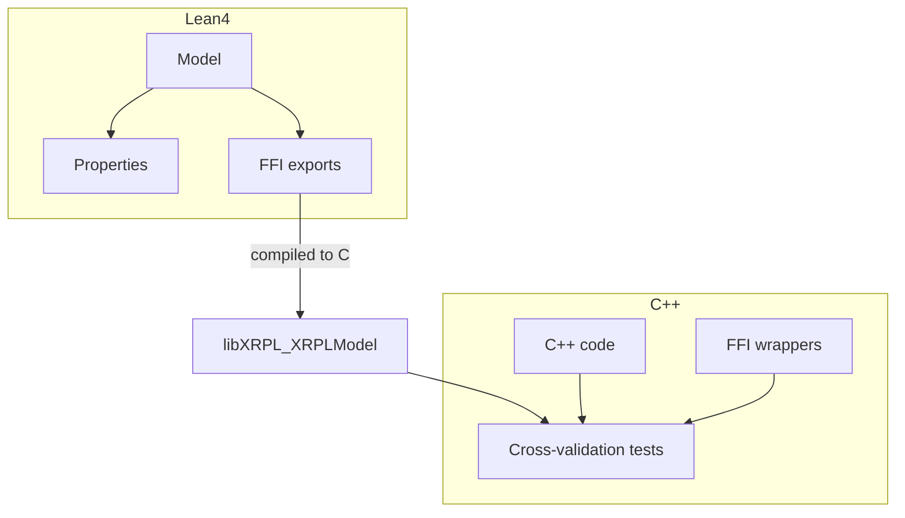
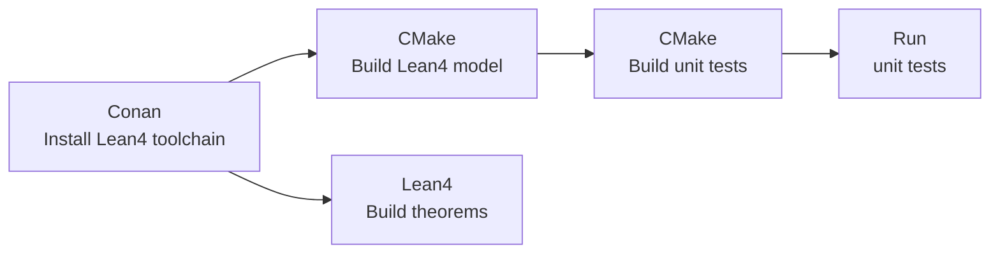

# Formal Verification of XRPL in Lean4

This doc covers the Lean4 to C++ integration in `xrpld`: how a Lean4 model is
compiled and wired in so the C++ can call it.

## Motivation

`xrpld` contains arithmetic and protocol logic that is easy to get subtly
wrong: invariants that must hold after a number of transactions have run,
edge-case branching or rounding. Formal verification lets us examine and
prove properties that hold for **all** inputs. We do it in two steps:

1. **Model the C++ in Lean4.** We re-implement a C++ algorithm as a Lean4
   function, a faithful line-by-line translation, then **prove properties about
   it** (e.g. "the rounded result is within half a unit in the last place of the
   exact result").

2. **Cross-validate the model against the real C++.** A proof only matters if the
   model matches the shipping C++, so we run exhaustive tests that compare the two.

The proofs tell us the modeled algorithm is correct. The cross-validation tells
us the model faithfully represents the C++.

## Terminology

| Term                   | Meaning                                                                                    |
| ---------------------- | ------------------------------------------------------------------------------------------ |
| **Lean4**              | Functional programming language and interactive theorem prover, which can generate C code. |
| **Model**              | A Lean4 function or structure that re-implements C++ logic                                 |
| **Property / theorem** | A mathematical statement about the model, proved in Lean4                                  |
| **FFI**                | Foreign Function Interface, bridging Lean4 and C++                                         |
| **`elan`**             | Lean4 version manager, installs `lake`                                                     |
| **`lake`**             | Lean4's build tool (the equivalent of `cmake`)                                             |
| **`mathlib`**          | Lean4's mathematics library. Large and slow to compile                                     |

## Overview

- Lean4 models are in `formal_verification/XRPL/Model` under the root directory.
- C++ has unit tests in `src/test/formal_verification/` that compare Lean4 vs
  C++ implementation.
- For these test to work, Lean4 needs to expose its functions to C++.
- Lean4 is capable of compiling to C via FFI exports, which can then be called
  from C++. These exports are defined in `formal_verification/XRPL/FFI`.
- C++ side also needs FFI wrappers to abstract any complexities or memory
  management away from C++ developers.



There are two use-cases of Lean4 models:

1. Developing theorems and proofs about the model.
2. Writing unit tests to cross-verify Lean4 <-> C++ model faithfulness.

As part of day-to-day development cycle, it is important that:

1. Theorems always compile in Lean4 (in Lean4, "it compiles" means "its
   verified"). For regular workflow of most developers, this can be left to
   CI/CD.
2. Cross-verification unit tests always pass (it means Lean4 models have not
   drifted from C++). This affects developers working on formally verified code
   or formal verification itself.

Integration is done as following:



| Step                                                                 | Motivation                                                                                                                                   | Notes                                                                                                                                         |
| -------------------------------------------------------------------- | -------------------------------------------------------------------------------------------------------------------------------------------- | --------------------------------------------------------------------------------------------------------------------------------------------- |
| Conan's recipe downloads `elan` and installs `lake` and dependencies | No C++ developer has to worry about installing the toolchain for Lean4 themselves, but the build process takes care of things automatically. | This should be optional - some C++ developers do not care about formal verification and will offload it to CI/CD.                             |
| CMake builds Lean4 models and cross-verification tests               | If Lean4 or C++ code change, a single build command rebuilds them.                                                                           |                                                                                                                                               |
| Run tests                                                            | Make it easy to run cross-verification tests.                                                                                                |                                                                                                                                               |
| Build theorems                                                       | Formal verification proof work can be done independently.                                                                                    | User can use `lake` installed by Conan, but they need to add it to `PATH`. Alternatively, install your own, but make sure version is correct. |

---

## Project structure

```
formal_verification/                    Lean4 project
├── XRPL/
│   ├── Model/                          Lean4 models
│   ├── FFI/                            FFI exports
│   └── Properties/                     Theorems about the model
├── lakefile.toml                       lake build config
└── lean-toolchain                      pins the Lean4 version

external/lean4/conanfile.py             Conan recipe
external/lean4-deps/conanfile.py        Conan recipe (prebuilt mathlib)

src/test/formal_verification/           C++ cross-validation tests
├── common/                             Common code for testing
├── ffi/                                FFI code on C++ side (decoding, encoding)
└── protocol/                           Tests matching C++ directory structure

cmake/XrplLean4.cmake                   Links the Lean4 libraries into xrpld
```

---

## The Lean4 model: translating C++ into code suitable for theorems and proofs

A model is a translation of the C++ code. For example, Number class data
structure will look like:

```lean
inductive rounding_mode where
  | to_nearest | towards_zero | downward | upward
  ...

structure Number where
  negative : Bool
  mantissa : UInt64
  exponent : Int
  ...

def Number.operator_mul (x y : Number) (mode : rounding_mode) : Except String Number := do
    -- Attempt to follow C++ business logic step by step
    ...
```

A thing to notice:

- The result type is `Except String Number`. The C++ throws
  `std::overflow_error` on overflow; the Lean4 model returns an error string.

### What we prove

Once the algorithm is in Lean4, we prove properties about it. There are
**theorems and lemmas** under `XRPL/Properties/`. They range from small
accessor facts to the headline theorems.

`lake build` _is_ the check that all theorems hold. If every file compiles
with no `sorry` and only standard axioms, the proofs are sound.

## The FFI bridge

Lean4 compiles to C, so each `@[export]` function is a C symbol that C++ can call.

Lean4 values live as heap-allocated `lean_object*` pointers in the C ABI, and
C++ works with them through those handles.

Before any export can be called, the Lean4 runtime and the module's initializers
must run. The base suite does this exactly once, behind a `std::once_flag`, and
serializes all Lean4 calls behind a mutex because the Lean4 runtime is
single-threaded. This is handled in `src/test/formal_verification/common/LeanSuite.h`

Note that we only compile and initialize the model, so that the tests are
buildable and runnable even while the proofs are a work in progress.

### Memory management is hidden in a base class

Our goal is that a test developer has least possible interaction with Lean4
memory management. It lives in base class `LeanObjectFFI`.

```cpp
class LeanObjectFFI
{
    lean_object* o_ = nullptr;

public:
    lean_object* raw() const noexcept { return o_; } // inspect, no refcount change
    lean_object* borrow() const noexcept { lean_inc(o_); return o_; } // pass to a Lean4 call (it consumes a ref)
    lean_object* give() noexcept { auto t = o_; o_ = nullptr; return t; } // transfer ownership out

    ~LeanObjectFFI() { if (o_) lean_dec(o_); } // freed automatically
};
```

The rule is encoded in the names: every Lean4 `@[export]` function _consumes_ its
object arguments, so a caller passes `borrow()` to keep its handle or `give()` to
surrender it, and never calls `lean_inc` / `lean_dec` itself. A typed wrapper
builds on this so a test sees only ordinary C++ values, which is what
`NumberFFI::build` / `read` above do.

An operation's result structure isn't kept as a handle. A RAII guard
`LeanObjOwner` frees it when the fields have been copied out:

```cpp
struct LeanNumberResult : LeanNumber
{
    bool ok;
    static LeanNumberResult fromLean(lean_object* obj)
    {
        LeanObjOwner const guard{obj}; // lean_dec(obj) on scope exit
        LeanNumberResult r;
        r.mantissa = lean_ctor_get_uint64(obj, 0);
        r.exponent = lean_ctor_get_uint64(obj, 8);
        r.negative = lean_ctor_get_uint8(obj, 17);
        r.ok       = lean_ctor_get_uint8(obj, 16) == 0;
        return r;
    }
};
```

### Number example

#### Building and reading a value

For example, `lean_number_build` constructs a `Number` from its fields and
hands back the handle and `lean_number_mantissa` / `_negative` / `_exponent`
read it back out.

```lean
@[export lean_number_build]
def lean_number_build (negative : UInt8) (mantissa : UInt64) (exponent : Int64) : Number :=
  Number.unchecked (negative != 0) mantissa exponent.toInt

@[export lean_number_mantissa]
def lean_number_mantissa (n : Number) : UInt64 := n.mantissa
```

On the C++ side, `NumberFFI` wraps the handle and exposes it as a plain `Number`:

```cpp
class NumberFFI : public LeanObjectFFI
{
public:
    using CppType = Number;
    static NumberFFI build(Number const& n);   // C++ Number -> Lean4
    Number           read() const;             // Lean4 -> C++ Number
};
```

#### Running a function

A function export takes the operands' fields, calls the matching model
function, and returns the result as a Lean4 structure.

For example, `lean_number_mul` decodes its arguments into `Number` values,
calls `Number.operator_mul`, and encodes the outcome:

```lean
structure FFINumberResult where
  mantissa : UInt64
  exponent : Int64
  status   : UInt8  -- 0 = ok, 1 = error
  negative : UInt8

def decodeNumber (neg : UInt8) (mant : UInt64) (exp : Int64) : Number :=
  Number.unchecked (neg != 0) mant exp.toInt

def encodeResult (r : Except String Number) : FFINumberResult :=
  match r with
  | .ok n     => encodeNumber n
  | .error _  => ⟨0, 0, 1, 0⟩

@[export lean_number_mul]
def lean_number_mul (neg1 : UInt8) (mant1 : UInt64) (exp1 : Int64)
    (neg2 : UInt8) (mant2 : UInt64) (exp2 : Int64) (mode : UInt8) : FFINumberResult :=
  encodeResult (Number.operator_mul (decodeNumber neg1 mant1 exp1)
                                    (decodeNumber neg2 mant2 exp2)
                                    (decodeMode mode))
```

The returned structure is a `lean_object*`.

---

## The build process

The Lean4 side is heavy: it depends on `mathlib`, which contains thousands of
files that are slow to compile. The strategy is to compile it **once** and keep
it warm.

Our model is built **in-tree** by CMake when `formal_verification=ON`, while
mathlib's native objects come prebuilt from the `lean4-deps` Conan package.
`conan install` pulls the toolchain, `lean4-deps`, and `xrpld`'s own dependencies,
and after that, editing a `.lean` file and running `cmake --build` rebuilds only
what changed.

### Compile mathlib once, keep edits incremental

`lake exe cache get` downloads mathlib's _elaboration_ artifacts (`.olean`), so
the objects are compiled locally.

On first build, `lean4-deps` compiles mathlib's modules and caches them for reuse later.

Two properties keep compilation after edit fast:

- **lake is incremental** so editing the model rebuilds only the changed model
  modules; mathlib is never rebuilt.
- **the dependency objects are prebuilt** so a model edit just rebuilds the
  model and relinks the library.

We link the objects into a **shared** library, passing the ~8,000 object paths in a file
instead of on the command line.

8,000 paths on one command line overflow the OS limit (`ARG_MAX`), which is why
both `ar` and lake's own `:shared` facet fails on mathlib, so CMake links them
itself.

The Lean4 build writes its artifacts into `formal_verification/.lake/` (gitignored).
Building `xrpld` needs no separate Lean4 toolchain installed, Conan provides it.

### Wiring into xrpld

`formal_verification` is a Conan option (declared in `conanfile.py`) mirrored
into a CMake option of the same name (declared in `cmake/XrplSettings.cmake`).
Default is **OFF**, so a normal `xrpld` build is unaffected.

When the option is on, a single `cmake --build .` builds the Lean4 library first,
then links `xrpld` against it.

> Currently, Windows support is under development.

---

## Building and running the tests

From a fresh checkout:

```bash
mkdir .build && cd .build

# Register the lean4 toolchain and dependencies recipes in the Conan cache (once per machine).
conan export ../external/lean4
conan export ../external/lean4-deps

# Resolve and build dependencies. Runs once and pulls the lean4 toolchain and lean4-deps.
conan install .. --output-folder . --build missing --settings build_type=Release \
    -o formal_verification=True --lockfile-partial

# Configure, then build. CMake builds the Lean4 model and links the shared
# library. lake keeps later builds incremental.
cmake -DCMAKE_TOOLCHAIN_FILE:FILEPATH=build/generators/conan_toolchain.cmake \
    -DCMAKE_BUILD_TYPE=Release -Dxrpld=ON -Dtests=ON -Dformal_verification=ON ..
cmake --build . --parallel N

# Run the cross-validation suite.
./xrpld --unittest=formal_verification
```

`-o formal_verification=True` pulls the `lean4` toolchain and `lean4-deps`
into the graph, and the matching `-Dformal_verification=ON` tells CMake to build
and link the Lean4 side.

`--lockfile-partial` lets Conan add `lean4` and `lean4-deps`, which are opt-in
and not pinned in `conan.lock`.

## Testing Principles

### Number

`LeanNumber_test.cpp` cross-validates every `Number` operation against the Lean
model. Each case runs the operation in both implementations and asserts they
agree (`checkResult`).

The suite involves targeted fuzzing. Inputs are chosen to push the **result**
onto those boundaries, to trigger coverage of every edge case, with a random
pass to cover usual inputs as a backstop.

A `Number` is `mantissa × 10^exponent`, sign-magnitude, normalized into a fixed
mantissa range.

#### Deterministic sweeps and a random backstop

Every operation is tested by **targeted, deterministic sweeps** that cover the
boundaries we can enumerate, plus a **random backstop** for the interior we
cannot.

The backstop draws operands from `randomOperand`, which returns a boundary value
about a third of the time and a uniform interior value otherwise, so random
_pairs_ also mix a boundary operand with an interior one.

Its exponent range is `[STAmount::kMinOffset, kMaxOffset]` = `[-96, 80]`, the
range real amounts occupy, since `Number` backs `STAmount`.

Widening it to the full exponent range was measured to catch **fewer** bugs
(random pairs land so far apart that additions stop cancelling); the extremes
are covered by the deterministic sweeps instead.

#### Landing a result on a boundary

For the rounding-sensitive operators, what matters is where the **result** lands,
not where the inputs sit. Two techniques place it there:

- **Forward** (mul/div exponent): the result exponent is `ea + eb + L` for
  multiplication and `ea − eb − L` for division (`L = mantissaLog`), so choosing
  the operand exponents lands the result exponent anywhere. `sweepResultExp`
  walks it across `kMinExponent` / `kMaxExponent` one step at a time, splitting
  the two operand exponents unevenly so both odd and even result exponents are
  hit (a "both equal" split would skip the odd ones).

- **Backward** (everything else): pick the target result `T` and derive the
  partner operand from the inverse op: `b = T − a` (add), `b = a − T` (sub),
  `b = a / T` (div), `b = T / a` (mul).

#### The operators

Each operator is tested by aiming at the targets that are likely to break it.

| Operator                      | Test case targets                                                                          |
| ----------------------------- | ------------------------------------------------------------------------------------------ |
| `mul`, `div`                  | where the result lands: the exponent at the under/overflow edges, the mantissa at the cusp |
| `add`, `sub`                  | cancellation and the cusp                                                                  |
| `neg`, `signum`               | input edges only                                                                           |
| `normalize`                   | its input, including un-normalized values no other operator accepts                        |
| `to_rep`                      | rounding to an integer, the only operator that does so                                     |
| `eq` `ne` `lt` `le` `gt` `ge` | sign and exponent ordering                                                                 |
