# Harness Engineering for rippled: Leveraging OTel as the Foundation for Agent-First Development

> **Date**: 2026-03-09
> **Status**: Investigation Report
> **Context**: OpenAI's [Harness Engineering](https://openai.com/index/harness-engineering/) blog post + rippled OTel initiative (12-PR chain, Phases 1-11)
> **Companion Files**: [ARCHITECTURE.md](ARCHITECTURE.md) | [WORKFLOW.md](WORKFLOW.md)

---

## Executive Summary

OpenAI coined **"Harness Engineering"** to describe the discipline of building infrastructure _around_ AI coding agents — not the agents themselves. Their thesis: **"Give Codex a map, not a 1,000-page instruction manual."** They shipped [Symphony](https://github.com/openai/symphony), an open-source framework that turns issue tracker tickets into autonomous "implementation runs" with proof-of-work requirements (CI pass, PR review, walkthrough) before merging.

The rippled OpenTelemetry initiative — now spanning 12 chained PRs from Phase 1a through Phase 11 planning — is **uniquely positioned** to become the observability backbone of a harness engineering strategy. The OTel work already delivers 3 of the 5 harness engineering principles. This report maps the gap and proposes a concrete adoption path.

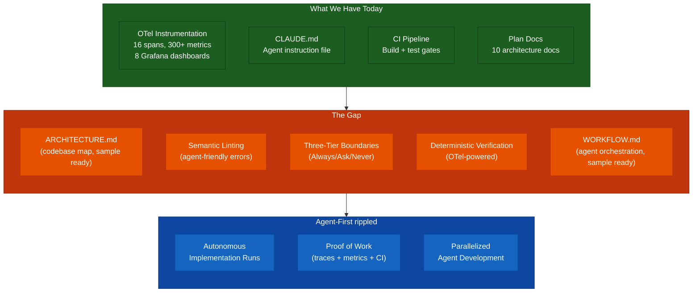

---

## Part 1: What Is Harness Engineering?

### 1.1 Origin and Core Concept

OpenAI's engineering team discovered that **prompt engineering alone doesn't scale** for AI coding agents. They tried the "giant AGENTS.md" approach — a massive instruction file with everything an agent needs to know. It failed:

- Too much context crowds out the actual task
- Everything marked "important" means nothing is important
- The file goes stale as the codebase evolves

What actually worked was building **infrastructure** that makes agents effective:

| Failed Approach               | What Worked Instead                       |
| ----------------------------- | ----------------------------------------- |
| Giant instruction files       | Short map pointing to deeper docs         |
| Detailed step-by-step prompts | Strict architecture enforced by linters   |
| Manual agent supervision      | Fast, deterministic feedback loops        |
| One-off agent runs            | Repeatable autonomous implementation runs |

### 1.2 The Five Principles

| #   | Principle                      | Definition                                                                    | rippled Status                                           |
| --- | ------------------------------ | ----------------------------------------------------------------------------- | -------------------------------------------------------- |
| 1   | **Deterministic Verification** | Verify agent output with automated checks — don't trust, verify               | Partial (CI exists, OTel validation planned in Phase 10) |
| 2   | **Semantic Linting**           | Linter messages teach agents how to fix violations in one shot                | Missing                                                  |
| 3   | **Three-Tier Boundaries**      | Every harness defines Always / Ask / Never action categories                  | Partial (CLAUDE.md has some rules)                       |
| 4   | **Fail-Fast Feedback**         | Fast checks first (lint, typecheck), slow checks later (integration)          | Partial (CI runs, but not agent-optimized)               |
| 5   | **Architecture as Map**        | [ARCHITECTURE.md](ARCHITECTURE.md) tells agents _where_ things are, not _why_ | Missing (plan docs explain _why_, not _where_)           |

### 1.3 Symphony: The Orchestration Layer

OpenAI released [Symphony](https://github.com/openai/symphony) — an open-source framework (Elixir/BEAM) that:

1. **Polls an issue tracker** (Linear) for work items
2. **Creates isolated workspaces** per issue (git worktrees)
3. **Spawns coding agents** (Codex) with a repo-defined `WORKFLOW.md` prompt
4. **Requires proof of work** before merging: CI status, PR review feedback, complexity analysis, walkthrough videos
5. **Provides observability** into concurrent agent runs (structured logs, status surface)

The key insight: `WORKFLOW.md` is version-controlled _in the repo_, so the agent's policy evolves with the code.

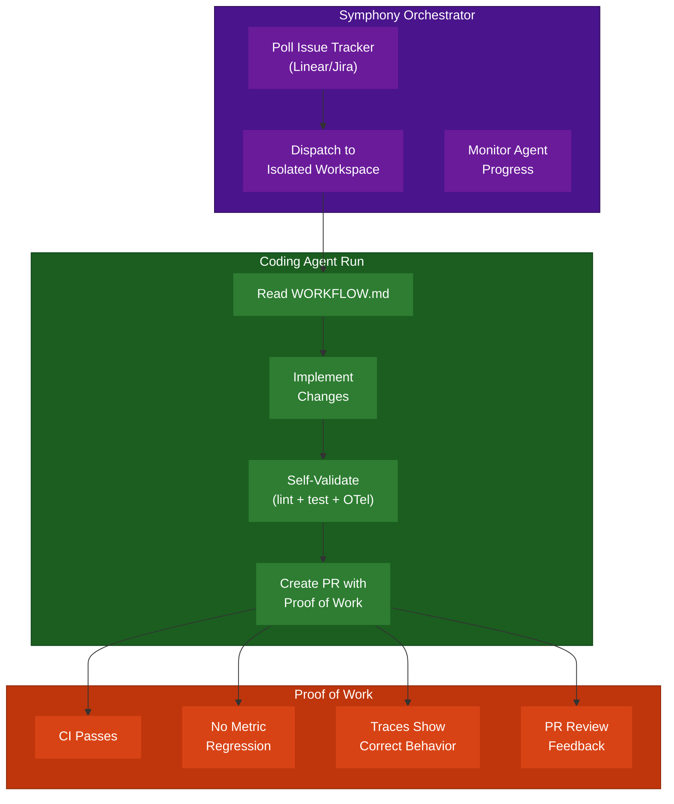

---

## Part 2: OTel as the Observability Backbone for Harness Engineering

### 2.1 The Connection: Observability Enables Agent Autonomy

The most overlooked aspect of harness engineering is **how agents verify their own work**. OpenAI's Symphony requires "proof of work" — but what constitutes proof? For a systems project like rippled, CI pass alone is insufficient. An agent needs to verify:

- Did the change introduce latency regressions? (traces)
- Are consensus rounds still completing within tolerance? (metrics)
- Does the transaction lifecycle still trace end-to-end? (cross-node traces)
- Are error rates stable? (dashboards)

**The OTel initiative is building exactly this verification infrastructure.**

### 2.2 Mapping OTel Phases to Harness Capabilities

| OTel Phase                          | Harness Capability Unlocked                                      |
| ----------------------------------- | ---------------------------------------------------------------- |
| **Phase 1-2**: Core + RPC Tracing   | Agents can verify RPC handler changes don't regress latency      |
| **Phase 3**: Transaction Tracing    | Agents can verify cross-node transaction propagation works       |
| **Phase 4**: Consensus Tracing      | Agents can verify consensus-touching changes don't break timing  |
| **Phase 5**: Dashboards + Runbook   | Agents can reference dashboards as "expected state" baselines    |
| **Phase 6-7**: Metrics Pipeline     | Agents can check 300+ metrics for regressions after changes      |
| **Phase 8**: Log-Trace Correlation  | Agents can trace from an error log line to the full request path |
| **Phase 9**: Metric Gap Fill        | Agents get coverage of NodeStore I/O, cache rates, TxQ depth     |
| **Phase 10**: Synthetic Workload    | **Direct harness engineering**: automated telemetry validation   |
| **Phase 11**: Third-Party Pipelines | Agents can monitor external network health indicators            |

### 2.3 Phase 10 IS Harness Engineering

Phase 10 (Synthetic Workload Generation & Telemetry Validation) is the most directly aligned with harness engineering:

- **5-node validator harness** — isolated test environment for agent runs
- **RPC load generator + tx submitter** — deterministic workload to produce consistent telemetry
- **Automated validation of 16 spans + 300+ metrics + 10 dashboards** — the "proof of work" verification layer
- **Performance benchmarks** — regression detection
- **CI integration** — automated gate

This is exactly OpenAI's Principle #1 (Deterministic Verification) applied to a C++ blockchain node.

### 2.4 OTel-Powered Agent Verification Flow

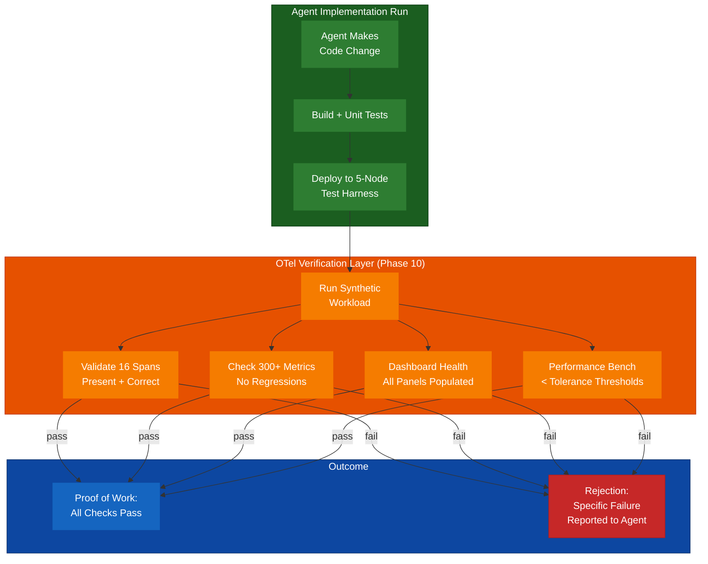

---

## Part 3: Building the Surrounding Harness Infrastructure

### 3.1 Gap Analysis: What's Missing

The OTel work provides the **verification layer** (Principle #1). Here's what's needed to complete the harness:

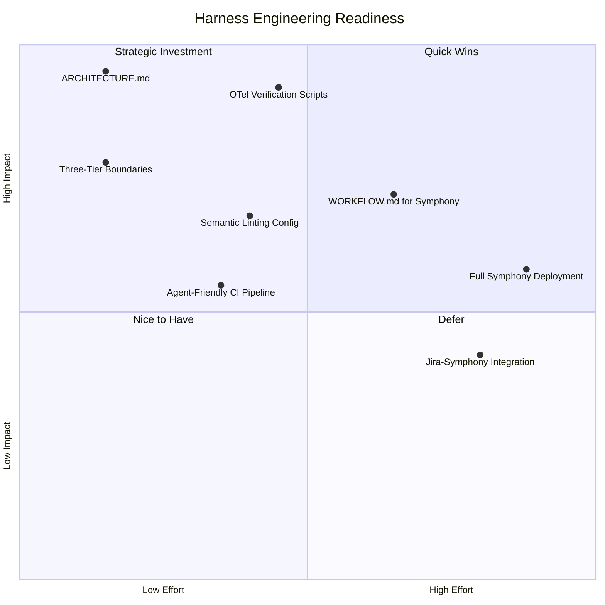

### 3.2 Principle #5: Architecture as Map ([ARCHITECTURE.md](ARCHITECTURE.md))

**Current state**: The OTel plan docs (01-architecture-analysis.md) describe rippled's architecture in detail, but they're _plan docs_ — they explain _why_ to instrument, not _where things are_ for an agent navigating the codebase.

**What's needed**: A top-level [`ARCHITECTURE.md`](ARCHITECTURE.md) that serves as the agent's map.

**Sample created**: See [ARCHITECTURE.md](ARCHITECTURE.md) — a working example covering all sections below.

```
ARCHITECTURE.md
├── Layer Diagram (5 layers: RPC → NetworkOPs → Consensus → Ledger → NodeStore)
├── Module Map (directory → purpose, one line each)
├── Key Abstractions (Application, Overlay, RCLConsensus, JobQueue, beast::insight)
├── Entry Points (where execution starts for each operation type)
├── Data Flow (transaction lifecycle, ledger close, peer message handling)
├── Build Targets (libxrpl, xrpld, unit tests)
└── Telemetry Map (which spans/metrics cover which modules — links to 09-data-collection-reference.md)
```

**Key principle**: Keep it under 300 lines. Link to deeper docs rather than inlining detail. Agents need a map, not an encyclopedia.

### 3.3 Principle #3: Three-Tier Boundaries

**Current state**: `CLAUDE.md` has workflow rules but doesn't explicitly categorize actions into Always/Ask/Never.

**Proposed addition to CLAUDE.md**:

```markdown
## Agent Action Boundaries

### Always (autonomous — no confirmation needed)

- Run `cmake --build` and unit tests
- Read any source file
- Create/modify files under `src/` that are covered by existing tests
- Run the OTel integration test suite
- Query Prometheus/Grafana for metric baselines

### Ask (require human confirmation)

- Modify Protocol Buffer definitions (affects wire format)
- Change consensus timing parameters
- Modify CMakeLists.txt or Conan dependencies
- Alter the telemetry configuration schema
- Push to any remote branch

### Never (hard boundaries — agent must refuse)

- Modify cryptographic signing code without review
- Disable or weaken telemetry sampling below 1%
- Remove or reduce test coverage
- Change validator key handling
- Force-push to any branch
```

### 3.4 Principle #2: Semantic Linting

**Current state**: rippled uses clang-format and has CI checks, but linter output isn't optimized for agent consumption.

**What makes linting "semantic"**: The linter error message should teach the agent how to fix the violation in one shot.

**Proposed improvements**:

| Tool         | Current            | Agent-Friendly Improvement                                                              |
| ------------ | ------------------ | --------------------------------------------------------------------------------------- |
| clang-format | Format check in CI | Add `.clang-format` with explicit rationale comments; pre-commit hook                   |
| clang-tidy   | Not integrated     | Add `.clang-tidy` config targeting rippled patterns (RAII, span safety)                 |
| Custom lint  | None               | Script that checks: telemetry macro usage, span attribute completeness, config coverage |
| OTel lint    | None               | Validate span names follow `<component>.<operation>` convention                         |

**Example of a semantic lint rule for OTel**:

```
ERROR: Span "handleRequest" does not follow naming convention.
       Expected: "<component>.<operation>" (e.g., "rpc.handle_request")
       Fix: Rename to "rpc.handle_request" in src/xrpld/rpc/ServerHandler.cpp:142
       Reference: OpenTelemetryPlan/02-design-decisions.md §2.3
```

### 3.5 Principle #4: Fail-Fast Feedback Pipeline

**Current state**: CI runs the full build + test suite. No tiered feedback.

**Proposed agent-optimized CI pipeline**:

```mermaid
flowchart LR
    subgraph tier1["Tier 1: Seconds"]
        LINT["clang-format<br/>+ clang-tidy"]
        SCHEMA["Config schema<br/>validation"]
    end

    subgraph tier2["Tier 2: Minutes"]
        BUILD["cmake build<br/>(TELEMETRY=ON)"]
        UNIT["Unit tests<br/>(telemetry module)"]
    end

    subgraph tier3["Tier 3: Minutes"]
        INTEG["OTel Integration<br/>Test (5-node)"]
        METRICS_CHK["Metric Regression<br/>Check"]
    end

    subgraph tier4["Tier 4: Extended"]
        PERF["Performance<br/>Benchmark"]
        FULL["Full Test<br/>Suite"]
    end

    tier1 -->|pass| tier2 -->|pass| tier3 -->|pass| tier4

    style tier1 fill:#1b5e20,stroke:#0d3d14,color:#fff
    style tier2 fill:#bf360c,stroke:#8c2809,color:#fff
    style tier3 fill:#0d47a1,stroke:#082f6a,color:#fff
    style tier4 fill:#4a148c,stroke:#2e0d57,color:#fff
    style LINT fill:#2e7d32,stroke:#1b5e20,color:#fff
    style SCHEMA fill:#2e7d32,stroke:#1b5e20,color:#fff
    style BUILD fill:#d84315,stroke:#bf360c,color:#fff
    style UNIT fill:#d84315,stroke:#bf360c,color:#fff
    style INTEG fill:#1565c0,stroke:#0d47a1,color:#fff
    style METRICS_CHK fill:#1565c0,stroke:#0d47a1,color:#fff
    style PERF fill:#6a1b9a,stroke:#4a148c,color:#fff
    style FULL fill:#6a1b9a,stroke:#4a148c,color:#fff
```

Key: **fail at Tier 1 → agent gets feedback in seconds**, not after a 30-minute build.

### 3.6 [WORKFLOW.md](WORKFLOW.md): Agent Orchestration Policy

If rippled adopted Symphony (or a similar orchestrator), the [`WORKFLOW.md`](WORKFLOW.md) would define the agent's runtime behavior.

**Sample created**: See [WORKFLOW.md](WORKFLOW.md) — a complete, Symphony-spec-compatible workflow definition including:

- **Front matter**: Tracker config, polling interval, workspace hooks, agent concurrency, Codex settings
- **Hooks**: `after_create` (clone + build setup), `before_run` (tiered lint -> build -> test), `after_run` (proof-of-work collection)
- **Prompt body**: Navigation table ([ARCHITECTURE.md](ARCHITECTURE.md), CLAUDE.md, CodingStyle.md), three-tier action boundaries (Always/Ask/Never), fail-fast verification steps, telemetry-aware file patterns, Liquid template variables for issue context, proof-of-work checklist

The [WORKFLOW.md](WORKFLOW.md) is version-controlled in the repo so agent policy evolves with the code.

---

## Part 4: Adoption Roadmap

### 4.1 Three-Phase Adoption

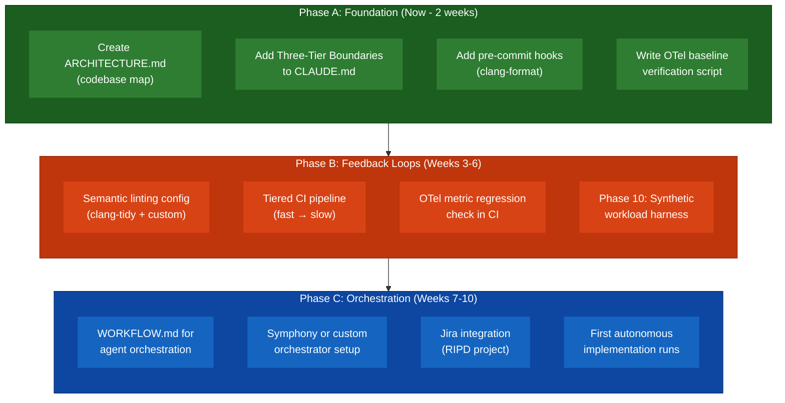

### 4.2 Effort Estimates

| Phase | Task                               | Effort     | Dependencies                       |
| ----- | ---------------------------------- | ---------- | ---------------------------------- |
| **A** | [ARCHITECTURE.md](ARCHITECTURE.md) | 2d         | None                               |
| **A** | CLAUDE.md boundaries update        | 0.5d       | None                               |
| **A** | Pre-commit hooks                   | 1d         | None                               |
| **A** | OTel baseline verification script  | 2d         | OTel Phases 1-6 merged             |
| **B** | Semantic linting config            | 2d         | Phase A complete                   |
| **B** | Tiered CI pipeline                 | 3d         | Phase A complete                   |
| **B** | Metric regression CI check         | 2d         | OTel Phase 7 merged                |
| **B** | Phase 10 synthetic workload        | 10d        | OTel Phase 9 merged                |
| **C** | [WORKFLOW.md](WORKFLOW.md)         | 1d         | Phases A+B complete                |
| **C** | Orchestrator setup                 | 3d         | [WORKFLOW.md](WORKFLOW.md) defined |
| **C** | Jira integration                   | 2d         | Orchestrator running               |
| **C** | First autonomous runs              | 2d         | Everything above                   |
|       | **Total**                          | **~30.5d** |                                    |

### 4.3 What to Do Immediately

These four items require no OTel dependencies and can start today:

1. **Create [`ARCHITECTURE.md`](ARCHITECTURE.md)** — 300-line codebase map covering the 5 layers (RPC, NetworkOPs, Consensus, Ledger, NodeStore), module directory map, entry points, and telemetry coverage map linking to `09-data-collection-reference.md`

2. **Add Three-Tier Boundaries to `CLAUDE.md`** — Explicit Always/Ask/Never categories (see Section 3.3 above)

3. **Add pre-commit hooks** — `clang-format` check + OTel span naming convention check

4. **Write `scripts/check-otel-baseline.sh`** — Script that starts the 5-node Docker stack, runs a synthetic workload, and validates all 16 spans are present with required attributes

---

## Part 5: Unique Advantages for rippled

### 5.1 Why rippled Is Especially Well-Suited

| Advantage                      | Explanation                                                                                        |
| ------------------------------ | -------------------------------------------------------------------------------------------------- |
| **Deterministic consensus**    | Consensus rounds produce predictable telemetry — ideal for regression detection                    |
| **Isolated test networks**     | 5-node validator harness gives agents a safe, isolated sandbox                                     |
| **Rich telemetry baseline**    | 16 spans + 300+ metrics + 8 dashboards = comprehensive "expected state"                            |
| **Protocol Buffer boundaries** | Wire format changes are explicit and lintable — agents can't silently break compatibility          |
| **Existing CLAUDE.md**         | Already have an agent instruction file — just needs boundary tiers                                 |
| **Modular plan docs**          | 10 architecture docs serve as deep reference material for [ARCHITECTURE.md](ARCHITECTURE.md) links |

### 5.2 Risks and Mitigations

| Risk                                               | Likelihood | Impact | Mitigation                                                                                 |
| -------------------------------------------------- | ---------- | ------ | ------------------------------------------------------------------------------------------ |
| Agent modifies consensus-critical code incorrectly | Medium     | High   | Three-tier boundary: consensus changes = "Ask" tier; OTel traces detect timing regressions |
| OTel verification adds CI time                     | Low        | Medium | Tiered pipeline — OTel checks only run after fast checks pass                              |
| Symphony/orchestrator maintenance burden           | Medium     | Medium | Start with manual agent runs using CLAUDE.md; orchestrator is Phase C                      |
| Metric baseline drift                              | Medium     | Low    | Regularly update baselines; use percentage thresholds not absolute values                  |
| C++ build times limit agent feedback speed         | High       | Medium | Incremental builds, ccache, focus on affected module tests first                           |

### 5.3 The Competitive Edge

Most blockchain projects have **no observability infrastructure at all**. The rippled OTel initiative gives the project:

1. **The only blockchain node with comprehensive OpenTelemetry instrumentation** — traces, metrics, logs, all correlated
2. **A deterministic verification layer** that AI agents can use to validate their own changes
3. **A path to autonomous development** where routine engineering tasks (bug fixes, feature additions, test expansion) can be handled by agents with proof-of-work requirements

This is not just observability — it's the foundation for **10x engineering velocity** through agent-first development.

---

## Part 6: OpenClaw and OpenFang — Agent Runtime Integration Opportunities

### 6.1 Project Overview

Two open-source projects in the agent ecosystem offer capabilities that map directly onto the harness engineering strategy:

| Project                                                 | Description                                                                                                                      | Language   | Stars | Key Insight                                                                                   |
| ------------------------------------------------------- | -------------------------------------------------------------------------------------------------------------------------------- | ---------- | ----- | --------------------------------------------------------------------------------------------- |
| **[OpenClaw](https://github.com/openclaw/openclaw)**    | Personal AI assistant platform with gateway, multi-channel inbox, skills system, and browser control                             | TypeScript | 296K  | Skills platform + multi-agent routing = harness orchestration layer                           |
| **[OpenFang](https://github.com/RightNow-AI/openfang)** | Agent Operating System — kernel-based architecture with autonomous "Hands," WASM sandbox, Merkle audit trail, 140+ API endpoints | Rust       | 13K   | Rust kernel + security-first design + built-in observability = production-grade agent harness |

### 6.2 OpenClaw: Skills-Based Agent Orchestration

OpenClaw's architecture is a **gateway-centric control plane** where agents connect via WebSocket, receive work, and execute through a skills system. Relevant capabilities for rippled:

**Skills Platform**

OpenClaw's managed skills system (ClawHub marketplace) maps to how rippled could package agent capabilities:

| OpenClaw Concept                  | rippled Harness Equivalent                                                                 |
| --------------------------------- | ------------------------------------------------------------------------------------------ |
| **Skill** (bundled capability)    | OTel verification script, lint checker, metric regression detector                         |
| **ClawHub** (skill marketplace)   | Internal skill registry for rippled-specific agent capabilities                            |
| **Workspace skills** (repo-local) | `scripts/` directory with harness verification tools                                       |
| **Agent routing** (per-channel)   | Route different issue types to specialized agents (RPC agent, consensus agent, test agent) |

**Multi-Agent Routing**

OpenClaw can route inbound messages to isolated agents with separate workspaces and sessions. For rippled:

- **RPC Layer Agent** — handles `src/xrpld/rpc/` changes, runs RPC-specific OTel span validation
- **Consensus Agent** — handles `src/xrpld/consensus/` changes, runs timing-sensitive verification, always in "Ask" tier
- **Test Agent** — handles test expansion, runs the full suite, validates coverage

**Session-to-Session Coordination**

OpenClaw's `sessions_send` tool enables agent-to-agent communication. A supervisor agent could:

1. Receive a Jira ticket via channel adapter
2. Analyze scope, spawn a specialist agent
3. Monitor progress, collect proof of work
4. Report results back via the channel

**Practical Fit**: OpenClaw is a **medium-term option (Phase C)** as an alternative to Symphony for agent orchestration. Its TypeScript stack is more approachable than Symphony's Elixir/BEAM, and the skills platform provides a natural packaging mechanism for rippled-specific harness tools.

### 6.3 OpenFang: Rust-Native Agent OS

OpenFang is architecturally the closest match to rippled's needs — a Rust-based kernel with security-first design, built for autonomous agents.

**Architecture Alignment**

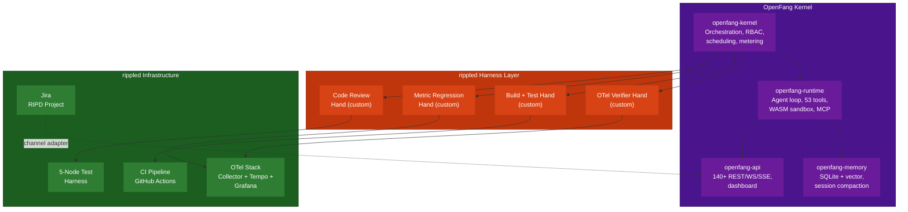

**Key OpenFang Features for rippled Harness Engineering**

| OpenFang Feature                                         | Harness Engineering Value                                                                                                    |
| -------------------------------------------------------- | ---------------------------------------------------------------------------------------------------------------------------- |
| **Hands** (autonomous capability packages)               | Package OTel verification, build validation, and metric regression detection as custom Hands that run on schedules           |
| **HAND.toml** (manifest with tools, metrics, guardrails) | Declaratively define what each harness agent can access, what metrics it reports, what actions need approval                 |
| **WASM Dual-Metered Sandbox**                            | Run agent-generated code in isolation — critical for a financial system like XRPL                                            |
| **Merkle Hash-Chain Audit Trail**                        | Cryptographic proof of every agent action — required for regulatory compliance in blockchain infrastructure                  |
| **16 Security Systems**                                  | Defense-in-depth (SSRF protection, secret zeroization, taint tracking) matches rippled's security requirements               |
| **MCP + A2A Protocol Support**                           | Native Model Context Protocol support means agents can use MCP servers to access rippled build tools, OTel queries, and Jira |
| **Capability Gates (RBAC)**                              | Map directly to Three-Tier Boundaries — declare what tools each agent role can use                                           |
| **Budget Tracking + Metering**                           | Track LLM API costs per agent per task — important for sustainable autonomous development                                    |
| **40 Channel Adapters**                                  | Connect to Jira, Slack, Discord for inbound work items and outbound status reports                                           |
| **Loop Guard**                                           | SHA256-based detection prevents agents from getting stuck in retry loops on failing builds                                   |

**Custom Hands for rippled**

The "Hands" concept (autonomous capability packages defined by `HAND.toml` + system prompt + `SKILL.md`) maps perfectly to harness engineering tasks:

```toml
# HAND.toml — OTel Verification Hand (conceptual)
[hand]
name = "otel-verifier"
description = "Validates OTel telemetry after code changes"
schedule = "on_pr"

[tools]
required = ["bash", "curl", "browser"]

[settings]
harness_nodes = 5
workload_duration_sec = 60
span_count_expected = 16
metric_regression_threshold_pct = 5.0

[guardrails]
require_approval = ["deploy_to_testnet", "modify_consensus_params"]

[dashboard]
metrics = ["spans_validated", "metrics_checked", "regressions_found"]
```

**Why OpenFang Over Symphony for rippled**

| Factor                 | Symphony (Elixir)                | OpenFang (Rust)                                                         |
| ---------------------- | -------------------------------- | ----------------------------------------------------------------------- |
| **Language alignment** | Elixir — foreign to rippled team | Rust — closer to C++ mindset, memory-safe systems language              |
| **Security model**     | Basic workspace isolation        | 16-layer defense-in-depth (WASM sandbox, taint tracking, audit trail)   |
| **Autonomous agents**  | Spawns external Codex            | Built-in autonomous Hands that run 24/7                                 |
| **Observability**      | Structured logs                  | Dashboard + 140+ API endpoints for monitoring agent runs                |
| **Audit trail**        | Git history                      | Merkle hash-chain — tamper-evident, suitable for regulated environments |
| **Install**            | Elixir runtime + Docker          | Single 32MB binary                                                      |
| **Agent memory**       | None built-in                    | SQLite + vector embeddings, session compaction                          |

### 6.4 Integration Strategy: OpenFang as the Primary Harness Runtime

**Recommended approach**: Use OpenFang as the agent operating system for rippled's harness engineering strategy, replacing Symphony in the Phase C orchestration layer.

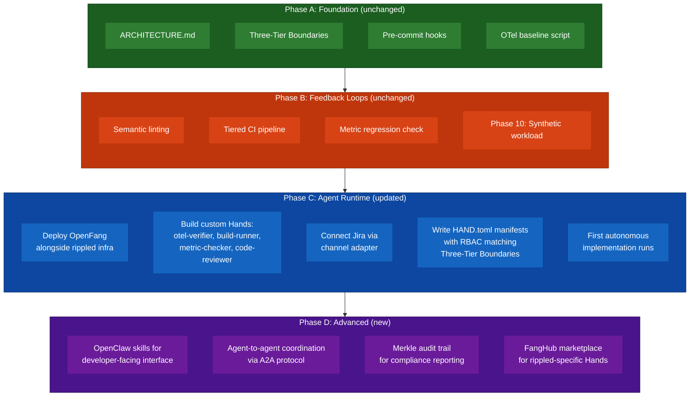

### 6.5 Comparative Summary

| Capability              | Symphony                 | OpenClaw                           | OpenFang                                  | Recommendation                                          |
| ----------------------- | ------------------------ | ---------------------------------- | ----------------------------------------- | ------------------------------------------------------- |
| **Agent Orchestration** | Polling + dispatch       | Gateway + routing                  | Kernel + scheduler                        | OpenFang for autonomous, OpenClaw for interactive       |
| **Security**            | Basic isolation          | DM pairing, allowlists             | 16-layer defense-in-depth                 | OpenFang — critical for financial infrastructure        |
| **Observability**       | Structured logs          | Logging                            | Dashboard + 140 API endpoints             | OpenFang — aligns with OTel investment                  |
| **Proof of Work**       | CI status, PR review     | N/A                                | Merkle hash-chain audit trail             | OpenFang — cryptographic proof                          |
| **Developer UX**        | Elixir CLI               | Multi-channel (Slack, Discord)     | CLI + Tauri desktop + 40 channels         | OpenClaw for notification layer, OpenFang for execution |
| **rippled Fit**         | Good (designed for this) | Medium (general-purpose assistant) | Strong (Rust, security-first, autonomous) | **OpenFang primary, OpenClaw supplementary**            |

### 6.6 Recommended Architecture: Dual-Layer Setup

The optimal configuration uses **both** projects in complementary roles:

- **OpenFang** = **execution layer** — runs autonomous Hands for build verification, OTel validation, metric regression detection, and code review. Handles the "harness" in harness engineering.
- **OpenClaw** = **communication layer** — developer-facing interface via Slack/Discord. Developers chat with OpenClaw to ask about agent status, trigger manual runs, review proof-of-work summaries. OpenClaw routes to OpenFang's API for execution.

This mirrors OpenAI's own separation: Symphony handles orchestration (like OpenFang), while the developer interacts through a surface (like OpenClaw) to review and approve work.

---

## Part 7: MCP Integrations — Connecting Bug Reporting, Bounty, and CI Platforms

### 7.1 The MCP Bridge

The Model Context Protocol (MCP) is the glue that connects autonomous agents to external platforms. For rippled's harness engineering strategy, three MCP servers form the critical integration layer between agents and the project's existing workflows:

| MCP Server                                                                    | Provider             | Stars | Capabilities                                                                                                                     |
| ----------------------------------------------------------------------------- | -------------------- | ----- | -------------------------------------------------------------------------------------------------------------------------------- |
| **[GitHub MCP Server](https://github.com/github/github-mcp-server)**          | GitHub (official)    | 27K   | 18 toolsets: repos, issues, PRs, actions, code_security, secret_protection, security_advisories, notifications, labels, and more |
| **[Atlassian MCP Server](https://github.com/atlassian/atlassian-mcp-server)** | Atlassian (official) | 400+  | Jira (search/create/update issues via JQL), Confluence (pages, search via CQL), Compass (components), OAuth 2.1 + API token auth |
| **[mcp-atlassian](https://github.com/sooperset/mcp-atlassian)**               | Community            | 4.5K  | Jira + Confluence with broader client compatibility (Claude Code, VS Code, Cursor)                                               |

### 7.2 The Existing Bug Reporting Pipeline

rippled already has a well-defined vulnerability reporting structure (from [SECURITY.md](https://github.com/XRPLF/rippled/blob/develop/SECURITY.md)):

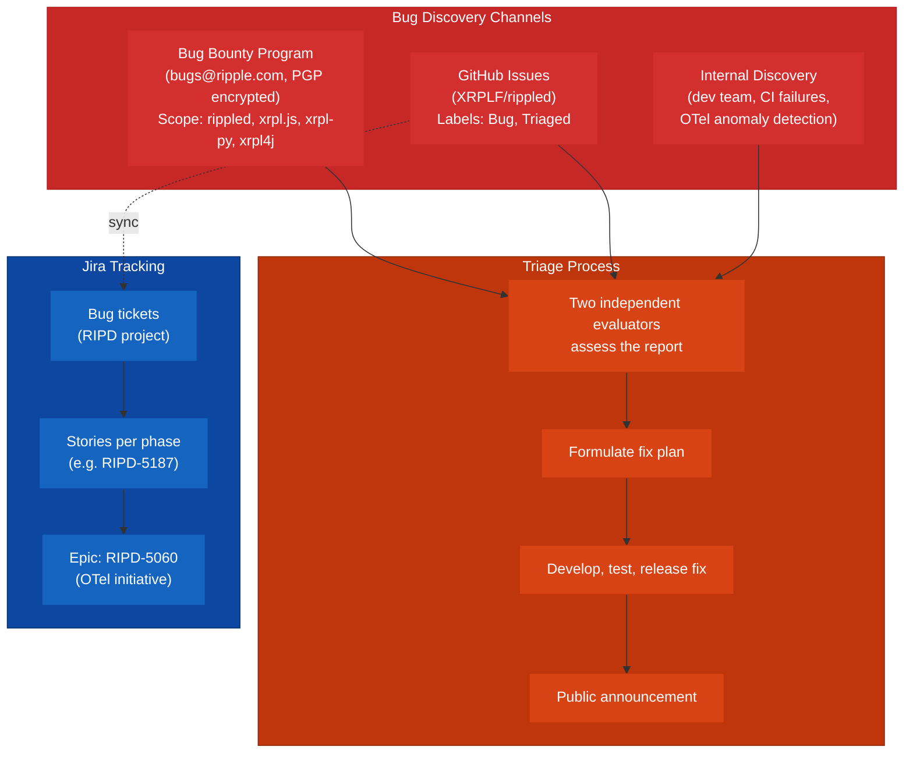

**Key characteristics of the current pipeline:**

- **Bug bounty** is email-based (PGP-encrypted to `bugs@ripple.com`) — not on a platform like Immunefi or HackerOne
- **Scope** covers rippled, xrpl.js, xrpl-py, xrpl4j — security issues only (funds, privacy, network operation)
- **Triage** requires two independent evaluators, private reporter communication, and a coordinated disclosure timeline
- **GitHub Issues** track public bugs with `Bug` and `Triaged` labels
- **Jira (RIPD project)** tracks internal engineering work, with epics (RIPD-5060 for OTel) and stories per phase

### 7.3 GitHub MCP Server — CI, PRs, and Security Integration

The [GitHub MCP Server](https://github.com/github/github-mcp-server) (official, Go-based) gives agents direct access to the rippled repository through 18 toolsets. The harness-relevant toolsets:

| Toolset                   | Harness Engineering Use                                                                                             |
| ------------------------- | ------------------------------------------------------------------------------------------------------------------- |
| **`actions`**             | Monitor CI workflow runs, detect build failures, analyze flaky tests — feeds into Fail-Fast Feedback (Principle #4) |
| **`issues`**              | Read bug reports, extract reproduction steps, link to related PRs — automates triage intake                         |
| **`pull_requests`**       | Create PRs with proof-of-work evidence, read review comments, update PR descriptions — core autonomous workflow     |
| **`code_security`**       | Access Code Scanning alerts (CodeQL) — agents can detect and fix security findings autonomously                     |
| **`secret_protection`**   | Check for exposed secrets — critical for a financial system; agent can flag and remediate immediately               |
| **`security_advisories`** | Read/create security advisories — connects to bug bounty reporting flow                                             |
| **`repos`**               | Browse code, search files, analyze commits — supports codebase exploration during implementation runs               |
| **`labels`**              | Apply triage labels (`Bug`, `Triaged`, `Security`) — automates issue categorization                                 |

**Agent workflow with GitHub MCP:**

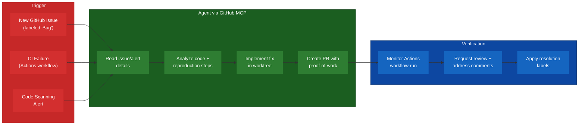

### 7.4 Jira MCP Server — Work Tracking and Sprint Integration

Two options for Jira integration:

| Server                                                                                   | Best For                                                                |
| ---------------------------------------------------------------------------------------- | ----------------------------------------------------------------------- |
| **[Atlassian MCP Server](https://github.com/atlassian/atlassian-mcp-server)** (official) | Production — OAuth 2.1, Atlassian-hosted, respects all Jira permissions |
| **[mcp-atlassian](https://github.com/sooperset/mcp-atlassian)** (community, 4.5K stars)  | Development — broader client support, self-hosted, faster iteration     |

**Jira MCP enables agents to:**

- **Read RIPD tickets** — pull acceptance criteria, linked PRs, priority, and sprint assignment via JQL queries
- **Create bug tickets** — when an agent discovers a regression during OTel validation, auto-create a RIPD bug ticket with telemetry evidence (span diff, metric deviation, dashboard screenshot URL)
- **Update ticket status** — transition tickets through the workflow (Open -> In Progress -> In Review -> Done) as the agent progresses
- **Link PRs to tickets** — automatically add PR links to Jira tickets (never the reverse, per project rules)
- **Search for context** — JQL queries like `project = RIPD AND labels = otel AND status != Done` to find related work

**Recommended AGENTS.md/CLAUDE.md configuration for Jira MCP:**

```markdown
## Atlassian Rovo MCP

When connected to atlassian-rovo-mcp:

- **MUST** use Jira project key = RIPD
- **MUST** use cloudId for the Ripple Atlassian instance
- **MUST** use `maxResults: 10` for all JQL search operations
- **MUST** link PRs TO Jira tickets, never Jira tickets INTO PRs
- **MUST NOT** create or modify Security-labeled tickets without human approval
```

### 7.5 Bug Bounty Pipeline — Agent-Assisted Triage

The bug bounty program's email-based intake is inherently manual, but agents can accelerate the downstream process once a report enters the system:

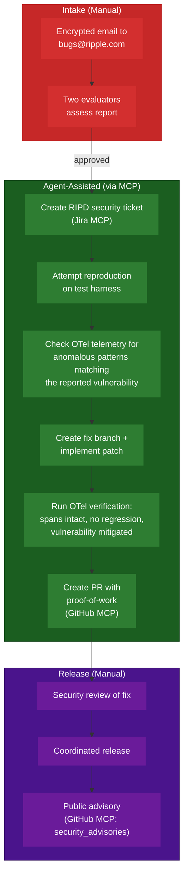

**Key boundaries for security work:**

| Action                                        | Tier       | Rationale                            |
| --------------------------------------------- | ---------- | ------------------------------------ |
| Read bounty ticket details from Jira          | **Ask**    | Security-sensitive content           |
| Attempt reproduction on isolated test harness | **Always** | Sandboxed, no production risk        |
| Check OTel telemetry for matching anomalies   | **Always** | Read-only query                      |
| Create fix branch and implement patch         | **Always** | Isolated worktree                    |
| Run OTel verification suite                   | **Always** | Deterministic, sandboxed             |
| Create PR for security fix                    | **Ask**    | Visibility to others                 |
| Publish security advisory                     | **Never**  | Must be human-coordinated disclosure |
| Modify cryptographic code                     | **Never**  | Per existing Three-Tier Boundaries   |

### 7.6 Proactive Bug Detection via OTel + MCP

The most powerful integration is agents that **find bugs before they're reported**, using OTel telemetry as a continuous health signal:

| Detection Pattern                | OTel Signal                                     | Agent Action (via MCP)                                                                                                              |
| -------------------------------- | ----------------------------------------------- | ----------------------------------------------------------------------------------------------------------------------------------- |
| Latency spike on `rpc.submit`    | Span duration > p99 threshold                   | Create GitHub Issue (GitHub MCP), create RIPD ticket (Jira MCP), investigate root cause                                             |
| Consensus round timeout          | `consensus.round` span exceeds tolerance        | Alert via Slack (OpenClaw), create high-priority Jira ticket, run diagnostic on test harness                                        |
| Transaction relay failure        | `tx.relay` span missing child `peer.send` spans | Investigate overlay connectivity, create bug report with trace evidence                                                             |
| Metric regression after PR merge | Prometheus metric deviation > 5%                | Comment on merged PR (GitHub MCP), create regression ticket (Jira MCP), attempt automated revert                                    |
| Code scanning alert              | GitHub CodeQL finding                           | Read alert details (GitHub MCP), assess severity, create fix PR if low-risk, escalate if high-risk                                  |
| Secret exposure                  | GitHub secret scanning alert                    | Immediately flag (GitHub MCP), create urgent Jira ticket, agent must NOT attempt to remediate secrets autonomously (**Never** tier) |

### 7.7 MCP Configuration for the Harness

**Recommended MCP server configuration for Claude Code / agent runtimes:**

```json
{
  "mcpServers": {
    "github": {
      "type": "http",
      "url": "https://api.githubcopilot.com/mcp/",
      "toolsets": [
        "repos",
        "issues",
        "pull_requests",
        "actions",
        "code_security",
        "secret_protection",
        "security_advisories",
        "labels",
        "notifications"
      ]
    },
    "atlassian": {
      "type": "http",
      "url": "https://mcp.atlassian.com/v1/mcp",
      "note": "OAuth 2.1 — scoped to RIPD project"
    }
  }
}
```

**For OpenFang integration**, these MCP servers connect natively via OpenFang's MCP support, enabling Hands to:

- Poll Jira for new RIPD tickets matching `type = Bug AND status = Open`
- Read GitHub Issues labeled `Bug` for reproduction steps
- Create PRs with proof-of-work after verification passes
- Monitor GitHub Actions for CI status on agent-created PRs

### 7.8 End-to-End: From Bug Report to Verified Fix

Putting it all together — the complete harness-engineered bug lifecycle:

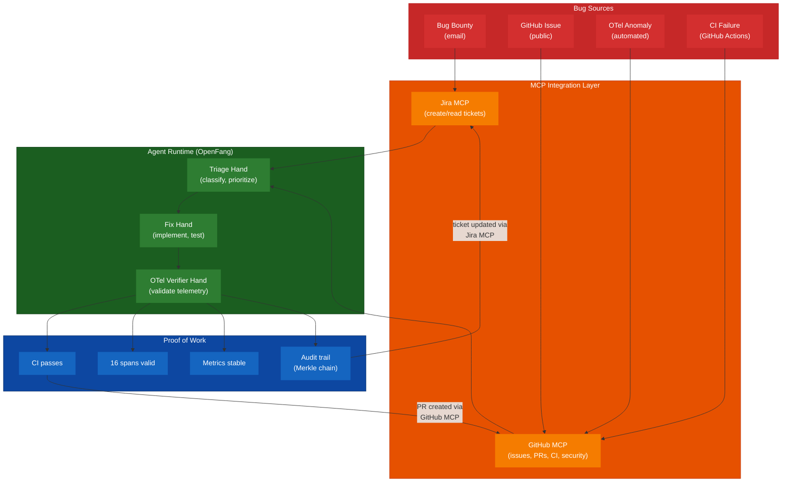

---

## Appendix A: Key Resources

| Resource                        | URL                                                                                                      |
| ------------------------------- | -------------------------------------------------------------------------------------------------------- |
| OpenAI Harness Engineering Blog | https://openai.com/index/harness-engineering/                                                            |
| Symphony Framework              | https://github.com/openai/symphony                                                                       |
| Symphony Spec                   | https://github.com/openai/symphony/blob/main/SPEC.md                                                     |
| Agentic Harness Bootstrap       | https://github.com/synthnoosh/agentic-harness-bootstrap                                                  |
| Awesome Agent Harness           | https://github.com/AutoJunjie/awesome-agent-harness                                                      |
| OpenClaw (Agent Assistant)      | https://github.com/openclaw/openclaw                                                                     |
| OpenFang (Agent OS)             | https://github.com/RightNow-AI/openfang                                                                  |
| GitHub MCP Server (official)    | https://github.com/github/github-mcp-server                                                              |
| Atlassian MCP Server (official) | https://github.com/atlassian/atlassian-mcp-server                                                        |
| mcp-atlassian (community)       | https://github.com/sooperset/mcp-atlassian                                                               |
| rippled SECURITY.md             | https://github.com/XRPLF/rippled/blob/develop/SECURITY.md                                                |
| rippled OTel PR Chain           | #6436 -> #6437 -> #6438 -> #6424 -> #6425 -> #6426 -> #6427 -> #6433 -> #6439 -> #6493 -> #6494 -> #6513 |
| rippled OTel Plan Docs          | `OpenTelemetryPlan/` directory (10 documents)                                                            |

## Appendix B: Harness Engineering Ecosystem

The broader ecosystem emerging around harness engineering:

| Category               | Tools                                                                                  |
| ---------------------- | -------------------------------------------------------------------------------------- |
| **Agent OS/Runtime**   | **OpenFang** (Rust, autonomous Hands), **OpenClaw** (TS, skills + gateway)             |
| **Orchestrators**      | Symphony (OpenAI), Vibe Kanban, Emdash, Warp, VibeHQ                                   |
| **Task Runners**       | Symphony, Baton, Axon, GitHub Copilot Coding Agent                                     |
| **Coding Agents**      | Claude Code, Codex, OpenCode, Gemini CLI, Kiro, Amp, Cursor                            |
| **Spec/Requirements**  | Kiro IDE, OpenSpec, agents.md, AGENTS.md                                               |
| **Protocols**          | MCP (Model Context Protocol), ACP (Agent Communication Protocol), A2A (Agent-to-Agent) |
| **Harness Frameworks** | Deep Agents, Gambit, Harness Kit, Bridle                                               |

## Appendix C: Glossary

| Term                           | Definition                                                                                       |
| ------------------------------ | ------------------------------------------------------------------------------------------------ |
| **Harness Engineering**        | Building infrastructure around AI coding agents to enable reliable autonomous development        |
| **Proof of Work**              | Evidence that an agent's changes are correct: CI pass, metric stability, trace validity          |
| **Three-Tier Boundaries**      | Categorizing agent actions into Always (autonomous), Ask (confirm), Never (forbidden)            |
| **[WORKFLOW.md](WORKFLOW.md)** | Version-controlled file defining agent orchestration policy, prompt template, and runtime config |
| **Implementation Run**         | A complete autonomous cycle: read issue -> implement -> verify -> PR                             |
| **Semantic Linting**           | Linter errors that include enough context for an agent to fix the violation in one attempt       |
| **Architecture Map**           | A concise document (`ARCHITECTURE.md`) telling agents where things are in the codebase           |
| **MCP**                        | Model Context Protocol — standard for connecting AI agents to external tools and data sources    |
| **MCP Server**                 | A service exposing tools/resources via MCP that agents can invoke (e.g., GitHub MCP, Jira MCP)   |
| **Bug Bounty**                 | Program rewarding external researchers for responsibly disclosing security vulnerabilities       |
| **Hand**                       | OpenFang's autonomous capability package — bundles tools, prompts, guardrails, and schedules     |
