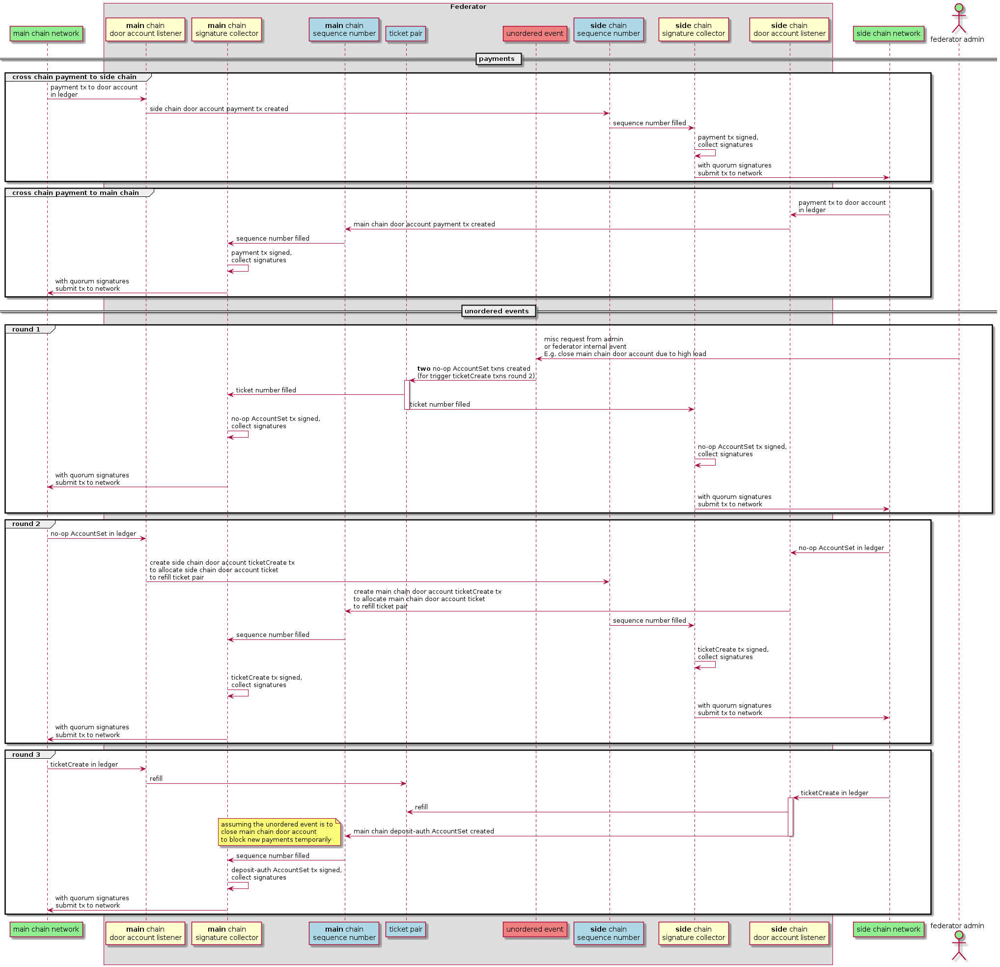

# Introduction

This document covers the design of side chains using the XRP ledger. It covers
the implementation of federators, how federators are initially synced and kept
in sync, how cross chain transactions work, and how errors are handled. It does
not give a high level overview of side chains or describe their benefits.

# Terminology

_federator_: A server that listens for triggering transactions on both the main
chain and the side chain. Each federator has a signing key associated with it
that is used to sign transactions. A transaction must be signed by a quorum of
federators before it can be submitted. Federators are responsible for creating
and signing valid response transactions, collecting signatures from other
federators, and submitting transactions to the main chain and side chain.

_main chain_: Ledger where assets originate and where assets will be locked
while used on the side chain. For most applications, the main chain will be the
XRP ledger mainnet.

_side chain_: Ledger where proxy assets for the locked main chain assets are
issued. Side chains may have rules, transactors, and validators that are very
different from the main chain. Proxy assets on the side chain can be sent back
to the main chain where they will be be unlocked from the control of the
federators.

_door account_: Account controlled by the federators. There are two door
accounts: one on the main chain and one on the side chain. Cross chain
transactions are started by users sending assets to a door account. Main chain
to side chain transactions cause the balance to increase on the main chain door
account and the balance to decrease on the side chain door account. It is called
a "door" because it is the mechanism to move assets from one chain to another -
much like going between rooms in a house requires stepping through a door.

_triggering transaction_: A transaction that causes the federators to start the
process of signing and submitting a new response transaction. For example,
sending XRP to the main chain's door account is a triggering transaction that
will cause the federators to submit a new transaction on the side chain.

_response transaction_: A transaction submitted by the federators in reaction to
a triggering transaction. Note that _triggering transaction_ and _response
transaction_ depends on context. Sending XRP from a _door account_ to a user
account is a _response transaction_ when thinking about cross chain
transactions. It is a _triggering transaction_ when thinking about how to handle
failed transactions.

# New RPC Command is a key primitive

Side chains introduce a new subscription stream called
"account_history_tx_stream". Given an account, this streams both new
transactions and historical transactions from validated ledgers back to the
client. The transactions are streamed in order and without gaps, and each
transaction is given a numeric id. New transactions start at id 0 and continue
in the positive direction. Historical transaction start at id -1 and continue in
the negative direction. New transactions are sent in the same order as they were
applied to the ledger, and historical tranasations are in the reverse order they
were applied to the ledger. The server will continue to stream historical
transaction until it reaches the account's first transaction or the user sends a
command signaling that historical transactions are no longer needed. This can be
done without closing the stream, and new transactions will continue to be sent.
Note that these transactions include all the transactions that effect the
account, not just triggering and response transactions.

It's important to note that while historical and new transactions may be
interleaved in the stream, there are never any gaps in the transactions.
Transaction 7 MUST be sent before transaction 8, and transaction -7 MUST be sent
before transaction -8.

This is the key primitive that allows federators to agree on transaction
values - transaction types, sequence numbers, asset amounts, and destination
addresses - without communicating amung themselves (of course signing
transaction requires communication). Since the transactions are from validated
ledgers, all the federators will see the same transactions in the same order.

# Federators

## Federator Introduction

A federator acts as a bridge between a main chain and a side chain. Through a
multi-signature scheme, the federators collectively control an account on the
main chain and an account on the side chain. These accounts are called door
accounts. A federator listens for transactions on these door accounts. When a
federator hears a triggering transaction, it will eventually submit a new
response transaction that completes the triggering transaction.

Initially, the federators will live in the same executable as the side chain
validators. However, the proposed implementation purposely does not take
advantage of this fact. The motivation for this is:

1. It makes it easy to eventually separate out the federator implementation from
   side chain validators.
2. The side chain to main chain transactions will be implemented the same way as
   the main chain to side chain transactions. Building and maintaining one
   implementation is preferable to maintaining two implementations.

## Keeping the federators in sync

Federators decide to sign transactions by using the "account_history_tx_stream"
to listen for transactions on each chain. New transactions on the main chain
will cause a federator to sign a transaction meant for the side chain.
Similarly, new transactions on the side chain will cause a federator to sign a
transaction meant for the main chain. As a concrete example, consider how XRP is
locked on the main chain and distributed on a side chain. A user sends XRP to
the main chain door account. This causes the federators to submit a transaction
sending XRP to a destination on the side chain. Recall that a transaction that
causes a federator to sign a transaction is called a triggering transaction, and
a transaction created to handle a triggering transaction is called a response
transaction. In the example above, the user sending XRP on the main chain is a
triggering transaction and the tranasaction created by the federators and
submitted on the side chain is a response transaction.

When a new triggering transaction is detected, a federator needs to create a
response transaction. The fee, destination address, and amount are all known.
The only value that isn't fixed or derived from the triggering transaction is
the account sequence number. It is easy to agree on a sequence number. But first
let's show that stream of triggering transactions are the same for all the
validators.

Notice that a response transaction is always on the opposite chain as the
corresponding triggering transaction. If a response transaction could be on
either chain, then there would be timing issues. Consider what would happen if
two triggering transaction came in, one from the main chain and one from the
side chain, and both of these triggering transactions required response
transactions on the main chain. Since there are separate transaction streams
comming from the main chain and side chain, different federators may see these
transaction arrive in different orders. However, since triggering and response
transactions are on different chains, the federators don't need to deal with
this case. (Note: there is at one response transaction that is needed in
exceptional circumstances that violates this. Tickets are used to handle this
transactions and will be described later).

Also notice that "account_history_tx_stream" delivers transactions in the order
they were applied to the ledger without gaps.

This means that once a federator is in a state where it knows what sequence
number should be used for the next response transaction (call it S), it will
know the sequence number for all the subsequent response transactions. It will
just be S+1, S+2, S+3, ect. Also notice that once in sync all the federators
will see the same transactions in the same order. So all the federators will
create the same response transactions and in the same order.

## Getting a federator in sync

When a federator joins the network, it doesn't know which triggering
transactions it needs to sign and it doesn't know what sequence numbers should
be used for response transactions. The "account_history_tx_stream" can be used
to find this information and get the federator to a state where it can start
signing and submitting transactions.

While getting into sync, a federator collects historical and new transactions
from both the side chain and main chain. Each transaction has an id that is used
to keep the transactions in the same order they were applied to the ledger, and
the collections are kept in this order.

One piece of information a syncing federator needs to find is which triggering
transactions need to be treated as new and which ones have already been handled.
This is easily found by looking at the historical transaction from the
"account_history_tx_stream". The first time a response transaction is found,
the hash of associated triggering transaction is noted (this is be recorded as
a memo in the response transaction). All the triggering transactions that
precede the noted triggering transaction have already been handled. The
"account_history_tx_stream" must continue to stream historical transactions at
least until the first response transaction is found. For example, if the first
observed response transaction on the main chain has hash `r_hash_mainchain`
and associated triggering transaction of `t_hash_sidechain`, that means we know
all the triggering transactions on the side chain before `t_hash_sidechain` have
been handled (including `t_hash_sidechain`).

Another set of data that needs to be collected are all the historical
triggering transactions that come after `t_hash` (see above). Of course,
`t_hash` comes from the "account_history_tx_stream" from one chain, and the
triggering transactions come from the other chain. This means more
transactions than needed may be gathered.

Historical transaction continue to be streamed until the triggering transaction
associated with `t_hash_this_chain` is found and value of `t_hash_other_chain`
is found. For example, the main chain will continue to collect historical
transaction until:

1) The side chain stream has found a response transaction and informed the main
chain of the hash of the associated triggering transaction.

2) The side chain stream has found that triggering transaction.

3) This main chain stream has found a response transaction and informed the side
chain syncing algorithm of the associated triggering transaction.

The above description does not handle the case where the start of histoical
transactions is reached without finding any response transactions. If this
happens then the other chain must also collect all the historical transactions,
since we cannot show that triggering transaction has ever been handled.

Once this data has been collected, a command will be sent to ask the
"account_history_tx_stream" to stop sending historical transaction (Note:
without closing the stream. If the stream were closed it would be possible to
miss a transaction). Starting from the transaction after the `t_hash`
transaction, the collected triggering transaction will be iterated in the order
they were applied to the ledger and treated as if they were newly arrived from
the transaction stream. Once this is done the federator is synced and can switch
to handling new transactions normally.

As long as there are regular cross chain transactions being sent from both the
main chain and the side chain, the above procedure doesn't require too many
historical transactions. However, if one chain almost never sends cross chain
transactions then the syncing procedure is not as effiecient as it could be. As
an extreme example, consider a main chain that sends cross chain transactions to
a side chain, and the side chain never sends cross chain transactions back.
Since there would be no response transactions on the main chain, the sync
algorithm would fetch all of the main chain transactions. One way to improve
this situation is for the federators to checkpoint the last known response
transaction and its corresponding triggering transactions. If they did this
individually, then on startup a federator would need to fetch at most as much
history as the time it was down. If they did this as a group (by adding a new
ledger object on the side chain, for example), then syncing could require much
less history. For now, these strategies are not used. The benefits of a simplier
implementations and not adding any new ledger objects outweighted the benefits
of faster syncing for some types of sidechains.

## Federator Implementation

The Federator is an event loop that services events sent to it from the
listeners. Events are handed in the `mainLoop` method. This runs on a separate
thread. It runs on a separate thread so all the event handlers run on the order
they were received on and on the same thread.

### Federator Events

A `Federator` event is a `std::variant` of all the event types. The current
event types are:

* `XChainTransferDetected`. This is added when a federator detects the start of
  cross chain transaction. 
```c++
struct XChainTransferDetected
{
    // direction of the transfer
    Dir dir_;
    // Src account on the src chain
    AccountID src_;
    // Dst account on the dst chain
    AccountID dst_;
    STAmount deliveredAmt_;
    std::uint32_t txnSeq_;
    uint256 txnHash_;
    std::int32_t rpcOrder_;

    EventType
    eventType() const;

    Json::Value
    toJson() const;
};
```

* `XChainTransferResult`. This is added when a federator detects the end of a
  cross chain transaction.
```c++
struct XChainTransferResult
{
    // direction is the direction of the triggering transaction.
    // I.e. A "mainToSide" transfer result is a transaction that
    // happens on the sidechain (the triggering transaction happended on the
    // mainchain)
    Dir dir_;
    AccountID dst_;
    std::optional<STAmount> deliveredAmt_;
    std::uint32_t txnSeq_;
    // Txn hash of the initiating xchain transaction
    uint256 srcChainTxnHash_;
    // Txn has of the federator's transaction on the dst chain
    uint256 txnHash_;
    TER ter_;
    std::int32_t rpcOrder_;

    EventType
    eventType() const;

    Json::Value
    toJson() const;
};
```

* `RefundTransferResult`. This is added when a federator detects the end of a
  refund transactions. Refunds may occur if there is an error transfering funds
  at the end of a cross chain transaction.
```c++
struct RefundTransferResult
{
    // direction is the direction of the triggering transaction.
    // I.e. A "mainToSide" refund transfer result is a transaction that
    // happens on the mainchain (the triggering transaction happended on the
    // mainchain, the failed result happened on the side chain, and the refund
    // result happened on the mainchain)
    Dir dir_;
    AccountID dst_;
    std::optional<STAmount> deliveredAmt_;
    std::uint32_t txnSeq_;
    // Txn hash of the initiating xchain transaction
    uint256 srcChainTxnHash_;
    // Txn hash of the federator's transaction on the dst chain
    uint256 dstChainTxnHash_;
    // Txn hash of the refund result
    uint256 txnHash_;
    TER ter_;
    std::int32_t rpcOrder_;

    EventType
    eventType() const;

    Json::Value
    toJson() const;
};
```

* `StartOfHistoricTransactions`. This is added when a federator detects that
  there are no more historic transactions left to receive in a stream of
  transactions. This is used when a federator initially syncs to the network.

```c++
struct StartOfHistoricTransactions
{
    bool isMainchain_;

    EventType
    eventType() const;

    Json::Value
    toJson() const;
};
```

* `TicketCreateResult`. This is added when the federator detects a ticket create
  transaction.
```
struct TicketCreateResult
{
    Dir dir_;
    bool success_;
    std::uint32_t txnSeq_;
    std::uint32_t ledgerIndex_;
    uint256 srcChainTxnHash_;
    uint256 txnHash_;
    std::int32_t rpcOrder_;

    std::uint32_t sourceTag_;
    std::string memoStr_;

    EventType
    eventType() const;

    Json::Value
    toJson() const;

    void
    removeTrigger();
};
```

* `DepositAuthResult`. This is added when the federator detects a deposit auth
  transaction. Deposit auth is used to pause cross chain transactions if the
  federators fall too far behind.
```
struct DepositAuthResult
{
    Dir dir_;
    bool success_;
    std::uint32_t txnSeq_;
    std::uint32_t ledgerIndex_;
    uint256 srcChainTxnHash_;
    std::int32_t rpcOrder_;

    AccountFlagOp op_;

    EventType
    eventType() const;

    Json::Value
    toJson() const;
};
```

* `BootstrapTicket`. This is added when the federator detects one of the initial
  ticket transactions that is added during account setup.
```
struct BootstrapTicket
{
    bool isMainchain_;
    bool success_;
    std::uint32_t txnSeq_;
    std::uint32_t ledgerIndex_;
    std::int32_t rpcOrder_;

    std::uint32_t sourceTag_;

    EventType
    eventType() const;

    Json::Value
    toJson() const;
};
```

* `DisableMasterKeyResult`. This is added when the federator detects an
  `AccountSet` transaction that disables the master key. Transactions that come
  before this are assumed to be part of account setup.
```
struct DisableMasterKeyResult
{
    bool isMainchain_;
    std::uint32_t txnSeq_;
    std::int32_t rpcOrder_;

    EventType
    eventType() const;

    Json::Value
    toJson() const;
};
```

* `HeartbeatTimer`. This is added at regular intervals and is used to trigger
  evants based on timeouts.

### Federator Event Handling

Handling the events is very simple. The `mainLoop` pops events off the event
queue and dispatches it to an event handler. There is one event handler for each
event type. There is also some logic to prevent busy waiting.

```c++
void
onEvent(event::XChainTransferDetected const& e);
void
onEvent(event::XChainTransferResult const& e);
void
onEvent(event::RefundTransferResult const& e);
void
onEvent(event::HeartbeatTimer const& e);
void
onEvent(event::StartOfHistoricTransactions const& e);

void
Federator::mainLoop()
{
    FederatorEvent event;
    while (!requestStop_)
    {
        if (!events_.pop(event))
        {
            using namespace std::chrono_literals;
            // In rare cases, an event may be pushed and the condition
            // variable signaled before the condition variable is waited on.
            // To handle this, set a timeout on the wait.
            std::unique_lock l{m_};
            cv_.wait_for(
                l, 1s, [this] { return requestStop_ || !events_.empty(); });
            continue;
        }
        std::visit([this](auto&& e) { this->onEvent(e); }, event);
    }
}
```

Events are added to a queue in the `push` method. 
```c++
void
Federator::push(FederatorEvent const& e)
{
    bool const notify = events_.empty();
    events_.push(e);
    if (notify)
    {
        std::lock_guard<std::mutex> l(m_);
        cv_.notify_one();
    }
}
```

Due the threading and lifetime issues, `Federator` is kept as a `shared_ptr`
inside of the app and enables `shared_from_this`. Since `shared_from_this`
cannot be used from a constructor, it uses two-phase initialization of a
constructor and an `init` function. These constructors are private, and objects
are created with a `make_federator` function that implements the two-phase
initialization. (Note: since `make_shared` cannot call a private constructor, a
private `PrivateTag` is used instead.)

### Federator Listeners

There are two listener classes: a `MainchainListener` and a `SidechainListener`
(both inherit from a common `ChainListener` class where much of the
implementation lives). These classes monitor the chains for transactions on the
door accounts and add the appropriate event to the federator. The
`MainchainListener` uses a websocket to monitor transactions. Since the
federator lives in the same executable as the side chain validators,
`SidechainListener` used `InfoSub` directly rather than a websocket.

The federator is kept as `weak_ptr` in this class. Since these class will be used
as part of a callback from different threads, both listener classes enable
`shared_from_this`. 

### Federator WebsocketClient

The `WebsocketClient` class takes an asio `io_service`, main chain server ip and
port, and callback. When a command response or new stream result is received,
the callback is executed (is will be called from the `io_service` thread). The
`MainchainListener` uses this class to listen for transactions.
This class is also be used to send transactions to the main chain.
```c++
    WebsocketClient(
        std::function<void(Json::Value const&)> callback,
        boost::asio::io_service& ios,
        boost::asio::ip::address const& ip,
        std::uint16_t port,
        std::unordered_map<std::string, std::string> const& headers = {});
```

# Triggering Transaction Handler

The triggering transaction handler is part of a single-threaded event loop that
responds to events triggered from the different chains. It is single-threaded so
there's no danger of events being processed out-of-order and for simplicity of
code. Note that event handlers are not computationally intensive, so there would
be little benefit to multiple threads.

When a new event is handled, a response transaction may be prepared. Apart from
the sequence number, all the values of a response transaction can be determined
from the trigging transaction, and it does not require communicating with the
other federators. For example, when sending assets between chains, the response
transaction will contain an amount equal to the XRP `delivered_amt` in the
triggering transaction, a fixed fee, and a memo with the hash of the cross chain
transaction. The memo is important because it creates a transaction unique to
the triggering cross chain transaction, and it safer to sign such a transaction
in case sequence numbers somehow get out of sync between the federators. The
`LastLedgerSequence` field is not be set.

Next the federator will sign these transactions and send its signature to its
peers. This happens in another thread so the event loop isn't slowed down.

Next the federator adds its signatures to the txn in the `pending transactions`
collection for the appropriate chain. See [Adding a signature to Pending
Transactions](#adding-a-signature-to-pending-transactions)

If it doesn't have enough signatures to complete the multi-signature, the
federator will add signatures by listening for signature messages from other
peers see the [Collecting Signatures](#collecting-signatures) section.

## Collecting Signatures

A federator receives signatures by listening to peer messages. Signatures are
automatically sent when a federator detects a new cross chain transaction.

When a federator receives a new signature, it forwards it to its peers that have
not already received this signature from this federator.

Next it checks if this transaction has already been handled. If so, it does
nothing further.

Next the federator adds the signature to the txn in the `pending transactions`
collection. See [Adding a signature to Pending
Transactions](#adding-a-signature-to-pending-transactions).

Note that a federator may receive multiple signatures for the same transaction
but with different sequence numbers. This should only happen if a federator
somehow has the wrong sequence number and is later corrected.

## Adding a signature to Pending Transactions

The `pending transactions` collections stores the transactions that do not yet
have enough signatures to be submitted or have not been confirmed as sent. There
is one collection for the main chain and one for the side chain. The key to this
collection is a hash of the triggering transaction, but with a sequence of zero
and a fee of zero (remember that this transaction has a memo field with the hash
of the cross chain transaction, so it is unique). It is hashed this way to
detect inconsistent sequence numbers and fees. The `value` of this collection is
a struct that contains this federators signature (if available) and another map
with a `key` of sequence number and fee, and a `value` of a collection of
signatures. Before adding a signature to this collection, if the signature is
not on the multi-signature list, it is discarded. The signature is also checked
for validity. If it is invalid, it is discarded.

After adding a signature to this collection it checks if it this signature is
for a transaction with the same sequence number and fee as this federator, and
if has enough signatures for a valid multi-signed transaction. If so, the
transactions are added to the `queued transactions` collection for the
appropriate chain and the function to submit transactions is called (see
[Transaction Submit](#transaction-submit)).

If the transaction has enough signature for a valid multi-signed transaction,
and the sequence and fee _do not_ match the ones from this federator, then this
federator sequence number must be out of sync with the rest of the network. If
it is detected, the federator will correct its sequence number. Note that there
may be other transactions that have been submitted since this transaction, so
the sequence number needs to be appropriately adjusted to account for this.
Inconsistent fee will not be handled in the prototype. The fee will always be a
constant. This federator will also change its signature for this transaction and
submit it to the network (see [Transaction Submit](#transaction-submit)). This
new signature will be broadcast to the network.

A heartbeat timer event will periodically check the collection for transactions
in the queue older than some threshold. When these are detected, a error will be
printed to the log. If the federator knows the transaction has already been
handled by the network, it will be removed from the queue. 

## Transaction Submit

There is a limit on the number of transaction in flight at any time. While the
number of transactions is below this limit, and the next transaction in the
sequence is part of the `queued transactions` collection, send the response
transaction to the appropriate chain. Once a transaction is sent, it is removed
from the `queued transactions` collection. However, it remains part of the
`pending transactions` collection until a response transaction result is
observed.

Note that limiting the number of transactions in flight to one makes for a
simpler design, but greatly limits the throughput of cross-chain transactions.

## Handling Response Transaction Results

Response transaction results are used to know when a response transaction has
been handled and can be removed from the `pending transactions` collection. It
is also used to issue refunds when a response transaction fails under some
circumstances.

If a transaction is fails is anything other than `tefAlready`, then a new
response transaction is created that refunds some protion of the origional
amount to the origional sending account. Gathering signatures for this refund
transaction is the same as what's done other triggering transactions. Much like
sending an asset cross-chain, transactions that trigger refunds and their
response transations happen on different chains. This means we can use the same
algorithm to assign sequence numbers to the response transaction.

If a transaction fails with a `tefAlready`, that means another federator already
submitted the transaction. Ignore this error.

There is also a timer that checks for transactions that have not had results for
too long of a time. If they are detected, an error is logged, but the prototype
does not attempt to handle the error further.

## Assigning sequence numbers

A federator keeps a variable that gives the next sequence number to assign to a
response transaction. When a new triggering transaction is detected, this
sequence number is given to the response transaction and incremented. How the
initial value is assigned is described in the [Getting a federator in
sync](#getting-a-federator-in-sync) section. How an incorrect sequence number is
corrected is described in the [Adding a signature to Pending
Transactions](#adding-a-signature-to-pending-transactions) section.

## Assigning fees

Side chain fees are burned, so this balance can never be redeemed through normal
cross chain transactions. If we wanted, these burned fees could be made
available to the federators by withdrawing XRP from the main chain account.

Given these fees are burned and are (in effect) payed by the account doing a
cross chain transaction, I propose these fees should be set on startup and kept
constant. Initial implementations will use a 20 drop fee.

## Specifying a cross-chain destination address

When sending a cross chain payment, the destination on the originating chain is
the special "door" account controlled by the federators. How does the user
specify what the destination address on the side chain should be? There are two
ways:

1) Specify the destination as a memo.
2) Assign tags to destinations.

The memo field can always be used to specify a destination. In addition, when a
new account is created, a new mapping is assigned between a tag and an address.
With a main to side transaction, the new tag will map to the newly created side
chain account.

The "tags" scheme is not yet designed. For now, the implementation will always
use the memo field to specify the destination address.

If an account sends an asset to the door account without specifying an address, a
refund will be issued to the sending account.

## Setting up the door accounts

The root account on the side chain is used as the door account. The door account
on the main chain is just a regular account. The following transactions must be
sent to these accounts before a running the federators:

* `SignerListSet`: Since the federators will jointly control these accounts, a
  `SignerListSet` transaction must be sent to both the main chain account and
  the side chain account. The signer list should consist of the federator's
  public signing keys and should match the keys specified in the config file.
  The quorum should be set to 80% of the federators on the list (i.e. for five
  federators, set this to 4).
The federators use tickets to handle unusual situations. For example, if the
federators fall too far behind they will disallow new cross chain transactions
until they catch up. Three tickets are needed, and three transactions are needed
to create the tickets (since they use the source tag as a way to set the purpose
for the ticket).
  
* `Ticket`: Sent a `Ticket` transaction with the source tag of `1` to both the
  main chain account and side chain account.

* `Ticket`: Sent a `Ticket` transaction with the source tag of `2` to both the
  main chain account and side chain account.

* `Ticket`: Sent a `Ticket` transaction with the source tag of `3` to both the
  main chain account and side chain account.

* `TrustSet` if the cross chain transactions involve issued assets (IOUs), set
  up the trust lines by sending a `TrustSet` transaction to the appropriate
  accounts. If the cross chain transactions only involve XRP, this is not
  needed.
  
* `AccountSet`: Disable the master key with an `AccountSet` transactions. This
  ensures that nothing except the federators (as a group) control these
  accounts. Send this transaction to both the main chain account and side chain
  account.

*Important*: The `AccountSet` transaction that disables the master key *must* be
the last transaction. The federator's initialization code uses this to
distinguish transactions that are part of setup and other transactions.

## Handling a crashed main chain server

The side chain depends on a websocket to main chain server to listen for
transactions. If the main chain server disconnects from the side chain a
fail-over option should be added. This would allow a federator to automatically
connect to other main chain servers if the one it is currency connected to goes
down.

## Federator throughput

On average, federators must process cross chain transactions faster than they
occur. If there are 10 cross chain transactions per ledger, but the federators
can only sign and submit 5 response transactions per ledger, the federators will
keep falling father behind and will never catch up. Monitoring the size of the
queues can detect this situation, but there is no good remedy for it. The rate
of cross chain transactions are out of it's control.

If this situation occurs, new transactions to the door account will be disabled
with a "deposit auth" transaction, and transactions will be disabled until the
federators catch up. Because this transaction is not in response to a triggering
transaction on the "opposite" chain, assigning a sequence number for the
"deposit auth" transaction is more involved. We use the protocol
in [Handling an unordered event](#Handling-an-unordered-event) section to submit
the transaction.

## Handling an unordered event

Cross chain payment transactions from one chain are sorted by that chain's
consensus protocol. Each transaction results in one payment transaction in the
destination chain, hence consuming one sequence number of the door account in
the destination chain. Staring from the same initial sequence number assigned
when the account was created, and processing the same stream of payment
transactions, the federators agree on which sequence number to use for a given
payment transaction without communication.

From time to time, however, federators have to create transactions to process
unordered events, such as temporarily "disable" a door account with a "deposit
auth" AccountSet transaction, or update the door accounts signerLists with
SignerListSet transactions. Assigning sequence number to these transactions are
more involved than payment transactions, because these events are not sorted
with themselves nor with payment transactions. Since they are not sorted, there
is a chance that different federators use different sequence numbers. If
different sequence numbers were used for a transaction, this transaction and
(depending on the design) some transactions following it won't be processed. So
for these transactions, tickets are used to assign sequence numbers. Tickets are
reserved when the side chain first starts (on genesis), and tickets are
replenished as they are used.

Our first ticket based protocol used tickets for both the transaction that
handles an unordered event and the "TicketCreate" transaction to create new
tickets. It was simple but had two issues: the sequence numbers allocated to
renewed tickets and the sequence numbers used for payment transactions occurred
at the same time may overlap so the payment transactions must be modified,
resigned and resubmitted; there is also a small chance that the payment
transactions are delivered to the destination chain out of order. Our current
design grows from the first design. We use a pre-allocated ticket pair, one main
chain ticket and one side chain ticket, to submit "no-op" transactions to both
chains. Once they are processed by the chains' consensus and sorted with payment
transactions, in later rounds of the protocol, both the "TicketCreate"
transactions to create new tickets and the transaction(s) that handles an
unordered event will use real sequence numbers instead of tickets. Hence we
avoid both the issues of the first design. The current design is shown in the
diagram below.

The top portion of the diagram shows (simplified) payment process sequence. Note
that the only usage of the side chain sequence numbers is for processing
payments already sorted by main chain consensus, and vice versa. The bottom
portion of the diagram shows the 3-round protocol for processing unordered
events (round 2 and 3 could be merged). Note that the side chain sequence
numbers still have a single usage, i.e. processing transactions already sorted
by main chain consensus, and vice versa.

In more detail, the first round of the protocol uses a ticket pair to send no-op
transactions to both of the chains. In the second round, the inclusion of the
no-op transactions in the ledgers means they are sorted together with other
transactions. Since they are sorted, the sequence numbers of their corresponding
next round transactions (TicketCreate) are agreed by the federators. The
federators can also predict the ticket numbers that will be allocated once the
ticketCreate transactions are processed by the consensus. Hence they will not
use those sequence numbers for other purposes. In the final round of the
protocol, the new tickets are indeed created and the ticket pair are refilled,
and the transaction(s) that handles the unordered event can take a sequence
number and submit to its destination chain.

This protocol can be used for one-sided events such as "disable" main chain
account temporarily, or two-sided events such as update the signerLists of both
door accounts. To avoid a race resulted from multiple events compete the same
ticket pair, every ticket pair has a "purpose" so that the pair can only be used
for one type of events. Currently three purposes are implemented, or planned.



## Federator as a separate program

For the prototype, the federators will be validators on the side chain. However,
a federator can be independent from both chains. The federator can listen for
side chain transactions with a websocket, just like it does for the main chain.
The `last submitted txn` and `last confirmed txn` values can be kept by the
federators themselves.

The biggest advantage to combining a federator and a validator is to re-use the
overlay layer. This saves on implementation time in the prototype. Longer term,
it makes sense to separate a federator and a validator.

# Config file changes

See [this](configFile.md) document for the config file stanzas used to support
side chains.

# New ledger objects

Notice that side chains do not require any new ledger objects, and do not
require federators to communicate in order to agree on transaction values.

# New RPC commands

* "account_history_tx_stream" is used to get historic transactions
when syncing and get new transactions once synced.

* "Federator info" is used to get information about the state of a federator,
  including its sync state and the state of its transaction queues.
