# xrpld Telemetry Operator Runbook

## Table of Contents

- [Overview](#overview)
- [Quick Start](#quick-start)
- [Configuration Reference](#configuration-reference)
- [Exporting to Grafana Cloud](#exporting-to-grafana-cloud)
- [Span Reference](#span-reference)
  - [RPC Spans](#rpc-spans)
  - [Transaction Spans](#transaction-spans)
  - [Transaction Queue Spans](#transaction-queue-spans)
  - [PathFinding Spans](#pathfinding-spans)
  - [Consensus Spans](#consensus-spans)
  - [Ledger Spans](#ledger-spans)
  - [Peer Spans](#peer-spans)
- [Protocol Span Flow](#protocol-span-flow)
  - [Master overview](#master-overview)
  - [Client and peer ingress](#client-and-peer-ingress)
  - [Shared transaction apply pipeline](#shared-transaction-apply-pipeline)
  - [Consensus round](#consensus-round)
  - [Accept, build, and finalize the ledger](#accept-build-and-finalize-the-ledger)
  - [Side flows: pathfinding and ledger acquire](#side-flows-pathfinding-and-ledger-acquire)
  - [Where telemetry parenting differs from protocol flow](#where-telemetry-parenting-differs-from-protocol-flow)
- [Insights and Sample Queries](#insights-and-sample-queries)
  - [Transaction Workflow Analysis](#transaction-workflow-analysis)
  - [DEX (OfferCreate / OfferCancel)](#dex-offercreate--offercancel)
  - [Apply Pipeline by Stage](#apply-pipeline-by-stage)
  - [Transaction Queue Health](#transaction-queue-health)
  - [RPC Debugging](#rpc-debugging)
  - [PathFinding Performance](#pathfinding-performance)
  - [Consensus Health](#consensus-health)
  - [Cross-Subsystem Correlation](#cross-subsystem-correlation)
- [Cross-Node Trace Propagation](#cross-node-trace-propagation)
- [Prometheus Metrics (Spanmetrics)](#prometheus-metrics-spanmetrics)
- [System Metrics (OTel native -- beast::insight)](#system-metrics-otel-native----beastinsight)
- [Grafana Dashboards](#grafana-dashboards)
- [Alerting](#alerting)
- [Log-Trace Correlation](#log-trace-correlation)
- [Troubleshooting](#troubleshooting)
- [Performance Tuning](#performance-tuning)
- [Disabling Telemetry](#disabling-telemetry)
- [Validating Telemetry Stack](#validating-telemetry-stack)
- [Performance Benchmarking](#performance-benchmarking)

## Overview

xrpld supports OpenTelemetry distributed tracing to provide visibility into RPC requests, transaction processing, and consensus rounds.

This runbook covers operating a running node and querying its traces. For
building xrpld with telemetry support and the internal architecture, see
[build/telemetry.md](build/telemetry.md). For plain-language definitions of the
XRP Ledger terms used in the dashboards, see the
[telemetry glossary](telemetry-glossary.md).

## Quick Start

### 1. Start the observability stack

```bash
docker compose -f docker/telemetry/docker-compose.yml up -d
```

This starts:

- **OTel Collector** on ports 4317 (gRPC) and 4318 (HTTP), and 13133 (health)
- **Tempo** on http://localhost:3200 (trace backend)
- **Prometheus** on http://localhost:9090
- **Loki** on http://localhost:3100 (log aggregation)
- **Grafana** on http://localhost:3000 (Tempo pre-configured as datasource)

### 2. Enable telemetry in xrpld

Add to your `xrpld.cfg`:

```ini
[telemetry]
enabled=1
endpoint=http://localhost:4318/v1/traces
```

### 3. Build with telemetry support

Follow [BUILD.md](../BUILD.md), adding `-o telemetry=True` so Conan pulls `opentelemetry-cpp`. From a build directory (`.build/`):

```bash
conan install .. --output-folder . --build missing -o telemetry=True --settings build_type=Release
cmake -DCMAKE_TOOLCHAIN_FILE:FILEPATH=build/generators/conan_toolchain.cmake -DCMAKE_BUILD_TYPE=Release -Dxrpld=ON -Dtelemetry=ON ..
cmake --build . --target xrpld
```

Conan also writes a `conan-release` CMake preset, so `cmake --preset conan-release -Dtelemetry=ON` works instead of the explicit toolchain line. There is no preset named `default`.

### 4. Run against a live network

Two ready-made configs connect a tracking node (no validator credentials) to a
public network with all tracing and native metrics enabled:

| Config                                         | Network |
| ---------------------------------------------- | ------- |
| `docker/telemetry/xrpld-telemetry.cfg`         | Devnet  |
| `docker/telemetry/xrpld-telemetry-mainnet.cfg` | Mainnet |

```bash
.build/xrpld --conf docker/telemetry/xrpld-telemetry-mainnet.cfg
```

Both set `[insight] server=otel` (native metrics → collector → Prometheus, which
drives the dashboards) and `service_instance_id`, exposed by Prometheus as the
`service_instance_id` label that the `$node` dashboard variable filters on. The
mainnet config logs to `/var/log/xrpld/mainnet/debug.log` — the path
the collector's filelog receiver tails for log-trace correlation.

Metrics begin flowing as soon as the node connects to peers (`server_state`
≥ `connected`); full ledger and consensus panels populate after sync
(`server_state` = `full`). Check progress with:

```bash
curl -s http://localhost:5015 -d '{"method":"server_info"}' |
    jq '.result.info | {server_state, peers, complete_ledgers}'
```

> Mainnet sync is bandwidth- and disk-heavy. For a quick check use the devnet
> config or the standalone test in `docker/telemetry/TESTING.md`, which
> generates spans without waiting for a live sync.

## Configuration Reference

| Option                     | Default                           | Description                                                  |
| -------------------------- | --------------------------------- | ------------------------------------------------------------ |
| `enabled`                  | `0`                               | Master switch for telemetry                                  |
| `endpoint`                 | `http://localhost:4318/v1/traces` | OTLP/HTTP endpoint                                           |
| `service_name`             | `xrpld`                           | OpenTelemetry service name resource attribute                |
| `service_instance_id`      | node public key                   | OpenTelemetry service instance ID resource attribute         |
| `trace_rpc`                | `1`                               | Enable RPC request tracing                                   |
| `trace_transactions`       | `1`                               | Enable transaction tracing                                   |
| `trace_consensus`          | `1`                               | Enable consensus tracing                                     |
| `trace_peer`               | `1`                               | Enable peer message tracing (high volume)                    |
| `trace_ledger`             | `1`                               | Enable ledger tracing                                        |
| `consensus_trace_strategy` | `deterministic`                   | Consensus trace ID strategy (`deterministic` or `attribute`) |
| `batch_size`               | `512`                             | Max spans per batch export                                   |
| `batch_delay_ms`           | `5000`                            | Delay between batch exports                                  |
| `max_queue_size`           | `2048`                            | Max spans queued before dropping                             |
| `use_tls`                  | `0`                               | Use TLS for exporter connection                              |
| `tls_ca_cert`              | (empty)                           | Path to CA certificate bundle                                |
| `tls_client_cert`          | (empty)                           | Client cert (PEM) for mTLS; empty = one-way. See note        |
| `tls_client_key`           | (empty)                           | Private key (PEM) for `tls_client_cert`. See note            |

> **mTLS (mutual TLS) note**: `tls_client_cert` and `tls_client_key` are optional — leaving both empty gives one-way (server-only) TLS. **If either one is set**, `enabled=1` requires both of them **and** `use_tls=1`, or the node exits at startup; see the Troubleshooting entry for `Unable to start ...: [telemetry] ...`. When `enabled=0` they are read but never validated.

> **Traces and metrics also carry `xrpl.node.id`.** xrpld sets it as a resource
> attribute alongside `service.instance.id`; the value is the node public key
> (base58, begins with `n`). It comes from the node identity unconditionally, so
> it is present even when `[telemetry] service_instance_id` is configured.
> TraceQL filters on it as `resource.xrpl.node.id`.

> **`consensus_trace_strategy` is not validated.** The parser copies the raw
> string through (`TelemetryConfig.cpp:155-156`) and the only equality test in
> the code is `strategy == "attribute"` (`RCLConsensus.cpp:1296`). Any other
> value — including a typo such as `determinstic` — silently selects the
> deterministic branch. There is no warning in the log. The two accepted values
> are documented at `include/xrpl/telemetry/Telemetry.h:287-292`.

## Exporting to Grafana Cloud

The collector can ship traces, metrics, and logs to a hosted **Grafana
Cloud** stack instead of (or alongside) the local Tempo/Prometheus/Loki
backends. This is a runtime choice — no xrpld rebuild and no change to the
base stack. xrpld still exports to the local collector exactly as before;
the collector adds one OTLP/HTTP exporter that forwards all three signals to
the Grafana Cloud OTLP gateway, which fans them out to hosted Tempo, Mimir,
and Loki.

### Credentials

Find these under **Grafana Cloud → Connections → OpenTelemetry (OTLP)**:

| Value                         | Used as           | Notes                                              |
| ----------------------------- | ----------------- | -------------------------------------------------- |
| `GRAFANA_CLOUD_OTLP_ENDPOINT` | exporter endpoint | Full gateway URL incl. `/otlp` path                |
| `GRAFANA_CLOUD_INSTANCE_ID`   | Basic-auth user   | Numeric stack/instance id                          |
| `GRAFANA_CLOUD_API_TOKEN`     | Basic-auth pass   | Access-policy token with `*:write` for all signals |

### Enable

1. Copy the template and fill in the three values:

   ```bash
   cp docker/telemetry/.env.grafanacloud.example docker/telemetry/.env.grafanacloud
   # edit .env.grafanacloud — this file is gitignored, never commit tokens
   ```

2. Bring the stack up with the base file **and** the Grafana Cloud override:

   ```bash
   docker compose -f docker/telemetry/docker-compose.yml \
       -f docker/telemetry/docker-compose.grafanacloud.yaml up -d
   ```

To return to local-only export, bring the stack up with just the base
`docker-compose.yml`.

### Files

| File                                      | Role                                                                                           |
| ----------------------------------------- | ---------------------------------------------------------------------------------------------- |
| `otel-collector-config.grafanacloud.yaml` | Collector config: local backends **plus** a Grafana Cloud OTLP exporter on all three pipelines |
| `docker-compose.grafanacloud.yaml`        | Override that mounts that config and injects the credentials                                   |
| `.env.grafanacloud.example`               | Credential template (copy to `.env.grafanacloud`)                                              |

### Local + cloud vs cloud-only

The prepared config **dual-exports**: data goes to both the local stack and
Grafana Cloud, so the on-box backends remain a fallback. For cloud-only,
remove the local exporters (`debug`, `otlp/tempo`, `prometheus`,
`otlphttp/loki`) from the respective pipelines in
`otel-collector-config.grafanacloud.yaml`, leaving only
`otlphttp/grafanacloud`.

> **Note**: shipping logs to Grafana Cloud requires keeping xrpld file
> logging on (at least `warning` level) so the collector's filelog receiver
> has a `debug.log` to tail. Traces and metrics are unaffected by log level.

### Importing dashboards to Grafana Cloud

Shipping data (above) is independent of installing the dashboards. The local
stack auto-provisions dashboards from a mounted folder
(`grafana/provisioning/dashboards/dashboards.yaml`, `type: file`); Grafana
Cloud cannot read your filesystem, so its dashboards must be imported over the
HTTP API or the UI.

The dashboard JSON in `docker/telemetry/grafana/dashboards/` references its
backends through datasource **template variables** (`${DS_PROMETHEUS}`,
`${DS_TEMPO}`) rather than fixed UIDs. On import, Grafana binds each variable
to a datasource of the matching type — auto-selecting it when only one exists
(the usual case: one Mimir, one Tempo). This is what makes the same files work
unchanged on both the local stack and Cloud.

> If you add a dashboard exported with hardcoded datasource UIDs, replace them
> with `${DS_PROMETHEUS}` / `${DS_TEMPO}` before committing.

To import:

1. In Grafana Cloud, go to **Dashboards → New → Import**.
2. Upload a file from `docker/telemetry/grafana/dashboards/` (or paste its
   JSON), then click **Load**.
3. At the datasource prompt, confirm the auto-selected **Prometheus/Mimir**
   datasource — and **Tempo** for dashboards that query traces — then
   **Import**.
4. Repeat per dashboard. Only `consensus-health` uses Tempo; the rest need
   only the Prometheus/Mimir datasource.

## Span Reference

All spans instrumented in xrpld, grouped by subsystem:

### RPC Spans

| Span Name            | Source File       | Attributes                                                  | Description                                           |
| -------------------- | ----------------- | ----------------------------------------------------------- | ----------------------------------------------------- |
| `rpc.http_request`   | ServerHandler.cpp | `request_payload_size`                                      | Top-level HTTP RPC request                            |
| `rpc.ws_upgrade`     | ServerHandler.cpp | —                                                           | WebSocket upgrade handshake                           |
| `rpc.ws_message`     | ServerHandler.cpp | `command`, `rpc_status`                                     | WebSocket RPC message                                 |
| `rpc.process`        | ServerHandler.cpp | `is_batch`, `batch_size`                                    | RPC processing (child of rpc.http_request/ws_message) |
| `rpc.command.<name>` | RPCHandler.cpp    | `command`, `version`, `rpc_role`, `rpc_status`, `load_type` | Per-command span (e.g., `rpc.command.server_info`)    |

On `rpc.ws_message`, `rpc_status` is set **on four of the five error paths**
(resource threshold exceeded, bad API version / missing command, caught
exception, and an error in the command result — `ServerHandler.cpp:489`, `:522`,
`:571`, `:608`). The exception is the **invalid-JSON / oversized-request** path,
which opens its own `rpc.ws_message` span and calls only `setError()`, writing no
`rpc_status` at all (`ServerHandler.cpp:392-395`) — those rejections are visible
solely through `status_code="ERROR"`. The success path calls `setOk()` and writes
no `rpc_status` either, so there is never an `rpc_status="success"` series for
this span: count successes as total minus error, or filter on `status_code`.
`rpc.command.*` is unaffected — it sets `rpc_status` on both outcomes.

### Transaction Spans

| Span Name       | Source File     | Attributes                                                                                              | Description                           |
| --------------- | --------------- | ------------------------------------------------------------------------------------------------------- | ------------------------------------- |
| `tx.process`    | NetworkOPs.cpp  | `tx_hash`, `local`, `path`, `tx_type`, `fee`, `sequence`, `ter_result`, `applied`, `current_ledger_seq` | Transaction submission and processing |
| `tx.receive`    | PeerImp.cpp     | `peer_id`, `tx_hash`, `tx_type`, `peer_version`, `suppressed`, `tx_status`, `current_ledger_seq`        | Transaction received from peer relay  |
| `tx.apply`      | BuildLedger.cpp | `tx_count`, `tx_failed`                                                                                 | Transaction set applied per ledger    |
| `tx.preflight`  | applySteps.cpp  | `stage`, `tx_type`, `ter_result`                                                                        | Stateless checks stage                |
| `tx.preclaim`   | applySteps.cpp  | `stage`, `tx_type`, `ter_result`, `current_ledger_seq`, `current_ledger_hash`                           | Ledger-aware checks stage             |
| `tx.transactor` | Transactor.cpp  | `stage`, `tx_type`, `ter_result`, `applied`, `current_ledger_seq`, `current_ledger_hash`                | Apply stage (transactor runs)         |

The three apply-pipeline spans (`tx.preflight`, `tx.preclaim`, `tx.transactor`)
share a deterministic `trace_id` from `txID[0:16]`, so they group under one
trace per transaction. The `stage` attribute (`preflight` / `preclaim` /
`apply`) drives the collector spanmetrics `stage` dimension, giving per-stage
RED metrics on the _Transaction Overview_ dashboard.

`current_ledger_seq` is the current (open/in-flight) ledger index a span acted on
— the ledger being worked on, not an established one — so a transaction's
txID-keyed spans can be joined to the ledger trace it targeted
(`span.current_ledger_seq`). The view-bearing stages (`tx.preclaim`,
`tx.transactor`) also carry `current_ledger_hash` (the current ledger's parent
hash); `tx.preflight` is stateless and omits both.

`tx.apply` carries **no** `ledger_seq` of its own — the sequence is set on its
parent `ledger.build`
([BuildLedger.cpp:90](../src/xrpld/app/ledger/detail/BuildLedger.cpp#L90)), so
read it from the parent rather than filtering `tx.apply` on it.

### Transaction Queue Spans

| Span Name          | Source File | Attributes                                                        | Description                                                                                                                                                                                  |
| ------------------ | ----------- | ----------------------------------------------------------------- | -------------------------------------------------------------------------------------------------------------------------------------------------------------------------------------------- |
| `txq.enqueue`      | TxQ.cpp     | `tx_hash`, `tx_type`, `current_ledger_seq`, `current_ledger_hash` | Enqueue decision; parents to `tx.process` on the submission path (explicit context), a root on the open-ledger rebuild path — `current_ledger_seq` correlates it to the ledger in both cases |
| `txq.apply_direct` | TxQ.cpp     | --                                                                | Direct apply attempt (bypassing queue)                                                                                                                                                       |
| `txq.batch_clear`  | TxQ.cpp     | --                                                                | Batch clear of queued transactions for an account                                                                                                                                            |
| `txq.accept`       | TxQ.cpp     | `queue_size`, `ledger_changed`                                    | Ledger-close accept loop over queued transactions                                                                                                                                            |
| `txq.accept_tx`    | TxQ.cpp     | `tx_hash`, `retries_remaining`, `ter_code`, `txq_status`          | Per-transaction apply during accept                                                                                                                                                          |
| `txq.cleanup`      | TxQ.cpp     | `ledger_seq`                                                      | Post-close cleanup of expired queue entries                                                                                                                                                  |

### PathFinding Spans

| Span Name             | Source File                       | Attributes                                                                  | Description                                             |
| --------------------- | --------------------------------- | --------------------------------------------------------------------------- | ------------------------------------------------------- |
| `pathfind.request`    | PathFind.cpp / RipplePathFind.cpp | `pathfind_source_account`, `pathfind_dest_account`                          | Path-find RPC entry (accounts hashed; set when present) |
| `pathfind.compute`    | PathRequest.cpp                   | `pathfind_fast`, `pathfind_dest_currency`                                   | Path computation for one request (`doUpdate`)           |
| `pathfind.discover`   | PathRequest.cpp                   | `pathfind_search_level`, `pathfind_num_paths`, `pathfind_num_source_assets` | Graph exploration (one per RPC call in `findPaths`)     |
| `pathfind.update_all` | PathRequestManager.cpp            | `pathfind_ledger_index`, `pathfind_num_requests`                            | Async recomputation of active requests on ledger close  |

### Consensus Spans

| Span Name                      | Source File      | Attributes                                                                                                                                                                                                                                                                                                               | Description                                                                                                                           |
| ------------------------------ | ---------------- | ------------------------------------------------------------------------------------------------------------------------------------------------------------------------------------------------------------------------------------------------------------------------------------------------------------------------ | ------------------------------------------------------------------------------------------------------------------------------------- |
| `consensus.round`              | RCLConsensus.cpp | `consensus_ledger_id`, `ledger_seq`, `consensus_mode`, `trace_strategy`, `consensus_round_id`                                                                                                                                                                                                                            | Root span for a consensus round (deterministic or random trace ID)                                                                    |
| `consensus.phase.open`         | Consensus.h      | `start_reason`, `previous_close_agree`, `peer_positions_at_open`, `early_close_triggered` (at start); `open_duration_ms`, `peer_positions_at_close`, `tx_sets_acquired`, `close_reason`, `proposers_validated` (at close, so all five are absent on a recovered or simulated round, which never reaches `closeLedger()`) | Open phase duration (child of round)                                                                                                  |
| `consensus.proposal.send`      | RCLConsensus.cpp | `consensus_round`, `is_bow_out`                                                                                                                                                                                                                                                                                          | Consensus proposal broadcast                                                                                                          |
| `consensus.ledger_close`       | RCLConsensus.cpp | `ledger_seq`, `consensus_mode`                                                                                                                                                                                                                                                                                           | Ledger close event                                                                                                                    |
| `consensus.establish`          | Consensus.h      | `converge_percent`, `establish_count`, `proposers`, `disputes_count` (all overwritten each iteration); `close_time_avalanche_state` (terminal regime, set once when the span ends)                                                                                                                                       | Establish phase duration (child of round)                                                                                             |
| `consensus.update_positions`   | Consensus.h      | `converge_percent`, `proposers`, `disputes_count`, `avalanche_threshold` (only when peer positions exist), `have_close_time_consensus`, `close_time_threshold`                                                                                                                                                           | Position update and dispute resolution (see Events below)                                                                             |
| `consensus.check`              | Consensus.h      | `agree_count`, `disagree_count`, `converge_percent`, `have_close_time_consensus`, `threshold_percent`, `proposers_finished`, `consensus_stalled`, `establish_count`, `consensus_result`                                                                                                                                  | Consensus threshold check                                                                                                             |
| `consensus.accept`             | RCLConsensus.cpp | `proposers`, `round_time_ms`, `quorum`, `disputes_count`, `consensus_state`                                                                                                                                                                                                                                              | Ledger accepted by consensus                                                                                                          |
| `consensus.accept.apply`       | RCLConsensus.cpp | `ledger_seq`, `close_time`, `close_time_correct`, `close_resolution_ms`, `consensus_state`, `proposing`, `round_time_ms`, `parent_close_time`, `close_time_self`, `close_time_vote_bins`, `resolution_direction`, `tx_count`, `disputes_resolved_count`                                                                  | Ledger application with close time details (see Events below)                                                                         |
| `consensus.validation.send`    | RCLConsensus.cpp | `ledger_seq`, `proposing`, `ledger_hash`, `full_validation`, `validation_sign_time`                                                                                                                                                                                                                                      | Validation sent after accept (follows-from link)                                                                                      |
| `consensus.mode_change`        | RCLConsensus.cpp | `mode_old`, `mode_new`                                                                                                                                                                                                                                                                                                   | Consensus mode transition                                                                                                             |
| `consensus.proposal.receive`   | PeerImp.cpp      | `proposal_trusted`, `consensus_round`, `prev_ledger_prefix`, `position_hash_prefix`                                                                                                                                                                                                                                      | Proposal received from peer (extracts parent context from TraceContext when present; falls back to standalone span for older peers)   |
| `consensus.validation.receive` | PeerImp.cpp      | `validation_trusted`, `ledger_seq` (only when the validation carries `sfLedgerSequence`), `full_validation`, `validation_sign_time`                                                                                                                                                                                      | Validation received from peer (extracts parent context from TraceContext when present; falls back to standalone span for older peers) |

#### Consensus Span Events

| Parent Span                  | Event Name         | Event Attributes                                            | Description                                              |
| ---------------------------- | ------------------ | ----------------------------------------------------------- | -------------------------------------------------------- |
| `consensus.update_positions` | `dispute.resolve`  | `tx_id`, `dispute_our_vote`, `dispute_yays`, `dispute_nays` | Emitted per dispute when votes are tallied               |
| `consensus.accept.apply`     | `tx.included`      | `tx_id`                                                     | Emitted per transaction included in the accepted ledger  |
| `consensus.round`            | `phase.open`       | --                                                          | Round entered the open phase (also re-fired on recovery) |
| `consensus.round`            | `phase.recovery`   | --                                                          | Round started with `StartRoundReason::Recovered`         |
| `consensus.round`            | `phase.establish`  | --                                                          | Round entered the establish phase on close               |
| `consensus.round`            | `phase.accepted`   | --                                                          | Round reached the accepted phase                         |
| `consensus.round`            | `outcome.yes`      | --                                                          | Round settled with consensus reached                     |
| `consensus.round`            | `outcome.moved_on` | --                                                          | Round abandoned; the network moved on without us         |
| `consensus.round`            | `outcome.expired`  | --                                                          | Round expired without settling                           |

The nine events above are the complete set. The seven on `consensus.round`
carry **no event attributes** — they are timestamps marking phase entry and the
terminal outcome, so a round's whole life reads off one span's event list.
Phase entry additionally rewrites the round's span-level `consensus_phase`
attribute, which is why `phase.recovery` is the one phase event that leaves
`consensus_phase` unchanged (it fires with an empty label). Evidence:
[RCLConsensus.cpp:1344](../src/xrpld/app/consensus/RCLConsensus.cpp#L1344),
[1386](../src/xrpld/app/consensus/RCLConsensus.cpp#L1386),
[1400](../src/xrpld/app/consensus/RCLConsensus.cpp#L1400); outcomes are chosen
from `result_->state` at
[Consensus.h:1517-1525](../include/xrpl/consensus/Consensus.h#L1517).

#### Close Time Queries (Tempo TraceQL)

Span attributes are filtered with `span.<attr>` inside `{}`. Combine conditions with `&&`.

```
# Find rounds where validators disagreed on close time
{name="consensus.accept.apply" && span.close_time_correct = false}

# Find consensus failures (moved_on)
{name="consensus.accept.apply" && span.consensus_state = "moved_on"}

# Find slow ledger applications (>5s)
{name="consensus.accept.apply" && duration > 5000ms}

# Find specific ledger's consensus details
{name="consensus.accept.apply" && span.ledger_seq = 92345678}

# Find all spans in a consensus round (deterministic trace strategy)
{name="consensus.round" && span.consensus_round_id = "<round_id>"}

# Find dispute resolutions
{name="consensus.update_positions"} >> {event:name="dispute.resolve"}
```

### Ledger Spans

| Span Name         | Source File       | Attributes                                                                         | Description                                                                                                                   |
| ----------------- | ----------------- | ---------------------------------------------------------------------------------- | ----------------------------------------------------------------------------------------------------------------------------- |
| `ledger.build`    | BuildLedger.cpp   | `ledger_seq`, `close_time`, `close_time_correct`, `close_resolution_ms`            | Ledger build during consensus                                                                                                 |
| `ledger.validate` | LedgerMaster.cpp  | `ledger_hash`, `ledger_seq`, `validations`                                         | Ledger promoted to validated                                                                                                  |
| `ledger.store`    | LedgerMaster.cpp  | `ledger_hash`, `ledger_seq`                                                        | Ledger stored in history                                                                                                      |
| `ledger.acquire`  | InboundLedger.cpp | `ledger_hash`, `ledger_seq`, `acquire_reason`, `timeouts`, `peer_count`, `outcome` | Fetch a missing ledger from peers (parent varies — see [known issues](#where-telemetry-parenting-differs-from-protocol-flow)) |

`ledger.acquire` sets only `ledger_hash`, `ledger_seq` and `acquire_reason` when the span opens
in `init()`. `outcome` has three values, written on two different paths:

| `outcome`  | Written where | Meaning                                                                                                                                                                                                                                                                             |
| ---------- | ------------- | ----------------------------------------------------------------------------------------------------------------------------------------------------------------------------------------------------------------------------------------------------------------------------------- |
| `complete` | `done()`      | The ledger was fetched.                                                                                                                                                                                                                                                             |
| `failed`   | `done()`      | The acquisition ended on its own without the ledger. Usually it gave up after `timeouts_ > kLedgerTimeoutRetriesMax` (= 6), but `trigger()` also fails immediately on an unusable state or transaction map, so a `failed` span can carry `timeouts=0`. Carries span status `Error`. |
| `aborted`  | destructor    | The acquisition was abandoned before finishing — the sweep evicted it a minute after anything last asked for it, or `ledgers_` was cleared wholesale by shutdown or by `clearFailures()`. Status is left `Unset`, because the shutdown case is benign.                              |

`peer_count` is written only on the `done()` path, so it is absent on `aborted`
spans: reading it would go through `Overlay`, which a destructor running at
teardown cannot depend on still existing. `timeouts` is written on both paths.

A missing `outcome` has two causes, and neither is a lost span. The common one is
that `init()` satisfied the ledger straight from the local store, so the acquire
never went to the network. The other is a hard failure inside `tryDB()`: a stored
header that cannot be this ledger, or a zero account hash, sets `failed_` and
`init()` returns without ever calling `done()`, so no outcome is written. The
destructor does not fill the gap either — its `if (!isDone())` guard is already
false once `failed_` is set, because `isDone()` is `complete_ || failed_`. Such a
span carries `ledger_seq` and `acquire_reason` only. Since `aborted` exists, a
missing `outcome` is no longer how an abandoned acquisition presents.

When reading acquire **duration**, exclude or split out `outcome="aborted"`.
Those spans stay open from `init()` until the object is destroyed, so they measure
how long the acquisition stayed outstanding rather than fetch latency, and will
skew a percentile that mixes them with `complete`. Only on the sweep path is that
duration bounded below by the one-minute threshold. The shutdown and
`clearFailures()` paths abort at whatever age the acquisition happened to have, so
an `aborted` span can also be arbitrarily short.

`ledger.build` does **not** carry `tx_count` / `tx_failed`. Those two live on its
child `tx.apply` span, which is where the set is actually applied
([BuildLedger.cpp:191](../src/xrpld/app/ledger/detail/BuildLedger.cpp#L191)) —
join on the trace, not on one span.

> **Most `ledger.*` spans carry a ledger hash; `ledger.build` does not.**
> `ledger_span::attr::ledgerHash`
> ([LedgerSpanNames.h:95](../src/xrpld/app/ledger/detail/LedgerSpanNames.h#L95))
> is set unconditionally on `ledger.validate` and `ledger.store` by
> `LedgerMaster::makeLedgerTraceSpan`
> ([LedgerMaster.cpp:187](../src/xrpld/app/ledger/detail/LedgerMaster.cpp#L187)),
> and on `ledger.acquire` together with its three phase children, so
> `span.ledger_hash` filters work over all of those. It is also the key the
> per-ledger trace join hashes, which is why the validation harness now requires
> it on both ends of that join. The exception is `ledger.build`, which carries
> `ledger_seq` only — identify a build by sequence, or pull the whole ledger's
> trace and read the hash off a sibling span. `ledger_hash` is likewise set on
> `consensus.validation.send` and on the peer spans.

### Peer Spans

| Span Name                 | Source File | Attributes                      | Description                   |
| ------------------------- | ----------- | ------------------------------- | ----------------------------- |
| `peer.proposal.receive`   | PeerImp.cpp | `peer_id`, `proposal_trusted`   | Proposal received from peer   |
| `peer.validation.receive` | PeerImp.cpp | `peer_id`, `validation_trusted` | Validation received from peer |

Both peer receive spans are `kConsumer` inbound entry points started as fresh
trace roots. They never inherit an ambient span left active on the peer thread,
so they do not nest under an unrelated transaction's trace. The distributed
child span that links back to the sending node is the separate
`consensus.*.receive` / `tx.receive` span (see Cross-Node Trace Propagation).

---

## Protocol Span Flow

This section maps every span type onto the **real xrpld control flow and XRPL
protocol order** (verified against code and [docs/consensus.md](consensus.md)) —
what the code actually executes next, in what order, with which loops and
branches. Spans are drawn as **labels on real operations**, not as their
OpenTelemetry parent links; the SDK's span parenting is listed separately in
[Where telemetry parenting differs from protocol flow](#where-telemetry-parenting-differs-from-protocol-flow).

These diagrams are the **canonical key for linking the span hierarchy** — every
node and every branch is labelled with the span that represents that state or
transition, so a span can be wired to its true protocol parent/child by reading
the graph. They are therefore drawn **exact, not simplified**: every real loop,
retry, recovery, and drop branch is shown even when it adds clutter.

Naming and edge conventions:

- **Rectangle `[ ]`** — a state/operation that **emits a span**; the first line is
  the exact `span.name`, the parenthetical below is the operation.
- **Rounded `( )` with `(no span)`** — a real protocol step that emits **no span**;
  shown so the flow stays continuous and is never mistaken for a missing span.
- **Solid arrow** — the code calls or sequences directly into the next operation.
  When the transition itself emits a span, the edge is labelled `→[span.name]`;
  otherwise it carries the branch condition.
- **`↻`** — the edge repeats (per tx, per peer, per dispute, per pass, per round).
- **Dashed arrow** — a conditional branch or an async job hand-off.
- **Dotted `⇢ ctx`** — trace context crosses a node boundary over a protobuf peer
  message (`sender.span ⇢ receiver.span`); a different node continues the trace —
  **not** an in-process call.
- **Red-bordered node** — a terminal **drop / abandon** state.

### Master overview

Five ingress origins feed two shared engines — the per-transaction **apply
pipeline** and the **consensus round** — which converge on ledger build → store →
validate. Pathfinding and ledger-acquire are side flows. A single ledger can take
**many consensus rounds** to settle (see [Consensus round](#consensus-round)).


### Client and peer ingress

RPC submit and peer relay **converge** at `tx.process`, the single NetworkOPs
entry. gRPC serves ledger queries only — it has no submit path and never runs
`doCommand`.

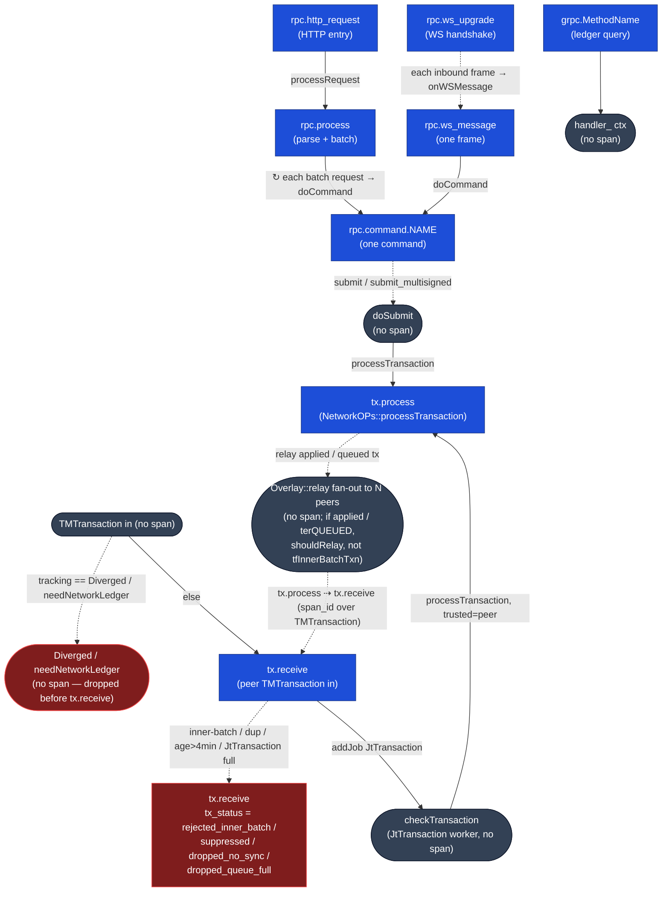

Ingress branches (all evidence in code):

- `onHandoff`: WS upgrade vs peer bundle vs status page vs legacy HTTP
  ([ServerHandler.cpp:227](../src/xrpld/rpc/detail/ServerHandler.cpp#L227)).
- `doSubmit`: `tx_blob` present → submit signed blob; absent → server
  sign-and-submit ([Submit.cpp:49](../src/xrpld/rpc/handlers/transaction/Submit.cpp#L49)).
- `tx.process`: local RPC → `doTransactionSync`; peer → `doTransactionAsync`
  (JtBatch) ([NetworkOPs.cpp:1434](../src/xrpld/app/misc/NetworkOPs.cpp#L1434)).
- **Pre-span peer drops** (no `tx.receive` created): `Diverged`
  ([PeerImp.cpp:1299](../src/xrpld/overlay/detail/PeerImp.cpp#L1299)) /
  `needNetworkLedger` ([1302](../src/xrpld/overlay/detail/PeerImp.cpp#L1302)),
  before the span at ~1320.
- **Post-span peer drops** (span exists, `tx_status` set, no job enqueued):
  `tfInnerBatchTxn` ([1348](../src/xrpld/overlay/detail/PeerImp.cpp#L1348)),
  HashRouter dup/`BAD` ([1361](../src/xrpld/overlay/detail/PeerImp.cpp#L1361)),
  `dropped_no_sync` when validated-ledger age > 4 min
  ([1416](../src/xrpld/overlay/detail/PeerImp.cpp#L1416)), `dropped_queue_full`
  when `JtTransaction` jobs > `maxTransactions`
  ([1421](../src/xrpld/overlay/detail/PeerImp.cpp#L1421)).
- **Relay fan-out**: an accepted/queued `tx.process` relays to N peers via
  `Overlay::relay`, gated on `applied || (non-FULL local) || terQUEUED`,
  HashRouter `shouldRelay`, and not `tfInnerBatchTxn`; the span context is
  injected here ([NetworkOPs.cpp:1797](../src/xrpld/app/misc/NetworkOPs.cpp#L1797)).

Inbound consensus messages take a two-stage handler — a fresh-root `peer.*.receive`
span created first (kConsumer, always), then a `consensus.*.receive` span (only if
not dropped) that carries the sender's context — before enqueuing a `checkPropose`
/ `checkValidation` worker job. The drop points are **asymmetric**: proposals drop
entirely before `consensus.proposal.receive`, while validations can drop both
before and after `consensus.validation.receive`.


Consensus-message drop evidence:

- Both `peer.proposal.receive` and `peer.validation.receive` are `freshRoot`
  spans created at the top of `onMessage`
  ([PeerImp.cpp:1766](../src/xrpld/overlay/detail/PeerImp.cpp#L1766),
  [2389](../src/xrpld/overlay/detail/PeerImp.cpp#L2389)) — so they exist even for
  dropped messages.
- **Proposal drops (all before `consensus.proposal.receive` at
  [1868](../src/xrpld/overlay/detail/PeerImp.cpp#L1868))**: untrusted+relay-off
  ([1807](../src/xrpld/overlay/detail/PeerImp.cpp#L1807)), duplicate
  ([1832](../src/xrpld/overlay/detail/PeerImp.cpp#L1832)), untrusted+Diverged
  ([1840](../src/xrpld/overlay/detail/PeerImp.cpp#L1840)), untrusted+loaded
  ([1846](../src/xrpld/overlay/detail/PeerImp.cpp#L1846)).
- **Validation drops (asymmetric around `consensus.validation.receive` at
  [2476](../src/xrpld/overlay/detail/PeerImp.cpp#L2476))**: before — `!isCurrent`
  ([2426](../src/xrpld/overlay/detail/PeerImp.cpp#L2426)), relay-off
  ([2445](../src/xrpld/overlay/detail/PeerImp.cpp#L2445)), duplicate
  ([2468](../src/xrpld/overlay/detail/PeerImp.cpp#L2468)); after — untrusted+Diverged
  ([2489](../src/xrpld/overlay/detail/PeerImp.cpp#L2489)), untrusted+loaded
  ([2506](../src/xrpld/overlay/detail/PeerImp.cpp#L2506)).
- **Worker sig-fail drops** (charged `kFeeInvalidSignature`, suppress processing
  and relay): `checkPropose !checkSign`
  ([PeerImp.cpp:3105](../src/xrpld/overlay/detail/PeerImp.cpp#L3105)),
  `checkValidation !isValid`
  ([3149](../src/xrpld/overlay/detail/PeerImp.cpp#L3149)).

### Shared transaction apply pipeline

The apply pipeline is the **single protocol tx-processing chain**, expressed in
code as one composed call
([apply.cpp:118](../src/libxrpl/tx/apply.cpp#L118)):
`doApply(preclaim(preflight(), …), …)`. C++ evaluates inner-to-outer, so
`preflight` runs first, feeds `preclaim`, which feeds `doApply`. Each stage
inspects the prior stage's `TER` and no-ops if it already failed.

**Four invokers** point into this one pipeline; the diagram draws it once.

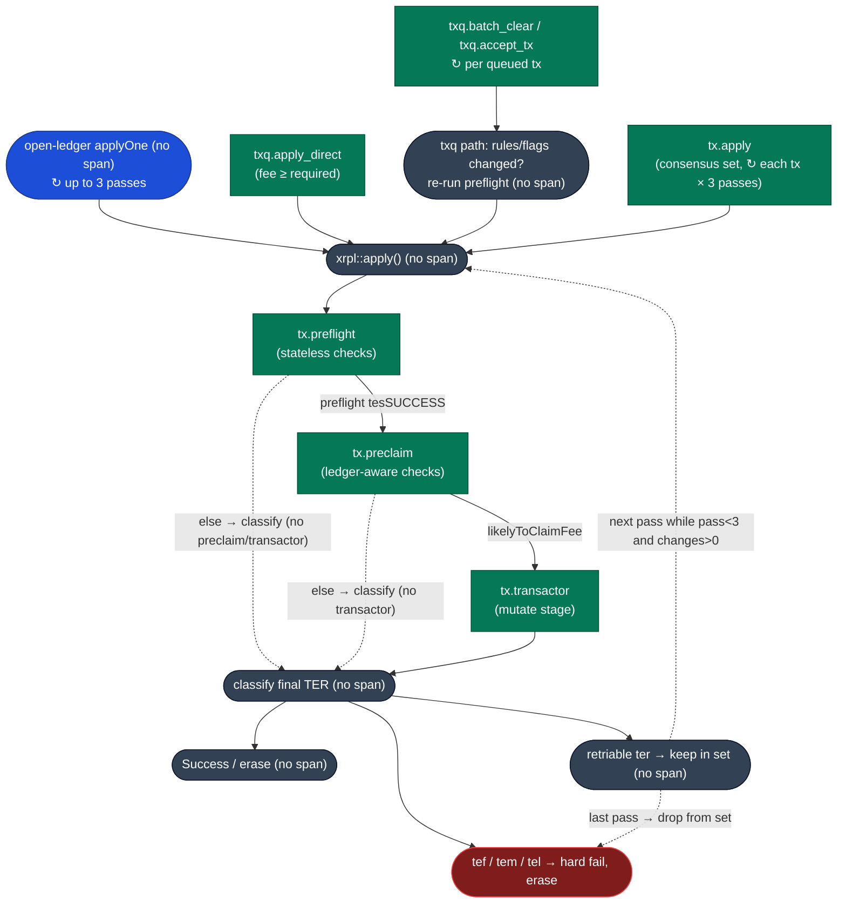

Pipeline gates and retry (evidence):

- `preclaim` short-circuits if preflight `!tesSUCCESS`
  ([applySteps.cpp:498](../src/libxrpl/tx/applySteps.cpp#L498)); `doApply`
  short-circuits if `!likelyToClaimFee`
  ([applySteps.cpp:532](../src/libxrpl/tx/applySteps.cpp#L532)); the transactor
  mutates only when preclaim is `tesSUCCESS`
  ([Transactor.cpp:1647](../src/libxrpl/tx/Transactor.cpp#L1647)).
- **Final-TER classification**: `applied` → Success; `tef | tem | tel` → hard Fail;
  else → Retry ([apply.cpp:226](../src/libxrpl/tx/apply.cpp#L226)).
- **Multi-pass retry**: both open-ledger `applyOne` and consensus `tx.apply` loop
  `pass < LEDGER_TOTAL_PASSES` (= 3); a `Retry` tx is kept for the next pass, and
  the final pass converts lingering retriable txs into drops
  ([OpenLedger.h:237](../src/xrpld/app/ledger/OpenLedger.h#L237),
  [BuildLedger.cpp:129](../src/xrpld/app/ledger/detail/BuildLedger.cpp#L129);
  `LEDGER_TOTAL_PASSES` [OpenLedger.h:29](../src/xrpld/app/ledger/OpenLedger.h#L29)).
- **TxQ re-preflight**: the queue path re-runs `preflight` when the ledger's
  rules/flags changed since enqueue
  ([TxQ.cpp:315](../src/xrpld/app/misc/detail/TxQ.cpp#L315)).
- **TxQ cross-ledger retry**: a queued tx that fails with a retriable result keeps its slot with
  `--retriesRemaining` (`kRetriesAllowed` = 10) and is re-applied at a **later**
  ledger close; on `retriesRemaining ≤ 0` or `tef|tem` it is dropped with an
  account `retryPenalty` ([TxQ.cpp:1528](../src/xrpld/app/misc/detail/TxQ.cpp#L1528)).
- `TxQ::apply` outcome fork: preflight-reject / `applied_direct` / `batch_clear` /
  `queued` (`terQUEUED`) / reject
  ([TxQ.cpp:762](../src/xrpld/app/misc/detail/TxQ.cpp#L762)).

> **`tx.apply` is set-level, consensus-only.** It wraps the retry-pass loop over
> the agreed set during `buildLedger` and exists on **no other** invoker. It is
> not a per-transaction span, and TxQ / open-ledger apply create no `tx.apply`.

### Consensus round

`beginConsensus → startRound` starts the round (`consensus.round`, `Open` phase).
The **heartbeat timer** drives `Consensus::timerEntry` each pass; the round stays
in `Establish` across many heartbeats until the outcome is decided.

> **A single ledger can take many rounds to settle.** Two nested multi-round
> mechanisms (see [docs/consensus.md](consensus.md)):
>
> 1. **Avalanche rounds inside one Establish phase** — each `timerEntry` runs
>    `phaseEstablish` again (`establishCounter_++`) and raises the inclusion
>    threshold **50% → 65% → 70% → 95%** as the round ages
>    ([ConsensusParms.h:145](../include/xrpl/consensus/ConsensusParms.h#L145)).
>    `checkConsensus` returning `No` keeps the node in `Establish` and loops; a
>    round cannot even `Expire` before a minimum of
>    `avalancheCutoffs.size() × avMinRounds = 4 × 2 = 8` passes
>    ([Consensus.h:1937](../include/xrpl/consensus/Consensus.h#L1937)).
> 2. **Retry across consensus rounds** — a round can end `MovedOn` / `Expired`,
>    meaning the network settled a _different_ ledger. The node still builds a
>    ledger, but the **next** round's `checkLedger` detects the wrong prior,
>    switches to `WrongLedger` / `SwitchedLedger` mode, acquires the correct
>    ledger, and re-deliberates. A ledger is only truly settled once trusted
>    **validations reach quorum** (`ledger.validate`); the alternate is abandoned.

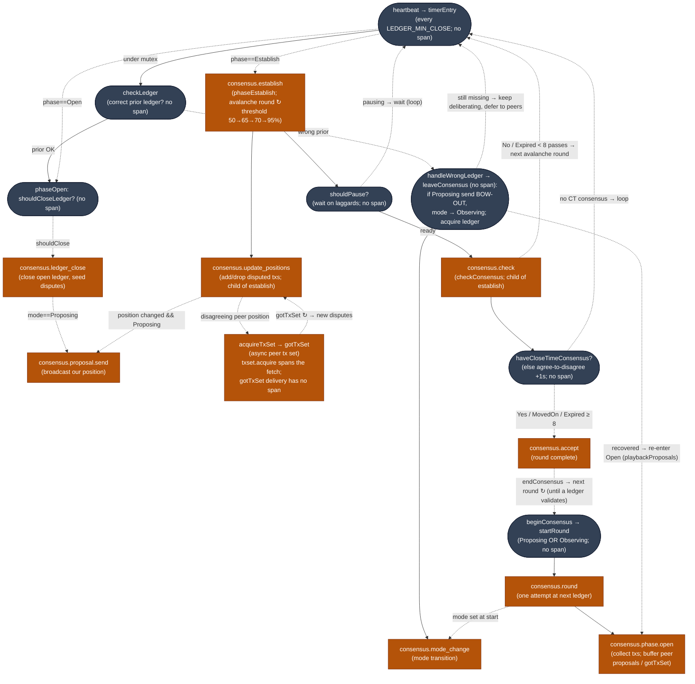

Consensus loops and branches (evidence):

- **`consensus.establish` is the parent of `update_positions` and `check`**:
  `phaseEstablish` creates the establish span (`startEstablishTracing`), and both
  child spans parent to its captured context
  ([Consensus.h:2099](../include/xrpl/consensus/Consensus.h#L2099),
  [1628](../include/xrpl/consensus/Consensus.h#L1628),
  [1837](../include/xrpl/consensus/Consensus.h#L1837)).
- **Avalanche-convergence loop (rounds within one ledger)**: repeated
  `heartbeat → timerEntry → phaseEstablish` bumps `establishCounter_` and raises
  the inclusion threshold each pass; `checkConsensus` = `No` stays in `Establish`
  ([NetworkOPs.cpp:1214](../src/xrpld/app/misc/NetworkOPs.cpp#L1214);
  [Consensus.h:1467](../include/xrpl/consensus/Consensus.h#L1467);
  thresholds [ConsensusParms.h:145](../include/xrpl/consensus/ConsensusParms.h#L145)).
- **Retry-across-rounds loop (many rounds per settled ledger)**: `MovedOn` /
  `Expired` accepts a non-preferred ledger; the next round's `checkLedger` finds
  the wrong prior and recovers before re-deliberating
  ([Consensus.h:1193](../include/xrpl/consensus/Consensus.h#L1193)); round-to-round
  via `endConsensus → beginConsensus`
  ([NetworkOPs.cpp:2315](../src/xrpld/app/misc/NetworkOPs.cpp#L2315)).
- **Two extra establish loop-backs before accept**: `shouldPause` (laggard
  backpressure) and `!haveCloseTimeConsensus_` (TX consensus but not close-time)
  each `return` and re-loop, distinct from `checkConsensus == No`
  ([Consensus.h:1496](../include/xrpl/consensus/Consensus.h#L1496),
  [1499](../include/xrpl/consensus/Consensus.h#L1499)); close time can
  "agree to disagree" at prior close + 1s ([docs/consensus.md:163](consensus.md)).
- **acquireTxSet / gotTxSet loop**: a disagreeing peer position triggers an async
  `acquireTxSet`; the later `gotTxSet` regenerates disputes and can extend the
  establish phase ([Consensus.h:931](../include/xrpl/consensus/Consensus.h#L931)).
  The fetch is spanned as `txset.acquire` and records one `round.request` event
  per round that asked for the set; the `gotTxSet` delivery itself has no span,
  so a set arriving too late to be used leaves no trace of its own.
- **Bow-out / mode change**: `handleWrongLedger → leaveConsensus` sends a bow-out
  proposal and demotes Proposing → Observing for the rest of the round
  ([Consensus.h:1976](../include/xrpl/consensus/Consensus.h#L1976)); `startRound`
  begins in Proposing **or** Observing ([docs/consensus.md:176](consensus.md)).
- **Buffered Open-phase inputs**: `peerProposal` / `gotTxSet` arriving during Open
  are stored, then seeded as disputes at `closeLedger` (`createDisputes`);
  `playbackProposals` replays them at `startRound` / `handleWrongLedger`
  ([docs/consensus.md:244](consensus.md);
  [Consensus.h:816](../include/xrpl/consensus/Consensus.h#L816)).
- **Outcome fork** after `checkConsensus`: `No` (loop) / `Yes` (onAccept) /
  `MovedOn` / `Expired` ([Consensus.h:1515](../include/xrpl/consensus/Consensus.h#L1515)).
- **Expired guard**: a round cannot leave on `Expired` before
  `avalancheCutoffs.size() × avMinRounds` (= 8) passes — below that, `Expired`
  loops like `No` ([Consensus.h:1937](../include/xrpl/consensus/Consensus.h#L1937)).
- The **deterministic-vs-random trace-strategy** branch at round start
  ([RCLConsensus.cpp:1291](../src/xrpld/app/consensus/RCLConsensus.cpp#L1291)) sets
  only the trace ID — it has **zero protocol effect**.

### Accept, build, and finalize the ledger

`onAccept` enqueues a `JtAccept` job; `doAccept` runs on that worker
(`consensus.accept.apply`). It builds the ledger (running the apply pipeline over
the agreed set), cleans the queue, stores the ledger, optionally broadcasts a
validation, and rebuilds the open ledger. A built ledger is **not final** — it is
promoted to `ledger.validate` only when trusted validations reach quorum, an
**async, validation-driven** path re-entered per incoming trusted validation; a
built ledger that loses is **abandoned**.

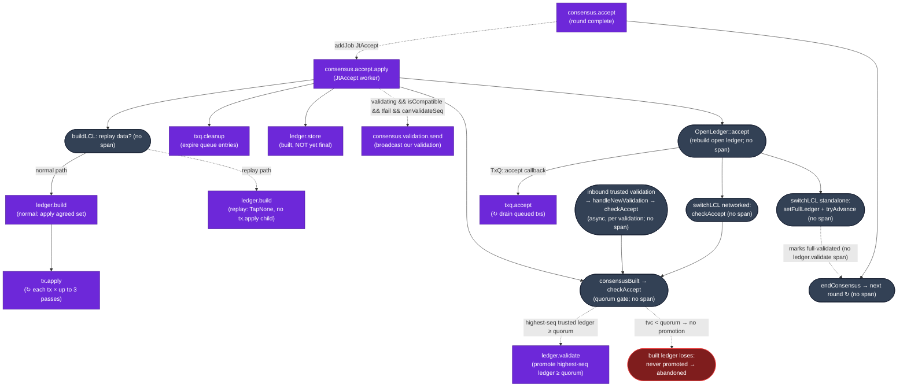

- Order inside `doAccept`: `buildLCL` (build → `tx.apply`, then `txq.cleanup`,
  then `ledger.store`) → optional `validate` → `consensusBuilt`/`checkAccept` →
  `OpenLedger::accept` (rebuilds the open ledger; `txq.accept` runs in its
  callback) → `switchLCL` promotes the built ledger to the new LCL
  ([RCLConsensus.cpp:812](../src/xrpld/app/consensus/RCLConsensus.cpp#L812) then
  [833](../src/xrpld/app/consensus/RCLConsensus.cpp#L833)).
- **buildLCL replay branch**: if `releaseReplay()` has data, `buildLedger` replays
  the stored set with `TapNone` — it **still emits `ledger.build`** (via
  `buildLedgerImpl`) but applies txns directly with **no `tx.apply` child** and no
  3-pass loop; else the normal consensus-set path runs `tx.apply` over 3 passes
  ([RCLConsensus.cpp:929](../src/xrpld/app/consensus/RCLConsensus.cpp#L929);
  [BuildLedger.cpp:252](../src/xrpld/app/ledger/detail/BuildLedger.cpp#L252)).
- `processClosedLedger` (`txq.cleanup`) runs **after** build, **before** store
  ([RCLConsensus.cpp:950](../src/xrpld/app/consensus/RCLConsensus.cpp#L950) vs
  [953](../src/xrpld/app/consensus/RCLConsensus.cpp#L953)).
- **`ledger.validate` is async + lossy**: `checkAccept` is re-entered per incoming
  trusted validation (`handleNewValidation → checkAccept`,
  [RCLValidations.cpp:193](../src/xrpld/app/consensus/RCLValidations.cpp#L193));
  it promotes the **highest-seq** trusted ledger whose `valCount > neededValidations`
  ([LedgerMaster.cpp:1180](../src/xrpld/app/ledger/detail/LedgerMaster.cpp#L1180)),
  which may be a **different** ledger than the one this node built. Below quorum
  (`tvc < minVal`) it returns early with no promotion — a built ledger that loses
  is abandoned ([LedgerMaster.cpp:980](../src/xrpld/app/ledger/detail/LedgerMaster.cpp#L980);
  [docs/consensus.md:50](consensus.md)). The `ledger.validate` span is emitted only
  inside `checkAccept` ([LedgerMaster.cpp:987](../src/xrpld/app/ledger/detail/LedgerMaster.cpp#L987)).
- **validation-send guard**: broadcast only if
  `validating_ && isCompatible && !consensusFail && canValidateSeq(seq)` — silently
  suppressed for incompatible ledgers or an already-validated seq
  ([RCLConsensus.cpp:730](../src/xrpld/app/consensus/RCLConsensus.cpp#L730)).
- **switchLCL**: standalone → `setFullLedger` + `tryAdvance` — marks the ledger
  full-validated **without** emitting `ledger.validate` (that span lives only in
  `checkAccept`); networked → `checkAccept` (shared async quorum gate)
  ([LedgerMaster.cpp:442](../src/xrpld/app/ledger/detail/LedgerMaster.cpp#L442)).

### Side flows: pathfinding and ledger acquire

**Pathfinding** — an RPC one-shot (`path_find` / `ripple_path_find`) plus an async
recompute that fires on **every ledger close** for all active subscriptions, and
also garbage-collects dead subscriptions:

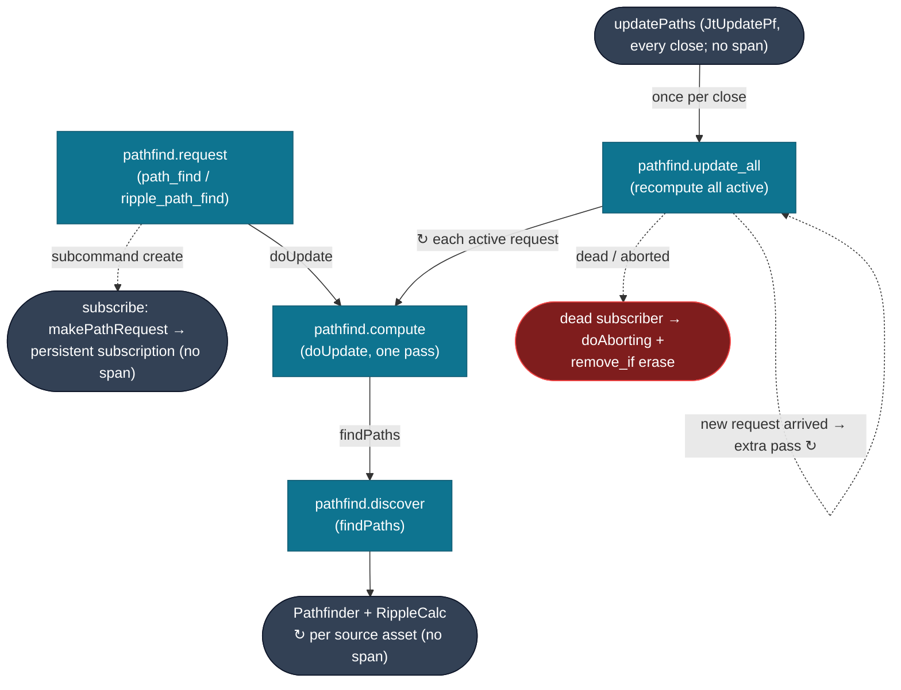

**Ledger acquire** — a flow **outside the close flow** that fetches a missing or
correct-prior ledger from peers, retries per peer/timer, and finishes with a
reason-dependent store; `checkAccept` + `tryAdvance` run on **any** completed
acquire. `ledger.acquire` is usually a trace root, but not reliably so — see the
[parenting known issues](#where-telemetry-parenting-differs-from-protocol-flow):

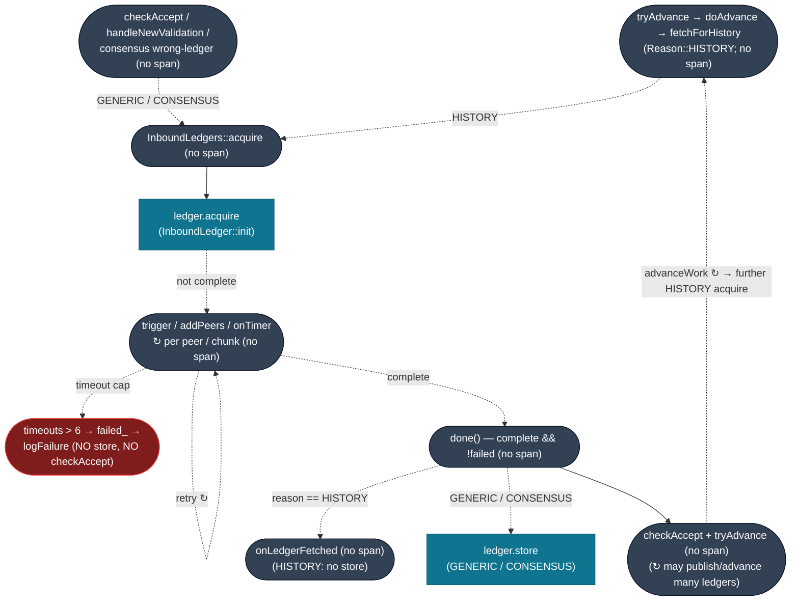

Side-flow evidence:

- **Pathfind subscription lifecycle**: `path_find` create inserts a persistent
  subscription (`makePathRequest`); `update_all` re-runs each active request every
  close, removes dead subscribers (`doAborting` + `remove_if` erase), and takes an
  extra pass when a new request arrived mid-run
  ([PathRequestManager.cpp:103](../src/xrpld/rpc/detail/PathRequestManager.cpp#L103),
  [169](../src/xrpld/rpc/detail/PathRequestManager.cpp#L169),
  [181](../src/xrpld/rpc/detail/PathRequestManager.cpp#L181)).
- **Acquire outcome fork**: `timeouts_ > kLedgerTimeoutRetriesMax` (= 6) sets
  `failed_` → terminal `logFailure`, no store/checkAccept
  ([InboundLedger.cpp:402](../src/xrpld/app/ledger/detail/InboundLedger.cpp#L402)).
  A third path never reaches `done()` at all: the destructor marks any acquisition
  that is still neither `complete_` nor `failed_` as `outcome=aborted`
  ([InboundLedgers.cpp:393](../src/xrpld/app/ledger/detail/InboundLedgers.cpp#L393)
  sweep eviction; [InboundLedger.cpp:224](../src/xrpld/app/ledger/detail/InboundLedger.cpp#L224)
  abort branch). Give-up fires at roughly **18s**, not 21s: `init()` enters the
  retry loop through `queueJob()` with no preceding `setTimer()`, so the first
  `invokeOnTimer()` runs immediately with `progress_` still `false` and takes
  `timeouts_` to 1 at t≈0. The test needs `timeouts_ > 6` — the seventh invocation
  — and only six 3s intervals separate the seventh from the first, so 6 x 3s = 18s.
  A live `aborted` rate does **not** by itself mean acquisitions are stalling.
  Three unrelated paths produce it:
  - **Sweep eviction** — the only cause that implies staleness, and it fires a
    minute after anything last _asked for_ this ledger, not a minute after the
    last byte arrived.
  - **Shutdown** — `InboundLedgers::stop()` clears `ledgers_` wholesale, so every
    clean stop aborts every acquisition still in flight.
  - **`clearFailures()`** — also clears `ledgers_`, and is reachable at runtime
    from the `fetch_info` admin RPC (`clear: true` →
    `NetworkOPsImp::clearLedgerFetch()`), so an operator can produce aborts on a
    perfectly healthy node.

  The 18s-vs-60s gap does not settle it either: while the acquisition lane sits at
  its job limit the timer body never runs, so `timeouts_` cannot advance and the
  give-up path is disarmed exactly when aborts are likeliest — see
  [The deferral/timeout pair](#the-deferraltimeout-pair). Rule out shutdown and
  `clearFailures()` first, then read a sustained `aborted` rate against
  `acquire_sweep_evictions`.

- **done() reason branch (store side only)**: `HISTORY` → `onLedgerFetched`, **no**
  `storeLedger`; else → `storeLedger`. But `checkAccept` + `tryAdvance` run for
  **any** `complete_ && !failed_` acquire regardless of reason
  ([InboundLedger.cpp:537](../src/xrpld/app/ledger/detail/InboundLedger.cpp#L537)
  store switch; [552](../src/xrpld/app/ledger/detail/InboundLedger.cpp#L552)
  reason-independent checkAccept/tryAdvance on the `AcqDone` job).
- **tryAdvance multi-ledger loop**: `doAdvance` runs `do { … } while (advanceWork_)`,
  publishing a range of ledgers and recursively triggering further HISTORY acquire
  ([LedgerMaster.cpp:1905](../src/xrpld/app/ledger/detail/LedgerMaster.cpp#L1905)).

### Where telemetry parenting differs from protocol flow

The graph above is protocol control flow. The OpenTelemetry span **parent links**
are built differently and, in several places, do **not** represent a real
call edge. Read a trace with these in mind:

| Telemetry does this                                                                                                                   | Real protocol flow                                                                                                                                                                                                                                                                                                                                                                         |
| ------------------------------------------------------------------------------------------------------------------------------------- | ------------------------------------------------------------------------------------------------------------------------------------------------------------------------------------------------------------------------------------------------------------------------------------------------------------------------------------------------------------------------------------------ |
| `tx.process` is a `hashSpan` root from `txID` — an independent trace root ([TxTracing.h:63](../src/xrpld/telemetry/TxTracing.h#L63)). | The real edge is the synchronous `doSubmit → processTransaction` call; it is **not** a child of `rpc.command.submit`.                                                                                                                                                                                                                                                                      |
| `tx.preflight` / `tx.preclaim` / `tx.transactor` share one `txID`-derived trace ID.                                                   | That shared ID is a correlation trick, not a call edge. The real order is the composed `apply()` at [apply.cpp:118](../src/libxrpl/tx/apply.cpp#L118). They are **not** children of `tx.process` or `tx.apply`. Because nothing else nests under it either, `tx.apply` is **always a leaf** — the stage spans for the transactions it applied sit in the txID-keyed trace, not beneath it. |
| `consensus.round` uses a deterministic trace ID from the previous ledger hash.                                                        | This makes **all validators share one trace ID** (a cross-node shared root), not a per-node parent. The real round-to-round edge is `endConsensus → beginConsensus`.                                                                                                                                                                                                                       |
| `consensus.accept` (main thread) and `consensus.accept.apply` (JtAccept worker) are wired via a captured context.                     | The real edge is the queued `JtAccept` job, a thread hand-off ([RCLConsensus.cpp:483](../src/xrpld/app/consensus/RCLConsensus.cpp#L483)).                                                                                                                                                                                                                                                  |
| `pathfind.update_all` parents nothing from the original `pathfind.request`.                                                           | The causal link is the ledger-close job on `JtUpdatePf`, not span nesting.                                                                                                                                                                                                                                                                                                                 |
| `ledger.acquire` and its downstream `ledger.store` / `ledger.validate`.                                                               | Reached via the `AcqDone` job, not parent inheritance. All three are non-scoped `SpanGuard::span` spans, so none of them parents the others; each takes whatever ambient span its own caller happens to have active. See the `ledger.*` known issue below.                                                                                                                                 |
| `peer.*.receive` (fresh `kConsumer` root) and `consensus.*.receive` on the same message.                                              | Two **sequential stages of one synchronous handler**, not parent/child; on a duplicate/untrusted drop the `consensus.*.receive` is never created.                                                                                                                                                                                                                                          |
| Receive spans adopt the sender's `trace_id` + `span_id` as a genuine cross-node parent.                                               | Deliberate: the receive span becomes a child of a **different node's** span (a cross-node context marker, not an in-process edge). `tx.receive` is asymmetric — it borrows only the sender's `span_id` and re-derives its own `trace_id` from `txID`.                                                                                                                                      |

> **Known telemetry artifacts** (from live audits, memory `otel-span-hierarchy-audit`):
> an RPC entry span's scope can leak across a reused coroutine worker, and the
> `hashSpan` roots (`tx.*`) — along with `ledger.acquire` / `ledger.store` /
> `ledger.validate` whenever they do come out parentless — can surface in Tempo
> as dangling "root span not yet received". These are exporter/parenting
> artifacts, not real control-flow parents.

Three further divergences are **known issues in the code**, not deliberate design.
Unlike the rows above, these produce a parent that is simply wrong, and all three
are pending a code fix:

- **`grpc.*` and `pathfind.update_all` do not open a fresh root.** All four RPC
  entry points create their span with `freshRoot`, so a reused coroutine worker
  cannot leak a stale ambient parent into them
  ([ServerHandler.cpp:473](../src/xrpld/rpc/detail/ServerHandler.cpp#L473),
  [640](../src/xrpld/rpc/detail/ServerHandler.cpp#L640)). `grpc.<MethodName>`
  ([GRPCServer.cpp:173](../src/xrpld/app/main/GRPCServer.cpp#L173)) and
  `pathfind.update_all`
  ([PathRequestManager.cpp:91](../src/xrpld/rpc/detail/PathRequestManager.cpp#L91))
  use the plain constructor instead, so either can be adopted by whatever span
  happened to be active on the worker that picked the job up. A gRPC call
  appearing beneath an unrelated transaction's trace is this bug, not a real
  call edge.
- **`ledger.acquire` / `ledger.store` / `ledger.validate` are not reliably roots
  either.** All three use `SpanGuard::span`
  ([InboundLedger.cpp:113](../src/xrpld/app/ledger/detail/InboundLedger.cpp#L113),
  [LedgerMaster.cpp:463](../src/xrpld/app/ledger/detail/LedgerMaster.cpp#L463),
  [987](../src/xrpld/app/ledger/detail/LedgerMaster.cpp#L987)), which inherits the
  ambient span ([SpanGuard.cpp:233](../src/libxrpl/telemetry/SpanGuard.cpp#L233))
  rather than `freshRoot`
  ([245](../src/libxrpl/telemetry/SpanGuard.cpp#L245)) — the same defect as
  `grpc.*` above. Whether they come out as roots depends purely on the caller:
  - **Root, as documented.** On the `JtAdvance` / `AcqDone` job path
    (`LedgerMaster::doAdvance`, `RCLConsensus::Adaptor::acquireLedger` →
    [RCLConsensus.cpp:171](../src/xrpld/app/consensus/RCLConsensus.cpp#L171)) no
    span is active on the worker, so nothing is inherited. `acquireSpan_` itself is
    a non-scoped `SpanGuard`, so it never becomes the ambient parent of the
    `ledger.store` / `ledger.validate` that follow it.
  - **Mis-parented.** `InboundLedgers::acquire` is also called **synchronously from
    an RPC handler** — `ledger_request` → `rpc::getOrAcquireLedger`
    ([RPCLedgerHelpers.cpp:483](../src/xrpld/rpc/detail/RPCLedgerHelpers.cpp#L483))
    — which runs inside the scoped `rpc.command.<name>` span
    ([RPCHandler.cpp:168](../src/xrpld/rpc/detail/RPCHandler.cpp#L168)). There
    `ledger.acquire` becomes a child of that RPC command, and when `init()` is
    satisfied from the local store the `ledger.store` / `ledger.validate` it calls
    ([InboundLedger.cpp:164](../src/xrpld/app/ledger/detail/InboundLedger.cpp#L164),
    [168](../src/xrpld/app/ledger/detail/InboundLedger.cpp#L168)) land there as
    siblings. A ledger acquisition nested under an `rpc.command.*` trace is this
    bug, not a real call edge.

  **`ledger.build` and `tx.apply` use the same ambient-parent construct but are
  safe.** `ledger.build` is a plain `ScopedSpanGuard`
  ([BuildLedger.cpp:55](../src/xrpld/app/ledger/detail/BuildLedger.cpp#L55)): its
  only callers are `RCLConsensus::doAccept`
  ([RCLConsensus.cpp:935-937](../src/xrpld/app/consensus/RCLConsensus.cpp#L935))
  on the `JtAccept` worker and the replay path
  ([LedgerDeltaAcquire.cpp:208](../src/xrpld/app/ledger/detail/LedgerDeltaAcquire.cpp#L208)),
  and every consensus accept span is a non-scoped `SpanGuard`
  ([RCLConsensus.cpp:598-599](../src/xrpld/app/consensus/RCLConsensus.cpp#L598)),
  so no ambient span exists to be inherited there. `tx.apply`
  ([BuildLedger.cpp:123](../src/xrpld/app/ledger/detail/BuildLedger.cpp#L123)) is
  reached only synchronously from `buildLedgerImpl` while `ledger.build`'s scope is
  live, so its ambient parent is always `ledger.build` — which is exactly the
  intended edge.

- **`consensus.round` is not always a root.** The `consensus_trace_strategy=attribute`
  path has two creation branches; the fallback branch — taken on the first traced
  round of a run, and whenever consensus tracing is off — sets no parent at all
  ([RCLConsensus.cpp:1310](../src/xrpld/app/consensus/RCLConsensus.cpp#L1310)),
  so that round inherits the ambient context instead of starting a trace. Rounds
  under the default `deterministic` strategy are unaffected.

---

## Insights and Sample Queries

This section shows what questions you can answer using the span attributes, with example Tempo TraceQL queries.

**TraceQL syntax note:** span attributes must be referenced with the `span.` prefix inside `{}`.
Conditions are combined with `&&`. The `|` pipeline operator is not supported on this Tempo version.

```
# General pattern
{name="<span-name>" && span.<attr> = <value> && span.<attr2> != <value2>}

# Duration filter (no prefix needed)
{name="<span-name>" && duration > 500ms}

# Regex match
{name="<span-name>" && span.<attr> =~ "<pattern>.*"}

# Multiple span names
{name = "<span-a>" || name = "<span-b>"}

# Name regex
{name =~ "<pattern>.*" && span.<attr> = <value>}

# Structural: find parent spans that have a matching child/event
{name="<parent>"} >> {event:name="<event-name>"}
```

### Transaction Workflow Analysis

```
# Find all AMM transactions (AMMDeposit, AMMWithdraw, AMMVote)
{name="tx.process" && span.tx_type =~ "AMM.*"}

# Find a specific AMM operation
{name="tx.process" && span.tx_type = "AMMDeposit"}
{name="tx.process" && span.tx_type = "AMMWithdraw"}
{name="tx.process" && span.tx_type = "AMMVote"}

# Find Payment transactions that failed
{name="tx.process" && span.tx_type = "Payment" && span.ter_result != "tesSUCCESS"}

# Find Payment failures due to path issues
{name="tx.process" && span.tx_type = "Payment" && span.ter_result =~ "tecPATH.*"}

# Compare latency of different transaction types
{name="tx.process" && span.tx_type = "OfferCreate"}
{name="tx.process" && span.tx_type = "Payment"}

# Find high-fee transactions (fee > 1 XRP = 1000000 drops)
{name="tx.process" && span.fee > 1000000}

# Find transactions that were not applied
{name="tx.process" && span.applied = false}

# Find NFTokenMint across tx and txq spans
{name =~ "tx.*|txq.*" && span.tx_type = "NFTokenMint"}

# Find all NFT-related activity
{name =~ "tx.*|txq.*" && span.tx_type =~ "NFToken.*"}

# Find TrustSet transactions (IOU trust lines)
{name="tx.process" && span.tx_type = "TrustSet"}

# Find oracle price updates
{name="tx.process" && span.tx_type = "OracleSet"}
```

### DEX (OfferCreate / OfferCancel)

```
# All DEX offer creates
{name="tx.process" && span.tx_type = "OfferCreate"}

# Offers killed (ImmediateOrCancel/FillOrKill with no fill)
{name="tx.process" && span.tx_type = "OfferCreate" && span.ter_result = "tecKILLED"}

# Offers that failed due to insufficient funds
{name="tx.process" && span.tx_type = "OfferCreate" && span.ter_result = "tecUNFUNDED_OFFER"}

# Offers failed due to insufficient reserve to place the offer
{name="tx.process" && span.tx_type = "OfferCreate" && span.ter_result = "tecINSUF_RESERVE_OFFER"}

# Offer cancellations
{name="tx.process" && span.tx_type = "OfferCancel"}

# OfferCreate transactions received from peers (cross-node relay)
{name="tx.receive" && span.tx_type = "OfferCreate"}
```

### Apply Pipeline by Stage

```
# All three stages of one transaction (preflight -> preclaim -> apply)
{name=~"tx.preflight|tx.preclaim|tx.transactor"}

# Transactions that failed at the preclaim stage
{name="tx.preclaim"} | ter_result != "tesSUCCESS"

# Transactions that hard-failed preflight (never reached preclaim/apply)
{name="tx.preflight"} | ter_result != "tesSUCCESS"
```

PromQL on the span-derived metrics (dashboard: _Transaction Overview_):

```
# Per-stage throughput — the funnel preflight >= preclaim >= apply
sum by (stage) (rate(span_calls_total{span_name=~"tx.preflight|tx.preclaim|tx.transactor"}[5m]))

# Per-stage p95 latency
histogram_quantile(0.95, sum by (le, stage) (rate(span_duration_milliseconds_bucket{span_name=~"tx.preflight|tx.preclaim|tx.transactor"}[5m])))

# Per-stage failure rate (ter_result != tesSUCCESS; a failing ter completes the
# span normally, so filter on the attribute, not status_code which only flags exceptions)
sum by (stage) (rate(span_calls_total{span_name=~"tx.preflight|tx.preclaim|tx.transactor", ter_result!~"tesSUCCESS|"}[5m]))
```

> **Alerting**: a rising `tx.preflight` / `tx.preclaim` failure rate points to
> malformed or stale-sequence submissions (often spam or a misbehaving client);
> a rising `tx.transactor` failure rate points to apply-time problems. Alert per
> stage rather than on a single aggregate so the failing stage is obvious.

> **Sampling caveat**: these stage metrics are span-derived, but head sampling
> is **fixed at 100% and is not configurable** — the ratio is a compile-time
> constant ([Telemetry.h:234](../include/xrpl/telemetry/Telemetry.h#L234)
> `static constexpr double samplingRatio = 1.0;`) and there is no
> `sampling_ratio` config key to set
> ([TelemetryConfig.cpp:139](../src/libxrpl/telemetry/TelemetryConfig.cpp#L139)
> — "nothing to parse"). So locally these counts are **exact**, not a sample.
> Volume reduction is a collector-side **tail** sampling decision instead, and
> the only policy shipped is a single 0.5% probabilistic one that lives **only**
> in `otel-collector-config.grafanacloud.yaml` — the base
> `otel-collector-config.yaml` has no tail sampling at all, so a stock local
> stack retains every trace. Where that Cloud policy is in force it applies to
> the trace-storage branch only; spanmetrics run on a separate branch and still
> see 100% of spans, so the derived RED metrics stay exact either way.

### Transaction Queue Health

```
# Find transactions rejected from the queue
{name="txq.accept_tx" && span.txq_status = "failed"}

# Find transactions being retried
{name="txq.accept_tx" && span.txq_status = "retried"}

# Find transactions that exhausted retries
{name="txq.accept_tx" && span.txq_status = "retried" && span.retries_remaining = 0}

# Which transaction types get queued most often?
{name="txq.enqueue" && span.tx_type = "Payment"}
{name="txq.enqueue" && span.tx_type = "OfferCreate"}
{name="txq.enqueue" && span.tx_type =~ "NFToken.*"}

# Find ledger closes that applied queued transactions
{name="txq.accept" && span.ledger_changed = true}
```

### RPC Debugging

```
# Find batch RPC requests
{name="rpc.process" && span.is_batch = true}

# Find large RPC payloads (>100KB)
{name="rpc.http_request" && span.request_payload_size > 100000}

# Find resource-heavy RPC commands (by load_type)
{name =~ "rpc.command.*" && span.load_type = "exceptioned RPC"}

# Find a specific WebSocket command
{name="rpc.ws_message" && span.command = "subscribe"}

# Find server_info calls
{name="rpc.command.server_info"}

# Find slow pathfinding with many source assets
{name="pathfind.discover" && span.pathfind_num_source_assets > 10}
```

### PathFinding Performance

```
# Find pathfinding for specific currencies
{name="pathfind.compute" && span.pathfind_dest_currency = "USD"}

# Find expensive pathfinding (many source assets to explore)
{name="pathfind.discover" && span.pathfind_num_source_assets > 20}

# Find slow pathfinding requests
{name="pathfind.compute" && duration > 1000ms}
```

### Consensus Health

```
# Find rounds where consensus timed out (expired)
{name="consensus.accept" && span.consensus_state = "expired"}

# Find rounds where we moved on without full agreement
{name="consensus.accept" && span.consensus_state = "moved_on"}

# Find rounds with many disputes
{name="consensus.accept" && span.disputes_count > 5}

# Find slow consensus rounds (>5s)
{name="consensus.accept" && span.round_time_ms > 5000}

# Find bow-out proposals (node resigned from round)
{name="consensus.proposal.send" && span.is_bow_out = true}

# Correlate validation with its ledger
{name="consensus.validation.send" && span.ledger_hash = "<hash>"}

# Find rounds where validators disagreed on close time
{name="consensus.accept.apply" && span.close_time_correct = false}

# Find both validation send and receive (compare sender vs receiver latency)
{name = "consensus.validation.send" || name = "consensus.validation.receive"}
```

### Cross-Subsystem Correlation

```
# Follow a transaction from receive through queue to ledger
{name =~ "tx.*|txq.*" && span.tx_type = "Payment" && duration > 500ms}

# Find all NFT-related activity across tx and txq spans
{name =~ "tx.*|txq.*" && span.tx_type =~ "NFToken.*"}

# Find all AMM activity across tx and txq spans
{name =~ "tx.*|txq.*" && span.tx_type =~ "AMM.*"}

# Find cross-node transaction receives (no errors)
{name="tx.receive" && status != error}
```

### Where to Look (Quick Reference)

| Question                            | Span                        | Key Attributes                           |
| ----------------------------------- | --------------------------- | ---------------------------------------- |
| "Which tx type is slowest?"         | `tx.process`                | `span.tx_type` + duration                |
| "Why was my tx rejected?"           | `tx.process`                | `span.ter_result`, `span.applied`        |
| "What AMM operations happened?"     | `tx.process`                | `span.tx_type =~ "AMM.*"`                |
| "What DEX offers failed?"           | `tx.process`                | `span.tx_type`, `span.ter_result`        |
| "What NFT activity occurred?"       | `tx.process`, `txq.enqueue` | `span.tx_type =~ "NFToken.*"`            |
| "Is the TxQ backing up?"            | `txq.accept`                | `span.queue_size`, `span.ledger_changed` |
| "Why was my tx dropped from queue?" | `txq.accept_tx`             | `span.txq_status`, `span.ter_code`       |
| "Are batch requests a problem?"     | `rpc.process`               | `span.is_batch`, `span.batch_size`       |
| "Which RPC is expensive?"           | `rpc.command.*`             | `span.load_type`, duration               |
| "Did consensus reach threshold?"    | `consensus.check`           | `span.consensus_result`                  |
| "Was consensus outcome normal?"     | `consensus.accept`          | `span.consensus_state`                   |
| "Did a validator bow out?"          | `consensus.proposal.send`   | `span.is_bow_out`                        |
| "Which ledger was validated?"       | `consensus.validation.send` | `span.ledger_hash`                       |
| "Did close time agreement fail?"    | `consensus.accept.apply`    | `span.close_time_correct`                |
| "What tx work fed a given ledger?"  | `tx.*` / `txq.*`            | `span.current_ledger_seq`                |

### Correlating a transaction to the ledger it was worked on

The `tx.process`, `tx.receive`, `txq.enqueue`, `tx.preclaim`, and `tx.transactor`
spans carry `current_ledger_seq` — the open/in-flight ledger they acted on (not
an established ledger). Because these spans are keyed on the transaction id (their
own trace) while the ledger/consensus spans are keyed on the ledger, use the
attribute to bridge the two id-spaces:

```
# All transaction-side work recorded against ledger N
{span.current_ledger_seq = N}

# Join to the ledger build/consensus trace for the same ledger
{name="ledger.build" && span.ledger_seq = N}
```

`txq.enqueue` and the view-bearing apply stages also carry `current_ledger_hash`
(the current ledger's parent hash), which equals the `consensus.round`
deterministic trace-id seed on the consensus-build path. `tx.preflight` is
stateless and omits both attributes.

---

## Cross-Node Trace Propagation

xrpld propagates trace context across nodes via protobuf `TraceContext` fields
embedded in peer-to-peer messages. When Node A sends a transaction, proposal,
or validation, it injects its active span's trace/span IDs into the protobuf
message. Node B extracts that context on receipt and creates a child span,
linking the two nodes into a single distributed trace.

### How It Works

```
Node A (sender)                          Node B (receiver)
+-----------------------------+          +-------------------------------+
| tx.process / consensus.*    |          | PeerImp::onMessage()          |
|   |                         |          |   |                           |
|   v                         |          |   v                           |
| SpanGuard::getTraceBytes()  |          | extract TraceContext from      |
|   |                         |          | protobuf message               |
|   v                         |   send   |   |                           |
| injectSpanContext() --------|--------->|   v                           |
| sets TraceContext fields    |  proto   | txReceiveSpan()               |
| (trace_id, span_id, flags) |  msg     | proposalReceiveSpan()         |
+-----------------------------+          | validationReceiveSpan()       |
                                         |   |                           |
                                         |   v                           |
                                         | child span with parent link   |
                                         +-------------------------------+
```

### Send-Side Injection

| Message Type  | Injection Point            | Mechanism                                  |
| ------------- | -------------------------- | ------------------------------------------ |
| TMTransaction | `NetworkOPs::apply()`      | Injects `tx.process` span into relay msg   |
| TMProposeSet  | `RCLConsensus::propose()`  | Injects active context into proposal msg   |
| TMValidation  | `RCLConsensus::validate()` | Injects active context into validation msg |

### Receive-Side Extraction

| Message Type  | Extraction Point                    | Helper Function                                    |
| ------------- | ----------------------------------- | -------------------------------------------------- |
| TMTransaction | `PeerImp::onMessage(TMTransaction)` | `TxTracing::txReceiveSpan()`                       |
| TMProposeSet  | `PeerImp::onMessage(TMProposeSet)`  | `ConsensusReceiveTracing::proposalReceiveSpan()`   |
| TMValidation  | `PeerImp::onMessage(TMValidation)`  | `ConsensusReceiveTracing::validationReceiveSpan()` |

### Key Files

| File                                              | Role                                            |
| ------------------------------------------------- | ----------------------------------------------- |
| `src/xrpld/telemetry/PropagationHelpers.h`        | `injectSpanContext()` — SpanGuard to protobuf   |
| `include/xrpl/telemetry/TraceContextPropagator.h` | OTel context <-> protobuf conversion primitives |
| `src/xrpld/telemetry/ConsensusReceiveTracing.h`   | Proposal/validation receive span factories      |
| `src/xrpld/telemetry/TxTracing.h`                 | Transaction receive span factory                |

### Backwards Compatibility

Older peers that do not populate `TraceContext` fields in their messages will
simply produce empty trace bytes on the receive side. The extraction helpers
detect this and create standalone (root) spans instead of child spans. No
errors are logged and no data is lost — the receive span is still created with
all its normal attributes, it just lacks a cross-node parent link.

### Example Tempo Queries

```
# Find cross-node transaction traces (tx.receive spans with no errors)
{name="tx.receive" && status != error}

# Find proposals received with cross-node parent context
{} >> {name="consensus.proposal.receive"}

# Trace a transaction across the network by its hash
{name =~ "tx.*" && span.tx_hash = "<hash>"}

# Find all spans in a cross-node consensus trace
{resource.service.name="xrpld" && span.consensus_round_id = "<round_id>"}

# Compare latency between sender and receiver for validations
{name = "consensus.validation.send" || name = "consensus.validation.receive"}
```

## Prometheus Metrics (Spanmetrics)

The OTel Collector's spanmetrics connector automatically derives RED (Rate, Errors, Duration) metrics from every span. No custom metrics code is needed in xrpld.

### Generated Metric Names

| Prometheus Metric                   | Type      | Description                  |
| ----------------------------------- | --------- | ---------------------------- |
| `span_calls_total`                  | Counter   | Total span invocations       |
| `span_duration_milliseconds_bucket` | Histogram | Latency distribution buckets |
| `span_duration_milliseconds_count`  | Histogram | Latency observation count    |
| `span_duration_milliseconds_sum`    | Histogram | Cumulative latency           |

### Metric Labels

Every metric carries these standard labels:

| Label          | Source             | Example                                  |
| -------------- | ------------------ | ---------------------------------------- |
| `span_name`    | Span name          | `rpc.command.server_info`                |
| `status_code`  | Span status        | `STATUS_CODE_UNSET`, `STATUS_CODE_ERROR` |
| `service_name` | Resource attribute | `xrpld`                                  |
| `span_kind`    | Span kind          | `SPAN_KIND_INTERNAL`                     |

Additionally, span attributes configured as dimensions in the collector
become metric labels. The span attribute keys are already underscore form
(the naming convention forbids dots), so the label name matches the attribute
name verbatim. Prometheus' dots → underscores sanitization only fires for
dotted attribute names (e.g. resource attributes like `service.name`), which
does not apply to these dimensions.

| Span Attribute       | Metric Label         | Applies To                      |
| -------------------- | -------------------- | ------------------------------- |
| `command`            | `command`            | `rpc.command.*` spans           |
| `rpc_status`         | `rpc_status`         | `rpc.command.*` spans           |
| `consensus_mode`     | `consensus_mode`     | `consensus.ledger_close` spans  |
| `local`              | `local`              | `tx.process` spans              |
| `proposal_trusted`   | `proposal_trusted`   | `peer.proposal.receive` spans   |
| `validation_trusted` | `validation_trusted` | `peer.validation.receive` spans |

### Histogram Buckets

Configured in `otel-collector-config.yaml` (spanmetrics connector, `unit: ms`):

```
1ms, 5ms, 10ms, 25ms, 50ms, 100ms, 250ms, 500ms, 1s, 2s, 3s, 4s, 5s, 10s, 30s
```

Sub-second boundaries cover RPC/tx/ledger spans; 2s-4s resolve second-scale
consensus spans (`consensus.round`, `consensus.establish`) that would otherwise
pile into one 1s-5s bucket and make `histogram_quantile` a meaningless
interpolation; 10s/30s give the `ledger.acquire` catch-up tail a measurable home.
Boundaries must stay strictly ascending. The native beast::insight histograms
(ms-scale RPC/IO timers) keep the original 1ms-5s buckets in
`Telemetry.cpp` — they never exceed 5s, so they need no high-range buckets.

## System Metrics (OTel native -- beast::insight)

xrpld has a built-in metrics framework (`beast::insight`) that exports metrics natively via OTLP to the OTel Collector. These complement the span-derived RED metrics by providing system-level gauges, counters, and timers that don't map to individual trace spans.

### Configuration

Add to `xrpld.cfg`:

```ini
[insight]
server=otel
endpoint=http://localhost:4318/v1/metrics
```

The `OTelCollector` implementation exports metrics via OTLP/HTTP to the same OTel Collector that receives traces. No separate StatsD receiver is needed.

Do not set `prefix` on this path. `formatName()` never applies it, so the setting is silently ignored and the exported names are bare and lowercase — `jobq_job_count`, not `xrpld_jobq_job_count`. Queries written against a prefixed name return no series.

> **Fallback**: Set `server=statsd` and `address=127.0.0.1:8125` to use the legacy StatsD UDP path. This requires re-enabling the `statsd` receiver in `otel-collector-config.yaml` and uncommenting port 8125 in `docker-compose.yml`. On that path `prefix` **is** applied to the metric name, which is why the StatsD examples elsewhere in this document keep it.

### Metric Reference

#### Gauges

| Prometheus Metric                     | Source                    | Description                                                                |
| ------------------------------------- | ------------------------- | -------------------------------------------------------------------------- |
| `ledgermaster_validated_ledger_age`   | LedgerMaster.h:373        | Age of validated ledger (seconds)                                          |
| `ledgermaster_published_ledger_age`   | LedgerMaster.h:374        | Age of published ledger (seconds)                                          |
| `state_accounting_{mode}_duration`    | NetworkOPs.cpp:774        | Time in each operating mode (Disconnected/Connected/Syncing/Tracking/Full) |
| `state_accounting_{mode}_transitions` | NetworkOPs.cpp:780        | Transition count per mode                                                  |
| `peer_finder_active_inbound_peers`    | PeerfinderManager.cpp:214 | Active inbound peer connections                                            |
| `peer_finder_active_outbound_peers`   | PeerfinderManager.cpp:215 | Active outbound peer connections                                           |
| `overlay_peer_disconnects`            | OverlayImpl.h:557         | Peer disconnect count                                                      |
| `jobq_job_count`                      | JobQueue.cpp:26           | Current job queue depth (all types)                                        |
| `jobq_{jobtype}_waiting`              | JobTypeData.h             | Jobs of this type enqueued but not yet running                             |
| `jobq_{jobtype}_running`              | JobTypeData.h             | Jobs of this type currently executing                                      |
| `jobq_{jobtype}_deferred`             | JobTypeData.h             | Jobs of this type held back because the type's concurrency limit was hit   |
| `{category}_bytes_in/out`             | OverlayImpl.h:535         | Overlay traffic bytes per category (57 categories)                         |
| `{category}_messages_in/out`          | OverlayImpl.h:535         | Overlay traffic messages per category                                      |

Note that `job_count` is exported as `jobq_job_count`: the JobQueue is
constructed with `collectorManager_->group("jobq")` (Application.cpp:386),
`GroupImp::makeName()` joins prefix and name with a `.` (Groups.cpp:42), and
`OTelCollectorImp::formatName()` then turns the `.` into `_` and lowercases the
whole string (OTelCollector.cpp:855-874). The same mechanism produces the
`jobq_{jobtype}_*` names above and the pre-existing
`jobq_{jobtype}_milliseconds` timing family.

#### Per-Job-Type Queue Saturation

The three `jobq_{jobtype}_{waiting,running,deferred}` families expose the
per-type counters that `JobTypeData` already maintained but never exported.
`{jobtype}` is the lowercased `JobTypes` name, so `JtLedgerReq` ("ledgerRequest")
becomes `jobq_ledgerrequest_waiting` / `_running` / `_deferred`.

They are emitted for every **non-special** job type — 35 of the 46 declared
types. A "special" type is one whose concurrency limit is 0
(`JobTypeInfo::special()`, JobTypeInfo.h:71-74); the limit logic never applies
to it, so its `deferred` is always zero. The gauge members are declared at
JobTypeData.h:78-80 and created at :100-102, next to the existing
`dequeue`/`execute` events and under the same `!info.special()` guard (:95). They
are published by `JobQueue::collect()` under the `mutex_` that already guards the
counters (JobQueue.cpp:66-93) — no new locking.

**`deferred` is the leading indicator.** `JobQueue::addJob()` never rejects
work — when a type is at its limit, `addRefCountedJob()` increments `deferred`
and returns `true` anyway (JobQueue.cpp:131-142), and `finishJob()` drains one
deferred job per completion (JobQueue.cpp:353-362). Backpressure on a capped type
therefore shows up **only as latency**, after the harm is done. `deferred > 0`
says the cap is being hit _now_, before the duration histograms move.

Limits that matter for ledger sync (JobTypes.h:54-77):

| Job type       | Metric prefix         | Limit | Producers                                                                       |
| -------------- | --------------------- | ----- | ------------------------------------------------------------------------------- |
| `JtPack`       | `jobq_makefetchpack_` | 1     | `MakeFetchPack`                                                                 |
| `JtLedgerReq`  | `jobq_ledgerrequest_` | 3     | `RcvGetLedger`, `RcvGetObjByHash`                                               |
| `JtLedgerData` | `jobq_ledgerdata_`    | 3     | `ProcessLData`, `GotStaleData`, `GotFetchPack`, `AcqDone`, `InboundLedger`      |
| `JtUpdatePf`   | `jobq_updatepaths_`   | 1     | `PthFindNewReq`, `PthFindOBDB`, `PthFindNewLed`, `OB<seq>` — see the note below |
| `JtTxnData`    | `jobq_fetchtxndata_`  | 5     | `TxAcq`, `ComplAcquire`, `RcvPeerData`                                          |

> **`JtUpdatePf` has four producers, three of them individually visible.** All
> four run the same `updatePaths()` work but arrive under different names. Three
> come through `LedgerMaster::newPFWork()` (LedgerMaster.cpp:1545), which passes
> its caller's name straight to `addJob`: `PthFindNewReq` (:1512),
> `PthFindOBDB` (:1533), and `PthFindNewLed` (:1984). All three are all-letters,
> so each is its own `handler` series. The fourth is
> `"OB" + std::to_string(seq)` (OrderBookDBImpl.cpp:84), which contains digits
> and therefore folds to `handler="other"` — order-book rebuild traffic is the
> only one of the four that is not directly attributable. Do not read the whole
> type as invisible: three of its four producers are named.

> **Sampling caveat**: these are gauges read by the `JobQueue::collect()` hook,
> which the beast::insight `PeriodicMetricReader` drives every 1 s
> (Telemetry.cpp:441). A `deferred` spike shorter than the sample interval can be
> missed entirely. Treat a non-zero reading as real saturation, but do not treat
> a zero reading as proof that no saturation occurred — cross-check
> `job_queued_us` for the same type.

#### OTel MetricsRegistry Gauges

These gauges are exported via the OTel Metrics SDK `PeriodicMetricReader` (10s interval), NOT through beast::insight.

| Prometheus Metric                                   | Source              | Description                                                                                                                                                                         |
| --------------------------------------------------- | ------------------- | ----------------------------------------------------------------------------------------------------------------------------------------------------------------------------------- |
| `server_info{metric="server_state"}`                | MetricsRegistry.cpp | Operating mode (0=DISCONNECTED .. 4=FULL)                                                                                                                                           |
| `server_info{metric="uptime"}`                      | MetricsRegistry.cpp | Seconds since server start                                                                                                                                                          |
| `server_info{metric="peers"}`                       | MetricsRegistry.cpp | Total connected peers                                                                                                                                                               |
| `server_info{metric="validated_ledger_seq"}`        | MetricsRegistry.cpp | Validated ledger sequence number                                                                                                                                                    |
| `server_info{metric="ledger_current_index"}`        | MetricsRegistry.cpp | Current open ledger sequence                                                                                                                                                        |
| `server_info{metric="peer_disconnects_resources"}`  | MetricsRegistry.cpp | Cumulative resource-related peer disconnects                                                                                                                                        |
| `server_info{metric="last_close_proposers"}`        | MetricsRegistry.cpp | Proposers in last closed round                                                                                                                                                      |
| `server_info{metric="last_close_converge_time_ms"}` | MetricsRegistry.cpp | Last close convergence time (ms)                                                                                                                                                    |
| `server_info{metric="last_close_time"}`             | MetricsRegistry.cpp | Network close time of last closed ledger (NetClock secs since XRPL epoch). Age = `time() - (value + 946684800)`; close interval = `1/rate(ledgers_closed_total)`, not a gauge delta |
| `build_info{version="<ver>"}`                       | MetricsRegistry.cpp | Info-style metric (always 1)                                                                                                                                                        |
| `complete_ledgers{bound="start\|end",index="<N>"}`  | MetricsRegistry.cpp | Complete ledger range start/end pairs                                                                                                                                               |
| `db_metrics{metric="db_kb_total"}`                  | MetricsRegistry.cpp | Total database size (KB)                                                                                                                                                            |
| `db_metrics{metric="db_kb_ledger"}`                 | MetricsRegistry.cpp | Ledger database size (KB)                                                                                                                                                           |
| `db_metrics{metric="db_kb_transaction"}`            | MetricsRegistry.cpp | Transaction database size (KB)                                                                                                                                                      |
| `db_metrics{metric="historical_perminute"}`         | MetricsRegistry.cpp | Historical ledger fetches per minute                                                                                                                                                |
| `cache_metrics{metric="AL_size"}`                   | MetricsRegistry.cpp | AcceptedLedger cache size                                                                                                                                                           |
| `nodestore_state{metric="node_reads_duration_us"}`  | MetricsRegistry.cpp | Cumulative read time (microseconds)                                                                                                                                                 |
| `nodestore_state{metric="node_writes_duration_us"}` | MetricsRegistry.cpp | Cumulative write time (microseconds)                                                                                                                                                |
| `nodestore_state{metric="read_request_bundle"}`     | MetricsRegistry.cpp | Read request bundle count                                                                                                                                                           |
| `nodestore_state{metric="read_threads_running"}`    | MetricsRegistry.cpp | Active read threads                                                                                                                                                                 |
| `nodestore_state{metric="read_threads_total"}`      | MetricsRegistry.cpp | Total read threads configured                                                                                                                                                       |
| `rpc_in_flight_requests`                            | PerfLogImp.cpp      | RPC requests currently executing (UpDownCounter)                                                                                                                                    |

#### Sync Diagnosis Signals

More label values on the same `nodestore_state` gauge. They exist to separate the
two different reasons a node is slow to reach `full` — see
[Slow to reach `full`](#slow-to-reach-full). The `nudb_*` group is published only
when the writable backend is NuDB; a memory or RocksDB backend omits those four
label values rather than reporting them as zero.

| Prometheus Metric                                    | Source              | Description                                                 |
| ---------------------------------------------------- | ------------------- | ----------------------------------------------------------- |
| `nodestore_state{metric="read_mean_us"}`             | MetricsRegistry.cpp | Mean time per backend read (microseconds)                   |
| `nodestore_state{metric="write_mean_us"}`            | MetricsRegistry.cpp | Mean time per backend write (microseconds)                  |
| `nodestore_state{metric="nudb_writers_in_flight"}`   | MetricsRegistry.cpp | Threads inside a NuDB insert right now                      |
| `nodestore_state{metric="nudb_writer_depth_x100"}`   | MetricsRegistry.cpp | Mean queue depth at the NuDB insert mutex, ×100             |
| `nodestore_state{metric="nudb_insert_mean_us"}`      | MetricsRegistry.cpp | Mean NuDB insert time, queueing included (microseconds)     |
| `nodestore_state{metric="nudb_insert_max_us"}`       | MetricsRegistry.cpp | Slowest single NuDB insert seen (microseconds)              |
| `nodestore_state{metric="acquire_deferrals"}`        | MetricsRegistry.cpp | Timer jobs skipped because the lane was full, **all lanes** |
| `nodestore_state{metric="acquire_timeouts"}`         | MetricsRegistry.cpp | Timer bodies that ran and advanced retry, **all lanes**     |
| `nodestore_state{metric="acquire_ledger_deferrals"}` | MetricsRegistry.cpp | Deferrals from ledger acquisition alone                     |
| `nodestore_state{metric="acquire_ledger_timeouts"}`  | MetricsRegistry.cpp | Timeouts from ledger acquisition alone                      |
| `nodestore_state{metric="acquire_give_ups"}`         | MetricsRegistry.cpp | Acquisitions that exhausted their retry budget              |
| `nodestore_state{metric="acquire_aborts"}`           | MetricsRegistry.cpp | Acquisitions destroyed before finishing                     |
| `nodestore_state{metric="acquire_aborts_partial"}`   | MetricsRegistry.cpp | Subset of aborts that discarded partly built maps           |
| `nodestore_state{metric="acquire_completions"}`      | MetricsRegistry.cpp | Acquisitions that finished successfully                     |
| `nodestore_state{metric="acquire_sweep_evictions"}`  | MetricsRegistry.cpp | Acquisitions evicted by the 1-minute sweep                  |

`nudb_writer_depth_x100` is fixed-point: divide by 100 to read it. The depth sits
just above 1.0 even under load, so an integer gauge would truncate the whole
signal away. It is `depthSum / depthSamples`, both accumulated when an insert
**enters** the critical section, so an insert still in flight is part of the mean.

`acquire_deferrals` and `acquire_timeouts` sum every `TimeoutCounter` subclass —
inbound ledgers, transaction sets and the three ledger-replay tasks — because both
are recorded in that shared base. They answer "is any lane deferring", not "is
ledger acquisition deferring". Use `acquire_ledger_deferrals` and
`acquire_ledger_timeouts` for the ledger-acquisition diagnosis; see
[The deferral/timeout pair](#the-deferraltimeout-pair).

#### Counters

| Prometheus Metric               | Source                | Description                    |
| ------------------------------- | --------------------- | ------------------------------ |
| `rpc_requests_total`            | ServerHandler.cpp:108 | Total RPC request count        |
| `ledger_fetches_total`          | InboundLedgers.cpp:44 | Ledger fetch request count     |
| `ledger_history_mismatch_total` | LedgerHistory.cpp:16  | Ledger hash mismatch count     |
| `warn_total`                    | Logic.h:33            | Resource manager warning count |
| `drop_total`                    | Logic.h:34            | Resource manager drop count    |

#### Histograms

| Prometheus Metric | Source                | Description                    |
| ----------------- | --------------------- | ------------------------------ |
| `rpc_time`        | ServerHandler.cpp:110 | RPC response time (ms)         |
| `rpc_size`        | ServerHandler.cpp:109 | RPC response size (bytes)      |
| `ios_latency`     | Application.cpp:438   | I/O service loop latency (ms)  |
| `pathfind_fast`   | PathRequests.h:23     | Fast pathfinding duration (ms) |
| `pathfind_full`   | PathRequests.h:24     | Full pathfinding duration (ms) |

#### Job Instruments

These five come from the `PerfLog` job hooks, not from beast::insight, so they
are exported by the `MetricsRegistry` meter. `job_queued_us` and `job_running_us`
have explicit microsecond bucket views registered
(`addMicrosecondHistogramView()` calls at MetricsRegistry.cpp:310-311; the helper
itself is at `:197`) spanning 100 µs to 60 s; without those the SDK default
buckets stop at 10 ms and every quantile saturates.

| Prometheus Metric    | Kind      | Labels                | Description                          |
| -------------------- | --------- | --------------------- | ------------------------------------ |
| `job_queued_total`   | Counter   | `job_type`, `handler` | Jobs enqueued                        |
| `job_started_total`  | Counter   | `job_type`, `handler` | Jobs dequeued and started            |
| `job_finished_total` | Counter   | `job_type`, `handler` | Jobs run to completion               |
| `job_queued_us`      | Histogram | `job_type`, `handler` | Time spent waiting in the queue (µs) |
| `job_running_us`     | Histogram | `job_type`, `handler` | Time spent executing (µs)            |

#### The `handler` Label

`job_type` names the queue a job ran on, not the code that submitted it. Several
job types have more than one producer, so `job_type` alone cannot attribute a
latency spike. The clearest case: `RcvGetLedger` (PeerImp.cpp:1566) and
`RcvGetObjByHash` (PeerImp.cpp:2603) both submit to `JtLedgerReq`, so both report
as `job_type="ledgerRequest"`. `JtLedgerData` has five producers, `JtUpdatePf` has
four, and `JtAdvance` has four.

The `handler` label carries the name string passed to `addJob()` — the specific
call site. It resolves all of those at once, not just the GetObject path.

**The value is sanitized, not raw.** A raw job name would be unbounded, because
two production job names embed a ledger sequence number:

- `"Pub" + std::to_string(ledger->seq())` (LedgerPersistence.cpp:84)
- `"OB" + std::to_string(ledger->seq() % 1000000000)` (OrderBookDBImpl.cpp:84)

A raw label would mint a new Prometheus series for every ledger — unbounded
growth at ~1 series every 3-5 s, forever.
`MetricsRegistry::sanitiseHandler()` (declared inline in
`src/xrpld/telemetry/MetricsRegistry.h`) therefore applies one rule:

- Keep the name when it is **non-empty and every character is an ASCII letter**.
- Otherwise return the constant `"other"`. An empty name, a digit, a hyphen, or
  any punctuation all fall here.

Both dynamic names always contain digits, so both collapse to `"other"`. Because
the rule is a pure function of compile-time string literals, the label domain is
fixed at build time and cannot grow at runtime. That is a stronger guarantee than
an allowlist, which would silently mislabel any job added later; this rule
degrades to `"other"` instead.

**Five static job names also fall into `"other"`.** Sweeping every `addJob` /
`addRefCountedJob` / `postCoro` / `newPFWork` / `TimeoutCounter::jobName` call
site outside `src/test` finds 48 distinct static name literals. 43 are
all-letters and pass through; five are not, and two more are built at runtime
from a ledger sequence. The domain is therefore **44 values** (43 names plus
`"other"`):

| Name          | Why it is not all-letters | Call site              |
| ------------- | ------------------------- | ---------------------- |
| `GetConsL1`   | digit                     | RCLConsensus.cpp:169   |
| `GetConsL2`   | digit                     | RCLValidations.cpp:135 |
| `gRPC-Client` | hyphen                    | GRPCServer.cpp:156     |
| `RPC-Client`  | hyphen                    | ServerHandler.cpp:332  |
| `WS-Client`   | hyphen                    | ServerHandler.cpp:376  |

> The consequence worth remembering: `handler="other"` is a **mixed bucket**, not
> a residual. It holds the two per-ledger dynamic names _and_ those five static
> ones, so `GetConsL1` and `GetConsL2` — two different `JtAdvance` producers —
> are not separable, and neither are the three RPC client-session names. Do not
> read a handler breakdown as exhaustive. The GetObject path is unaffected:
> `RcvGetObjByHash` and `RcvGetLedger` are all-letters and pass through as
> distinct series.
>
> The count is "at the time of writing" — it is a property of the source, not of
> the rule. Re-derive it from the call sites after adding a job rather than
> trusting this number.

#### GetObject Request Metrics

Five instruments on the `TMGetObjectByHash` query path, recorded via the
`XRPL_METRIC_*` macros at their call sites in `PeerImp.cpp`. Label cardinality is
fixed and tiny: two `result` values, two `reason` values.

| Prometheus Metric           | Kind      | Labels                                          | Description                                           |
| --------------------------- | --------- | ----------------------------------------------- | ----------------------------------------------------- |
| `getobject_lookup_us`       | Histogram | none                                            | Time inside the NodeStore fetch loop (µs)             |
| `getobject_request_objects` | Histogram | none                                            | Objects requested per request                         |
| `getobject_lookups_total`   | Counter   | `result` = `hit` \| `miss`                      | NodeStore hit/miss volume                             |
| `getobject_rejected_total`  | Counter   | `reason` = `oversize` \| `malformed_ledgerhash` | Requests refused before any NodeStore access          |
| `getobject_charge`          | Histogram | none                                            | Dynamic component of the differential resource charge |

Aggregation choices worth knowing when reading these:

- `getobject_lookup_us` times the **whole fetch loop once**
  (`processGetObjectByHash()`, PeerImp.cpp:2713-2742 — the iteration cap is set
  at :2713 and the loop ends at :2742), not each iteration. The loop can run up
  to `kHardMaxReplyNodes` = 12288 times (Tuning.h:30); timing each
  `fetchNodeObject()` would cost more than the lookups. It needs an
  `addMicrosecondHistogramView()` entry for the same reason the job histograms
  do — a 12288-lookup loop routinely exceeds 10 ms, so without the view the
  metric saturates exactly when it matters.
- `getobject_lookups_total` is incremented **once per request with the batch
  totals**, not once per object. A 12288-iteration loop incrementing per object
  would be a measurable hot-path cost for no extra information.
- `getobject_request_objects` records `packet.objects_size()` — the _requested_
  count, which is what the charge bands price on, not the count actually found.
- `getobject_charge` records only the **dynamic** part returned by
  `computeGetObjectByHashFee()` (PeerImp.cpp:3658-3681), applied at
  PeerImp.cpp:2757-2758 just after the loop. The admission-time base charge is a
  constant (`kFeeModerateBurdenPeer`, PeerImp.cpp:2634) and is already implied.
- `getobject_rejected_total` counts the two early returns in
  `onMessage(TMGetObjectByHash)`: the malformed-ledgerhash check (PeerImp.cpp:2569,
  counter at :2573) and the oversize gate (PeerImp.cpp:2585, counter at :2591).
  Both fire before the job is enqueued, so a rejected request contributes to no
  other GetObject metric.

> On a healthy local network `getobject_rejected_total` reads zero — no honest
> peer sends an oversized request. Verify its panel with a synthetic oversized
> request; do not assume it works because the query parses.

#### Adding a New Metric

<!-- cspell:ignore ISTOGRAM -->
<!-- The all-caps macro name XRPL_METRIC_HISTOGRAM_RECORD trips cspell's
     compound-word splitter, which emits the subword "ISTOGRAM"; ignore it here. -->

Use the call-site macros in `src/xrpld/telemetry/MetricMacros.h` -- no
`MetricsRegistry.h`/`.cpp` edit is needed for any of these:

| Need                                                   | Macro                                                                                                                                                                     |
| ------------------------------------------------------ | ------------------------------------------------------------------------------------------------------------------------------------------------------------------------- |
| Monotonic tally (never decreases)                      | `XRPL_METRIC_COUNTER_INC` / `_ADD` [+ `_LABELED`]                                                                                                                         |
| Running total that can decrease                        | `XRPL_METRIC_UPDOWN_ADD` [+ `_LABELED`]                                                                                                                                   |
| Distribution of values (latency, size)                 | `XRPL_METRIC_HISTOGRAM_RECORD` [+ `_LABELED`]                                                                                                                             |
| Last-value snapshot (not a distribution)               | `XRPL_METRIC_GAUGE_RECORD` [+ `_LABELED`] -- requires an ABI v2 opentelemetry-cpp build; this repo currently builds ABI v1, so use the observable-gauge row below instead |
| Value your own code already tracks, sampled on a timer | `XRPL_METRIC_OBSERVABLE_GAUGE_REGISTER` / `_COUNTER_REGISTER` / `_UPDOWN_REGISTER`                                                                                        |

First declare the name in `src/xrpld/telemetry/MetricNames.h` -- the emit site
must reference a constant, never a string literal, and CI Rule I enforces that
for any metric family that already has constants:

```cpp
// in src/xrpld/telemetry/MetricNames.h, namespace metric:
inline constexpr char myNewThingTotal[] = "my_new_thing_total";
inline constexpr char myInFlightRequests[] = "my_in_flight_requests";
inline constexpr char myThingSize[] = "my_thing_size";
```

Then emit against it:

```cpp
#include <xrpld/telemetry/MetricMacros.h>
#include <xrpld/telemetry/MetricNames.h>

// Monotonic counter:
XRPL_METRIC_COUNTER_INC(
    app_, metric::myNewThingTotal, "Description of what this counts");

// Value that can go up and down, e.g. in-flight work (no _total suffix -- that
// is reserved for monotonic counters; an UpDownCounter is a current value):
XRPL_METRIC_UPDOWN_ADD(app_, metric::myInFlightRequests, "Currently executing", 1);
XRPL_METRIC_UPDOWN_ADD(app_, metric::myInFlightRequests, "Currently executing", -1);

// Labelled: the KEY is a constant too, and so is the VALUE when it comes from a
// fixed set. Only runtime data stays a plain expression.
XRPL_METRIC_COUNTER_INC_LABELED(
    app_,
    metric::myNewThingTotal,
    "Description of what this counts",
    {{label::outcome, std::string(lval::dns_resolve::resolved)}});

// Sampled from your own state, on the OTel export timer (register ONCE, in init code):
XRPL_METRIC_OBSERVABLE_GAUGE_REGISTER(app_, metric::myThingSize, "Current size",
    [this] { return static_cast<int64_t>(myThing_.size()); });
```

Naming rules (counter `_total`, duration `_us`/`_ms`/`_seconds`, no `xrpld_`
prefix, bounded label cardinality) are listed in CONTRIBUTING.md ->
"Telemetry metric naming" and enforced by CI Rules I/J/K. A histogram whose values can
exceed ~10,000 units (e.g. a microsecond duration beyond 10ms) still needs one
line added to `addMicrosecondHistogramView()` in `MetricsRegistry.cpp` -- the
only case that still touches a central file. There is no way to read a metric's
current value back from application code -- OTel's API is write-only by design;
keep your own state if your logic needs to both record and read a running value
(see the Doxygen header in `MetricMacros.h` for the full explanation).

## Deployment Tiers

Multiple xrpld instances can send telemetry to per-tier collectors that all
forward to one Grafana stack. Four resource attributes segregate the data so
one dashboard set serves every deployment:

| Dimension   | Attribute                | Set by     | Example values                                   |
| ----------- | ------------------------ | ---------- | ------------------------------------------------ |
| Node        | `service.instance.id`    | xrpld cfg  | `alice-laptop`, `ci-runner-7`                    |
| Service     | `service.name`           | xrpld cfg  | `xrpld`, `xrpld-validator`                       |
| Network     | `xrpl.network.type`      | xrpld node | `mainnet`, `testnet`, `devnet`, `perf`           |
| Environment | `deployment.environment` | collector  | `local`, `test`, `ci`, `prod`                    |
| Work Item   | `xrpl.work.item`         | perf-iac   | `RIPD-7455` (empty outside perf runs)            |
| Branch      | `xrpl.branch`            | perf-iac   | `baseline:<ref>:<commit>`, `test:<ref>:<commit>` |
| Node Role   | `xrpl.node.role`         | perf-iac   | `validator`, `peer`                              |

Dashboards expose these as the template variables `$node`, `$service_name`,
`$xrpl_network_type`, `$deployment_environment`, `$xrpl_work_item`,
`$xrpl_branch`, and `$xrpl_node_role` (each variable name matches its
Prometheus label). Select them top-down — work item → branch → node role →
node for a perf comparison run, or environment → network → service → node for
general use. Selecting **All** matches every value, including series lacking
the label, so mixed old/new data never disappears.

The last three (`$xrpl_work_item`, `$xrpl_branch`, `$xrpl_node_role`) are
populated only during perf-iac comparison runs, which stamp them as resource
attributes from their own alloy pipeline. Outside those runs the labels are
absent; leaving the filters on **All** keeps every dashboard rendering
normally.

### Perf Run Annotations

Perf load windows are drawn on the dashboards as shaded region annotations
rather than single markers. perf-iac's
`.github/scripts/post_grafana_annotation.sh` opens an annotation when a load
phase starts and closes it with an end time when that phase finishes, so the
shaded band covers exactly the interval over which the load was applied.

Every dashboard carries two tag-matched annotation layers, one per load driver:

| Layer                | Tags                  | Color     |
| -------------------- | --------------------- | --------- |
| `Perf Runs (JMeter)` | `perf-iac` + `jmeter` | grey      |
| `Perf Runs (Locust)` | `perf-iac` + `locust` | dark teal |

Both layers set `matchAny: false`, so a region is drawn only if it carries
**both** of the layer's tags — the tag list is an AND, not an OR. Grafana tag
matching is a superset AND-match with no negation, so a layer listing only
`perf-iac` would also match every driver region, and "`perf-iac` but neither
driver" cannot be expressed at all. That is why there is no catch-all layer
beside these two: a generic layer could only ever redraw the same regions the
driver layers already show, giving two overlapping bands and two tooltips for
one load window.

JMeter posts **two** regions per load job, one around the warm-up phase and one
around the measured phase. Locust posts **one**, for the measured phase only,
because it has no warm-up step — so a Locust leg shows a single band where a
JMeter leg shows two.

The driver tag is not something a run supplies. Each load workflow hardcodes it
as a `LOAD_DRIVER` environment value (`reusable-jmeter-test.yml` sets `jmeter`,
`reusable-locust-test.yml` sets `locust`), so it is never a dispatch input and no
current workflow can omit it; the script warns in CI if one ever does. Alongside
the driver, each region also carries the ticket (work item), the side (`test` or
`baseline`), the ref, the commit, and the phase; blank values are dropped. The
tooltip lists those, which is how one band is told from another when several runs
overlap. The driver is carried only as a tag, not in the tooltip — which layer
drew the band is what identifies it.

Two rendering limits are worth knowing. Grafana draws annotations only on time
series, state timeline and candlestick panels, so on a board of mostly stats and
gauges most panels show no band. And the shaded fill is rendered at 10% opacity,
so the two drivers' colours are near-identical inside the band; the region's two
full-colour dashed edges and the toolbar toggles are what tell them apart. Both
colours are deliberately muted so a band never competes with the data; the Locust
teal is the darkest step that still separates from the JMeter grey by a readable
margin. The grey itself sits below the 3:1 contrast floor on the dark theme, so
its edges read faint there.

### Who owns which attribute

- **Node and service** come from xrpld config (`service_instance_id`,
  `service_name`). Unique per process.
- **Network** is a property of the chain the node joined; the node derives it
  from `[network_id]` and stamps `xrpl.network.type` on all three signals.
- **Environment** is a property of where the collector runs; each collector
  serves one environment and stamps it.

### The upsert vs insert rule

The collector's `resource/tier` processor uses two actions on purpose:

- `deployment.environment` → **`upsert`** (overwrite). The collector _is_ the
  environment, so it is authoritative.
- `xrpl.network.type` → **`insert`** (fill only if absent). The node knows
  its real network, so the collector must not overwrite it — `insert` only
  supplies a value when the source did not (e.g. an older xrpld build). This
  is what lets a local node connected to mainnet report `network=mainnet`,
  not the collector's default.

### Configuring a collector for a tier

Each tier runs its own collector. Set the two values in the `resource/tier`
processor of the collector config (`otel-collector-config.yaml` for local
backends, `otel-collector-config.grafanacloud.yaml` for Grafana Cloud):

```yaml
processors:
  resource/tier:
    attributes:
      - key: deployment.environment
        value: <tier> # local | test | ci | prod
        action: upsert
      - key: xrpl.network.type
        value: <network> # mainnet | testnet | devnet (fallback only)
        action: insert
```

Suggested per-tier values:

| Collector           | `deployment.environment` | `xrpl.network.type` (fallback) |
| ------------------- | ------------------------ | ------------------------------ |
| Developer laptop    | `local`                  | `devnet`                       |
| Test machines       | `test`                   | `testnet`                      |
| CI runs             | `ci`                     | `testnet`                      |
| Production observer | `prod`                   | `mainnet`                      |

The `xrpl.network.type` value is only a fallback: when the node stamps its
own network (all current builds do), the node's value wins. Set it to the
network the collector most commonly serves.

### How the tier labels reach metrics

Resource attributes do not become Prometheus labels automatically. Two
collector settings make it work, both already enabled:

- `prometheus.resource_to_telemetry_conversion: enabled: true` promotes
  resource attributes to metric labels on the local scrape surface.
- `spanmetrics.resource_metrics_key_attributes` lists the tier attributes so
  span-derived series stay grouped per node and tier.

Traces and logs carry resource attributes natively; Grafana Cloud ingests all
three signals' attributes over OTLP directly.

## Grafana Dashboards

Fifteen dashboards are pre-provisioned in `docker/telemetry/grafana/dashboards/`.
Fourteen are Prometheus-backed; `log-derived-insights` is the only Loki/LogQL
board and is documented last, together with the LogQL-specific traps it exposed.

> **Nine of the fifteen have a reference section.** Eight are in this chapter
> (`rpc-performance`, `transaction-overview`, `consensus-health`,
> `ledger-operations`, `peer-network`, `node-health`, `network-traffic`,
> `rpc-pathfinding`); the ninth, `log-derived-insights`, is documented under
> [Log-Trace Correlation](#log-derived-insights-log-derived-insights). The
> remaining **six** — `fee-market`, `job-queue`, `ledger-data-sync`,
> `overlay-traffic-detail`, `peer-quality`, and `validator-health` — are
> provisioned but not yet documented here. Their panel descriptions carry the same
> six-heading reference format, so open the panel info icon in Grafana until a
> section is written.

### RPC Performance (`rpc-performance`)

| Panel                       | Type       | PromQL                                                                                                                     | Labels Used              |
| --------------------------- | ---------- | -------------------------------------------------------------------------------------------------------------------------- | ------------------------ |
| RPC Request Rate by Command | timeseries | `sum by (command) (rate(span_calls_total{span_name=~"rpc.command.*"}[$__rate_interval]))`                                  | `command`                |
| RPC Latency p95 by Command  | timeseries | `histogram_quantile(0.95, sum by (le, command) (rate(span_duration_milliseconds_bucket{span_name=~"rpc.command.*"}[5m])))` | `command`                |
| RPC Error Rate              | bargauge   | Error spans / total spans × 100, grouped by `command`                                                                      | `command`, `status_code` |
| RPC Latency Heatmap         | heatmap    | `sum(increase(span_duration_milliseconds_bucket{span_name=~"rpc.command.*"}[5m])) by (le)`                                 | `le` (bucket boundaries) |
| Overall RPC Throughput      | timeseries | `rpc.http_request` + `rpc.process` rate                                                                                    | —                        |
| RPC Success vs Error        | timeseries | by `status_code` (UNSET vs ERROR)                                                                                          | `status_code`            |
| Top Commands by Volume      | bargauge   | `topk(10, ...)` by `command`                                                                                               | `command`                |
| WebSocket Message Rate      | stat       | `rpc.ws_message` rate                                                                                                      | —                        |

### Transaction Overview (`transaction-overview`)

| Panel                              | Type           | PromQL                                                                                       | Labels Used                         |
| ---------------------------------- | -------------- | -------------------------------------------------------------------------------------------- | ----------------------------------- |
| Transaction Processing Rate        | timeseries     | `rate(span_calls_total{span_name="tx.process"}[$__rate_interval])` and `tx.receive`          | `span_name`                         |
| Transaction Processing Latency     | timeseries     | `histogram_quantile(0.95 / 0.50, ... {span_name="tx.process"})`                              | —                                   |
| Transaction Path Distribution      | piechart       | `sum by (local) (increase(span_calls_total{span_name="tx.process"}[$__rate_interval]))`      | `local`                             |
| Transaction Receive vs Suppressed  | timeseries     | `rate(span_calls_total{span_name="tx.receive"}[$__rate_interval])`                           | —                                   |
| TX Processing Duration Heatmap     | heatmap        | `tx.process` histogram buckets                                                               | `le`                                |
| TX Apply Duration per Ledger       | timeseries     | p95/p50 of `tx.apply`                                                                        | —                                   |
| TX Apply Failed Rate               | stat           | `rate(span_calls_total{span_name="tx.transactor",stage="apply",ter_result!~"tesSUCCESS\|"})` | `stage`, `ter_result`               |
| TxQ Accept: Applied Ratio per Node | state-timeline | applied / (applied+failed) of `span_calls_total{span_name="txq.accept_tx"}` per node         | `txq_status`, `service_instance_id` |

### Consensus Health (`consensus-health`)

| Panel                         | Type       | PromQL                                                                                                                                             | Labels Used      |
| ----------------------------- | ---------- | -------------------------------------------------------------------------------------------------------------------------------------------------- | ---------------- |
| Consensus Round Duration      | timeseries | `histogram_quantile(0.95 / 0.50, ... {span_name="consensus.accept"})`                                                                              | —                |
| Consensus Proposals Sent Rate | timeseries | `rate(span_calls_total{span_name="consensus.proposal.send"}[$__rate_interval])`                                                                    | —                |
| Ledger Close Duration         | timeseries | `histogram_quantile(0.95, ... {span_name="consensus.round"})` (full round, not `consensus.ledger_close` which is only the sub-ms onClose prologue) | `consensus_mode` |
| Validation Send Rate          | stat       | `rate(span_calls_total{span_name="consensus.validation.send"}[$__rate_interval])`                                                                  | —                |
| Ledger Apply Duration         | timeseries | `histogram_quantile(0.95 / 0.50, ... {span_name="consensus.accept.apply"})`                                                                        | —                |
| Close Time Agreement          | timeseries | `rate(span_calls_total{span_name="consensus.accept.apply"}[$__rate_interval])`                                                                     | —                |
| Consensus Mode Over Time      | timeseries | `consensus.ledger_close` by `consensus_mode`                                                                                                       | `consensus_mode` |
| Accept vs Close Rate          | timeseries | `consensus.accept` vs `consensus.ledger_close` rate                                                                                                | —                |
| Validation vs Close Rate      | timeseries | `consensus.validation.send` vs `consensus.ledger_close`                                                                                            | —                |
| Accept Duration Heatmap       | heatmap    | `consensus.accept` histogram buckets                                                                                                               | `le`             |

### Ledger Operations (`ledger-operations`)

| Panel                       | Type       | PromQL                                                                                                                       | Labels Used |
| --------------------------- | ---------- | ---------------------------------------------------------------------------------------------------------------------------- | ----------- |
| Ledger Build Rate           | stat       | `ledger.build` call rate                                                                                                     | —           |
| Ledger Build Duration       | timeseries | p95/p50 of `ledger.build`                                                                                                    | —           |
| Ledger Validation Rate      | stat       | `ledger.validate` call rate                                                                                                  | —           |
| Build Duration Heatmap      | heatmap    | `ledger.build` histogram buckets                                                                                             | `le`        |
| TX Apply Duration           | timeseries | p95/p50 of `tx.apply`                                                                                                        | —           |
| TX Apply Rate               | timeseries | `tx.apply` call rate                                                                                                         | —           |
| Ledger Store Rate           | stat       | `ledger.store` call rate                                                                                                     | —           |
| Build vs Close Duration     | timeseries | p95 `ledger.build` vs `consensus.round` (full round, not `consensus.ledger_close` which is only the sub-ms onClose prologue) | —           |
| Ledger Close Interval & Age | timeseries | Interval: `1/rate(ledgers_closed_total)`; Age: `time() - (server_info{metric="last_close_time"} + 946684800)`                | —           |

### Peer Network (`peer-network`)

Requires `trace_peer=1` in the `[telemetry]` config section.

| Panel                            | Type       | PromQL                                                                    | Labels Used          |
| -------------------------------- | ---------- | ------------------------------------------------------------------------- | -------------------- |
| Proposal Receive Rate            | timeseries | `peer.proposal.receive` rate                                              | —                    |
| Validation Receive Rate          | timeseries | `peer.validation.receive` rate                                            | —                    |
| Proposals Trusted vs Untrusted   | piechart   | `increase()` counts in the selected window, split by `proposal_trusted`   | `proposal_trusted`   |
| Validations Trusted vs Untrusted | piechart   | `increase()` counts in the selected window, split by `validation_trusted` | `validation_trusted` |

### Node Health -- System Metrics (`node-health`)

| Panel                                                        | Type       | PromQL                                                                                                                                                     | Labels Used      |
| ------------------------------------------------------------ | ---------- | ---------------------------------------------------------------------------------------------------------------------------------------------------------- | ---------------- |
| Validated Ledger Age                                         | stat       | `ledgermaster_validated_ledger_age`                                                                                                                        | —                |
| Published Ledger Age                                         | stat       | `ledgermaster_published_ledger_age`                                                                                                                        | —                |
| Operating Mode (Time Share)                                  | timeseries | `rate(state_accounting_X_duration) / sum(rate(all modes))`                                                                                                 | —                |
| Operating Mode Transitions                                   | timeseries | `round(increase(state_accounting_*_transitions[$__interval]))` (bars, Min step 1m)                                                                         | —                |
| I/O Latency                                                  | timeseries | `histogram_quantile(0.95, ios_latency_milliseconds_bucket)`                                                                                                | —                |
| Job Queue Depth                                              | timeseries | `jobq_job_count`                                                                                                                                           | —                |
| Ledger Fetch Rate                                            | stat       | `rate(ledger_fetches_total[$__rate_interval])`                                                                                                             | —                |
| Ledger History Mismatches                                    | stat       | `rate(ledger_history_mismatch_total[$__rate_interval])`                                                                                                    | —                |
| Key Jobs Execution Time                                      | timeseries | `histogram_quantile($quantile, sum by (le) (rate(job_running_us_bucket{job_type="acceptLedger"}[$__rate_interval])))` (+ 10 more key jobs)                 | `job_type`       |
| Key Jobs Dequeue Wait Time                                   | timeseries | `histogram_quantile($quantile, sum by (le) (rate(job_queued_us_bucket{job_type="acceptLedger"}[$__rate_interval])))` (+ 10 more)                           | `job_type`       |
| FullBelowCache Size                                          | timeseries | `node_family_full_below_cache_size`                                                                                                                        | —                |
| FullBelowCache Hit Rate                                      | gauge      | `node_family_full_below_cache_hit_rate`                                                                                                                    | —                |
| Ledger Publish Gap                                           | stat       | `Published_Ledger_Age - Validated_Ledger_Age`                                                                                                              | —                |
| State Duration Rate (Full vs Tracking)                       | timeseries | `rate(state_accounting_full_duration[$__rate_interval]) / 1000000`                                                                                         | —                |
| All Jobs Execution Time (Detail)                             | timeseries | `histogram_quantile($quantile, sum by (le, job_type) (rate(job_running_us_bucket[$__rate_interval])))`                                                     | `job_type`       |
| All Jobs Dequeue Wait (Detail)                               | timeseries | `histogram_quantile($quantile, sum by (le, job_type) (rate(job_queued_us_bucket[$__rate_interval])))`                                                      | `job_type`       |
| Server State                                                 | stat       | `server_info{metric="server_state"}`                                                                                                                       | `metric`         |
| Uptime                                                       | stat       | `server_info{metric="uptime"}`                                                                                                                             | `metric`         |
| Peer Count                                                   | stat       | `server_info{metric="peers"}`                                                                                                                              | `metric`         |
| Validated Ledger Seq -- Lag Behind Network Tip               | stat       | `max by (xrpl_network_type) (server_info{metric="validated_ledger_seq"}) - on(xrpl_network_type) group_right() server_info{metric="validated_ledger_seq"}` | `metric`         |
| Validated Ledger Seq -- Convergence (Max - Min, per network) | stat       | `max by (xrpl_network_type) (server_info{metric="validated_ledger_seq"}) - min by (xrpl_network_type) (server_info{metric="validated_ledger_seq"})`        | `metric`         |
| Build Version                                                | stat       | `build_info`                                                                                                                                               | `version`        |
| Complete Ledger Ranges                                       | table      | `complete_ledgers`                                                                                                                                         | `bound`, `index` |
| Database Sizes                                               | timeseries | `db_metrics{metric=~"db_kb_.*"}`                                                                                                                           | `metric`         |
| Historical Fetch Rate                                        | stat       | `db_metrics{metric="historical_perminute"}`                                                                                                                | `metric`         |

> **The four job panels read the `MetricsRegistry` histograms fed by the PerfLog
> job hooks, not the `jobq_*` ones.**
> `$quantile` is a dashboard template variable holding a fraction (`0.95`), fed
> straight into `histogram_quantile()`. There is **no `quantile` label** on any
> xrpld series — that was a StatsD-era summary convention, and a selector like
> `{quantile="$quantile"}` matches nothing and reports no error. The job queue
> exposes two parallel families: `job_running_us` / `job_queued_us`
> (`MetricsRegistry` instruments, labelled by `job_type` and `handler`,
> microseconds — what these panels use;
> [MetricsRegistry.cpp:94-95](../src/xrpld/telemetry/MetricsRegistry.cpp#L94),
> [363-366](../src/xrpld/telemetry/MetricsRegistry.cpp#L363), recorded from the
> `PerfLog` job hooks at
> [PerfLogImp.cpp:432](../src/xrpld/perflog/detail/PerfLogImp.cpp#L432)) and
> `jobq_<jobtype>[_q]_milliseconds`
> (beast::insight, one instrument per job type, milliseconds —
> [JobTypeData.h:97](../include/xrpl/core/JobTypeData.h#L97)). Both are live;
> prefer the labelled `job_*_us` pair so one query covers every job type.

### Network Traffic -- System Metrics (`network-traffic`)

| Panel                                | Type       | PromQL                                                                                                                     | Labels Used |
| ------------------------------------ | ---------- | -------------------------------------------------------------------------------------------------------------------------- | ----------- |
| Active Peers                         | timeseries | `peer_finder_active_*_peers`                                                                                               | —           |
| Peer Disconnects                     | timeseries | `increase(overlay_peer_disconnects[$__rate_interval])`                                                                     | —           |
| Total Network Bytes                  | timeseries | `rate(total_bytes_in/out[$__rate_interval])`                                                                               | —           |
| Total Network Messages               | timeseries | `rate(total_messages_in/out[$__rate_interval])`                                                                            | —           |
| Transaction Traffic                  | timeseries | `rate(transactions_messages_in/out[$__rate_interval])`                                                                     | —           |
| Proposal Traffic                     | timeseries | `rate(proposals_messages_in/out[$__rate_interval])`                                                                        | —           |
| Validation Traffic                   | timeseries | `rate(validations_messages_in/out[$__rate_interval])`                                                                      | —           |
| Traffic by Category                  | bargauge   | `topk(10, label_replace(sum by (service_instance_id)(rate(<metric>[$__rate_interval])),"__name__","<metric>","","") or …)` | —           |
| Duplicate Traffic (Wasted Bandwidth) | timeseries | `rate(*_duplicate_bytes_in/out[$__rate_interval])`                                                                         | —           |
| All Traffic Categories (Detail)      | timeseries | `topk(15, label_replace(sum by (service_instance_id)(rate(<metric>[$__rate_interval])),"__name__","<metric>","","") or …)` | —           |

> **Why the per-category panels enumerate each metric.** A bare
> `rate({__name__=~".*_bytes_in"}[…])` fails on Mimir/Cloud with _"vector
> cannot contain metrics with the same labelset"_: `rate()` drops the
> `__name__` label, so the many matched counters collapse to identical
> labelsets. Wrapping in `sum by (__name__, …)` does **not** help (the inner
> vector is rejected before the outer `sum`). The working form enumerates each
> `*_bytes_in` metric and re-attaches its name with `label_replace(...,
"__name__", "<metric>", "", "")`, so the existing `{{__name__}}` legend and
> the per-series display-name overrides keep working.

### RPC & Pathfinding -- System Metrics (`rpc-pathfinding`)

| Panel                     | Type       | PromQL                                                        | Labels Used |
| ------------------------- | ---------- | ------------------------------------------------------------- | ----------- |
| RPC Request Rate          | stat       | `rate(rpc_requests_total[$__rate_interval])`                  | —           |
| RPC Response Time         | timeseries | `histogram_quantile(0.95, rpc_time_milliseconds_bucket)`      | —           |
| RPC Response Size         | timeseries | `histogram_quantile(0.95, rpc_size_bytes_bucket)`             | —           |
| RPC Response Time Heatmap | heatmap    | `rpc_time_milliseconds_bucket`                                | —           |
| Pathfinding Fast Duration | timeseries | `histogram_quantile(0.95, pathfind_fast_milliseconds_bucket)` | —           |
| Pathfinding Full Duration | timeseries | `histogram_quantile(0.95, pathfind_full_milliseconds_bucket)` | —           |
| Resource Warnings Rate    | stat       | `rate(warn_total[$__rate_interval])`                          | —           |
| Resource Drops Rate       | stat       | `rate(drop_total[$__rate_interval])`                          | —           |

> **The unit suffix comes from the exporter, not from xrpld.** Each histogram
> declares a unit, and the Prometheus exporter appends the unit's name to the
> family name — a `ms` instrument like `rpc_time` becomes
> `rpc_time_milliseconds_bucket`. Querying the bare `rpc_time_bucket`,
> `ios_latency_bucket` or `pathfind_fast_bucket` returns no data and no error.
>
> The unit an `Event` declares also selects its bucket ladder, because the
> histogram views match on unit. `rpc_size` measures bytes, so it declares
> `Unit::Bytes` and exports as **`rpc_size_bytes_bucket`** on the byte ladder.
> It used to share the `ms` constructor and export as
> `rpc_size_milliseconds_bucket` on a latency ladder — if you find that name in
> an old query or bookmark, it no longer exists.

#### Reading A Histogram Percentile

Two failure modes make a percentile panel lie, and neither looks like an error —
both produce a believable number. Check for them before trusting any p95/p99.

**Saturated at the top.** If the quantile falls in the `+Inf` bucket, Prometheus
returns the **second-highest** bucket edge, not `+Inf`. A panel pinned to a round
number that happens to equal the ladder's top edge is the signature. Confirm by
comparing the top finite bucket against the total:

```promql
1 - (
  sum(last_over_time(<metric>_bucket{le="<top edge>"}[15m]))
  / sum(last_over_time(<metric>_bucket{le="+Inf"}[15m]))
)
```

A non-trivial result means samples are being censored and the percentile is a
lower bound, not a measurement.

**Saturated at the bottom.** If nearly every sample lands in the first bucket,
`histogram_quantile` interpolates _inside_ it and returns
`quantile / fraction_in_bucket_0 × first_edge`. The signature is a p75/p95/p99
that sit in near-constant proportion to each other and to the first edge — for
example 75.5 / 95.7 / 99.7 against a 100 µs floor. Confirm with:

```promql
sum(last_over_time(<metric>_bucket{le="<first edge>"}[15m]))
/ sum(last_over_time(<metric>_bucket{le="+Inf"}[15m]))
```

Anything close to 1 means the panel is reporting arithmetic on the bucket edge.

**After a ladder change, expect a discontinuity.** Existing series keep their old
`le` values, so a percentile panel shows a step at the restart that introduced
new edges. That break is the ladder changing, not an incident.

Bucket edges for the native instruments live in one place —
[`include/xrpl/telemetry/HistogramBuckets.h`](../include/xrpl/telemetry/HistogramBuckets.h).
The millisecond ladder is required to contain every representable edge of the
collector's spanmetrics ladder; `.github/scripts/telemetry/check_bucket_parity.py`
enforces that in CI, because the two silently drifted once already.

### Span → Metric → Dashboard Summary

| Span Name                      | Prometheus Metric Filter                     | Grafana Dashboard                             |
| ------------------------------ | -------------------------------------------- | --------------------------------------------- |
| `rpc.http_request`             | `{span_name="rpc.http_request"}`             | RPC Performance (Overall Throughput)          |
| `rpc.ws_upgrade`               | `{span_name="rpc.ws_upgrade"}`               | -- (available but not paneled)                |
| `rpc.ws_message`               | `{span_name="rpc.ws_message"}`               | RPC Performance (WebSocket Rate)              |
| `rpc.process`                  | `{span_name="rpc.process"}`                  | RPC Performance (Overall Throughput)          |
| `rpc.command.*`                | `{span_name=~"rpc.command.*"}`               | RPC Performance (Rate, Latency, Error, Top)   |
| `tx.process`                   | `{span_name="tx.process"}`                   | Transaction Overview (Rate, Latency, Heatmap) |
| `tx.receive`                   | `{span_name="tx.receive"}`                   | Transaction Overview (Rate, Receive)          |
| `tx.apply`                     | `{span_name="tx.apply"}`                     | Transaction Overview + Ledger Ops (Apply)     |
| `txq.enqueue`                  | `{span_name="txq.enqueue"}`                  | -- (available but not paneled)                |
| `txq.apply_direct`             | `{span_name="txq.apply_direct"}`             | -- (available but not paneled)                |
| `txq.batch_clear`              | `{span_name="txq.batch_clear"}`              | -- (available but not paneled)                |
| `txq.accept`                   | `{span_name="txq.accept"}`                   | -- (available but not paneled)                |
| `txq.accept_tx`                | `{span_name="txq.accept_tx"}`                | -- (available but not paneled)                |
| `txq.cleanup`                  | `{span_name="txq.cleanup"}`                  | -- (available but not paneled)                |
| `consensus.round`              | `{span_name="consensus.round"}`              | -- (available but not paneled)                |
| `consensus.phase.open`         | `{span_name="consensus.phase.open"}`         | -- (available but not paneled)                |
| `consensus.establish`          | `{span_name="consensus.establish"}`          | -- (available but not paneled)                |
| `consensus.update_positions`   | `{span_name="consensus.update_positions"}`   | -- (available but not paneled)                |
| `consensus.check`              | `{span_name="consensus.check"}`              | -- (available but not paneled)                |
| `consensus.accept`             | `{span_name="consensus.accept"}`             | Consensus Health (Duration, Rate, Heatmap)    |
| `consensus.proposal.send`      | `{span_name="consensus.proposal.send"}`      | Consensus Health (Proposals Rate)             |
| `consensus.ledger_close`       | `{span_name="consensus.ledger_close"}`       | Consensus Health (Close, Mode)                |
| `consensus.validation.send`    | `{span_name="consensus.validation.send"}`    | Consensus Health (Validation Rate)            |
| `consensus.accept.apply`       | `{span_name="consensus.accept.apply"}`       | Consensus Health (Apply Duration, Close Time) |
| `consensus.mode_change`        | `{span_name="consensus.mode_change"}`        | -- (available but not paneled)                |
| `consensus.proposal.receive`   | `{span_name="consensus.proposal.receive"}`   | -- (available but not paneled)                |
| `consensus.validation.receive` | `{span_name="consensus.validation.receive"}` | -- (available but not paneled)                |
| `ledger.build`                 | `{span_name="ledger.build"}`                 | Ledger Ops (Build Rate, Duration, Heatmap)    |
| `ledger.validate`              | `{span_name="ledger.validate"}`              | Ledger Ops (Validation Rate)                  |
| `ledger.store`                 | `{span_name="ledger.store"}`                 | Ledger Ops (Store Rate)                       |
| `ledger.acquire`               | `{span_name="ledger.acquire"}`               | -- (available but not paneled)                |
| `peer.proposal.receive`        | `{span_name="peer.proposal.receive"}`        | Peer Network (Rate, Trusted/Untrusted)        |
| `peer.validation.receive`      | `{span_name="peer.validation.receive"}`      | Peer Network (Rate, Trusted/Untrusted)        |

## Alerting

xrpld provisions thirteen Grafana alert rules on the health-critical metrics, so
a stock stack alerts out of the box with no UI setup. Rules are provisioned from
`docker/telemetry/grafana/provisioning/alerting/` and load automatically when
the Grafana container starts. They appear under **Alerting → Alert rules**,
folder **xrpld**.

> **All rules ship `isPaused: true`.** Thresholds are tuned against a small
> dev/devnet population, so every rule is deactivated on arrival — compare it
> against your own baseline, then unpause. The key is camelCase: `is_paused` is
> **silently ignored** by the provisioning loader (no error, no warning) and
> leaves the rule live. Note the sibling field `notification_settings` _is_
> snake_case.

### Alert catalogue

All rules evaluate every minute against the Prometheus datasource and aggregate
`by (service_instance_id)` so each node alerts on its own. Every expr selects
`{service_name="xrpld"}` — the same Prometheus may also host a legacy statsd
fleet exporting some of these names (`state_accounting_*` in particular) with no
xrpld resource attributes, and without the selector those series get summed in.
Alerts fire only after the condition holds for the `for` dwell time.

| Alert                     | Severity | Fires when                                         | For |
| ------------------------- | -------- | -------------------------------------------------- | --- |
| `LedgerHistoryMismatch`   | critical | `increase(ledger_history_mismatch_total[15m])` > 0 | 2m  |
| `LedgerCloseStalled`      | critical | `rate(ledgers_closed_total)` ≈ 0                   | 3m  |
| `ValidatedLedgerStale`    | critical | `ledgermaster_validated_ledger_age` > 60s          | 5m  |
| `ValidationsMissed`       | warning  | validator miss _ratio_ > 0.1                       | 15m |
| `ValidationsNotChecked`   | warning  | `rate(validations_checked_total)` ≈ 0              | 5m  |
| `JobQueueTxOverflow`      | warning  | `increase(jq_trans_overflow_total[15m])` > 0       | 2m  |
| `JobQueueLatencyHigh`     | warning  | p99 `job_queued_us` > 1s                           | 5m  |
| `NodeStoreIOLatencyHigh`  | warning  | p95 `ios_latency_milliseconds` > 1s                | 10m |
| `NodeStateFlapping`       | warning  | > 3 re-entries into FULL per hour                  | 15m |
| `NodeNotFull`             | warning  | `server_state` < 4 (FULL)                          | 15m |
| `ManifestJobQueueConvoy`  | warning  | `jobq_manifest_waiting` > 3                        | 10m |
| `ManifestFloodInbound`    | warning  | `rate(overhead_manifest_bytes_in)` > 512 KiB/s     | 10m |
| `PeerResourceDisconnects` | warning  | > 5 resource-driven peer disconnects per 30m       | 5m  |

Two expression idioms recur and are load-bearing — do not "simplify" them away:

- **Sparse counters use `increase(...[15m])` with a short `for`,** not
  `rate(...[5m])` with `for: 5m`. A single increment keeps `rate[5m]` nonzero for
  only ~4 minutes of dwell, so a 5-minute `for` can never be satisfied and the
  rule silently never fires for the one-off events it exists to catch.
- **"Node stopped doing X" rules synthesise an explicit zero** via
  `or (0 * max_over_time(...[1h]))`, because `sum by()` returns rows only for
  still-reporting nodes: one dead node's row simply disappears from the result,
  so `noDataState` never triggers unless _every_ node vanishes at once.

#### Consensus / ledger health

**LedgerHistoryMismatch** — The node closed a ledger whose history diverges
from the validated network chain. Likely causes: corrupted local state, a bug,
or a node that fell out of sync and rebuilt incorrectly. Investigate the node's
ledger acquisition logs; a healthy node never mismatches.

> **Query trap — `sum(ledger_history_mismatch_total)` double-counts.** One
> mismatch increments **two** instruments inside the same `handleMismatch()`
> call: the legacy beast::insight counter, which carries no `reason` label
> ([LedgerHistory.cpp:323](../src/xrpld/app/ledger/LedgerHistory.cpp#L323)), and
> the `MetricsRegistry` counter, which does
> ([LedgerHistory.cpp:331](../src/xrpld/app/ledger/LedgerHistory.cpp#L331)).
> Both normalise to the same Prometheus family, so an unfiltered `sum()` or
> `increase()` reports exactly **twice** the real mismatch count. Aggregate over
> the labelled series only — `sum by (reason) (...)`, or
> `sum(ledger_history_mismatch_total{reason!=""})` — and halve any historical
> figure taken from the unfiltered form. The alert rule is unaffected: it only
> tests `> 0`. This is a known issue; the duplicate producer awaits a code fix.

**LedgerCloseStalled** — No ledgers closed for 3 minutes. A healthy node closes
one every ~3-5s. Likely causes: lost peer connectivity, consensus stall, or the
process is hung. This rule also fires on _NoData_ — if the series disappears the
node is likely down. Check peer count and process health first.

**ValidatedLedgerStale** — The validated ledger has fallen more than 60s behind.
This is the clearest single "is this node healthy" signal on XRPL: it is the
symptom nearly every consensus or sync failure eventually produces, so it is
often the first thing to check and the last thing to clear. Measured over 7 days:
p50 2s, p95 4s, p99 5s on every node.

> **The `< 1209600` clause in this rule's expression is required — do not remove
> it.** When a node holds no validated ledger at all,
> `LedgerMaster::getValidatedLedgerAge()` returns `weeks{2}` (1 209 600 s) as a
> **sentinel**, not a measurement. Without the clause the rule reads that as "14
> days stale" and fires on every node during startup — measured, it produced
> sustained firing on all nine nodes over a six-day window, healthy ones included.
> A node genuinely stuck without a validated ledger is caught by
> `LedgerCloseStalled` and `NodeNotFull` instead.

#### Validator health

**ValidationsMissed** — This validator's validations are not agreeing with the
validated ledger. Sustained misses risk removal from UNLs. Check clock sync,
peer connectivity, and whether the node is keeping up with ledger close.

> **Why this is a ratio gated on `validations_sent_total`, not
> `rate(validation_missed_total) > 0`:** `ValidationTracker` classifies a ledger
> as a miss whenever `weValidated && networkValidated` is not _both_ true. A node
> that does not validate never sets `weValidated`, so **every** reconciled ledger
> counts as a miss and the raw rate is permanently nonzero — the measured miss
> ratio is exactly `1.0` on non-validating nodes. No threshold can separate "not
> a validator" from "validator disagreeing", so the rule gates on
> `validations_sent_total > 0` to exclude non-validators entirely, and then
> measures the ratio among nodes that genuinely do validate.

**ValidationsNotChecked** — The node has stopped checking incoming validations
from peers. Likely causes: overlay/peer disconnection or a stalled validation
pipeline. Fires on NoData as well.

#### Job queue / resource health

**JobQueueTxOverflow** — The transaction job queue is full and transactions are
being dropped. The node is shedding load it cannot process. Check CPU, the
`JobQueueLatencyHigh` alert, and offered load.

**JobQueueLatencyHigh** — p99 queue wait exceeds 1 second, i.e. jobs back up
before running. The node is saturated. Correlate with CPU and the Job Queue
dashboard.

**NodeStoreIOLatencyHigh** — p95 node-store IO latency exceeds 1s. Sustained
store latency is the usual _upstream cause_ of state flapping and sync stalls, so
this often fires alongside `NodeStateFlapping` and explains it. Check disk
utilisation and whether the node store sits on a slow volume — moving it to a
local NVMe has previously cut time-to-`full` by more than 3x. Measured p99-of-p95
is 37-49ms on healthy nodes and 488-566ms on nodes that are actively flapping.

#### Node operating state

**NodeStateFlapping** — The node is oscillating `full → syncing/connected → full`
instead of holding sync. Measured: a flapping node re-enters `full` 4-6 times per
hour sustained, while a healthy node manages 0-1, so the `> 3` threshold sits
between the two populations with roughly a 3x margin.

The rule counts `state_accounting_full_transitions`, which counts transitions
_into_ `full` and is exported as a cumulative gauge — `increase()` is therefore
correct, and its counter-reset correction turns a process restart into a small
positive delta rather than a false spike. `state_changes_total` cannot be used
here: it carries no from/to labels, so it cannot tell a flap from a normal
startup walk.

**The `uptime > 3600` gate is load-bearing.** Every node walks
`disconnected → connected → syncing → tracking → full` once at boot; without the
gate, every restart pages. The trade-off is deliberate: flapping confined to the
first hour after boot is not alerted.

Investigate in this order: `NodeStoreIOLatencyHigh` (most common cause), peer
connectivity, then clock sync.

**NodeNotFull** — The node has been below `FULL` for 15m
(`0`=disconnected, `1`=connected, `2`=syncing, `3`=tracking, `4`=full). This is
deliberately a _separate_ rule from `NodeStateFlapping`: a node that drops to
syncing and stays there produces no further full-transitions, so the flapping
counter by definition cannot catch it.

#### Overlay / manifests

**ManifestJobQueueConvoy** — Manifest jobs are backing up in the job queue. Peers
send `TMManifests` dumps up to ~57MB (just under `kMaximumMessageSize`, see
`overlay/Message.h`), and `JtManifest` is registered with `maxLimit`
(`core/JobTypes.h`), so every peer's dump runs concurrently and they convoy on
`ManifestCache::mutex_`; `OverlayImpl::onManifests` also re-verifies the blob a
second time on Accept. Measured effect: each `RcvManifests` job took 16-18s and
the entire 8-worker pool was occupied.

This is the most reliable manifest-flood signal because `jobq_manifest_waiting`
is `0` at the 99.9th percentile on every node over 24h — any sustained backlog is
a genuine outlier rather than normal variance.

**ManifestFloodInbound** — Inbound manifest byte-rate exceeds 512 KiB/s (524288
B/s — the rule's literal `params: [524288]`). Catches the
wire-level cause (a peer shipping oversized dumps) even when the job pool absorbs
it without a visible backlog. Measured over 7 days: healthy p95 0.2-0.5 kB/s and
p99 1.0-1.8 kB/s, against peaks up to 2.7 MB/s during real storms — so the
threshold sits ~280x above healthy p99 and ~5x below the peaks.

> An earlier revision used 50 kB/s, justified from a 24-hour window. Over a full
> week that produced ~41 sustained 5-minute firings across six **healthy** nodes,
> i.e. routine paging. Prefer a 7-day sample when tuning any threshold here; 24
> hours is too short to expose weekly variation.

> **Both manifest rules deliberately suppress startup.** The manifest storm at
> boot is _measured normal behaviour_, so `ManifestFloodInbound` carries an
> `uptime > 1800` gate and `ManifestJobQueueConvoy` relies on a 10m dwell that the
> startup burst does not outlast. A flood confined to the first 30 minutes after
> boot will therefore not alert.

**PeerResourceDisconnects** — The node dropped more than 5 peers in 30m for
exceeding resource budgets. Sustained disconnects starve the node of peers and
precede sync loss.

### Tuning thresholds

Thresholds live in
`docker/telemetry/grafana/provisioning/alerting/rules.yaml` as the `params`
array of each rule's `C` (threshold) node. Common tunables:

- **`JobQueueLatencyHigh`** — `params: [1000000]` is 1 000 000 µs (1s). Lower
  it for latency-sensitive deployments.
- **`LedgerCloseStalled` / `ValidationsNotChecked`** — use `lt` with a tiny
  epsilon (`0.001`) rather than `0`, so floating-point rate noise near zero
  does not suppress the alert.

Edit the file and restart the Grafana container to reload:

```bash
docker compose -f docker/telemetry/docker-compose.yml restart grafana
```

### Sending alerts somewhere real

Two contact points are provisioned in
`docker/telemetry/grafana/provisioning/alerting/contactpoints.yaml`:

| Contact point    | Receivers     | Gets                     |
| ---------------- | ------------- | ------------------------ |
| `xrpld-default`  | Slack         | warning-severity alerts  |
| `xrpld-critical` | Slack + email | critical-severity alerts |

The severity split lives in
`docker/telemetry/grafana/provisioning/alerting/policies.yaml`: the root route
sends everything to `xrpld-default`, and a child route matching
`severity = critical` overrides to `xrpld-critical`. So a critical alert goes
to Slack **and** email; a warning goes to Slack only. Both group by
`alertname` + `service_instance_id`; critical alerts re-page hourly vs the 4h default.

#### Configure delivery (no secrets in git)

The Slack webhook and email address are **not** hard-coded. `contactpoints.yaml`
ships deliberately unroutable placeholders — an `https://hooks.slack.invalid/…`
host and an `…@xrpld.invalid` address — which keep provisioning valid so the
stack boots with zero configuration while alerts route nowhere.

To enable delivery, edit those two values **in place** with a real webhook and
address, and do not commit the result.

```bash
cp docker/telemetry/.env.alerting.example docker/telemetry/.env.alerting
# edit .env.alerting — gitignored; holds the SMTP relay settings
$EDITOR docker/telemetry/grafana/provisioning/alerting/contactpoints.yaml
docker compose -f docker/telemetry/docker-compose.yml up -d grafana
```

- **Slack** — replace the placeholder `url:` with an incoming-webhook URL. Drives
  both tiers.
- **Email** — replace the placeholder `addresses:` (comma- or semicolon-separated)
  **and** point the `GF_SMTP_*` vars in `.env.alerting` at a real relay with
  `GF_SMTP_ENABLED=true`. Grafana can only send mail once SMTP is configured.

Three traps worth knowing before you edit this file:

- **Do not substitute `${SLACK_WEBHOOK_URL}` / `${ALERT_EMAIL_TO}` here.** Grafana
  expands `${VAR}` but does **not** support `${VAR:-default}`, so an unset variable
  expands to empty, fails validation, and Grafana **exits 1** — taking the whole
  telemetry stack down, not just alerting. A blank variable does not "disable that
  path"; it breaks startup.
- **Never empty a `receivers:` list to disable a tier.** A contact point with no
  receivers ceases to exist, the policy tree then references a missing receiver,
  and Grafana refuses to boot. Point the route at a contact point that still
  exists instead.
- **File provisioning is upsert-only.** Deleting a receiver from the YAML does not
  remove it from an instance that already booted with it — the old receiver keeps
  delivering. Removal needs an explicit `deleteContactPoints:` block listing the
  uid (a commented example sits at the bottom of `contactpoints.yaml`).

To add a third destination (PagerDuty, Opsgenie, a custom webhook), add a receiver
to the relevant contact point.

#### Panel screenshots on alerts need a matching render token

Alert notifications that carry a panel image are rendered by the `renderer`
sidecar, not by Grafana itself. Grafana 13 enables the `renderAuthJWT` feature
toggle by default, so the renderer rejects any request whose token is missing or
still the `-` default — notifications then arrive with no image.

`docker-compose.yml` feeds both sides from one variable, so they cannot drift:
`GF_RENDERING_RENDERER_TOKEN` on the `grafana` service and `AUTH_TOKEN` on the
`renderer` service both read `${GF_RENDERING_RENDERER_TOKEN}`, defaulting to a
local development value. Override it in the environment to use your own:

```bash
GF_RENDERING_RENDERER_TOKEN=$(openssl rand -hex 16) \
    docker compose -f docker/telemetry/docker-compose.yml up -d grafana renderer
```

If images stop appearing, check that the two containers agree — a token set on
only one side fails exactly this way:

```bash
docker compose -f docker/telemetry/docker-compose.yml exec grafana \
    printenv GF_RENDERING_RENDERER_TOKEN
docker compose -f docker/telemetry/docker-compose.yml exec renderer \
    printenv AUTH_TOKEN
```

#### Deploying alerts to Grafana Cloud

Grafana Cloud has **no provisioning filesystem**, so these `apiVersion: 1` files
cannot be loaded there. Cloud deployment goes through the Grafana alerting **REST
API**, driven from the same tracked `rules.yaml` — it stays the single source of
truth, so local and Cloud cannot drift.

Each rule needs three Cloud-specific transforms on the way out:

| Field in `rules.yaml`             | Cloud form               |
| --------------------------------- | ------------------------ |
| local `prometheus` datasource uid | the Cloud datasource uid |
| `folder:` _name_                  | an existing `folderUID`  |
| `interval` (duration string)      | integer seconds          |

Then, in order:

1. **Dry-run first** — render what would be sent and review it before writing
   anything to the Cloud stack.
2. **Create the rules paused**, so nothing can fire on a threshold that has not
   been reviewed against this fleet.
3. **Read back** the deployed rules and verify they are what was sent.

Land the rules with delivery disabled while no recipient has been chosen, and
activate them only once the thresholds have been checked against the target
fleet's baseline.

Credentials come from `.env.grafanaserviceapi` (gitignored, a service-account
token with `alert.rules:write`); the recipient address comes from `ALERT_EMAIL_TO`
in `.env.alerting`. Neither is ever written to a tracked file.

> **The Cloud notification policy tree must not be pushed.** There is exactly one
> policy tree per org and the PUT endpoint **replaces it wholesale**. On a shared
> stack the root receiver and its sibling routes belong to other teams, so pushing
> an xrpld-shaped tree would silently re-route their alerts. The uploader
> therefore never touches the tree; instead each rule carries
> `notification_settings.receiver`, which routes that rule directly to the xrpld
> contact point and bypasses the tree entirely. Verify with a before/after hash of
> `GET /api/v1/provisioning/policies`.

### Verifying alert provisioning loaded

After the stack is up:

```bash
# All thirteen rules present, and is each one paused?
curl -s http://localhost:3000/api/v1/provisioning/alert-rules |
    jq -r '.[] | "\(.title)\tpaused=\(.isPaused)"'

# Contact points present?
curl -s http://localhost:3000/api/v1/provisioning/contact-points | jq '.[].name'
```

Check `paused=true` explicitly rather than assuming it: a mis-spelled
`is_paused` is dropped without any error and the rule provisions **live**.

Grafana logs a provisioning error and skips the file if the YAML is malformed:

```bash
docker compose -f docker/telemetry/docker-compose.yml logs grafana | grep -i alerting
```

A malformed _expression_ fails differently and more quietly — the rule loads but
every evaluation errors. After a threshold or expr change, confirm each rule's
query still returns data:

```bash
# Should print a numeric value per node, and no empty results
curl -sG http://localhost:9090/api/v1/query \
    --data-urlencode 'query=sum by (service_instance_id) (rate(ledgers_closed_total{service_name="xrpld"}[5m]))' |
    jq '.data.result | length'
```

## Log-Trace Correlation

When xrpld is built with `telemetry=ON`, log lines emitted within an active, sampled OpenTelemetry span automatically include `trace_id` and `span_id` fields:

```
2024-Jan-15 10:30:45.123456 UTC LedgerMaster:NFO trace_id=abc123def456789012345678abcdef01 span_id=0123456789abcdef Validated ledger 42
```

This enables bidirectional navigation between logs and traces in Grafana:

- **Tempo -> Loki**: Click "Logs for this trace" on any trace in Grafana Tempo to see all log lines from that trace.
- **Loki -> Tempo**: Click the `TraceID` derived field link on any log line containing `trace_id=` to jump to the full trace in Tempo.

### Which Log Lines Carry Trace Context

Correlation requires a log line emitted **while a span is current on the emitting thread**. `Log.cpp` injects `trace_id`/`span_id` by reading `RuntimeContext::GetCurrent()`, so what matters is whether anything has pushed a span onto that thread's context store.

A span becomes current in **either** of two ways:

- As a [`ScopedSpanGuard`](../include/xrpl/telemetry/SpanGuard.h), which activates on construction.
- By activating a plain `SpanGuard` through `activate()` or the `activateIfLive()` wrapper. `activate()` returns a `ScopedActivation` whose `Impl` holds an `otel_trace::Scope` constructed from the span, and that `Scope` pushes onto the same `RuntimeContext` store `Log.cpp` reads.

A plain `SpanGuard` that is **never activated** makes no span current — it "never pushes the span onto the thread-local context stack" ([SpanGuard.h](../include/xrpl/telemetry/SpanGuard.h#L274)) — so lines inside such a region carry no `trace_id` regardless of severity.

Severity does not affect injection, but `JLOG` filters on severity **before** `format()` runs, so the configured log level decides whether a qualifying line is emitted at all.

**The dependably correlated line at `info`** is the consensus accept pair at [RCLConsensus.cpp:736/740](../src/xrpld/app/consensus/RCLConsensus.cpp#L736) — an `if`/`else`, so exactly one of the two fires on every accepted round. `doAccept` activates the accept span as ambient over its whole body at [:565](../src/xrpld/app/consensus/RCLConsensus.cpp#L565) (`activateIfLive(acceptSpan)`, commented "Make the accept span ambient for the whole accept so doAccept's log lines ... correlate to it"), and the activation lives to the end of the function, so both branches are inside it. At roughly one round every 4 s this yields dozens of correlated lines per run.

That is a dependable pair rather than an unconditional one: `info` severity is necessary but not sufficient. Four preconditions must all hold, and each has its own bail-out that silently yields an uncorrelated line rather than an error:

| Precondition                                                                  | Where it is enforced                                                                                                                                                                                                                                                                        | What happens if it fails                                                                        |
| ----------------------------------------------------------------------------- | ------------------------------------------------------------------------------------------------------------------------------------------------------------------------------------------------------------------------------------------------------------------------------------------- | ----------------------------------------------------------------------------------------------- |
| Telemetry enabled — built with `telemetry=ON` **and** `[telemetry] enabled=1` | The `SpanGuard` factories return early on `tel == nullptr \|\| !tel->isEnabled()`, e.g. [SpanGuard.cpp:278-280](../src/libxrpl/telemetry/SpanGuard.cpp#L278)                                                                                                                                | Null guard, no span, no `trace_id`                                                              |
| `trace_consensus=1`                                                           | The round span is built by `hashSpan(TraceCategory::Consensus, …)`, which checks `isCategoryEnabled()` ([SpanGuard.cpp:354](../src/libxrpl/telemetry/SpanGuard.cpp#L354))                                                                                                                   | No round span, so `roundSpanContext_` never becomes valid                                       |
| A valid `roundSpanContext_` at accept time                                    | `makeAcceptSpan()` calls `SpanGuard::childSpan(cs::accept, roundSpanContext_)` ([RCLConsensus.cpp:512](../src/xrpld/app/consensus/RCLConsensus.cpp#L512)), and `childSpan` returns a null guard on an invalid parent ([SpanGuard.cpp:274-281](../src/libxrpl/telemetry/SpanGuard.cpp#L274)) | Null accept span, so `activateIfLive` activates nothing and the pair logs without trace context |
| The current span context is valid **and sampled**                             | Injection is gated on `spanCtx.IsValid() && spanCtx.IsSampled()` ([Log.cpp:328](../src/libxrpl/basics/Log.cpp#L328))                                                                                                                                                                        | Ids are withheld deliberately, so the log never advertises a trace that was not exported        |

The sampled check is normally satisfied on a self-rooted consensus round — head sampling is a fixed ratio of 1.0 wrapped in a `ParentBasedSampler` ([Telemetry.cpp:412-414](../src/libxrpl/telemetry/Telemetry.cpp#L412)) — but a span inheriting an unsampled **remote** parent is dropped while still carrying valid ids, which is exactly the case the gate exists for.

With all four satisfied, `info` is the minimum level at which the `log.trace_id_present` and `log.trace_id_cross_reference` checks pass by construction, and it is what the correlation-checking harnesses generate: the cfgs written by [run-full-validation.sh](../docker/telemetry/workload/run-full-validation.sh) and [integration-test.sh](../docker/telemetry/integration-test.sh) each set `enabled=1`, `trace_consensus=1` and `log_level info` together. `benchmark.sh` deliberately does not — it stays at `warning` to keep log I/O out of the overhead measurement, and it runs no correlation check. At `warning` and above that pair is suppressed and correlation becomes incidental — dependent on a `warn`-or-worse line happening to fire inside some active span.

> **CI exercises both checks.** `log.trace_id_present` and `log.trace_id_cross_reference` are gated on every CI run — see [CI workflow](#ci-workflow) for the invocation and the per-leg diagnostics printed alongside them. Run the same thing locally after any change to log formatting, span activation, the `filelog` receiver or the Loki exporter:
>
> ```bash
> docker/telemetry/workload/run-full-validation.sh --xrpld .build/xrpld
> ```

#### Why not `debug`

`debug` does correlate strictly more: it additionally brings in [`BuildLedger.cpp:81`](../src/xrpld/app/ledger/detail/BuildLedger.cpp#L81) (inside the `ledger.build` `ScopedSpanGuard` at [:55](../src/xrpld/app/ledger/detail/BuildLedger.cpp#L55), once per ledger close) and [`RPCHandler.cpp:188`](../src/xrpld/rpc/detail/RPCHandler.cpp#L188) (inside the `rpc.command.*` `ScopedSpanGuard` at [:168](../src/xrpld/rpc/detail/RPCHandler.cpp#L168), once per RPC command), giving broader multi-subsystem coverage.

But raising the **base** level to `debug` puts synchronous log I/O inside `ledger.build`, `consensus.accept` (including [RCLConsensus.cpp:663](../src/xrpld/app/consensus/RCLConsensus.cpp#L663), which logs **per transaction**) and `tx.apply` — precisely the spans whose p50/p95/p99 latencies `regression-metrics.json` gates. A baseline captured at `debug` bakes that log I/O into the latency numbers permanently, turning the regression gate into a measurement of its own configuration.

So if you need the broader coverage, enable it **per partition** rather than globally, and only **after** a baseline has been captured at the harness's normal level:

```
log_level LedgerConsensus debug
log_level RPCHandler debug
```

### Log Ingestion Pipeline

Log files are ingested by the OTel Collector's `filelog` receiver, which tails `debug.log` files and parses them with a regex that extracts `timestamp`, `partition`, `severity`, `trace_id`, `span_id`, and `message` fields. Parsed entries are exported to Grafana Loki.

The receiver tails `/var/log/xrpld/*/debug.log` inside the collector container. docker-compose bind-mounts the host log root there; the source defaults to the repo-relative `docker/telemetry/data/logs`, which the telemetry configs write to (`data/logs/<network>/debug.log`) and which needs no root. To tail logs from elsewhere, set `XRPLD_LOG_DIR` before `docker compose up` (the integration test does this to point at its own workdir). The single trailing `*` matches one per-network or per-node subdirectory.

Each file is read from the beginning, because the receiver's own default (`end`) would skip anything a node wrote before the collector's first poll and would never read a log that has stopped being written to. Read offsets are held in memory by default, so a restarted collector re-reads the files it already ingested. The developer stack avoids that by layering `otel-collector-filestorage.yaml` as a second `--config`, which adds a `file_storage` extension that keeps the offsets on a named volume; a one-shot init service prepares that volume, because the collector runs as a non-root user and a fresh Docker volume is owned by root. Ephemeral stacks such as the workload validation harness create a fresh log directory per run, so they have nothing to resume from and deliberately omit the overlay.

### LogQL Query Examples

The OTel Collector emits logs to Loki with `service_name="xrpld"` (not `job="xrpld"`).

For log-derived panels built on these queries, see the
[Log-Derived Insights](#log-derived-insights-log-derived-insights) dashboard and its
LogQL trap list — `partition`, `severity`, and `xrpl_network_type` are
**structured metadata**, not stream labels, so they must be filtered with `|`
after the selector and cannot be discovered by `label_values()`.

```logql
# Find all logs for a specific trace
{service_name="xrpld"} |= "trace_id=abc123def456789012345678abcdef01"

# Error logs with trace context (log lines with ERR severity that have a trace_id).
# Use the severity field, not `|= "ERR"`: a line filter also matches the literal
# "ERR" anywhere in the message body (measured: 4 DBG lines per 6h on devnet).
{service_name="xrpld"} | severity = `ERR` | trace_id != ""

# All logs from a specific partition that were emitted during a span.
# Prefer the structured-metadata filter over a line match: `|= "LedgerMaster"`
# also matches the substring anywhere in the message body.
{service_name="xrpld"} | partition = `LedgerMaster` | trace_id != ""

# Logs from a specific subsystem during a span (e.g. LedgerConsensus)
{service_name="xrpld"} | partition = `LedgerConsensus` | trace_id != ""

# Logs from the last hour containing trace context. `partition`, `severity`, and
# `trace_id` are already parsed into structured metadata by the collector's
# filelog receiver, so re-extracting them with regexp is unnecessary work.
{service_name="xrpld"} | trace_id != ""

# Count of traced vs untraced log lines
sum(count_over_time({service_name="xrpld"} | trace_id != "" [5m]))
sum(count_over_time({service_name="xrpld"} | trace_id = "" [5m]))
```

### Verifying Log Correlation

1. Start the observability stack and xrpld with telemetry enabled.
2. Send an RPC request: `curl http://localhost:5005 -d '{"method":"server_info"}'`
3. Check the debug.log for `trace_id=` entries: `grep trace_id= /path/to/debug.log`
4. Open Grafana at http://localhost:3000 -> Explore -> Loki and search for `{service_name="xrpld"} | trace_id != ""`.
5. Click the TraceID link to navigate to the corresponding trace in Tempo.

### Log-Derived Insights (`log-derived-insights`)

The only **Loki/LogQL** dashboard. It surfaces detail that no metric or span
records, by parsing `debug.log` text. 41 panels in 10 rows: 8 stat, 18
timeseries, 2 table, 1 state-timeline, 1 logs, 1 text, across 35 queries.

> **REQUIRES DEBUG LOGS for most rows.** xrpld's default threshold is `Info`
> (`Severity thresh = Severity::Info`, `app/main/Main.cpp`). Rows tagged `[DBG]`
> read `DBG`-severity lines that a default node never writes, so those panels are
> **empty** on an unmodified node — and an empty panel means _not collecting_, not
> _no problem_. Rows tagged `[DEFAULT OK]` work as shipped.
>
> Enable per partition rather than globally (`Resource` alone emits ~329k
> lines/6h):
>
> ```
> log_level ManifestCache debug
> log_level Resource debug
> log_level InboundLedger debug
> log_level Peer debug
> log_level PeerFinder debug
> ```
>
> Those five cover every `[DBG]` row. The `[MIXED]` stat row additionally
> reads `LedgerConsensus` and `LoadMonitor`, both of which already emit at
> the default level, so its error/consensus/breach/sync panels populate
> without any change — only its manifest, fee, and fetch-waste panels need
> debug enabled.

| Row                                     | Gate           | Key panels                                                                                                                                                                                 |
| --------------------------------------- | -------------- | ------------------------------------------------------------------------------------------------------------------------------------------------------------------------------------------ |
| Worst Offenders — Node Ranking          | `[MIXED]`      | 8 stat panels ranking nodes by error volume, attack-like input, total fee charged, manifest rejections, consensus problems, job latency breaches, sync instability, and ledger fetch waste |
| Node Operating State Transitions        | `[DEFAULT OK]` | Transition rate and state timeline from `STATE->` (`NetworkOPsImp::setMode`, info)                                                                                                         |
| Log Volume & Severity Mix               | `[DEFAULT OK]` | Line rate by severity; top-N partitions by rate                                                                                                                                            |
| Manifests — Disposition & Producers     | `[DBG]`        | Disposition rate; accept-vs-reject; top-N master keys                                                                                                                                      |
| Resource Fee Charges — Load Attribution | `[DBG]`        | Charge rate by reason; fee-weighted load; top-N peers by IP and public key                                                                                                                 |
| Ledger Acquisition Efficiency           | `[DBG]`        | Duplicate ratio; good vs duplicate vs timeout                                                                                                                                              |
| Peer Lifecycle & Disconnects            | `[DBG]`        | Disconnect reason breakdown (Closed / Ping Timeout / Connect Timeout / Connection Refused); handshake and accept rate                                                                      |
| Consensus Phase & Mode                  | `[DEFAULT OK]` | Phase transitions; operating-mode proxy; quorum and trusted-set size                                                                                                                       |
| Slow Job Latency Breaches               | `[DEFAULT OK]` | Run p99, wait p99, breach rate by job (`LoadMonitor`, >500ms only)                                                                                                                         |
| Error & Warning Stream                  | `[DEFAULT OK]` | WRN/ERR/FTL rate by partition; live log tail                                                                                                                                               |

Filters: `$service_name`, `$deployment_environment`, `$node`,
`$xrpl_network_type`, `$severity`, plus log-derived `$consensus_phase`,
`$consensus_mode`, `$manifest_action`, `$charge_reason`, and `$topn`.

#### LogQL traps this dashboard exposed

Eleven mistakes that fail **silently** — each cost a debugging cycle, so check
them before adding any LogQL panel.

1. **`partition` is structured metadata, not a stream label.**
   `{service_name="xrpld", partition="ManifestCache"}` returns **zero rows with
   no error**. Correct form: `{service_name="xrpld"} | partition = \`ManifestCache\``.
Stream labels are only `service_name`, `service_instance_id`,
`deployment_environment`. Everything else — `partition`, `severity`,
`xrpl_network_type`, `message`, `trace_id` — is structured metadata.

2. **`label_values()` cannot see structured metadata.** A `query`-type template
   variable over `xrpl_network_type`, `severity`, or `partition` returns an empty
   dropdown; only true stream labels populate. Use a `custom` variable with
   enumerated values instead. This is why filters appeared blank.

3. **A target with no datasource `uid` resolves to the DEFAULT datasource.**
   The Prometheus dashboards use `{"type": "prometheus"}` with no uid and work
   only because Prometheus _is_ the default. A Loki target written the same way
   sends LogQL to Prometheus and returns nothing. Always pin
   `{"type": "loki", "uid": "${DS_LOKI}"}`.

4. **`$__rate_interval` is Prometheus-only — Loki panels must use `[$__auto]`.**
   Grafana does not substitute `$__rate_interval` for a Loki target, so Loki
   receives the literal string and fails with
   `parse error: not a valid duration string: "$__rate_interval"`, which surfaces
   as "No data". The other 14 dashboards all use `$__rate_interval` because they
   are Prometheus-backed; do **not** align LogQL panels to that convention.

5. **Loki caps a query at 2000 series.** Any per-key or per-IP aggregation must be
   wrapped in `topk(N, ...)` or it fails with HTTP 400. A true distinct-key count
   over a large key space is therefore not possible in a panel.

6. **Loki tables need `labelsToFields` plus `reduce`.** Loki attaches labels to
   the Value field instead of returning columns, so a table panel renders bare
   Time/Value without `labelsToFields`. Grafana also runs a Loki table target as a
   **range** query even when `instant: true` is set, producing one row per series
   _per timestamp_ — visible as the same key repeated many times. Use
   `reduce(lastNotNull, labelsToFields)` then `organize`, and note the value
   column is then named `Last *`, which any field override must match.

7. **Title Case legends need `label_format`, not value mappings.** A label-driven
   legend renders the raw log value (`full`, `moderate peer request`). Grafana
   value mappings do not help — they map the metric _value_, not label text in
   `displayName`. Rewrite the label in the query:
   `| label_format state=\`{{if eq .state "full"}}Full{{else}}{{.state}}{{end}}\``.

8. **`unwrap` must be the last pipeline stage.** Any label filter or
   `label_format` placed after `| unwrap <field>` makes the query invalid and it
   returns zero frames.

9. **Non-matching lines yield an empty label.** A line in the selected partition
   that does not match the panel's `regexp` still passes through with an empty
   extracted label, which renders as a blank legend entry. Guard with
   `| <label> != \`\`` before aggregating.

10. **Stat panels need `[$__range]`, not `[$__auto]`.** Grafana runs a Loki stat
    target as a range query even with `instant: true`, so `lastNotNull` reads only
    the final bucket — a window total shows as a single-bucket count. Aggregate
    over `$__range` and reduce with `max`.
11. **A `regexp` anchored on the log prefix silently drops most matches.** The
    _Peer Disconnect Rate By Reason_ panel anchored its capture on `\] `, which
    only matches a reason emitted immediately after the `[NNN] ` peer-id prefix.
    `PeerImp` does not log that way: `PeerImp::fail` emits
    `[NNN] <name> failed: <reason>` (`src/xrpld/overlay/detail/PeerImp.cpp:645`)
    and the clean teardown emits `close: Closed` (`:635`). Only
    `ConnectAttempt::fail`, which logs the bare reason
    (`src/xrpld/overlay/detail/ConnectAttempt.cpp:136`), ever matched — so the
    panel's `Timeout` series was connect-attempt timeouts only, `Ping Timeout`
    (`PeerImp.cpp:762`) was invisible, and `PeerImp`'s own `Closed` was
    uncounted. The panel now matches all three prefixes
    (`(?:\] |failed: |close: )`) and distinguishes `Ping Timeout` from
    `Connect Timeout`. When adding a log-derived panel, enumerate every producer
    of the string being captured rather than sampling one.

Also worth knowing: the **Grafana Cloud image renderer cannot query Loki** in this
stack. A minimal probe dashboard with a hardcoded datasource uid, a literal
expression and no template variables still rendered "No data", while the identical
expression returned 241 points through `/api/ds/query`. Verify LogQL panels with
`/api/ds/query` per target, not with panel-image rendering.

## Troubleshooting

### No traces appearing in Tempo

1. Check xrpld logs for `Telemetry starting` message
2. Verify `enabled=1` in the `[telemetry]` config section
3. Test collector connectivity: `curl -v http://localhost:4318/v1/traces`
4. Check collector logs: `docker compose -f docker/telemetry/docker-compose.yml logs otel-collector`
5. Verify Tempo is receiving data: open Grafana → Explore → select Tempo datasource → search by `service.name = xrpld`
6. Check Tempo logs: `docker compose -f docker/telemetry/docker-compose.yml logs tempo`

### No system metrics in Prometheus

1. Check xrpld logs for `OTelCollector starting` message
2. Verify `server=otel` in the `[insight]` config section
3. Verify the endpoint in `[insight]` points to the OTLP/HTTP port (default: `http://localhost:4318/v1/metrics`)
4. Check that the `otlp` receiver is in the metrics pipeline receivers in `otel-collector-config.yaml`
5. Query Prometheus directly: `curl 'http://localhost:9090/api/v1/query?query=jobq_job_count'`

### Server info gauge shows server_state=0

This is normal during startup. The server starts in DISCONNECTED mode (0) and
progresses through CONNECTED (1), SYNCING (2), TRACKING (3), to FULL (4).
Wait for the node to sync with the network.

### Database metrics showing zero

The `getKBUsed*()` methods require SQLite databases to exist. If running with
`--standalone` or before the first ledger is stored, these will be zero.

### Slow TMGetObjectByHash service

Use this when a peer reports slow object fetches, or when `job_queued_us` /
`job_running_us` for `job_type="ledgerRequest"` rises. The goal is to name the
cause, not to confirm the slowness.

End-to-end handler time splits into three additive parts, and each has its own
signal:

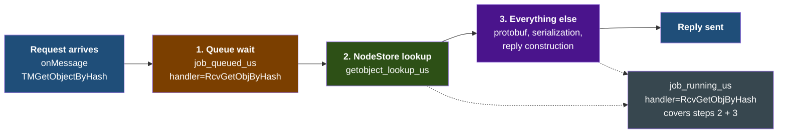

**Reading the diagram**

- Step 1 is time the job sat in `JtLedgerReq` before a worker picked it up. Only
  `job_queued_us` measures it.
- Steps 2 and 3 both happen inside the worker, so `job_running_us` covers them
  together. `getobject_lookup_us` isolates step 2 alone.
- Step 3 is therefore not measured directly. Derive it:
  `job_running_us − getobject_lookup_us`. That subtraction is what makes the set
  able to name a cause instead of just reporting a duration.

**Procedure** — work through these in order. The first row that matches is the
answer.

> **Scope every query to one node.** All snippets below carry
> `service_instance_id=~"$node"`. On a shared Grafana stack an unscoped selector
> aggregates across every node and branch reporting to it, so another node's
> saturation would be attributed to this one. Substitute the node's public key
> for `$node` when querying Prometheus directly rather than from a dashboard.

1. Split queue wait from run time. Compare the two p99s for the handler:

   ```promql
   histogram_quantile(0.99, sum by (le) (rate(job_queued_us_bucket{handler="RcvGetObjByHash", service_instance_id=~"$node"}[5m])))
   ```

   ```promql
   histogram_quantile(0.99, sum by (le) (rate(job_running_us_bucket{handler="RcvGetObjByHash", service_instance_id=~"$node"}[5m])))
   ```

2. If run time is the larger term, split it against the fetch loop:

   ```promql
   histogram_quantile(0.99, sum by (le) (rate(getobject_lookup_us_bucket{service_instance_id=~"$node"}[5m])))
   ```

3. Match the outcome below.

| Observation                                                                | Root cause and next step                                                                                                                                                                                                                                                            |
| -------------------------------------------------------------------------- | ----------------------------------------------------------------------------------------------------------------------------------------------------------------------------------------------------------------------------------------------------------------------------------- |
| `job_queued_us{handler="RcvGetObjByHash"}` high, `job_running_us` normal   | **Queue contention** — the work is cheap, the wait is not. Confirm with `jobq_ledgerrequest_deferred{service_instance_id=~"$node"} > 0`, then compare `job_queued_us{handler="RcvGetLedger"}`: if it is also high, both producers are starved by the limit of 3, not by each other. |
| `job_running_us` high and within ~10% of `getobject_lookup_us`             | **NodeStore is the bottleneck** — nearly all run time is in the fetch loop. Check `rate(getobject_lookups_total{result="miss"}[5m])` and the existing NuDB / `nodestore_state` panels. A miss-heavy mix means real disk seeks.                                                      |
| `job_running_us` high but `getobject_lookup_us` low                        | **Cost is outside the fetch loop** — protobuf, serialization, or reply construction. Storage is fine. Look at reply size: a large `getobject_request_objects` with a high hit rate means big replies to build and send.                                                             |
| `getobject_request_objects` p99 large                                      | **Peers are sending big batches** — the work is real, not a regression. Nothing is broken; the node is being asked to do more. Decide whether to accept the load or price it higher.                                                                                                |
| `rate(getobject_rejected_total{reason="oversize"}[5m])` rising             | **Non-conforming traffic** — requests above `kHardMaxReplyNodes` are being refused before any NodeStore access. Check `getobject_charge` to confirm the pricing escalates for the requests that _are_ accepted.                                                                     |
| `rate(getobject_rejected_total{reason="malformed_ledgerhash"}[5m])` rising | **Malformed requests** — a peer is sending a ledgerhash that is not 32 bytes. Refused at the gate; no queue or storage cost incurred.                                                                                                                                               |
| All GetObject metrics normal, `jobq_*_deferred` high on another type       | **This path is exonerated** — the slowness is elsewhere. Find the saturated type with `topk(5, {__name__=~"jobq_.*_deferred", service_instance_id=~"$node"} > 0)` and investigate that producer instead.                                                                            |

Row 2 says "within ~10%", not "equal", deliberately: `job_running_us` also
covers the charge computation (PeerImp.cpp:2757) and the reply `send()` that
follow the loop, so it is always the larger of the two. Treat a small residual as
normal and only a large one as a signal — that is what row 3 is for.

The last row matters as much as the others: the set can rule this path _out_,
which a slowness-only metric cannot.

**Caveats**

- `handler` collapses to `"other"` for any job name that is not all ASCII
  letters, so a handler breakdown is not exhaustive — see
  [The `handler` Label](#the-handler-label). This does not affect
  `RcvGetObjByHash` or `RcvGetLedger`; both pass through as distinct series.
- `jobq_*_deferred` is sampled at 1 s. A zero reading does not prove no
  saturation occurred — see the sampling caveat under
  [Per-Job-Type Queue Saturation](#per-job-type-queue-saturation).
- The two families compared in this procedure are exported on **different
  cadences by separate meter providers**: the `jobq_*` gauges every 1 s
  (`Telemetry.cpp` global provider) and `job_queued_us` / `job_running_us` /
  `getobject_*` every 10 s (the private `MetricsRegistry` provider). A short
  spike can therefore appear in one family a step before the other. When
  correlating them, widen the window rather than reading a single scrape, and
  do not conclude the two disagree from one interval's difference.
- A request rejected at either gate contributes to no other GetObject metric, so
  a rejection spike will _not_ show up as latency. Check the rejection counters
  before concluding that traffic is normal.

### Slow to reach `full`

Use this when a node takes far longer than expected to sync. Two completely
different bottlenecks look identical from outside: in both, the `ledgerData` job
lane sits pinned at its concurrency cap of 3 with jobs waiting behind it.

**Lane occupancy on its own distinguishes nothing.** It is true in both cases, so
it is never a diagnosis. Two tuning experiments were spent before that was known —
do not repeat them. Read the storage-side signals below instead.

The two modes and the signal that separates them:

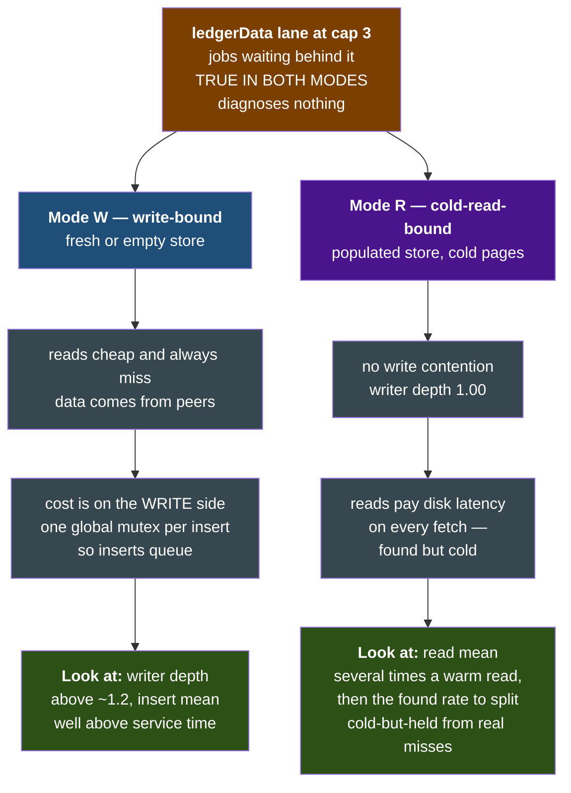

#### `node_reads_hit` is a found count, not a cache-hit rate

This is the most misleading signal on the board, so read it first.
`fetchHitCount_` is incremented whenever the fetch **returned an object**
(`src/libxrpl/nodestore/Database.cpp:246-255`) — not when a cache served it. So
`node_reads_hit / node_reads_total` is the fraction of fetches that **found**
something, and it can read ~100% while every one of those fetches went to disk.

A ~100% "hit rate" at over 100 µs per read is therefore not a contradiction. It is
the cold-read signature: the data is on disk, found every time, and paid for every
time.

An incident report supplied to this project describes a devnet client-handler node
that had not reached `full` after roughly 25 minutes while reading at 112.7 µs per
fetch, against an otherwise-identical peer that reached `full` in 4.4 minutes at
4.95 µs per fetch. Both reported a found rate of ~99.98%. Those figures come from
that report, not from a run on our own hosts. Note that the found rate is identical
on the healthy peer and the stalled one, which is exactly why the found rate is
never a trigger on its own — see the decision rule below. Read this incident
alongside [Honest limits of this diagnosis](#honest-limits-of-this-diagnosis)
before concluding that cold reads caused the 25 minutes; on our own hardware they
did not produce anything like it.

A node configured with `online_delete` runs `DatabaseRotatingImp`, which has **no
NodeObject cache** at all (0 `cache_` references in
`src/libxrpl/nodestore/DatabaseRotatingImp.cpp` versus 11 in
`DatabaseNodeImp.cpp`), so every fetch reaches the backend. That is why the
cold-read mode shows up on exactly those nodes.

#### The decision rule

**Procedure** — all of it assumes the `ledgerData` lane is already at its cap; if
it is not, this procedure does not apply.

Answer two questions, in this order. Neither one alone is a diagnosis.

**Question 1 — are reads expensive?** Read `read_mean_us`.

- Under ~10 µs: reads are **cheap**. Both a clean store and a healthy populated
  store land here.
- Over ~20 µs: reads are **expensive**.
- Between the two: break the tie on the tail. Take `max_over_time` of
  `read_mean_us` across the window. Over ~100 µs counts as expensive;
  otherwise treat it as cheap. There is no read-max gauge —
  `nudb_insert_max_us` is a **write** signal and does not answer this.

**Question 2 — is the write path queueing?** Read
`nudb_writer_depth_x100 / 100`. Above ~1.2 is queueing at the insert mutex.
Depth of 1.00 is not. On a non-NuDB backend the series is absent, so this
question has no answer and only question 1 applies.

Then read the answer off the pair:

| Reads     | Write path      | Root cause and next step                                                                                                                                                                                                                                      |
| --------- | --------------- | ------------------------------------------------------------------------------------------------------------------------------------------------------------------------------------------------------------------------------------------------------------- |
| Cheap     | Depth ~1.00     | **Not a storage bottleneck.** Nothing is queueing at either side. Look outside storage: work is either not arriving from peers or being discarded before it lands. Check `acquire_ledger_deferrals` against `acquire_ledger_timeouts`, and the sweep counter. |
| Cheap     | Depth over ~1.2 | **Serialized write path.** The queue is at the backend's insert mutex, not at the device. Tuning the disk will not help; see the note below. This is the clean-store mode.                                                                                    |
| Expensive | Depth ~1.00     | Split on the **found rate**. At 50% or above, **cold reads on data the node already has** — the walk pays disk latency on objects it holds. Below 50%, **genuinely disk-bound on real misses**, and storage hardware is the right thing to change.            |
| Expensive | Depth over ~1.2 | **Both paths queueing.** Rarer, and neither fix on its own will be enough. Treat the larger of the two costs as the lead.                                                                                                                                     |

**Why the rule is shaped this way.** Three points about the thresholds, each
learned from a dataset that an earlier version of this table got wrong:

- **Read cost is a relative judgement, so the band has a floor and a ceiling, not
  one cut.** A cold read on our box measured 31.8 µs mean; a cold read on the
  devnet node in the reported incident measured 112.7 µs. A single "over 100 µs"
  cut would call our own cold-read run healthy. Cheap and expensive are set at
  ~10 µs and ~20 µs with the peak breaking ties in between, because what matters
  is whether reads cost several times a warm read, not whether they cross one
  absolute number.
- **The found rate is a splitter, never a trigger.** A high found rate on its own
  is the normal, healthy state of a populated store — the healthy peer in the
  reported incident read 99.98% found at 4.95 µs per read and was fine. Only ask
  the found rate once reads are already known to be expensive; then it separates
  "slow on data we have" from "slow because we are missing".
- **Writer depth answers before the found rate.** Depth above 1 means the queue is
  at the insert mutex, which no amount of read-side tuning addresses. It is also
  the only signal that is unambiguous on a clean store, where the found rate is
  near zero and read cost is uninformative.

Completions and sweeps do not pick the row. They say how **severe** the read case
is once the row is picked: a populated store with cold pages can still finish (our
reference run reached `full` in 260 s with 8 completions) or can fail to finish at
all, which is what the reported incident describes. Same cause, different severity.

Queries, scoped to one node as everywhere else in this runbook:

```promql
# Are acquisitions finishing? (per minute)
increase(nodestore_state{metric="acquire_completions", service_instance_id=~"$node"}[1m])

# Question 1 -- read cost, in microseconds per read
nodestore_state{metric="read_mean_us", service_instance_id=~"$node"}

# The tail, for the 10-20 us tie-break. No read-max gauge exists, so take the
# highest value the mean reached over the window.
max_over_time(nodestore_state{metric="read_mean_us", service_instance_id=~"$node"}[15m])

# Question 2 -- write-side queueing. Depth is fixed-point, divide by 100.
nodestore_state{metric="nudb_writer_depth_x100", service_instance_id=~"$node"} / 100

# The insert time that goes with that depth
nodestore_state{metric="nudb_insert_mean_us", service_instance_id=~"$node"}

# The found rate, which splits the expensive-read row only. Do not read it on
# its own: a high found rate is normal and healthy on a populated store.
  rate(nodestore_state{metric="node_reads_hit", service_instance_id=~"$node"}[5m])
/ rate(nodestore_state{metric="node_reads_total", service_instance_id=~"$node"}[5m])

# The deferral/timeout pair, scoped to ledger acquisition. Use these two, not
# the all-lane acquire_deferrals / acquire_timeouts -- see the pair section below.
increase(nodestore_state{metric="acquire_ledger_deferrals", service_instance_id=~"$node"}[5m])
increase(nodestore_state{metric="acquire_ledger_timeouts", service_instance_id=~"$node"}[5m])
```

#### Measured reference points

**Provenance.** The two columns below are our own measurements: node2 on the AWS
dev box, build `e3c2f8279a`, 2026-07-27/28, same host and same binary for both
runs, differing only in the state of the store. Use them as the shape to compare
against, not as thresholds. The read figures below come from the `read_mean_us`
gauge, the only read-latency signal exported; the "highest sample" row is the
largest value that gauge reached over the run, not a read-latency percentile. The third dataset in this section — the 25-minute devnet stall and its
healthy peer — is **not** ours; it comes from an incident report supplied to this
project and is kept separate for that reason.

**Three rows below were measured on a build that got them wrong.** Both runs
predate the measurement fixes, so read those rows as bounds rather than values:

- **Completions** were only counted in `InboundLedger::done()`, so an acquisition
  satisfied entirely from the local store — `init()` sets `complete_` and returns
  without ever calling `done()` — was never counted. Mode W's `0` is therefore not
  evidence that the node completed nothing; it reached `full`, which it could not
  have done without completing acquisitions. The count is now taken at both exits
  behind an idempotent latch, so on a current build a zero means zero.
- **Writer depth** was summed at insert entry but divided by a sample count that
  only advanced at insert exit, so in-flight inserts — the deep, slow ones —
  contributed depth to the numerator and nothing to the denominator. The mean was
  biased **down**, worst exactly when queueing was worst. Mode W's 1.60 is a lower
  bound on the true depth.
- **Queueing per insert** is derived from that depth, so its 37 % is a lower bound
  too. See the derivation below.

| Signal                         | Mode W: clean store      | Mode R: populated store, cold pages |
| ------------------------------ | ------------------------ | ----------------------------------- |
| Time to `full`                 | 510 s                    | 260 s                               |
| `read_mean_us`                 | 8.8 µs                   | 31.8 µs                             |
| `read_mean_us`, highest sample | 9 µs                     | 223 µs                              |
| Found rate                     | 0.00 %                   | 88.3 %                              |
| Insert time, mean              | 20.0 µs                  | 15.9 µs                             |
| Writer depth, mean             | ≥ 1.60 (biased low)      | 1.00                                |
| Queueing per insert            | ≥ 37 % (derived from ↑)  | 0 %                                 |
| Deferrals over run, all lanes  | +5441                    | +1845                               |
| Timeouts over run, all lanes   | +687                     | +399                                |
| Completions over run           | 0 (under-counted, see ↑) | 8 (under-counted, see ↑)            |
| Sweep evictions                | +127                     | +38                                 |

Applying the decision rule: Mode W reads cheap (8.8 µs) with depth 1.60, so it is
the serialized write path. Mode R reads expensive (31.8 µs mean, 223 µs peak) with
depth 1.00 and a found rate well above 50%, so it is cold reads on data the node
holds. The rule reaches both answers without the found rate deciding either mode on
its own — and both answers survive the corrected measurements, because a
depth-1.60 lower bound is still above the 1.2 threshold and Mode R's 1.00 is a
floor that cannot be biased below itself.

The deferral and timeout rows are the **all-lane** counters, the only ones that
existed when these runs were taken. They cannot be attributed to ledger
acquisition; the eight-to-one ratio in Mode W is a whole-node figure. Re-measure
with `acquire_ledger_deferrals` / `acquire_ledger_timeouts` before quoting a ratio
as a ledger-acquisition fingerprint.

**The reported incident, for contrast — not our measurement.** Figures from an
incident report supplied to this project. No writer-depth data was captured, so the
rule reaches its answer from question 1 alone.

| Signal         | Stalled client handler | Healthy peer |
| -------------- | ---------------------- | ------------ |
| Time to `full` | not reached in ~25 min | 4.4 min      |
| `read_mean_us` | 112.7 µs               | 4.95 µs      |
| Found rate     | ~99.98 %               | ~99.98 %     |
| Writer depth   | not captured           | not captured |

The healthy peer is the reason the found rate is a splitter and not a trigger: it
reported the same ~99.98% as the stalled node and was fine. What separates them is
read cost — 4.95 µs is a warm read, 112.7 µs is not.

What healthy looks like: read mean in the single-digit microseconds, writer depth
at 1.00, queueing near 0%, and `acquire_completions` advancing. Any one of a read
mean several times a warm read, a writer depth above ~1.2, or completions flat at
zero is worth chasing.

**Completions flat at zero only means something on a current build.** Until the
counter was moved to cover both exits, an acquisition served from the local store
was never counted, so a build predating that fix could read zero while completing
steadily. Check the build before treating a zero on archived data as a symptom.

**How the 37% is derived, and why it is a lower bound.** It is not measured
directly — it comes from the two gauges by Little's Law. With mean queue depth L
and mean insert time W, the service time is `S = W / L` and the queueing component
is `W − S`. Mode W's 20.0 µs at depth 1.60 gives S = 12.5 µs, so 7.5 µs of every
insert — 37% — was spent waiting for the mutex rather than writing.

That 37% is **not exact**: the L it was computed from came from the biased
estimator described above, which understated depth. A larger L gives a smaller S
and a larger `W − S`, so the true queueing share of Mode W was **at least** 37%.
Quote it as a floor. Mode R's depth of exactly 1.00 is unaffected — 1.00 is the
minimum a depth can be, so no bias can have pushed it there — which is why its 0%
stands as measured.

**Why the write path serializes.** NuDB takes one global mutex per insert
(`nudb/impl/basic_store.ipp:288`). It is a Conan dependency and is not patched
here, so this is a property to observe and design around, not a bug to fix
locally. `nudb_writer_depth_x100` is the queue length at that mutex.

#### The deferral/timeout pair

Read these two together or not at all. The livelock fingerprint is **deferrals
rising while timeouts stay flat**.

**Read the ledger-scoped pair, not the all-lane pair.** Both events are recorded in
`TimeoutCounter`, a base class shared by five subclasses — `InboundLedger`,
`TransactionAcquire`, `LedgerReplayTask`, `LedgerDeltaAcquire` and
`SkipListAcquire` — each with its own job limit. `acquire_deferrals` and
`acquire_timeouts` therefore pool every lane, so a replay lane sitting at its own
limit produces the fingerprint shape while ledger acquisition is perfectly healthy.
That is a false positive on a headline diagnosis. `acquire_ledger_deferrals` and
`acquire_ledger_timeouts` count the same two events for the `InboundLedger` lane
only (`src/xrpld/app/ledger/detail/TimeoutCounter.h`, `isLedgerAcquisition()`), and
they are the pair this procedure means. The all-lane totals remain useful for one
question only: whether _any_ lane is deferring.

A deferral happens when the acquisition timer job finds its lane's job count at or
above the acquisition's own limit — 5 for `InboundLedger`
(`src/xrpld/app/ledger/detail/InboundLedger.cpp:86`), compared against
`getJobCountTotal()` in `TimeoutCounter::queueJob()`
(`src/xrpld/app/ledger/detail/TimeoutCounter.cpp:62-64`). That is not the same as
the `ledgerData` lane's concurrency cap of 3 (`include/xrpl/core/JobTypes.h:63`):
the gate counts running plus queued, so it fires at 3 running plus 2 queued. The
timer is re-armed but its **body does not run**, so the retry counter never
advances and the 6-timeout give-up becomes unreachable — the give-up path is
disarmed and the acquisition can never end on its own. Neither counter alone shows
this: deferrals rising looks like ordinary backpressure, and timeouts flat looks
like health. Only the divergence is diagnostic. See the counter documentation in
`src/xrpld/app/ledger/AcquireStats.h`.

Two more pairs from the same family:

- `acquire_sweep_evictions` rising while `acquire_completions` stays at zero →
  partial work is being discarded and redone. The sweep drops any acquisition
  idle for more than one minute
  (`src/xrpld/app/ledger/detail/InboundLedgers.cpp:400`), taking whatever it had
  built with it.
- `acquire_aborts_partial` rising → the expensive form of an abort, where partly
  built maps were thrown away. `acquire_aborts` alone does not separate the cheap
  case from this one.

#### Honest limits of this diagnosis

- **Our populated-store run was twice as fast, not slower** — 260 s against 510 s,
  despite reads being roughly 4× more expensive. Reusing local data beats fetching
  from peers even when every read is cold. Slow cold reads therefore do **not** on
  their own explain the ~25-minute stall in the reported devnet incident. The
  decision rule identifies the _mode_ correctly in both cases; it does not claim
  that the mode alone accounts for that duration.
- Something compounds it there, and we have not confirmed what. The most likely
  candidate is a much larger store, where the walk takes long enough that the
  1-minute sweep destroys partial work faster than it can complete — which is why
  the sweep and completion counters are in the table. **This is an unconfirmed
  hypothesis.** Treat it as the next thing to test, not as the answer. It was also
  partly suggested by Mode W's zero completions, which we now know was a counting
  defect rather than a stalled node, so the hypothesis has lost one of its
  supports and needs re-testing on a current build before it is pursued.
- **Three of the numbers above were measured with instruments that were since
  corrected**: completions (missed local-store hits), writer depth (mean biased
  low), and the deferral/timeout pair (pooled across five job lanes). The modes
  and the decision rule are unaffected — each survives the correction, as noted
  where it appears — but no figure in the reference table should be quoted as an
  exact measurement without re-running on a build that has all three fixes.
- The `nudb_*` label values are absent entirely on a non-NuDB writable backend.
  Absent is not zero — a missing series means "not applicable", so a panel showing
  a gap there is correct behaviour.
- **`write_load` and `nudb_writers_in_flight` are the same number on NuDB.** Both
  read the same atomic: `NuDBBackend::getWriteLoad()` returns `concurrentWriters`
  (`src/libxrpl/nodestore/backend/NuDBFactory.cpp:355-361`), which is also what
  `WriteStats::concurrentWriters` reports. Their agreement confirms nothing — it is
  one signal plotted twice. On RocksDB `write_load` is a genuinely different
  quantity, the larger of the recorded load and the pending batch size
  (`src/libxrpl/nodestore/BatchWriter.cpp:47-53`), so it is a batch-queue length
  rather than a thread count.
- **`stored_object_bytes` is not the size of the store on disk.** It reports the
  cumulative object-payload bytes this process has written — the same value as
  `node_written_bytes`, from the same accessor — so it excludes keys, padding and
  the log, and it resets with the process. A ratio of the two is a constant 1.0 and
  measures nothing. This label value was called `nudb_bytes` in earlier revisions; it
  comes from `node_store::Database` rather than the NuDB backend, so it is not part
  of the `nudb_*` family above and reads the same on RocksDB.
- These gauges are sampled on the `MetricsRegistry` reader's 10 s cadence, while
  the `jobq_*` lane gauges are sampled at 1 s by a different provider. Widen the
  window when correlating them rather than reading a single scrape; see the caveat
  under [Slow TMGetObjectByHash service](#slow-tmgetobjectbyhash-service).
- `read_mean_us` and `write_mean_us` are omitted rather than reported as zero when
  nothing has been read or written yet, so an idle node legitimately shows no
  series.

Existing panels that already carry part of this picture, on the _Ledger Data &
Sync_ dashboard: **NuDB Read Latency**, **NuDB Read Found Ratio**, **NuDB Read
Pressure**, and **Job Queue Backlog and Deferred by Type** for the lane occupancy
that this procedure tells you to distrust on its own.

The pair this procedure asks for is on **Ledger Acquire Deferrals vs Timeouts
(Ledger Lane Only)**, in the _Sync Bottleneck Discrimination_ row. The adjacent
**Acquire Deferrals vs Timeouts (All Lanes)** plots the pooled totals; read it only
to see whether some other acquisition lane is also under pressure.

**NuDB Read Found Ratio** plots `node_reads_hit / node_reads_total`. That is the
found rate, not a cache hit ratio: the underlying counter increments whenever a
fetch returned an object, and a node with `online_delete` has no object cache at
all. A rate near 1.0 alongside an expensive read time is the cold-read signature,
not a sign the cache is working.

### High memory usage

- Reduce trace volume with collector-side tail sampling (xrpld head sampling is
  fixed at 1.0 and is not configurable)
- Reduce `max_queue_size` and `batch_size`
- Disable high-volume trace categories: `trace_peer=0`

### Collector connection failures

- Verify endpoint URL matches collector address
- Check firewall rules for ports 4317/4318
- If using TLS, verify certificate path with `tls_ca_cert`

### Node exits at startup with `Unable to start ...: [telemetry] ...`

- Symptom: the process exits immediately with a non-zero status (255 on POSIX)
  — a clean exit, not a crash — after printing that line on stderr. Any
  exception thrown while the `Application` object is constructed prints the same
  `Unable to start` prefix, so confirm the text after the colon begins with
  `[telemetry]` before using this entry
- Cause: either the `[telemetry]` mTLS keys (`tls_client_cert` and
  `tls_client_key`) contradict each other, or one of the TLS certificate paths
  cannot be read. Only these three checks are gated on `enabled=1`; the rest of
  the section is still read when telemetry is off, so a malformed value in any
  key — including `enabled` itself, which is read before the gate — still fails
  startup with a different message
- Fix: the three checks need different remedies, and the printed message says
  which one fired
  - `tls_client_cert and tls_client_key must be set together` — exactly one of
    the two paths is set. Either delete the one that is set, or add the missing
    one **and** set `use_tls=1`. Unless `use_tls=1` is already set, adding the
    missing path on its own just moves the failure to the second check
  - `tls_client_cert/tls_client_key require use_tls=1` — both paths are set but
    TLS is off. Either set `use_tls=1`, or delete **both** paths. Deleting only
    one of them trips the first check
  - `<key> cannot be read` — the named key (`tls_ca_cert`, `tls_client_cert` or
    `tls_client_key`) points at a file the node cannot open; the message also
    prints the path and the OS error. Fix the path or its permissions — the
    pairing is not what is wrong here. This check runs only when `use_tls=1`,
    and an empty `tls_ca_cert` is always accepted (it selects the system CA
    store)
  - If you did not mean to enable telemetry at all, set `enabled=0` — that
    clears all three checks whichever one fired

### No trace_id in log output

- Verify xrpld was built with `telemetry=ON` (the `XRPL_ENABLE_TELEMETRY` preprocessor flag)
- Verify `enabled=1` in the `[telemetry]` config section
- Log lines only contain `trace_id`/`span_id` when emitted inside an active span — background logs outside of RPC/consensus/transaction processing will not have trace context
- Check `log_level` is at least `info`. The dependably correlated line is the consensus accept pair, which is at info severity, so at `warning` or above correlation becomes incidental. `info` is necessary but not sufficient: the accept pair also needs telemetry enabled, `trace_consensus=1`, a valid round span context and a sampled span context — see [Which Log Lines Carry Trace Context](#which-log-lines-carry-trace-context) for the full precondition table
- A plain `SpanGuard` that is never activated does not make its span current, so lines inside one are never correlated regardless of severity. Activated guards (`activate()` / `activateIfLive()`) and `ScopedSpanGuard` both do make their span current
- Check that the specific trace category is enabled (e.g., `trace_rpc=1`)

### No logs in Loki

- Verify the log file mount in docker-compose.yml points to the correct xrpld log directory (default source `docker/telemetry/data/logs`, or the `XRPLD_LOG_DIR` override) and that xrpld actually writes `debug.log` there
- Check OTel Collector logs for filelog receiver errors: `docker compose logs otel-collector`
- Verify Loki is running: `curl http://localhost:3100/ready`
- Check the filelog receiver glob `/var/log/xrpld/*/debug.log` matches your log layout — the log file must sit one subdirectory below the mount root

### Diagnosing slow/stuck fresh sync

A fresh node that is slow to reach `server_state=full`, or never reaches it, is
diagnosed from the **Ledger Sync Health** dashboard (uid `ledger-sync-health`).
Its nine rows are ordered the way a fresh node progresses, so reading the board
top-to-bottom walks the same path a sync does:

| #   | Row                           | Question it answers                                  |
| --- | ----------------------------- | ---------------------------------------------------- |
| 1   | Bootstrap (Domain 0)          | Can the node reach peers and form a quorum at all?   |
| 2   | Peer supply                   | Does any peer hold what this node needs?             |
| 3   | Sync state                    | Is the node advancing through the mode machine?      |
| 4   | Ledger acquire & SHAMap fetch | Is ledger data arriving and being applied?           |
| 5   | Job queue                     | Does arrived work ever get a worker thread?          |
| 6   | Quorum & publish              | Does a held ledger ever validate, and reach clients? |
| 7   | Terminal blockers & serving   | Will the node stop validating for good?              |
| 8   | Back-fill & persistence       | Is an existing database the bottleneck?              |
| 9   | Spans & traces                | _Which_ fetch, peer or object — not how many?        |

**Start from the symptom, not from row 1.** Match what you observe to a branch
below; each branch names the panels that discriminate it, what healthy and
unhealthy look like, and what to conclude. The branch then points at the
numbered ordered-diagnosis steps further down, which are the detail.

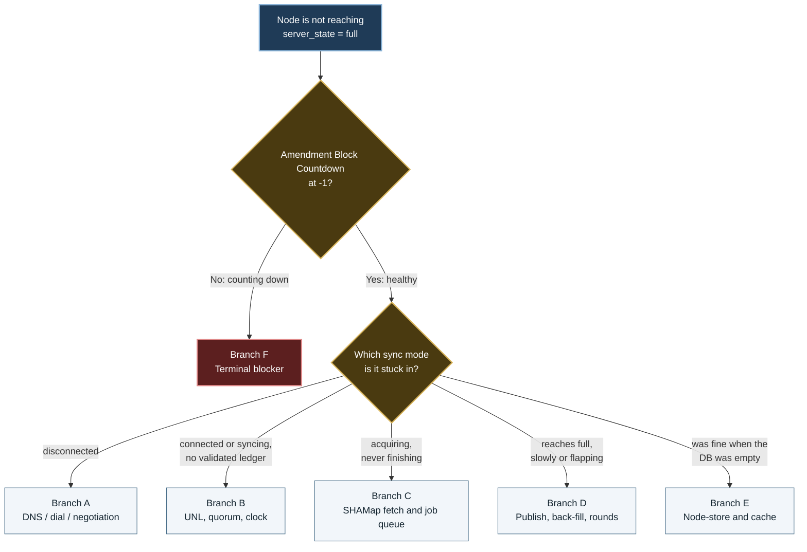

**Check branch F first, always.** It is the only branch whose window closes:
once an unsupported amendment activates there is no operational fix, so it
outranks every other symptom regardless of what the mode machine says.

#### Branch A — stuck at `disconnected`

Peer count flat at zero; _Mode Transitions by Edge_ shows the node never leaving
`disconnected`, or churning straight back to it.

| Look at                                    | Healthy                                | Unhealthy                                                                          | Conclude                                                                                                                                                                                    |
| ------------------------------------------ | -------------------------------------- | ---------------------------------------------------------------------------------- | ------------------------------------------------------------------------------------------------------------------------------------------------------------------------------------------- |
| _DNS Resolve Outcome Rate_                 | all rate on `outcome=resolved`         | any rate on `empty`, or both flat at zero                                          | a name in `[ips]`/`[ips_fixed]` returns no address, or the list is empty — fix the hostname or use an IP                                                                                    |
| _DNS Resolve Latency (p95)_                | milliseconds                           | seconds-scale                                                                      | the resolver is timing out and delaying every dial behind it                                                                                                                                |
| _Outbound Dial Outcome Rate_               | `connected` non-zero                   | all attempts on one failure outcome                                                | `tcp_fail` = route/firewall/closed port · `tls_fail` = TLS · `self_connection` = we dialled our own address · `upgrade_fail` = negotiation, go to the next row · `timeout` = never terminal |
| _Outbound Dial Latency (p95)_              | well under the dial timeout            | pinned near it                                                                     | peers accept TCP but never finish the handshake                                                                                                                                             |
| _Handshake Negotiation Failures by Reason_ | flat, or a low background rate         | any sustained `reason`                                                             | `wrong_network`/`invalid_network_id` is the most common fresh-node fault — the node is on a different network and can never reach quorum; `clock_skew` sends you to branch B                |
| _PeerFinder Slot Census_                   | `out_active` climbing toward `out_max` | `connecting` non-zero with `out_active` low; or `bootcache` and `livecache` both 0 | dials never complete; or there is nothing to dial at all                                                                                                                                    |

**Conclusion:** the node has no usable overlay. Nothing downstream can be
diagnosed until `connected` on _Outbound Dial Outcome Rate_ is non-zero. Detail:
[Bootstrap ordered diagnosis](#bootstrap-domain-0--ordered-diagnosis) steps 1-3
and [Sync-pipeline](#sync-pipeline--ordered-diagnosis) step 12.

#### Branch B — stuck at `connected`/`syncing`, no validated ledger

The node has peers, `server_state` reaches `connected` or `syncing`, and
_Time to First Validated Ledger_ stays flat at zero.

| Look at                                              | Healthy                                                                   | Unhealthy                                                     | Conclude                                                                                                                                                                                                                                                   |
| ---------------------------------------------------- | ------------------------------------------------------------------------- | ------------------------------------------------------------- | ---------------------------------------------------------------------------------------------------------------------------------------------------------------------------------------------------------------------------------------------------------- |
| _UNL Fetch Rate by Site & Outcome_                   | `accepted` once per site, then `same_sequence`/`known_sequence` refreshes | `fetch_error`/`bad_status`/`parse_error`                      | the publisher site is unreachable, so no keys load from it                                                                                                                                                                                                 |
|                                                      |                                                                           | `expired`                                                     | the list applied but is past its validity window — refresh the blob and check the local clock, do not replace `validators.txt`                                                                                                                             |
| _UNL Trusted Keys vs Quorum_ + _UNL Quorum Headroom_ | `trusted_keys` above `quorum`, headroom positive                          | headroom zero or negative (red)                               | **the node will never validate**: the trusted list is too small to satisfy quorum. It can track ledgers forever and never declare one validated                                                                                                            |
|                                                      |                                                                           | `quorum` about 9.2e18                                         | the **quorum-disabled** sentinel — too many publishers unavailable. Fix publisher reachability; the key count is irrelevant until quorum is re-enabled                                                                                                     |
| _Clock Close Offset_                                 | magnitude decaying under 1 s                                              | above 1 s and not decaying                                    | local NTP fault delaying consensus participation, and the cause behind a `clock_skew` handshake reason                                                                                                                                                     |
| _Network Ledger Gate_                                | clears within minutes of startup                                          | persistent 1 (red)                                            | the node has never seen a complete network ledger — go back to branch A, not deeper                                                                                                                                                                        |
| _Trusted Validations vs Quorum Target_               | tally climbing toward the target                                          | tally flat below the target                                   | **stuck at the quorum gate**: validations arrive and never reach quorum. Judge by the sustained floor over minutes, never one sample — the first evaluation of each round runs before peers' validations arrive, so a healthy node sawtooths               |
|                                                      |                                                                           | both flat at 0                                                | the gate has never been evaluated; nothing has been offered — upstream problem, back to branch A                                                                                                                                                           |
| _Trusted Validation Accept Rate by Status_ (row 9)   | nearly all `current`                                                      | concentrated in `stale`, `bad_seq`, `multiple`, `conflicting` | validations arrive and are counted for nothing — this is what separates "slow to validate" from "never will", and it is invisible in the tally. Bulk `stale` = clock/timing; bulk `multiple`/`conflicting` = a misbehaving trusted validator or two chains |

**Conclusion:** the fault is in trust and time, not in data supply. Detail:
[Bootstrap](#bootstrap-domain-0--ordered-diagnosis) steps 4-5 and
[Sync pipeline](#sync-pipeline--ordered-diagnosis) steps 2 and 16.

#### Branch C — acquiring but never finishing

Ledger acquires are in flight, _Ledgers Behind Network_ is flat or rising, and
`full` never arrives.

| Look at                                                                                                       | Healthy                                           | Unhealthy                                                       | Conclude                                                                                                                                                                                                                                    |
| ------------------------------------------------------------------------------------------------------------- | ------------------------------------------------- | --------------------------------------------------------------- | ------------------------------------------------------------------------------------------------------------------------------------------------------------------------------------------------------------------------------------------- |
| _Missing SHAMap Nodes per Acquire (state/tx)_                                                                 | falling toward zero (read the trend over minutes) | **flat and non-zero**                                           | **no peer is serving that tree** — the node will sit here forever. Pinned at 256 is the per-sweep cap, meaningful only with the trend                                                                                                       |
| _Acquire Stall Rate (no progress)_                                                                            | flat                                              | sustained rate **together with** a flat missing-node count      | the definitive stuck-sync signature: requesting and nobody answering                                                                                                                                                                        |
| _Peers Able to Serve Needed Sequence_                                                                         | `peers_serving_next` above zero                   | `peers_serving_next` = 0 while `peers_reporting` > 0            | **decisive**: peers are connected and none holds the next needed ledger. Waiting cannot finish it — the peer set must change. Everything else in branch C will look starved as a consequence, so do not chase it                            |
| _Peer Supply Window Margin (history headroom vs tip gap)_                                                     | _History Headroom_ positive, _Tip Gap_ near zero  | _History Headroom_ **below zero**                               | asking for history nobody kept — needs a full-history peer                                                                                                                                                                                  |
|                                                                                                               |                                                   | _Tip Gap_ growing steadily                                      | the peer set lags the real network; not a history problem                                                                                                                                                                                   |
| _Ledger Acquire Phase Outcomes (by phase & timeout)_ + _Ledger Acquire Phase Duration (p95 by phase)_ (row 9) | `header` short, `astree` the bulk                 | `astree` hot with `timed_out=true` and non-zero `missing_nodes` | the common stuck shape — peers are not supplying account-state nodes                                                                                                                                                                        |
|                                                                                                               |                                                   | `header` hot                                                    | the node is waiting to be **told what to fetch**; invisible in the missing-node counts, which are both still zero                                                                                                                           |
| _Add-Node Outcomes_                                                                                           | `good` dominates                                  | `duplicate` swamps `good`                                       | bandwidth busy, acquire standing still — peers re-sending known data                                                                                                                                                                        |
|                                                                                                               |                                                   | `invalid` rising                                                | a specific misbehaving peer, not a local fault                                                                                                                                                                                              |
| _Received-Data Stash Depth & In-Flight Acquires_                                                              | stash drains                                      | stash growing                                                   | data arrives faster than it is applied — a job-queue or disk problem, the **opposite** conclusion from a stall rate, and only this panel separates them                                                                                     |
| `jobq_<jobtype>_deferred`                                                                                     | flat at 0                                         | sustained non-zero on `ledgerdata`/`ledgerrequest`              | a job the queue accepted then **withheld** at its concurrency limit of 3 — it appears in neither `waiting` nor `running`, so no other signal can show it. Starved `ledgerdata` is exactly why the stash grows while missing nodes stay flat |
| _Worker Pool Saturation_ + _Worker Pool Capacity & Total Backlog_                                             | under 80%                                         | 100% with `total_waiting` climbing                              | the pool is **exhausted** — every stage looks slow at once. Stop here; no per-subsystem fix helps while no thread is free                                                                                                                   |
| Acquire outcome `abandoned` in Tempo (`{name="ledger.acquire" && span.outcome="abandoned"}`)                  | absent                                            | present                                                         | the acquire was swept or shut down before reaching a result — without this value a stuck-then-swept fetch had no `outcome` at all and vanished from every outcome rate                                                                      |

**Conclusion:** distinguish "nobody is serving it" (peer supply) from "it arrives
and we cannot process it" (job queue / disk). The two look identical in a log and
are separated only by the stash-depth and per-type deferred gauges. Detail:
[Sync pipeline](#sync-pipeline--ordered-diagnosis) steps 6-12 and 17.

#### Branch D — reaching `full` but slowly, or falling back out of it

_Time to First FULL_ has a value, or the node flaps between `full` and
`connected`.

| Look at                                                                            | Healthy                         | Unhealthy                                                  | Conclude                                                                                                                                                                                                                           |
| ---------------------------------------------------------------------------------- | ------------------------------- | ---------------------------------------------------------- | ---------------------------------------------------------------------------------------------------------------------------------------------------------------------------------------------------------------------------------- |
| _Publish Lag (validated minus published)_                                          | flat at 0 or 1                  | positive and growing                                       | validation is healthy and the **publish pipeline is not** — the node is current while its clients see stale data. Local processing fault: go to the job-queue and stall panels                                                     |
|                                                                                    |                                 | flat at 0 on a node that never validated                   | not healthy, merely empty — read _Trusted Validations vs Quorum Target_ first                                                                                                                                                      |
| _Server Stall_ + _Server Stall Event Rate_                                         | both zero                       | large seconds, **flat** event rate                         | one long unresolved stall; past 600 s the server deliberately fails                                                                                                                                                                |
|                                                                                    |                                 | small seconds, **rising** event rate                       | repeated short stalls — periodic work (sweeps, large writes), not one stuck operation                                                                                                                                              |
| _Mode Transitions by Edge_                                                         | each climb edge roughly once    | repeated `full`→`connected` paired with `connected`→`full` | flapping: reaching `full` and losing it. Sends you to the stall panels or to branch B's clock and quorum panels — those are what drop a node out of `full`                                                                         |
| _Consensus Round Duration (p50/p95/p99)_ + _Consensus Round Duration Distribution_ | band steady                     | band drifting up, or a second high band                    | rounds are taking longer; read against _Tx-Set Acquire Duration (p95)_ (rounds waiting on data) and _Trusted Validations vs Quorum Target_ (validations arriving too late)                                                         |
|                                                                                    |                                 | p95 climbing, p50 flat                                     | a minority of rounds stall — the early form of a second band                                                                                                                                                                       |
|                                                                                    |                                 | both rising together                                       | the network is slowing, not this node. Compare another node via `$node` first                                                                                                                                                      |
| _Tx-Set Acquire Outcomes_ + _Tx-Set Acquire Duration (p95)_ (row 9)                | flat at zero, or all `complete` | `timeout`/`abandoned` climbing                             | proposed sets never complete — rounds wait on data, not on agreement. This is the consensus path, not history back-fill                                                                                                            |
|                                                                                    |                                 | `complete` p95 approaching the round interval              | sets arrive but so late they delay their own round; the outcome rate cannot show this because they succeed                                                                                                                         |
| _Replay Fallback to Full Acquire (by stage)_ (row 8)                               | flat                            | any sustained rate                                         | too few peers support the `LedgerReplay` feature, so every historical ledger is fetched whole. Nothing fails — the optimisation is simply gone, which is why it is easy to miss. `stage` names the sub-task: `skiplist` or `delta` |
| _Replay Outcomes (by terminal state)_ (row 8)                                      | `success` climbing              | `timeout` climbing                                         | deltas never arrived — treat as peer supply, read with branch C                                                                                                                                                                    |
|                                                                                    |                                 | `build_failed`/`parameter_failed`                          | **data** faults from the serving peers, not slowness — the peer set is suspect                                                                                                                                                     |

**Conclusion:** the pipeline works; something behind it is not keeping up.
Publish lag and stalls are local, round duration is often network-wide, and
replay fallback is a silent loss of an optimisation rather than a failure.
Detail: [Sync pipeline](#sync-pipeline--ordered-diagnosis) steps 3, 5, 15, 16
and 18.

#### Branch E — an existing database syncs slower than a fresh one

The specific symptom: a node with history starts and is slower than the same node
was when empty. Back-fill is **write**-bound, so no read-side panel shows it.
Read the **Back-fill & persistence** row.

| Look at                                                     | Healthy                                                                                                                                                                     | Unhealthy                                                       | Conclude                                                                                                                                                                                                                                                                                                                                     |
| ----------------------------------------------------------- | --------------------------------------------------------------------------------------------------------------------------------------------------------------------------- | --------------------------------------------------------------- | -------------------------------------------------------------------------------------------------------------------------------------------------------------------------------------------------------------------------------------------------------------------------------------------------------------------------------------------- |
| _NodeStore Write vs Read Latency (us/op)_                   | write line flat and low                                                                                                                                                     | write line rising during back-fill                              | the backend cannot absorb writes. Adding peers will not help — check storage IOPS, the `[node_db]` backend and whether online-delete/rotation competes with the back-fill                                                                                                                                                                    |
|                                                             |                                                                                                                                                                             | read line far above write                                       | the read path is the cost; read with the cache-hit panel below                                                                                                                                                                                                                                                                               |
| _NodeStore Operation Rate (writes vs reads)_                | write rate non-zero while behind                                                                                                                                            | write rate zero while still behind the network                  | nothing is being persisted — the stall is **upstream** of the node store. Go to branch C; storage is not the problem                                                                                                                                                                                                                         |
| _SHAMap TreeNode Cache Hit Rate_                            | rising as the cache warms                                                                                                                                                   | persistently low                                                | the working set does not fit the cache, or re-acquisition churns it, so every tree walk pays disk latency                                                                                                                                                                                                                                    |
| _Acquire Source (local vs network)_                         | `local` dominant on a warm node                                                                                                                                             | sustained `network` on a range the node should hold             | the local store is not retaining data                                                                                                                                                                                                                                                                                                        |
| paired with _NuDB Cache Hit Ratio_ (Ledger Data Sync board) | both healthy                                                                                                                                                                | low on both                                                     | disk-bound sync                                                                                                                                                                                                                                                                                                                              |
|                                                             |                                                                                                                                                                             | low here, NuDB healthy                                          | cache pressure alone — this is the pairing that explains the whole symptom                                                                                                                                                                                                                                                                   |
| _Sweep Heap-Trim Duration (p50/p95)_                        | sub-millisecond                                                                                                                                                             | tens of milliseconds and rising with database size              | the per-sweep heap trim is walking a large resident heap. It runs **on the sweep job**, so the cost lands on the job queue, not in the background — read it next to the sweep job's queue wait                                                                                                                                               |
|                                                             |                                                                                                                                                                             | flat and low while the symptom persists                         | the trim is not the cause; the remaining rows in this branch are                                                                                                                                                                                                                                                                             |
| _Sweep Heap-Trim Faults & Reclaim Rate_                     | reclaim rate tracking cache turnover, faults near zero                                                                                                                      | reclaim near zero while the duration panel shows real time      | the trim is walking the heap and freeing nothing — pure cost, and the clearest case for tuning the sweep interval up                                                                                                                                                                                                                         |
|                                                             |                                                                                                                                                                             | fault rate moving with the reclaim rate                         | pages are being handed back and immediately taken again. **Do not over-read this:** the fault delta covers the trim call only, so it shows the trim faulting — it does NOT prove the trim caused the later faults as caches refill. That is the mechanism, but it is not what this counter measures                                          |
| _Online-Delete Rotation Window & Copy-Forward Writes_       | flag briefly 1 once per delete interval, writes only inside those windows (but see the scope note below the table — the flag does **not** measure total rotation occupancy) | copy-forward rate large enough to move node-store write latency | rotation is competing with sync I/O — the extra writes exist only on a populated, already-rotated database, which is why the symptom is specific to an existing one                                                                                                                                                                          |
|                                                             |                                                                                                                                                                             | no series at all on either query                                | `online_delete` is not configured on this node, which is **not** the same as rotation costing nothing — rule the whole rotation hypothesis out and move on                                                                                                                                                                                   |
|                                                             |                                                                                                                                                                             | copy-forward writes while the flag reads 0                      | the window flag leaked; treat the rate as unattributed rather than concluding rotation is cheap                                                                                                                                                                                                                                              |
| _Rotation Node Re-Store Rate_                               | flat at zero                                                                                                                                                                | any sustained rate                                              | an earlier rotation removed the only on-disk copy of clean nodes the current state map still reaches. Two consequences: each rescue is an extra write competing with sync, and without it the node would later hit an unresolvable missing-node error. Get the hashes from the `copyNode` warning in Loki — they are deliberately not labels |

> **Scope of the rotation-window flag.** `rotation_state{metric="in_flight"}` is
> set immediately before `freshenCaches()` and cleared by `RotationExposureGuard`
> on scope exit, so it brackets only the freshen/swap phase — deliberately, since
> its purpose is the copy-forward exposure window. It therefore **cannot** tell
> you whether rotation is saturating the node. Measured on
> `devnet-otel-usw2-01/02` (`online_delete=256`, ~47.4M state nodes): the flag
> averaged 0.159 / 0.135 over 9 h while the node was actually inside a rotation
> ~93% of wall clock, because the dominant `visitNodes` copy phase (median 651 s
> of an ~785 s cycle) emits no signal at all. Read at face value the row above
> says "healthy" on a node that is rotation-bound. Until the copy phase is
> instrumented (RIPD-7144), the only way to measure occupancy is the
> `rotating validatedSeq` / `copied ledger` / `new backend` log triplet.

**Conclusion:** the tree-node cache sits one layer **above** the node store, so a
miss here is what produces a node-store read there; reading the two together is
what tells cache pressure from a disk bottleneck. The last four rows add the two
costs that are _specific_ to a node that already has data — the per-sweep heap
trim, whose price scales with the resident heap, and online-delete rotation,
whose extra writes need an archive to read from. Both are absent by construction
on a fresh node, which is what makes them candidate explanations for this branch's
symptom rather than general slowness.

Two limits to respect here. The node-store numbers are **means, not
percentiles**, so a tail that matters will move them but there is no p99. And
the trim's fault counter is scoped to the **trim call only**: it shows
that the trim itself faults, and it cannot show the faults paid later as the
caches refill and touch the pages the trim returned. That later re-fault cost is
the actual mechanism by which a trim would slow a sync, and no metric here
measures it — so correlate the trim **duration** against the sweep job's queue
wait, and do not present the fault rate as proof the trim caused a slow sync.
Detail: [Sync pipeline](#sync-pipeline--ordered-diagnosis) steps 9 and 14.

#### Branch F — terminal: the node will stop validating for good

Check this branch on **every** slow sync, before the mode machine, because it is
the only one with a deadline.

| Look at                        | Healthy                                                                                                | Unhealthy                         | Conclude                                                                                                                                                                                                                                                          |
| ------------------------------ | ------------------------------------------------------------------------------------------------------ | --------------------------------- | ----------------------------------------------------------------------------------------------------------------------------------------------------------------------------------------------------------------------------------------------------------------- |
| _Amendment Block Countdown_    | **-1** — an explicit sentinel meaning nothing is pending. Not a negative duration and not missing data | any non-negative value            | a countdown to a **terminal** state: at expiry the node becomes amendment-blocked and will never validate again without a software upgrade. Clamped at 0, so 0 means due or past due. Nothing else on this dashboard matters — plan the upgrade inside the window |
| _Amendment Warned_             | 0                                                                                                      | 1                                 | the same condition as a flag: an unsupported amendment reached majority                                                                                                                                                                                           |
| _Byzantine Ledger Jumps_       | flat at zero                                                                                           | a single jump during a fresh sync | benign — the node is settling onto the network's chain                                                                                                                                                                                                            |
|                                |                                                                                                        | repeated jumps                    | wrong-chain thrash: the node keeps switching chains and never settles. Check the peer set (branch A) and the configured network id. Nothing in the acquire pipeline can fix it                                                                                    |
| _Ledger/Object Serve Refusals_ | near zero                                                                                              | `sendq_full`/`load_shed` climbing | self-inflicted: this node is too loaded to answer. It does not explain **this** node's sync — it explains its peers', and is the serving-side symptom of the same overload branches C-E cover                                                                     |
|                                |                                                                                                        | `not_found` climbing              | a genuine history gap — a retention and configuration question, not a load one                                                                                                                                                                                    |

**Conclusion:** the countdown is the only actionable amendment signal. The
existing `validator_health{metric="amendment_blocked"}` on the Validator Health
dashboard reports the block after it has happened, when nothing can be done. The
blocking amendment's hash is deliberately not a label (unbounded cardinality) —
get it from the `AmendmentTableImpl::doValidatedLedger` log line via Loki,
correlated by node and time. Detail:
[Sync pipeline](#sync-pipeline--ordered-diagnosis) step 13.

---

Signal definitions, and the index of instrument, emit site and panel:
[telemetry-glossary.md](./telemetry-glossary.md) "Fresh-node sync diagnostics".

Note: rows 1-8 are native metrics, which are never sampled — unlike the
span-derived (spanmetrics) series in row 9, they are always complete. An absent
series in row 9 can mean "tracing not enabled" (`trace_ledger` / `trace_peer`)
rather than "not happening", so use row 9 to **localise** a fault the native
rows have already established, not to detect one.

The two sections below are the ordered detail the branches point into. They walk
every panel in sequence; the branches above are the fast path to the right step.

#### Bootstrap (Domain 0) — ordered diagnosis

Work the Bootstrap row in this order. Each step gates the next, so stop at the
first one that is wrong and fix it before reading further panels.

1. **DNS — did the node resolve its configured peers?**
   Panel _DNS Resolve Outcome Rate_ (`dns_resolve_total`). Any rate on
   `outcome=empty` means a name in `[ips]` or `[ips_fixed]` returned no address,
   so that peer is never dialled. Fix the hostname or point at an IP.
   If both outcomes are flat at zero the node resolved nothing at all — check
   that `[ips]`/`[ips_fixed]` is actually populated.
   Then check _DNS Resolve Latency (p95)_ (`dns_resolve_latency_ms`): a
   seconds-scale p95 is a resolver timing out, which delays every dial behind
   it even when the resolution eventually succeeds.

2. **Outbound dial — did the connections complete?**
   Panel _Outbound Dial Outcome Rate_ (`overlay_connect_total`). The `outcome`
   label names the stage that broke:
   - `connected` — success; this is the line that must be non-zero.
   - `tcp_fail` — no route, refused, or the peer port is closed or firewalled.
   - `tls_fail` — the TLS handshake failed.
   - `self_connection` — TLS succeeded and PeerFinder then recognised the
     remote address as one of this node's own, so it had dialled itself. A
     local misconfiguration (own address in `[ips_fixed]`, or behind the
     advertised endpoint), not an unreachable peer; reported separately so a
     rising `tls_fail` is not confused with it.
   - `upgrade_fail` — TLS succeeded but the HTTP upgrade or protocol
     negotiation was rejected. This is the outcome that pairs with step 3.
   - `timeout` — the attempt never reached a terminal state.
     If every attempt lands on one failure outcome and `connected` stays at
     zero, the node has no outbound peers and cannot sync at all.
     _Outbound Dial Latency (p95)_ (`overlay_dial_latency_ms`) covers successes
     and failures together, so a p95 pinned near the dial timeout means peers
     accept the TCP connection but never finish the handshake.

3. **Handshake — why were peers rejected?**
   Panel _Handshake Negotiation Failures by Reason_
   (`handshake_negotiation_fail_total`). This is where an `upgrade_fail` from
   step 2 gets its cause. The `reason` label is the check that rejected the
   peer; the ones worth acting on first:
   - `wrong_network` or `invalid_network_id` — **most common fresh-node
     misconfiguration.** The node is on a different network than its peers, so
     it will never reach a quorum however healthy everything else looks. Fix
     `[network_id]` and the peer list together.
   - `clock_skew` — the peer rejected this node's clock; go to step 5.
   - `session_verify_failed`, `bad_public_key`, `no_session_signature` — a
     misbehaving or mismatched peer rather than a local fault.
   - `self_connection`, `local_ip_mismatch`, `remote_ip_mismatch` — a low
     background rate is normal on a NAT'd host.

4. **UNL — can the node ever form a quorum?**
   Panel _UNL Fetch Rate by Site & Outcome_ (`unl_fetch_total`), grouped by
   `site` and `outcome`. Read the outcome carefully — `accepted` is the only
   success value:
   - `accepted` — the list was applied.
   - `same_sequence`, `known_sequence` — normal no-op refreshes of a list the
     node already holds.
   - `fetch_error`, `bad_status`, `parse_error` — transport or content faults;
     the site is effectively unreachable.
   - `stale`, `untrusted`, `invalid`, `unsupported_version` — the list arrived
     but was rejected, so no keys are loaded from that site.
   - `expired` — the list was applied and its keys were loaded, but it is past
     its validity window, so the expiry sweep drops them again and the
     publisher does not count as available. Refresh the publisher blob, and
     check the local clock, rather than replacing `validators.txt`.
   - `pending` — the list is valid only from a future date and is held for
     rotation. Normal, not a fault.
     Then read _UNL Trusted Keys vs Quorum_ and _UNL Quorum Headroom_
     (`unl_quorum`, `metric=trusted_keys` against `metric=quorum`). **This is
     the "will never validate" check.** If `trusted_keys` is zero, or sits at or
     below `quorum` (headroom zero or negative, shown red), the trusted UNL is
     too small to ever satisfy quorum: the node can track ledgers but will
     never declare one validated, and no amount of healthy acquire traffic
     changes that. A site stuck on `fetch_error` or `expired` in the panel above
     is the usual cause. A very large `quorum` with a deeply negative headroom
     is the distinct "quorum disabled" state: too many publishers are
     unavailable, so quorum has been switched off entirely rather than merely
     set high. Fix publisher reachability first — the key count is irrelevant
     until quorum is enabled again.

5. **Clock — is local time disagreeing with the network?**
   Panel _Clock Close Offset_ (`clock_close_offset_seconds`, `metric=offset`).
   The signed series is negative when the local clock runs ahead of the network
   and positive when it lags; the magnitude series carries the threshold bands.
   A magnitude above 1 second that does not decay is suspicious and delays
   consensus participation. Note that `server_info` only reports
   `close_time_offset` once the magnitude reaches 60 seconds, so this panel sees
   skew long before the API does. A persistent offset is a local NTP fault, not
   a network one — and it is also the cause behind a `clock_skew` reason in
   step 3.

If all five steps are clean the bootstrap stage is healthy, and the problem is
in the sync pipeline — rows 2 to 9 — instead.

#### Sync pipeline — ordered diagnosis

Once bootstrap is clean, work rows 2 to 9 in this order. As above, each step
gates the next: stop at the first one that is wrong. The step order is the
diagnosis order, which crosses rows deliberately — a step names the row and
panel it reads.

1. **Did the node ever sync at all?**
   Panel _Time to First FULL_ (`sync_state`, `metric=initial_full_duration_us`,
   shown in seconds). This is a one-shot measurement: it fills in the moment the
   node first reaches `full` and never changes again. So there are exactly two
   readings that matter — a value, meaning the node synced and this is how long
   it took, or a flat zero (red), meaning it has **never** reached `full`. A
   flat zero is the signal, not missing data; everything below explains why.
   Do not read a rising or falling trend into this panel — it cannot have one.

2. **Is the node gated on the network ledger?**
   Panel _Network Ledger Gate_ (`sync_state`, `metric=network_ledger_gate`). A
   persistent 1 (red) means the node has never seen a complete ledger from the
   network, so it refuses submitted transactions and cannot reach `full` however
   healthy the acquire pipeline looks. This normally clears within the first
   minutes of startup; a 1 that never clears sends you back to the Bootstrap row
   (no peers, or no quorum) rather than deeper into the pipeline.

3. **Is the server stalling rather than starving?**
   Panels _Server Stall_ (`sync_state`, `metric=server_stall_seconds`) and
   _Server Stall Event Rate_ (`server_stall_events_total`). A non-zero stall
   means the main loop missed its heartbeat for at least 10 seconds, which is
   main-loop **overload**, not sync data starvation — so the fix is in job-queue
   depth and disk latency, not peer supply. Read the two panels together, as
   they separate two different faults that look identical in a log:
   - Large stall seconds with a **flat** event rate — one long unresolved
     stall. Note that past 600 seconds the server deliberately fails with a
     logic error, so a stall approaching that is about to end the process.
   - Small stall seconds with a **rising** event rate — repeated short stalls;
     the server keeps recovering and re-stalling, which points at periodic work
     (sweeps, large writes) rather than a single stuck operation.

4. **How far behind is it, and is it converging?**
   Panel _Ledgers Behind Network_ (`sync_state`, `metric=ledgers_behind`). The
   target is the highest ledger any connected peer reports holding, so this is
   the gap the node must close. Trending down to 0 is healthy convergence; flat
   or rising means the node acquires slower than the network advances and will
   never converge on its own. One caveat when reading a zero: the value is
   floored at 0 and the target comes from peer reports, so a node with no peers
   — or whose peers have reported no range yet — also reads 0. Confirm against
   the peer count before treating a 0 here as "at the tip".

5. **Which state edges is it actually taking?**
   Panel _Mode Transitions by Edge_ (`state_changes_total`, grouped by `from`
   and `to`). A clean fresh sync traverses each climb edge
   (`disconnected`→`connected`→`syncing`→`tracking`→`full`) roughly once.
   Repeated counts on a reverse edge such as `full`→`connected`, paired with
   `connected`→`full`, is flapping: the node keeps reaching `full` and losing
   it. Flapping with a healthy step 4 points back at step 3 (stalls) or at the
   Bootstrap row's clock and quorum panels, since those are what drop a node out
   of `full` once it has arrived. Use the _Mode From_ and _Mode To_ template
   variables to isolate one edge.

6. **Is ledger acquisition progressing, or permanently stuck?**
   Panel _Missing SHAMap Nodes per Acquire (state/tx)_ (`sync_acquire`,
   `metric=missing_state_nodes_max` and `missing_tx_nodes_max`). **This is the
   panel that separates "sync is slow" from "sync will never finish."** Read the
   shape over several minutes, not the instantaneous value:
   - **Falling toward zero** — the acquire is progressing. Slow is not stuck.
   - **Flat and non-zero** — no peer is serving that tree. The node will sit
     here forever; no amount of waiting fixes it. Go to step 7.
   - **Pinned at 256** — that is the per-sweep cap (`kMissingNodesFind`), so the
     real backlog is at least that large. Meaningful only in combination with
     the trend: pinned-and-falling is a large but progressing tree.
   - **Zero on one tree, non-zero on the other** — that tree is already
     complete; concentrate on the one still reporting nodes.
     One caveat: zero on both is only healthy if the `in_flight` series on
     _Received-Data Stash Depth & In-Flight Acquires_ (step 8)
     is non-zero. Zero everywhere with zero acquires in flight is an idle node,
     which says nothing about acquire health.

7. **Is the node asking and getting nothing back?**
   Panel _Acquire Stall Rate (no progress)_ (`sync_acquire_no_progress_total`).
   This counts acquire timeouts in which not a single node arrived. A sustained
   rate here **together with** a flat missing-node count from step 6 is the
   definitive stuck-sync signature: the node is requesting and no peer is
   answering. Check the peer count and whether any connected peer actually holds
   the ledger range being requested — a peer set that cannot serve the range
   looks identical to no peers at all from inside the acquire.

8. **Is the data arriving useful, or wasted?**
   Panel _Add-Node Outcomes_ (`sync_addnode_total`, stacked by `outcome`).
   Traffic-level metrics count all three outcomes as healthy throughput, which
   is why this split matters:
   - `good` — new, valid nodes. This is the only line that represents progress.
   - `duplicate` — nodes already held. A share that swamps `good` means peers
     keep re-sending known data, so bandwidth is busy while the acquire stands
     still.
   - `invalid` — nodes that failed validation. A rising share points at a
     specific misbehaving peer rather than a local fault.
     Then read _Received-Data Stash Depth & In-Flight Acquires_
     (`sync_acquire`, `metric=received_data_depth` and `in_flight`). A growing
     stash means node data is arriving faster than it can be applied, which is a
     job-queue or disk problem, not a peer-supply one — the opposite conclusion
     from step 7, and the two are distinguished only by this panel.

9. **Is it disk-bound rather than peer-bound?**
   Panels _Acquire Source (local vs network)_ (`sync_acquire_source_total`) and
   _SHAMap TreeNode Cache Hit Rate_ (`shamap_cache_hit_rate`). During a genuine
   fresh sync `network` dominates and the cache hit rate is low — both expected,
   because nothing is local yet. The diagnostic case is a node that should
   already be warm:
   - Sustained `network` on a range the node should already hold means the local
     store is not retaining data.
   - A persistently low tree-node hit rate means the working set does not fit
     the cache, or continuous re-acquisition is churning it, so every tree walk
     pays disk latency.
     Note this is the in-memory tree-node cache, one layer **above** the
     _NuDB Cache Hit Ratio_ panel on the Ledger Data Sync dashboard: a miss here
     is what produces a node-store read there. A low rate on both is disk-bound
     sync; a low rate here with a healthy NuDB ratio is cache pressure alone.
     This is also the pairing that explains a large existing database syncing
     slower than a fresh one.

10. **Is the work arriving but never getting a worker thread?**
    Steps 6 to 9 all assume the node is at least trying to process what it
    receives. This step covers the case where it is not: the data arrived, the
    job was queued, and no thread ever ran it. Read the two levels in order,
    because the pool-wide answer supersedes the per-type one.
    - **Pool first** — _Worker Pool Saturation_ (`jobq_saturation`,
      `running_tasks / worker_threads`) with _Worker Pool Capacity & Total
      Backlog_ beside it. Below 80% the pool has spare capacity, so skip to the
      per-type read. At 100% the answer depends on `total_waiting`:
      - 100% with `total_waiting` near zero — the pool is merely busy at this
        instant. Not a fault.
      - 100% with `total_waiting` climbing — the pool is **exhausted**. Every
        job type is starved by it, so every other stage in this row will look
        slow at once. Stop here: fixing an individual subsystem cannot help
        while no thread is free to run its jobs. Look at what is holding the
        threads (long-running jobs, disk waits from step 9) or at the
        `[workers]` setting for the node size.
    - **Then per type** — the `jobq_<jobtype>_deferred` gauges, one series per
      job type (see
      [Per-Job-Type Queue Saturation](#per-job-type-queue-saturation)). This is
      the signal that exists nowhere else. A deferred job is one the queue
      **accepted and then withheld** because its type is already running at its
      concurrency limit, so it appears in neither `waiting` nor `running`, and
      neither the job counters nor the queue-wait histograms can show it. Any
      sustained non-zero value names the job type whose limit is the
      bottleneck; find it with
      `topk(5, {__name__=~"jobq_.*_deferred", service_instance_id="$node"})`.
      During a fresh sync watch `jobq_ledgerdata_deferred` and
      `jobq_ledgerrequest_deferred` first: both types run at a limit of 3, so
      they are the ones that starve soonest, and starved `ledgerdata` is
      exactly why the received-data stash in step 8 grows while the
      missing-node count in step 6 stays flat. The matching
      `jobq_<jobtype>_running` and `_waiting` gauges give the context —
      `running` pinned at the limit with `waiting` above zero confirms the
      limit, not the supply, is what is holding the type back.
      Note the difference from _Job Queue Wait p95 By Type_ on the Ledger Data
      Sync dashboard: that panel measures how long jobs that already ran had
      waited, so it reports the past; these gauges report what is sitting in
      the queue right now, including the part being actively withheld.

11. **Can the network even serve the ledgers this node needs?**
    Steps 6 to 10 all assume some peer holds what the node is asking for. This
    step tests that assumption, and it is the one that separates "slow" from
    "impossible". Panel _Peers Able to Serve Needed Sequence_
    (`peer_ledger_supply`, `metric=peers_reporting`,
    `peers_serving_validated` and `peers_serving_next`). Read the two counts
    together — `peers_reporting` is the denominator that makes the rest
    meaningful:
    - **`peers_serving_next` at zero with `peers_reporting` above zero** —
      the decisive reading. Peers are connected and have advertised their
      ranges, and **none of them holds the next ledger this node must
      acquire.** No amount of waiting finishes the sync; the peer set itself
      has to change. Add peers that hold the range, or point the node at a
      full-history server. Everything in steps 6 to 10 will look starved as a
      consequence, so do not chase them.
    - **`peers_serving_next` above zero but the sync is still slow** — supply
      is fine and the fault is downstream. Go back to steps 6 to 10: the data
      is available, so the limit is acquire progress, local processing or
      worker threads.
    - **`peers_reporting` at zero** — nothing has advertised a range yet.
      This is not a supply gap; it means the node has no peers, or its peers
      have not sent a status change. Peers advertising an empty range are
      excluded from every field, so the two window fields read 0 meaning
      **unknown**, not genesis — do not read a zero window here as "peers
      serve from the start of history". Go back to the Bootstrap row, and to
      step 12 for why there are no peers.
      Then read _Peer Supply Window Margin (history headroom vs tip gap)_,
      which plots the two window fields as distances from this node's own
      validated sequence rather than as absolute sequences: _History Headroom_
      is `validated_ledger_seq − supply_min_seq` and _Tip Gap_ is
      `supply_max_seq − validated_ledger_seq`. This is what tells the two
      shapes of a supply gap apart, and zero is the boundary in both cases:
      _History Headroom_ **below zero** means the node is asking for history
      nobody kept, so it needs a full-history peer; a _Tip Gap_ that grows
      steadily means it is chasing a tip its peers have not reached, which is a
      peer set lagging the real network rather than a history problem. Both
      lines stay blank until the node has a validated ledger and a peer has
      advertised a range, so an empty panel here is the `peers_reporting` = 0
      case above, not a healthy reading.

12. **Is this node failing to get or keep peers, and why?**
    Step 11 says whether the peer set can serve; this step says why the peer
    set is what it is. Panel _PeerFinder Slot Census_
    (`peerfinder_slot_census`) with _PeerFinder Address Caches & Fixed Peers_
    beside it. All nine fields come from one lock acquire, so occupancy and
    capacity can be compared directly — which is what separates three faults
    that otherwise look identical:
    - **`connecting` non-zero while `out_active` stays below `out_max`** —
      the node is dialling and the dials never complete. Without the attempt
      count this looks exactly like a node that is not dialling at all. Pair
      it with _Outbound Dial Outcome Rate_ in the Bootstrap row for the stage
      that breaks.
    - **`bootcache` and `livecache` both at 0** — there is nothing to dial.
      No seed addresses at all, so check `[ips]` and DNS in Bootstrap step 1.
    - **`fixed_active` below `fixed_configured`** — a peer named in the
      configuration is unreachable. `fixed_configured` is what was asked for
      and `fixed_active` is what was obtained, so any shortfall names a
      specific configured peer to check.
      Then split the traffic by direction. _Inbound Peer Accept Outcomes_
      (`peer_accept_total`, by `outcome`) covers connections offered **to**
      this node; the already-documented `overlay_connect_total{outcome}` in
      Bootstrap step 2 covers dials **from** it. Reading both is the only way
      to get the full in/out picture: a node refusing every inbound
      connection looks the same as one nobody dials until these are separated.
      On the inbound side `resource_limit`, `no_slot` and `slot_refused` are
      this node declining (load, capacity, or a duplicate), while
      `protocol_mismatch`, `bad_cookie` and `handshake_error` point at the
      peer or at a network-id mismatch.
      Then read _Peer Disconnects (Count By Reason & Direction)_
      (`peer_disconnect_total`, by `reason` and `direction`). One disconnect
      count cannot separate the two causes; the label can:
    - `large_sendq`, `charge_resources` — **our fault.** This node could not
      keep up with what it owed the peer, or charged it past the resource
      limit, so it shed the connection as backpressure. The fix is local
      capacity, not the peer list, and it sends you back to steps 9 and 10.
    - `not_useful`, `ping_timeout`, `read_error` — topology or network
      faults. The peer is on a different chain or unreachable, so the fix is
      the peer set.
    - `graceful`, `shutdown`, `stopping` — normal churn and clean teardown,
      not faults. A run dominated by these is healthy.
      Use `direction` to tell churn in the peers this node dials from churn
      in the peers that dial it. That panel is a total over the dashboard
      window, so it says how much of each reason but not when. For the
      time-shaped view — which reason spiked, and whether it coincides with a
      stall — use _Peer Disconnect Rate_ and _Peer Disconnects By Reason &
      Direction_ on the **Peer Quality** dashboard, which read the same
      counter as a rate and as a per-interval increase.
      Finally, the mirror-image question: _Ledger/Object Serve Refusals_
      (`serve_refused_total`, by `request` and `reason`) is what **this node
      refuses to serve OTHERS**. It does not explain this node's own sync, but
      it explains its peers' — and a node that refuses everything is why some
      other operator is reading step 11 on their side. `sendq_full` and
      `load_shed` are self-inflicted: this node is too loaded or too far
      behind on its send queue to answer, so treat them as the serving-side
      symptom of the same overload steps 3, 9 and 10 cover. `not_found` is
      different — it is a genuine history gap, meaning the data was asked for
      and this node simply does not hold it, which is a configuration and
      retention question rather than a load one.

13. **Is the node about to stop validating for good?**
    Panel _Amendment Block Countdown_ (`amendment_block`,
    `metric=seconds_to_block`) with _Amendment Warned_ (`metric=warned`)
    beside it. **This step outranks every other step in urgency**, so check it
    whenever a sync looks wrong, not only after the ten above are clean:
    - `seconds_to_block` at **-1** — healthy. The -1 is an explicit sentinel
      meaning nothing is pending, chosen so the healthy state is a distinct
      value rather than a missing series. Do not read it as a negative
      duration or as absent data.
    - `seconds_to_block` at **any non-negative value** — a countdown to a
      **terminal** state. When it expires the node becomes amendment-blocked:
      it stops validating and will never validate again without a software
      upgrade. The value is clamped at 0 rather than going negative, so a 0
      means the activation is due or past due, not that it just started.
      Nothing else on this dashboard matters if this is counting down — plan
      the upgrade inside the window, because after it there is no
      operational fix.
      `warned` reaching 1 is the same condition seen as a flag: an
      unsupported amendment has reached majority. The existing
      `validator_health{metric="amendment_blocked"}` on the Validator Health
      dashboard is the after-the-fact companion — it reports the block once it
      has happened, when nothing can be done, whereas this countdown is the
      only actionable part.
      The blocking amendment's hash is **not** a metric label, deliberately:
      the network can vote on an arbitrary 256-bit amendment id, not drawn
      from this build's known features, so an id label would be unbounded
      cardinality and would mint a permanent new series per amendment.
      Get the hash from the log line in `AmendmentTableImpl::doValidatedLedger`
      ("Unsupported amendment ... reached majority at ...") via Loki,
      correlated to this series by node and time.
      Finally, read _Byzantine Ledger Jumps_ (`ledger_jump_total`) in the
      same pass. Any non-zero rate means the node was fed a last-closed
      ledger it had not built on and **discarded its own chain tip** to
      follow. A single jump during a fresh sync can be benign as the node
      settles onto the network's chain. Repeated jumps are wrong-chain
      thrash: the node keeps switching between chains and never settles, so
      check the peer set from step 12 and the configured network id from
      Bootstrap step 3 — those are what put a node on the wrong chain in the
      first place. Nothing in the acquire pipeline can fix it.

14. **Is the node store itself the bottleneck — and is it the write side?**
    This is the step for the specific symptom **"a node with a large existing
    database starts and syncs slower than a fresh one"**. Back-fill is
    write-bound, so no read-side panel can show it; check this step whenever a
    node with existing history is the slow one. Both panels live in the
    **Back-fill & persistence** row.
    Panel _NodeStore Write vs Read Latency (us/op)_ (`nodestore_state`,
    `metric=node_writes_duration_us` / `node_reads_duration_us` rated against
    their counts) with _NodeStore Operation Rate (writes vs reads)_
    (`metric=node_writes` / `node_reads_total`) beside it:
    - **Write line rising during history back-fill** — the backend cannot
      absorb writes fast enough. Sync will stay slow however many peers are
      available, so adding peers will not help. Check storage IOPS, the
      `[node_db]` backend and its tuning, and whether the online-delete /
      rotation cycle is competing with the back-fill writes. Correlate with
      `nodestore_state{metric="write_load"}` on the Ledger Data Sync dashboard.
    - **Read line far above the write line** — the read path, not the write
      path, is the cost. Read it together with _SHAMap TreeNode Cache Hit Rate_
      (step 7): a cold in-memory cache sends every tree walk to disk, and that
      shows up here as read latency rather than as a node-store fault.
    - **Write rate at zero while the node is still behind the network** —
      nothing is being persisted at all, so the stall is upstream of the node
      store. Go back to peer supply (step 12) and the acquire panels (steps
      6-8); storage is not the problem.
    - Both panels use the **rate of the mean divided by the rate of the
      count**, which is why the count series exist. Read as an interval
      latency, not a since-boot average — on a long-running node the raw
      cumulative mean moves so slowly that a current stall is invisible in it.
    - Two limits to keep in mind. First, this is a **mean, not a percentile**:
      a tail that matters will move it, but there is no p99 here. That is a
      deliberate cost trade — a histogram would need one `Record()` per node
      object, and a single ledger write walks thousands of SHAMap nodes.
      Second, a mean is **omitted rather than drawn as 0** when nothing has
      been stored or fetched yet, so an absent line means "no samples", not
      "instantaneous". All three concrete store paths time themselves, so
      `write_mean_us` is present on any node that has written at all.

15. **Is replay-based back-fill silently falling back to the slow path?**
    Only relevant when `[ledger_replay]` is enabled. Panels _Replay Fallback to
    Full Acquire (by stage)_ (`ledger_replay_fallback_total`) and _Replay
    Outcomes (by terminal state)_ (`ledger_replay_outcome_total`), also in the
    **Back-fill & persistence** row:
    - **Any sustained fallback rate** — too few connected peers support the
      `LedgerReplay` protocol feature, so every historical ledger is fetched
      whole instead of as a delta. Back-fill still completes, just far slower,
      which is why this is easy to miss: nothing fails, the optimisation is
      simply gone. The `stage` label says which sub-task gave up — `skiplist`
      (fetching the list of historical ledger hashes) or `delta` (a single
      ledger's changes). Fix by peering with nodes that support the feature.
    - **Failure outcomes climbing while `success` stays flat** — replay runs
      but never completes. The outcome names the layer at fault: `timeout`
      means the deltas never arrived, so treat it as a peer-supply problem and
      read it with step 12; `build_failed` means a delta would not apply to its
      parent, and `parameter_failed` means a peer served a skip list
      inconsistent with the request — those two are **data** faults from the
      serving peers, not slowness, so the peer set is suspect rather than the
      network.
    - **All series absent** — expected when `[ledger_replay]` is not
      configured, or on a node with no history to back-fill. Absence here is
      not a regression; it means no replay task was ever created. For the same
      reason neither counter is asserted by the local validation harness.

16. **The node has peers and a UNL, yet never declares a ledger validated —
    is it slow, stuck, or is only publishing behind?**
    This is the last stage of the pipeline and the one every step above
    assumes away. Steps 1 to 15 all ask whether ledger data arrives and gets
    applied; this step asks whether the ledgers the node already holds ever
    pass the **quorum gate**, and whether the ones that pass ever reach
    clients. It is the step for the specific symptom **"peers are connected,
    the trusted list is loaded, acquisition looks healthy, and
    `server_state` still never becomes `full`."**
    - **Slow or stuck?** Panel _Trusted Validations vs Quorum Target_
      (`ledger_quorum_publish`, `metric=trusted_validation_tally` against
      `quorum_target`). Both are snapshots of the most recent gate
      evaluation, recorded whether it passed or failed, so a node that keeps
      failing still reports both numbers — which is exactly what separates
      the two cases:
      - **Tally climbing toward the target** — slow, not stuck. Validations
        are accumulating and the gate will pass. Keep waiting; nothing here
        needs fixing.
      - **Tally flat below the target** — **stuck.** Validations arrive and
        never reach quorum, so this node can hold every ledger it needs and
        still never declare one validated. Two causes: too few trusted
        validators are reachable, or the UNL / negative-UNL configuration
        excludes the ones that are. Go to Bootstrap step 4 (_UNL Trusted Keys
        vs Quorum_ and _UNL Quorum Headroom_) — a trusted list that cannot
        satisfy quorum makes every panel in this row look starved as a
        consequence, so do not chase them.
      - **Target reading about 9.2e18** (signed 64-bit maximum) — the
        explicit **quorum-disabled** sentinel. Too many list publishers are
        unavailable, so the trusted list switched quorum off entirely rather
        than merely setting it high, and the node can never validate however
        far the tally climbs. The value is reported as that maximum rather
        than being allowed to wrap to -1, precisely so it cannot be misread
        as a target the tally already exceeds. Fix publisher reachability
        first; the key count is irrelevant until quorum is enabled again.
      - **Both series flat at 0** — the gate has never been evaluated at all,
        so nothing has yet been offered for validation. That is an upstream
        problem, not a quorum one: go back to the Bootstrap row.
        One reading caveat that matters more here than anywhere else in this
        row: judge the tally by its **sustained floor over minutes**, never by
        a single sample. Each series is a snapshot of the last evaluation, and
        the first evaluation of every round runs before peer validations for
        that ledger arrive, so a healthy node sawtooths.
    - **Is the gate actually rejecting?** Panel _Pre-Accept Quorum Shortfall
      Rate_ (`ledger_quorum_shortfall_total`, `stage=pre_accept`). Read this
      one carefully, because **a non-zero rate is not by itself a fault.**
      Consensus issues this node's own validation and evaluates the gate
      immediately, before its peers' validations for that same ledger have
      arrived, so the first evaluation of each round tallies short and is
      retried as validations come in. A healthy cluster emits this counter
      every round. The fault signature is the **combination**: this rate
      climbing well above the ledger-close rate while the tally above stays
      flat below its target and _Time to First Validated Ledger_ stays at
      zero. That is the retry loop never converging, rather than merely
      running early.
    - **Did it ever validate at all?** Panel _Time to First Validated Ledger_
      (`ledger_quorum_publish`, `metric=time_to_first_validated_us`, shown in
      seconds). A one-shot measurement, read exactly like _Time to First
      FULL_ in step 1: a value means the node got there and this is how long
      it took, a flat zero means it never has. Reading the two together is
      what pins down the fault — a value on _Time to First FULL_ beside a
      zero here means the node reached the `full` server state but has still
      never fully validated a ledger, which points at the quorum gate rather
      than at acquisition.
    - **Validation fine, publishing behind?** Panel _Publish Lag (validated
      minus published)_ (`ledger_quorum_publish`, `metric=publish_lag`). This
      is the separate question, and the one no other panel can answer: the
      published sequence was never exported before, so this gap was not
      derivable from any other series. Publishing trails validation by
      design, so a small lag that drains each round is normal.
      - **Lag flat at 0 or 1** — healthy.
      - **Lag positive and growing** — validation is healthy and the
        **publish pipeline is not.** The node itself is current while its
        clients and subscriptions see stale data. This is a local processing
        fault, not a peer or quorum one, so go back to steps 3, 9 and 10:
        a starved job queue or a stalling main loop is the usual cause.
      - **Lag flat at 0 on a node that has never validated** — not healthy,
        merely empty. There is nothing validated to publish, so read
        _Trusted Validations vs Quorum Target_ first and ignore this panel
        until the gate passes.
    - **Are the arriving validations even usable?** Panel _Trusted Validation
      Accept Rate by Status_ (`consensus.validation.accept`, by
      `validation_status`). The tally panels above say how many trusted
      validations were counted; this one says what happened to the validations
      that arrived, which is the missing half when the tally sits flat:
      - **Nearly all `current`** — normal. That is the only status that
        continues to the acceptance gate, so the tally is limited by how many
        validators are reachable, not by the validations themselves. Go back to
        Bootstrap step 4.
      - **Rate concentrated in `stale`, `bad_seq`, `multiple` or
        `conflicting`** — validations arrive and are counted for nothing. This
        is the difference between a node that is slow to validate and one that
        never will, and it is invisible in the tally, which simply stays low
        either way. `stale` in bulk usually means a clock or timing problem
        (check _Clock Close Offset_ in Bootstrap); `multiple` or `conflicting`
        in bulk means a trusted validator is misbehaving or the node is seeing
        two chains.
      - **`accept_gated=true` on a share of them** — normal, and not a lost
        span: another thread was already accepting that ledger, so no
        acceptance followed this particular validation.
      - **Flat at zero on a peered node** — no trusted validations are
        arriving at all, which sends you back to Bootstrap step 4 rather than
        anywhere in this row.
        This panel is span-derived, so unlike the native panels above it inherits
        trace sampling — read it for the **shape** of the split, and the native
        tally for exact counts.

17. **Which stage of the fetch is stuck, and which peer or object is it stuck
    on?**
    Every step above reads a native metric, which is an aggregate: it says how
    much and how often, never _which one_. This step reads the **span-derived**
    panels in the **Spans & traces** row, which answer the "which"
    questions the aggregates structurally cannot — and each point on them is
    backed by a trace, so it can be clicked through to the individual fetch,
    request or dial.
    Two things to know before reading them. First, unlike every metric above,
    these series come from spans and are therefore subject to sampling and to
    the `trace_ledger` / `trace_peer` config flags — an absent series can mean
    "not enabled" rather than "not happening". Second, use them to _localise_
    a fault that the metric steps have already established, not to detect one.
    - **Which acquire phase is stuck?** Panels _Ledger Acquire Phase Duration
      (p95 by phase)_ and _Ledger Acquire Phase Outcomes (by phase & timeout)_
      (`ledger.acquire.header` / `.astree` / `.txtree`). Step 6 says the
      missing-node count is flat; these say _where_. A ledger acquire is three
      sequential fetches, and the parent `ledger.acquire` span is flat, so its
      duration is the account-state tree's and hides the other two:
      - **`astree` band hot, with `timed_out=true` and a non-zero
        `missing_nodes`** — peers are not supplying account-state nodes. This
        is the common stuck-fresh-sync shape. Check _Outbound Dial Outcomes
        (span-derived, per attempt)_ below for `tcp_fail` / `timeout` spikes,
        and step 11 for whether any peer holds the range at all.
      - **`header` band hot** — the node is waiting to be **told what to
        fetch**. The header names both trees' root hashes, so until it arrives
        nothing else can even be requested. This is a peer-supply fault
        upstream of either tree, and it is invisible in step 6, whose
        missing-node counts are both still zero at this point.
      - **`txtree` band hot while `astree` is quiet** — unusual, and worth
        noting precisely because the transaction tree is normally small: the
        parent span's duration would not have shown it.
        Use the `$timed_out` template variable to isolate the timed-out phases.
        The two are separate dimensions on purpose: a phase can time out and
        still be retried by its parent acquire, so `timed_out=true` is not the
        same as the acquire having failed.
    - **Are proposed transaction sets arriving?** Panels _Tx-Set Acquire
      Outcomes_ and _Tx-Set Acquire Duration (p95)_ (`txset.acquire`). Nothing
      measured this before, so a consensus round stalled waiting on a
      transaction set looked identical to an idle one:
      - **`timeout` or `abandoned` climbing** — proposed sets never complete,
        so rounds wait on data rather than on agreement. Read it with the
        consensus panels rather than with the acquire steps above: this is the
        consensus path, not history back-fill.
      - **`complete` series p95 approaching the round interval** — sets do
        arrive, but so late that they delay the round they belong to. The
        outcome rate alone cannot show this, because those acquisitions
        succeed.
      - **All series flat at zero** — normal. It means this node already held
        every proposed set locally and never had to fetch one.
      - **Which round was waiting?** Open a slow `txset.acquire` span in Tempo
        and read its `round.request` **events**:

        ```
        # tx-set fetches that at least one round asked for
        {name="txset.acquire" && event:name="round.request"}
        # the round that asked, by parent-ledger hash off the event
        {name="consensus.round" && span.consensus_ledger_id = "<current_ledger_hash>"}
        ```

        Each event carries `current_ledger_hash` and `current_ledger_seq` for
        one round that asked for the set. The fetch span is **always its own
        trace root with a random trace id** — nothing is active on the
        `peerProposal → acquireTxSet → getSet` path for it to attach to, which
        is why it is recorded with `parent: null`. It therefore never appears in
        the round's trace, under either `trace_strategy`, and the attribute
        above is the **only** join between the two. Note the key changes across
        that join: the fetch calls it `event.current_ledger_hash`,
        `consensus.round` calls the same value `consensus_ledger_id`. And
        `current_ledger_seq` is a string on an event, so match it exactly —
        `event.current_ledger_seq > N` does not work.

        More than one event means the fetch outlived the round that started it.
        Treat the count as a **lower bound**, valid only while the span is open:
        once the span closes with an outcome — `timeout` above all — the map
        entry survives a few more rounds and those later requests add nothing,
        so a fetch that really kept three rounds waiting can still show a
        single event. Two further limits: the events record which rounds
        _asked_, not which round used the result (not knowable at request time,
        since the fetch does not block the round), and requesters are told apart
        by parent-ledger hash, which distinguishes rounds _started_ on different
        forks at the same height but **not** a mid-round wrong-ledger recovery —
        that path re-enters consensus without re-caching the round identity, so
        a fetch begun after the switch is attributed to the pre-switch round.
    - **Which peer is the dial failing against?** Panel _Outbound Dial
      Outcomes (span-derived, per attempt)_ (`peer.dial`). The same six
      outcomes as `overlay_connect_total` in Bootstrap step 2, set from the
      same code path so the two cannot disagree — read the counter first for
      the rate, then come here for the **identity**. The span carries
      `remote_endpoint`, which the counter deliberately cannot: one metric
      series per peer address would be unbounded cardinality. Drill into a
      failing point to get the endpoint, which is what separates one
      unreachable peer from a broken local network — a distinction the
      aggregate rate cannot make. A dial torn down by shutdown ends its span
      with **no** `outcome` attribute; that is deliberate, and means "never
      concluded" rather than a lost span.
    - **Are we serving others while starving ourselves?** Panel _Ledger Serve
      Rate by Object Type_ (`ledger.serve`). This is the **supply side** — what
      this node does for its peers — so it does not explain this node's own
      sync, but it does explain its peers'. Compare the `as` series here
      against the inbound `astree` phase above: healthy serving with starved
      receiving points at peer selection rather than at this node's capacity.
      - **`refused` climbing** — this node is declining requests; _Ledger/Object
        Serve Refusals_ in step 12 gives the specific cause.
      - **`partial` climbing** — replies keep filling `kSoftMaxReplyNodes`, so
        peers need repeated round trips for one tree. Expected while serving
        large state trees; sustained on small requests it is worth a look.

18. **Are consensus rounds themselves slowing down?**
    Panels _Consensus Round Duration Distribution_ (heatmap) and _Consensus
    Round Duration (p50/p95/p99)_ (`consensus_round_duration_ms`). A round that
    used to take 3-4 s and now takes 12 delays every ledger behind it, and
    until now this was only a span attribute — answering it fleet-wide meant
    raw trace queries. Being a native metric it is also **never sampled**,
    unlike every span-derived panel above.
    - **Band drifting upward, or a second band high up** — rounds are taking
      longer. Read it against the two panels that explain why: _Tx-Set Acquire
      Duration (p95)_ (step 16 — rounds waiting on data rather than on
      agreement) and _Trusted Validations vs Quorum Target_ (step 13 —
      validations arriving too late to close the round).
    - **A single stalled round** — read **p99**, not p50/p95. At the devnet rate
      of ~19 rounds/min one long round is a single sample in several hundred, so
      p95 stays at the normal close time and can even dip. Measured on
      `devnet-otel-usw2-01`: an 11.4 s round showed as p99 13400 ms while p95
      read 3400 ms, indistinguishable from its 2900-3787 ms baseline. The
      heatmap shows the same outlier as one faint high-bucket cell.
    - **P95 climbing while P50 stays flat** — a minority of rounds stall. This
      is the early form of what the heatmap later shows as a second band.
    - **Both rising together** — the whole network is slowing, not this node.
      Compare against another node using the `$node` variable before treating
      it as a local fault.
    - Buckets span 500 ms to 120 s deliberately. The SDK default stops at
      10 s, which would put every slow round in one saturated bucket and read
      every quantile as exactly 10 s — and the consensus parameters allow a
      round up to 120 s before it is abandoned.

#### Following ONE slow ledger as a single trace

The steps above find _which stage_ is slow across all ledgers. This finds why
_one specific_ ledger was slow, which is the question left when the aggregate
panels look merely mediocre.

Every span that touches a ledger derives its trace id from that ledger's own
hash, so they all share one trace even though each runs on a different thread
and no context is passed between them. One TraceQL query returns the whole
story:

```
{span.ledger_hash="<64-hex-ledger-hash>"}
```

What that trace contains, and what each part tells you:

| Span                          | Thread                        | What a long one means                                              |
| ----------------------------- | ----------------------------- | ------------------------------------------------------------------ |
| `ledger.acquire` (+ phases)   | `JtLedgerData` worker         | The node had to fetch this ledger and peers were slow to supply it |
| `consensus.validation.accept` | validation worker             | Time this trusted validation spent driving the acceptance decision |
| `ledger.validate`             | whichever thread hit the gate | The acceptance decision itself (`LedgerMaster::checkAccept`)       |
| `ledger.store`                | caller of `storeLedger`       | Persisting the ledger — a slow one points at the node store        |

Read it this way:

1. **Get a candidate hash.** From a slow point on any per-ledger panel, or from
   a log line, or by searching for the shape directly — for example an acquire
   that never finished:
   `{name="ledger.acquire" && span.outcome="abandoned"}`.
2. **Open the whole trace** with the query above. The spans appear as
   **siblings**, not as a parent/child chain. That is deliberate and is the
   honest shape: none of them directly causes another, and their order changes
   with the sync path — `checkAccept` is reached from a peer thread (an arriving
   validation), from the acquire-completion job, and from the consensus thread
   (`switchLCL`). A chain would assert an order that does not hold.
3. **Compare the spans' durations,** which is the point of having them in one
   trace: whether this ledger was slow to _arrive_, slow to be _accepted_, or
   slow to be _stored_ is now one glance instead of three separate searches
   that cannot be correlated.
4. **If a validation span has no `ledger.validate` beside it,** check its
   `accept_gated` attribute. `true` means another thread was already accepting
   that ledger, so no acceptance followed this validation — that is normal, not
   a lost span.
5. **If the trace holds only one span,** the join is broken rather than the
   ledger being fast: confirm with the `span.trace_join.per_ledger` check in
   `validate_telemetry.py`, which fails CI on exactly this regression.

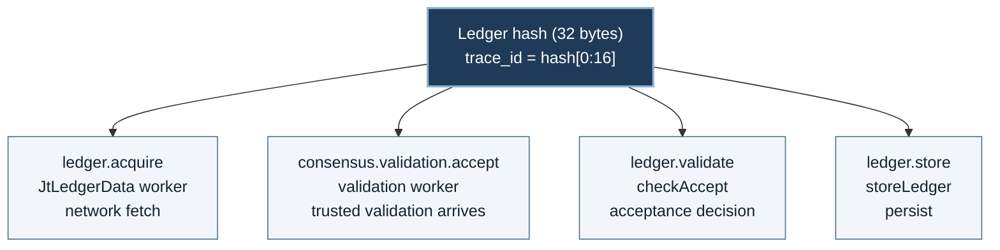

Two limits worth knowing. The join needs the ledger **hash**: a stage that has
only a sequence number cannot join, so a by-sequence lookup made before the
hash is known will not appear. And the trace id is the hash's leading 16 bytes
only — the `ledger_hash` attribute carries all 32, which is how you confirm two
spans are genuinely the same ledger rather than a trace-id coincidence.

## Performance Tuning

| Scenario                 | Recommendation                                            |
| ------------------------ | --------------------------------------------------------- |
| Production mainnet       | `trace_peer=0`; reduce volume via collector tail sampling |
| Testnet/devnet           | Full tracing (head sampling fixed at 1.0)                 |
| Debugging specific issue | Full tracing (head sampling fixed at 1.0)                 |
| High-throughput node     | Increase `batch_size=1024`, `max_queue_size=4096`         |

## Disabling Telemetry

Set `enabled=0` in the `[telemetry]` config section (runtime disable, no rebuild), or
compile telemetry out:

```bash
conan install .. --output-folder . --build missing -o telemetry=False --settings build_type=Release
cmake -DCMAKE_TOOLCHAIN_FILE:FILEPATH=build/generators/conan_toolchain.cmake -DCMAKE_BUILD_TYPE=Release -Dtelemetry=OFF ..
```

Pass the flag explicitly rather than omitting it — an omitted flag resolves to whatever
the build's current default is. That default is `ON` on the telemetry branches so CI
compiles the instrumented paths, and `OFF` once the feature is merged; `-Dtelemetry=OFF`
is correct either way. `-DXRPL_ENABLE_TELEMETRY=OFF` does **not** work: that name is only
a compile definition added when `telemetry` is ON, not a CMake option, so telemetry stays
compiled in and CMake only lists it under `Manually-specified variables were not used by
the project`.

When telemetry is compiled out, all trace macros expand to no-ops with zero overhead.

## Validating Telemetry Stack

After deploying telemetry, use the workload tools in `docker/telemetry/workload/` to validate the full stack end-to-end.

### Quick Validation

```bash
# Run the full validation suite (starts cluster, generates load, validates):
docker/telemetry/workload/run-full-validation.sh --xrpld .build/xrpld

# Check the report:
cat /tmp/xrpld-validation/reports/validation-report.json | jq '.summary'

# Tear the stack and the node processes down:
docker/telemetry/workload/run-full-validation.sh --cleanup
```

Harness options (`run-full-validation.sh`):

| Flag                | Default           | Effect                                                                                                                                                            |
| ------------------- | ----------------- | ----------------------------------------------------------------------------------------------------------------------------------------------------------------- |
| `--xrpld PATH`      | `.build/xrpld`    | Binary to run. Also settable via the `XRPLD` env var.                                                                                                             |
| `--nodes NUM`       | `5`               | Size of the local validator cluster.                                                                                                                              |
| `--profile NAME`    | `full-validation` | Load profile from `workload-profiles.json` (`full-validation`, `quick-smoke`, `stress`). This is the **only** thing that sets load shape.                         |
| `--skip-loki`       | off               | Skip the log-trace correlation checks and their per-leg diagnostics. Local exploration only; CI does not pass this.                                               |
| `--skip-regression` | off               | Skip the baseline comparison. Timings are still captured, so the run still leaves a `timings.json` artifact to refresh the baseline from. Local exploration only. |
| `--with-benchmark`  | off               | Also run `benchmark.sh` (telemetry-off vs telemetry-on overhead) after validation.                                                                                |
| `--cleanup`         | —                 | Tear everything down and exit.                                                                                                                                    |

`--rpc-rate`, `--rpc-duration`, `--tx-tps` and `--tx-duration` are accepted by the
parser but **never read** — they predate profiles and have no effect. Use
`--profile`, or add a profile to `workload-profiles.json`.

Exit codes: `0` all checks and the regression gate passed; `1` a validation check
failed or the gate detected a regression; `2` infrastructure error (stack or
cluster did not come up, or timing capture failed while the regression gate was
active). Every `die` in the script exits 2, including a bad command line, so read
`die` rather than this summary if the two ever disagree.

### What Gets Validated

The counts are not hard-coded in the validator — it iterates the inventory files,
so those files are authoritative. The figures below are the inventory as it
stands today.

| Category         | Checks                                                                                                                                                                                                                                                                          | Description                                                                                                                                                                                                                                                                                                                                                                                                                                                                                                                                                                                                                                                                                                                                                                                                                                                                                                                                                                                                                                                                                                                                           |
| ---------------- | ------------------------------------------------------------------------------------------------------------------------------------------------------------------------------------------------------------------------------------------------------------------------------- | ----------------------------------------------------------------------------------------------------------------------------------------------------------------------------------------------------------------------------------------------------------------------------------------------------------------------------------------------------------------------------------------------------------------------------------------------------------------------------------------------------------------------------------------------------------------------------------------------------------------------------------------------------------------------------------------------------------------------------------------------------------------------------------------------------------------------------------------------------------------------------------------------------------------------------------------------------------------------------------------------------------------------------------------------------------------------------------------------------------------------------------------------------- |
| Spans            | Every **required** entry in `expected_spans.json` — 48 span types at the time of writing: 28 required, 20 marked `"optional": true`                                                                                                                                             | Span name found in Tempo carrying its `required_attributes`, plus the declared parent-child relationships. An `"optional": true` entry that does not fire is recorded as a skip, not a failure — it needs traffic the harness may not generate (HTTP/JSON-RPC client, gRPC client, missing-ledger fetch, mode transitions) or that it deliberately no longer generates (path-finding RPC — see "Pathfinding is not exercised" in [the workload README](../docker/telemetry/workload/README.md)).                                                                                                                                                                                                                                                                                                                                                                                                                                                                                                                                                                                                                                                      |
| Metrics          | Every entry in every asserted category of `expected_metrics.json` — 145 checks across 26 asserting categories at the time of writing: 140 metric names plus 5 `required_labels` checks, of which the 61 fresh-node `sync_diagnostics` names are asserted by their own validator | SpanMetrics, `beast::insight` gauges/counters exported over OTLP, and the `MetricsRegistry` OTLP metrics. Each must have > 0 Prometheus series; none are optional. A category may also declare `required_labels`, and each label there becomes one additional check that at least one of that category's series carries it with a non-empty value (matched as `<label>!=""`, because Prometheus cannot distinguish an absent label from an empty one). Those labels were declared but never actually read until the check was generalised, so they were documented as required while going unverified; `spanmetrics` contributes 4 and `job_queue` 1. The separate `not_asserted` group lists metrics deliberately left out of the gate because they are workload-gated or defect-gated; it has neither a `metrics` nor a `required_labels` key, so the validator skips it entirely.                                                                                                                                                                                                                                                                  |
| Logs             | 2 checks                                                                                                                                                                                                                                                                        | `trace_id`/`span_id` present in Loki, and a logged trace id resolves in Tempo. Gated in CI. `run-full-validation.sh` prints a four-leg diagnostic (node, mount, collector, Loki) after the suite whenever these run, so a failure names the leg that broke.                                                                                                                                                                                                                                                                                                                                                                                                                                                                                                                                                                                                                                                                                                                                                                                                                                                                                           |
| Parity           | 10 checks                                                                                                                                                                                                                                                                       | 6 span attributes the external-parity dashboard panels read, plus 4 metric value-sanity bounds.                                                                                                                                                                                                                                                                                                                                                                                                                                                                                                                                                                                                                                                                                                                                                                                                                                                                                                                                                                                                                                                       |
| Dashboards       | Every uid in `expected_metrics.json` under `grafana_dashboards.uids` — currently all 16 provisioned dashboards                                                                                                                                                                  | Each listed dashboard loads and reports a panel count. This is a provisioning check only: it does **not** execute the panels' queries, so a dashboard can pass while individual panels render empty. `log-derived-insights` is Loki-backed, so only its provisioning is covered here; its data path is covered by the two log checks instead.                                                                                                                                                                                                                                                                                                                                                                                                                                                                                                                                                                                                                                                                                                                                                                                                         |
| Reverse coverage | 2 checks — `metric.reverse_coverage` and `span.reverse_coverage`                                                                                                                                                                                                                | The only checks that run in the opposite direction: they read the full emitted inventory (the Prometheus `__name__` label values, the Tempo `name` intrinsic's tag values) and name everything the contract never mentions, sorted and one per line in the log. **Warn only — `passed` is hardcoded `True` in `_reverse_coverage_result`, so these can never fail CI.** Downstream branches legitimately add telemetry an upstream contract has not seen, and a hard failure would redden all of them. A metric family is accounted for by a `metrics` entry, by a `not_asserted.metrics_excluded` key, or by an anchored regex under the top-level `accounted_patterns` list — which exists for families whose membership is derived mechanically from a table in the code (the per-job-type job-queue instruments, the overlay per-category traffic cross product) plus the Prometheus scrape plumbing that is not xrpld telemetry. Histogram `_bucket`/`_count`/`_sum` names fold onto their base family before matching. Spans need no pattern list: the check reuses the forward matcher, so `rpc.command.*` covers every command it expands to. |

### Running Individual Tools

```bash
# RPC load only:
python3 docker/telemetry/workload/rpc_load_generator.py \
    --endpoints ws://localhost:6006 --rate 50 --duration 120

# Transaction mix only:
python3 docker/telemetry/workload/tx_submitter.py \
    --endpoint ws://localhost:6006 --tps 5 --duration 120

# Validation only (assumes load already ran):
python3 docker/telemetry/workload/validate_telemetry.py \
    --report /tmp/report.json
```

### Interpreting Failures

- **Span failures**: Check that the relevant trace category is enabled in `[telemetry]` config (e.g., `trace_rpc=1`).
- **Metric failures**: Verify the OTel Collector is running and Prometheus is scraping port 8889.
- **Dashboard failures**: Ensure Grafana provisioning is mounted correctly.

`run-full-validation.sh` brings the stack up with
`docker compose -f docker/telemetry/docker-compose.workload.yaml`, so a bare
`docker compose logs` from the repository root finds no project. Pass the same
compose file:

```bash
docker compose -f docker/telemetry/docker-compose.workload.yaml logs otel-collector
docker compose -f docker/telemetry/docker-compose.workload.yaml logs grafana
docker compose -f docker/telemetry/docker-compose.workload.yaml ps
```

### Regression Gate and CI

The validation checks answer "is the telemetry there?". A second, independent
gate answers "did xrpld get slower?" — it is the part of this harness that can
fail CI on a performance change, so it is worth understanding before you push.

It runs as step 6 of `run-full-validation.sh`, after validation, and is skipped
only with `--skip-regression`:

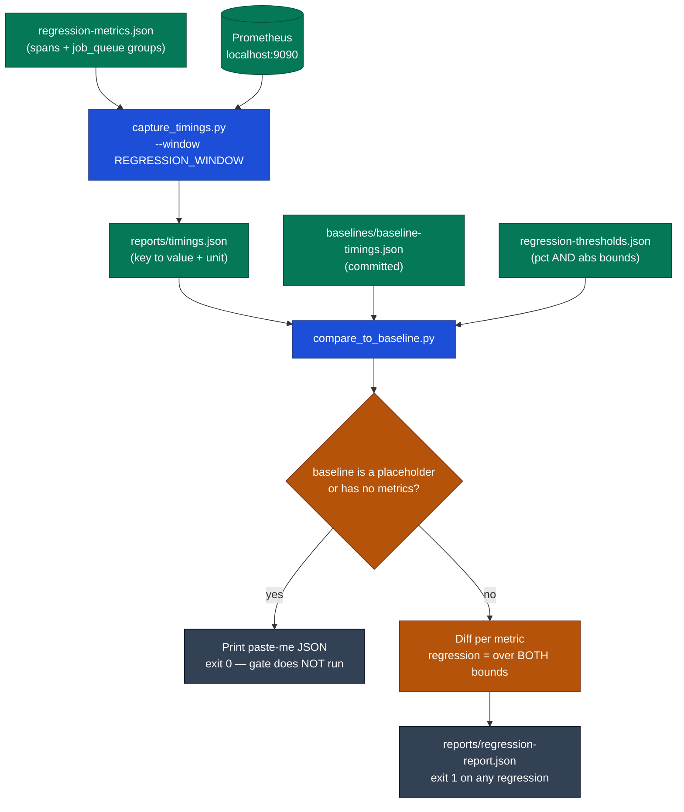

Key properties:

- **A metric regresses only when it exceeds BOTH the percentage and the absolute
  bound.** The `AND` is deliberate: SpanMetrics latency histograms use explicit
  buckets, so a quantile sitting near a bucket boundary can jump a whole bucket
  with no real change. Bounds live in `regression-thresholds.json` — `defaults`
  per category and quantile, plus a per-metric `override` for every gated key.
- **The absolute bound is derived per metric, as `hi_next − baseline`.** Locate
  the baseline in the half-open bucket `(lo, hi]` of its ladder and take
  `hi_next` as the next edge above `hi`; the trip point is then exactly
  `hi_next`, so the gate fires only once the reading clears the bucket _above_
  the baseline's own. That is what makes a single bucket crossing unable to turn
  CI red: `histogram_quantile` interpolates inside whichever bucket the quantile
  falls in, so any reading produced while the quantile is at most one bucket
  above the baseline's is at most `hi_next`. A multiple of the _enclosing_
  bucket width cannot deliver that, because after crossing `hi` the
  interpolation happens across the next bucket, which here is up to 8x wider
  (`(0.5, 1]` is 0.5 ms, `(1, 5]` is 4 ms). Derivation, both ladders and a
  per-key table live in `regression-thresholds.json` under
  `_absolute_bound_derivation` and `_derivation_table`. **Refreshing
  `baseline-timings.json` obliges you to re-derive these bounds** — a value that
  moves into a different bucket gets a different `hi_next` — and
  `.github/scripts/telemetry/check_regression_bounds.py` fails CI if you do not.
- **A single flat bound cannot work here.** The gated quantiles span 0.006 ms to
  21 ms, so one figure is inert at the bottom of that range and trigger-happy at
  the top. The flat 10/15 ms span bound it replaced sat 1.15x to 2000x above the
  metric it guarded, and a 10x regression injected into each key in turn was
  caught on only 5 of 28.
- **The detection floor is `hi_next / baseline`, so some keys are only weakly
  guarded.** It ranges 2.21x to 16.28x over the current baseline;
  `job.acceptLedger.running.p95` is effectively not guarded at 16.3x, and is the
  one gated key a 10x regression does not catch (it first fires at 16.28x; at 20x
  the sweep catches 20 of 20). `baselines/README.md` lists all seven weak keys,
  the limiting ladder step for each, and the edges that would fix them.
- **A baseline refresh can silently move sensitivity in either direction.** The
  trip point is derived from the baseline, so a refresh that lands at the low end
  of a metric's range tightens the gate and one that lands high loosens it. The
  2026-08-26 refresh took `job.acceptLedger.running.p95` from a 5.74x floor to
  16.28x — it does not fire on any observed run, so it stays gated, but the weak
  floor is recorded rather than left to surprise someone. The same refresh put
  three `p50` keys below the spread they need, and they are now excluded (below).
  `baselines/README.md` carries the measurements.
- **The bound covers quantization noise only, so a key whose run-to-run variance
  exceeds it cannot be gated. Five keys are excluded for that reason**, leaving
  20 gated. `span.ledger.validate.p95` and `.p99` came first — spreads of 5.9x
  and 66.8x across four CI runs, both reaching past their trip points on healthy
  runs, because the span's duration follows peer-validation arrival timing rather
  than code speed. The 2026-08-26 refresh added `span.tx.apply.p50`,
  `span.ledger.build.p50` and `span.consensus.ledger_close.p50`, whose observed
  maxima sit 46.76x, 4.77x and 2.38x above their new trip points. That is the
  same rule applied, not a new exception: the decisive evidence is that
  `span.tx.apply.p50` read 0.7917 ms in the previous baseline and 0.00597 ms in
  this one — 132x apart on the same workload — so whether the gate worked was
  decided by where in its own distribution the captured run fell, not by the
  code. All five share one shape: the observed maximum exceeds
  `baseline + bound`, four of them because a low-bucket baseline yields a tiny
  bound. Widening gates nothing and re-baselining until a run lands high is the
  trap; **a multi-run baseline, or a spread measurement captured alongside it, is
  what would let them be gated again** — not implemented, and the reason these
  exclusions stand. They are listed with their measurements in `excluded_keys` in
  `regression-metrics.json`, and `check_regression_bounds.py` rule F keeps each
  entry honest. Before gating any key, check its observed maximum across runs
  against `baseline + bound`; see `baselines/README.md`.
- **For every currently gated metric the absolute bound decides; the percentage
  bound does not.** Measured, the bound is 121%-1528% of its own baseline, above
  both configured percentage bounds. This is _not_ a general property: the span
  ladder's top steps are only 1.25x-1.5x apart, so a baseline between about
  2667-3000 ms or 3334-4000 ms gets an absolute bound worth under 50% of itself
  and the percentage bound takes over — `consensus.round` at ~3.9 s lands
  exactly there. `check_regression_bounds.py` rule D fails the build rather than
  letting that happen silently. The percentage entries are still required (a
  missing one turns the metric into "no threshold configured" and stops it
  gating) and they are the operative bound on the `defaults` path.
- **`span.ledger.store` is not gated**, because its quantiles are the ladder's
  first edge times the quantile — every sample lands under 10 us, so no bound
  can move. See `baselines/README.md`.
- **A metric with no configured threshold is captured but never gates.** It is
  reported with a note instead. Today only `span.*` and `job.*` keys have
  thresholds; `rpc.*` is not produced and would not gate if it were (see
  `docker/telemetry/workload/baselines/README.md`).
- **A metric missing from the current run is not a regression.**
  `summary.missing_in_current` in `regression-report.json` is a count; the
  identities are the `metrics[]` entries whose `note` is
  `"not captured in current run"`.
- **`REGRESSION_WINDOW`** (env var, default `3m`) is the window handed to
  Prometheus `rate()` during capture. Keep it close to the workload duration —
  a longer window dilutes a short-lived regression. `BASELINE_FILE`,
  `THRESHOLDS_FILE` and `METRICS_FILE` are also env-overridable.

```bash
# Validation without the gate (fast local loop):
docker/telemetry/workload/run-full-validation.sh --xrpld .build/xrpld \
    --profile quick-smoke --skip-loki --skip-regression

# Narrow the rate window to a short profile:
REGRESSION_WINDOW=1m docker/telemetry/workload/run-full-validation.sh \
    --xrpld .build/xrpld --profile quick-smoke

# Inspect the gate's own output:
jq '.summary' /tmp/xrpld-validation/reports/regression-report.json
jq -r '.metrics[] | select(.regressed) | "\(.key) \(.baseline) -> \(.current) \(.unit)"' \
    /tmp/xrpld-validation/reports/regression-report.json
```

#### Refreshing the baseline

The baseline is a committed file, and moving it is a reviewed change — that PR
review is the audit point for "who moved the performance bar". There is no
automatic promotion from `develop`.

1. Run the `Telemetry Validation` workflow on the branch. It always captures
   timings, so `timings.json` is uploaded as an artifact and the regression
   summary is written to the run's Step Summary.
2. If the baseline in the checkout is a placeholder (`"placeholder": true` or an
   empty `metrics` object), the Step Summary contains a fenced JSON block under
   **"Paste into `baselines/baseline-timings.json`"**, already formatted the way
   the file expects (sorted keys, 2-space indent, trailing newline).
3. Open a PR replacing the file contents with that block, dropping the
   `placeholder` key. For a refresh of an already-populated baseline, take the
   `timings.json` artifact instead and justify the delta in the PR description.

Never hand-edit `baseline-timings.json` — every entry should trace back to a real
CI run so its variance characteristics are preserved. Details in
`docker/telemetry/workload/baselines/README.md`.

#### CI workflow

`.github/workflows/telemetry-validation.yml` runs three jobs — `linux-image-tag`
(reads the CI image tag from the build matrix so this workflow cannot drift onto
a different compiler than the main CI), `build-xrpld` (self-hosted runner, same
container as the main CI, so Conan and ccache hit the shared caches), and
`validate-telemetry` (`ubuntu-latest`, which has Docker).

- **Triggers**: `workflow_dispatch`, and `push` on `pratik/otel-phase*`,
  `feature/otel-*`, `feature/telemetry-*` limited to a `paths` filter covering
  the workflow file, `docker/telemetry/**`, and the telemetry sources under
  `include/xrpl/telemetry/**`, `src/libxrpl/telemetry/**` and
  `src/xrpld/telemetry/**`. There is no cron schedule.
- **Invocation**: `run-full-validation.sh --xrpld <binary>`, so the default
  `full-validation` profile is used and no category is skipped.
- **Log-trace correlation is gated**: `--skip-loki` is not passed
  ([telemetry-validation.yml:237](../.github/workflows/telemetry-validation.yml#L237)),
  so `log.trace_id_present` and `log.trace_id_cross_reference` are constructed and
  can fail the job. Correlation spans four independent legs — node, mount,
  collector, Loki — and a failed check names none of them, so
  `run-full-validation.sh` prints a per-leg diagnostic after the suite whenever
  these checks are enabled: per-node counts of `debug.log` lines carrying the
  injected `trace_id`/`span_id` shape plus the severity mix, the container-side
  listing of `/var/log/xrpld` taken with the collector's own mounts and uid, the
  `filelog` receiver's watched files, logs-pipeline warnings and internal
  log-record counters, and Loki's entry counts for the stream selector with and
  without the line filter. The diagnostics are non-fatal by construction: each
  leg is isolated and a missing container or unreachable endpoint prints a note.
  Those two Loki entry counts are `sum(count_over_time(...))`, and the `sum()` is
  load-bearing: the `filelog` receiver leaves `message` and `timestamp` as
  log-record attributes, Loki's OTLP path stores them as structured metadata, and
  structured metadata joins a metric query's label set — so an unaggregated
  `count_over_time` produces one series per log line and Loki answers `HTTP 400
maximum number of series (500) reached`. Unaggregated, both legs printed
  `unavailable` on runs `32877465763` and `32964262700` and the block
  distinguished nothing. A rejected query now logs its HTTP status and Loki's own
  plain-text explanation rather than a JSON-mimetype error.
  `log.trace_id_cross_reference` polls Tempo for up to `METRIC_POLL_TIMEOUT_SEC`
  before failing, so a logged id that Tempo has not yet indexed is retried rather
  than reported absent. It also separates a failed Tempo query from a genuinely
  absent trace: a 404 on `/api/traces/<id>` is absence and moves to the next
  candidate, while any other non-200 raises `TempoQueryError` and is reported as
  "could not verify" rather than "not exported". Both Tempo helpers previously
  passed an error body straight to `resp.json()`, so a JSON 5xx read as zero
  spans or zero traces.
  `docker/telemetry/integration-test.sh` (which has its own
  `check_log_correlation()`) is still run by no workflow.
- **Inputs**: only `run_benchmark` changes behaviour. `rpc_rate`, `rpc_duration`,
  `tx_tps` and `tx_duration` are inert, as noted in their descriptions.
- **Results**: reports are uploaded as the `telemetry-validation-reports`
  artifact and node logs as `xrpld-node-logs` when validation did not succeed.
  Summaries go to the run's Step Summary; the workflow does not comment on PRs.

## Performance Benchmarking

Measure the overhead of the telemetry stack against a baseline:

```bash
docker/telemetry/workload/benchmark.sh --xrpld .build/xrpld --duration 300
```

### Benchmark Thresholds

| Metric            | Target | Description                            |
| ----------------- | ------ | -------------------------------------- |
| CPU overhead      | < 3%   | Average CPU increase across nodes      |
| Memory overhead   | < 5MB  | Peak RSS increase per node             |
| RPC p99 latency   | < 2ms  | Additional p99 latency for server_info |
| Throughput impact | < 5%   | Reduction in ledger close rate         |
| Consensus impact  | < 1%   | Increase in consensus round time       |

### Tuning for Production

If benchmarks exceed thresholds:

1. **Reduce trace volume with collector-side tail sampling.** There is no
   `sampling_ratio` config key — xrpld's head sampling is a compile-time
   constant fixed at 1.0
   ([Telemetry.h:234](../include/xrpl/telemetry/Telemetry.h#L234)
   `static constexpr double samplingRatio = 1.0;`), and
   [TelemetryConfig.cpp:139](../src/libxrpl/telemetry/TelemetryConfig.cpp#L139)
   explicitly parses nothing for it. Volume reduction is a collector decision.
   The only policy shipped is a single 0.5% probabilistic `tail_sampling`
   processor in `otel-collector-config.grafanacloud.yaml`; the base
   `otel-collector-config.yaml` has **no** tail sampling, so a stock local
   stack keeps every trace. Where the Cloud policy is in force it sits on the
   trace-storage branch only — spanmetrics runs on a separate branch and still
   sees 100% of spans, so the derived RED metrics stay exact.
2. **Disable peer tracing**: `trace_peer=0` (highest volume category)
3. **Increase batch delay**: `batch_delay_ms=10000` (less frequent exports)
4. **Reduce queue size**: `max_queue_size=1024` (back-pressure earlier)

See `docker/telemetry/workload/README.md` for full documentation.
