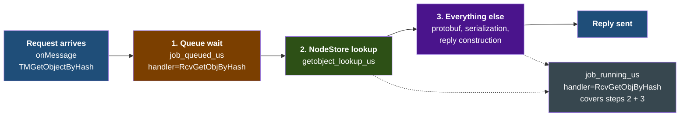
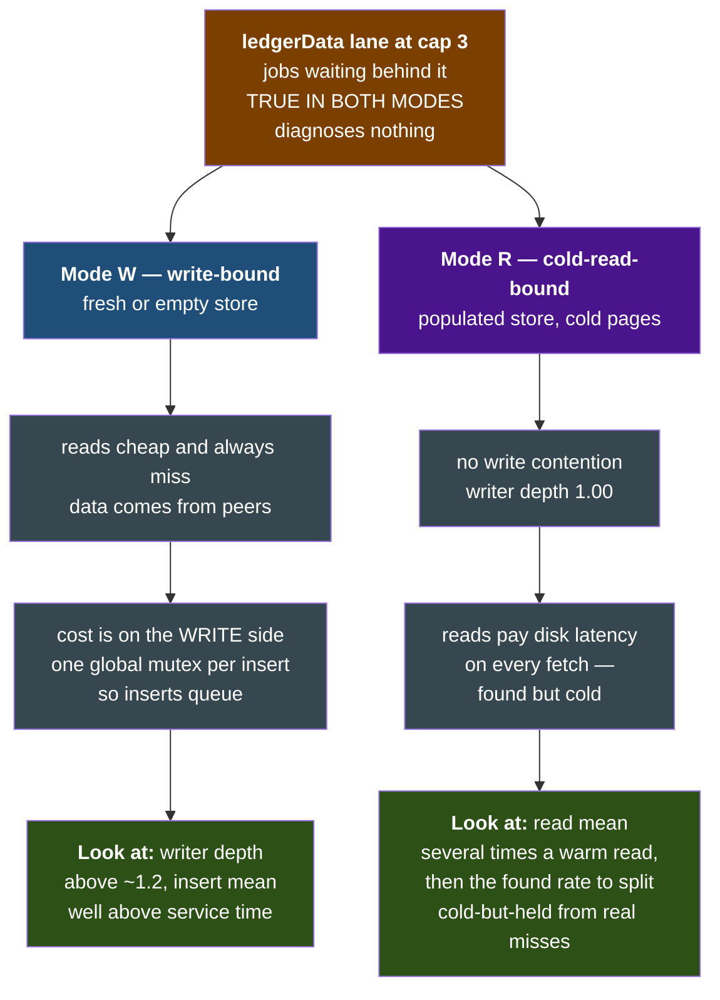

# xrpld Telemetry Operator Runbook

## Overview

xrpld supports OpenTelemetry distributed tracing to provide visibility into RPC requests, transaction processing, and consensus rounds.

This runbook covers operating a running node and querying its traces. For
building xrpld with telemetry support and the internal architecture, see
[build/telemetry.md](build/telemetry.md).

## Quick Start

### 1. Start the observability stack

```bash
docker compose -f docker/telemetry/docker-compose.yml up -d
```

This starts:

- **OTel Collector** on ports 4317 (gRPC) and 4318 (HTTP), and 13133 (health)
- **Tempo** on http://localhost:3200 (trace backend)
- **Prometheus** on http://localhost:9090
- **Loki** on http://localhost:3100 (log aggregation)
- **Grafana** on http://localhost:3000 (Tempo pre-configured as datasource)

### 2. Enable telemetry in xrpld

Add to your `xrpld.cfg`:

```ini
[telemetry]
enabled=1
endpoint=http://localhost:4318/v1/traces
```

### 3. Build with telemetry support

```bash
conan install . --build=missing -o telemetry=True
cmake --preset default -Dtelemetry=ON
cmake --build --preset default
```

## Configuration Reference

| Option                     | Default                           | Description                                               |
| -------------------------- | --------------------------------- | --------------------------------------------------------- |
| `enabled`                  | `0`                               | Master switch for telemetry                               |
| `endpoint`                 | `http://localhost:4318/v1/traces` | OTLP/HTTP endpoint                                        |
| `service_name`             | `xrpld`                           | OpenTelemetry service name resource attribute             |
| `service_instance_id`      | node public key                   | OpenTelemetry service instance ID resource attribute      |
| `trace_rpc`                | `1`                               | Enable RPC request tracing                                |
| `trace_transactions`       | `1`                               | Enable transaction tracing                                |
| `trace_consensus`          | `1`                               | Enable consensus tracing                                  |
| `trace_peer`               | `1`                               | Enable peer message tracing (high volume)                 |
| `trace_ledger`             | `1`                               | Enable ledger tracing                                     |
| `consensus_trace_strategy` | `deterministic`                   | Consensus trace ID strategy (`deterministic` or `random`) |
| `batch_size`               | `512`                             | Max spans per batch export                                |
| `batch_delay_ms`           | `5000`                            | Delay between batch exports                               |
| `max_queue_size`           | `2048`                            | Max spans queued before dropping                          |
| `use_tls`                  | `0`                               | Use TLS for exporter connection                           |
| `tls_ca_cert`              | (empty)                           | Path to CA certificate bundle                             |
| `tls_client_cert`          | (empty)                           | Client cert (PEM) for mutual TLS; empty = one-way TLS     |
| `tls_client_key`           | (empty)                           | Private key (PEM) for `tls_client_cert`                   |

## Span Reference

All spans instrumented in xrpld, grouped by subsystem:

### RPC Spans

| Span Name            | Source File       | Attributes                                                  | Description                                           |
| -------------------- | ----------------- | ----------------------------------------------------------- | ----------------------------------------------------- |
| `rpc.http_request`   | ServerHandler.cpp | `request_payload_size`                                      | Top-level HTTP RPC request                            |
| `rpc.ws_upgrade`     | ServerHandler.cpp | —                                                           | WebSocket upgrade handshake                           |
| `rpc.ws_message`     | ServerHandler.cpp | `command`                                                   | WebSocket RPC message                                 |
| `rpc.process`        | ServerHandler.cpp | `is_batch`, `batch_size`                                    | RPC processing (child of rpc.http_request/ws_message) |
| `rpc.command.<name>` | RPCHandler.cpp    | `command`, `version`, `rpc_role`, `rpc_status`, `load_type` | Per-command span (e.g., `rpc.command.server_info`)    |

### Transaction Spans

| Span Name       | Source File     | Attributes                                                                                              | Description                           |
| --------------- | --------------- | ------------------------------------------------------------------------------------------------------- | ------------------------------------- |
| `tx.process`    | NetworkOPs.cpp  | `tx_hash`, `local`, `path`, `tx_type`, `fee`, `sequence`, `ter_result`, `applied`, `current_ledger_seq` | Transaction submission and processing |
| `tx.receive`    | PeerImp.cpp     | `peer_id`, `tx_hash`, `tx_type`, `peer_version`, `suppressed`, `tx_status`, `current_ledger_seq`        | Transaction received from peer relay  |
| `tx.apply`      | BuildLedger.cpp | `ledger_seq`, `tx_count`, `tx_failed`                                                                   | Transaction set applied per ledger    |
| `tx.preflight`  | applySteps.cpp  | `stage`, `tx_type`, `ter_result`                                                                        | Stateless checks stage                |
| `tx.preclaim`   | applySteps.cpp  | `stage`, `tx_type`, `ter_result`, `current_ledger_seq`, `current_ledger_hash`                           | Ledger-aware checks stage             |
| `tx.transactor` | Transactor.cpp  | `stage`, `tx_type`, `ter_result`, `applied`, `current_ledger_seq`, `current_ledger_hash`                | Apply stage (transactor runs)         |

The three apply-pipeline spans (`tx.preflight`, `tx.preclaim`, `tx.transactor`)
share a deterministic `trace_id` from `txID[0:16]`, so they group under one
trace per transaction. The `stage` attribute (`preflight` / `preclaim` /
`apply`) drives the collector spanmetrics `stage` dimension, giving per-stage
RED metrics on the _Transaction Overview_ dashboard.

`current_ledger_seq` is the current (open/in-flight) ledger index a span acted on
— the ledger being worked on, not an established one — so a transaction's
txID-keyed spans can be joined to the ledger trace it targeted
(`span.current_ledger_seq`). The view-bearing stages (`tx.preclaim`,
`tx.transactor`) also carry `current_ledger_hash` (the current ledger's parent
hash); `tx.preflight` is stateless and omits both.

### Transaction Queue Spans

| Span Name          | Source File | Attributes                                                        | Description                                                                                                                                                                                  |
| ------------------ | ----------- | ----------------------------------------------------------------- | -------------------------------------------------------------------------------------------------------------------------------------------------------------------------------------------- |
| `txq.enqueue`      | TxQ.cpp     | `tx_hash`, `tx_type`, `current_ledger_seq`, `current_ledger_hash` | Enqueue decision; parents to `tx.process` on the submission path (explicit context), a root on the open-ledger rebuild path — `current_ledger_seq` correlates it to the ledger in both cases |
| `txq.apply_direct` | TxQ.cpp     | --                                                                | Direct apply attempt (bypassing queue)                                                                                                                                                       |
| `txq.batch_clear`  | TxQ.cpp     | --                                                                | Batch clear of queued transactions for an account                                                                                                                                            |
| `txq.accept`       | TxQ.cpp     | `queue_size`, `ledger_changed`                                    | Ledger-close accept loop over queued transactions                                                                                                                                            |
| `txq.accept_tx`    | TxQ.cpp     | `tx_hash`, `retries_remaining`, `ter_code`, `txq_status`          | Per-transaction apply during accept                                                                                                                                                          |
| `txq.cleanup`      | TxQ.cpp     | `ledger_seq`                                                      | Post-close cleanup of expired queue entries                                                                                                                                                  |

### PathFinding Spans

| Span Name             | Source File                       | Attributes                                         | Description                                             |
| --------------------- | --------------------------------- | -------------------------------------------------- | ------------------------------------------------------- |
| `pathfind.request`    | PathFind.cpp / RipplePathFind.cpp | `pathfind_source_account`, `pathfind_dest_account` | Path-find RPC entry (accounts hashed; set when present) |
| `pathfind.compute`    | PathRequest.cpp                   | `pathfind_fast`, `pathfind_dest_currency`          | Path computation for one request (`doUpdate`)           |
| `pathfind.discover`   | PathRequest.cpp                   | `pathfind_search_level`, `pathfind_num_paths`      | Graph exploration (one per RPC call in `findPaths`)     |
| `pathfind.update_all` | PathRequestManager.cpp            | `pathfind_ledger_index`, `pathfind_num_requests`   | Async recomputation of active requests on ledger close  |

### Consensus Spans

| Span Name                      | Source File      | Attributes                                                                                                                                                                                                                   | Description                                                                                                                           |
| ------------------------------ | ---------------- | ---------------------------------------------------------------------------------------------------------------------------------------------------------------------------------------------------------------------------- | ------------------------------------------------------------------------------------------------------------------------------------- |
| `consensus.round`              | RCLConsensus.cpp | `consensus_ledger_id`, `ledger_seq`, `consensus_mode`, `trace_strategy`, `consensus_round_id`                                                                                                                                | Root span for a consensus round (deterministic or random trace ID)                                                                    |
| `consensus.phase.open`         | Consensus.h      | --                                                                                                                                                                                                                           | Open phase duration (child of round)                                                                                                  |
| `consensus.proposal.send`      | RCLConsensus.cpp | `consensus_round`, `is_bow_out`                                                                                                                                                                                              | Consensus proposal broadcast                                                                                                          |
| `consensus.ledger_close`       | RCLConsensus.cpp | `ledger_seq`, `consensus_mode`                                                                                                                                                                                               | Ledger close event                                                                                                                    |
| `consensus.establish`          | Consensus.h      | `converge_percent`, `establish_count`, `proposers`                                                                                                                                                                           | Establish phase duration (child of round)                                                                                             |
| `consensus.update_positions`   | Consensus.h      | `converge_percent`, `proposers`, `disputes_count`                                                                                                                                                                            | Position update and dispute resolution (see Events below)                                                                             |
| `consensus.check`              | Consensus.h      | `agree_count`, `disagree_count`, `converge_percent`, `have_close_time_consensus`, `threshold_percent`, `proposers_finished`, `consensus_stalled`, `establish_count`, `consensus_result`                                      | Consensus threshold check                                                                                                             |
| `consensus.accept`             | RCLConsensus.cpp | `proposers`, `round_time_ms`, `quorum`, `disputes_count`, `consensus_state`                                                                                                                                                  | Ledger accepted by consensus                                                                                                          |
| `consensus.accept.apply`       | RCLConsensus.cpp | `ledger_seq`, `close_time`, `close_time_correct`, `close_resolution_ms`, `consensus_state`, `proposing`, `round_time_ms`, `parent_close_time`, `close_time_self`, `close_time_vote_bins`, `resolution_direction`, `tx_count` | Ledger application with close time details (see Events below)                                                                         |
| `consensus.validation.send`    | RCLConsensus.cpp | `ledger_seq`, `proposing`, `ledger_hash`, `full_validation`, `validation_sign_time`                                                                                                                                          | Validation sent after accept (follows-from link)                                                                                      |
| `consensus.mode_change`        | RCLConsensus.cpp | `mode_old`, `mode_new`                                                                                                                                                                                                       | Consensus mode transition                                                                                                             |
| `consensus.proposal.receive`   | PeerImp.cpp      | `proposal_trusted`, `consensus_round`                                                                                                                                                                                        | Proposal received from peer (extracts parent context from TraceContext when present; falls back to standalone span for older peers)   |
| `consensus.validation.receive` | PeerImp.cpp      | `validation_trusted`, `ledger_seq`                                                                                                                                                                                           | Validation received from peer (extracts parent context from TraceContext when present; falls back to standalone span for older peers) |

#### Consensus Span Events

| Parent Span                  | Event Name        | Event Attributes                                            | Description                                             |
| ---------------------------- | ----------------- | ----------------------------------------------------------- | ------------------------------------------------------- |
| `consensus.update_positions` | `dispute.resolve` | `tx_id`, `dispute_our_vote`, `dispute_yays`, `dispute_nays` | Emitted per dispute when votes are tallied              |
| `consensus.accept.apply`     | `tx.included`     | `tx_id`                                                     | Emitted per transaction included in the accepted ledger |

#### Close Time Queries (Tempo TraceQL)

Span attributes are filtered with `span.<attr>` inside `{}`. Combine conditions with `&&`.

```
# Find rounds where validators disagreed on close time
{name="consensus.accept.apply" && span.close_time_correct = false}

# Find consensus failures (moved_on)
{name="consensus.accept.apply" && span.consensus_state = "moved_on"}

# Find slow ledger applications (>5s)
{name="consensus.accept.apply" && duration > 5000ms}

# Find specific ledger's consensus details
{name="consensus.accept.apply" && span.ledger_seq = 92345678}

# Find all spans in a consensus round (deterministic trace strategy)
{name="consensus.round" && span.consensus_round_id = "<round_id>"}

# Find dispute resolutions
{name="consensus.update_positions"} >> {event:name="dispute.resolve"}
```

### Ledger Spans

| Span Name         | Source File          | Attributes                            | Description                   |
| ----------------- | -------------------- | ------------------------------------- | ----------------------------- |
| `ledger.build`    | BuildLedger.cpp:31   | `ledger_seq`, `tx_count`, `tx_failed` | Ledger build during consensus |
| `ledger.validate` | LedgerMaster.cpp:915 | `ledger_seq`, `validations`           | Ledger promoted to validated  |
| `ledger.store`    | LedgerMaster.cpp:409 | `ledger_seq`                          | Ledger stored in history      |

### Peer Spans

| Span Name                 | Source File      | Attributes                      | Description                   |
| ------------------------- | ---------------- | ------------------------------- | ----------------------------- |
| `peer.proposal.receive`   | PeerImp.cpp:1667 | `peer_id`, `proposal_trusted`   | Proposal received from peer   |
| `peer.validation.receive` | PeerImp.cpp:2264 | `peer_id`, `validation_trusted` | Validation received from peer |

Both peer receive spans are `kConsumer` inbound entry points started as fresh
trace roots. They never inherit an ambient span left active on the peer thread,
so they do not nest under an unrelated transaction's trace. The distributed
child span that links back to the sending node is the separate
`consensus.*.receive` / `tx.receive` span (see Cross-Node Trace Propagation).

---

## Insights and Sample Queries

This section shows what questions you can answer using the span attributes, with example Tempo TraceQL queries.

**TraceQL syntax note:** span attributes must be referenced with the `span.` prefix inside `{}`.
Conditions are combined with `&&`. The `|` pipeline operator is not supported on this Tempo version.

```
# General pattern
{name="<span-name>" && span.<attr> = <value> && span.<attr2> != <value2>}

# Duration filter (no prefix needed)
{name="<span-name>" && duration > 500ms}

# Regex match
{name="<span-name>" && span.<attr> =~ "<pattern>.*"}

# Multiple span names
{name = "<span-a>" || name = "<span-b>"}

# Name regex
{name =~ "<pattern>.*" && span.<attr> = <value>}

# Structural: find parent spans that have a matching child/event
{name="<parent>"} >> {event:name="<event-name>"}
```

### Transaction Workflow Analysis

```
# Find all AMM transactions (AMMDeposit, AMMWithdraw, AMMVote)
{name="tx.process" && span.tx_type =~ "AMM.*"}

# Find a specific AMM operation
{name="tx.process" && span.tx_type = "AMMDeposit"}
{name="tx.process" && span.tx_type = "AMMWithdraw"}
{name="tx.process" && span.tx_type = "AMMVote"}

# Find Payment transactions that failed
{name="tx.process" && span.tx_type = "Payment" && span.ter_result != "tesSUCCESS"}

# Find Payment failures due to path issues
{name="tx.process" && span.tx_type = "Payment" && span.ter_result =~ "tecPATH.*"}

# Compare latency of different transaction types
{name="tx.process" && span.tx_type = "OfferCreate"}
{name="tx.process" && span.tx_type = "Payment"}

# Find high-fee transactions (fee > 1 XRP = 1000000 drops)
{name="tx.process" && span.fee > 1000000}

# Find transactions that were not applied
{name="tx.process" && span.applied = false}

# Find NFTokenMint across tx and txq spans
{name =~ "tx.*|txq.*" && span.tx_type = "NFTokenMint"}

# Find all NFT-related activity
{name =~ "tx.*|txq.*" && span.tx_type =~ "NFToken.*"}

# Find TrustSet transactions (IOU trust lines)
{name="tx.process" && span.tx_type = "TrustSet"}

# Find oracle price updates
{name="tx.process" && span.tx_type = "OracleSet"}
```

### DEX (OfferCreate / OfferCancel)

```
# All DEX offer creates
{name="tx.process" && span.tx_type = "OfferCreate"}

# Offers killed (ImmediateOrCancel/FillOrKill with no fill)
{name="tx.process" && span.tx_type = "OfferCreate" && span.ter_result = "tecKILLED"}

# Offers that failed due to insufficient funds
{name="tx.process" && span.tx_type = "OfferCreate" && span.ter_result = "tecUNFUNDED_OFFER"}

# Offers failed due to insufficient reserve to place the offer
{name="tx.process" && span.tx_type = "OfferCreate" && span.ter_result = "tecINSUF_RESERVE_OFFER"}

# Offer cancellations
{name="tx.process" && span.tx_type = "OfferCancel"}

# OfferCreate transactions received from peers (cross-node relay)
{name="tx.receive" && span.tx_type = "OfferCreate"}
```

### Apply Pipeline by Stage

```
# All three stages of one transaction (preflight -> preclaim -> apply)
{name=~"tx.preflight|tx.preclaim|tx.transactor"}

# Transactions that failed at the preclaim stage
{name="tx.preclaim"} | ter_result != "tesSUCCESS"

# Transactions that hard-failed preflight (never reached preclaim/apply)
{name="tx.preflight"} | ter_result != "tesSUCCESS"
```

PromQL on the span-derived metrics (dashboard: _Transaction Overview_):

```
# Per-stage throughput — the funnel preflight >= preclaim >= apply
sum by (stage) (rate(span_calls_total{span_name=~"tx.preflight|tx.preclaim|tx.transactor"}[5m]))

# Per-stage p95 latency
histogram_quantile(0.95, sum by (le, stage) (rate(span_duration_milliseconds_bucket{span_name=~"tx.preflight|tx.preclaim|tx.transactor"}[5m])))

# Per-stage failure rate (ter_result != tesSUCCESS; a failing ter completes the
# span normally, so filter on the attribute, not status_code which only flags exceptions)
sum by (stage) (rate(span_calls_total{span_name=~"tx.preflight|tx.preclaim|tx.transactor", ter_result!~"tesSUCCESS|"}[5m]))
```

> **Alerting**: a rising `tx.preflight` / `tx.preclaim` failure rate points to
> malformed or stale-sequence submissions (often spam or a misbehaving client);
> a rising `tx.transactor` failure rate points to apply-time problems. Alert per
> stage rather than on a single aggregate so the failing stage is obvious.

> **Sampling caveat**: these stage metrics are span-derived and inherit the
> **tracer head-sampling** ratio (`sampling_ratio`). At `sampling_ratio < 1.0`
> they undercount proportionally — treat them as relative trends, not absolute
> transaction counts. Native StatsD metrics are unsampled.

### Transaction Queue Health

```
# Find transactions rejected from the queue
{name="txq.accept_tx" && span.txq_status = "failed"}

# Find transactions being retried
{name="txq.accept_tx" && span.txq_status = "retried"}

# Find transactions that exhausted retries
{name="txq.accept_tx" && span.txq_status = "retried" && span.retries_remaining = 0}

# Which transaction types get queued most often?
{name="txq.enqueue" && span.tx_type = "Payment"}
{name="txq.enqueue" && span.tx_type = "OfferCreate"}
{name="txq.enqueue" && span.tx_type =~ "NFToken.*"}

# Find ledger closes that applied queued transactions
{name="txq.accept" && span.ledger_changed = true}
```

### RPC Debugging

```
# Find batch RPC requests
{name="rpc.process" && span.is_batch = true}

# Find large RPC payloads (>100KB)
{name="rpc.http_request" && span.request_payload_size > 100000}

# Find resource-heavy RPC commands (by load_type)
{name =~ "rpc.command.*" && span.load_type = "exceptioned RPC"}

# Find a specific WebSocket command
{name="rpc.ws_message" && span.command = "subscribe"}

# Find server_info calls
{name="rpc.command.server_info"}

# Find slow pathfinding with many source assets
{name="pathfind.discover" && span.pathfind_num_source_assets > 10}
```

### PathFinding Performance

```
# Find pathfinding for specific currencies
{name="pathfind.compute" && span.pathfind_dest_currency = "USD"}

# Find expensive pathfinding (many source assets to explore)
{name="pathfind.discover" && span.pathfind_num_source_assets > 20}

# Find slow pathfinding requests
{name="pathfind.compute" && duration > 1000ms}
```

### Consensus Health

```
# Find rounds where consensus timed out (expired)
{name="consensus.accept" && span.consensus_state = "expired"}

# Find rounds where we moved on without full agreement
{name="consensus.accept" && span.consensus_state = "moved_on"}

# Find rounds with many disputes
{name="consensus.accept" && span.disputes_count > 5}

# Find slow consensus rounds (>5s)
{name="consensus.accept" && span.round_time_ms > 5000}

# Find bow-out proposals (node resigned from round)
{name="consensus.proposal.send" && span.is_bow_out = true}

# Correlate validation with its ledger
{name="consensus.validation.send" && span.ledger_hash = "<hash>"}

# Find rounds where validators disagreed on close time
{name="consensus.accept.apply" && span.close_time_correct = false}

# Find both validation send and receive (compare sender vs receiver latency)
{name = "consensus.validation.send" || name = "consensus.validation.receive"}
```

### Cross-Subsystem Correlation

```
# Follow a transaction from receive through queue to ledger
{name =~ "tx.*|txq.*" && span.tx_type = "Payment" && duration > 500ms}

# Find all NFT-related activity across tx and txq spans
{name =~ "tx.*|txq.*" && span.tx_type =~ "NFToken.*"}

# Find all AMM activity across tx and txq spans
{name =~ "tx.*|txq.*" && span.tx_type =~ "AMM.*"}

# Find cross-node transaction receives (no errors)
{name="tx.receive" && status != error}
```

### Where to Look (Quick Reference)

| Question                            | Span                        | Key Attributes                           |
| ----------------------------------- | --------------------------- | ---------------------------------------- |
| "Which tx type is slowest?"         | `tx.process`                | `span.tx_type` + duration                |
| "Why was my tx rejected?"           | `tx.process`                | `span.ter_result`, `span.applied`        |
| "What AMM operations happened?"     | `tx.process`                | `span.tx_type =~ "AMM.*"`                |
| "What DEX offers failed?"           | `tx.process`                | `span.tx_type`, `span.ter_result`        |
| "What NFT activity occurred?"       | `tx.process`, `txq.enqueue` | `span.tx_type =~ "NFToken.*"`            |
| "Is the TxQ backing up?"            | `txq.accept`                | `span.queue_size`, `span.ledger_changed` |
| "Why was my tx dropped from queue?" | `txq.accept_tx`             | `span.txq_status`, `span.ter_code`       |
| "Are batch requests a problem?"     | `rpc.process`               | `span.is_batch`, `span.batch_size`       |
| "Which RPC is expensive?"           | `rpc.command.*`             | `span.load_type`, duration               |
| "Did consensus reach threshold?"    | `consensus.check`           | `span.consensus_result`                  |
| "Was consensus outcome normal?"     | `consensus.accept`          | `span.consensus_state`                   |
| "Did a validator bow out?"          | `consensus.proposal.send`   | `span.is_bow_out`                        |
| "Which ledger was validated?"       | `consensus.validation.send` | `span.ledger_hash`                       |
| "Did close time agreement fail?"    | `consensus.accept.apply`    | `span.close_time_correct`                |
| "What tx work fed a given ledger?"  | `tx.*` / `txq.*`            | `span.current_ledger_seq`                |

### Correlating a transaction to the ledger it was worked on

The `tx.process`, `tx.receive`, `txq.enqueue`, `tx.preclaim`, and `tx.transactor`
spans carry `current_ledger_seq` — the open/in-flight ledger they acted on (not
an established ledger). Because these spans are keyed on the transaction id (their
own trace) while the ledger/consensus spans are keyed on the ledger, use the
attribute to bridge the two id-spaces:

```
# All transaction-side work recorded against ledger N
{span.current_ledger_seq = N}

# Join to the ledger build/consensus trace for the same ledger
{name="ledger.build" && span.ledger_seq = N}
```

`txq.enqueue` and the view-bearing apply stages also carry `current_ledger_hash`
(the current ledger's parent hash), which equals the `consensus.round`
deterministic trace-id seed on the consensus-build path. `tx.preflight` is
stateless and omits both attributes.

---

## Cross-Node Trace Propagation

xrpld propagates trace context across nodes via protobuf `TraceContext` fields
embedded in peer-to-peer messages. When Node A sends a transaction, proposal,
or validation, it injects its active span's trace/span IDs into the protobuf
message. Node B extracts that context on receipt and creates a child span,
linking the two nodes into a single distributed trace.

### How It Works

```
Node A (sender)                          Node B (receiver)
+-----------------------------+          +-------------------------------+
| tx.process / consensus.*    |          | PeerImp::onMessage()          |
|   |                         |          |   |                           |
|   v                         |          |   v                           |
| SpanGuard::getTraceBytes()  |          | extract TraceContext from      |
|   |                         |          | protobuf message               |
|   v                         |   send   |   |                           |
| injectSpanContext() --------|--------->|   v                           |
| sets TraceContext fields    |  proto   | txReceiveSpan()               |
| (trace_id, span_id, flags) |  msg     | proposalReceiveSpan()         |
+-----------------------------+          | validationReceiveSpan()       |
                                         |   |                           |
                                         |   v                           |
                                         | child span with parent link   |
                                         +-------------------------------+
```

### Send-Side Injection

| Message Type  | Injection Point            | Mechanism                                  |
| ------------- | -------------------------- | ------------------------------------------ |
| TMTransaction | `NetworkOPs::apply()`      | Injects `tx.process` span into relay msg   |
| TMProposeSet  | `RCLConsensus::propose()`  | Injects active context into proposal msg   |
| TMValidation  | `RCLConsensus::validate()` | Injects active context into validation msg |

### Receive-Side Extraction

| Message Type  | Extraction Point                    | Helper Function                                    |
| ------------- | ----------------------------------- | -------------------------------------------------- |
| TMTransaction | `PeerImp::onMessage(TMTransaction)` | `TxTracing::txReceiveSpan()`                       |
| TMProposeSet  | `PeerImp::onMessage(TMProposeSet)`  | `ConsensusReceiveTracing::proposalReceiveSpan()`   |
| TMValidation  | `PeerImp::onMessage(TMValidation)`  | `ConsensusReceiveTracing::validationReceiveSpan()` |

### Key Files

| File                                              | Role                                            |
| ------------------------------------------------- | ----------------------------------------------- |
| `src/xrpld/telemetry/PropagationHelpers.h`        | `injectSpanContext()` — SpanGuard to protobuf   |
| `include/xrpl/telemetry/TraceContextPropagator.h` | OTel context <-> protobuf conversion primitives |
| `src/xrpld/telemetry/ConsensusReceiveTracing.h`   | Proposal/validation receive span factories      |
| `src/xrpld/telemetry/TxTracing.h`                 | Transaction receive span factory                |

### Backwards Compatibility

Older peers that do not populate `TraceContext` fields in their messages will
simply produce empty trace bytes on the receive side. The extraction helpers
detect this and create standalone (root) spans instead of child spans. No
errors are logged and no data is lost — the receive span is still created with
all its normal attributes, it just lacks a cross-node parent link.

### Example Tempo Queries

```
# Find cross-node transaction traces (tx.receive spans with no errors)
{name="tx.receive" && status != error}

# Find proposals received with cross-node parent context
{} >> {name="consensus.proposal.receive"}

# Trace a transaction across the network by its hash
{name =~ "tx.*" && span.tx_hash = "<hash>"}

# Find all spans in a cross-node consensus trace
{resource.service.name="xrpld" && span.consensus_round_id = "<round_id>"}

# Compare latency between sender and receiver for validations
{name = "consensus.validation.send" || name = "consensus.validation.receive"}
```

## Prometheus Metrics (Spanmetrics)

The OTel Collector's spanmetrics connector automatically derives RED (Rate, Errors, Duration) metrics from every span. No custom metrics code is needed in xrpld.

### Generated Metric Names

| Prometheus Metric                   | Type      | Description                  |
| ----------------------------------- | --------- | ---------------------------- |
| `span_calls_total`                  | Counter   | Total span invocations       |
| `span_duration_milliseconds_bucket` | Histogram | Latency distribution buckets |
| `span_duration_milliseconds_count`  | Histogram | Latency observation count    |
| `span_duration_milliseconds_sum`    | Histogram | Cumulative latency           |

### Metric Labels

Every metric carries these standard labels:

| Label          | Source             | Example                                  |
| -------------- | ------------------ | ---------------------------------------- |
| `span_name`    | Span name          | `rpc.command.server_info`                |
| `status_code`  | Span status        | `STATUS_CODE_UNSET`, `STATUS_CODE_ERROR` |
| `service_name` | Resource attribute | `xrpld`                                  |
| `span_kind`    | Span kind          | `SPAN_KIND_INTERNAL`                     |

Additionally, span attributes configured as dimensions in the collector
become metric labels. The span attribute keys are already underscore form
(the naming convention forbids dots), so the label name matches the attribute
name verbatim. Prometheus' dots → underscores sanitization only fires for
dotted attribute names (e.g. resource attributes like `service.name`), which
does not apply to these dimensions.

| Span Attribute       | Metric Label         | Applies To                      |
| -------------------- | -------------------- | ------------------------------- |
| `command`            | `command`            | `rpc.command.*` spans           |
| `rpc_status`         | `rpc_status`         | `rpc.command.*` spans           |
| `consensus_mode`     | `consensus_mode`     | `consensus.ledger_close` spans  |
| `local`              | `local`              | `tx.process` spans              |
| `proposal_trusted`   | `proposal_trusted`   | `peer.proposal.receive` spans   |
| `validation_trusted` | `validation_trusted` | `peer.validation.receive` spans |

### Histogram Buckets

Configured in `otel-collector-config.yaml`:

```
1ms, 5ms, 10ms, 25ms, 50ms, 100ms, 250ms, 500ms, 1s, 5s
```

## System Metrics (OTel native -- beast::insight)

xrpld has a built-in metrics framework (`beast::insight`) that exports metrics natively via OTLP to the OTel Collector. These complement the span-derived RED metrics by providing system-level gauges, counters, and timers that don't map to individual trace spans.

### Configuration

Add to `xrpld.cfg`:

```ini
[insight]
server=otel
endpoint=http://localhost:4318/v1/metrics
prefix=xrpld
```

The `OTelCollector` implementation exports metrics via OTLP/HTTP to the same OTel Collector that receives traces. No separate StatsD receiver is needed.

> **Fallback**: Set `server=statsd` and `address=127.0.0.1:8125` to use the legacy StatsD UDP path. This requires re-enabling the `statsd` receiver in `otel-collector-config.yaml` and uncommenting port 8125 in `docker-compose.yml`.

### Metric Reference

#### Gauges

| Prometheus Metric                     | Source                    | Description                                                                |
| ------------------------------------- | ------------------------- | -------------------------------------------------------------------------- |
| `ledgermaster_validated_ledger_age`   | LedgerMaster.h:373        | Age of validated ledger (seconds)                                          |
| `ledgermaster_published_ledger_age`   | LedgerMaster.h:374        | Age of published ledger (seconds)                                          |
| `state_accounting_{mode}_duration`    | NetworkOPs.cpp:774        | Time in each operating mode (Disconnected/Connected/Syncing/Tracking/Full) |
| `state_accounting_{mode}_transitions` | NetworkOPs.cpp:780        | Transition count per mode                                                  |
| `peer_finder_active_inbound_peers`    | PeerfinderManager.cpp:214 | Active inbound peer connections                                            |
| `peer_finder_active_outbound_peers`   | PeerfinderManager.cpp:215 | Active outbound peer connections                                           |
| `overlay_peer_disconnects`            | OverlayImpl.h:557         | Peer disconnect count                                                      |
| `job_count`                           | JobQueue.cpp:26           | Current job queue depth                                                    |
| `jobq_{jobtype}_waiting`              | JobTypeData.h             | Jobs of this type enqueued but not yet running                             |
| `jobq_{jobtype}_running`              | JobTypeData.h             | Jobs of this type currently executing                                      |
| `jobq_{jobtype}_deferred`             | JobTypeData.h             | Jobs of this type held back because the type's concurrency limit was hit   |
| `{category}_bytes_in/out`             | OverlayImpl.h:535         | Overlay traffic bytes per category (57 categories)                         |
| `{category}_messages_in/out`          | OverlayImpl.h:535         | Overlay traffic messages per category                                      |

Note that `job_count` is exported as `jobq_job_count`: the JobQueue is
constructed with `collectorManager_->group("jobq")` (Application.cpp:386),
`GroupImp::makeName()` joins prefix and name with a `.` (Groups.cpp:42), and
`OTelCollectorImp::formatName()` then turns the `.` into `_` and lowercases the
whole string (OTelCollector.cpp:860). The same mechanism produces the
`jobq_{jobtype}_*` names above and the pre-existing
`jobq_{jobtype}_milliseconds` timing family.

#### Per-Job-Type Queue Saturation

The three `jobq_{jobtype}_{waiting,running,deferred}` families expose the
per-type counters that `JobTypeData` already maintained but never exported.
`{jobtype}` is the lowercased `JobTypes` name, so `JtLedgerReq` ("ledgerRequest")
becomes `jobq_ledgerrequest_waiting` / `_running` / `_deferred`.

They are emitted for every **non-special** job type — 35 of the 46 declared
types. A "special" type is one whose concurrency limit is 0
(`JobTypeInfo::special()`, JobTypeInfo.h:71-74); the limit logic never applies
to it, so its `deferred` is always zero. The gauge members are declared at
JobTypeData.h:78-80 and created at :100-102, next to the existing
`dequeue`/`execute` events and under the same `!info.special()` guard (:95). They
are published by `JobQueue::collect()` under the `mutex_` that already guards the
counters (JobQueue.cpp:66-93) — no new locking.

**`deferred` is the leading indicator.** `JobQueue::addJob()` never rejects
work — when a type is at its limit, `addRefCountedJob()` increments `deferred`
and returns `true` anyway (JobQueue.cpp:131-142), and `finishJob()` drains one
deferred job per completion (JobQueue.cpp:353-362). Backpressure on a capped type
therefore shows up **only as latency**, after the harm is done. `deferred > 0`
says the cap is being hit _now_, before the duration histograms move.

Limits that matter for ledger sync (JobTypes.h:54-77):

| Job type       | Metric prefix         | Limit | Producers                                                                       |
| -------------- | --------------------- | ----- | ------------------------------------------------------------------------------- |
| `JtPack`       | `jobq_makefetchpack_` | 1     | `MakeFetchPack`                                                                 |
| `JtLedgerReq`  | `jobq_ledgerrequest_` | 3     | `RcvGetLedger`, `RcvGetObjByHash`                                               |
| `JtLedgerData` | `jobq_ledgerdata_`    | 3     | `ProcessLData`, `GotStaleData`, `GotFetchPack`, `AcqDone`, `InboundLedger`      |
| `JtUpdatePf`   | `jobq_updatepaths_`   | 1     | `PthFindNewReq`, `PthFindOBDB`, `PthFindNewLed`, `OB<seq>` — see the note below |
| `JtTxnData`    | `jobq_fetchtxndata_`  | 5     | `TxAcq`, `ComplAcquire`, `RcvPeerData`                                          |

> **`JtUpdatePf` has four producers, three of them individually visible.** All
> four run the same `updatePaths()` work but arrive under different names. Three
> come through `LedgerMaster::newPFWork()` (LedgerMaster.cpp:1545), which passes
> its caller's name straight to `addJob`: `PthFindNewReq` (:1512),
> `PthFindOBDB` (:1533), and `PthFindNewLed` (:1984). All three are all-letters,
> so each is its own `handler` series. The fourth is
> `"OB" + std::to_string(seq)` (OrderBookDBImpl.cpp:84), which contains digits
> and therefore folds to `handler="other"` — order-book rebuild traffic is the
> only one of the four that is not directly attributable. Do not read the whole
> type as invisible: three of its four producers are named.

> **Sampling caveat**: these are gauges read by the `JobQueue::collect()` hook,
> which the beast::insight `PeriodicMetricReader` drives every 1 s
> (Telemetry.cpp:441). A `deferred` spike shorter than the sample interval can be
> missed entirely. Treat a non-zero reading as real saturation, but do not treat
> a zero reading as proof that no saturation occurred — cross-check
> `job_queued_us` for the same type.

#### OTel MetricsRegistry Gauges

These gauges are exported via the OTel Metrics SDK `PeriodicMetricReader` (10s interval), NOT through beast::insight.

| Prometheus Metric                                   | Source              | Description                                      |
| --------------------------------------------------- | ------------------- | ------------------------------------------------ |
| `server_info{metric="server_state"}`                | MetricsRegistry.cpp | Operating mode (0=DISCONNECTED .. 4=FULL)        |
| `server_info{metric="uptime"}`                      | MetricsRegistry.cpp | Seconds since server start                       |
| `server_info{metric="peers"}`                       | MetricsRegistry.cpp | Total connected peers                            |
| `server_info{metric="validated_ledger_seq"}`        | MetricsRegistry.cpp | Validated ledger sequence number                 |
| `server_info{metric="ledger_current_index"}`        | MetricsRegistry.cpp | Current open ledger sequence                     |
| `server_info{metric="peer_disconnects_resources"}`  | MetricsRegistry.cpp | Cumulative resource-related peer disconnects     |
| `server_info{metric="last_close_proposers"}`        | MetricsRegistry.cpp | Proposers in last closed round                   |
| `server_info{metric="last_close_converge_time_ms"}` | MetricsRegistry.cpp | Last close convergence time (ms)                 |
| `build_info{version="<ver>"}`                       | MetricsRegistry.cpp | Info-style metric (always 1)                     |
| `complete_ledgers{bound="start\|end",index="<N>"}`  | MetricsRegistry.cpp | Complete ledger range start/end pairs            |
| `db_metrics{metric="db_kb_total"}`                  | MetricsRegistry.cpp | Total database size (KB)                         |
| `db_metrics{metric="db_kb_ledger"}`                 | MetricsRegistry.cpp | Ledger database size (KB)                        |
| `db_metrics{metric="db_kb_transaction"}`            | MetricsRegistry.cpp | Transaction database size (KB)                   |
| `db_metrics{metric="historical_perminute"}`         | MetricsRegistry.cpp | Historical ledger fetches per minute             |
| `cache_metrics{metric="AL_size"}`                   | MetricsRegistry.cpp | AcceptedLedger cache size                        |
| `nodestore_state{metric="node_reads_duration_us"}`  | MetricsRegistry.cpp | Cumulative read time (microseconds)              |
| `nodestore_state{metric="node_writes_duration_us"}` | MetricsRegistry.cpp | Cumulative write time (microseconds)             |
| `nodestore_state{metric="read_request_bundle"}`     | MetricsRegistry.cpp | Read request bundle count                        |
| `nodestore_state{metric="read_threads_running"}`    | MetricsRegistry.cpp | Active read threads                              |
| `nodestore_state{metric="read_threads_total"}`      | MetricsRegistry.cpp | Total read threads configured                    |
| `rpc_in_flight_requests`                            | PerfLogImp.cpp      | RPC requests currently executing (UpDownCounter) |

#### Sync Diagnosis Signals

More label values on the same `nodestore_state` gauge. They exist to separate the
two different reasons a node is slow to reach `full` — see
[Slow to reach `full`](#slow-to-reach-full). The `nudb_*` group is published only
when the writable backend is NuDB; a memory or RocksDB backend omits those four
label values rather than reporting them as zero.

| Prometheus Metric                                    | Source              | Description                                                 |
| ---------------------------------------------------- | ------------------- | ----------------------------------------------------------- |
| `nodestore_state{metric="read_mean_us"}`             | MetricsRegistry.cpp | Mean time per backend read (microseconds)                   |
| `nodestore_state{metric="write_mean_us"}`            | MetricsRegistry.cpp | Mean time per backend write (microseconds)                  |
| `nodestore_state{metric="nudb_writers_in_flight"}`   | MetricsRegistry.cpp | Threads inside a NuDB insert right now                      |
| `nodestore_state{metric="nudb_writer_depth_x100"}`   | MetricsRegistry.cpp | Mean queue depth at the NuDB insert mutex, ×100             |
| `nodestore_state{metric="nudb_insert_mean_us"}`      | MetricsRegistry.cpp | Mean NuDB insert time, queueing included (microseconds)     |
| `nodestore_state{metric="nudb_insert_max_us"}`       | MetricsRegistry.cpp | Slowest single NuDB insert seen (microseconds)              |
| `nodestore_state{metric="acquire_deferrals"}`        | MetricsRegistry.cpp | Timer jobs skipped because the lane was full, **all lanes** |
| `nodestore_state{metric="acquire_timeouts"}`         | MetricsRegistry.cpp | Timer bodies that ran and advanced retry, **all lanes**     |
| `nodestore_state{metric="acquire_ledger_deferrals"}` | MetricsRegistry.cpp | Deferrals from ledger acquisition alone                     |
| `nodestore_state{metric="acquire_ledger_timeouts"}`  | MetricsRegistry.cpp | Timeouts from ledger acquisition alone                      |
| `nodestore_state{metric="acquire_give_ups"}`         | MetricsRegistry.cpp | Acquisitions that exhausted their retry budget              |
| `nodestore_state{metric="acquire_aborts"}`           | MetricsRegistry.cpp | Acquisitions destroyed before finishing                     |
| `nodestore_state{metric="acquire_aborts_partial"}`   | MetricsRegistry.cpp | Subset of aborts that discarded partly built maps           |
| `nodestore_state{metric="acquire_completions"}`      | MetricsRegistry.cpp | Acquisitions that finished successfully                     |
| `nodestore_state{metric="acquire_sweep_evictions"}`  | MetricsRegistry.cpp | Acquisitions evicted by the 1-minute sweep                  |

`nudb_writer_depth_x100` is fixed-point: divide by 100 to read it. The depth sits
just above 1.0 even under load, so an integer gauge would truncate the whole
signal away. It is `depthSum / depthSamples`, both accumulated when an insert
**enters** the critical section, so an insert still in flight is part of the mean.

`acquire_deferrals` and `acquire_timeouts` sum every `TimeoutCounter` subclass —
inbound ledgers, transaction sets and the three ledger-replay tasks — because both
are recorded in that shared base. They answer "is any lane deferring", not "is
ledger acquisition deferring". Use `acquire_ledger_deferrals` and
`acquire_ledger_timeouts` for the ledger-acquisition diagnosis; see
[The deferral/timeout pair](#the-deferraltimeout-pair).

#### Counters

| Prometheus Metric         | Source                | Description                    |
| ------------------------- | --------------------- | ------------------------------ |
| `rpc_requests`            | ServerHandler.cpp:108 | Total RPC request count        |
| `ledger_fetches`          | InboundLedgers.cpp:44 | Ledger fetch request count     |
| `ledger_history_mismatch` | LedgerHistory.cpp:16  | Ledger hash mismatch count     |
| `warn`                    | Logic.h:33            | Resource manager warning count |
| `drop`                    | Logic.h:34            | Resource manager drop count    |

#### Histograms

| Prometheus Metric | Source                | Description                    |
| ----------------- | --------------------- | ------------------------------ |
| `rpc_time`        | ServerHandler.cpp:110 | RPC response time (ms)         |
| `rpc_size`        | ServerHandler.cpp:109 | RPC response size (bytes)      |
| `ios_latency`     | Application.cpp:438   | I/O service loop latency (ms)  |
| `pathfind_fast`   | PathRequests.h:23     | Fast pathfinding duration (ms) |
| `pathfind_full`   | PathRequests.h:24     | Full pathfinding duration (ms) |

#### Job Instruments

These five come from the `PerfLog` job hooks, not from beast::insight, so they
are exported by the `MetricsRegistry` meter. `job_queued_us` and `job_running_us`
have explicit microsecond bucket views registered
(`addMicrosecondHistogramView()`, MetricsRegistry.cpp:253-254) spanning 100 µs to
60 s; without those the SDK default buckets stop at 10 ms and every quantile
saturates.

| Prometheus Metric    | Kind      | Labels                | Description                          |
| -------------------- | --------- | --------------------- | ------------------------------------ |
| `job_queued_total`   | Counter   | `job_type`, `handler` | Jobs enqueued                        |
| `job_started_total`  | Counter   | `job_type`, `handler` | Jobs dequeued and started            |
| `job_finished_total` | Counter   | `job_type`, `handler` | Jobs run to completion               |
| `job_queued_us`      | Histogram | `job_type`, `handler` | Time spent waiting in the queue (µs) |
| `job_running_us`     | Histogram | `job_type`, `handler` | Time spent executing (µs)            |

#### The `handler` Label

`job_type` names the queue a job ran on, not the code that submitted it. Several
job types have more than one producer, so `job_type` alone cannot attribute a
latency spike. The clearest case: `RcvGetLedger` (PeerImp.cpp:1566) and
`RcvGetObjByHash` (PeerImp.cpp:2603) both submit to `JtLedgerReq`, so both report
as `job_type="ledgerRequest"`. `JtLedgerData` has five producers, `JtUpdatePf` has
four, and `JtAdvance` has four.

The `handler` label carries the name string passed to `addJob()` — the specific
call site. It resolves all of those at once, not just the GetObject path.

**The value is sanitized, not raw.** A raw job name would be unbounded, because
two production job names embed a ledger sequence number:

- `"Pub" + std::to_string(ledger->seq())` (LedgerPersistence.cpp:84)
- `"OB" + std::to_string(ledger->seq() % 1000000000)` (OrderBookDBImpl.cpp:84)

A raw label would mint a new Prometheus series for every ledger — unbounded
growth at ~1 series every 3-5 s, forever.
`MetricsRegistry::sanitiseHandler()` (declared inline in
`src/xrpld/telemetry/MetricsRegistry.h`) therefore applies one rule:

- Keep the name when it is **non-empty and every character is an ASCII letter**.
- Otherwise return the constant `"other"`. An empty name, a digit, a hyphen, or
  any punctuation all fall here.

Both dynamic names always contain digits, so both collapse to `"other"`. Because
the rule is a pure function of compile-time string literals, the label domain is
fixed at build time and cannot grow at runtime. That is a stronger guarantee than
an allowlist, which would silently mislabel any job added later; this rule
degrades to `"other"` instead.

**Five static job names also fall into `"other"`.** Sweeping every `addJob` /
`addRefCountedJob` / `postCoro` / `newPFWork` / `TimeoutCounter::jobName` call
site outside `src/test` finds 48 distinct static name literals. 43 are
all-letters and pass through; five are not, and two more are built at runtime
from a ledger sequence. The domain is therefore **44 values** (43 names plus
`"other"`):

| Name          | Why it is not all-letters | Call site              |
| ------------- | ------------------------- | ---------------------- |
| `GetConsL1`   | digit                     | RCLConsensus.cpp:169   |
| `GetConsL2`   | digit                     | RCLValidations.cpp:135 |
| `gRPC-Client` | hyphen                    | GRPCServer.cpp:156     |
| `RPC-Client`  | hyphen                    | ServerHandler.cpp:332  |
| `WS-Client`   | hyphen                    | ServerHandler.cpp:376  |

> The consequence worth remembering: `handler="other"` is a **mixed bucket**, not
> a residual. It holds the two per-ledger dynamic names _and_ those five static
> ones, so `GetConsL1` and `GetConsL2` — two different `JtAdvance` producers —
> are not separable, and neither are the three RPC client-session names. Do not
> read a handler breakdown as exhaustive. The GetObject path is unaffected:
> `RcvGetObjByHash` and `RcvGetLedger` are all-letters and pass through as
> distinct series.
>
> The count is "at the time of writing" — it is a property of the source, not of
> the rule. Re-derive it from the call sites after adding a job rather than
> trusting this number.

#### GetObject Request Metrics

Five instruments on the `TMGetObjectByHash` query path, recorded via the
`XRPL_METRIC_*` macros at their call sites in `PeerImp.cpp`. Label cardinality is
fixed and tiny: two `result` values, two `reason` values.

| Prometheus Metric           | Kind      | Labels                                          | Description                                           |
| --------------------------- | --------- | ----------------------------------------------- | ----------------------------------------------------- |
| `getobject_lookup_us`       | Histogram | none                                            | Time inside the NodeStore fetch loop (µs)             |
| `getobject_request_objects` | Histogram | none                                            | Objects requested per request                         |
| `getobject_lookups_total`   | Counter   | `result` = `hit` \| `miss`                      | NodeStore hit/miss volume                             |
| `getobject_rejected_total`  | Counter   | `reason` = `oversize` \| `malformed_ledgerhash` | Requests refused before any NodeStore access          |
| `getobject_charge`          | Histogram | none                                            | Dynamic component of the differential resource charge |

Aggregation choices worth knowing when reading these:

- `getobject_lookup_us` times the **whole fetch loop once**
  (`processGetObjectByHash()`, PeerImp.cpp:2713-2742 — the iteration cap is set
  at :2713 and the loop ends at :2742), not each iteration. The loop can run up
  to `kHardMaxReplyNodes` = 12288 times (Tuning.h:30); timing each
  `fetchNodeObject()` would cost more than the lookups. It needs an
  `addMicrosecondHistogramView()` entry for the same reason the job histograms
  do — a 12288-lookup loop routinely exceeds 10 ms, so without the view the
  metric saturates exactly when it matters.
- `getobject_lookups_total` is incremented **once per request with the batch
  totals**, not once per object. A 12288-iteration loop incrementing per object
  would be a measurable hot-path cost for no extra information.
- `getobject_request_objects` records `packet.objects_size()` — the _requested_
  count, which is what the charge bands price on, not the count actually found.
- `getobject_charge` records only the **dynamic** part returned by
  `computeGetObjectByHashFee()` (PeerImp.cpp:3658-3681), applied at
  PeerImp.cpp:2757-2758 just after the loop. The admission-time base charge is a
  constant (`kFeeModerateBurdenPeer`, PeerImp.cpp:2634) and is already implied.
- `getobject_rejected_total` counts the two early returns in
  `onMessage(TMGetObjectByHash)`: the malformed-ledgerhash check (PeerImp.cpp:2569,
  counter at :2573) and the oversize gate (PeerImp.cpp:2585, counter at :2591).
  Both fire before the job is enqueued, so a rejected request contributes to no
  other GetObject metric.

> On a healthy local network `getobject_rejected_total` reads zero — no honest
> peer sends an oversized request. Verify its panel with a synthetic oversized
> request; do not assume it works because the query parses.

#### Adding a New Metric

<!-- cspell:ignore ISTOGRAM -->
<!-- The all-caps macro name XRPL_METRIC_HISTOGRAM_RECORD trips cspell's
     compound-word splitter, which emits the subword "ISTOGRAM"; ignore it here. -->

Use the call-site macros in `src/xrpld/telemetry/MetricMacros.h` -- no
`MetricsRegistry.h`/`.cpp` edit is needed for any of these:

| Need                                                   | Macro                                                                                                                                                                     |
| ------------------------------------------------------ | ------------------------------------------------------------------------------------------------------------------------------------------------------------------------- |
| Monotonic tally (never decreases)                      | `XRPL_METRIC_COUNTER_INC` / `_ADD` [+ `_LABELED`]                                                                                                                         |
| Running total that can decrease                        | `XRPL_METRIC_UPDOWN_ADD` [+ `_LABELED`]                                                                                                                                   |
| Distribution of values (latency, size)                 | `XRPL_METRIC_HISTOGRAM_RECORD` [+ `_LABELED`]                                                                                                                             |
| Last-value snapshot (not a distribution)               | `XRPL_METRIC_GAUGE_RECORD` [+ `_LABELED`] -- requires an ABI v2 opentelemetry-cpp build; this repo currently builds ABI v1, so use the observable-gauge row below instead |
| Value your own code already tracks, sampled on a timer | `XRPL_METRIC_OBSERVABLE_GAUGE_REGISTER` / `_COUNTER_REGISTER` / `_UPDOWN_REGISTER`                                                                                        |

```cpp
#include <xrpld/telemetry/MetricMacros.h>

// Monotonic counter:
XRPL_METRIC_COUNTER_INC(app_, "my_new_thing_total", "Description of what this counts");

// Value that can go up and down, e.g. in-flight work (no _total suffix -- that
// is reserved for monotonic counters; an UpDownCounter is a current value):
XRPL_METRIC_UPDOWN_ADD(app_, "my_in_flight_requests", "Currently executing", 1);   // on start
XRPL_METRIC_UPDOWN_ADD(app_, "my_in_flight_requests", "Currently executing", -1);  // on finish

// Sampled from your own state, on the OTel export timer (register ONCE, in init code):
XRPL_METRIC_OBSERVABLE_GAUGE_REGISTER(app_, "my_thing_size", "Current size",
    [this] { return static_cast<int64_t>(myThing_.size()); });
```

Counters use a `_total` suffix by convention. A histogram whose values can
exceed ~10,000 units (e.g. a microsecond duration beyond 10ms) still needs one
line added to `addMicrosecondHistogramView()` in `MetricsRegistry.cpp` -- the
only case that still touches a central file. There is no way to read a metric's
current value back from application code -- OTel's API is write-only by design;
keep your own state if your logic needs to both record and read a running value
(see the Doxygen header in `MetricMacros.h` and "Use Case 4" in
`tasks/metric-macro-plan.md` for the full explanation and the `prometheus-cpp`
contrast rationale).

## Deployment Tiers

Multiple xrpld instances can send telemetry to per-tier collectors that all
forward to one Grafana stack. Four resource attributes segregate the data so
one dashboard set serves every deployment:

| Dimension   | Attribute                | Set by     | Example values                 |
| ----------- | ------------------------ | ---------- | ------------------------------ |
| Node        | `service.instance.id`    | xrpld cfg  | `alice-laptop`, `ci-runner-7`  |
| Service     | `service.name`           | xrpld cfg  | `xrpld`, `xrpld-validator`     |
| Network     | `xrpl.network.type`      | xrpld node | `mainnet`, `testnet`, `devnet` |
| Environment | `deployment.environment` | collector  | `local`, `test`, `ci`, `prod`  |

Dashboards expose these as the template variables `$node`, `$service_name`,
`$xrpl_network_type`, and `$deployment_environment` (each variable name
matches its Prometheus label). Select them top-down — environment → network
→ service → node. Selecting **All** matches every value, including series
lacking the label, so mixed old/new data never disappears.

### Who owns which attribute

- **Node and service** come from xrpld config (`service_instance_id`,
  `service_name`). Unique per process.
- **Network** is a property of the chain the node joined; the node derives it
  from `[network_id]` and stamps `xrpl.network.type` on all three signals.
- **Environment** is a property of where the collector runs; each collector
  serves one environment and stamps it.

### The upsert vs insert rule

The collector's `resource/tier` processor uses two actions on purpose:

- `deployment.environment` → **`upsert`** (overwrite). The collector _is_ the
  environment, so it is authoritative.
- `xrpl.network.type` → **`insert`** (fill only if absent). The node knows
  its real network, so the collector must not overwrite it — `insert` only
  supplies a value when the source did not (e.g. an older xrpld build). This
  is what lets a local node connected to mainnet report `network=mainnet`,
  not the collector's default.

### Configuring a collector for a tier

Each tier runs its own collector. Set the two values in the `resource/tier`
processor of the collector config (`otel-collector-config.yaml` for local
backends, `otel-collector-config.grafanacloud.yaml` for Grafana Cloud):

```yaml
processors:
  resource/tier:
    attributes:
      - key: deployment.environment
        value: <tier> # local | test | ci | prod
        action: upsert
      - key: xrpl.network.type
        value: <network> # mainnet | testnet | devnet (fallback only)
        action: insert
```

Suggested per-tier values:

| Collector           | `deployment.environment` | `xrpl.network.type` (fallback) |
| ------------------- | ------------------------ | ------------------------------ |
| Developer laptop    | `local`                  | `devnet`                       |
| Test machines       | `test`                   | `testnet`                      |
| CI runs             | `ci`                     | `testnet`                      |
| Production observer | `prod`                   | `mainnet`                      |

The `xrpl.network.type` value is only a fallback: when the node stamps its
own network (all current builds do), the node's value wins. Set it to the
network the collector most commonly serves.

### How the tier labels reach metrics

Resource attributes do not become Prometheus labels automatically. Two
collector settings make it work, both already enabled:

- `prometheus.resource_to_telemetry_conversion: enabled: true` promotes
  resource attributes to metric labels on the local scrape surface.
- `spanmetrics.resource_metrics_key_attributes` lists the tier attributes so
  span-derived series stay grouped per node and tier.

Traces and logs carry resource attributes natively; Grafana Cloud ingests all
three signals' attributes over OTLP directly.

## Grafana Dashboards

Ten dashboards are pre-provisioned in `docker/telemetry/grafana/dashboards/`:

### RPC Performance (`rpc-performance`)

| Panel                       | Type       | PromQL                                                                                                                     | Labels Used              |
| --------------------------- | ---------- | -------------------------------------------------------------------------------------------------------------------------- | ------------------------ |
| RPC Request Rate by Command | timeseries | `sum by (command) (rate(span_calls_total{span_name=~"rpc.command.*"}[5m]))`                                                | `command`                |
| RPC Latency p95 by Command  | timeseries | `histogram_quantile(0.95, sum by (le, command) (rate(span_duration_milliseconds_bucket{span_name=~"rpc.command.*"}[5m])))` | `command`                |
| RPC Error Rate              | bargauge   | Error spans / total spans × 100, grouped by `command`                                                                      | `command`, `status_code` |
| RPC Latency Heatmap         | heatmap    | `sum(increase(span_duration_milliseconds_bucket{span_name=~"rpc.command.*"}[5m])) by (le)`                                 | `le` (bucket boundaries) |
| Overall RPC Throughput      | timeseries | `rpc.request` + `rpc.process` rate                                                                                         | —                        |
| RPC Success vs Error        | timeseries | by `status_code` (UNSET vs ERROR)                                                                                          | `status_code`            |
| Top Commands by Volume      | bargauge   | `topk(10, ...)` by `command`                                                                                               | `command`                |
| WebSocket Message Rate      | stat       | `rpc.ws_message` rate                                                                                                      | —                        |

### Transaction Overview (`transaction-overview`)

| Panel                              | Type           | PromQL                                                                                       | Labels Used                         |
| ---------------------------------- | -------------- | -------------------------------------------------------------------------------------------- | ----------------------------------- |
| Transaction Processing Rate        | timeseries     | `rate(span_calls_total{span_name="tx.process"}[5m])` and `tx.receive`                        | `span_name`                         |
| Transaction Processing Latency     | timeseries     | `histogram_quantile(0.95 / 0.50, ... {span_name="tx.process"})`                              | —                                   |
| Transaction Path Distribution      | piechart       | `sum by (local) (rate(span_calls_total{span_name="tx.process"}[5m]))`                        | `local`                             |
| Transaction Receive vs Suppressed  | timeseries     | `rate(span_calls_total{span_name="tx.receive"}[5m])`                                         | —                                   |
| TX Processing Duration Heatmap     | heatmap        | `tx.process` histogram buckets                                                               | `le`                                |
| TX Apply Duration per Ledger       | timeseries     | p95/p50 of `tx.apply`                                                                        | —                                   |
| Peer TX Receive Rate               | timeseries     | `tx.receive` rate                                                                            | —                                   |
| TX Apply Failed Rate               | stat           | `rate(span_calls_total{span_name="tx.transactor",stage="apply",ter_result!~"tesSUCCESS\|"})` | `stage`, `ter_result`               |
| TxQ Accept: Applied Ratio per Node | state-timeline | applied / (applied+failed) of `span_calls_total{span_name="txq.accept_tx"}` per node         | `txq_status`, `service_instance_id` |

### Consensus Health (`consensus-health`)

| Panel                         | Type       | PromQL                                                                      | Labels Used      |
| ----------------------------- | ---------- | --------------------------------------------------------------------------- | ---------------- |
| Consensus Round Duration      | timeseries | `histogram_quantile(0.95 / 0.50, ... {span_name="consensus.accept"})`       | —                |
| Consensus Proposals Sent Rate | timeseries | `rate(span_calls_total{span_name="consensus.proposal.send"}[5m])`           | —                |
| Ledger Close Duration         | timeseries | `histogram_quantile(0.95, ... {span_name="consensus.ledger_close"})`        | —                |
| Validation Send Rate          | stat       | `rate(span_calls_total{span_name="consensus.validation.send"}[5m])`         | —                |
| Ledger Apply Duration         | timeseries | `histogram_quantile(0.95 / 0.50, ... {span_name="consensus.accept.apply"})` | —                |
| Close Time Agreement          | timeseries | `rate(span_calls_total{span_name="consensus.accept.apply"}[5m])`            | —                |
| Consensus Mode Over Time      | timeseries | `consensus.ledger_close` by `consensus_mode`                                | `consensus_mode` |
| Accept vs Close Rate          | timeseries | `consensus.accept` vs `consensus.ledger_close` rate                         | —                |
| Validation vs Close Rate      | timeseries | `consensus.validation.send` vs `consensus.ledger_close`                     | —                |
| Accept Duration Heatmap       | heatmap    | `consensus.accept` histogram buckets                                        | `le`             |

### Ledger Operations (`ledger-operations`)

| Panel                   | Type       | PromQL                                         | Labels Used |
| ----------------------- | ---------- | ---------------------------------------------- | ----------- |
| Ledger Build Rate       | stat       | `ledger.build` call rate                       | —           |
| Ledger Build Duration   | timeseries | p95/p50 of `ledger.build`                      | —           |
| Ledger Validation Rate  | stat       | `ledger.validate` call rate                    | —           |
| Build Duration Heatmap  | heatmap    | `ledger.build` histogram buckets               | `le`        |
| TX Apply Duration       | timeseries | p95/p50 of `tx.apply`                          | —           |
| TX Apply Rate           | timeseries | `tx.apply` call rate                           | —           |
| Ledger Store Rate       | stat       | `ledger.store` call rate                       | —           |
| Build vs Close Duration | timeseries | p95 `ledger.build` vs `consensus.ledger_close` | —           |

### Peer Network (`peer-network`)

Requires `trace_peer=1` in the `[telemetry]` config section.

| Panel                            | Type       | PromQL                         | Labels Used          |
| -------------------------------- | ---------- | ------------------------------ | -------------------- |
| Proposal Receive Rate            | timeseries | `peer.proposal.receive` rate   | —                    |
| Validation Receive Rate          | timeseries | `peer.validation.receive` rate | —                    |
| Proposals Trusted vs Untrusted   | piechart   | by `proposal_trusted`          | `proposal_trusted`   |
| Validations Trusted vs Untrusted | piechart   | by `validation_trusted`        | `validation_trusted` |

### Node Health -- System Metrics (`node-health`)

| Panel                            | Type       | PromQL                                                     | Labels Used      |
| -------------------------------- | ---------- | ---------------------------------------------------------- | ---------------- |
| Validated Ledger Age             | stat       | `ledgermaster_validated_ledger_age`                        | —                |
| Published Ledger Age             | stat       | `ledgermaster_published_ledger_age`                        | —                |
| Operating Mode (Time Share)      | timeseries | `rate(state_accounting_X_duration) / sum(rate(all modes))` | —                |
| Operating Mode Transitions       | timeseries | `state_accounting_*_transitions`                           | —                |
| I/O Latency                      | timeseries | `histogram_quantile(0.95, ios_latency_bucket)`             | —                |
| Job Queue Depth                  | timeseries | `job_count`                                                | —                |
| Ledger Fetch Rate                | stat       | `rate(ledger_fetches[5m])`                                 | —                |
| Ledger History Mismatches        | stat       | `rate(ledger_history_mismatch[5m])`                        | —                |
| Key Jobs Execution Time          | timeseries | `acceptledger{quantile="$quantile"}` (+ 10 more key jobs)  | `quantile`       |
| Key Jobs Dequeue Wait Time       | timeseries | `acceptledger_q{quantile="$quantile"}` (+ 10 more)         | `quantile`       |
| FullBelowCache Size              | timeseries | `node_family_full_below_cache_size`                        | —                |
| FullBelowCache Hit Rate          | gauge      | `node_family_full_below_cache_hit_rate`                    | —                |
| Ledger Publish Gap               | stat       | `Published_Ledger_Age - Validated_Ledger_Age`              | —                |
| State Duration Rate (All States) | timeseries | `rate(state_accounting_<mode>_duration[5m]) / 1000000`     | —                |
| All Jobs Execution Time (Detail) | timeseries | `{__name__=~"<all_jobs>", quantile="$quantile"}`           | `quantile`       |
| All Jobs Dequeue Wait (Detail)   | timeseries | `{__name__=~"<all_jobs>_q", quantile="$quantile"}`         | `quantile`       |
| Server State                     | stat       | `server_info{metric="server_state"}`                       | `metric`         |
| Uptime                           | stat       | `server_info{metric="uptime"}`                             | `metric`         |
| Peer Count                       | stat       | `server_info{metric="peers"}`                              | `metric`         |
| Validated Ledger Seq             | stat       | `server_info{metric="validated_ledger_seq"}`               | `metric`         |
| Build Version                    | stat       | `build_info`                                               | `version`        |
| Complete Ledger Ranges           | table      | `complete_ledgers`                                         | `bound`, `index` |
| Database Sizes                   | timeseries | `db_metrics{metric=~"db_kb_.*"}`                           | `metric`         |
| Historical Fetch Rate            | stat       | `db_metrics{metric="historical_perminute"}`                | `metric`         |

### Network Traffic -- System Metrics (`network-traffic`)

| Panel                                | Type       | PromQL                                                 | Labels Used |
| ------------------------------------ | ---------- | ------------------------------------------------------ | ----------- |
| Active Peers                         | timeseries | `peer_finder_active_*_peers`                           | —           |
| Peer Disconnects                     | timeseries | `increase(overlay_peer_disconnects[$__rate_interval])` | —           |
| Total Network Bytes                  | timeseries | `rate(total_bytes_in/out[$__rate_interval])`           | —           |
| Total Network Messages               | timeseries | `rate(total_messages_in/out[$__rate_interval])`        | —           |
| Transaction Traffic                  | timeseries | `rate(transactions_messages_in/out[$__rate_interval])` | —           |
| Proposal Traffic                     | timeseries | `rate(proposals_messages_in/out[$__rate_interval])`    | —           |
| Validation Traffic                   | timeseries | `rate(validations_messages_in/out[$__rate_interval])`  | —           |
| Traffic by Category                  | bargauge   | `topk(10, rate(*_bytes_in[$__rate_interval]))`         | —           |
| Duplicate Traffic (Wasted Bandwidth) | timeseries | `rate(*_duplicate_bytes_in/out[$__rate_interval])`     | —           |
| All Traffic Categories (Detail)      | timeseries | `topk(15, rate(*_bytes_in[$__rate_interval]))`         | —           |

### RPC & Pathfinding -- System Metrics (`rpc-pathfinding`)

| Panel                     | Type       | PromQL                                           | Labels Used |
| ------------------------- | ---------- | ------------------------------------------------ | ----------- |
| RPC Request Rate          | stat       | `rate(rpc_requests[5m])`                         | —           |
| RPC Response Time         | timeseries | `histogram_quantile(0.95, rpc_time_bucket)`      | —           |
| RPC Response Size         | timeseries | `histogram_quantile(0.95, rpc_size_bucket)`      | —           |
| RPC Response Time Heatmap | heatmap    | `rpc_time_bucket`                                | —           |
| Pathfinding Fast Duration | timeseries | `histogram_quantile(0.95, pathfind_fast_bucket)` | —           |
| Pathfinding Full Duration | timeseries | `histogram_quantile(0.95, pathfind_full_bucket)` | —           |
| Resource Warnings Rate    | stat       | `rate(warn[5m])`                                 | —           |
| Resource Drops Rate       | stat       | `rate(drop[5m])`                                 | —           |

### Span → Metric → Dashboard Summary

| Span Name                      | Prometheus Metric Filter                     | Grafana Dashboard                             |
| ------------------------------ | -------------------------------------------- | --------------------------------------------- |
| `rpc.http_request`             | `{span_name="rpc.http_request"}`             | RPC Performance (Overall Throughput)          |
| `rpc.ws_upgrade`               | `{span_name="rpc.ws_upgrade"}`               | -- (available but not paneled)                |
| `rpc.ws_message`               | `{span_name="rpc.ws_message"}`               | RPC Performance (WebSocket Rate)              |
| `rpc.process`                  | `{span_name="rpc.process"}`                  | RPC Performance (Overall Throughput)          |
| `rpc.command.*`                | `{span_name=~"rpc.command.*"}`               | RPC Performance (Rate, Latency, Error, Top)   |
| `tx.process`                   | `{span_name="tx.process"}`                   | Transaction Overview (Rate, Latency, Heatmap) |
| `tx.receive`                   | `{span_name="tx.receive"}`                   | Transaction Overview (Rate, Receive)          |
| `tx.apply`                     | `{span_name="tx.apply"}`                     | Transaction Overview + Ledger Ops (Apply)     |
| `txq.enqueue`                  | `{span_name="txq.enqueue"}`                  | -- (available but not paneled)                |
| `txq.apply_direct`             | `{span_name="txq.apply_direct"}`             | -- (available but not paneled)                |
| `txq.batch_clear`              | `{span_name="txq.batch_clear"}`              | -- (available but not paneled)                |
| `txq.accept`                   | `{span_name="txq.accept"}`                   | -- (available but not paneled)                |
| `txq.accept_tx`                | `{span_name="txq.accept_tx"}`                | -- (available but not paneled)                |
| `txq.cleanup`                  | `{span_name="txq.cleanup"}`                  | -- (available but not paneled)                |
| `consensus.round`              | `{span_name="consensus.round"}`              | -- (available but not paneled)                |
| `consensus.phase.open`         | `{span_name="consensus.phase.open"}`         | -- (available but not paneled)                |
| `consensus.establish`          | `{span_name="consensus.establish"}`          | -- (available but not paneled)                |
| `consensus.update_positions`   | `{span_name="consensus.update_positions"}`   | -- (available but not paneled)                |
| `consensus.check`              | `{span_name="consensus.check"}`              | -- (available but not paneled)                |
| `consensus.accept`             | `{span_name="consensus.accept"}`             | Consensus Health (Duration, Rate, Heatmap)    |
| `consensus.proposal.send`      | `{span_name="consensus.proposal.send"}`      | Consensus Health (Proposals Rate)             |
| `consensus.ledger_close`       | `{span_name="consensus.ledger_close"}`       | Consensus Health (Close, Mode)                |
| `consensus.validation.send`    | `{span_name="consensus.validation.send"}`    | Consensus Health (Validation Rate)            |
| `consensus.accept.apply`       | `{span_name="consensus.accept.apply"}`       | Consensus Health (Apply Duration, Close Time) |
| `consensus.mode_change`        | `{span_name="consensus.mode_change"}`        | -- (available but not paneled)                |
| `consensus.proposal.receive`   | `{span_name="consensus.proposal.receive"}`   | -- (available but not paneled)                |
| `consensus.validation.receive` | `{span_name="consensus.validation.receive"}` | -- (available but not paneled)                |
| `ledger.build`                 | `{span_name="ledger.build"}`                 | Ledger Ops (Build Rate, Duration, Heatmap)    |
| `ledger.validate`              | `{span_name="ledger.validate"}`              | Ledger Ops (Validation Rate)                  |
| `ledger.store`                 | `{span_name="ledger.store"}`                 | Ledger Ops (Store Rate)                       |
| `peer.proposal.receive`        | `{span_name="peer.proposal.receive"}`        | Peer Network (Rate, Trusted/Untrusted)        |
| `peer.validation.receive`      | `{span_name="peer.validation.receive"}`      | Peer Network (Rate, Trusted/Untrusted)        |

## Alerting

xrpld provisions six Grafana alert rules on the health-critical metrics, so a
stock stack alerts out of the box with no UI setup. Rules are provisioned from
`docker/telemetry/grafana/provisioning/alerting/` and load automatically when
the Grafana container starts. They appear under **Alerting → Alert rules**,
folder **xrpld**.

### Alert catalogue

All rules evaluate every minute against the Prometheus datasource, over a
5-minute window, and group by `exported_instance` so each node alerts on its
own. Alerts fire only after the condition holds for the `for` dwell time.

| Alert                   | Severity | Fires when                                | For |
| ----------------------- | -------- | ----------------------------------------- | --- |
| `LedgerHistoryMismatch` | critical | `rate(ledger_history_mismatch_total)` > 0 | 5m  |
| `LedgerCloseStalled`    | critical | `rate(ledgers_closed_total)` ≈ 0          | 3m  |
| `ValidationsMissed`     | warning  | `rate(validation_missed_total)` > 0       | 5m  |
| `ValidationsNotChecked` | warning  | `rate(validations_checked_total)` ≈ 0     | 5m  |
| `JobQueueTxOverflow`    | warning  | `rate(jq_trans_overflow_total)` > 0       | 5m  |
| `JobQueueLatencyHigh`   | warning  | p99 `job_queued_us` > 1s                  | 5m  |

#### Consensus / ledger health

**LedgerHistoryMismatch** — The node closed a ledger whose history diverges
from the validated network chain. Likely causes: corrupted local state, a bug,
or a node that fell out of sync and rebuilt incorrectly. Investigate the node's
ledger acquisition logs; a healthy node never mismatches.

**LedgerCloseStalled** — No ledgers closed for 3 minutes. A healthy node closes
one every ~3-5s. Likely causes: lost peer connectivity, consensus stall, or the
process is hung. This rule also fires on _NoData_ — if the series disappears the
node is likely down. Check peer count and process health first.

#### Validator health

**ValidationsMissed** — This validator's validations are not agreeing with the
validated ledger. Sustained misses risk removal from UNLs. Check clock sync,
peer connectivity, and whether the node is keeping up with ledger close.

**ValidationsNotChecked** — The node has stopped checking incoming validations
from peers. Likely causes: overlay/peer disconnection or a stalled validation
pipeline. Fires on NoData as well.

#### Job queue / resource health

**JobQueueTxOverflow** — The transaction job queue is full and transactions are
being dropped. The node is shedding load it cannot process. Check CPU, the
`JobQueueLatencyHigh` alert, and offered load.

**JobQueueLatencyHigh** — p99 queue wait exceeds 1 second, i.e. jobs back up
before running. The node is saturated. Correlate with CPU and the Job Queue
dashboard.

### Tuning thresholds

Thresholds live in
`docker/telemetry/grafana/provisioning/alerting/rules.yaml` as the `params`
array of each rule's `C` (threshold) node. Common tunables:

- **`JobQueueLatencyHigh`** — `params: [1000000]` is 1 000 000 µs (1s). Lower
  it for latency-sensitive deployments.
- **`LedgerCloseStalled` / `ValidationsNotChecked`** — use `lt` with a tiny
  epsilon (`0.001`) rather than `0`, so floating-point rate noise near zero
  does not suppress the alert.

Edit the file and restart the Grafana container to reload:

```bash
docker compose -f docker/telemetry/docker-compose.yml restart grafana
```

### Sending alerts somewhere real

Two contact points are provisioned in
`docker/telemetry/grafana/provisioning/alerting/contactpoints.yaml`:

| Contact point    | Receivers     | Gets                     |
| ---------------- | ------------- | ------------------------ |
| `xrpld-default`  | Slack         | warning-severity alerts  |
| `xrpld-critical` | Slack + email | critical-severity alerts |

The severity split lives in
`docker/telemetry/grafana/provisioning/alerting/policies.yaml`: the root route
sends everything to `xrpld-default`, and a child route matching
`severity = critical` overrides to `xrpld-critical`. So a critical alert goes
to Slack **and** email; a warning goes to Slack only. Both group by
`alertname` + `exported_instance`; critical alerts re-page hourly vs the 4h default.

#### Configure delivery (no secrets in git)

The Slack webhook and email address are **not** hard-coded — the YAML
references `${SLACK_WEBHOOK_URL}` and `${ALERT_EMAIL_TO}`, which Grafana
expands from the environment at startup. Supply them through a gitignored
env file:

```bash
cp docker/telemetry/.env.alerting.example docker/telemetry/.env.alerting
# edit .env.alerting — this file is gitignored, never commit the webhook/address
docker compose -f docker/telemetry/docker-compose.yml up -d grafana
```

- **Slack** — set `SLACK_WEBHOOK_URL` to an incoming-webhook URL. Drives both
  tiers.
- **Email** — set `ALERT_EMAIL_TO` (comma-separated) **and** point the
  `GF_SMTP_*` vars at a real relay with `GF_SMTP_ENABLED=true`. Grafana can
  only send mail once SMTP is configured.

Any variable left blank disables that path; the stack still runs. To add a
third destination (PagerDuty, Opsgenie, a custom webhook), add a receiver to
the relevant contact point.

### Verifying alert provisioning loaded

After the stack is up:

```bash
# All six rules present?
curl -s http://localhost:3000/api/v1/provisioning/alert-rules | jq '.[].title'

# Contact points present?
curl -s http://localhost:3000/api/v1/provisioning/contact-points | jq '.[].name'
```

Grafana logs a provisioning error and skips the file if the YAML is malformed:

```bash
docker compose -f docker/telemetry/docker-compose.yml logs grafana | grep -i alerting
```

## Log-Trace Correlation

When xrpld is built with `telemetry=ON`, log lines emitted within an active OpenTelemetry span automatically include `trace_id` and `span_id` fields:

```
2024-Jan-15 10:30:45.123456 UTC LedgerMaster:NFO trace_id=abc123def456789012345678abcdef01 span_id=0123456789abcdef Validated ledger 42
```

This enables bidirectional navigation between logs and traces in Grafana:

- **Tempo -> Loki**: Click "Logs for this trace" on any trace in Grafana Tempo to see all log lines from that trace.
- **Loki -> Tempo**: Click the `TraceID` derived field link on any log line containing `trace_id=` to jump to the full trace in Tempo.

### Log Ingestion Pipeline

Log files are ingested by the OTel Collector's `filelog` receiver, which tails `debug.log` files and parses them with a regex that extracts `timestamp`, `partition`, `severity`, `trace_id`, `span_id`, and `message` fields. Parsed entries are exported to Grafana Loki.

The receiver tails `/var/log/xrpld/*/debug.log` inside the collector container. docker-compose bind-mounts the host log root there; the source defaults to the repo-relative `docker/telemetry/data/logs`, which the telemetry configs write to (`data/logs/<network>/debug.log`) and which needs no root. To tail logs from elsewhere, set `XRPLD_LOG_DIR` before `docker compose up` (the integration test does this to point at its own workdir). The single trailing `*` matches one per-network or per-node subdirectory.

### LogQL Query Examples

The OTel Collector emits logs to Loki with `service_name="xrpld"` (not `job="xrpld"`).

```logql
# Find all logs for a specific trace
{service_name="xrpld"} |= "trace_id=abc123def456789012345678abcdef01"

# Error logs with trace context (log lines with ERR severity that have a trace_id)
{service_name="xrpld"} |= "ERR" |= "trace_id="

# All logs from a specific partition that were emitted during a span
{service_name="xrpld"} |= "LedgerMaster" | regexp `trace_id=(?P<trace_id>[a-f0-9]+)` | trace_id != ""

# Logs from a specific subsystem during a span (e.g. LedgerConsensus)
{service_name="xrpld"} |= "LedgerConsensus" |= "trace_id="

# Logs from the last hour containing trace context
{service_name="xrpld"} |= "trace_id=" | regexp `(?P<partition>\S+):(?P<sev>\S+)\s+trace_id=(?P<tid>[a-f0-9]+)`

# Count of traced vs untraced log lines
count_over_time({service_name="xrpld"} |= "trace_id=" [5m])
```

### Verifying Log Correlation

1. Start the observability stack and xrpld with telemetry enabled.
2. Send an RPC request: `curl http://localhost:5005 -d '{"method":"server_info"}'`
3. Check the debug.log for `trace_id=` entries: `grep trace_id= /path/to/debug.log`
4. Open Grafana at http://localhost:3000 -> Explore -> Loki and search for `{service_name="xrpld"} |= "trace_id="`.
5. Click the TraceID link to navigate to the corresponding trace in Tempo.

## Troubleshooting

### No traces appearing in Tempo

1. Check xrpld logs for `Telemetry starting` message
2. Verify `enabled=1` in the `[telemetry]` config section
3. Test collector connectivity: `curl -v http://localhost:4318/v1/traces`
4. Check collector logs: `docker compose -f docker/telemetry/docker-compose.yml logs otel-collector`
5. Verify Tempo is receiving data: open Grafana → Explore → select Tempo datasource → search by `service.name = xrpld`
6. Check Tempo logs: `docker compose -f docker/telemetry/docker-compose.yml logs tempo`

### No system metrics in Prometheus

1. Check xrpld logs for `OTelCollector starting` message
2. Verify `server=otel` in the `[insight]` config section
3. Verify the endpoint in `[insight]` points to the OTLP/HTTP port (default: `http://localhost:4318/v1/metrics`)
4. Check that the `otlp` receiver is in the metrics pipeline receivers in `otel-collector-config.yaml`
5. Query Prometheus directly: `curl 'http://localhost:9090/api/v1/query?query=job_count'`

### Server info gauge shows server_state=0

This is normal during startup. The server starts in DISCONNECTED mode (0) and
progresses through CONNECTED (1), SYNCING (2), TRACKING (3), to FULL (4).
Wait for the node to sync with the network.

### Database metrics showing zero

The `getKBUsed*()` methods require SQLite databases to exist. If running with
`--standalone` or before the first ledger is stored, these will be zero.

### Slow TMGetObjectByHash service

Use this when a peer reports slow object fetches, or when `job_queued_us` /
`job_running_us` for `job_type="ledgerRequest"` rises. The goal is to name the
cause, not to confirm the slowness.

End-to-end handler time splits into three additive parts, and each has its own
signal:



**Reading the diagram**

- Step 1 is time the job sat in `JtLedgerReq` before a worker picked it up. Only
  `job_queued_us` measures it.
- Steps 2 and 3 both happen inside the worker, so `job_running_us` covers them
  together. `getobject_lookup_us` isolates step 2 alone.
- Step 3 is therefore not measured directly. Derive it:
  `job_running_us − getobject_lookup_us`. That subtraction is what makes the set
  able to name a cause instead of just reporting a duration.

**Procedure** — work through these in order. The first row that matches is the
answer.

> **Scope every query to one node.** All snippets below carry
> `service_instance_id=~"$node"`. On a shared Grafana stack an unscoped selector
> aggregates across every node and branch reporting to it, so another node's
> saturation would be attributed to this one. Substitute the node's public key
> for `$node` when querying Prometheus directly rather than from a dashboard.

1. Split queue wait from run time. Compare the two p99s for the handler:

   ```promql
   histogram_quantile(0.99, sum by (le) (rate(job_queued_us_bucket{handler="RcvGetObjByHash", service_instance_id=~"$node"}[5m])))
   ```

   ```promql
   histogram_quantile(0.99, sum by (le) (rate(job_running_us_bucket{handler="RcvGetObjByHash", service_instance_id=~"$node"}[5m])))
   ```

2. If run time is the larger term, split it against the fetch loop:

   ```promql
   histogram_quantile(0.99, sum by (le) (rate(getobject_lookup_us_bucket{service_instance_id=~"$node"}[5m])))
   ```

3. Match the outcome below.

| Observation                                                                | Root cause and next step                                                                                                                                                                                                                                                            |
| -------------------------------------------------------------------------- | ----------------------------------------------------------------------------------------------------------------------------------------------------------------------------------------------------------------------------------------------------------------------------------- |
| `job_queued_us{handler="RcvGetObjByHash"}` high, `job_running_us` normal   | **Queue contention** — the work is cheap, the wait is not. Confirm with `jobq_ledgerrequest_deferred{service_instance_id=~"$node"} > 0`, then compare `job_queued_us{handler="RcvGetLedger"}`: if it is also high, both producers are starved by the limit of 3, not by each other. |
| `job_running_us` high and within ~10% of `getobject_lookup_us`             | **NodeStore is the bottleneck** — nearly all run time is in the fetch loop. Check `rate(getobject_lookups_total{result="miss"}[5m])` and the existing NuDB / `nodestore_state` panels. A miss-heavy mix means real disk seeks.                                                      |
| `job_running_us` high but `getobject_lookup_us` low                        | **Cost is outside the fetch loop** — protobuf, serialization, or reply construction. Storage is fine. Look at reply size: a large `getobject_request_objects` with a high hit rate means big replies to build and send.                                                             |
| `getobject_request_objects` p99 large                                      | **Peers are sending big batches** — the work is real, not a regression. Nothing is broken; the node is being asked to do more. Decide whether to accept the load or price it higher.                                                                                                |
| `rate(getobject_rejected_total{reason="oversize"}[5m])` rising             | **Non-conforming traffic** — requests above `kHardMaxReplyNodes` are being refused before any NodeStore access. Check `getobject_charge` to confirm the pricing escalates for the requests that _are_ accepted.                                                                     |
| `rate(getobject_rejected_total{reason="malformed_ledgerhash"}[5m])` rising | **Malformed requests** — a peer is sending a ledgerhash that is not 32 bytes. Refused at the gate; no queue or storage cost incurred.                                                                                                                                               |
| All GetObject metrics normal, `jobq_*_deferred` high on another type       | **This path is exonerated** — the slowness is elsewhere. Find the saturated type with `topk(5, {__name__=~"jobq_.*_deferred", service_instance_id=~"$node"} > 0)` and investigate that producer instead.                                                                            |

Row 2 says "within ~10%", not "equal", deliberately: `job_running_us` also
covers the charge computation (PeerImp.cpp:2757) and the reply `send()` that
follow the loop, so it is always the larger of the two. Treat a small residual as
normal and only a large one as a signal — that is what row 3 is for.

The last row matters as much as the others: the set can rule this path _out_,
which a slowness-only metric cannot.

**Caveats**

- `handler` collapses to `"other"` for any job name that is not all ASCII
  letters, so a handler breakdown is not exhaustive — see
  [The `handler` Label](#the-handler-label). This does not affect
  `RcvGetObjByHash` or `RcvGetLedger`; both pass through as distinct series.
- `jobq_*_deferred` is sampled at 1 s. A zero reading does not prove no
  saturation occurred — see the sampling caveat under
  [Per-Job-Type Queue Saturation](#per-job-type-queue-saturation).
- The two families compared in this procedure are exported on **different
  cadences by separate meter providers**: the `jobq_*` gauges every 1 s
  (`Telemetry.cpp` global provider) and `job_queued_us` / `job_running_us` /
  `getobject_*` every 10 s (the private `MetricsRegistry` provider). A short
  spike can therefore appear in one family a step before the other. When
  correlating them, widen the window rather than reading a single scrape, and
  do not conclude the two disagree from one interval's difference.
- A request rejected at either gate contributes to no other GetObject metric, so
  a rejection spike will _not_ show up as latency. Check the rejection counters
  before concluding that traffic is normal.

### Slow to reach `full`

Use this when a node takes far longer than expected to sync. Two completely
different bottlenecks look identical from outside: in both, the `ledgerData` job
lane sits pinned at its concurrency cap of 3 with jobs waiting behind it.

**Lane occupancy on its own distinguishes nothing.** It is true in both cases, so
it is never a diagnosis. Two tuning experiments were spent before that was known —
do not repeat them. Read the storage-side signals below instead.

The two modes and the signal that separates them:



#### `node_reads_hit` is a found count, not a cache-hit rate

This is the most misleading signal on the board, so read it first.
`fetchHitCount_` is incremented whenever the fetch **returned an object**
(`src/libxrpl/nodestore/Database.cpp:246-255`) — not when a cache served it. So
`node_reads_hit / node_reads_total` is the fraction of fetches that **found**
something, and it can read ~100% while every one of those fetches went to disk.

A ~100% "hit rate" at over 100 µs per read is therefore not a contradiction. It is
the cold-read signature: the data is on disk, found every time, and paid for every
time.

An incident report supplied to this project describes a devnet client-handler node
that had not reached `full` after roughly 25 minutes while reading at 112.7 µs per
fetch, against an otherwise-identical peer that reached `full` in 4.4 minutes at
4.95 µs per fetch. Both reported a found rate of ~99.98%. Those figures come from
that report, not from a run on our own hosts. Note that the found rate is identical
on the healthy peer and the stalled one, which is exactly why the found rate is
never a trigger on its own — see the decision rule below. Read this incident
alongside [Honest limits of this diagnosis](#honest-limits-of-this-diagnosis)
before concluding that cold reads caused the 25 minutes; on our own hardware they
did not produce anything like it.

A node configured with `online_delete` runs `DatabaseRotatingImp`, which has **no
NodeObject cache** at all (0 `cache_` references in
`src/libxrpl/nodestore/DatabaseRotatingImp.cpp` versus 11 in
`DatabaseNodeImp.cpp`), so every fetch reaches the backend. That is why the
cold-read mode shows up on exactly those nodes.

#### The decision rule

**Procedure** — all of it assumes the `ledgerData` lane is already at its cap; if
it is not, this procedure does not apply.

Answer two questions, in this order. Neither one alone is a diagnosis.

**Question 1 — are reads expensive?** Read `read_mean_us`.

- Under ~10 µs: reads are **cheap**. Both a clean store and a healthy populated
  store land here.
- Over ~20 µs: reads are **expensive**.
- Between the two: break the tie on the tail. Take `max_over_time` of
  `read_mean_us` across the window. Over ~100 µs counts as expensive;
  otherwise treat it as cheap. There is no read-max gauge —
  `nudb_insert_max_us` is a **write** signal and does not answer this.

**Question 2 — is the write path queueing?** Read
`nudb_writer_depth_x100 / 100`. Above ~1.2 is queueing at the insert mutex.
Depth of 1.00 is not. On a non-NuDB backend the series is absent, so this
question has no answer and only question 1 applies.

Then read the answer off the pair:

| Reads     | Write path      | Root cause and next step                                                                                                                                                                                                                                      |
| --------- | --------------- | ------------------------------------------------------------------------------------------------------------------------------------------------------------------------------------------------------------------------------------------------------------- |
| Cheap     | Depth ~1.00     | **Not a storage bottleneck.** Nothing is queueing at either side. Look outside storage: work is either not arriving from peers or being discarded before it lands. Check `acquire_ledger_deferrals` against `acquire_ledger_timeouts`, and the sweep counter. |
| Cheap     | Depth over ~1.2 | **Serialized write path.** The queue is at the backend's insert mutex, not at the device. Tuning the disk will not help; see the note below. This is the clean-store mode.                                                                                    |
| Expensive | Depth ~1.00     | Split on the **found rate**. At 50% or above, **cold reads on data the node already has** — the walk pays disk latency on objects it holds. Below 50%, **genuinely disk-bound on real misses**, and storage hardware is the right thing to change.            |
| Expensive | Depth over ~1.2 | **Both paths queueing.** Rarer, and neither fix on its own will be enough. Treat the larger of the two costs as the lead.                                                                                                                                     |

**Why the rule is shaped this way.** Three points about the thresholds, each
learned from a dataset that an earlier version of this table got wrong:

- **Read cost is a relative judgement, so the band has a floor and a ceiling, not
  one cut.** A cold read on our box measured 31.8 µs mean; a cold read on the
  devnet node in the reported incident measured 112.7 µs. A single "over 100 µs"
  cut would call our own cold-read run healthy. Cheap and expensive are set at
  ~10 µs and ~20 µs with the peak breaking ties in between, because what matters
  is whether reads cost several times a warm read, not whether they cross one
  absolute number.
- **The found rate is a splitter, never a trigger.** A high found rate on its own
  is the normal, healthy state of a populated store — the healthy peer in the
  reported incident read 99.98% found at 4.95 µs per read and was fine. Only ask
  the found rate once reads are already known to be expensive; then it separates
  "slow on data we have" from "slow because we are missing".
- **Writer depth answers before the found rate.** Depth above 1 means the queue is
  at the insert mutex, which no amount of read-side tuning addresses. It is also
  the only signal that is unambiguous on a clean store, where the found rate is
  near zero and read cost is uninformative.

Completions and sweeps do not pick the row. They say how **severe** the read case
is once the row is picked: a populated store with cold pages can still finish (our
reference run reached `full` in 260 s with 8 completions) or can fail to finish at
all, which is what the reported incident describes. Same cause, different severity.

Queries, scoped to one node as everywhere else in this runbook:

```promql
# Are acquisitions finishing? (per minute)
increase(nodestore_state{metric="acquire_completions", service_instance_id=~"$node"}[1m])

# Question 1 -- read cost, in microseconds per read
nodestore_state{metric="read_mean_us", service_instance_id=~"$node"}

# The tail, for the 10-20 us tie-break. No read-max gauge exists, so take the
# highest value the mean reached over the window.
max_over_time(nodestore_state{metric="read_mean_us", service_instance_id=~"$node"}[15m])

# Question 2 -- write-side queueing. Depth is fixed-point, divide by 100.
nodestore_state{metric="nudb_writer_depth_x100", service_instance_id=~"$node"} / 100

# The insert time that goes with that depth
nodestore_state{metric="nudb_insert_mean_us", service_instance_id=~"$node"}

# The found rate, which splits the expensive-read row only. Do not read it on
# its own: a high found rate is normal and healthy on a populated store.
  rate(nodestore_state{metric="node_reads_hit", service_instance_id=~"$node"}[5m])
/ rate(nodestore_state{metric="node_reads_total", service_instance_id=~"$node"}[5m])

# The deferral/timeout pair, scoped to ledger acquisition. Use these two, not
# the all-lane acquire_deferrals / acquire_timeouts -- see the pair section below.
increase(nodestore_state{metric="acquire_ledger_deferrals", service_instance_id=~"$node"}[5m])
increase(nodestore_state{metric="acquire_ledger_timeouts", service_instance_id=~"$node"}[5m])
```

#### Measured reference points

**Provenance.** The two columns below are our own measurements: node2 on the AWS
dev box, build `e3c2f8279a`, 2026-07-27/28, same host and same binary for both
runs, differing only in the state of the store. Use them as the shape to compare
against, not as thresholds. The read figures below come from the `read_mean_us`
gauge, the only read-latency signal exported; the "highest sample" row is the
largest value that gauge reached over the run, not a read-latency percentile. The third dataset in this section — the 25-minute devnet stall and its
healthy peer — is **not** ours; it comes from an incident report supplied to this
project and is kept separate for that reason.

**Three rows below were measured on a build that got them wrong.** Both runs
predate the measurement fixes, so read those rows as bounds rather than values:

- **Completions** were only counted in `InboundLedger::done()`, so an acquisition
  satisfied entirely from the local store — `init()` sets `complete_` and returns
  without ever calling `done()` — was never counted. Mode W's `0` is therefore not
  evidence that the node completed nothing; it reached `full`, which it could not
  have done without completing acquisitions. The count is now taken at both exits
  behind an idempotent latch, so on a current build a zero means zero.
- **Writer depth** was summed at insert entry but divided by a sample count that
  only advanced at insert exit, so in-flight inserts — the deep, slow ones —
  contributed depth to the numerator and nothing to the denominator. The mean was
  biased **down**, worst exactly when queueing was worst. Mode W's 1.60 is a lower
  bound on the true depth.
- **Queueing per insert** is derived from that depth, so its 37 % is a lower bound
  too. See the derivation below.

| Signal                         | Mode W: clean store      | Mode R: populated store, cold pages |
| ------------------------------ | ------------------------ | ----------------------------------- |
| Time to `full`                 | 510 s                    | 260 s                               |
| `read_mean_us`                 | 8.8 µs                   | 31.8 µs                             |
| `read_mean_us`, highest sample | 9 µs                     | 223 µs                              |
| Found rate                     | 0.00 %                   | 88.3 %                              |
| Insert time, mean              | 20.0 µs                  | 15.9 µs                             |
| Writer depth, mean             | ≥ 1.60 (biased low)      | 1.00                                |
| Queueing per insert            | ≥ 37 % (derived from ↑)  | 0 %                                 |
| Deferrals over run, all lanes  | +5441                    | +1845                               |
| Timeouts over run, all lanes   | +687                     | +399                                |
| Completions over run           | 0 (under-counted, see ↑) | 8 (under-counted, see ↑)            |
| Sweep evictions                | +127                     | +38                                 |

Applying the decision rule: Mode W reads cheap (8.8 µs) with depth 1.60, so it is
the serialized write path. Mode R reads expensive (31.8 µs mean, 223 µs peak) with
depth 1.00 and a found rate well above 50%, so it is cold reads on data the node
holds. The rule reaches both answers without the found rate deciding either mode on
its own — and both answers survive the corrected measurements, because a
depth-1.60 lower bound is still above the 1.2 threshold and Mode R's 1.00 is a
floor that cannot be biased below itself.

The deferral and timeout rows are the **all-lane** counters, the only ones that
existed when these runs were taken. They cannot be attributed to ledger
acquisition; the eight-to-one ratio in Mode W is a whole-node figure. Re-measure
with `acquire_ledger_deferrals` / `acquire_ledger_timeouts` before quoting a ratio
as a ledger-acquisition fingerprint.

**The reported incident, for contrast — not our measurement.** Figures from an
incident report supplied to this project. No writer-depth data was captured, so the
rule reaches its answer from question 1 alone.

| Signal         | Stalled client handler | Healthy peer |
| -------------- | ---------------------- | ------------ |
| Time to `full` | not reached in ~25 min | 4.4 min      |
| `read_mean_us` | 112.7 µs               | 4.95 µs      |
| Found rate     | ~99.98 %               | ~99.98 %     |
| Writer depth   | not captured           | not captured |

The healthy peer is the reason the found rate is a splitter and not a trigger: it
reported the same ~99.98% as the stalled node and was fine. What separates them is
read cost — 4.95 µs is a warm read, 112.7 µs is not.

What healthy looks like: read mean in the single-digit microseconds, writer depth
at 1.00, queueing near 0%, and `acquire_completions` advancing. Any one of a read
mean several times a warm read, a writer depth above ~1.2, or completions flat at
zero is worth chasing.

**Completions flat at zero only means something on a current build.** Until the
counter was moved to cover both exits, an acquisition served from the local store
was never counted, so a build predating that fix could read zero while completing
steadily. Check the build before treating a zero on archived data as a symptom.

**How the 37% is derived, and why it is a lower bound.** It is not measured
directly — it comes from the two gauges by Little's Law. With mean queue depth L
and mean insert time W, the service time is `S = W / L` and the queueing component
is `W − S`. Mode W's 20.0 µs at depth 1.60 gives S = 12.5 µs, so 7.5 µs of every
insert — 37% — was spent waiting for the mutex rather than writing.

That 37% is **not exact**: the L it was computed from came from the biased
estimator described above, which understated depth. A larger L gives a smaller S
and a larger `W − S`, so the true queueing share of Mode W was **at least** 37%.
Quote it as a floor. Mode R's depth of exactly 1.00 is unaffected — 1.00 is the
minimum a depth can be, so no bias can have pushed it there — which is why its 0%
stands as measured.

**Why the write path serializes.** NuDB takes one global mutex per insert
(`nudb/impl/basic_store.ipp:288`). It is a Conan dependency and is not patched
here, so this is a property to observe and design around, not a bug to fix
locally. `nudb_writer_depth_x100` is the queue length at that mutex.

#### The deferral/timeout pair

Read these two together or not at all. The livelock fingerprint is **deferrals
rising while timeouts stay flat**.

**Read the ledger-scoped pair, not the all-lane pair.** Both events are recorded in
`TimeoutCounter`, a base class shared by five subclasses — `InboundLedger`,
`TransactionAcquire`, `LedgerReplayTask`, `LedgerDeltaAcquire` and
`SkipListAcquire` — each with its own job limit. `acquire_deferrals` and
`acquire_timeouts` therefore pool every lane, so a replay lane sitting at its own
limit produces the fingerprint shape while ledger acquisition is perfectly healthy.
That is a false positive on a headline diagnosis. `acquire_ledger_deferrals` and
`acquire_ledger_timeouts` count the same two events for the `InboundLedger` lane
only (`src/xrpld/app/ledger/detail/TimeoutCounter.h`, `isLedgerAcquisition()`), and
they are the pair this procedure means. The all-lane totals remain useful for one
question only: whether _any_ lane is deferring.

A deferral happens when the acquisition timer job finds its lane's job count at or
above the acquisition's own limit — 5 for `InboundLedger`
(`src/xrpld/app/ledger/detail/InboundLedger.cpp:86`), compared against
`getJobCountTotal()` in `TimeoutCounter::queueJob()`
(`src/xrpld/app/ledger/detail/TimeoutCounter.cpp:62-64`). That is not the same as
the `ledgerData` lane's concurrency cap of 3 (`include/xrpl/core/JobTypes.h:63`):
the gate counts running plus queued, so it fires at 3 running plus 2 queued. The
timer is re-armed but its **body does not run**, so the retry counter never
advances and the 6-timeout give-up becomes unreachable — the give-up path is
disarmed and the acquisition can never end on its own. Neither counter alone shows
this: deferrals rising looks like ordinary backpressure, and timeouts flat looks
like health. Only the divergence is diagnostic. See the counter documentation in
`src/xrpld/app/ledger/AcquireStats.h`.

Two more pairs from the same family:

- `acquire_sweep_evictions` rising while `acquire_completions` stays at zero →
  partial work is being discarded and redone. The sweep drops any acquisition
  idle for more than one minute
  (`src/xrpld/app/ledger/detail/InboundLedgers.cpp:400`), taking whatever it had
  built with it.
- `acquire_aborts_partial` rising → the expensive form of an abort, where partly
  built maps were thrown away. `acquire_aborts` alone does not separate the cheap
  case from this one.

#### Honest limits of this diagnosis

- **Our populated-store run was twice as fast, not slower** — 260 s against 510 s,
  despite reads being roughly 4× more expensive. Reusing local data beats fetching
  from peers even when every read is cold. Slow cold reads therefore do **not** on
  their own explain the ~25-minute stall in the reported devnet incident. The
  decision rule identifies the _mode_ correctly in both cases; it does not claim
  that the mode alone accounts for that duration.
- Something compounds it there, and we have not confirmed what. The most likely
  candidate is a much larger store, where the walk takes long enough that the
  1-minute sweep destroys partial work faster than it can complete — which is why
  the sweep and completion counters are in the table. **This is an unconfirmed
  hypothesis.** Treat it as the next thing to test, not as the answer. It was also
  partly suggested by Mode W's zero completions, which we now know was a counting
  defect rather than a stalled node, so the hypothesis has lost one of its
  supports and needs re-testing on a current build before it is pursued.
- **Three of the numbers above were measured with instruments that were since
  corrected**: completions (missed local-store hits), writer depth (mean biased
  low), and the deferral/timeout pair (pooled across five job lanes). The modes
  and the decision rule are unaffected — each survives the correction, as noted
  where it appears — but no figure in the reference table should be quoted as an
  exact measurement without re-running on a build that has all three fixes.
- The `nudb_*` label values are absent entirely on a non-NuDB writable backend.
  Absent is not zero — a missing series means "not applicable", so a panel showing
  a gap there is correct behaviour.
- **`write_load` and `nudb_writers_in_flight` are the same number on NuDB.** Both
  read the same atomic: `NuDBBackend::getWriteLoad()` returns `concurrentWriters`
  (`src/libxrpl/nodestore/backend/NuDBFactory.cpp:355-361`), which is also what
  `WriteStats::concurrentWriters` reports. Their agreement confirms nothing — it is
  one signal plotted twice. On RocksDB `write_load` is a genuinely different
  quantity, the larger of the recorded load and the pending batch size
  (`src/libxrpl/nodestore/BatchWriter.cpp:47-53`), so it is a batch-queue length
  rather than a thread count.
- **`stored_object_bytes` is not the size of the store on disk.** It reports the
  cumulative object-payload bytes this process has written — the same value as
  `node_written_bytes`, from the same accessor — so it excludes keys, padding and
  the log, and it resets with the process. A ratio of the two is a constant 1.0 and
  measures nothing. This label value was called `nudb_bytes` before Phase 9; it
  comes from `node_store::Database` rather than the NuDB backend, so it is not part
  of the `nudb_*` family above and reads the same on RocksDB.
- These gauges are sampled on the `MetricsRegistry` reader's 10 s cadence, while
  the `jobq_*` lane gauges are sampled at 1 s by a different provider. Widen the
  window when correlating them rather than reading a single scrape; see the caveat
  under [Slow TMGetObjectByHash service](#slow-tmgetobjectbyhash-service).
- `read_mean_us` and `write_mean_us` are omitted rather than reported as zero when
  nothing has been read or written yet, so an idle node legitimately shows no
  series.

Existing panels that already carry part of this picture, on the _Ledger Data &
Sync_ dashboard: **NuDB Read Latency**, **NuDB Cache Hit Ratio**, **NuDB Read
Pressure**, and **Job Queue Backlog and Deferred by Type** for the lane occupancy
that this procedure tells you to distrust on its own.

The pair this procedure asks for is on **Ledger Acquire Deferrals vs Timeouts
(Ledger Lane Only)**, in the _Sync Bottleneck Discrimination_ row. The adjacent
**Acquire Deferrals vs Timeouts (All Lanes)** plots the pooled totals; read it only
to see whether some other acquisition lane is also under pressure.

The **NuDB Cache Hit Ratio** title is wrong and has not been changed yet: the panel
plots `node_reads_hit / node_reads_total`, which is the found rate described above,
not a cache hit ratio. Read it as the found rate regardless of what the title says.

### High memory usage

- Reduce trace volume with collector-side tail sampling (xrpld head sampling is
  fixed at 1.0 and is not configurable)
- Reduce `max_queue_size` and `batch_size`
- Disable high-volume trace categories: `trace_peer=0`

### Collector connection failures

- Verify endpoint URL matches collector address
- Check firewall rules for ports 4317/4318
- If using TLS, verify certificate path with `tls_ca_cert`

### No trace_id in log output

- Verify xrpld was built with `telemetry=ON` (the `XRPL_ENABLE_TELEMETRY` preprocessor flag)
- Verify `enabled=1` in the `[telemetry]` config section
- Log lines only contain `trace_id`/`span_id` when emitted inside an active span — background logs outside of RPC/consensus/transaction processing will not have trace context
- Check that the specific trace category is enabled (e.g., `trace_rpc=1`)

### No logs in Loki

- Verify the log file mount in docker-compose.yml points to the correct xrpld log directory (default source `docker/telemetry/data/logs`, or the `XRPLD_LOG_DIR` override) and that xrpld actually writes `debug.log` there
- Check OTel Collector logs for filelog receiver errors: `docker compose logs otel-collector`
- Verify Loki is running: `curl http://localhost:3100/ready`
- Check the filelog receiver glob `/var/log/xrpld/*/debug.log` matches your log layout — the log file must sit one subdirectory below the mount root

## Performance Tuning

| Scenario                 | Recommendation                                            |
| ------------------------ | --------------------------------------------------------- |
| Production mainnet       | `trace_peer=0`; reduce volume via collector tail sampling |
| Testnet/devnet           | Full tracing (head sampling fixed at 1.0)                 |
| Debugging specific issue | Full tracing (head sampling fixed at 1.0)                 |
| High-throughput node     | Increase `batch_size=1024`, `max_queue_size=4096`         |

## Disabling Telemetry

Set `enabled=0` in config (runtime disable) or build without the flag:

```bash
cmake --preset default -Dtelemetry=OFF
```

When telemetry is compiled out, all trace macros expand to no-ops with zero overhead.
