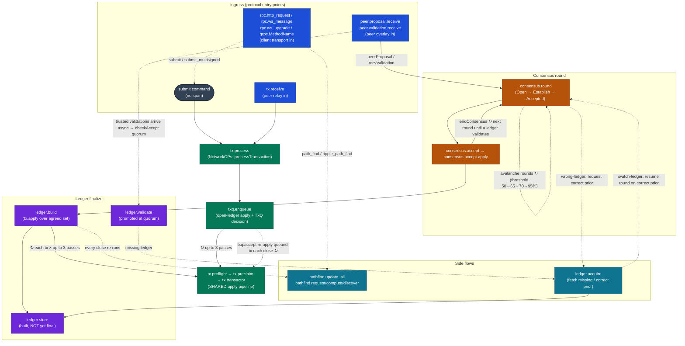
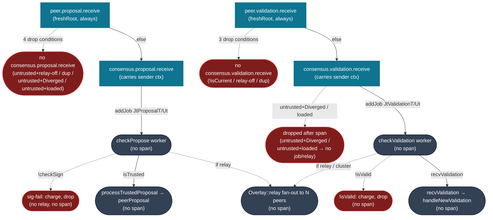
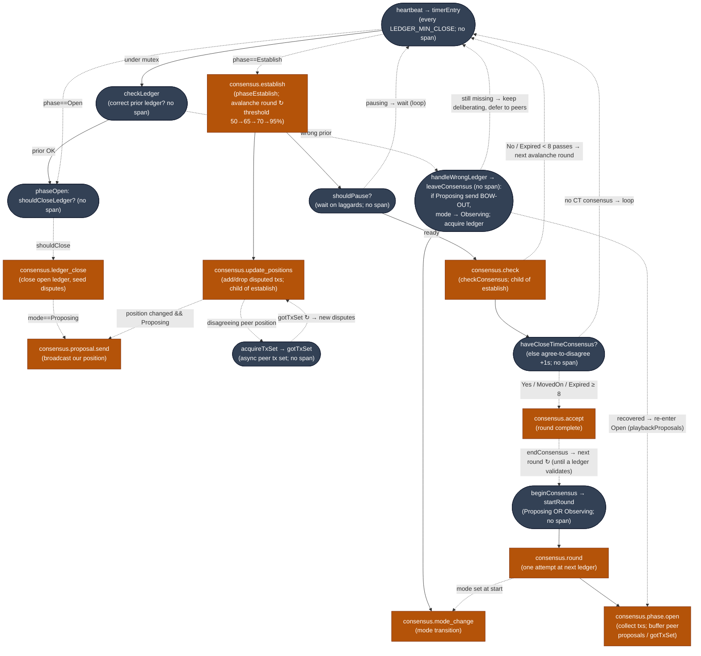

# xrpld Telemetry Operator Runbook

## Table of Contents

- [Overview](#overview)
- [Quick Start](#quick-start)
- [Configuration Reference](#configuration-reference)
- [Exporting to Grafana Cloud](#exporting-to-grafana-cloud)
- [Span Reference](#span-reference)
  - [RPC Spans](#rpc-spans)
  - [Transaction Spans](#transaction-spans)
  - [Transaction Queue Spans](#transaction-queue-spans)
  - [PathFinding Spans](#pathfinding-spans)
  - [Consensus Spans](#consensus-spans)
  - [Ledger Spans](#ledger-spans)
  - [Peer Spans](#peer-spans)
- [Protocol Span Flow](#protocol-span-flow)
  - [Master overview](#master-overview)
  - [Client and peer ingress](#client-and-peer-ingress)
  - [Shared transaction apply pipeline](#shared-transaction-apply-pipeline)
  - [Consensus round](#consensus-round)
  - [Accept, build, and finalize the ledger](#accept-build-and-finalize-the-ledger)
  - [Side flows: pathfinding and ledger acquire](#side-flows-pathfinding-and-ledger-acquire)
  - [Where telemetry parenting differs from protocol flow](#where-telemetry-parenting-differs-from-protocol-flow)
- [Insights and Sample Queries](#insights-and-sample-queries)
  - [Transaction Workflow Analysis](#transaction-workflow-analysis)
  - [DEX (OfferCreate / OfferCancel)](#dex-offercreate--offercancel)
  - [Apply Pipeline by Stage](#apply-pipeline-by-stage)
  - [Transaction Queue Health](#transaction-queue-health)
  - [RPC Debugging](#rpc-debugging)
  - [PathFinding Performance](#pathfinding-performance)
  - [Consensus Health](#consensus-health)
  - [Cross-Subsystem Correlation](#cross-subsystem-correlation)
- [Cross-Node Trace Propagation](#cross-node-trace-propagation)
- [Prometheus Metrics (Spanmetrics)](#prometheus-metrics-spanmetrics)
- [System Metrics (OTel native -- beast::insight)](#system-metrics-otel-native----beastinsight)
- [Grafana Dashboards](#grafana-dashboards)
- [Alerting](#alerting)
- [Log-Trace Correlation](#log-trace-correlation)
- [Troubleshooting](#troubleshooting)
- [Performance Tuning](#performance-tuning)
- [Disabling Telemetry](#disabling-telemetry)
- [Validating Telemetry Stack](#validating-telemetry-stack)
- [Performance Benchmarking](#performance-benchmarking)

## Overview

xrpld supports OpenTelemetry distributed tracing to provide visibility into RPC requests, transaction processing, and consensus rounds.

This runbook covers operating a running node and querying its traces. For
building xrpld with telemetry support and the internal architecture, see
[build/telemetry.md](build/telemetry.md). For plain-language definitions of the
XRP Ledger terms used in the dashboards, see the
[telemetry glossary](telemetry-glossary.md).

## Quick Start

### 1. Start the observability stack

```bash
docker compose -f docker/telemetry/docker-compose.yml up -d
```

This starts:

- **OTel Collector** on ports 4317 (gRPC) and 4318 (HTTP), and 13133 (health)
- **Tempo** on http://localhost:3200 (trace backend)
- **Prometheus** on http://localhost:9090
- **Loki** on http://localhost:3100 (log aggregation)
- **Grafana** on http://localhost:3000 (Tempo pre-configured as datasource)

### 2. Enable telemetry in xrpld

Add to your `xrpld.cfg`:

```ini
[telemetry]
enabled=1
endpoint=http://localhost:4318/v1/traces
```

### 3. Build with telemetry support

```bash
conan install . --build=missing -o telemetry=True
cmake --preset default -Dtelemetry=ON
cmake --build --preset default
```

### 4. Run against a live network

Two ready-made configs connect a tracking node (no validator credentials) to a
public network with all tracing and native metrics enabled:

| Config                                         | Network |
| ---------------------------------------------- | ------- |
| `docker/telemetry/xrpld-telemetry.cfg`         | Devnet  |
| `docker/telemetry/xrpld-telemetry-mainnet.cfg` | Mainnet |

```bash
.build/xrpld --conf docker/telemetry/xrpld-telemetry-mainnet.cfg
```

Both set `[insight] server=otel` (native metrics → collector → Prometheus, which
drives the dashboards) and `service_instance_id`, exposed by Prometheus as the
`service_instance_id` label that the `$node` dashboard variable filters on. The
mainnet config logs to `/var/log/xrpld/mainnet/debug.log` — the path
the collector's filelog receiver tails for log-trace correlation.

Metrics begin flowing as soon as the node connects to peers (`server_state`
≥ `connected`); full ledger and consensus panels populate after sync
(`server_state` = `full`). Check progress with:

```bash
curl -s http://localhost:5005 -d '{"method":"server_info"}' |
    jq '.result.info | {server_state, peers, complete_ledgers}'
```

> Mainnet sync is bandwidth- and disk-heavy. For a quick check use the devnet
> config or the standalone test in `docker/telemetry/TESTING.md`, which
> generates spans without waiting for a live sync.

## Configuration Reference

| Option                     | Default                           | Description                                               |
| -------------------------- | --------------------------------- | --------------------------------------------------------- |
| `enabled`                  | `0`                               | Master switch for telemetry                               |
| `endpoint`                 | `http://localhost:4318/v1/traces` | OTLP/HTTP endpoint                                        |
| `service_name`             | `xrpld`                           | OpenTelemetry service name resource attribute             |
| `service_instance_id`      | node public key                   | OpenTelemetry service instance ID resource attribute      |
| `trace_rpc`                | `1`                               | Enable RPC request tracing                                |
| `trace_transactions`       | `1`                               | Enable transaction tracing                                |
| `trace_consensus`          | `1`                               | Enable consensus tracing                                  |
| `trace_peer`               | `1`                               | Enable peer message tracing (high volume)                 |
| `trace_ledger`             | `1`                               | Enable ledger tracing                                     |
| `consensus_trace_strategy` | `deterministic`                   | Consensus trace ID strategy (`deterministic` or `random`) |
| `batch_size`               | `512`                             | Max spans per batch export                                |
| `batch_delay_ms`           | `5000`                            | Delay between batch exports                               |
| `max_queue_size`           | `2048`                            | Max spans queued before dropping                          |
| `use_tls`                  | `0`                               | Use TLS for exporter connection                           |
| `tls_ca_cert`              | (empty)                           | Path to CA certificate bundle                             |
| `tls_client_cert`          | (empty)                           | Client cert (PEM) for mutual TLS; empty = one-way TLS     |
| `tls_client_key`           | (empty)                           | Private key (PEM) for `tls_client_cert`                   |

## Exporting to Grafana Cloud

The collector can ship traces, metrics, and logs to a hosted **Grafana
Cloud** stack instead of (or alongside) the local Tempo/Prometheus/Loki
backends. This is a runtime choice — no xrpld rebuild and no change to the
base stack. xrpld still exports to the local collector exactly as before;
the collector adds one OTLP/HTTP exporter that forwards all three signals to
the Grafana Cloud OTLP gateway, which fans them out to hosted Tempo, Mimir,
and Loki.

### Credentials

Find these under **Grafana Cloud → Connections → OpenTelemetry (OTLP)**:

| Value                         | Used as           | Notes                                              |
| ----------------------------- | ----------------- | -------------------------------------------------- |
| `GRAFANA_CLOUD_OTLP_ENDPOINT` | exporter endpoint | Full gateway URL incl. `/otlp` path                |
| `GRAFANA_CLOUD_INSTANCE_ID`   | Basic-auth user   | Numeric stack/instance id                          |
| `GRAFANA_CLOUD_API_TOKEN`     | Basic-auth pass   | Access-policy token with `*:write` for all signals |

### Enable

1. Copy the template and fill in the three values:

   ```bash
   cp docker/telemetry/.env.grafanacloud.example docker/telemetry/.env.grafanacloud
   # edit .env.grafanacloud — this file is gitignored, never commit tokens
   ```

2. Bring the stack up with the base file **and** the Grafana Cloud override:

   ```bash
   docker compose -f docker/telemetry/docker-compose.yml \
       -f docker/telemetry/docker-compose.grafanacloud.yaml up -d
   ```

To return to local-only export, bring the stack up with just the base
`docker-compose.yml`.

### Files

| File                                      | Role                                                                                           |
| ----------------------------------------- | ---------------------------------------------------------------------------------------------- |
| `otel-collector-config.grafanacloud.yaml` | Collector config: local backends **plus** a Grafana Cloud OTLP exporter on all three pipelines |
| `docker-compose.grafanacloud.yaml`        | Override that mounts that config and injects the credentials                                   |
| `.env.grafanacloud.example`               | Credential template (copy to `.env.grafanacloud`)                                              |

### Local + cloud vs cloud-only

The prepared config **dual-exports**: data goes to both the local stack and
Grafana Cloud, so the on-box backends remain a fallback. For cloud-only,
remove the local exporters (`debug`, `otlp/tempo`, `prometheus`,
`otlphttp/loki`) from the respective pipelines in
`otel-collector-config.grafanacloud.yaml`, leaving only
`otlphttp/grafanacloud`.

> **Note**: shipping logs to Grafana Cloud requires keeping xrpld file
> logging on (at least `warning` level) so the collector's filelog receiver
> has a `debug.log` to tail. Traces and metrics are unaffected by log level.

### Importing dashboards to Grafana Cloud

Shipping data (above) is independent of installing the dashboards. The local
stack auto-provisions dashboards from a mounted folder
(`grafana/provisioning/dashboards/dashboards.yaml`, `type: file`); Grafana
Cloud cannot read your filesystem, so its dashboards must be imported over the
HTTP API or the UI.

The dashboard JSON in `docker/telemetry/grafana/dashboards/` references its
backends through datasource **template variables** (`${DS_PROMETHEUS}`,
`${DS_TEMPO}`) rather than fixed UIDs. On import, Grafana binds each variable
to a datasource of the matching type — auto-selecting it when only one exists
(the usual case: one Mimir, one Tempo). This is what makes the same files work
unchanged on both the local stack and Cloud.

> Dashboards are parameterized by `grafana/parameterize-datasources.py`. If you
> add a dashboard exported with hardcoded UIDs, re-run that script (idempotent)
> before committing so it stays portable.

To import:

1. In Grafana Cloud, go to **Dashboards → New → Import**.
2. Upload a file from `docker/telemetry/grafana/dashboards/` (or paste its
   JSON), then click **Load**.
3. At the datasource prompt, confirm the auto-selected **Prometheus/Mimir**
   datasource — and **Tempo** for dashboards that query traces — then
   **Import**.
4. Repeat per dashboard. Only `consensus-health` uses Tempo; the rest need
   only the Prometheus/Mimir datasource.

## Span Reference

All spans instrumented in xrpld, grouped by subsystem:

### RPC Spans

| Span Name            | Source File       | Attributes                                                  | Description                                           |
| -------------------- | ----------------- | ----------------------------------------------------------- | ----------------------------------------------------- |
| `rpc.http_request`   | ServerHandler.cpp | `request_payload_size`                                      | Top-level HTTP RPC request                            |
| `rpc.ws_upgrade`     | ServerHandler.cpp | —                                                           | WebSocket upgrade handshake                           |
| `rpc.ws_message`     | ServerHandler.cpp | `command`                                                   | WebSocket RPC message                                 |
| `rpc.process`        | ServerHandler.cpp | `is_batch`, `batch_size`                                    | RPC processing (child of rpc.http_request/ws_message) |
| `rpc.command.<name>` | RPCHandler.cpp    | `command`, `version`, `rpc_role`, `rpc_status`, `load_type` | Per-command span (e.g., `rpc.command.server_info`)    |

### Transaction Spans

| Span Name       | Source File     | Attributes                                                                                              | Description                           |
| --------------- | --------------- | ------------------------------------------------------------------------------------------------------- | ------------------------------------- |
| `tx.process`    | NetworkOPs.cpp  | `tx_hash`, `local`, `path`, `tx_type`, `fee`, `sequence`, `ter_result`, `applied`, `current_ledger_seq` | Transaction submission and processing |
| `tx.receive`    | PeerImp.cpp     | `peer_id`, `tx_hash`, `tx_type`, `peer_version`, `suppressed`, `tx_status`, `current_ledger_seq`        | Transaction received from peer relay  |
| `tx.apply`      | BuildLedger.cpp | `ledger_seq`, `tx_count`, `tx_failed`                                                                   | Transaction set applied per ledger    |
| `tx.preflight`  | applySteps.cpp  | `stage`, `tx_type`, `ter_result`                                                                        | Stateless checks stage                |
| `tx.preclaim`   | applySteps.cpp  | `stage`, `tx_type`, `ter_result`, `current_ledger_seq`, `current_ledger_hash`                           | Ledger-aware checks stage             |
| `tx.transactor` | Transactor.cpp  | `stage`, `tx_type`, `ter_result`, `applied`, `current_ledger_seq`, `current_ledger_hash`                | Apply stage (transactor runs)         |

The three apply-pipeline spans (`tx.preflight`, `tx.preclaim`, `tx.transactor`)
share a deterministic `trace_id` from `txID[0:16]`, so they group under one
trace per transaction. The `stage` attribute (`preflight` / `preclaim` /
`apply`) drives the collector spanmetrics `stage` dimension, giving per-stage
RED metrics on the _Transaction Overview_ dashboard.

`current_ledger_seq` is the current (open/in-flight) ledger index a span acted on
— the ledger being worked on, not an established one — so a transaction's
txID-keyed spans can be joined to the ledger trace it targeted
(`span.current_ledger_seq`). The view-bearing stages (`tx.preclaim`,
`tx.transactor`) also carry `current_ledger_hash` (the current ledger's parent
hash); `tx.preflight` is stateless and omits both.

### Transaction Queue Spans

| Span Name          | Source File | Attributes                                                        | Description                                                                                                                                                                                  |
| ------------------ | ----------- | ----------------------------------------------------------------- | -------------------------------------------------------------------------------------------------------------------------------------------------------------------------------------------- |
| `txq.enqueue`      | TxQ.cpp     | `tx_hash`, `tx_type`, `current_ledger_seq`, `current_ledger_hash` | Enqueue decision; parents to `tx.process` on the submission path (explicit context), a root on the open-ledger rebuild path — `current_ledger_seq` correlates it to the ledger in both cases |
| `txq.apply_direct` | TxQ.cpp     | --                                                                | Direct apply attempt (bypassing queue)                                                                                                                                                       |
| `txq.batch_clear`  | TxQ.cpp     | --                                                                | Batch clear of queued transactions for an account                                                                                                                                            |
| `txq.accept`       | TxQ.cpp     | `queue_size`, `ledger_changed`                                    | Ledger-close accept loop over queued transactions                                                                                                                                            |
| `txq.accept_tx`    | TxQ.cpp     | `tx_hash`, `retries_remaining`, `ter_code`, `txq_status`          | Per-transaction apply during accept                                                                                                                                                          |
| `txq.cleanup`      | TxQ.cpp     | `ledger_seq`                                                      | Post-close cleanup of expired queue entries                                                                                                                                                  |

### PathFinding Spans

| Span Name             | Source File                       | Attributes                                         | Description                                             |
| --------------------- | --------------------------------- | -------------------------------------------------- | ------------------------------------------------------- |
| `pathfind.request`    | PathFind.cpp / RipplePathFind.cpp | `pathfind_source_account`, `pathfind_dest_account` | Path-find RPC entry (accounts hashed; set when present) |
| `pathfind.compute`    | PathRequest.cpp                   | `pathfind_fast`, `pathfind_dest_currency`          | Path computation for one request (`doUpdate`)           |
| `pathfind.discover`   | PathRequest.cpp                   | `pathfind_search_level`, `pathfind_num_paths`      | Graph exploration (one per RPC call in `findPaths`)     |
| `pathfind.update_all` | PathRequestManager.cpp            | `pathfind_ledger_index`, `pathfind_num_requests`   | Async recomputation of active requests on ledger close  |

### Consensus Spans

| Span Name                      | Source File      | Attributes                                                                                                                                                                                                                   | Description                                                                                                                           |
| ------------------------------ | ---------------- | ---------------------------------------------------------------------------------------------------------------------------------------------------------------------------------------------------------------------------- | ------------------------------------------------------------------------------------------------------------------------------------- |
| `consensus.round`              | RCLConsensus.cpp | `consensus_ledger_id`, `ledger_seq`, `consensus_mode`, `trace_strategy`, `consensus_round_id`                                                                                                                                | Root span for a consensus round (deterministic or random trace ID)                                                                    |
| `consensus.phase.open`         | Consensus.h      | --                                                                                                                                                                                                                           | Open phase duration (child of round)                                                                                                  |
| `consensus.proposal.send`      | RCLConsensus.cpp | `consensus_round`, `is_bow_out`                                                                                                                                                                                              | Consensus proposal broadcast                                                                                                          |
| `consensus.ledger_close`       | RCLConsensus.cpp | `ledger_seq`, `consensus_mode`                                                                                                                                                                                               | Ledger close event                                                                                                                    |
| `consensus.establish`          | Consensus.h      | `converge_percent`, `establish_count`, `proposers`                                                                                                                                                                           | Establish phase duration (child of round)                                                                                             |
| `consensus.update_positions`   | Consensus.h      | `converge_percent`, `proposers`, `disputes_count`                                                                                                                                                                            | Position update and dispute resolution (see Events below)                                                                             |
| `consensus.check`              | Consensus.h      | `agree_count`, `disagree_count`, `converge_percent`, `have_close_time_consensus`, `threshold_percent`, `proposers_finished`, `consensus_stalled`, `establish_count`, `consensus_result`                                      | Consensus threshold check                                                                                                             |
| `consensus.accept`             | RCLConsensus.cpp | `proposers`, `round_time_ms`, `quorum`, `disputes_count`, `consensus_state`                                                                                                                                                  | Ledger accepted by consensus                                                                                                          |
| `consensus.accept.apply`       | RCLConsensus.cpp | `ledger_seq`, `close_time`, `close_time_correct`, `close_resolution_ms`, `consensus_state`, `proposing`, `round_time_ms`, `parent_close_time`, `close_time_self`, `close_time_vote_bins`, `resolution_direction`, `tx_count` | Ledger application with close time details (see Events below)                                                                         |
| `consensus.validation.send`    | RCLConsensus.cpp | `ledger_seq`, `proposing`, `ledger_hash`, `full_validation`, `validation_sign_time`                                                                                                                                          | Validation sent after accept (follows-from link)                                                                                      |
| `consensus.mode_change`        | RCLConsensus.cpp | `mode_old`, `mode_new`                                                                                                                                                                                                       | Consensus mode transition                                                                                                             |
| `consensus.proposal.receive`   | PeerImp.cpp      | `proposal_trusted`, `consensus_round`                                                                                                                                                                                        | Proposal received from peer (extracts parent context from TraceContext when present; falls back to standalone span for older peers)   |
| `consensus.validation.receive` | PeerImp.cpp      | `validation_trusted`, `ledger_seq`                                                                                                                                                                                           | Validation received from peer (extracts parent context from TraceContext when present; falls back to standalone span for older peers) |

#### Consensus Span Events

| Parent Span                  | Event Name        | Event Attributes                                            | Description                                             |
| ---------------------------- | ----------------- | ----------------------------------------------------------- | ------------------------------------------------------- |
| `consensus.update_positions` | `dispute.resolve` | `tx_id`, `dispute_our_vote`, `dispute_yays`, `dispute_nays` | Emitted per dispute when votes are tallied              |
| `consensus.accept.apply`     | `tx.included`     | `tx_id`                                                     | Emitted per transaction included in the accepted ledger |

#### Close Time Queries (Tempo TraceQL)

Span attributes are filtered with `span.<attr>` inside `{}`. Combine conditions with `&&`.

```
# Find rounds where validators disagreed on close time
{name="consensus.accept.apply" && span.close_time_correct = false}

# Find consensus failures (moved_on)
{name="consensus.accept.apply" && span.consensus_state = "moved_on"}

# Find slow ledger applications (>5s)
{name="consensus.accept.apply" && duration > 5000ms}

# Find specific ledger's consensus details
{name="consensus.accept.apply" && span.ledger_seq = 92345678}

# Find all spans in a consensus round (deterministic trace strategy)
{name="consensus.round" && span.consensus_round_id = "<round_id>"}

# Find dispute resolutions
{name="consensus.update_positions"} >> {event:name="dispute.resolve"}
```

### Ledger Spans

| Span Name         | Source File          | Attributes                            | Description                   |
| ----------------- | -------------------- | ------------------------------------- | ----------------------------- |
| `ledger.build`    | BuildLedger.cpp:31   | `ledger_seq`, `tx_count`, `tx_failed` | Ledger build during consensus |
| `ledger.validate` | LedgerMaster.cpp:915 | `ledger_seq`, `validations`           | Ledger promoted to validated  |
| `ledger.store`    | LedgerMaster.cpp:409 | `ledger_seq`                          | Ledger stored in history      |

### Peer Spans

| Span Name                 | Source File      | Attributes                      | Description                   |
| ------------------------- | ---------------- | ------------------------------- | ----------------------------- |
| `peer.proposal.receive`   | PeerImp.cpp:1667 | `peer_id`, `proposal_trusted`   | Proposal received from peer   |
| `peer.validation.receive` | PeerImp.cpp:2264 | `peer_id`, `validation_trusted` | Validation received from peer |

Both peer receive spans are `kConsumer` inbound entry points started as fresh
trace roots. They never inherit an ambient span left active on the peer thread,
so they do not nest under an unrelated transaction's trace. The distributed
child span that links back to the sending node is the separate
`consensus.*.receive` / `tx.receive` span (see Cross-Node Trace Propagation).

---

## Protocol Span Flow

This section maps every span type onto the **real xrpld control flow and XRPL
protocol order** (verified against code and [docs/consensus.md](consensus.md)) —
what the code actually executes next, in what order, with which loops and
branches. Spans are drawn as **labels on real operations**, not as their
OpenTelemetry parent links; the SDK's span parenting is listed separately in
[Where telemetry parenting differs from protocol flow](#where-telemetry-parenting-differs-from-protocol-flow).

These diagrams are the **canonical key for linking the span hierarchy** — every
node and every branch is labelled with the span that represents that state or
transition, so a span can be wired to its true protocol parent/child by reading
the graph. They are therefore drawn **exact, not simplified**: every real loop,
retry, recovery, and drop branch is shown even when it adds clutter.

Naming and edge conventions:

- **Rectangle `[ ]`** — a state/operation that **emits a span**; the first line is
  the exact `span.name`, the parenthetical below is the operation.
- **Rounded `( )` with `(no span)`** — a real protocol step that emits **no span**;
  shown so the flow stays continuous and is never mistaken for a missing span.
- **Solid arrow** — the code calls or sequences directly into the next operation.
  When the transition itself emits a span, the edge is labelled `→[span.name]`;
  otherwise it carries the branch condition.
- **`↻`** — the edge repeats (per tx, per peer, per dispute, per pass, per round).
- **Dashed arrow** — a conditional branch or an async job hand-off.
- **Dotted `⇢ ctx`** — trace context crosses a node boundary over a protobuf peer
  message (`sender.span ⇢ receiver.span`); a different node continues the trace —
  **not** an in-process call.
- **Red-bordered node** — a terminal **drop / abandon** state.

### Master overview

Five ingress origins feed two shared engines — the per-transaction **apply
pipeline** and the **consensus round** — which converge on ledger build → store →
validate. Pathfinding and ledger-acquire are side flows. A single ledger can take
**many consensus rounds** to settle (see [Consensus round](#consensus-round)).



### Client and peer ingress

RPC submit and peer relay **converge** at `tx.process`, the single NetworkOPs
entry. gRPC serves ledger queries only — it has no submit path and never runs
`doCommand`.


Ingress branches (all evidence in code):

- `onHandoff`: WS upgrade vs peer bundle vs status page vs legacy HTTP
  ([ServerHandler.cpp:227](../src/xrpld/rpc/detail/ServerHandler.cpp#L227)).
- `doSubmit`: `tx_blob` present → submit signed blob; absent → server
  sign-and-submit ([Submit.cpp:49](../src/xrpld/rpc/handlers/transaction/Submit.cpp#L49)).
- `tx.process`: local RPC → `doTransactionSync`; peer → `doTransactionAsync`
  (JtBatch) ([NetworkOPs.cpp:1434](../src/xrpld/app/misc/NetworkOPs.cpp#L1434)).
- **Pre-span peer drops** (no `tx.receive` created): `Diverged`
  ([PeerImp.cpp:1299](../src/xrpld/overlay/detail/PeerImp.cpp#L1299)) /
  `needNetworkLedger` ([1302](../src/xrpld/overlay/detail/PeerImp.cpp#L1302)),
  before the span at ~1320.
- **Post-span peer drops** (span exists, `tx_status` set, no job enqueued):
  `tfInnerBatchTxn` ([1348](../src/xrpld/overlay/detail/PeerImp.cpp#L1348)),
  HashRouter dup/`BAD` ([1361](../src/xrpld/overlay/detail/PeerImp.cpp#L1361)),
  `dropped_no_sync` when validated-ledger age > 4 min
  ([1416](../src/xrpld/overlay/detail/PeerImp.cpp#L1416)), `dropped_queue_full`
  when `JtTransaction` jobs > `maxTransactions`
  ([1421](../src/xrpld/overlay/detail/PeerImp.cpp#L1421)).
- **Relay fan-out**: an accepted/queued `tx.process` relays to N peers via
  `Overlay::relay`, gated on `applied || (non-FULL local) || terQUEUED`,
  HashRouter `shouldRelay`, and not `tfInnerBatchTxn`; the span context is
  injected here ([NetworkOPs.cpp:1797](../src/xrpld/app/misc/NetworkOPs.cpp#L1797)).

Inbound consensus messages take a two-stage handler — a fresh-root `peer.*.receive`
span created first (kConsumer, always), then a `consensus.*.receive` span (only if
not dropped) that carries the sender's context — before enqueuing a `checkPropose`
/ `checkValidation` worker job. The drop points are **asymmetric**: proposals drop
entirely before `consensus.proposal.receive`, while validations can drop both
before and after `consensus.validation.receive`.



Consensus-message drop evidence:

- Both `peer.proposal.receive` and `peer.validation.receive` are `freshRoot`
  spans created at the top of `onMessage`
  ([PeerImp.cpp:1766](../src/xrpld/overlay/detail/PeerImp.cpp#L1766),
  [2389](../src/xrpld/overlay/detail/PeerImp.cpp#L2389)) — so they exist even for
  dropped messages.
- **Proposal drops (all before `consensus.proposal.receive` at
  [1868](../src/xrpld/overlay/detail/PeerImp.cpp#L1868))**: untrusted+relay-off
  ([1807](../src/xrpld/overlay/detail/PeerImp.cpp#L1807)), duplicate
  ([1832](../src/xrpld/overlay/detail/PeerImp.cpp#L1832)), untrusted+Diverged
  ([1840](../src/xrpld/overlay/detail/PeerImp.cpp#L1840)), untrusted+loaded
  ([1846](../src/xrpld/overlay/detail/PeerImp.cpp#L1846)).
- **Validation drops (asymmetric around `consensus.validation.receive` at
  [2476](../src/xrpld/overlay/detail/PeerImp.cpp#L2476))**: before — `!isCurrent`
  ([2426](../src/xrpld/overlay/detail/PeerImp.cpp#L2426)), relay-off
  ([2445](../src/xrpld/overlay/detail/PeerImp.cpp#L2445)), duplicate
  ([2468](../src/xrpld/overlay/detail/PeerImp.cpp#L2468)); after — untrusted+Diverged
  ([2489](../src/xrpld/overlay/detail/PeerImp.cpp#L2489)), untrusted+loaded
  ([2506](../src/xrpld/overlay/detail/PeerImp.cpp#L2506)).
- **Worker sig-fail drops** (charged `kFeeInvalidSignature`, suppress processing
  and relay): `checkPropose !checkSign`
  ([PeerImp.cpp:3105](../src/xrpld/overlay/detail/PeerImp.cpp#L3105)),
  `checkValidation !isValid`
  ([3149](../src/xrpld/overlay/detail/PeerImp.cpp#L3149)).

### Shared transaction apply pipeline

The apply pipeline is the **single protocol tx-processing chain**, expressed in
code as one composed call
([apply.cpp:118](../src/libxrpl/tx/apply.cpp#L118)):
`doApply(preclaim(preflight(), …), …)`. C++ evaluates inner-to-outer, so
`preflight` runs first, feeds `preclaim`, which feeds `doApply`. Each stage
inspects the prior stage's `TER` and no-ops if it already failed.

**Four invokers** point into this one pipeline; the diagram draws it once.


Pipeline gates and retry (evidence):

- `preclaim` short-circuits if preflight `!tesSUCCESS`
  ([applySteps.cpp:498](../src/libxrpl/tx/applySteps.cpp#L498)); `doApply`
  short-circuits if `!likelyToClaimFee`
  ([applySteps.cpp:532](../src/libxrpl/tx/applySteps.cpp#L532)); the transactor
  mutates only when preclaim is `tesSUCCESS`
  ([Transactor.cpp:1647](../src/libxrpl/tx/Transactor.cpp#L1647)).
- **Final-TER classification**: `applied` → Success; `tef | tem | tel` → hard Fail;
  else → Retry ([apply.cpp:226](../src/libxrpl/tx/apply.cpp#L226)).
- **Multi-pass retry**: both open-ledger `applyOne` and consensus `tx.apply` loop
  `pass < LEDGER_TOTAL_PASSES` (= 3); a `Retry` tx is kept for the next pass, and
  the final pass converts lingering retriable txs into drops
  ([OpenLedger.h:237](../src/xrpld/app/ledger/OpenLedger.h#L237),
  [BuildLedger.cpp:129](../src/xrpld/app/ledger/detail/BuildLedger.cpp#L129);
  `LEDGER_TOTAL_PASSES` [OpenLedger.h:29](../src/xrpld/app/ledger/OpenLedger.h#L29)).
- **TxQ re-preflight**: the queue path re-runs `preflight` when the ledger's
  rules/flags changed since enqueue
  ([TxQ.cpp:315](../src/xrpld/app/misc/detail/TxQ.cpp#L315)).
- **TxQ cross-ledger retry**: a queued tx that fails with a retriable result keeps its slot with
  `--retriesRemaining` (`kRetriesAllowed` = 10) and is re-applied at a **later**
  ledger close; on `retriesRemaining ≤ 0` or `tef|tem` it is dropped with an
  account `retryPenalty` ([TxQ.cpp:1528](../src/xrpld/app/misc/detail/TxQ.cpp#L1528)).
- `TxQ::apply` outcome fork: preflight-reject / `applied_direct` / `batch_clear` /
  `queued` (`terQUEUED`) / reject
  ([TxQ.cpp:762](../src/xrpld/app/misc/detail/TxQ.cpp#L762)).

> **`tx.apply` is set-level, consensus-only.** It wraps the retry-pass loop over
> the agreed set during `buildLedger` and exists on **no other** invoker. It is
> not a per-transaction span, and TxQ / open-ledger apply create no `tx.apply`.

### Consensus round

`beginConsensus → startRound` starts the round (`consensus.round`, `Open` phase).
The **heartbeat timer** drives `Consensus::timerEntry` each pass; the round stays
in `Establish` across many heartbeats until the outcome is decided.

> **A single ledger can take many rounds to settle.** Two nested multi-round
> mechanisms (see [docs/consensus.md](consensus.md)):
>
> 1. **Avalanche rounds inside one Establish phase** — each `timerEntry` runs
>    `phaseEstablish` again (`establishCounter_++`) and raises the inclusion
>    threshold **50% → 65% → 70% → 95%** as the round ages
>    ([ConsensusParms.h:145](../src/xrpld/consensus/ConsensusParms.h#L145)).
>    `checkConsensus` returning `No` keeps the node in `Establish` and loops; a
>    round cannot even `Expire` before a minimum of
>    `avalancheCutoffs.size() × avMinRounds = 4 × 2 = 8` passes
>    ([Consensus.h:1938](../src/xrpld/consensus/Consensus.h#L1938)).
> 2. **Retry across consensus rounds** — a round can end `MovedOn` / `Expired`,
>    meaning the network settled a _different_ ledger. The node still builds a
>    ledger, but the **next** round's `checkLedger` detects the wrong prior,
>    switches to `WrongLedger` / `SwitchedLedger` mode, acquires the correct
>    ledger, and re-deliberates. A ledger is only truly settled once trusted
>    **validations reach quorum** (`ledger.validate`); the alternate is abandoned.



Consensus loops and branches (evidence):

- **`consensus.establish` is the parent of `update_positions` and `check`**:
  `phaseEstablish` creates the establish span (`startEstablishTracing`), and both
  child spans parent to its captured context
  ([Consensus.h:2100](../src/xrpld/consensus/Consensus.h#L2100),
  [1629](../src/xrpld/consensus/Consensus.h#L1629),
  [1838](../src/xrpld/consensus/Consensus.h#L1838)).
- **Avalanche-convergence loop (rounds within one ledger)**: repeated
  `heartbeat → timerEntry → phaseEstablish` bumps `establishCounter_` and raises
  the inclusion threshold each pass; `checkConsensus` = `No` stays in `Establish`
  ([NetworkOPs.cpp:1214](../src/xrpld/app/misc/NetworkOPs.cpp#L1214);
  [Consensus.h:1468](../src/xrpld/consensus/Consensus.h#L1468);
  thresholds [ConsensusParms.h:145](../src/xrpld/consensus/ConsensusParms.h#L145)).
- **Retry-across-rounds loop (many rounds per settled ledger)**: `MovedOn` /
  `Expired` accepts a non-preferred ledger; the next round's `checkLedger` finds
  the wrong prior and recovers before re-deliberating
  ([Consensus.h:1194](../src/xrpld/consensus/Consensus.h#L1194)); round-to-round
  via `endConsensus → beginConsensus`
  ([NetworkOPs.cpp:2315](../src/xrpld/app/misc/NetworkOPs.cpp#L2315)).
- **Two extra establish loop-backs before accept**: `shouldPause` (laggard
  backpressure) and `!haveCloseTimeConsensus_` (TX consensus but not close-time)
  each `return` and re-loop, distinct from `checkConsensus == No`
  ([Consensus.h:1497](../src/xrpld/consensus/Consensus.h#L1497),
  [1500](../src/xrpld/consensus/Consensus.h#L1500)); close time can
  "agree to disagree" at prior close + 1s ([docs/consensus.md:163](consensus.md)).
- **acquireTxSet / gotTxSet loop**: a disagreeing peer position triggers an async
  `acquireTxSet`; the later `gotTxSet` regenerates disputes and can extend the
  establish phase ([Consensus.h:932](../src/xrpld/consensus/Consensus.h#L932)).
- **Bow-out / mode change**: `handleWrongLedger → leaveConsensus` sends a bow-out
  proposal and demotes Proposing → Observing for the rest of the round
  ([Consensus.h:1977](../src/xrpld/consensus/Consensus.h#L1977)); `startRound`
  begins in Proposing **or** Observing ([docs/consensus.md:176](consensus.md)).
- **Buffered Open-phase inputs**: `peerProposal` / `gotTxSet` arriving during Open
  are stored, then seeded as disputes at `closeLedger` (`createDisputes`);
  `playbackProposals` replays them at `startRound` / `handleWrongLedger`
  ([docs/consensus.md:244](consensus.md);
  [Consensus.h:817](../src/xrpld/consensus/Consensus.h#L817)).
- **Outcome fork** after `checkConsensus`: `No` (loop) / `Yes` (onAccept) /
  `MovedOn` / `Expired` ([Consensus.h:1516](../src/xrpld/consensus/Consensus.h#L1516)).
- **Expired guard**: a round cannot leave on `Expired` before
  `avalancheCutoffs.size() × avMinRounds` (= 8) passes — below that, `Expired`
  loops like `No` ([Consensus.h:1938](../src/xrpld/consensus/Consensus.h#L1938)).
- The **deterministic-vs-random trace-strategy** branch at round start
  ([RCLConsensus.cpp:1291](../src/xrpld/app/consensus/RCLConsensus.cpp#L1291)) sets
  only the trace ID — it has **zero protocol effect**.

### Accept, build, and finalize the ledger

`onAccept` enqueues a `JtAccept` job; `doAccept` runs on that worker
(`consensus.accept.apply`). It builds the ledger (running the apply pipeline over
the agreed set), cleans the queue, stores the ledger, optionally broadcasts a
validation, and rebuilds the open ledger. A built ledger is **not final** — it is
promoted to `ledger.validate` only when trusted validations reach quorum, an
**async, validation-driven** path re-entered per incoming trusted validation; a
built ledger that loses is **abandoned**.


- Order inside `doAccept`: `buildLCL` (build → `tx.apply`, then `txq.cleanup`,
  then `ledger.store`) → optional `validate` → `consensusBuilt`/`checkAccept` →
  `OpenLedger::accept` (rebuilds the open ledger; `txq.accept` runs in its
  callback) → `switchLCL` promotes the built ledger to the new LCL
  ([RCLConsensus.cpp:812](../src/xrpld/app/consensus/RCLConsensus.cpp#L812) then
  [833](../src/xrpld/app/consensus/RCLConsensus.cpp#L833)).
- **buildLCL replay branch**: if `releaseReplay()` has data, `buildLedger` replays
  the stored set with `TapNone` — it **still emits `ledger.build`** (via
  `buildLedgerImpl`) but applies txns directly with **no `tx.apply` child** and no
  3-pass loop; else the normal consensus-set path runs `tx.apply` over 3 passes
  ([RCLConsensus.cpp:929](../src/xrpld/app/consensus/RCLConsensus.cpp#L929);
  [BuildLedger.cpp:252](../src/xrpld/app/ledger/detail/BuildLedger.cpp#L252)).
- `processClosedLedger` (`txq.cleanup`) runs **after** build, **before** store
  ([RCLConsensus.cpp:950](../src/xrpld/app/consensus/RCLConsensus.cpp#L950) vs
  [953](../src/xrpld/app/consensus/RCLConsensus.cpp#L953)).
- **`ledger.validate` is async + lossy**: `checkAccept` is re-entered per incoming
  trusted validation (`handleNewValidation → checkAccept`,
  [RCLValidations.cpp:193](../src/xrpld/app/consensus/RCLValidations.cpp#L193));
  it promotes the **highest-seq** trusted ledger whose `valCount > neededValidations`
  ([LedgerMaster.cpp:1180](../src/xrpld/app/ledger/detail/LedgerMaster.cpp#L1180)),
  which may be a **different** ledger than the one this node built. Below quorum
  (`tvc < minVal`) it returns early with no promotion — a built ledger that loses
  is abandoned ([LedgerMaster.cpp:980](../src/xrpld/app/ledger/detail/LedgerMaster.cpp#L980);
  [docs/consensus.md:50](consensus.md)). The `ledger.validate` span is emitted only
  inside `checkAccept` ([LedgerMaster.cpp:987](../src/xrpld/app/ledger/detail/LedgerMaster.cpp#L987)).
- **validation-send guard**: broadcast only if
  `validating_ && isCompatible && !consensusFail && canValidateSeq(seq)` — silently
  suppressed for incompatible ledgers or an already-validated seq
  ([RCLConsensus.cpp:730](../src/xrpld/app/consensus/RCLConsensus.cpp#L730)).
- **switchLCL**: standalone → `setFullLedger` + `tryAdvance` — marks the ledger
  full-validated **without** emitting `ledger.validate` (that span lives only in
  `checkAccept`); networked → `checkAccept` (shared async quorum gate)
  ([LedgerMaster.cpp:442](../src/xrpld/app/ledger/detail/LedgerMaster.cpp#L442)).

### Side flows: pathfinding and ledger acquire

**Pathfinding** — an RPC one-shot (`path_find` / `ripple_path_find`) plus an async
recompute that fires on **every ledger close** for all active subscriptions, and
also garbage-collects dead subscriptions:


**Ledger acquire** — a **separate trace root** (not part of the close flow) that
fetches a missing or correct-prior ledger from peers, retries per peer/timer, and
finishes with a reason-dependent store; `checkAccept` + `tryAdvance` run on **any**
completed acquire:


Side-flow evidence:

- **Pathfind subscription lifecycle**: `path_find` create inserts a persistent
  subscription (`makePathRequest`); `update_all` re-runs each active request every
  close, removes dead subscribers (`doAborting` + `remove_if` erase), and takes an
  extra pass when a new request arrived mid-run
  ([PathRequestManager.cpp:103](../src/xrpld/rpc/detail/PathRequestManager.cpp#L103),
  [169](../src/xrpld/rpc/detail/PathRequestManager.cpp#L169),
  [181](../src/xrpld/rpc/detail/PathRequestManager.cpp#L181)).
- **Acquire outcome fork**: `timeouts_ > kLedgerTimeoutRetriesMax` (= 6) sets
  `failed_` → terminal `logFailure`, no store/checkAccept
  ([InboundLedger.cpp:387](../src/xrpld/app/ledger/detail/InboundLedger.cpp#L387)).
- **done() reason branch (store side only)**: `HISTORY` → `onLedgerFetched`, **no**
  `storeLedger`; else → `storeLedger`. But `checkAccept` + `tryAdvance` run for
  **any** `complete_ && !failed_` acquire regardless of reason
  ([InboundLedger.cpp:495](../src/xrpld/app/ledger/detail/InboundLedger.cpp#L495)
  store switch; [507](../src/xrpld/app/ledger/detail/InboundLedger.cpp#L507)
  reason-independent checkAccept/tryAdvance).
- **tryAdvance multi-ledger loop**: `doAdvance` runs `do { … } while (advanceWork_)`,
  publishing a range of ledgers and recursively triggering further HISTORY acquire
  ([LedgerMaster.cpp:1905](../src/xrpld/app/ledger/detail/LedgerMaster.cpp#L1905)).

### Where telemetry parenting differs from protocol flow

The graph above is protocol control flow. The OpenTelemetry span **parent links**
are built differently and, in several places, do **not** represent a real
call edge. Read a trace with these in mind:

| Telemetry does this                                                                                                                   | Real protocol flow                                                                                                                                                                                                                                    |
| ------------------------------------------------------------------------------------------------------------------------------------- | ----------------------------------------------------------------------------------------------------------------------------------------------------------------------------------------------------------------------------------------------------- |
| `tx.process` is a `hashSpan` root from `txID` — an independent trace root ([TxTracing.h:63](../src/xrpld/telemetry/TxTracing.h#L63)). | The real edge is the synchronous `doSubmit → processTransaction` call; it is **not** a child of `rpc.command.submit`.                                                                                                                                 |
| `tx.preflight` / `tx.preclaim` / `tx.transactor` share one `txID`-derived trace ID.                                                   | That shared ID is a correlation trick, not a call edge. The real order is the composed `apply()` at [apply.cpp:118](../src/libxrpl/tx/apply.cpp#L118). They are **not** children of `tx.process` or `tx.apply`.                                       |
| `consensus.round` uses a deterministic trace ID from the previous ledger hash.                                                        | This makes **all validators share one trace ID** (a cross-node shared root), not a per-node parent. The real round-to-round edge is `endConsensus → beginConsensus`.                                                                                  |
| `consensus.accept` (main thread) and `consensus.accept.apply` (JtAccept worker) are wired via a captured context.                     | The real edge is the queued `JtAccept` job, a thread hand-off ([RCLConsensus.cpp:483](../src/xrpld/app/consensus/RCLConsensus.cpp#L483)).                                                                                                             |
| `pathfind.update_all` parents nothing from the original `pathfind.request`.                                                           | The causal link is the ledger-close job on `JtUpdatePf`, not span nesting.                                                                                                                                                                            |
| `ledger.acquire` and its downstream `ledger.store` / `ledger.validate`.                                                               | Reached via the `AcqDone` job, not parent inheritance; `ledger.acquire` is its own root.                                                                                                                                                              |
| `peer.*.receive` (fresh `kConsumer` root) and `consensus.*.receive` on the same message.                                              | Two **sequential stages of one synchronous handler**, not parent/child; on a duplicate/untrusted drop the `consensus.*.receive` is never created.                                                                                                     |
| Receive spans adopt the sender's `trace_id` + `span_id` as a genuine cross-node parent.                                               | Deliberate: the receive span becomes a child of a **different node's** span (a cross-node context marker, not an in-process edge). `tx.receive` is asymmetric — it borrows only the sender's `span_id` and re-derives its own `trace_id` from `txID`. |

> **Known telemetry artifacts** (from live audits, memory `otel-span-hierarchy-audit`):
> an RPC entry span's scope can leak across a reused coroutine worker, and the
> `hashSpan` roots (`tx.*`) — along with plain roots like `ledger.acquire` — can
> surface in Tempo as dangling "root span not yet received". These are
> exporter/parenting artifacts, not real control-flow parents.

---

## Insights and Sample Queries

This section shows what questions you can answer using the span attributes, with example Tempo TraceQL queries.

**TraceQL syntax note:** span attributes must be referenced with the `span.` prefix inside `{}`.
Conditions are combined with `&&`. The `|` pipeline operator is not supported on this Tempo version.

```
# General pattern
{name="<span-name>" && span.<attr> = <value> && span.<attr2> != <value2>}

# Duration filter (no prefix needed)
{name="<span-name>" && duration > 500ms}

# Regex match
{name="<span-name>" && span.<attr> =~ "<pattern>.*"}

# Multiple span names
{name = "<span-a>" || name = "<span-b>"}

# Name regex
{name =~ "<pattern>.*" && span.<attr> = <value>}

# Structural: find parent spans that have a matching child/event
{name="<parent>"} >> {event:name="<event-name>"}
```

### Transaction Workflow Analysis

```
# Find all AMM transactions (AMMDeposit, AMMWithdraw, AMMVote)
{name="tx.process" && span.tx_type =~ "AMM.*"}

# Find a specific AMM operation
{name="tx.process" && span.tx_type = "AMMDeposit"}
{name="tx.process" && span.tx_type = "AMMWithdraw"}
{name="tx.process" && span.tx_type = "AMMVote"}

# Find Payment transactions that failed
{name="tx.process" && span.tx_type = "Payment" && span.ter_result != "tesSUCCESS"}

# Find Payment failures due to path issues
{name="tx.process" && span.tx_type = "Payment" && span.ter_result =~ "tecPATH.*"}

# Compare latency of different transaction types
{name="tx.process" && span.tx_type = "OfferCreate"}
{name="tx.process" && span.tx_type = "Payment"}

# Find high-fee transactions (fee > 1 XRP = 1000000 drops)
{name="tx.process" && span.fee > 1000000}

# Find transactions that were not applied
{name="tx.process" && span.applied = false}

# Find NFTokenMint across tx and txq spans
{name =~ "tx.*|txq.*" && span.tx_type = "NFTokenMint"}

# Find all NFT-related activity
{name =~ "tx.*|txq.*" && span.tx_type =~ "NFToken.*"}

# Find TrustSet transactions (IOU trust lines)
{name="tx.process" && span.tx_type = "TrustSet"}

# Find oracle price updates
{name="tx.process" && span.tx_type = "OracleSet"}
```

### DEX (OfferCreate / OfferCancel)

```
# All DEX offer creates
{name="tx.process" && span.tx_type = "OfferCreate"}

# Offers killed (ImmediateOrCancel/FillOrKill with no fill)
{name="tx.process" && span.tx_type = "OfferCreate" && span.ter_result = "tecKILLED"}

# Offers that failed due to insufficient funds
{name="tx.process" && span.tx_type = "OfferCreate" && span.ter_result = "tecUNFUNDED_OFFER"}

# Offers failed due to insufficient reserve to place the offer
{name="tx.process" && span.tx_type = "OfferCreate" && span.ter_result = "tecINSUF_RESERVE_OFFER"}

# Offer cancellations
{name="tx.process" && span.tx_type = "OfferCancel"}

# OfferCreate transactions received from peers (cross-node relay)
{name="tx.receive" && span.tx_type = "OfferCreate"}
```

### Apply Pipeline by Stage

```
# All three stages of one transaction (preflight -> preclaim -> apply)
{name=~"tx.preflight|tx.preclaim|tx.transactor"}

# Transactions that failed at the preclaim stage
{name="tx.preclaim"} | ter_result != "tesSUCCESS"

# Transactions that hard-failed preflight (never reached preclaim/apply)
{name="tx.preflight"} | ter_result != "tesSUCCESS"
```

PromQL on the span-derived metrics (dashboard: _Transaction Overview_):

```
# Per-stage throughput — the funnel preflight >= preclaim >= apply
sum by (stage) (rate(span_calls_total{span_name=~"tx.preflight|tx.preclaim|tx.transactor"}[5m]))

# Per-stage p95 latency
histogram_quantile(0.95, sum by (le, stage) (rate(span_duration_milliseconds_bucket{span_name=~"tx.preflight|tx.preclaim|tx.transactor"}[5m])))

# Per-stage failure rate (ter_result != tesSUCCESS; a failing ter completes the
# span normally, so filter on the attribute, not status_code which only flags exceptions)
sum by (stage) (rate(span_calls_total{span_name=~"tx.preflight|tx.preclaim|tx.transactor", ter_result!~"tesSUCCESS|"}[5m]))
```

> **Alerting**: a rising `tx.preflight` / `tx.preclaim` failure rate points to
> malformed or stale-sequence submissions (often spam or a misbehaving client);
> a rising `tx.transactor` failure rate points to apply-time problems. Alert per
> stage rather than on a single aggregate so the failing stage is obvious.

> **Sampling caveat**: these stage metrics are span-derived and inherit the
> **tracer head-sampling** ratio (`sampling_ratio`). At `sampling_ratio < 1.0`
> they undercount proportionally — treat them as relative trends, not absolute
> transaction counts. Native StatsD metrics are unsampled.

### Transaction Queue Health

```
# Find transactions rejected from the queue
{name="txq.accept_tx" && span.txq_status = "failed"}

# Find transactions being retried
{name="txq.accept_tx" && span.txq_status = "retried"}

# Find transactions that exhausted retries
{name="txq.accept_tx" && span.txq_status = "retried" && span.retries_remaining = 0}

# Which transaction types get queued most often?
{name="txq.enqueue" && span.tx_type = "Payment"}
{name="txq.enqueue" && span.tx_type = "OfferCreate"}
{name="txq.enqueue" && span.tx_type =~ "NFToken.*"}

# Find ledger closes that applied queued transactions
{name="txq.accept" && span.ledger_changed = true}
```

### RPC Debugging

```
# Find batch RPC requests
{name="rpc.process" && span.is_batch = true}

# Find large RPC payloads (>100KB)
{name="rpc.http_request" && span.request_payload_size > 100000}

# Find resource-heavy RPC commands (by load_type)
{name =~ "rpc.command.*" && span.load_type = "exceptioned RPC"}

# Find a specific WebSocket command
{name="rpc.ws_message" && span.command = "subscribe"}

# Find server_info calls
{name="rpc.command.server_info"}

# Find slow pathfinding with many source assets
{name="pathfind.discover" && span.pathfind_num_source_assets > 10}
```

### PathFinding Performance

```
# Find pathfinding for specific currencies
{name="pathfind.compute" && span.pathfind_dest_currency = "USD"}

# Find expensive pathfinding (many source assets to explore)
{name="pathfind.discover" && span.pathfind_num_source_assets > 20}

# Find slow pathfinding requests
{name="pathfind.compute" && duration > 1000ms}
```

### Consensus Health

```
# Find rounds where consensus timed out (expired)
{name="consensus.accept" && span.consensus_state = "expired"}

# Find rounds where we moved on without full agreement
{name="consensus.accept" && span.consensus_state = "moved_on"}

# Find rounds with many disputes
{name="consensus.accept" && span.disputes_count > 5}

# Find slow consensus rounds (>5s)
{name="consensus.accept" && span.round_time_ms > 5000}

# Find bow-out proposals (node resigned from round)
{name="consensus.proposal.send" && span.is_bow_out = true}

# Correlate validation with its ledger
{name="consensus.validation.send" && span.ledger_hash = "<hash>"}

# Find rounds where validators disagreed on close time
{name="consensus.accept.apply" && span.close_time_correct = false}

# Find both validation send and receive (compare sender vs receiver latency)
{name = "consensus.validation.send" || name = "consensus.validation.receive"}
```

### Cross-Subsystem Correlation

```
# Follow a transaction from receive through queue to ledger
{name =~ "tx.*|txq.*" && span.tx_type = "Payment" && duration > 500ms}

# Find all NFT-related activity across tx and txq spans
{name =~ "tx.*|txq.*" && span.tx_type =~ "NFToken.*"}

# Find all AMM activity across tx and txq spans
{name =~ "tx.*|txq.*" && span.tx_type =~ "AMM.*"}

# Find cross-node transaction receives (no errors)
{name="tx.receive" && status != error}
```

### Where to Look (Quick Reference)

| Question                            | Span                        | Key Attributes                           |
| ----------------------------------- | --------------------------- | ---------------------------------------- |
| "Which tx type is slowest?"         | `tx.process`                | `span.tx_type` + duration                |
| "Why was my tx rejected?"           | `tx.process`                | `span.ter_result`, `span.applied`        |
| "What AMM operations happened?"     | `tx.process`                | `span.tx_type =~ "AMM.*"`                |
| "What DEX offers failed?"           | `tx.process`                | `span.tx_type`, `span.ter_result`        |
| "What NFT activity occurred?"       | `tx.process`, `txq.enqueue` | `span.tx_type =~ "NFToken.*"`            |
| "Is the TxQ backing up?"            | `txq.accept`                | `span.queue_size`, `span.ledger_changed` |
| "Why was my tx dropped from queue?" | `txq.accept_tx`             | `span.txq_status`, `span.ter_code`       |
| "Are batch requests a problem?"     | `rpc.process`               | `span.is_batch`, `span.batch_size`       |
| "Which RPC is expensive?"           | `rpc.command.*`             | `span.load_type`, duration               |
| "Did consensus reach threshold?"    | `consensus.check`           | `span.consensus_result`                  |
| "Was consensus outcome normal?"     | `consensus.accept`          | `span.consensus_state`                   |
| "Did a validator bow out?"          | `consensus.proposal.send`   | `span.is_bow_out`                        |
| "Which ledger was validated?"       | `consensus.validation.send` | `span.ledger_hash`                       |
| "Did close time agreement fail?"    | `consensus.accept.apply`    | `span.close_time_correct`                |
| "What tx work fed a given ledger?"  | `tx.*` / `txq.*`            | `span.current_ledger_seq`                |

### Correlating a transaction to the ledger it was worked on

The `tx.process`, `tx.receive`, `txq.enqueue`, `tx.preclaim`, and `tx.transactor`
spans carry `current_ledger_seq` — the open/in-flight ledger they acted on (not
an established ledger). Because these spans are keyed on the transaction id (their
own trace) while the ledger/consensus spans are keyed on the ledger, use the
attribute to bridge the two id-spaces:

```
# All transaction-side work recorded against ledger N
{span.current_ledger_seq = N}

# Join to the ledger build/consensus trace for the same ledger
{name="ledger.build" && span.ledger_seq = N}
```

`txq.enqueue` and the view-bearing apply stages also carry `current_ledger_hash`
(the current ledger's parent hash), which equals the `consensus.round`
deterministic trace-id seed on the consensus-build path. `tx.preflight` is
stateless and omits both attributes.

---

## Cross-Node Trace Propagation

xrpld propagates trace context across nodes via protobuf `TraceContext` fields
embedded in peer-to-peer messages. When Node A sends a transaction, proposal,
or validation, it injects its active span's trace/span IDs into the protobuf
message. Node B extracts that context on receipt and creates a child span,
linking the two nodes into a single distributed trace.

### How It Works

```
Node A (sender)                          Node B (receiver)
+-----------------------------+          +-------------------------------+
| tx.process / consensus.*    |          | PeerImp::onMessage()          |
|   |                         |          |   |                           |
|   v                         |          |   v                           |
| SpanGuard::getTraceBytes()  |          | extract TraceContext from      |
|   |                         |          | protobuf message               |
|   v                         |   send   |   |                           |
| injectSpanContext() --------|--------->|   v                           |
| sets TraceContext fields    |  proto   | txReceiveSpan()               |
| (trace_id, span_id, flags) |  msg     | proposalReceiveSpan()         |
+-----------------------------+          | validationReceiveSpan()       |
                                         |   |                           |
                                         |   v                           |
                                         | child span with parent link   |
                                         +-------------------------------+
```

### Send-Side Injection

| Message Type  | Injection Point            | Mechanism                                  |
| ------------- | -------------------------- | ------------------------------------------ |
| TMTransaction | `NetworkOPs::apply()`      | Injects `tx.process` span into relay msg   |
| TMProposeSet  | `RCLConsensus::propose()`  | Injects active context into proposal msg   |
| TMValidation  | `RCLConsensus::validate()` | Injects active context into validation msg |

### Receive-Side Extraction

| Message Type  | Extraction Point                    | Helper Function                                    |
| ------------- | ----------------------------------- | -------------------------------------------------- |
| TMTransaction | `PeerImp::onMessage(TMTransaction)` | `TxTracing::txReceiveSpan()`                       |
| TMProposeSet  | `PeerImp::onMessage(TMProposeSet)`  | `ConsensusReceiveTracing::proposalReceiveSpan()`   |
| TMValidation  | `PeerImp::onMessage(TMValidation)`  | `ConsensusReceiveTracing::validationReceiveSpan()` |

### Key Files

| File                                              | Role                                            |
| ------------------------------------------------- | ----------------------------------------------- |
| `src/xrpld/telemetry/PropagationHelpers.h`        | `injectSpanContext()` — SpanGuard to protobuf   |
| `include/xrpl/telemetry/TraceContextPropagator.h` | OTel context <-> protobuf conversion primitives |
| `src/xrpld/telemetry/ConsensusReceiveTracing.h`   | Proposal/validation receive span factories      |
| `src/xrpld/telemetry/TxTracing.h`                 | Transaction receive span factory                |

### Backwards Compatibility

Older peers that do not populate `TraceContext` fields in their messages will
simply produce empty trace bytes on the receive side. The extraction helpers
detect this and create standalone (root) spans instead of child spans. No
errors are logged and no data is lost — the receive span is still created with
all its normal attributes, it just lacks a cross-node parent link.

### Example Tempo Queries

```
# Find cross-node transaction traces (tx.receive spans with no errors)
{name="tx.receive" && status != error}

# Find proposals received with cross-node parent context
{} >> {name="consensus.proposal.receive"}

# Trace a transaction across the network by its hash
{name =~ "tx.*" && span.tx_hash = "<hash>"}

# Find all spans in a cross-node consensus trace
{resource.service.name="xrpld" && span.consensus_round_id = "<round_id>"}

# Compare latency between sender and receiver for validations
{name = "consensus.validation.send" || name = "consensus.validation.receive"}
```

## Prometheus Metrics (Spanmetrics)

The OTel Collector's spanmetrics connector automatically derives RED (Rate, Errors, Duration) metrics from every span. No custom metrics code is needed in xrpld.

### Generated Metric Names

| Prometheus Metric                   | Type      | Description                  |
| ----------------------------------- | --------- | ---------------------------- |
| `span_calls_total`                  | Counter   | Total span invocations       |
| `span_duration_milliseconds_bucket` | Histogram | Latency distribution buckets |
| `span_duration_milliseconds_count`  | Histogram | Latency observation count    |
| `span_duration_milliseconds_sum`    | Histogram | Cumulative latency           |

### Metric Labels

Every metric carries these standard labels:

| Label          | Source             | Example                                  |
| -------------- | ------------------ | ---------------------------------------- |
| `span_name`    | Span name          | `rpc.command.server_info`                |
| `status_code`  | Span status        | `STATUS_CODE_UNSET`, `STATUS_CODE_ERROR` |
| `service_name` | Resource attribute | `xrpld`                                  |
| `span_kind`    | Span kind          | `SPAN_KIND_INTERNAL`                     |

Additionally, span attributes configured as dimensions in the collector
become metric labels. The span attribute keys are already underscore form
(the naming convention forbids dots), so the label name matches the attribute
name verbatim. Prometheus' dots → underscores sanitization only fires for
dotted attribute names (e.g. resource attributes like `service.name`), which
does not apply to these dimensions.

| Span Attribute       | Metric Label         | Applies To                      |
| -------------------- | -------------------- | ------------------------------- |
| `command`            | `command`            | `rpc.command.*` spans           |
| `rpc_status`         | `rpc_status`         | `rpc.command.*` spans           |
| `consensus_mode`     | `consensus_mode`     | `consensus.ledger_close` spans  |
| `local`              | `local`              | `tx.process` spans              |
| `proposal_trusted`   | `proposal_trusted`   | `peer.proposal.receive` spans   |
| `validation_trusted` | `validation_trusted` | `peer.validation.receive` spans |

### Histogram Buckets

Configured in `otel-collector-config.yaml` (spanmetrics connector, `unit: ms`):

```
1ms, 5ms, 10ms, 25ms, 50ms, 100ms, 250ms, 500ms, 1s, 2s, 3s, 4s, 5s, 10s, 30s
```

Sub-second boundaries cover RPC/tx/ledger spans; 2s-4s resolve second-scale
consensus spans (`consensus.round`, `consensus.establish`) that would otherwise
pile into one 1s-5s bucket and make `histogram_quantile` a meaningless
interpolation; 10s/30s give the `ledger.acquire` catch-up tail a measurable home.
Boundaries must stay strictly ascending. The native beast::insight histograms
(ms-scale RPC/IO timers) keep the original 1ms-5s buckets in
`Telemetry.cpp` — they never exceed 5s, so they need no high-range buckets.

## System Metrics (OTel native -- beast::insight)

xrpld has a built-in metrics framework (`beast::insight`) that exports metrics natively via OTLP to the OTel Collector. These complement the span-derived RED metrics by providing system-level gauges, counters, and timers that don't map to individual trace spans.

### Configuration

Add to `xrpld.cfg`:

```ini
[insight]
server=otel
endpoint=http://localhost:4318/v1/metrics
prefix=xrpld
```

The `OTelCollector` implementation exports metrics via OTLP/HTTP to the same OTel Collector that receives traces. No separate StatsD receiver is needed.

> **Fallback**: Set `server=statsd` and `address=127.0.0.1:8125` to use the legacy StatsD UDP path. This requires re-enabling the `statsd` receiver in `otel-collector-config.yaml` and uncommenting port 8125 in `docker-compose.yml`.

### Metric Reference

#### Gauges

| Prometheus Metric                     | Source                    | Description                                                                                                                                                               |
| ------------------------------------- | ------------------------- | ------------------------------------------------------------------------------------------------------------------------------------------------------------------------- |
| `ledgermaster_validated_ledger_age`   | LedgerMaster.h:373        | Age of validated ledger (seconds)                                                                                                                                         |
| `ledgermaster_published_ledger_age`   | LedgerMaster.h:374        | Age of published ledger (seconds)                                                                                                                                         |
| `state_accounting_{mode}_duration`    | NetworkOPs.cpp:774        | Time in each operating mode (Disconnected/Connected/Syncing/Tracking/Full)                                                                                                |
| `state_accounting_{mode}_transitions` | NetworkOPs.cpp:780        | Transition count per mode                                                                                                                                                 |
| `peer_finder_active_inbound_peers`    | PeerfinderManager.cpp:214 | Active inbound peer connections                                                                                                                                           |
| `peer_finder_active_outbound_peers`   | PeerfinderManager.cpp:215 | Active outbound peer connections                                                                                                                                          |
| `overlay_peer_disconnects`            | OverlayImpl.h:557         | Peer disconnect count                                                                                                                                                     |
| `jobq_job_count`                      | JobQueue.cpp:26           | Current job queue depth (emitted as `jobq_job_count`: the JobQueue collector is wrapped in `group("jobq")`, so the registered `job_count` gauge gains the `jobq_` prefix) |
| `{category}_bytes_in/out`             | OverlayImpl.h:535         | Overlay traffic bytes per category (57 categories)                                                                                                                        |
| `{category}_messages_in/out`          | OverlayImpl.h:535         | Overlay traffic messages per category                                                                                                                                     |

#### OTel MetricsRegistry Gauges

These gauges are exported via the OTel Metrics SDK `PeriodicMetricReader` (10s interval), NOT through beast::insight.

| Prometheus Metric                                   | Source              | Description                                                                                                                                                                         |
| --------------------------------------------------- | ------------------- | ----------------------------------------------------------------------------------------------------------------------------------------------------------------------------------- |
| `server_info{metric="server_state"}`                | MetricsRegistry.cpp | Operating mode (0=DISCONNECTED .. 4=FULL)                                                                                                                                           |
| `server_info{metric="uptime"}`                      | MetricsRegistry.cpp | Seconds since server start                                                                                                                                                          |
| `server_info{metric="peers"}`                       | MetricsRegistry.cpp | Total connected peers                                                                                                                                                               |
| `server_info{metric="validated_ledger_seq"}`        | MetricsRegistry.cpp | Validated ledger sequence number                                                                                                                                                    |
| `server_info{metric="ledger_current_index"}`        | MetricsRegistry.cpp | Current open ledger sequence                                                                                                                                                        |
| `server_info{metric="peer_disconnects_resources"}`  | MetricsRegistry.cpp | Cumulative resource-related peer disconnects                                                                                                                                        |
| `server_info{metric="last_close_proposers"}`        | MetricsRegistry.cpp | Proposers in last closed round                                                                                                                                                      |
| `server_info{metric="last_close_converge_time_ms"}` | MetricsRegistry.cpp | Last close convergence time (ms)                                                                                                                                                    |
| `server_info{metric="last_close_time"}`             | MetricsRegistry.cpp | Network close time of last closed ledger (NetClock secs since XRPL epoch). Age = `time() - (value + 946684800)`; close interval = `1/rate(ledgers_closed_total)`, not a gauge delta |
| `build_info{version="<ver>"}`                       | MetricsRegistry.cpp | Info-style metric (always 1)                                                                                                                                                        |
| `complete_ledgers{bound="start\|end",index="<N>"}`  | MetricsRegistry.cpp | Complete ledger range start/end pairs                                                                                                                                               |
| `db_metrics{metric="db_kb_total"}`                  | MetricsRegistry.cpp | Total database size (KB)                                                                                                                                                            |
| `db_metrics{metric="db_kb_ledger"}`                 | MetricsRegistry.cpp | Ledger database size (KB)                                                                                                                                                           |
| `db_metrics{metric="db_kb_transaction"}`            | MetricsRegistry.cpp | Transaction database size (KB)                                                                                                                                                      |
| `db_metrics{metric="historical_perminute"}`         | MetricsRegistry.cpp | Historical ledger fetches per minute                                                                                                                                                |
| `cache_metrics{metric="AL_size"}`                   | MetricsRegistry.cpp | AcceptedLedger cache size                                                                                                                                                           |
| `nodestore_state{metric="node_reads_duration_us"}`  | MetricsRegistry.cpp | Cumulative read time (microseconds)                                                                                                                                                 |
| `nodestore_state{metric="read_request_bundle"}`     | MetricsRegistry.cpp | Read request bundle count                                                                                                                                                           |
| `nodestore_state{metric="read_threads_running"}`    | MetricsRegistry.cpp | Active read threads                                                                                                                                                                 |
| `nodestore_state{metric="read_threads_total"}`      | MetricsRegistry.cpp | Total read threads configured                                                                                                                                                       |
| `rpc_in_flight_requests`                            | PerfLogImp.cpp      | RPC requests currently executing (UpDownCounter)                                                                                                                                    |

#### Counters

| Prometheus Metric         | Source                | Description                    |
| ------------------------- | --------------------- | ------------------------------ |
| `rpc_requests`            | ServerHandler.cpp:108 | Total RPC request count        |
| `ledger_fetches`          | InboundLedgers.cpp:44 | Ledger fetch request count     |
| `ledger_history_mismatch` | LedgerHistory.cpp:16  | Ledger hash mismatch count     |
| `warn`                    | Logic.h:33            | Resource manager warning count |
| `drop`                    | Logic.h:34            | Resource manager drop count    |

#### Histograms

| Prometheus Metric | Source                | Description                    |
| ----------------- | --------------------- | ------------------------------ |
| `rpc_time`        | ServerHandler.cpp:110 | RPC response time (ms)         |
| `rpc_size`        | ServerHandler.cpp:109 | RPC response size (bytes)      |
| `ios_latency`     | Application.cpp:438   | I/O service loop latency (ms)  |
| `pathfind_fast`   | PathRequests.h:23     | Fast pathfinding duration (ms) |
| `pathfind_full`   | PathRequests.h:24     | Full pathfinding duration (ms) |

#### Adding a New Metric

<!-- cspell:ignore ISTOGRAM -->
<!-- The all-caps macro name XRPL_METRIC_HISTOGRAM_RECORD trips cspell's
     compound-word splitter, which emits the subword "ISTOGRAM"; ignore it here. -->

Use the call-site macros in `src/xrpld/telemetry/MetricMacros.h` -- no
`MetricsRegistry.h`/`.cpp` edit is needed for any of these:

| Need                                                   | Macro                                                                                                                                                                     |
| ------------------------------------------------------ | ------------------------------------------------------------------------------------------------------------------------------------------------------------------------- |
| Monotonic tally (never decreases)                      | `XRPL_METRIC_COUNTER_INC` / `_ADD` [+ `_LABELED`]                                                                                                                         |
| Running total that can decrease                        | `XRPL_METRIC_UPDOWN_ADD` [+ `_LABELED`]                                                                                                                                   |
| Distribution of values (latency, size)                 | `XRPL_METRIC_HISTOGRAM_RECORD` [+ `_LABELED`]                                                                                                                             |
| Last-value snapshot (not a distribution)               | `XRPL_METRIC_GAUGE_RECORD` [+ `_LABELED`] -- requires an ABI v2 opentelemetry-cpp build; this repo currently builds ABI v1, so use the observable-gauge row below instead |
| Value your own code already tracks, sampled on a timer | `XRPL_METRIC_OBSERVABLE_GAUGE_REGISTER` / `_COUNTER_REGISTER` / `_UPDOWN_REGISTER`                                                                                        |

```cpp
#include <xrpld/telemetry/MetricMacros.h>

// Monotonic counter:
XRPL_METRIC_COUNTER_INC(app_, "my_new_thing_total", "Description of what this counts");

// Value that can go up and down, e.g. in-flight work (no _total suffix -- that
// is reserved for monotonic counters; an UpDownCounter is a current value):
XRPL_METRIC_UPDOWN_ADD(app_, "my_in_flight_requests", "Currently executing", 1);   // on start
XRPL_METRIC_UPDOWN_ADD(app_, "my_in_flight_requests", "Currently executing", -1);  // on finish

// Sampled from your own state, on the OTel export timer (register ONCE, in init code):
XRPL_METRIC_OBSERVABLE_GAUGE_REGISTER(app_, "my_thing_size", "Current size",
    [this] { return static_cast<int64_t>(myThing_.size()); });
```

Counters use a `_total` suffix by convention. A histogram whose values can
exceed ~10,000 units (e.g. a microsecond duration beyond 10ms) still needs one
line added to `addMicrosecondHistogramView()` in `MetricsRegistry.cpp` -- the
only case that still touches a central file. There is no way to read a metric's
current value back from application code -- OTel's API is write-only by design;
keep your own state if your logic needs to both record and read a running value
(see the Doxygen header in `MetricMacros.h` and "Use Case 4" in
`tasks/metric-macro-plan.md` for the full explanation and the `prometheus-cpp`
contrast rationale).

## Deployment Tiers

Multiple xrpld instances can send telemetry to per-tier collectors that all
forward to one Grafana stack. Four resource attributes segregate the data so
one dashboard set serves every deployment:

| Dimension   | Attribute                | Set by     | Example values                                   |
| ----------- | ------------------------ | ---------- | ------------------------------------------------ |
| Node        | `service.instance.id`    | xrpld cfg  | `alice-laptop`, `ci-runner-7`                    |
| Service     | `service.name`           | xrpld cfg  | `xrpld`, `xrpld-validator`                       |
| Network     | `xrpl.network.type`      | xrpld node | `mainnet`, `testnet`, `devnet`, `perf`           |
| Environment | `deployment.environment` | collector  | `local`, `test`, `ci`, `prod`                    |
| Work Item   | `xrpl.work.item`         | perf-iac   | `RIPD-7455` (empty outside perf runs)            |
| Branch      | `xrpl.branch`            | perf-iac   | `baseline:<ref>:<commit>`, `test:<ref>:<commit>` |
| Node Role   | `xrpl.node.role`         | perf-iac   | `validator`, `peer`                              |

Dashboards expose these as the template variables `$node`, `$service_name`,
`$xrpl_network_type`, `$deployment_environment`, `$xrpl_work_item`,
`$xrpl_branch`, and `$xrpl_node_role` (each variable name matches its
Prometheus label). Select them top-down — work item → branch → node role →
node for a perf comparison run, or environment → network → service → node for
general use. Selecting **All** matches every value, including series lacking
the label, so mixed old/new data never disappears.

The last three (`$xrpl_work_item`, `$xrpl_branch`, `$xrpl_node_role`) are
populated only during perf-iac comparison runs, which stamp them as resource
attributes from their own alloy pipeline. Outside those runs the labels are
absent; leaving the filters on **All** keeps every dashboard rendering
normally.

### Who owns which attribute

- **Node and service** come from xrpld config (`service_instance_id`,
  `service_name`). Unique per process.
- **Network** is a property of the chain the node joined; the node derives it
  from `[network_id]` and stamps `xrpl.network.type` on all three signals.
- **Environment** is a property of where the collector runs; each collector
  serves one environment and stamps it.

### The upsert vs insert rule

The collector's `resource/tier` processor uses two actions on purpose:

- `deployment.environment` → **`upsert`** (overwrite). The collector _is_ the
  environment, so it is authoritative.
- `xrpl.network.type` → **`insert`** (fill only if absent). The node knows
  its real network, so the collector must not overwrite it — `insert` only
  supplies a value when the source did not (e.g. an older xrpld build). This
  is what lets a local node connected to mainnet report `network=mainnet`,
  not the collector's default.

### Configuring a collector for a tier

Each tier runs its own collector. Set the two values in the `resource/tier`
processor of the collector config (`otel-collector-config.yaml` for local
backends, `otel-collector-config.grafanacloud.yaml` for Grafana Cloud):

```yaml
processors:
  resource/tier:
    attributes:
      - key: deployment.environment
        value: <tier> # local | test | ci | prod
        action: upsert
      - key: xrpl.network.type
        value: <network> # mainnet | testnet | devnet (fallback only)
        action: insert
```

Suggested per-tier values:

| Collector           | `deployment.environment` | `xrpl.network.type` (fallback) |
| ------------------- | ------------------------ | ------------------------------ |
| Developer laptop    | `local`                  | `devnet`                       |
| Test machines       | `test`                   | `testnet`                      |
| CI runs             | `ci`                     | `testnet`                      |
| Production observer | `prod`                   | `mainnet`                      |

The `xrpl.network.type` value is only a fallback: when the node stamps its
own network (all current builds do), the node's value wins. Set it to the
network the collector most commonly serves.

### How the tier labels reach metrics

Resource attributes do not become Prometheus labels automatically. Two
collector settings make it work, both already enabled:

- `prometheus.resource_to_telemetry_conversion: enabled: true` promotes
  resource attributes to metric labels on the local scrape surface.
- `spanmetrics.resource_metrics_key_attributes` lists the tier attributes so
  span-derived series stay grouped per node and tier.

Traces and logs carry resource attributes natively; Grafana Cloud ingests all
three signals' attributes over OTLP directly.

## Grafana Dashboards

Ten dashboards are pre-provisioned in `docker/telemetry/grafana/dashboards/`:

### RPC Performance (`rpc-performance`)

| Panel                       | Type       | PromQL                                                                                                                     | Labels Used              |
| --------------------------- | ---------- | -------------------------------------------------------------------------------------------------------------------------- | ------------------------ |
| RPC Request Rate by Command | timeseries | `sum by (command) (rate(span_calls_total{span_name=~"rpc.command.*"}[5m]))`                                                | `command`                |
| RPC Latency p95 by Command  | timeseries | `histogram_quantile(0.95, sum by (le, command) (rate(span_duration_milliseconds_bucket{span_name=~"rpc.command.*"}[5m])))` | `command`                |
| RPC Error Rate              | bargauge   | Error spans / total spans × 100, grouped by `command`                                                                      | `command`, `status_code` |
| RPC Latency Heatmap         | heatmap    | `sum(increase(span_duration_milliseconds_bucket{span_name=~"rpc.command.*"}[5m])) by (le)`                                 | `le` (bucket boundaries) |
| Overall RPC Throughput      | timeseries | `rpc.request` + `rpc.process` rate                                                                                         | —                        |
| RPC Success vs Error        | timeseries | by `status_code` (UNSET vs ERROR)                                                                                          | `status_code`            |
| Top Commands by Volume      | bargauge   | `topk(10, ...)` by `command`                                                                                               | `command`                |
| WebSocket Message Rate      | stat       | `rpc.ws_message` rate                                                                                                      | —                        |

### Transaction Overview (`transaction-overview`)

| Panel                              | Type           | PromQL                                                                                       | Labels Used                         |
| ---------------------------------- | -------------- | -------------------------------------------------------------------------------------------- | ----------------------------------- |
| Transaction Processing Rate        | timeseries     | `rate(span_calls_total{span_name="tx.process"}[5m])` and `tx.receive`                        | `span_name`                         |
| Transaction Processing Latency     | timeseries     | `histogram_quantile(0.95 / 0.50, ... {span_name="tx.process"})`                              | —                                   |
| Transaction Path Distribution      | piechart       | `sum by (local) (rate(span_calls_total{span_name="tx.process"}[5m]))`                        | `local`                             |
| Transaction Receive vs Suppressed  | timeseries     | `rate(span_calls_total{span_name="tx.receive"}[5m])`                                         | —                                   |
| TX Processing Duration Heatmap     | heatmap        | `tx.process` histogram buckets                                                               | `le`                                |
| TX Apply Duration per Ledger       | timeseries     | p95/p50 of `tx.apply`                                                                        | —                                   |
| Peer TX Receive Rate               | timeseries     | `tx.receive` rate                                                                            | —                                   |
| TX Apply Failed Rate               | stat           | `rate(span_calls_total{span_name="tx.transactor",stage="apply",ter_result!~"tesSUCCESS\|"})` | `stage`, `ter_result`               |
| TxQ Accept: Applied Ratio per Node | state-timeline | applied / (applied+failed) of `span_calls_total{span_name="txq.accept_tx"}` per node         | `txq_status`, `service_instance_id` |

### Consensus Health (`consensus-health`)

| Panel                         | Type       | PromQL                                                                                                                                             | Labels Used      |
| ----------------------------- | ---------- | -------------------------------------------------------------------------------------------------------------------------------------------------- | ---------------- |
| Consensus Round Duration      | timeseries | `histogram_quantile(0.95 / 0.50, ... {span_name="consensus.accept"})`                                                                              | —                |
| Consensus Proposals Sent Rate | timeseries | `rate(span_calls_total{span_name="consensus.proposal.send"}[5m])`                                                                                  | —                |
| Ledger Close Duration         | timeseries | `histogram_quantile(0.95, ... {span_name="consensus.round"})` (full round, not `consensus.ledger_close` which is only the sub-ms onClose prologue) | `consensus_mode` |
| Validation Send Rate          | stat       | `rate(span_calls_total{span_name="consensus.validation.send"}[5m])`                                                                                | —                |
| Ledger Apply Duration         | timeseries | `histogram_quantile(0.95 / 0.50, ... {span_name="consensus.accept.apply"})`                                                                        | —                |
| Close Time Agreement          | timeseries | `rate(span_calls_total{span_name="consensus.accept.apply"}[5m])`                                                                                   | —                |
| Consensus Mode Over Time      | timeseries | `consensus.ledger_close` by `consensus_mode`                                                                                                       | `consensus_mode` |
| Accept vs Close Rate          | timeseries | `consensus.accept` vs `consensus.ledger_close` rate                                                                                                | —                |
| Validation vs Close Rate      | timeseries | `consensus.validation.send` vs `consensus.ledger_close`                                                                                            | —                |
| Accept Duration Heatmap       | heatmap    | `consensus.accept` histogram buckets                                                                                                               | `le`             |

### Ledger Operations (`ledger-operations`)

| Panel                       | Type       | PromQL                                                                                                                       | Labels Used |
| --------------------------- | ---------- | ---------------------------------------------------------------------------------------------------------------------------- | ----------- |
| Ledger Build Rate           | stat       | `ledger.build` call rate                                                                                                     | —           |
| Ledger Build Duration       | timeseries | p95/p50 of `ledger.build`                                                                                                    | —           |
| Ledger Validation Rate      | stat       | `ledger.validate` call rate                                                                                                  | —           |
| Build Duration Heatmap      | heatmap    | `ledger.build` histogram buckets                                                                                             | `le`        |
| TX Apply Duration           | timeseries | p95/p50 of `tx.apply`                                                                                                        | —           |
| TX Apply Rate               | timeseries | `tx.apply` call rate                                                                                                         | —           |
| Ledger Store Rate           | stat       | `ledger.store` call rate                                                                                                     | —           |
| Build vs Close Duration     | timeseries | p95 `ledger.build` vs `consensus.round` (full round, not `consensus.ledger_close` which is only the sub-ms onClose prologue) | —           |
| Ledger Close Interval & Age | timeseries | Interval: `1/rate(ledgers_closed_total)`; Age: `time() - (server_info{metric="last_close_time"} + 946684800)`                | —           |

### Peer Network (`peer-network`)

Requires `trace_peer=1` in the `[telemetry]` config section.

| Panel                            | Type       | PromQL                         | Labels Used          |
| -------------------------------- | ---------- | ------------------------------ | -------------------- |
| Proposal Receive Rate            | timeseries | `peer.proposal.receive` rate   | —                    |
| Validation Receive Rate          | timeseries | `peer.validation.receive` rate | —                    |
| Proposals Trusted vs Untrusted   | piechart   | by `proposal_trusted`          | `proposal_trusted`   |
| Validations Trusted vs Untrusted | piechart   | by `validation_trusted`        | `validation_trusted` |

### Node Health -- System Metrics (`node-health`)

| Panel                                  | Type       | PromQL                                                     | Labels Used      |
| -------------------------------------- | ---------- | ---------------------------------------------------------- | ---------------- |
| Validated Ledger Age                   | stat       | `ledgermaster_validated_ledger_age`                        | —                |
| Published Ledger Age                   | stat       | `ledgermaster_published_ledger_age`                        | —                |
| Operating Mode (Time Share)            | timeseries | `rate(state_accounting_X_duration) / sum(rate(all modes))` | —                |
| Operating Mode Transitions             | timeseries | `state_accounting_*_transitions`                           | —                |
| I/O Latency                            | timeseries | `histogram_quantile(0.95, ios_latency_bucket)`             | —                |
| Job Queue Depth                        | timeseries | `jobq_job_count`                                           | —                |
| Ledger Fetch Rate                      | stat       | `rate(ledger_fetches[5m])`                                 | —                |
| Ledger History Mismatches              | stat       | `rate(ledger_history_mismatch[5m])`                        | —                |
| Key Jobs Execution Time                | timeseries | `acceptledger{quantile="$quantile"}` (+ 10 more key jobs)  | `quantile`       |
| Key Jobs Dequeue Wait Time             | timeseries | `acceptledger_q{quantile="$quantile"}` (+ 10 more)         | `quantile`       |
| FullBelowCache Size                    | timeseries | `node_family_full_below_cache_size`                        | —                |
| FullBelowCache Hit Rate                | gauge      | `node_family_full_below_cache_hit_rate`                    | —                |
| Ledger Publish Gap                     | stat       | `Published_Ledger_Age - Validated_Ledger_Age`              | —                |
| State Duration Rate (Full vs Tracking) | timeseries | `rate(state_accounting_full_duration[5m]) / 1000000`       | —                |
| All Jobs Execution Time (Detail)       | timeseries | `{__name__=~"<all_jobs>", quantile="$quantile"}`           | `quantile`       |
| All Jobs Dequeue Wait (Detail)         | timeseries | `{__name__=~"<all_jobs>_q", quantile="$quantile"}`         | `quantile`       |
| Server State                           | stat       | `server_info{metric="server_state"}`                       | `metric`         |
| Uptime                                 | stat       | `server_info{metric="uptime"}`                             | `metric`         |
| Peer Count                             | stat       | `server_info{metric="peers"}`                              | `metric`         |
| Validated Ledger Seq                   | stat       | `server_info{metric="validated_ledger_seq"}`               | `metric`         |
| Build Version                          | stat       | `build_info`                                               | `version`        |
| Complete Ledger Ranges                 | table      | `complete_ledgers`                                         | `bound`, `index` |
| Database Sizes                         | timeseries | `db_metrics{metric=~"db_kb_.*"}`                           | `metric`         |
| Historical Fetch Rate                  | stat       | `db_metrics{metric="historical_perminute"}`                | `metric`         |

### Network Traffic -- System Metrics (`network-traffic`)

| Panel                                | Type       | PromQL                                                                                                                     | Labels Used |
| ------------------------------------ | ---------- | -------------------------------------------------------------------------------------------------------------------------- | ----------- |
| Active Peers                         | timeseries | `peer_finder_active_*_peers`                                                                                               | —           |
| Peer Disconnects                     | timeseries | `increase(overlay_peer_disconnects[$__rate_interval])`                                                                     | —           |
| Total Network Bytes                  | timeseries | `rate(total_bytes_in/out[$__rate_interval])`                                                                               | —           |
| Total Network Messages               | timeseries | `rate(total_messages_in/out[$__rate_interval])`                                                                            | —           |
| Transaction Traffic                  | timeseries | `rate(transactions_messages_in/out[$__rate_interval])`                                                                     | —           |
| Proposal Traffic                     | timeseries | `rate(proposals_messages_in/out[$__rate_interval])`                                                                        | —           |
| Validation Traffic                   | timeseries | `rate(validations_messages_in/out[$__rate_interval])`                                                                      | —           |
| Traffic by Category                  | bargauge   | `topk(10, label_replace(sum by (service_instance_id)(rate(<metric>[$__rate_interval])),"__name__","<metric>","","") or …)` | —           |
| Duplicate Traffic (Wasted Bandwidth) | timeseries | `rate(*_duplicate_bytes_in/out[$__rate_interval])`                                                                         | —           |
| All Traffic Categories (Detail)      | timeseries | `topk(15, label_replace(sum by (service_instance_id)(rate(<metric>[$__rate_interval])),"__name__","<metric>","","") or …)` | —           |

> **Why the per-category panels enumerate each metric.** A bare
> `rate({__name__=~".*_bytes_in"}[…])` fails on Mimir/Cloud with _"vector
> cannot contain metrics with the same labelset"_: `rate()` drops the
> `__name__` label, so the many matched counters collapse to identical
> labelsets. Wrapping in `sum by (__name__, …)` does **not** help (the inner
> vector is rejected before the outer `sum`). The working form enumerates each
> `*_bytes_in` metric and re-attaches its name with `label_replace(...,
"__name__", "<metric>", "", "")`, so the existing `{{__name__}}` legend and
> the per-series display-name overrides keep working.

### RPC & Pathfinding -- System Metrics (`rpc-pathfinding`)

| Panel                     | Type       | PromQL                                           | Labels Used |
| ------------------------- | ---------- | ------------------------------------------------ | ----------- |
| RPC Request Rate          | stat       | `rate(rpc_requests[5m])`                         | —           |
| RPC Response Time         | timeseries | `histogram_quantile(0.95, rpc_time_bucket)`      | —           |
| RPC Response Size         | timeseries | `histogram_quantile(0.95, rpc_size_bucket)`      | —           |
| RPC Response Time Heatmap | heatmap    | `rpc_time_bucket`                                | —           |
| Pathfinding Fast Duration | timeseries | `histogram_quantile(0.95, pathfind_fast_bucket)` | —           |
| Pathfinding Full Duration | timeseries | `histogram_quantile(0.95, pathfind_full_bucket)` | —           |
| Resource Warnings Rate    | stat       | `rate(warn[5m])`                                 | —           |
| Resource Drops Rate       | stat       | `rate(drop[5m])`                                 | —           |

### Span → Metric → Dashboard Summary

| Span Name                      | Prometheus Metric Filter                     | Grafana Dashboard                             |
| ------------------------------ | -------------------------------------------- | --------------------------------------------- |
| `rpc.http_request`             | `{span_name="rpc.http_request"}`             | RPC Performance (Overall Throughput)          |
| `rpc.ws_upgrade`               | `{span_name="rpc.ws_upgrade"}`               | -- (available but not paneled)                |
| `rpc.ws_message`               | `{span_name="rpc.ws_message"}`               | RPC Performance (WebSocket Rate)              |
| `rpc.process`                  | `{span_name="rpc.process"}`                  | RPC Performance (Overall Throughput)          |
| `rpc.command.*`                | `{span_name=~"rpc.command.*"}`               | RPC Performance (Rate, Latency, Error, Top)   |
| `tx.process`                   | `{span_name="tx.process"}`                   | Transaction Overview (Rate, Latency, Heatmap) |
| `tx.receive`                   | `{span_name="tx.receive"}`                   | Transaction Overview (Rate, Receive)          |
| `tx.apply`                     | `{span_name="tx.apply"}`                     | Transaction Overview + Ledger Ops (Apply)     |
| `txq.enqueue`                  | `{span_name="txq.enqueue"}`                  | -- (available but not paneled)                |
| `txq.apply_direct`             | `{span_name="txq.apply_direct"}`             | -- (available but not paneled)                |
| `txq.batch_clear`              | `{span_name="txq.batch_clear"}`              | -- (available but not paneled)                |
| `txq.accept`                   | `{span_name="txq.accept"}`                   | -- (available but not paneled)                |
| `txq.accept_tx`                | `{span_name="txq.accept_tx"}`                | -- (available but not paneled)                |
| `txq.cleanup`                  | `{span_name="txq.cleanup"}`                  | -- (available but not paneled)                |
| `consensus.round`              | `{span_name="consensus.round"}`              | -- (available but not paneled)                |
| `consensus.phase.open`         | `{span_name="consensus.phase.open"}`         | -- (available but not paneled)                |
| `consensus.establish`          | `{span_name="consensus.establish"}`          | -- (available but not paneled)                |
| `consensus.update_positions`   | `{span_name="consensus.update_positions"}`   | -- (available but not paneled)                |
| `consensus.check`              | `{span_name="consensus.check"}`              | -- (available but not paneled)                |
| `consensus.accept`             | `{span_name="consensus.accept"}`             | Consensus Health (Duration, Rate, Heatmap)    |
| `consensus.proposal.send`      | `{span_name="consensus.proposal.send"}`      | Consensus Health (Proposals Rate)             |
| `consensus.ledger_close`       | `{span_name="consensus.ledger_close"}`       | Consensus Health (Close, Mode)                |
| `consensus.validation.send`    | `{span_name="consensus.validation.send"}`    | Consensus Health (Validation Rate)            |
| `consensus.accept.apply`       | `{span_name="consensus.accept.apply"}`       | Consensus Health (Apply Duration, Close Time) |
| `consensus.mode_change`        | `{span_name="consensus.mode_change"}`        | -- (available but not paneled)                |
| `consensus.proposal.receive`   | `{span_name="consensus.proposal.receive"}`   | -- (available but not paneled)                |
| `consensus.validation.receive` | `{span_name="consensus.validation.receive"}` | -- (available but not paneled)                |
| `ledger.build`                 | `{span_name="ledger.build"}`                 | Ledger Ops (Build Rate, Duration, Heatmap)    |
| `ledger.validate`              | `{span_name="ledger.validate"}`              | Ledger Ops (Validation Rate)                  |
| `ledger.store`                 | `{span_name="ledger.store"}`                 | Ledger Ops (Store Rate)                       |
| `peer.proposal.receive`        | `{span_name="peer.proposal.receive"}`        | Peer Network (Rate, Trusted/Untrusted)        |
| `peer.validation.receive`      | `{span_name="peer.validation.receive"}`      | Peer Network (Rate, Trusted/Untrusted)        |

## Alerting

xrpld provisions six Grafana alert rules on the health-critical metrics, so a
stock stack alerts out of the box with no UI setup. Rules are provisioned from
`docker/telemetry/grafana/provisioning/alerting/` and load automatically when
the Grafana container starts. They appear under **Alerting → Alert rules**,
folder **xrpld**.

### Alert catalogue

All rules evaluate every minute against the Prometheus datasource, over a
5-minute window, and group by `service_instance_id` so each node alerts on its
own. Alerts fire only after the condition holds for the `for` dwell time.

| Alert                   | Severity | Fires when                                | For |
| ----------------------- | -------- | ----------------------------------------- | --- |
| `LedgerHistoryMismatch` | critical | `rate(ledger_history_mismatch_total)` > 0 | 5m  |
| `LedgerCloseStalled`    | critical | `rate(ledgers_closed_total)` ≈ 0          | 3m  |
| `ValidationsMissed`     | warning  | `rate(validation_missed_total)` > 0       | 5m  |
| `ValidationsNotChecked` | warning  | `rate(validations_checked_total)` ≈ 0     | 5m  |
| `JobQueueTxOverflow`    | warning  | `rate(jq_trans_overflow_total)` > 0       | 5m  |
| `JobQueueLatencyHigh`   | warning  | p99 `job_queued_us` > 1s                  | 5m  |

#### Consensus / ledger health

**LedgerHistoryMismatch** — The node closed a ledger whose history diverges
from the validated network chain. Likely causes: corrupted local state, a bug,
or a node that fell out of sync and rebuilt incorrectly. Investigate the node's
ledger acquisition logs; a healthy node never mismatches.

**LedgerCloseStalled** — No ledgers closed for 3 minutes. A healthy node closes
one every ~3-5s. Likely causes: lost peer connectivity, consensus stall, or the
process is hung. This rule also fires on _NoData_ — if the series disappears the
node is likely down. Check peer count and process health first.

#### Validator health

**ValidationsMissed** — This validator's validations are not agreeing with the
validated ledger. Sustained misses risk removal from UNLs. Check clock sync,
peer connectivity, and whether the node is keeping up with ledger close.

**ValidationsNotChecked** — The node has stopped checking incoming validations
from peers. Likely causes: overlay/peer disconnection or a stalled validation
pipeline. Fires on NoData as well.

#### Job queue / resource health

**JobQueueTxOverflow** — The transaction job queue is full and transactions are
being dropped. The node is shedding load it cannot process. Check CPU, the
`JobQueueLatencyHigh` alert, and offered load.

**JobQueueLatencyHigh** — p99 queue wait exceeds 1 second, i.e. jobs back up
before running. The node is saturated. Correlate with CPU and the Job Queue
dashboard.

### Tuning thresholds

Thresholds live in
`docker/telemetry/grafana/provisioning/alerting/rules.yaml` as the `params`
array of each rule's `C` (threshold) node. Common tunables:

- **`JobQueueLatencyHigh`** — `params: [1000000]` is 1 000 000 µs (1s). Lower
  it for latency-sensitive deployments.
- **`LedgerCloseStalled` / `ValidationsNotChecked`** — use `lt` with a tiny
  epsilon (`0.001`) rather than `0`, so floating-point rate noise near zero
  does not suppress the alert.

Edit the file and restart the Grafana container to reload:

```bash
docker compose -f docker/telemetry/docker-compose.yml restart grafana
```

### Sending alerts somewhere real

Two contact points are provisioned in
`docker/telemetry/grafana/provisioning/alerting/contactpoints.yaml`:

| Contact point    | Receivers     | Gets                     |
| ---------------- | ------------- | ------------------------ |
| `xrpld-default`  | Slack         | warning-severity alerts  |
| `xrpld-critical` | Slack + email | critical-severity alerts |

The severity split lives in
`docker/telemetry/grafana/provisioning/alerting/policies.yaml`: the root route
sends everything to `xrpld-default`, and a child route matching
`severity = critical` overrides to `xrpld-critical`. So a critical alert goes
to Slack **and** email; a warning goes to Slack only. Both group by
`alertname` + `service_instance_id`; critical alerts re-page hourly vs the 4h default.

#### Configure delivery (no secrets in git)

The Slack webhook and email address are **not** hard-coded — the YAML
references `${SLACK_WEBHOOK_URL}` and `${ALERT_EMAIL_TO}`, which Grafana
expands from the environment at startup. Supply them through a gitignored
env file:

```bash
cp docker/telemetry/.env.alerting.example docker/telemetry/.env.alerting
# edit .env.alerting — this file is gitignored, never commit the webhook/address
docker compose -f docker/telemetry/docker-compose.yml up -d grafana
```

- **Slack** — set `SLACK_WEBHOOK_URL` to an incoming-webhook URL. Drives both
  tiers.
- **Email** — set `ALERT_EMAIL_TO` (comma-separated) **and** point the
  `GF_SMTP_*` vars at a real relay with `GF_SMTP_ENABLED=true`. Grafana can
  only send mail once SMTP is configured.

Any variable left blank disables that path; the stack still runs. To add a
third destination (PagerDuty, Opsgenie, a custom webhook), add a receiver to
the relevant contact point.

### Verifying alert provisioning loaded

After the stack is up:

```bash
# All six rules present?
curl -s http://localhost:3000/api/v1/provisioning/alert-rules | jq '.[].title'

# Contact points present?
curl -s http://localhost:3000/api/v1/provisioning/contact-points | jq '.[].name'
```

Grafana logs a provisioning error and skips the file if the YAML is malformed:

```bash
docker compose -f docker/telemetry/docker-compose.yml logs grafana | grep -i alerting
```

## Log-Trace Correlation

When xrpld is built with `telemetry=ON`, log lines emitted within an active OpenTelemetry span automatically include `trace_id` and `span_id` fields:

```
2024-Jan-15 10:30:45.123456 UTC LedgerMaster:NFO trace_id=abc123def456789012345678abcdef01 span_id=0123456789abcdef Validated ledger 42
```

This enables bidirectional navigation between logs and traces in Grafana:

- **Tempo -> Loki**: Click "Logs for this trace" on any trace in Grafana Tempo to see all log lines from that trace.
- **Loki -> Tempo**: Click the `TraceID` derived field link on any log line containing `trace_id=` to jump to the full trace in Tempo.

### Log Ingestion Pipeline

Log files are ingested by the OTel Collector's `filelog` receiver, which tails `debug.log` files and parses them with a regex that extracts `timestamp`, `partition`, `severity`, `trace_id`, `span_id`, and `message` fields. Parsed entries are exported to Grafana Loki.

The receiver tails `/var/log/xrpld/*/debug.log` inside the collector container. docker-compose bind-mounts the host log root there; the source defaults to the repo-relative `docker/telemetry/data/logs`, which the telemetry configs write to (`data/logs/<network>/debug.log`) and which needs no root. To tail logs from elsewhere, set `XRPLD_LOG_DIR` before `docker compose up` (the integration test does this to point at its own workdir). The single trailing `*` matches one per-network or per-node subdirectory.

### LogQL Query Examples

The OTel Collector emits logs to Loki with `service_name="xrpld"` (not `job="xrpld"`).

```logql
# Find all logs for a specific trace
{service_name="xrpld"} |= "trace_id=abc123def456789012345678abcdef01"

# Error logs with trace context (log lines with ERR severity that have a trace_id)
{service_name="xrpld"} |= "ERR" |= "trace_id="

# All logs from a specific partition that were emitted during a span
{service_name="xrpld"} |= "LedgerMaster" | regexp `trace_id=(?P<trace_id>[a-f0-9]+)` | trace_id != ""

# Logs from a specific subsystem during a span (e.g. LedgerConsensus)
{service_name="xrpld"} |= "LedgerConsensus" |= "trace_id="

# Logs from the last hour containing trace context
{service_name="xrpld"} |= "trace_id=" | regexp `(?P<partition>\S+):(?P<sev>\S+)\s+trace_id=(?P<tid>[a-f0-9]+)`

# Count of traced vs untraced log lines
count_over_time({service_name="xrpld"} |= "trace_id=" [5m])
```

### Verifying Log Correlation

1. Start the observability stack and xrpld with telemetry enabled.
2. Send an RPC request: `curl http://localhost:5005 -d '{"method":"server_info"}'`
3. Check the debug.log for `trace_id=` entries: `grep trace_id= /path/to/debug.log`
4. Open Grafana at http://localhost:3000 -> Explore -> Loki and search for `{service_name="xrpld"} |= "trace_id="`.
5. Click the TraceID link to navigate to the corresponding trace in Tempo.

## Troubleshooting

### No traces appearing in Tempo

1. Check xrpld logs for `Telemetry starting` message
2. Verify `enabled=1` in the `[telemetry]` config section
3. Test collector connectivity: `curl -v http://localhost:4318/v1/traces`
4. Check collector logs: `docker compose -f docker/telemetry/docker-compose.yml logs otel-collector`
5. Verify Tempo is receiving data: open Grafana → Explore → select Tempo datasource → search by `service.name = xrpld`
6. Check Tempo logs: `docker compose -f docker/telemetry/docker-compose.yml logs tempo`

### No system metrics in Prometheus

1. Check xrpld logs for `OTelCollector starting` message
2. Verify `server=otel` in the `[insight]` config section
3. Verify the endpoint in `[insight]` points to the OTLP/HTTP port (default: `http://localhost:4318/v1/metrics`)
4. Check that the `otlp` receiver is in the metrics pipeline receivers in `otel-collector-config.yaml`
5. Query Prometheus directly: `curl 'http://localhost:9090/api/v1/query?query=jobq_job_count'`

### Server info gauge shows server_state=0

This is normal during startup. The server starts in DISCONNECTED mode (0) and
progresses through CONNECTED (1), SYNCING (2), TRACKING (3), to FULL (4).
Wait for the node to sync with the network.

### Database metrics showing zero

The `getKBUsed*()` methods require SQLite databases to exist. If running with
`--standalone` or before the first ledger is stored, these will be zero.

### High memory usage

- Reduce trace volume with collector-side tail sampling (xrpld head sampling is
  fixed at 1.0 and is not configurable)
- Reduce `max_queue_size` and `batch_size`
- Disable high-volume trace categories: `trace_peer=0`

### Collector connection failures

- Verify endpoint URL matches collector address
- Check firewall rules for ports 4317/4318
- If using TLS, verify certificate path with `tls_ca_cert`

### No trace_id in log output

- Verify xrpld was built with `telemetry=ON` (the `XRPL_ENABLE_TELEMETRY` preprocessor flag)
- Verify `enabled=1` in the `[telemetry]` config section
- Log lines only contain `trace_id`/`span_id` when emitted inside an active span — background logs outside of RPC/consensus/transaction processing will not have trace context
- Check that the specific trace category is enabled (e.g., `trace_rpc=1`)

### No logs in Loki

- Verify the log file mount in docker-compose.yml points to the correct xrpld log directory (default source `docker/telemetry/data/logs`, or the `XRPLD_LOG_DIR` override) and that xrpld actually writes `debug.log` there
- Check OTel Collector logs for filelog receiver errors: `docker compose logs otel-collector`
- Verify Loki is running: `curl http://localhost:3100/ready`
- Check the filelog receiver glob `/var/log/xrpld/*/debug.log` matches your log layout — the log file must sit one subdirectory below the mount root

### Diagnosing slow/stuck fresh sync

A fresh node that is slow to reach `server_state=full`, or never reaches it, is
diagnosed from the **Ledger Sync Health** dashboard (uid `ledger-sync-health`).

Walk the dashboard rows top-down — the first row that looks wrong is the stage
that is blocking:

1. **Bootstrap (Domain 0)** — can the node reach peers and form a quorum at all?
   Covers DNS resolution, outbound dial, protocol/network-ID negotiation, UNL
   fetch with trusted-key-vs-quorum, and clock skew. A node that never gets past
   this row can never validate, no matter how healthy the pipeline looks.
2. **Sync pipeline** — is ledger data actually arriving and being applied?
   Covers sync-state transitions, ledger/tx-set acquire progress, job-queue
   backlog, quorum and publish lag, back-fill, and persistence latency.

Signal definitions:
[telemetry-glossary.md](./telemetry-glossary.md) "Fresh-node sync diagnostics".
Signal index (instrument, emit site, panel):
[09-data-collection-reference.md](../OpenTelemetryPlan/09-data-collection-reference.md)
"Fresh-node sync diagnostics".

Note: the sync signals are native metrics, which are never sampled — unlike the
span-derived (spanmetrics) series, they are always complete.

#### Bootstrap (Domain 0) — ordered diagnosis

Work the Bootstrap row in this order. Each step gates the next, so stop at the
first one that is wrong and fix it before reading further panels.

1. **DNS — did the node resolve its configured peers?**
   Panel _DNS Resolve Outcome Rate_ (`dns_resolve_total`). Any rate on
   `outcome=empty` means a name in `[ips]` or `[ips_fixed]` returned no address,
   so that peer is never dialled. Fix the hostname or point at an IP.
   If both outcomes are flat at zero the node resolved nothing at all — check
   that `[ips]`/`[ips_fixed]` is actually populated.
   Then check _DNS Resolve Latency (p95)_ (`dns_resolve_latency_ms`): a
   seconds-scale p95 is a resolver timing out, which delays every dial behind
   it even when the resolution eventually succeeds.

2. **Outbound dial — did the connections complete?**
   Panel _Outbound Dial Outcome Rate_ (`overlay_connect_total`). The `outcome`
   label names the stage that broke:
   - `connected` — success; this is the line that must be non-zero.
   - `tcp_fail` — no route, refused, or the peer port is closed or firewalled.
   - `tls_fail` — the TLS handshake failed.
   - `upgrade_fail` — TLS succeeded but the HTTP upgrade or protocol
     negotiation was rejected. This is the outcome that pairs with step 3.
   - `timeout` — the attempt never reached a terminal state.
     If every attempt lands on one failure outcome and `connected` stays at
     zero, the node has no outbound peers and cannot sync at all.
     _Outbound Dial Latency (p95)_ (`overlay_dial_latency_ms`) covers successes
     and failures together, so a p95 pinned near the dial timeout means peers
     accept the TCP connection but never finish the handshake.

3. **Handshake — why were peers rejected?**
   Panel _Handshake Negotiation Failures by Reason_
   (`handshake_negotiation_fail_total`). This is where an `upgrade_fail` from
   step 2 gets its cause. The `reason` label is the check that rejected the
   peer; the ones worth acting on first:
   - `wrong_network` or `invalid_network_id` — **most common fresh-node
     misconfiguration.** The node is on a different network than its peers, so
     it will never reach a quorum however healthy everything else looks. Fix
     `[network_id]` and the peer list together.
   - `clock_skew` — the peer rejected this node's clock; go to step 5.
   - `session_verify_failed`, `bad_public_key`, `no_session_signature` — a
     misbehaving or mismatched peer rather than a local fault.
   - `self_connection`, `local_ip_mismatch`, `remote_ip_mismatch` — a low
     background rate is normal on a NAT'd host.

4. **UNL — can the node ever form a quorum?**
   Panel _UNL Fetch Rate by Site & Outcome_ (`unl_fetch_total`), grouped by
   `site` and `outcome`. Read the outcome carefully — `accepted` is the only
   success value:
   - `accepted` — the list was applied.
   - `same_sequence`, `known_sequence` — normal no-op refreshes of a list the
     node already holds.
   - `fetch_error`, `bad_status`, `parse_error` — transport or content faults;
     the site is effectively unreachable.
   - `stale`, `untrusted`, `invalid`, `unsupported_version` — the list arrived
     but was rejected, so no keys are loaded from that site.
   - `expired` — the list was applied and its keys were loaded, but it is past
     its validity window, so the expiry sweep drops them again and the
     publisher does not count as available. Refresh the publisher blob, and
     check the local clock, rather than replacing `validators.txt`.
   - `pending` — the list is valid only from a future date and is held for
     rotation. Normal, not a fault.
     Then read _UNL Trusted Keys vs Quorum_ and _UNL Quorum Headroom_
     (`unl_quorum`, `metric=trusted_keys` against `metric=quorum`). **This is
     the "will never validate" check.** If `trusted_keys` is zero, or sits at or
     below `quorum` (headroom zero or negative, shown red), the trusted UNL is
     too small to ever satisfy quorum: the node can track ledgers but will
     never declare one validated, and no amount of healthy acquire traffic
     changes that. A site stuck on `fetch_error` or `expired` in the panel above
     is the usual cause. A very large `quorum` with a deeply negative headroom
     is the distinct "quorum disabled" state: too many publishers are
     unavailable, so quorum has been switched off entirely rather than merely
     set high. Fix publisher reachability first — the key count is irrelevant
     until quorum is enabled again.

5. **Clock — is local time disagreeing with the network?**
   Panel _Clock Close Offset_ (`clock_close_offset_seconds`, `metric=offset`).
   The signed series is negative when the local clock runs ahead of the network
   and positive when it lags; the magnitude series carries the threshold bands.
   A magnitude above 1 second that does not decay is suspicious and delays
   consensus participation. Note that `server_info` only reports
   `close_time_offset` once the magnitude reaches 60 seconds, so this panel sees
   skew long before the API does. A persistent offset is a local NTP fault, not
   a network one — and it is also the cause behind a `clock_skew` reason in
   step 3.

If all five steps are clean the bootstrap stage is healthy, and the problem is
in the **Sync pipeline** row instead.

## Performance Tuning

| Scenario                 | Recommendation                                            |
| ------------------------ | --------------------------------------------------------- |
| Production mainnet       | `trace_peer=0`; reduce volume via collector tail sampling |
| Testnet/devnet           | Full tracing (head sampling fixed at 1.0)                 |
| Debugging specific issue | Full tracing (head sampling fixed at 1.0)                 |
| High-throughput node     | Increase `batch_size=1024`, `max_queue_size=4096`         |

## Disabling Telemetry

Set `enabled=0` in config (runtime disable) or build without the flag:

```bash
cmake --preset default -Dtelemetry=OFF
```

When telemetry is compiled out, all trace macros expand to no-ops with zero overhead.

## Validating Telemetry Stack

After deploying telemetry, use the Phase 10 workload tools to validate the full stack end-to-end.

### Quick Validation

```bash
# Run the full validation suite (starts cluster, generates load, validates):
docker/telemetry/workload/run-full-validation.sh --xrpld .build/xrpld

# Check the report:
cat /tmp/xrpld-validation/reports/validation-report.json | jq '.summary'
```

### What Gets Validated

| Category   | Checks         | Description                                             |
| ---------- | -------------- | ------------------------------------------------------- |
| Spans      | 16+ span types | All span names appear in Tempo with required attributes |
| Metrics    | 30+ metrics    | SpanMetrics, StatsD gauges/counters, Phase 9 metrics    |
| Logs       | 2 checks       | trace_id/span_id present in Loki, cross-reference works |
| Dashboards | 10 dashboards  | All Grafana dashboards load without errors              |

### Running Individual Tools

```bash
# RPC load only:
python3 docker/telemetry/workload/rpc_load_generator.py \
    --endpoints ws://localhost:6006 --rate 50 --duration 120

# Transaction mix only:
python3 docker/telemetry/workload/tx_submitter.py \
    --endpoint ws://localhost:6006 --tps 5 --duration 120

# Validation only (assumes load already ran):
python3 docker/telemetry/workload/validate_telemetry.py \
    --report /tmp/report.json
```

### Interpreting Failures

- **Span failures**: Check that the relevant trace category is enabled in `[telemetry]` config (e.g., `trace_rpc=1`).
- **Metric failures**: Verify the OTel Collector is running and Prometheus is scraping port 8889. Check `docker compose logs otel-collector`.
- **Dashboard failures**: Ensure Grafana provisioning is mounted correctly. Check `docker compose logs grafana`.

## Performance Benchmarking

Measure the overhead of the telemetry stack against a baseline:

```bash
docker/telemetry/workload/benchmark.sh --xrpld .build/xrpld --duration 300
```

### Benchmark Thresholds

| Metric            | Target | Description                            |
| ----------------- | ------ | -------------------------------------- |
| CPU overhead      | < 3%   | Average CPU increase across nodes      |
| Memory overhead   | < 5MB  | Peak RSS increase per node             |
| RPC p99 latency   | < 2ms  | Additional p99 latency for server_info |
| Throughput impact | < 5%   | Reduction in ledger close rate         |
| Consensus impact  | < 1%   | Increase in consensus round time       |

### Tuning for Production

If benchmarks exceed thresholds:

1. **Reduce sampling**: `sampling_ratio=0.01` (1% of traces)
2. **Disable peer tracing**: `trace_peer=0` (highest volume category)
3. **Increase batch delay**: `batch_delay_ms=10000` (less frequent exports)
4. **Reduce queue size**: `max_queue_size=1024` (back-pressure earlier)

See `docker/telemetry/workload/README.md` for full documentation.
