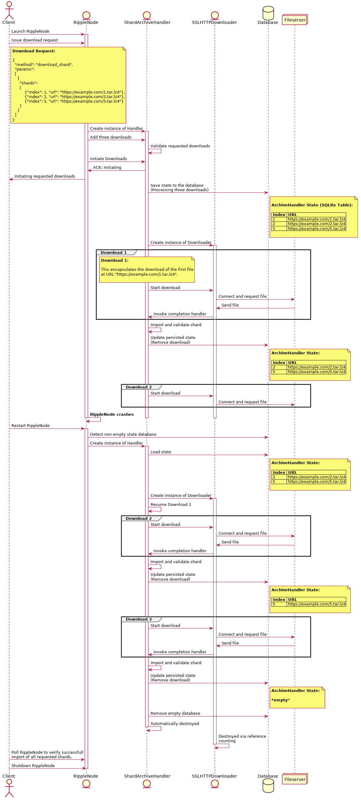
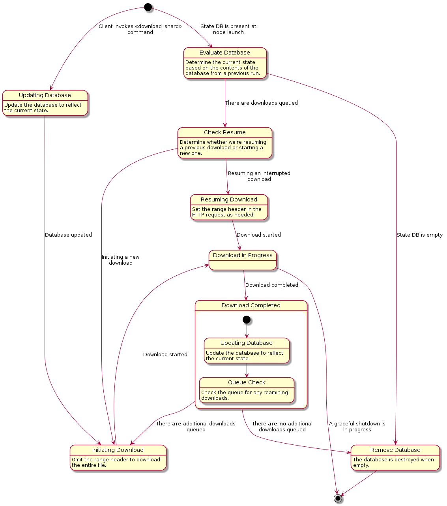

# Shard Downloader

## Overview

This document describes mechanics of the `HTTPDownloader`, a class that performs
the task of downloading shards from remote web servers via HTTP. The downloader
utilizes a strand (`boost::asio::io_service::strand`) to ensure that downloads
are never executed concurrently. Hence, if a download is in progress when
another download is initiated, the second download will be queued and invoked
only when the first download is completed.

## Motivation

In March 2020 the downloader was modified to include some key features:

- The ability to stop downloads during a graceful shutdown.
- The ability to resume partial downloads after a crash or shutdown.

This document was created to document the changes introduced by this change.

## Classes

Much of the shard downloading process concerns the following classes:

- `HTTPDownloader`

   This is a generic class designed for serially executing downloads via HTTP.

- `ShardArchiveHandler`

   This class uses the `HTTPDownloader` to fetch shards from remote web servers.
   Additionally, the archive handler performs validity checks on the downloaded
   files and imports the validated files into the local shard store.

   The `ShardArchiveHandler` exposes a simple public interface:

   ```C++
   /** Add an archive to be downloaded and imported.
   @param shardIndex the index of the shard to be imported.
   @param url the location of the archive.
   @return `true` if successfully added.
   @note Returns false if called while downloading.
   */
   bool
   add(std::uint32_t shardIndex, std::pair<parsedURL, std::string>&& url);

   /** Starts downloading and importing archives. */
   bool
   start();
   ```

   When a client submits a `download_shard` command via the RPC interface, each
   of the requested files is registered with the handler via the `add` method.
   After all the files have been registered, the handler's `start` method is
   invoked, which in turn creates an instance of the `HTTPDownloader` and begins
   the first download. When the download is completed, the downloader invokes
   the handler's `complete` method, which will initiate the download of the next
   file, or simply return if there are no more downloads to process. When
   `complete` is invoked with no remaining files to be downloaded, the handler
   and downloader are not destroyed automatically, but persist for the duration
   of the application to assist with graceful shutdowns.

- `DatabaseBody`

   This class defines a custom message body type, allowing an
   `http::response_parser` to write to an SQLite database rather than to a flat
   file. This class is discussed in further detail in the Recovery section.

## Graceful Shutdowns & Recovery

This section describes in greater detail how the shutdown and recovery features
of the downloader are implemented in C++ using the `boost::asio` framework.

##### Member Variables:

The variables shown here are members of the `HTTPDownloader` class and
will be used in the following code examples.

```c++
std::unique_ptr<HTTPStream> stream_;
std::condition_variable     c_;
std::atomic<bool>           stop_;
```

### Graceful Shutdowns

##### Thread 1:

A graceful shutdown begins when the `stop()` method of the
`ShardArchiveHandler` is invoked:

```c++
void
ShardArchiveHandler::stop()
{
    std::lock_guard<std::mutex> lock(m_);

    if (downloader_)
    {
        downloader_->stop();
        downloader_.reset();
    }

    stopped();
}
```

Inside of `HTTPDownloader::stop()`, if a download is currently in progress,
the `stop_` member variable is set and the thread waits for the
download to stop:

```c++
void
HTTPDownloader::stop()
{
    std::unique_lock lock(m_);

    stop_ = true;

    if(sessionActive_)
    {
        // Wait for the handler to exit.
        c_.wait(lock,
            [this]()
            {
                return !sessionActive_;
            });
    }
}
```

##### Thread 2:

The graceful shutdown is realized when the thread executing the download polls
`stop_`  after this variable has been set to `true`. Polling occurs
while the file is being downloaded, in between calls to `async_read_some()`. The
stop takes effect when the socket is closed and the handler function (
`do_session()` ) is exited.

```c++
void HTTPDownloader::do_session()
{

   // (Connection initialization logic) . . .


   // (In between calls to async_read_some):
   if(stop_.load())
   {
       close(p);
       return exit();
   }

   // . . .

   break;
}
```

### Recovery

Persisting the current state of both the archive handler and the downloader is
achieved by leveraging an SQLite database rather than flat files, as the
database protects against data corruption that could result from a system crash.

##### ShardArchiveHandler

Although `HTTPDownloader` is a generic class that could be used to download a
variety of file types, currently it is used exclusively by the
`ShardArchiveHandler` to download shards. In order to provide resilience, the
`ShardArchiveHandler` will use an SQLite database to preserve its current state
whenever there are active, paused, or queued downloads. The `shard_db` section
in the configuration file allows users to specify the location of the database
to use for this purpose.

###### SQLite Table Format

| Index | URL                                 |
|:-----:|:-----------------------------------:|
| 1     | ht<span />tps://example.com/1.tar.lz4 |
| 2     | ht<span />tps://example.com/2.tar.lz4 |
| 5     | ht<span />tps://example.com/5.tar.lz4 |

##### HTTPDownloader

While the archive handler maintains a list of all partial and queued downloads,
the `HTTPDownloader` stores the raw bytes of the file currently being
downloaded. The partially downloaded file will be represented as one or more
`BLOB` entries in an SQLite database. As the maximum size of a `BLOB` entry is
currently limited to roughly 2.1 GB, a 5 GB shard file for instance will occupy
three database entries upon completion.

###### SQLite Table Format

Since downloads execute serially by design, the entries in this table always
correspond to the contents of a single file.

| Bytes  | Size       | Part |
|:------:|:----------:|:----:|
| 0x...  | 2147483647 | 0    |
| 0x...  | 2147483647 | 1    |
| 0x...  | 705032706  | 2    |

##### Config File Entry
The `download_path` field of the `shard_db` entry is used to determine where to
store the recovery database. If this field is omitted, the `path` field will be
used instead.

```dosini
# This is the persistent datastore for shards. It is important for the health
# of the ripple network that rippled operators shard as much as practical.
# NuDB requires SSD storage. Helpful information can be found here
# https://ripple.com/build/history-sharding
[shard_db]
type=NuDB
path=/var/lib/rippled/db/shards/nudb
download_path=/var/lib/rippled/db/shards/
max_historical_shards=50
```

##### Resuming Partial Downloads
When resuming downloads after a shutdown, crash, or other interruption, the
`HTTPDownloader` will utilize the `range` field of the HTTP header to download
only the remainder of the partially downloaded file.

```C++
auto downloaded = getPartialFileSize();
auto total = getTotalFileSize();

http::request<http::file_body> req {http::verb::head,
  target,
  version};

if (downloaded < total)
{
  // If we already downloaded 1000 bytes to the database,
  // the range header will look like:
  // Range: "bytes=1000-"
  req.set(http::field::range, "bytes=" + to_string(downloaded) + "-");
}
else if(downloaded == total)
{
  // Download is already complete. (Interruption must
  // have occurred after file was downloaded but before
  // the state file was updated.)
}
else
{
  // The size of the partially downloaded file exceeds
  // the total download size. Error condition. Handle
  // appropriately.
}
```

##### DatabaseBody

Previously, the `HTTPDownloader` leveraged an `http::response_parser`
instantiated with an `http::file_body`. The `file_body` class declares a nested
type, `reader`, which does the task of writing HTTP message payloads
(constituting a requested file) to the filesystem. In order for the
`http::response_parser` to interface with the database, we implement a custom
body type that declares a nested `reader` type which has been outfitted to
persist octects received from the remote host to a local SQLite database. The
code snippet below illustrates the customization points available to
user-defined body types:

```C++
/// Defines a Body type
struct body
{
    /// This determines the return type of the `message::body` member function
    using value_type = ...;

    /// An optional function, returns the body's payload size (which may be
    /// zero)
    static
    std::uint64_t
    size(value_type const& v);

    /// The algorithm used for extracting buffers
    class reader;

    /// The algorithm used for inserting buffers
    class writer;
}

```
Note that the `DatabaseBody` class is specifically designed to work with `asio`
and follows `asio` conventions.

The method invoked to write data to the filesystem (or SQLite database in our
case) has the following signature:

```C++
std::size_t
body::reader::put(ConstBufferSequence const& buffers, error_code& ec);
```

## Sequence Diagram

This sequence diagram demonstrates a scenario wherein the `ShardArchiveHandler`
leverages the state persisted in the database to recover from a crash and resume
the requested downloads.



## State Diagram

This diagram illustrates the various states of the Shard Downloader module.


