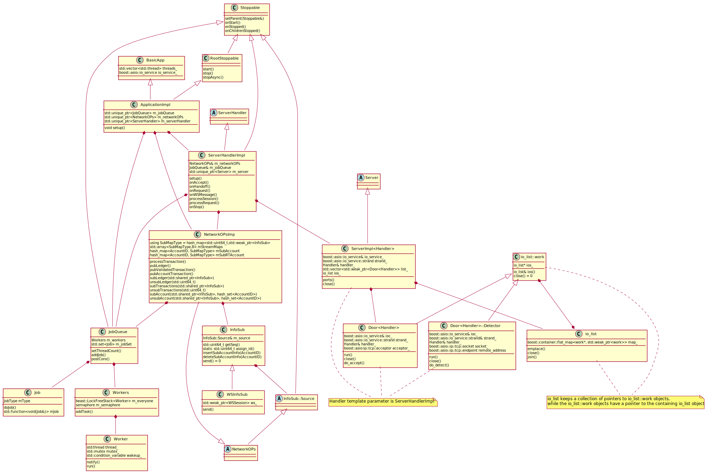
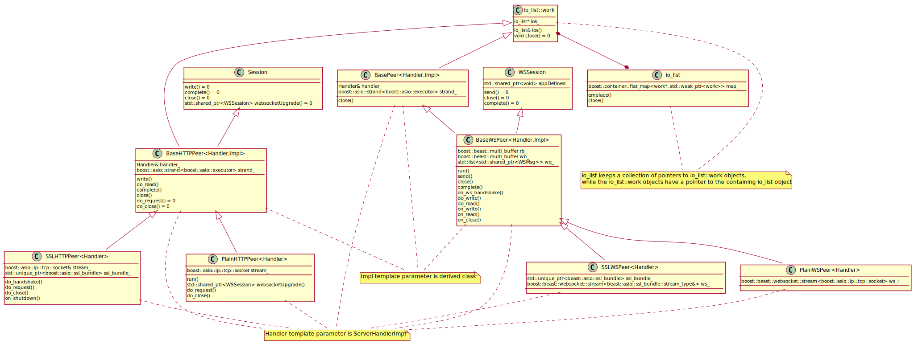
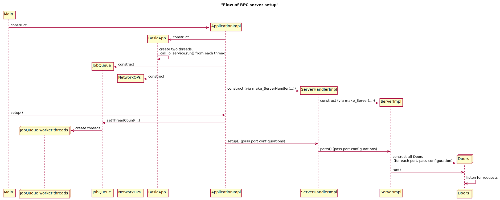
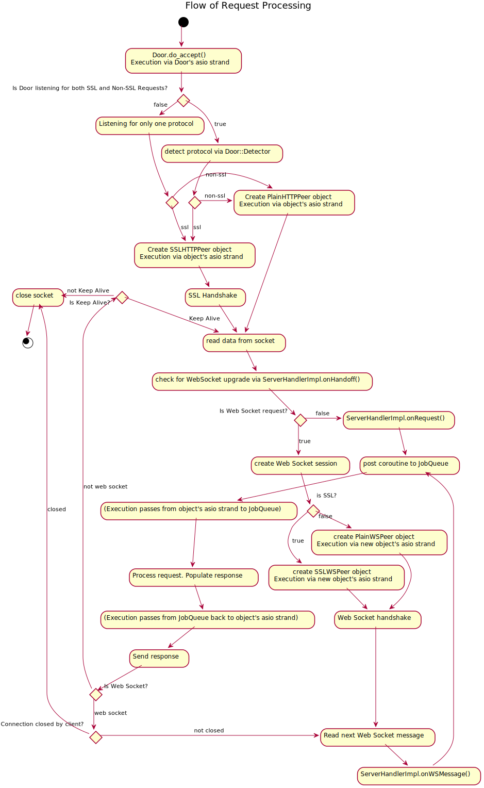
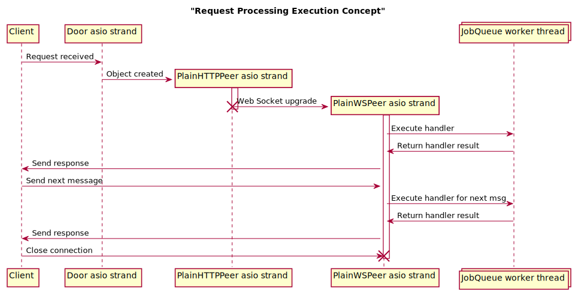

## Classes

The following diagrams show the main classes involved in the RPC subsystem,
their inheritance relationships, and main functions and data members involved in
RPC. This diagram is only meant to show the relationships between classes and
their main responsibilities with respect to RPC. Many data members and methods
are ommitted, as well as arguments to methods and return types. This diagram is meant
to give a high level picture of the classes involved in RPC, and should not be
used in place of doxygen or reading the header files.

A line terminated with an arrow at one end represents an inheritance
relationship, where the arrow points to the base class. A line terminated with a
diamond represents a composition relationship, where the class on the diamond
side contains the other class as a member. This composition relationship can be
by value, reference or pointer, and also reflects if one class is contained
within a collection owned by another class. In this manner, there can be
circular composition relationships; for instance, io_list::work contains a
pointer to io_list, whereas io_list has a container that holds weak pointers to
io_list::work objects.

Throughout this document, the term "connection object" or "connection class" is
used to refer to the objects/classes that manage a single client connection.
The concrete, runtime type of these objects is one of
PlainHTTPPeer, SSLHTTPPeer, PlainWSPeer, and SSLWSPeer.

### Door

The Door class is the entry point into the RPC subsystem, and is responsible for
managing a listening port. The door uses a boost::asio::io_service::strand to
perform asynchronous I/O. The strand serializes execution of all posted
callbacks. The function do_accept() runs a loop that listens for requests. When
a request arrives, the Door creates either SSLHTTPPeer or PlainHTTPPeer object,
which takes over the handling of the request. The Door then listens for additional
requests. Each Door allows for multiple protocols.

### Door::Detector

The Detector class, which is nested inside the Door class, is used to detect
whether a request is using SSL or not, by analyzing the bytes of the request.
It is only necessary for Doors that are listening for both SSL and non-SSL requests.

### Session

Session is the base class of all non Web Socket connections. The class is
abstract and only implements two write() methods, which both call other,
non-implemented write methods. The concrete runtime class of a Session object is
either SSLHTTPPeer or PlainHTTPPeer. Session contains a method websocketUpgrade(),
which creates an appropriate class that derives from WSSession. For each request
that arrives, a class that derives from Session is created (PlainHTTPPeer or
SSLHTTPPeer). When the HTTP/S request is read, if the request is a web socket
upgrade, websocketUpgrade() is called to create a new object to manage the web
socket connection. The close() method closes the connection, while the
complete() method attempts to read the next request; complete() is only used
when the HTTP/S request contains the Keep Alive flag. write() writes data to the
socket, sending it to the client.

### WSSession

WSSession is a base class of all web socket connections. The class is abstract,
and the actual runtime class must be SSLWSPeer or PlainWSPeer. These objects are
always created from calling websocketUpgrade() on a Session object. close()
closes the connection. complete() waits for the next request to arrive(). send()
sends data to the client. The data member appDefined (shared pointer to void),
is always a shared pointer to WSInfoSub object, which is used for subscriptions.

### BaseWSPeer, BaseHTTPPeer, BasePeer

These are all abstract classes. All contain some pure virtual functions. They
all contain references to a Handler object (the template parameter), which is
always ServerHandlerImpl. The Impl template parameter is always the conrete
runtime class (SSLHTTPPeer, PlainHTTPPeer, SSLWSPeer, PlainWSPeer).

### PlainHTTPPeer, SSLHTTPPeer

These are the concrete, runtime classes that inherit from Session. Both can be
upgraded to a web socket connection (via websocketUpgrade()).
PlainHTTPPeer.websocketUpgrade() creates a PlainWSPeer object, whereas
SSLHTTPPeer.websocketUpgrade() creates a SSLWSPeer object. Both of these objects
contain the socket (or a reference to it) as a data member, for reading and
writing data. These objects contain a reference to a Handler object (which is
ServerHandlerImpl), which they use to process the request once the data has been
read.

### PlainWSPeer, SSLWSPeer

These are the concrete, runtime classes that inherit from WSSession. They both
contain a data member of type boost::beast::websocket::stream<T>, which wraps
the socket, and is used for reading and writing data. These objects contain a
reference to a Handler object (which is ServerHandlerImpl), which they use to
process the request once the data has been read.

### WSInfoSub and InfoSub

WSInfoSub derives from InfoSub, and is used by NetworkOPsImp to send data to a
client subscribed to a stream. NetworkOPsImp has several collections of InfoSub
objects, each corresponding to a client subscription. Each InfoSub object has a unique sequence
number. InfoSub contains a static method, assign_id(), that incremements a
static atomic 64 bit int, and returns the value. This value is the sequence
number. This sequence number is used as the key for the various maps in
NetworkOPsImp. WSInfoSub contains a weak pointer to the containing WSSession object.
When the WSSession object is destroyed (by the client closing the connection),
the corresponding WSInfoSub object will be destroyed as well.

### NetworkOPsImp

NetworkOPsImp derives from NetworkOPs (an abstract class). NetworkOPsImp is
performs many functions. processTransaction() is used to process and submit (if
valid) a transaction to the network, to be included in a future ledger. This is
used by the submit RPC. NetworkOPsImp also manages subscriptions, and has
various subscribe/unsubscribe methods, as well as publishing methods.
NetworkOPsImp has several collections of weak pointers to InfoSub objects (which
are actually WSInfoSub objects), which it uses to send data to subscribing
clients. If the web socket connection was closed by the client, the weak pointer
will have expired, at which point NetworkOPsImp will remove the weak pointer
from its collections. There is a map for each stream, as well as two maps that map
an AccountID to InfoSub objects subscribed to that account.

### InfoSub::Source

InfoSub::Source is an abstract class, with many pure virtual methods for
subscribing and unsubscribing from various streams. It is implemented by
NetworkOPsImp.

### io_list

io_list is a class that manages a set of objects performing asynchronous I/O.
It contains a collection of io_list::work objects, which represent the work
being performed. emplace() adds an object to the collection. close() attempts to
close all associated asynchronous I/O operations (by calling the close() method
of each io_list::work object contained in the collection). join() waits for all async I/O
operations to close. SeverImpl contains io_list as a data member, which it uses
on shutdown to close all connections and Doors.

### io_list::work

io_list::work is an abstract class implemented by BaseHTTPPeer and BasePeer.
Consequently, all of the concrete classes representing connections
(PlainHTTPPeer, SSLHTTPPeer, PlainWSPeer, SSLWSPeer) inherit from io_list::work.
io_list::work has a close() method, which will close the client connection.
Door and Door::Detector also inherit from io_list::work, and their close()
methods close the port that the Door is listening on.

### ServerImpl

ServerImpl inherits from Server (abstract class), and
is responsible for managing all of the Door objects that are
listening for requests. The ports() method takes in configuration information
and creates all necessary Door objects, which begin listening.
The close() method asynchronously closes all of the
Door objects, as well as any of the Session or WSSession objects that are
processing requests. The Door, Session and WSSession objects are contained in an
io_list that is a data member of ServerImpl. ServerImpl can handle several different protocols via the
Door objects. The Handler template parameter is ServerHandlerImpl, which
ServerImpl notifies when all asynchronous I/O operations have successfully
closed. There is only one ServerImpl object in the application; ServerImpl also
handles the Peer protocol.

### ServerHandlerImpl

ServerHandlerImpl inherits from ServerHandler (abstract class), and serves as a
middle layer between I/O logic (Door and ServerImpl) and the application logic
(posting the JobQueue, handling logic errors, etc). ServerHandlerImpl is
responsible for handling the RPC request once it has been deserialized, as well
as managing ServerImpl, which ServerHandlerImpl contains as a data member.
setup() calls the ports() method of ServerImpl, opening
the ports for listening. onHandoff() determines whether an HTTP request should
be upgraded to a web socket request, or is a peer request, and creates the
necessary objects. onRequest() and onWSMessage() post a coroutine to the
JobQueue, which executes the appropriate RPC handler. ServerHandlerImpl is also
responsible for handling various errors, such as incorrect JSON parameters, requests
to the wrong port, errors posting to the JobQueue, etc.

### ApplicationImpl

ApplicationImpl implements Application, and is responsible for running the
entire rippled application. Application instantiates many important, high level
objects, such as ServerHandlerImpl, NetworkOPsImp, JobQueue and LedgerMaster.
ApplicationImpl manages the order of creation for these objects, as well as the
logic of shutting them all down. ApplicationImpl is the glue between the various
parts of rippled.

### Stoppable

Stoppable provides an API for starting and stopping objects and their children.
There are numerous dependent relationships amongst the components that must be
started and stopped in a specific sequence. See src/core/Stoppable.h for more
details.

## Web Socket vs REST-JSON

All requests start out as HTTP/S requests. Web Socket connections are created by
sending an HTTP/S request that is a web socket handshake request, for which the
server returns a web socket handshake response.
See [https://en.wikipedia.org/wiki/WebSocket](https://en.wikipedia.org/wiki/WebSocket)
for more details about web socket upgrade requests.

HTTP/S requests can also include a keep alive flag in the header, which will
cause the server to keep the connection open after sending a response, allowing
the client to reuse the connection for additional requests.
See [https://en.wikipedia.org/wiki/HTTP_persistent_connection](https://en.wikipedia.org/wiki/HTTP_persistent_connection)

Web sockets provide additional functionality besides just allowing reuse of the
same connection for future requests/responses. Web sockets allow for
bidirectional streams, where the server can send messages to the client at any
time, and not only in response to a request. This is used by the subscribe RPC
of rippled, and allows clients to receive data whenever an appropriate event
occurs on the server side (for example, a new ledger is validated), without
having to send additional requests to the server.

## RPC Server Startup Flow

The entry point to the rippled application is in app/main/Main.cpp.
The main() function is called first, which calls ripple::run() in the same file.
ripple::run() creates the Application object via make_Application().
Application is an abstract class implemented by ApplicationImpl. ApplicationImpl
derives from BasicApp. BasicApp is very minimal, and contains a vector of
std::thread, as well as the boost::asio::io_service object that is shared by the
the rest of the application. io_service.run() is called from each thread owned
by BasicApp (see execution context for more details about threading and
io_service). The ApplicationImpl constructor instatiates many objects,
including the JobQueue, NetworkOPs and LedgerMaster.

The ApplicationImpl instatiates a data member of type ServerHandler,
passing the JobQueue and NetworkOPs (amongst other classes) via the constructor.
The ServerHandler class is abstract and is
implemented by ServerHandlerImpl. ServerHandlerImpl is the
class responsible for handling all traffic to the rippled server; this includes
RPC requests, as well as relaying messages to the peer overlay network.

The ServerHandlerImpl constructor instantiates a data member of type Server. Server
is an abstract class implemented by ServerImpl, which is a templated class. The
template parameter to ServerImpl is the ServerHandlerImpl class; the ServerImpl
object has a reference to the ServerHandlerImpl object that instantiated it. The
ServerImpl class is responsible for managing the open ports of the rippled
server. No ports are opened at the time of object construction.

After the ApplicationImpl object is constructed (which constructs
ServerHandlerImpl, which constructs ServerImpl), ApplicationImpl::setup() is
called from ripple::run(). ApplicationImpl::setup() calls setup_ServerHandler(),
which parses the configuration file for port configuration information.
The listening ports are "universal", in that a single port can listen for
multiple protocols. For each port, the config file contains a set of key/value
pairs that specify where to listen (ip and port number), as well as protocols to
listen for. See the comments in the config file for more details.
ApplicationImpl::setup() then calls ServerHandlerImpl::setup(), passing in the
parsed port configuration. ServerHandlerImpl::setup() calls the ports() method
of the ServerImpl data member. ServerImpl::ports() actually opens the specified
ports for listening.

Each port corresponds to an instance of the class Door<Handler>, where Handler
is ServerHandlerImpl. The ServerImpl class has
a data member of type io_list, which is a collection that contains weak pointers
to all of the Door objects.
ServerImpl::ports() creates all necessary Door objects. The Door objects store
the protocols which they are listening for, and each create a
boost::asio::ip::tcp::acceptor object that begins listening on the specified
port. ServerImpl::ports() calls the run() method on each Door object.
Door::run() calls Door::do_accept() via boost::asio::spawn; Door::do_accept() is
a function that listens for requests in a loop, handling each request as it
arrives. See execution context and request handling flow for more details.

## RPC Request Handling Flow

Each Door object (which corresponds to a listening port) is listening for
incoming requests. When a request arrives, the Door object attempts to create
the appropriate object to manage the connection. If the Door is listening for
SSL requests, a SSLHTTPPeer object is created. If the Door is listening for non
SSL requests, a PlainHTTPPeer object is created. If the Door is listening for
both, a Door::Detector object is created, which analyzes the bytes of the
message to detect whether the request is SSL or not.

Next, the run() method of the created object is called, passing execution to the
asio strand of the created object. If the request uses SSL,
an SSL handshake is performed. The request data is then read from the socket.
Then, the software calls ServerHandlerImpl.onHandoff(). In this function, the
software checks whether the request is a WebSocket upgrade. If so, either a
SSLWSPeer object (if the initial request was SSL) or a PlainWSPeer object is
created, and the resources from the original SSLHTTPeer/PlainHTTPPeer object are moved
into the new object. The original object is destroyed, and the new object
subsequently handles the connection. Execution passes to the new object's asio
strand.

At this point, regardless of the connection type, the software posts a coroutine
to the JobQueue, to be executed at some later time by one of the JobQueue's
worker threads. This coroutine processes the
request and populates the response via the appropriate handler.
After, execution returns to boost asio, where the response is written to the
socket. If the connection is a web socket connection, and the
client has not closed the connection, the software asynchronously reads the next
message (via boost asio). If the connection is not a web socket connection, the
software checks for the HTTP Keep Alive flag: if the HTTP Keep Alive flag is set, the
software attempts to read the next message; otherwise, the connection is closed.
Note, a subsequent http/s request could upgrade the connection to a web socket
connection.

## RPC Subscription Flow

Whether web socket or http/s, RPC commands follow a request/response pattern:
client sends a request, and then receives a response. Web Sockets (and http/s
with Keep Alive), allows the client and server to reuse the same connection.
However, there is a subscribe RPC, which is exclusive to Web Socket connections.
Subscribe allows a client to subscribe to one or more streams of data; for
example, a client could subscribe to the transactions stream, which would cause
the rippled software to continuously send all validated transactions to the client. A
client could also subscribe to transactions that affect a specified set of
accounts, as opposed to all transactions. See
[https://xrpl.org/subscribe.html](https://xrpl.org/subscribe.html) for more details
about the subscribe RPC and the possible subscription streams.

A subscribe RPC initially follows the same flow as normal Web Socket RPCs, until
the handler is executed. When the connection is upgraded to Web Socket, the software
creates a WSInfoSub object, which holds a weak pointer to the WSSession object
(the object responsible for reading/writing data to/from the client). The
WSSession object also holds a shared pointer to the WSInfoSub object. When the
client closes the connection, the WSSession object will be destroyed, which
causes destruction of the WSInfoSub object.

When the subscribe handler is executed, the handler calls the appropriate subscription
method on the NetworkOPs object, passing the WSInfoSub object as a parameter.
The NetworkOPs object is responsible for managing subscriptions, and has methods
to add/remove subscriptions, as well as methods to publish data to those
subscriptions. NetworkOPsImp keeps several collections of weak pointers to InfoSub
objects, which it uses to send data to the client. Specifically, NetworkOPsImp
contains an array of maps (one map for each type of stream), each of which maps
a 64 bit integer to a weak pointer to an InfoSub object. Each InfoSub object has
a unique sequence number (a 64 bit integer) that is generated when the object is
instatiated. This sequence number is the key in the previously mentioned maps,
and is used by the unsubscribe methods to delete the InfoSub object from the
appropriate map. When an event occurs that pertains to a specific stream (for
instance, when consensus declares a new validated ledger), NetworkOPs iterates
through the corresponding map and sends data to each client in that map (via the
InfoSub objects, which contain pointers to the WSSession object).
If the connection has been closed by the client, the weak pointer will have expired,
in which case NetworkOpsImp removes the entry from the map.

For subscriptions to transactions that affect particular accounts, NetworkOPsImp
contains additional datastructures. Specifically, NetworkOPsImp contains a map
that maps an AccountID to another map of type uint64 -> InfoSub; this allows
retrieval of all client connections subscribed to a particular account. When a
transaction is included in a validated ledger, NetworkOPsImp determines which
accounts this transaction affects. For each account affected, NetworkOPsImp
looks up the corresponding map, and sends data to every InfoSub object in that
map.

## Execution Concept
The RPC subsytem uses boost::asio to perform asynchronous I/O. BasicApp contains
a boost::asio::io_service object as a data member; upon instantiation, BasicApp
creates several threads, which each call io_service.run() (a blocking call).
This means that boost::asio will use each of these threads to execute callbacks
posted to the io_service. Currently, the number of threads used is 1 or 2, and is a
configuration parameter. The default is 2.

This io_service is passed by reference to all objects responsible for I/O.
The io_service is used by the Door objects to listen for and handle requests.
Each door object creates a strand (boost::asio::io_service::strand), and uses the strand to perform asynchronous
I/O. All callbacks posted to a strand are serialized, as opposed to executed
concurrently. Meaning, callbacks corresponding to different Door objects can
execute concurrently, but callbacks corresponding to the same Door object
cannot. See the Strand section for more details.

When a request is received, the appropriate connection object is created
(see request processing flow diagram for more details). This connection object
is passed the io_service, which it uses to create its own strand. The Door then
goes on to listen for additional requests, while the connection object processes
the request that was received. The connection
object uses its strand to perform initial processing of the request (perform ssl
handshake, read data, etc). If the connection is upgraded to a web socket
connection, the software creates a new connection object (SSLWSPeer or
PlainWSPeer), which creates its own strand. When the connection
object determines which RPC handler to call, a coroutine is posted to the
JobQueue via postCoro(); postCoro() returns immediately, and the handler is
executed by the JobQueue at a later time. Coroutines have a yield functionality,
where execution is suspended and returned to the caller, to be resumed at a
later time. However, nearly all RPC handlers do not yield (with the exception of
ripple_path_find), and execute to completion. See rpc/README.md and
rpc/handlers/RipplePathFind.cpp for more details about coroutines.

The JobQueue manages a group of worker threads, which execute jobs posted to the
JobQueue. The number of threads is a configuration parameter, that defaults to
the minimum of either hardware concurrency + 2, or 6.
hardware_concurrency is implementation specific, but is generally a function of
the number of cores. The JobQueue also keeps track of the type of jobs that are
posted, and imposes a limit on the number of jobs of a given type being
processed at one time. If the limit is exceeded, jobs of that type are deferred,
and will be processed once other jobs of that type finish processing.
The JobQueue executes many jobs besides RPC jobs. The limit for the number of
RPC jobs being executed at one time is equal to std::numeric_limits<int>::max().

When the JobQueue executes the handler, the response is populated, and the data
is written to the socket (and sent) via the connection object's strand (meaning
the write is executed by asio, not the JobQueue). For web socket connections (or
http/s with Keep Alive flag),
the coroutine on the JobQueue calls complete() on the connection object, which
initiates an async read (via the object's asio strand) on the socket, to read the next request.
At this point, the JobQueue has finished execution of the coroutine,
and execution will be resumed by asio when the next request arrives. For non web
socket connections, the coroutine on the JobQueue calls close() on the
connection object, which closes the socket via asio.

### Strand

boost::asio::io_service::strand allows serialization of posted callbacks. All
callbacks posted to a strand will be executed in FIFO order, with no possibility
of concurrent execution. Each connection object has its own strand, so each
operation is executed in the order they are posted. When the callbacks are
chained together (for example, complete() posts do_read(), which posts
on_read()), the strand is not necessary to force sequential execution. At other
times though, the callbacks are not chained together; for instance, after the
handler is executed, the coroutine posted to the JobQueue calls WSSession.send()
and then WSSession.complete(), both of which post callbacks to the strand. The
callback posted by send() must execute before callback posted by complete(), and
the strand guarantees this; without the strand, the callbacks could execute out
of order or concurrently.

Many methods of the connection objects use stand.running_in_this_thread() to
detect if the current function is being executed by the strand. If
running_in_this_thread() returns false, the current function posts itself as a
callback to the strand and returns without performing any other work. This is
used to return execution to asio when methods are called from the coroutine posted
to the JobQueue; for example, after the handler has been executed, the coroutine
calls send() on the connection object. send() then checks
strand.running_in_this_thread(), which will return false since the function is
being executed by a JobQueue thread, and then posts itself as a callback to the strand, and
returns immediately. When the strand executes send() as a callback,
stand.running_in_this_thread() will return true, and send() will perform the
actual necessary work.

The strand itself is attached to an io_service, which will perform the actual
execution of the callbacks posted to the strand. The strand is just a way of
serializing the execution of callbacks, and the threads in BasicApp that call
io_service.run() are the threads that actually execute the posted callbacks.

Below is a diagram detailing how execution passes between various asio strands
and the JobQueue threads. The diagram uses a web socket connection as an example, where
the client sends two requests and then closes the connection. Note, all of the
asio strands are backed by the same io_service, which uses 2 threads to execute
handlers. These threads are separate from the JobQueue threads. The
PlainHTTPPeer object is destroyed when the connection is upgraded to web socket.

### Lifetime of the Session, WSSession and Door objects

When a Door receives a request, the appropriate connection object is created
(SSLHTTPPeer or PlainHTTPPeer) as a shared pointer, and the run() method of the
object is called. This run method initiates a chain of callbacks executed by
asio, where each callback posts the next callback via boost::asio::spawn (using
the connection object's strand, which serializes execution of the callbacks).
For instance, run() posts do_handshake() as a callback, and do_handshake() posts
do_read() as a callback, and so on.

These callbacks capture a shared pointer to the object via shared_from_this().
The coroutine posted to the JobQueue captures a shared pointer to the object as
well. When the connection is closed by the server, a final callback is posted,
which does not post any additional callbacks. Once the final callback is
executed, the reference count of the shared pointer goes to zero and the object
is destroyed. Each callback also checks if the client closed the connection, at
which point resources will be cleaned up, and the chain of callbacks will be
terminated, triggering destruction of the object. Lastly, if a connection is
upgraded from HTTP to web socket, the chain of callbacks on the original object
is terminated (no additional callbacks posted), and the newly created web socket
object begins execution of a chain of callbacks.

The Door object also follows this same pattern of creating a chain of callbacks,
all of which capture a shared pointer via shared_from_this(). When the Door is
closed, the chain of callbacks is broken, and the object is destroyed.

