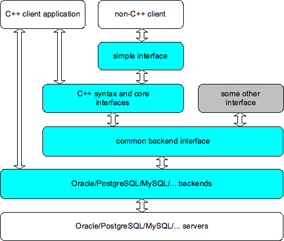

# Structure

The picture below presents the structure of the library, together with its clients and servers.
The boxes filled with cyan represent components that are part of the library distribution.



The SOCI library is extensible in the following ways:

* More backends can be added to target various database servers.
* More interfaces can be defined on top of common backend interface.
* Other languages can use the [simple interface](interfaces.md), which was designed specifically for the "C" calling convention to ensure easy binding.

The core part of the library and the backend interface definition are placed in the `core` directory of the library distribution. The `soci-backend.h` file is an internal abstract interface to the actual backends, which are needed to perform operations on the given database server. Normally, the C++ client program needs to interface with the `soci.h` header and the header(s) relevant to the given backend(s) (for example, `soci-oracle.h`), although with dynamic backend loading this can be avoided. It is possible for the same program to use many backends at the same time.

Everything in SOCI is declared in the namespace `soci`. All code examples presented in this documentation assume that your code begins with something like:

```cpp
#include "soci.h"
// other includes if necessary

using namespace soci;

// ...
```

Note: In simple programs, `#include` for the relevant backend is needed only in the file where the `session` object is created with explicit name of the backend factory. The example program on the [previous page](index.html) shows the appropriate `#include` directive for the Oracle backend. It is also possible to name backends at run-time as part of the connection string, in which case no backend-specific `#include` directive is necessary.
