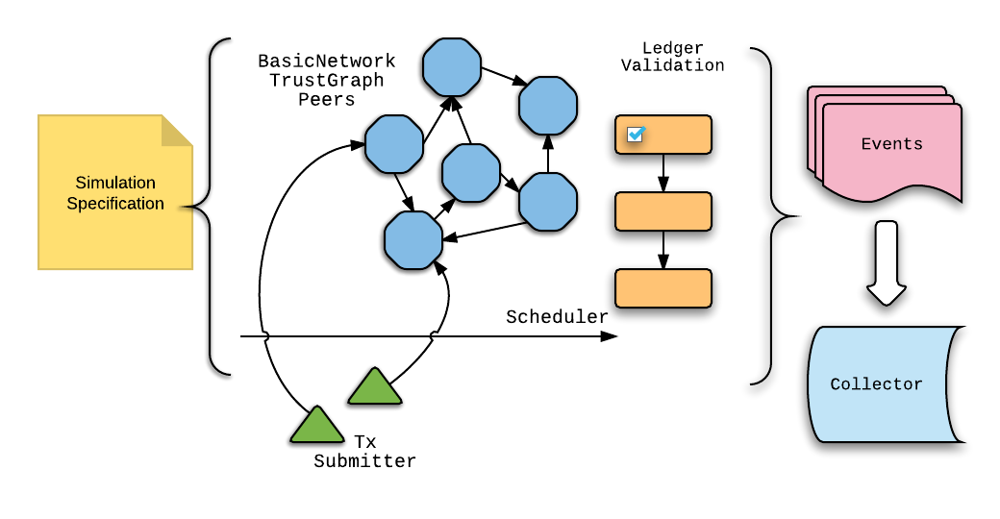
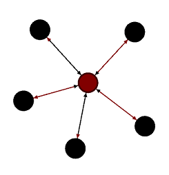

# Consensus Simulation Framework

The Consensus Simulation Framework is a set of software components for
describing, running and analyzing simulations of the consensus algorithm in a
controlled manner. It is also used to unit test the generic Ripple consensus
algorithm implementation. The framework is in its early stages, so the design
and supported features are subject to change.

## Overview

The simulation framework focuses on simulating the core consensus and validation
algorithms as a [discrete event
simulation](https://en.wikipedia.org/wiki/Discrete_event_simulation). It is
completely abstracted from the details of the XRP ledger and transactions. In
the simulation, a ledger is simply a set of observed integers and transactions
are single integers. The consensus process works to agree on the set of integers
to include in the next ledger.



The diagram above gives a stylized overview of the components provided by the
framework. These are combined by the simulation author into the simulation
specification, which defines the configuration of the system and the data to
collect when running the simulation. The specification includes:

- A collection of [`Peer`s](./Peer.h) that represent the participants in the
  network, with each independently running the consensus algorithm.
- The `Peer` trust relationships as a `TrustGraph`. This is a directed graph
  whose edges define what other `Peer`s a given `Peer` trusts.  In other words,
  the set of out edges for a `Peer` in the graph correspond to the UNL of that
  `Peer`.
- The network communication layer as a `BasicNetwork`. This models the overlay
  network topology in which messages are routed between `Peer`s. This graph
  topology can be configured independently from the `TrustGraph`.
- Transaction `Submitter`s that model the submission of client transactions to
  the network.
- `Collector`s that aggregate, filter and analyze data from the simulation.
  Typically, this is used to monitor invariants or generate reports.

Once specified, the simulation runs using a single `Scheduler` that manages the
global clock and sequencing of activity. During the course of simulation,
`Peer`s generate `Ledger`s and `Validation`s as a result of consensus,
eventually fully validating the consensus history of accepted transactions. Each
`Peer` also issues various `Event`s during the simulation, which are analyzed by
the registered `Collector`s.

## Example Simulation
Below is a basic simulation we can walk through to get an understanding of the
framework. This simulation is for a set of 5 validators that aren't directly
connected but rely on a single hub node for communication.



Each Peer has a unique transaction submitted, then runs one round of the
consensus algorithm.

```c++
Sim sim;
PeerGroup validators = sim.createGroup(5);
PeerGroup center = sim.createGroup(1);
PeerGroup network = validators + center;
center[0]->runAsValidator = false;

validators.trust(validators);
center.trust(validators);

using namespace std::chrono;
SimDuration delay = 200ms;
validators.connect(center, delay);

SimDurationCollector simDur;
sim.collectors.add(simDur);

// prep round to set initial state.
sim.run(1);

// everyone submits their own ID as a TX and relay it to peers
for (Peer * p : validators)
    p->submit(Tx(static_cast<std::uint32_t>(p->id)));

sim.run(1);

std::cout << (simDur.stop - simDur.start).count() << std::endl;
assert(sim.synchronized());
```

### `Sim` and `PeerGroup`

```c++
Sim sim;
PeerGroup validators = sim.createGroup(5);
PeerGroup center = sim.createGroup(1);
PeerGroup network = validators + center;
center[0]->runAsValidator = false;

```

The simulation code starts by creating a single instance of the [`Sim`
class](./Sim.h). This class is used to manage the overall simulation and
internally owns most other components, including the `Peer`s, `Scheduler`,
`BasicNetwork` and `TrustGraph`.  The next two lines create two differ
`PeerGroup`s of size 5 and 1 . A [`PeerGroup`](./PeerGroup.h) is a convenient
way for configuring a set of related peers together and internally has a vector
of pointers to the `Peer`s which are owned by the `Sim`. `PeerGroup`s can be
combined using `+/-` operators to configure more complex relationships of nodes
as shown by `PeerGroup network`.  Note that each call to `createGroup` adds that
many new `Peer`s to the simulation, but does not specify any trust or network
relationships for the new `Peer`s.

Lastly, the single `Peer` in the size 1 `center` group is switched from running
as a validator (the default) to running as a tracking peer. The [`Peer`
class](./Peer.h) has a variety of configurable parameters that control how it
behaves during the simulation.

## `trust` and `connect`

```c++
validators.trust(validators);
center.trust(validators);

using namespace std::chrono;
SimDuration delay = 200ms;
validators.connect(center, delay);
```

Although the `sim` object has accessible instances of
[TrustGraph](./TrustGraph.h) and [BasicNetwork](./BasicNetwork.h), it is more
convenient to manage the graphs via the `PeerGroup`s.   The first two lines
create a trust topology in which all `Peer`s trust the 5 validating `Peer`s.  Or
in the UNL perspective, all `Peer`s are configured with the same UNL listing the
5 validating `Peer`s. The two lines could've been rewritten as
`network.trust(validators)`.

The next lines create the network communication topology. Each of the validating
`Peer`s connects to the central hub `Peer` with a fixed delay of 200ms.  Note
that the network connections are really undirected, but are represented
internally in a directed graph using edge pairs of inbound and outbound connections.

## Collectors

```c++
SimDurationCollector simDur;
sim.collectors.add(simDur);
```

The next lines add a single collector to the simulation.  The
`SimDurationCollector` is a a simple example collector which tracks the total
duration of the simulation.  More generally, a collector is any class that
implements `void on(NodeID, SimTime, Event)` for all [Events](./events.h)
emitted by a Peer.  Events are arbitrary types used to indicate some action or
change of state of a `Peer`. Other [existing collectors](./collectors.h) measure
latencies of transaction submission to validation or the rate of ledger closing
and monitor any jumps in ledger history.

Note that the collector lifetime is independent of the simulation and is added
to the simulation by reference. This is intentional, since collectors might be
used across several simulations to collect more complex combinations of data. At
the end of the simulation, we print out the total duration by subtracting
`simDur` members.

```c++
std::cout << (simDur.stop - simDur.start).count() << std::endl;
```

## Transaction submission

```c++
// everyone submits their own ID as a TX and relay it to peers
for (Peer * p : validators)
    p->submit(Tx(static_cast<std::uint32_t>(p->id)));
```

In this basic example, we explicitly submit a single transaction to each
validator. For larger simulations, clients can use a [Submitter](./submitters.h)
to send transactions in at fixed or random intervals to fixed or random `Peer`s.

## Run

The example has two calls to `sim.run(1)`.  This call runs the simulation until
each `Peer` has closed one additional ledger.  After closing the additional
ledger, the `Peer` stops participating in consensus.  The first call is used to
ensure a more useful prior state of all `Peer`s. After the transaction
submission, the second call to `run` results in one additional ledger that
accepts those transactions.

Alternatively, you can specify a duration to run the simulation, e.g.
`sim.run(10s)` which would have `Peer`s continuously run consensus until the
scheduler has elapsed 10 additional seconds. The `sim.scheduler.in` or
`sim.scheduler.at` methods can schedule arbitrary code to execute at a later
time in the simulation, for example removing a network connection or modifying
the trust graph.